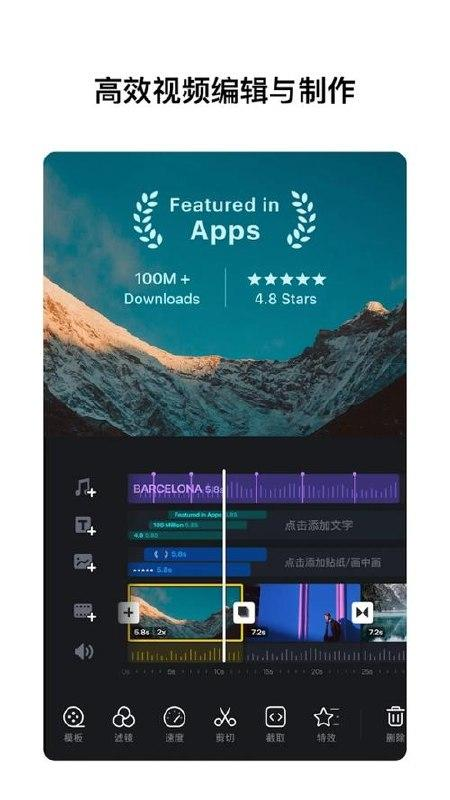
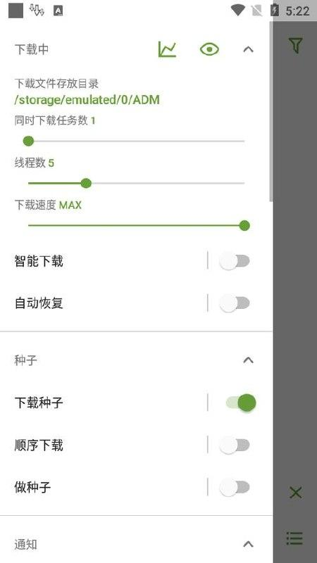
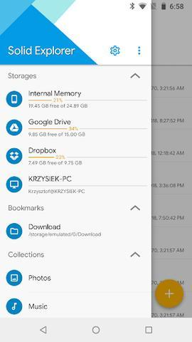
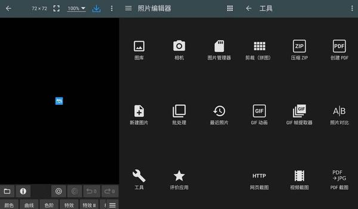
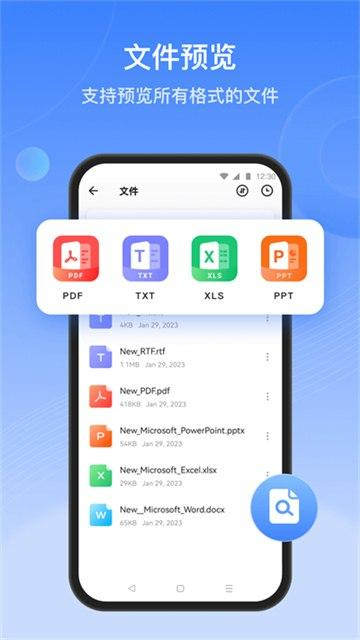

## 3220060

[2026-09-26 18:16] 来自：综合网盘资源频道

名称：3220060 哀鸿：城破十日记 v3.0

描述：明末生存题材文字冒险游戏——你将以第一人称视角见证一名书生的故事，他会误入“狮驼国”，在群妖屠城的十日内努力生存，并在此期间找回记忆、解开关于一位扬州名妓的死亡之谜。 该游戏一半篇章会记叙一段“残酷”的屠城；另一半篇章会追忆一段”唯美“的明末士妓恋情，最终期望给人带来极致的情绪和力量。

夸克网盘：https://pan.quark.cn/s/05f0ab8eb0a7

📁 大小：NG

🏷 标签：#Windows #Windows游戏 #PC游戏 #电脑游戏 #Steam #哀鸿 #城破十日记 #quark

---

## 2362060

[2026-09-26 15:55] 来自：综合网盘资源频道

名称：2362060 CODE VEIN 噬血代码II v2.0.3.0-P2P

描述：与搭档一同探索末日后幻想世界，对上强大的吸血鬼展开死战，跨越时空等级的壮阔故事──交织而成的“戏剧性探索动作RPG”。

夸克网盘：https://pan.quark.cn/s/3a8613dd2011

📁 大小：NG

🏷 标签：#Windows #Windows游戏 #PC游戏 #电脑游戏 #Steam #噬血代码II #quark

---

## 1920490

[2026-09-26 15:27] 来自：综合网盘资源频道

名称：1920490 天外世界：太空人之选 v2.5.11.0-P2P

描述：《天外世界：太空人之选》版本是体验Obsidian Entertainment以及Private Division打造的获奖角色扮演类作品的不二之选。其中包括基础游戏以及所有DLC。这款重新打造的杰出作品优化了游戏性能，适用于最新一代的硬件设备，毫无疑问是《天外世界》的最佳版本。

夸克网盘：https://pan.quark.cn/s/1dc03d31427b

📁 大小：NG

🏷 标签：#Windows #Windows游戏 #PC游戏 #电脑游戏 #Steam #天外世界 #太空人之选 #quark

---

## PowerDirector

[2026-09-26 00:13] 来自：综合网盘资源频道

名称：PowerDirector v16.6.2 威力导演，视频剪辑&制作工具

描述：PowerDirector手机版从台式机带至安卓移动装置！身为市面上最强大的影音创作软件，PowerDirector提供你最便利的随身影音创作。仅需汇入拍摄片段、修剪影片、添加特效和文字，即可导出高清视频或直接上传至YouTube。威力导演内建简易上手的时间轴接口，并支持档案拖放功能，轻滑指尖，即可轻松汇入多个档案，进行分割、修剪并加入多样化特效，快速打造专业十足、绚丽的视频创作。

夸克网盘：https://pan.quark.cn/s/55a3871523f1

📁 大小：983.7MB

🏷 标签：#Android #高级 #剪辑 #视频创作 #解锁 #威力导演 #视频剪辑 #制作工具 #quark

---

## Vidma

[2026-09-26 00:12] 来自：综合网盘资源频道

名称：Vidma Recorder v3.7.45 专业、高清录屏工具、一键截图

描述：Vidma Recorder 是一款专业的高清录屏工具，支持屏幕录制以及一键截图功能，录制画面清晰度高，适配多种手机使用场景，可用于录制游戏画面、课程演示、操作过程等内容，操作简单便捷，能够快速完成屏幕内容捕捉，满足日常录屏和截图的使用需求。

夸克网盘：https://pan.quark.cn/s/a56fa5d81596

📁 大小：26.6MB

🏷 标签：#Android #工具 #高清 #录屏 #课程 #专业 #高清录屏工具 #一键截图 #quark

---

## VN视频编辑

[2026-09-26 00:00] 来自：综合网盘资源频道

名称：VN视频编辑 v2.19.0 无水印视频编辑工具，小白快速上手

描述：VN视频编辑是一款功能强大的无水印视频编辑工具，专为视频剪辑新手设计，轻松快速上手。解锁专业版后，提供海量滤镜、特效、转场及字幕样式，支持多轨道编辑、视频变速、音频提取等高级功能。操作简单直观，无需复杂学习即可制作出专业级视频作品。

夸克网盘：https://pan.quark.cn/s/76037ed0d12d

📁 大小：2.8GB

🏷 标签：#Android #视频编辑 #工具 #专业版 #VN视频编辑 #无水印视频编辑工具 #小白快速上手 #quark

---

## 2445690

[2026-09-25 18:02] 来自：综合网盘资源频道

名称：2445690 失落城堡2 v1.0.1.1_8

描述：失落城堡2是一款2D卡通横版Rogue-Lite游戏。探寻丰富宝物道具强化自己，精通各类武器玩出花样，挑战强大魔物展现实力。新的冒险正召唤着宝藏猎人们！

夸克网盘：https://pan.quark.cn/s/616c4d2e66f9

📁 大小：NG

🏷 标签：#Windows #Windows游戏 #PC游戏 #电脑游戏 #Steam #失落城堡2 #quark

---

## 2163330

[2026-09-25 18:00] 来自：综合网盘资源频道

名称：2163330 又一个僵尸幸存者 v1.0.1b

描述：大群敌人即将到来，但你已经做好了战斗准备！召集你的队伍并决定他们的各种增强，以找到对付成千上万不死生物最有效的组合。努力生存，然后进化。然后在这个看似简单但令人上瘾的反转弹雨游戏中打破所有限制。

夸克网盘：https://pan.quark.cn/s/ff06770b67fb

📁 大小：NG

🏷 标签：#Windows #Windows游戏 #PC游戏 #电脑游戏 #Steam #又一个僵尸幸存者 #quark

---

## 1145350

[2026-09-25 17:54] 来自：综合网盘资源频道

名称：1145350 哈迪斯II v1.143476.Build.25481925

描述：作为 Supergiant Games 的首款续作，这款游戏汲取了前作神话级类 rogue 迷宫探索游戏的精髓，扎根于希腊神话中的冥界和关于巫术的传说，注定会为你带来酣畅淋漓、无穷无尽的全新体验。

夸克网盘：https://pan.quark.cn/s/14666bb77cfe

📁 大小：NG

🏷 标签：#Windows #Windows游戏 #PC游戏 #电脑游戏 #Steam #哈迪斯II #quark

---

## 扫描全能王

[2026-09-25 00:09] 来自：综合网盘资源频道

名称：扫描全能王 v7.25.5.2609020000 智能扫描的领导者

描述：CamScanner，全球智能扫描的领导者。扫一扫是一款集文档扫描识别翻译、图片文字提取识别、PDF文档编辑、PDF加密、PDF转Word文档、文档防盗、电子签名等功能为一体的多功能智能扫描软件。 OCR识别，自动扫描，自动修边，图片美化，高清扫描，扫描文档一键转换成Word/Excel/PPT等格式，通过文档共享协同，多设备同步查看平台，支持全球无线打印、传真。

夸克网盘：https://pan.quark.cn/s/862602210831

📁 大小：1.1GB

🏷 标签：#Android #高级 #全能 #解锁 #扫描全能王 #智能扫描的领导者 #quark

---

## AIDA64

[2026-09-25 00:06] 来自：综合网盘资源频道

名称：AIDA64 v2.22 安卓系统硬件检测工具

描述：AIDA64是一款安卓系统硬件检测工具，中文解锁内购去广告，由FinalWire Ltd开发。它提供全面的硬件信息，包括CPU、内存、硬盘等详细规格，支持系统稳定性测试、性能评估，界面友好直观。用户可轻松了解手机配置，优化性能。

夸克网盘：https://pan.quark.cn/s/be2b3301b1d2

📁 大小：13.0MB

🏷 标签：#Android #硬件 #系统 #工具 #安卓 #安卓系统硬件检测工具 #quark

---

## ADM

[2026-09-25 00:05] 来自：综合网盘资源频道

名称：ADM v14.0.43 多线程下载工具，百度无限速

描述：ADM是一款功能强大的多线程下载工具，专为追求高效下载体验的用户设计。该版本具备百度网盘无限速下载的专业特性，无需额外设置即可享受满速下载服务，极大地提升了下载效率。作为专业直装版，ADM提供了丰富的下载管理和优化功能，如界面定制、文件夹选择、自动操作、错误恢复等，确保用户能够轻松管理下载任务并享受稳定可靠的下载体验。

夸克网盘：https://pan.quark.cn/s/2c88ec205bd5

📁 大小：137.3MB

🏷 标签：#Android #下载 #多线程 #工具 #多线程下载工具 #百度无限速 #quark

---

## Investing

[2026-09-24 23:58] 来自：综合网盘资源频道

名称：Investing v6.51.1 股票，外汇，投资资讯等内容，解锁高级版

描述：Investing是一款提供全面股票、外汇及投资资讯的手机应用，涵盖实时市场行情、深度分析报告、专业投资策略等内容。用户可获取全球股市动态，跟踪外汇汇率变化，获取专业投资见解，助力精准决策。界面简洁易用，信息更新迅速，是投资者获取市场资讯、把握投资机遇的理想工具。

夸克网盘：https://pan.quark.cn/s/8b2a99f9b09e

📁 大小：29.6MB

🏷 标签：#Android #投资 #高级版 #股票 #外汇 #投资资讯等内容 #解锁高级版 #quark

---

## CCleaner

[2026-09-24 23:57] 来自：综合网盘资源频道

名称：CCleaner v26.16.1 安卓系统清理优化及隐私保护软件，解锁专业版

描述：CCleaner是一款专为安卓系统设计的清理优化及隐私保护软件。它拥有强大的清理功能，能彻底清除垃圾文件、缓存和应用数据，释放存储空间。同时，它还具备隐私保护功能，可清除上网记录和敏感信息，保护用户隐私安全。解锁专业版后，用户可享受更多高级功能，如实时监控系统状态、深度清理注册表等，进一步提升手机性能和安全性。

夸克网盘：https://pan.quark.cn/s/e829e97f2a2a

📁 大小：133.9MB

🏷 标签：#Android #系统 #清理 #专业版 #安卓系统清理优化及隐私保护软件 #解锁专业版 #quark

---

## 2987180

[2026-09-24 05:41] 来自：综合网盘资源频道

名称：2987180 ACTION GAME MAKER 动作游戏制作者 v1.4.1.Build.25430868

描述："ACTION GAME MAKER"(动作游戏制作大师) 是一款新的 "MAKER"(制作大师) 系列产品，让任何人都能在无需编程的情况下创建2D游戏。 该工具使用Godot Engine作为基础引擎，大大提高了表现力和可扩展性，使得制作出的2D作品可以媲美最新的独立游戏！让我们解放你的想象力吧！

夸克网盘：https://pan.quark.cn/s/37e9e1ef8347

📁 大小：NG

🏷 标签：#Windows #Windows游戏 #PC游戏 #电脑游戏 #Steam #动作游戏制作者 #quark

---

## 3985950

[2026-09-24 02:05] 来自：综合网盘资源频道

名称：3985950 轮回保险公司 R.I.P. v1.0.1.Build.25439521

描述：重生之我在末世超度丧尸?在这款融合了射击割草与暗黑刷宝的Roguelike游戏中，与神秘的主神系统签署"轮回协议"，成为轮回保险公司的精英员工。你将凭借无限复活的能力深入感染区，搜集传奇装备、汲取神明之力，在无尽的轮回中不断成长——直至成为真正的救世传奇。

夸克网盘：https://pan.quark.cn/s/4cf8d717ebf7

📁 大小：NG

🏷 标签：#Windows #Windows游戏 #PC游戏 #电脑游戏 #Steam #轮回保险公司 #quark

---

## 275850

[2026-09-24 02:03] 来自：综合网盘资源频道

名称：275850 No Man's Sky 无人深空 v7.04-P2P

描述：《无人深空》是一款打破边界的科幻游戏，通过创新的随机生成技术，打造了一个无尽宇宙供玩家自由探索，玩家可以穿越星际、挖掘未知星球、建立基地并与神秘外星生物共生，每个探险家都将书写属于自己的宇宙传奇。

夸克网盘：https://pan.quark.cn/s/5cbbe6ca7282

📁 大小：NG

🏷 标签：#Windows #Windows游戏 #PC游戏 #电脑游戏 #Steam #无人深空 #quark

---

## Duolingo

[2026-09-24 00:21] 来自：综合网盘资源频道

名称：Duolingo v6.97.2 高效外语学习软件

描述：多邻国Duolingo是一款零基础轻松学习多国语言的软件，每天只需几分钟,人人都可免费使用多邻国的网站和移动应用学习超过 30 种的外语。小口小口啃外语,科学又有趣。实用日常英语对话，多邻国手把手从基础教起，让你轻松开口说地道英语。

夸克网盘：https://pan.quark.cn/s/ab0b1d15892e

📁 大小：1.4GB

🏷 标签：#Android #教育教学 #语言学习 #高效外语学习软件 #quark

---

## Clone

[2026-09-24 00:20] 来自：综合网盘资源频道

名称：Clone App v4.2.1 小X分身国际版，一款基于安卓虚拟化技术的手机分身类工具

描述：小X分身是一款基于安卓虚拟化技术的强大手机分身工具，允许用户在同一台设备上创建多个独立环境，每个环境内可安装不同应用并独立运行，保护隐私安全，便捷管理多账号。无论是工作与生活分离，还是游戏多开，都能轻松实现。

夸克网盘：https://pan.quark.cn/s/474524d5f716

📁 大小：114.8MB

🏷 标签：#Android #多开 #工具 #分身 #小X分身国际版 #quark

---

## Solid

[2026-09-24 00:19] 来自：综合网盘资源频道

名称：Solid Explorer v3.6.0 简洁好用的文件管理

描述：Solid Explorer是一款功能全面的安卓文件管理器，采用双窗格设计支持拖放操作，便于高效整理本地与外部存储设备中的文件；应用支持FTP、SFTP、WebDAV及SMB等多种网络协议，可直接访问局域网共享或远程服务器，并集成Google Drive、OneDrive、Dropbox等主流云服务；内置压缩解压、AES加密、Android/Data目录访问及指纹保护等高级功能，界面遵循Material Design规范并支持主题自定义，适用于需要统一管理本地、云端与网络文件的进阶用户。

夸克网盘：https://pan.quark.cn/s/ff890641f101

📁 大小：225.9MB

🏷 标签：#Android #应用 #文件管理 #解锁 #简洁好用的文件管理 #quark

---

## 779340

[2026-09-23 17:49] 来自：综合网盘资源频道

名称：779340 全面战争：三国 v1.7.1

描述：通过扣人心弦的回合制帝国经营与即时战斗，将古代中国统一在你的麾下运用“关系”系统与外交手段缔结同盟，组建由数百种独特步兵、骑兵和战争器械部队构成的强盛大军

夸克网盘：https://pan.quark.cn/s/824064bcaa23

📁 大小：NG

🏷 标签：#Windows #Windows游戏 #PC游戏 #电脑游戏 #Steam #全面战争 #三国 #quark

---

## 2597080

[2026-09-23 17:44] 来自：综合网盘资源频道

名称：2597080 墨境 v1.1.Build.25419017

描述：《墨境》是一款水墨风动作Roguelite游戏。在猎杀狐妖的过程中，你发现自己的命运被所谓的“天道”掌控着，只有逃离这个世界，才有可能获得真正的自由。黄粱一梦，猝然而醒：“我虽凡尘微末，也当以剑代笔，纵横天下，快意人生！”

夸克网盘：https://pan.quark.cn/s/407ca1bdc33e

📁 大小：NG

🏷 标签：#Windows #Windows游戏 #PC游戏 #电脑游戏 #Steam #墨境 #quark

---

## To

[2026-09-23 11:30] 来自：综合网盘资源频道

名称：To Do List v1.03.36.0918 简洁易用，待办事项、时间管理软件，解锁专业版

描述：ToDoList Pro 是一款简洁易用，专注高效的待办事项、时间管理的效率类应用。您是否忘记去做一些重要的事情？您是否忘记了家人的重要时刻或周年纪念日？不用担心，使用此高效且免费的任务管理工具，每日规划代办任务清单，以帮助您管理时间并享受轻松高效的生活。

夸克网盘：https://pan.quark.cn/s/b8a5f9e23201

📁 大小：462.3MB

🏷 标签：#Android #效率 #专业版 #时间管理 #简洁易用 #待办事项 #时间管理软件 #解锁专业版 #quark

---

## 分享剪映永久免费VIP功能版本macOS版Windows全能视频编辑工具

[2026-09-23 11:05] 来自：综合网盘资源频道

名称：分享剪映永久免费VIP功能版本，macOS版+Windows全能视频编辑工具

描述：可以使用剪映软件的会员功能。包括模版，人声美化、人声分离、音频降噪、各种声音效果、智能镜头分割、智能裁剪、视频去频闪、 你的全能AI创作伙伴。一站式Al成片、全新Al图片设计、超智能Al配音、多轨道编辑AI功能等，助力全流程创作。新手零门槛上手

夸克网盘：https://pan.quark.cn/s/4ddbb1292312

📁 大小：68.6G

🏷 标签：#剪辑软件 #剪映 #VIP版本 #mac #Windows #视频编辑工具 #分享剪映永久免费VIP功能版本 #macOS版 #Windows全能视频编辑工具 #quark

---

## TickTick

[2026-09-23 00:11] 来自：综合网盘资源频道

名称：TickTick v8.2.1.0 滴答清单，待办事项日程管理提醒

描述：TickTick 也就是滴答清单，是日程与待办管理工具，可以记录各类待办事项，规划个人日程，设置定时提醒，帮助梳理工作与生活任务，便于分清任务优先级，防止重要事项被遗漏，适合学生、职场人士使用，提升时间规划能力，高效管理每日各类事务。

夸克网盘：https://pan.quark.cn/s/81b8816ae6f3

📁 大小：125.0MB

🏷 标签：#Android #管理 #清单 #工具 #职场 #滴答清单 #待办事项日程管理提醒 #quark

---

## 乐秀录屏大师

[2026-09-23 00:08] 来自：综合网盘资源频道

名称：乐秀录屏大师 v8.4.0.0 短视频手机录屏神器

描述：乐秀录屏大师是一款短视频手机录屏神器，用户可享受蓝光画质录制、视频录制时长无限制、横竖屏自由选择等特权。软件集高清录制、便捷控制、强大编辑于一体，支持悬浮窗录屏控制、同步录音、后期配音、视频剪辑及一键分享至社交平台等功能，满足内容创作者、游戏玩家及教育工作者的多样化录制需求。

夸克网盘：https://pan.quark.cn/s/48b74b1c982e

📁 大小：78.7MB

🏷 标签：#Android #录屏 #工具 #乐秀录屏大师 #短视频手机录屏神器 #quark

---

## Filmora

[2026-09-23 00:06] 来自：综合网盘资源频道

名称：Filmora v15.6.99 万兴喵影，优秀的视频编辑器，拥有一套专业工具

描述：Filmora是一款强大的视频与音频编辑专业软件，以用户友好著称。它提供丰富的编辑工具与特效，让视频创作变得简单高效。无论剪辑新手还是专业人士，都能轻松打造出令人惊艳的作品。

夸克网盘：https://pan.quark.cn/s/dd44595f1e3d

📁 大小：387.3MB

🏷 标签：#Android #视频 #剪辑 #编辑 #万兴喵影 #优秀的视频编辑器 #quark

---

## XRecorder

[2026-09-23 00:01] 来自：综合网盘资源频道

名称：XRecorder v2.5.5 录屏大师，高清录屏工具

描述：XRecorder录屏大师是一款高清录屏工具，支持多种录屏模式和分辨率选择。它能轻松录制手机屏幕上的游戏、视频通话、教程等内容，同时提供丰富的编辑功能，如视频剪辑、添加水印、调整音量等。XRecorder界面简洁，操作便捷，是用户进行手机屏幕录制和编辑的理想选择。

夸克网盘：https://pan.quark.cn/s/eae128e3771f

📁 大小：89.7MB

🏷 标签：#Android #录屏 #工具 #高清 #专业版 #录屏大师 #高清录屏工具 #quark

---

## Xplayer

[2026-09-22 23:55] 来自：综合网盘资源频道

名称：Xplayer v2.9.1 支持4K/超高清视频播放工具

描述：Xplayer视频播放器是一款专业的视频播放工具。它支持所有视频格式，支持 4K/超高清视频文件，并且能够高清播放。它是安卓手机和平板上欣赏影片的最佳选择。万能播放器还能够保护你的私密视频，避免被其他人误删或者看见。

夸克网盘：https://pan.quark.cn/s/f64ef3d245e6

📁 大小：114.6MB

🏷 标签：#Android #播放器 #工具 #解锁 #专业版 #支持4K #超高清视频播放工具 #quark

---

## OldRoll

[2026-09-22 23:50] 来自：综合网盘资源频道

名称：OldRoll v7.8.3 复古胶片相机，拟物相机

描述：OldRoll复古胶片相机是一款手机胶片相机软件，用户可享受逼真的胶片摄影体验，拥有复古滤镜、电影胶卷边框、复古颗粒效果等特色功能，还支持时间戳水印、翻转镜头自拍及倒计时拍照，可拍摄8mm、16mm、35mm视频，是摄影爱好者的优选。

夸克网盘：https://pan.quark.cn/s/bb43ade6f8ac

📁 大小：875.6MB

🏷 标签：#Android #复古 #相机 #复古胶片相机 #拟物相机 #quark

---

## Audio

[2026-09-22 23:45] 来自：综合网盘资源频道

名称：Audio Editor v2.01.64.0916 音频编辑，音乐切割器和歌曲制作器

描述：Audio Editor 集音频剪辑、合并、降噪、变速、混音于一体，内置节拍器和多轨时间线，可添加音效与背景乐，一键导出高品质音频。

夸克网盘：https://pan.quark.cn/s/a011eee6c8a3

📁 大小：178.5MB

🏷 标签：#Android #歌曲 #解锁 #专业版 #音频编辑 #音乐切割器和歌曲制作器 #quark

---

## Rocks

[2026-09-22 23:40] 来自：综合网盘资源频道

名称：Rocks Player v12.1.465 多格式高清视频播放器

描述：RocksPlayer是一款支持多格式的高清视频播放器，兼容各类视频文件，提供流畅播放体验。它拥有强大的解码能力，支持字幕加载、多种播放模式切换及自定义设置，界面简洁易用，满足用户高质量视频播放需求。

夸克网盘：https://pan.quark.cn/s/02f4ecd625fe

📁 大小：500.3MB

🏷 标签：#Android #视频播放器 #高清 #多格式高清视频播放器 #quark

---

## VideoShow

[2026-09-22 23:30] 来自：综合网盘资源频道

名称：VideoShow v11.0.7.1 乐秀视频编辑、剪辑、制作软件

描述：乐秀解锁永久VIP版视频剪辑手机版是一款非常好用的视频剪辑应用，软件现在已经解锁的永久VIP版，应用中所有的功能已经为用户开放，各种各样不同的趣味好用的功能可以更换的帮助用户完成喜欢的视频剪辑，应用中顺利各种各样不同的背景音乐和视频模板来帮助用户制作出一只Vlog。

夸克网盘：https://pan.quark.cn/s/aa7437b9392b

📁 大小：662.8MB

🏷 标签：#Android #视频剪辑 #解锁 #乐秀视频编辑 #制作软件 #quark

---

## 4225980

[2026-09-22 23:22] 来自：综合网盘资源频道

名称：4225980 空之轨迹 the 2nd v1.03.2-P2P

描述：《空之轨迹 the 2nd》为故事RPG《空之轨迹 the 1st》的正统续作。本作描绘了少女艾丝蒂尔为了寻找在前作结局中突然不见踪影的少年约书亚，踏上全新旅程的故事。

夸克网盘：https://pan.quark.cn/s/6bc0297f1385

📁 大小：NG

🏷 标签：#Windows #Windows游戏 #PC游戏 #电脑游戏 #Steam #空之轨迹 #quark

---

## Photo

[2026-09-22 23:20] 来自：综合网盘资源频道

名称：Photo Editor v14.0.1 最强照片编辑器，P图神器

描述：Photo Editor v10.4，顶级照片编辑利器，集专业P图功能与创意工具于一身。解锁高级版后，尽享无限滤镜、高级编辑选项及独家特效，轻松打造专业级美图。无论是人像美化、风景修饰还是创意合成，一键操作，瞬间提升照片质感，让你的每一张作品都令人惊艳。

夸克网盘：https://pan.quark.cn/s/51f34ab7c345

📁 大小：62.4MB

🏷 标签：#Android #P图 #高级 #解锁 #编辑 #最强照片编辑器 #P图神器 #quark

---

## 1172710

[2026-09-22 23:16] 来自：综合网盘资源频道

名称：1172710 Dune：Awakening 沙丘：觉醒 v1.5.3.1-P2P

描述：《Dune: Awakening 沙丘：觉醒》支持单人及多人模式，是一款开放世界生存游戏，融合了沉浸式冒险和角色扮演玩法。探索、建造、制作，在宇宙最传奇的星球上，从求生崛起为传奇，一步步揭开一段电影级别的沙丘故事。 记住：沙虫从不缺席。

夸克网盘：https://pan.quark.cn/s/281ea7508f89

📁 大小：NG

🏷 标签：#Windows #Windows游戏 #PC游戏 #电脑游戏 #Steam #沙丘 #觉醒 #quark

---

## 云析

[2026-09-22 23:10] 来自：综合网盘资源频道

名称：云析 v1.2.6 网盘不限速解析下载软件，支持多个网盘，夯！！

描述：云析是一款解析下载工具，可对接多家存储平台，能够对分享链接进行解析处理，提升文件获取效率，适配多类文件获取场景，操作方式简单，适合经常处理各类分享链接的用户，借助该工具完成链接解析，便捷获取对应的文件内容。

夸克网盘：https://pan.quark.cn/s/3ecb00273668

📁 大小：34.3MB

🏷 标签：#Android #下载 #解析 #网盘 #工具 #云析 #网盘不限速解析下载软件 #支持多个网盘 #quark

---

## PhotoDirector

[2026-09-22 23:00] 来自：综合网盘资源频道

名称：PhotoDirector v20.16.5 相片大师，照片编辑器，动画制作工具

描述：PhotoDirector是一款动画制作工具，可为您的照片赋予独特性、新颖性和无穷无尽的创造力。只需几个简单的步骤，即可根据您的个性创建人难以置信的照片。该应用程序还拥有数以千计的贴纸、效果和无数其他独特功能等待您加入和探索。

夸克网盘：https://pan.quark.cn/s/f10bcfba7e2f

📁 大小：879.9MB

🏷 标签：#Android #图片处理 #相片大师 #照片编辑器 #动画制作工具 #quark

---

## ClevCalc

[2026-09-22 22:50] 来自：综合网盘资源频道

名称：ClevCalc v2.24.14 万能计算器，简洁界面且具有实用功能的计算器

描述：ClevCalc 是一款万能计算器工具，界面设计简洁清爽，集成多种实用计算能力，不仅可以完成基础的数学运算，还能够应对各类生活场景下的换算计算，满足日常学习、工作与生活当中多样的计算需求，操作简单易上手，适配不同人群的日常计算使用。

夸克网盘：https://pan.quark.cn/s/c9948ab3a906

📁 大小：24.8MB

🏷 标签：#Android #实用 #计算器 #工具 #数学 #万能计算器 #简洁界面且具有实用功能的计算器 #quark

---

## Picsart

[2026-09-22 22:40] 来自：综合网盘资源频道

名称：Picsart v30.7.11 专为爱美图的你打造

描述：Picsart 美易是一款跨平台的免费移动AI图片编辑应用，提供丰富的照片拍摄和编辑功能，包括滤镜、文字添加、贴纸和艺术效果等，让用户能够轻松创作个性化图片。全球超过10亿次下载，3000多种编辑功能、滤镜效果和超过1000万个开源素材，更有多达300万个自由编辑社区贴纸，尽在PicsArt美易照片编辑。

夸克网盘：https://pan.quark.cn/s/cae59503e5e1

📁 大小：319.8MB

🏷 标签：#Android #修图 #滤镜 #专为爱美图的你打造 #quark

---

## VivaCut

[2026-09-22 22:30] 来自：综合网盘资源频道

名称：VivaCut v4.5.3 专业视频剪辑软件，轻松制作好莱坞大片

描述：VivaCut v3.7.8是一款专业视频剪辑软件，被誉为影视编辑神器。它提供了强大的视频编辑功能，支持多层时间轴编辑、关键帧动画、绿幕抠图等高级特性，让用户能够轻松制作出好莱坞大片级别的视频效果。解锁高级版后，用户可以享受更多专业素材和工具，如滤镜、贴纸、音乐等，以及去除水印、高清导出等特权，满足用户多样化的视频创作需求。VivaCut以其简洁易用的界面和丰富的功能，成为众多视频创作者的首选工具。

夸克网盘：https://pan.quark.cn/s/4d25a7b1953e

📁 大小：384.2MB

🏷 标签：#Android #视频剪辑 #高级 #解锁 #专业视频剪辑软件 #轻松制作好莱坞大片 #quark

---

## SHAREit

[2026-09-22 22:20] 来自：综合网盘资源频道

名称：SHAREit v6.27.49 跨平台快速文件传输工具

描述：SHAREit(茄子快传)是一款高效的文件传输与管理工具，支持跨平台快速分享各类文件。高级会员版带来无限制传输速度、更多文件类型支持及高级文件管理功能，让文件共享更加便捷高效。

夸克网盘：https://pan.quark.cn/s/d917d68f75c7

📁 大小：246.4MB

🏷 标签：#Android #文件传输 #工具 #跨平台快速文件传输工具 #quark

---

## YouCut

[2026-09-22 22:10] 来自：综合网盘资源频道

名称：YouCut v1.720.1223 视频编辑、制作、影片剪辑

描述：YouCut 是一款手机端全能视频剪辑工具，支持多轨裁剪、变速、滤镜、字幕、转场、音乐混合及无水印导出，专为 vlog 与短视频创作设计，操作简单高效。

夸克网盘：https://pan.quark.cn/s/c28a6d3657ba

📁 大小：105.6MB

🏷 标签：#Android #工具 #解锁 #专业版 #视频编辑 #制作 #影片剪辑 #quark

---

## NP管理器

[2026-09-22 22:00] 来自：综合网盘资源频道

名称：NP管理器 v3.1.54 Apk逆向反编译修改工具

描述：NP管理器是一款永久免费且无广告的安卓文件管理器和APK逆向修改工具。与MT管理器类似，它提供了强大的文件管理功能，如Apk反编译、Dex、Jar、Smali互相转换等逆向功能，还支持字符串加密、去签名效验等高级操作。该工具界面简洁，操作便捷，无需付费即可享受全面功能，是Android用户进行APK分析和修改的理想选择。

夸克网盘：https://pan.quark.cn/s/89b76005f6b8

📁 大小：275.0MB

🏷 标签：#Android #管理 #逆向 #工具 #NP管理器 #Apk逆向反编译修改工具 #quark

---

## 3008130

[2026-09-21 18:12] 来自：综合网盘资源频道

名称：3008130 消逝的光芒：困兽 v1.7.1-P2P

描述：你是凯尔·克兰，遭受了多年的实验，被改造成了半人半野兽的怪物。在开放世界和动作生存恐怖相结合的独特游戏体验里，追杀把你变成这个样子的罪魁祸首。

夸克网盘：https://pan.quark.cn/s/83a7bf868d18

📁 大小：NG

🏷 标签：#Windows #Windows游戏 #PC游戏 #电脑游戏 #Steam #消逝的光芒 #困兽 #quark

---

## 2001760

[2026-09-21 17:53] 来自：综合网盘资源频道

名称：2001760 轮回之兽 v1.0.12.0-P2P

描述：Game Freak 诚意新作：《轮回之兽》是一款融合了即时与回合制战斗的动作角色扮演游戏。在美丽而又严酷的《轮回之兽》世界中，享受创新的“一人一狗协作动作角色扮演”体验。在艾玛和小库的旅程终点会有什么在等待着他们呢？

夸克网盘：https://pan.quark.cn/s/15bf8ab6e173

📁 大小：NG

🏷 标签：#Windows #Windows游戏 #PC游戏 #电脑游戏 #Steam #轮回之兽 #quark

