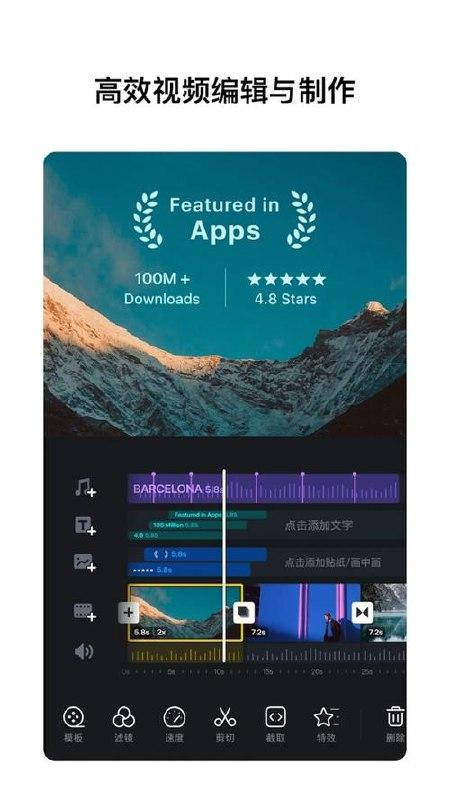
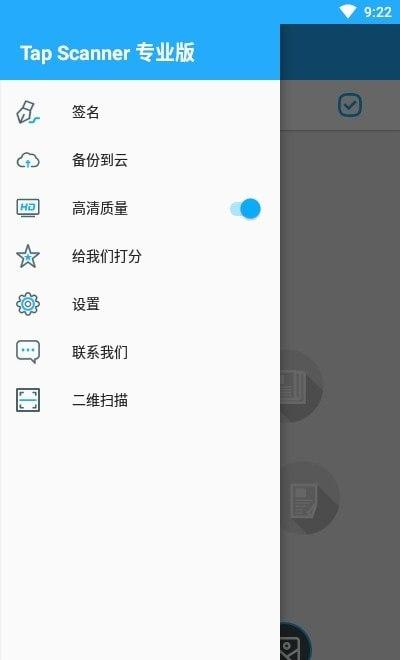
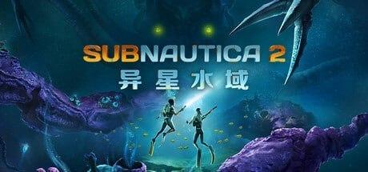
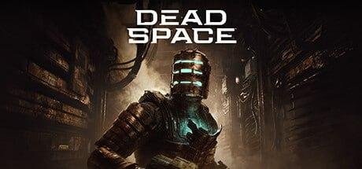

## PiliPlus

[2026-10-11 00:12] 来自：综合网盘资源频道

名称：PiliPlus v2.1.6 第三方哔哩哔哩客户端，界面极简无广告，支持1080P+

描述：PiliPlus是一款基于Flutter开发的第三方哔哩哔哩客户端，主打极简界面与无广告体验，彻底移除开屏、信息流及视频悬浮广告，仅保留推荐、热门、动态等核心功能模块；支持账号登录同步收藏、历史记录与追番进度，播放画质最高达1080P及以上，具备弹幕互动、倍速播放、离线缓存及主题自定义能力，适用于追求清爽、高效、专注观影环境的B站用户。

夸克网盘：https://pan.quark.cn/s/c237f589542e

📁 大小：1.2GB

🏷 标签：#Android #极简 #哔哩哔哩 #第三方哔哩哔哩客户端 #界面极简无广告 #quark

---

## PowerDirector

[2026-10-11 00:11] 来自：综合网盘资源频道

名称：PowerDirector v16.7.1 威力导演，视频剪辑&制作工具

描述：PowerDirector手机版从台式机带至安卓移动装置！身为市面上最强大的影音创作软件，PowerDirector提供你最便利的随身影音创作。仅需汇入拍摄片段、修剪影片、添加特效和文字，即可导出高清视频或直接上传至YouTube。威力导演内建简易上手的时间轴接口，并支持档案拖放功能，轻滑指尖，即可轻松汇入多个档案，进行分割、修剪并加入多样化特效，快速打造专业十足、绚丽的视频创作。

夸克网盘：https://pan.quark.cn/s/55a3871523f1

📁 大小：1.4GB

🏷 标签：#Android #高级 #剪辑 #视频创作 #解锁 #威力导演 #视频剪辑 #制作工具 #quark

---

## Photo

[2026-10-11 00:09] 来自：综合网盘资源频道

名称：Photo Lab v3.13.120 照片编辑特效换脸照片

描述：Photo Lab是手机端特效照片编辑器，内置换脸、AI艺术滤镜、动态特效、背景替换等百种模板，一键生成创意大片，支持高清保存与社交平台直发。

夸克网盘：https://pan.quark.cn/s/a465e7e15b83

📁 大小：470.2MB

🏷 标签：#Android #特效 #会员 #照片编辑 #照片编辑特效换脸照片 #quark

---

## 3971950

[2026-10-10 18:24] 来自：综合网盘资源频道

名称：3971950 In Falsus v1.0.6

描述：在被真实裹挟的世界里，「连接」。《In Falsus》将细致的卡牌系统与层层递进的剧情紧密结合，是一款魅力独特的节奏游戏。通过五位主角的不同视角体验相互交织的故事，享受深刻反映剧情的各式乐曲，纵身沉浸于近未来的鲜艳世界之中。

夸克网盘：https://pan.quark.cn/s/53aa059b289d

📁 大小：NG

🏷 标签：#Windows #Windows游戏 #PC游戏 #电脑游戏 #Steam #quark

---

## 3768760

[2026-10-10 17:32] 来自：综合网盘资源频道

名称：3768760 007 初露锋芒 v1.3.1

描述：赢得编号。007 初露锋芒 是IO Interactive出品的惊险刺激的间谍动作冒险游戏。跟随年轻、机智但偶尔鲁莽的詹姆斯·邦德的脚步，他是军情六处训练项目中的新兵，一起探索这位世界最著名间谍的起源故事。

夸克网盘：https://pan.quark.cn/s/1eed52a952d0

📁 大小：NG

🏷 标签：#Windows #Windows游戏 #PC游戏 #电脑游戏 #Steam #初露锋芒 #quark

---

## 3407390

[2026-10-10 15:12] 来自：综合网盘资源频道

名称：3407390 无尽帝国 2 ENDLESS Legend 2 v1.0.180

描述：在这款由英雄带领不同派系的策略游戏中，率领你的百姓在动荡不安的世界取得胜利。建立属于你的帝国，发挥政治影响力，培养强大的军队，发动战争，揭开这星球背后的黯黑秘密。

夸克网盘：https://pan.quark.cn/s/a80ace82e50e

📁 大小：NG

🏷 标签：#Windows #Windows游戏 #PC游戏 #电脑游戏 #Steam #无尽帝国 #quark

---

## 2399420

[2026-10-10 13:09] 来自：综合网盘资源频道

名称：2399420 Le Mans Ultimate v1.4.3

描述：勒芒是一个不断发展的故事……由激情、速度和荣耀驱动。 勒芒终极版——国际汽联世界耐力锦标赛和勒芒24小时耐力赛的官方游戏。

夸克网盘：https://pan.quark.cn/s/ea47618b1d02

📁 大小：NG

🏷 标签：#Windows #Windows游戏 #PC游戏 #电脑游戏 #Steam #quark

---

## VN视频编辑

[2026-10-10 11:40] 来自：综合网盘资源频道

名称：VN视频编辑 v2.21.0 无水印视频编辑工具，小白快速上手

描述：VN视频编辑是一款功能强大的无水印视频编辑工具，专为视频剪辑新手设计，轻松快速上手。解锁专业版后，提供海量滤镜、特效、转场及字幕样式，支持多轨道编辑、视频变速、音频提取等高级功能。操作简单直观，无需复杂学习即可制作出专业级视频作品。

夸克网盘：https://pan.quark.cn/s/76037ed0d12d

📁 大小：4.0GB

🏷 标签：#Android #视频编辑 #工具 #专业版 #VN视频编辑 #无水印视频编辑工具 #小白快速上手 #quark

---

## VLLO

[2026-10-10 11:30] 来自：综合网盘资源频道

名称：VLLO v13.9.0 视频编辑器，背景颜色，转换效果，移动贴纸等

描述：VLLO是一款功能强大的视频编辑器，用户可尽情享受其丰富功能支持自定义视频背景颜色，轻松调整至心仪色调；提供多种转换效果，如渐隐、推开等，让视频过渡自然流畅；还允许用户自由移动贴纸，实现个性化装饰。VLLO还支持视频剪辑、添加字幕、背景音乐等高级功能，满足用户专业创作需求，是视频制作爱好者的理想选择。

夸克网盘：https://pan.quark.cn/s/b3312aa72c97

📁 大小：1.5GB

🏷 标签：#Android #视频编辑 #解锁 #视频编辑器 #背景颜色 #转换效果 #移动贴纸等 #quark

---

## 2253100

[2026-10-10 05:45] 来自：综合网盘资源频道

名称：2253100 风屿奇航 v0.4.999

描述：《风屿奇航》是一款像素沙盒+生存冒险类的第一人称角色扮演游戏。你可以与好友们一起踏上冒险旅程 - 在浮空岛舰上建造基地、采集资源并制作各种物件，掠夺战利品，一起撸卡皮巴拉穿梭于云端，体验战斗快感，逐步揭开这个世界的神秘面纱！

夸克网盘：https://pan.quark.cn/s/4b7e9e504c4d

📁 大小：NG

🏷 标签：#Windows #Windows游戏 #PC游戏 #电脑游戏 #Steam #风屿奇航 #quark

---

## 2228280

[2026-10-10 05:43] 来自：综合网盘资源频道

名称：2228280 MEMORIAPOLIS 纪念城 v1.7.67

描述：Memoriapolis是一款历史城市建设游戏，你的城市在五个时代有机成长，从古代到工业革命。管理资源，与派系互动，塑造你的王朝，打造最终的奇迹，难度分为简单、普通或困难。

夸克网盘：https://pan.quark.cn/s/f6f6206eedfb

📁 大小：NG

🏷 标签：#Windows #Windows游戏 #PC游戏 #电脑游戏 #Steam #纪念城 #quark

---

## Walli

[2026-10-10 00:14] 来自：综合网盘资源频道

名称：Walli 4K v2.15.6 4K壁纸，原创和高品质高清壁纸的集合

描述：Walli 4K app集合了海量原创及高品质高清壁纸，专为追求视觉享受的用户打造。其4K分辨率确保了壁纸的细腻与清晰，覆盖多种风格与主题，满足个性化装饰需求。无论是自然风光、抽象艺术还是城市风光，Walli都能提供丰富选择，让用户的屏幕焕发独特魅力，享受每一次开机的视觉盛宴。

夸克网盘：https://pan.quark.cn/s/6c3e4f95f342

📁 大小：88.9MB

🏷 标签：#Android #壁纸 #4K #高清 #4K壁纸 #原创和高品质高清壁纸的集合 #quark

---

## WeNote

[2026-10-10 00:09] 来自：综合网盘资源频道

名称：WeNote v6.78 微笔记，简易好用的记事本备忘录

描述：WeNote 微笔记是一款简易好用的记事本备忘录应用，用户可享受无干扰的笔记记录体验。它支持文本、图片、语音等多种记录方式，提供强大的搜索功能，方便用户快速查找笔记。同时，高级版还包含密码保护、云同步等高级功能，确保笔记安全并随时随地访问。

夸克网盘：https://pan.quark.cn/s/b9cbbbf12bc5

📁 大小：45.0MB

🏷 标签：#Android #笔记 #高级版 #微笔记 #简易好用的记事本备忘录 #quark

---

## Remini

[2026-10-10 00:08] 来自：综合网盘资源频道

名称：Remini v3.7.1459.202525138 模糊人脸照片增强

描述：Remini 是一款专业的照片修复工具，利用人工智能技术，可将模糊人脸照片变得清晰立体。通过深度学习和图像识别技术，它能智能填补图像细节，如增强纹理、校正颜色等，从而显著提升照片画质。无论是修复老照片还是提高低分辨率图像质量，Remini都能轻松应对。

夸克网盘：https://pan.quark.cn/s/6a37454f651d

📁 大小：2.6GB

🏷 标签：#Android #修复 #照片 #专业版 #模糊人脸照片增强 #quark

---

## TapScanner

[2026-10-10 00:07] 来自：综合网盘资源频道

名称：TapScanner v3.1.22 简洁好用的相机文档扫描仪

描述：TapScanner是一款简洁易用的相机文档扫描仪应用。它能将纸质文档快速转换为清晰的电子文档，支持多种扫描模式和文件格式。TapScanner还提供自动裁剪、去噪、增强等图像处理功能，确保扫描效果优质。无论是工作文件、学习资料还是日常笔记，TapScanner都能轻松应对，满足用户的扫描需求。

夸克网盘：https://pan.quark.cn/s/c2a11e198545

📁 大小：335.3MB

🏷 标签：#Android #相机 #专业版 #简洁好用的相机文档扫描仪 #quark

---

## PDFelement

[2026-10-10 00:06] 来自：综合网盘资源频道

名称：PDFelement v6.1.18 万兴PDF，简单好用的PDF阅读编辑批注器

描述：万兴PDF是一款集阅读、编辑、批注、转换于一体的全能PDF工具，界面简洁，操作简单，支持OCR文字识别、表单填写、签名盖章，满足办公与学习全场景需求。

夸克网盘：https://pan.quark.cn/s/08a772318896

📁 大小：287.7MB

🏷 标签：#Android #PDF #阅读 #解锁 #万兴PDF #简单好用的PDF阅读编辑批注器 #quark

---

## VideoShow

[2026-10-10 00:05] 来自：综合网盘资源频道

名称：VideoShow v11.0.7.3 乐秀视频编辑、剪辑、制作软件

描述：乐秀解锁永久VIP版视频剪辑手机版是一款非常好用的视频剪辑应用，软件现在已经解锁的永久VIP版，应用中所有的功能已经为用户开放，各种各样不同的趣味好用的功能可以更换的帮助用户完成喜欢的视频剪辑，应用中顺利各种各样不同的背景音乐和视频模板来帮助用户制作出一只Vlog。

夸克网盘：https://pan.quark.cn/s/aa7437b9392b

📁 大小：881.7MB

🏷 标签：#Android #视频剪辑 #解锁 #乐秀视频编辑 #制作软件 #quark

---

## WPS

[2026-10-10 00:04] 来自：综合网盘资源频道

名称：WPS Office v26.9.1 多功能办公软件套装，海量精美模版

描述：WPS Office(WPS Office国际版)金山WPS安卓版移动办公软件套件,体积小,速度快.独有手机阅读模式,字体清晰翻页流畅;完美支持文字/表格/演示/PDF等51种文档格式;拥有海量精美模版及高级功能。

夸克网盘：https://pan.quark.cn/s/b91fcf073ad7

📁 大小：569.4MB

🏷 标签：#Android #Office #WPS #办公 #多功能办公软件套装 #海量精美模版 #quark

---

## 899770

[2026-10-09 23:55] 来自：综合网盘资源频道

名称：899770 Last Epoch 最后纪元 v1.5.2

描述：揭示过往，重铸未来。在15个精通职业中选择其一，探索危险的地下城，追寻史诗级战利品，打造传奇武器，掌握百余种变形技能树的力量。请尽情体验由狂热的RPG游戏迷团队开发的《最后纪元》。

夸克网盘：https://pan.quark.cn/s/a99bbf8e159e

📁 大小：NG

🏷 标签：#Windows #Windows游戏 #PC游戏 #电脑游戏 #Steam #最后纪元 #quark

---

## 838350

[2026-10-09 23:54] 来自：综合网盘资源频道

名称：838350 太吾绘卷 The Scroll Of Taiwu v1.1.29

描述：《太吾绘卷》是一款以神话和武侠为题材的独立游戏。玩家将扮演神秘的“太吾氏传人”，在以古代中华神州为背景的架空世界中，通过一代又一代传人的努力和牺牲，最终击败强大的宿敌，决定人世的命运。

夸克网盘：https://pan.quark.cn/s/b30a0e1084a3

📁 大小：NG

🏷 标签：#Windows #Windows游戏 #PC游戏 #电脑游戏 #Steam #太吾绘卷 #quark

---

## 801800

[2026-10-09 23:53] 来自：综合网盘资源频道

名称：801800 原子陨落 v1.2.2

描述：《Atomfall》是一款灵感来源于真实事件的动作生存游戏，故事背景设定在英格兰北部文斯盖核灾难的五年后。

夸克网盘：https://pan.quark.cn/s/54c0d1b53925

📁 大小：NG

🏷 标签：#Windows #Windows游戏 #PC游戏 #电脑游戏 #Steam #原子陨落 #quark

---

## 690830

[2026-10-09 18:17] 来自：综合网盘资源频道

名称：690830 Foundation v1.12.0.12.Build.25807971

描述：《Foundation》是一款中世纪背景的无网格城市建造游戏，聚焦有机发展、丰碑建设与资源管理，带来悠然自得的休闲体验。

夸克网盘：https://pan.quark.cn/s/5d78a620b157

📁 大小：NG

🏷 标签：#Windows #Windows游戏 #PC游戏 #电脑游戏 #Steam #quark

---

## 513710

[2026-10-09 18:05] 来自：综合网盘资源频道

名称：513710 人渣 SCUM v1.3.4.1.161318

描述：欢迎来到《SCUM》——一款残酷的开放世界生存游戏。通过深度角色自定义系统，你将亲手决定自己会成为怎样的囚徒。掠夺、制作、狩猎、建造、厮杀，在这座危机四伏的孤岛上拼命求生。每一个选择，都可能改写你的命运。活下去，保持危险，让自己成为“杀不死”的存在。

夸克网盘：https://pan.quark.cn/s/91a74f64647b

📁 大小：NG

🏷 标签：#Windows #Windows游戏 #PC游戏 #电脑游戏 #Steam #人渣 #quark

---

## 3407390

[2026-10-09 17:50] 来自：综合网盘资源频道

名称：3407390 无尽帝国 2 ENDLESS Legend 2 v1.0.172

描述：在这款由英雄带领不同派系的策略游戏中，率领你的百姓在动荡不安的世界取得胜利。建立属于你的帝国，发挥政治影响力，培养强大的军队，发动战争，揭开这星球背后的黯黑秘密。

夸克网盘：https://pan.quark.cn/s/a80ace82e50e

📁 大小：NG

🏷 标签：#Windows #Windows游戏 #PC游戏 #电脑游戏 #Steam #无尽帝国 #quark

---

## 2825860

[2026-10-09 17:39] 来自：综合网盘资源频道

名称：2825860 The Sinking City 2 v1.1.0

描述：设定于“咆哮的二十年代”，《The Sinking City 2》是一款浸润洛夫克拉夫特式恐惧的生存恐怖游戏。直面远古邪神，探索被洪水淹没的阿卡姆街巷，在亡者的追猎中前行，在一条生命与整座城市之间做出抉择。

夸克网盘：https://pan.quark.cn/s/565a9b68ce3e

📁 大小：NG

🏷 标签：#Windows #Windows游戏 #PC游戏 #电脑游戏 #Steam #quark

---

## 2713000

[2026-10-09 17:33] 来自：综合网盘资源频道

名称：2713000 共鸣：瘟疫传说传承 v1.3.0.0.Build.25654554

描述：本作的原创剧情在时间线上早于获奖作品《瘟疫传说》的故事，你将化身索菲亚，前往米诺陶岛，智取强敌，揭晓古老的秘密，直面凶煞诅咒之源的神话生物。

夸克网盘：https://pan.quark.cn/s/2db814c40286

📁 大小：NG

🏷 标签：#Windows #Windows游戏 #PC游戏 #电脑游戏 #Steam #共鸣 #瘟疫传说传承 #quark

---

## 1962700

[2026-10-09 14:12] 来自：综合网盘资源频道

名称：1962700 Subnautica 2：异星水域 v0.1.2.3-131439

描述：《Subnautica 2：异星水域》是背景设定在全新外星世界的水下生存冒险游戏，由Unknown Worlds倾力打造。可以单人游玩，也可以与好友组队开启四人合作模式。建造专属基地，制作不同工具，适应环境，水下求生。探索未知世界，揭开深海中隐藏的谜团。

夸克网盘：https://pan.quark.cn/s/e392661f6fcf

📁 大小：NG

🏷 标签：#Windows #Windows游戏 #PC游戏 #电脑游戏 #Steam #异星水域 #quark

---

## 1693980

[2026-10-09 13:58] 来自：综合网盘资源频道

名称：1693980 死亡空间 Build.10602756

描述：科幻生存恐怖经典作品宣告回归，完全重建，旨在为玩家提供更身临其境的体验，包括视觉、音效和游戏性改进，同时尽力忠实地还原初版游戏惊险的视觉效果。

夸克网盘：https://pan.quark.cn/s/1f1150116b99

📁 大小：NG

🏷 标签：#Windows #Windows游戏 #PC游戏 #电脑游戏 #Steam #死亡空间 #quark

