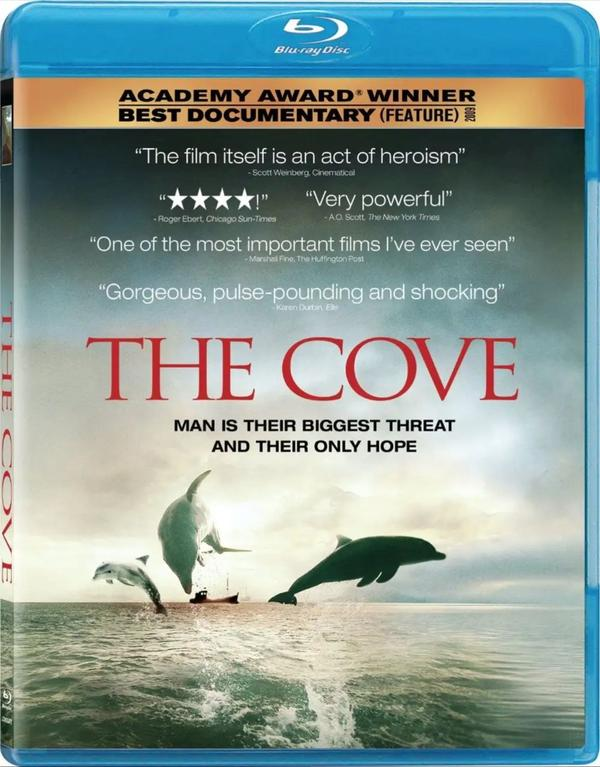
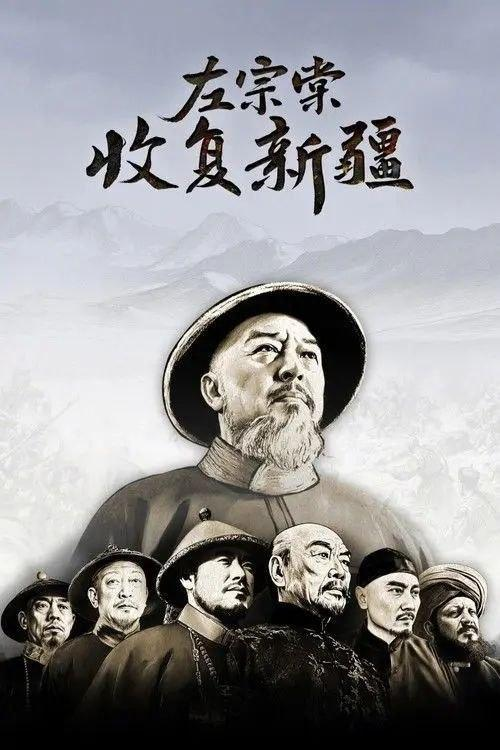

## 海豚湾

[2026-09-20 22:38] 来自：纪录片资源频道

名称：【原盘】海豚湾 (2009) 1080P REMUX 外挂简英双语字幕

描述：日本和歌山县太地，是一个景色优美的小渔村，然而这里却常年上演着惨无人道的一幕。每年，数以万计的海豚经过这片海域，他们的旅程却在太地戛然而止。渔民们将海豚驱赶到靠近岸边的一个地方，来自世界各地的海豚训练师挑选合适的对象，剩下的大批海豚则被渔民毫无理由地赶尽杀绝。这些屠杀，这些罪行，因为种种利益而被政府和相关组织所隐瞒。理查德•贝瑞（Richard O’Barry）年轻时曾是一名海豚训练师，他所参与拍摄电影《海豚的故事》备受欢迎。但是，一头海豚的死让理查德的心灵受到强烈的震撼。从此，他致力于拯救海豚的活动。不顾当地政府和村民百般阻挠，他和他的摄影团队想方设法潜入太地的海豚屠杀场，只为将罪行公之于众，拯救人类可爱的朋友……

夸克网盘：https://pan.quark.cn/s/0d61c6985ad8

📁 大小：27.8GB

🏷 标签：#海豚湾 #纪录片

---

## 冲天

[2026-09-20 22:33] 来自：纪录片资源频道

名称：冲天 (2015) 1080P

描述：曾经有那么一群年轻人，每一次起飞都可能永别，每一次落地都必须感谢上苍。他们战斗在云霄，胜败一瞬间。他们必须无所畏惧，但也无所遁逃。他们是螺旋桨时代的最后一批战斗机飞行员，他们所面对的敌人，以及生死，都在目视可及的范围内，一如十九世纪的贵族决斗。纪实电影《冲天》以1937-1945年中国与日本之间的全面战争为大背景，来呈现这群年轻人的爱恋、荣耀与存亡。

夸克网盘：https://pan.quark.cn/s/371e1cdc3e49

📁 大小：1.8GB

🏷 标签：#冲天 #纪录片

---

## 左宗棠收复新疆

[2026-09-20 22:21] 来自：夸克云盘影视资源频道

名称：左宗棠收复新疆 (2025) 4K 高码 全12集

描述：《左宗棠收复新疆》是一部还原左宗棠收复新疆真实历史事件的纪录大片，是一部缅怀国家英雄的匠心之作、礼敬之作。本片以左宗棠收复新疆、维护主权为主线，以“我之疆索，尺寸不可让人！”之豪迈，鲜活地表现了以左宗棠为代表的先贤为了维护国家尊严和领土完整而付出的不懈努力与无私奉献。他们浴血奋战、守土卫疆，收复了百余万平方公里的辽阔国土，开发了广袤的西北大地，为中华民族立下了永志千秋的历史功勋。

夸克网盘：https://pan.quark.cn/s/acbc741b98c7

百度网盘：https://pan.baidu.com/s/1SzssTadxVxJe17P7aWcYIg?pwd=189y 来自：阿里、夸克、百度网盘4K影视资源 [2026-09-20 22:21] 名称：左宗棠收复新疆 (2025) 4K 高码 全12集

📁 大小：45.5GB

🏷 标签：#左宗棠收复新疆 #纪录片

---

## 这就是我席琳狄翁

[2026-09-20 20:46] 来自：无损音乐分享频道

名称：这就是我：席琳·狄翁 简繁英字幕 I.Am.Celine.Dion.2024.2160p.AMZN.WEB-DL.DDP5.1.H265.

描述：Celine Dion 席琳狄翁纪录片

夸克网盘：https://pan.quark.cn/s/9eb5b5bc9e95

📁 大小：NG

🏷 标签：#音乐 #纪录片 #席琳狄翁

---

## 这就是我席琳狄翁HDR杜比视界双版本简繁英字幕

[2026-09-20 19:57] 来自：综合网盘资源频道

名称：这就是我：席琳·狄翁[HDR+杜比视界双版本][简繁英字幕]

描述：这并不是对这位标志性流行歌手的生活和时代的广泛审视，而是捕捉了她职业生涯中关键时刻的快照。

这部纪录片跨越了大约一年的时间，记录了迪翁与僵人综合症的斗争，僵人综合症是一种影响大脑和脊髓的罕见神经系统疾病。

就迪翁而言，疾病中断了她的生计和表演能力。

迅雷网盘：https://pan.xunlei.com/s/VP1yclp4doNP1Rl5mkt0pruoA1?pwd=dhxx

提取码：dhxx

📁 大小：14.5GB

🏷 标签：#纪录片 #音乐 #传记 #席琳狄翁 #CelineDion #这就是我 #席琳·狄翁 #HDR #杜比视界双版本 #简繁英字幕 #xunlei

---

## 遥望南方的童年

[2026-09-20 12:11] 来自：夸克云盘影视资源频道

名称：遥望南方的童年 (2007) 1080P

描述：由于父母大都去南方城市打工，村中剩下的全是老人和儿童，小学教师易明堂（易志兵 饰）不忍这些孩子重蹈父辈的路，决定开办一所家庭幼儿园，教孩子们学文化，下岗的妻子（何伟欣 饰）当园长，初中生李响（谢媛 饰）当了老师。由于条件简陋，易明堂腾出家中祖宅做孩子们的活动场所。幼儿园开班后，各种意想不到的困难接踵而至，有的家庭连低廉的学费都交不起。陀陀因李响教育失当离园出走，李响很是内疚，她想报考师范学校系统地学习。秀秀的妈妈打工回来，女儿竟不认她，加之丈夫有了外遇，她伤心地离开了家乡。由于易明堂没有办学资质，乡里勒令他把幼儿园关闭。令易明堂心酸的是，这些留守儿童将来怎么办......

夸克网盘：https://pan.quark.cn/s/efbe8c5483af

百度网盘：https://pan.baidu.com/s/1Q7RzPcSxpeW3YpD9SJM-mA?pwd=698y 来自：阿里、夸克、百度网盘4K影视资源 [2026-09-20 12:11] 名称：遥望南方的童年 (2007) 1080P

📁 大小：2GB

🏷 标签：#纪录片 #遥望南方的童年

---

## 大象女王

[2026-09-19 17:59] 来自：纪录片资源频道

名称：大象女王 (2019) 4K HDR 外挂简中字幕

描述：雅典娜是一位母亲，当他们被迫离开他们的水坑时，她会尽她所能保护她的牧群。这一史诗般的旅程，由Chiwetel Ejiofor讲述，带领观众穿越非洲大草原，进入大象家庭的核心。一个关于爱，失去和回家的故事。

夸克网盘：https://pan.quark.cn/s/6dac4d8423a7

📁 大小：16.3GB

🏷 标签：#纪录片 #大象女王

---

## 地球脉动生命礼赞

[2026-09-19 17:45] 来自：纪录片资源频道

名称：地球脉动：生命礼赞 (2020) 1080P 外挂简英双语字幕

描述：融合《地球脉动II》和《蓝色星球II》的精彩故事。 Bringing together spectacular sotries from Plant Earth II and Bule Planet II.

夸克网盘：https://pan.quark.cn/s/d20a4ac4f7d6

📁 大小：4.2GB

🏷 标签：#纪录片 #地球脉动：生命礼赞

