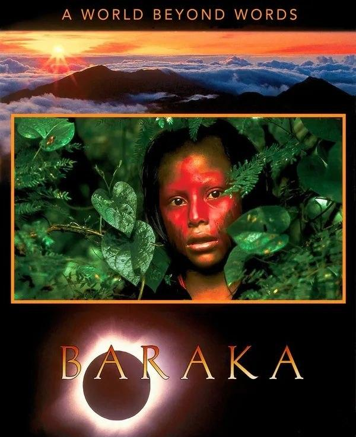
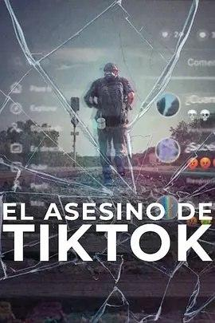
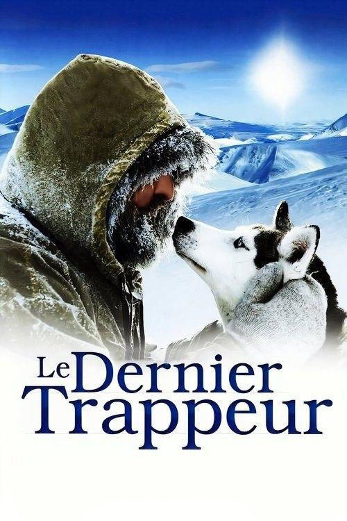

## 天地玄黄

[2026-09-10 14:51] 来自：综合网盘资源频道

名称：天地玄黄 (1992) 4K 超高清 原盘REMUX HDR10 H265 DTS-HD MA 5.1

描述：豆瓣9.1高分

我们是谁？从哪里来？又将归往何处？这些问题和我们的生存息息相关，但却很少有人能够给出准确的答案。历时14个月，穿越24个国家，导演罗恩·弗里克(Ron Fricke)用镜头向我们展示了大自然能够拥有的最壮阔最绚丽的景致——从远古到现在，从猿猴到人类，从荒无人烟的沙漠到震撼人心的宗教活动现场，从广袤天地带来的感动到婴孩单纯的笑脸给予的幸福，我们会发现，很多时候，我们并不能意识到，这美好的一切正时时刻刻的发生在我们身边。全片没有台词，片名Baraka在古伊斯兰语中代表祝福，这也是导演拍摄此片的初衷，祝福与我们共同存在在这颗蔚蓝地球上的一切。

夸克网盘：https://pan.quark.cn/s/eefe6ab13c9a

📁 大小：59.8GB

🏷 标签：#纪录片 #天地玄黄 #4K #超高清 #原盘REMUX #DTSHD #quark

---

## 大三国守望与发现

[2026-09-10 12:20] 来自：夸克云盘影视资源频道

名称：大三国——守望与发现 (2024) 1080P 全6集

描述：真正让历史“活”过来的一档纪录片。以闯关游戏、述职报告、茶话会等创新形式结合皮影、泥塑、戏剧等传统文化形式，再数三国蜀汉风流人物。在夯实的历史专业背景下，用年轻人更喜闻乐见的方式呈现历史事件、社会生活与经济文化。

夸克网盘：https://pan.quark.cn/s/078bc6f64ffd

百度网盘：https://pan.baidu.com/s/1ZrSSxxHxe010N7vc3O73lw?pwd=j6sw 来自：阿里、夸克、百度网盘4K影视资源 [2026-09-10 12:20] 名称：大三国——守望与发现 (2024) 1080P 全6集

📁 大小：2.7GB

🏷 标签：#大三国——守望与发现 #纪录片

---

## 国宝迷踪

[2026-09-10 12:10] 来自：影视动漫分享|SeedHub|夸克|网盘|🧲

名称：国宝迷踪 (2024)

#电视剧 #犯罪 #纪录片 #悬疑 #夸克 #百度

主演: 屈扬 李洋 赵永占 

豆瓣: [0](https://movie.douban.com/subject/36559404/)

纪录片《国宝之谜》以公安部监管的四起重大国家一级文物盗窃案为蓝本，创新性地将戏剧化的情景再现与纪录片的拍摄手法相结合，揭开了这些珍贵国宝的神秘面纱，讲述了盗窃案的曲..

夸克网盘：https://pan.quark.cn/s/12505a413665

百度网盘：https://pan.baidu.com/s/1qv3fallo-FEedy5uwbTG3Q?pwd=148q

---

## 废柴英雄

[2026-09-09 23:42] 来自：纪录片资源频道

名称：废柴英雄 (2025) 4K HDR 全5集 内封简繁英字幕

描述：国家地理新系列，该纪录片由瑞安·雷诺兹担任旁白，将聚焦自然世界中一些鲜为人知的动物的独特且不可预测的行为，包括它们的伪装技巧、养育技巧和求爱仪式。 “我喜欢自然系列，我喜欢制作我的孩子可以真正观看的东西，”雷诺兹在一份声明中说。“我们已经很高兴地尝试为动物纪录片带来新的声音。Wildstar拥有专业知识、经验和尖端电影技术，可以帮助我们充分利用《国家地理》的预算。我们将呈现一部既有趣又令人惊讶的节目，并且会公正地对待那些通常只能充当配角的动物。”

夸克网盘：https://pan.quark.cn/s/201f8a57656e

📁 大小：20GB

🏷 标签：#废柴英雄 #纪录片 #迪士尼

---

## 迈克尔杰克逊裁决

[2026-09-09 22:41] 来自：纪录片资源频道

名称：迈克尔·杰克逊：裁决 (2026) 4K HDR & Dv 全33集 内封简中字幕

描述：通过法庭内部关键人员的讲述，这部内容详实的纪录片对迈克尔·杰克逊的庭审及其复杂的名望。

夸克网盘：https://pan.quark.cn/s/2b3c589ef9bf

📁 大小：15.4GB

🏷 标签：#迈克尔·杰克逊：裁决 #纪录片 #NF

---

## 一片甲骨

[2026-09-09 12:12] 来自：影视动漫分享|SeedHub|夸克|网盘|🧲

名称：一片甲骨 (2025)

#电视剧 #纪录片 #夸克 #百度

主演: 奚美娟 李文峰 王洪涛 

豆瓣: [0](https://movie.douban.com/subject/37814055/)

当能够穿越时空的宏大命题和情感共鸣相互交错，并通过统一的媒介传递给受众，不同维度切片中的人、事、物和思想观念，可以在观众的脑海中汇聚一处，这样的超然又振奋的感受，便..

夸克网盘：https://pan.quark.cn/s/1f3599ee43e6

百度网盘：https://pan.baidu.com/s/1lQNiCaFyKnH-wy8KqCb0nw?pwd=Q62V

---

## 七三一真相

[2026-09-09 12:10] 来自：影视动漫分享|SeedHub|夸克|网盘|🧲

名称：七三一真相 (2023)

#电视剧 #纪录片 #夸克 #百度

主演: 

豆瓣: [0](https://movie.douban.com/subject/36553212/)

本片首次以哈巴罗夫斯克（伯力）审判声音档案为主线，依靠全面详实的证据，从全新的视角，揭露了侵华日军第七三一部队进行活体实验和实施细菌战的历史真相。..

夸克网盘：https://pan.quark.cn/s/4a26a742760b

百度网盘：https://pan.baidu.com/s/1rrLzCUJ7U-kllhvkUIkmgw?pwd=af6U

---

## 郧县人3号出土记

[2026-09-08 20:04] 来自：夸克云盘影视资源频道

名称：“郧县人”3号出土记 (2023) 4K 全4集

描述：本片聚焦于东方人类起源演化的重大里程碑成果，通过纪实的影像表达，从考古发掘与“考古人”两条脉络出发，全景式记录“郧县人”3号头骨发掘、提取工作，借由对考古队生活化情境和细节描摹，传播考古人的文化传承精神，诠释中国人的文明源流与精神底色。在古今“郧县人”跨越百万年的时空对话中，探索人类起源之路，不断思索未来，也叩问全人类发展的方向。

夸克网盘：https://pan.quark.cn/s/718eb02e0c9d

百度网盘：https://pan.baidu.com/s/1yeQhxJxKi99ljOPS2iju9Q?pwd=p6w0 来自：阿里、夸克、百度网盘4K影视资源 [2026-09-08 20:04] 名称：“郧县人”3号出土记 (2023) 4K 全4集

📁 大小：15.4GB

🏷 标签：#“郧县人”3号出土记 #纪录片

---

## 一次远行

[2026-09-08 19:59] 来自：夸克云盘影视资源频道

名称：一次远行 (2022) 4K 全11集

描述：过去一年，疫情冲击着我们熟悉的生活，也让散落在世界各地的中国留学生们面临着新的人生考验。 过去一年，我们在美国、德国、以色列、法国，悉心记录了五位留学生的故事。 世事变迁，这些年轻人能否直面人生考验？ 独处异乡，那些忽然而至的困局要怎样突破？ 青春的背景变得不同， 一次远行，会找到怎样的人生答案？

夸克网盘：https://pan.quark.cn/s/c4327fdabaf3

百度网盘：https://pan.baidu.com/s/14OqL-TUJ6Fk3AE7YSCYtPg?pwd=t936 来自：阿里、夸克、百度网盘4K影视资源 [2026-09-08 19:59] 名称：一次远行 (2022) 4K 全11集

📁 大小：6.4GB

🏷 标签：#一次远行 #纪录片

---

## 权力王朝默多克家族

[2026-09-08 19:49] 来自：纪录片资源频道

名称：权力王朝：默多克家族 (2026) 1080P 全4集 简中硬字幕

描述：在这部引人入胜的纪录片剧集中，鲁伯特·默多克的子女们展开激烈的继承权争夺战，以掌握其庞大媒体帝国的控制权。

夸克网盘：https://pan.quark.cn/s/a497ac486e8f

📁 大小：6.3GB

🏷 标签：#权力王朝：默多克家族 #纪录片

---

## 飓风卡特里娜滔天洪灾

[2026-09-08 15:04] 来自：纪录片资源频道

名称：飓风卡特里娜：滔天洪灾 (2025) 1080P 全3集 简英双语硬字幕

描述：飓风卡特里娜发生的二十年后，幸存者回忆了那场灾难性的风暴：他们的生活因此永远改变，同时也暴露出系统性的不平等问题。

夸克网盘：https://pan.quark.cn/s/30a8aa727af1

📁 大小：6.1GB

🏷 标签：#飓风卡特里娜：滔天洪灾 #纪录片

---

## 古蜀秘境三星堆迷踪

[2026-09-08 08:17] 来自：夸克云盘影视资源频道

名称：古蜀秘境：三星堆迷踪 (2021) 4K 全7集

描述：2021年，三星堆遗址考古再次震惊世界，新发现的六个祭祀坑，均埋藏有各类精美的文物，这个中国考古史上重要而神秘的发现，再次引起世人们的关注。神秘的金仗，青铜神树，纵目面具，青铜立人…..三星堆遗址叙述了怎样的中国文明？四千年的古蜀王国之谜究竟为何？

夸克网盘：https://pan.quark.cn/s/4950364d96fa

百度网盘：https://pan.baidu.com/s/1681gZNclP7y2p4r2AhKPOw?pwd=fwLE 来自：阿里、夸克、百度网盘4K影视资源 [2026-09-08 08:17] 名称：古蜀秘境：三星堆迷踪 (2021) 4K 全7集

📁 大小：3.1GB

🏷 标签：#古蜀秘境：三星堆迷踪 #纪录片 #历史

---

## 美国谋杀故事杀妻疑云

[2026-09-07 22:02] 来自：纪录片资源频道

名称：美国谋杀故事：杀妻疑云 (2024) 1080P 全3集 内封简繁字幕

描述：拉西·彼得森失踪时已怀有八个月身孕。人们展开搜寻，结果却以悲剧告终。这部系列纪录片对这起 2002 年的谋杀案进行了深入探究。

夸克网盘：https://pan.quark.cn/s/bb087b29a3de

📁 大小：9GB

🏷 标签：#美国谋杀故事：杀妻疑云 #纪录片 #NF

---

## 窗外是蓝星

[2026-09-07 20:06] 来自：夸克云盘影视资源频道

名称：窗外是蓝星 (2025) 4K SDR 内封简繁英字幕

描述：该片是中国首部在太空拍摄的实景电影，由航天员翟志刚、王亚平、叶光富在中国空间站使用8K超高清摄影机创作拍摄，影片将带领观众沉浸式体验中国人的太空旅程，感受壮美奇景、空间站生活与航天员真实的内心世界。

夸克网盘：https://pan.quark.cn/s/c94823ffe84f

百度网盘：https://pan.baidu.com/s/1fhN6fZpRAWQFR7PUjaWi9A?pwd=4v28 来自：阿里、夸克、百度网盘4K影视资源 [2026-09-07 20:06] 名称：窗外是蓝星 (2025) 4K SDR 内封简繁英字幕

📁 大小：7.4GB

🏷 标签：#窗外是蓝星 #纪录片

---

## 启示录斯大林

[2026-09-07 19:26] 来自：纪录片资源频道

名称：启示录：斯大林 (2015) 1080P全3集 简英双语字幕

描述：从早年当银行劫匪到冷血无情的苏联领导人，斯大林的崛起之路。斯大林究竟是谁？是击败纳粹的英雄？“人民之父”？还是那个时代最大的罪犯？在三集共52分钟的纪录片《斯大林启示录》中，伊莎贝尔·克拉克和丹尼尔·科斯特尔运用当时的档案影像，描绘了这位二十世纪最残暴的独裁者之一的形象。这些影像由《启示录》制作团队完美修复并进行了精美的着色。该系列从斯大林与希特勒的殊死搏斗开始，讲述了约瑟夫·朱加什维利令人难以置信的崛起之路。这位来自格鲁吉亚的鞋匠之子白手起家，通过各种阴谋和犯罪手段一步步爬上权力巅峰，最终掌握了绝对权力，并获得了“斯大林”——俄语意为“钢铁之人”的称号。从人性的角度来看，该剧描述了1878年至1945年间苏联人民遭遇的巨大悲剧，他们发现自己陷入了一个陷阱，变成了人间地狱。

夸克网盘：https://pan.quark.cn/s/6bef0fa18306

📁 大小：3.4GB

🏷 标签：#启示录：斯大林 #纪录片 #传记 #历史

---

## TikTok杀手蛛丝网迹

[2026-09-07 12:10] 来自：影视动漫分享|SeedHub|夸克|网盘|🧲

名称：TikTok杀手：蛛丝网迹 (2026)

#电视剧 #犯罪 #纪录片 #夸克 #百度

主演: Esther Estepa 

豆瓣: [0](https://movie.douban.com/subject/38247901/)

42岁的西班牙女子在旅行时与人气TikTok博主见面后消失无踪。这部纪录片讲述了家人对真相的追寻。..

夸克网盘：https://pan.quark.cn/s/27eba73c1042

百度网盘：https://pan.baidu.com/s/1avsM5mMjObf3URTsQTsCyw?pwd=234v

---

## 潮州味道

[2026-09-06 20:45] 来自：纪录片资源频道

名称：潮州味道 (2022) 4K 全6集

描述：讲述潮州菜的过去与未来，传承与创新，通过美食背后的人物和故事展示潮州味道深厚的文化内涵。沿用老广的味道纪录片创作手法，通过记录人与食物之间的故事，把饮食文化还原于生活现场，使其与民间习俗、饮食习惯以及潮汕人生活的方方面面产生关联，立体呈现潮州菜的博大精深。

夸克网盘：https://pan.quark.cn/s/8748f9f9fa5d

📁 大小：5.8GB

🏷 标签：#潮州味道 #纪录片

---

## 艾米不见了邮轮失踪悬案

[2026-09-06 17:37] 来自：纪录片资源频道

名称：艾米不见了：邮轮失踪悬案 (2025) 1080P 全3集 简英特效硬字幕

描述：1998 年，一名 23 岁的女子在加勒比海游轮上失踪，她的家人坚持不懈地寻找答案。这部真实犯罪题材剧集对本案进行了探讨。

夸克网盘：https://pan.quark.cn/s/acdc3c8e13c6

📁 大小：2.9GB

🏷 标签：#艾米不见了：邮轮失踪悬案 #纪录片

---

## 一江百味

[2026-09-06 16:35] 来自：夸克云盘影视资源频道

名称：一江百味 第二季 (2025) 4K 全5集

描述：将镜头聚焦于横贯湖南中部地区的资江。资江，因安化黑茶和千年茶马古道的传奇而著称。本季美食之旅，从资江源头邵阳启程，穿越冷水江、新化、安化、桃江、益阳，最终汇入壮丽的洞庭湖，直至抵达岳阳，全程长达650多公里，沿途风光迤逦。镜头穿梭于高山峡谷之间，探寻隐匿在云端的人家，一句“恰饭冒，来恰咯”，不仅展现了湖南人的热情与洒脱，更邀请八方来客共品这一江百味的美食盛宴。一江百味2

夸克网盘：https://pan.quark.cn/s/d11799119ee3

百度网盘：https://pan.baidu.com/s/1J_FB5TslOllk7qyU2kVISQ?pwd=8a4H 来自：阿里、夸克、百度网盘4K影视资源 [2026-09-06 16:35] 名称：一江百味 第二季 (2025) 4K 全5集

夸克网盘：https://pan.quark.cn/s/cbb47ad593d6 来自：夸克云盘影视资源频道 [2026-09-06 16:34] 名称：一江百味 第一季 (2024) 4K 全10集

百度网盘：https://pan.baidu.com/s/1Yq8n6Ac2VwyeU1QHjAU8nA?pwd=xX4f 来自：阿里、夸克、百度网盘4K影视资源 [2026-09-06 16:34] 名称：一江百味 第一季 (2024) 4K 全10集

📁 大小：1.8GB

🏷 标签：#一江百味 #纪录片

---

## 罗纳尔迪尼奥独步球坛

[2026-09-05 21:45] 来自：纪录片资源频道

名称：罗纳尔迪尼奥：独步球坛 (2026) 1080P 全3集 内封繁中字幕

描述：本剧集讲述了巴西足球巨星罗纳尔迪尼奥的生平与职业生涯，追溯了他从少年天才成长为全球体育偶像的历程。

夸克网盘：https://pan.quark.cn/s/78c4c29d3b82

📁 大小：6.4GB

🏷 标签：#罗纳尔迪尼奥：独步球坛 #纪录片 #运动 #传记 #NF

---

## 凶杀重案实录纽约

[2026-09-05 18:40] 来自：纪录片资源频道

名称：凶杀重案实录：纽约 (2024) 1080P 全5集 简中硬字幕

描述：《法律与秩序》创剧人迪克·沃尔夫、Wolf Entertainment 和 Alfred Street Industries 联合推出了《凶杀重案实录》，这部最新纪录片讲述了一系列臭名昭著的谋杀案，由最了解这些案件的人讲述：侦破这些案件的侦探和检察官。

夸克网盘：https://pan.quark.cn/s/6b3fa90fd409

📁 大小：5.1GB

🏷 标签：#纪录片 #犯罪 #NF

---

## 重返三星堆

[2026-09-05 13:47] 来自：肯德基の4K影视综合电影云盘站

名称：重返三星堆 全5集 [2025][考古纪录片]

描述：该片聚焦三星堆最新出土具有代表性的文物，通过文物出土、清理、修复、研究，以及故事化讲述，重构历史场景，透物见人还原三星堆人的生活往事，揭示三星堆文明的演变进程，厘清三星堆文明的背景以及三星堆文明在中华文明、乃至世界文明中的影响力。

夸克网盘：https://pan.quark.cn/s/0e43ff04ff37?pwd=EyGU

百度网盘：https://pan.baidu.com/s/1ZCfqBk6ppGDXknsaWQViSw?pwd=7074

📁 大小：N

🏷 标签： #重返三星堆 #考古 #纪录片

---

## 与摩根弗里曼一起穿越虫洞

[2026-09-05 13:03] 来自：综合网盘资源频道

名称：与摩根·弗里曼一起穿越虫洞 (2010)【8集全】【4K.高码率】【内嵌简英】

描述：豆瓣9.3高分

宇宙是什么？宇宙的起源是怎样的？宇宙真的只存在我们地球人类吗？外星生物真的只是一个理论吗？你有没有想过，当你身处黑洞，或进入虫洞可以实现时间旅行，你会怎样？让我们一起跟随着奥斯卡影帝Morgan Freeman走进我们这个神秘的宇宙，一起来揭开它的神秘面纱吧！

夸克网盘：https://pan.quark.cn/s/780389c63f45

📁 大小：25GB

🏷 标签：#纪录片 #与摩根·弗里曼一起穿越虫洞 #4K #高码率 #内嵌简英 #quark

---

## 又见三星堆

[2026-09-05 12:10] 来自：影视动漫分享|SeedHub|夸克|网盘|🧲

名称：又见三星堆 (2022)

#电视剧 #纪录片 #夸克 #百度

主演: 

豆瓣: [7.5](https://movie.douban.com/subject/35887883/)

从2019年至2022年，摄制组全程跟踪记录下三星堆新一轮考古发掘盛事，全景呈现这一次考古发掘的开启和进行，以发掘工作的递进式开展为线索，展现出此次考古发掘跨学科、..

夸克网盘：https://pan.quark.cn/s/fc9e5c0d1a5d

百度网盘：https://pan.baidu.com/s/1FP7byXF_21gamIg23RBwiQ?pwd=6o84

---

## 三江之源

[2026-09-04 23:06] 来自：夸克云盘影视资源频道

名称：三江之源 (2020) 1080P 全6集

描述：三江源头，世界屋脊，中华水塔，地处青藏高原东部，孕育和保持着大面积的原始高寒生态系统，维系着中国乃至亚洲生态安全命脉。本片真实捕捉了这片土地上正在发生的故事：这里有牦牛的故事，有牧羊犬的故事，有野生动物的故事，更有人与自然和谐共处的故事。通过本片所记录的故事，能够让观众感受到那份朴素的真情下，人类保护生态文化、尊重自然的意义。

夸克网盘：https://pan.quark.cn/s/431644b5c877

百度网盘：https://pan.baidu.com/s/1SW6fxEJ1FvwMsLHujfOLrQ?pwd=SN59 来自：阿里、夸克、百度网盘4K影视资源 [2026-09-04 23:06] 名称：三江之源 (2020) 1080P 全6集

📁 大小：5.4GB

🏷 标签：#三江之源 #纪录片

---

## 寻迹庞贝古城与汤姆希德勒斯顿同行

[2026-09-04 21:37] 来自：纪录片资源频道

名称：寻迹庞贝古城：与汤姆·希德勒斯顿同行 (2026) 1080P 全3集 简英双语字幕

描述：火山吞噬庞贝的那天，是否有人躲过死神降临？

跟着汤姆·希德勒斯顿重返灾难前的最后一天。

结合尖端考古学与历史推演，层层揭开尘封千年的真相。

见证人们在分秒必争之际，如何做出攸关生死的关键抉择。

夸克网盘：https://pan.quark.cn/s/3841c3db4157

📁 大小：4.8GB

🏷 标签：#寻迹庞贝古城：与汤姆·希德勒斯顿同行 #纪录片

---

## 九一八事变后纪

[2026-09-04 17:15] 来自：夸克云盘影视资源频道

名称：九一八事变后纪 (2025) 1080P IQ 全6集

描述：九一八事变，南满铁路的爆炸声开启了中国长达14年的抗日战争也吹响了世界反法西斯战争的第声号角。中国人民用血肉之躯筑起坚不可摧的屏障，抵抗日本侵略者，为世界反法西斯战争作出了巨大贡献。 731细菌战等残酷历史事件，让我们永远铭记战争的残酷和人世沧桑。中国军民在战争中付出了巨大牺牲，为世界和平作出了重要贡献。 《九一八后纪》这部纪录片，通过详尽的历史资料和亲历者的讲述再现了抗战初期血与火的年代自己中国人民的勇气与坚韧。这部纪录片在中国国内九月份全网热播纪录片榜中排名第五，并在国际上获得了广泛的认可和赞誉。让我们共同铭记历史，珍爱和平。

夸克网盘：https://pan.quark.cn/s/f4d44853bb09

百度网盘：https://pan.baidu.com/s/1PvGO8rsr8YgDYplV5MmzHQ?pwd=g8nL 来自：阿里、夸克、百度网盘4K影视资源 [2026-09-04 17:15] 名称：九一八事变后纪 (2025) 1080P IQ 全6集

📁 大小：2GB

🏷 标签：#九一八事变后纪 #纪录片 #历史 #战争

---

## 超级工程

[2026-09-04 17:15] 来自：夸克云盘影视资源频道

名称：超级工程 (2012) 1080P 全5集

描述：中央电视台纪录频道重磅打造的纪录片《超级工程》将于９月下旬正式与观众见面。这部纪录片聚焦国内重点工程，揭秘其建设过程中鲜为人知的一面。全片共五集，分别为《北京地铁网络》《上海中心大厦》《港珠澳大桥》《海上巨型风机》和《超级ＬＮＧ船》。从去年４月立项到今年８月底制作完毕，整个创作团队用了１年多的时间，将那些鲜为人知、可以称得上惊心动魄的建设过程纳入《超级工程》的镜头。“凡是被选入这个片子的工程项目，一定是从体量上能够称得上超大规模，从科技含量上要走在世界前列、国内领先，从建造水平上能代表中国当下最佳。不仅如此，还必须关系民生，关系未来。”

夸克网盘：https://pan.quark.cn/s/90c3ad12f723

百度网盘：https://pan.baidu.com/s/16aAJPwQIJuh18E3GWW91_A?pwd=6357 来自：阿里、夸克、百度网盘4K影视资源 [2026-09-04 17:15] 名称：超级工程 (2012) 1080P 全5集

📁 大小：20.7GB

🏷 标签：#纪录片 #超级工程

---

## 航拍海岸线

[2026-09-03 20:49] 来自：夸克云盘影视资源频道

名称：航拍海岸线 (2024) 4K 全6集

描述：每集聚焦一个沿海城市，以中国海岸线地理分区为主题，从文化历史、自然环境、经济发展、城市建设、民俗节日、海洋科技等方面，全方位展现中国海岸线的全貌。每集10—12个相关故事场景，通过内在联系组合成每集故事线，观众将通过导演的航拍镜头从空中俯视北海、防城港、文昌、中山、汕头以及江门这6座中国沿海城市。

夸克网盘：https://pan.quark.cn/s/e32c1b094bf6

百度网盘：https://pan.baidu.com/s/1C2cN99sa2wr4V5p-ehclWw?pwd=a7xB 来自：阿里、夸克、百度网盘4K影视资源 [2026-09-03 20:49] 名称：航拍海岸线 (2024) 4K 全6集

📁 大小：5.7GB

🏷 标签：#航拍海岸线 #纪录片

---

## 地球劫后重生

[2026-09-03 19:27] 来自：肯德基の4K影视综合电影云盘站

名称：地球·劫后重生 全8集 [2026][纪录片]

描述：从2026年6月11日起，每周四晚，让我们齐聚一堂，共同领略自然世界的奇观。NBC将通过《幸存地球》带观众领略4.5亿年的生命史。这部里程碑式的系列剧颂扬了生命惊人的韧性以及每一种生物为延续至今所经历的非凡旅程；它展现了生命如何在地球最灾难性的环境危机中不仅幸存，更蓬勃发展。借助尖端的CGI技术，观众将沉浸于史前世界，跨越被陨石撞击、火山爆发、海平面骤降及灼热热浪塑造的奇异地貌，目睹从未登上荧幕的生物与它们精彩的生命故事。从4.5亿年前的巨型海蝎，到45万年前威武的猛犸象与剑齿虎，荡气回肠的地球史将会以前所未见的恢弘姿态呈现！

夸克网盘：https://pan.quark.cn/s/0284f2283785

百度网盘：https://pan.baidu.com/s/14GLjWcYHctJOTnAXEsl9YA?pwd=6666

📁 大小：N

🏷 标签： #地球·劫后重生 #劫后重生 #纪录片

---

## 911重逢

[2026-09-03 14:56] 来自：纪录片资源频道

名称：911：重逢 (2026) 4K HDR 全3集 内封简繁字幕

描述：9·11事件中，2977人在美国历史上最严重的恐怖袭击中丧生。本系列节目讲述了幸存者们在悲剧发生后彼此联系，并在25年后重聚的感人故事。他们互相感谢、传递信息，并询问那些尘封已久的问题。

夸克网盘：https://pan.quark.cn/s/b7d4b3c67363

📁 大小：12.9GB

🏷 标签：#911#重逢 #纪录片 #迪士尼

---

## 马王堆岁月不朽

[2026-09-02 23:41] 来自：夸克云盘影视资源频道

名称：马王堆·岁月不朽 (2024) 4K 全8集

描述：在马王堆汉墓完成考古发掘50周年之际，由中共湖南省委宣传部指导，湖南博物院特别支持，芒果伯璟、伯璟文化制作的纪录片《马王堆·岁月不朽》正式定档，将于8月19日起每周一至周四19:30在湖南卫视、芒果TV同步播出。 叙事脉络上，纪录片《马王堆·岁月不朽》打破了以往考古发现式纪录片的常规范式，以文物与博物馆作为创作主体，把湖南博物院当作一个大影棚，围绕文物与博物馆搭建视觉体系和叙事空间。

夸克网盘：https://pan.quark.cn/s/69e78175e664

百度网盘：https://pan.baidu.com/s/1xNMdx0H2e5jcUU9Jx-58fw?pwd=ME2M 来自：阿里、夸克、百度网盘4K影视资源 [2026-09-02 23:41] 名称：马王堆·岁月不朽 (2024) 4K 全8集

📁 大小：6.2GB

🏷 标签：#马王堆·岁月不朽 #纪录片

---

## 我在故宫六百年

[2026-09-02 23:40] 来自：夸克云盘影视资源频道

名称：我在故宫六百年 (2020) 1080P 全3集

描述：该片以“丹宸永固”大展、养心殿研究性保护项目、古建岁修保养为线索，通过故宫博物院古建部、修缮技艺部、工程处、文保科技部、考古部等故宫人的工作视角，踏上故宫再发现之旅。纪录片聚焦古建修缮保护，记录宫墙之内悉心呵护故宫的匠人，展现宫墙之外的天下人与这座城池发生奇妙的关联，讲述紫禁城青春永驻的故事。

夸克网盘：https://pan.quark.cn/s/4a3b2fd9dcb1

百度网盘：https://pan.baidu.com/s/12HiDn5kaIpykD8yuGX_I8A?pwd=9oaQ 来自：阿里、夸克、百度网盘4K影视资源 [2026-09-02 23:40] 名称：我在故宫六百年 (2020) 1080P 全3集

📁 大小：6.4GB

🏷 标签：#我在故宫六百年 #纪录片

---

## 迷离悬案止痛药谋杀事件

[2026-09-02 23:34] 来自：电视剧资源频道

名称：迷离悬案：止痛药谋杀事件 (2025) 4K HDR 全3集 内封简繁字幕

描述：《迷离悬案：止痛药谋杀事件》由尤塔姆·古德拉曼和阿瑞·派恩斯（《晦暗真相》《Buried》）执导，乔·伯灵格（《迷离悬案：选美小皇后之死》《对话杀人魔》）监制，是一部扣人心弦的三集纪录片，对一起粉碎国民对日常品牌安全信任的骇人罪案进行了回顾。1982 年的芝加哥，至少七人因服用含有氰化物的泰诺胶囊不幸身亡，引发全国恐慌，当局随即展开美国历史上规模最大的一次刑事调查。这几起可怕的死亡事件是否存在幕后主使，亦或其仅仅是为了掩盖某个更加黑暗的阴谋而被推出去的替罪羊？该案件使全球最畅销的药物沦为恐怖符号，并彻底改变了人们对自家药柜中药品的看法，而本剧集重新对本案进行了探究。

夸克网盘：https://pan.quark.cn/s/6e4c2f2b282b

📁 大小：9.8GB

🏷 标签：#迷离悬案：止痛药谋杀事件 #纪录片 #犯罪 #NF

---

## 猎捕

[2026-09-02 23:29] 来自：纪录片资源频道

名称：【原盘】猎捕 (2015) 1080P REMUX 全7集 内封简英双语字幕

描述：David Attenborough再次联合BBC推出全新纪录片，由《行星地球》团队倾力打造，全方位展现动物在觅食过程中的戏剧性一刻，并首次披露南美水濑，座头鲸的猎食行为，更借用了电影、戏剧中的片段，力求给观众一个具有说服力的印象。摄制组的足迹遍布雨林，冻土层，海洋，草原，极地，典型生态环境一网打尽，还记录了各路科学家以及环保人士对保护濒危动物所做出的努力。

夸克网盘：https://pan.quark.cn/s/e1fdd4b5aab0

📁 大小：93.1GB

🏷 标签：#纪录片 #捕猎 #BBC

---

## 人间世

[2026-09-02 23:28] 来自：纪录片资源频道

名称：人间世 (2016) 4K HDR10 全10集

描述：《人间世》是一场以医院为拍摄原点，聚焦医患双方面临病痛、生死考验时的重大选择、通过全景化的纪实拍摄，抓取一般观众无法看到的真实场景，还原真实的医患生态，人性化展现医患关系、全民参与、全民讨论的电视新闻纪录片。希望通过观察医院这个社会矛盾集中体现的标本，反应社会变革期，构建和谐医患关系的艰难前行，通过换位思考和善意的表达，展现一个真实的人间世态。

夸克网盘：https://pan.quark.cn/s/a610c085dfcf

📁 大小：20.7GB

🏷 标签：#人间世 #纪录片

---

## 我是你的瓷儿

[2026-09-02 17:20] 来自：夸克云盘影视资源频道

名称：我是你的瓷儿 (2022) 4K 全5集

描述：《我是你的瓷儿》是哔哩哔哩于2022年出品的纪录片，讲述千年瓷都景德镇上，瓷器与手艺人的故事；由子健、张德滨任总导演，喻恩泰配音，李玉刚、洛天依演唱主题曲。 该片于2022年6月11日起，每周六中午12点在哔哩哔哩纪录片频道独家播出，共计5集。

夸克网盘：https://pan.quark.cn/s/4a9901e5d92a

百度网盘：https://pan.baidu.com/s/1DX6dCtWXq9YYo0sYNEVXaw?pwd=6S51 来自：阿里、夸克、百度网盘4K影视资源 [2026-09-02 17:20] 名称：我是你的瓷儿 (2022) 4K 全5集

📁 大小：12.1GB

🏷 标签：#我是你的瓷儿 #纪录片

---

## 苏东坡

[2026-09-02 17:18] 来自：夸克云盘影视资源频道

名称：苏东坡 (2017) 4K 全6集

描述：本记录片介绍了苏轼黄州四年的生活，此时苏轼正是贬谪之人，从文学、美食、情感等多个维度，解读苏东坡生命感悟、精神嬗变和艺术升华的过程。同时，辅之以当今最新的苏东坡研究成果，再现一个最丰富、最接近本真的苏东坡形象，探讨苏东坡对中华文明乃至世界文明产生的深远影响。 全片共分为：《雪泥鸿爪》《一蓑烟雨》《大江东去》《成竹在胸》《千古遗爱》《南渡北归》等六集，每集30分钟。 该片由湖北黄冈市委市政府、湖北广播电视台、央视纪录国际传媒有限公司联合摄制，由张晓敏总导演，杨光照为执行总导演。拍摄历时两年，走访十余国家国家地区，访问数十名专家学者，内容严谨，制作精良。

夸克网盘：https://pan.quark.cn/s/e3cb0111e88e

百度网盘：https://pan.baidu.com/s/1PeL9diIOo7UIcHQH4ISyaQ?pwd=to82 来自：阿里、夸克、百度网盘4K影视资源 [2026-09-02 17:18] 名称：苏东坡 (2017) 4K 全6集

📁 大小：3.9GB

🏷 标签：#苏东坡 #纪录片

---

## 中国医生

[2026-09-02 08:51] 来自：夸克云盘影视资源频道

名称：中国医生 (2019) 4K 全10集

描述：《中国医生》是国内首部以医护群体为主角的大型医疗纪录片。纪录片将镜头对准全国各地六家大型三甲医院，选取最具代表性的科室及医护人员，聚焦普通人与医院最常发生交集的场景，通过跟踪拍摄一个个有温情、有责任、有矛盾、也有希望的医患故事，多视角呈现了医生这一职业的不同面向，解读医疗系统在国民生命进程中扮演的重要角色，真实地展示中国医生们救死扶伤道路上的悲欢离合。

夸克网盘：https://pan.quark.cn/s/184fb41c55dc

百度网盘：https://pan.baidu.com/s/1sGILAP5obGr0AVRl86E-Jw?pwd=k8pA 来自：阿里、夸克、百度网盘4K影视资源 [2026-09-02 08:51] 名称：中国医生 (2019) 4K 全10集

📁 大小：7.33GB

🏷 标签：#纪录片 #中国医生

---

## 文豪的日常

[2026-09-02 08:50] 来自：夸克云盘影视资源频道

名称：文豪的日常 (2025) 4K 全22集

描述：他们是诗国闪耀的群星，他们又是大时代里的一个个普通人，他们同样也要面对油盐酱醋，吃喝拉撒，他们也有自己的爱情、婚姻、快乐、痛苦.......。纪录片《文豪的日常》邀请著名历史文化学者于赓哲，从一个不一样的视角，向我们解读那些诗人的另一面。

夸克网盘：https://pan.quark.cn/s/103ec936e9d9

百度网盘：https://pan.baidu.com/s/1s6ih1i2YgFHv3yAt6GBgMQ?pwd=NVw5 来自：阿里、夸克、百度网盘4K影视资源 [2026-09-02 08:50] 名称：文豪的日常 (2025) 4K 全22集

📁 大小：9.2GB

🏷 标签：#文豪的日常 #纪录片 #传记

---

## 巷里巷味

[2026-09-02 08:49] 来自：夸克云盘影视资源频道

名称：巷里巷味 (2023) 4K 全7集

描述：小街小巷是城市的重要单元，在街巷之中，人群密集，最为真实的生活画卷在此徐徐展开。昼夜交替的节律之下，人来人往，“吃”作为刚需要务，自会沉淀出不少经典的、颇受欢迎的、可繁可简的菜肴或小吃。沿着食物的脉络，则是一个个生动的人，他们的故事有着鲜明的时代色彩，这些人与食物一起，塑造了街巷的气质，描绘出一幅幅充满烟火气的街巷图景

夸克网盘：https://pan.quark.cn/s/ffdb2962f7c6

百度网盘：https://pan.baidu.com/s/1rsu3HnbgPaoytlDGJsuCGA?pwd=PhCs 来自：阿里、夸克、百度网盘4K影视资源 [2026-09-02 08:49] 名称：巷里巷味 (2023) 4K 全7集

📁 大小：7.1GB

🏷 标签：#巷里巷味 #纪录片

---

## 黑夜跟踪狂追捕连环杀手

[2026-09-01 22:33] 来自：纪录片资源频道

名称：黑夜跟踪狂：追捕连环杀手 (2021) 4K HDR & Dv 全3集 内封简繁字幕

描述：在 1985 年的酷暑中，一场破纪录的热浪袭击了洛杉矶，随之而来的是一系列起初看起来毫无关联的谋杀和性侵案。受害者有男人、女人和儿童。他们的年龄从 6 岁到 82 岁不等。他们来自不同的社区、种族背景和社会经济水平。在犯罪史上，还从来没有一个杀手能犯下如此多令人发指的罪行。洛杉矶县治安官部门的年轻警探吉尔·卡里略和传奇凶杀案调查员弗兰克·萨勒诺争分夺秒地阻止这个夜行怪物。当他们不知疲倦地努力侦破此案时，媒体则紧随他们其后，恐慌笼罩着整个加州。

夸克网盘：https://pan.quark.cn/s/83287dd1677b

📁 大小：13.5GB

🏷 标签：#悬疑 #纪录片 #犯罪 #黑夜跟踪狂：#追捕连环杀手 #NF

---

## 最后的猎人

[2026-09-01 22:23] 来自：纪录片资源频道

名称：最后的猎人 (2004) 1080P 国英多音轨 内封简繁字幕

描述：故事讲述了诺曼温德（Norman Winther），这个世上最后仅存、对庄严的洛基山脉拥有深刻理解并尊敬自然的猎人之一。他与印地安人那哈尼族的妻子涅芭斯卡，以及一群忠实的哈士奇猎犬，生活在一个以季节变化为节奏的世界：在冬天的雪地里驰骋、跨越汹涌的河水、遭受大灰熊与狼群的威胁，都是猎人寻常生活的一部份。诺曼在这个有时大风雪盖过说话声的冰雪世界，培养出他独特的生活态度。这部电影是对这个景观壮丽、辽阔原始的高海拔国度的礼赞

夸克网盘：https://pan.quark.cn/s/e71ba8c9bb4a

📁 大小：6.8GB

🏷 标签：#最后的猎人 #纪录片

