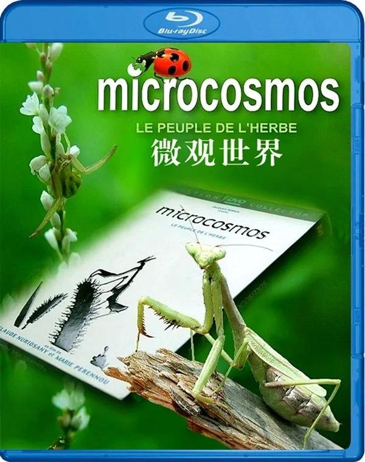
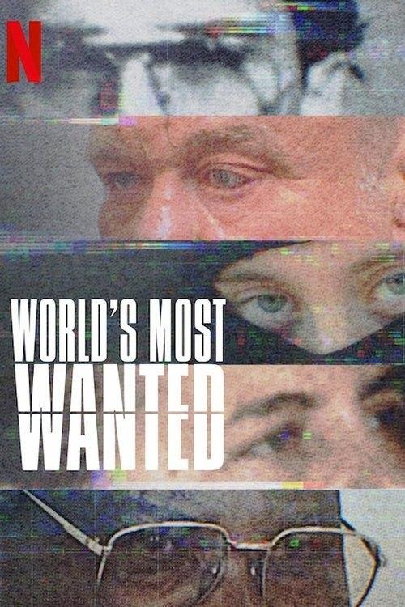

## 我们的星球镜头背后

[2026-09-18 22:33] 来自：纪录片资源频道

名称：我们的星球：镜头背后 (2019) 4K HDR 内封简繁字幕

描述：《地球脉动》创剧人倾情打造的《我们的星球》采用令人惊艳的摄影和技术，采用前所未有的摄影方式探索了地球上尚存的野生区域和那里的动物。

夸克网盘：https://pan.quark.cn/s/38bb0aa15118

📁 大小：8.5GB

🏷 标签：#我们的星球：镜头背后 #纪录片

---

## 蒙古草原天气晴

[2026-09-18 19:26] 来自：纪录片资源频道

名称：蒙古草原，天气晴 (2006) 1080P 简中特效字幕

描述：冒险家关野吉晴，在去探索南美最南端到非洲的途中，和一个蒙古的6岁女孩相遇了，和小女孩的家庭开始了长达5年的交流，看到了在蒙古社会主义向市场经济变化对游牧民生活的种种影响。

夸克网盘：https://pan.quark.cn/s/06b6cfbbb808

📁 大小：1.7GB

🏷 标签：#蒙古草原，天气晴 #纪录片

---

## 下饭魂下饭江湖

[2026-09-18 19:20] 来自：纪录片资源频道

名称：下饭魂·下饭江湖 (2021) 1080P 全8集

描述：讲的是美食江湖，那些人那些店绝非昙花一现，身处美食江湖中的江湖人，他们有所为，有所不为；他们也许在市井之中，也许在高楼之上；他们有故事、有态度、有手艺，我们在内心怀着勇气踏进江湖去寻找他们。我们将要寻找的江湖人，可能深藏于荒僻郊野处挖掘的饭馆中，亦或者是在跟着老饕去吃大隐隐于市的小馆子中，他们无论多么惊心动魄的身世故事、店小二的个性，落在食物上，是不动声色的简单，是瞬间将平淡无奇的“美食”变得有了灵魂。

夸克网盘：https://pan.quark.cn/s/5a0dbfc54821

📁 大小：16.3GB

🏷 标签：#下饭魂·下饭江湖 #纪录片

---

## 微观世界

[2026-09-18 10:54] 来自：综合网盘资源频道

名称：微观世界 (1996) 1080p 原盘REMUX 中文字幕 AVC DTS-HD MA 5.1

描述：豆瓣9.1高分

一部关于草地与池塘中昆虫生态的纪录片。

迅雷网盘：https://pan.xunlei.com/s/VP1mQAcNo-7zjavY-GrYhdGyA1?pwd=kmyg

📁 大小：

🏷 标签：#纪录片 #自然 #微观世界 #1080p #原盘REMUX #中文字幕 #DTSHD #xunlei

---

## 真相直击深入全美超模大赛

[2026-09-17 22:52] 来自：纪录片资源频道

名称：真相直击：深入全美超模大赛 (2026) 1080P 全3集 简英双语硬字幕

描述：聚焦《超级名模生死斗》，绝对不容错过。节目最初只是提供给模特儿新秀的亮丽跳板，后来却逐渐演变成重量级流行文化现象，充斥着戏剧化纠葛、公然失态，以及种种至今仍持续在网络上引发话题的争议。《真相直击》揭露节目留下的种种复杂影响，并问出一个尖锐的问题：为了娱乐，我们愿意做到什么程度？

夸克网盘：https://pan.quark.cn/s/8a862a771996

📁 大小：4.6GB

🏷 标签：#真相直击：深入全美超模大赛 #纪录片 #NF

---

## 最美公路

[2026-09-17 19:46] 来自：纪录片资源频道

名称：最美公路 (2018) 1080P 全6集

描述：中国故事由中国的道路书写。中国公路系统已绵延辐射457万公里，挂壁、跨海、飞天，辽阔多元的景观、叹为观止的工程、复杂多样的系统，超乎人们的想象。这些路代表着中华的文化，象征着人类的精神，蕴含着动人的故事。

夸克网盘：https://pan.quark.cn/s/5197d236613d

📁 大小：5.4GB

🏷 标签：#最美公路 #纪录片

---

## 楚汉

[2026-09-17 17:19] 来自：夸克云盘影视资源频道

名称：楚汉 (2019) 4K 全4集

描述：本片是由河南华之杰文化传播有限公司与央视纪录频道合作拍摄的一部大型历史纪录片，制片人王子龙，导演海金星，崔向忠，摄影赵发仲，岳川，配音苏扬。公元前206年，一场博弈在27岁的项羽和51岁的刘邦之间展开。一方是楚国上将军、诸侯军统帅，一方是楚国郡守，关中新主人；一方是消灭了秦军主力部队的猛将，一方是推翻了秦朝朝廷的长者……。同在楚怀王帐下听令的两个人，在共同的敌人秦朝灭亡后，第一次发生了正面对峙。从鸿门之宴到 暗度陈仓，从楚河汉界到霸王别姬，在之后的四年里，所向披靡的项羽与老谋深算的刘邦，又经历了怎样的心路历程？一切未知的变数，尽在”楚汉相争”这盘错综复杂的棋局之中……

夸克网盘：https://pan.quark.cn/s/095403f91ddd

百度网盘：https://pan.baidu.com/s/1tflMaMow9_SPh9PXJPqJuw?pwd=oq82 来自：阿里、夸克、百度网盘4K影视资源 [2026-09-17 17:19] 名称：楚汉 (2019) 4K 全4集

📁 大小：3.2GB

🏷 标签：#楚汉 #纪录片

---

## 大敦煌

[2026-09-17 17:17] 来自：夸克云盘影视资源频道

名称：大敦煌 (2023) 4K HDR 全4集

描述：本片以敦煌作为史实例证，用全球视野和历史目光，通过对今天敦煌文物遗存的记录和历史细节的讲述，阐释中华民族的文化包容、文明交流和博大胸怀。

夸克网盘：https://pan.quark.cn/s/b06a71debba7

百度网盘：https://pan.baidu.com/s/1QCP0fVZKcMqZ-Kod9a8MKw?pwd=35jc 来自：阿里、夸克、百度网盘4K影视资源 [2026-09-17 17:17] 名称：大敦煌 (2023) 4K HDR 全4集

📁 大小：48.5GB

🏷 标签：#大敦煌 #纪录片

---

## 微观世界

[2026-09-17 10:52] 来自：综合网盘资源频道

名称：微观世界 (1996) 1080p 原盘REMUX 中文字幕 AVC DTS-HD MA 5.1

描述：豆瓣9.1高分

一部关于草地与池塘中昆虫生态的纪录片。

夸克网盘：https://pan.quark.cn/s/7d162191eee4

百度网盘：https://pan.baidu.com/s/1Jmjn_-srjQXaAyKwyXQxVQ?pwd=Yu88

📁 大小：

🏷 标签：#纪录片 #自然 #微观世界 #1080p #原盘REMUX #中文字幕 #DTSHD #quark #baidu

---

## 人生海海

[2026-09-16 17:14] 来自：综合网盘资源频道

名称：人生海海 (2025)

描述：这一档聚焦餐饮行业的职场连续观察纪录片，节目以全球知名火锅品牌为观察样本，通过记录一家门店的经营日常，深入挖掘员工群体的工作与生活故事。通过真实记录，走近我们身边最熟悉的陌生人——服务员，以及他们背后的服务行业，展现职场中的个体成长与社会关系的复杂性，并引发观众对现代职场生态的深度思考。

夸克网盘：https://pan.quark.cn/s/41dbd8723505

📁 大小：AA

🏷 标签：#纪录片 #人生海海 #quark

---

## 玄奘大师

[2026-09-16 17:11] 来自：综合网盘资源频道

名称：玄奘大师 (2009)

描述：对于绝大多数中国人来说，"玄奘"这个人名非常陌生，人们熟悉的是《西游记》中的那个唐僧。《西游记》是中国文学史上的经典，经典的力量是勿庸置疑的。自明代吴承恩创作《西游记》以来，一个阴柔懦弱、性别不明的唐僧形象已经深深地铭刻在中国人的心里。在人们津津乐道于孙悟空的时候，唐僧的原型，玄奘却被扭曲、被误读。几个世纪的时间里，真实的玄奘越走越远，逐渐离开了中国人的视线，只剩下一个轮廓模糊的背影。

公元2005年的冬天，在北京平安大街一个普通的茶馆，时间已过半夜。昏暗的灯光下，几个已近中年的男人眉飞色舞，几近痴狂之状。城市白日的喧嚣已经过去，疲惫的人们正在进入梦乡，街道上游荡着三三两两几个无眠的人。在这样的时刻，世俗的欲望和压迫都逐渐消退，多年不曾光顾的激情开始在昏暗的茶馆弥漫。血色逐渐爬上一张张原本菜色的脸，白天的矜持和理智不见了，青春似乎又一次降临。

夸克网盘：https://pan.quark.cn/s/f674f4a176f5

📁 大小：AA

🏷 标签：#纪录片 #玄奘大师 #quark

---

## 与摩根弗里曼一起穿越虫洞

[2026-09-16 12:17] 来自：纪录片资源频道

名称：与摩根·弗里曼一起穿越虫洞 (2010) 4K 高码  全8集 简英双语硬字幕

描述：宇宙是什么？宇宙的起源是怎样的？宇宙真的只存在我们地球人类吗？外星生物真的只是一个理论吗？你有没有想过，当你身处黑洞，或进入虫洞可以实现时间旅行，你会怎样？让我们一起跟随着奥斯卡影帝Morgan Freeman走进我们这个神秘的宇宙，一起来揭开它的神秘面纱吧！

夸克网盘：https://pan.quark.cn/s/07107eaeb924

📁 大小：25GB

🏷 标签：#纪录片 #与摩根·弗里曼一起穿越虫洞

---

## 奇食记

[2026-09-16 12:10] 来自：影视动漫分享|SeedHub|夸克|网盘|🧲

名称：奇食记 (2021)

#电视剧 #纪录片 #夸克

主演: 

豆瓣: [7.3](https://movie.douban.com/subject/35280877/)

该纪录片是国内首部“反美食”的美食纪录片。

人类的文明史，其实就是食物的进化史，在漫长岁月中，赖以生存的“食物”逐渐变成了“美食”，各种烹饪手段也让食材变得美..

夸克网盘：https://pan.quark.cn/s/cb5a3b4bf3a5

---

## 世界头号通缉犯

[2026-09-15 23:40] 来自：纪录片资源频道

名称：世界头号通缉犯 (2020) 1080P 全5集 内封简繁字幕

描述：尽管有巨额悬赏和全球搜捕，这些涉嫌滔天重罪的疑犯还是逃脱了追捕。这部系列纪录片将为观众介绍全球的头号通缉犯。

夸克网盘：https://pan.quark.cn/s/99bf594bad58

📁 大小：8.8GB

🏷 标签：#世界头号通缉犯 #纪录片 #犯罪 #NF

---

## 来宵夜吧

[2026-09-15 22:34] 来自：纪录片资源频道

名称：来宵夜吧 (2021) 4K 全25集

描述：当一日的忙碌结束，夜幕降临，世界开始大不相同。这是一个属于自由、热闹和欢笑的时光，是属于寻觅味觉冲击、找寻情绪归宿的时光。从舌尖的享受到胃里的满足，从推杯换盏到情绪的释放，中国人的宵夜，消化着每个城市的所有情绪，是对过去一天的告别，也是对崭新一天的迎接。《来宵夜吧》力求从宵夜美食入手，从吃宵夜的各色人群入手，讲述充满诱惑的食物味道，也讲述充满情感的人生“味道”。

夸克网盘：https://pan.quark.cn/s/c0393cdbc93e

📁 大小：20.6GB

🏷 标签：#来宵夜吧 #纪录片

---

## 非遗探中华

[2026-09-15 20:30] 来自：夸克云盘影视资源频道

名称：非遗探中华 (2025) 4K 全4集

描述：《非遗探中华》是由腾讯新闻出品的关注国家级非遗传承人、守护人故事的纪录片。节目围绕“传承”主题，选取四个有历史底蕴和文化象征的国家级非遗项目——徽墨、金石篆刻、汉绣、汝瓷，走近非遗大师的匠心人生，探究他们的传承困局和各自的解困之道。

夸克网盘：https://pan.quark.cn/s/15cc22fb7901

百度网盘：https://pan.baidu.com/s/1zSa3BorN4x636sjze38zxQ?pwd=e8m3 来自：阿里、夸克、百度网盘4K影视资源 [2026-09-15 20:30] 名称：非遗探中华 (2025) 4K 全4集

📁 大小：1.4GB

🏷 标签：#非遗探中华 #纪录片

---

## 脸庞村庄

[2026-09-15 15:54] 来自：综合网盘资源频道

名称：脸庞，村庄(2017)【1080p 原盘REMUX】【内封简繁字幕】

描述：豆瓣9.1高分

第42届多伦多国际电影节(2017)纪录片单元观众选择奖，法国新浪潮祖母阿涅斯·瓦尔达与街头艺术家JR导演，纪录片伴随两人驾驶着JR的小货车穿越法国的村庄。一路上他们拍摄下所遇到的人物，然后在房子和工厂的墙上涂抹告示牌尺寸大小的肖像画。提名了奥斯卡最佳纪录片。

迅雷网盘：https://pan.xunlei.com/s/VP1Z06JHDjqBzovV1xtSDC2BA1?pwd=xsp2

📁 大小：23.7GB

🏷 标签：#纪录片 #脸庞 #村庄 #1080p #原盘REMUX #内封简繁字幕 #xunlei

---

## 9月11日美国的一天

[2026-09-15 15:21] 来自：综合网盘资源频道

名称：9月11日：美国的一天 (2021) 1080p WEB-DL 国英双语 中文字幕 H264 DDP 5.1

描述：豆瓣9.4高分

在9/11纪念馆和博物馆的官方合作下，这部纪录片系列带观众经历了2001年9月11日历史性早晨的悲惨时刻。

迅雷网盘：https://pan.xunlei.com/s/VP1Yuq09Z7uFvxouUfovNDZyA1?pwd=pukt

📁 大小：

🏷 标签：#纪录片 #美国的一天 #1080p #WEBDL #国英双语 #中文字幕 #xunlei

---

## 脸庞村庄

[2026-09-15 10:53] 来自：综合网盘资源频道

名称：脸庞，村庄(2017)【1080p 原盘REMUX】【内封简繁字幕】

描述：豆瓣9.1高分

第42届多伦多国际电影节(2017)纪录片单元观众选择奖，法国新浪潮祖母阿涅斯·瓦尔达与街头艺术家JR导演，纪录片伴随两人驾驶着JR的小货车穿越法国的村庄。一路上他们拍摄下所遇到的人物，然后在房子和工厂的墙上涂抹告示牌尺寸大小的肖像画。提名了奥斯卡最佳纪录片。

夸克网盘：https://pan.quark.cn/s/7f67c2e02f38

百度网盘：https://pan.baidu.com/s/1ATmxAw2gUDuSzYn8RWS-pw?pwd=KWYp

📁 大小：23.7GB

🏷 标签：#纪录片 #脸庞 #村庄 #1080p #原盘REMUX #内封简繁字幕 #quark #baidu

---

## 他们已不再变老

[2026-09-14 22:22] 来自：纪录片资源频道

名称：他们已不再变老 (2018) 1080P 内封简繁字幕

描述：电影聚焦于1914年—1918年一战士兵的日常生活。片中大部分史料均为首次公开，制作团队应用最顶尖修复、上色及3D 技术，将百年前影像进行全彩修复并重新加入声效，以英国老兵口述史为旁白还原一战士兵遭遇和感受，为观众呈现身临其境、极度真实的沉浸式战争体验。影片将于2019年11月11日（一战结束一百零一周年纪念日）全国艺联专线上映。

📁 大小：9.9GB

🏷 标签：#他们已不再变老 #纪录片 #战争 #历史

---

## 9月11日美国的一天

[2026-09-14 21:47] 来自：综合网盘资源频道

名称：9月11日：美国的一天 (2021) 1080p WEB-DL 国英双语 中文字幕 H264 DDP 5.1

描述：豆瓣9.4高分

在9/11纪念馆和博物馆的官方合作下，这部纪录片系列带观众经历了2001年9月11日历史性早晨的悲惨时刻。

百度网盘：https://pan.baidu.com/s/12RTxfEIBUi2JzsWu0SPvGQ?pwd=w7iU

📁 大小：

🏷 标签：#纪录片 #美国的一天 #1080p #WEBDL #国英双语 #中文字幕 #quark #baidu

---

## 东方谜案录

[2026-09-14 20:38] 来自：夸克云盘影视资源频道

名称：东方谜案录 (2024) 4K 全10集

描述：安眠药杀夫、百万网红“人间蒸发”......拨开层层迷雾，锁定近年来备受关注的案件和灾难，《东方谜案录》以权威视角还原了案情和灾害始末，每一集都讲述了一个奇特案件。在领略这些令人难忘的犯罪故事和惊悚元素的同时，也深度思考了灾难或惨剧发生的原由，客观地刨析了人性的复杂和世事的无常。跌宕起伏，发人深省！

夸克网盘：https://pan.quark.cn/s/1157450f60f4

百度网盘：https://pan.baidu.com/s/1DLdA4H27yF3pqIftT-fCog?pwd=5AAi 来自：阿里、夸克、百度网盘4K影视资源 [2026-09-14 20:38] 名称：东方谜案录 (2024) 4K 全10集

📁 大小：2.7GB

🏷 标签：#东方谜案录 #纪录片

---

## 亚历山大大帝封神之路

[2026-09-14 20:15] 来自：纪录片资源频道

名称：亚历山大大帝：封神之路 (2024) 1080P 全6集 内封简繁字幕

描述：该剧将聚焦于著名的军事领袖亚历山大大帝(公元前356-前323)，作为国王腓力二世的儿子，亚历山大的军事才能帮助他建立了历史上最庞大最著名的帝国之一，其本人成为马其顿的传奇。尽管英年早逝，亚历山大仍然成为了一个极具影响力的人物，他的遗产时至今日仍被世人所铭记。

📁 大小：12GB

🏷 标签：#亚历山大大帝：封神之路 #纪录片 #NF

---

## 三江之源

[2026-09-13 12:10] 来自：影视动漫分享|SeedHub|夸克|网盘|🧲

名称：三江之源 (2020)

#电视剧 #纪录片 #夸克 #百度

主演: 

豆瓣: [8.1](https://movie.douban.com/subject/35027760/)

三江源头，世界屋脊，中华水塔，地处青藏高原东部，孕育和保持着大面积的原始高寒生态系统，维系着中国乃至亚洲生态安全命脉。本片真实捕捉了这片土地上正在发生的故事：这里有..

夸克网盘：https://pan.quark.cn/s/58e8a3e192d9

百度网盘：https://pan.baidu.com/s/1aRHYu62N0eSA7l-s6Ki8rg?pwd=V2sM

---

## 与摩根弗里曼一起穿越虫洞

[2026-09-13 11:32] 来自：肯德基の4K影视综合电影云盘站

名称：与摩根·弗里曼一起穿越虫洞 (2010)【8集全】【4K.高码率】【内嵌简英】

描述：豆瓣9.3高分

宇宙是什么？宇宙的起源是怎样的？宇宙真的只存在我们地球人类吗？外星生物真的只是一个理论吗？你有没有想过，当你身处黑洞，或进入虫洞可以实现时间旅行，你会怎样？让我们一起跟随着奥斯卡影帝Morgan Freeman走进我们这个神秘的宇宙，一起来揭开它的神秘面纱吧！

夸克网盘：https://pan.quark.cn/s/fbb5fe9abc9a

📁 大小：25GB

🏷 标签：#纪录片 #与摩根·弗里曼一起穿越虫洞 #4K #高码率 #内嵌简英

---

## 跟着唐诗去旅行

[2026-09-12 22:52] 来自：纪录片资源频道

名称：跟着唐诗去旅行 第二季 (2024) 1080P 全6集

描述：该片共分石鼓歌、寒江雪、出塞曲、琵琶行、双星会、相见难六个主题，追随李白、杜甫、韩愈、柳宗元、李商隐、白居易、岑参、王维、王昌龄等诗人的足迹，邀请西川、蔡天新、韩松落、杨雨、鲁大东和黄晓丹六位文化嘉宾作为这场旅行的“伴游”，带着任务上路一起重返唐诗发生的地方。该片旨在探寻唐诗与唐代文化，呈现诗人笔下的自然景观与人文情怀。与第一季重返唐诗发生地、体会诗人人生不同，第二季的视野聚焦于影响诗人人生和诗歌创作的关键阶段，更多关注和触摸唐代诗人的内心世界

📁 大小：6.4GB

🏷 标签：#跟着唐诗去旅行 #纪录片

---

## 书简阅中国

[2026-09-12 09:04] 来自：综合网盘资源频道

名称：书简阅中国(2021)【6集全】【4K.高码率】【内嵌简中】【纪录片/历史】

描述：豆瓣9.0高分

六集纪录片《书简阅中国》收集了30封古人的书信，着重从书信中挖掘人物故事和历史细节，去窥探书信背后个体与时代的沉浮，去领悟潜藏在书信中的先贤智慧。希望沉淀千年的哲思，可以给当下的我们以启发；希望历史的真相，在这些个体的描述中，变得更加生动。

📁 大小：48.6GB

🏷 标签：#历史 #纪录片 #书简阅中国 #4K #高码率 #内嵌简中 #quark

---

## 迁徙的鸟

[2026-09-12 08:37] 来自：综合网盘资源频道

名称：迁徙的鸟(2001)【1080p 原盘REMUX】【国打双语】【内封简繁英】

描述：豆瓣9.1高分

这部纪录片探索了鸟类穿越四十个国家和七大洲的迁徙过程。

📁 大小：17.4GB

🏷 标签：#纪录片 #迁徙的鸟 #1080p #原盘REMUX #国打双语 #内封简繁英 #quark #baidu

---

## 史泰龙的传奇

[2026-09-11 23:13] 来自：综合网盘资源频道

名称：史泰龙的传奇 Sly (2023)

描述：近 50 年来，从《洛奇》到《第一滴血》再到《敢死队》，西尔维斯特·史泰龙凭借经典角色和大片系列给数百万人带来了欢乐。这部回顾式纪录片让观众深入了解了这位荣获奥斯卡奖提名的演员、编剧、导演兼制片人，将他鼓舞人心的逆袭故事与他所塑造的那些不可磨灭的角色进行了对比。

📁 大小：AA

🏷 标签：#纪录片 #传记 #史泰龙的传奇 #quark

---

## 珍古道尔的传奇一生

[2026-09-11 22:54] 来自：综合网盘资源频道

名称：珍·古道尔的传奇一生 Jane (2017)

描述：影片主角是在世界上拥有极高声誉的动物学家珍·古道尔，她二十多岁时前往非洲的原始森林，为了观察黑猩猩，在那里度过了三十八年的野外生涯，后来常年奔走于世界各地，呼吁人们保护野生动物、保护地球环境。 导演布莱特·摩根尤其擅长人物刻画，他从100多个小时从未公布过的珍·古道尔在野外考察和访谈的影像资料中选材剪辑，以第一人称视角，讲述了珍·古道尔年轻时在非洲研究黑猩猩的故事。伴随菲利普·格拉斯的迷人配乐，让观众感受到在那个仍由男性主导野外科研的年代，一个女人如何通过激情、奉献和毅力改变世界。影片还把人类的命运与动物交织在一起，大大强化了人与自然的关系。

📁 大小：AA

🏷 标签：#纪录片 #传记 #珍·古道尔的传奇一生 #quark

---

## 国家公园万物共生之境

[2026-09-11 19:59] 来自：夸克云盘影视资源频道

名称：国家公园·万物共生之境 (2023) 4K 50帧 HLG 全集

描述：《国家公园·万物共生之境》以中国地形三大阶梯为地理线索，用自然视角、东方美学、国际语言，讲述了在国家公园生态系统下，雪豹、东北虎、大熊猫、朱鹮、金丝猴、藏羚羊等国宝级明星动物与人类相伴同行，共同再造平衡与和谐的故事，阐述了在人与自然和谐共生的中国式现代化进程中所凝聚的绿色发展理念。

📁 大小：70.3GB

🏷 标签：#国家公园·万物共生之境 #纪录片

---

## 巨钻大盗千禧奇案解密

[2026-09-11 19:50] 来自：纪录片资源频道

名称：巨钻大盗：千禧奇案解密 (2025) 1080P 全3集 简中硬字幕

描述：这部比小说更离奇的犯罪喜剧通过作案歹徒和追缉警方的叙述，对这起抢劫宝石未遂案进行了探讨。

📁 大小：3.1GB

🏷 标签：#巨钻大盗：千禧奇案解密 #纪录片 #犯罪

