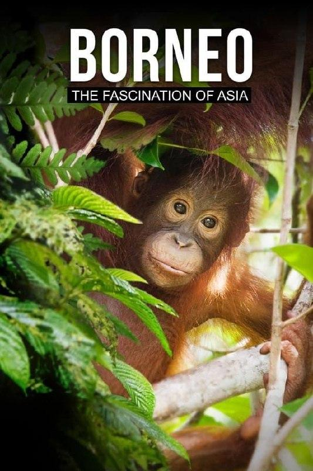
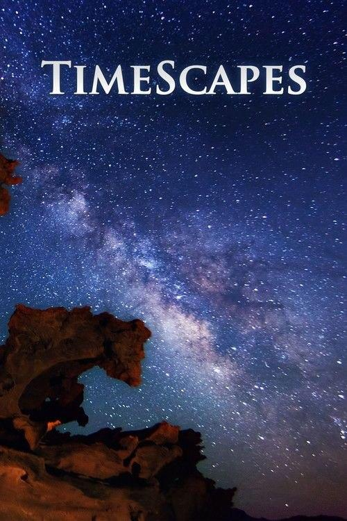

## 汉字五千年

[2026-09-24 12:10] 来自：影视动漫分享|SeedHub|夸克|网盘|🧲

名称：汉字五千年 (2009)

#电视剧 #纪录片 #夸克

主演: 李野墨 

豆瓣: [8.4](https://movie.douban.com/subject/3571540/)

一部介绍汉字在过去五千年中演变和使用的纪录片。..

夸克网盘：https://pan.quark.cn/s/120109d53532

---

## 婆罗洲亚洲的魅力

[2026-09-23 23:23] 来自：纪录片资源频道

名称：【原盘】婆罗洲：亚洲的魅力 (2017) 4K REMUX SDR 外挂简中字幕

描述：婆罗洲：亚洲的魅力!在4K幻灯片上拍摄这篇引人注目的纪录片是由马来西亚，印度尼西亚和文莱等全球第三大岛——格陵兰和新几内亚——展开探险之旅这部分的资料提供本岛周围许多有趣的资料，让人对资料有很大的了解。因此，你拥有近乎原始雨林，这小岛的面积是德国的两倍，而不只是珍稀植物群的家园。同样，当地还有些濒临灭绝的珍稀动物，比如长鼻猴和红猩猩但从前是世界上第三大热带雨林和热带雨林的栖息地，而且人类文明正日益蚕食这个自然乐园。这个乐园仍然是221种多样的哺乳动物、622种出名的鸟类和大约400种爬行动物和两栖动物。

夸克网盘：https://pan.quark.cn/s/1be0634f1d03

📁 大小：34GB

🏷 标签：#婆罗洲：亚洲的魅力 #纪录片

---

## 闪闪的儿科医生

[2026-09-23 17:32] 来自：综合网盘资源频道

名称：闪闪的儿科医生/闪闪的儿科医生4  第四季 (2026) 4K 更新EP10 哔哩哔哩 纪录片

描述： 《闪闪的儿科医生》是由哔哩哔哩和中广天择联合出品的治愈系医疗纪实节目。本季节目真实跟拍重庆医科大学附属儿童医院各科室的日常，聚焦普通人与医院的交集场景，围绕新生儿救治、学习困难、青少年心理等热点，记录医生救治疑难杂症、医患携手对抗病魔的动人故事。节目在展现儿科医学硬核突破的同时，细腻刻画鲜活的医者群像，透过医院这方社会切片折射人生百态，传递医者仁心与生命韧性，构建温暖互信的医患关系。

百度网盘：https://pan.baidu.com/s/1yeEt0RAkdsm0_KIzOUkMmQ?pwd=9i2s

📁 大小：NG

🏷 标签：#闪闪的儿科医生 #闪闪的儿科医生4 #4K #哔哩哔哩 #纪录片 #baidu

---

## 共犯者们

[2026-09-22 23:18] 来自：纪录片资源频道

名称：共犯者们 (2017) 1080P 简中硬字幕

描述：韩国纪录片电影，该纪录片将矛头瞄准韩国前总统李明博，前放送文化振兴会理事长金寓龙、前MBC电视台社长金在哲、前MBC电视台电视剧部门部长张根洙等李明博政府时期官员们也在影片中登场，讲述了李明博政府时期，官官相护、官商勾结，并利用KBS、MBC等电视台操纵舆论，欺骗大众的行为。

夸克网盘：https://pan.quark.cn/s/063c3fc31c83

📁 大小：2.4GB

🏷 标签：#共犯者们 #纪录片

---

## 时间的风景

[2026-09-22 21:54] 来自：纪录片资源频道

名称：时间的风景 (2012) 4K

描述：这部延时摄影能让您在家里亲临体验着令人窒息的雄伟壮观的美洲国家公园，其中包括阿拉斯加、优胜美地、大峡谷、大索尔、冰川、大提顿、锡安、布莱斯峡谷、拱桥等国家公园。本片画质极佳，得益于高端的拍摄器材，画面干净细腻，锐度惊人！配乐同样优美。雄伟壮观的延时摄影，真实纪录了美洲的国家公园！如果你没体验过斗转星移，日夜星辰......那就一起来吧。 《时间的风景》是备受赞誉的摄像师和导演，汤姆·劳的首部影片。影片采用慢镜头与定时拍摄的摄影技术，向我们展示了美国西南部陆地、人文以及野外令人惊叹的瑰丽景色。为拍摄本影片，劳开着他的丰田敞篷小卡车奔走于美国西南部，历时两年。 

夸克网盘：https://pan.quark.cn/s/6cadc4699c7c

📁 大小：8.1GB

🏷 标签：#时间的风景 #纪录片

---

## 重返三星堆

[2026-09-22 16:15] 来自：肯德基の4K影视综合电影云盘站

名称：重返三星堆 全5集 [2025][考古纪录片]

描述：该片聚焦三星堆最新出土具有代表性的文物，通过文物出土、清理、修复、研究，以及故事化讲述，重构历史场景，透物见人还原三星堆人的生活往事，揭示三星堆文明的演变进程，厘清三星堆文明的背景以及三星堆文明在中华文明、乃至世界文明中的影响力。

夸克网盘：https://pan.quark.cn/s/0e43ff04ff37?pwd=EyGU

百度网盘：https://pan.baidu.com/s/1ZCfqBk6ppGDXknsaWQViSw?pwd=7074

📁 大小：N

🏷 标签： #重返三星堆 #考古 #纪录片

---

## 地球劫后重生

[2026-09-21 22:29] 来自：肯德基の4K影视综合电影云盘站

名称：地球·劫后重生 全8集 [2026][纪录片]

描述：从2026年6月11日起，每周四晚，让我们齐聚一堂，共同领略自然世界的奇观。NBC将通过《幸存地球》带观众领略4.5亿年的生命史。这部里程碑式的系列剧颂扬了生命惊人的韧性以及每一种生物为延续至今所经历的非凡旅程；它展现了生命如何在地球最灾难性的环境危机中不仅幸存，更蓬勃发展。借助尖端的CGI技术，观众将沉浸于史前世界，跨越被陨石撞击、火山爆发、海平面骤降及灼热热浪塑造的奇异地貌，目睹从未登上荧幕的生物与它们精彩的生命故事。从4.5亿年前的巨型海蝎，到45万年前威武的猛犸象与剑齿虎，荡气回肠的地球史将会以前所未见的恢弘姿态呈现！

夸克网盘：https://pan.quark.cn/s/0284f2283785

百度网盘：https://pan.baidu.com/s/14GLjWcYHctJOTnAXEsl9YA?pwd=6666

📁 大小：N

🏷 标签： #地球·劫后重生 #劫后重生 #纪录片

