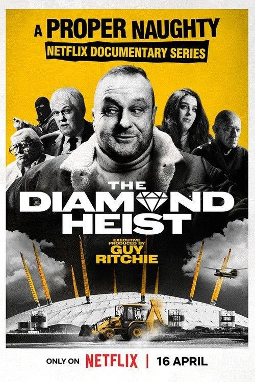

## 史泰龙的传奇

[2026-09-11 23:13] 来自：综合网盘资源频道

名称：史泰龙的传奇 Sly (2023)

描述：近 50 年来，从《洛奇》到《第一滴血》再到《敢死队》，西尔维斯特·史泰龙凭借经典角色和大片系列给数百万人带来了欢乐。这部回顾式纪录片让观众深入了解了这位荣获奥斯卡奖提名的演员、编剧、导演兼制片人，将他鼓舞人心的逆袭故事与他所塑造的那些不可磨灭的角色进行了对比。

夸克网盘：https://pan.quark.cn/s/abab59da30bb

📁 大小：AA

🏷 标签：#纪录片 #传记 #史泰龙的传奇 #quark

---

## 珍古道尔的传奇一生

[2026-09-11 22:54] 来自：综合网盘资源频道

名称：珍·古道尔的传奇一生 Jane (2017)

描述：影片主角是在世界上拥有极高声誉的动物学家珍·古道尔，她二十多岁时前往非洲的原始森林，为了观察黑猩猩，在那里度过了三十八年的野外生涯，后来常年奔走于世界各地，呼吁人们保护野生动物、保护地球环境。 导演布莱特·摩根尤其擅长人物刻画，他从100多个小时从未公布过的珍·古道尔在野外考察和访谈的影像资料中选材剪辑，以第一人称视角，讲述了珍·古道尔年轻时在非洲研究黑猩猩的故事。伴随菲利普·格拉斯的迷人配乐，让观众感受到在那个仍由男性主导野外科研的年代，一个女人如何通过激情、奉献和毅力改变世界。影片还把人类的命运与动物交织在一起，大大强化了人与自然的关系。

夸克网盘：https://pan.quark.cn/s/7a56ce202607

📁 大小：AA

🏷 标签：#纪录片 #传记 #珍·古道尔的传奇一生 #quark

---

## 国家公园万物共生之境

[2026-09-11 19:59] 来自：夸克云盘影视资源频道

名称：国家公园·万物共生之境 (2023) 4K 50帧 HLG 全集

描述：《国家公园·万物共生之境》以中国地形三大阶梯为地理线索，用自然视角、东方美学、国际语言，讲述了在国家公园生态系统下，雪豹、东北虎、大熊猫、朱鹮、金丝猴、藏羚羊等国宝级明星动物与人类相伴同行，共同再造平衡与和谐的故事，阐述了在人与自然和谐共生的中国式现代化进程中所凝聚的绿色发展理念。

夸克网盘：https://pan.quark.cn/s/a879b26dd87c

百度网盘：https://pan.baidu.com/s/1kmXRvkjKvPCWXvTOvYZxjA?pwd=j55e 来自：阿里、夸克、百度网盘4K影视资源 [2026-09-11 19:59] 名称：国家公园·万物共生之境 (2023) 4K 50帧 HLG 全集

📁 大小：70.3GB

🏷 标签：#国家公园·万物共生之境 #纪录片

---

## 巨钻大盗千禧奇案解密

[2026-09-11 19:50] 来自：纪录片资源频道

名称：巨钻大盗：千禧奇案解密 (2025) 1080P 全3集 简中硬字幕

描述：这部比小说更离奇的犯罪喜剧通过作案歹徒和追缉警方的叙述，对这起抢劫宝石未遂案进行了探讨。

夸克网盘：https://pan.quark.cn/s/7bb2a189f5e8

📁 大小：3.1GB

🏷 标签：#巨钻大盗：千禧奇案解密 #纪录片 #犯罪

