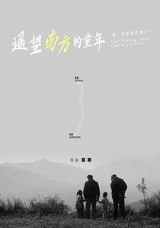

## 遥望南方的童年

[2026-09-20 12:11] 来自：夸克云盘影视资源频道

名称：遥望南方的童年 (2007) 1080P

描述：由于父母大都去南方城市打工，村中剩下的全是老人和儿童，小学教师易明堂（易志兵 饰）不忍这些孩子重蹈父辈的路，决定开办一所家庭幼儿园，教孩子们学文化，下岗的妻子（何伟欣 饰）当园长，初中生李响（谢媛 饰）当了老师。由于条件简陋，易明堂腾出家中祖宅做孩子们的活动场所。幼儿园开班后，各种意想不到的困难接踵而至，有的家庭连低廉的学费都交不起。陀陀因李响教育失当离园出走，李响很是内疚，她想报考师范学校系统地学习。秀秀的妈妈打工回来，女儿竟不认她，加之丈夫有了外遇，她伤心地离开了家乡。由于易明堂没有办学资质，乡里勒令他把幼儿园关闭。令易明堂心酸的是，这些留守儿童将来怎么办......

夸克网盘：https://pan.quark.cn/s/efbe8c5483af

百度网盘：https://pan.baidu.com/s/1Q7RzPcSxpeW3YpD9SJM-mA?pwd=698y 来自：阿里、夸克、百度网盘4K影视资源 [2026-09-20 12:11] 名称：遥望南方的童年 (2007) 1080P

📁 大小：2GB

🏷 标签：#纪录片 #遥望南方的童年

---

## 大象女王

[2026-09-19 17:59] 来自：纪录片资源频道

名称：大象女王 (2019) 4K HDR 外挂简中字幕

描述：雅典娜是一位母亲，当他们被迫离开他们的水坑时，她会尽她所能保护她的牧群。这一史诗般的旅程，由Chiwetel Ejiofor讲述，带领观众穿越非洲大草原，进入大象家庭的核心。一个关于爱，失去和回家的故事。

夸克网盘：https://pan.quark.cn/s/6dac4d8423a7

📁 大小：16.3GB

🏷 标签：#纪录片 #大象女王

---

## 地球脉动生命礼赞

[2026-09-19 17:45] 来自：纪录片资源频道

名称：地球脉动：生命礼赞 (2020) 1080P 外挂简英双语字幕

描述：融合《地球脉动II》和《蓝色星球II》的精彩故事。 Bringing together spectacular sotries from Plant Earth II and Bule Planet II.

夸克网盘：https://pan.quark.cn/s/d20a4ac4f7d6

📁 大小：4.2GB

🏷 标签：#纪录片 #地球脉动：生命礼赞

