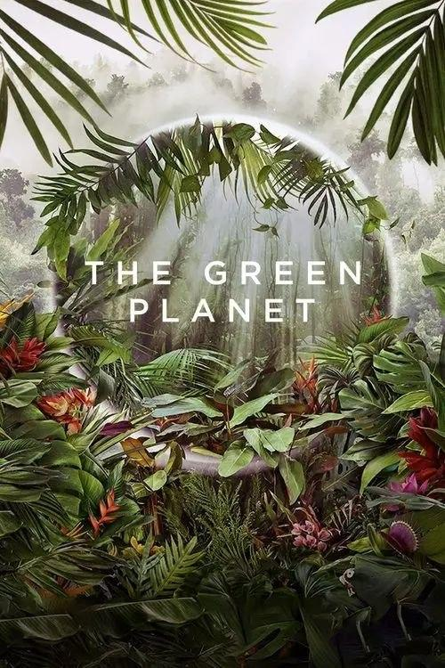

## 美丽西江

[2026-10-02 23:36] 来自：纪录片资源频道

名称：美丽西江 (2016) 1080P 全12集

描述：《美丽西江》由中央电视台纪录频道、广东广播电视台、广西电视台联合摄制，施燕峰、刘竺执导的纪录片。 该片分为《活力》《水生》《润土》《村落》《奇观》《生机》《守望》《传承》《米粉》《码头》《飘香》《甜美》共12集，全景式展示西江流域作为中国生态文明高地真实状况 。 该片于2016年1月1日至6日在中央电视台纪录频道首播

夸克网盘：https://pan.quark.cn/s/bc0c1aff41a5

📁 大小：5.6GB

🏷 标签：#美丽西江 #纪录片

---

## BTS天团回归

[2026-10-02 12:10] 来自：影视动漫分享|SeedHub|夸克|网盘|🧲

名称：BTS：天团回归 (2026)

#电影 #音乐 #纪录片 #夸克

主演: 郑号锡 朴智旻 金硕珍 

豆瓣: [8.1](https://movie.douban.com/subject/38364624/)

防弹少年团强势回归！成员们齐聚洛杉矶，录制新专辑《阿里郎》。这部纪录片将以全新的视角展现防弹少年团，见证他们迈入新时代的旅程。..

夸克网盘：https://pan.quark.cn/s/c3d0c5e08655

---

## 绿色星球

[2026-10-01 22:43] 来自：百度网盘综合频道

名称：绿色星球 (2022) 4K HDR 全5集 国英多音轨 内封简繁英特效字幕

描述：植物，它们既能与动物形成互惠互利的关系，也可以像地球上的任何生物一样具有攻击性、竞争性和戏剧性。为争夺光照、空间、营养和为家族开枝散叶的机会，它们会与竞争对手、动物和元素进行致命的斗争。该片展示了跨越二十多年的新发现，同时揭示了相互紧密联系的植物世界。专业摄像机使人们拥有超越人眼的能力，比以往任何时候都观察的更贴近与深入。带人们从植物的角度看地球。

百度网盘：https://pan.baidu.com/s/1Uc3MUG-W9W0TJNi_Gnt4Qw?pwd=0356

📁 大小：48.9GB

🏷 标签：#绿色星球 #纪录片

---

## 越南改变美国的战争

[2026-10-01 20:15] 来自：百度网盘综合频道

名称：越南：改变美国的战争 (2025) 1080P 全6集 简中硬字幕

描述：这部纪录片系列结合了现身说法和沉浸式运镜，讲述经历过战争的人们生命中那些非凡、私密且发人深省的人性故事，并探讨美国如何因为战争而改头换面。

百度网盘：https://pan.baidu.com/s/1N6k-Cww125bvLT3O15bCdQ?pwd=789r

📁 大小：6.3GB

🏷 标签：#越南：改变美国的战争 #纪录片 #苹果

---

## 亲爱的不要跨过那条江

[2026-10-01 19:37] 来自：纪录片资源频道

名称：亲爱的，不要跨过那条江 (2014) 1080P 外挂简中字幕

描述：《亲爱的,不要跨过那条江》讲述了89岁老奶奶姜溪烈（音）和比她大9岁的老爷爷赵炳万（音）夫妇的故事。影片以江原道橫城山村的自然景色为背景，讲述像恋人一样度过76年的“肉麻情侣”老夫妇甜蜜生活的场景和突然的离别。

夸克网盘：https://pan.quark.cn/s/435d71c60617

📁 大小：3.6GB

🏷 标签：#亲爱的，不要跨过那条江 #纪录片 #爱情 #家庭

---

## 山海经奇

[2026-10-01 09:30] 来自：综合网盘资源频道

名称：山海经奇 第一季 (2023) 4K HDR 全8集

描述：取材于上古奇书《山海经》里的神话传说故事，纪录片《山海经奇》自带中国人骨髓里奇幻浪漫的气质：女娲造人、烛龙睁眼为昼、羲和浴日、羿射九日、嫦娥奔月、夔皮作鼓等远古恢弘的传奇故事，都隐藏着先人刻骨铭心的告诫；那些家喻户晓的英雄人物，都蕴含着中华祖先前仆后继的血脉凝聚。

夸克网盘：https://pan.quark.cn/s/b893ea5994a9

百度网盘：https://pan.baidu.com/s/1Yk879Hzgc2SqJ1hdAsNOMQ?pwd=468w

📁 大小：13GB

🏷 标签：#纪录片 #山海经奇 #4K #HDR #ali #quark #baidu

---

## 海昏侯

[2026-09-30 22:20] 来自：综合网盘资源频道

名称：海昏侯 (2019) 4K 全3集

描述：一场失败的盗墓，开启了一场长达七年的考古发掘。此墓位于当年被称为“蛮夷之地”的豫章境内，却发现了数量惊人的金器，数以万计的五铢钱，只有帝王才能享用的真车真马陪葬，精致温润的玉器，成套的高等级编钟，如此多的财富为何埋葬于此？它们的主人究竟是谁？三集大型纪录片《海昏侯》，细致记录了海昏侯大墓三年多来的考古发掘全过程。节目以海昏侯戏剧性的一生为线索，讲述了西汉时期的政治、社会生活等丰富的内容，令观众见证第一考古现场。

夸克网盘：https://pan.quark.cn/s/a2b161d760cd

百度网盘：https://pan.baidu.com/s/1hIZTDvNfKMVWYTwqJp1pzg?pwd=7603

📁 大小：5.9GB

🏷 标签：#海昏侯 #纪录片 #4K #ali #quark #baidu

---

## 梁思成林徽因

[2026-09-30 15:03] 来自：综合网盘资源频道

名称：梁思成·林徽因 (2010) 1080P 全8集

描述：讲述了“大时代背景下跌宕起伏的个人命运”：一对著名夫妇的人生轨迹和中国近现代的激荡史密切交织。这个故事所蕴涵的精神气质，是我们追索和展现这一传奇故事的动因。梁思成，男，广东省新会人，是中国著名的建筑学家和建筑教育家。毕生从事中国古代建筑的研究和建筑教育事业。系统地调查、整理、研究了中国古代建筑的历史和理论，是这一学科的开拓者和奠基者。曾参加人民英雄纪念碑等设计，是新中国首都城市规划工作的推动者，建国以来几项重大设计方案的主持者。是新中国国旗、国徽评选委员会的顾问。林徽因，建筑学家和作家，为中国第一位女性建筑学家，同时也被胡适誉为中国一代才女。

夸克网盘：https://pan.quark.cn/s/d35e3f41fc30

百度网盘：https://pan.baidu.com/s/1xoywFwJ332AJnx9kMBfZ2A?pwd=z5w1

📁 大小：30.6GB

🏷 标签：#梁思成 #林徽因 #纪录片 #梁思成·林徽因 #1080P #ali #quark #baidu

---

## 书迷

[2026-09-30 12:10] 来自：影视动漫分享|SeedHub|夸克|网盘|🧲

名称：书迷 (2018)

#电视剧 #纪录片 #夸克 #百度

主演: 朱赢椿 饶平如 马力 

豆瓣: [8.4](https://movie.douban.com/subject/30200070/)

本系列节目讲述爱书人的故事。节目从书籍制作、书店运营、寻书和书商等不同视角展开，共分为四集：《书籍的诞生》，追溯一本书的创作过程，讲述书籍设计师、作者和编辑如何携手..

夸克网盘：https://pan.quark.cn/s/86f8942e276e

百度网盘：https://pan.baidu.com/s/16m5oz0NbMh9ArsSVbEE9fA?pwd=825A

---

## 美国美丽之境

[2026-09-30 01:21] 来自：百度网盘综合频道

名称：美国：美丽之境 (2022) 4K HDR10 全6集 内封简繁字幕

描述：在北美这片神奇的土地上，无论在哪里，总有英雄能将其打造成家园。它们具备各种能力，北美红松鼠的坚忍不拔、美国短吻鳄的耐心、短吻真海豚的团队合作。这片土地塑造了这些英雄，而英雄们为各处美景增辉不少。而共同生活在这片土地上的人类，也在守护这片土地和宝贵的动物们。他们打造动物栖息地，努力捡起垃圾和影响生态的海胆，观察鲸鱼的动向并记录，凭自己的努力使动物繁殖地被纳入法律保护。而要在这里生存，守护这片土地，所有生物都得准确把握时机，同时还得适应这里的一切变化。例如蜜罐蚁，极端的干旱天气不能缓解，它们在蜜罐耗尽之后，只能随机应变地攻占其他蚁穴，抢走蜜罐。再如年迈的美洲野牛，无力应对寒冷的天气和追逐它的狼群，于是成为狼群的腹中餐，就此被淘汰。英雄之地，英雄辈出，动物和人类都在寻求一种和谐平衡的方式，在共享北美大地的同时，延续生态与人类的发展，谱写美好未来。

百度网盘：https://pan.baidu.com/s/1HGDZIzglSwMk2wEk_tKMJg?pwd=b7u5

夸克网盘：https://pan.quark.cn/s/05ec0d7f0ed6 来自：纪录片资源频道 [2026-09-30 01:20] 名称：美国：美丽之境 (2022) 4K HDR10 全6集 内封简繁字幕

📁 大小：33.2GB

🏷 标签：#美国：#美丽之境 #纪录片 #冒险 #迪士尼

