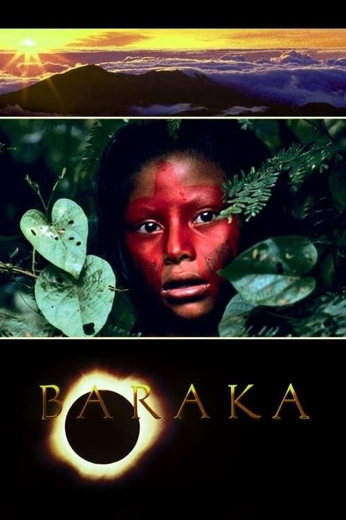
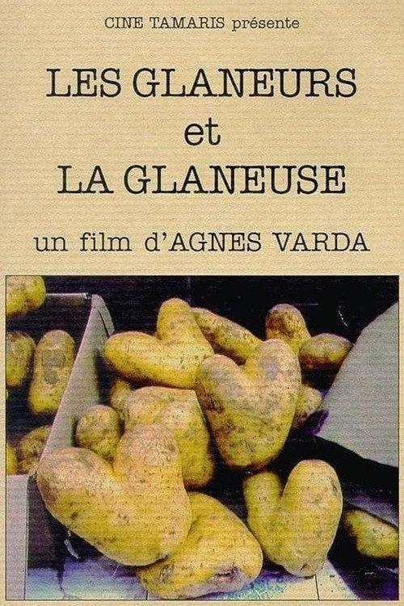

## 金银潭实拍80天

[2026-10-06 23:25] 来自：纪录片资源频道

名称：金银潭实拍80天 (2020) 1080P

描述：疫情来袭，武汉市金银潭医院从一个武汉人都觉陌生的名字，一夜之间成为抗疫救治最前线的代名词。自2月起开始为期80天深入红区（ICU）拍摄的大小故事，探秘身处水深火热的“潭”中人的笑与泪、痛与欣，映照金银潭医院由默默无闻到家喻户晓的砥砺与承担。五位病患，是平凡的国人，亦是不凡的国人，他们缩影了疫情中的千门万户，透照了纷繁复杂背后的人性纯真，以落点的真实细腻，传人心的破空之声。

夸克网盘：https://pan.quark.cn/s/2bc1f9d6b4fc

📁 大小：GB

🏷 标签：#金银潭实拍80天 #纪录片

---

## 天地玄黄

[2026-10-06 18:22] 来自：纪录片资源频道

名称：天地玄黄 (1992) 1080P 外挂简繁字幕

描述：我们是谁？从哪里来？又将归往何处？这些问题和我们的生存息息相关，但却很少有人能够给出准确的答案。历时14个月，穿越24个国家，导演罗恩·弗里克（Ron Fricke）用镜头向我们展示了大自然能够拥有的最壮阔最绚丽的景致——从远古到现在，从猿猴到人类，从荒无人烟的沙漠到震撼人心的宗教活动现场，从广袤天地带来的感动到婴孩单纯的笑脸给予的幸福，我们会发现，很多时候，我们并不能意识到，这美好的一切正时时刻刻的发生在我们身边。全片没有台词，片名Baraka在古伊斯兰语中代表祝福，这也是导演拍摄此片的初衷，祝福与我们共同存在在这颗蔚蓝地球上的一切。

夸克网盘：https://pan.quark.cn/s/bcfa1ac36694

📁 大小：7.9GB

🏷 标签：#天地玄黄 #纪录片

---

## 无节制消费的元凶

[2026-10-06 17:51] 来自：综合网盘资源频道

名称：无节制消费的元凶(2014)【3集全】【WEB-DL.1080p】【内嵌简中】

描述：我们为什么要买东西？谁让这个世界变得无节制消费？他们如何做到这一点？调查记者雅克•佩雷蒂审视了无节制消费潮流背后的机制，得出了答案。原来，使这个世界变得无节制消费的元凶，并不是人们普遍认为的广告员和市场推广员，而是这诸多因素背后那些首先改变产品然后改变我们的人们。纪录片表明，长久以来，制造商都梦想着在消费者大脑中植入“升级”观念，从而让无限消费成为现实。他们首先瞄准未被开发的儿童市场，学习应用向儿童销售的方法，从而增加向成年人的销售。但是，那头最肥的能够带来现金的奶牛却来自恐惧——通过挖掘消费者的恐惧，制造商发现了一个对健康和安全产品有巨大需求的世界。

迅雷网盘：https://pan.xunlei.com/s/VP3FbC-dZ78B9YqiuOPv84P1A1?pwd=h2rw

📁 大小：2.6GB

🏷 标签：#纪录片 #无节制消费的元凶 #WEBDL #1080p #内嵌简中 #xunlei

---

## 一招一食

[2026-10-06 12:11] 来自：影视动漫分享|SeedHub|夸克|网盘|🧲

名称：一招一食 (2026)

#电视剧 #纪录片 #百度

主演: 阎鹤祥 

豆瓣: [0](https://movie.douban.com/subject/38507856/)

计划将“功夫电影的美学”与“市井江湖的叙事”深度融合，开拓“新武侠美食”赛道。用凌厉剪辑塑造庖丁解牛的“刀光剑影”，让美食制作过程本身成为一场令人“血脉偾张”的视听..

百度网盘：https://pan.baidu.com/s/1mJ3IVRgtR127H4Ks976ptw?pwd=dm9n

---

## 梅林传奇

[2026-10-06 11:12] 来自：综合网盘资源频道

名称：梅林传奇 合集

描述：本剧根据亚瑟王与魔法师梅林的故事改编，由BBC威尔士电视台与Shine影视公司共同出品。

Merlin(科林·摩根 Colin Morgan 饰)受母亲的教导从家乡来到宫廷寻找宫廷御医头Gaius学艺。在那儿，魔法被国王严禁使用。Merlin会魔法的秘密还是被被Gaius发现，Gaius不但没有责备他，还收他为养子，并告劝他要将自身的天赋用于正道。Merlin还邂逅了深锁于城堡深处的古代巨龙，巨龙便告诉他自己身负着伟大的使命，而这项艰巨的任务就是保护王子Arthur，使Arthur成为未来的国王。为了能在Arthur身边保护他，Merlin成为了Arthur的贴身男仆。但事情并不像Merlin想象得那么顺利，邪恶的女巫Nimueh发现了Merlin身负的伟大使命，便施计企图陷害他…

夸克网盘：https://pan.quark.cn/s/249f7253d53f

📁 大小：AA

🏷 标签：#纪录片 #梅林传奇 #合集 #quark

---

## 拾穗者

[2026-10-05 23:53] 来自：纪录片资源频道

名称：拾穗者 (2000) 1080P 外挂简中字幕

描述：1998年12月至1999年4月，年过七旬的阿涅斯·瓦尔达带着数码摄像机在法国的城市和乡村“闲逛”的过程中，拍摄了一些关于当今时代法国拾荒者们的影像：流浪汉和生活贫困的人为维持生计拣拾各种生活必需品，艺术家们从废铜烂铁堆里寻找创造艺术作品的原料，喜欢拾荒的人的动机是出于反对浪费的品德。除了拾荒，影片还有一条游离于主线之外的副线，表现了一些表面看来与拾荒毫不相干、其实关系密切的人和事，比如采访一位兼做心理医生的葡萄园主，与发明电影的先驱者之一马莱的后代谈论电影问题。此外，本片还是一幅影片作者的自画像，瓦尔达不时从镜头后面走到镜头前面，即使当她在镜头后面时也有意地适度表现自己，而且有些镜头是她亲自拍摄的。

夸克网盘：https://pan.quark.cn/s/7133819b4314

📁 大小：6.2GB

🏷 标签：#拾穗者 #纪录片

---

## 无节制消费的元凶

[2026-10-05 18:29] 来自：综合网盘资源频道

名称：无节制消费的元凶 (2014) 1080p WEB-DL H264 AAC 2.0

描述：我们为什么要买东西？谁让这个世界变得无节制消费？他们如何做到这一点？调查记者雅克•佩雷蒂审视了无节制消费潮流背后的机制，得出了答案。原来，使这个世界变得无节制消费的元凶，并不是人们普遍认为的广告员和市场推广员，而是这诸多因素背后那些首先改变产品然后改变我们的人们。纪录片表明，长久以来，制造商都梦想着在消费者大脑中植入“升级”观念，从而让无限消费成为现实。他们首先瞄准未被开发的儿童市场，学习应用向儿童销售的方法，从而增加向成年人的销售。但是，那头最肥的能够带来现金的奶牛却来自恐惧——通过挖掘消费者的恐惧，制造商发现了一个对健康和安全产品有巨大需求的世界。

夸克网盘：https://pan.quark.cn/s/117e0cce1bf1

百度网盘：https://pan.baidu.com/s/11DRypSQAz2yk8wTMQs6zWg?pwd=Yu88

📁 大小：X

🏷 标签：#纪录片 #无节制消费的元凶 #1080p #WEBDL #AAC #quark #baidu

---

## 山海经奇

[2026-10-05 18:20] 来自：综合网盘资源频道

名称：山海经奇 第二季 (2024) 4K HDR 全8集

描述：中央广播电视总台纪录片《山海经奇2》，于2月20日在纪录频道播出，2月23日在优酷播出。“女娲造人、补天，烛龙吹冬呼夏，羲和浴日，羿射九日，嫦娥奔月，应龙杀蚩尤与夸父”等每个神话故事背后，暗含先人刻骨铭心的谆谆告诫，每个惊奇人物瞬间，凝聚祖先前仆后继的生命抗争，每一个初心，都代表对蛮荒世界无邪的认知。

夸克网盘：https://pan.quark.cn/s/ab9f698caf37

百度网盘：https://pan.baidu.com/s/1NDRisYIAaJ741tdIMTD8eQ?pwd=m14i

📁 大小：14.2GB

🏷 标签：#山海经奇 #纪录片 #4K #HDR #ali #quark #baidu

---

## 沉洞泉

[2026-10-05 15:12] 来自：影视动漫分享|SeedHub|夸克|网盘|🧲

名称：沉洞泉 (2019)

#电影 #纪录片 #夸克

主演: 

豆瓣: [7.4](https://movie.douban.com/subject/34434409/)

セノーテはメキシコのユカタン半島に点在する洞窟泉。マヤ文明の時代、雨乞い儀式で生けにえが捧げられた神聖な場所。小田監督は自分で水中撮影を敢行する一方で周辺住民を取材..

夸克网盘：https://pan.quark.cn/s/ab56911fe491

---

## 国家地理频道走进银河

[2026-10-04 20:03] 来自：纪录片资源频道

名称：国家地理频道：走进银河 (2010) 1080P 外挂简英双语字幕

描述：这是一部关于你我以及两千亿颗恒星历史的纪录片。我们的太阳系位于巨大天国的边缘，这一巨大的恒星群落依靠着引力组成银河系。如今，天文学家收集起来的数据让他们以一个新的令人兴奋的方式看待我们的银河系，如果我们可以近距离到访那些邻居，这些数据可以让我们通过穿越时间和空间的奇异旅行看到在我们巨大的恒星城市中其他的邻居是多么的不同。

夸克网盘：https://pan.quark.cn/s/30dc154b17e1

📁 大小：9.84GB

🏷 标签：#纪录片 #走进银河

---

## 攀登梅鲁峰

[2026-10-04 20:00] 来自：纪录片资源频道

名称：【原盘】攀登梅鲁峰 (2015) 1080P REMUX 外挂简繁字幕

描述：本片主要记录了三位登山家经历千难万险攀登梅鲁山的过程。这里的自然环境十分恶劣，在喜马拉雅山脉进行的冒险登山运动中。梅鲁山位于印度瓦尔喜玛拉雅山区，海拔六千多米，他们要到达的是梅鲁山的西北壁一个名为“鲨鱼鳍”的地方。攀爬难度非常大，因为冰雪覆盖，非常滑，需要放慢速度，但是如果放慢速度食物的供给便跟不上。他们携带笨重的拍摄装备，在攀登的过程中随时迎接突如其来的暴风雪以及山中变化莫测的天气，他们熟练地运用装备，团结一致，在攀爬的过程中相互帮助，应对寒冷与突发状况，挑战极限。最终他们克服了自身和外界的障碍，成功登顶。

夸克网盘：https://pan.quark.cn/s/9ae1d1757de0

📁 大小：23.1GB

🏷 标签：#攀登梅鲁峰 #纪录片 #冒险

---

## 山海经奇

[2026-10-04 12:10] 来自：影视动漫分享|SeedHub|夸克|网盘|🧲

名称：山海经奇 (2023)

#电视剧 #纪录片 #夸克 #百度

主演: 

豆瓣: [6.4](https://movie.douban.com/subject/27182686/)

奇兽、奇人、奇事。

取材于上古奇书《山海经》里的神话传说故事，纪录片《山海经奇》自带中国人骨髓里奇幻浪漫的气质：女娲造人、烛龙睁眼为昼、羲和浴日、羿射九日、嫦..

夸克网盘：https://pan.quark.cn/s/b893ea5994a9

百度网盘：https://pan.baidu.com/s/1Yk879Hzgc2SqJ1hdAsNOMQ?pwd=468w

---

## BBC达尔文和生命之树

[2026-10-03 19:51] 来自：纪录片资源频道

名称：BBC-达尔文和生命之树 (2009) 720P 外挂简中字幕

描述：激情四溢的“达尔文主义者”大卫艾登堡，对于广受争议的达尔文进化论，他提出了他的个人观点，并且认为进化论是所有他所提出的理论的基石。追溯到200年前，追随着那些变化——那些改变我们对自然世界的理解的变化，他提出了三个问题：达尔文为什么会提出他的进化论？是怎样提出的？为什么大多数人认为他的理论是正确的？为什么进化论现在显得比以往任何时候都重要？

夸克网盘：https://pan.quark.cn/s/985e8068fcab

📁 大小：1.46GB

🏷 标签：#纪录片 #达尔文和生命之树

---

## 大同

[2026-10-03 12:28] 来自：纪录片资源频道

名称：大同 (2016) 1080P

描述：曾经繁华的中国都市大同市，如今屹立在一堆废墟的旁边。这座城市不仅污染严重，还因其陈旧的基础设施和摇摇欲坠的经济前景而濒临瘫痪。但大同市长想要改变这一切，他大胆地宣布了一项试图重塑昔日的辉煌的新计划，要知道这座城市的文明已经有1600年了。然而，伴随着这项计划的是非常高的成本。数以千计的房屋被推倒，50万居民（占大同市总人口的百分之三十）将在他的打理下被重新安置。这位市长成功与否，完全取决于他是否能让愤怒的工人群体以及越来越忐忑的统治精英冷静下来。纪录片《中国市长》惊人地捕捉到了一个男人，甚至是一个国家疯狂跳跃着进入一个越来越动荡的未来的过程。 

夸克网盘：https://pan.quark.cn/s/a90d3ce7d265

📁 大小：7.8GB

🏷 标签：#大同 #纪录片 #AMZN

---

## 重返狼群

[2026-10-03 12:10] 来自：影视动漫分享|SeedHub|夸克|网盘|🧲

名称：重返·狼群 (2017)

#电影 #纪录片 #夸克

主演: 李微漪 格林 亦风 

豆瓣: [8.3](https://movie.douban.com/subject/26920269/)

画家李微漪在一次草原采风中意外收养了狼王遗孤，为其取名格林，并带回成都喂养。但繁华的都市无法容纳一匹野性的草原狼，李微漪带着格林重返草原，一路追寻狼群的踪迹，历经严..

夸克网盘：https://pan.quark.cn/s/27080116a546

