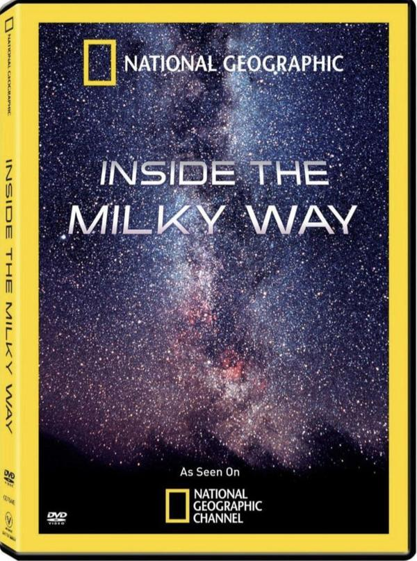

## 国家地理频道走进银河

[2026-10-04 20:03] 来自：纪录片资源频道

名称：国家地理频道：走进银河 (2010) 1080P 外挂简英双语字幕

描述：这是一部关于你我以及两千亿颗恒星历史的纪录片。我们的太阳系位于巨大天国的边缘，这一巨大的恒星群落依靠着引力组成银河系。如今，天文学家收集起来的数据让他们以一个新的令人兴奋的方式看待我们的银河系，如果我们可以近距离到访那些邻居，这些数据可以让我们通过穿越时间和空间的奇异旅行看到在我们巨大的恒星城市中其他的邻居是多么的不同。

夸克网盘：https://pan.quark.cn/s/30dc154b17e1

📁 大小：9.84GB

🏷 标签：#纪录片 #走进银河

---

## 攀登梅鲁峰

[2026-10-04 20:00] 来自：纪录片资源频道

名称：【原盘】攀登梅鲁峰 (2015) 1080P REMUX 外挂简繁字幕

描述：本片主要记录了三位登山家经历千难万险攀登梅鲁山的过程。这里的自然环境十分恶劣，在喜马拉雅山脉进行的冒险登山运动中。梅鲁山位于印度瓦尔喜玛拉雅山区，海拔六千多米，他们要到达的是梅鲁山的西北壁一个名为“鲨鱼鳍”的地方。攀爬难度非常大，因为冰雪覆盖，非常滑，需要放慢速度，但是如果放慢速度食物的供给便跟不上。他们携带笨重的拍摄装备，在攀登的过程中随时迎接突如其来的暴风雪以及山中变化莫测的天气，他们熟练地运用装备，团结一致，在攀爬的过程中相互帮助，应对寒冷与突发状况，挑战极限。最终他们克服了自身和外界的障碍，成功登顶。

夸克网盘：https://pan.quark.cn/s/9ae1d1757de0

📁 大小：23.1GB

🏷 标签：#攀登梅鲁峰 #纪录片 #冒险

---

## 山海经奇

[2026-10-04 12:10] 来自：影视动漫分享|SeedHub|夸克|网盘|🧲

名称：山海经奇 (2023)

#电视剧 #纪录片 #夸克 #百度

主演: 

豆瓣: [6.4](https://movie.douban.com/subject/27182686/)

奇兽、奇人、奇事。

取材于上古奇书《山海经》里的神话传说故事，纪录片《山海经奇》自带中国人骨髓里奇幻浪漫的气质：女娲造人、烛龙睁眼为昼、羲和浴日、羿射九日、嫦..

夸克网盘：https://pan.quark.cn/s/b893ea5994a9

百度网盘：https://pan.baidu.com/s/1Yk879Hzgc2SqJ1hdAsNOMQ?pwd=468w

---

## BBC达尔文和生命之树

[2026-10-03 19:51] 来自：纪录片资源频道

名称：BBC-达尔文和生命之树 (2009) 720P 外挂简中字幕

描述：激情四溢的“达尔文主义者”大卫艾登堡，对于广受争议的达尔文进化论，他提出了他的个人观点，并且认为进化论是所有他所提出的理论的基石。追溯到200年前，追随着那些变化——那些改变我们对自然世界的理解的变化，他提出了三个问题：达尔文为什么会提出他的进化论？是怎样提出的？为什么大多数人认为他的理论是正确的？为什么进化论现在显得比以往任何时候都重要？

夸克网盘：https://pan.quark.cn/s/985e8068fcab

📁 大小：1.46GB

🏷 标签：#纪录片 #达尔文和生命之树

---

## 大同

[2026-10-03 12:28] 来自：纪录片资源频道

名称：大同 (2016) 1080P

描述：曾经繁华的中国都市大同市，如今屹立在一堆废墟的旁边。这座城市不仅污染严重，还因其陈旧的基础设施和摇摇欲坠的经济前景而濒临瘫痪。但大同市长想要改变这一切，他大胆地宣布了一项试图重塑昔日的辉煌的新计划，要知道这座城市的文明已经有1600年了。然而，伴随着这项计划的是非常高的成本。数以千计的房屋被推倒，50万居民（占大同市总人口的百分之三十）将在他的打理下被重新安置。这位市长成功与否，完全取决于他是否能让愤怒的工人群体以及越来越忐忑的统治精英冷静下来。纪录片《中国市长》惊人地捕捉到了一个男人，甚至是一个国家疯狂跳跃着进入一个越来越动荡的未来的过程。 

夸克网盘：https://pan.quark.cn/s/a90d3ce7d265

📁 大小：7.8GB

🏷 标签：#大同 #纪录片 #AMZN

---

## 重返狼群

[2026-10-03 12:10] 来自：影视动漫分享|SeedHub|夸克|网盘|🧲

名称：重返·狼群 (2017)

#电影 #纪录片 #夸克

主演: 李微漪 格林 亦风 

豆瓣: [8.3](https://movie.douban.com/subject/26920269/)

画家李微漪在一次草原采风中意外收养了狼王遗孤，为其取名格林，并带回成都喂养。但繁华的都市无法容纳一匹野性的草原狼，李微漪带着格林重返草原，一路追寻狼群的踪迹，历经严..

夸克网盘：https://pan.quark.cn/s/27080116a546

