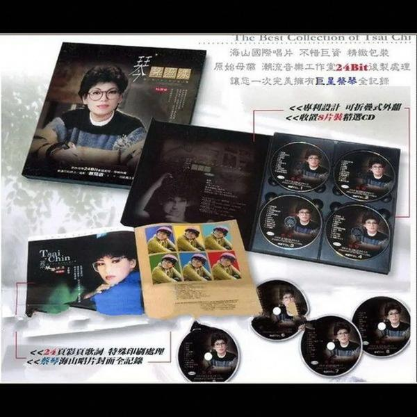

## 许茹芸

[2026-09-20 00:05] 来自：夸克云盘影视资源频道

名称：许茹芸 -《试音许茹芸》正版CD低速原抓WAV 分轨

描述：许茹芸《试音许茹芸》HQCD精选专辑，收录独角戏、如果云知道等经典，以空灵芸式唱腔演绎情歌，是华语人声发烧试音碟。

夸克网盘：https://pan.quark.cn/s/82ea5eb9a915

📁 大小：N

🏷 标签：#无损音乐 #音乐 #华语

---

## Miley

[2026-09-19 21:23] 来自：百度网盘综合频道

名称：Miley Cyrus - Bass Persuades (2026) FLAC 24bit 48kHz Tidal

描述：Miley Cyrus《Bass Persuades》2026，其第十张专辑，大西洋唱片首作。80年代复古合成器舞曲，厚重贝斯驱动，探讨情爱与自我，呼吁脱离屏幕，拥抱音乐律动。

链接：

百度网盘：https://pan.baidu.com/s/1-6AiiFDNKqp6wb5ZQPD1MA?pwd=kick

夸克网盘：https://pan.quark.cn/s/360e01db98c3 来自：肯德基の4K影视综合电影云盘站 [2026-09-19 21:22] 名称：Miley Cyrus - Bass Persuades (2026) FLAC 24bit 48kHz Tidal

📁 大小：491MB

🏷 标签：#无损音乐 #音乐 #欧美流行 #FLAC #24bit

---

## 蔡琴

[2026-09-19 19:06] 来自：百度网盘综合频道

名称：蔡琴 2004《琴声荡漾》8CD 台湾版 WAV+CUE

描述：这套8CD蔡琴典藏精选，收录《出塞曲》《你的眼神》《渡口》等百余首经典。横跨民歌、时代老歌，醇厚人声，饱含怀旧诗意，是华语发烧人声代表作。

链接：

百度网盘：https://pan.baidu.com/s/1Nc_mh0PWxS9t1C_8puivAg?pwd=kick

夸克网盘：https://pan.quark.cn/s/a86156ed6225 来自：夸克云盘影视资源频道 [2026-09-19 19:03] 名称：蔡琴 2004《琴声荡漾》8CD 台湾版 WAV+CUE

📁 大小：N

🏷 标签：#无损音乐 #音乐 #华语

---

## Kim

[2026-09-19 17:43] 来自：综合网盘资源频道

名称：Kim Petras - Detour (Rare N' Deluxe) (2026) FLAC

描述：豪华版电子专辑。

百度网盘：https://pan.baidu.com/s/1upSiFKLNjkmY_Lan19K3ww?pwd=drk1

夸克网盘：https://pan.quark.cn/s/6560853546d9

迅雷网盘：https://pan.xunlei.com/s/VP1t0vSzMVIJ9UH4sdbo_aPoA1?pwd=62dv

📁 大小：680MB

🏷 标签：#音乐 #FLAC #baidu #quark #xunlei

