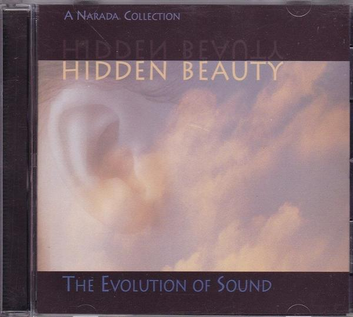
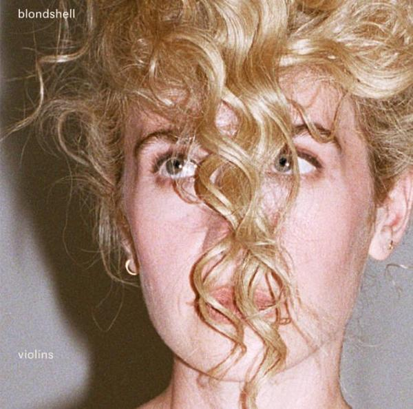
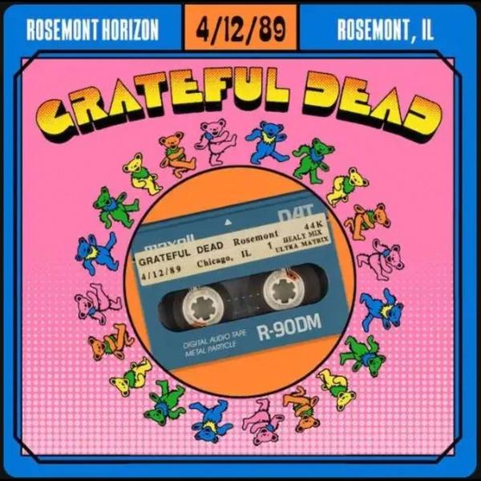

## 木吉他

[2026-09-25 00:05] 来自：夸克云盘影视资源频道

名称：木吉他 合集 flac

描述：木吉它合唱团是当年校园另一支相当著名的民歌组合，合唱团由陈永裕、李宗盛、江学世、陈秀男、郑文魁、张炳辉等六人组成。

1993.01 - 记得我1994.01 - 梦田

1994.05 - 木吉他作品全集

1998.08 - 重逢 木吉他民歌精选辑

夸克网盘：https://pan.quark.cn/s/84313f8429dc

📁 大小：N

🏷 标签：#无损音乐 #音乐 #华语

---

## 许美静月光之城HIEND

[2026-09-25 00:02] 来自：百度网盘综合频道

名称：许美静《月光之城》HI-END 音响专业示范碟 WAV

描述：曲目：

01 城里的月光

02 阳光总在风雨后

03 铁窗

04 快乐无罪

05 蔓延

06 遗憾

07 你抽的烟

08 荡漾

09 明知道

10 迷乱

11 当阳光变冷

12 都是夜归人

百度网盘：https://pan.baidu.com/s/1Qg-DK4L0ZNHJVfXR8Iw2dA?pwd=u5z2

夸克网盘：https://pan.quark.cn/s/548efe21da8c 来自：夸克云盘影视资源频道 [2026-09-25 00:02] 名称：许美静《月光之城》HI-END 音响专业示范碟 WAV

📁 大小：N

🏷 标签：#无损音乐 #音乐 #华语

---

## Tinashe

[2026-09-24 22:01] 来自：综合网盘资源频道

名称：Tinashe - Popstar (2026) FLAC

描述：9.25 新专辑。

百度网盘：https://pan.baidu.com/s/1k_5mgf0Vw4xC30VC3wHRQQ?pwd=wb7m

夸克网盘：https://pan.quark.cn/s/9c41248df7c4

迅雷网盘：https://pan.xunlei.com/s/VP2IhNFGCbscUHKAM_h6wqq9A1?pwd=i7bi

📁 大小：490MB

🏷 标签：#音乐 #FLAC #baidu #quark #xunlei

---

## 明达Hidden

[2026-09-24 20:59] 来自：百度网盘综合频道

名称：明达-Hidden Beauty (金耳朵) 新世纪HiFi 试音碟 WAV+CUE

描述：20比特纯音乐，十一位高手感性演绎十三首扣人心弦旋律优美的音乐。抒情坦率、感性，使人不期然陶醉在迷人的音乐世界里，每首乐章都蕴藏著独特自然的音乐内在美，使您享受无限。

NARADA在1996年发行的这张唱片在发烧圈中享有盛誉。唱片标题“HIDDEN BEAUTY”的中文直译为“内在美”，而副标题“The Evolution Of Sound”则意为“进化的声音”，而大家更喜欢俗称这张唱片为“金耳朵”，原因自然源自其封面设计。其实这是一张NewAge音乐集锦，荟萃了13首由不同音乐人创作、演奏的新世纪曲目。

链接：

百度网盘：https://pan.baidu.com/s/1oW4R8-ZdfHq74ZtGGHLRnw?pwd=kick

夸克网盘：https://pan.quark.cn/s/4f659bdf8b04 来自：夸克云盘影视资源频道 [2026-09-24 20:50] 名称：明达-Hidden Beauty (金耳朵) 新世纪HiFi 试音碟 WAV+CUE

📁 大小：N

🏷 标签：#无损音乐 #音乐 #新世纪

---

## Blondshell

[2026-09-24 20:48] 来自：综合网盘资源频道

名称：Blondshell - Violins (2026) FLAC

描述：9.25 流行摇滚专辑。

百度网盘：https://pan.baidu.com/s/1BMaKwuuR35UjwUSK0b3FvQ?pwd=kbi6

夸克网盘：https://pan.quark.cn/s/63033769a9fc

迅雷网盘：https://pan.xunlei.com/s/VP2ISGoja4jdXVxawB0uFTNFA1?pwd=p7d2

📁 大小：270MB

🏷 标签：#音乐 #FLAC #baidu #quark #xunlei

---

## 田馥甄

[2026-09-24 17:08] 来自：综合网盘资源频道

名称：田馥甄 - 要去什么地方 2026 FLAC

描述：国语新专辑。

百度网盘：https://pan.baidu.com/s/1RkQn_ii22dirmPbdCIkDGQ?pwd=g3mr

夸克网盘：https://pan.quark.cn/s/e3da1ade4e06

迅雷网盘：https://pan.xunlei.com/s/VP2Hbr9ZwwYmoUm-Lx2jLgX8A1?pwd=mtub

📁 大小：200MB

🏷 标签：#音乐 #田馥甄 #要去什么地方 #FLAC #baidu #quark #xunlei

---

## 周传雄

[2026-09-24 11:07] 来自：百度网盘综合频道

名称：周传雄 秋天的海 (2026) FLAC 24bit 48 Tidal

描述：周传雄 新歌

链接：

百度网盘：https://pan.baidu.com/s/1SuVZ3Y59yJR1IVrlz5zTGQ?pwd=kick

夸克网盘：https://pan.quark.cn/s/25de7089a45e 来自：肯德基の4K影视综合电影云盘站 [2026-09-24 11:07] 名称：周传雄 秋天的海 (2026) FLAC 24bit 48 Tidal

📁 大小：N

🏷 标签：#无损音乐 #音乐 #华语

---

## 田馥甄

[2026-09-24 06:39] 来自：综合网盘资源频道

名称：田馥甄 要去什么地方(2026) FLAC 24bit 48khz

描述：

新专辑

01.大船

02.要去什么地方

03.云

04.干净的房间

05.值得纪念的垃圾

06.乌鸦

07.蹉跎

08.坍塌

09.静脉

10.果

夸克网盘：https://pan.quark.cn/s/066d8a2edba0

百度网盘：https://pan.baidu.com/s/1fFw61V4jlUUeBd_bsJpirw?pwd=kick

📁 大小：N

🏷 标签：#无损音乐 #音乐 #华语 #田馥甄 #要去什么地方 #FLAC #24bit #quark #baidu

---

## Grateful

[2026-09-23 18:47] 来自：综合网盘资源频道

名称：Grateful Dead - 1989-04-12 Rosemont Horizon, Rosemont, IL (2026) FLAC 24bit 96khz

描述：Grateful Dead此场1989年现场属于迷幻摇滚。乐队即兴演奏舒展自由，曲目漫长随性，现场充满松弛的即兴张力，是经典现场录音。

夸克网盘：https://pan.quark.cn/s/be48ebfe917b

📁 大小：2.6GB

🏷 标签：#无损音乐 #音乐 #摇滚 #quark

---

## Agnes

[2026-09-23 11:36] 来自：综合网盘资源频道

名称：Agnes Obel - The Meaning of Flowers (2026) FLAC 24bit 44,1khz qobuz

描述：

丹麦音乐人Agnes Obel新作，以空灵钢琴与人声，探讨新生、自然联结，氛围静谧深邃，蕴藏母性与生命蜕变哲思。

夸克网盘：https://pan.quark.cn/s/a3c5ddec9b81

百度网盘：https://pan.baidu.com/s/14DJMOltp2u_orSAdV3_3gg?pwd=kick

📁 大小：N

🏷 标签：#无损音乐 #音乐 #FLAC #24bit #quark #baidu

---

## 梁咏琪

[2026-09-23 11:28] 来自：肯德基の4K影视综合电影云盘站

名称：梁咏琪 温柔的存在 (2026) FLAC 24bit 48khz

描述：

01.怎么了

02.我爱你 是为了开始爱你

03.爱到越来越对的我们

04.Precious

05.温柔的存在

06.远距离

07.描金

08.在傍晚的风里遇见

09.TA不是TA的TA

10.累就回家

11.温柔的存在 (粤语版)

夸克网盘：https://pan.quark.cn/s/d48259edafdc

百度网盘：https://pan.baidu.com/s/1MXB_fvX1WoO1ASY2KgbrUg?pwd=kick

📁 大小：N

🏷 标签：#无损音乐 #音乐 #华语 #梁咏琪 #温柔的存在 #FLAC #24bit #quark #baidu

---

## 梁咏琪

[2026-09-23 11:24] 来自：综合网盘资源频道

名称：梁咏琪 温柔的存在 (2026) FLAC 24bit 48khz

描述：

01.怎么了

02.我爱你 是为了开始爱你

03.爱到越来越对的我们

04.Precious

05.温柔的存在

06.远距离

07.描金

08.在傍晚的风里遇见

09.TA不是TA的TA

10.累就回家

11.温柔的存在 (粤语版)

夸克网盘：https://pan.quark.cn/s/d48259edafdc

百度网盘：https://pan.baidu.com/s/1MXB_fvX1WoO1ASY2KgbrUg?pwd=kick

📁 大小：N

🏷 标签：#无损音乐 #音乐 #华语 #梁咏琪 #温柔的存在 #FLAC #24bit #quark #baidu

---

## 王馨平

[2026-09-23 04:25] 来自：夸克云盘影视资源频道

名称：王馨平 - 情网 精选 首批限量版 SACD

描述：01. 情网

02. Im Easy

03. 别问我是谁

04. 一生痴恋

05. 随想曲

06. 问你问我

07. 你怎麽舍得我难过08. 单车

09. 风中的早晨 - 黎瑞恩 王馨平

10. 最喜欢你

11. 今夜你会不会来

12. 温柔的拒绝

13. 家后

14. 好男人

15. 生命有价

夸克网盘：https://pan.quark.cn/s/40c7ce1c4d78

📁 大小：N

🏷 标签：#无损音乐 #音乐 #华语

---

## 张国荣

[2026-09-22 13:47] 来自：综合网盘资源频道

名称：张国荣 - LESLIE CHEUNG 70 (2026) FLAC 24bit 96khz

描述：张国荣《LESLIE CHEUNG 70》，为纪念七十诞辰推出的跨厂牌精选集，收录70首生涯金曲

夸克网盘：https://pan.quark.cn/s/79c1aa8eb80c

百度网盘：https://pan.baidu.com/s/1UGRbnD2La2qFxZJtsPArGw?pwd=2k9u

📁 大小：4.68GB

🏷 标签：#无损音乐 #音乐 #张国荣 #FLAC #24bit #quark #baidu

---

## 岩崎太整

[2026-09-22 13:38] 来自：综合网盘资源频道

名称：岩崎太整, 小西遼 & YUKI KANESAKA — 攻壳机动队原声带『攻殻機動隊 THE GHOST IN THE SHELL』O.S.T. (2026) FLAC

描述：岩崎太整联合小西遼、YUKI KANESAKA打造新版攻壳机动队 原声，电子与管弦交织，冷峻赛博质感，勾勒人机边界的哲学氛围。

夸克网盘：https://pan.quark.cn/s/483b5e111560

百度网盘：https://pan.baidu.com/s/1mLdj412qW-bS4k8hwod_sg?pwd=kick

📁 大小：829MB

🏷 标签：#无损音乐 #音乐 #ost #岩崎太整 #小西遼 #攻壳机动队原声带 #攻殻機動隊 #quark #baidu

---

## Miley

[2026-09-22 10:46] 来自：肯德基の4K影视综合电影云盘站

名称：Miley Cyrus - Bass Persuades (2026) [24-bit 48 kHz] - ALAC

描述：在官宣第十张录音室专辑的前一天，Miley Cyrus 更改了社交媒体上的名字，隐去姓氏“Cyrus”，如同 Cher、Madonna 和 Beyoncé 这些乐坛传奇一样，从此以单名示人。走过星光熠熠的二十年音乐生涯，她用这种方式宣告自己即将迈入新纪元。

夸克网盘：https://pan.quark.cn/s/e937d25b496b

📁 大小：535MB

🏷 标签：#音乐 #无损音乐 #欧美流行

---

## Neil

[2026-09-22 08:30] 来自：综合网盘资源频道

名称：Neil Young & The Chrome Hearts - 2026 - Second Song FLAC 24bit 192kHz qobuz

描述：《Second Song》是Neil Young & The Chrome Hearts的第二张录音室新作，9月18日正式发行，风格：半原声民谣摇滚(Semi-acoustic Folk Rock)，回归《Harvest Moon》《Prairie Wind》那种温润怀旧的美式民谣，配器简约，叙事感极强，没有激烈失真，偏向沉静内省。

夸克网盘：https://pan.quark.cn/s/9c558218e7ea

百度网盘：https://pan.baidu.com/s/18lW7qUMj8MKLQRFOqiOKCA?pwd=kick

📁 大小：N

🏷 标签：#无损音乐 #音乐 #民谣 #FLAC #quark #baidu

---

## 周杰伦

[2026-09-22 00:02] 来自：综合网盘资源频道

名称：周杰伦 - 依然范特西 SHM-CD] 日版 2026 WAV 分轨

描述：

1. 夜的第七章

2. 听妈妈的话

3. 千里之外(feat.费玉清)

4. 本草纲目

5. 退后

6. 红模仿

7. 心雨

8. 白色风车

9. 迷迭香

10. 菊花台

夸克网盘：https://pan.quark.cn/s/db9e6226c167

百度网盘：https://pan.baidu.com/s/1lqCZfOvfglgni8OTmJnk7Q?pwd=hy5c

百度网盘：https://pan.baidu.com/s/1DBJ_v2tEw1boFffKrjBMew?pwd=04fn 来自：综合网盘资源频道 [2026-09-21 23:51] 名称：周杰伦 - 我很忙 [SHM-CD] 日版 2026 WAV 分轨

夸克网盘：https://pan.quark.cn/s/41af07355028 来自：综合网盘资源频道 [2026-09-21 23:51] 名称：周杰伦 - 我很忙 [SHM-CD] 日版 2026 WAV 分轨

📁 大小：N

🏷 标签：#无损音乐 #音乐 #华语 #周杰伦 #依然范特西 #日版 #WAV #分轨 #quark #baidu

---

## 张学友

[2026-09-21 23:07] 来自：夸克云盘影视资源频道

名称：张学友 2018《真情流露》HQ+S 纯银深度 低速原抓WAV+CUE

描述：曲目：

01 吻别

02 深海

03 想和你去吹吹风

04 心如刀割

05 你知不知道

06 我等到花儿也谢了

07 一千个伤心的理由

08 三天两夜

09 她来听我的演唱会

10 回头太难

11 左右为难

12 情网

13 祝福

夸克网盘：https://pan.quark.cn/s/3cc4a34ec8ca

📁 大小：N

🏷 标签：#无损音乐 #音乐 #张学友

---

## 伍佰

[2026-09-21 20:43] 来自：夸克云盘影视资源频道

名称：伍佰 - 试音伍佰HQ》WAV+CUE

描述：01.挪威的森林

02.再度重相逢

03.一生最爱的人

04.浪人情歌

05.你是我的花朵

06.晚风

07.与你到永久

08.美丽新世界

09.白鸽

10.梦的河流

11.翅膀

12.冰雨

13.爱情的尽头

14.痛哭的人

15.突然的自我

夸克网盘：https://pan.quark.cn/s/d91cc250852b

📁 大小：711MB

🏷 标签：#wav #无损音乐 #音乐

---

## 四月是你的谎言

[2026-09-21 19:39] 来自：综合网盘资源频道

名称：四月是你的谎言 ost

描述：《四月是你的谎言》原声集，横山克作曲，钢琴小提琴交织，谱写青春相遇与遗憾的动人乐章。

夸克网盘：https://pan.quark.cn/s/24d31f7ddcb0

📁 大小：N

🏷 标签：#无损音乐 #音乐 #原声带 #四月是你的谎言 #quark

