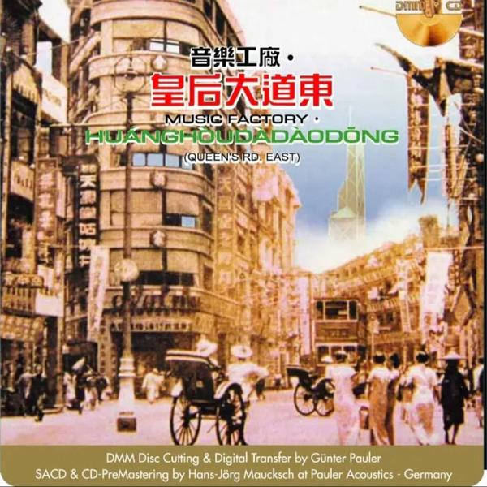
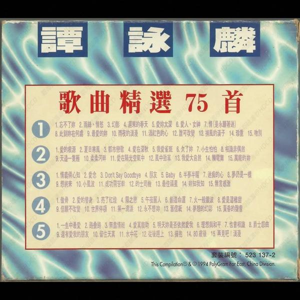
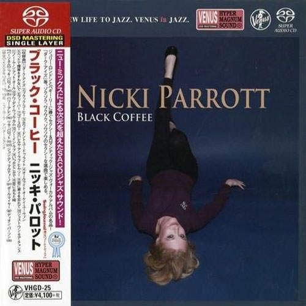
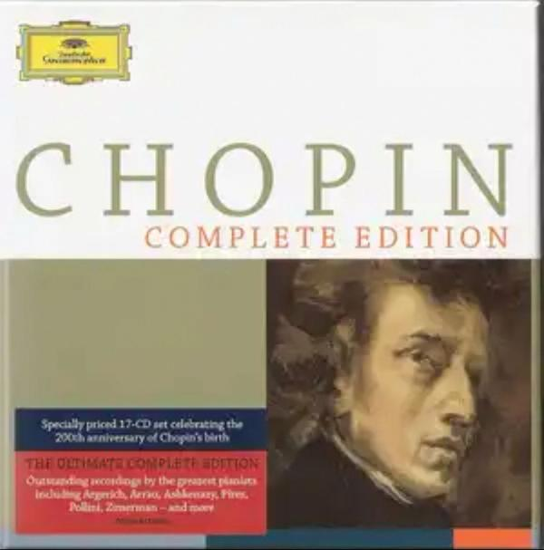

## 罗大佑

[2026-09-11 14:15] 来自：综合网盘资源频道

名称：罗大佑 - 皇后大道东  DMM-SACD 独立编号限量版 SACD ISO 2015

描述：

01. 皇后大道东 -罗大佑 蒋志光

02. 情深义更深 -袁凤瑛

03. 出走 -夏韶声

04. 赤子 -叶德娴

05. 长路有多远 -蒋志光

06. 似是故人来 -梅艳芳

07. 天若有情 -袁凤瑛

08. 道 -黄沾

09. 青春舞曲2000 -合唱

10. 东方之珠 -罗大佑

夸克网盘：https://pan.quark.cn/s/262f56763705

📁 大小：N

🏷 标签：#sacd #无损音乐 #音乐 #罗大佑 #皇后大道东 #独立编号限量版 #quark

---

## LE

[2026-09-11 13:46] 来自：综合网盘资源频道

名称：LE SSERAFIM - Made My Night (2026) FLAC

描述： 韩团新单曲。

百度网盘：https://pan.baidu.com/s/1FNT0T5V-BkAlpGF5QxucPg?pwd=e37v

夸克网盘：https://pan.quark.cn/s/521dc7010f52

迅雷网盘：https://pan.xunlei.com/s/VP1Dw1dATbPmuI8gtxfiluAcA1?pwd=b4tk

📁 大小：34MB

🏷 标签：#音乐 #FLAC #baidu #quark #xunlei

---

## Ellie

[2026-09-11 11:47] 来自：综合网盘资源频道

名称：Ellie Goulding - You Know Too Much 2026  (2026) FLAC

描述： 流行专辑。

百度网盘：https://pan.baidu.com/s/1jCJ82GswJ8c6ybFQ6sqN6w?pwd=vd14

夸克网盘：https://pan.quark.cn/s/43bae8288343

迅雷网盘：https://pan.xunlei.com/s/VP1DZL6NGoKU9I525VwENbq4A1?pwd=s4sn

📁 大小：800MB

🏷 标签：#音乐 #FLAC #baidu #quark #xunlei

---

## Brooke

[2026-09-11 09:32] 来自：百度网盘综合频道

名称：Brooke McClymont & Adam Eckersley Souls On Show - 2026 FLAC 24bit 48kHz qobuz

描述：澳洲金吉他奖获奖夫妻乡村二重唱2026新专，现场同期录制，人声和声温暖质朴，歌词书写生活与爱意，是真挚动人的乡村流行作品。

链接：

百度网盘：https://pan.baidu.com/s/1ZAm_pinVOtzQVUGC7r4J0A?pwd=kick

夸克网盘：https://pan.quark.cn/s/9ebb988eaa3c 来自：综合网盘资源频道 [2026-09-11 09:30] 名称：Brooke McClymont & Adam Eckersley Souls On Show - 2026 FLAC 24bit 48kHz qobuz

📁 大小：N

🏷 标签：#无损音乐 #音乐 #欧美乡村

---

## 谭咏麟

[2026-09-11 05:09] 来自：夸克云盘影视资源频道

名称：谭咏麟 1994《歌曲精选75首》5CD 香港特供版WAV

描述：谭咏麟.1994 《歌曲精选75首》5CD

夸克网盘：https://pan.quark.cn/s/320d1e9cd8b3

📁 大小：N

🏷 标签：#无损音乐 #音乐 #谭咏麟

---

## Nicki

[2026-09-11 05:09] 来自：夸克云盘影视资源频道

名称：Nicki Parrott - Black Coffee sacd

描述：爵士专辑

夸克网盘：https://pan.quark.cn/s/fb9cbc6ec158

夸克网盘：https://pan.quark.cn/s/ab54b301c7c8 来自：无损音乐分享频道 [2026-09-10 01:59] 名称：Nicki Parrott - Close To You ～Burt Bacharach Song Book (2.8MHz DSD) DSD64 DSF

📁 大小：N

🏷 标签：#无损音乐 #音乐 #爵士

---

## 肖邦作品全集

[2026-09-11 05:09] 来自：夸克云盘影视资源频道

名称：肖邦作品全集 17CD

描述：肖邦全集

夸克网盘：https://pan.quark.cn/s/e1d7cde1d028

📁 大小：N

🏷 标签：#无损音乐 #音乐 #纯音乐

---

## 百鸟朝凤

[2026-09-10 22:37] 来自：4K影视屋(分屋）-蓝光无损电影

名称：百鸟朝凤(2013)【4K.高码率】【内嵌简英】【剧情/音乐】【陶泽如/胡先煦】

描述：豆瓣8.3高分

老一代唢呐艺人焦三爷(陶泽如 饰)是个外冷内热的老人，看起来严肃古板，其实心怀热血。影片表现了在社会变革、民心浮躁的年代里，新老两代唢呐艺人为了信念的坚守所产生的真挚的师徒情、父子情、兄弟情。 本片改编自肖江虹同名小说。

夸克网盘：https://pan.quark.cn/s/751d8867a059

百度网盘：https://pan.baidu.com/s/1zeZ7uDzhLuu4z-YEJfDucQ?pwd=Yu66

迅雷网盘：https://pan.xunlei.com/s/VP10YFt0qzz7Z1IlunmCCYpwA1?pwd=ismu

📁 大小：12.3GB

🏷 标签：#音乐 #百鸟朝凤 #4K #高码率 #内嵌简英

---

## 监听天碟

[2026-09-10 21:45] 来自：夸克云盘影视资源频道

名称：监听天碟 合唱篇

描述：Absolute Voice Duet 2016

夸克网盘：https://pan.quark.cn/s/1de60970d420

📁 大小：3GB

🏷 标签：#sacd #dsf #无损音乐 #华语 #音乐

---

## 群星

[2026-09-10 21:45] 来自：无损音乐分享频道

名称：群星 2016 - 鉴听天碟合唱篇 华纳SACD DSF 分轨

描述：Absolute Voice Duet 2016

专辑名称：监听天碟 合唱篇

专辑曲目:

01. 还有    王杰 / 林忆莲

02. 曾在你怀抱    陈百强 / 林姗姗

03. 重逢 (粤语版)    林子祥 / 叶倩文

04. 此情只待成追忆    林忆莲 / 伦永亮

05. 乱世桃花    林子祥 / 叶倩文

06. 爱偏要别离    林子祥 / 叶倩文

07. 温柔的你    林忆莲 / 王杰

08. 再见亦是朋友    何婉盈/ 曾航生

09. 爱到分离仍是爱    林子祥 / 叶倩文

10. 谈情说爱    郑秀文 / 叶蒨文

11. Tell me what can I do (英)      Danny Chan / Crystal Gayle

12. 我要等的正是你    林忆莲 / 陈百强

13. 沙沙的雨    伦永亮 / 吕方

14. 车站    夏韶声 / 苏芮

15. 信自己    叶蒨文 / 杜德伟

16. 爱上你是我一生的错    邓健明 / 何婉盈

17. 乾一杯    林子祥 / 叶倩文

18. 选择 (国)    林子祥 / 叶倩文

夸克网盘：https://pan.quark.cn/s/1de60970d420

📁 大小：3GB

🏷 标签：#sacd #dsf #无损音乐 #华语 #音乐

---

## 孟庭苇

[2026-09-10 21:40] 来自：夸克云盘影视资源频道

名称：孟庭苇 - 冬季到台北来看雨 头版限量编号NEW XRCD - WAV+CUE

描述：01.冬季到台北来看雨

02.无声的雨

03.把他换作你

04.没有情人的情人节

05.两小无猜

06.哑哑与亚亚

07.偏心

08.心港

09.千年的新娘

10.等待花开

夸克网盘：https://pan.quark.cn/s/23a724f0503a

📁 大小：N

🏷 标签：#无损音乐 #音乐 #孟庭苇

---

## Bonobo

[2026-09-10 21:11] 来自：综合网盘资源频道

名称：Bonobo - Distance in Static (2026) FLAC

描述： 电子专辑。

百度网盘：https://pan.baidu.com/s/1ql-5AWRgCRjz7Xtz1v8ETw?pwd=xc8n

夸克网盘：https://pan.quark.cn/s/85f9fdadb17e

迅雷网盘：https://pan.xunlei.com/s/VP1ARMutXu33b17uN6XkHtEOA1?pwd=w9xg

📁 大小：300MB

🏷 标签：#音乐 #FLAC #baidu #quark #xunlei

---

## JVC

[2026-09-10 20:10] 来自：无损音乐分享频道

名称：JVC MISHA试音试音极品   XRCD WAV分轨

描述：Misha Segal《Connected to the Unexpected》，1996年JVC发行XRCD发烧碟，当代爵士融合电子，录音品质优异，是知名HiFi试音专辑。

夸克网盘：https://pan.quark.cn/s/a1b918a5820e

📁 大小：N

🏷 标签：#无损音乐 #音乐 #纯音乐

---

## IU

[2026-09-10 17:59] 来自：综合网盘资源频道

名称：IU - Unknown Planet (2026) FLAC

描述：最新单曲。

百度网盘：https://pan.baidu.com/s/1aqyuTySTu3ddjNJ_IYWJrQ?pwd=gccn

夸克网盘：https://pan.quark.cn/s/a8c89fb3153f

迅雷网盘：https://pan.xunlei.com/s/VP19jqEz8wK6LB1azNg2Fmh4A1?pwd=izjy

📁 大小：47MB

🏷 标签：#音乐 #FLAC #baidu #quark #xunlei

---

## ADELA

[2026-09-10 17:56] 来自：肯德基の4K影视综合电影云盘站

名称：ADELA - PRIMA (2026) [24-bit 48 kHz] - ALAC

描述：凭借大胆无畏的词曲创作、富有张力的舞台表现，ADÉLA 如今已是备受瞩目的流行新星。在此之前，她最初是通过纪录片《Pop Star Academy：KATSEYE》走入大众视野的。这位出生于斯洛伐克、现居洛杉矶的歌手，其实已经追梦星途很久，并为此不懈努力。

夸克网盘：https://pan.quark.cn/s/5440622af749

📁 大小：412MB

🏷 标签：#音乐 #无损音乐 #欧美流行

---

## Dolly

[2026-09-10 10:06] 来自：综合网盘资源频道

名称：Dolly Parton - 1982 - Greatest Hits FLAC 24bit 192kHz qobuz

描述：多莉·帕顿1982年经典乡村精选集，收录《9 To 5》《I Will Always Love You》等传世金曲，汇集她巅峰时期代表作，是乡村音乐的经典典藏专辑。

夸克网盘：https://pan.quark.cn/s/ac5c151ee6f8

百度网盘：https://pan.baidu.com/s/1WweI-4GhkkkUDsFUCp1iyA?pwd=kick

📁 大小：N

🏷 标签：#无损音乐 #音乐 #欧美乡村 #FLAC #24bit #quark #baidu

---

## 窦唯

[2026-09-10 07:33] 来自：百度网盘综合频道

名称：窦唯 从前 送何勇 (2026) Hi-Res + 超清母带 FLAC

描述：窦唯2026年纯器乐单曲《从前 送何勇》，无人声，由窦唯演奏吉他并制作。以此曲送别魔岩三杰老友何勇，旋律内敛沉静，凭音符追忆90年代摇滚往事。

百度网盘：https://pan.baidu.com/s/1dU42jiix5TAeqW839oBjtA?pwd=kick

夸克网盘：https://pan.quark.cn/s/55d78e34ba74 来自：夸克云盘影视资源频道 [2026-09-10 07:33] 名称：窦唯 从前 送何勇 (2026) Hi-Res + 超清母带 FLAC

📁 大小：N

🏷 标签：#无损音乐 #音乐 #纯音乐

---

## 陈奕迅

[2026-09-10 02:00] 来自：夸克云盘影视资源频道

名称：陈奕迅 2013《MUSIC LIFE精选》 4CD 香港首版WAV+CUE

描述：陈奕迅2013《MUSIC LIFE精选》4CD香港首版，集结粤语、国语经典金曲，另附一碟钢琴改编纯音乐，收录多首代表作，是英皇时期珍贵典藏。

夸克网盘：https://pan.quark.cn/s/e7887ec28790

📁 大小：N

🏷 标签：#无损音乐 #音乐 #陈奕迅

