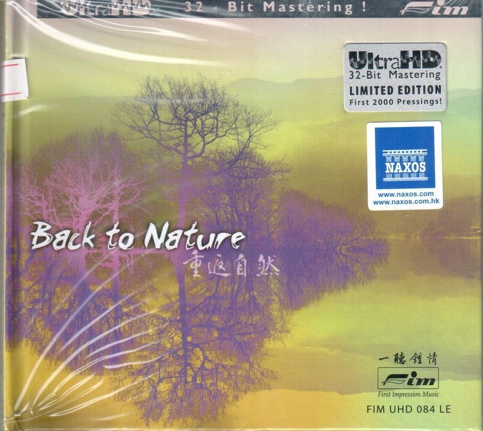
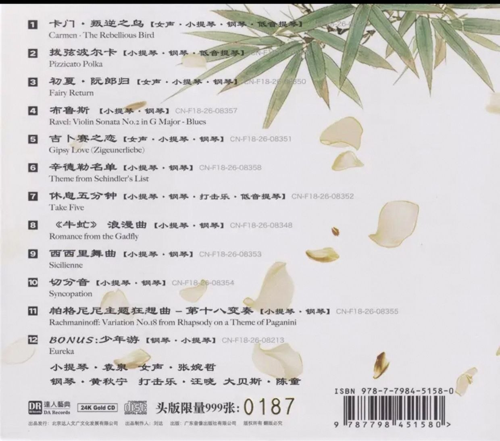

## 周杰伦依然范特西2026

[2026-09-07 04:28] 来自：无损音乐分享频道

名称：周杰伦《依然范特西》2026 环球日版SHM-CD  原抓WAV+CUE

描述：

专辑曲目：

01. 夜的第七章

02. 心雨

03. 千里之外

04. 本草綱目

05. 退後

06. 紅模仿

07. 白色風車

08. 迷迭香

09. 聽媽媽的話

10. 菊花台

11. 霍元甲

夸克网盘：https://pan.quark.cn/s/542eaa99e919

📁 大小：477MB

🏷 标签：#无损音乐 #音乐 #周杰伦

---

## 懐かしい昭和名曲集雨のJAZZメドレーFLAC

[2026-09-06 16:28] 来自：无损音乐分享频道

名称：懐かしい昭和名曲集【雨のJAZZメドレー】FLAC

描述：ai爵士女声

夸克网盘：https://pan.quark.cn/s/95b2a1018507

📁 大小：N

🏷 标签：#无损音乐 #音乐

---

## 群星

[2026-09-06 08:35] 来自：无损音乐分享频道

名称：群星 - 情歌101(6CD)【华纳+滚石】【WAV+CUE】

描述：华纳2009年发行的一套6CD合集，收录了101首80、90年代最窝心的国语经典情歌。

夸克网盘：https://pan.quark.cn/s/47802f74f32a

百度网盘：https://pan.baidu.com/s/1Hpid42M55csVleZc5pkkCw?pwd=kick 来自：肯德基の4K影视综合电影云盘站 [2026-09-06 08:34]

📁 大小：N

🏷 标签：#无损音乐 #音乐 #华语

---

## Beyonce

[2026-09-05 13:56] 来自：肯德基の4K影视综合电影云盘站

名称：Beyonce - BDAY (20th ANNIVERSARY DELUXE EDITION) (2026) [24-bit 44.1 kHz] - ALAC

描述：当她最终回到录音室时，她召集了全明星级别的制作人阵容，包括Swizz Beatz、The Neptunes、Darkchild等，并借助《危险之爱》的势头，在不到一个月的时间内完成了这张后续专辑的录制。看看《B'Day》——这张专辑确实在9月4日，也就是碧昂丝生日当天发行——所催生的热门歌曲，就不难理解其中的原因了。当时，她正处于迄今为止艺术创作生涯最高产的阶段，灵感充沛，迫切希望尽可能突破创意的边界。

夸克网盘：https://pan.quark.cn/s/dbdf3b0ed314

📁 大小：1.5GB

🏷 标签：#音乐 #无损音乐 #欧美流行

__via__ 匿名

---

## 卫兰

[2026-09-05 11:15] 来自：无损音乐分享频道

名称：卫兰 衛蘭 Janice Vidal I (2026) [HI-RES]

FLAC 24Bit 96kHz qobuz

描述：

 01 In Love Again

 02 大哥

 03 十个他不如你一个

 04 心乱如麻

 05 My Love My Fate

 06 爱才

 07 离家出走

 08 深爱

 09 爱你还爱你

 10 杂技

夸克网盘：https://pan.quark.cn/s/cf661a6a4631

📁 大小：806MB

🏷 标签：#无损音乐 #音乐 #华语 #卫兰

---

## 何勇

[2026-09-05 08:06] 来自：无损音乐分享频道

名称：何勇 - 垃圾場·台灣滾石XK1首版 wav+cue

描述：

01. 垃圾場

02. 姑娘 漂亮

03. 頭上的包

04. 聊天

05. 踏步

06. 鐘鼓樓 

07. 冬眠 

08. 非洲夢   

09. 幽靈（演奏曲）   

10. 垃圾場（二版） 

夸克网盘：https://pan.quark.cn/s/45a67a1f39e1

📁 大小：N

🏷 标签：#无损音乐 #音乐 #华语 #摇滚 #何勇

---

## 蛋堡

[2026-09-05 01:45] 来自：肯德基の4K影视综合电影云盘站

名称：蛋堡 - 运河 2026 - mp3 +游戏软件

描述：《运河》是蛋堡回到故乡台南后完成的一张作品，也是他口中“目前为止最台南的一张作品”。这张专辑并非单纯描写或歌颂台南，而是借由重新生活在安平、南区一带，让现在的自己与二十多年前刚爱上 Hip-Hop 的杜振熙重新相遇。他翻出过去未完成的作品，也重新使用年轻时喜欢的声音、饶舌方式与那股少年气，把台南的地景、成长记忆和如今的人生经验交织在一起。因此，“运河”既指向真实的台南运河，也像一条连接过去与现在的时间通道——是现在的蛋堡，回到 Hip-Hop 最初发生的地方，写给年轻时杜振熙的一封信。

夸克网盘：https://pan.quark.cn/s/0708f85484c0

📁 大小：592MB

🏷 标签：#音乐 #无损音乐 #华语

__via__ 匿名

---

## 许茹芸

[2026-09-04 14:20] 来自：肯德基の4K影视综合电影云盘站

名称：许茹芸 如此精彩 DSD dsf

描述：

曲目

01 留低锁匙(粤)

02 哭墙(粤)

03 半首歌

04 独角戏

05 如果云知道

06 后来你好吗

07 日光机场

08 猫与钢琴

09 执著

10 泪海

11 寄信人

12 你的眼睛(Feat.熊天平)

13 突然想爱你

夸克网盘：https://pan.quark.cn/s/775905f285d9

📁 大小：2.4GB

🏷 标签：#无损音乐 #音乐 #华语 #许茹芸

__via__ 匿名

---

## ABC唱片

[2026-09-04 07:43] 来自：肯德基の4K影视综合电影云盘站

名称：ABC唱片 -《蔡琴 往事蔡琴》原装母带真空管音质处理 爱必希国际唱片 K2-103 WAV分轨

描述：《往事蔡琴》精选蔡琴各时期十四首代表佳作，收录《被遗忘的时光》《最后一夜》《出塞曲》等经典曲目。蔡琴醇厚沉稳的嗓音低回委婉，饱含优雅感伤，是发烧圈公认的人声试音范本。专辑运用先进母带技术处理，人声立体饱满，乐器层次分明，兼具黑胶般温润韵味，完整展现她演绎慢歌的深厚功力，是蔡琴乐迷值得珍藏的发烧典藏。

夸克网盘：https://pan.quark.cn/s/30b2aa86facc

百度网盘：https://pan.baidu.com/s/1nTzFVne0USsdi2DHTD10Dw?pwd=kick

📁 大小：N

🏷 标签：#无损音乐 #音乐 #蔡琴

__via__ 匿名

---

## FIM

[2026-09-03 20:31] 来自：无损音乐分享频道

名称：FIM - 重返自然 - WAV 整轨

描述：FIM一听钟情《重返自然》，新世纪发烧天碟，将现场自然环境音效与乐曲相融，曲风舒缓空灵，空间感开阔，兼具静心聆听与音响器材测试的收藏价值。

夸克网盘：https://pan.quark.cn/s/2409a1208fc6

📁 大小：N

🏷 标签：#无损音乐 #音乐 #纯音乐

---

## 酷狗概念版521内置模块版

[2026-09-03 20:15] 来自：Fang的资源分享群

名称：酷狗概念版5.2.1内置模块版

酷狗概念版5.2.1内置模块版，整合常用模块，支持在线音乐播放与界面定制。适合日常试听及管理歌单，能帮助用户享受简洁流畅的听歌体验。

夸克网盘：https://pan.quark.cn/s/9b018aed8dd8

#音乐播放 #内置模块 #界面定制 #简洁体验 #酷狗概念版

🔔[Twitter](https://x.com/FLMdongtianfudi)  👥 [频道](https://t.me/FLMdongtianfudi)  💬 [群组](https://t.me/FLMziyuansousuo)

---

## 毛阿敏

[2026-09-03 10:24] 来自：肯德基の4K影视综合电影云盘站

名称：毛阿敏 合集 FLAC

描述：M 毛阿敏（Mao A Min）合集 FLAC

夸克网盘：https://pan.quark.cn/s/aa3ba6f94666

📁 大小：6.9GB

🏷 标签：#无损音乐 #音乐 #华语 #毛阿敏

__via__ 匿名

---

## 上帝帮助女孩

[2026-09-02 21:08] 来自：肯德基の4K影视综合电影云盘站

名称：上帝帮助女孩 God Help the Girl (2014) 1080p 原盘REMUX 中文字幕 AVC LPCM 5.1

描述：情绪低落的女孩伊芙住在医院接受治疗，音乐创作成为她整理内心、重新面对生活的方式。她来到格拉斯哥后结识了同样处在人生岔路口的詹姆斯和凯西，三人因共同的音乐梦想组成乐队，在一个漫长而梦幻的夏天里经历友情、爱情与成长，逐渐找回生活的方向。

链接：

夸克网盘：https://pan.quark.cn/s/6e9b7371556f

百度网盘：https://pan.baidu.com/s/1153R_FgO547fupl1Pn7hFA?pwd=qupw

迅雷网盘：https://pan.xunlei.com/s/VP-n94U48yU56TZJETNLngNDA1?pwd=zxq9

📁 大小：X

🏷 标签：#上帝帮助女孩 #GodHelpTheGirl #1080p #原盘REMUX #中文字幕 #AVC #LPCM #音乐 #剧情 #爱情 #青春 #英国 #quark #baidu #艾米莉布朗宁 #奥利亚历山大 #汉娜穆雷

__via__ 匿名

---

## 高德地图车机版95音乐插件版

[2026-09-02 19:51] 来自：Fang的资源分享群

名称：高德地图车机版9.5音乐插件版

高德地图车机版9.5音乐插件版，以插件形式为车机导航增加音乐功能，支持导航与音乐并行，适合车载屏幕使用，方便驾驶时听歌和导航。

夸克网盘：https://pan.quark.cn/s/f30e758d9288

#高德地图 #车机版 #音乐插件 #导航 #车载

🔔[Twitter](https://x.com/FLMdongtianfudi)  👥 [频道](https://t.me/FLMdongtianfudi)  💬 [群组](https://t.me/FLMziyuansousuo)

---

## 洋澜一

[2026-09-02 17:27] 来自：肯德基の4K影视综合电影云盘站

名称：洋澜一 成熟 2026 WAV 分轨 24bit 48khz

描述：洋澜一2026发烧人声专辑《成熟》，以温润细腻女声演绎抒情曲目，人声通透醇厚，编曲简约克制，满是沉淀后的情绪质感，适合静心聆听，是Hi‑Fi人声向收藏佳作。

链接：

夸克网盘：https://pan.quark.cn/s/1b0b20f7dbd8

百度网盘：https://pan.baidu.com/s/1b71x70a_cfDdTrVIis03cA?pwd=uxeh

📁 大小：776MB

🏷 标签：#无损音乐 #音乐 #wav #华语

__via__ 匿名

---

## Tiffany

[2026-09-02 11:21] 来自：肯德基の4K影视综合电影云盘站

名称：Tiffany Young - Edge of Calm (2026) ALAC 24bit 48khz

描述：Tiffany Young首张个人正规专辑，融合流行与慵懒R&B曲风，收录11首作品，邀赵美延、JUNNY参与合作。专辑聚焦平静前夕的情绪张力，演绎细腻丰富，展现她成熟内敛的歌唱表达与全新音乐面貌。

夸克网盘：https://pan.quark.cn/s/cbeb81bffd5a

百度网盘：https://pan.baidu.com/s/1_kiflbtGzKbJJBLQUevUUQ?pwd=kick

📁 大小：429MB

🏷 标签：#无损音乐 #音乐 #kpop #ALAC #24bit #quark #baidu

__via__ 匿名

---

## JENNIE

[2026-09-02 10:41] 来自：肯德基の4K影视综合电影云盘站

名称：JENNIE - Fallen Angel - EP (2026) [24-bit 48 kHz] - ALAC

描述：当JENNIE在2025年发行她的首张个人专辑《RUBY》时，她作为BLACKPINK的主饶舌手和主唱，已经活跃在公众视野中近十年了。尽管如此，这张包含15首歌曲的专辑——探讨了名声、守护所爱之人、爱情以及忠于自我等主题——依然让这位韩国偶像、演员及时尚icon获得了一次更深入表达自我的机会。“我认为，你越贴近那种情感，你就会变得越勇敢，”她曾这样告诉Apple Music的Zane Lowe，“因为现在你明白了，所以没有什么好害怕的。”

这种在流行乐中袒露脆弱的尝试，在《Fallen Angel》中得以延续。这张三首歌的后续作品，让听众得以一窥JENNIE在恋爱中的心境。

夸克网盘：https://pan.quark.cn/s/0fe2231089a2

📁 大小：125MB

🏷 标签：#音乐 #无损音乐 #日韩流行

__via__ 匿名

---

## 胡伟立

[2026-09-02 07:11] 来自：无损音乐分享频道

名称：胡伟立 - 鹿鼎记 i&ii 电影原声音乐(2026) (wav+cue)

描述：胡伟立 - 鹿鼎记 i&ii 电影原声音乐(2026) (wav+cue)

夸克网盘：https://pan.quark.cn/s/146a1d69b77d

📁 大小：N

🏷 标签：#无损音乐 #音乐 #原声带

---

## 周杰伦

[2026-09-02 07:10] 来自：无损音乐分享频道

名称：周杰伦 - 八度空间 wav 整轨 + 分轨

描述：

曲目

01 半兽人

02 半岛铁盒

03 暗号

04 龙拳

05 火车叨位去

06 分裂

07 爷爷泡的茶

08 回到过去

09 米兰的小铁匠

10 最后的战役

夸克网盘：https://pan.quark.cn/s/0b1fa230008e

📁 大小：N

🏷 标签：#无损音乐 #音乐 #周杰伦

---

## OURBIRTHDAY

[2026-09-02 03:00] 来自：无损音乐分享频道

名称：OURBIRTHDAY - Our Birthday - EP (2026) [24-bit 96 kHz] - ALAC

描述：OURBIRTHDAY 终于凭借同名EP《Our Birthday》正式出道。几周前，她们通过先行单曲《HUNGRY (Side A)》和《HUNGRY (Side B)》率先预热，为JYP娱乐旗下最新女团的出道奠定了基础。这支新人组合由Cho Hyejin、Kuk Chorok、Shin Hyewon、U、Baby、Achiraya和Kilala组成。让我们直接来看看她们的出道作品吧。

夸克网盘：https://pan.quark.cn/s/ca60a375d8a2

📁 大小：202MB

🏷 标签：#音乐 #无损音乐 #日韩流行

---

## 安卓最强播放器

[2026-09-01 09:13] 来自：无损音乐分享频道

名称：安卓最强播放器? 更新 USB音频播放器专业版 7.1.2.3 MOD.apk 支持中文 (无需安装谷歌商店)

描述：本版本

1. 已彻底移除保护机制

 2. 完全离线

 3. 无需 Google Play 商店

 4. 已解锁付费功能

 5.解除安卓限版本安装要求

 6.优化机制，支持中文。

 备注：

 无需安装 Google Play 商店的情况下可正常运行，它能够完全离线运行，绕过服务器端的击杀机制。

安卓Hi‑Fi标杆播放器。绕过安卓系统重采样，支持USB‑DAC、DSD、MQA，原生读取CUE整轨与SACD‑ISO镜像，实现比特完美输出，全部付费功能解锁，适合移动端发烧友聆听各类高解析无损。

夸克网盘：https://pan.quark.cn/s/102319f6bb05

📁 大小：N

🏷 标签：#无损音乐 #音乐 #软件 #播放器 #uapp

---

## 达人艺典

[2026-09-01 09:06] 来自：无损音乐分享频道

名称：达人艺典 群星 - 玉满堂 [24K金碟] 限量版 2026 (WAV 分轨)

描述：纯音乐 达人艺典 群星 - 玉满堂 [24K金碟] 限量版 2026 (WAV 分轨)

夸克网盘：https://pan.quark.cn/s/13a60579d69b

📁 大小：N

🏷 标签：#无损音乐 #音乐 #纯音乐

---

## 张宇

[2026-09-01 09:01] 来自：无损音乐分享频道

名称：张宇 - 好男人的情歌 NEW XRCD wav+cue+log

描述：张宇&十一郎 精选16首最爱创作

01 用心良苦

02 一言难尽

03 曲终人散

04 囚鸟

05 圆谎

06 趁早 (2005版)

07 消息

08 爱都爱了

09 猜心

10 走路有风

11 情有独钟

12 小小的太阳

13 一个人的天荒地老

14 走样

15 回心转意

16 桂花酿

夸克网盘：https://pan.quark.cn/s/b09febbf097c

📁 大小：N

🏷 标签：#wav #无损音乐 #音乐 #华语

---

## 童丽

[2026-09-01 08:55] 来自：无损音乐分享频道

名称：童丽 零时十分（DSD)

描述：童丽首张粤语发烧大碟《零时十分》DSD版，收录多首经典粤语老歌。甜润温婉的声线，搭配精致编曲与高解析录音，演绎怀旧港乐，韵味细腻动人，是极具质感的Hi‑Fi人声典藏专辑。

夸克网盘：https://pan.quark.cn/s/0df8f60f6db1

📁 大小：G

🏷 标签：#无损音乐 #音乐 #童丽

---

## 周杰伦依然范特西2026

[2026-09-07 04:44] 来自：百度网盘综合频道

名称：周杰伦《依然范特西》2026 环球日版SHM-CD  原抓WAV+CUE

描述：

专辑曲目：

01. 夜的第七章

02. 心雨

03. 千里之外

04. 本草綱目

05. 退後

06. 紅模仿

07. 白色風車

08. 迷迭香

09. 聽媽媽的話

10. 菊花台

11. 霍元甲

百度网盘：https://pan.baidu.com/s/1VRBHkJujHOGE_0gfn1xG9w?pwd=kick

夸克网盘：https://pan.quark.cn/s/542eaa99e919 来自：夸克云盘影视资源频道 [2026-09-07 04:43]

📁 大小：477MB

🏷 标签：#无损音乐 #音乐 #周杰伦

---

## 莫扎特传

[2026-09-06 19:33] 来自：电影资源频道(4K、REMUXE/原盘)

名称：【原盘】莫扎特传 (1984) 4K REMUX HDR 外挂简英双语字幕

描述：本片从一个宫廷乐师萨里埃利的角度，为我们呈现了天才莫扎特的一生。萨里埃利（F·莫里·亚伯拉罕 F. Murray Abraham饰）是维也纳音乐界里有名的人物，自视甚高的他自从遇到了莫扎特（汤姆·休斯克 Tom Hulce饰），心里的妒嫉之火便熊熊燃烧不能平息。莫扎特总能以他超乎常人的音乐作品赢得全场惊叹，他的《费加罗的婚礼》等歌剧，都成了传颂千古的经典。萨里埃利对莫扎特又羡慕又嫉恨的心理已经发展到几乎扭曲的地步。他在莫扎特的事业上一次次的从中作梗——故意缩短歌剧的上演周期，恶意删改莫扎特的作品，在莫扎特承受着丧父之痛时给他无情的精神折磨。贫穷虚弱的莫扎特在生命最后的几年里，写就遗作《安魂曲》，一代大师35岁就与世长辞，留下不朽作品。而萨里埃利，早有等待他的宿命般的结局。

夸克网盘：https://pan.quark.cn/s/e48bd49fa788

📁 大小：73.7GB

🏷 标签：#莫扎特传 #剧情 #音乐 #传记

---

## 懐かしい昭和名曲集雨のJAZZメドレーFLAC

[2026-09-06 16:47] 来自：综合网盘资源频道

名称：懐かしい昭和名曲集【雨のJAZZメドレー】FLAC

描述：ai爵士女声

夸克网盘：https://pan.quark.cn/s/95b2a1018507

百度网盘：https://pan.baidu.com/s/1mqcg-QLR7Q8mtwsqEzBzzQ?pwd=kick

📁 大小：N

🏷 标签：#无损音乐 #音乐 #懐かしい昭和名曲集 #雨のJAZZメトレー #FLAC #quark #baidu

