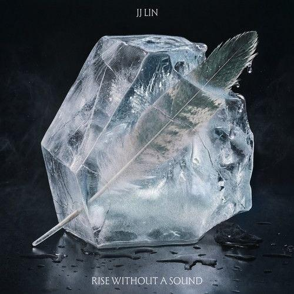
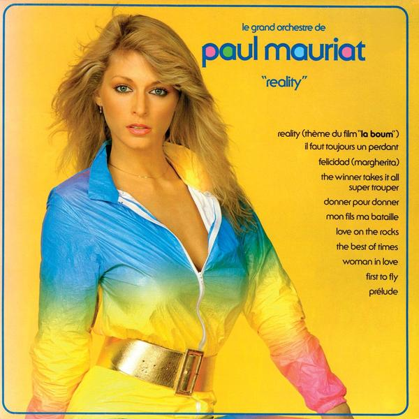
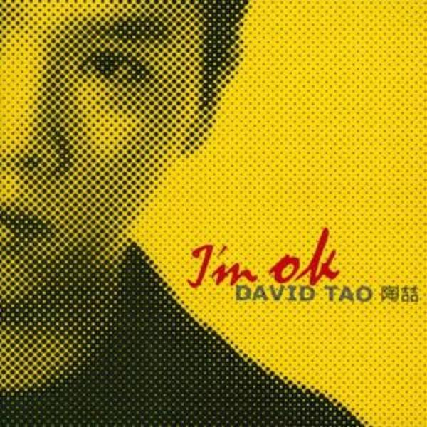

## 林俊杰

[2026-10-11 00:06] 来自：夸克云盘影视资源频道

名称：林俊杰  Rise Without A Sound (2026) FLAC 24bit 48khz

描述：林俊杰 2026最新单曲

夸克网盘：https://pan.quark.cn/s/26c3fb5c4753

百度网盘：https://pan.baidu.com/s/1U2K_3ZdLOrOoYhBq8NgepQ?pwd=kick 来自：百度网盘综合频道 [2026-10-11 00:02] 名称：林俊杰  Rise Without A Sound (2026) FLAC 24bit 48khz

📁 大小：N

🏷 标签：#无损音乐 #音乐 #华语

---

## 助眠音乐精选集

[2026-10-11 00:03] 来自：夸克云盘影视资源频道

名称：助眠音乐精选集 FLAC 24bit 48Khz

描述：触发来自心底的宁静，带你慢慢入睡，享受安然美梦。《助眠音乐精选集》是一张专为现代人设计的深度放松与睡眠引导音频专辑，融合自然白噪音、极简钢琴、氛围电子、疗愈弦乐与东方冥想音色，以科学节律（4–8 Hz θ波频段）为基础，营造安全、宁静、无干扰的听觉环境。所有曲目均去除突兀转调、强烈节奏或人声歌词，避免大脑激活。特别收录由神经声学团队监制的《Theta Flow No.3》，经临床测试可显著缩短入睡时间。

本专辑适合失眠、焦虑、冥想或午间小憩使用。戴上耳机，让声音成为你的夜之舟——载你穿越喧嚣，泊入深眠港湾

夸克网盘：https://pan.quark.cn/s/a4692cf1174d

📁 大小：N

🏷 标签：#无损音乐 #音乐 #纯音乐

---

## IU

[2026-10-11 00:03] 来自：无损音乐分享频道

名称：IU - Can You Hear Me FLAC 24bit 96khz

描述：首张日文迷你专辑，多元J-Pop曲风，收录自作曲《Voice-mail》

夸克网盘：https://pan.quark.cn/s/beb28998c8b6

📁 大小：N

🏷 标签：#无损音乐 #音乐

---

## 神秘园

[2026-10-11 00:01] 来自：无损音乐分享频道

名称：神秘园 Secret Garden - Songs From a Secret Garden FLAC 24bit 192khz

描述：Secret Garden《Songs From a Secret Garden》，新世纪音乐经典专辑，以小提琴与钢琴交织，旋律空灵悠远，诉说静谧治愈的秘境诗意。

夸克网盘：https://pan.quark.cn/s/faeb4e99f10b

📁 大小：1.52GB

🏷 标签：#无损音乐 #音乐 #纯音乐

---

## 张玮伽

[2026-10-10 21:20] 来自：夸克云盘影视资源频道

名称：张玮伽 《海浪》头版限量1-1母盘直刻 WAV+CUE

描述：01.爱情没有那么美

02.海浪

03.你把我灌醉

04.吻别

05.特别的爱给特别的你

06.我的未来不是梦

07.无情伤

08.听到你一声再会

09.不甘寂寞

10.春天里

11.让我一次爱个够

12.最爱的人伤我最深

13.被伤过的心还可以爱谁

14.海浪(Remix)

夸克网盘：https://pan.quark.cn/s/55fe32055785

📁 大小：N

🏷 标签：#无损音乐 #音乐 #华语

---

## Remi

[2026-10-10 20:36] 来自：综合网盘资源频道

名称：Remi Wolf - Mud (2026) FLAC

描述： 乡村摇滚新专辑。

百度网盘：https://pan.baidu.com/s/1VxPRYLJvlwYLDXXOIMAPyw?pwd=vqkd

夸克网盘：https://pan.quark.cn/s/d12c1b45f666

迅雷网盘：https://pan.xunlei.com/s/VP3_nEGPASfYPelLKti11XoDA1?pwd=vds9

📁 大小：330MB

🏷 标签：#音乐 #FLAC #baidu #quark #xunlei

---

## Paul

[2026-10-10 18:53] 来自：无损音乐分享频道

名称：Paul Mauriat - Reality (1981)FLAC 24bit 192khz qobuz

描述：Paul Mauriat《Reality》1981年录音，保罗莫里哀乐团演绎清新浪漫轻音乐

夸克网盘：https://pan.quark.cn/s/62a070747bfe

📁 大小：1.8GB

🏷 标签：#无损音乐 #音乐 #纯音乐

---

## Joyce

[2026-10-10 18:28] 来自：百度网盘综合频道

名称：Joyce Wrice - MACHIKO (2026) FLAC 24bit 48kHz qobuz

描述：Joyce Wrice《MACHIKO》2026新专辑，以她日文中间名命名，融合复古放克与新灵魂R&B，嗓音丝滑，探讨自我与亲密关系，收录多位艺人合作曲目。

百度网盘：https://pan.baidu.com/s/1oh92tOfK8W5aoM9UpIwfCA?pwd=kick

夸克网盘：https://pan.quark.cn/s/37536188fa1e 来自：无损音乐分享频道 [2026-10-10 18:20] 名称：Joyce Wrice - MACHIKO (2026) FLAC 24bit 48kHz qobuz

📁 大小：504MB

🏷 标签：#无损音乐 #音乐 #欧美流行

---

## 王菲

[2026-10-10 18:19] 来自：夸克云盘影视资源频道

名称：王菲 世界赠予我的 HiRes FLAC 192kHz 24bit

描述：曲目:

1 世界赠予我的

2 如愿

3 传奇

4 匆匆那年

5 归途有风

6 致青春

7 你在终点等我

8 人间

9 红豆

10 执迷不悔(国)

11 但愿人长久

12 容易受伤的女人(国)

13 因为爱情

夸克网盘：https://pan.quark.cn/s/4c4aba86513b

📁 大小：1.94GB

🏷 标签：#hires #flac #无损音乐 #华语流行 #音乐 #王菲

---

## 不再陌生

[2026-10-10 13:44] 来自：百度网盘综合频道

名称：不再陌生（2026）NF 4K DV&HDR 内封官中

描述：扬·博里塞维奇是波兰摇滚乐队 Lady Pank 的主唱。一连串的家庭悲剧塑造了他，而他用音乐影响了一代人。

百度网盘：https://pan.baidu.com/s/1NYL3nBqVxBecPfmJB8Edyw?pwd=37bq

夸克网盘：https://pan.quark.cn/s/e1f1b6e0c3d9 来自：综合网盘资源频道 [2026-10-10 13:43] 名称：不再陌生(2026)NF 4K DV&HDR 内封官中

📁 大小：17.8G

🏷 标签：#不再陌生 #剧情 #音乐 #传记

---

## 梁静茹

[2026-10-10 13:19] 来自：综合网盘资源频道

名称：梁静茹 - 我好吗？－太阳如常升起 FLAC 24bit 192khz

描述：1. 微光

2. 我好吗

3. 慢冷

4. 如爱所愿

5. 平行时空

6. 以你的名字呼喊我

7. 类情人

8. 太阳如常升起

9. 子非鱼

10. 完整的我

夸克网盘：https://pan.quark.cn/s/2d12d3a2ac32

百度网盘：https://pan.baidu.com/s/1BGJbNIqClb_4PDX2YdpN2Q?pwd=kick

📁 大小：1.4GB

🏷 标签：#无损音乐 #音乐 #梁静茹 #我好吗 #太阳如常升起 #FLAC #24bit #quark #baidu

---

## 檀健次

[2026-10-10 13:17] 来自：综合网盘资源频道

名称：檀健次 - TANGENT FLAC (2026) 24bit 48khz

描述：新专辑

夸克网盘：https://pan.quark.cn/s/726400a04629

📁 大小：N

🏷 标签：#无损音乐 #音乐 #华语 #檀健次 #FLAC #24bit #quark

---

## 陶喆

[2026-10-10 13:12] 来自：综合网盘资源频道

名称：陶喆 I'm OK wav 分轨

描述：陶喆《I'm OK》，1999年发行的第二张专辑，融合R&B、摇滚，收录《普通朋友》《小镇姑娘》等金曲，斩获金曲奖最佳专辑制作人，是华语经典之作。

夸克网盘：https://pan.quark.cn/s/e980192dd97d

📁 大小：N

🏷 标签：#无损音乐 #音乐 #华语 #陶喆 #wav #分轨 #quark

---

## 原神配乐

[2026-10-10 13:09] 来自：综合网盘资源频道

名称：原神配乐 合集 Genshin Impact - Original Game Soundtrack Hi-Res

描述：《原神》游戏原声Hi-Res合集，HOYO-MiX创作，管弦融合民族曲风，高解析录音还原提瓦特听觉世界。

夸克网盘：https://pan.quark.cn/s/42dbe068e29e

📁 大小：54GB

🏷 标签：#无损音乐 #音乐 #纯音乐 #原神 #原神配乐 #合集 #HiRes #quark

---

## 空灵女声

[2026-10-10 11:26] 来自：夸克云盘影视资源频道

名称：空灵女声 柯唯 合集 WAV

描述：主打空灵、治愈向女声，大量做经典老歌的AI翻唱版本 。

收录翻唱《情网》《月亮代表我的心》《风吹麦浪》等歌曲....

夸克网盘：https://pan.quark.cn/s/1b52af669422

📁 大小：2.2GB

🏷 标签：#无损音乐 #音乐 #华语 #ai

---

## Tchaikovsky

[2026-10-10 10:42] 来自：无损音乐分享频道

名称：Tchaikovsky - The Nutcracker - Berliner Philharmoniker, Mstislav Rostropovich (Remastered 2026) FLAC 24bit 192khz qobuz

描述：柴可夫斯基 胡桃夹子 2026版

夸克网盘：https://pan.quark.cn/s/ac6a7726480b

📁 大小：888MB

🏷 标签：#无损音乐 #音乐 #纯音乐

---

## Shania

[2026-10-10 09:24] 来自：百度网盘综合频道

名称：Shania Twain - 2026 - Little Miss Twain - The Places I'll Go FLAC 24bit 48khz

描述：Shania Twain《Little Miss Twain - The Places I'll Go》2026豪华版专辑，自传式乡村流行作品，融合摇滚与蓝草，嗓音洒脱充满故事感。

百度网盘：https://pan.baidu.com/s/1ldjOT6ghotmB-30DuvI9Hg?pwd=kick

夸克网盘：https://pan.quark.cn/s/c6c40c5f6e0d 来自：无损音乐分享频道 [2026-10-10 09:18] 名称：Shania Twain - 2026 - Little Miss Twain - The Places I'll Go FLAC 24bit 48khz

📁 大小：949MB

🏷 标签：#无损音乐 #音乐 #欧美乡村

---

## 梁静茹

[2026-10-10 09:23] 来自：百度网盘综合频道

名称：梁静茹 - 我好吗？－太阳如常升起 FLAC 24bit 192khz

描述：1. 微光

2. 我好吗

3. 慢冷

4. 如爱所愿

5. 平行时空

6. 以你的名字呼喊我

7. 类情人

8. 太阳如常升起

9. 子非鱼

10. 完整的我

百度网盘：https://pan.baidu.com/s/1BGJbNIqClb_4PDX2YdpN2Q?pwd=kick

夸克网盘：https://pan.quark.cn/s/2d12d3a2ac32 来自：夸克云盘影视资源频道 [2026-10-10 08:47] 名称：梁静茹 - 我好吗？－太阳如常升起 FLAC 24bit 192khz

📁 大小：1.4GB

🏷 标签：#无损音乐 #音乐 #梁静茹

---

## 檀健次

[2026-10-10 08:47] 来自：夸克云盘影视资源频道

名称：檀健次 - TANGENT FLAC (2026) 24bit 48khz

描述：新专辑

夸克网盘：https://pan.quark.cn/s/726400a04629

📁 大小：N

🏷 标签：#无损音乐 #音乐 #华语

---

## 陶喆

[2026-10-10 06:52] 来自：夸克云盘影视资源频道

名称：陶喆 I'm OK wav 分轨

描述：陶喆《I'm OK》，1999年发行的第二张专辑，融合R&B、摇滚，收录《普通朋友》《小镇姑娘》等金曲，斩获金曲奖最佳专辑制作人，是华语经典之作。

夸克网盘：https://pan.quark.cn/s/e980192dd97d

📁 大小：N

🏷 标签：#无损音乐 #音乐 #华语

---

## 接招吧制作人

[2026-10-09 22:59] 来自：综合网盘资源频道

名称：接招吧！制作人 接招吧！製作人 (2026) 【更新至07集】【1080p】【国语中字】【台剧】

描述：“流行音乐是一个人的狂欢，还是要大众喜欢？”

千禧年前后，大学刚毕业的廖苗君(9m88 饰)，误打误撞成为王牌音乐制作人吴培祖(杨祐宁 饰)的助理。一个坚韧但鲁莽，一个有才却难搞，这对相爱相杀的师徒，与不同大牌歌手碰撞出别样的创作火花。两人经历著冲突和磨合，共同面对各种挑战，肩负起音乐制作人的责任与使命。

夸克网盘：https://pan.quark.cn/s/11dbeff88786

📁 大小：NA

🏷 标签：#剧情 #音乐 #接招吧 #制作人 #製作人 #1080p #国语中字 #台剧 #quark

---

## Troye

[2026-10-09 21:57] 来自：综合网盘资源频道

名称：Troye Sivan - She’s the Best(2026)  FLAC 24bit 48khz  qobuz

描述：Troye Sivan《She’s the Best》2026第四张录音室专辑，探讨身份、欢愉与孤独，流行曲风层次丰富，人声细腻富有情绪张力。

夸克网盘：https://pan.quark.cn/s/f60df0b16af7

百度网盘：https://pan.baidu.com/s/17ro5Da6xgerWhOsNHshvtQ?pwd=kick

📁 大小：548MB

🏷 标签：#无损音乐 #音乐 #欧美流行 #FLAC #24bit #quark #baidu

---

## Carly

[2026-10-09 21:13] 来自：无损音乐分享频道

名称：Carly Rae Jepsen - The Loneliest Time (2022) FLAC Hi-Res 24bit

描述：

卡莉·蕾·吉普森第六张录音室专辑，2022年10月21日发行。以孤独为核心，融合80年代流行、迪斯科、放克与民谣，用复古合成器编织情绪 。从疫情隔离与亲密关系中的孤独切入，《Western Wind》梦幻松弛，《Beach House》犀利自嘲，同名曲与Rufus Wainwright对唱，打造“伤心蹦迪曲” 。16首歌从百首创作中精选，是她最内省的流行力作，用甜酷旋律解构孤独，温暖又戳心 。

夸克网盘：https://pan.quark.cn/s/b307beda1a2b

📁 大小：676MB

🏷 标签：#hires #无损音乐 #音乐 #欧美音乐

---

## 国乐典藏民乐八大家HQCD头版限量

[2026-10-09 18:06] 来自：夸克云盘影视资源频道

名称：国乐典藏《民乐八大家HQCD》头版限量 低速原抓WAV+CUE

描述：曲目：

01.火把节之夜 中阮 刘波

02.蕉窗夜雨 箜篌 马晓兰

03.大浪淘沙 三弦 徐凤霞

04.山寨恋歌 柳琴 高华兴

05.十面埋伏 琵琶 杨惟

06.高山流水 筝 许菱子

07.龙船 扬琴 郭敏清

08.古风操 古琴 龚一

夸克网盘：https://pan.quark.cn/s/018d6664f3aa

📁 大小：520MB

🏷 标签：#无损音乐 #音乐 #纯音乐

---

## 朗朗

[2026-10-09 14:53] 来自：综合网盘资源频道

名称：朗朗 – Modern Encores 2026 FLAC

描述：新EP专辑。

百度网盘：https://pan.baidu.com/s/1XyB7ocvvCVcywJPLmGAJ7Q?pwd=i1i0

夸克网盘：https://pan.quark.cn/s/78d17e444ead

迅雷网盘：https://pan.xunlei.com/s/VP3UQfpdMvjPaqRWJgrF64hLA1?pwd=ai2u

📁 大小：220MB

🏷 标签：#音乐 #朗朗 #FLAC #baidu #quark #xunlei

