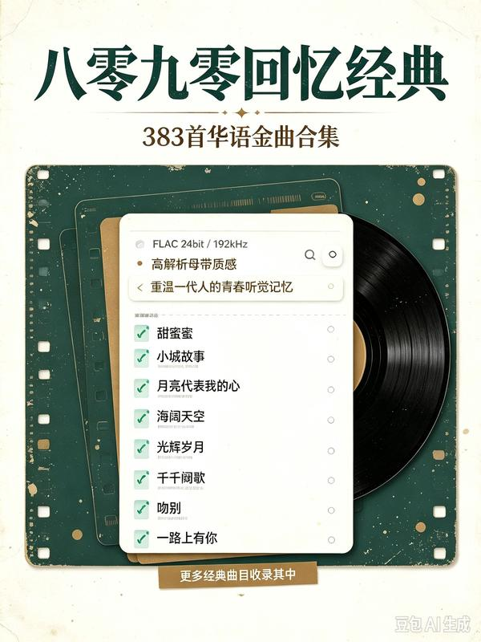
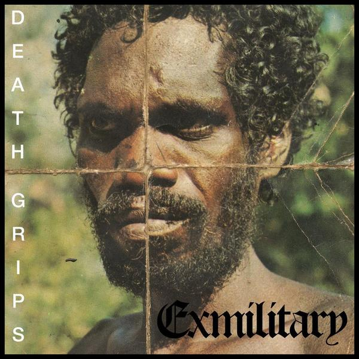

## 国乐典藏民乐八大家HQCD头版限量

[2026-10-09 11:45] 来自：无损音乐分享频道

名称：国乐典藏《民乐八大家HQCD》头版限量 低速原抓WAV+CUE

描述：曲目：

01.火把节之夜 中阮 刘波

02.蕉窗夜雨 箜篌 马晓兰

03.大浪淘沙 三弦 徐凤霞

04.山寨恋歌 柳琴 高华兴

05.十面埋伏 琵琶 杨惟

06.高山流水 筝 许菱子

07.龙船 扬琴 郭敏清

08.古风操 古琴 龚一

夸克网盘：https://pan.quark.cn/s/018d6664f3aa

📁 大小：520MB

🏷 标签：#无损音乐 #音乐 #纯音乐

---

## JEON

[2026-10-09 10:02] 来自：肯德基の4K影视综合电影云盘站

名称：JEON SOYEON - What a Wonderful Life (2026) [24-bit 48 kHz] - ALAC

描述：专辑的核心概念是 “辞职的浪漫”（Romance of Quitting） 。主打歌《I'm gonna TOESA》直译为“我要辞职了”，歌词描绘了递交辞职信、抛下重担的心境转变，旨在鼓励听众珍惜当下，优先考虑“此刻的幸福”，而非仅仅追求稳定的未来。歌曲中融入了韩国知名漫画家兼电视人Kian84的生活化旁白，为这首“辞职歌”增添了独特的趣味和共鸣感。

在音乐上，专辑并未局限于单一风格，而是通过摇滚、Hyperpop、迪斯科等元素的融合，展现了田小娟作为制作人“活泼、不可预测且略带混乱”的个人面貌。

夸克网盘：https://pan.quark.cn/s/6ed0549921dc

📁 大小：310MB

🏷 标签：#音乐 #无损音乐 #日韩潮流

---

## 田馥甄

[2026-10-09 09:19] 来自：肯德基の4K影视综合电影云盘站

名称：田馥甄 - 要去什么地方 (2026) [24-bit 96 kHz] - FLAC

描述：专辑由陈建騏、陈君豪担任制作人，并集结郑敬儒、邹序、杨世暄等独立音乐创作人参与，视觉远赴北欧法罗群岛拍摄，以“羊比人多”的原始地貌和变幻天气呼应“未知”与“不确定”的主题。音乐上，这张专辑脱离了她以往擅长的大众情歌框架，没有传统芭乐情歌，整体聚焦个人内在探索与自我和解，声音游走在独立摇滚、Dream Pop、合成器等风格之间，气质干净简明，

夸克网盘：https://pan.quark.cn/s/e82caf0e74a8

📁 大小：758MB

🏷 标签：#音乐 #无损音乐

---

## 许志安

[2026-10-09 08:56] 来自：综合网盘资源频道

名称：许志安 - 人與人之間 [HI-RES] FLAC 24Bit - 96kHz (2026) qobuz

描述：新专辑

夸克网盘：https://pan.quark.cn/s/4ead01fa0923

百度网盘：https://pan.baidu.com/s/1_Fb6gZTMSXkxHBFxkVwGBw?pwd=kick

📁 大小：904MB

🏷 标签：#无损音乐 #音乐 #华语 #许志安 #人與人之間 #HIRES #FLAC #24Bit #quark #baidu

---

## Carly

[2026-10-09 07:17] 来自：综合网盘资源频道

名称：Carly Rae Jepsen - Day and Night (Continued) (2026) Hi-Res 24bit 48kHz FLAC qobuz

描述：Carly Rae Jepsen 新专辑《Day and Night (Continued)》2026扩展专辑，延续昼夜双篇章构思，融合复古迪斯科与清新民谣，细腻呈现浪漫梦幻的流行质感

夸克网盘：https://pan.quark.cn/s/15e563025b69

百度网盘：https://pan.baidu.com/s/1lZjkkZBlxdB74iNCIXlv4w?pwd=kick

📁 大小：1.4GB

🏷 标签：#无损音乐 #音乐 #欧美流行 #quark #baidu

---

## 八零九零回忆经典

[2026-10-09 06:35] 来自：综合网盘资源频道

名称：八零九零回忆经典 歌曲 383首 FLAC 24bit 192khz

描述：《八零九零回忆经典》合集共383首，FLAC 24bit/192kHz母带规格，收录华语黄金年代金曲，细腻还原人声与编曲，重温一代人的青春听觉记忆。

夸克网盘：https://pan.quark.cn/s/ced85e70b71a

📁 大小：62GB

🏷 标签：#无损音乐 #音乐 #华语 #八零九零回忆经典 #歌曲 #383首 #FLAC #24bit #quark

---

## 八零九零回忆经典

[2026-10-09 00:05] 来自：夸克云盘影视资源频道

名称：八零九零回忆经典 歌曲 383首 FLAC 24bit 192khz

描述：《八零九零回忆经典》合集共383首，FLAC 24bit/192kHz母带规格，收录华语黄金年代金曲，细腻还原人声与编曲，重温一代人的青春听觉记忆。

夸克网盘：https://pan.quark.cn/s/ced85e70b71a

📁 大小：62GB

🏷 标签：#无损音乐 #音乐 #华语

---

## Carly

[2026-10-08 21:21] 来自：综合网盘资源频道

名称：Carly Rae Jepsen - Day and Night (Continued) 2026 FLAC

描述：10月9日新专辑增加8首新歌。

百度网盘：https://pan.baidu.com/s/10B6Scmv7bM0F7M-xHhRlVw?pwd=nf4k

夸克网盘：https://pan.quark.cn/s/f0c569ce8e69

迅雷网盘：https://pan.xunlei.com/s/VP3QeqdccNvT6xDRbYXwCiQzA1?pwd=macr

📁 大小：1.3G

🏷 标签：#音乐 #FLAC #baidu #quark #xunlei

---

## Troye

[2026-10-08 21:00] 来自：综合网盘资源频道

名称：Troye Sivan - She’s the Best (2026) FLAC

描述：10.9 新专辑。

百度网盘：https://pan.baidu.com/s/18IMq2s6EY9Q6zKpNIcQqmg?pwd=wqs2

夸克网盘：https://pan.quark.cn/s/aa87777c0847

迅雷网盘：https://pan.xunlei.com/s/VP3Q_dk9lRKP3JmuClnBNbCJA1?pwd=2m4y

📁 大小：500MB

🏷 标签：#音乐 #FLAC #baidu #quark #xunlei

---

## Death

[2026-10-08 20:26] 来自：无损音乐分享频道

名称：Death Grips - Exmilitary 2011 FLAC

描述：Death Grips《Exmilitary》，2011年实验嘻哈混音带。扭曲粗粝采样搭配MC Ride狂暴嘶吼，融合工业噪音与朋克，奠定噪音说唱流派的经典里程碑。

夸克网盘：https://pan.quark.cn/s/929b5547ea9d

📁 大小：N

🏷 标签：#无损音乐 #音乐 #说唱

---

## Paul

[2026-10-08 19:28] 来自：无损音乐分享频道

名称：Paul Mauriat - Piano Ballade (1984) FLAC 24bit 192khz qobuz

描述：纯音乐 

夸克网盘：https://pan.quark.cn/s/771e02e9ec71

📁 大小：NG

🏷 标签：#无损音乐 #音乐 #纯音乐

---

## 宋雨琦

[2026-10-08 18:51] 来自：肯德基の4K影视综合电影云盘站

名称：宋雨琦 YUQI - 二十七 (27) FLAC 24bit 96khz

描述：宋雨琦（YUQI）首张中文专辑 《二十七(27)》，全曲亲自参与词曲创作，以27岁心境为内核，曲风多元，诉说接纳自我、奔赴前路的青春独白。

夸克网盘：https://pan.quark.cn/s/98855e479270

百度网盘：https://pan.baidu.com/s/1c4jJdz2_tEkdR1IaEoc6Yw?pwd=kick

百度网盘：https://pan.baidu.com/s/13cTAVqBoXhga5ghm2_KOsw?pwd=yn2m 来自：综合网盘资源频道 [2026-10-08 12:39] 名称：宋雨琦 - 二十七 (27) (2026) FLAC

夸克网盘：https://pan.quark.cn/s/6f150a7e2ade 来自：综合网盘资源频道 [2026-10-08 12:39] 名称：宋雨琦 - 二十七 (27) (2026) FLAC

迅雷网盘：https://pan.xunlei.com/s/VP3OnUg4ZrdK1caahlpjxXINA1?pwd=2vku 来自：综合网盘资源频道 [2026-10-08 12:39] 名称：宋雨琦 - 二十七 (27) (2026) FLAC

📁 大小：374MB

🏷 标签：#无损音乐 #音乐 #华语

---

## 许志安

[2026-10-08 16:46] 来自：综合网盘资源频道

名称：许志安 - 人与人之间 (2026) FLAC

描述：新专辑。

百度网盘：https://pan.baidu.com/s/1avhdXUf49CLPqHQFvKz93A?pwd=vr8d

夸克网盘：https://pan.quark.cn/s/95ef0b68eae6

迅雷网盘：https://pan.xunlei.com/s/VP3PfdIUipMn-qdI0k4gNMRaA1?pwd=n38t

📁 大小：270MB

🏷 标签：#音乐 #许志安 #人与人之间 #FLAC #baidu #quark #xunlei

---

## 林北北

[2026-10-08 10:21] 来自：夸克云盘影视资源频道

名称：林北北 情为证 2026头版限量编号24K黄金母盘 原抓WAV+CUE

描述：01.忘了你忘了我

02.三百六十五里路

03.难道

04.今夜情为证，难舍难分 (国、粤)

05.只要你过得比我好

06.似是故人来 (国语)

07.问

08.再回首、凭着爱 (国、粤)

09.酒醉的探戈2001

10.鬼迷心窍

11.驿动的心、祝福 (国、粤)

12.一路上有你

夸克网盘：https://pan.quark.cn/s/83cfc557f306

📁 大小：582MB

🏷 标签：#无损音乐 #音乐 #华语

---

## 生化危机

[2026-10-08 10:16] 来自：百度网盘综合频道

名称：生化危机 爆发夜 (2026) 原声带 配乐 Hays Holladay, Ryan Holladay - Resident Evil (2026) FLAC

描述：Hays Holladay与Ryan Holladay为电影《生化危机：爆发夜》创作原声，实验电子配乐，层层渲染压抑惊悚氛围，烘托浣熊市的危机与恐怖感。

链接：

百度网盘：https://pan.baidu.com/s/1WeAEWe2NexmxRXSzARa-LA?pwd=kick

夸克网盘：https://pan.quark.cn/s/ff8601db0e82 来自：综合网盘资源频道 [2026-10-08 10:15] 名称：生化危机 爆发夜 (2026) 原声带 配乐 Hays Holladay, Ryan Holladay - Resident Evil (2026) FLAC

📁 大小：N

🏷 标签：#无损音乐 #音乐 #ost #生化危机爆发夜 #电影配乐 #原声带

---

## 莎拉布莱曼

[2026-10-08 07:01] 来自：无损音乐分享频道

名称：莎拉布莱曼 交响曲  WAV 24BIT 192KHZ

描述：莎拉·布莱曼《Symphony》，古典跨界专辑，哥特交响，歌声空灵恢弘。

夸克网盘：https://pan.quark.cn/s/f54233a560aa

📁 大小：NG

🏷 标签：#无损音乐 #音乐 #欧美

---

## 陈奕迅

[2026-10-08 00:10] 来自：百度网盘综合频道

名称：陈奕迅 反正是我 dsd dsf

描述：陈奕迅加盟英皇后的首张国语作品，《反正是我》收录了十首国语歌曲，包括强力主打「爱是怀疑」、原唱名曲「K歌之王

  曲目

 1 Because You’re Good To Me

 2 低等动物

 3 不如这样

 4 爱是怀疑

 5 我也不会那样做

 6 K歌之王

 7 没有你

 8 冤家

 9 全世界失眠

 10 Good Time

链接：

百度网盘：https://pan.baidu.com/s/1L8X2F8yQjAD19NG1GTtKQg?pwd=8888

夸克网盘：https://pan.quark.cn/s/a5f16a7786ac 来自：夸克云盘影视资源频道 [2026-10-08 00:10] 名称：陈奕迅 反正是我 dsd dsf

📁 大小：NG

🏷 标签：#无损音乐 #音乐 #华语

---

## Sarah

[2026-10-08 00:05] 来自：百度网盘综合频道

名称：Sarah Brightman - Sunset Over Broadway (2026) ALAC 16bit 44.1kHz

描述：莎拉·布莱曼2026新作《Sunset Over Broadway》，收录音乐剧与电影金曲，以古典跨界演绎

链接：

百度网盘：https://pan.baidu.com/s/1_wr6WRbFcCU3Ql3FyrRqcQ?pwd=kick

夸克网盘：https://pan.quark.cn/s/469b7201ee6c 来自：夸克云盘影视资源频道 [2026-10-08 00:01] 名称：Sarah Brightman - Sunset Over Broadway (2026) ALAC 16bit 44.1kHz

📁 大小：N

🏷 标签：#无损音乐 #音乐 #欧美

---

## 鄧紫棋

[2026-10-08 00:05] 来自：夸克云盘影视资源频道

名称：鄧紫棋 - 自由的你 - Single (2026) ALAC 24bit 48khz

描述：鄧紫棋 新歌

夸克网盘：https://pan.quark.cn/s/8651d45fedaa

📁 大小：N

🏷 标签：#无损音乐 #音乐 #华语

---

## 健听女孩

[2026-10-07 22:35] 来自：百度网盘综合频道

名称：【原盘】健听女孩 (2021) 4K REMUX HDR 外挂简中字幕

美丽的高中女孩露比·罗西（艾米莉亚·琼斯 Emilia Jones 饰）出生于一个极不寻常的渔民家庭，她的父母和哥哥天生聋哑，只能通过手语交流。而健康无恙的露比既是幸运的，却也是不幸的。她担任了家人和外界交流沟通的桥梁，为此承受了诸多的歧视和嘲笑。这期间，只有好闺蜜戈蒂（艾米·福赛思 Amy Forsyth 饰）是她最坚定的支撑。因为喜欢男孩迈尔斯（福迪亚·瓦尔什-匹罗 Ferdia Walsh-Peelo 饰），露比报名参加校合唱团，而天资颖悟的很快得到了负责老师的赏识。在此之后，露比频繁奔波于合唱团和家族之间，她渴望前往伯克利追求音乐梦想，而这势必要和对她无比依赖的原生家庭分隔两地。露比为此深深焦虑……

百度网盘：https://pan.baidu.com/s/1-OJ7Use5sJFS9UnKjKISdg?pwd=7757

📁 大小：69.2GB

🏷 标签：#剧情 #爱情 #音乐 #健听女孩

---

## 工作学习背景音乐放松治愈轻音乐

[2026-10-07 15:17] 来自：综合网盘资源频道

名称：工作学习背景音乐：放松治愈轻音乐  卡农舒缓氛围音乐 冥想疗愈

描述：缓解焦虑、恐惧和抑郁的疗愈音乐 疗愈身心灵魂，让您可以放松身心、集中注意力、学习、冥想，或安然入睡。 工作背景音乐 减压放松让音乐陪伴你，深呼吸，感受清晨的宁静与美好。

夸克网盘：https://pan.quark.cn/s/177fff5415eb

📁 大小：138.5G

🏷 标签：#音乐 #背景音乐 #放松治愈 #轻音乐 #卡农 #氛围音乐 #冥想疗愈 #工作学习背景音乐 #放松治愈轻音乐 #卡农舒缓氛围音乐 #quark

---

## 免费的音乐播放与听歌下载软件尼卡音乐app

[2026-10-07 15:16] 来自：综合网盘资源频道

名称：免费的音乐播放与听歌下载软件-尼卡音乐app

描述：集海量音乐资源、个性化推荐、高清音质播放于一体的综合性音乐播放平台，无需注册登录，打开即拥有全部功能。聚合了六大音源曲库、歌单、排行榜，支持在线试听、无损下载以及高清MV播放。资源全、无广告、更新快,适合寻找高品质音乐体验的用户。

夸克网盘：https://pan.quark.cn/s/e54cf09de87f

📁 大小：14.3MB

🏷 标签：#音乐 #软件 #音乐播放 #听歌 #音乐下载软件 #尼卡音乐 #app #免费的音乐播放与听歌下载软件 #尼卡音乐app #quark

---

## 天外歌姬

[2026-10-07 15:06] 来自：综合网盘资源频道

名称：天外歌姬 Superestar (2025)

描述：本剧集以 21 世纪初的乱象为背景,，用前所未有的方式重现了流行偶像塔玛拉的生平及其蜕变为尤蕾娜的过程。

夸克网盘：https://pan.quark.cn/s/ef62f70e6d98

📁 大小：NG

🏷 标签：#剧情 #喜剧 #音乐 #传记 #天外歌姬 #quark #ali

---

## 赵鹏与惊堂木乐队

[2026-10-07 10:57] 来自：百度网盘综合频道

名称：赵鹏与惊堂木乐队 低音炮 3套车 SACD iso

描述：《赵鹏与惊堂木乐队 低音炮 3套车 SACD》日本压制！

专辑曲目：

01 三套车

02 卜奎大街

3 在那东山顶上

04 花房姑娘

05 那一天

06 海恋

07 春光好

08 三百六十五里路

09 知否

10 春天里

11 多少柔情多少泪

12 踏浪

百度网盘：https://pan.baidu.com/s/1TNXmx2Y4RCTeq_9MgrPPxA?pwd=kick

夸克网盘：https://pan.quark.cn/s/9c23abb30aa7 来自：夸克云盘影视资源频道 [2026-10-07 10:56] 名称：赵鹏与惊堂木乐队 低音炮 3套车 SACD iso

📁 大小：N

🏷 标签：#无损音乐 #音乐 #华语

---

## 101

[2026-10-07 10:52] 来自：综合网盘资源频道

名称：101 Strings Orchestra - Honeymoon in South America 2026 FLAC

描述：南美蜜月 管弦专辑。

百度网盘：https://pan.baidu.com/s/14-U62X1m1fY-5iT1LKKUYw?pwd=3e12

夸克网盘：https://pan.quark.cn/s/e8dc060e0290

迅雷网盘：https://pan.xunlei.com/s/VP3JFjv2__paCDs8k7Y7X_RbA1?pwd=bwhv

📁 大小：240MB

🏷 标签：#音乐 #baidu #quark #xunlei

---

## GEM邓紫棋

[2026-10-07 08:07] 来自：综合网盘资源频道

名称：G.E.M.邓紫棋  自由的你 (2026) FLAC 24bit 48khz +臻品母带

描述：邓紫棋 新专辑 先行曲.

夸克网盘：https://pan.quark.cn/s/98b859797890

百度网盘：https://pan.baidu.com/s/1x3QGAJDQMLY2MCT-swEV9w?pwd=kick

📁 大小：274MB

🏷 标签：#无损音乐 #音乐 #华语 #邓紫棋 #自由的你 #FLAC #24bit #臻品母带 #quark #baidu

---

## 微醺卡带

[2026-10-07 08:05] 来自：百度网盘综合频道

名称：微醺卡带  flac

描述：微醺卡带，热门AI虚拟人声歌手，主打经典老歌慵懒R&B改编，唱腔松弛氛围感强，广泛用作短视频、车载BGM，在氛围感音乐圈层人气颇高。

百度网盘：https://pan.baidu.com/s/1WghX7ISelF9li7ZEV05uSg?pwd=kick

夸克网盘：https://pan.quark.cn/s/e9c2abd07793 来自：夸克云盘影视资源频道 [2026-10-07 07:45] 名称：微醺卡带  flac

📁 大小：2GB

🏷 标签：#无损音乐 #音乐 #华语

---

## 梁咏琪

[2026-10-07 00:15] 来自：百度网盘综合频道

名称：梁咏琪 温柔的存在 (2026) FLAC 24bit 96khz

描述：

01.怎么了

02.我爱你 是为了开始爱你

03.爱到越来越对的我们

04.Precious

05.温柔的存在

06.远距离

07.描金

08.在傍晚的风里遇见

09.TA不是TA的TA

10.累就回家

11.温柔的存在 (粤语版)

夸克网盘：https://pan.quark.cn/s/dee608fcda9c

📁 大小：837MB

🏷 标签：#无损音乐 #音乐 #华语

---

## 刘三姐

[2026-10-06 21:43] 来自：综合网盘资源频道

名称：刘三姐 (1960)

描述：砍柴女刘三姐(黄婉秋)以唱帮穷苦人解气的山歌名闻四乡，却也因此被视她为肉中刺的财主陷害，幸运捡得一条命后，她一路歌声沿江而下。老渔夫(张巨克)和儿子阿牛(刘世龙)通过歌声将她辨出，将她接入家中。远近乡民听闻，都赶来与刘三姐赛歌，以为她已人头落地的哥哥刘二(梁音)也因此机与她重逢。因为歌词中多处直揭财主对穷苦人的盘剥，乡民叫好同时亦令当地财主莫怀仁(夏宗学)极为恐慌。

夸克网盘：https://pan.quark.cn/s/4a677bb20c42

📁 大小：NG

🏷 标签：#剧情 #音乐 #戏曲 #刘三姐 #quark #ali

---

## 爆裂鼓手

[2026-10-06 18:33] 来自：电影资源频道(4K、REMUXE/原盘)

名称：【原盘】爆裂鼓手 (2014) 4K REMUX 外挂简中字幕

描述：19岁少年安德鲁成长在单亲家庭，以传奇乐手查理·帕克为目标，一心想成为顶级爵士乐鼓手。某晚他在学校练习时被魔鬼导师弗莱彻相中，进入正规乐队，同时也开始为追求完美付出代价。安德鲁越是刻苦练习，与外部世界越是隔膜。唯一理解他的是弗莱彻，但后者的暴躁与喜怒无常扭曲了这段师生关系，更让安德鲁耳濡目染，连带自身的性格亦发生变化。最后当安德鲁终于登上纽约音乐厅的舞台，他才惊恐的发现原来弗莱彻一直等着将他打入尘埃。

夸克网盘：https://pan.quark.cn/s/08d379f993a9

📁 大小：46.7GB

🏷 标签：#剧情 #音乐 #爆裂鼓手

---

## Miranda

[2026-10-06 09:53] 来自：综合网盘资源频道

名称：Miranda Lambert - Crisco (2026) ALAC 24bit 48khz

描述：乡村新专

Miranda Lambert 2026专辑《Crisco》，融合乡村与70年代复古迪斯科，共12首，邀Chris Stapleton合作，叙事鲜活，兼具洒脱野性与怀旧质感。

夸克网盘：https://pan.quark.cn/s/3f77bebab7d4

百度网盘：https://pan.baidu.com/s/1oNxSmwzp92NrhwXlKjJVtw?pwd=kick

📁 大小：541MB

🏷 标签：#无损音乐 #音乐 #欧美 #ALAC #24bit #quark #baidu

---

## 谭咏麟

[2026-10-06 08:29] 来自：综合网盘资源频道

名称：谭咏麟 (2026) 刻骨铭心 谭咏麟 流行传世自选集 感激篇 24B-96.0kHz ALAC

描述：谭咏麟《刻骨铭心 流行传世自选集·感激篇》，4CD DSD数码重制，收录《爱在深秋》《朋友》等影视金曲，醇厚声线诉说感恩，回味粤语黄金时代。

夸克网盘：https://pan.quark.cn/s/d26b6d4e751a

📁 大小：6.2GB

🏷 标签：#音乐 #无损音乐 #华语 #谭咏麟 #刻骨铭心 #流行传世自选集 #感激篇 #ALAC #quark

---

## 兰香如故

[2026-10-06 04:52] 来自：夸克云盘影视资源频道

名称：兰香如故 (2026) 影视原声带 24bit 48kHz ALAC

描述：《兰香如故》2026影视原声带，董冬冬、陈曦操刀，周深、郁可唯等献唱。歌曲与配乐交织，诉说人物命运浮沉，旋律细腻，满含岁月悲欢与成长释然。

夸克网盘：https://pan.quark.cn/s/4b3482bb9fbf

📁 大小：1GB

🏷 标签：#无损音乐 #音乐 #华语

---

## 蜘蛛侠

[2026-10-06 04:52] 来自：无损音乐分享频道

名称：蜘蛛侠 崭新一日(2026) 原声带 配乐 Spider Man  Brand New Day (ost) (2026) FLAC 24Bit 96kHz qobuz

描述：《蜘蛛侠：崭新之日》原声配乐，由迈克尔·吉亚奇诺创作。延续蜘蛛侠系列标志性旋律，管弦乐交织现代电子编曲，描摹彼得·帕克背负责任的挣扎与少年热血，情绪层次饱满。配乐紧扣影片叙事，在孤寂与激昂之间切换，塑造出富有感染力的超级英雄听觉篇章。

夸克网盘：https://pan.quark.cn/s/5f847ae7385c

📁 大小：1.4G

🏷 标签：#无损音乐 #音乐 #原声带 #配乐

---

## 波西米亚狂想曲

[2026-10-05 23:33] 来自：电影资源频道(4K、REMUXE/原盘)

名称：【原盘】波西米亚狂想曲 (2018) 4K REMUX HDR 杜比视界 外挂简英双语字幕

描述：本片是对皇后乐队、传奇主唱弗雷迪·莫库里以及他们音乐的致敬盛宴，这是一段充满爱、痛苦、接纳和音乐的旅程。 弗雷迪·莫库里（拉米·马雷克 饰）曾是希思罗机场的一名普通搬运工，对音乐满腔热血的他，与布莱恩·梅（格威利姆·李 饰）、罗杰·泰勒（本·哈迪 饰）、约 翰·迪肯（约瑟夫·梅泽罗 饰）组成皇后乐队。这个殿堂级乐队的从无到有，从疏离到重聚，从低谷到巅峰，仿佛就是弗雷迪一生的缩影。在最后的日子里，弗雷迪做了生命中最重要的决定——在音乐史上最伟大的“拯救生命”大型摇滚乐演唱会上，将所有热血付诸于歌声。

夸克网盘：https://pan.quark.cn/s/19611067b571

📁 大小：19.4GB

🏷 标签：#波西米亚狂想曲 #剧情 #同性 #音乐 #传记

---

## 423首九十年代华语经典金曲

[2026-10-05 21:35] 来自：综合网盘资源频道

名称：423首九十年代华语经典.金曲 QQ音乐 [FLAC]

描述：精选90年代华语经典423首，摇滚、情歌、民谣等多种风格，重现了那个黄金年代的流行脉搏与青春记忆，FLAC无损音质，重温黄金年代的音乐记忆 ，跨越年代金曲一网打尽，从怀旧老歌到流行新声，满足不同音乐品味，转存即享 ...

夸克网盘：https://pan.quark.cn/s/4d6b22c19f62

百度网盘：https://pan.baidu.com/s/1xxDKIc6YZouihp26p8XVxw?pwd=thm3

📁 大小：10.7G

🏷 标签：#音乐 #华语经典 #90年代盛行歌曲 #QQ音乐 #FLAC无损 #423首九十年代华语经典 #金曲 #quark #baidu

---

## 谭咏麟

[2026-10-05 19:20] 来自：夸克云盘影视资源频道

名称：谭咏麟 刻骨铭心 谭咏麟流行传世自选集不变篇 24Bit 96kHz ALAC

描述：谭咏麟《刻骨铭心 流行传世自选集·不变篇》，4CD采用DSD数码重制，收录经典金曲，新增《我在意》《朋友啊，干杯!》《满江红》三首新作，醇厚声线叙写岁月情怀。

夸克网盘：https://pan.quark.cn/s/7cabfc33d972

📁 大小：6.1GB

🏷 标签：#无损音乐 #音乐 #华语

---

## 醉乡民谣

[2026-10-05 18:16] 来自：综合网盘资源频道

名称：醉乡民谣 (2013) 1080p 原盘REMUX 中文字幕 AVC DTS-HD MA 5.1

描述：美国怪诞风貌的造梦者乔尔与伊桑·科恩兄弟，借勒维恩·戴维斯这一角色呈现了他们最杰出的创作之一——这位歌手在六十年代初格林威治村民谣热潮的边缘勉强维生。奥斯卡·伊萨克以突破性表演塑造的勒维恩(其形象松散取材于民谣传奇戴夫·范·容克)才华横溢却又暴躁、粗鲁且自我毁灭。影片由摄影师布鲁诺·德尔邦内尔以动情的镜头捕捉他在严寒冬日城市里循环往复的漂泊轨迹，以辛酸幽默与间或超现实的笔触实现。由T·本恩·伯内特策划的民谣原声贯穿全片，本片再次印证科恩兄弟的世界里，历史未必由胜者书写。

百度网盘：https://pan.baidu.com/s/1dI7uqz7bjZEfWtaP0K2lfw?pwd=Yu88

迅雷网盘：https://pan.xunlei.com/s/VP3AYo7pkFSVT0QzSqJ8r4gWA1?pwd=k2qk

📁 大小：20.7GB

🏷 标签：#音乐 #醉乡民谣 #1080p #原盘REMUX #中文字幕 #DTSHD #baidu #xunlei

---

## Jan

[2026-10-05 16:25] 来自：无损音乐分享频道

名称：Jan Willem De Vriend  City Of Kyoto Symphony Orchestra 舒伯特  交响曲 No.1 & No.4 (2.8MHz DSD)

描述：Jan Willem de Vriend指挥京都交响乐团，演绎舒伯特第一、《悲剧》第四交响曲，DSD64录制，本真演奏风格，音色干净通透，重现古典交响质感。

夸克网盘：https://pan.quark.cn/s/79d4ab7d530d

📁 大小：N

🏷 标签：#无损音乐 #音乐 #古典

---

## 雷佳人世间2024

[2026-10-05 13:46] 来自：综合网盘资源频道

名称：雷佳《人世间》2024 电视剧原声带【WAV+CUE】

描述：《人世间》电视剧原声带，由张镒麟作曲，收录雷佳、周深演唱曲目。配乐质朴厚重，描摹平凡众生悲欢，满是东北街巷的人间烟火与岁月温情。

百度网盘：https://pan.baidu.com/s/198IGD9VlPSf6aqlqjTnNag?pwd=kick

夸克网盘：https://pan.quark.cn/s/0cba53e19d64

📁 大小：N

🏷 标签：#无损音乐 #音乐 #华语 #雷佳 #人世间 #电视剧原声带 #WAV #baidu #quark

---

## 方大同

[2026-10-05 09:31] 来自：百度网盘综合频道

名称：方大同 - 未来 引进版 2025鸿艺唱片 低速原抓 WAV+CUE

描述：方大同《未来》Wonderland（2007）曲目

1. Love Song

2. 够不够

3. 暖

4. 爱在

5. 公园

6. 简单最浪漫

7. 十九八七…

8. 未来

9. 忘了美丽

10. Sorry

11. 爱爱爱（Acoustic Version，Bonus）

百度网盘：https://pan.baidu.com/s/1YcfcHGT7UzeMTR92Q6CZVA?pwd=kick

夸克网盘：https://pan.quark.cn/s/7bbb9579a3c2 来自：夸克云盘影视资源频道 [2026-10-05 09:30] 名称：方大同 - 未来 引进版 2025鸿艺唱片 低速原抓 WAV+CUE

📁 大小：N

🏷 标签：#无损音乐 #音乐 #华语

---

## 兰香如故

[2026-10-05 06:25] 来自：综合网盘资源频道

名称：兰香如故 (2026) 影视原声带 24bit 48kHz ALAC

描述：《兰香如故》2026影视原声带，董冬冬、陈曦操刀，周深、郁可唯等献唱。歌曲与配乐交织，诉说人物命运浮沉，旋律细腻，满含岁月悲欢与成长释然。

夸克网盘：https://pan.quark.cn/s/4b3482bb9fbf

📁 大小：1GB

🏷 标签：#无损音乐 #音乐 #华语 #兰香如故 #影视原声带 #24bit #ALAC #quark

---

## 雷佳人世间2024

[2026-10-05 06:22] 来自：夸克云盘影视资源频道

名称：雷佳《人世间》2024 电视剧原声带【WAV+CUE】

描述：《人世间》电视剧原声带，由张镒麟作曲，收录雷佳、周深演唱曲目。配乐质朴厚重，描摹平凡众生悲欢，满是东北街巷的人间烟火与岁月温情。

夸克网盘：https://pan.quark.cn/s/0cba53e19d64

📁 大小：N

🏷 标签：#无损音乐 #音乐 #华语

---

## 醉乡民谣

[2026-10-04 19:29] 来自：综合网盘资源频道

名称：醉乡民谣 (2013) 1080p 原盘REMUX 中文字幕 AVC DTS-HD MA 5.1

描述：美国怪诞风貌的造梦者乔尔与伊桑·科恩兄弟，借勒维恩·戴维斯这一角色呈现了他们最杰出的创作之一——这位歌手在六十年代初格林威治村民谣热潮的边缘勉强维生。奥斯卡·伊萨克以突破性表演塑造的勒维恩(其形象松散取材于民谣传奇戴夫·范·容克)才华横溢却又暴躁、粗鲁且自我毁灭。影片由摄影师布鲁诺·德尔邦内尔以动情的镜头捕捉他在严寒冬日城市里循环往复的漂泊轨迹，以辛酸幽默与间或超现实的笔触实现。由T·本恩·伯内特策划的民谣原声贯穿全片，本片再次印证科恩兄弟的世界里，历史未必由胜者书写。

夸克网盘：https://pan.quark.cn/s/0a6751443f06

📁 大小：20.7GB

🏷 标签：#音乐 #醉乡民谣 #1080p #原盘REMUX #中文字幕 #DTSHD #quark

---

## Maggie

[2026-10-04 17:08] 来自：肯德基の4K影视综合电影云盘站

名称：Maggie Rose - No One Gets Out Alive (2024) FLAC 24bit 96kHz

描述：

Maggie Rose 2024《No One Gets Out Alive》，复刻70年代Laurel Canyon美式根源之声，融合灵魂、摇滚与民谣，嗓音浑厚有力，探讨女性力量与生命思考。

夸克网盘：https://pan.quark.cn/s/9e08c3628fe3

百度网盘：https://pan.baidu.com/s/1WJ1h-Asp7PhHZo5VXk-6_w?pwd=kick

📁 大小：N

🏷 标签：#无损音乐 #音乐 #欧美民谣

---

## 2026年9月抖音爆火人气歌曲合集

[2026-10-04 14:29] 来自：综合网盘资源频道

名称：2026年9月抖音爆火人气歌曲合集

描述：300多首2026年9月网络热门歌曲，覆盖全年龄段听众，适配通勤驾驶等各类场景。

夸克网盘：https://pan.quark.cn/s/13ffdb21da11

百度网盘：https://pan.baidu.com/s/1J1KS8_-fw6ekKj9Nsh52kg?pwd=1111

迅雷网盘：https://pan.xunlei.com/s/VP34YdXJyf6QZShuI_CAOWbyA1?pwd=fxkb

📁 大小：14.7GB

🏷 标签：#音乐 #quark #baidu #xunlei #guangyapan

---

## 搭错车

[2026-10-04 12:11] 来自：影视动漫分享|SeedHub|夸克|网盘|🧲

名称：搭错车 (1983)

#电影 #音乐 #家庭 #剧情 #迅雷

主演: 孙越 刘瑞琪 李立群 

豆瓣: [8.3](https://movie.douban.com/subject/1306564/)

退伍老兵哑叔（孙越）因捡回弃婴致使妻子别他而去，靠拾破烂，哑叔既当爸又做妈含辛茹苦将取名阿美（刘瑞琪）的弃婴养大成人。因为哑叔常在耳边吹奏美妙的乐曲，阿美自小就对音..

迅雷网盘：https://pan.xunlei.com/s/VOziCvEroltwmZOxIIygWzgtA1?pwd=h6x3

---

## 哈雅乐团

[2026-10-04 12:01] 来自：夸克云盘影视资源频道

名称：哈雅乐团 - 狼图腾 HQCDII限量版 2016 wav 分轨

描述：“他们（HAYA哈雅）在传统与现代之间追寻着来自灵魂的声音；他们对古老蒙古民族特有的马头琴、呼唛、长调与现代音乐的独到诠释引起了艺术界的广泛关注。在这张专辑中，'HAYA'表达的不仅是对现代蒙古音乐的理解，更是对自然的热爱，对心灵的呼唤。”

华人殿堂级音乐大师谭盾

夸克网盘：https://pan.quark.cn/s/fc6bdb2019f8

📁 大小：N

🏷 标签：#无损音乐 #音乐

---

## 林忆莲

[2026-10-04 11:13] 来自：夸克云盘影视资源频道

名称：林忆莲 - 拥有忆莲·最完整精选全记录 CD1 - 2  滚石台湾首版] wav 分轨

描述：林忆莲《拥有忆莲·最完整精选全记录》，汇集多时期国语粤语金曲，收录伤痕、为你我受冷风吹等代表作，尽显细腻深情的都市唱腔。

夸克网盘：https://pan.quark.cn/s/6673c3d56590

📁 大小：N

🏷 标签：#无损音乐 #音乐 #华语

---

## 方大同

[2026-10-04 08:35] 来自：综合网盘资源频道

名称：方大同 - 橙月 Orange Moon 低速原抓WAV+CUE

描述：

1. Singalongsong

2. 小小虫

3. 1234567

4. 黑白

5. 如果爱

6. 黑洞里

7. 三人游

8. 每个人都会

9. 100种表情

10. 爱我吧

11. 为你写的歌

12. Orange Moon

链接：

夸克网盘：https://pan.quark.cn/s/14b81436254b

百度网盘：https://pan.baidu.com/s/13SsZj9tIYa5mruzaBiDP7Q?pwd=kick

📁 大小：N

🏷 标签：#无损音乐 #音乐 #华语 #方大同 #橙月 #低速原抓WAV #quark #baidu

---

## 空灵女声

[2026-10-04 06:23] 来自：综合网盘资源频道

名称：空灵女声 柯唯 合集 WAV

描述：

主打空灵、治愈向女声，大量做经典老歌的AI翻唱版本 。

收录翻唱《情网》《月亮代表我的心》《风吹麦浪》等歌曲....

夸克网盘：https://pan.quark.cn/s/1b52af669422

百度网盘：https://pan.baidu.com/s/1lxSOn91FGj8Zpn2WodyJjA?pwd=kick

📁 大小：2.2GB

🏷 标签：#无损音乐 #音乐 #华语 #ai #空灵女声 #柯唯 #合集 #WAV #quark #baidu

---

## The

[2026-10-03 22:23] 来自：百度网盘综合频道

名称：The Smiths 乐队 FLAC合集 qobuz

描述：The Smiths，80年代英国另类摇滚代表。由莫里西与玛尔组建，吉他音色清新，歌词文艺忧郁，代表作《This Charming Man》，深刻影响独立摇滚发展。

链接：

百度网盘：https://pan.baidu.com/s/1YxPZBRloCO6EuANyPLVT5w?pwd=8888

夸克网盘：https://pan.quark.cn/s/720ca2a69e35 来自：综合网盘资源频道 [2026-10-03 22:18] 名称：The Smiths 乐队 FLAC合集 qobuz

📁 大小：N

🏷 标签：#无损音乐 #音乐 #欧美摇滚

---

## 私人出租车

[2026-10-03 18:40] 来自：综合网盘资源频道

名称：私人出租车(2026)1080P 简中字幕 全08集

描述：改编自同名漫画。

夸克网盘：https://pan.quark.cn/s/20a34c05ecac

📁 大小：540MB

🏷 标签：#私人出租车 #音乐剧 #车太贤 #quark #uc #1080P #简中字幕

---

## 麦当娜

[2026-10-03 15:45] 来自：综合网盘资源频道

名称：麦当娜 Madonna  Bedtime Stories (Deluxe Edition) 2025 WAV分轨

描述：麦当娜 1994 年专辑《Bedtime Stories》的 30 周年纪念日本版 2CD 豪华版。

百度网盘：https://pan.baidu.com/s/1eCKgZ7mve0YVgdDRHJr0Lg?pwd=iqp5

夸克网盘：https://pan.quark.cn/s/2cc393f481c5

迅雷网盘：https://pan.xunlei.com/s/VP3-iAeRP5LYvfTXWNetn2d9A1?pwd=rp2m

📁 大小：800MB

🏷 标签：#音乐 #麦当娜 #WAV分轨 #baidu #quark #xunlei

---

## 英国天朗88周年纪念版6N纯银镀膜低速原抓WAVCUE

[2026-10-03 12:31] 来自：肯德基の4K影视综合电影云盘站

名称：英国天朗88周年纪念版》6N纯银镀膜[低速原抓WAV+CUE]

描述：ABC德国制天朗88周年纪念发烧试音碟，6N纯银镀膜介质，低速原抓WAV+CUE。频响全面，音色温润华丽，专为检验音箱动态与解析力，是HiFi收藏参考碟。

链接：

夸克网盘：https://pan.quark.cn/s/a4fbf3eb671d

百度网盘：https://pan.baidu.com/s/1TzjP6aYp5OJ4IAUIdglW_g?pwd=kick

📁 大小：686MB

🏷 标签：#无损音乐 #音乐 #英国天朗88周年纪念版 #6N纯银镀膜 #低速原抓WAV #quark #baidu

