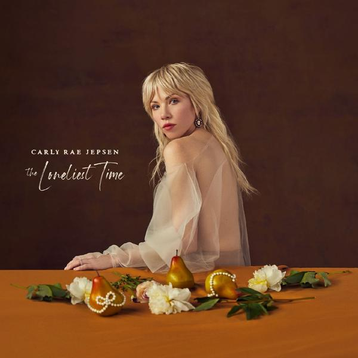
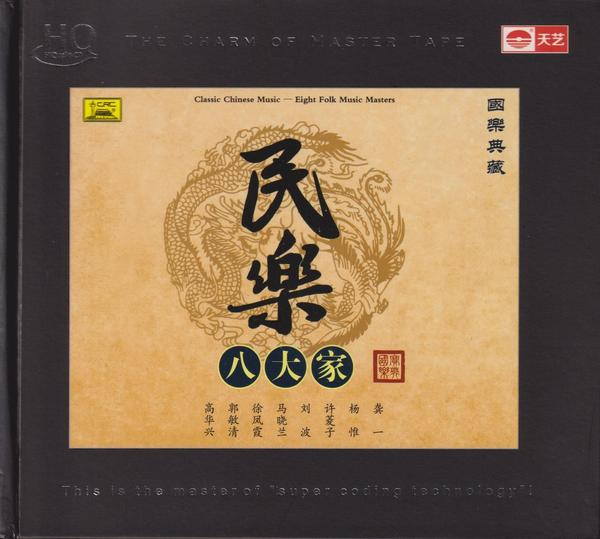

## Troye

[2026-10-09 21:57] 来自：综合网盘资源频道

名称：Troye Sivan - She’s the Best(2026)  FLAC 24bit 48khz  qobuz

描述：Troye Sivan《She’s the Best》2026第四张录音室专辑，探讨身份、欢愉与孤独，流行曲风层次丰富，人声细腻富有情绪张力。

夸克网盘：https://pan.quark.cn/s/f60df0b16af7

百度网盘：https://pan.baidu.com/s/17ro5Da6xgerWhOsNHshvtQ?pwd=kick

📁 大小：548MB

🏷 标签：#无损音乐 #音乐 #欧美流行 #FLAC #24bit #quark #baidu

---

## Carly

[2026-10-09 21:13] 来自：无损音乐分享频道

名称：Carly Rae Jepsen - The Loneliest Time (2022) FLAC Hi-Res 24bit

描述：

卡莉·蕾·吉普森第六张录音室专辑，2022年10月21日发行。以孤独为核心，融合80年代流行、迪斯科、放克与民谣，用复古合成器编织情绪 。从疫情隔离与亲密关系中的孤独切入，《Western Wind》梦幻松弛，《Beach House》犀利自嘲，同名曲与Rufus Wainwright对唱，打造“伤心蹦迪曲” 。16首歌从百首创作中精选，是她最内省的流行力作，用甜酷旋律解构孤独，温暖又戳心 。

夸克网盘：https://pan.quark.cn/s/b307beda1a2b

📁 大小：676MB

🏷 标签：#hires #无损音乐 #音乐 #欧美音乐

---

## 国乐典藏民乐八大家HQCD头版限量

[2026-10-09 18:06] 来自：夸克云盘影视资源频道

名称：国乐典藏《民乐八大家HQCD》头版限量 低速原抓WAV+CUE

描述：曲目：

01.火把节之夜 中阮 刘波

02.蕉窗夜雨 箜篌 马晓兰

03.大浪淘沙 三弦 徐凤霞

04.山寨恋歌 柳琴 高华兴

05.十面埋伏 琵琶 杨惟

06.高山流水 筝 许菱子

07.龙船 扬琴 郭敏清

08.古风操 古琴 龚一

夸克网盘：https://pan.quark.cn/s/018d6664f3aa

📁 大小：520MB

🏷 标签：#无损音乐 #音乐 #纯音乐

---

## 朗朗

[2026-10-09 14:53] 来自：综合网盘资源频道

名称：朗朗 – Modern Encores 2026 FLAC

描述：新EP专辑。

百度网盘：https://pan.baidu.com/s/1XyB7ocvvCVcywJPLmGAJ7Q?pwd=i1i0

夸克网盘：https://pan.quark.cn/s/78d17e444ead

迅雷网盘：https://pan.xunlei.com/s/VP3UQfpdMvjPaqRWJgrF64hLA1?pwd=ai2u

📁 大小：220MB

🏷 标签：#音乐 #朗朗 #FLAC #baidu #quark #xunlei

