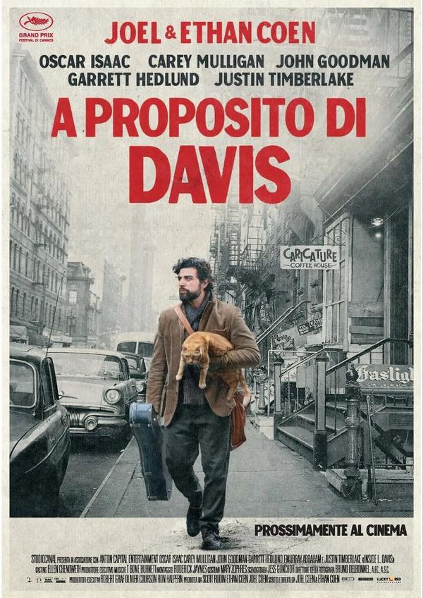
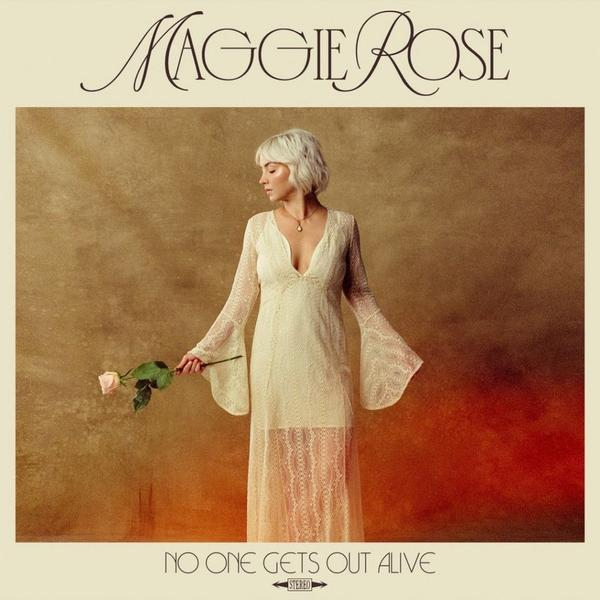
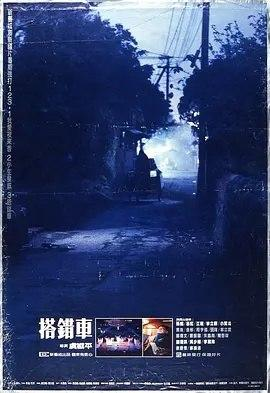
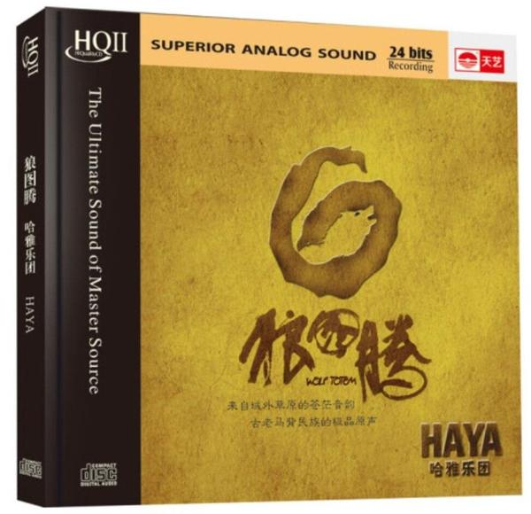
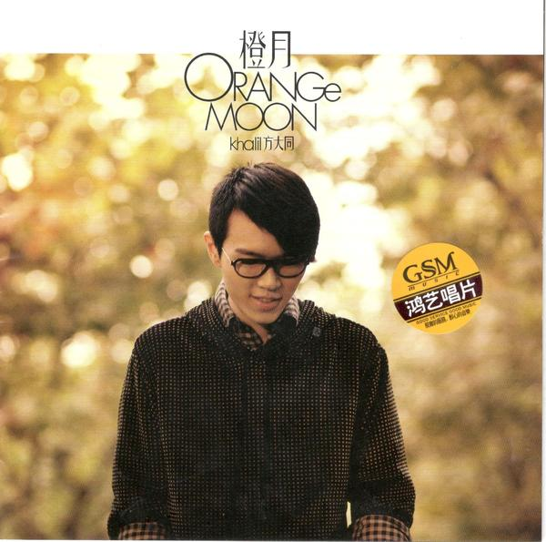
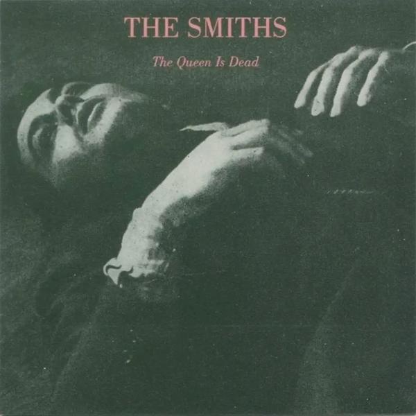
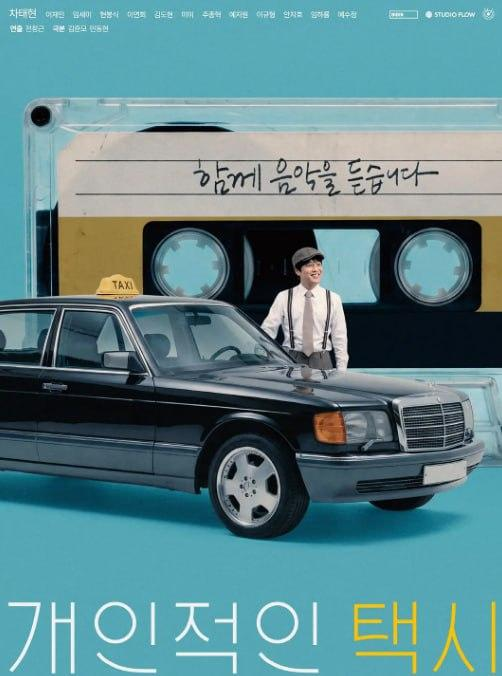
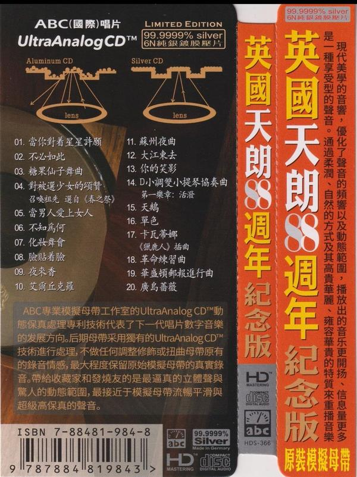

## 醉乡民谣

[2026-10-04 19:29] 来自：综合网盘资源频道

名称：醉乡民谣 (2013) 1080p 原盘REMUX 中文字幕 AVC DTS-HD MA 5.1

描述：美国怪诞风貌的造梦者乔尔与伊桑·科恩兄弟，借勒维恩·戴维斯这一角色呈现了他们最杰出的创作之一——这位歌手在六十年代初格林威治村民谣热潮的边缘勉强维生。奥斯卡·伊萨克以突破性表演塑造的勒维恩(其形象松散取材于民谣传奇戴夫·范·容克)才华横溢却又暴躁、粗鲁且自我毁灭。影片由摄影师布鲁诺·德尔邦内尔以动情的镜头捕捉他在严寒冬日城市里循环往复的漂泊轨迹，以辛酸幽默与间或超现实的笔触实现。由T·本恩·伯内特策划的民谣原声贯穿全片，本片再次印证科恩兄弟的世界里，历史未必由胜者书写。

夸克网盘：https://pan.quark.cn/s/0a6751443f06

📁 大小：20.7GB

🏷 标签：#音乐 #醉乡民谣 #1080p #原盘REMUX #中文字幕 #DTSHD #quark

---

## Maggie

[2026-10-04 17:08] 来自：肯德基の4K影视综合电影云盘站

名称：Maggie Rose - No One Gets Out Alive (2024) FLAC 24bit 96kHz

描述：

Maggie Rose 2024《No One Gets Out Alive》，复刻70年代Laurel Canyon美式根源之声，融合灵魂、摇滚与民谣，嗓音浑厚有力，探讨女性力量与生命思考。

夸克网盘：https://pan.quark.cn/s/9e08c3628fe3

百度网盘：https://pan.baidu.com/s/1WJ1h-Asp7PhHZo5VXk-6_w?pwd=kick

📁 大小：N

🏷 标签：#无损音乐 #音乐 #欧美民谣

---

## 2026年9月抖音爆火人气歌曲合集

[2026-10-04 14:29] 来自：综合网盘资源频道

名称：2026年9月抖音爆火人气歌曲合集

描述：300多首2026年9月网络热门歌曲，覆盖全年龄段听众，适配通勤驾驶等各类场景。

夸克网盘：https://pan.quark.cn/s/13ffdb21da11

百度网盘：https://pan.baidu.com/s/1J1KS8_-fw6ekKj9Nsh52kg?pwd=1111

迅雷网盘：https://pan.xunlei.com/s/VP34YdXJyf6QZShuI_CAOWbyA1?pwd=fxkb

📁 大小：14.7GB

🏷 标签：#音乐 #quark #baidu #xunlei #guangyapan

---

## 搭错车

[2026-10-04 12:11] 来自：影视动漫分享|SeedHub|夸克|网盘|🧲

名称：搭错车 (1983)

#电影 #音乐 #家庭 #剧情 #迅雷

主演: 孙越 刘瑞琪 李立群 

豆瓣: [8.3](https://movie.douban.com/subject/1306564/)

退伍老兵哑叔（孙越）因捡回弃婴致使妻子别他而去，靠拾破烂，哑叔既当爸又做妈含辛茹苦将取名阿美（刘瑞琪）的弃婴养大成人。因为哑叔常在耳边吹奏美妙的乐曲，阿美自小就对音..

迅雷网盘：https://pan.xunlei.com/s/VOziCvEroltwmZOxIIygWzgtA1?pwd=h6x3

---

## 哈雅乐团

[2026-10-04 12:01] 来自：夸克云盘影视资源频道

名称：哈雅乐团 - 狼图腾 HQCDII限量版 2016 wav 分轨

描述：“他们（HAYA哈雅）在传统与现代之间追寻着来自灵魂的声音；他们对古老蒙古民族特有的马头琴、呼唛、长调与现代音乐的独到诠释引起了艺术界的广泛关注。在这张专辑中，'HAYA'表达的不仅是对现代蒙古音乐的理解，更是对自然的热爱，对心灵的呼唤。”

华人殿堂级音乐大师谭盾

夸克网盘：https://pan.quark.cn/s/fc6bdb2019f8

📁 大小：N

🏷 标签：#无损音乐 #音乐

---

## 林忆莲

[2026-10-04 11:13] 来自：夸克云盘影视资源频道

名称：林忆莲 - 拥有忆莲·最完整精选全记录 CD1 - 2  滚石台湾首版] wav 分轨

描述：林忆莲《拥有忆莲·最完整精选全记录》，汇集多时期国语粤语金曲，收录伤痕、为你我受冷风吹等代表作，尽显细腻深情的都市唱腔。

夸克网盘：https://pan.quark.cn/s/6673c3d56590

📁 大小：N

🏷 标签：#无损音乐 #音乐 #华语

---

## 方大同

[2026-10-04 08:35] 来自：综合网盘资源频道

名称：方大同 - 橙月 Orange Moon 低速原抓WAV+CUE

描述：

1. Singalongsong

2. 小小虫

3. 1234567

4. 黑白

5. 如果爱

6. 黑洞里

7. 三人游

8. 每个人都会

9. 100种表情

10. 爱我吧

11. 为你写的歌

12. Orange Moon

链接：

夸克网盘：https://pan.quark.cn/s/14b81436254b

百度网盘：https://pan.baidu.com/s/13SsZj9tIYa5mruzaBiDP7Q?pwd=kick

📁 大小：N

🏷 标签：#无损音乐 #音乐 #华语 #方大同 #橙月 #低速原抓WAV #quark #baidu

---

## 空灵女声

[2026-10-04 06:23] 来自：综合网盘资源频道

名称：空灵女声 柯唯 合集 WAV

描述：

主打空灵、治愈向女声，大量做经典老歌的AI翻唱版本 。

收录翻唱《情网》《月亮代表我的心》《风吹麦浪》等歌曲....

夸克网盘：https://pan.quark.cn/s/1b52af669422

百度网盘：https://pan.baidu.com/s/1lxSOn91FGj8Zpn2WodyJjA?pwd=kick

📁 大小：2.2GB

🏷 标签：#无损音乐 #音乐 #华语 #ai #空灵女声 #柯唯 #合集 #WAV #quark #baidu

---

## The

[2026-10-03 22:23] 来自：百度网盘综合频道

名称：The Smiths 乐队 FLAC合集 qobuz

描述：The Smiths，80年代英国另类摇滚代表。由莫里西与玛尔组建，吉他音色清新，歌词文艺忧郁，代表作《This Charming Man》，深刻影响独立摇滚发展。

链接：

百度网盘：https://pan.baidu.com/s/1YxPZBRloCO6EuANyPLVT5w?pwd=8888

夸克网盘：https://pan.quark.cn/s/720ca2a69e35 来自：综合网盘资源频道 [2026-10-03 22:18] 名称：The Smiths 乐队 FLAC合集 qobuz

📁 大小：N

🏷 标签：#无损音乐 #音乐 #欧美摇滚

---

## 私人出租车

[2026-10-03 18:40] 来自：综合网盘资源频道

名称：私人出租车(2026)1080P 简中字幕 全08集

描述：改编自同名漫画。

夸克网盘：https://pan.quark.cn/s/20a34c05ecac

📁 大小：540MB

🏷 标签：#私人出租车 #音乐剧 #车太贤 #quark #uc #1080P #简中字幕

---

## 麦当娜

[2026-10-03 15:45] 来自：综合网盘资源频道

名称：麦当娜 Madonna  Bedtime Stories (Deluxe Edition) 2025 WAV分轨

描述：麦当娜 1994 年专辑《Bedtime Stories》的 30 周年纪念日本版 2CD 豪华版。

百度网盘：https://pan.baidu.com/s/1eCKgZ7mve0YVgdDRHJr0Lg?pwd=iqp5

夸克网盘：https://pan.quark.cn/s/2cc393f481c5

迅雷网盘：https://pan.xunlei.com/s/VP3-iAeRP5LYvfTXWNetn2d9A1?pwd=rp2m

📁 大小：800MB

🏷 标签：#音乐 #麦当娜 #WAV分轨 #baidu #quark #xunlei

---

## 英国天朗88周年纪念版6N纯银镀膜低速原抓WAVCUE

[2026-10-03 12:31] 来自：肯德基の4K影视综合电影云盘站

名称：英国天朗88周年纪念版》6N纯银镀膜[低速原抓WAV+CUE]

描述：ABC德国制天朗88周年纪念发烧试音碟，6N纯银镀膜介质，低速原抓WAV+CUE。频响全面，音色温润华丽，专为检验音箱动态与解析力，是HiFi收藏参考碟。

链接：

夸克网盘：https://pan.quark.cn/s/a4fbf3eb671d

百度网盘：https://pan.baidu.com/s/1TzjP6aYp5OJ4IAUIdglW_g?pwd=kick

📁 大小：686MB

🏷 标签：#无损音乐 #音乐 #英国天朗88周年纪念版 #6N纯银镀膜 #低速原抓WAV #quark #baidu

