## 实战应用类书籍如何快速了解一个行业赚到该赚的钱

[2026-09-26 13:57] 来自：综合网盘资源频道

名称：实战应用类书籍：如何快速了解一个行业，赚到该赚的钱(肖璟所著)

描述：主要讲了一套系统化的行业研究方法和框架，涵盖了行业分析的全过程，包括行业生命周期、商业模式、市场规模、竞争格局等关键维度，简直就是一本干货满满的使用手册，并且图文并茂，易于理解。作者把复杂的行业研究拆得非常清楚：不讲空话，不兜圈子，直接从“赚钱逻辑”出发。

夸克网盘：https://pan.quark.cn/s/ace1a92702bd

📁 大小：42.5M

🏷 标签：#书籍 #电子书 #实战应用类书籍 #如何快速了解一个行业赚到该赚的钱 #肖璟所著 #quark

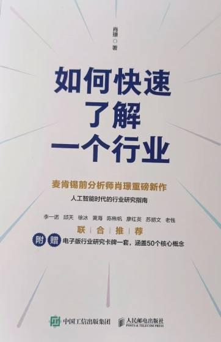

---

## 安卓应用安全SO进阶培训班

[2026-09-26 08:00] 来自：综合网盘资源频道

名称：【微师】安卓应用安全SO进阶培训班

描述：课程以确实地提高自身水平、直播里一步一步教你、重实战项目高频场景全总结、水平高技术强到违反广告法为目标，课程中讲到的知识点如plthook进阶、frida中javahook实现、inlinehook中可能遇到的bug、通过so装载流程准确定位脱壳点等都是能够解决大家实际工作中的问题的。

夸克网盘：https://pan.quark.cn/s/c8d5a528fd69

📁 大小：NG

🏷 标签：#学习 #知识 #课程 #资源 #微师 #安卓应用安全SO进阶培训班 #quark #ali

---

## 配音全能班8期

[2026-09-26 07:47] 来自：综合网盘资源频道

名称：【潭州教育】配音全能班8期(全阶段)

描述：课程将从0教你如何发音，如何展现自己的声音魅力，以喜马拉雅等为代表的有声读物的崛起，配音行业幕后转台前，关注度剧增，符合广播剧、自媒体的发展需要，商业广告的需求不断增多，声音是你的第二张名片，尤其是对想在播音主持、广播剧、自媒体、有声读物等平台发展的同学更是尤为重要。

夸克网盘：https://pan.quark.cn/s/70375d3b697e

📁 大小：NG

🏷 标签：#学习 #知识 #课程 #资源 #潭州教育 #配音全能班 #全阶段 #quark #ali

---

## 企业宣传视频剪映模板合集一键制作专业级推广短片

[2026-09-26 06:04] 来自：精选网盘资源

名称：企业宣传视频剪映模板合集，一键制作专业级推广短片

一套专为企业宣传打造的剪映模板合集，涵盖公司形象片、产品发布、品牌故事、年会盛典、招聘宣传与展会快闪等常见场景。支持一键替换文字与素材，无需剪辑基础即可快速出片。

百度网盘：https://pan.baidu.com/s/15Y1LjIrZovQe02dNeD_qlA?pwd=myew

#剪映模板 #企业视频制作 #宣传视频 #快速出片

---

## 婚礼前期摆姿拍摄教程上百组新人拍照姿势全攻略

[2026-09-26 06:03] 来自：精选网盘资源

名称：婚礼前期摆姿拍摄教程，上百组新人拍照姿势全攻略

一套包含上百组婚礼前期摆姿的拍摄教程，专为新人、摄影师及婚纱摄影爱好者打造。帮助零基础新人摆脱镜头尴尬，也让摄影师快速掌握引导话术与构图思路，拍出自然、浪漫、有故事感的高级婚纱照。

百度网盘：https://pan.baidu.com/s/1EjhBmnl8ExZ3hwinN4QDeA?pwd=6ggu

#婚礼摆拍教程 #拍照姿势 #摄影教程 #婚礼摄影

---

## 高情商说话技巧全攻略一开口就让人舒服的沟通术

[2026-09-26 06:02] 来自：精选网盘资源

名称：高情商说话技巧全攻略，一开口就让人舒服的沟通术

聚焦高情商沟通的实用技巧合集，涵盖倾听、共情、赞美、拒绝、批评、化解尴尬与冲突应对等高频场景，教你在职场、家庭与社交中说话有分寸、表达有温度，既不委屈自己也不冒犯他人。适合想提升沟通力、改善人际关系、增强个人魅力的人群系统学习。

夸克网盘：https://pan.quark.cn/s/0a9fcd433e30

#说话技巧 #沟通表达 #职场社交 #人际交往 #实用话术

---

## 开源网速聚合工具一键让电脑网速起飞

[2026-09-26 05:55] 来自：精选网盘资源

名称：开源网速聚合工具，一键让电脑网速起飞

一款GitHub开源的多网卡网速聚合加速工具，可将有线、WiFi、热点等多个网络连接叠加使用，实现带宽合并与网速翻倍。一键配置即可生效，无需复杂操作，完全免费，开源透明。

夸克网盘：https://pan.quark.cn/s/8aeaf63c594a

#网速聚合 #多网络叠加 #一键加速 #免费加速软件

---

## 企业GEO搜索获客内容优化WorkBuddy全流程实战

[2026-09-26 05:52] 来自：精选网盘资源

名称：企业GEO搜索获客，内容优化+WorkBuddy全流程实战

一套面向企业获客的AI GEO搜索实战课程，系统讲解关键词挖掘、AI内容创作、官网结构化优化及WorkBuddy工具全流程应用。适合市场运营、SEO从业者及企业负责人，帮助低成本获取精准流量，实现从搜索到成交的闭环增长。

百度网盘：https://pan.baidu.com/s/1dQAPyuffM8ycQmGku2XjUg?pwd=e4s3

#企业GEO #搜索获客 #流量获取 #低成本获客

---

## 高性价比人生指南普通人也能复制的人生升级法

[2026-09-26 05:50] 来自：精选网盘资源

名称：高性价比人生指南，普通人也能复制的人生升级法

教你用最低成本撬动健康、成长、职场、理财与生活品质的最大回报。从消费决策、时间管理、资源分配到个人增值，系统拆解普通人可落地的高回报生活方式。不靠烧钱、不拼背景，用理性策略实现人生效率与幸福感双提升，打造属于自己的高性价比人生路径。

夸克网盘：https://pan.quark.cn/s/0304699208a8

#高性价比人生指南 #普通人逆袭 #人生升级 #个人成长

---

## 权谋系列书籍23册合集中国古代经典权谋智慧典籍书单

[2026-09-26 05:49] 来自：精选网盘资源

名称：《权谋系列书籍》23册合集，中国古代经典权谋智慧典籍书单

一套汇集中国古代权谋智慧的经典书籍合集，内容涉及纵横捭阖、驭人之术、审时度势、进退韬略与人性洞察，既有原文精校，也附白话解析与案例印证。适合历史爱好者、管理者、创业者及对中国传统谋略文化感兴趣的读者研读，从中汲取跨越时代的博弈智慧与处世哲学。

夸克网盘：https://pan.quark.cn/s/26254ddcc50b

#权谋书籍 #权谋智慧 #人性博弈 #处世哲学

---

## 造势与做局看懂势的人才能掌控局面

[2026-09-26 05:49] 来自：精选网盘资源

名称：《造势与做局》：看懂“势”的人才能掌控局面

为什么有人能力平平却步步高升，你埋头苦干却原地踏步？差别就在一个“势”字。这本书把权谋场上最核心的“造势、借势、审时度势”全拆开了，它不教你耍阴招，而是让你看懂“势”怎么运作，从而借势而起、做局控局。

夸克网盘：https://pan.quark.cn/s/64ff22ce4677

#借势上位 #审时度势 #权谋内涵 #做局窍门

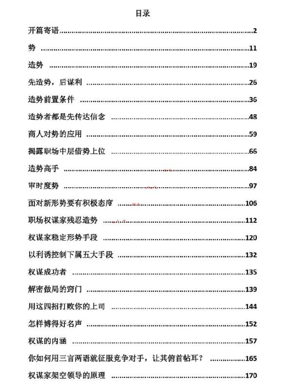

---

## 万门大学

[2026-09-26 01:58] 来自：综合网盘资源频道

名称：万门大学 - Python数据可视化从入门到实战

描述：万门大学 - Python数据可视化从入门到实战

夸克网盘：https://pan.quark.cn/s/2513e62c6b59

📁 大小：NG

🏷 标签：#学习 #知识 #课程 #资源 #万门大学 #Python数据可视化从入门到实战 #quark #ali

---

## 虎课网

[2026-09-26 01:54] 来自：综合网盘资源频道

名称：虎课网 - 趣味平面设计说明书

描述：趣味平面设计说明书。

夸克网盘：https://pan.quark.cn/s/2346b0addca5

📁 大小：NG

🏷 标签：#学习 #知识 #课程 #资源 #虎课网 #趣味平面设计说明书 #quark #ali

---

## 松月AI虚拟电商Pro训练营第8期

[2026-09-26 00:11] 来自：综合网盘资源频道

名称：松月·AI虚拟电商Pro训练营【第8期】

描述：松月・AI 虚拟电商 Pro 训练营第 8 期讲解 AI 赋能虚拟电商的整套实操方法，围绕虚拟电商项目开展教学，分享工具运用、选品运营、项目落地等相关内容，适合想要入局虚拟电商的从业者学习，帮助借助 AI 能力搭建业务，掌握虚拟电商的运营思路与实战技巧。

夸克网盘：https://pan.quark.cn/s/75ebe90d2912

📁 大小：7.0GB

🏷 标签：#教程 #AI #电商 #训练营 #虚拟 #松月·AI虚拟电商Pro训练营 #quark

---

## 一人公司AI知识库训练营快速构建AI知识应用体系

[2026-09-26 00:10] 来自：综合网盘资源频道

名称：一人公司AI知识库训练营，快速构建AI知识应用体系

描述：一人公司 AI 知识库训练营面向个体从业者，讲解搭建 AI 知识库的实操方法，教授如何搭建完整的 AI 知识应用体系，梳理知识库搭建流程与落地技巧，帮助个人借助 AI 处理业务资料，实现知识沉淀与高效调用，适合个体创业者学习，提升个人业务的运转效率。

夸克网盘：https://pan.quark.cn/s/8041c408adad

📁 大小：1.6GB

🏷 标签：#教程 #AI #训练营 #知识 #应用 #一人公司AI知识库训练营 #快速构建AI知识应用体系 #quark

---

## 六叔的AI实战课教你用AI解决真实工作难题

[2026-09-26 00:09] 来自：综合网盘资源频道

名称：六叔的AI实战课，教你用AI解决真实工作难题

描述：六叔的 AI 实战课围绕职场当中各类实际工作场景展开，讲解借助 AI 工具处理各类工作难题的实操手段，分享实用的使用思路与落地技巧，把 AI 能力融入日常办公流程，适合广大职场从业者学习，帮助提升工作处理效率，学会利用 AI 应对各式各样真实的工作问题。

夸克网盘：https://pan.quark.cn/s/cd1f9d889f04

📁 大小：5.9GB

🏷 标签：#教程 #工作 #实战课 #AI实战 #工具 #六叔的AI实战课 #教你用AI解决真实工作难题 #quark

---

## 智慧诡辩术学会这套口才让你再也不怕被怼

[2026-09-26 00:07] 来自：综合网盘资源频道

名称：《智慧诡辩术》：学会这套口才让你再也不怕被怼

描述：《智慧诡辩术》围绕口才表达与思辨技巧展开，讲解沟通当中的逻辑应对方法，传授言语博弈相关思路，帮助读者掌握语言应对技巧，从容处理争执与言语交锋场景，适合希望提升口才应变能力的读者阅读，学会合理表达观点，提升沟通中的思辨与临场反应能力。

夸克网盘：https://pan.quark.cn/s/9d4b7e43d81f

📁 大小：11.1MB

🏷 标签：#书籍 #智慧 #口才 #阅读 #技巧 #智慧诡辩术 #学会这套口才让你再也不怕被怼 #quark

---

## 公众号流量主细分赛道新手可复制的详细教程

[2026-09-26 00:05] 来自：综合网盘资源频道

名称：公众号流量主细分赛道，新手可复制的详细教程

描述：公众号流量主细分赛道教程梳理适合新手切入的内容方向，拆解可落地的实操方法，讲解赛道选择、内容创作等相关要点，把整套运营流程拆解成便于模仿的步骤，适合想要入局公众号流量主的新手学习，帮助快速理清运营思路，掌握相关实操方法。

夸克网盘：https://pan.quark.cn/s/ed3270485b05

📁 大小：96.4MB

🏷 标签：#教程 #新手 #公众号 #流量主 #运营 #公众号流量主细分赛道 #新手可复制的详细教程 #quark

---

## AI漫剧制作全流程剧本分镜AI生成剪辑发布模板化量产

[2026-09-25 18:57] 来自：Fang的资源分享群

名称：AI漫剧制作全流程，剧本分镜+AI生成+剪辑发布+模板化量产

本资源围绕AI漫剧制作全流程，涵盖剧本分镜、AI生成、剪辑发布与模板化量产环节，适合想用AI制作漫剧并提升效率的创作者参考学习。

夸克网盘：https://pan.quark.cn/s/35dd20b7cf3a

#AI漫剧 #制作流程 #剧本分镜 #AI生成 #剪辑发布

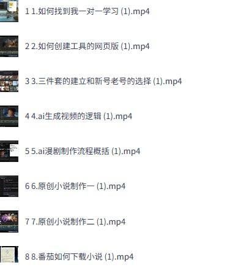

---

## 高级催乳师精品课程

[2026-09-25 18:54] 来自：Fang的资源分享群

名称：高级催乳师精品课程

面向催乳师及母乳喂养指导员的技能提升课程，系统讲解临床催乳理论与实操技巧，帮助想优化护理流程的母婴护理人员提升日常工作能力。

夸克网盘：https://pan.quark.cn/s/7e63cf6899b3

#催乳师 #母乳喂养 #母婴护理 #技能提升 #实操技巧

---

## 2026最新玩法微信小程序推广计划

[2026-09-25 18:53] 来自：Fang的资源分享群

名称：2026最新玩法-微信小程序推广计划 每天半小时 月入1W+

围绕微信小程序推广计划的最新玩法，梳理推广流程与操作思路，适合想利用日常碎片时间学习线上推广的人参考。

夸克网盘：https://pan.quark.cn/s/1c51ea2082fa

#微信小程序 #推广计划 #线上推广 #碎片时间 #操作思路

---

## 海尼曼GKG1G2分级阅读英文绘本电子版PDF

[2026-09-25 18:48] 来自：Fang的资源分享群

名称：海尼曼GKG1G2分级阅读，英文绘本电子版PDF 音频mp3视频

海尼曼GK、G1、G2分级阅读英文绘本电子版，包含PDF、MP3音频和视频，适合儿童英语启蒙、亲子阅读与家庭学习，方便在电子设备上随时阅读、听读和观看。

夸克网盘：https://pan.quark.cn/s/c09dd839c74f

#海尼曼 #分级阅读 #英文绘本 #儿童英语 #启蒙教育

---

## 迅雷Thunder9149160极限精简融合版

[2026-09-25 18:46] 来自：Fang的资源分享群

名称：迅雷Thunder+9.1.49160+极限精简融合版

迅雷Thunder 9.1.49160极限精简融合版，适合想使用精简版迅雷进行日常下载的用户，安装后可按迅雷常规方式使用下载功能，帮助减少冗余组件带来的干扰。

夸克网盘：https://pan.quark.cn/s/81a58f59f8f0

#迅雷 #下载工具 #精简版 #极限精简 #安装包

---

## 闲鱼搬运神器一键转卖上架

[2026-09-25 18:42] 来自：Fang的资源分享群

名称：闲鱼搬运神器，一键转卖、上架

这款闲鱼搬运神器围绕一键转卖与上架流程展开，适合需要整理商品信息并快速发布到闲鱼的用户，可帮助减少重复操作、提升上架效率。

夸克网盘：https://pan.quark.cn/s/e3f6ac7d1738

#闲鱼 #一键转卖 #商品上架 #搬运工具 #电商效率

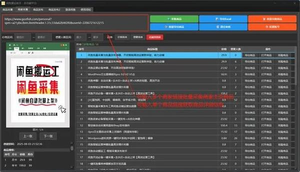

---

## 珍藏资源麻豆学院出品男性延时专题

[2026-09-25 18:42] 来自：Fang的资源分享群

名称：【正经科普】【珍藏资源】麻豆学院出品男性延时专题 理论技巧+实操

麻豆学院出品的男性延时专题，内容围绕理论技巧与实操展开，适合想系统了解相关科普与方法思路的人群参考学习。

夸克网盘：https://pan.quark.cn/s/5f5545ddf809

#男性延时 #两性科普 #理论技巧 #实操学习 #珍藏资源

---

## 范爷两部曲

[2026-09-25 18:42] 来自：Fang的资源分享群

名称：范爷两部曲

本资源为范爷两部曲相关内容，适合想了解该主题的用户参考，可帮助快速获取相关信息，具体内容以资源实际呈现为准。

夸克网盘：https://pan.quark.cn/s/7da42d8d9510

#范爷 #两部曲 #系列内容 #资源参考 #主题资料

---

## 百家号原创混剪视频项目

[2026-09-25 18:42] 来自：Fang的资源分享群

名称：百家号原创混剪视频项目 7分钟一条原创视频 起号速度快 一台电脑即可操作

百家号原创混剪视频项目，介绍7分钟一条原创视频的制作流程，起号速度快，一台电脑即可操作，适合做短视频起号或内容创作者参考。

夸克网盘：https://pan.quark.cn/s/4ab956bfd673

#百家号 #原创混剪 #视频制作 #短视频起号 #电脑操作

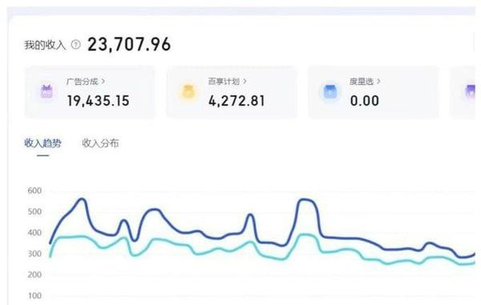

---

## 香港大学冯平山图书馆藏书1025册

[2026-09-25 18:00] 来自：综合网盘资源频道

名称：香港大学冯平山图书馆藏书1025册

描述：香港大学冯平山图书馆藏书共计 1025 册，馆藏包含各类文献典籍，涉及多类学术领域，留存有不少珍贵资料，可供文史爱好者、学术研究者查阅研读，为历史、人文相关课题的研究提供文献参考，拓展资料查阅渠道，助力学术探究与文献学习。

夸克网盘：https://pan.quark.cn/s/1d398f08ff22

📁 大小：79.4GB

🏷 标签：#书籍 #图书馆 #香港大学 #藏书 #历史 #quark

---

## 情绪鸡尾酒从多巴胺到内啡肽调配幸福秘方PDFAZW3EPUBMOBI

[2026-09-25 14:15] 来自：综合网盘资源频道

名称：《情绪鸡尾酒_从多巴胺到内啡肽，调配幸福秘方》[PDF+AZW3+EPUB+MOBI]

描述：这是一本强大的情绪自控指南。在本书中将指导你如何利用身体自然产生的六种关键激素，即多巴胺、催产素、血清素、皮质醇、内啡肽、睾酮，创造出独特的人生配方。书中针对不同激素的调节，提供了50余种强大的工具，帮你在任何场合下都能达成良好状态。

夸克网盘：https://pan.quark.cn/s/d7b87384e2fc

📁 大小：N

🏷 标签：#戴维 #J #P #菲利普斯 #情绪鸡尾酒 #从多巴胺到内啡肽 #调配幸福秘方 #PDF #AZW3 #quark

---

## 正宗临沂炒鸡配方视频教程从零开始手把手教学

[2026-09-25 06:41] 来自：精选网盘资源

名称：正宗临沂炒鸡配方视频教程，从零开始手把手教学

一套正宗临沂炒鸡配方视频教程，完整呈现鲁南地区经典炒鸡的制作全过程。视频实拍操作，讲解清晰，适合餐饮创业者、夜市摊主及家庭烹饪爱好者学习，帮助快速复刻地道临沂炒鸡的浓郁酱香与鲜嫩口感。

百度网盘：https://pan.baidu.com/s/1vjVVDT2jWP1wjFN4jITH4Q?pwd=2fei

#临沂炒鸡配方 #炒鸡教程 #地方特色菜 #美食教程

---

## 自媒体引流神器把微信藏到图片中手机平躺即可识别

[2026-09-25 06:38] 来自：精选网盘资源

名称：自媒体引流神器，把微信藏到图片中+手机平躺即可识别

一款专为自媒体从业者设计的私域引流工具，可将微信号、二维码等联系方式巧妙隐藏在图片中。正面看是杂乱无章的乱码图案，但将手机平放从充电口方向侧视，即可清晰显示真实微信号。有效规避平台对联系方式的屏蔽与删除。

夸克网盘：https://pan.quark.cn/s/6ba1f613b468

#自媒体引流工具 #私域引流 #短视频引流

---

## 全球旅游攻略合集最佳旅行城市路线规划一站备齐

[2026-09-25 06:35] 来自：精选网盘资源

名称：全球旅游攻略合集，最佳旅行城市+路线规划一站备齐

一套覆盖全球热门旅行目的地的攻略资料包，精选最佳旅行城市榜单，提供详细路线规划、交通住宿建议、景点门票信息与美食推荐。内含高清PDF指南与实用资料包，涵盖行前准备、预算控制、安全提示及当地文化习俗。

夸克网盘：https://pan.quark.cn/s/8ff39dd2d9c9

#全球旅游攻略 #最佳旅行城市 #路线规划 #旅行资料包

---

## 饭局大师饭桌社交全场景实战

[2026-09-25 06:30] 来自：精选网盘资源

名称：《饭局大师》：饭桌社交全场景实战

点菜怎么点才不掉价？敬酒被点名怎么办？饭桌上遇到性骚扰还不能发火怎么破？求人办事被拒怎么接？这本书把饭局里最让人头疼的场景全列出来了，每个问题都给你具体应对招数。

夸克网盘：https://pan.quark.cn/s/25c825155643

#饭局大师 #饭桌社交 #点菜技巧 #祝酒礼仪 #买单门道

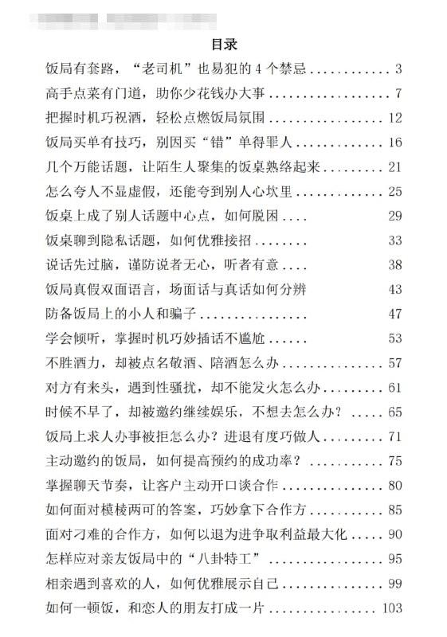

---

## 电脑报20132023合集

[2026-09-25 00:08] 来自：综合网盘资源频道

名称：《电脑报》2013-2023合集

描述：《电脑报》2013‑2023 合集汇集这十年间的报刊内容，涵盖数码硬件评测、软件应用技巧、互联网行业动态、科普知识等各类内容，记录十余年间数码行业的发展变迁，适合数码爱好者查阅，能够回顾过去科技行业资讯，了解硬件与互联网技术的发展历程。

夸克网盘：https://pan.quark.cn/s/32ab84351e45

📁 大小：12.4GB

🏷 标签：#书籍 #合集 #电脑 #科普 #技巧 #电脑报 #quark

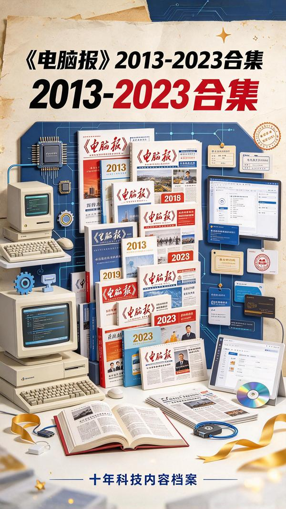

---

## 网络科学与工程丛书

[2026-09-25 00:07] 来自：综合网盘资源频道

名称：网络科学与工程丛书

描述：网络科学与工程丛书围绕网络科学及工程相关领域展开，系统讲解网络基础理论、相关技术原理、工程实践等方面知识，梳理学科核心概念与前沿研究方向，适合计算机、网络相关专业的学生以及行业技术人员阅读，可用于专业知识学习、理论研究以及技术参考查阅。

夸克网盘：https://pan.quark.cn/s/35dc916149f2

📁 大小：823.6MB

🏷 标签：#书籍 #丛书 #科学 #网络 #阅读 #网络科学与工程丛书 #quark

---

## 焦虑症的自救系列

[2026-09-25 00:04] 来自：综合网盘资源频道

名称：《焦虑症的自救》系列(三册) ([澳]克莱尔•威克斯 )

描述：《焦虑症的自救》系列共三册，由克莱尔・威克斯所著，围绕焦虑相关心理问题展开，讲解焦虑状态下身心反应，分享自我调节的思路与方法，帮助读者认识焦虑，学习如何面对和缓解焦虑带来的困扰，适合受焦虑情绪困扰的人群阅读参考，为心理自我疏导提供相关思路。

夸克网盘：https://pan.quark.cn/s/91f49937cc81

📁 大小：1.1MB

🏷 标签：#书籍 #系列 #焦虑 #阅读 #心理 #焦虑症的自救 #克莱尔 #威克斯 #quark

---

## 一站到底少年季

[2026-09-25 00:00] 来自：综合网盘资源频道

名称：一站到底·少年季 第二季(2026) 更至9.18期 [知识竞技/综艺]

描述：这是一档江苏卫视推出的少年益智科普答题节目。节目分为抢位赛、团队轮答赛、项目挑战赛三个环节，分别考察少年们个人素质、团队协作与综合破题能力。

夸克网盘：https://pan.quark.cn/s/38e21a32d744

百度网盘：https://pan.baidu.com/s/1wpqejnPNSPfjLOgegtSP5w?pwd=0914

迅雷网盘：https://pan.xunlei.com/s/VP1SohT2FG7vgTcMmGCT1TgwA1?pwd=jjdg

UC网盘：https://drive.uc.cn/s/9e5962f4e3414

📁 大小：NG

🏷 标签：#一站到底 #少年季 #综艺 #一站到底·少年季 #知识竞技 #quark #baidu #xunlei #uc

---

## 闲鱼小众玩法情感咨询赛道完整拆解

[2026-09-24 19:34] 来自：Fang的资源分享群

名称：闲鱼小众玩法，情感咨询赛道完整拆解

围绕闲鱼平台的情感咨询小众玩法，拆解赛道定位、需求分析与接单沟通思路，适合想了解或尝试该方向的人参考，帮助快速理清基本流程和注意事项。

夸克网盘：https://pan.quark.cn/s/e65c08766557

#闲鱼 #情感咨询 #副业项目 #赛道拆解 #小众玩法

---

## 减肥食谱

[2026-09-24 19:33] 来自：Fang的资源分享群

名称：减肥食谱

这份减肥食谱以成本不到十块钱的餐单为核心，可参考图片搬运和文案拼接后在小红书、闲鱼发布，适合做内容分享或发布参考，帮你理解信息差玩法。

夸克网盘：https://pan.quark.cn/s/fb51789f4618

#减肥食谱 #低成本餐单 #小红书 #闲鱼 #信息差

---

## 233组1200定妆美照

[2026-09-24 19:32] 来自：Fang的资源分享群

名称：233组1200+定妆美照

该资源为新娘定妆照合集，按人物分为233组，每组2至7张，可预览部分照片，适合收藏或作为新娘造型参考时下载保存。

夸克网盘：https://pan.quark.cn/s/1b4edad41747

#新娘定妆照 #定妆照合集 #写真资源 #造型参考 #照片收藏

---

## 节日返程堵车必备歌单15000首

[2026-09-24 19:26] 来自：Fang的资源分享群

名称：节日返程堵车必备歌单15000首

包含15000首音乐，适合节日返程堵车时按顺序播放，帮助缓解路途枯燥与等待焦虑，让长途驾驶更轻松一些。

夸克网盘：https://pan.quark.cn/s/7379dde90671

#音乐歌单 #节日返程 #堵车必备 #车载音乐 #长途驾驶

---

## 野草助手v2521纯净版

[2026-09-24 19:26] 来自：Fang的资源分享群

名称：野草助手v2.5.21纯净版 手机给电视安装软件 支持远程安装

野草助手v2.5.21纯净版是一款用手机给电视安装软件的工具，支持远程安装，适合电视安装应用不便时使用，帮助用户通过手机为电视完成软件安装。

夸克网盘：https://pan.quark.cn/s/80ef4bcd5558

#野草助手 #电视安装 #远程安装 #纯净版 #手机工具

---

## 情侣升温合集游戏

[2026-09-24 19:16] 来自：Fang的资源分享群

名称：情侣升温合集游戏

该合集围绕情侣互动游戏整理，包含情侣飞行棋等可共同参与的内容，适合约会或居家休闲时使用，能帮助增加互动话题与相处乐趣。

夸克网盘：https://pan.quark.cn/s/3d9d8292388d

#情侣游戏 #互动游戏 #飞行棋 #休闲娱乐 #恋爱升温

---

## 一本自学手册

[2026-09-24 19:16] 来自：Fang的资源分享群

名称：一本自学手册

围绕三位一体自我训练法整理的持久延迟训练手册，适合自我训练场景，提供训练思路与流程参考，便于按手册安排日常练习。

夸克网盘：https://pan.quark.cn/s/78ef1b5681ad

#自我训练 #延迟训练 #持久力 #训练手册 #三位一体

---

## Okra

[2026-09-24 19:16] 来自：Fang的资源分享群

名称：Okra Tv

OkraTv是一款内置源影视TV应用，支持一键换源和4K大屏播放，无需登录即可使用，适合在电视盒子上观看影视内容，帮助用户便捷切换片源。

夸克网盘：https://pan.quark.cn/s/afa57c9e6bbf

#影视应用 #电视盒子 #一键换源 #大屏播放 #无需登录

---

## AI短剧漫剧生成软件自动生成角色场景分镜合成视频

[2026-09-24 19:16] 来自：Fang的资源分享群

名称：AI短剧漫剧生成软件，自动生成角色场景+分镜+合成视频

这款软件围绕AI短剧漫剧生成，提供角色场景、分镜与视频合成等流程，适合需要快速制作短剧内容的创作者，帮助减少手动绘制与剪辑环节，提升制作效率。

夸克网盘：https://pan.quark.cn/s/606a6ec341f5

#AI短剧 #漫剧生成 #分镜生成 #视频合成 #角色场景

---

## 视频号分成计划

[2026-09-24 19:16] 来自：Fang的资源分享群

名称：视频号分成计划 两性情感视频 小白副业首选项 真正做到了条条爆视频的槽点很强

围绕视频号分成计划和两性情感视频，面向想找副业的小白，分析内容选题与槽点设计，帮助了解这类视频的制作方向和运营思路。

夸克网盘：https://pan.quark.cn/s/e7feabc00503

#视频号分成 #两性情感 #情感视频 #副业项目 #小白入门

---

## Python全栈开发15期

[2026-09-24 14:49] 来自：综合网盘资源频道

名称：【老男孩教育】Python全栈开发15期

描述：人工智能时代到来，先人一步学习未来核心技术

夸克网盘：https://pan.quark.cn/s/dfcdd83f0ead

📁 大小：NG

🏷 标签：#学习 #知识 #课程 #资源 #老男孩教育 #Python全栈开发 #quark #ali

---

## 你为什么会对自己不满意告别内在父母审判的6种可能PDFAZW3EPUBMOBI

[2026-09-24 14:44] 来自：综合网盘资源频道

名称：《你为什么会对自己不满意_告别内在父母审判的6种可能》[PDF+AZW3+EPUB+MOBI]

描述：你是不是总是对自己不满意，觉得生活充满了问题，工作不够喜欢，伴侣不够理想，孩子不够配合，自己能力不够……痛苦的是，还不能允许自己摆烂接受这样，更痛苦的是，花了很大力气发现改不了，即使改了也改不完。于是内耗不断……与其不断地内耗自己，不如翻开本书，从现在开始，与小时候那个总是被否定的自己告别。

夸克网盘：https://pan.quark.cn/s/b510f8f7eef1

📁 大小：N

🏷 标签：#丛非从 #你为什么会对自己不满意 #告别内在父母审判的6种可能 #PDF #AZW3 #EPUB #quark

---

## 盆景制作技术视频教程多派工艺全解从零学会

[2026-09-24 06:36] 来自：精选网盘资源

名称：盆景制作技术视频教程，多派工艺全解+从零学会

一套系统化的盆景制作技术视频教程，课程从工具材料讲起，逐步演示截干蓄枝、金属丝定型、附石附木等核心技法，适合盆景爱好者、园艺从业者及想自学手艺的人群。全套教程循序渐进，帮助零基础学员掌握各派风格精髓，独立创作出具有艺术价值的盆景作品。

百度网盘：https://pan.baidu.com/s/1AetokGh2mVqDMjzcFoYlHg?pwd=fbcr

#盆景制作技术 #盆景造型 #盆景养护 #园艺教程

---

## 消防工程常用设施3D图解视频系统识读安装与验收要点

[2026-09-24 06:33] 来自：精选网盘资源

名称：消防工程常用设施3D图解+视频，系统识读安装与验收要点

一套消防工程常用设施的3D图解与视频讲解资源，通过三维拆解与实景视频，直观展示设备结构、工作原理、安装规范与验收要点，适合消防工程师、施工人员、物业管理者及备考注册消防工程师的学员学习参考，快速建立系统认知与实操理解。

百度网盘：https://pan.baidu.com/s/1aJEpx2hwtHMM6Ms1cgcRHQ?pwd=mcwp

#消防工程 #消防安全 #消防视频教程 #消防工程学习

---

## 高清一亿像素地图矢量图合集超精细地理素材

[2026-09-24 06:31] 来自：精选网盘资源

名称：高清一亿像素地图矢量图合集，超精细地理素材

一套高清一亿像素级别的地图矢量图合集，涵盖世界地图、中国地图、省市区域图、交通路网、地形水系及行政区划等类型。素材为矢量格式，可无限放大不失真，支持自由编辑颜色、标注与图层，适用于PPT演示、教学课件、商业报告、广告设计与印刷出版。

百度网盘：https://pan.baidu.com/s/1Bn7uTuxHadxH6FhGmDLb5w?pwd=3wq7

#高清地图 #地理素材 #世界地图 #地图合集

---

## 宣传片背景音乐合集一键提升影片质感与感染力

[2026-09-24 06:27] 来自：精选网盘资源

名称：宣传片背景音乐合集，一键提升影片质感与感染力

一套专为宣传片打造的背景音乐合集，曲风包括大气磅礴、温暖励志、轻快活力、紧张悬疑与恢弘史诗，全部为高品质音频格式，可直接用于剪辑合成。适合视频制作人、广告公司及自媒体创作者使用，快速匹配画面情绪，增强影片节奏感与专业度，让每一帧都更具感染力。

百度网盘：https://pan.baidu.com/s/1AWrWSd86dV-7fj09XHu8Mg?pwd=fhyk

#宣传片背景音乐 #高品质音频 #音乐素材 #剪辑配乐

---

## FastOCR智能表格识别软件图片转Excel批量提取表格

[2026-09-24 06:23] 来自：精选网盘资源

名称：FastOCR智能表格识别软件，图片转Excel+批量提取表格

一款智能表格识别软件，可快速从图片、扫描件或PDF中提取表格数据，并一键导出为Excel、CSV等格式。支持批量处理，识别准确率高，能自动还原复杂表头、合并单元格等结构。所有处理可离线运行，保护数据隐私。

夸克网盘：https://pan.quark.cn/s/e0ff10ec3bbd

#FastOCR #智能表格识别 #图片转Excel #批量提取表格

---

## 象棋从入门到残局杀法课程系统提升棋力与实战思维

[2026-09-24 06:21] 来自：精选网盘资源

名称：象棋从入门到残局杀法课程，系统提升棋力与实战思维

一套中国象棋系统学习资源，包含电子书籍与视频教程，覆盖棋盘规则、棋子走法、开局布局、中局战术、残局杀法与经典名局复盘。课程从零基础讲起，帮助爱好者建立清晰的行棋思路与计算能力。适合青少年及成人自学、棋类培训班辅助教学使用，快速提升实战水平。

夸克网盘：https://pan.quark.cn/s/c51742deea50

#象棋教程 #象棋书籍 #象棋教学 #棋力提升 #实战思维

---

## 智慧诡辩术学会这套口才让你再也不怕被怼

[2026-09-24 06:11] 来自：精选网盘资源

名称：《智慧诡辩术》：学会这套口才让你再也不怕被怼

为什么有人总能把你怼得哑口无言，你却事后才想起怎么反驳？不是你笨，是你不懂“诡辩”的门道。这本书给你244个针对不同对象、不同场合的话术招数——怎么偷换概念让对方接不上话、怎么以退为进化解刁难、怎么借力打力把攻击弹回去，让你在辩论和交锋中不再被动挨打。

夸克网盘：https://pan.quark.cn/s/b995a85c1b81

#智慧诡辩术 #超级口才 #诡辩技巧 #辩论制胜 #应变话术

---

## 周文强26年AI财道陪跑营

[2026-09-24 00:23] 来自：综合网盘资源频道

名称：周文强26年AI财道陪跑营

描述：周文强 26 年 AI 财道陪跑营结合 AI 工具讲解财道相关内容，分享财商思维与实操思路，借助 AI 拓展财富相关认知，适合想要提升财商认知的人群参与学习，梳理财富相关思考逻辑，学习如何利用 AI 辅助财富相关方向的实践，搭建个人财商认知框架。

夸克网盘：https://pan.quark.cn/s/e494eb545269

📁 大小：17.9GB

🏷 标签：#教程 #AI #工具 #思维 #实操 #周文强 #quark

---

## 李大灰AI设计课2026

[2026-09-24 00:22] 来自：综合网盘资源频道

名称：李大灰AI设计课2026

描述：李大灰 AI 设计课 2026 围绕 AI 设计开展教学，讲解 AI 工具在设计领域的实操技法，包含提示词撰写、画面生成、作品调整优化等内容，覆盖多种设计创作场景，适合设计师、设计爱好者学习，帮助学习者掌握 AI 设计的工作流程，借助 AI 提升设计产出效率与创作能力。

夸克网盘：https://pan.quark.cn/s/3e52e90c1c6d

📁 大小：3.2GB

🏷 标签：#教程 #AI #设计 #工具 #实操 #李大灰AI #quark

---

## 2026AI音乐实战课程零基础从零学Suno编曲混音优化声音克隆版权注册覆盖多风格歌曲创作与账号变现

[2026-09-24 00:16] 来自：综合网盘资源频道

名称：2026AI音乐实战课程，零基础从零学Suno编曲、混音优化、声音克隆、版权注册，覆盖多风格歌曲创作与账号变现

描述：2026AI 音乐实战课程面向零基础人群，讲解 Suno 编曲、混音优化、声音克隆以及版权注册相关实操方法，教学多种风格的 AI 歌曲创作技巧，同时分享账号变现相关思路，适合音乐爱好者、内容创作者学习，帮助借助 AI 工具完成音乐作品产出，掌握 AI 音乐完整创作与商业运营相关能力。

夸克网盘：https://pan.quark.cn/s/040e97e278cd

📁 大小：2.1GB

🏷 标签：#教程 #课程 #零基础 #变现 #歌曲 #2026AI音乐实战课程 #零基础从零学Suno编曲 #混音优化 #声音克隆 #版权注册 #quark

---

## 零起点地道英语口语练习

[2026-09-24 00:15] 来自：综合网盘资源频道

名称：零起点地道英语口语练习

描述：零起点地道英语口语练习适合没有英语基础的学习者，聚焦口语表达训练，侧重日常地道的表达句式与发音练习，贴合现实交流场景，帮助学习者克服开口障碍，积累实用口语素材，逐步提升听说能力，可用于日常自学，为生活、出行等场景下的英语对话打下基础。

夸克网盘：https://pan.quark.cn/s/590554673cff

📁 大小：4.5GB

🏷 标签：#学习 #英语 #口语 #练习 #起点 #零起点地道英语口语练习 #quark

---

## 百家号创作者分成计划

[2026-09-23 19:55] 来自：Fang的资源分享群

名称：百家号创作者分成计划

介绍百家号创作者分成计划，围绕新蓝海赛道曝光展开，适合想了解平台分成与内容创作方向的人参考，帮助把握曝光机会与创作思路。

夸克网盘：https://pan.quark.cn/s/010354f2ba95

#百家号 #创作者分成 #新蓝海赛道 #内容创作 #自媒体

---

## DY永久接风

[2026-09-23 19:54] 来自：Fang的资源分享群

名称：DY永久接风

介绍闲鱼售卖2025抖音永久禁言功能限制解除方法的思路，适用于能登录但功能受限账号，帮助了解信息差变现流程。

夸克网盘：https://pan.quark.cn/s/8d4a394775e9

#抖音解封 #闲鱼项目 #信息差 #账号限制 #副业思路

---

## 战地系列16

[2026-09-23 19:53] 来自：Fang的资源分享群

名称：战地系列1-6

战地系列1-6绿色整合版，集成全DLC与无删减内容，解压即玩，无需繁琐更新，适合想快速体验战地系列经典作品、省去安装配置麻烦的玩家。

夸克网盘：https://pan.quark.cn/s/67003aa4ce35

#战地系列 #射击游戏 #游戏合集 #绿色整合版 #单机游戏

---

## 从内卷到躺平

[2026-09-23 19:51] 来自：Fang的资源分享群

名称：从“内卷”到“躺平” 探索日本经济下行期的黄金赛道

这份102页报告由野村东方国际证券出品，复盘日本经济下行期消费低迷中仍逆势增长的细分赛道，适合观察消费趋势与细分赛道变化时参考。

夸克网盘：https://pan.quark.cn/s/74507e90c103

#日本经济 #消费趋势 #细分赛道 #商业研究 #行业报告

---

## Kindle电子书

[2026-09-23 19:43] 来自：Fang的资源分享群

名称：Kindle电子书

汇集4万+册精选免费Kindle电子书资源，适合在Kindle或阅读应用中查找和阅读电子书，帮助节省找书时间，方便按需选择想读的书籍。

夸克网盘：https://pan.quark.cn/s/1adc9cb0fc11

#电子书 #免费图书 #阅读资源 #图书精选 #电纸书

---

## The

[2026-09-23 19:43] 来自：Fang的资源分享群

名称：The Usborne First Thousand Words in English

这本场景式英语单词书通过生活场景图呈现常用英语词汇，适合儿童英语启蒙、亲子共读或初学者自学，帮助在情境中认词和积累基础词汇。

夸克网盘：https://pan.quark.cn/s/0d923077fcf2

#英语单词书 #场景式学习 #儿童英语启蒙 #英语词汇 #亲子共读

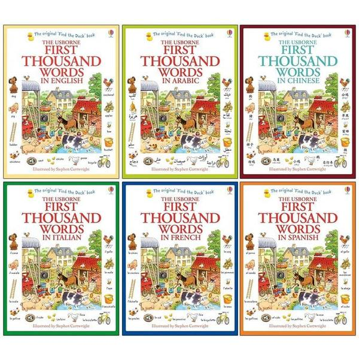

---

## Keep

[2026-09-23 19:39] 来自：Fang的资源分享群

名称：Keep VIP 付费运动健身教程合集

本合集整理Keep VIP付费运动健身教程，适合想在家跟练、减脂塑形或提升体能的人群，可用于按需选择内容并作为日常锻炼参考。

夸克网盘：https://pan.quark.cn/s/48cf433deae2

#运动健身 #付费教程 #会员合集 #健身课程 #居家锻炼

---

## 杨林著

[2026-09-23 19:39] 来自：Fang的资源分享群

名称：杨林著（内蒙古出版社）

一本由杨林著、内蒙古出版社出版的电子书，内容为夫妻双休功，适合夫妻双人阅读参考，可用于了解该功法的基本介绍，并为日常练习提供文字资料。

夸克网盘：https://pan.quark.cn/s/8d0a32134669

#电子书 #杨林 #夫妻双休功 #内蒙古出版社 #夫妻阅读

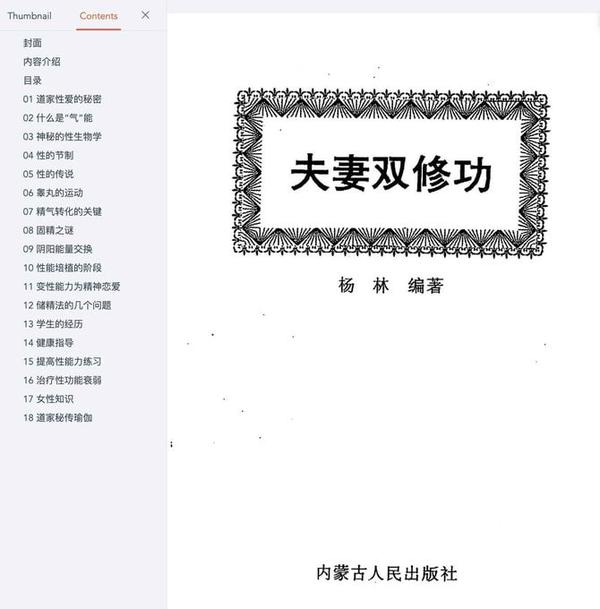

---

## 苹果自动记账软件

[2026-09-23 19:39] 来自：Fang的资源分享群

名称：苹果自动记账软件

围绕苹果设备自动记账指令整理的一份资源，包含下载和上架流程说明，适合想了解自动记账工具或做资料分享的人群，帮助快速获取并参考使用。

夸克网盘：https://pan.quark.cn/s/535e2fb70db2

#苹果记账 #自动记账 #记账指令 #资源分享 #效率工具

---

## Science

[2026-09-23 19:38] 来自：Fang的资源分享群

名称：Science Research Writing A Guide for Non-Native Speakers of English (Hilary Glasman-Deal) (Z-Library)

这本电子书面向英语非母语的科研写作者，提供科研论文写作指导，适合撰写或修改英文论文时查阅，作为写作参考。

夸克网盘：https://pan.quark.cn/s/7ae59ea3b839

#科研写作 #英文论文 #学术英语 #写作指南 #电子书

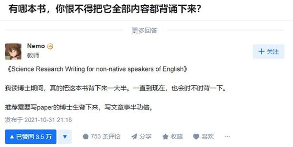

---

## 国庆假期旅游攻略超详细省钱省时省力路线

[2026-09-23 19:38] 来自：Fang的资源分享群

名称：国庆假期旅游攻略，超详细省钱省时省力路线

围绕国庆假期出行整理的旅游攻略，提供省钱省时省力的路线参考，适合计划假期出游的人提前规划行程和游玩节奏，帮助减少临时查找信息的时间。

夸克网盘：https://pan.quark.cn/s/ea38873f51ad

#国庆旅游 #省钱攻略 #路线规划 #假期出行 #旅游指南

---

## UC网盘拉新项目实战教学

[2026-09-23 19:38] 来自：Fang的资源分享群

名称：UC网盘拉新项目实战教学 拉新一个14米 用最短的时间学会、上手、出单 有学员20余个作品

UC网盘拉新项目实战教学，内容涉及拉新流程、上手与出单方法，适合想尝试网盘拉新的人参考，帮助你了解操作步骤并用于实践。

夸克网盘：https://pan.quark.cn/s/7e595820730c

#UC网盘 #拉新项目 #实战教学 #网盘拉新 #出单方法

---

## 讨好反应第4种创伤应激行为模式PDF

[2026-09-23 14:49] 来自：综合网盘资源频道

名称：《讨好反应_第4种创伤应激行为模式》[PDF]

描述：国际创伤疗愈新经典，系统解读被忽视的“第4种创伤应激反应”。告别“讨好型人格”焦虑，献给所有“好”到忘了自己是谁的人——“好孩子”“好妻子”“好员工”，遭遇NPD或常感压抑的“好人”! ……这本书，是你一直在等待的自我重建指南！

夸克网盘：https://pan.quark.cn/s/e1cd63416557

📁 大小：N

🏷 标签：#英格丽德 #克莱顿 #讨好反应 #第4种创伤应激行为模式 #PDF #quark

---

## 百万AI云架构师02期

[2026-09-23 09:20] 来自：综合网盘资源频道

名称：【奈学科技】百万AI云架构师02期

描述：11大篇章，1200+技术分支带你彻底掌握百万 AI 云架构师设计能力；涵盖金融、电商、内容、5G/IoT 等超 20 个真实万亿级 AI 架构实践案例；首次推出边缘计算场景，集合云计算，掌握“云边”协同发展新趋势；阿里、头条、百度等行业 AI 技术专家亲授，陪伴式教学守护你全程无忧

夸克网盘：https://pan.quark.cn/s/3c6dcef44c19

📁 大小：NG

🏷 标签：#学习 #知识 #课程 #资源 #奈学科技 #百万AI云架构师 #quark #ali

---

## iOS逆向1期

[2026-09-23 08:01] 来自：综合网盘资源频道

名称：【小肩膀】iOS逆向1期

描述：零基础开始讲起，内容包含安卓基础、Java层逆向、密码学探秘、NDK开发、so层逆向、算法转发、unidbg模拟执行so、抓包与检测等内容

夸克网盘：https://pan.quark.cn/s/0d8818ef1108

📁 大小：NG

🏷 标签：#学习 #知识 #课程 #资源 #小肩膀 #iOS逆向 #quark #ali

---

## 费曼学习法全套视频课程思维导图记忆力笔记技巧

[2026-09-23 06:37] 来自：精选网盘资源

名称：费曼学习法全套视频课程，思维导图+记忆力+笔记技巧

一套系统化的高效学习法视频课程合集，涵盖费曼学习法七天特训营、思维导图构建专属方案、记忆力训练、笔记技巧、学习力六步健全攻略与创新学习法。课程从知识树搭建到输出倒逼输入，帮助你掌握可复用的学习框架，摆脱低效勤奋，提升理解、记忆与应用能力。

百度网盘：https://pan.baidu.com/s/14TprcNYIfvBxOFN0lFFQvw?pwd=zn44

#费曼学习法 #高效率学习 #创新学习法 #记忆力训练

---

## 瓷砖美缝教学视频从清缝打胶到压缝铲边一次学会

[2026-09-23 06:34] 来自：精选网盘资源

名称：瓷砖美缝教学视频，从清缝打胶到压缝铲边一次学会

一套专为零基础新手设计的瓷砖美缝自学视频教程，系统讲解美缝剂选型、清缝深度、打胶手法、压缝技巧、铲边时机与常见问题处理。无需专业基础，跟着视频反复练习即可独立完成美缝施工，适合装修业主、兼职接单者及想入行的新手快速掌握实用技能。

百度网盘：https://pan.baidu.com/s/1mISxmuuRajZ-RVWRAXJoZg?pwd=hsdf

#瓷砖美缝教学 #清缝打胶 #美缝施工 #瓷砖美缝教程

---

## 婚礼主持人视频学习教程零基础新手自学入门到精通

[2026-09-23 06:32] 来自：精选网盘资源

名称：婚礼主持人视频学习教程，零基础新手自学入门到精通

一套系统化的婚礼主持人培训视频课程，从零基础入门到精通全阶覆盖，课程配真实婚礼案例拆解与模拟演练，帮助你逐步建立台风与自信。适合想转行做婚礼司仪的新手、兼职副业者及婚庆从业者自学提升，快速掌握接单与实战能力。

百度网盘：https://pan.baidu.com/s/1wE1reeCeLuJ9xB0tveylLA?pwd=5hwk

#婚礼主持课程 #婚礼流程 #婚礼司仪 #司仪接单

---

## 汉字拼音字帖生成器一键生成字帖默写填空卷

[2026-09-23 06:30] 来自：精选网盘资源

名称：汉字拼音字帖生成器，一键生成字帖+默写填空卷

一款专为汉字学习设计的字帖生成工具，支持汉字+拼音同步生成，可一键制作描红字帖、默写填空卷。操作简单，导出打印方便，适合小学语文教学、家庭辅导及课后练习，是老师和家长必备的学习神器。

夸克网盘：https://pan.quark.cn/s/0f106e2e1acc

#拼音字帖 #字帖制作工具 #一键生成字帖 #描红练习

---

## AI高手全能实战课从零开始全面提升工作效率

[2026-09-23 06:28] 来自：精选网盘资源

名称：AI高手全能实战课，从零开始全面提升工作效率

一套从零基础到AI高手的全能实战课程，课程以真实工作与副业场景为驱动，手把手演示工具组合与工作流搭建，帮助学员全方位提升效率。适合职场人、自由职业者、内容创作者及副业探索者系统进阶。

百度网盘：https://pan.baidu.com/s/1yDtOgBB8Xrw-i-J_UpLnTg?pwd=5icc

#AI提示词 #AI文案 #效率提升 #AI工具实战

---

## 国庆假期旅游攻略超详细省钱省时省力路线

[2026-09-23 06:25] 来自：精选网盘资源

名称：国庆假期旅游攻略，超详细省钱省时省力路线

一份旅行社内部流出的国庆假期旅游攻略，覆盖热门与冷门目的地、交通接驳、住宿比价、门票预约、错峰路线及避坑指南。内容以“省钱、省时、省力”为核心，附预算表、行李清单与应急预案，适合自由行新手、家庭出游及想避开人潮的旅行者参考，让国庆出行更从容。

夸克网盘：https://pan.quark.cn/s/1fc74a2cd0f5

#旅游攻略 #错峰路线 #旅游避坑指南 #出行必备

---

## 中国民间社交通用全书教你在人情社会里不犯怵

[2026-09-23 06:09] 来自：精选网盘资源

名称：《中国民间社交通用全书》：教你在人情社会里不犯怵

去别人家做客该带什么？红白喜事随礼有什么讲究？求人办事话该怎么说？这些没人教、但生活中天天遇到的社交难题，这本书全给你整理好了，把民间的人情规矩和说话门道讲得明明白白。

夸克网盘：https://pan.quark.cn/s/f840a1933e0f

#送礼规矩 #婚丧礼俗 #求人办事 #待客之道 #民间礼仪

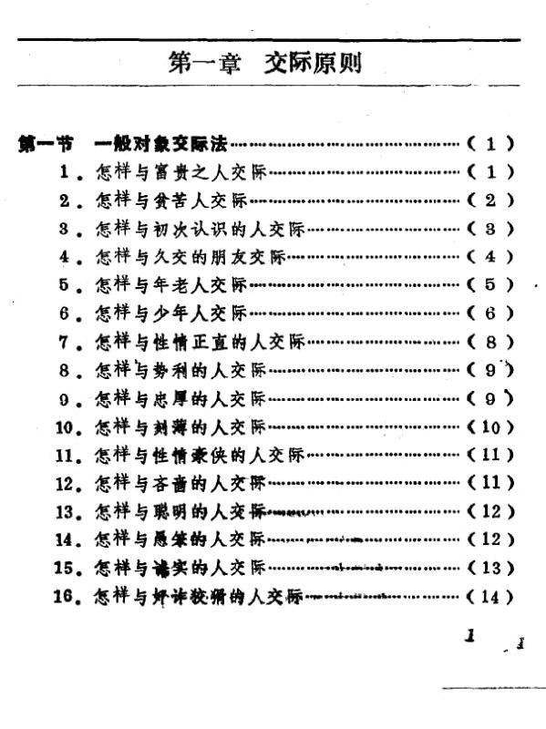

---

## 2026黄导孩子自动自发学习系列课程

[2026-09-23 00:10] 来自：综合网盘资源频道

名称：2026黄导-孩子自动自发学习系列课程

描述：黄导孩子自动自发学习系列课程围绕激发孩子内在学习动力展开，讲解引导孩子主动学习的思路与实操方法，剖析孩子学习当中存在的各类问题，帮助家长掌握合适的教育方式，改善孩子学习状态，适合有家庭教育需求的家长学习参考，助力培养孩子自主学习的意识与习惯。

夸克网盘：https://pan.quark.cn/s/714afa66e0af

📁 大小：135.4GB

🏷 标签：#教程 #系列 #课程 #实操 #方法 #2026黄导 #孩子自动自发学习系列课程 #quark

---

## 编绳手工DIY教程中国结项链手链编织视频

[2026-09-23 00:09] 来自：综合网盘资源频道

名称：编绳手工DIY教程，中国结项链手链编织视频

描述：编绳手工 DIY 教程以视频形式讲解中国结相关编织技法，演示项链、手链等饰品的完整制作步骤，从基础绳结手法到成品组装都有所涉及，适合手工爱好者学习，跟着视频动手实操，掌握编绳技巧，制作出属于自己的绳结首饰，丰富业余手工创作。

夸克网盘：https://pan.quark.cn/s/7bd56c7b8e33

📁 大小：20.8GB

🏷 标签：#教程 #视频 #中国 #手工 #编绳 #编绳手工DIY教程 #中国结项链手链编织视频 #quark

---

## 中式美学天宫AI电影全流程制作提示词合集

[2026-09-23 00:07] 来自：综合网盘资源频道

名称：中式美学天宫AI电影，全流程制作+提示词合集

描述：中式美学天宫 AI 电影内容包含 AI 电影全流程制作方法以及配套提示词，围绕天宫主题的中式美学风格展开，讲解 AI 影像从构思到产出的完整步骤，分享可直接参考使用的提示词素材，适合 AI 视频创作者学习，帮助打造具有国风韵味的 AI 影视作品。

夸克网盘：https://pan.quark.cn/s/c3fcd2ddb27f

📁 大小：635.0MB

🏷 标签：#教程 #合集 #AI #制作 #美学 #中式美学天宫AI电影 #全流程制作 #提示词合集 #quark

---

## WorkBuddy全能AI工作台实战课系统提升职场效率

[2026-09-23 00:05] 来自：综合网盘资源频道

名称：WorkBuddy全能AI工作台实战课，系统提升职场效率

描述：WorkBuddy 全能 AI 工作台实战课讲解该 AI 工具在职场当中的各类实操用法，覆盖文案撰写、信息整理、办公辅助等多种工作场景，梳理工具使用思路与实操技巧，帮助学习者借助 AI 处理办公任务，适合职场从业者学习，借助工具简化工作流程，系统性提升自身的职场工作效率。

夸克网盘：https://pan.quark.cn/s/9ce1e7ca9c6f

📁 大小：1.1GB

🏷 标签：#教程 #AI #职场 #提升 #系统 #WorkBuddy全能AI工作台实战课 #系统提升职场效率 #quark

---

## AI编程实战课

[2026-09-23 00:04] 来自：综合网盘资源频道

名称：AI编程实战课 ，用AI辅助几天搞定数月代码工作量

描述：AI 编程实战课讲解借助 AI 工具辅助编码的实操方法，演示利用 AI 完成代码生成、调试、优化等工作，分享高效提示词与协作思路，帮助学习者减少重复编码劳动，提升项目开发速度，适合程序员以及想要学习编程的人群，学会合理借助 AI 工具缩减项目开发的时间成本。

夸克网盘：https://pan.quark.cn/s/9337b0e36635

📁 大小：4.9GB

🏷 标签：#教程 #工作 #实战课 #AI编程 #工具 #AI编程实战课 #用AI辅助几天搞定数月代码工作量 #quark

---

## 11本养猫攻略电子书猫咪训练视频

[2026-09-23 00:03] 来自：综合网盘资源频道

名称：11本养猫攻略电子书+猫咪训练视频

描述：包含 11 本养猫相关攻略电子书与猫咪训练相关视频，覆盖猫咪日常喂养、健康护理、行为习惯纠正等多方面内容，讲解科学饲养方法以及实用训练手段，适合养猫新手以及养猫爱好者，帮助掌握照料猫咪的各类知识，更好处理猫咪各类行为问题，提升科学养宠能力。

夸克网盘：https://pan.quark.cn/s/8feeb4384324

📁 大小：885.7MB

🏷 标签：#教程 #视频 #攻略 #训练 #电子书 #11本养猫攻略电子书 #猫咪训练视频 #quark

---

## 儿童有声剧生活的100个秘密主播100个秘密科普馆

[2026-09-23 00:02] 来自：综合网盘资源频道

名称：儿童有声剧《生活的100个秘密》主播：100个秘密科普馆 201集完

描述：蹲久起身，为何眼前一阵发黑？ 春节为什么要贴春联、发压岁钱？ 面包内部那些密密麻麻小孔，究竟从何而来？ 被蚊子叮出包，掐个 “十” 字真的能止痒吗？ 吃完大蒜嘴里总有异味，有没有办法快速消除？生活，就像一本藏满奇妙秘密的魔法书！ 那些我们早已习惯的日常，随口冒出的一个个小疑问， 背后都藏着严谨又好玩的科学原理。快来跟着活泼的小花卷、吃货皮蛋， 还有温柔博学的小鱼老师， 在轻松有趣的对话里，解锁生活的隐藏密码， 在平凡日常，发现探索的无穷乐趣！

百度网盘：https://pan.baidu.com/s/143Sf294LU2AQuSUcQmx-pA?pwd=caus

夸克网盘：https://pan.quark.cn/s/8892dbd6c696?pwd=nhXH

📁 大小：470MB

🏷 标签：#有声书 #儿童有声剧 #生活的100个秘密 #100个秘密科普馆 #baidu #quark #移动

---

## 体位姿势大全

[2026-09-22 20:18] 来自：Fang的资源分享群

名称：体位姿势大全

《体位姿势大全》收录52种动漫风格体位姿势图解，围绕人体结构与动态表现展开，适合动漫绘画、角色设定与人体动态练习时参考，帮助更直观地观察姿势与结构关系。

夸克网盘：https://pan.quark.cn/s/1dc723004970

#体位姿势 #动漫绘画 #人体结构 #动态表现 #姿势参考

---

## i人社会化全攻略

[2026-09-22 20:16] 来自：Fang的资源分享群

名称：i人社会化全攻略

这是一份面向i人和社恐人群的社会化攻略，围绕精准人群、强痛点和情绪共鸣设计，适合在小红书等平台作为虚拟商品售卖，帮助理解该品类的选题与售卖思路。

夸克网盘：https://pan.quark.cn/s/e0e8467b5272

#社恐指南 #虚拟商品 #小红书副业 #精准人群 #情绪共鸣

---

## 漫威漫画合集

[2026-09-22 20:14] 来自：Fang的资源分享群

名称：漫威漫画合集

本资源为漫威漫画合集，收录8526册漫威英雄漫画，适合漫威粉丝阅读收藏与回顾经典故事，方便集中查找和系统浏览英雄漫画内容。

夸克网盘：https://pan.quark.cn/s/691b7408f235

#漫威漫画 #英雄漫画 #漫画合集 #收藏阅读 #资源分享

---

## 红警单机版

[2026-09-22 20:12] 来自：Fang的资源分享群

名称：红警单机版

红色警戒单机版资源，可按领取方式自行获取并安装，适合想离线重温经典即时战略玩法的玩家，帮助你方便地体验单机对战与任务内容。

夸克网盘：https://pan.quark.cn/s/83a5f25a6328

#红色警戒 #单机游戏 #即时战略 #怀旧游戏 #游戏资源

---

## EasyRC一键装机v38300

[2026-09-22 20:01] 来自：Fang的资源分享群

名称：EasyRC一键装机v3.8.30.0 一键装机工具 无脑操作完全免费

EasyRC一键装机v3.8.30.0是一款一键装机工具，主打无脑操作和完全免费，适合需要重装或安装系统时使用，帮助简化装机流程。

夸克网盘：https://pan.quark.cn/s/d0919840d585

#一键装机 #系统安装 #电脑重装 #免费工具 #装机软件

---

## 剪映永久免费

[2026-09-22 20:01] 来自：Fang的资源分享群

名称：剪映永久免费

资源提供剪映永久免费VIP功能版本，覆盖macOS和Windows，适合短视频剪辑与内容创作，可帮助完成视频编辑流程。

夸克网盘：https://pan.quark.cn/s/2521ea63823d

#剪映 #视频剪辑 #电脑软件 #短视频制作 #内容创作

---

## 某雷杂交版

[2026-09-22 19:49] 来自：Fang的资源分享群

名称：某雷杂交版

加强版迅雷魔改，无广告，下载速度超过20MB/s，优化图标和界面，适合需要下载文件的场景，减少广告干扰，使用更清爽。

夸克网盘：https://pan.quark.cn/s/0c51d7184a97

#迅雷魔改 #无广告 #下载工具 #界面优化 #高速下载

---

## Seedance20保姆级教程5套合集从入门到精通的最全攻略

[2026-09-22 19:49] 来自：Fang的资源分享群

名称：Seedance2.0保姆级教程5套合集，从入门到精通的最全攻略

这套Seedance2.0保姆级教程合集，从入门到精通，适合想系统学习Seedance2.0的人，按教程逐步学习，帮助掌握相关操作与用法。

夸克网盘：https://pan.quark.cn/s/3e32c910c0e5

#Seedance2.0教程 #保姆级教程 #入门到精通 #操作流程 #学习合集

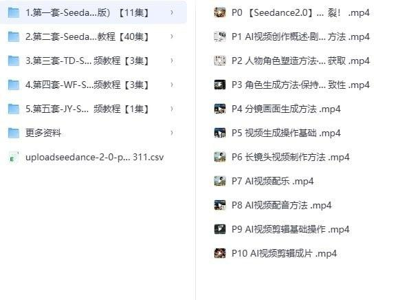

---

## 男人终极王炸训练

[2026-09-22 19:49] 来自：Fang的资源分享群

名称：男人终极王炸训练

《男人终极王炸训练-彭祖强肾健体》围绕系统强肾健体，包含吐纳、垂吊、房中养生等核心功法，可用于日常调理前列腺、延时等男性问题，帮助重塑活力与自信。

夸克网盘：https://pan.quark.cn/s/9d3619fa3986

#强肾健体 #男性养生 #吐纳功法 #房中养生 #垂吊训练

---

## 支付宝短视频分成计划教程合集轻松赚到一部iphone

[2026-09-22 19:49] 来自：Fang的资源分享群

名称：支付宝短视频分成计划教程合集，轻松赚到一部iphone 17

本教程合集围绕支付宝短视频分成计划，整理相关教程内容，适合想了解该计划的创作者查看，帮助快速熟悉计划要点和参与思路。

夸克网盘：https://pan.quark.cn/s/216636e591a7

#支付宝短视频 #分成计划 #教程合集 #短视频运营 #创作者参考

---

## 4K影视电视直播接口

[2026-09-22 19:48] 来自：Fang的资源分享群

名称：4K影视+电视直播接口

提供4K影视资源与电视直播接口，可用于搭建影音播放或直播观看场景，方便在自建应用中调用播放，帮助减少自行寻找片源与直播源的时间。

夸克网盘：https://pan.quark.cn/s/cd30c7484439

#4K影视 #电视直播 #接口资源 #影音搭建 #直播源

---

## 抖音AI图文带货新玩法

[2026-09-22 19:48] 来自：Fang的资源分享群

名称：抖音AI图文带货新玩法 100条作品佣金20064 玩法简单 可复制性极强

分享抖音AI图文带货新玩法，围绕100条作品累计佣金20064的实操思路，讲清从选品、图文制作到发布的流程，适合想入门带货的新手参考。

夸克网盘：https://pan.quark.cn/s/b1d206061c43

#抖音带货 #AI图文 #带货教程 #新手入门 #自媒体运营

---

## 最全吃瓜大合集

[2026-09-22 19:47] 来自：Fang的资源分享群

名称：最全吃瓜大合集

整理全网热门吃瓜内容合集，涵盖多类事件与话题，适合想集中了解近期网络热点、快速浏览讨论的人，方便按合集查找和阅读。

夸克网盘：https://pan.quark.cn/s/d0123333c052

#吃瓜合集 #网络热点 #娱乐八卦 #热门话题 #资讯整理

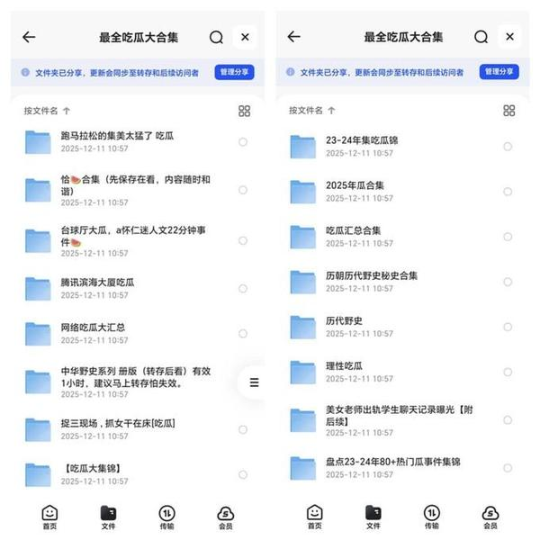

---

## Java架构师VIP精品课程

[2026-09-22 18:07] 来自：综合网盘资源频道

名称：【图灵课堂】Java-架构师VIP精品课程(第六期)

描述：这门课是2023最新一期的！更新快，覆盖广，技术新，高使用。12大专题覆盖所有互联网技术 20+技术点深入源码分析结合大厂面试题深入讲解 循序渐进晋升P6-P8, 项目驱动获取真实项目经验。

夸克网盘：https://pan.quark.cn/s/7d85a3e4c980

📁 大小：NG

🏷 标签：#学习 #知识 #课程 #资源 #图灵课堂 #架构师VIP精品课程 #quark #ali

---

## 自顶向下学

[2026-09-22 17:53] 来自：综合网盘资源频道

名称：【思否编程】自顶向下学 React 源码

描述：学习React源码，不仅能掌握业界最顶尖前端框架的运行原理，探索前端边界。也能让自己成为业务线React大拿。

夸克网盘：https://pan.quark.cn/s/98abdc6ce288

📁 大小：NG

🏷 标签：#学习 #知识 #课程 #资源 #思否编程 #自顶向下学 #源码 #quark #ali

---

## 英语零基础入门班

[2026-09-22 17:41] 来自：综合网盘资源频道

名称：【Theone口译】英语零基础入门班

描述：Theone英语口译零基础入门班。

夸克网盘：https://pan.quark.cn/s/a66e2f9caeee

📁 大小：NG

🏷 标签：#学习 #知识 #课程 #资源 #Theone口译 #英语零基础入门班 #quark #ali

---

## 好书推荐聪明人的个人成长

[2026-09-22 15:20] 来自：综合网盘资源频道

名称：好书推荐《聪明人的个人成长》(美)史蒂夫·帕弗利纳 PDF 冷门但含金量爆表，

描述：史蒂夫·帕弗利纳：美国知名个人成长导师。它真正牛的地方，不在于教你怎么迅速发财，而是帮你把人生选项重新捋一遍，要是你能耐着性子读完，以后遇上人生关键关口时，看待问题的角度说不定就转了向。

夸克网盘：https://pan.quark.cn/s/ecf89c8a232c

📁 大小：9.4M

🏷 标签：#书籍 #好书推荐 #聪明人的个人成长 #quark #PDF #史蒂夫·帕弗利纳 #冷门但含金量爆表

---

## 吉川充秀所著的捡垃圾与人生回收指南如何通过行动重新认识生活

[2026-09-22 09:54] 来自：综合网盘资源频道

名称：吉川充秀所著的《捡垃圾与人生“回收”指南》：如何通过行动重新认识生活(epub)

描述：如何通过行动重新认识生活，一本探讨幸福与心态调整的非传统人生指南。作者身为成功企业家的同时，坚持长年累月在步行和日常生活中捡垃圾。他通过这一看似平凡简单的行为，传达出内心的平静与快乐和身份。

夸克网盘：https://pan.quark.cn/s/75b8758735ae

📁 大小：272M

🏷 标签：#电子书 #捡垃圾与人生回收指南 #书籍 #如何通过行动重新认识生活 #epub #吉川充秀所著的 #quark

---

## 中医养生科普著作人体使用手册口碑与实效畅销7年的身体使用经典pdf

[2026-09-22 09:54] 来自：综合网盘资源频道

名称：中医养生科普著作《人体使用手册》口碑与实效畅销7年的身体使用经典[pdf]

描述：被无数读者奉为“无痛养生”的经典指南：书中指出很多时候身体的“不舒服”(如感冒、排汗)其实是气血上升后，身体在主动“清理垃圾”的排毒表现，缓解了人们对疾病的焦虑。

夸克网盘：https://pan.quark.cn/s/b4b6a9eae757

📁 大小：3.8MB

🏷 标签：#书籍 #电子书 #中医 #养生 #科普 #人体使用手册 #pdf #中医养生科普著作 #口碑与实效畅销7年的身体使用经典 #quark

---

## 初中

[2026-09-22 08:01] 来自：综合网盘资源频道

名称：【乐乐课堂】初中 - 历史、地理、生物 大百科

描述：乐乐课堂(地理、历史、生物)。

夸克网盘：https://pan.quark.cn/s/3e89095229e8

📁 大小：NG

🏷 标签：#学习 #知识 #课程 #资源 #乐乐课堂 #初中 #历史 #地理 #生物 #quark #ali

---

## Linux云计算运维

[2026-09-22 07:59] 来自：综合网盘资源频道

名称：【老男孩教育】Linux云计算运维 28期

描述：老男孩linux运维28期教程，录制于2016年5月份，收录的比较全

夸克网盘：https://pan.quark.cn/s/d8c0abb6fba9

📁 大小：NG

🏷 标签：#学习 #知识 #课程 #资源 #老男孩教育 #Linux云计算运维 #quark #ali

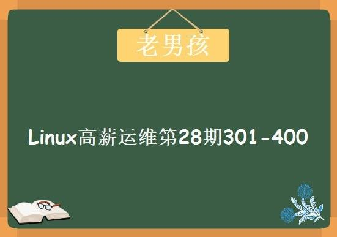

---

## 小说新人作者写作素材入门大纲实战指南写作技巧

[2026-09-22 06:22] 来自：精选网盘资源

名称：小说新人作者写作素材，入门大纲+实战指南+写作技巧

这是一套专为网文写手与小说创作者整理的实战资源，涵盖小说素材积累、网文写作技巧、写作入门方法与大纲搭建全流程。内容包括人物设定、情节模板、冲突设计、开篇钩子、爽点节奏与投稿签约要点，附素材库与案例拆解。

百度网盘：https://pan.baidu.com/s/18b0sr0ePkGkallsQgRTtHw?pwd=vevf

#小说素材 #网文写作技巧 #灵感积累 #人物设定 #情节模板

---

## 中式米糕发糕视频教程几十套零基础商用配方合集

[2026-09-22 06:20] 来自：精选网盘资源

名称：中式米糕发糕视频教程，几十套零基础商用配方合集

一套系统化的中式米糕制作视频课程，涵盖南方米发糕、红糖发糕、玉米发糕、枣糕等经典小吃。从选米磨浆、发酵控制、糖水调配到蒸制火候，全程精准量化配方，附常见问题与商用保存方法。适合早餐店、夜市摆摊、小吃创业者及家庭爱好者，零基础也能稳定出品质地松软、香甜可口的米糕。

百度网盘：https://pan.baidu.com/s/1lHsfUPuvhbC8gThXRWbTfg?pwd=666q

#中式米糕课程 #发糕枣糕 #发糕配方 #糕点小吃

---

## 古风手工饰品制作教程零基础也能做出惊艳国风首饰

[2026-09-22 06:17] 来自：精选网盘资源

名称：古风手工饰品制作教程，零基础也能做出惊艳国风首饰

一套古风手工饰品制作教程合集，涵盖发簪、步摇、璎珞、耳坠、发冠、禁步等经典品类。从材料工具认识、花片绑扎、珠串搭配、金属线造型到流苏制作与成品固定，适合汉服爱好者、手工达人、摆摊创业者及想接单副业的人群，零基础也能跟着做出精致国风首饰。

夸克网盘：https://pan.quark.cn/s/761734b5d215

#古风手工饰品 #配饰手工DIY #国风首饰 #国风美学

---

## JOPDF编辑工具免费全能的PDF编辑器

[2026-09-22 06:15] 来自：精选网盘资源

名称：JOPDF编辑工具，免费全能的PDF编辑器

一款完全免费的PDF编辑工具，支持Windows和macOS系统。无需注册登录，即可像编辑Word一样修改PDF中的文字、图片和链接。内置批量转换、压缩、合并、拆分、注释、页面管理和密码保护等功能。所有文件本地处理，不上传服务器，保护隐私安全。

夸克网盘：https://pan.quark.cn/s/62368eb1b249

#JOPDF #PDF编辑器 #全能PDF工具 #PDF转换压缩

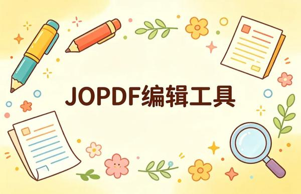

---

## 研究者丛书全6册合集80年代思想文化经典老书书单

[2026-09-22 06:12] 来自：精选网盘资源

名称：《研究者丛书》全6册合集，80年代思想文化经典老书书单

一套出版于上世纪80年代的思想文化经典丛书，共6册，涵盖哲学、历史、社会学、文学批评与跨文化研究等领域。作为那个启蒙年代的标志性读物，丛书以严谨学术视野与敏锐问题意识，探讨传统与现代、中西文化碰撞及知识分子使命等议题。

夸克网盘：https://pan.quark.cn/s/a2cb00961ef1

#研究者丛书 #学术启蒙 #人文社科 #文化经典

---

## 相机基础入门课光圈快门曝光度一次搞懂

[2026-09-22 06:10] 来自：精选网盘资源

名称：相机基础入门课，光圈快门曝光度一次搞懂

一套专为零基础摄影爱好者设计的相机基础入门课程，系统讲解曝光三要素、对焦模式、测光原理、白平衡、景深控制与构图基础等核心理论。课程用通俗语言配合实拍对比，帮助学员理解参数背后的逻辑，而非死记硬背。

夸克网盘：https://pan.quark.cn/s/f3de8f62bbeb

#相机基础入门 #摄影理论 #景深控制 #构图基础

---

## 亲密关系重建别再拿真心换冷漠

[2026-09-22 06:05] 来自：精选网盘资源

名称：《亲密关系重建》：别再拿真心换冷漠

为什么你越付出，她越不爱你？为什么你掏心掏肺，最后只换来一句“你是个好人”？这本书把“舔狗式真诚”的底裤全扒了。它不骂你，而是带你一步步从认知破局到行为重塑：停止内耗、建立边界、学会恰到好处的付出。

夸克网盘：https://pan.quark.cn/s/c48723e6f2a0

#亲密关系 #停止讨好 #情感独立 #自我价值

---

## 儿童有声剧身体的100个秘密两季全

[2026-09-22 02:39] 来自：综合网盘资源频道

名称：儿童有声剧《身体的100个秘密》两季全 主播：100个秘密科普馆 301集完

描述：人为什么会放屁？眼睛为什么总是眨呀眨？ 吃糖，真的会长蛀牙吗？成长路上，每个小朋友都会对自己的身体冒出许许多多奇奇怪怪的疑问。不少难题，就连爸爸妈妈也一时答不上来。 快来跟着小花卷和温柔博学的小鱼老师，一起解锁身体的小秘密！ 满足孩子对人体的好奇心，读懂身体的小信号，学会认识身体、好好爱护自己！

百度网盘：https://pan.baidu.com/s/1kHEV3Bee8rZo6_yhenmZEg?pwd=wid9

夸克网盘：https://pan.quark.cn/s/05415f475557?pwd=yTRq

📁 大小：511MB

🏷 标签：#有声书 #儿童有声剧 #身体的100个秘密 #两季全 #100个秘密科普馆 #baidu #quark #移动

---

## 儿童科普有声剧职业的100个秘密主播100个秘密科普馆

[2026-09-22 01:15] 来自：综合网盘资源频道

名称：儿童科普有声剧《职业的100个秘密》主播：100个秘密科普馆 201集完

描述：为什么交警叔叔总把哨子吹个不停？ 地铁司机开车需要握方向盘吗？ 熊猫奶爸一整天都在忙些什么？ 配音演员是怎么变出动画片里的各色声音的？ 超市收银员手里的 “神奇枪” 到底是什么来头？ 在高楼上作业的 “蜘蛛人” 难道不害怕吗？在我们身边，医生、老师、消防员、厨师、警察、外卖员…… 各行各业的人每天都在默默忙碌。他们的工作看似平平无奇，却藏着好多好玩又暖心的小秘密，正等着好奇的小朋友们一一揭开！

百度网盘：https://pan.baidu.com/s/1da9CzfnP9Aa8tVYh12kW6g?pwd=w4hi

夸克网盘：https://pan.quark.cn/s/0652630ad345?pwd=7uhV

📁 大小：420MB

🏷 标签：#有声书 #儿童科普有声剧 #职业的100个秘密 #100个秘密科普馆 #baidu #quark #移动

---

## AI爆款国学视频独家起号当天见效教程

[2026-09-21 18:48] 来自：Fang的资源分享群

名称：AI爆款国学视频，独家起号当天见效教程

围绕AI制作国学视频与起号流程的教程，适合想快速搭建账号的内容创作者参考，帮助了解选题、制作和发布思路。

夸克网盘：https://pan.quark.cn/s/69a4d4400aa4

#人工智能国学 #国学视频 #起号教程 #视频制作 #内容创作

---

## 通辽永茂国际

[2026-09-21 18:45] 来自：Fang的资源分享群

名称：通辽永茂国际

本资源围绕通辽永茂国际展开，收集整理相关内容，方便关注该项目的用户集中查看与了解，适合需要获取相关信息参考的人群，可帮助快速定位所需内容。

夸克网盘：https://pan.quark.cn/s/a56cb73d4146

#通辽永茂国际 #资源分享 #信息参考 #项目资讯 #本地生活

---

## 美图秀秀解锁会员版

[2026-09-21 18:45] 来自：Fang的资源分享群

名称：美图秀秀解锁会员版

美图秀秀解锁会员版资源，可用于照片美化与P图场景；原始文案提到保存软件、在小红书上架商品并收钱的流程，适合想利用信息差做相关服务的人参考。

夸克网盘：https://pan.quark.cn/s/d018211d5c43

#美图秀秀 #修图软件 #小红书 #信息差 #会员版

---

## 抖音80W粉丝博主付费AI漫剧教学课程

[2026-09-21 18:44] 来自：Fang的资源分享群

名称：抖音80W粉丝博主，付费AI漫剧教学课程

抖音80W粉丝博主推出的付费AI漫剧教学课程，面向想学习AI漫剧制作的人群，可参考其内容了解相关创作流程与思路，用于个人学习与尝试。

夸克网盘：https://pan.quark.cn/s/c410d7453896

#AI漫剧 #教学课程 #抖音博主 #付费课程 #漫剧制作

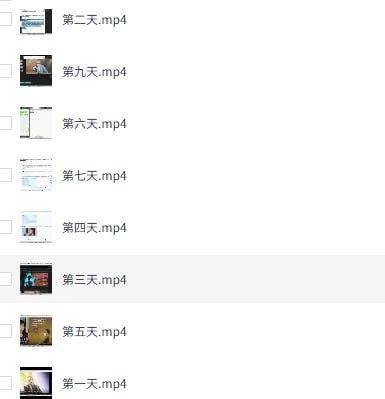

---

## 剪映专业版63

[2026-09-21 18:35] 来自：Fang的资源分享群

名称：剪映专业版6.3 SVP超级会员解锁

本资源围绕剪映专业版6.3 SVP超级会员解锁展开，适合需要体验会员权益的视频剪辑用户参考，帮助了解相关解锁思路与操作流程，请合规使用。

夸克网盘：https://pan.quark.cn/s/ed6feea95d72

#剪映 #剪映专业版 #超级会员 #视频剪辑 #软件解锁

---

## 谷歌浏览器安装包

[2026-09-21 18:18] 来自：Fang的资源分享群

名称：谷歌浏览器安装包

提供谷歌浏览器安装包，适合需要安装浏览器的用户获取，可用于自行安装或作为闲鱼资源上架，帮助快速找到安装文件。

夸克网盘：https://pan.quark.cn/s/14429260d39f

#谷歌浏览器 #安装包 #浏览器安装 #资源分享 #闲鱼上架

---

## AI短视频推广拉新项目

[2026-09-21 18:18] 来自：Fang的资源分享群

名称：AI短视频推广拉新项目 无需粉丝、无需出镜 解锁豆包/即梦/醒图/剪映/红果漫剧多赛道拉新玩法

汇总豆包、即梦、醒图、剪映、红果漫剧等多平台AI短视频推广拉新玩法，无需粉丝和出镜，可按流程选择赛道进行操作，适合想尝试短视频拉新的人了解思路并落地执行。

夸克网盘：https://pan.quark.cn/s/af59a876e60e

#AI短视频 #推广拉新 #无需出镜 #多平台玩法 #副业项目

---

## 豆包无限创建账号教程可能会有时效性

[2026-09-21 18:17] 来自：Fang的资源分享群

名称：豆包无限创建账号教程，可能会有时效性（请自测）

本教程介绍豆包无限创建账号的操作流程，适合需要多账号测试或使用的场景，帮助了解相关方法并自行验证时效性。

夸克网盘：https://pan.quark.cn/s/66234eac58ba

#豆包 #账号创建 #教程 #时效性 #自测

