## 网瘾戒除视频教程大全青少年沉迷网络管理技巧

[2026-09-15 07:43] 来自：精选网盘资源

名称：网瘾戒除视频教程大全，青少年沉迷网络管理技巧

一套针对青少年网络沉迷问题的系统性家长指导课程，不靠打骂与强制断网，而是通过环境调整、亲子关系修复与自控力训练，引导孩子逐步恢复健康生活节律，重新找回学习动力与现实世界的乐趣。

百度网盘：https://pan.baidu.com/s/1nRK8jX1fABdVzApbSutIMQ?pwd=dcyr

#网瘾戒除 #自控力 #亲子关系 #沉迷网络管理

---

## 闯关游戏PPT课件模板幼儿园小学课堂互动教学通用模板

[2026-09-15 07:41] 来自：精选网盘资源

名称：闯关游戏PPT课件模板，幼儿园小学课堂互动教学通用模板

一套专为幼小学段设计的闯关游戏PPT课件模板合集，模板含多种关卡地图、选择题互动、拖拽配对、计时答题与奖励动画，所有元素均可自由编辑替换。

百度网盘：https://pan.baidu.com/s/1qdDgigtxyOjDABvdbg5GlQ?pwd=4jfh

#闯关游戏PPT #课件模板 #课堂游戏模板 #互动教学

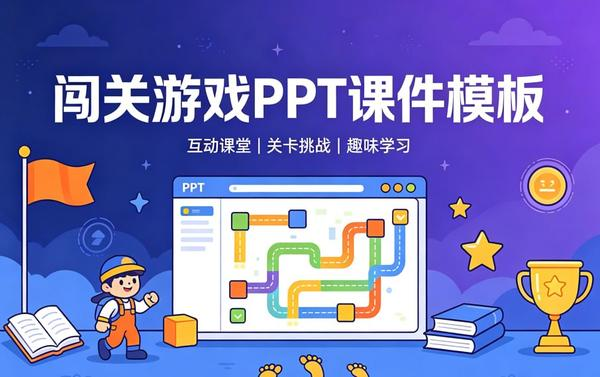

---

## 免费电脑蓝光护眼软件宠物提醒防疲劳护眼

[2026-09-15 06:26] 来自：精选网盘资源

名称：免费电脑蓝光护眼软件，宠物提醒+防疲劳护眼

一款免费的电脑护眼工具，通过智能调节屏幕色温，有效过滤有害蓝光，减轻长时间用眼带来的疲劳感。内置可爱的桌面宠物，定时提醒你休息、远眺或做眼保健操，帮助养成良好用眼习惯。

夸克网盘：https://pan.quark.cn/s/7951cafe588e

#蓝光护眼 #护眼软件 #屏幕色温调节 #防疲劳软件

---

## 可打印安静书素材多风格手工制作全套资源

[2026-09-15 06:22] 来自：精选网盘资源

名称：可打印安静书素材，多风格手工制作全套资源

一套可打印的安静书电子素材包，包含英文认知、配对、数感、颜色形状、生活技能等主题互动翻翻书。家长打印后剪贴即可制作，锻炼手部精细动作与专注力，适合亲子手工、家庭早教及幼儿园课堂延伸，无需购买成品书，随时按需打印，经济灵活又实用。

百度网盘：https://pan.baidu.com/s/1O0whLmO2o5VaAfm29JG_7A?pwd=emi2

#安静书素材 #亲子手工 #早教手工 #家庭早教

---

## 数学基础知识丛书24册全集70年代经典数学自学老课本书单

[2026-09-15 06:19] 来自：精选网盘资源

名称：《数学基础知识丛书》24册全集，70年代经典数学自学老课本书单

一套出版于上世纪70年代的数学自学经典丛书，共24册，涵盖算术、代数、几何、三角、解析几何、微积分及概率统计等完整基础体系。编写风格严谨朴实，推导详尽，例题丰富，注重概念理解与解题逻辑训练。作为那个年代自学成才的重要读物，至今仍被视为夯实数学基本功的优质参考。

夸克网盘：https://pan.quark.cn/s/eeea7855b5e9

#数学基础知识 #数学史料 #数学自学 #解题思路

---

## 手工折纸视频教程全集手把手教你折出各种物件

[2026-09-15 06:15] 来自：精选网盘资源

名称：手工折纸视频教程全集，手把手教你折出各种物件

一套系统的手工折纸视频教程合集，从简单折叠到组合折纸逐步进阶，每一步都有慢动作演示与清晰图解，适合儿童动手能力培养、亲子互动及成人解压休闲。无需复杂工具，一张纸即可开始，跟着视频轻松学会多种折纸造型，享受指尖创造的乐趣。

夸克网盘：https://pan.quark.cn/s/9f60e7e74b93

#手工折纸 #亲子互动 #指尖乐趣 #动手能力

---

## 情绪价值话术手册让每句话都暖到点上

[2026-09-15 06:10] 来自：精选网盘资源

名称：《情绪价值话术手册》：让每句话都暖到点上

想安慰人却越说越糟、想夸人却只会“你真棒”、一吵架就大脑空白？这本书不讲空道理，直接给你能照搬的话术模板。从夸结果到夸细节，从道歉不找借口到灭火不翻旧账——每一句都按场景分好，拿来就能用。

夸克网盘：https://pan.quark.cn/s/3d22d7863915

#情绪价值 #话术手册 #高情商沟通 #告别嘴笨

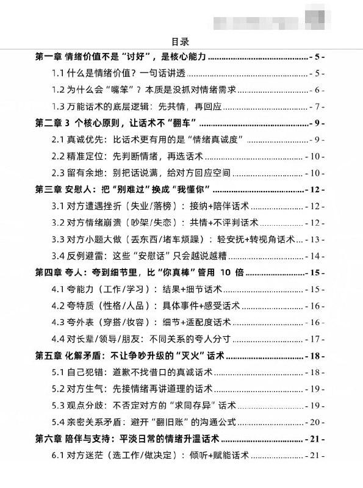

---

## 自私的基因40周年增订版PDFAZW3EPUBMOBI

[2026-09-14 22:18] 来自：综合网盘资源频道

名称：《自私的基因_40周年增订版》[PDF+AZW3+EPUB+MOBI]

描述：一部颠覆认知的进化生物学著作。它提出，我们不过是基因的生存机器，很多看似利他的行为，本质上是基因的自私策略。它将彻底改变你对人性、爱情和道德的理解。生命和人生以及世界与文明的尽头，可能是我们根本想不到的东西。

夸克网盘：https://pan.quark.cn/s/8201e8099931

📁 大小：N

🏷 标签：#理查德 #道金斯 #自私的基因 #40周年增订版 #PDF #AZW3 #EPUB #quark

---

## 北大炒股PPT资料

[2026-09-14 19:45] 来自：Fang的资源分享群

名称：北大炒股PPT资料

围绕股票投资基础、市场分析和交易思路进行整理，涵盖投资理念、行业研究、财务分析、风险控制及常见技术指标等内容，适合希望系统了解证券市场和提升投资认知的学习者参考。内容仅用于学习交流，不构成任何投资建议。

迅雷网盘：https://pan.xunlei.com/s/VP1Uj0zlHPaHfRGXmPwNfx1aA1?pwd=axus

#股票投资 #炒股入门 #投资学习 #财务分析 #风险控制

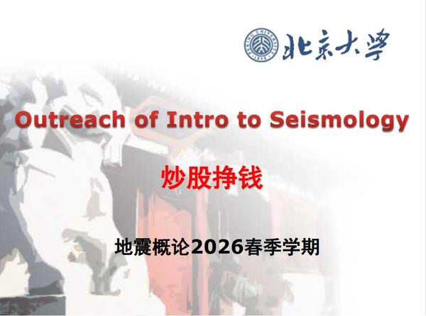

---

## 董宇辉英语学习全套

[2026-09-14 19:43] 来自：Fang的资源分享群

名称：董宇辉英语学习全套（初中提前学）

围绕初中英语基础与提前学习进行系统整理，涵盖词汇积累、语法入门、阅读理解、听力训练和学习方法等内容，帮助学生提前熟悉初中英语知识体系，适合小学生高年级及英语基础提升阶段的学习者参考使用。

迅雷网盘：https://pan.xunlei.com/s/VP1UigokTGqqPvrYaPmL8AQpA1?pwd=7fs7

#英语学习 #初中英语 #提前学习 #英语启蒙 #学习方法

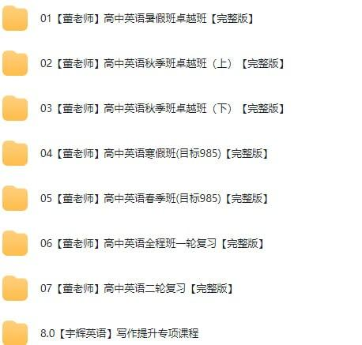

---

## AI聊天软件资源包

[2026-09-14 19:36] 来自：Fang的资源分享群

名称：AI聊天软件资源包

围绕AI聊天软件及相关工具进行整理，汇集多种实用的AI对话、写作、翻译、学习和办公辅助资源，帮助用户快速了解不同工具的功能特点与使用场景，适合想提升效率、探索AI应用的新手用户。

迅雷网盘：https://pan.xunlei.com/s/VP1Ugx4PGt8JP3j9kYtGkeKLA1?pwd=94qj

#AI聊天软件 #AI工具 #资源包 #人工智能 #效率工具

---

## 呱精选内容大合集

[2026-09-14 19:35] 来自：Fang的资源分享群

名称：呱🍉精选内容大合集（持续更新）

围绕呱🍉相关内容进行整理汇总，提供持续更新的精选资源与热门内容，方便用户快速浏览、查找和收藏，适合关注该主题、希望获取集中内容的人群。

迅雷网盘：https://pan.xunlei.com/s/VP1UgkZCDjqBzovV1xtP-W7CA1?pwd=umzd

#呱🍉合集 #精选内容 #热门分享 #持续更新 #资源整理

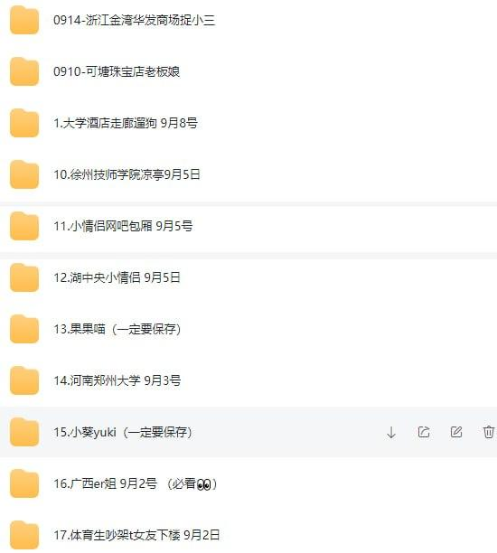

---

## 情感沟通与高情商恋爱全系列教程

[2026-09-14 19:34] 来自：Fang的资源分享群

名称：情感沟通与高情商恋爱全系列教程

围绕情感沟通、个人魅力提升和高情商恋爱展开系统讲解，涵盖聊天技巧、关系建立、约会相处、情绪管理和边界感培养等内容，帮助想提升沟通能力和亲密关系质量的人掌握健康、平等、尊重的相处方法。

迅雷网盘：https://pan.xunlei.com/s/VP1UgZbVYI_A8CNcnpTV1AVvA1?pwd=ima2

#情感沟通 #高情商恋爱 #聊天技巧 #约会相处 #个人成长

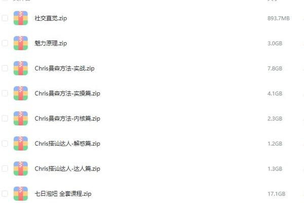

---

## 公众号流量主细分赛道

[2026-09-14 19:29] 来自：Fang的资源分享群

名称：公众号流量主细分赛道 10天收益1652 新手可以复制 详细拆解

围绕公众号流量主细分赛道，做新手可复制的详细拆解，说明操作流程、适用场景和常见思路，适合想尝试该方向并参考执行的人。

夸克网盘：https://pan.quark.cn/s/d2b2740e8a43

#公众号流量主 #细分赛道 #新手教程 #项目拆解 #副业项目

---

## 复旦大学卢向华教授著作AI革命人机融合共生的五大法则pdf

[2026-09-14 16:23] 来自：综合网盘资源频道

名称：复旦大学卢向华教授著作，AI革命：人机融合共生的五大法则【pdf】

描述：聚焦AI与人类协同创新。基于信息系统等理论，提出人机融合共生五大法则：优化AI交互、管理用户协作、增强互补动态、适配组织管理及保障社会公平。旨在建立互信协同系统，强调技术中保持人类主体地位，实现和谐共生，帮助读者适应智能时代。

夸克网盘：https://pan.quark.cn/s/3d071cc2cbaa

📁 大小：21.5MB

🏷 标签：#书籍 #AI革命 #人机融合共生的五大法则 #pdf #人工智能 #管理学 #社会学 #复旦大学卢向华教授著作 #quark

---

## 渤海小吏B站充电专属视频合集

[2026-09-14 15:01] 来自：综合网盘资源频道

名称：渤海小吏《B站充电专属视频合集》 (更至20260912)

描述：渤海小吏以其通俗化的语言风格和说书式历史解析见长，通过战争视角切入历史脉络，拓展人文领域的多维表达形式。

夸克网盘：https://pan.quark.cn/s/e4443c6ed722

百度网盘：https://pan.baidu.com/s/1lnfdeyB2HptCm2zpR2upuA?pwd=1111

📁 大小：N/A

🏷 标签：#历史 #学习 #渤海小吏 #B站充电专属视频合集 #quark #baidu

---

## 人性实验改变社会心理学的28项研究

[2026-09-14 15:00] 来自：综合网盘资源频道

名称：《人性实验_改变社会心理学的28项研究(第2版)》[PDF+AZW3+EPUB+MOBI]

描述：本书展示了28个有趣的社会心理学实验，比如从众心理、服从权威、社会歧视、反社会行为等等都会在这本书里或多或少的找到答案，对于普通读者洞察人性、反思自我、思考社会现象都能提到醍醐灌顶之效。

夸克网盘：https://pan.quark.cn/s/8d08ecee22a8

📁 大小：N

🏷 标签：#弗雷 #人性实验 #改变社会心理学的28项研究 #PDF #AZW3 #EPUB #quark

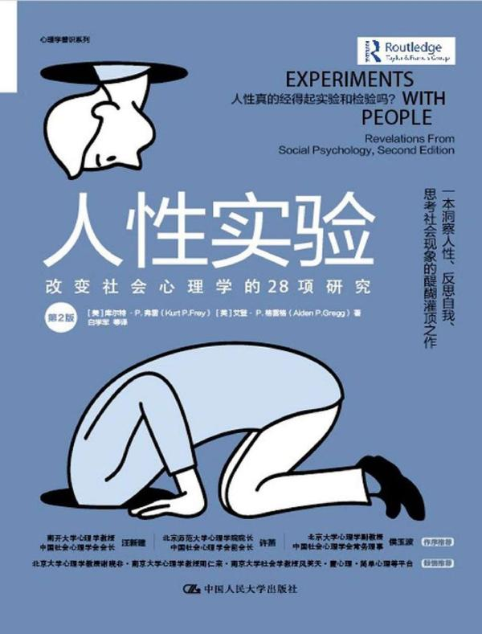

---

## 樊登读书

[2026-09-14 14:46] 来自：综合网盘资源频道

名称：《樊登读书 (帆书) 》合集 (更至20260912)

描述：帆书引领了“听书”的新阅读模式，通过精选好书与深入浅出的解读方式，为书友带来实用新知与智慧启发。

夸克网盘：https://pan.quark.cn/s/8f8edf61d830

百度网盘：https://pan.baidu.com/s/1xvDwu1p4CMLr2Y2rfDbpaA?pwd=1111

📁 大小：N/A

🏷 标签：#阅读 #学习 #课程 #樊登读书 #帆书 #合集 #quark #baidu

---

## 系统重装神器无需U盘小白傻瓜式操作

[2026-09-14 06:16] 来自：精选网盘资源

名称：系统重装神器，无需U盘+小白傻瓜式操作

一款免费的Windows系统重装工具，无需U盘即可一键完成系统重装、备份与还原。傻瓜式操作界面，小白也能轻松上手，省去传统装系统的繁琐步骤和费用，适合需要快速重装或备份系统的用户。

夸克网盘：https://pan.quark.cn/s/8639f72aefe0

#EasyRC #一键系统重装 #无需U盘 #系统备份还原

---

## 私域社群运营实战课搭建高转化的专属流量池

[2026-09-14 06:13] 来自：精选网盘资源

名称：私域社群运营实战课，搭建高转化的专属流量池

一套系统化私域社群运营实战课程，从零起步讲解社群定位、规则设计、引流路径、内容规划、互动激活、分层管理与成交转化全流程。帮助降低获客成本，实现从流量到留量再到销量的完整闭环。

百度网盘：https://pan.baidu.com/s/1LnQVc_zMgMeo83XCd6-8Kw?pwd=msc7

#私域社群 #社群运营 #高转化流量 #引流路径

---

## 阳台种植全教程家庭园艺从零打造小菜园

[2026-09-14 06:10] 来自：精选网盘资源

名称：阳台种植全教程，家庭园艺从零打造小菜园

一套专为城市家庭设计的阳台种植系统课程，课程结合不同阳台条件给出适配方案，手把手教你用有限空间种出番茄、生菜、草莓、香草及观叶植物，享受从种子到餐桌的乐趣，打造属于自己的阳台小花园。

夸克网盘：https://pan.quark.cn/s/dff7f825cde6

#阳台种植课程 #阳台小花园 #家庭园艺 #绿植盆栽

---

## 千金美容方古法养颜美容大全

[2026-09-14 06:06] 来自：精选网盘资源

名称：《千金美容方》：古法养颜美容大全

为什么古人没有大牌护肤品，却依然肤若凝脂、发如乌木？答案就藏在流传千年的美容方里。系统整理了古代经典的美容养颜方剂与实用方法，从洗脸洁面、美白祛斑到养发固齿、香身润肤，全部用天然材料、古法调配。

夸克网盘：https://pan.quark.cn/s/8ae6e5e47052

#千金美容方 #古方养颜 #中医美容 #护肤美白 #祛斑养发

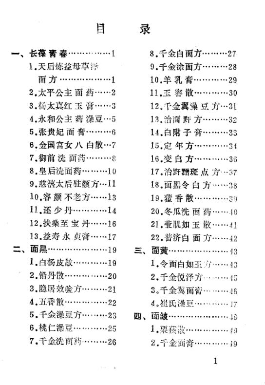

---

## 在世界上找到你的位置PDFAZW3EPUBMOBI

[2026-09-13 22:37] 来自：综合网盘资源频道

名称：《在世界上找到你的位置》[PDF+AZW3+EPUB+MOBI]

描述：每个人都会经历18岁，但不是每个人都会在18岁时按时成年。书主题涵盖了成年过程中的思维模式、品行培养、人生定位、职业选择、社交规范、健康管理、用钱之道、逆商提升、责任激发9大方面，为年轻人提供一张迈向成年的路线图，以“成人思维”应对世界，在成年生活中闪闪发光。

夸克网盘：https://pan.quark.cn/s/9ea1dec21a02

📁 大小：N

🏷 标签：#朱莉 #利思科特 #在世界上找到你的位置 #PDF #AZW3 #EPUB #MOBI #quark

---

## 2027版

[2026-09-13 21:58] 来自：综合网盘资源频道

名称：2027版 理想树《高考必刷题合订本》9科全 (高考合订版本 + 必修课本版本)

描述：2027 版《高考必刷题合订本》适配新高考一轮复习，搭载八刷分层体系，精选 2026 高考真题与各地名校模考题。一书三册，含主练习册、答案解析册、《狂 K 重难点》小册子，难度由基础、易错逐步进阶至综合压轴。贴合新高考命题风向，覆盖全部核心考点，可按需选择薄弱板块专项突破。适合中等及以上水平考生，一轮系统刷题、攻克重难点，稳步冲刺高分。

夸克网盘：https://pan.quark.cn/s/88815eb68f75

📁 大小：9GB

🏷 标签：#2027高考 #学习资料 #高三 #一轮复习 #高考 #理想树 #高考必刷题 #2027版 #高考必刷题合订本 #9科全 #高考合订版本 #必修课本版本 #quark

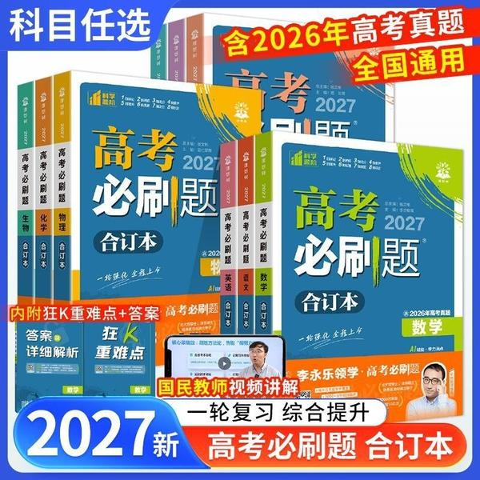

---

## 2027版天利38套常考基础题

[2026-09-13 21:58] 来自：综合网盘资源频道

名称：2027版《天利38套•常考基础题》 8科(语数英物化生政史)

描述：2027 版天利 38 套常考基础题，8 科全套，适配新高考一轮复习。精选真题与优质模拟题，按考点专题划分，聚焦高考基础、中档题型，避开偏难怪。适合基础薄弱、查漏补缺，或是巩固基础分的考生。配套详尽解析，梳理解题思路、标注易错点，做完一题吃透一类。夯实知识底盘，稳抓高考大部分基础分值，艺考生、一轮打底刷题首选

夸克网盘：https://pan.quark.cn/s/8505f11b5041

📁 大小：3.8G

🏷 标签：#高考 #高中 #高三 #学习资料 #一轮复习 #天利38套 #常考基础题 #2027版 #8科 #语数英物化生政史 #quark

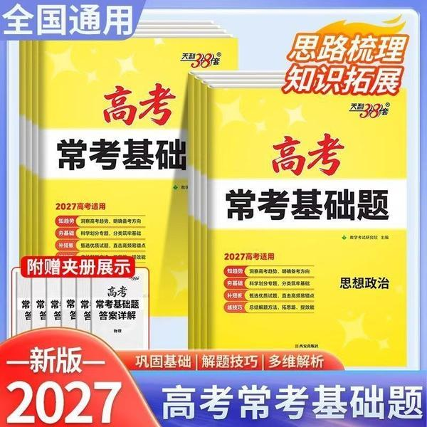

---

## 章鱼学会冷静PDFAZW3EPUBMOBI

[2026-09-13 15:31] 来自：综合网盘资源频道

名称：《章鱼学会冷静》[PDF+AZW3+EPUB+MOBI]

描述：书中最令我触动的观点是：两个人分开是因为在一起时双方都没有办法继续成长。如果你也和我一样，总在亲密关系里焦虑难安，让爱情变得格外艰难，那这本书我想推荐给每一个焦虑型依恋的你。

夸克网盘：https://pan.quark.cn/s/7c968af246e5

📁 大小：N

🏷 标签：#杰西卡 #鲍姆 #章鱼学会冷静 #PDF #AZW3 #EPUB #MOBI #quark

---

## 开源全能下载器多平台通用无广告不限速

[2026-09-13 06:55] 来自：精选网盘资源

名称：开源全能下载器，多平台通用+无广告不限速

一款开源全能下载器，支持多平台使用，界面简洁无广告，不限速，兼容HTTP、BT、磁力等多协议下载，多线程加速性能强劲。完全免费，适合需要高速稳定下载工具的用户，堪称全能下载利器。

夸克网盘：https://pan.quark.cn/s/0f54bfa0e7eb

#开源下载器 #全能下载工具 #免费下载神器 #高速下载

---

## AI包装设计商业案例用AI生成可量产包装方案

[2026-09-13 06:53] 来自：精选网盘资源

名称：AI包装设计商业案例，用AI生成可量产包装方案

一套聚焦AI包装设计商业落地的实战课程，无需设计基础，帮助设计师、电商运营与创业者在压缩成本的同时快速产出可量产、有辨识度的包装方案，提升品牌视觉竞争力。

百度网盘：https://pan.baidu.com/s/1huJ3wLnT4K4r3dip7izv5Q?pwd=krgu

#AI包装设计 #品牌视觉 #效果图渲染 #包装方案

---

## 国宝级大厨上百道中西菜品拆解从家常到宴客一次精通

[2026-09-13 06:51] 来自：精选网盘资源

名称：国宝级大厨上百道中西菜品拆解，从家常到宴客一次精通

一套由国宝级大厨隋卞亲自示范的烹饪课程，精选100道中西经典菜品，从选材、刀工、火候到调味摆盘，逐步骤慢动作拆解，毫无保留地展示后厨核心技法，每道菜配有食材清单、关键要点提示与常见失败原因分析。

夸克网盘：https://pan.quark.cn/s/d53c6e62e25b

#国宝级大厨 #家常快炒 #炖煮硬菜 #西式煎烤 #厨房必备

---

## 农家日用大全解决农家日常难题的实用宝典

[2026-09-13 06:46] 来自：精选网盘资源

名称：《农家日用大全》：解决农家日常难题的实用宝典

这本书就像一本农村生活的“万能工具箱”，把农事生产、医疗保健、饮食烹饪、婚丧嫁娶、节气习俗等日常难题全收进去了。语言通俗、方法实用，老一辈人翻烂了都不舍得扔。想找回那种“一本在手、万事不求人”的踏实感吗？此书就是农家必备的过日子指南。

夸克网盘：https://pan.quark.cn/s/75de2eadb5f9

#日用大全 #生活百科 #实用工具书 #农家必备 #过日子指南

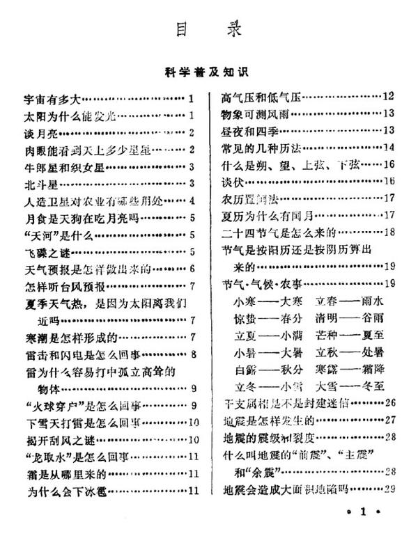

---

## Java架构师VIP第03期

[2026-09-13 00:33] 来自：综合网盘资源频道

名称：【鲁班学院】Java架构师VIP第03期

描述：本套课程来自鲁班学院：Java架构师VIP课程，课程官方售价6380元，且销售评价较高，课程是由多名业界大牛主讲。

夸克网盘：https://pan.quark.cn/s/437752552895

📁 大小：NG

🏷 标签：#学习 #知识 #课程 #资源 #鲁班学院 #Java架构师VIP #quark #ali

---

## 中国风水文化100集纪录片完整版传统智慧与现代应用

[2026-09-12 21:33] 来自：Fang的资源分享群

名称：《中国风水文化》100集纪录片完整版，传统智慧与现代应用

这部100集纪录片系统讲解中国风水文化的历史渊源、核心理论及现代实践应用，涵盖传统智慧与现代生活结合，适合传统文化爱好者深入参考学习。

夸克网盘：https://pan.quark.cn/s/a8d04a35afdf

#风水文化 #纪录片 #传统文化 #现代应用 #智慧

---

## 社会心理学

[2026-09-12 21:33] 来自：Fang的资源分享群

名称：《社会心理学》

本书系统介绍社会心理学核心理论，涵盖社会认知、社会影响与人际关系，适合心理学学习者及研究者，用于理解个体与社会环境的相互作用。

夸克网盘：https://pan.quark.cn/s/1ea1c168cdc2

#社会心理学 #心理学 #人际关系 #社会认知 #教材

---

## 某稀有珍藏道家资料合集522本

[2026-09-12 21:32] 来自：Fang的资源分享群

名称：某稀有珍藏道家资料合集522本

道家经典与修炼资料合集，共522本，涵盖经书、科仪、丹道、符箓等体系，系统整理，适合学术研究或实修参考。

夸克网盘：https://pan.quark.cn/s/a11ad68c885c

#道家 #资料合集 #修炼 #丹道 #经典

---

## 16本最全赚钱投资指南书籍推荐

[2026-09-12 21:32] 来自：Fang的资源分享群

名称：16本最全赚钱投资指南书籍推荐（含初级、进阶、高阶）

涵盖从入门到精通的16本投资书籍，按初级、进阶、高阶分级推荐，帮助读者系统学习理财知识，逐步提升投资认知与实操能力。

夸克网盘：https://pan.quark.cn/s/c667a017e0f7

#投资书籍 #理财入门 #进阶指南 #书单推荐

---

## 2026新初一至初三暑假自学包语数英讲义分层训练假期预习新学期内容

[2026-09-12 21:32] 来自：Fang的资源分享群

名称：2026新初一至初三暑假自学包：语数英讲义+分层训练，假期预习新学期内容

本资源包含新初一至初三语数英三科讲义及分层训练，适用于暑假自主预习，帮助学生提前掌握新学期知识要点并强化练习。

夸克网盘：https://pan.quark.cn/s/bd7bc1a1016e

#新初一至初三 #暑假自学 #语数英讲义 #分层训练

---

## AI小说搞钱项目从AI批量生成到多渠道变现

[2026-09-12 21:31] 来自：Fang的资源分享群

名称：AI小说搞钱项目，从AI批量生成到多渠道变现

围绕AI小说批量生成与多渠道变现展开的项目拆解，讲解从内容生产到渠道分发的操作流程，适合想用AI做小说副业的人参考，帮助理清执行思路。

夸克网盘：https://pan.quark.cn/s/616381911f2a

#AI小说 #批量生成 #多渠道变现 #副业项目 #内容变现

---

## 公众号流量主细分赛道

[2026-09-12 21:29] 来自：Fang的资源分享群

名称：公众号流量主细分赛道 10天收益1652 新手可以复制 详细拆解

围绕公众号流量主细分赛道展开详细拆解，说明新手可复制的操作流程与思路，适合想了解该玩法的人群参考，帮助梳理起步方向。

夸克网盘：https://pan.quark.cn/s/d2b2740e8a43

#公众号流量主 #细分赛道 #新手入门 #流量主拆解 #公众号运营

---

## 51CTO

[2026-09-12 17:42] 来自：综合网盘资源频道

名称：51CTO - Java架构师之源码分析专题

描述：揭秘Java核心框架，成就架构师之路

夸克网盘：https://pan.quark.cn/s/cc198ff982df

夸克网盘：https://pan.quark.cn/s/d8ee272506ee 来自：综合网盘资源频道 [2026-09-12 16:56] 名称：51CTO - C++ 设计模式理论与实战大全

📁 大小：NG

🏷 标签：#学习 #知识 #课程 #资源 #Java架构师之源码分析专题 #quark #ali

---

## 时间人格为什么你的时间管理没有用PDFAZW3EPUBMOBI

[2026-09-12 14:48] 来自：综合网盘资源频道

名称：《时间人格_为什么你的时间管理没有用》[PDF+AZW3+EPUB+MOBI]

描述：为什么试过那么多时间管理技巧，你依然感觉时间不够用？为什么你总是很难把更多时间用在更重要的事情上？如何面对每天24小时这一不可改变的时间壁垒？本书适合对现有时间管理技巧感到不满意的人，解答了许多关于时间管理的困惑。

夸克网盘：https://pan.quark.cn/s/09bd5f1214f4

📁 大小：N

🏷 标签：#铃木祐 #时间人格 #为什么你的时间管理没有用 #PDF #AZW3 #EPUB #quark

---

## AI一键打造高完播率的安睡疗愈带货视频实操流程助力书品带货

[2026-09-12 07:05] 来自：综合网盘资源频道

名称：AI一键打造高完播率的安睡疗愈带货视频实操流程，助力书品带货

描述：AI一键生成安睡疗愈视频是当前书品带货(如心理学、睡眠管理、冥想、小说等书籍)的流量密码。这类视频制作成本低、受众广，且因为具有高完播率的天然属性，极易获得平台算法推荐。

夸克网盘：https://pan.quark.cn/s/1e695aba807e

📁 大小：1.2GB

🏷 标签：#副业 #教程 #ai #安睡疗愈带货流程 #书品带货 #助力书品带货 #quark

---

## 开源桌面远程控制工具全平台免费使用

[2026-09-12 06:44] 来自：精选网盘资源

名称：开源桌面远程控制工具，全平台免费使用

一款开源免费的桌面远程控制工具，可轻松实现跨设备远程桌面连接、文件传输、远程协助与屏幕共享。连接稳定、延迟低，代码开源透明，个人和商业均可免费使用，适合远程办公、技术支持和跨设备协作场景。

夸克网盘：https://pan.quark.cn/s/a5153959a04d

#开源远程控制 #文件传输 #远程桌面工具 #远程办公

---

## AIGC软件基础班手把手入门AI出图核心技能

[2026-09-12 06:42] 来自：精选网盘资源

名称：AIGC软件基础班，手把手入门AI出图核心技能

一套专为零基础学员设计的AIGC软件入门课程，系统讲解主流AI绘画与设计工具的基础操作与出图逻辑。帮助学员快速掌握AI出图核心技能，并能灵活运用于海报设计、插画创作、电商主图及短视频素材制作等场景。

百度网盘：https://pan.baidu.com/s/1LjSIIQtdkblBr3NAsFrUeA?pwd=vgti

#AIGC软件 #ComfyUI操作 #AI出图 #海报插画

---

## 100多套水彩手绘风格PPT模板多场景一键替换即用

[2026-09-12 06:40] 来自：精选网盘资源

名称：100多套水彩手绘风格PPT模板，多场景一键替换即用

一套水彩手绘风格PPT模板合集，内含100多套精心设计的可编辑模板，模板以柔和的水彩笔触、手绘插画与清新配色为特色，文艺感与专业度兼备，所有文字、图片与图表均可自由替换，无需设计基础即可快速产出高颜值演示文稿。

夸克网盘：https://pan.quark.cn/s/b466aae020c1

#手绘PPT模板 #PPT模板合集 #演示文稿 #手绘插画

---

## 历代权谋通鉴读懂五千年权力游戏的底层逻辑

[2026-09-12 06:35] 来自：精选网盘资源

名称：《历代权谋通鉴》：读懂五千年权力游戏的底层逻辑

为什么功臣总被杀？为什么权臣总被清算？为什么有些皇帝看似无为却能稳坐江山？这本书把中国历代权谋案例串成一条线，它不是教你使坏，而是让你看懂五千年权力游戏的底层逻辑——看懂了，你就能在现实博弈中多一分清醒、少一分天真。

夸克网盘：https://pan.quark.cn/s/5a6d538b09a4

#历代权谋通鉴 #中国权谋 #权力制衡 #以史为鉴 #谋略宝典

---

## 不原谅也没关系复杂性创伤后压力综合征自我疗愈圣经PDFAZW3EPUBMOBI

[2026-09-11 22:28] 来自：综合网盘资源频道

名称：《不原谅也没关系_复杂性创伤后压力综合征自我疗愈圣经》[PDF+AZW3+EPUB+MOBI]

描述：一本值得每个家庭阅读的书籍，家庭作为社会的最小单位，本应成为个体最后的港湾，但在很多时刻，无论是家长还是儿童都在这个本应温馨的地方受到重重伤害。希望这本书有帮到你与那些伤害握手言和，希望你永远自信、勇敢、阔步向前迎接属于你的阳光。

夸克网盘：https://pan.quark.cn/s/1dda75ffc25e

📁 大小：N

🏷 标签：#皮特 #沃克 #不原谅也没关系 #PDF #AZW3 #EPUB #MOBI #quark

---

## B站

[2026-09-11 18:09] 来自：综合网盘资源频道

名称：B站 - 马勇教授：极简中国史

描述：全球史观重构中国历史叙事，首次以横向共时的全球视角回望中国历史演进。

夸克网盘：https://pan.quark.cn/s/9f7174740df2

夸克网盘：https://pan.quark.cn/s/c036d0520f73 来自：综合网盘资源频道 [2026-09-11 18:08] 名称：B站 - PPT大神上分攻略

📁 大小：NG

🏷 标签：#学习 #知识 #课程 #资源 #B站 #马勇教授 #极简中国史 #quark #ali

