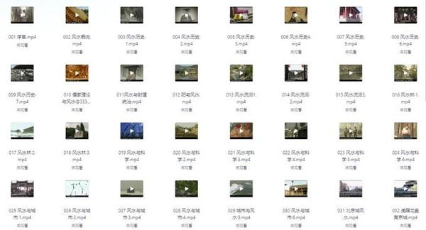
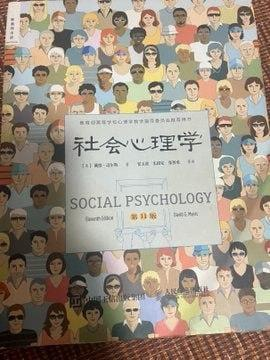
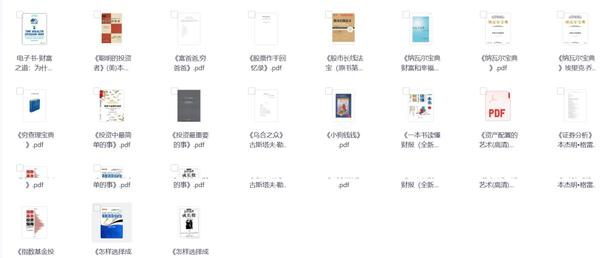
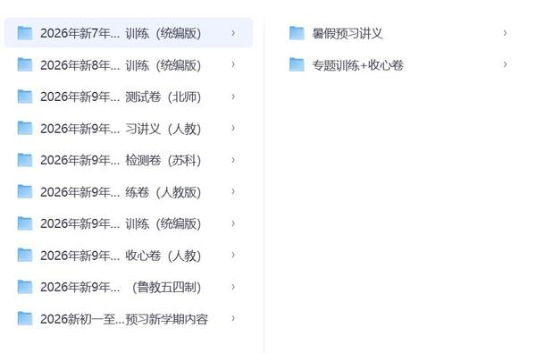
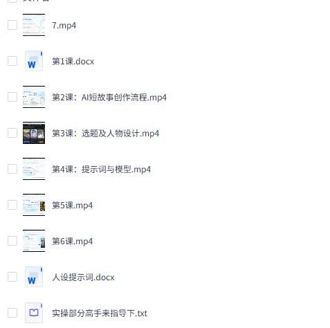
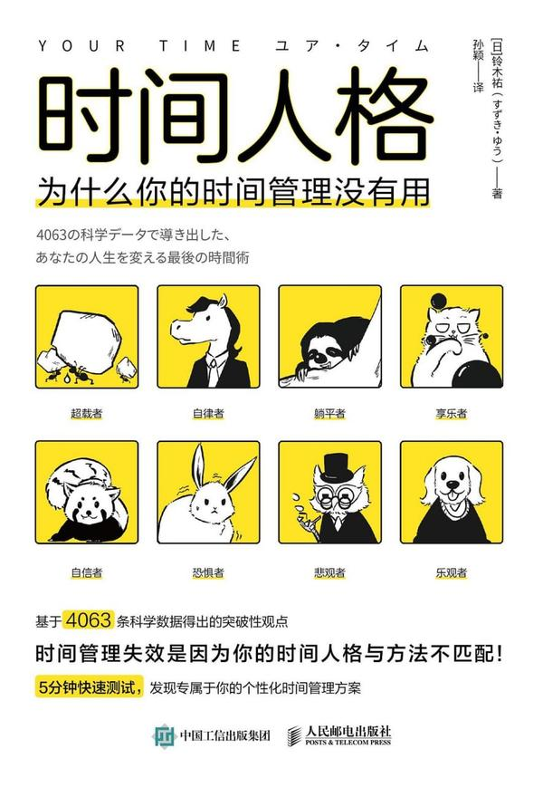
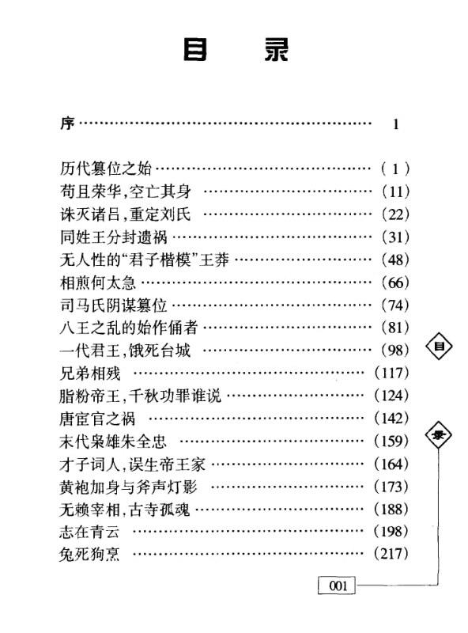
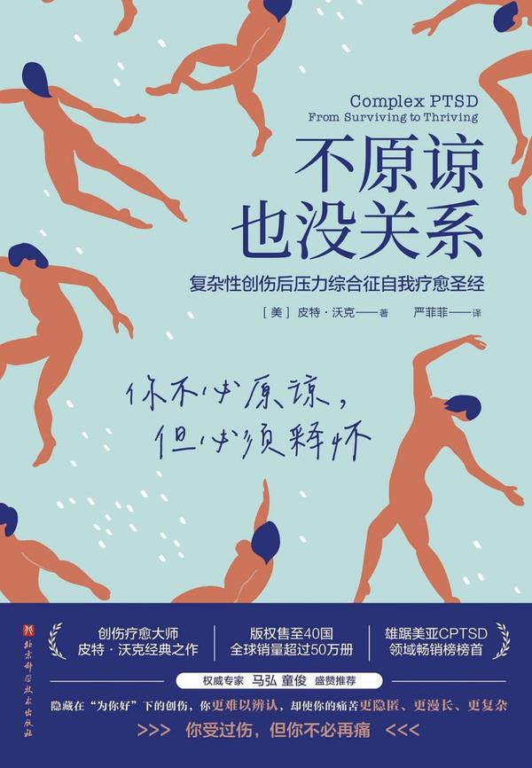

## 中国风水文化100集纪录片完整版传统智慧与现代应用

[2026-09-12 21:33] 来自：Fang的资源分享群

名称：《中国风水文化》100集纪录片完整版，传统智慧与现代应用

这部100集纪录片系统讲解中国风水文化的历史渊源、核心理论及现代实践应用，涵盖传统智慧与现代生活结合，适合传统文化爱好者深入参考学习。

夸克网盘：https://pan.quark.cn/s/a8d04a35afdf

#风水文化 #纪录片 #传统文化 #现代应用 #智慧

---

## 社会心理学

[2026-09-12 21:33] 来自：Fang的资源分享群

名称：《社会心理学》

本书系统介绍社会心理学核心理论，涵盖社会认知、社会影响与人际关系，适合心理学学习者及研究者，用于理解个体与社会环境的相互作用。

夸克网盘：https://pan.quark.cn/s/1ea1c168cdc2

#社会心理学 #心理学 #人际关系 #社会认知 #教材

---

## 某稀有珍藏道家资料合集522本

[2026-09-12 21:32] 来自：Fang的资源分享群

名称：某稀有珍藏道家资料合集522本

道家经典与修炼资料合集，共522本，涵盖经书、科仪、丹道、符箓等体系，系统整理，适合学术研究或实修参考。

夸克网盘：https://pan.quark.cn/s/a11ad68c885c

#道家 #资料合集 #修炼 #丹道 #经典

---

## 16本最全赚钱投资指南书籍推荐

[2026-09-12 21:32] 来自：Fang的资源分享群

名称：16本最全赚钱投资指南书籍推荐（含初级、进阶、高阶）

涵盖从入门到精通的16本投资书籍，按初级、进阶、高阶分级推荐，帮助读者系统学习理财知识，逐步提升投资认知与实操能力。

夸克网盘：https://pan.quark.cn/s/c667a017e0f7

#投资书籍 #理财入门 #进阶指南 #书单推荐

---

## 2026新初一至初三暑假自学包语数英讲义分层训练假期预习新学期内容

[2026-09-12 21:32] 来自：Fang的资源分享群

名称：2026新初一至初三暑假自学包：语数英讲义+分层训练，假期预习新学期内容

本资源包含新初一至初三语数英三科讲义及分层训练，适用于暑假自主预习，帮助学生提前掌握新学期知识要点并强化练习。

夸克网盘：https://pan.quark.cn/s/bd7bc1a1016e

#新初一至初三 #暑假自学 #语数英讲义 #分层训练

---

## AI小说搞钱项目从AI批量生成到多渠道变现

[2026-09-12 21:31] 来自：Fang的资源分享群

名称：AI小说搞钱项目，从AI批量生成到多渠道变现

围绕AI小说批量生成与多渠道变现展开的项目拆解，讲解从内容生产到渠道分发的操作流程，适合想用AI做小说副业的人参考，帮助理清执行思路。

夸克网盘：https://pan.quark.cn/s/616381911f2a

#AI小说 #批量生成 #多渠道变现 #副业项目 #内容变现

---

## 公众号流量主细分赛道

[2026-09-12 21:29] 来自：Fang的资源分享群

名称：公众号流量主细分赛道 10天收益1652 新手可以复制 详细拆解

围绕公众号流量主细分赛道展开详细拆解，说明新手可复制的操作流程与思路，适合想了解该玩法的人群参考，帮助梳理起步方向。

夸克网盘：https://pan.quark.cn/s/d2b2740e8a43

#公众号流量主 #细分赛道 #新手入门 #流量主拆解 #公众号运营

---

## 51CTO

[2026-09-12 17:42] 来自：综合网盘资源频道

名称：51CTO - Java架构师之源码分析专题

描述：揭秘Java核心框架，成就架构师之路

夸克网盘：https://pan.quark.cn/s/cc198ff982df

夸克网盘：https://pan.quark.cn/s/d8ee272506ee 来自：综合网盘资源频道 [2026-09-12 16:56] 名称：51CTO - C++ 设计模式理论与实战大全

📁 大小：NG

🏷 标签：#学习 #知识 #课程 #资源 #Java架构师之源码分析专题 #quark #ali

---

## 时间人格为什么你的时间管理没有用PDFAZW3EPUBMOBI

[2026-09-12 14:48] 来自：综合网盘资源频道

名称：《时间人格_为什么你的时间管理没有用》[PDF+AZW3+EPUB+MOBI]

描述：为什么试过那么多时间管理技巧，你依然感觉时间不够用？为什么你总是很难把更多时间用在更重要的事情上？如何面对每天24小时这一不可改变的时间壁垒？本书适合对现有时间管理技巧感到不满意的人，解答了许多关于时间管理的困惑。

夸克网盘：https://pan.quark.cn/s/09bd5f1214f4

📁 大小：N

🏷 标签：#铃木祐 #时间人格 #为什么你的时间管理没有用 #PDF #AZW3 #EPUB #quark

---

## AI一键打造高完播率的安睡疗愈带货视频实操流程助力书品带货

[2026-09-12 07:05] 来自：综合网盘资源频道

名称：AI一键打造高完播率的安睡疗愈带货视频实操流程，助力书品带货

描述：AI一键生成安睡疗愈视频是当前书品带货(如心理学、睡眠管理、冥想、小说等书籍)的流量密码。这类视频制作成本低、受众广，且因为具有高完播率的天然属性，极易获得平台算法推荐。

夸克网盘：https://pan.quark.cn/s/1e695aba807e

📁 大小：1.2GB

🏷 标签：#副业 #教程 #ai #安睡疗愈带货流程 #书品带货 #助力书品带货 #quark

---

## 开源桌面远程控制工具全平台免费使用

[2026-09-12 06:44] 来自：精选网盘资源

名称：开源桌面远程控制工具，全平台免费使用

一款开源免费的桌面远程控制工具，可轻松实现跨设备远程桌面连接、文件传输、远程协助与屏幕共享。连接稳定、延迟低，代码开源透明，个人和商业均可免费使用，适合远程办公、技术支持和跨设备协作场景。

夸克网盘：https://pan.quark.cn/s/a5153959a04d

#开源远程控制 #文件传输 #远程桌面工具 #远程办公

---

## AIGC软件基础班手把手入门AI出图核心技能

[2026-09-12 06:42] 来自：精选网盘资源

名称：AIGC软件基础班，手把手入门AI出图核心技能

一套专为零基础学员设计的AIGC软件入门课程，系统讲解主流AI绘画与设计工具的基础操作与出图逻辑。帮助学员快速掌握AI出图核心技能，并能灵活运用于海报设计、插画创作、电商主图及短视频素材制作等场景。

百度网盘：https://pan.baidu.com/s/1LjSIIQtdkblBr3NAsFrUeA?pwd=vgti

#AIGC软件 #ComfyUI操作 #AI出图 #海报插画

---

## 100多套水彩手绘风格PPT模板多场景一键替换即用

[2026-09-12 06:40] 来自：精选网盘资源

名称：100多套水彩手绘风格PPT模板，多场景一键替换即用

一套水彩手绘风格PPT模板合集，内含100多套精心设计的可编辑模板，模板以柔和的水彩笔触、手绘插画与清新配色为特色，文艺感与专业度兼备，所有文字、图片与图表均可自由替换，无需设计基础即可快速产出高颜值演示文稿。

夸克网盘：https://pan.quark.cn/s/b466aae020c1

#手绘PPT模板 #PPT模板合集 #演示文稿 #手绘插画

---

## 历代权谋通鉴读懂五千年权力游戏的底层逻辑

[2026-09-12 06:35] 来自：精选网盘资源

名称：《历代权谋通鉴》：读懂五千年权力游戏的底层逻辑

为什么功臣总被杀？为什么权臣总被清算？为什么有些皇帝看似无为却能稳坐江山？这本书把中国历代权谋案例串成一条线，它不是教你使坏，而是让你看懂五千年权力游戏的底层逻辑——看懂了，你就能在现实博弈中多一分清醒、少一分天真。

夸克网盘：https://pan.quark.cn/s/5a6d538b09a4

#历代权谋通鉴 #中国权谋 #权力制衡 #以史为鉴 #谋略宝典

---

## 不原谅也没关系复杂性创伤后压力综合征自我疗愈圣经PDFAZW3EPUBMOBI

[2026-09-11 22:28] 来自：综合网盘资源频道

名称：《不原谅也没关系_复杂性创伤后压力综合征自我疗愈圣经》[PDF+AZW3+EPUB+MOBI]

描述：一本值得每个家庭阅读的书籍，家庭作为社会的最小单位，本应成为个体最后的港湾，但在很多时刻，无论是家长还是儿童都在这个本应温馨的地方受到重重伤害。希望这本书有帮到你与那些伤害握手言和，希望你永远自信、勇敢、阔步向前迎接属于你的阳光。

夸克网盘：https://pan.quark.cn/s/1dda75ffc25e

📁 大小：N

🏷 标签：#皮特 #沃克 #不原谅也没关系 #PDF #AZW3 #EPUB #MOBI #quark

---

## B站

[2026-09-11 18:09] 来自：综合网盘资源频道

名称：B站 - 马勇教授：极简中国史

描述：全球史观重构中国历史叙事，首次以横向共时的全球视角回望中国历史演进。

夸克网盘：https://pan.quark.cn/s/9f7174740df2

夸克网盘：https://pan.quark.cn/s/c036d0520f73 来自：综合网盘资源频道 [2026-09-11 18:08] 名称：B站 - PPT大神上分攻略

📁 大小：NG

🏷 标签：#学习 #知识 #课程 #资源 #B站 #马勇教授 #极简中国史 #quark #ali

