## 我妈走后我终于成了一个正常人PDFAZW3EPUBMOBI

[2026-09-18 14:26] 来自：综合网盘资源频道

名称：《我妈走后，我终于成了一个正常人》[PDF+AZW3+EPUB+MOBI]

描述：怎样才能不加矫饰地书写自己原生家庭中的虐待、冷暴力与代际创伤？作者的答案是：等我妈死了就好了。刷新三观的好莱坞童星秘史大揭秘，体会明星背后不为人知的逼仄困境。大胆真实又无比残酷的黑色逃妈史，剥开母女之“爱”的糖衣！

夸克网盘：https://pan.quark.cn/s/8d316d941813

📁 大小：N

🏷 标签：#詹妮特 #麦柯迪 #我妈走后 #我终于成了一个正常人 #PDF #AZW3 #EPUB #quark

---

## 副业手作手链编织入门中国结项链手链手工DIY教程一学就会

[2026-09-18 14:15] 来自：综合网盘资源频道

名称：副业手作：手链编织入门，中国结项链手链手工DIY教程，一学就会

描述：教程涵盖中国结基础结法、项链吊坠编织、手链编法、平安扣挂绳、串珠搭配及创意饰品制作等内容。课程逐步进阶到复杂组合与收尾技巧，每一步配有慢动作演示与图解，适合手工爱好者、亲子互动及想尝试副业手作的零基础学员。

夸克网盘：https://pan.quark.cn/s/f857901065da

📁 大小：20.8GB

🏷 标签：#教程 #编绳手工 #中国结 #传统绳艺 #编织视频 #编绳DIY教程 #副业手作 #手链编织入门 #中国结项链手链手工DIY教程 #一学就会 #quark

---

## 最高自主学习法

[2026-09-18 14:15] 来自：综合网盘资源频道

名称：最高自主学习法(Peter Hollins).pdf，一生受用，快速提取资讯精华

描述：无论是学生还是职场工作者， 每天无不被海量资讯给淹没， 透过本书四大部分，引领读者发展出最适合自己的自学计画， 用最快、最有效的方式达到学习目的

夸克网盘：https://pan.quark.cn/s/0b1d5be12256

📁 大小：22.2M

🏷 标签：#书籍 #最高自主学习法 #电子书 #pdf #一生受用 #快速提取资讯精华 #quark

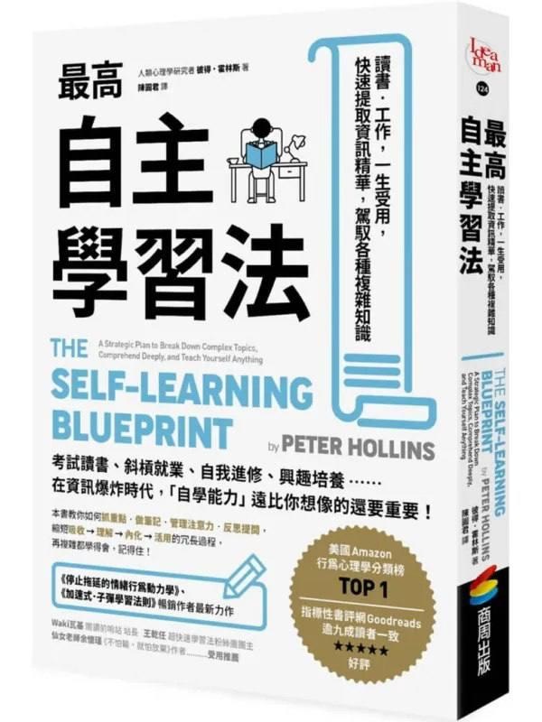

---

## 两套抖音封禁账号注销与自助解封实操技术

[2026-09-18 11:00] 来自：综合网盘资源频道

名称：两套抖音封禁账号注销与自助解封实操技术。

描述：借助工具随变登录被封禁账号完成注销的操作流程，同时分享利用收藏视频触发自助解封弹窗的实操办法。建议使用者自行实操测试。课程适合遇到账号封禁，想要处理账号状态的学习者，帮助了解封禁账号的注销路径与自助解封的触发思路

百度网盘：https://pan.baidu.com/s/18spUcM4Dr2PdaGX8HTXBpQ?pwd=ee1h

📁 大小：208M

🏷 标签：#教程 #抖音账号注销 #自助解封 #实操 #技术 #bai #du #baidu

---

## 云南罐罐米线配方教学正宗汤底秘制酱料配菜全流程

[2026-09-18 07:01] 来自：精选网盘资源

名称：云南罐罐米线配方教学，正宗汤底+秘制酱料+配菜全流程

一套云南罐罐米线全套技术配方教程，详细讲解骨汤熬制、酱料炒制、米线处理、配菜搭配与罐罐出品流程。零基础可学，适合云南小吃爱好者、夜市摆摊创业者及米线店增项参考，帮助快速复刻地道云南风味，稳定出品高复购的罐罐米线。

百度网盘：https://pan.baidu.com/s/1vfqRXhk3SiDWbEKH6x35KA?pwd=3rmu

#云南罐罐米线 #罐罐米线配方 #正宗汤底 #秘制酱料

---

## 水果茶爆款配方教学手把手教你做出高颜值高复购饮品

[2026-09-18 07:00] 来自：精选网盘资源

名称：水果茶爆款配方教学，手把手教你做出高颜值高复购饮品

一套系统化的水果茶饮品制作课程，详细拆解糖度调节、冰块控制、分层效果与出杯速度，并附成本核算与外卖包装建议，适合奶茶店创业者、饮品爱好者及想在家复刻网红同款的用户学习，帮助快速掌握稳定好喝的水果茶制作全流程。

百度网盘：https://pan.baidu.com/s/1l0eNV72cBP0k7q9W_rzvYA?pwd=iz4b

#水果茶配方 #水果茶教学 #网红同款 #奶茶店创业

---

## 家装避坑装修全流程预算表施工工艺验收标准

[2026-09-18 06:51] 来自：精选网盘资源

名称：家装避坑装修全流程，预算表+施工工艺+验收标准

一套覆盖家庭装修全周期的实用资料合集，内容从前期规划、预算控制、材料选购，到水电泥木油施工规范与竣工验收要点，逐项拆解常见陷阱与应对方法。图文结合、表格清晰，适合首次装修的业主、准备翻新的家庭及家装从业者参考，帮助少花冤枉钱、少走弯路，装出满意又省心的家。

百度网盘：https://pan.baidu.com/s/1kqidOhhGSkf1EiVzyudyqw?pwd=af8f

#家装避坑 #装修全流程 #前期规划 #预算控制 #装修宝典

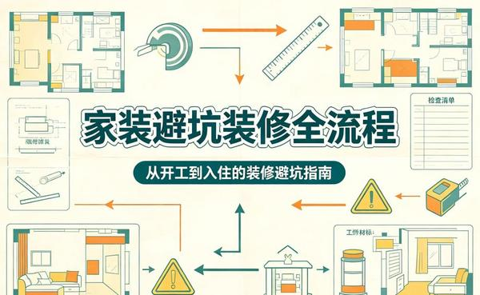

---

## 木工视频教程自学全集系统掌握木匠手艺

[2026-09-18 06:49] 来自：精选网盘资源

名称：木工视频教程自学全集，系统掌握木匠手艺

一套系统化的木工自学视频教程，涵盖木工工具认识与使用、木材选料与干燥、划线测量、锯切刨削、凿榫开槽、拼接组装与表面处理等完整工艺流程。适合零基础木工爱好者、DIY手工达人及想转行木艺的手艺人自学，帮助扎实掌握传统木匠技艺与现代木工技法。

夸克网盘：https://pan.quark.cn/s/3aab46e924a6

#木工视频教程 #木工自学教程 #木工技法 #木匠手艺

---

## 几十套商用级炒饭配方教程摆摊开店在家做都能用

[2026-09-18 06:47] 来自：精选网盘资源

名称：几十套商用级炒饭配方教程，摆摊开店在家做都能用

一套价值数千元的商用炒饭技术配方教程，课程精准量化调料比例，出餐流程与保存技巧，零基础可学。适合夜市摆摊、快餐店增项及家庭烹饪爱好者，帮助快速掌握稳定出品的商用炒饭技术。

百度网盘：https://pan.baidu.com/s/1Ma0FpgAJ6GjB8B9SaWq2sA?pwd=71u3

#炒饭配方 #小吃技术教程 #夜市摆摊 #商用级炒饭

---

## 抖音视频下载神器批量下载作品超级好用

[2026-09-18 06:44] 来自：精选网盘资源

名称：抖音视频下载神器，批量下载作品超级好用

一款开源免费的抖音视频批量下载工具，支持一键下载用户全部作品、收藏列表和点赞列表中的视频。操作简单，保留原画质无水印，下载速度快。适合内容备份、素材收集或短视频创作者使用，是超级好用的抖音下载神器。

夸克网盘：https://pan.quark.cn/s/0fc57176ab62

#抖音批量下载 #高效下载神器 #无水印下载 #批量保存视频

---

## 借助AI完成高质量策划方案快速产出专业级提案

[2026-09-18 06:41] 来自：精选网盘资源

名称：借助AI完成高质量策划方案，快速产出专业级提案

这是一套教你用AI高效产出高质量策划方案的实战课程，系统演示如何借助AI工具快速完成资料整合、文案撰写与方案润色。不依赖模板套用，而是掌握AI协作方法，让你在短时间内产出逻辑清晰、亮点突出、可落地的专业策划案，大幅提升工作效率与提案通过率。

百度网盘：https://pan.baidu.com/s/1eDWYL51rXXKiSlSGpKGfBQ?pwd=6rf9

#AI策划方案 #创意生成 #营销策划 #专业提案

---

## 中秋节相关素材资料合集主题活动一站配齐

[2026-09-18 06:38] 来自：精选网盘资源

名称：中秋节相关素材资料合集，主题活动一站配齐

一套中秋节主题教学与活动资料合集，包含节日介绍PPT模板、主题班会教案、手抄报模板、趣味游戏本、灯谜题库、诗词赏析及手工制作素材。所有资料均可直接打印或编辑使用，帮助老师省去备课时间，让孩子在动手与互动中感受传统文化魅力。

夸克网盘：https://pan.quark.cn/s/588b0029eacf

#中秋节资料汇总 #中秋节素材 #中秋节模板 #教案手抄报

---

## 菜根谭人生智慧读懂少走半生弯路

[2026-09-18 06:32] 来自：精选网盘资源

名称：《菜根谭人生智慧》：读懂少走半生弯路

为什么同样一件事，有人从容应对，有人焦头烂额？《菜根谭》不是鸡汤，而是几百年来被反复验证的处世心法。想在这个浮躁时代修一颗定心、练一副从容吗？这本书值得你反复品读。

夸克网盘：https://pan.quark.cn/s/e5b5bbfc5117

#菜根谭 #人生智慧 #修心处世 #古典智慧 #处世经典

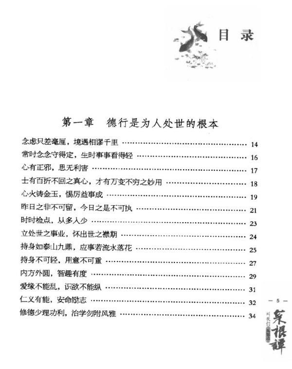

---

## 海外汉学丛书35册

[2026-09-18 00:14] 来自：综合网盘资源频道

名称：海外汉学丛书35册(上海古籍出版社)

描述：海外汉学丛书共计 35 册，由上海古籍出版社出版，汇集海外学者对于中国历史、文化、思想等领域的研究著作，展现海外汉学界的研究视角与学术成果，内容涵盖文史哲多个方向，适合汉学爱好者、文史研究者阅读，用来拓展学术视野，了解域外对于中华传统文化的研究解读。

夸克网盘：https://pan.quark.cn/s/3c3450a1c229

📁 大小：931.9MB

🏷 标签：#书籍 #丛书 #古籍 #海外 #出版社 #海外汉学丛书 #上海古籍出版社 #quark

---

## 特权与焦虑全球化时代的韩国中产阶级PDFAZW3EPUBMOBI

[2026-09-17 21:05] 来自：综合网盘资源频道

名称：《特权与焦虑_全球化时代的韩国中产阶级》[PDF+AZW3+EPUB+MOBI]

描述：中产阶级滑落的真相，韩国打了样！书中剖析富裕中产如何通过奢侈品消费、高端社区聚居和精英教育投资来巩固自身特权，同时加剧了普通中产群体的竞争压力。上层恐惧地位滑落，下层挣扎于阶层固化，整个社会陷入高度竞争的恶性循环……

夸克网盘：https://pan.quark.cn/s/9e2651fc4f57

📁 大小：N

🏷 标签：#具海根 #特权与焦虑 #全球化时代的韩国中产阶级 #PDF #AZW3 #EPUB #quark

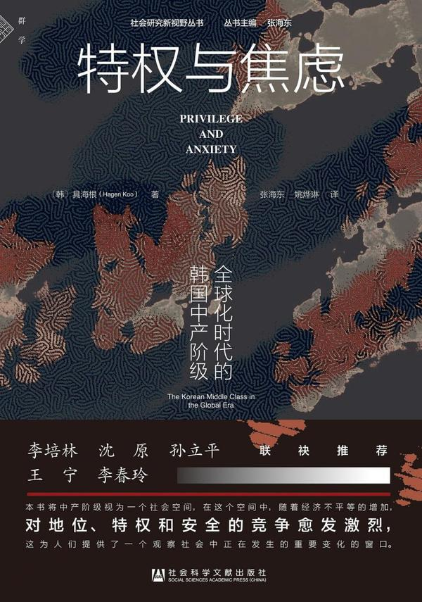

---

## 午夜图书馆PDFAZW3EPUBMOBI

[2026-09-17 19:48] 来自：综合网盘资源频道

名称：《午夜图书馆》[PDF+AZW3+EPUB+MOBI]

描述：全球热销超1000万册，Goodreads年度zui佳小说奖，纽约时报畅销榜TOP1，亚马逊年度最佳图书，缝补破碎人生的现象级治愈小说。即使是糟糕透顶的人生，我们还是拼了命地想活下去！写给正在穿越生活暴雨的你我，失去的只是选择，拥有的才是人生！

夸克网盘：https://pan.quark.cn/s/c52278884b60

📁 大小：N

🏷 标签：#马特 #海格 #午夜图书馆 #PDF #AZW3 #EPUB #MOBI #quark

---

## 爱奇艺影视搬砖实战课

[2026-09-17 18:45] 来自：Fang的资源分享群

名称：爱奇艺影视搬砖实战课 案例日收益500+ 从账号注册、素材选择到剪辑发布运营

本课程围绕爱奇艺影视搬砖展开，包含账号注册、素材选择、剪辑发布与运营等流程，适合想了解该玩法的用户参考，帮助你梳理操作步骤和思路。

夸克网盘：https://pan.quark.cn/s/2fdadbf1cd6d

#影视搬砖 #账号注册 #素材选择 #剪辑发布 #运营实战

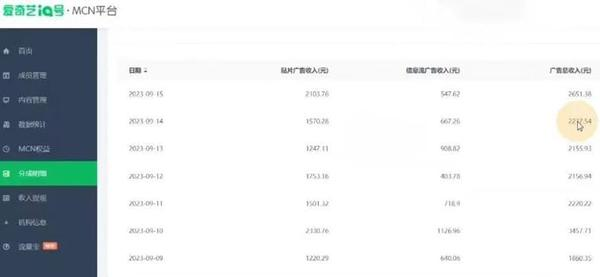

---

## 小红书虚拟资料最新玩法半年变现50W案例拆解

[2026-09-17 18:44] 来自：Fang的资源分享群

名称：小红书虚拟资料最新玩法，半年变现50W案例拆解

围绕小红书虚拟资料最新玩法，对半年变现50W的案例进行拆解，适合关注虚拟资料项目的人了解操作思路与场景，帮助形成基本判断。

夸克网盘：https://pan.quark.cn/s/4ab5462ba504

#小红书 #虚拟资料 #案例拆解 #最新玩法

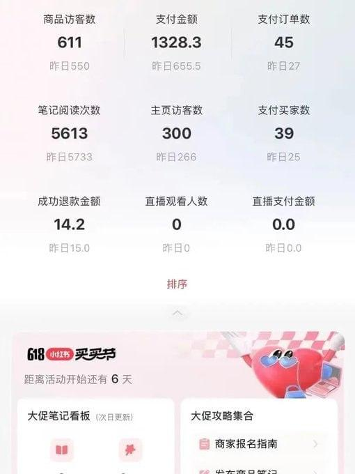

---

## AI胖妹历险记教学伙伴计划收徒商单多元收益

[2026-09-17 18:44] 来自：Fang的资源分享群

名称：AI胖妹历险记教学，伙伴计划+收徒+商单多元收益

围绕AI胖妹历险记教学，介绍伙伴计划、收徒与商单等多元收益方式的思路，适合想了解相关运营与变现路径的人参考。

夸克网盘：https://pan.quark.cn/s/f6e2fef63d32

#胖妹历险记 #伙伴计划 #收徒模式 #商单变现 #多元收益

---

## 世界经典悬念小说大合集套装共36册

[2026-09-17 12:10] 来自：综合网盘资源频道

名称：《世界经典悬念小说大合集》套装共36册 匪夷所思 局中局[pdf]

描述：世界经典悬念小说大合集全套共 36 册，收录众多经典悬念类文学作品，故事充满反转与局中局的情节设定，拥有匪夷所思的剧情构思，营造紧张的阅读氛围，适合悬疑文学爱好者阅读，可沉浸式感受悬念故事的魅力，闲暇时间用来品读各类精彩的悬疑叙事篇章。

夸克网盘：https://pan.quark.cn/s/046fdd7673f8

📁 大小：202.2MB

🏷 标签：#书籍 #合集 #套装 #经典 #PDF #世界经典悬念小说大合集 #匪夷所思 #局中局 #quark

---

## 精讲伤寒论中医经典音频

[2026-09-17 12:00] 来自：综合网盘资源频道

名称：精讲伤寒论｜中医经典｜音频

描述：精讲伤寒论音频围绕中医经典著作《伤寒论》展开，以音频形式对典籍条文进行细致解读，梳理书中辨证思路、方药应用以及中医理论逻辑，拆解传统中医诊疗思想，方便学习者利用碎片时间收听学习，适合中医爱好者以及想要研习伤寒论理论的人群，加深对这部古代医籍内容的理解。

夸克网盘：https://pan.quark.cn/s/daa3216508be

📁 大小：1.6GB

🏷 标签：#教程 #经典 #中医 #精讲 #伤寒论 #精讲伤寒论 #中医经典 #音频 #quark

---

## 英语语法50讲全集精讲构建完整语法体系

[2026-09-17 12:00] 来自：综合网盘资源频道

名称：英语语法50讲全集，精讲构建完整语法体系

描述：英语语法 50 讲全集通过系统精讲的模式，梳理各类英语语法知识点，由浅入深搭建完整的语法知识体系，拆解时态、从句、非谓语、句式结构等重难点内容，理清语法内在逻辑，适合想要夯实英语基础的学习者，用于日常学习查漏补缺，提升读写与应试当中的语法运用能力。

夸克网盘：https://pan.quark.cn/s/0b7f68dae32a

📁 大小：361.4MB

🏷 标签：#学习 #英语 #全集 #精讲 #语法 #英语语法50讲全集 #精讲构建完整语法体系 #quark

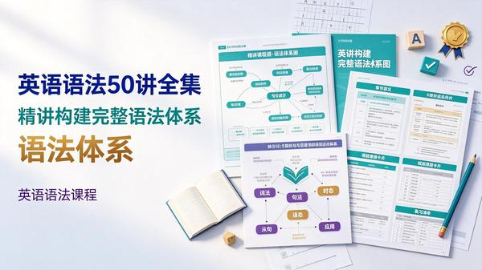

---

## 果然剪映电脑版从0到精通实战课全功能讲解全场景剪辑案例做账号接单变现

[2026-09-17 11:50] 来自：综合网盘资源频道

名称：果然-剪映电脑版从0到精通实战课，全功能讲解+全场景剪辑案例，做账号接单变现

描述：果然剪映电脑版从 0 到精通实战课完整讲解剪映电脑版全部功能，搭配多套全场景剪辑案例进行实操演示，从基础操作逐步过渡到高阶剪辑技巧，同时分享账号打造以及剪辑接单变现的相关思路，适合剪辑新手学习，掌握视频剪辑能力，开展内容创作或是接取剪辑相关业务。

夸克网盘：https://pan.quark.cn/s/43b1475d3c8e

📁 大小：2.5GB

🏷 标签：#教程 #变现 #剪辑 #精通 #剪映 #果然 #剪映电脑版从0到精通实战课 #全功能讲解 #全场景剪辑案例 #做账号接单变现 #quark

---

## DiskFreeze系统重启还原工具一键还原重启就是新电脑

[2026-09-17 06:23] 来自：精选网盘资源

名称：DiskFreeze系统重启还原工具，一键还原+重启就是新电脑

一款系统重启还原影子工具，一键开启保护，重启后自动恢复初始状态，无需手动清理。绿色零占用、零配置，永久免费。适合公共电脑、测试环境、机房、网吧等场景，防止误改误删和病毒残留，让电脑每次重启都像新装一样干净。

夸克网盘：https://pan.quark.cn/s/6a9a03c826b6

#DiskFreeze #系统还原 #影子系统 #一键还原

---

## 效率译丛图书12册全集80年代经典个人能力提升老书书单

[2026-09-17 06:21] 来自：精选网盘资源

名称：《效率译丛图书》12册全集，80年代经典个人能力提升老书书单

出版于上世纪80年代的效率提升经典译丛，共12册，涵盖时间管理、目标设定、学习方法、记忆训练、阅读技巧、思维优化与自我激励等核心主题。适合职场人士、学生及自我提升爱好者研读，既可作为怀旧收藏，也能从中汲取历久弥新的效率智慧，系统改善工作与学习状态。

夸克网盘：https://pan.quark.cn/s/3caed0f858be

#效率译丛图书 #能力提升 #效率智慧 #怀旧收藏 #学习方法

---

## WorkBuddy赋能教学实战课实现高效教学与轻松办公

[2026-09-17 06:19] 来自：精选网盘资源

名称：WorkBuddy赋能教学实战课，实现高效教学与轻松办公

面向一线教师的AI教学工作流实战课程，围绕WorkBuddy工具，帮助教师减少机械重复劳动，把时间还给教学设计与学生陪伴，实现高效教学、轻松办公。适合中小学教师、教研员及教育管理者快速上手AI。

百度网盘：https://pan.baidu.com/s/1sAtY_Ydyl7mxFqX33RqCMA?pwd=g6en

#WorkBuddy #高效教学 #轻松办公 #效率提升

---

## 刘擎哲学大师课与顶尖学者一起读懂时代与自我

[2026-09-17 06:16] 来自：精选网盘资源

名称：刘擎哲学大师课，与顶尖学者一起读懂时代与自我

这是一套由知名学者刘擎亲授的哲学通识课程，将深奥哲学转化为可感知的思考工具，帮助学习者在复杂时代建立清晰的认知框架，提升批判性思维与精神自觉。适合人文爱好者、职场人士及所有渴望深度思考的人。

夸克网盘：https://pan.quark.cn/s/8c0b86ae79c8

#哲学大师课 #深度思考 #认知框架 #思维训练

---

## 穿透困局看透因果与人性潜规则

[2026-09-17 06:10] 来自：精选网盘资源

名称：《穿透困局》：看透因果与人性潜规则

一个人痛苦的根源是看不透因果，你最大的监狱是自己的思维，三观不破就赚不到大钱。它告诉你从普通人到强者要经历哪三次觉醒、逆天改命有哪两条路径、社会运转的根本秘密到底是什么。

夸克网盘：https://pan.quark.cn/s/51e92c1877b1

#认知破局 #看透因果 #底层逻辑 #认知觉醒 #人性潜规则

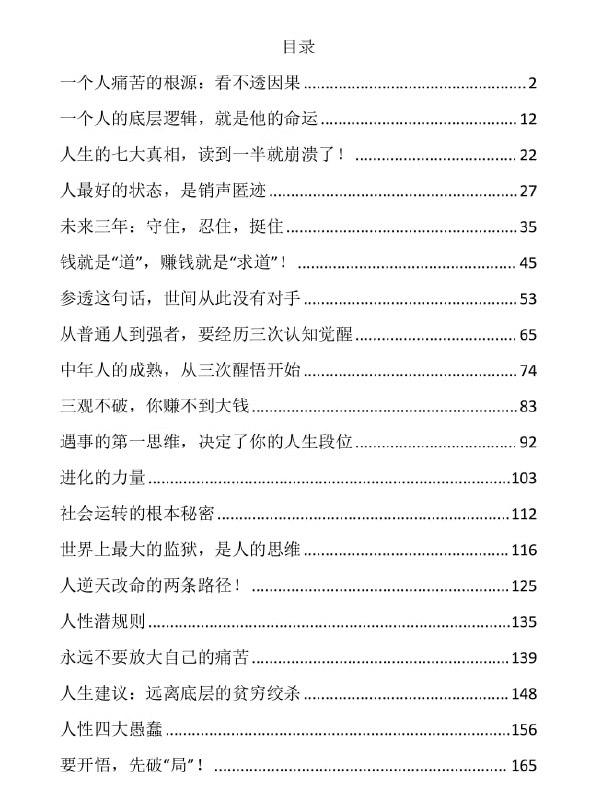

---

## 榫卯结构设计图纸素材古建筑工匠工艺图解

[2026-09-17 06:10] 来自：精选网盘资源

名称：榫卯结构设计图纸素材，古建筑工匠工艺图解

一套传统榫卯结构设计图纸与工艺素材合集，涵盖燕尾榫、粽角榫、格肩榫、楔钉榫等经典榫卯类型，提供家具制作模型图纸、节点分解图、古建筑斗拱结构解析及木工工艺流程参考。适合木工爱好者、家具设计师、古建研究者及模型制作者参考使用，帮助深入理解中式木作精髓，复刻传统工艺之美。

百度网盘：https://pan.baidu.com/s/1qEcKBcOJEj9HFfu3DdYpVA?pwd=dbik

#榫卯结构 #榫卯设计图纸 #传统木工 #卯榫工艺图解

---

## 捞汁小海鲜技术配方教程网红小吃创业培训视频

[2026-09-17 06:09] 来自：精选网盘资源

名称：捞汁小海鲜技术配方教程，网红小吃创业培训视频

专为小吃创业者打造的捞汁小海鲜技术培训视频课程，系统讲解各类海鲜的挑选、清洗、焯煮火候与冰镇锁鲜技巧，适合夜市摆摊、外卖店增项或餐饮创业者，用一套酱汁撬动高复购的网红小海鲜生意。

夸克网盘：https://pan.quark.cn/s/dbe28238a330

#捞汁小海鲜 #网红小吃 #夜市摆摊 #小海鲜技术配方

---

## 泥瓦工施工方法视频教程贴瓷砖放水砌墙抹灰全流程

[2026-09-17 06:08] 来自：精选网盘资源

名称：泥瓦工施工方法视频教程，贴瓷砖+放水+砌墙+抹灰全流程

一套系统化的泥瓦工技能视频教程，涵盖装修施工中的贴瓷砖、防水处理、砌墙、抹灰及找平收光等核心工序。课程从工具认识、材料配比、基层处理讲起，逐步演示瓷砖排版、空鼓预防、阴阳角处理、防水涂刷与闭水试验等关键细节。

百度网盘：https://pan.baidu.com/s/1zKwhzIZeSIXs8R9WC9E7Jg?pwd=c9wc

#泥瓦工视频教程 #装修自学 #砌墙抹灰 #贴瓷砖教程

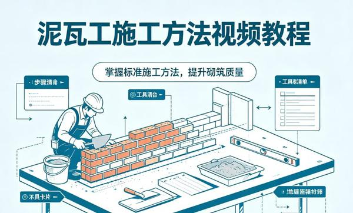

---

## 脱口秀搞笑段子大全反转幽默内涵笑话

[2026-09-17 06:07] 来自：精选网盘资源

名称：脱口秀搞笑段子大全，反转+幽默+内涵笑话

一套精选脱口秀与喜剧段子合集，涵盖神反转、冷幽默、自嘲调侃、生活观察与内涵笑话等类型，素材来源于日常槽点、职场趣事、情感关系和社交名场面。每段短小精悍，节奏明快，适合脱口秀演员、短视频创作者、主播及聚会活跃气氛者参考使用。

百度网盘：https://pan.baidu.com/s/1wuMBmjC7yRysmlqS-swfEQ?pwd=m7ux

#脱口秀搞笑段子 #笑话合集 #神反转 #冷幽默

---

## 模拟人生4正版安装与MOD合集

[2026-09-16 18:42] 来自：Fang的资源分享群

名称：《模拟人生4》正版安装与MOD合集

围绕《模拟人生4》的正版安装、游戏设置和MOD管理进行整理，涵盖实用功能、美化外观、家具建筑、人物自定义及玩法扩展等内容，帮助玩家更方便地打造个性化游戏体验。建议通过正规渠道获取游戏，并确认MOD来源安全、兼容当前版本。

迅雷网盘：https://pan.xunlei.com/s/VP1dnl9_BUmWdHT_sSo_bBWxA1?pwd=7w4t

#模拟人生4 #正版游戏 #MOD合集 #游戏安装 #游戏资源

---

## Huang豆短剧

[2026-09-16 18:40] 来自：Fang的资源分享群

名称：Huang豆短剧

围绕短剧内容、热门剧情和精选剧集进行整理，方便用户快速浏览不同类型的短剧作品，涵盖都市、情感、逆袭、悬疑等常见题材，适合喜欢碎片化追剧和短篇故事内容的人群观看。

迅雷网盘：https://pan.xunlei.com/s/VP1dnM90KVYkEX3r2Dtv1mWuA1?pwd=tzje

#Huang豆短剧 #短剧推荐 #热门短剧 #剧情合集 #追剧分享

---

## WorkBuddy大学清单

[2026-09-16 18:39] 来自：Fang的资源分享群

名称：WorkBuddy大学清单

围绕大学院校信息与升学选择进行整理，涵盖院校名称、专业方向、申请参考和学校筛选等内容，帮助学生及家长更高效地了解不同大学，适合用于升学规划、院校对比和留学申请准备。

迅雷网盘：https://pan.xunlei.com/s/VP1dnDWkV8wvHHFdKh4K9jB9A1?pwd=zpet

#WorkBuddy #大学清单 #院校选择 #升学规划 #留学申请

---

## 星火外卖骑手端

[2026-09-16 18:38] 来自：Fang的资源分享群

名称：星火外卖骑手端

面向外卖骑手打造的实用服务工具，围绕订单接收、配送管理、路线查看、收入统计和工作效率提升等功能进行介绍，帮助骑手更便捷地处理日常配送任务，适合从事外卖配送及灵活就业的人群使用。

迅雷网盘：https://pan.xunlei.com/s/VP1dn3Y6rcdtjOc8rVkpbn-kA1?pwd=stek

#外卖骑手 #配送工具 #骑手端 #订单管理 #兼职配送

---

## 爱迪影视

[2026-09-16 18:37] 来自：Fang的资源分享群

名称：爱迪影视

围绕影视剧、电影、综艺及热门内容进行整理，方便用户快速了解影视资讯、作品分类和相关内容，适合喜欢追剧、观影以及关注影视动态的人群使用。

迅雷网盘：https://pan.xunlei.com/s/VP1dmlNR-tKT-c9SlA4Lg9ybA1?pwd=79s8

#爱迪影视 #影视资源 #电影推荐 #电视剧 #影视资讯

---

## 千金美容方pdf源自孙思邈千金方的美容精髓古法养颜

[2026-09-16 15:18] 来自：综合网盘资源频道

名称：千金美容方.pdf，源自孙思邈《千金方》的美容精髓，古法养颜

描述：古人没有大牌护肤品，却依然肤若凝脂、发如乌木，答案就藏在流传千年的美容方里。系统整理了古代经典的美容养颜方剂与实用方法，从洗脸洁面、美白祛斑到养发固齿、香身润肤，全部用天然材料、古法调配。

夸克网盘：https://pan.quark.cn/s/bcf7fa4c6cb2

📁 大小：5.6MB

🏷 标签：#电子书 #千金美容方 #古方养颜 #中医美容 #护肤美白 #祛斑养发 #p #d #f #pdf #源自孙思邈 #千金方 #的美容精髓 #古法养颜 #quark

---

## 看图猜成语小游戏PPT课堂趣味互动团建活动必备

[2026-09-16 14:47] 来自：精选网盘资源

名称：看图猜成语小游戏PPT，课堂趣味互动+团建活动必备

一套以看图猜成语为核心的PPT互动课件电子版，精选大量形象生动的成语图片，涵盖小学语文常见成语与经典典故。参与者通过观察图片抢答对应成语，支持分组PK、计时计分与闯关模式，适合小学课堂互动、亲子益智、团建破冰及年会暖场等场景。

百度网盘：https://pan.baidu.com/s/1lhIIN-Gky2qUrsDUaIxZQg?pwd=z6u3

#看图猜成语 #PPT课件 #活跃气氛 #益智游戏

---

## 为什么我们会被愚弄PDFAZW3EPUBMOBI

[2026-09-16 14:37] 来自：综合网盘资源频道

名称：《为什么我们会被愚弄》[PDF+AZW3+EPUB+MOBI]

描述：即使您既聪明又受过良好教育，您仍然会被被奇葩言论带偏，轻信谣言还执意站队，被无稽之谈牵着走却不自知？其实是大脑的认知偏差在作祟！本书戳破网络谣言的传播逻辑，拆解无稽之谈风靡的四大原则，深挖各类认知偏差，教你练就批判性思维，掌握辨别无稽之谈的实用工具。

夸克网盘：https://pan.quark.cn/s/5ff43af518e2

📁 大小：N

🏷 标签：#托马 #C #迪朗 #为什么我们会被愚弄 #PDF #AZW3 #EPUB #MOBI #quark

---

## 企业员工手册Word模板一键套用修改HR行政必备

[2026-09-16 06:23] 来自：精选网盘资源

名称：企业员工手册Word模板，一键套用修改+HR行政必备

这套企业员工手册Word模板合集，涵盖规章制度、行为规范、考勤管理、薪酬福利等核心模块，条款规范严谨、格式专业统一。所有内容均可直接编辑替换，适合HR、行政人员和创业者快速搭建合规实用的员工管理手册，省去从零起草的麻烦，大幅提升制度落地效率。

UC网盘：https://drive.uc.cn/s/7f25f3f851d94

#企业员工手册 #规章制度范本 #行为规范 #HR行政必备

---

## 电脑文件搜索工具Windows必装应用秒搜全盘

[2026-09-16 06:21] 来自：精选网盘资源

名称：电脑文件搜索工具，Windows必装应用秒搜全盘

一款轻量高效的Windows文件搜索工具，最新版延续极速搜索体验。基于NTFS索引技术，可在毫秒间搜索全盘文件与文件夹，体积极小、资源占用低，完全免费无广告，是替代系统搜索的必备神器，大幅提升文件查找效率。

夸克网盘：https://pan.quark.cn/s/e595e12532b7

#Everything #电脑文件搜索 #极速搜索工具 #秒搜全盘

---

## 编绳手工DIY教程中国结项链手链编织视频

[2026-09-16 06:19] 来自：精选网盘资源

名称：编绳手工DIY教程，中国结项链手链编织视频

一套系统的手工编绳视频教程，涵盖中国结基础结法、项链吊坠编织、手链编法、平安扣挂绳、串珠搭配及创意饰品制作等内容。课程逐步进阶到复杂组合与收尾技巧，每一步配有慢动作演示与图解，适合手工爱好者、亲子互动及想尝试副业手作的零基础学员。

夸克网盘：https://pan.quark.cn/s/e42ee8dc9d6a

#编绳手工 #中国结 #传统绳艺 #编织视频 #编绳DIY教程

---

## 21天走出焦虑抑郁课程重建内心平静与生活动力

[2026-09-16 06:16] 来自：精选网盘资源

名称：21天走出焦虑抑郁课程，重建内心平静与生活动力

一套以21天为周期的焦虑抑郁自我调节系统课程，逐步帮助学员识别负面思维模式、缓解躯体紧张、恢复睡眠与日常节律，适合轻中度情绪困扰者、高压职场人及希望提升心理韧性的人群。

夸克网盘：https://pan.quark.cn/s/69d18a95e999

#走出焦虑 #抑郁课程 #调节情绪 #正念冥想 #情绪困扰

---

## 洞察人性话术读懂人心才能把话说进别人心里

[2026-09-16 06:10] 来自：精选网盘资源

名称：《洞察人性话术》：读懂人心才能把话说进别人心里

为什么同样一句话，有人说出来让人点头，有人说出来让人翻脸？差别不在口才，在洞察。这本书把人性弱点、情绪反应和说话意图全拆开了，从职场对上司到日常对朋友，教你看准人、抓准时机、说准话。

夸克网盘：https://pan.quark.cn/s/25dc186a51fe

#洞察人性 #攻心话术 #人际沟通 #察言观色

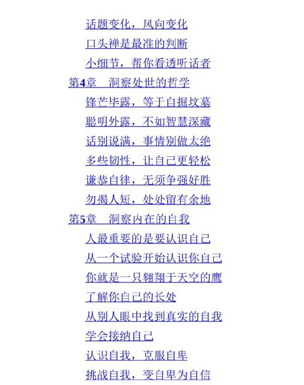

---

## 松月7天小红书虚拟产品Mini训练营

[2026-09-16 00:21] 来自：综合网盘资源频道

名称：松月7天小红书虚拟产品Mini训练营

描述：松月 7 天小红书虚拟产品 Mini 训练营以七天集训的形式，讲解小红书平台虚拟产品的整套运营思路，涵盖产品定位、内容创作、账号引流、成交转化等实操环节，拆解虚拟产品的玩法逻辑，适合想要在小红书开展虚拟产品项目的学习者，快速掌握平台相关实操方法。

夸克网盘：https://pan.quark.cn/s/6f610e66cf3c

📁 大小：4.3GB

🏷 标签：#教程 #训练营 #小红书 #虚拟产品 #运营 #松月7天小红书虚拟产品Mini训练营 #quark

---

## 千金美容方古法养颜美容大全

[2026-09-16 00:19] 来自：综合网盘资源频道

名称：《千金美容方》：古法养颜美容大全

描述：《千金美容方》汇集各类传统古法养颜相关内容，整理古代美容调养思路，收录传统护肤养颜相关方药与调养方法，讲解古人护肤美容的理念，适合对传统养颜文化感兴趣的人群参考阅读。提示书中相关方药仅作文化研究，不可直接用于实操，使用相关方案建议咨询专业医师。

夸克网盘：https://pan.quark.cn/s/158a8d6ba068

📁 大小：5.6MB

🏷 标签：#教程 #大全 #美容 #古法 #养颜 #千金美容方 #古法养颜美容大全 #quark

---

## 闲鱼无货源运营全攻略掌握零库存卖货核心方法

[2026-09-16 00:18] 来自：综合网盘资源频道

名称：闲鱼无货源运营全攻略，掌握零库存卖货核心方法

描述：闲鱼无货源运营全攻略讲解零库存卖货的核心实操方法，涵盖选品思路、上架技巧、流量获取、订单处理等运营环节，梳理平台的运营逻辑，拆解无货源模式的操作流程，适合想要在闲鱼开展副业的学习者，用来学习平台运营思路，了解零库存模式的相关实操要点。

夸克网盘：https://pan.quark.cn/s/aeedb3c4795e

📁 大小：1.1GB

🏷 标签：#教程 #运营 #攻略 #方法 #核心 #闲鱼无货源运营全攻略 #掌握零库存卖货核心方法 #quark

---

## AI

[2026-09-16 00:16] 来自：综合网盘资源频道

名称：AI MV音乐号实操课，从零起号变现全流程

描述：AI MV 音乐号实操课完整讲解账号从 0 到起号再到变现的整套流程，教学利用 AI 工具制作 MV 类音乐短视频，覆盖内容制作、账号搭建、流量运营以及变现渠道等环节，梳理音乐号的运营要点，适合短视频从业者以及想要打造音乐类账号的学习者学习实操方法。

夸克网盘：https://pan.quark.cn/s/ae3662902ff0

📁 大小：1.3GB

🏷 标签：#教程 #AI #实操 #变现 #MV #MV音乐号实操课 #从零起号变现全流程 #quark

---

## 华仔一人公司2026Codex智能体实战

[2026-09-16 00:15] 来自：综合网盘资源频道

名称：华仔一人公司：2026Codex智能体实战

描述：华仔一人公司 2026Codex 智能体实战围绕 Codex 智能体展开实战教学，讲解智能体相关实操应用，结合一人公司的业务场景，演示智能体的搭建、调试与落地使用方法，梳理实操过程中的关键要点，适合想要学习 AI 智能体落地应用的从业者，掌握智能体在个人业务当中的使用思路。

夸克网盘：https://pan.quark.cn/s/de40cb821ef8

📁 大小：1.2GB

🏷 标签：#教程 #实战 #智能体 #codex #一人公司 #华仔一人公司 #2026Codex智能体实战 #quark

---

## 贰掌柜学习笔记合集

[2026-09-16 00:13] 来自：综合网盘资源频道

名称：贰掌柜学习笔记合集

描述：贰掌柜学习笔记合集整理汇总各类学习相关笔记材料，梳理归纳不同主题的知识要点，把零散的学习内容进行整理提炼，方便学习者快速查阅重点内容，可用于日常温习知识点，借鉴笔记的梳理思路，适配不同阶段学习者用来辅助自身的学习，提升知识吸收效率。

夸克网盘：https://pan.quark.cn/s/582ffe12829b

📁 大小：276.4MB

🏷 标签：#学习 #合集 #笔记 #提升 #效率 #贰掌柜学习笔记合集 #quark

---

## PT健身华哥百日胖于晏

[2026-09-16 00:12] 来自：综合网盘资源频道

名称：PT健身华哥：百日胖于晏 133天身材打造课程

描述：PT 健身华哥百日胖于晏为 133 天身材打造课程，规划完整周期健身训练安排，讲解动作训练、身体塑形相关内容，按阶段设置训练目标，帮助参与者循序渐进完成体态改造，适合想要系统开展健身塑形的人群，跟随周期计划开展练习，优化自身身体状态。运动请结合自身身体条件，量力而行。

夸克网盘：https://pan.quark.cn/s/8e2e0a23db4b

📁 大小：14.5GB

🏷 标签：#教程 #课程 #健身 #身材 #动作 #PT健身华哥 #百日胖于晏 #133天身材打造课程 #quark

---

## 异类不一样的成功启示录PDFAZW3EPUBMOBI

[2026-09-15 22:45] 来自：综合网盘资源频道

名称：《异类_不一样的成功启示录》[PDF+AZW3+EPUB+MOBI]

描述：如果没有机遇、文化和环境因素，即便是智商超过爱因斯坦，也只能做一份平庸的工作。天才并非生而如此，成功不是随机事件，9大启示颠覆你对成功的认知，10000小时定律,如何使人从平凡到超凡。

夸克网盘：https://pan.quark.cn/s/2eed6b221232

📁 大小：N

🏷 标签：#马尔科姆 #格拉德威尔 #异类 #不一样的成功启示录 #PDF #AZW3 #EPUB #quark

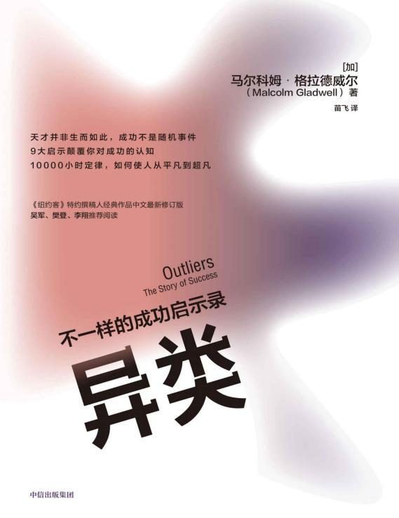

---

## 豆神大语文写作直播课

[2026-09-15 19:11] 来自：Fang的资源分享群

名称：【豆伴匠】豆神大语文写作直播课（入门到高分）

围绕语文写作能力提升进行系统讲解，涵盖审题立意、素材积累、文章结构、表达技巧、开头结尾和修改提升等内容，帮助学生掌握从基础入门到高分写作的方法，适合需要提升作文水平和写作思维的学习者参考。

迅雷网盘：https://pan.xunlei.com/s/VP1Zkq8NZHID4yI9Ogbl8bEtA1?pwd=vtiw

#语文写作 #作文辅导 #写作技巧 #素材积累 #学习提升

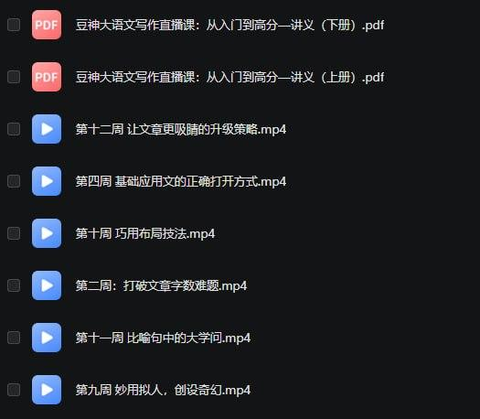

---

## 增强宝典

[2026-09-15 19:10] 来自：Fang的资源分享群

名称：增强宝典（9G）

围绕男性健康、体能提升、生活习惯和科学运动进行内容整理，涵盖日常锻炼、饮食管理、作息调整及健康知识等方向，帮助用户建立更加科学的自我管理方式，适合关注身体状态和生活品质提升的人群参考。

迅雷网盘：https://pan.xunlei.com/s/VP1Zkh3b00vWtr0oM3ZOpPXFA1?pwd=mjyi

#男性健康 #体能提升 #健康管理 #运动锻炼 #生活方式

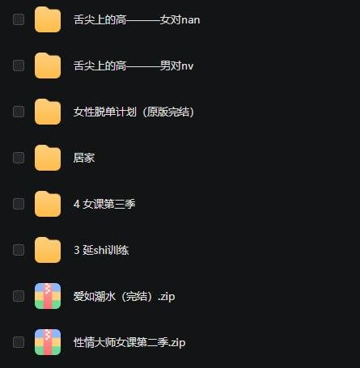

---

## 美女瑜伽6季合集

[2026-09-15 19:10] 来自：Fang的资源分享群

名称：美女瑜伽6季合集

围绕瑜伽基础、身体拉伸、柔韧性训练和日常体态改善进行系统整理，涵盖多种难度与练习内容，适合希望在家进行瑜伽锻炼、放松身心和提升身体状态的人群参考使用。练习时请根据自身情况循序渐进，避免勉强完成高难度动作。

迅雷网盘：https://pan.xunlei.com/s/VP1ZkZOV474eP35WrspbLSq0A1?pwd=6s23

#瑜伽练习 #居家健身 #拉伸训练 #体态改善 #运动健身

---

## 孙子兵法100集精品动画

[2026-09-15 19:09] 来自：Fang的资源分享群

名称：孙子兵法100集精品动画

通过生动易懂的动画形式，系统讲解《孙子兵法》中的经典思想、谋略智慧和历史案例，帮助观众理解战争策略、处世思维、决策方法与团队管理理念，适合学生、历史爱好者及希望提升思维能力的人群观看学习。

迅雷网盘：https://pan.xunlei.com/s/VP1ZkRgvY11BN_rZtYjFoG7vA1?pwd=a22c

#孙子兵法 #精品动画 #历史知识 #谋略智慧 #传统文化

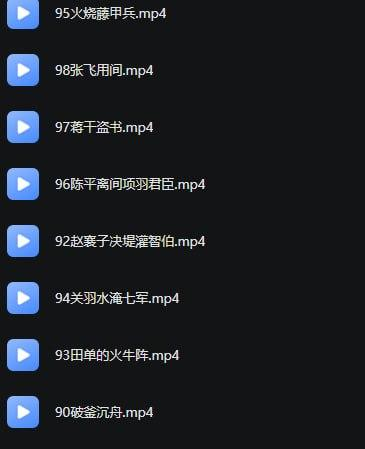

---

## 性情大师女课第一季

[2026-09-15 19:08] 来自：Fang的资源分享群

名称：性情大师女课第一季

围绕女性自我成长、情绪管理、沟通表达和亲密关系经营展开，帮助学习者提升自我认知、个人魅力与关系处理能力，适合希望改善沟通方式、增强自信并建立健康相处模式的人群参考学习。

迅雷网盘：https://pan.xunlei.com/s/VP1ZkHfg9CgUQrvIw4N-ebKIA1?pwd=kbxp

#女性成长 #情绪管理 #沟通技巧 #亲密关系 #自我提升

---

## 原子習慣細微改變帶來巨大成就的實證法則PDFAZW3EPUBMOBI

[2026-09-15 14:52] 来自：综合网盘资源频道

名称：《原子習慣_細微改變帶來巨大成就的實證法則》[PDF+AZW3+EPUB+MOBI]

描述：虽然知道习惯很重要，但你经常为了自己的坏习惯苦恼，想要戒除却力不从心？或者，你想养成好习惯，却老是半途而废？其实你不需每个月都重新塑造自己，善用“复利”效应，让小小的原子习惯利滚利，达成你心心念念的目标！

夸克网盘：https://pan.quark.cn/s/0cba95f2f0ec

📁 大小：N

🏷 标签：#詹姆斯 #克利爾 #原子習慣 #細微改變帶來巨大成就的實證法則 #PDF #AZW3 #EPUB #quark

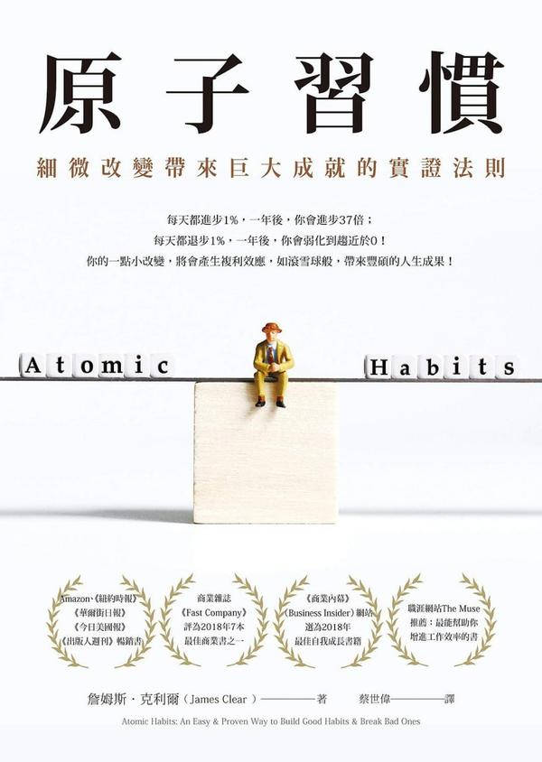

---

## 网瘾戒除视频教程大全青少年沉迷网络管理技巧

[2026-09-15 07:43] 来自：精选网盘资源

名称：网瘾戒除视频教程大全，青少年沉迷网络管理技巧

一套针对青少年网络沉迷问题的系统性家长指导课程，不靠打骂与强制断网，而是通过环境调整、亲子关系修复与自控力训练，引导孩子逐步恢复健康生活节律，重新找回学习动力与现实世界的乐趣。

百度网盘：https://pan.baidu.com/s/1h1P0CQr_N7BYoq85fLw2Vg?pwd=MC31

#网瘾戒除 #自控力 #亲子关系 #沉迷网络管理

---

## 闯关游戏PPT课件模板幼儿园小学课堂互动教学通用模板

[2026-09-15 07:41] 来自：精选网盘资源

名称：闯关游戏PPT课件模板，幼儿园小学课堂互动教学通用模板

一套专为幼小学段设计的闯关游戏PPT课件模板合集，模板含多种关卡地图、选择题互动、拖拽配对、计时答题与奖励动画，所有元素均可自由编辑替换。

百度网盘：https://pan.baidu.com/s/1y1affmRmOcLwCdeqO1iVYQ?pwd=K5B7

#闯关游戏PPT #课件模板 #课堂游戏模板 #互动教学

---

## 免费电脑蓝光护眼软件宠物提醒防疲劳护眼

[2026-09-15 06:26] 来自：精选网盘资源

名称：免费电脑蓝光护眼软件，宠物提醒+防疲劳护眼

一款免费的电脑护眼工具，通过智能调节屏幕色温，有效过滤有害蓝光，减轻长时间用眼带来的疲劳感。内置可爱的桌面宠物，定时提醒你休息、远眺或做眼保健操，帮助养成良好用眼习惯。

夸克网盘：https://pan.quark.cn/s/81ecef0315a1

#蓝光护眼 #护眼软件 #屏幕色温调节 #防疲劳软件

---

## 可打印安静书素材多风格手工制作全套资源

[2026-09-15 06:22] 来自：精选网盘资源

名称：可打印安静书素材，多风格手工制作全套资源

一套可打印的安静书电子素材包，包含英文认知、配对、数感、颜色形状、生活技能等主题互动翻翻书。家长打印后剪贴即可制作，锻炼手部精细动作与专注力，适合亲子手工、家庭早教及幼儿园课堂延伸，无需购买成品书，随时按需打印，经济灵活又实用。

#安静书素材 #亲子手工 #早教手工 #家庭早教

---

## 数学基础知识丛书24册全集70年代经典数学自学老课本书单

[2026-09-15 06:19] 来自：精选网盘资源

名称：《数学基础知识丛书》24册全集，70年代经典数学自学老课本书单

一套出版于上世纪70年代的数学自学经典丛书，共24册，涵盖算术、代数、几何、三角、解析几何、微积分及概率统计等完整基础体系。编写风格严谨朴实，推导详尽，例题丰富，注重概念理解与解题逻辑训练。作为那个年代自学成才的重要读物，至今仍被视为夯实数学基本功的优质参考。

夸克网盘：https://pan.quark.cn/s/d8b2c8cee84a

#数学基础知识 #数学史料 #数学自学 #解题思路

---

## 手工折纸视频教程全集手把手教你折出各种物件

[2026-09-15 06:15] 来自：精选网盘资源

名称：手工折纸视频教程全集，手把手教你折出各种物件

一套系统的手工折纸视频教程合集，从简单折叠到组合折纸逐步进阶，每一步都有慢动作演示与清晰图解，适合儿童动手能力培养、亲子互动及成人解压休闲。无需复杂工具，一张纸即可开始，跟着视频轻松学会多种折纸造型，享受指尖创造的乐趣。

夸克网盘：https://pan.quark.cn/s/f79738c5e704

#手工折纸 #亲子互动 #指尖乐趣 #动手能力

---

## 情绪价值话术手册让每句话都暖到点上

[2026-09-15 06:10] 来自：精选网盘资源

名称：《情绪价值话术手册》：让每句话都暖到点上

想安慰人却越说越糟、想夸人却只会“你真棒”、一吵架就大脑空白？这本书不讲空道理，直接给你能照搬的话术模板。从夸结果到夸细节，从道歉不找借口到灭火不翻旧账——每一句都按场景分好，拿来就能用。

夸克网盘：https://pan.quark.cn/s/ccce51e7620e

#情绪价值 #话术手册 #高情商沟通 #告别嘴笨

---

## 自私的基因40周年增订版PDFAZW3EPUBMOBI

[2026-09-14 22:18] 来自：综合网盘资源频道

名称：《自私的基因_40周年增订版》[PDF+AZW3+EPUB+MOBI]

描述：一部颠覆认知的进化生物学著作。它提出，我们不过是基因的生存机器，很多看似利他的行为，本质上是基因的自私策略。它将彻底改变你对人性、爱情和道德的理解。生命和人生以及世界与文明的尽头，可能是我们根本想不到的东西。

📁 大小：N

🏷 标签：#理查德 #道金斯 #自私的基因 #40周年增订版 #PDF #AZW3 #EPUB #quark

---

## 北大炒股PPT资料

[2026-09-14 19:45] 来自：Fang的资源分享群

名称：北大炒股PPT资料

围绕股票投资基础、市场分析和交易思路进行整理，涵盖投资理念、行业研究、财务分析、风险控制及常见技术指标等内容，适合希望系统了解证券市场和提升投资认知的学习者参考。内容仅用于学习交流，不构成任何投资建议。

#股票投资 #炒股入门 #投资学习 #财务分析 #风险控制

---

## 董宇辉英语学习全套

[2026-09-14 19:43] 来自：Fang的资源分享群

名称：董宇辉英语学习全套（初中提前学）

围绕初中英语基础与提前学习进行系统整理，涵盖词汇积累、语法入门、阅读理解、听力训练和学习方法等内容，帮助学生提前熟悉初中英语知识体系，适合小学生高年级及英语基础提升阶段的学习者参考使用。

#英语学习 #初中英语 #提前学习 #英语启蒙 #学习方法

---

## AI聊天软件资源包

[2026-09-14 19:36] 来自：Fang的资源分享群

名称：AI聊天软件资源包

围绕AI聊天软件及相关工具进行整理，汇集多种实用的AI对话、写作、翻译、学习和办公辅助资源，帮助用户快速了解不同工具的功能特点与使用场景，适合想提升效率、探索AI应用的新手用户。

#AI聊天软件 #AI工具 #资源包 #人工智能 #效率工具

---

## 呱精选内容大合集

[2026-09-14 19:35] 来自：Fang的资源分享群

名称：呱🍉精选内容大合集（持续更新）

围绕呱🍉相关内容进行整理汇总，提供持续更新的精选资源与热门内容，方便用户快速浏览、查找和收藏，适合关注该主题、希望获取集中内容的人群。

#呱🍉合集 #精选内容 #热门分享 #持续更新 #资源整理

---

## 情感沟通与高情商恋爱全系列教程

[2026-09-14 19:34] 来自：Fang的资源分享群

名称：情感沟通与高情商恋爱全系列教程

围绕情感沟通、个人魅力提升和高情商恋爱展开系统讲解，涵盖聊天技巧、关系建立、约会相处、情绪管理和边界感培养等内容，帮助想提升沟通能力和亲密关系质量的人掌握健康、平等、尊重的相处方法。

#情感沟通 #高情商恋爱 #聊天技巧 #约会相处 #个人成长

---

## 公众号流量主细分赛道

[2026-09-14 19:29] 来自：Fang的资源分享群

名称：公众号流量主细分赛道 10天收益1652 新手可以复制 详细拆解

围绕公众号流量主细分赛道，做新手可复制的详细拆解，说明操作流程、适用场景和常见思路，适合想尝试该方向并参考执行的人。

#公众号流量主 #细分赛道 #新手教程 #项目拆解 #副业项目

---

## 复旦大学卢向华教授著作AI革命人机融合共生的五大法则pdf

[2026-09-14 16:23] 来自：综合网盘资源频道

名称：复旦大学卢向华教授著作，AI革命：人机融合共生的五大法则【pdf】

描述：聚焦AI与人类协同创新。基于信息系统等理论，提出人机融合共生五大法则：优化AI交互、管理用户协作、增强互补动态、适配组织管理及保障社会公平。旨在建立互信协同系统，强调技术中保持人类主体地位，实现和谐共生，帮助读者适应智能时代。

📁 大小：21.5MB

🏷 标签：#书籍 #AI革命 #人机融合共生的五大法则 #pdf #人工智能 #管理学 #社会学 #复旦大学卢向华教授著作 #quark

---

## 渤海小吏B站充电专属视频合集

[2026-09-14 15:01] 来自：综合网盘资源频道

名称：渤海小吏《B站充电专属视频合集》 (更至20260912)

描述：渤海小吏以其通俗化的语言风格和说书式历史解析见长，通过战争视角切入历史脉络，拓展人文领域的多维表达形式。

百度网盘：https://pan.baidu.com/s/1m_pFK3vyvuPcsFgnS323oQ?pwd=W4VP

📁 大小：N/A

🏷 标签：#历史 #学习 #渤海小吏 #B站充电专属视频合集 #quark #baidu

---

## 人性实验改变社会心理学的28项研究

[2026-09-14 15:00] 来自：综合网盘资源频道

名称：《人性实验_改变社会心理学的28项研究(第2版)》[PDF+AZW3+EPUB+MOBI]

描述：本书展示了28个有趣的社会心理学实验，比如从众心理、服从权威、社会歧视、反社会行为等等都会在这本书里或多或少的找到答案，对于普通读者洞察人性、反思自我、思考社会现象都能提到醍醐灌顶之效。

📁 大小：N

🏷 标签：#弗雷 #人性实验 #改变社会心理学的28项研究 #PDF #AZW3 #EPUB #quark

---

## 樊登读书

[2026-09-14 14:46] 来自：综合网盘资源频道

名称：《樊登读书 (帆书) 》合集 (更至20260912)

描述：帆书引领了“听书”的新阅读模式，通过精选好书与深入浅出的解读方式，为书友带来实用新知与智慧启发。

📁 大小：N/A

🏷 标签：#阅读 #学习 #课程 #樊登读书 #帆书 #合集 #quark #baidu

---

## 系统重装神器无需U盘小白傻瓜式操作

[2026-09-14 06:16] 来自：精选网盘资源

名称：系统重装神器，无需U盘+小白傻瓜式操作

一款免费的Windows系统重装工具，无需U盘即可一键完成系统重装、备份与还原。傻瓜式操作界面，小白也能轻松上手，省去传统装系统的繁琐步骤和费用，适合需要快速重装或备份系统的用户。

#EasyRC #一键系统重装 #无需U盘 #系统备份还原

---

## 私域社群运营实战课搭建高转化的专属流量池

[2026-09-14 06:13] 来自：精选网盘资源

名称：私域社群运营实战课，搭建高转化的专属流量池

一套系统化私域社群运营实战课程，从零起步讲解社群定位、规则设计、引流路径、内容规划、互动激活、分层管理与成交转化全流程。帮助降低获客成本，实现从流量到留量再到销量的完整闭环。

百度网盘：https://pan.baidu.com/s/1GEZrt-XEYhV2OPzPIJ7ggQ?pwd=soua

#私域社群 #社群运营 #高转化流量 #引流路径

---

## 阳台种植全教程家庭园艺从零打造小菜园

[2026-09-14 06:10] 来自：精选网盘资源

名称：阳台种植全教程，家庭园艺从零打造小菜园

一套专为城市家庭设计的阳台种植系统课程，课程结合不同阳台条件给出适配方案，手把手教你用有限空间种出番茄、生菜、草莓、香草及观叶植物，享受从种子到餐桌的乐趣，打造属于自己的阳台小花园。

#阳台种植课程 #阳台小花园 #家庭园艺 #绿植盆栽

---

## 千金美容方古法养颜美容大全

[2026-09-14 06:06] 来自：精选网盘资源

名称：《千金美容方》：古法养颜美容大全

为什么古人没有大牌护肤品，却依然肤若凝脂、发如乌木？答案就藏在流传千年的美容方里。系统整理了古代经典的美容养颜方剂与实用方法，从洗脸洁面、美白祛斑到养发固齿、香身润肤，全部用天然材料、古法调配。

夸克网盘：https://pan.quark.cn/s/597adbe4cddc

#千金美容方 #古方养颜 #中医美容 #护肤美白 #祛斑养发

---

## 在世界上找到你的位置PDFAZW3EPUBMOBI

[2026-09-13 22:37] 来自：综合网盘资源频道

名称：《在世界上找到你的位置》[PDF+AZW3+EPUB+MOBI]

描述：每个人都会经历18岁，但不是每个人都会在18岁时按时成年。书主题涵盖了成年过程中的思维模式、品行培养、人生定位、职业选择、社交规范、健康管理、用钱之道、逆商提升、责任激发9大方面，为年轻人提供一张迈向成年的路线图，以“成人思维”应对世界，在成年生活中闪闪发光。

📁 大小：N

🏷 标签：#朱莉 #利思科特 #在世界上找到你的位置 #PDF #AZW3 #EPUB #MOBI #quark

---

## 2027版

[2026-09-13 21:58] 来自：综合网盘资源频道

名称：2027版 理想树《高考必刷题合订本》9科全 (高考合订版本 + 必修课本版本)

描述：2027 版《高考必刷题合订本》适配新高考一轮复习，搭载八刷分层体系，精选 2026 高考真题与各地名校模考题。一书三册，含主练习册、答案解析册、《狂 K 重难点》小册子，难度由基础、易错逐步进阶至综合压轴。贴合新高考命题风向，覆盖全部核心考点，可按需选择薄弱板块专项突破。适合中等及以上水平考生，一轮系统刷题、攻克重难点，稳步冲刺高分。

📁 大小：9GB

🏷 标签：#2027高考 #学习资料 #高三 #一轮复习 #高考 #理想树 #高考必刷题 #2027版 #高考必刷题合订本 #9科全 #高考合订版本 #必修课本版本 #quark

---

## 2027版天利38套常考基础题

[2026-09-13 21:58] 来自：综合网盘资源频道

名称：2027版《天利38套•常考基础题》 8科(语数英物化生政史)

描述：2027 版天利 38 套常考基础题，8 科全套，适配新高考一轮复习。精选真题与优质模拟题，按考点专题划分，聚焦高考基础、中档题型，避开偏难怪。适合基础薄弱、查漏补缺，或是巩固基础分的考生。配套详尽解析，梳理解题思路、标注易错点，做完一题吃透一类。夯实知识底盘，稳抓高考大部分基础分值，艺考生、一轮打底刷题首选

📁 大小：3.8G

🏷 标签：#高考 #高中 #高三 #学习资料 #一轮复习 #天利38套 #常考基础题 #2027版 #8科 #语数英物化生政史 #quark

---

## 章鱼学会冷静PDFAZW3EPUBMOBI

[2026-09-13 15:31] 来自：综合网盘资源频道

名称：《章鱼学会冷静》[PDF+AZW3+EPUB+MOBI]

描述：书中最令我触动的观点是：两个人分开是因为在一起时双方都没有办法继续成长。如果你也和我一样，总在亲密关系里焦虑难安，让爱情变得格外艰难，那这本书我想推荐给每一个焦虑型依恋的你。

📁 大小：N

🏷 标签：#杰西卡 #鲍姆 #章鱼学会冷静 #PDF #AZW3 #EPUB #MOBI #quark

---

## 开源全能下载器多平台通用无广告不限速

[2026-09-13 06:55] 来自：精选网盘资源

名称：开源全能下载器，多平台通用+无广告不限速

一款开源全能下载器，支持多平台使用，界面简洁无广告，不限速，兼容HTTP、BT、磁力等多协议下载，多线程加速性能强劲。完全免费，适合需要高速稳定下载工具的用户，堪称全能下载利器。

#开源下载器 #全能下载工具 #免费下载神器 #高速下载

---

## AI包装设计商业案例用AI生成可量产包装方案

[2026-09-13 06:53] 来自：精选网盘资源

名称：AI包装设计商业案例，用AI生成可量产包装方案

一套聚焦AI包装设计商业落地的实战课程，无需设计基础，帮助设计师、电商运营与创业者在压缩成本的同时快速产出可量产、有辨识度的包装方案，提升品牌视觉竞争力。

#AI包装设计 #品牌视觉 #效果图渲染 #包装方案

---

## 国宝级大厨上百道中西菜品拆解从家常到宴客一次精通

[2026-09-13 06:51] 来自：精选网盘资源

名称：国宝级大厨上百道中西菜品拆解，从家常到宴客一次精通

一套由国宝级大厨隋卞亲自示范的烹饪课程，精选100道中西经典菜品，从选材、刀工、火候到调味摆盘，逐步骤慢动作拆解，毫无保留地展示后厨核心技法，每道菜配有食材清单、关键要点提示与常见失败原因分析。

#国宝级大厨 #家常快炒 #炖煮硬菜 #西式煎烤 #厨房必备

---

## 农家日用大全解决农家日常难题的实用宝典

[2026-09-13 06:46] 来自：精选网盘资源

名称：《农家日用大全》：解决农家日常难题的实用宝典

这本书就像一本农村生活的“万能工具箱”，把农事生产、医疗保健、饮食烹饪、婚丧嫁娶、节气习俗等日常难题全收进去了。语言通俗、方法实用，老一辈人翻烂了都不舍得扔。想找回那种“一本在手、万事不求人”的踏实感吗？此书就是农家必备的过日子指南。

#日用大全 #生活百科 #实用工具书 #农家必备 #过日子指南

---

## Java架构师VIP第03期

[2026-09-13 00:33] 来自：综合网盘资源频道

名称：【鲁班学院】Java架构师VIP第03期

描述：本套课程来自鲁班学院：Java架构师VIP课程，课程官方售价6380元，且销售评价较高，课程是由多名业界大牛主讲。

📁 大小：NG

🏷 标签：#学习 #知识 #课程 #资源 #鲁班学院 #Java架构师VIP #quark #ali

---

## 中国风水文化100集纪录片完整版传统智慧与现代应用

[2026-09-12 21:33] 来自：Fang的资源分享群

名称：《中国风水文化》100集纪录片完整版，传统智慧与现代应用

这部100集纪录片系统讲解中国风水文化的历史渊源、核心理论及现代实践应用，涵盖传统智慧与现代生活结合，适合传统文化爱好者深入参考学习。

#风水文化 #纪录片 #传统文化 #现代应用 #智慧

---

## 社会心理学

[2026-09-12 21:33] 来自：Fang的资源分享群

名称：《社会心理学》

本书系统介绍社会心理学核心理论，涵盖社会认知、社会影响与人际关系，适合心理学学习者及研究者，用于理解个体与社会环境的相互作用。

#社会心理学 #心理学 #人际关系 #社会认知 #教材

---

## 某稀有珍藏道家资料合集522本

[2026-09-12 21:32] 来自：Fang的资源分享群

名称：某稀有珍藏道家资料合集522本

道家经典与修炼资料合集，共522本，涵盖经书、科仪、丹道、符箓等体系，系统整理，适合学术研究或实修参考。

#道家 #资料合集 #修炼 #丹道 #经典

---

## 16本最全赚钱投资指南书籍推荐

[2026-09-12 21:32] 来自：Fang的资源分享群

名称：16本最全赚钱投资指南书籍推荐（含初级、进阶、高阶）

涵盖从入门到精通的16本投资书籍，按初级、进阶、高阶分级推荐，帮助读者系统学习理财知识，逐步提升投资认知与实操能力。

#投资书籍 #理财入门 #进阶指南 #书单推荐

---

## 2026新初一至初三暑假自学包语数英讲义分层训练假期预习新学期内容

[2026-09-12 21:32] 来自：Fang的资源分享群

名称：2026新初一至初三暑假自学包：语数英讲义+分层训练，假期预习新学期内容

本资源包含新初一至初三语数英三科讲义及分层训练，适用于暑假自主预习，帮助学生提前掌握新学期知识要点并强化练习。

#新初一至初三 #暑假自学 #语数英讲义 #分层训练

---

## AI小说搞钱项目从AI批量生成到多渠道变现

[2026-09-12 21:31] 来自：Fang的资源分享群

名称：AI小说搞钱项目，从AI批量生成到多渠道变现

围绕AI小说批量生成与多渠道变现展开的项目拆解，讲解从内容生产到渠道分发的操作流程，适合想用AI做小说副业的人参考，帮助理清执行思路。

#AI小说 #批量生成 #多渠道变现 #副业项目 #内容变现

---

## 公众号流量主细分赛道

[2026-09-12 21:29] 来自：Fang的资源分享群

名称：公众号流量主细分赛道 10天收益1652 新手可以复制 详细拆解

围绕公众号流量主细分赛道展开详细拆解，说明新手可复制的操作流程与思路，适合想了解该玩法的人群参考，帮助梳理起步方向。

#公众号流量主 #细分赛道 #新手入门 #流量主拆解 #公众号运营

---

## 51CTO

[2026-09-12 17:42] 来自：综合网盘资源频道

名称：51CTO - Java架构师之源码分析专题

描述：揭秘Java核心框架，成就架构师之路

📁 大小：NG

🏷 标签：#学习 #知识 #课程 #资源 #Java架构师之源码分析专题 #quark #ali

---

## 时间人格为什么你的时间管理没有用PDFAZW3EPUBMOBI

[2026-09-12 14:48] 来自：综合网盘资源频道

名称：《时间人格_为什么你的时间管理没有用》[PDF+AZW3+EPUB+MOBI]

描述：为什么试过那么多时间管理技巧，你依然感觉时间不够用？为什么你总是很难把更多时间用在更重要的事情上？如何面对每天24小时这一不可改变的时间壁垒？本书适合对现有时间管理技巧感到不满意的人，解答了许多关于时间管理的困惑。

📁 大小：N

🏷 标签：#铃木祐 #时间人格 #为什么你的时间管理没有用 #PDF #AZW3 #EPUB #quark

---

## AI一键打造高完播率的安睡疗愈带货视频实操流程助力书品带货

[2026-09-12 07:05] 来自：综合网盘资源频道

名称：AI一键打造高完播率的安睡疗愈带货视频实操流程，助力书品带货

描述：AI一键生成安睡疗愈视频是当前书品带货(如心理学、睡眠管理、冥想、小说等书籍)的流量密码。这类视频制作成本低、受众广，且因为具有高完播率的天然属性，极易获得平台算法推荐。

📁 大小：1.2GB

🏷 标签：#副业 #教程 #ai #安睡疗愈带货流程 #书品带货 #助力书品带货 #quark

---

## 开源桌面远程控制工具全平台免费使用

[2026-09-12 06:44] 来自：精选网盘资源

名称：开源桌面远程控制工具，全平台免费使用

一款开源免费的桌面远程控制工具，可轻松实现跨设备远程桌面连接、文件传输、远程协助与屏幕共享。连接稳定、延迟低，代码开源透明，个人和商业均可免费使用，适合远程办公、技术支持和跨设备协作场景。

#开源远程控制 #文件传输 #远程桌面工具 #远程办公

---

## AIGC软件基础班手把手入门AI出图核心技能

[2026-09-12 06:42] 来自：精选网盘资源

名称：AIGC软件基础班，手把手入门AI出图核心技能

一套专为零基础学员设计的AIGC软件入门课程，系统讲解主流AI绘画与设计工具的基础操作与出图逻辑。帮助学员快速掌握AI出图核心技能，并能灵活运用于海报设计、插画创作、电商主图及短视频素材制作等场景。

#AIGC软件 #ComfyUI操作 #AI出图 #海报插画

---

## 100多套水彩手绘风格PPT模板多场景一键替换即用

[2026-09-12 06:40] 来自：精选网盘资源

名称：100多套水彩手绘风格PPT模板，多场景一键替换即用

一套水彩手绘风格PPT模板合集，内含100多套精心设计的可编辑模板，模板以柔和的水彩笔触、手绘插画与清新配色为特色，文艺感与专业度兼备，所有文字、图片与图表均可自由替换，无需设计基础即可快速产出高颜值演示文稿。

#手绘PPT模板 #PPT模板合集 #演示文稿 #手绘插画

---

## 历代权谋通鉴读懂五千年权力游戏的底层逻辑

[2026-09-12 06:35] 来自：精选网盘资源

名称：《历代权谋通鉴》：读懂五千年权力游戏的底层逻辑

为什么功臣总被杀？为什么权臣总被清算？为什么有些皇帝看似无为却能稳坐江山？这本书把中国历代权谋案例串成一条线，它不是教你使坏，而是让你看懂五千年权力游戏的底层逻辑——看懂了，你就能在现实博弈中多一分清醒、少一分天真。

#历代权谋通鉴 #中国权谋 #权力制衡 #以史为鉴 #谋略宝典

---

## 不原谅也没关系复杂性创伤后压力综合征自我疗愈圣经PDFAZW3EPUBMOBI

[2026-09-11 22:28] 来自：综合网盘资源频道

名称：《不原谅也没关系_复杂性创伤后压力综合征自我疗愈圣经》[PDF+AZW3+EPUB+MOBI]

描述：一本值得每个家庭阅读的书籍，家庭作为社会的最小单位，本应成为个体最后的港湾，但在很多时刻，无论是家长还是儿童都在这个本应温馨的地方受到重重伤害。希望这本书有帮到你与那些伤害握手言和，希望你永远自信、勇敢、阔步向前迎接属于你的阳光。

📁 大小：N

🏷 标签：#皮特 #沃克 #不原谅也没关系 #PDF #AZW3 #EPUB #MOBI #quark

---

## B站

[2026-09-11 18:09] 来自：综合网盘资源频道

名称：B站 - 马勇教授：极简中国史

描述：全球史观重构中国历史叙事，首次以横向共时的全球视角回望中国历史演进。

📁 大小：NG

🏷 标签：#学习 #知识 #课程 #资源 #B站 #马勇教授 #极简中国史 #quark #ali

