## 高情商沟通表达图解快速提升人际交往能力

[2026-10-09 06:20] 来自：精选网盘资源

名称：高情商沟通表达图解，快速提升人际交往能力

一套高情商沟通表达图解资料，通过直观的图文形式讲解职场、社交、家庭等场景中的沟通技巧与话术。涵盖倾听、赞美、拒绝、化解冲突等实用方法，帮助你提升表达能力和人际关系处理水平。内容通俗易懂，适合希望改善沟通方式、增强个人魅力的用户学习参考。

夸克网盘：https://pan.quark.cn/s/f0c2cce12baf

#高情商沟通 #表达技巧图解 #话术学习 #人际交往

---

## 中式古风边框花纹矢量素材国潮设计一键调用

[2026-10-09 06:19] 来自：精选网盘资源

名称：中式古风边框花纹矢量素材，国潮设计一键调用

一套中式古风与传统文化风格的边框花纹矢量素材合集，素材为AI与EPS矢量格式，可无限放大不失真，自由修改颜色与组合，适合设计师、插画师及传统文化爱好者使用，快速提升作品的东方韵味。

百度网盘：https://pan.baidu.com/s/1M-LlBoTUFo46leWWiYxFBg?pwd=gxki

#边框花纹 #矢量图案 #中国风素材 #古风设计 #国潮素材

---

## 电脑硬件温度监控软件实时监测免费轻量

[2026-10-09 06:17] 来自：精选网盘资源

名称：电脑硬件温度监控软件，实时监测+免费轻量

一款轻量免费的电脑硬件温度监控软件，可实时显示CPU、GPU、主板和硬盘的温度、风扇转速及电压等关键数据。无需安装界面简洁，资源占用低，适合游戏玩家、装机用户和硬件爱好者监控设备健康，预防过热宕机。

夸克网盘：https://pan.quark.cn/s/b0b0e4558f14

#硬件温度监控 #CPU温度检测 #高温报警软件 #电脑温度监控

---

## Xmind思维导图模板合集一键套用高效理清思路

[2026-10-09 06:15] 来自：精选网盘资源

名称：Xmind思维导图模板合集，一键套用高效理清思路

一套Xmind思维导图模板合集，模板结构清晰、配色专业，支持一键导入Xmind后自由编辑修改，无需从零绘制。适合学生、职场人、教师及创作者使用，帮助快速梳理逻辑、激发灵感，提升学习与工作效率。

夸克网盘：https://pan.quark.cn/s/62f240143433

#Xmind思维导图 #思维导图模板 #效率工具 #Xmind模板

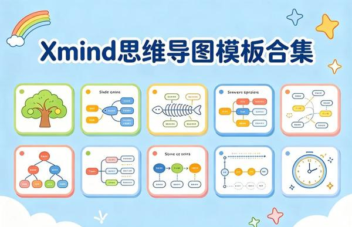

---

## 人生低谷期的头脑转换法低潮时最该读的思维转换指南

[2026-10-09 06:11] 来自：精选网盘资源

名称：《人生低谷期的头脑转换法》：低潮时最该读的思维转换指南

低谷不可怕，可怕的是用旧思维困在原地，本书教你如何换一种想法看待挫折、如何把负面情绪转化为重新出发的动力、如何在最灰暗的时候找到突破口。它不灌鸡汤，而是给你具体可操作的头脑转换技巧。

夸克网盘：https://pan.quark.cn/s/a4e468954d4e

#思维转换 #情绪管理 #心理自助 #逆境成长

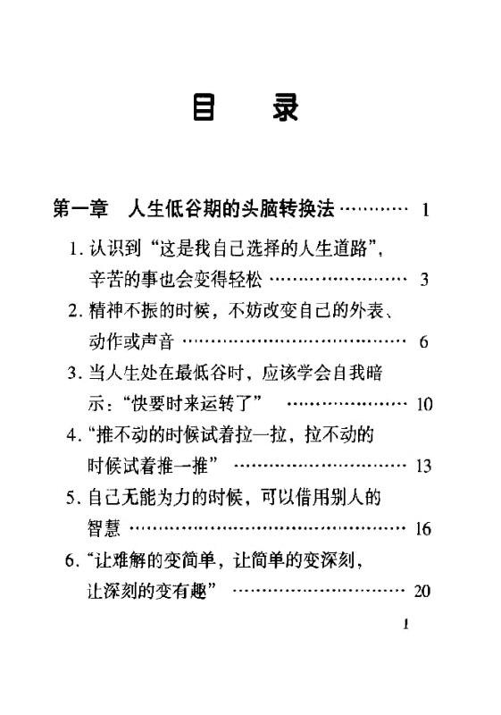

---

## 2026小红书AI内容创作从0到1学习条漫古诗词图片绘本

[2026-10-09 00:12] 来自：综合网盘资源频道

名称：2026小红书AI内容创作从0到1：学习条漫、古诗词图片、绘本

描述：2026 小红书 AI 内容创作从 0 到 1，讲解利用 AI 制作小红书平台内容，覆盖条漫、古诗词图片、绘本几类热门内容形式，从基础入门开始讲解创作思路与实操方法，适合小红书内容创作者，帮助掌握 AI 绘图技巧，产出适合平台发布的图文作品。

夸克网盘：https://pan.quark.cn/s/9869bfae10fa

📁 大小：2.1GB

🏷 标签：#教程 #AI #小红书 #绘本 #创作 #2026小红书AI内容创作从0到1 #学习条漫 #古诗词图片 #quark

---

## 10分钟保健丛书6册全集90年代经典实用保健老书书单

[2026-10-09 00:10] 来自：综合网盘资源频道

名称：《10分钟保健丛书》6册全集，90年代经典实用保健老书书单

描述：《10 分钟保健丛书》全套共 6 册，是 90 年代推出的经典保健读物，内容偏向日常简易养生方法，介绍短时可操作的保健方式，内容通俗易懂，适合对传统日常养生感兴趣的读者翻阅，能够快速了解各类居家保健相关知识。

夸克网盘：https://pan.quark.cn/s/c231fc3ee004

📁 大小：50.0MB

🏷 标签：#书籍 #经典 #丛书 #全集 #实用 #quark

---

## 钱顶顶同城老板轻人设IP打造AI获客

[2026-10-09 00:07] 来自：综合网盘资源频道

名称：钱顶顶《同城老板轻人设IP打造+AI获客》

描述：钱顶顶《同城老板轻人设 IP 打造 + AI 获客》讲解同城商家如何搭建轻量化个人 IP，结合 AI 工具完成客户获取，覆盖人设定位、内容输出、AI 引流等实操环节，适合本地实体门店经营者学习，帮助打造个人 IP，借助 AI 手段挖掘同城潜在客户，提升本地客源转化。

夸克网盘：https://pan.quark.cn/s/6f936f58649f

📁 大小：479.7MB

🏷 标签：#教程 #AI #IP #获客 #同城 #钱顶顶 #同城老板轻人设IP打造 #AI获客 #quark

---

## 上千款Skills技能合集包一站式技能进阶资源库

[2026-10-09 00:04] 来自：综合网盘资源频道

名称：上千款Skills技能合集包，一站式技能进阶资源库

描述：上千款 Skills 技能合集包汇集多样技能内容，搭建一站式技能进阶体系，覆盖不同方向的技能学习内容，满足多场景的技能提升需求，方便学习者按需学习，系统性提升个人能力，适合想要拓展技能储备、进行自我提升的人群。

夸克网盘：https://pan.quark.cn/s/a4216cdaebbf

📁 大小：4.0GB

🏷 标签：#教程 #合集 #进阶 #技能 #资源 #上千款Skills技能合集包 #一站式技能进阶资源库 #quark

---

## 中国古代常用文体规范读本7册

[2026-10-09 00:02] 来自：综合网盘资源频道

名称：【书刊】中国古代常用文体规范读本｜7册

描述：中国古代常用文体规范读本全套共 7 册，系统讲解古代各类文体的体例、写作规范与文本特点，梳理古文写作基础知识，收录相关例文参考，适合古文爱好者、文史学习者阅读，帮助读懂古代文章，掌握不同文体的写作与鉴赏要点。

夸克网盘：https://pan.quark.cn/s/6efcc51a1d8c

📁 大小：47.2MB

🏷 标签：#书籍 #中国 #读本 #古代 #常用 #书刊 #中国古代常用文体规范读本 #quark

---

## 聪明人的个人成长

[2026-10-08 19:52] 来自：Fang的资源分享群

名称：聪明人的个人成长

这本书围绕个人成长展开，适合在职业发展、亲密关系和金钱财富等关键选择前阅读，帮助你重新审视问题，拓宽视野，获得更清晰的思考角度。

夸克网盘：https://pan.quark.cn/s/a9825b4783e0

#个人成长 #人生选择 #职业发展 #亲密关系 #财富思维

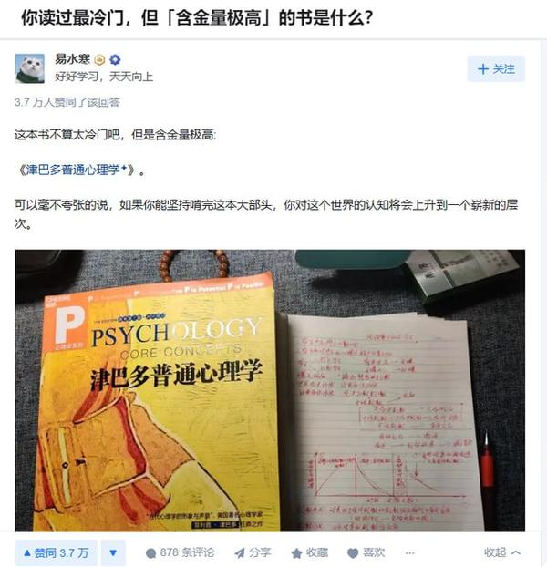

---

## Ai换脸免费模板

[2026-10-08 19:51] 来自：Fang的资源分享群

名称：Ai换脸免费模板

提供视频与照片的AI一键换脸应用，并包含解锁专业版Pro的相关内容，适合想体验换脸效果或制作趣味素材的用户参考使用。

夸克网盘：https://pan.quark.cn/s/877079b20b74

#智能换脸 #视频换脸 #照片换脸 #免费模板 #专业版解锁

---

## 闲鱼自动发货

[2026-10-08 19:48] 来自：Fang的资源分享群

名称：闲鱼自动发货

整理闲鱼免费自动发货工具合集，无需挂机，适合卖教程、素材、电子资料、优惠券和兑换码等虚拟商品，可实现自动发货到买家闲鱼App，帮助减少手动操作。

夸克网盘：https://pan.quark.cn/s/14fcf3972f31

#闲鱼 #自动发货 #免挂机 #虚拟商品 #卖家工具

---

## 视频号中老年赛道

[2026-10-08 19:47] 来自：Fang的资源分享群

名称：视频号中老年赛道

围绕视频号中老年赛道，介绍养生类高佣商品与0门槛橱窗的玩法，并用AI制作风景、语录、古诗和配音视频，适合想通过短视频挂商品变现的人参考。

夸克网盘：https://pan.quark.cn/s/ebd1ac729eb8

#视频号 #中老年赛道 #养生商品 #橱窗带货 #短视频变现

---

## 浙大蒋文华老师讲博弈论用博弈思维破解生活决策难题

[2026-10-08 19:44] 来自：Fang的资源分享群

名称：浙大蒋文华老师讲《博弈论》，用博弈思维破解生活决策难题

蒋文华老师将博弈论拆解为竞争、合作、谈判、决策与信息差等现实案例，帮助你理解局中各方诉求。适合日常选择与沟通谈判时参考，学会少绕弯、看懂局再落子。

夸克网盘：https://pan.quark.cn/s/246e2df6ac44

#博弈论 #决策思维 #沟通谈判 #个人成长 #蒋文华

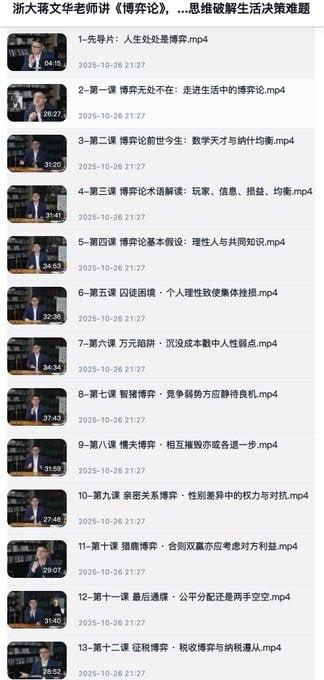

---

## 2026年新版梁老师初中数学课程

[2026-10-08 19:44] 来自：Fang的资源分享群

名称：2026年新版梁老师初中数学课程（7-9年级）

面向初中七至九年级学生，由梁老师讲授新版数学课程内容，适合课前预习、课后复习和阶段巩固使用，帮助梳理知识并跟学练习。

夸克网盘：https://pan.quark.cn/s/49afc4bb5ebf

#初中数学 #梁老师课程 #七至九年级 #数学学习 #新版课程

---

## Emotn浏览器

[2026-10-08 19:44] 来自：Fang的资源分享群

名称：Emotn浏览器

Emotn浏览器是电视端网页浏览器，可在电视上打开网站并观看短视频，适合用大屏浏览网页内容，方便家庭场景下获取在线视频与信息。

夸克网盘：https://pan.quark.cn/s/7a9d50d00df9

#电视浏览器 #网页浏览 #短视频 #电视应用 #大屏上网

---

## 扫描全能王v6910250701解锁破解VIP会员版

[2026-10-08 19:32] 来自：Fang的资源分享群

名称：扫描全能王v6.91.0.250701解锁破解VIP会员版

该资源为扫描全能王v6.91.0.250701解锁破解VIP会员版，可用于文档扫描、文字识别与文件管理，方便日常办公和学习场景使用，帮助减少部分功能限制。

夸克网盘：https://pan.quark.cn/s/c930a28dd115

#扫描全能王 #文档扫描 #文字识别 #VIP会员 #办公工具

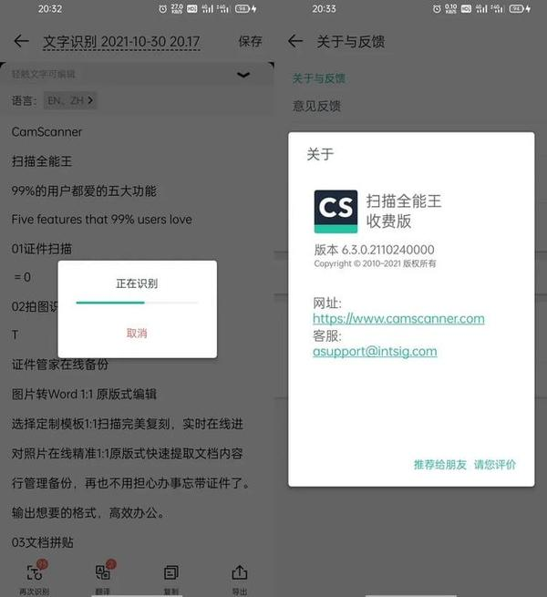

---

## 压缩包密码破解软件

[2026-10-08 19:31] 来自：Fang的资源分享群

名称：压缩包密码破解软件

这是一款压缩包解锁工具，可用于处理忘记密码或无法打开的压缩包，适合需要找回压缩包访问权限的场景，帮助用户解决加密压缩包使用问题。

夸克网盘：https://pan.quark.cn/s/bef861f5b8d0

#压缩包解锁 #密码找回 #工具软件 #文件处理

---

## 电视唱歌软件

[2026-10-08 19:31] 来自：Fang的资源分享群

名称：电视唱歌软件

资源为电视KTV唱歌软件，重点推荐爱唱KTV，支持解锁终身VIP权限，曲库收录超60万首歌曲，不限次数与时长，适合客厅电视与家庭聚会点歌，方便在家唱歌娱乐。

夸克网盘：https://pan.quark.cn/s/faa24327575f

#电视唱歌 #唱歌软件 #家庭娱乐 #电视点歌 #影音娱乐

---

## 阿石才完整版

[2026-10-08 19:31] 来自：Fang的资源分享群

名称：阿石才完整版

本资源为阿石才完整版，内容已按完整版本整理收录，适合对该主题有需求的用户参考查阅，可用于日常学习与资料留存，方便随时翻看使用。

夸克网盘：https://pan.quark.cn/s/5a2913ac58d8

#阿石才 #完整版 #资源分享 #资料参考 #学习资料

---

## AI植物穿越白垩纪教学科普蓝海赛道多种收益

[2026-10-08 19:31] 来自：Fang的资源分享群

名称：AI植物穿越白垩纪教学，科普蓝海赛道+多种收益

介绍如何用AI制作植物穿越白垩纪的科普内容，围绕蓝海赛道选题与多种收益方式展开，适合想做科普短视频或图文的人参考，帮助了解内容制作与变现思路。

夸克网盘：https://pan.quark.cn/s/e0cc425fb158

#AI科普 #白垩纪 #植物穿越 #蓝海赛道 #内容变现

---

## 樊登读书

[2026-10-08 15:45] 来自：综合网盘资源频道

名称：《樊登读书 (帆书) 》合集 (更至20261003)

描述：帆书引领了“听书”的新阅读模式，通过精选好书与深入浅出的解读方式，为书友带来实用新知与智慧启发。

夸克网盘：https://pan.quark.cn/s/8f8edf61d830

百度网盘：https://pan.baidu.com/s/1xvDwu1p4CMLr2Y2rfDbpaA?pwd=1111

📁 大小：N/A

🏷 标签：#阅读 #学习 #课程 #樊登读书 #帆书 #合集 #quark #baidu

---

## 古风传统文化PPT模板教师教学课件素材一键套用

[2026-10-08 06:46] 来自：综合网盘资源频道

名称：古风传统文化PPT模板，教师教学课件素材一键套用

描述：精选古风中国传统文化PPT模板，融合简约国学经典与山水墨画风格，适合教师教学课件、国学课堂、文化讲座和公开课使用。无需设计基础，下载即可快速做出高质量古风教学课件，提升课堂质感与传统文化氛围。

夸克网盘：https://pan.quark.cn/s/07661da9bded

百度网盘：https://pan.baidu.com/s/1eTFrrDbHbfhpKMFUUlcx7A?pwd=jpqi

📁 大小：NG

🏷 标签：#PPT模板 #PPT素材 #传统文化PPT #国学经典PPT #古风传统文化PPT模板 #教师教学课件素材一键套用 #quark #baidu

---

## AI一人公司内容获客领航实战课个人IP

[2026-10-08 06:45] 来自：综合网盘资源频道

名称：AI一人公司内容获客领航实战课：个人IP 博主打造专属Skill

描述：讲解个人短视频IP 底层逻辑、商业定位与账号包装；搭建专属AI 第二大脑复刻自身创作风格，配套素材采集系统、知识库与专属 Skill 补丁。手把手教学业务提示词撰写、自定义 Skill 内容生产线搭建，附赠全套飞书文档、素材压缩包，无需团队即可搭建自动化内容获客闭环

夸克网盘：https://pan.quark.cn/s/3be6feb025ae

📁 大小：21G

🏷 标签：#教程 #AI #一人公司 #内容获客 #实战课 #个人IP #quark #AI一人公司内容获客领航实战课 #博主打造专属Skill

---

## 八十年代老牌教辅中学数学解题方法12册全套

[2026-10-08 06:45] 来自：综合网盘资源频道

名称：八十年代老牌教辅：中学数学解题方法12册全套

描述：初高中解题思路按册整理，涵盖初中至高中全部核心知识点。12册内容包含代数、几何、概率统计等模块，通过典型例题解析与变式训练，帮助学生掌握通性通法，提升解题速度与准确率。适合作为日常学习辅导及中高考备考资料使用。

夸克网盘：https://pan.quark.cn/s/f9959d7b127a

📁 大小：37.8MB

🏷 标签：#学习 #数学 #教辅 #中学数学解题方法 #合集 #八十年代老牌教辅 #中学数学解题方法套 #quark

---

## 获得财色的手段商界竞争与情场的博弈手段pdf

[2026-10-08 06:45] 来自：综合网盘资源频道

名称：获得财色的手段，商界竞争与情场的博弈手段.pdf

描述：财色兼收的经验和理论，读这本书最好的方式是慢读:，非常有意思，围绕商界与情场的博弈手段。女性读者可从中获得「 情场高手」种种手段之免疫抗体，男性读者能从中领悟追求女人种种要诀与禁忌。 自取

夸克网盘：https://pan.quark.cn/s/b5c0a2be18d2

📁 大小：147.8M

🏷 标签：#pdf #获得财色的手段 #财富获取 #异性吸引 #方法解析 #资源参考 #人际交往 #商界竞争与情场的博弈手段 #quark

---

## 上千款Skills技能合集包一站式技能进阶资源库

[2026-10-08 06:10] 来自：精选网盘资源

名称：上千款Skills技能合集包，一站式技能进阶资源库

一套汇集1000+实用技能的资源集合包，涵盖职场办公、AI工具、设计创作、编程开发、数据分析、语言学习与生活技巧等丰富领域。适合学生、职场人、自由职业者及终身学习者按需查阅，快速补齐能力短板，系统提升个人竞争力，打造属于自己的技能进阶地图。

夸克网盘：https://pan.quark.cn/s/868010766876

#Skills合集 #AI工具 #编程开发 #数据分析

---

## 正宗肠粉技术全教程手把手教你做出地道肠粉

[2026-10-08 06:08] 来自：精选网盘资源

名称：正宗肠粉技术全教程，手把手教你做出地道肠粉

一套正宗广式肠粉技术教程，系统讲解米浆调配比例、蒸盘操作、火候控制、馅料搭配与秘制酱汁熬制。适合早餐店、夜市摊、餐饮创业者及家庭烹饪爱好者学习，帮助快速掌握稳定出品的肠粉技术，做出皮薄爽滑、酱香浓郁的地道风味。

百度网盘：https://pan.baidu.com/s/1H0K24WrQ6wGIpFNDSa6bfQ?pwd=th4y

#肠粉技术 #广式肠粉 #肠粉教程 #肠粉配方

---

## 免费开源视频下载器支持多个自媒体平台

[2026-10-08 06:06] 来自：精选网盘资源

名称：免费开源视频下载器，支持多个自媒体平台

一款免费开源的热门视频下载器，支持YouTube、B站等超过100个平台。只需复制视频链接，即可一键下载高清视频和音频，保留原画质无水印。支持格式转换、批量下载和字幕提取，界面简洁，操作方便。

夸克网盘：https://pan.quark.cn/s/223f787c311d

#ytDownloader #视频下载器 #无水印下载 #视频下载工具

---

## 青年约会黄金法则从破冰到确立关系一次讲透

[2026-10-08 06:04] 来自：精选网盘资源

名称：青年约会黄金法则，从破冰到确立关系一次讲透

一套专为青年男女打造的相亲约会恋爱实战指南，围绕约会黄金法则展开，以真实案例拆解常见误区，帮助相亲新手摆脱尬聊与冷场，建立自然舒适的互动模式，顺利从初次见面走向稳定恋爱关系。

夸克网盘：https://pan.quark.cn/s/0f993e60c67d

#约会法则 #破冰话题 #邀约技巧 #恋爱沟通

---

## 10分钟保健丛书6册全集90年代经典实用保健老书书单

[2026-10-08 06:00] 来自：精选网盘资源

名称：《10分钟保健丛书》6册全集，90年代经典实用保健老书书单

一套出版于上世纪90年代的实用保健丛书，共6册，涵盖日常养生、穴位按摩、食疗调理、运动保健、常见病预防与心理调适等主题。书中方法简单易行，强调每天10分钟即可见效，语言通俗、步骤清晰，保留了大量传统保健智慧与自测表格。

夸克网盘：https://pan.quark.cn/s/1c7aeec8993f

#保健丛书 #健康养生 #保健书籍 #养生方法

---

## 天机意根读懂人生游戏规则的灵魂升级指南

[2026-10-08 05:58] 来自：精选网盘资源

名称：《天机意根》：读懂人生游戏规则的灵魂升级指南

为什么你总在同一类事情上反复受苦？为什么明明想改变，却总被无形力量拉回原点？本书用25篇深度短文，把潜意识、命运、情绪与开悟的底层逻辑全拆开了——你的潜意识就是你的命运，大脑不过是一条狗，事压不垮人但情绪可以。

夸克网盘：https://pan.quark.cn/s/357267379eba

#情绪真相 #保持觉知 #潜意识 #内观开悟

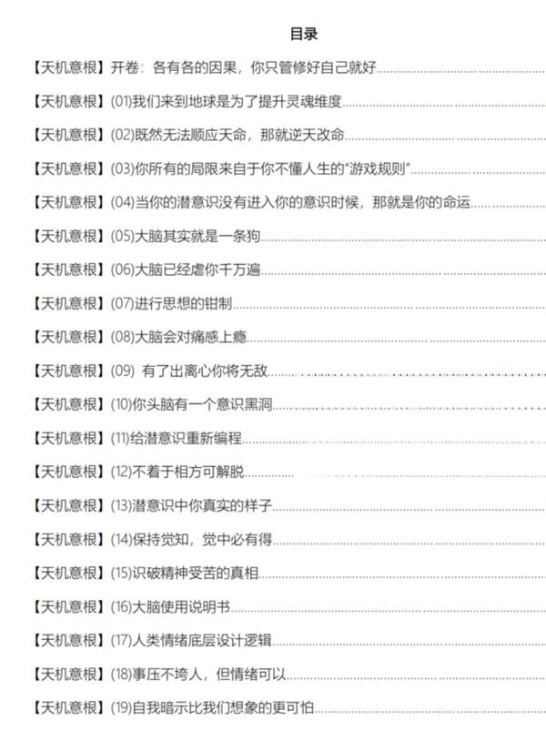

---

## 2026年新版梁老师初中数学课程

[2026-10-08 00:16] 来自：综合网盘资源频道

名称：2026年新版梁老师初中数学课程(7-9年级)

描述：2026 年新版梁老师初中数学课程覆盖 7 至 9 年级全部内容，贴合初中数学教学大纲，梳理基础知识点，拆解各类题型解题思路，帮助学生夯实数学基础，掌握解题方法，适合初中生日常学习、课前预习以及课后巩固提升使用。

夸克网盘：https://pan.quark.cn/s/785c9cc09325

📁 大小：88.8GB

🏷 标签：#学习 #课程 #新版 #初中数学 #基础 #quark

---

## 设计师AI工作指南20从思维落地

[2026-10-08 00:15] 来自：综合网盘资源频道

名称：《设计师AI工作指南2.0》从思维落地

描述：《设计师 AI 工作指南 2.0》从思维层面切入，讲解设计师如何将 AI 工具融入日常工作流程，梳理从创意构思到项目落地的全链路方法，涵盖 AI 辅助设计、效率提升等实操内容，适合平面、视觉等各类设计师学习，帮助转变工作思路，借助 AI 提升设计产出效率与创意表现。

夸克网盘：https://pan.quark.cn/s/35a370ce2fb8

📁 大小：13.0GB

🏷 标签：#教程 #AI #思维 #指南 #工作 #设计师AI工作指南 #从思维落地 #quark

---

## 周星驰版的鹿鼎记

[2026-10-07 19:40] 来自：Fang的资源分享群

名称：周星驰版的《鹿鼎记》

周星驰版《鹿鼎记》兼具映射和内涵，情节流畅有趣，适合想重温经典港片、放松解压时观看，常看常新，能带来持续观影乐趣。

夸克网盘：https://pan.quark.cn/s/a092e625870b

#周星驰 #鹿鼎记 #港片经典 #喜剧电影 #观影推荐

---

## 深度剖析两性关系背后的真相

[2026-10-07 19:37] 来自：Fang的资源分享群

名称：《深度剖析：两性关系背后的真相》

这份资料围绕两性关系中的核心心理机制展开，涉及情感操纵、吸引力法则与长期关系维系等话题，适合想深入理解情感互动、识别关系模式并获得认知参考的读者。

夸克网盘：https://pan.quark.cn/s/ac3a6b854ea2

#两性关系 #情感心理 #吸引力法则 #长期关系 #情感认知

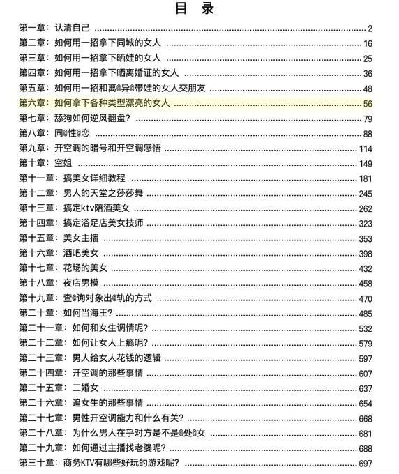

---

## TV软件全合集

[2026-10-07 19:35] 来自：Fang的资源分享群

名称：TV软件全合集

本资源为TV软件全合集，安装后即可使用，无需付费。适合在电视或电视盒子上按需选择安装使用，帮助快速找到可用软件，省去逐个查找和测试的麻烦。

夸克网盘：https://pan.quark.cn/s/6f4c036d4adc

#TV软件 #电视应用 #免费软件 #安装即用 #软件合集

---

## 交大生存手册

[2026-10-07 19:33] 来自：Fang的资源分享群

名称：交大生存手册

《交大生存手册》围绕摆脱应试惯性、人生规划、长期价值、学习科研本质、留学避坑与团队协作展开，适合刚离开应试教育、面对选择却缺少方法的人参考。

夸克网盘：https://pan.quark.cn/s/2a7145c3bf3f

#人生规划 #应试教育 #学习方法 #留学避坑 #团队协作

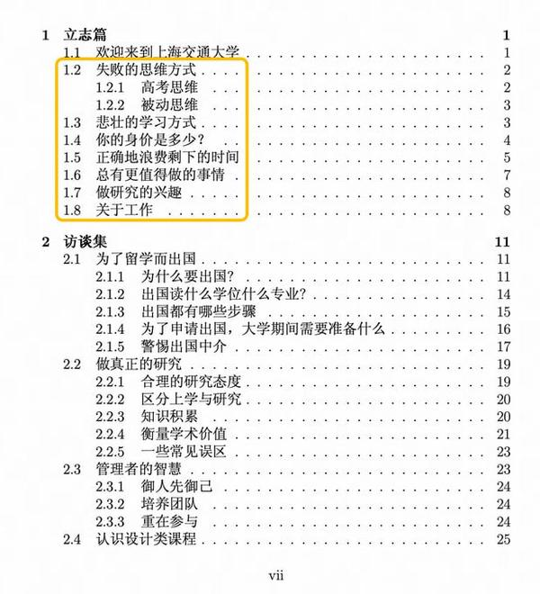

---

## 超多美女主播

[2026-10-07 19:28] 来自：Fang的资源分享群

名称：超多美女主播 一字马

该合集收录美女主播一字马、JK学院、韩国美女模特与韩服写真图片等内容，适合喜欢主播写真和韩系风格素材的用户浏览、收藏与日常参考。

夸克网盘：https://pan.quark.cn/s/7d4250bc42cd

#美女主播 #一字马 #韩服写真 #图片合集 #韩国模特

---

## 香港大学推荐的50本经典书籍读过一定会有很大收获pdf

[2026-10-07 19:24] 来自：Fang的资源分享群

名称：香港大学推荐的50本经典书籍读过一定会有很大收获[pdf]

包含香港大学推荐的50本经典书籍PDF和TXT格式资源，适合日常阅读与书单参考，可帮助按推荐书目选读并保存到设备随时翻阅。

夸克网盘：https://pan.quark.cn/s/15f7459ad54c

#经典书籍 #书单推荐 #电子书资源 #阅读分享 #港大推荐

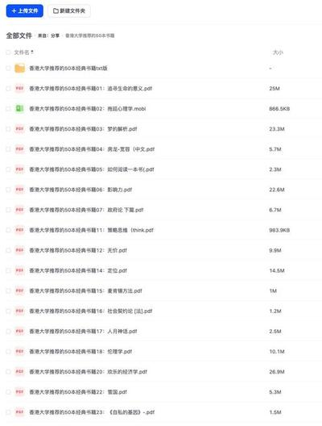

---

## 狐猴浏览器大麦抢票手机版

[2026-10-07 19:19] 来自：Fang的资源分享群

名称：狐猴浏览器--大麦抢票手机版

教程围绕狐猴浏览器与大麦抢票手机版脚本的搭配使用，逐步骤演示安装与配置流程，适合想在手机上自行操作抢票的用户参考，帮助理解各环节设置与参数调整思路。

夸克网盘：https://pan.quark.cn/s/678de35fda08

#狐猴浏览器 #大麦抢票 #手机抢票 #脚本配置 #操作教程

---

## B站付费课程

[2026-10-07 19:19] 来自：Fang的资源分享群

名称：B站付费课程（1-260）

整理B站付费课程1至260，通过夸克网盘分享，适合按编号查找并系统学习参考，方便快速获取所需的课程内容。

夸克网盘：https://pan.quark.cn/s/f3466dc399fe

#B站课程 #付费课程 #网盘资源 #学习资料 #课程合集

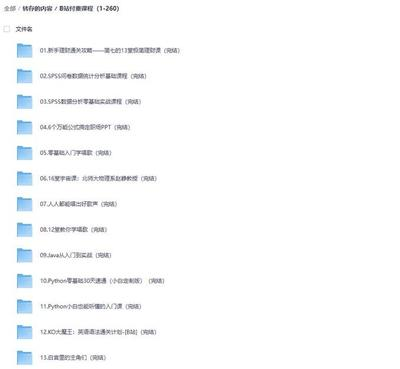

---

## CB短剧

[2026-10-07 19:19] 来自：Fang的资源分享群

名称：CB短剧

本资源为CB短剧整理的午夜福利向擦边短剧合集，包含19部短剧，适合短剧爱好者在碎片时间集中观看与收藏，便于快速了解相关题材内容。

夸克网盘：https://pan.quark.cn/s/b8640bfc417d

#短剧合集 #擦边短剧 #午夜福利 #资源分享 #影视娱乐

---

## MusicDL

[2026-10-07 19:19] 来自：Fang的资源分享群

名称：MusicDL v1.0.0.389 聚合全网音乐 免费畅听 下载无损

MusicDL v1.0.0.389 是一款音乐聚合工具，可搜索并试听多平台音乐，支持下载无损音质，适合想集中找歌、离线收藏的用户使用。

夸克网盘：https://pan.quark.cn/s/37f4d609535f

#音乐下载 #音乐聚合 #无损音质 #免费听歌 #工具软件

---

## 拉新野路子玩法

[2026-10-07 19:19] 来自：Fang的资源分享群

名称：拉新野路子玩法

围绕拉新获客的野路子玩法分享，梳理常见推广思路与操作流程，适合需要拓展新用户的运营或推广人员参考，帮助打开拉新思路。

夸克网盘：https://pan.quark.cn/s/902c8598e1b5

#拉新玩法 #获客推广 #用户增长 #运营思路 #引流技巧

---

## 中国各省地域民俗知识丛书28册pdf资料全集

[2026-10-07 15:17] 来自：综合网盘资源频道

名称：中国各省地域民俗知识丛书28册.pdf资料全集

描述：“百里不同风，千里不同俗”,各省地域民俗资料，由当地民俗学者实地采编，资料鲜活、细节丰富，兼具资料性与可读性。是民俗研究者、地方文化爱好者与写作者深入了解中国民间生活样貌的宝贵参考书系。

夸克网盘：https://pan.quark.cn/s/87dccf9a4d8b

百度网盘：https://pan.baidu.com/s/1EXqUcShJ1F7k8Eog6oqlwg?pwd=3553

📁 大小：1.1G

🏷 标签：#书籍 #电子书 #pdf #中国各省民俗知识丛书 #quark #中国各省地域民俗知识丛书 #pdf资料全集 #baidu

---

## 古风传统文化PPT模板教师教学课件素材一键套用

[2026-10-07 06:49] 来自：精选网盘资源

名称：古风传统文化PPT模板，教师教学课件素材一键套用

精选古风中国传统文化PPT模板，融合简约国学经典与山水墨画风格，适合教师教学课件、国学课堂、文化讲座和公开课使用。无需设计基础，下载即可快速做出高质量古风教学课件，提升课堂质感与传统文化氛围。

夸克网盘：https://pan.quark.cn/s/716abe441ed2

#PPT模板 #PPT素材 #传统文化PPT #国学经典PPT

---

## 大锅卤菜全套配方从卤水调制到开店全流程

[2026-10-07 06:47] 来自：精选网盘资源

名称：大锅卤菜全套配方，从卤水调制到开店全流程

本教程系统讲解卤水调制、香料配比、食材处理、火候把控和保存技巧，覆盖猪货、鸡货、鸭货、素菜等全套品类。适合摆摊创业、熟食开店和餐饮新手，无需厨师基础，学完即可独立做出正宗大锅卤菜并落地开店。

百度网盘：https://pan.baidu.com/s/1ZJGasK82ANRNdjgXbY-V0A?pwd=znkf

#大锅卤菜 #大锅卤菜配方 #鸭货卤制 #卤菜全套技术

---

## OCR图片转文字识别助手免费精准提取文字表格

[2026-10-07 06:45] 来自：精选网盘资源

名称：OCR图片转文字识别助手，免费精准提取文字+表格

一款实用的OCR图片转文字识别助手，可快速从图片、截图或扫描件中精准提取文字和表格内容。支持批量处理、多语言识别，并可将结果导出为TXT、Word或Excel格式。识别准确率高，操作简单，适合办公文档整理、学习资料录入、票据信息提取等场景，大幅提升文字录入效率。

夸克网盘：https://pan.quark.cn/s/c0eb53a0dfb6

#图片转文字 #文字识别 #OCR软件 #表格提取

---

## 豆包工作飞书新手训练营快速掌握AI办公全流程

[2026-10-07 06:28] 来自：精选网盘资源

名称：豆包工作+飞书新手训练营，快速掌握AI办公全流程

一套面向办公场景的豆包与飞书新手训练营，课程以实操驱动，帮助零基础学员快速掌握AI办公与协作工具，提升个人与团队效率，实现从入门到独立完成多类型任务的跨越。

百度网盘：https://pan.baidu.com/s/1XPI-2uWY8WcsY55rufWa6g?pwd=vyxs

#豆包实战 #飞书协作 #AI办公工具 #效率提升 #职场技能

---

## Word高效工作指南教程轻松搞定文档任务

[2026-10-07 06:26] 来自：精选网盘资源

名称：Word高效工作指南教程，轻松搞定文档任务

一套Word高效工作实战教程，以真实办公场景为例，手把手演示操作步骤，帮助行政、文秘、教师及职场新人快速提升文档处理效率，减少重复劳动，从排版小白进阶Word高手，轻松应对日常办公与汇报需求。

夸克网盘：https://pan.quark.cn/s/07fdecf08a34

#Word教程 #办公技能 #Word技巧 #文档排版 #办公效率

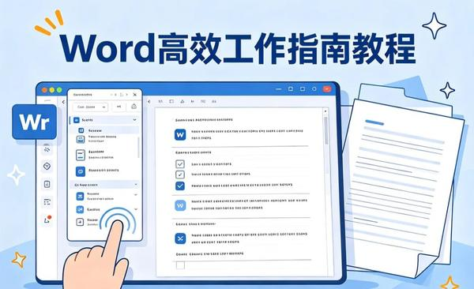

---

## 怎样使脑处于最佳状态让大脑高效运转的实用指南

[2026-10-07 06:21] 来自：精选网盘资源

名称：《怎样使脑处于最佳状态》：让大脑高效运转的实用指南

为什么有人精力充沛、思路清晰，你却总是头昏脑涨、注意力涣散？本书从饮食营养、作息规律、用脑习惯到情绪调节，系统讲解如何让大脑保持高效运转。它不是空谈理论，而是给你拿来就能用的科学方法。

夸克网盘：https://pan.quark.cn/s/6a49c1fce059

#科学用脑 #提升记忆力 #精力管理 #大脑保养

---

## 天朝的崩溃

[2026-10-07 01:13] 来自：Fang的资源分享群

名称：《天朝的崩溃》

本书围绕清廷内部的集体失真展开，梳理前线失利如何被层层包装成捷报，官员如何把精力用于瞒住皇帝，并反思系统拒绝真实后走向失灵的过程，适合想理解庞大体系为何迅速崩塌的读者。

夸克网盘：https://pan.quark.cn/s/96579c9e1ca1

#历史 #中国近代史 #制度反思 #组织失灵 #清廷政治

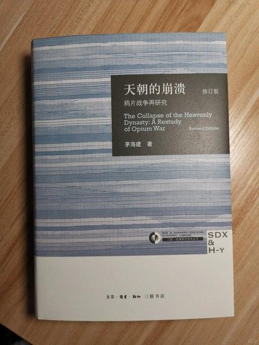

---

## 侠盗猎车破解版合集

[2026-10-07 01:11] 来自：Fang的资源分享群

名称：侠盗猎车破解版合集

资源为侠盗猎车破解版合集，按保存资源、上架商品、收钱三步操作，适合在闲鱼、小红书等平台进行单机游戏资源分享，帮助整理并发布。

夸克网盘：https://pan.quark.cn/s/6511af647756

#侠盗猎车 #破解版合集 #单机游戏 #资源分享 #闲鱼小红书

---

## 3分钟制作高情绪插画视频孤独感拉满轻松涨粉变现

[2026-10-07 01:10] 来自：Fang的资源分享群

名称：3分钟制作高情绪插画视频，孤独感拉满，轻松涨粉变现

该资源演示3分钟制作高情绪插画视频的流程，围绕孤独感表达，适合短视频创作与账号运营场景，帮助提升内容情绪感染力。

夸克网盘：https://pan.quark.cn/s/9e0ed21e58a5

#插画视频 #情绪表达 #短视频制作 #孤独感 #涨粉变现

---

## 苹果自动记账软件

[2026-10-07 01:09] 来自：Fang的资源分享群

名称：苹果自动记账软件

苹果自动记账软件资源，包含自动记账指令内容，下载后可直接使用或按资料上架到店铺。适合想用iPhone自动记录日常收支、简化记账流程的人参考。

夸克网盘：https://pan.quark.cn/s/535e2fb70db2

#自动记账 #苹果软件 #记账工具 #资源分享 #效率提升

---

## 抖音小姐姐视频800部

[2026-10-07 01:08] 来自：Fang的资源分享群

名称：抖音小姐姐视频800部

网友精心整理的抖音小姐姐视频合集，共800部，适合日常休闲观看，方便按兴趣集中浏览同类型短视频内容。

夸克网盘：https://pan.quark.cn/s/f6963dde9b08

#抖音视频 #小姐姐合集 #短视频资源 #休闲观看 #网友整理

---

## 2026最新视频号银发经济玩法

[2026-10-07 01:03] 来自：Fang的资源分享群

名称：2026最新视频号银发经济玩法

围绕视频号银发经济，内容面向中老年群体，讲解新手可上手的操作思路与玩法，适合寻找稳定需求与转化场景的创作者参考。

夸克网盘：https://pan.quark.cn/s/bdbacffee597

#视频号 #银发经济 #中老年群体 #新手运营 #内容转化

---

## 某雷杂交版

[2026-10-07 01:03] 来自：Fang的资源分享群

名称：某雷杂交版

这是加强版迅雷魔改版本，去除广告，优化图标与界面，下载速度超过20MB/s。适合需要高速下载和简洁界面的用户，便于日常文件获取。

夸克网盘：https://pan.quark.cn/s/0c51d7184a97

#迅雷 #下载工具 #无广告 #魔改版 #界面优化

---

## 李宏军等主编

[2026-10-07 01:03] 来自：Fang的资源分享群

名称：李宏军等主编

《做男人“挺、坚”难》电子书系统科普男性功能健康，讲解相关奥秘与疑难，并介绍现代治疗技术和把握时机的思路，适合关注自身健康的男性阅读参考。

夸克网盘：https://pan.quark.cn/s/744c7f29b00b

#男性健康 #健康科普 #男性功能 #电子书 #治疗技术

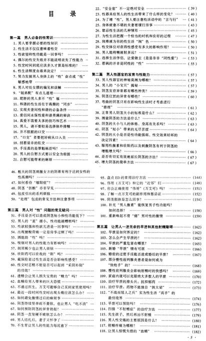

---

## 男性情感电子书合集

[2026-10-07 01:03] 来自：Fang的资源分享群

名称：男性情感电子书合集

该合集围绕男性情感与社交，包含通过抖音大学定位私信、约拍等方式认识女大学生的流程与互动思路，适合想提升搭讪和聊天能力的人参考。

夸克网盘：https://pan.quark.cn/s/dd0ca3381ed6

#男性情感 #社交技巧 #搭讪方法 #聊天互动 #电子书合集

---

## 天赐完整版

[2026-10-07 01:03] 来自：Fang的资源分享群

名称：天赐完整版

天赐完整版，提供该名称对应的完整版本内容，适合需要获取和留存该资源的用户使用，具体内容与形式请以实际文件为准。

夸克网盘：https://pan.quark.cn/s/8e9d308a6549

#天赐完整版 #资源分享 #完整版 #资源获取

---

## 公众号流量主课程拆解新手也能快速跑通收益

[2026-10-07 01:02] 来自：Fang的资源分享群

名称：公众号流量主课程拆解，新手也能快速跑通收益

围绕公众号流量主课程进行拆解，梳理新手从了解到跑通收益的流程与要点，适合想做公众号变现的人参考，帮助理解操作思路与常见步骤。

夸克网盘：https://pan.quark.cn/s/64836605ec39

#公众号流量主 #公众号变现 #新手教程 #课程拆解 #流量主运营

---

## 方言新作第二天金钱进化论帮助我们理顺财富管理与人生幸福

[2026-10-06 21:44] 来自：综合网盘资源频道

名称：方言新作《第二天：金钱进化论》帮助我们理顺财富管理与人生幸福

描述：有钱后如何不破产、为什么很多人辛苦攒下财富，短短十年就悄然返贫？ 我们总以为财务自由是人生终点，读完《第二天》你就会明白：赚到钱只是人生的第一天，守好财富、稳住人生，才是最难的...方言的《第二天-金钱进化论》推荐你读读

夸克网盘：https://pan.quark.cn/s/35b9d2155af7

📁 大小：51.2MB

🏷 标签：#书籍 #第二天金钱进化论 #财富管理 #电子书 #pdf #方言新作 #帮助我们理顺财富管理与人生幸福 #quark

---

## 你缺失的那门计算机课

[2026-10-06 17:53] 来自：综合网盘资源频道

名称：【开源电子扫盲书】你缺失的那门计算机课 PDF 版，计算机科学普及读物

描述：现在的年轻一代手机刷的起飞、却连解压文件、找个下载路径、盲打键盘都不会！分享一本全网超火适合电脑小白入门的电计算机书，从最基础的文件管理、软件寻找与安装，到前沿的生成式 AI的各种技巧、网络安全与云计算，这本书零门槛、易理解且有深度帮你把这门课补上，真正驾驭电脑。

夸克网盘：https://pan.quark.cn/s/4661132d7364

📁 大小：117.9M

🏷 标签：#书籍 #图书 #扫盲 #你缺失的那门计算机课 #PDF #计算机 #科普读物 #开源电子扫盲书 #计算机科学普及读物 #quark

---

## workbuddy大学生使用手册与实战指南从零掌握你的

[2026-10-06 17:53] 来自：综合网盘资源频道

名称：workbuddy大学生使用手册与实战指南，从零掌握你的 AI 办公智能体

描述：搞定课程资料、PPT、论文开题降重、竞赛计划书、社团活动，还有求职等常用场景。你可以从下载安装和第一个任务开始，再进入 Skills、连接器、移动办公、知识管理、专业诊断、内容自动化和多 Agent 团队，最终把一次成功沉淀为团队可复用的 AI 工作系统。

夸克网盘：https://pan.quark.cn/s/819278fa72f9

📁 大小：2.7MB

🏷 标签：#学习 #AI #workbuddy #大学生使用手册 #实战指南 #从零掌握你的 #办公智能体 #workbuddy大学生使用手册与实战指南 #quark

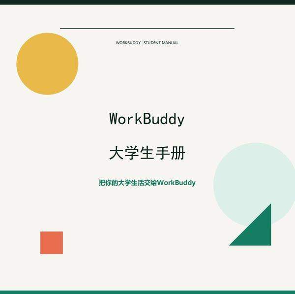

---

## 网上超火的高性价比人生指南pdf电子版把人生决策做成一本投资说明书

[2026-10-06 17:53] 来自：综合网盘资源频道

名称：网上超火的《高性价比人生指南》pdf电子版，把人生决策做成一本投资说明书 -

描述：把普通人怎么过日子这件事给你整成了一本开源的人生说明书！ 共有601 条人生建议。覆盖长寿防病、意外急救、省钱理财、防骗与法律红线、失业兜底、创业风险、恋爱婚育、出国与技能。每条写明成本、收益、证据等级 ... 从少生病、少花冤枉钱…..

夸克网盘：https://pan.quark.cn/s/2776e6f51d52

百度网盘：https://pan.baidu.com/s/1r-SpiQAvdiDGRISK1BplUg?pwd=iveh

📁 大小：5.5MB

🏷 标签：#书籍 #高性价比人生指南 #pdf #电子版 #投资 #电子书 #网上超火的 #pdf电子版 #把人生决策做成一本投资说明书 #quark #baidu

---

## 网红爆浆芝士炸猪排教程摆摊开店在家做都能复刻

[2026-10-06 06:29] 来自：精选网盘资源

名称：网红爆浆芝士炸猪排教程，摆摊开店在家做都能复刻

一套网红爆浆芝士炸猪排制作技术教程，精准量化配方，剖析爆浆拉丝与酥脆外皮的核心要点，适合小吃创业者、夜市摊主及家庭烹饪爱好者学习，轻松做出外酥里嫩、切开爆浆的网红炸猪排。

百度网盘：https://pan.baidu.com/s/1-RHps5WLII5ceXoGzKgxvg?pwd=byhq

#网红爆浆猪排 #炸猪排教程 #网红小吃 #小吃技术 #炸猪排技术

---

## 几百款新鲜水果PNG免抠素材设计剪辑电商必备

[2026-10-06 06:28] 来自：精选网盘资源

名称：几百款新鲜水果PNG免抠素材，设计剪辑电商必备

一套包含几百款新鲜水果的PNG免抠素材合集，全部为高清透明背景格式，无需抠图即可直接使用。素材适配PPT、海报、电商主图、短视频贴纸与菜单设计等场景，帮助设计师、电商运营、自媒体人及办公用户快速美化作品，提升视觉吸引力与制作效率。

百度网盘：https://pan.baidu.com/s/1CHmhZVgnI4lfROBJissLvw?pwd=jfas

#水果PNG #免抠素材 #PNG素材 #设计素材

---

## AI教辅资料生成工具一键生成图文教辅试卷

[2026-10-06 06:25] 来自：精选网盘资源

名称：AI教辅资料生成工具，一键生成图文教辅+试卷

一款与国家中小学智慧教育平台同步的AI教辅生成工具，可根据年级、学科和知识点，一键生成图文并茂的教辅资料和配套试卷。内容贴合教材大纲，题型丰富，支持自定义难度和题量。帮助家长精准辅导、教师高效备课，告别盲目购买教辅，省钱又省心。

夸克网盘：https://pan.quark.cn/s/54447e0c23c5

#AI教辅生成 #一键生成试卷 #图文教辅 #教辅资源

---

## 王力宏线上唱歌课程零基础也能唱出动人好声音

[2026-10-06 06:12] 来自：精选网盘资源

名称：王力宏线上唱歌课程，零基础也能唱出动人好声音

一套由金曲歌王王力宏亲授的线上唱歌课程，系统讲解呼吸控制、发声位置、音准节奏、共鸣运用与情感表达等核心技巧。课程结合示范演唱与逐句拆解，帮助学员找到适合自己的音色与演唱方式，突破高音、跑调与气息不足等常见问题。

夸克网盘：https://pan.quark.cn/s/ce6b40a7e406

#发声技巧 #零基础学唱歌 #呼吸控制 #唱歌课程

---

## 解决问题的策略与技能从卡壳到破局的思维训练手册

[2026-10-06 06:07] 来自：精选网盘资源

名称：《解决问题的策略与技能》：从卡壳到破局的思维训练手册

为什么有人遇到问题三下五除二就搞定，你却越解越乱？差别不在智商，在方法。本书系统讲解问题分析、策略选择与实操技能——从界定问题、拆解要素到方案评估，每一步都给你清晰路径。

夸克网盘：https://pan.quark.cn/s/47e33b8625ab

#问题分析 #策略选择 #破局思维 #解决问题 #思维训练

---

## 知识付费实战课新手也能快速搭建变现体系

[2026-10-05 22:48] 来自：综合网盘资源频道

名称：知识付费实战课，新手也能快速搭建变现体系

描述：系统拆解知识付费全流程，覆盖定位选题、课程设计、内容打磨、平台选择、引流获客、成交转化和复购裂变。适合知识博主、自媒体人、培训师和副业新手，无需粉丝基础，学完即可搭建一套可落地的知识付费变现体系。

夸克网盘：https://pan.quark.cn/s/248653fbb19e

百度网盘：https://pan.baidu.com/s/1rXziMA9rPx5s0Tlz2VIMsQ?pwd=wtbs

📁 大小：NG

🏷 标签：#资源 #课程 #知识付费 #变现体系 #自媒体 #副业 #知识付费实战课 #新手也能快速搭建变现体系 #quark #baidu

---

## GEO优化系列教程从被搜索到被AI主动推荐

[2026-10-05 22:48] 来自：综合网盘资源频道

名称：GEO优化系列教程，从被搜索到被AI主动推荐

描述：本系列教程系统讲解GEO优化全流程，覆盖AI搜索逻辑、内容布局、权威信源建设、结构化数据、问答式文案和多平台适配，手把手教你在Gemini、ChatGPT等AI工具中获得推荐。适合中小企业主、自媒体和营销人，学完即可抢占AI流量红利。

夸克网盘：https://pan.quark.cn/s/cb3d84a3a1f3

百度网盘：https://pan.baidu.com/s/1NBvKKhe4JgL_rF7h0D3yqg?pwd=sd6a

📁 大小：NG

🏷 标签：#资源 #教程 #GEO #GEO优化 #AI搜索 #GEO优化系列教程 #从被搜索到被AI主动推荐 #quark #baidu

---

## 魅力演说课程系统打造你的舞台感染力与影响力

[2026-10-05 22:47] 来自：综合网盘资源频道

名称：魅力演说课程，系统打造你的舞台感染力与影响力

描述：一套系统化的魅力演说训练课程，涵盖台风塑造、声音训练、肢体语言、内容结构、开场破冰、故事表达与临场应变等核心模块。课程通过示范拆解与实战演练，帮助学员克服紧张、提升表达感染力，在演讲、汇报、路演与社交场合中自信发声。

夸克网盘：https://pan.quark.cn/s/4379b198feb3

百度网盘：https://pan.baidu.com/s/1unWmSSR5rcshc1_mxDK7lQ?pwd=6ufc

📁 大小：NG

🏷 标签：#资源 #课程 #演说课程 #临场应变 #演说技巧 #演讲课程 #口才训练 #魅力演说课程 #系统打造你的舞台感染力与影响力 #quark #baidu

---

## 零基础游泳速成课轻松克服怕水掌握安全技巧

[2026-10-05 22:47] 来自：综合网盘资源频道

名称：零基础游泳速成课，轻松克服怕水+掌握安全技巧

描述：一套专为零基础学员设计的游泳速成课程，系统讲解水中呼吸、漂浮站立、蛙泳蹬腿与划手配合等核心技巧，同时覆盖防溺水自救与安全常识。课程分步骤拆解动作，配合陆上模仿与水中练习，帮助怕水者快速建立水感与信心。

夸克网盘：https://pan.quark.cn/s/695d3a795576

百度网盘：https://pan.baidu.com/s/1l0juZohswKu668nFaubP0A?pwd=92hj

📁 大小：NG

🏷 标签：#资源 #课程 #游泳速成课 #游泳教学 #游泳课程 #游泳培训 #零基础游泳速成课 #轻松克服怕水 #掌握安全技巧 #quark #baidu

---

## 获得财色的手段

[2026-10-05 21:41] 来自：Fang的资源分享群

名称：获得财色的手段

资源围绕获取财富与异性吸引的手段展开，适合对相关话题感兴趣的读者参考，帮助梳理思路并了解其中讨论的角度。

夸克网盘：https://pan.quark.cn/s/ca24cf034bae

#财富获取 #异性吸引 #方法解析 #资源参考 #人际交往

---

## 一位哈佛教授的生命领悟用这四件事情重启人生活出你的生命价值epub

[2026-10-05 21:36] 来自：综合网盘资源频道

名称：一位哈佛教授的生命领悟，用这四件事情重启人生，活出你的生命价值.epub

描述：重启人生：一位哈佛教授的生命领悟，给你过好余生的简单建议，当发生改变时，你没有勇气展开另一种人生吗？ 过去，我们总以为只要认真努力，拥抱简单的成功公式：心无旁骛，牺牲个人生活，一心一意往上爬，辛苦总会有代价

百度网盘：https://pan.baidu.com/s/1WfP5RIOxRNOZpS2LMyFlug?pwd=T94f

📁 大小：611KB

🏷 标签：#baidu #书籍 #重启人生 #活出你的生命价值 #epub #一位哈佛教授的生命领悟 #用这四件事情重启人生

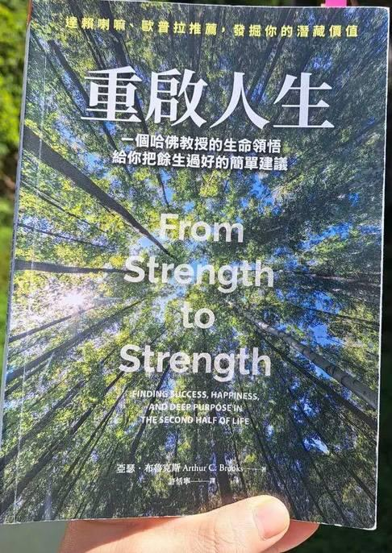

---

## 一天200

[2026-10-05 21:36] 来自：综合网盘资源频道

名称：一天200+ 创新的美团拍照项目：全网首发，一分钟一单

描述：美团拍照掘金，一分钟一单，一天200+ 创新的美团拍照项目，利用手机轻松赚钱，支持快速下单，无任何门槛，助力用户实现每天200+的收入，迅速抓住掘金机会。

夸克网盘：https://pan.quark.cn/s/10bdb38b477f

夸克网盘：https://pan.quark.cn/s/71199091caa5 来自：Fang的资源分享群 [2026-10-05 21:34] 名称：一天200+ 创新的美团拍照项目：全网首发，一分钟一单

📁 大小：48.4MB

🏷 标签：#副业 #兼职 #美团拍照项目 #教程 #quark #一天200 #创新的美团拍照项目 #全网首发 #一分钟一单

---

## 400万粉丝博主姜胡说

[2026-10-05 21:36] 来自：Fang的资源分享群

名称：400万粉丝博主姜胡说（胡子哥）AI内容Skill合集

该合集整理姜胡说（胡子哥）关于AI内容创作的Skill，适合想学习AI内容生产流程与实操思路的创作者参考，帮助你梳理方法并应用于日常内容制作。

夸克网盘：https://pan.quark.cn/s/4c581dd3d8fd

夸克网盘：https://pan.quark.cn/s/7ffce17eadc3 来自：综合网盘资源频道 [2026-10-05 17:09] 名称：400万粉丝博主姜胡说(胡子哥)AI内容Skill合集

#姜胡说 #胡子哥 #人工智能 #内容创作 #创作合集

---

## 吾爱出品TTS神器免费不限字数配音字幕一键生成

[2026-10-05 21:34] 来自：Fang的资源分享群

名称：吾爱出品TTS神器，免费不限字数配音+字幕一键生成

这款吾爱出品的TTS神器支持免费不限字数配音，并能一键生成字幕，适合视频配音、字幕制作等场景，帮助减少手动录音和打字幕的繁琐操作。

夸克网盘：https://pan.quark.cn/s/77a48e0e2eec

#TTS配音 #字幕生成 #免费工具 #视频制作 #吾爱出品

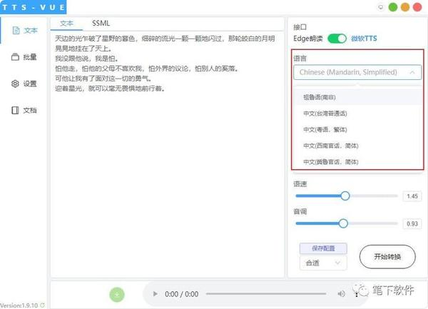

---

## 这个面试有点硬完整

[2026-10-05 21:34] 来自：Fang的资源分享群

名称：这个面试有点硬完整

资源名称显示为面试相关内容，适合求职面试准备时参考，可用来梳理应对思路与表达方式，具体内容以实际资源为准。

夸克网盘：https://pan.quark.cn/s/1a9e7de81474

#面试 #求职 #面试准备 #职场 #资源

---

## AI视频全流程创作课

[2026-10-05 17:09] 来自：综合网盘资源频道

名称：AI视频全流程创作课(AI影视、AI自媒体、AI广告 必修)实战型教程

描述：面向AI视频创作者、短视频创业者、自媒体运营者及广告从业者打造的实战型教程

夸克网盘：https://pan.quark.cn/s/a2276cc4bca9

百度网盘：https://pan.baidu.com/s/1EbjbSD_3qOIEAhRDiQLK7g?pwd=mmn6

📁 大小：837.2M

🏷 标签：#教程 #AI视频全流程创作课 #AI #自媒体 #广告 #必修 #实战教程 #AI影视 #AI自媒体 #AI广告 #实战型教程 #quark #baidu

---

## 100个思维模型精讲升级认知框架看透复杂世界

[2026-10-05 06:58] 来自：精选网盘资源

名称：100个思维模型精讲，升级认知框架看透复杂世界

一套系统讲解100个经典思维模型的课程合集，涵盖决策分析、系统思考、创新创意、心理认知与商业管理等领域，每个模型配精炼讲解与应用场景，帮助学习者建立多元思维框架，跳出直觉陷阱，提升判断力与解决问题能力。

夸克网盘：https://pan.quark.cn/s/4e1e32997dd0

#万物皆模型 #思维模型 #多元思维 #认知升级 #思维训练

---

## 轻食餐配方合集轻松吃出好身材与轻盈感

[2026-10-05 06:56] 来自：精选网盘资源

名称：轻食餐配方合集，轻松吃出好身材与轻盈感

一套轻食餐配方合集，每道餐谱标注热量与营养配比，兼顾饱腹感与低脂低卡。内容适合减脂期人群、健身爱好者及想改善饮食结构的上班族，帮助告别水煮菜式单调，用简单食材做出美味又健康的轻食餐，轻松实现减脂与轻盈体态。

百度网盘：https://pan.baidu.com/s/1W_xxaryh5aRp4vpI-u2xqg?pwd=cxvi

#轻食教程 #轻食餐谱 #轻食餐配方 #减脂餐谱

---

## 吾爱出品TTS神器免费不限字数配音字幕一键生成

[2026-10-05 06:53] 来自：精选网盘资源

名称：吾爱出品TTS神器，免费不限字数配音+字幕一键生成

吾爱论坛大神出品的一款TTS语音合成神器，仅7MB单文件，免安装即开即用。完全免费且不限生成字数，可一键将文字转为语音，还能同步生成SRT字幕文件。适合视频配音、有声书制作、字幕生成等场景，效果自然流畅，彻底告别付费配音工具。

夸克网盘：https://pan.quark.cn/s/4f7daf31edf5

#TTS神器 #免费配音 #TTS字幕 #视频配音

---

## 魅力演说课程系统打造你的舞台感染力与影响力

[2026-10-05 06:51] 来自：精选网盘资源

名称：魅力演说课程，系统打造你的舞台感染力与影响力

一套系统化的魅力演说训练课程，涵盖台风塑造、声音训练、肢体语言、内容结构、开场破冰、故事表达与临场应变等核心模块。课程通过示范拆解与实战演练，帮助学员克服紧张、提升表达感染力，在演讲、汇报、路演与社交场合中自信发声。

百度网盘：https://pan.baidu.com/s/1-t1fkAm1ctG8sxVCCgh0fg?pwd=gtuh

#演说课程 #临场应变 #演说技巧 #演讲课程 #口才训练

---

## 零基础游泳速成课轻松克服怕水掌握安全技巧

[2026-10-05 06:49] 来自：精选网盘资源

名称：零基础游泳速成课，轻松克服怕水+掌握安全技巧

一套专为零基础学员设计的游泳速成课程，系统讲解水中呼吸、漂浮站立、蛙泳蹬腿与划手配合等核心技巧，同时覆盖防溺水自救与安全常识。课程分步骤拆解动作，配合陆上模仿与水中练习，帮助怕水者快速建立水感与信心。

夸克网盘：https://pan.quark.cn/s/78214c0c9da5

#游泳速成课 #游泳教学 #游泳课程 #游泳培训

---

## 人的潜能和价值人性潜能的心理学必读

[2026-10-05 06:44] 来自：精选网盘资源

名称：《人的潜能和价值》：人性潜能的心理学必读

为什么有人能不断突破自己，有人却一辈子原地打转？人本主义心理学告诉你——每个人内心都藏着巨大的潜能。本书汇集马斯洛、罗杰斯等大师经典论著，系统探讨自我实现、人性尊严与成长动力。它不是鸡汤，而是心理学史上一次对人的重新发现。

夸克网盘：https://pan.quark.cn/s/1ee42a9a12d6

#人性潜能 #心理学经典 #自我成长 #人的潜能

---

## 理想国书单精选理想国历年出版合集300册经典好书

[2026-10-04 20:40] 来自：综合网盘资源频道

名称：理想国书单，精选理想国历年出版合集300册经典好书

描述：可用于小红书发布读书笔记获取流量扶持，并售卖【100本人生必读书籍】，这个品牌几十年坚持做一件事：把全球靠谱、有洞见、有厚度的书带进中文世界。选书眼光稳定在水准线之上，很少踩雷。涵盖哲学、文学、社科巨著。

夸克网盘：https://pan.quark.cn/s/4a3cdea9a55d

📁 大小：2.3G

🏷 标签：#书籍 #电子书 #理想国 #书单 #理想国历年出版合集 #经典好书 #理想国书单 #精选理想国历年出版合集经典好书 #quark

---

## 淘宝高价买的中小学19年级全科教辅超全学习资源助力高效提升

[2026-10-04 12:44] 来自：综合网盘资源频道

名称：淘宝高价买的中小学1-9年级全科教辅，超全学习资源助力高效提升

描述：覆盖小学、初中全学科教辅资料，汇集精品试卷、课件教案、同步练习、电子课本等海量学习资源，外面花高价买来的，学生可千万不要错过了，希望大家也能用到，不要再到处去交钱了，外面可能得花好几万，免费转存，以防失效

夸克网盘：https://pan.quark.cn/s/714a18ad9b0f

📁 大小：75.8G

🏷 标签：#学习资料 #教辅 #中小学全科教辅 #学习资源 #学习 #quark #淘宝高价买的中小学 #超全学习资源助力高效提升

---

## 盐水鸭配方合集价值万元商用技术免费分享

[2026-10-04 06:36] 来自：精选网盘资源

名称：盐水鸭配方合集，价值万元商用技术免费分享

价值万元的盐水鸭配方，从选鸭、腌制、香料配比到卤制火候，步骤详细完整，适合餐饮创业者、熟食店主或家庭美食爱好者学习使用。配方实用性强，掌握后可制作皮白肉嫩、咸香入骨的盐水鸭，轻松复刻地道美味。

百度网盘：https://pan.baidu.com/s/15FFjAVU12QNE59qgrO58Sg?pwd=7whr

#盐水鸭配方 #南京盐水鸭 #卤味技术 #正宗盐水鸭

---

## 亲子口语思维导图高频对话场景模板免费下载

[2026-10-04 06:34] 来自：精选网盘资源

名称：亲子口语思维导图，高频对话场景模板免费下载

一套专为亲子英语口语设计的思维导图资源，涵盖日常问候、饮食、出行、游戏等高频对话场景。通过清晰的思维导图结构，帮助家长和孩子围绕主题展开互动对话，轻松积累实用口语句型。适合家庭英语启蒙、亲子共学，让孩子在轻松氛围中提升口语表达能力。

百度网盘：https://pan.baidu.com/s/1mTQk26xsZbLX4N8YM8WGXA?pwd=bg18

#亲子口语 #思维导图 #英语启蒙 #亲子英语

---

## Videdown开源下载神器多平台视频一键保存

[2026-10-04 06:32] 来自：精选网盘资源

名称：Videdown开源下载神器，多平台视频一键保存

一款在GitHub上收获1.6K Stars的开源视频下载工具，界面清爽，完全免费使用。支持从小红书、抖音、B站、YouTube等主流平台一键保存视频，保留原画质无水印。操作简单，复制链接即可解析下载，适合内容收藏、素材收集或离线观看，是实用高效的开源下载利器。

夸克网盘：https://pan.quark.cn/s/93ebeb21a050

#Videdown #开源下载器 #视频下载 #无水印下载

---

## 宝藏机甲音效合集全中文汉化随时可用

[2026-10-04 06:30] 来自：精选网盘资源

名称：宝藏机甲音效合集，全中文汉化随时可用

一套机甲主题无损音效素材合集，涵盖机器人变形、装甲展开、能量充能、机械移动、引擎启动、武器切换与电子提示等丰富类型。所有音效均经中文汉化处理，分类清晰，高保真无损格式，可直接用于影视剪辑、游戏开发、短视频与动画制作。

百度网盘：https://pan.baidu.com/s/1aFlOr1rUdoMHnj_Vhbbing?pwd=6t38

#机甲音效 #无损音效 #音效素材 #影视音效 #机械音效

---

## 多风格头像板绘入门教你画出专属个性头像

[2026-10-04 06:21] 来自：精选网盘资源

名称：多风格头像板绘入门，教你画出专属个性头像

一套多风格头像板绘入门教程，涵盖日系、韩系、美式、古风、Q版与写实等多种风格，从五官比例、线稿勾勒、光影处理到上色渲染逐步讲解。课程配有示范与练习任务，帮助零基础学员掌握板绘工具与头像创作流程，轻松画出个性化社交头像。

夸克网盘：https://pan.quark.cn/s/79124b1d1b61

#板绘入门 #板绘教程 #头像绘制 #绘画课程

---

## 拓展思维妙法让大脑越用越灵活的实用技巧

[2026-10-04 06:19] 来自：精选网盘资源

名称：《拓展思维妙法》：让大脑越用越灵活的实用技巧

为什么有人遇到问题总能想出办法，你却总是卡壳？本书把思维训练变成人人可学的具体方法——如何打破思维定式、如何从不同角度看待问题、如何让创意源源不断。它不是空谈理论，而是给你拿来就能用的思维工具。

夸克网盘：https://pan.quark.cn/s/3f16691de775

#思维训练 #思维工具 #拓展思维妙法 #实用心理学

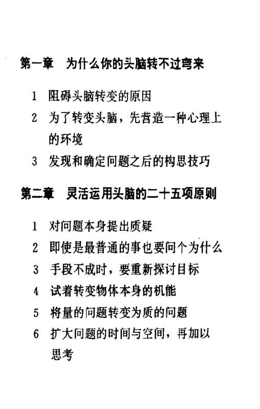

---

## 2026注册会计电子版资料

[2026-10-04 00:13] 来自：综合网盘资源频道

名称：2026注册会计电子版资料

描述：2026 注册会计电子版资料，适配注册会计师备考人群，包含考试相关学习材料，可供考生用于知识点梳理、考点复习与习题练习，帮助备考人员系统学习各科考点，夯实专业知识，高效开展注册会计师考试备考工作。

夸克网盘：https://pan.quark.cn/s/d6ea38b39d2c

📁 大小：284.9MB

🏷 标签：#学习 #资料 #电子版 #注册会计 #高效 #2026注册会计电子版资料 #quark

