## 做工的人

[2026-09-12 01:55] 来自：综合网盘资源频道

名称：做工的人(2020)【6集全】【4K.高码率】【中文字幕】【喜剧/家庭】

描述：豆瓣8.8高分

改编作家林立青同名畅销书，首部大型工地实景拍摄剧集！铁工兄弟阿祈、阿钦和板模工昌仔、怪手阿全，几个怀抱发财梦的好友，在工地里搬演一场又一场荒谬搞笑的发财戏码，这些古怪梦想述说着这群人面对的各种困境。他们发梦、梦破、满腔热血再来一个…..以噗咙共精神在尘土中不败向前。从这块地转那方围篱，帮人做工盖房，却只能望楼兴叹。有着各种人生难题的他们，努力用自己的方式活着，只是再怎么乐观，如果期待的一直事与愿违，还能怎么撑下去？

百度网盘：https://pan.baidu.com/s/18auLPFdEU_hP221KVosxmg?pwd=Yu88

📁 大小：32.3GB

🏷 标签：#喜剧 #家庭 #做工的人 #4K #高码率 #中文字幕 #baidu

---

## 好或坏的东载

[2026-09-12 00:00] 来自：综合网盘资源频道

名称：好或坏的东载 Dongjae, the Good or the Bastard (2024) 4K WEB-DL 中文字幕 H265 AAC 2.0

描述：检察官徐东载因过往争议而前途受阻，被调往清州地方检察厅。为了重新证明自己，他一边追查牵动舆论的案件，一边周旋于权力、利益与道德抉择之间。在真相与个人野心交错的困局中，东载究竟是好人，还是坏人，也变得愈发难以界定。

链接：

迅雷网盘：https://pan.xunlei.com/s/VP1Fry34IqGGg92Y-FXwSbtRA1?pwd=b9ih

📁 大小：X

🏷 标签：#好或坏的东载 #剧情 #犯罪 #悬疑 #韩国 #朴建浩 #李浚赫 #朴成雄 #玄奉植 #4K #WEBDL #quark #baidu #xunlei

---

## 流星蝴蝶剑

[2026-09-12 00:00] 来自：综合网盘资源频道

名称：流星蝴蝶剑 The Legend of the Swordsman (2010) 1080p WEB-DL AVC AAC 2.0

描述：快活林的杀手孟星魂受命刺杀老伯孙玉伯，却在行动中结识了孙府的侍女小蝶。江湖势力围绕权力与复仇不断交锋，孟星魂也在任务、情感与道义之间陷入两难。随着阴谋层层揭开，各方人物的命运被卷入一场险恶的江湖风暴。

链接：

夸克网盘：https://pan.quark.cn/s/0e352fe208dd

📁 大小：X

🏷 标签：#流星蝴蝶剑 #武侠 #古装 #剧情 #中国 #李惠民 #陈楚河 #陈意涵 #王艳 #刘德凯 #黄维德 #1080p #WEBDL #quark

---

## 超级学校霸王

[2026-09-12 00:00] 来自：综合网盘资源频道

名称：超级学校霸王 超級學校霸王 (1993)

描述：2043年7月1日，犯罪大王将军(卢惠光饰)被捕，一星期后由铁面无私的法官余铁雄(张卫健饰)主审。将军特派其黑社会爪牙健(郑伊健饰)返回50年前寻找铁雄，并将其洗脑使他无法进行审判。政府知情后特派飞龙特警铁面(刘德华饰)、扫帚头(张学友饰)及发达星(任达华饰)返回1993年去保护铁雄。

时大雄为93年一中学长期留班生，常遭同学余忌安(许志安饰)作弄毒打，只有女友采妮(杨采妮饰)对他真心。飞龙三特警混进学校，扫帚头当上老师，铁面做大雄同学，星则任大雄跟班，帮大雄打赢忌安，并向他套取铁雄下落，但大雄却表示校内并无铁雄此人。在这时健亦扮成老师混入学校，另一边大雄母亲要改嫁理查德余……最终飞龙特警能完成任务吗？

迅雷网盘：https://pan.xunlei.com/s/VP1GBQJFQJKzSiGqnVBeI5GyA1?pwd=xxz5

夸克网盘：https://pan.quark.cn/s/02a6cace5cf2

📁 大小：AA

🏷 标签：#喜剧 #动作 #奇幻 #超级学校霸王 #超級學校霸王 #xunlei #quark

---

## 宫锁珠帘

[2026-09-11 23:57] 来自：综合网盘资源频道

名称：宫锁珠帘 (2012)

描述：结束了匪夷所思的时空穿越，并且收获了亘古爱情的洛晴川(杨幂 饰)与心爱的八阿哥胤禩(冯绍峰 饰)回到现代，开始了幸福的生活，而晴川也凭借深厚的历史学识和亲身经历一约成为影视界内穿越剧炙手可热的名家。在她所撰写的一部穿越剧中，名叫怜儿(袁姗姗 饰)的女孩阴差阳错成为主角。

故 事发生在清朝雍正年间，为了帮助父亲的仕途，候补四品典仪凌柱之女怜儿几番周旋奔忙，由此结识了十七王爷，并在王府期间和王爷互生情愫。但是命运却将她引领进了凶险异常、斗争激烈的皇宫。经过一番运作，怜儿果然得到皇帝的垂青，可是福兮祸所倚，她的前方注定充满了无数的荆棘…

夸克网盘：https://pan.quark.cn/s/3afc497e0f35

📁 大小：AA

🏷 标签：#剧情 #爱情 #古装 #宫锁珠帘 #quark

---

## 岁月风云之上海皇帝

[2026-09-11 23:56] 来自：综合网盘资源频道

名称：岁月风云之上海皇帝 歲月風雲之上海皇帝 (1993)

描述：小贩陆云生(吕良伟 饰)常为邻里抱不平，被租界总探氏黄金荣(郑则仕 饰)妻阿桂姐(斯琴高娃 饰)所赏识。未几，陆破获宋教仁被刺案真相，令黄名声大噪。黄对陆赏识，却招侯飞妒忌。陆、黄出面调息了军阀袁啸军劫取法国鸦片事件，发了财，变为大亨。由于黄误打了督军卢永祥之子，陆又去东北军军长毕树政处求情，还搭进了名妓老六(刘嘉玲饰)，无奈卢、毕进一步勒索，被陆寻机反击。1927年，陆目睹国共反目，他反对镇压工人武装与屠杀共产党人；为了不被国民党利用，他打入商界，以经济力量与国民党抗衡....

夸克网盘：https://pan.quark.cn/s/ef67176bb64f

📁 大小：AA

🏷 标签：#剧情 #悬疑 #犯罪 #岁月风云之上海皇帝 #歲月風雲之上海皇帝 #quark

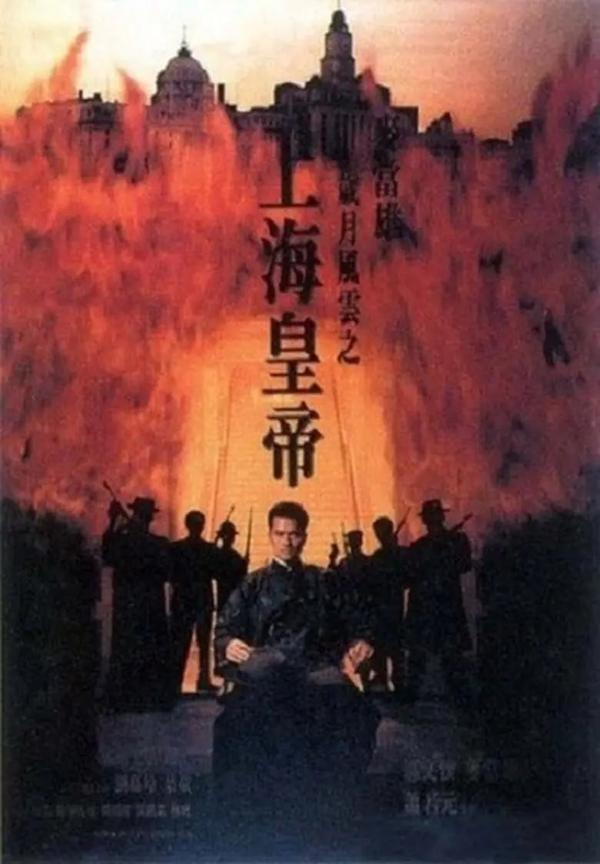

---

## 炮制女朋友

[2026-09-11 23:47] 来自：综合网盘资源频道

名称：炮制女朋友 (2003)

描述：归国在上海发展的富商张天找到失散多年的女儿张宁(赵薇)后，因看不惯她的举止行为，请来失业很久的香港设计师阿祖(郑伊健)替她改头换面，以期她能女承父业。

张宁与阿祖初接触时，别扭矛盾没少闹，但张宁终被炮制成其父心中的女性形象，两人在这一过程中，也慢慢互相倾心。张天的宴会上，张宁大方得体的表现吸引了某外交官的儿子的目光，后者对其展开追求。不等张宁做出选择，自卑的阿祖辞职返回香港。张宁随后也来到香港，试图劝阿祖振作。

夸克网盘：https://pan.quark.cn/s/d2a565c6b17b

📁 大小：AA

🏷 标签：#剧情 #爱情 #炮制女朋友 #quark

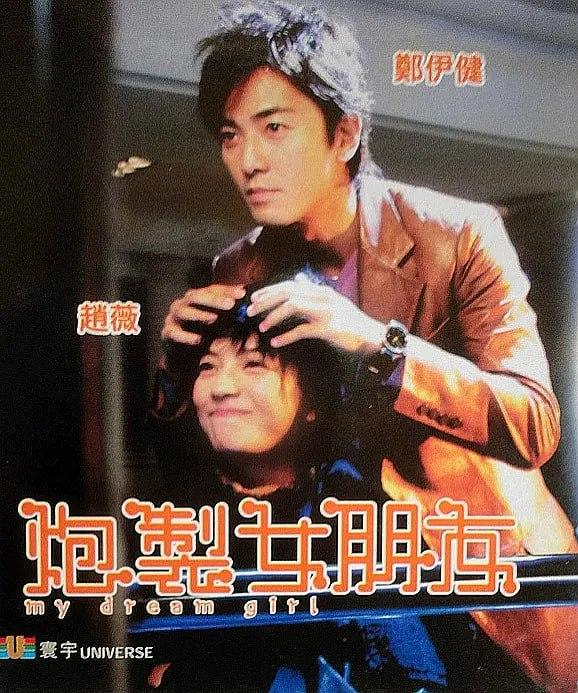

---

## 津门飞鹰

[2026-09-11 23:46] 来自：综合网盘资源频道

名称：津门飞鹰 (2017)

描述：1947年底，东北全境解放前夕，四野某部侦察营长燕双鹰奉命组织一支小分队，潜入天津市，设法搞到守卫天津的国民党军队作战方案，绘制军事布防图以及兵力部署，为大军解放天津铺平道路。燕双鹰从侦察营挑选了六名骨干，化装成溃逃的国民党散兵，混上由营口开往天津的轮船，然而轮船被劫，燕双鹰凭借机智勇敢，救出在押士兵，击毙劫匪，夺回客轮。到达天津后，燕双鹰率领小分队一边暗中绘制城防图，一边乔装改扮开起了汽车修理厂，与当地黑帮势力几番争斗，终于赢得了黑帮头子袁文才的信任，而掌握国民党军作战方案和兵力部署的作战厅长段文宏，正是袁文才的把兄弟。就在燕双鹰凭准备盗取机密文件时，他的身份竟然暴露了，最终燕双鹰凭借智慧，摆脱困境，消灭敌人，将机密资料送给了大部队。

夸克网盘：https://pan.quark.cn/s/87b233f3182c

📁 大小：AA

🏷 标签：#剧情 #动作 #津门飞鹰 #quark

---

## 立体奇兵

[2026-09-11 23:25] 来自：综合网盘资源频道

名称：立体奇兵 立體奇兵 (1989)

描述：安家小少爺"安安(安安 飾)"在一年一度的搶孤大會上輸給了死對頭"小黑(陳子強 飾)"&"蜻蜓(鄭同村 飾)"，事後雙方相約於鎮前十里坡釘孤支，卻遭一隻名為"宓宓"的小狐狸精搗亂而反被痛打一頓。安安的"管家(陳松勇 飾)"為幫少爺報仇，便趁著"金爺爺(金塗 飾)"的好友"長三"帶著一批趕屍隊前來投宿時，將一隻會使用隱身術、名叫"洪坤"的殭屍給偷走，意圖使負責看管的小黑和蜻蜓受處罰，豈料在搬動過程中洪坤額頭上之符紙遭人撕下，一頭會隱身術的將殭屍便因此在鎮上四處咬人，金爺爺也因此被"保安隊長(胖三 飾)"逮捕入獄，隱身殭屍洪坤則落入安安爸爸"安平(黃仲裕 飾)"的師父"何祖師爺"手中，為求長生不死，何祖師爺煞費苦心建了一座異次元紙屋，接著將抓來的洪坤放進紙屋中做他的打手，並將小狐狸精宓宓和"小殭屍(洪竟原 飾)"也一起抓進紙屋中，要它們做他永遠的僕人，小黑、蜻蜓、安安和金爺爺的孫女"娟娟(李宜娟 飾)"為將宓宓和小殭屍救出而闖進紙屋中，但他們卻不曉得一旦進入紙屋便永遠無法出去，除非...

夸克网盘：https://pan.quark.cn/s/d635bb1a2d8d

📁 大小：AA

🏷 标签：#剧情 #儿童 #立体奇兵 #立體奇兵 #quark

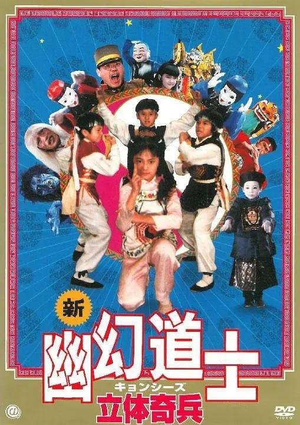

---

## 神探亨特张

[2026-09-11 23:18] 来自：综合网盘资源频道

名称：神探亨特张 (2012)

描述：便衣民警老张(张立宪 饰)在酒桌上跟一帮兄弟们开怀畅饮，用歌声道出了北京的苦辣酸甜。他们潜伏在川流不息的人群中，伺机而动，抓捕违法犯罪人员：无论是用电子干扰汽车车锁盗取财物的，还是用残疾人作诱饵碰瓷的，无论是拉帮结派的梁上君子，还是招摇撞变的算命先生……全都逃不过老张的法眼。老张的事迹甚至还上了北京电视台的纪录片。然而，眼看犯罪分子一个个落网，老张的内心却陷入了迷惘。他也是上有老下有小的普通人。多年的打拼，令老张的身体也亮起了红灯，他有哮喘，有高血压，但是为了抓贼，他努力地克服着自己的困难。然而，他门口总有一个不离不弃的尾随者，很多光怪陆离的事件接连发生，令老张和他的弟兄们猝不及防……

夸克网盘：https://pan.quark.cn/s/adb987482497

📁 大小：AA

🏷 标签：#动作 #神探亨特张 #quark

---

## 最后的巫师猎人

[2026-09-11 23:17] 来自：综合网盘资源频道

名称：最后的巫师猎人 The Last Witch Hunter (2015)

描述：考尔德(范·迪塞尔 Vin Diesel 饰)是一名女巫猎人，在黒巫后的诅咒之下，他得到了不灭的灵魂和不朽的躯体。永生带来的痛苦远远大于欢愉，在孤独和绝望之中，考尔德度过了漫长的时光，然而，他却从未放弃过身为一名巫师猎人所应尽的职责，他知道，女巫并没有绝迹，一个巨大的阴谋正在阴影里缓慢酝酿。

果不其然，黒巫后得到了能够使自己复活的秘术，与此同时，各地的女巫们亦按耐不住，纷纷蠢蠢欲动，妄图实现消灭人类统治世界的野心。考尔德和助手多兰(伊利亚·伍德 Elijah Wood 饰)想要面对繁杂而又强大的对手，必须得到善良女巫克洛伊(萝斯·莱斯利 Rose Leslie 饰)的帮助。一场恶战即将拉开序幕

夸克网盘：https://pan.quark.cn/s/b2efc2a80c4e

📁 大小：AA

🏷 标签：#奇幻 #动作 #冒险 #最后的巫师猎人 #quark

---

## 碧血书香梦

[2026-09-11 23:06] 来自：综合网盘资源频道

名称：碧血书香梦 (2015)

描述：辛亥革命胜利之后的民国初年，江南才女沈碧云为了实现进入中国最大的私人藏书楼博览群书、为所有学子争取读书的权利的理想，也为了探查杀父仇人，不惜以终生幸福为赌注，嫁入藏书楼之主的宣家，却由此陷入宣家内部的勾心斗角、争权夺利漩涡，遭遇重重危机，尝尽人情冷暖，几度出生入死，宣家也经历了一次次浩劫，直至家破人亡，碧云仍然矢志不渝，在宣家四少爷宣孝季和进步青年吴时的帮助下，凭着坚强的信念和过人的智慧拯救了宣家，成为宣家新当家人，并查清真凶，报得父仇。最终，沈碧云冲破封建祖制开放书楼，包括碧云在内的莘莘学子得以登楼读书。

夸克网盘：https://pan.quark.cn/s/9d96d8b7cdc9

📁 大小：AA

🏷 标签：#剧情 #家庭 #碧血书香梦 #quark

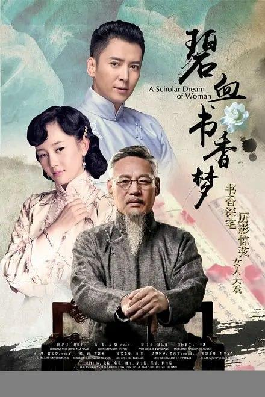

---

## 我的女孩

[2026-09-11 22:53] 来自：肯德基の4K影视综合电影云盘站

名称：我的女孩(2005)【16集全】【WEB-DL.1080p】【内封简中】【喜剧/爱情】

描述：豆瓣8.3高分

本剧是讲述四个男女的青春爱情喜剧。美丽女生裕玲(李多海 饰)是旅游公司的导游，她热情大方、“诡计多端”；功灿(李东旭 饰)是一个富家子弟，英俊潇洒，典型的钻石王老五；世娴(朴诗妍 饰)是韩国著名的美女网球手，也是功灿对前女友，两年前和男友不辞而别出国参赛后，战绩斐然，如今即将回国；正宇(李准基 饰)是一个游戏人间的花花公子，生性不羁。本来素不相识的裕玲、正宇和功灿分别相遇了，一场爱情闹剧也由此展开。

夸克网盘：https://pan.quark.cn/s/f4faef23d9f0

百度网盘：https://pan.baidu.com/s/1Shb1vDLEIyzJm5J77ZGnKA?pwd=Yu66

迅雷网盘：https://pan.xunlei.com/s/VP0qtiwVf9em3klTWsasUwFDA1?pwd=89k2

📁 大小：30.6GB

🏷 标签：#喜剧 #爱情 #我的女孩 #1080p  #中文字幕

---

## 疯子

[2026-09-11 22:46] 来自：肯德基の4K影视综合电影云盘站

名称：疯子(2018)【10集全】【4K.HDR】【高码率】【内封简繁英】【喜剧/科幻】

豆瓣8.2高分

安妮（艾玛·斯通 Emma Stone 饰）是一名长期被抑郁困扰的女子，复杂而又破碎的家庭关系让她感到精疲力竭。欧文（乔纳·希尔 Jonah Hill 饰）出生于一个庞大的家庭企业之中，作为家里的第五个孩子，他被医生诊断患上了精神分裂症，每一天都处于濒临崩溃的边缘。 詹姆斯博士（贾斯汀·塞洛克斯 Justin Theroux 饰）发明出了一种新药，据说可以治疗人类心智上的一切疑难杂症，目前已经进入了人体实验阶段，这种新药吸引了包括安妮和欧文在内的十名“小白鼠”，他们一起加入了詹姆斯博士的计划之中。詹姆斯博士向受试者承诺，这种药不会带来任何的并发症和副作用，但事实真的如此吗？

夸克网盘：https://pan.quark.cn/s/d6006cc4f41b

百度网盘：https://pan.baidu.com/s/1KQzErI9Xa7bltBoZWpl7BA?pwd=Yu66

迅雷网盘：https://pan.xunlei.com/s/VP0r0yg5aLobAjy1v7w6Q0zBA1?pwd=t2ip

📁 大小：51.9GB

🏷 标签：#疯子 #4K #HDR #喜剧 #科幻

---

## 巴比伦柏林

[2026-09-11 22:39] 来自：肯德基の4K影视综合电影云盘站

名称：巴比伦柏林 第一季(2017)【1080p 原盘REMUX】【内封简德双语字幕】【惊悚/犯罪】

描述：豆瓣9.0高分

犯罪年代剧《巴比伦柏林》由汤姆·提克威自编自导，背景设置在上世纪二十年代的柏林，故事聚焦社会大环境下的生活百态。

夸克网盘：https://pan.quark.cn/s/0a3d4a38771a

百度网盘：https://pan.baidu.com/s/1JijPG0uY7hf7kFjzal7JKA?pwd=Yu66

迅雷网盘：https://pan.xunlei.com/s/VP0qrPfkGJj0gzxBAVEezew7A1?pwd=rimg

📁 大小：69.5GB

🏷 标签：#巴比伦柏林 #1080p #蓝光原盘 #犯罪

---

## 回南天

[2026-09-11 22:37] 来自：综合网盘资源频道

名称：回南天 (2020)

描述：小东(黄宇聪 饰)和杜鹃(陈宣宇 饰)是一对年轻的情侣，他们住在城中村，生活有些磕磕碰碰。当地的游乐城倒闭，变成了饮食城。为了在饮食城重建一个小舞台，小东留下来当了一段时间的守湖保安。在守湖期间，他认识了一个前来放生的小女孩园园。她的到来让小东在单调的工作中感受到了些许温暖。杜鹃是个花艺师，在花店打工，她的生活有些单调。经常去客户龙老师家插花的她，被龙老师那种神秘而高雅的气质吸引。龙老师似乎总是隐藏着什么，带给了杜鹃一种独特的魅力。这让她在工作中多了几分期待与好奇。

随着小舞台重建失败，小东被辞退，只能回家帮助杜鹃经营起“小丑花店”。杜鹃为了吸引客户，让小东扮成小丑送花。小东在送花的过程中，会时不时去拜访园园。原来，园园以前是某剧团的舞蹈演员，但因感情问题离开了舞台。她似乎对舞台还有些留恋，这种孤独和遗憾引起了小东的共鸣。在这四个人的生活中，关系渐渐开始错位。杜鹃开始被龙老师的神秘所吸引，而小东在与园园的接触中感受到了一种特别的理解。每个人都有自己不为人知的一面，在这样的暧昧氛围中，他们的情感开始变得复杂而微妙。

夸克网盘：https://pan.quark.cn/s/46d5ea73a951

📁 大小：AAA

🏷 标签：#剧情 #回南天 #quark

---

## 工作细胞

[2026-09-11 22:17] 来自：综合网盘资源频道

名称：工作细胞 はたらく細胞 (2024)

描述：电影史上 “最小 ”的主角--他的名字叫细胞！ 人体中有 37 万亿个细胞。 携带氧气的红细胞、抵抗细菌的白细胞和无数其他细胞日以继夜地保护着你的健康和生命。 2024 年 12 月，细胞们的 “人体史上最伟大的战役 ”即将打响！

夸克网盘：https://pan.quark.cn/s/dc37f57baa19

📁 大小：NG

🏷 标签：#动作 #冒险 #喜剧 #奇幻 #工作细胞 #はたらく細胞 #quark #ali

---

## 十兄弟

[2026-09-11 22:06] 来自：综合网盘资源频道

名称：十兄弟(1995)【1080p HDTV】【国语音轨】【喜剧/奇幻】

描述：老爷百岁大寿时被小儿子大虾(钟镇涛 饰)气死，根据族规，家财由大哥全权管理，而大虾只分得瘦田一亩及老牛一条。十分奇怪的是，这片瘦田里种出的蔬菜瓜果都特别巨大。于是，大虾和大虾嫂(张敏 饰)刨开土一看，发现地里原来埋藏着十颗宝珠。可惜此事被无恶不作的大帅得知，于是带领兵马前来抢宝珠。情急之中，大虾与大虾嫂各吞宝珠五粒，分头逃走。大虾不幸被大帅捉去，大虾嫂则跌入一个墓穴逃过一劫。 当晚大帅府内，大虾生下五个天赋异品的孩子：大力三、橡皮四、飞天五、铜头六及高脚七。而这五个孩子却误以为大帅就是他们的父亲，而可怜大虾被关到了监狱。同一时间，大虾嫂亦生下五个兄妹：千里眼、顺风耳、遁地入、大口九及大喊十。大虾和大虾嫂最后能否打败邪恶的大帅，一家重逢？

夸克网盘：https://pan.quark.cn/s/2d14562a966c

百度网盘：https://pan.baidu.com/s/1G6wNkIbcl1a4G1p80Aodgg?pwd=Yu88

迅雷网盘：https://pan.xunlei.com/s/VP1Fl7sVGt8JP3j9kYt4oFdkA1?pwd=v3cw

📁 大小：3.98GB

🏷 标签：#喜剧 #奇幻 #十兄弟 #1080p #HDTV #国语音轨 #quark #baidu #xunlei

---

## 堕落的偶像

[2026-09-11 21:54] 来自：综合网盘资源频道

名称：堕落的偶像 The Fallen Idol(1948)

描述：故事发生在一所大使馆中，在小男孩菲利普(Bobby Henrey 饰)的眼中，管家班尼思(拉尔夫·理查德森 Ralph Richardson 饰)是如假包换的英雄。这其中的原委要追溯到菲利普经常外出的父母身上，父母不在，照顾和看管菲利普的责任自然就落到了班尼思的身上，在菲利普这样一个敏感又单纯的年纪，一个替他打点一切事宜的人就等同于无所不能的英雄。

夸克网盘：https://pan.quark.cn/s/e447ecc6cbe2

📁 大小：NG

🏷 标签：#剧情 #悬疑 #惊悚 #堕落的偶像 #quark #ali

---

## 不快乐的假期

[2026-09-11 21:46] 来自：综合网盘资源频道

名称：不快乐的假期 Du côté d'Orouët (1971)

描述：三名年轻女子前往旺代省度假，期间她们办公室主任的出现，导致她们兴致全无，却变成折磨的痛苦。

夸克网盘：https://pan.quark.cn/s/829443d919e8

📁 大小：NG

🏷 标签：#剧情 #喜剧 #不快乐的假期 #quark #ali

---

## 出入平安

[2026-09-11 21:28] 来自：综合网盘资源频道

名称：出入平安(2024)【4K.HQ.高码率】【内嵌简英】【家庭/灾难】【肖阳/古力娜扎】

描述：即将被处决的死刑犯郑立棍(肖央 饰)在押运途中突遇地震，看守所坍塌成废墟，死里逃生的郑立棍看似获得了突如其来的“自由”，但其实已经陷入另一场炼狱之中……与此同时警察尉迟晓(阿云嘎 饰)决定临时组织一支“不一样的”救援队。在天灾面前，死囚选择逃生还是救人？负责看管他的警察又该如何抉择？所有人都站在了命运的岔路口上…… 影片根据真实事件改编。

夸克网盘：https://pan.quark.cn/s/e35411a27eea

百度网盘：https://pan.baidu.com/s/1pB_FEWtuhWgd4KKuFpj3pg?pwd=Yu88

迅雷网盘：https://pan.xunlei.com/s/VP1FcxQDGt8JP3j9kYt4gzZCA1?pwd=f7xk

夸克网盘：https://pan.quark.cn/s/fea3f9c3ce60 来自：综合网盘资源频道 [2026-09-11 19:15] 名称：出入平安 (2024)

📁 大小：15.3GB

🏷 标签：#家庭 #出入平安 #4K #高码率 #内嵌简英 #灾难 #quark #baidu #xunlei

---

## 大话西游之大圣娶亲

[2026-09-11 21:26] 来自：综合网盘资源频道

名称：大话西游之大圣娶亲 西遊記大結局之仙履奇緣 (1995)

描述：紫霞与青霞(朱茵 饰)本是如来佛祖座前日月神灯的灯芯(白天是紫霞，晚上是青霞)，二人虽然同一肉身却仇恨颇深，因此紫霞立下誓言，谁能拔出她手中的紫青宝剑，谁就是她的意中人。紫青宝剑被至尊宝于不经意间拔出，紫霞决定以身相许，却遭一心记挂白晶晶(莫文蔚 饰)的至尊宝拒绝。后牛魔王救下迷失在沙漠中的紫霞，并逼紫霞与他成婚，关键时刻，至尊宝现身。

夸克网盘：https://pan.quark.cn/s/e9adfc1698b2

📁 大小：NG

🏷 标签：#喜剧 #爱情 #奇幻 #古装 #大话西游之大圣娶亲 #西遊記大結局之仙履奇緣 #quark #ali

---

## 大块头有大智慧

[2026-09-11 21:12] 来自：综合网盘资源频道

名称：大块头有大智慧 大隻佬 (2003)

描述：大隻佬(刘德华 饰)在跳艳舞时与前来扫黄的警花李凤仪(张柏芝 饰)相遇，同时，重案组亦在附近调查一起印度人杀人案。大隻佬逃跑时与逃走的印度逃犯不期而遇，最后逃犯逃走了，大隻佬被当成了嫌犯抓回了警局。

夸克网盘：https://pan.quark.cn/s/bd7399f4d5ce

📁 大小：NG

🏷 标签：#剧情 #动作 #惊悚 #大块头有大智慧 #大隻佬 #quark #ali

---

## 爱尔兰起义情

[2026-09-11 21:07] 来自：综合网盘资源频道

名称：爱尔兰起义情 第一季 Rebellion Season 1 (2016)

描述：一部关于现代爱尔兰诞生的五集连续剧。故事是从一群经历 1916 年复活节起义政治事件的虚构人物的角度讲述的。

夸克网盘：https://pan.quark.cn/s/13566ca8f60e

📁 大小：NG

🏷 标签：#剧情 #爱尔兰起义情 #quark #ali

---

## 魔法之旅

[2026-09-11 21:04] 来自：综合网盘资源频道

名称：魔法之旅 Конек-горбунок (2021)

描述：Foal and his friend John go on an unforgettable journey as they outsmart the tyrant King, catch the fire-bird and find John's true love upon the magic roads.

迅雷网盘：https://pan.xunlei.com/s/VP1FYuwSdzQu0i4_K7V1wGtqA1?pwd=ggrk

📁 大小：AA

🏷 标签：#奇幻 #冒险 #魔法之旅 #xunlei

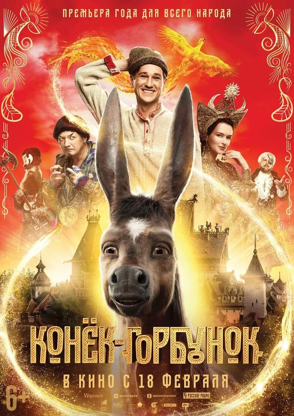

---

## Mars零之革命

[2026-09-11 20:41] 来自：综合网盘资源频道

名称：Mars-零之革命- マルス-ゼロの革命- (2024)

描述：本剧是一部爽快的新感觉青春电视剧，讲述了“想要改变些什么”——抱有这样愿望的高中生们，在神秘而充满魅力的领导人的引导下，对成人社会举起了反旗。道枝饰演的是19岁的神秘转校生·美岛零，他煽动掉队的高中生说“和我一起破坏这个世界”。他擅长握人心，不知不觉间就能钻到人心的“缝隙 ”，具有言而有信的领导魅力。在零的煽动和引导下，高中生们结成了名为“Mars”的视频集团，试图打破大人建立的社会，再重新构建。

夸克网盘：https://pan.quark.cn/s/2be3001b8e74

📁 大小：AA

🏷 标签：#剧情 #悬疑 #零之革命 #セロの革命 #quark

---

## 亲爱的格洛莉亚

[2026-09-11 20:39] 来自：综合网盘资源频道

名称：亲爱的格洛莉亚 Àma Gloria (2023)

描述：克莱奥只有六岁，她疯狂地喜欢上了一直抚养自己的保姆格洛丽亚。但格洛丽亚必须紧急返回佛得角，到她的孩子们身边。在她离开之前，克莱奥要求她遵守一个承诺：尽快再见到她。于是格洛丽亚邀请她到去自己的岛上，和自己的家人一起，度过最后一个夏天。

夸克网盘：https://pan.quark.cn/s/8278569a1ccb

📁 大小：AA

🏷 标签：#剧情 #亲爱的格洛莉亚 #quark

---

## 杀死丽塔

[2026-09-11 20:31] 来自：综合网盘资源频道

名称：杀死丽塔 Убить Риту (2023)

描述：Хрупкая с виду учительница химии Рита остается без работы за связи с учеником. Но благодаря своим навыкам ей удается заработать лёгкие деньги уборкой коттеджа. Правда этот коттедж оказывается местом преступления, а сама Рита оказывается в эпицентре криминальных разборок местных бандитов. Однако Рита не так проста — все это время она жила под прикрытием по чужому паспорту. Несколько лет назад ей уже пришлось бежать из родного Петербурга в приморский городок, чтобы спасти свою жизнь. Ведь Рита — единственный живой носитель формулы, которая очень нужна ее преследователям.

夸克网盘：https://pan.quark.cn/s/52a4211f3d56

📁 大小：AA

🏷 标签：#剧情 #喜剧 #犯罪 #杀死丽塔 #quark

---

## 此情可待成追忆

[2026-09-11 20:12] 来自：综合网盘资源频道

名称：此情可待成追忆 Кто-нибудь видел мою девчонку? (2020)

描述：1990年代初期，谢尔盖(Sergei)和基拉(Kira)被认为是圣彼得堡电影爱好者中最美丽的波西米亚风格夫妇。他们奇妙的恋爱关系随着基拉(Kira)离开小镇，逃离新生活，新关系而结束。谢尔盖不久后就去世了。几年后，基拉才意识到她从未停止过爱谢尔盖。她注定要与死去的情人保持永无休止的对话。

夸克网盘：https://pan.quark.cn/s/91eed0c50403

📁 大小：AA

🏷 标签：#剧情 #爱情 #此情可待成追忆 #quark

---

## 奇怪的搭档

[2026-09-11 20:05] 来自：综合网盘资源频道

名称：奇怪的搭档 수상한 파트너 (2017)

描述：卢智旭(池昌旭 饰)为了替父亲实现梦想而成为检察官，外貌与才华并存的他后因故转行成为律师。殷奉熙(南志铉 饰)是一名跆拳道少年国家代表出身的司法研修生。因一场神秘事件，殷奉熙意外成为了犯罪嫌疑人。为了找出真凶，现为律师的卢智旭和身为实习检察官的她便组起了“奇怪的搭档”

夸克网盘：https://pan.quark.cn/s/14326effa5eb

📁 大小：AA

🏷 标签：#剧情 #喜剧 #爱情 #奇怪的搭档 #quark

---

## 四千金的情人

[2026-09-11 20:02] 来自：综合网盘资源频道

名称：四千金的情人 Belle Époque (1992)

描述：1931年，西班牙的君主制被共和政制替代。马德里军队的逃兵费尔南多(乔格•桑兹Jorge Sanz 饰)在逃难中被两名护卫兵盘问。其中，老兵决定放行，但小兵觉得不合军令。两人开始争执，从中费尔南多得知二者为翁婿。后来，女婿错手将岳父打死，后悔不已饮弹自尽。目睹此情此景，受了惊吓的费尔南多仓皇逃走。他借宿时邂逅了流浪艺术家曼诺罗(费尔南多•费尔南•戈麦斯 Fernando Fernán Gómez 饰)。临行前，曼诺罗决定送他一程，顺便在车站接自己的女儿。当费尔南多看到他四个美艳动人的女儿之后，决定找借口留下。他先后跟这四个女人发生了情感纠葛，由此引出了一场令人忍俊不禁的闹剧……

本片获得第66届奥斯卡最佳外语片奖，战胜了中国影片《霸王别姬》。

夸克网盘：https://pan.quark.cn/s/0d054df39b9a

迅雷网盘：https://pan.xunlei.com/s/VP1FL6z2WiX-SVFpDP-RiHzsA1?pwd=7zqp

📁 大小：AA

🏷 标签：#剧情 #爱情 #四千金的情人 #quark #xunlei

---

## 我和我的家乡

[2026-09-11 19:57] 来自：夸克云盘影视资源频道

名称：【原盘】我和我的家乡 (2020) 1080P REMUX 内封简/繁英特效字幕

描述：电影《我和我的家乡》定档2020年国庆，延续《我和我的祖国》集体创作的方式，由张艺谋担当总监制，宁浩担任总导演，张一白担任总策划，宁浩、徐峥、陈思诚、闫非&彭大魔、邓超&俞白眉分别执导五个故事。

夸克网盘：https://pan.quark.cn/s/955b33d0edde

百度网盘：https://pan.baidu.com/s/1w39flcGgFz6dCTGnFW9PhA?pwd=W96J 来自：阿里、夸克、百度网盘4K影视资源 [2026-09-11 19:57] 名称：【原盘】我和我的家乡 (2020) 1080P REMUX 内封简/繁英特效字幕

📁 大小：37.7GB

🏷 标签：#我和我的家乡 #剧情 #喜剧

---

## 中国霸王花

[2026-09-11 19:50] 来自：综合网盘资源频道

名称：中国霸王花 (1990)

描述：一群来自五湖四海的年轻姑娘们，怀惴报国理想来到军营。她们分别是欧霞(邹倚天 饰)、文丽(张敬 饰)、田娥(闵朝晖 饰)、谢蓉蓉(黄莉 饰)等，每个人家庭出身不同，脾气性格迥异，但理想一致。经过严格的训练和无数次摸爬滚打，她们很快成长为威震军营的女子特警队员。重大抢劫案发生后，领导一声令下，姑娘们奔赴案发现场，面对猖狂劫匪，她们机智勇敢地全部擒获。随着军营生涯的流逝，她们都成长为自觉的革命军人，个别队员克服了自身的娇气和散漫习惯，处处以大局为重，成为令人称奇的军中霸王花...

夸克网盘：https://pan.quark.cn/s/1511c125f05e

📁 大小：AA

🏷 标签：#动作 #犯罪 #中国霸王花 #quark

---

## 班淑传奇

[2026-09-11 19:42] 来自：综合网盘资源频道

名称：班淑传奇 (2015)

描述：东汉时期，班超之女班淑(景甜 饰)为寻找身世证明，潜入女子内学堂担任女傅。班淑不拘一格整肃风纪，使用创新的教学方法，收获了学生的爱戴，使得男傅卫英(张哲瀚 饰)和邓太后(李晟 饰)之兄邓骘(邓骘 饰)都倾心于她，也因此被原来掌管内学堂的寇兰芝(李心艾 饰)所嫉恨。在与寇兰芝屡次斗法之后，班淑获得邓太后的信任，成为了宫中男子学堂的女傅，更成功地解决了一系列问题和困难。在经历了卫英的旧情人刘萱(张馨予 饰)回国的波折以及楼兰公主(迪丽热巴 饰)、王子与宫学比试等一系列危机之后，卫英和班淑终成眷属。

迅雷网盘：https://pan.xunlei.com/s/VP1FGNlQXu33b17uN6Xnled9A1?pwd=2pz2

夸克网盘：https://pan.quark.cn/s/e1a4b8060419

📁 大小：AA

🏷 标签：#剧情 #喜剧 #班淑传奇 #xunlei #quark

---

## 花之乱

[2026-09-11 19:33] 来自：综合网盘资源频道

名称：花之乱 花の乱 (1994)

描述：室町時代中期、将軍・足利義政夫人で悪女とも評される日野富子の生涯と、応仁の乱およびその前後の状況を描く。1993年から翌年にかけては、中世の東北地方を舞台とした前作『炎立つ』、琉球王国を舞台とした前々作『琉球の風』など、それまで扱ってこなかった時代や地域をテーマとした作品が3作続けて製作され、3作目の本作では平安建都(遷都)1200年を記念して映像作品が皆無に近い狭義の室町時代を取り上げた大河ドラマとなった。近時代には1991年の『太平記』後半が室町幕府創設期となるが、南北朝時代や戦国時代との重複期間を除いた純然たる室町期を正面から舞台とした作品は、これが初の試みとなった。ちなみに、織豊政権時代よりも前の時代を扱った作品が2作連続で放送されたのは、2011年現在本作が唯一である(ただし、上記の通り『炎立つ』と同時代を描いているわけではない)。

夸克网盘：https://pan.quark.cn/s/1e8f4e27af2b

📁 大小：AA

🏷 标签：#剧情 #花之乱 #花の乱 #quark

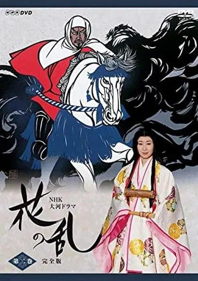

---

## 醒木

[2026-09-11 19:32] 来自：综合网盘资源频道

名称：醒木 Wake Wood (2009)

描述：爱女艾丽丝被疯狗咬死，兽医帕特里克·戴利(Aidan Gillen 饰)和妻子露易丝(Eva Birthistle 饰)和妻子搬到地处偏远的醒木镇居住，渴望找到继续人生之路的勇气。他们的生活看似平淡无奇，但是痛失爱女的悲伤与绝望从未远去，时时搅扰着戴利夫妇的神经。醒目镇平静安详，但在这份表象之下似乎又隐藏着不为人知的秘密。偶然机会，露易丝得知这个秘密，通过神秘的仪式可以让死去未满一年的人短暂复活3天，条件是请求者将永远与醒目镇联系在一起。为了见到朝思暮想的女儿，戴利夫妇答应了这个条件。

仪式过后，艾丽丝重返人间，但是意想不到的情况接连发生。斯人已逝，强求不得…

夸克网盘：https://pan.quark.cn/s/7163736e02ca

📁 大小：AA

🏷 标签：#剧情 #惊悚 #恐怖 #醒木 #quark

---

## 恶魔的破坏

[2026-09-11 19:21] 来自：动漫/动画资源频道

名称：恶魔的破坏 (2024) 1080P 全18集 简中特效硬字幕

描述：3年前的8月31日，巨大的宇宙飞船“母舰”突然袭击东京，世界似乎即将结束。之后，绝望的状况逐渐融入日常生活，母舰漂浮在上空的异样景象成为理所当然的。在那之中，女高中生小山门出和“小丹”中川凰兰和班主任老师渡良濑和亲密的朋友们一起过着不经意的学生生活……

夸克网盘：https://pan.quark.cn/s/ce78b6b3d5fa

📁 大小：5.3GB

🏷 标签：#恶魔的破坏 #剧情 #喜剧 #科幻

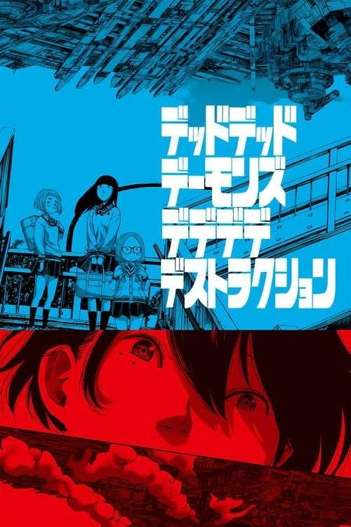

---

## 南拳北腿

[2026-09-11 19:03] 来自：综合网盘资源频道

名称：南拳北腿 (1995)

描述：黄麒英(樊少皇 饰)自幼跟随南拳王陆阿彩习武，当河北会馆馆主严巴山企图对南拳拳馆进行迫害时，师徒两人联手反抗，在武斗界掀起了一场腥风血雨。红莲教教主圣姑和满洲国奸臣莽古格尔先后对威胁到他们势力的黄麒英进行迫害，深受其害的黄麒英痛定思痛，创立了“虎鹤双形拳”和“佛山无影脚”，最终将两名劲敌击败，在江湖中树立了不可撼动的威望。

北腿王苗峰的女徒弟慧男(李赛凤 饰)和黄麒英因为种种误会相识，几经生死磨难之后两人之间建立了深厚的感情，与此同时，洋货店老板的女儿宋绮文(梁小冰 饰)也对黄麒英动了真情，两人之间，黄麒英不知该做出怎样的选择

夸克网盘：https://pan.quark.cn/s/10468e9a47f5

📁 大小：AA

🏷 标签：#剧情 #南拳北腿 #quark

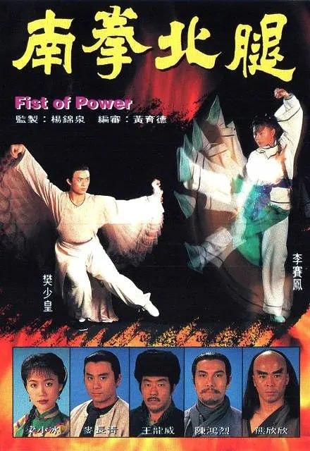

---

## 斗罗大陆绝世唐门

[2026-09-11 18:51] 来自：百度网盘综合频道

名称：斗罗大陆：绝世唐门（2023）4K S01E01 - E170 ｜附第一季+剧场版

描述：这里没有魔法，没有斗气，没有武术，却有武魂。唐门创立万年之后的斗罗大陆上，唐门式微。一代天骄横空出世，新一代史莱克七怪能否重振唐门，谱写一曲绝世唐门之歌？ 百万年魂兽，手握日月摘星辰的死灵圣法神，导致唐门衰落的全新魂导器体系。一切的神奇都将一一展现。 唐门暗器能否重振雄风，唐门能否重现辉煌？

百度网盘：https://pan.baidu.com/s/1kj0Ym9L56piCfrWdd7tNvg?pwd=zX6D

夸克网盘：https://pan.quark.cn/s/ef4696457e95 来自：夸克云盘影视资源频道 [2026-09-11 18:49] 名称：斗罗大陆：绝世唐门（2023）4K S01E01 - E170 ｜附第一季+剧场版

📁 大小：354GB

🏷 标签：#Jack #剧情 #斗罗大陆

---

## 小妇人

[2026-09-11 18:33] 来自：4K影视屋(分屋）-蓝光无损电影

名称：小妇人(2019)【4K.REMUX UHD原盘】【DV&HDR10】【国英双语】【内封简繁英双语字幕】

描述：豆瓣8.0高分

马奇夫人（劳拉·邓恩 Laura Dern 饰）有着四个如花似玉的女儿，大女儿梅格（艾玛·沃森 Emma Watson 饰）拥有着美丽的外表，和对于爱情的天真憧憬。二女儿乔（西尔莎·罗南 Saoirse Ronan 饰）满脑子塞着古灵精怪的念头，整天拿着蘸水笔东写西写，她的故事在全家上下都受到了热烈的欢迎。三女儿贝斯（伊莱扎·斯坎伦 Eliza Scanlen 饰）虽然个性比起姐姐们要内向得多，却拥有杰出的音乐天赋。 最小的女儿艾米（佛罗伦斯·珀 Florence Pugh 饰）渴望成为一名画家。

夸克网盘：https://pan.quark.cn/s/89dfe8d96737

百度网盘：https://pan.baidu.com/s/1_6pkh5zUlk0A55hmS5Ki9w?pwd=Yu66

迅雷网盘：https://pan.xunlei.com/s/VP0tDAzC6fw6kX-fMyWAzQuiA1?pwd=vxcn

📁 大小：83.6GB

🏷 标签：#小妇人 #4K #蓝光原盘 #HDR10 #DV #历史

---

## 与狼共舞

[2026-09-11 17:34] 来自：综合网盘资源频道

名称：与狼共舞 Dances with Wolves (1990)

描述：邓巴中尉(凯文•科斯特纳 Kevin Costner 饰)在南北战争中立了大功，政府为了褒奖他，给了他任意选择驻地的特权。邓巴渴望着一种全新的生活，于是选择了遥远偏僻的西部哨所塞克威克。这里住着大量的印第安苏族人。

一开始苏族人把他的到来有着抗拒，当邓巴主动接近和了解他们的生活，并搭救了一个从小在苏族长大的白人少女后，族人和他之间的关系开始回暖。他得到了一个印第安名字：与狼共舞。邓巴的骑术让族人惊叹，他的善良被大家称赞，和白人少女也日久生情。一次对抗外族入侵的战争中，邓巴更是被封为了苏族人的民族英雄。

然而马背文化的没落已成必然，白人士兵来到这片土地，驱赶苏族人，捕捉“叛徒”邓巴，这片朴实的土地慢慢改变了容颜…

夸克网盘：https://pan.quark.cn/s/cc2f7adf6156

📁 大小：AA

🏷 标签：#剧情 #西部 #冒险 #与狼共舞 #quark

---

## 迷途新娘

[2026-09-11 17:29] 来自：综合网盘资源频道

名称：迷途新娘 Laapataa Ladies (2023)

描述：故事发生在2001年，在印度农村的某个地方，两位年轻的新娘在火车上意外地交换了身份。在接下来的混乱中，她们各自遇到了许多性格各异的人，结果出现了意想不到的事情。

夸克网盘：https://pan.quark.cn/s/bfaeb02919ad

📁 大小：AA

🏷 标签：#剧情 #迷途新娘 #quark

---

## 千码凝视

[2026-09-11 17:16] 来自：综合网盘资源频道

名称：千码凝视 Thousand Yard Stare (2018)

描述：第二次世界大战期间，一名患有创伤后应激障碍的士兵在非洲作战后返回家园，当他重温凯瑟琳山口的战役时，发现重新融入家庭生活越来越困难。

夸克网盘：https://pan.quark.cn/s/fa4c51f80ff0

📁 大小：AA

🏷 标签：#剧情 #千码凝视 #quark

---

## 阿凡提的故事之偷东西的驴

[2026-09-11 17:02] 来自：综合网盘资源频道

名称：阿凡提的故事之偷东西的驴 (1985)

描述：本美术片是系列木偶剧《阿凡提的故事》的第五集。

阿凡提和一帮靠骆驼代步的商人在沙漠里饮过酒后就地休息，深夜他们熟睡后，贼人悄悄偷走了商人的骆驼和阿凡提的毛驴。第二天早上，商人们见骆驼被偷都很着急，阿凡提却不慌不忙地就他的毛驴被偷一事开起玩笑来，原来他看到了贼人遗落在地上的斧头，而斧头上有该人的名字。众人看过斧头，议论说贼人是之前路过的县城的县官。阿凡提听到，觉得有意思，决定去会会这位既是贼又是官的人物。——可想，这位贼官被聪明的阿凡提找上后，会吃多少苦头

夸克网盘：https://pan.quark.cn/s/cd8714611195

📁 大小：AA

🏷 标签：#剧情 #动作 #阿凡提的故事之偷东西的驴 #quark

---

## 鬼马天师

[2026-09-11 17:00] 来自：综合网盘资源频道

名称：鬼马天师 鬼馬天師 (1984)

描述：龙虎山 道观醉道人一次因清理道堂，撞坏天师像，被罚下山寻觅庚辰年八月十五亥时出生的童子，为新天师像开光。凑巧碰上适合的童子吴顺超，即死缠不放，被卷入一场大追杀风波中。在十多年前，“科学门”人之中，一名星宿老魔凶残暴戾，屡犯门规，更图盗取掌门令牌，被判以剥手皮刑，再逐出师门。老魔怀恨在心，秘密练成邪功，如今重出江湖，立誓减来“科学门”人，并要夺取演唱掌门令牌。吴顺超的婆婆——问米婆正是当年剥手皮刑的执法者之一……

夸克网盘：https://pan.quark.cn/s/9562ec8fc2f7

📁 大小：AA

🏷 标签：#剧情 #鬼马天师 #鬼馬天師 #quark

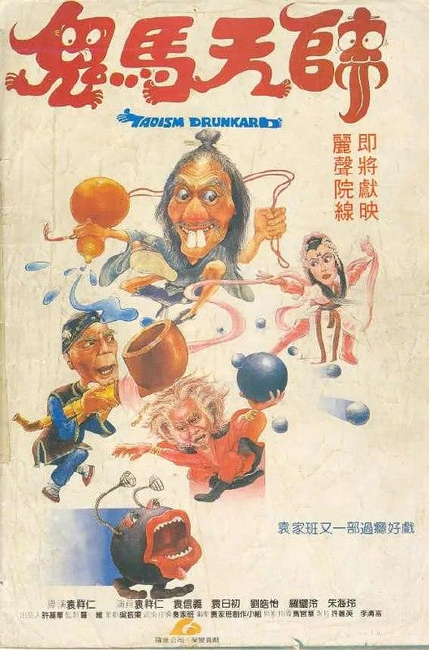

---

## 孩子王

[2026-09-11 16:58] 来自：综合网盘资源频道

名称：孩子王 (1987)

描述：文化大革命期间，插队七年的知青老杆(谢园饰)被抽到云贵山区的某简陋小学担任老师，知青伙伴高兴地称他为“孩子王”。但那里师资奇缺，教材稀少，学校分配他教初三，令他吃惊不小。老杆苦恼于学校的政治学习材料多如牛毛，批判文章学了一篇又一篇，但孩子们连小学课本上的生字都不认得，老杆感慨万端，只得从头教起。

几个月过去老杆和学生们相处得很好，家境贫寒的学生王福很想得到他手中的字典。在一次布置作文时，他以字典做赌注，今天就能写出记叙明天劳动的作文。结果王福输了，字典得不到了，他决心把字典全部抄下来。

然而老杆最终还是被退回队里。临走，他把唯一的一本字典留给王福…

夸克网盘：https://pan.quark.cn/s/b92b9e22ea6f

📁 大小：AA

🏷 标签：#剧情 #孩子王 #quark

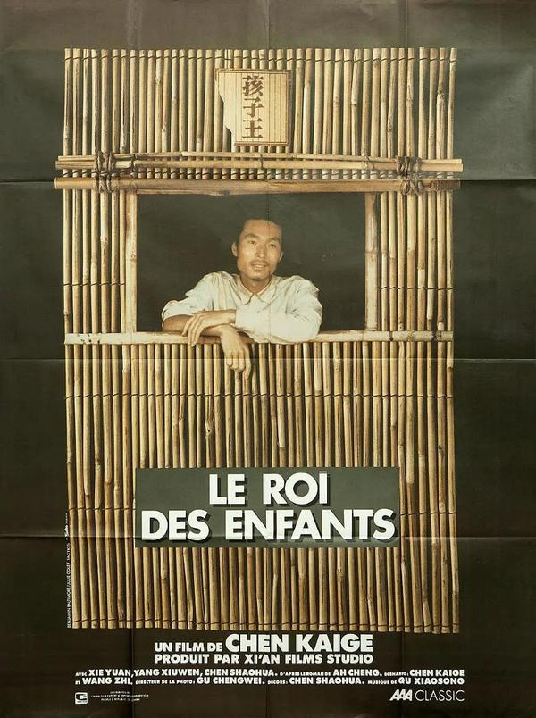

---

## 捉鬼合家欢

[2026-09-11 16:37] 来自：综合网盘资源频道

名称：捉鬼合家欢 捉鬼合家歡 (1990)

描述：诸葛孔平(郑则仕 饰)乃诸葛亮第十八代子孙，他精通天文地理，平时还爱搞些发明创造，不断钻研捉鬼新法。而孔平之妻王慧(王小凤 饰)亦精通名理，功力了得，却又是一善妒之人，经常怀疑丈夫与他的师妹(利智 饰)旧情未了，醋意大发。

灵幻界败类天下第一茅(楼南光 饰)嫉恨诸葛孔平的才能，以“西双版纳铜甲尸”为诱饵设下圈套，以图破坏孔平功力。孔平虽尽力对阵，却因老婆和师妹争风吃醋难有所成。而铜甲尸更破坏诸葛家的封鬼库，惹得群鬼出笼

迅雷网盘：https://pan.xunlei.com/s/VP1EbFFT1h97OgeLEUS8VsaLA1?pwd=giuk

夸克网盘：https://pan.quark.cn/s/4ea42ed648f7

📁 大小：AA

🏷 标签：#喜剧 #恐怖 #捉鬼合家欢 #捉鬼合家歡 #xunlei #quark

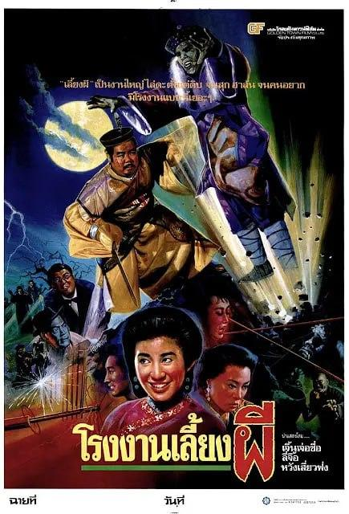