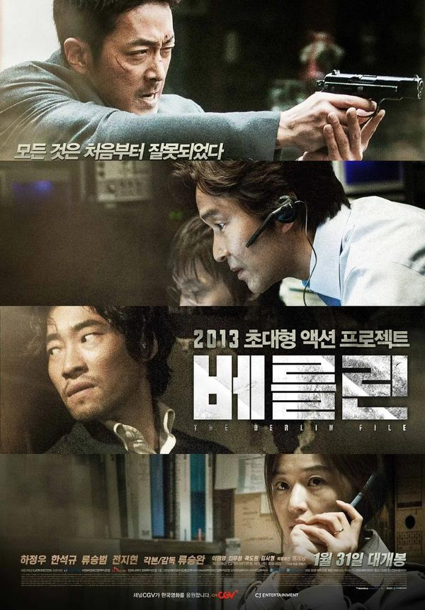
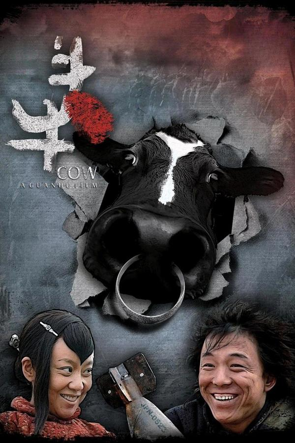
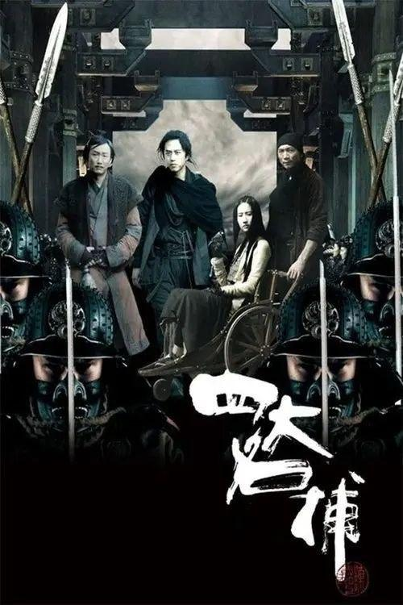
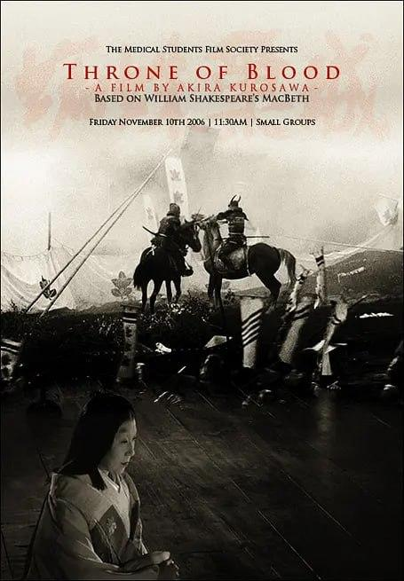
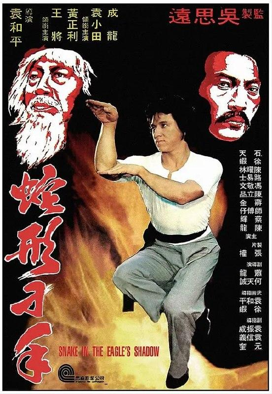
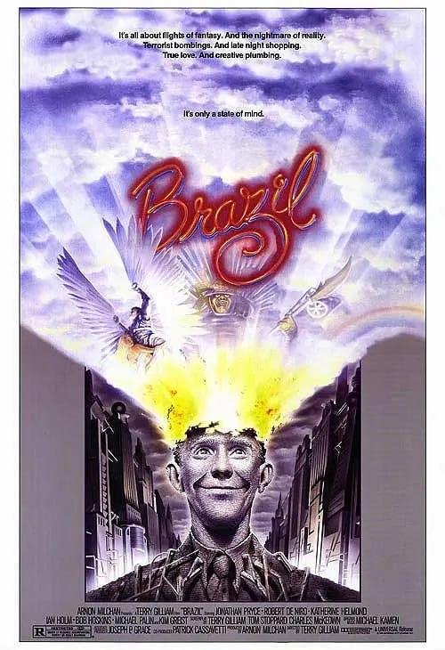
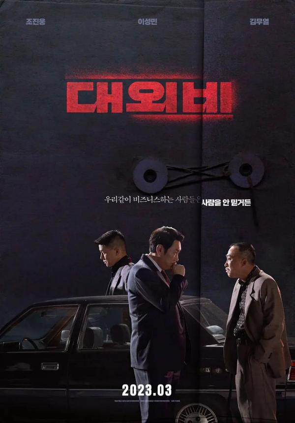
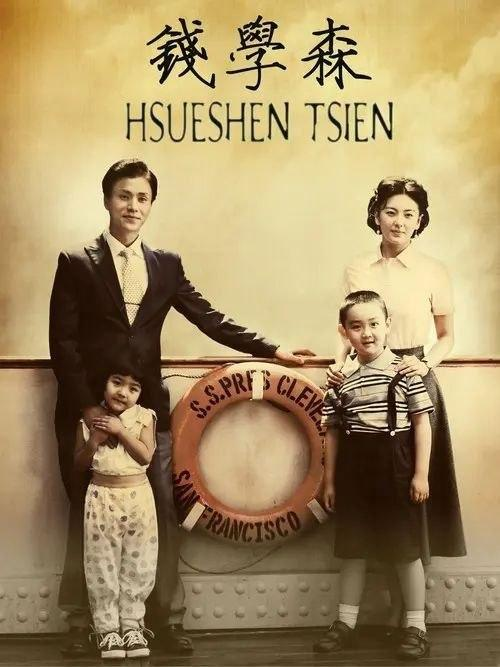

## 柏林谍变

[2026-09-20 09:11] 来自：综合网盘资源频道

名称：柏林谍变 The Berlin File / 베를린 (2013) 1080p 原盘REMUX 中文字幕 AVC DTS-HD MA 5.1

描述：一次非法军火交易失败后，朝鲜间谍表宗盛在柏林卷入情报泄露风波，既遭韩国情报部门追捕，也成为内部清洗的目标。在多方势力的围堵与背叛中，他必须设法带着妻子逃离这座危机四伏的城市。

链接：

迅雷网盘：https://pan.xunlei.com/s/VP1wHs1ReyKss_4VYSaiCqbIA1?pwd=xz7i

夸克网盘：https://pan.quark.cn/s/05e1b2b5a51f

百度网盘：https://pan.baidu.com/s/1kh2WUZ2AgJ9yTNhKo3DH1Q?pwd=a2rc

📁 大小：X

🏷 标签：#柏林谍变 #动作 #惊悚 #悬疑 #韩国 #柳承完 #河正宇 #韩石圭 #柳昇范 #全智贤 #1080p #原盘REMUX #中文字幕 #xunlei #quark #baidu

---

## 斗牛

[2026-09-20 09:10] 来自：综合网盘资源频道

名称：斗牛 Cow (2009) 4K WEB-DL H265 AAC 2.0

描述：抗日战争时期，一头奶牛被交给村民照料，负责人与村民们先后死去，只剩下牛二继续守护它。多年后，他向前来采访的人讲述了这段荒诞而悲壮的往事。

链接：

迅雷网盘：https://pan.xunlei.com/s/VP1wHRU5aNhmFi70qpjJgij-A1?pwd=grtc

📁 大小：X

🏷 标签：#斗牛 #剧情 #喜剧 #中国大陆 #管虎 #黄渤 #闫妮 #4K #WEBDL #AAC #baidu #quark #xunlei

---

## 心花路放

[2026-09-20 09:03] 来自：电影资源频道(4K、REMUXE/原盘)

名称：心花路放 (2014) 4K 高码

描述：二手音响商耿浩（黄渤 饰）婚姻失败，他想用锤子爆小三（李晨 饰）的头，却迟迟没有勇气，幸亏在剧组做制片的兄弟郝义（徐峥 饰）及时发现自暴自弃的耿浩，他决定带着耿浩开启一段“治愈之旅”。于是一对好基友带着一只狗上路，邂逅三千公里的“桃花”。“阿凡达女郎”（陶慧 饰）、“杀马特”周丽娟（周冬雨 饰）、“白富美”（张俪 饰），各式各样的女人接连登场，耿浩一路艳遇一路疗伤。时光倒转，5年前的此时，大龄文艺女青年（袁泉 饰）因为听了一首流浪歌手耿浩的歌，毅然前往大理……在经历一连串奇葩遭遇之后，大家都放下了心里的“阴影”，找到了通向幸福的道路。

夸克网盘：https://pan.quark.cn/s/2d237da42785

📁 大小：12.7GB

🏷 标签：#心花路放 #喜剧 #爱情

---

## 大搜查之女

[2026-09-20 08:42] 来自：夸克云盘影视资源频道

名称：【原盘】大搜查之女 (2008) 1080P REMUX 内封简繁英特效字幕

描述：33岁还未结婚的香港女警司徒慕莲一直为自己的婚事发愁。男友十年前的承诺，现在成了她与同事间的笑谈。一日，走私集团的头领霍青松的儿子被绑架，司徒慕莲奉命处理这宗案件。但霍青松一家为避免因走私之事被警方控告，处处表现出不合作的态度，而此时司徒慕莲发现自己有了身孕。 黑白两道在一间大屋下貌和神离，霍家上下各自心怀暗计，同时，大陆警方也传来了联合破案的消息。作为“剩女”的司徒慕莲、作为警察的司徒慕莲，她到底能否解决眼前面对的一切？

夸克网盘：https://pan.quark.cn/s/b7ff063a3ff3

百度网盘：https://pan.baidu.com/s/1cagApQwJXinv2fvmvQiBJQ?pwd=7557 来自：阿里、夸克、百度网盘4K影视资源 [2026-09-20 08:42] 名称：【原盘】大搜查之女 (2008) 1080P REMUX 内封简繁英特效字幕

📁 大小：17.5GB

🏷 标签：#大搜查之女 #喜剧 #犯罪 #惊悚

---

## 辛亥革命

[2026-09-20 08:41] 来自：夸克云盘影视资源频道

名称：【原盘】辛亥革命 (2011) 1080P REMUX 国粤多音轨 内封简英双语特效字幕

描述：19世纪末20世纪初，清王朝三百年江山气数将近，内忧外患，时局动荡，正是乱世之际，英雄辈出，中华民族面临着重大的历史变革。以孙中山（赵文瑄 饰）为首的仁人志士意识到只有民主共和才能救中国，他们组成一个个革命政党，旨在推翻满清政府，建立人民当家作主的民主国家。在这一过程中，无数革命者流血牺牲，但是更多的革命家站出来与落后的封建体制作斗争，终于在武昌打响了辛亥革命的第一枪。在此期间，黄兴（成龙 饰）、黎元洪（姜武 饰）、隆裕太后（陈冲 饰）、袁世凯（孙淳 饰）、汪精卫（余少群 饰）、宋教仁（邢桂栋 饰）、秋瑾（宁静 饰）等各方人物你方唱罢我登场，谱写了中国近代史上最为辉煌的篇章……

夸克网盘：https://pan.quark.cn/s/e83353dc86e0

百度网盘：https://pan.baidu.com/s/1xUyMcP87HxLi_9YJ-MBdRQ?pwd=wgdx 来自：阿里、夸克、百度网盘4K影视资源 [2026-09-20 08:41] 名称：【原盘】辛亥革命 (2011) 1080P REMUX 国粤多音轨 内封简英双语特效字幕

📁 大小：25.9GB

🏷 标签：#辛亥革命 #剧情 #历史 #战争

---

## 王的盛宴

[2026-09-20 08:40] 来自：夸克云盘影视资源频道

名称：【原盘】王的盛宴 (2012) 1080P REMUX 内封简英双语特效字幕

描述：两千年前的中国，秦王暴政，诸侯起义。血雨腥风的战场之外，散落着建立在密林深处的城邦。项羽（吴彦祖 饰）和刘邦（刘烨 饰），两个反对秦暴政的起义领袖，带领各自的势力，为自由与安乐一路厮杀，同时也在向那座象征着无上权力与无限财富的王朝核心——秦王宫步步逼近。历史的过程总是曲折而模糊的，结果却只有一个：刚烈而冲动的霸王项羽在“鸿门宴”上错失了杀掉刘邦的机会，只能将一腔热血洒向乌江，与自己深爱的女人虞姬（何杜娟 饰）含泪诀别。刘邦和他的吕后（秦岚 饰），他的谋臣韩信（张震 饰）、张良（奇道 饰）、萧何（沙溢 饰）们，则忍辱抗击到最后，成为了辉煌宫殿最终的主人。在那座奢华的大房子里，君临天下的刘邦仿佛早已忘记了和曾经的盟友并肩战斗的岁月，甚至渐渐开始对身边的兄弟们满腹狐疑。另一段杀戮，由此开始在森森耸立的帝国高墙内，无声蔓延……

夸克网盘：https://pan.quark.cn/s/fe61736b4b2b

百度网盘：https://pan.baidu.com/s/1w6BNEmbhHD-apkBbdvDL7g?pwd=4cl4 来自：阿里、夸克、百度网盘4K影视资源 [2026-09-20 08:40] 名称：【原盘】王的盛宴 (2012) 1080P REMUX 内封简英双语特效字幕

📁 大小：18.1GB

🏷 标签：#王的盛宴 #历史 #古装

---

## 四大名捕

[2026-09-20 08:39] 来自：夸克云盘影视资源频道

名称：【原盘】四大名捕 (2012) 1080P REMUX 国粤多音轨 内封简/繁英双语特效字幕

描述：巍巍京城，气势磅礴。时有捕神（成泰燊 饰）率领的六扇门，高手云集，作风凌厉，成为朝廷只手遮天的人物。是时京城伪造铜币泛滥，六扇门头号捕快冷血（邓超 饰）策划抓捕疑犯，结果在醉月楼与另一组人马大打出手。对方是诸葛正我（黄秋生 饰）统领的神侯府，手下更有无情（刘亦菲 饰）、铁手（邹兆龙 饰）等身怀绝技的高手。捕神对神侯府的目的颇有猜疑，遂假意赶走冷血，令其潜入神侯府调查诸葛之真实目的。在此之后，冷血与无情、铁手以及江湖中人追命（郑中基 饰）组成四大名捕，声名显赫，而来自六扇门的姬遥花（江一燕 饰）似乎又暗藏不可告人的秘密与阴谋……

夸克网盘：https://pan.quark.cn/s/fc6f73502941

百度网盘：https://pan.baidu.com/s/1DCKD8oO9O9hAsiymh9Hfbw?pwd=67o9 来自：阿里、夸克、百度网盘4K影视资源 [2026-09-20 08:39] 名称：【原盘】四大名捕 (2012) 1080P REMUX 国粤多音轨 内封简/繁英双语特效字幕

📁 大小：20.5GB

🏷 标签：#四大名捕 #动作 #悬疑 #爱情

---

## 侏罗纪公园

[2026-09-19 22:14] 来自：综合网盘资源频道

名称：侏罗纪公园 Jurassic Park (1993)

描述：哈蒙德(理查德•阿滕伯勒 Richard Attenborough 饰)立志要建立一个非同寻常的公园：恐龙将是这个公园的主角。他把众多科学家收归旗下，利用琥珀里面困住的远古蚊子体内的血液，提取出恐龙的基因信息，利用这些信息培育繁殖恐龙。结果如愿以偿，他把怒布拉岛建立成了一个恐龙公园，坚信可以从中赚取大钱。然而，科学家们则忧心忡忡。

夸克网盘：https://pan.quark.cn/s/d2cf297ef5fe

📁 大小：NG

🏷 标签：#科幻 #惊悚 #冒险 #侏罗纪公园 #quark #ali

---

## 卡斯帕尔豪泽尔之谜

[2026-09-19 21:58] 来自：综合网盘资源频道

名称：卡斯帕尔·豪泽尔之谜 Jeder für sich und Gott gegen alle (1974)

描述：加斯荷伯(布鲁诺·斯列斯坦 Bruno S. 饰)从小生活在不见天日的地下室里，仅靠稀少的水源和面包维持生命，直到数十年后，早已成年的他才被带离地下室，第一次亲眼看到了外面的大千世界。可是，噩梦并没有结束，他只不过是从一个地狱跌落到了另一个。在人们的眼中，加斯荷伯并非一个有血有肉的人类，只是一个可供研究和玩乐的部件罢了。刚开始，人们对加斯荷伯充满了好奇，并且，这些好奇里包含了某些恶意。渐渐地，对这个无趣而可怜的物体，大家都失去了兴趣，加斯荷伯被送进了马戏团。

几经波折之后，被一名学者收留的加斯荷伯终于过上了平静安全的生活，学者教会了他读写，为他打开了了解世界的另一扇大门。没想到，加斯荷伯对于文明和文化有着异常敏锐和深刻的见解，面对他尖锐直白的语言，被戳到痛处的人类愤怒了。

夸克网盘：https://pan.quark.cn/s/f2f6a6f9fda2

📁 大小：AA

🏷 标签：#剧情 #传记 #卡斯帕尔·豪泽尔之谜 #quark

---

## 蜘蛛巢城

[2026-09-19 21:53] 来自：综合网盘资源频道

名称：蜘蛛巢城 蜘蛛巣城 (1957)

描述：一串悲凉的歌声诉说着蜘蛛城的历史预言。战国时期，处于密林围抱的蜘蛛城，地形复杂，敌军攻来此地，必然迷路，因此城主稳坐城楼，指挥若定，四面排出大将御敌，可保此城固若金汤。大将鹫津武时(三船敏郎 Toshiro Mifune 饰)和副将三木因为平叛得力，准备回城领赏。途中，二人阴错阳差走入了密林深处，偶遇一白发老妪弹琴吟唱。他们觉得此事蹊跷，怀疑是敌方故布疑阵，因此上前以武力逼其就范。但此人却预言鹫津将夺城主之位，三木之子也将继承大统，正当两人将信将疑之时，此人化作一道白光销声匿迹。此后，回到城中，鹫津做了北城城主，但念及预言，心有不甘，于是在妻子浅茅的怂恿下，弑君，自立为蜘蛛巢城城主，然而这才只是预言的开始

夸克网盘：https://pan.quark.cn/s/17b84f62e2fe

📁 大小：AA

🏷 标签：#剧情 #历史 #蜘蛛巢城 #蜘蛛巣城 #quark

---

## 偷书贼

[2026-09-19 21:36] 来自：综合网盘资源频道

名称：偷书贼 The Book Thief (2013)

描述：1939年的德国，9岁的小女孩莉赛尔和弟弟被迫送往慕尼黑远郊的寄养家庭。6岁的弟弟不幸死在了路途中。在冷清的葬礼后，莉赛尔意外得到她的第一本书《掘墓人手册》。

这将是14本给她带来无限安慰的书之一。她是个孤苦的孩子，父亲被打上了共产主义者的烙印，被纳粹带走了；母亲随后也失踪了。在弹奏手风琴的养父的帮助下，她学会了阅读。尽管生活艰苦，她却发现了一个比食物更难以抗拒的东西——书。她忍不住开始偷书。莉赛尔，这个被死神称为“偷书贼”的可怜女孩，在战乱的德国努力地生存着，并不可思议地帮助了周围同样承受苦难的人。

夸克网盘：https://pan.quark.cn/s/a928e5f4a59d

📁 大小：AA

🏷 标签：#剧情 #偷书贼 #quark

---

## 我是你的眼

[2026-09-19 21:31] 来自：综合网盘资源频道

名称：我是你的眼 Le Coeur en braille (2016)

描述：《我是你的眼》改编自法国畅销小说《点字之心》，备受瞩目的法国古典音乐美少女亚莉克·丝薇洛特跨界领衔，以自身经验完美诠释主人翁的精湛琴艺，以及备受瞩目的法国超萌新星尚史丹杜巴克(Jean-Stan Du Pac)，并集结法国凯萨奖男星帕斯卡艾勒柏(Pascal Elbe)《夏日时光》男星查尔斯贝林(Charles Berling)等实力派演员，是继《贝利叶一家》后，法国影坛2017年最新的感人力作。

夸克网盘：https://pan.quark.cn/s/b22808a1624c

📁 大小：AA

🏷 标签：#剧情 #喜剧 #我是你的眼 #quark

---

## 蛇形刁手

[2026-09-19 21:28] 来自：综合网盘资源频道

名称：蛇形刁手 (1978)

描述：江湖上，两大门派鹰爪门和蛇形门世代敌对，双方都想将对方彻底铲除。一个月黑风高的晚上，鹰爪门突击了蛇形门，蛇形门遭到血洗，只有长老白长天(袁小田 饰)侥幸逃出。白长天为了躲避鹰爪门的追杀，隐姓埋名于市井。

夸克网盘：https://pan.quark.cn/s/3c86e05b57b1

📁 大小：NG

🏷 标签：#喜剧 #动作 #蛇形刁手 #quark #ali

---

## 幽灵船

[2026-09-19 20:36] 来自：综合网盘资源频道

名称：幽灵船 Ghost Ship (2002)

描述：1962年5月，意大利豪华客轮安东尼亚•格拉撒号在行驶到白令海峡附近时，连同船上数百名乘客突然凭空消失，成为近代航海史著名的悬案之一。

2002年，一架加拿大空军的飞机在该海域发现了一艘随波逐流的小船，飞行员杰克•弗里曼(Desmond Harrington 饰)为小船背后的秘密所吸引，他雇佣西恩•墨菲船长(Gabriel Byrne 饰)及其搜救小组前去公海寻找那艘漫无目的漂泊的客轮。按照海洋法规定，任何在公海发现的无主船只都归发现者所有，而一艘豪华客轮无疑是一笔巨大的财富。及至找到目标时莫菲船长才发现，这便是那艘消失了四十年之久的安东尼亚•格拉撒号！

为财富所吸引，他们相继登上这艘客轮，而各种怪异诡秘的事件也相继发生…

夸克网盘：https://pan.quark.cn/s/13740e330ca7

📁 大小：AA

🏷 标签：#剧情 #惊悚 #恐怖 #幽灵船 #quark

---

## 赛琳娜

[2026-09-19 20:31] 来自：综合网盘资源频道

名称：赛琳娜 Serena (2014)

描述：故事发生在1929年，乔治(布莱德利·库珀 Bradley Cooper 饰)和新婚妻子萨琳娜(詹妮弗·劳伦斯 Jennifer Lawrence 饰)一起千里迢迢赶往位于北卡罗纳那的深山之中，野心勃勃的两人决心在那里建立属于他们的木材帝国。

面对恶劣的生存环境，初来乍到的萨琳娜展现出了无比强悍的一面，尽管身为女子，但她捕蛇、狩猎样样精通，丝毫不输给丈夫，甚至在一次意外之中挽救了丈夫的性命。在萨琳娜的扶持之下，乔治步步为赢，给予了商业对手沉重的打击。然而，一次偶然中，萨琳娜发现了乔治的秘密，他竟然有一个私生子，这对于无法生育的萨琳娜来说无异于一个噩耗。愤怒的萨琳娜决心将这个无辜的孩子置于死地。

夸克网盘：https://pan.quark.cn/s/6213e67eb164

📁 大小：AA

🏷 标签：#剧情 #赛琳娜 #quark

---

## 妙想天开

[2026-09-19 20:27] 来自：综合网盘资源频道

名称：妙想天开 Brazil (1985)

描述：未来，英国进入一个资讯管控的时代，每个人的一举一动都遭到监视。因为被认定为恐怖分子，巴托在家中被捕，而且逮捕过程严格按照流程。这个案件引起了档案局职员山姆•劳伊(乔纳森•普雷斯 Jonathan Pryce 饰)的兴趣。随后，他遵从母命，进入资讯管理局工作，得以进一步调查此事。

山姆家的空调坏了，在他求助无望之际，电气修理工达脱(罗伯特•德尼罗 Robert De Niro 饰)不请自来。他那一身武器装备，让山姆感到如临大敌。原来，达脱是资讯管理局通缉的要犯，他被指控的理由便是不遵守作业程序。随后，山姆发现资讯管理局对巴托案件存在不可告人的疑点，同事杰克(迈克尔•帕林 Michael Palin 饰)对此闪烁其词。于是，山姆决定一探究竟，其间他邂逅了梦中情人——吉尔•莱顿(金•格雷斯特 Kim Greist 饰)，两个人并肩作战，发现了一个巨大的阴谋

夸克网盘：https://pan.quark.cn/s/45778465f0dc

📁 大小：AA

🏷 标签：#剧情 #妙想天开 #quark

---

## 从21世纪安全撤离

[2026-09-19 20:24] 来自：综合网盘资源频道

名称：从21世纪安全撤离 (2024)

描述：在地球人都不知道的K星，三个被命运选中的少年，靠打个喷嚏就可以往返未来二十年。面对毁灭世界的惊天阴谋，他们除了清澈的愚蠢和个位数的战力外一无所有，如何变身英雄对抗意图毁灭世界的超级坏坏的大坏蛋？外表看似大人，头脑却异于常人的“王炸”兄弟组合，代表K星拯救未来

夸克网盘：https://pan.quark.cn/s/04350700ad69

📁 大小：AA

🏷 标签：#剧情 #从21世纪安全撤离 #quark

---

## 芬妮的旅程

[2026-09-19 20:18] 来自：综合网盘资源频道

名称：芬妮的旅程 Le voyage de Fanny (2016)

描述：1943年法国维希政府时期，一群犹太儿童在儿童庇护所生活了几年后必须避开德国纳粹的逮捕逃往瑞士，为了避开逮捕不得不与他们信任的成年人分开。这一群犹太孩子踏上了一条一切靠自己的逃亡之旅。 本片根据真人真事《芬妮的回忆录》改编，真实刻画了二战时 期犹太儿童的处境，这群犹太儿童们面对着成年人都不知所措的艰险逃亡，又将如何？这群孩子是否能成功逃到瑞士呢？

夸克网盘：https://pan.quark.cn/s/835cd88df0ce

📁 大小：AA

🏷 标签：#剧情 #芬妮的旅程 #quark

---

## 一闪一闪亮星星

[2026-09-19 20:00] 来自：综合网盘资源频道

名称：一闪一闪亮星星 (2023)

描述：张万森(屈楚萧 饰)在高考后计划向自己暗恋已久的女生林北星(张佳宁 饰)表白，这是他心中珍藏已久的愿望。然而，命运却给他开了一个残酷的玩笑，一场突如其来的演唱会事故将他的告白计划变成了无法挽回的悲剧。面对痛苦与无助，张万森意外地发现自己重新回到了那个夏天，回到了事故发生之前的时刻。这一重启的机会让他再次站在林北星的身边，却也带来了前所未有的挑战和复杂性。

随着时间的倒流，张万森试图利用这次难得的机会，竭尽全力保护林北星，避免悲剧的重演。然而，重启夏天的秘密远比他想象中的更加复杂和神秘。张万森必须解开这背后的谜团，同时尽力弥补之前未能完成的心愿和遗憾。青春岁月中的那场绵绵大雪是否能如愿落在他们相爱的两人身上？在星河流转的瞬间，他们是否能够实现心中的美好愿景，最终让所有的遗憾得以圆满？

夸克网盘：https://pan.quark.cn/s/a37a081068e0

📁 大小：AA

🏷 标签：#剧情 #爱情 #一闪一闪亮星星 #quark

---

## 八极拳王

[2026-09-19 19:49] 来自：综合网盘资源频道

名称：八极拳王 (2023)

描述：传统八极拳世家当代传人许诚在参加“真武格斗争霸赛”过程中一路晋级，却意外败在美国搏击高手杰森手下，生死未卜。许诚的弟弟许实原本选择读书深造，在得知哥哥许诚出意外之后，重新站出来挑起八极拳世家传人的责任。许实发现哥哥重伤事故是“真武格斗争霸赛”主席马元龙利用比赛做赌局，滥用禁药所致。在海外归来的同门师姐林菀的帮助下，许实以搏击拳手的身份参加“真武综合格斗拳王争霸赛”比赛，设计调查许诚重伤事故背后的真相。与此同时，林菀的祖父林宗英与许实爷爷许承宗之间事关八极拳传承的往事，也让许实和林菀思考八极拳的过去和未来，传承和发展。许实在困境重重的恩怨情仇中，初心不改，坚持拳师本分，为家族荣誉和八极拳的传承开战。

夸克网盘：https://pan.quark.cn/s/febb0e494242

📁 大小：AA

🏷 标签：#剧情 #动作 #八极拳王 #quark

---

## 同床异梦

[2026-09-19 19:46] 来自：综合网盘资源频道

名称：同床异梦 Ricordati di me (2003)

描述：人过中年的瑞斯图西亚夫妇生活优渥、饮食无忧。然而富足的物质条件总与匮乏的精神状况形成鲜明的对比。担任公司高管职务的丈夫卡罗(Fabrizio Bentivoglio 饰)与妻子激情不在，在某次同学会上他重逢了已为人妇的昔日恋人爱莉西娅(Monica Bellucci 莫妮卡•贝鲁奇 饰)，他们的爱火重燃；妻子吉莉娅(Laura Morante 饰)为了家庭放弃自己钟爱的舞蹈事业，在好友的帮助下，她走入话剧圈真正去做一件自己想做的事情；19岁的儿子保罗(Silvio Muccino 饰)孤独无助，缺乏认同感，他只希望融入其他的同龄人中；18岁的女儿瓦伦蒂娜(Nicoletta Romanoff 饰)一心走上电视荧幕，为此不惜出卖肉体。

这一家厌倦了生活现状的人，各自寻找着他们所理解的幸福，头破血流，也永不停止…

迅雷网盘：https://pan.xunlei.com/s/VP1tUGHFNMEUzR6TalRhPSncA1?pwd=4sjv

📁 大小：AA

🏷 标签：#剧情 #喜剧 #爱情 #同床异梦 #xunlei

---

## 关于我转生变成史莱姆这档事

[2026-09-19 19:41] 来自：综合网盘资源频道

名称：关于我转生变成史莱姆这档事 (2018) 1-4季 持续更新 4K WEB-DL H265 AAC 2.0 23集

描述：三上悟过着不起眼的人生，在随机杀人魔肆虐下结束了三十七年生涯，看似如此。当他苏醒时，不仅眼睛看不见，就连耳朵也听不到。面对一连串突发状况，他意识到自己投胎转世成“史莱姆”。尽管变成最弱魔物让他颇有怨言，三上悟还是决定要快乐地过史莱姆生活，没想到却碰上天灾级魔物“暴风龙维尔德拉”，命运就此出现巨大转折。维尔德拉将他命名为“利姆鲁”，正要展开史莱姆式的异世界新生活时，却被卷入哥布林对牙狼族的纷争之中，最后还莫名其妙当上魔物大王。能夺取对手能力的“捕食者”以及精通世界真理的“大贤者”，有这两项特殊技能当武器，最强的史莱姆传说正式展开。

百度网盘：https://pan.baidu.com/s/1jgtVeO5JW1fS3CASryQIdw?pwd=c2w0

迅雷网盘：https://pan.xunlei.com/s/VOz_UgANsSo3M7TdIilwy0FKA1?pwd=i8tp

夸克网盘：https://pan.quark.cn/s/43b7fcd746c2

📁 大小：x

🏷 标签：#关于我转生变成史莱姆这档事 #4季 #持续更新 #4K #WEBDL #AAC #baidu #xunlei #quark

---

## 隐入尘烟

[2026-09-19 19:36] 来自：综合网盘资源频道

名称：隐入尘烟 (2022)

描述：偏远贫穷的西北农村，祖辈劳作的农民生于土，归于土。贫困户马有铁(武仁林 饰)与哥嫂同住，木讷憨厚，所陪伴他的只有那头同样任劳任怨的小毛驴。而手脚残疾且不能生育的曹贵英(海清 饰)更是自幼备受白眼和欺凌。这两个孤寂之人，在家人的撮合下，仿佛丢掉包袱一般被撮合到了一起。有铁珍惜这卑微而难得的“家”，大大的红喜字被他一次次小心翼翼揭下来，重新贴在下一个栖身之所的墙壁上。为了讨回村民的欠款，有铁甘愿被一次次剥削自己的熊猫血。为了生活更加幸福，他们养鸡、养猪、盖房、种地……

两个渺小而可怜的人啊，笨拙地、卑微地却又倔强地追索着遥远而易碎的幸福

夸克网盘：https://pan.quark.cn/s/c27238e129fe

📁 大小：AA

🏷 标签：#剧情 #隐入尘烟 #quark

---

## 不一样的天空

[2026-09-19 19:34] 来自：综合网盘资源频道

名称：不一样的天空 What's Eating Gilbert Grape (1993)

描述：因为不能面对丈夫自杀的事实，吉伯特(约翰尼·德普 饰)的母亲不停进食，致使体重剧增至六百磅，难以行动。吉伯特的智障弟弟阿尼(莱昂纳多·迪卡普里奥 饰)一出生就被医生诊断活不过十岁，却即将过十八岁生日，最小的妹妹爱伦却正值叛逆的青春期。整个家庭的生计及阿尼的日常起居成了吉伯特的生活全部，姐姐是他唯一的帮手。

四处旅游、活泼开朗的贝琪(朱丽叶特·刘易斯 饰)路过小镇，与吉伯特一见钟情，两人很快沉浸在甜蜜的爱情中。贝琪对生活的热情也让吉伯特渐渐认识到，除了家人，生命中他也该有属于自己的追求。阿尼就要过十八岁生日了，这是母亲最后的心愿，待这一切结束，吉伯特能有一个不一样的天空吧

夸克网盘：https://pan.quark.cn/s/b54627359f52

📁 大小：AA

🏷 标签：#剧情 #不一样的天空 #quark

---

## 年鉴计划

[2026-09-19 19:31] 来自：综合网盘资源频道

名称：年鉴计划 Project Almanac (2014)

描述：某日，大卫(乔尼·维斯顿 Jonny Weston 饰)在阁楼里找到了身为科学家的父亲留下的遗物——一台摄像机和一套图纸，让大卫感到震惊的是，这套图纸的内容竟然和如何制造一台时光机器有关。叫来了妹妹克里斯蒂娜(维吉尼亚·加德纳 Virginia Gardner 饰)、好友坤恩(山姆·勒纳 Sam Lerner 饰)和亚当(艾伦·伊万格力斯塔 Allen Evangelista 饰)，以及暗恋的女孩杰西(索菲亚·布莱克-德埃利亚 Sofia Black-D'Elia 饰)，一行五人用过努力竟然真的制造出了时间机器。

使用时间机器，大卫和好友们频繁的回到过去，弥补了生命中大大小小的遗憾，也实现了心目里各式各样的幻想，但随着时间的推移，大卫发现，他们的所作所为有可能导致地球大爆炸。

夸克网盘：https://pan.quark.cn/s/db492973904a

📁 大小：AA

🏷 标签：#剧情 #年鉴计划 #quark

---

## 坐在酒吧里吃蛋糕

[2026-09-19 18:57] 来自：综合网盘资源频道

名称：坐在酒吧里吃蛋糕 Sitting in Bars with Cake (2023)

描述：Based on the cookbook Sitting in Bars with Cake by Audrey Shulman.

夸克网盘：https://pan.quark.cn/s/fdc310c03205

📁 大小：AA

🏷 标签：#剧情 #坐在酒吧里吃蛋糕 #quark

---

## 斗破苍穹

[2026-09-19 18:30] 来自：百度网盘综合频道

名称：斗破苍穹（2017）4K 臻彩 S01E01 - E211

描述：萧炎曾是家族里公认的斗气天才，年仅 11 岁便已经抵达了常人穷尽一生都无法修炼到的境界。可 12 岁那年，一场意外让萧炎的全部努力都化为了乌有，失去一切的他体会到了人情的冷暖和世态的炎凉，之后，萧炎和纳兰嫣然许下了决斗的三年之约，来到魔兽山脉，在身世神秘的药老手下修炼。三年间，萧炎的身影穿梭在塔戈尔大沙漠和加玛帝国黑岩城等地，结识了云芝、小医仙等志同道合的好友，并且最终获得了强大的力量。三年一晃眼就过去了，萧炎毫无悬念的战胜了纳兰嫣然，却没想到，他的故事和劫难才刚刚开始。 剧情发展观看顺序：特别篇 4（缘起篇）- 第一季 - 特别篇 1（邂逅云芝篇）- 第二季 - 特别篇 2（沙之澜歌）- 第三季 - 第四季 - 特别篇 3（三年之约）- 第五季（年番）

百度网盘：https://pan.baidu.com/s/17csNJaukocP6I2k73aojRg?pwd=ydj1

夸克网盘：https://pan.quark.cn/s/d127ddd7a735 来自：肯德基の4K影视综合电影云盘站 [2026-09-19 18:29] 名称：斗破苍穹（2017）4K 臻彩 S01E01 - E211

📁 大小：117GB

🏷 标签：#Jack #剧情 #斗破苍穹

---

## 日日是好日

[2026-09-19 18:27] 来自：综合网盘资源频道

名称：日日是好日 (2018)

描述：典子(黑木华 饰)是一名20岁的女大学生，每天过着浑浑噩噩随波逐流的日子的典子，对于自己的未来充满了迷惘。在母亲的介绍之下，典子和表姐美智子(多部未华子 饰)一起来到了家附近的一间茶道教室里学习茶道，这是典子第一次踏入这个对她来说陌生而又神秘的领域。

负责授课的老师是一位名叫武田(树木希林 饰)的老太太，典子有些害怕这位稍显严厉的老师。然而，随着时间和学习进度的推移，典子渐渐从茶道的知识中领悟到了人生的道理。期初那些她并不是很理解的繁文缛节，也在无形之中抚平了她焦躁的内心。

夸克网盘：https://pan.quark.cn/s/253c6c54b1a2

迅雷网盘：https://pan.xunlei.com/s/VP1tC3hEvi6Qx54kDmoZQCegA1?pwd=ahwz

📁 大小：AA

🏷 标签：#剧情 #日日是好日 #quark #xunlei

---

## 对外秘密权力的诞生

[2026-09-19 18:01] 来自：综合网盘资源频道

名称：对外秘密：权力的诞生 대외비: 권력의 탄생 (2023)

描述：讲述了为了钱、权力、名誉、各自的欲望而开始进行危险交易的三个男人的背叛和阴谋的故事。

夸克网盘：https://pan.quark.cn/s/b3642e8d8c71

📁 大小：AA

🏷 标签：#剧情 #对外秘密 #权力的诞生 #quark

---

## 阿诺拉

[2026-09-19 17:24] 来自：电影资源频道(4K、REMUXE/原盘)

名称：【原盘】阿诺拉 (2024) 4K REMUX HDR 内封简繁特效字幕

描述：阿诺拉是布鲁克林的性工作者，她邂逅了一个商界寡头的儿子并在冲动之下嫁给了他，这让她以为自己像灰姑娘一样终于遇到自己的王子。然而当结婚消息传到了俄罗斯，男方父母来到纽约取消婚姻，破灭了的阿诺拉的童话。

夸克网盘：https://pan.quark.cn/s/466beaf239ce

📁 大小：82.1GB

🏷 标签：#剧情 #喜剧 #爱情 #阿诺拉 #画质控

---

## 钱学森

[2026-09-19 17:20] 来自：夸克云盘影视资源频道

名称：钱学森 (2012) 4K 高码

描述：上世纪四十年代，加州理工学院终身教授钱学森因为美国兴起的反共言论而备受打击。他的尖端技术研究被迫中止，并被责令出境。钱学森心系祖国，归心似箭，而意识到钱学森的巨大价值的美方又对其归国设置了重重障碍，甚至以间谍罪逮捕钱学森。最终，宣告无罪的钱学森被长期软禁在家中。钱学森写信辗转与祖国取得联系，周恩来授命用11名美国战犯飞行员换回了钱学森。面对新中国技术、人才、工业等各方面的空白，钱学森带领科研人员从仿制入手，根据现有技术和条件逐步研究、完善，奠定了中国导弹的基础。

夸克网盘：https://pan.quark.cn/s/fe1d8532af6a

百度网盘：https://pan.baidu.com/s/14B76qr2wr_MFsKS4xWtNFw?pwd=ljk3 来自：阿里、夸克、百度网盘4K影视资源 [2026-09-19 17:20] 名称：钱学森 (2012) 4K 高码

📁 大小：13.3GB

🏷 标签：#钱学森 #剧情 #传记

---

## 万箭穿心

[2026-09-19 17:19] 来自：夸克云盘影视资源频道

名称：【原盘】万箭穿心 (2012) 1080P REMUX 武汉话原版 内封简繁字幕

描述：90年代的武汉，一个普通家庭里丈夫马学武（焦刚 饰）是一家国企的厂办主任，妻子李宝莉（颜丙燕 饰）是汉正街的一名小贩，二人还有一个儿子小宝。一次企业分房让这个家庭住进了新房，岂料从搬家那天起一系列让人始料未及的变故接踵而来：丈夫马学武提出离婚、妻子发现丈夫出轨、无家可归的婆婆要入住新家，终于马学武在一系列打击下走向了自杀之路。宝莉的好友小景（赵倩 饰）把一切厄运归结于新房的风水不好，称之“万箭穿心”，个性倔强的李宝莉不愿妥协，决意撑起这个家……

夸克网盘：https://pan.quark.cn/s/53b668a2daca

百度网盘：https://pan.baidu.com/s/1tb55VNkQ-rwrUdAYVfZd2w?pwd=070s 来自：阿里、夸克、百度网盘4K影视资源 [2026-09-19 17:19] 名称：【原盘】万箭穿心 (2012) 1080P REMUX 武汉话原版 内封简繁字幕

📁 大小：22.2GB

🏷 标签：#万箭穿心 #剧情 #家庭

---

## 倭寇的踪迹

[2026-09-19 17:19] 来自：夸克云盘影视资源频道

名称：【原盘】倭寇的踪迹 (2011) 1080P REMUX 内封简/繁英双语字幕

描述：万历年间，天下太平。早年倭寇横行，幸得戚继光和俞大猷两位将军评定，终于换得今日的内外祥和。此时武林由四大家族坐镇，任何人试图开宗立派须经四大门派同意方可。某天，城内刀光四起，两名手持倭刀的神秘之人令武林打乱阵脚。当年戚继光从倭刀的持法中悟出玄机，因此对倭刀进行改良，以彼 之道还之彼身，令倭寇闻风丧胆。随着戚继光去世和天下安定，戚家倭刀渐渐失传，中原武林也斥之为邪道不予承认。这二人正是戚家军营的高手，他们挑战四大门派，只望为戚家倭刀正名。而武林各派也干脆将他们当作倭寇予以围捕，连归隐山中多年的霜叶城第一高手裘冬月（于承惠 饰）也下山擒贼。

夸克网盘：https://pan.quark.cn/s/a1c1e7f5cbb3

百度网盘：https://pan.baidu.com/s/1uhuAZBsVvlMwQUTduRRuOQ?pwd=x336 来自：阿里、夸克、百度网盘4K影视资源 [2026-09-19 17:19] 名称：【原盘】倭寇的踪迹 (2011) 1080P REMUX 内封简/繁英双语字幕

📁 大小：32.9GB

🏷 标签：#倭寇的踪迹 #剧情 #动作 #画质控

---

## 神探亨特张

[2026-09-19 17:17] 来自：夸克云盘影视资源频道

名称：【原盘】神探亨特张 (2012) 1080P REMUX 简英双语硬字幕

描述：便衣民警老张（张立宪 饰）在酒桌上跟一帮兄弟们开怀畅饮，用歌声道出了北京的苦辣酸甜。他们潜伏在川流不息的人群中，伺机而动，抓捕违法犯罪人员：无论是用电子干扰汽车车锁盗取财物的，还是用残疾人作诱饵碰瓷的，无论是拉帮结派的梁上君子，还是招摇撞变的算命先生……全都逃不过老张的法眼。老张的事迹甚至还上了北京电视台的纪录片。然而，眼看犯罪分子一个个落网，老张的内心却陷入了迷惘。他也是上有老下有小的普通人。多年的打拼，令老张的身体也亮起了红灯，他有哮喘，有高血压，但是为了抓贼，他努力地克服着自己的困难。然而，他门口总有一个不离不弃的尾随者，很多光怪陆离的事件接连发生，令老张和他的弟兄们猝不及防……

夸克网盘：https://pan.quark.cn/s/a24fa8293cfc

百度网盘：https://pan.baidu.com/s/1YK0Q0rqkIhX-haiCivSVlw?pwd=kz5v 来自：阿里、夸克、百度网盘4K影视资源 [2026-09-19 17:17] 名称：【原盘】神探亨特张 (2012) 1080P REMUX 简英双语硬字幕

📁 大小：19.7GB

🏷 标签：#神探亨特张 #剧情 #犯罪

---

## 涉过愤怒的海

[2026-09-19 17:16] 来自：夸克云盘影视资源频道

名称：涉过愤怒的海 (2023) 4K 60帧

描述：老金（黄渤 饰）为供女儿金丽娜（周依然 饰）留学终日捕鱼，却换来女儿身中17刀离奇身亡的死讯，最大嫌疑人则指向她的男友李苗苗（张宥浩 饰）。愤怒的老金踏上跨海寻仇之路，李苗苗却在母亲景岚（周迅 饰）的庇护下不断潜逃……这场人性迷局中，究竟谁能抵达爱与宽恕的彼岸？

夸克网盘：https://pan.quark.cn/s/64438956685b

百度网盘：https://pan.baidu.com/s/1ms3UpvWthhdqSOolJ8kXsA?pwd=vmh2 来自：阿里、夸克、百度网盘4K影视资源 [2026-09-19 17:16] 名称：涉过愤怒的海 (2023) 4K 60帧

📁 大小：25.3GB

🏷 标签：#犯罪 #剧情 #悬疑 #惊悚 #涉过愤怒的海

---

## 吸引力法则

[2026-09-19 16:48] 来自：综合网盘资源频道

名称：吸引力法则 กฎแห่งรักดึงดูด (2023)

描述：Chan是一位聪明的律师，他喜欢处理高回报或是能为自己带来名气的案件，用尽一切办法达到自己的目的。在一起备受瞩目的政界车祸案中，Chan从诉讼律师中被除名，他怀疑这起案件另有隐情。Chan决定换个角度跟进这起案件，接近另一位当事人Tin调查真相。

Tin是这起车祸案中死亡的女孩Tonkao的舅舅，他想要为自己的外甥女讨回公道，但由于社会地位的悬殊，并没有得到公正的对待。在Chan和Tin一起调查案件真相的过程中，他们逐渐向彼此靠近，互相产生了好感，但随着调查的深入，危险也在靠近……

夸克网盘：https://pan.quark.cn/s/eb8f639da9d7

📁 大小：AA

🏷 标签：#剧情 #爱情 #动作 #悬疑 #吸引力法则 #quark

