## 头号玩家

[2026-09-18 23:59] 来自：电影资源频道(4K、REMUXE/原盘)

名称：【原盘】头号玩家 (2018) 4K REMUX HDR 杜比视界 国英多音轨 外挂简/繁英双语字幕

描述：故事发生在2045年，虚拟现实技术已经渗透到了人类生活的每一个角落。詹姆斯哈利迪（马克·里朗斯 Mark Rylance 饰）一手建造了名为“绿洲”的虚拟现实游戏世界，临终前，他宣布自己在游戏中设置了一个彩蛋，找到这枚彩蛋的人即可成为绿洲的继承人。要找到这枚彩蛋，必须先获得三把钥匙，而寻找钥匙的线索就隐藏在詹姆斯的过往之中。韦德（泰尔·谢里丹 Tye Sheridan 饰）、艾奇（丽娜·维特 Lena Waithe 饰）、大东（森崎温 饰）和修（赵家正 饰）是游戏中的好友，和之后遇见的阿尔忒弥斯（奥利维亚·库克 Olivia Cooke 饰）一起，五人踏上了寻找彩蛋的征程。他们所要对抗的，是名为诺兰索伦托（本·门德尔森 Ben Mendelsohn 饰）的大资本家。

夸克网盘：https://pan.quark.cn/s/a465dad997ae

📁 大小：72GB

🏷 标签：#动作 #科幻 #冒险 #头号玩家

---

## 万物生灵

[2026-09-18 23:53] 来自：综合网盘资源频道

名称：万物生灵 (2020) S07E01 4K 高码率 内封中英双语字幕[附前六季]

描述：《万物生灵》第七季将观众带回1946年美丽的约克郡谷地。战争终于结束，斯凯德尔庄园再次热闹非凡，我们心爱的角色们重聚在同一屋檐下，满怀希望地展望新篇章。詹姆斯对兽医医学的新发展兴奋不已，但该地区新来的兽医却挑战了现状。外部世界或许在变化，但在约克郡这片土地上，谷地永远提供着同样的完美逃避现实之地。本季充满温暖、幽默和社区精神，带来更多关于人与动物的暖心故事。

夸克网盘：https://pan.quark.cn/s/f4f0a463fe7b

百度网盘：https://pan.baidu.com/s/1P1q7Y_KNvzpkSNdFSy3YDg?pwd=1314

📁 大小：371.74 GB

🏷 标签：#万物生灵 #剧情 #喜剧 #4K #高码率 #内封中英双语字幕 #quark #baidu

---

## 牺牲

[2026-09-18 23:53] 来自：电影资源频道(4K、REMUXE/原盘)

名称：【原盘】牺牲 (1986) 4K REMUX SDR 内封简繁字幕

描述：评论家亚历山大（厄兰·约瑟夫森 Erland Josephson 饰）在瑞典的家中庆祝自己的五十岁生日，年幼的小儿子刚做完咽喉手术不能发声。两人在静默中种下一株树苗期待它生出绿色的枝叶，然而就在当天晚上，电台广播了一则发射核导弹的消息，第三次世界大战即将爆发。绝望的亚历山大向上帝祈祷不要发生战争，甚至他愿意奉献自己的一切来阻止世界末日的来临。期待世界重生的亚历山大在心力交瘁的情况下，烧毁了自己的房子。在熊熊大火中，亚历山大被救护车送进了医院。小儿子来到岸边继续为他们共同栽种的树苗浇水，一切似乎又恢复了平静。

夸克网盘：https://pan.quark.cn/s/2b42795ace08

📁 大小：76.1GB

🏷 标签：#牺牲 #剧情

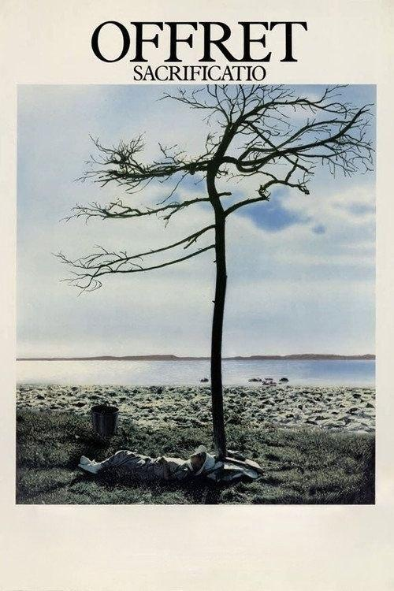

---

## 柏林苍穹下

[2026-09-18 23:40] 来自：电影资源频道(4K、REMUXE/原盘)

名称：柏林苍穹下 (1987) 4K REMUX SDR 外挂简繁字幕

描述：柏林由两位天使守护着，一个是对人世疾苦冷眼旁观的卡西尔，另一个是常常感怀于人类疾苦的丹密尔（布鲁诺•甘茨 Bruno Ganz 饰）。二人穿着宽大的天使袍，在城市各处游荡，倾听人们的祈祷，默默观察人们的内心世界。马戏团玛瑞安（苏韦戈•多马丁Solveig Dommartin 饰）的心事引来了丹密尔的同情，因为马戏团经营不善，面临倒闭，玛瑞安满心烦恼。这个马戏团的天使演员令丹密尔动了凡心，他决定化作凡人，追求一段美满感情。

本片荣获1987年第40届戛纳国际电影节最佳导演奖。

夸克网盘：https://pan.quark.cn/s/921080353467

📁 大小：68.7GB

🏷 标签：#柏林苍穹下 #剧情 #爱情 #奇幻

---

## 爱

[2026-09-18 23:30] 来自：夸克云盘影视资源频道

名称：【原盘】爱 (2012) 1080P REMUX 内封简繁特效字幕

描述：台湾富商马克（赵又廷 饰）跟名媛方柔伊（舒淇 饰）有染，但却无法给她承诺。这令她极为伤心，气急败坏离开酒店，在街头遭遇酒店服务生小宽（阮经天 饰）偷拍，柔伊怒砸相机，随即与富商陆平（钮承泽 饰）驾车离去。原来柔伊本是陆平的情人，但是却无法获得一纸婚约。倒是因为那次相遇，她和口吃的小宽发生了一段感情……小宽的妹妹宜珈（陈意涵 饰）是自行车选手，她的闺蜜是钮承泽的独女小霓（郭采洁 饰），后者习惯性跟她抱怨男友阿凯（彭于晏 饰）的诸般不好，但是宜珈却持相反意见并暗度陈仓。于是一道三角恋开始分割友情……

夸克网盘：https://pan.quark.cn/s/ec6ec7a335d0

百度网盘：https://pan.baidu.com/s/1CHgKuFjRe1MNn2I9BNSSbw?pwd=fpgr 来自：阿里、夸克、百度网盘4K影视资源 [2026-09-18 23:30] 名称：【原盘】爱 (2012) 1080P REMUX 内封简繁特效字幕

📁 大小：24.3GB

🏷 标签：#爱 #剧情 #爱情

---

## 浮城谜事

[2026-09-18 23:29] 来自：夸克云盘影视资源频道

名称：浮城谜事 (2012) 4K

描述：警察童明松（祖锋 饰）负责调查一起车祸，大学生蚊子（常方源 饰） 意外惨死，童明松决定同哥们儿——喜欢蚊子的修车工秦枫（朱亚文 饰）一起调查事件真相。两人追查真相时牵扯出了中产阶级夫妻乔永照（秦昊 饰）和陆洁（郝蕾 饰），陆洁因为女儿在幼儿园的玩伴宇航，认识了她的妈妈桑琪（齐溪 饰），却在与其交往的过程中发现了丈夫的外遇……随着蛛丝马迹的层层披露，事情越来越蹊跷，童、秦二人发现乔永照、陆洁、桑琪都藏有不可告人的秘密。

夸克网盘：https://pan.quark.cn/s/0fd740543c8e

百度网盘：https://pan.baidu.com/s/18d8I9giK58PPU-DOt7WhcQ?pwd=937p 来自：阿里、夸克、百度网盘4K影视资源 [2026-09-18 23:29] 名称：浮城谜事 (2012) 4K

📁 大小：11.2GB

🏷 标签：#浮城谜事 #剧情 #犯罪

---

## 我十一

[2026-09-18 23:28] 来自：夸克云盘影视资源频道

名称：我十一 (2012) 4K

描述：20世纪70年代，西南三线地区，无数的上海人怀着崇高的理想来到这片贫瘠的土地建设国家，付出莫大的牺牲。此时此刻，文革的余威仍在，各国营单位乱相未除，而在子弟学校就读的少年王憨（刘文卿 饰）则和八拉头（张珂源 饰）、小老鼠（钟国流星 饰）、卫军（楼逸昊 饰）等几个伙伴过着无 忧无虑的快乐生活。王憨广播体操动作标准，被选为领操员，为此软磨硬泡求妈妈（闫妮 饰）为他做了一件崭新的白衬衣。可是他在河边玩时衬衣意外掉入水中，结果意外遭遇了被警察追捕的杀人犯谢觉强（王紫逸 饰）。

夸克网盘：https://pan.quark.cn/s/13778ecee718

百度网盘：https://pan.baidu.com/s/1KwEv_-F0MOnmhpU3wYZ0mA?pwd=2zmj 来自：阿里、夸克、百度网盘4K影视资源 [2026-09-18 23:28] 名称：我十一 (2012) 4K

📁 大小：11.8GB

🏷 标签：#我十一 #剧情 #犯罪

---

## 白蛇传

[2026-09-18 23:26] 来自：夸克云盘影视资源频道

名称：白蛇传 (2006) 1080P 刘涛版 全30集

描述：峨眉山千年蛇妖白素贞（刘涛 饰）和小青（陈紫函 饰）为早日成仙来到人间， 路遇在西湖断桥躲雨的书生许仙（潘粤明 饰），互生情愫。法海（刘小锋 饰）以斩妖除魔为名，誓言将白素贞斩除，他利用徒弟十天（史良 饰）作法，逼白素贞现形吓死许仙。白素贞熟知药理，她冒死盗仙草救许仙，但法海将许仙囚于境台不得相见，白素贞怒火万丈，施法水漫金山寺，醒来的许仙不管白素贞是人是妖，要定了她。急功近利的法海本想趋魔成佛，怎奈被魔心所困，变成癫狂的魔头。白素贞十月怀胎一朝分娩，许仙摆脱魔困与其相聚，魔头法海故伎重演，他使诈将白素贞压在雷峰塔下。诀别前，白素贞流下她一生第一滴也是最后一滴眼泪......

夸克网盘：https://pan.quark.cn/s/682439ec7968

百度网盘：https://pan.baidu.com/s/1P3FeIYsEF1IcRJ6SLQx9mQ?pwd=dcxp 来自：阿里、夸克、百度网盘4K影视资源 [2026-09-18 23:26] 名称：白蛇传 (2006) 1080P 刘涛版 全30集

📁 大小：24GB

🏷 标签：#白蛇传 #剧情 #奇幻 #古装 #国剧

---

## 紫川光明三杰

[2026-09-18 22:02] 来自：综合网盘资源频道

名称：紫川·光明三杰 (2024)

描述：西川大陆战乱四起，紫川、塞戎两族战事紧张。驻守边界的紫川秀(杨旭文 饰)携大获全胜的军功返还帝都，守得家国一朝安稳。然而，一波未平一波又起，帝都朝中重臣杨明华(张帆 饰)心怀不轨，发起叛乱，紫川秀携结义兄弟帝林(刘宇宁 饰)、斯毅林(张铭恩 饰)，里应外合，铲除祸患，让动荡的紫川重归平静。但虎视眈眈的塞戎在紫川还未恢复元气之时正式宣战。烽火狼烟，紫川秀、斯毅林、帝林，三兄弟远离家乡，为了自己的家园、为了守护心爱的人、为了和平而奔赴战场，谱写出燃情又壮丽的故事。

夸克网盘：https://pan.quark.cn/s/22ea05b26aeb

📁 大小：AA

🏷 标签：#剧情 #紫川·光明三杰 #quark

---

## 铁道英雄

[2026-09-18 21:59] 来自：综合网盘资源频道

名称：铁道英雄 (2021)

描述：抗日战争时期，在日军肆虐横行的鲁南地区，临城枣庄英勇的“铁道队”穿铁轨、扒火车，截取武器和物资，用胆识和智慧与敌人斗争到底，殊死捍卫家园，为抗战胜利作出突出贡献。

本片是根据发生在1935年-1945年间，洪振海、王志胜、杜季伟、刘金山等“铁道队”队员的真实事迹改编，将最大限度地还原“铁道队”的英雄故事。

夸克网盘：https://pan.quark.cn/s/c28813da4475

📁 大小：AA

🏷 标签：#剧情 #动作 #铁道英雄 #quark

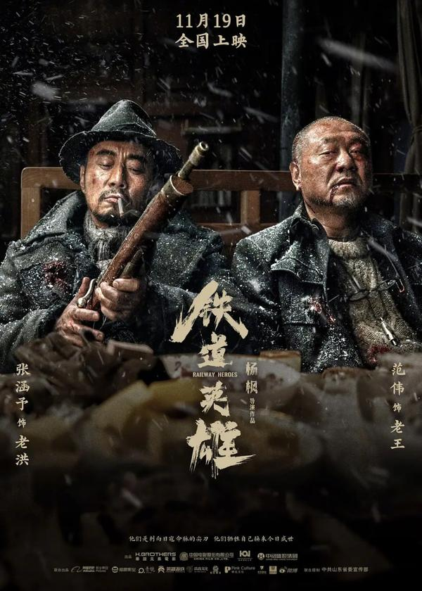

---

## 温柔的背叛

[2026-09-18 21:57] 来自：综合网盘资源频道

名称：温柔的背叛 (2010)

描述：世界上没有一个男人不渴望浪漫的恋情，当美好的恋情随着婚姻降临转化成亲情，人们便开始渴望另外一份浪漫而刺激的情感。于是，每个人潜意识里都觉得自己需要一个情人，婚外偷情不知从何时起已经成了一个已婚男人必须思考的问题。但是，人又怎能挣脱亲情、社会、道德、名誉和伦理的束缚。

一份禁忌的感情到底是爱情的增值还是背叛，是情感的失衡还是归属，是苦涩的毒酒还是醇美的甘露？曾经幸福、宁静的家庭在突如其来的背叛面前，如同大海巨浪中的小船，承受致命的颠簸。家庭将何去何从。曾经美好、炙热的爱情在背叛与伤害之中分崩离析，情感和理智如同绷得笔直的细线，悬于一线之间。情感正遭受着前所未有的考验。

残破不堪的爱情如何弥补，伤痕累累的心灵能否愈合。情感已沦陷，道德已沦丧，一段不堪回首的人生如何拯救。一切悬而未决，扑朔迷离，做出抉择的人们将付出怎样的代价……

夸克网盘：https://pan.quark.cn/s/f7419398a905

📁 大小：AA

🏷 标签：#剧情 #爱情 #温柔的背叛 #quark

---

## 宫锁连城

[2026-09-18 21:54] 来自：综合网盘资源频道

名称：宫锁连城 (2014)

描述：大清乾嘉年间，连生三个女娃的大将军翁哈贷的妻子映月(王琳 饰)为了巩固自己的地位，竟然想出狸猫换太子的大胆计策，用别人家生下的男婴替换了自己产下的女婴。转眼二十年过去，男婴长成一脸英气的恒泰(陆毅 饰)，而女婴则被勾栏妓女收养，得名宋连城(袁姗姗 饰)，虽然美丽婀娜，却出身泥潭。在命运的指引下，从小生活在市井、满嘴谎言的连城与正直单纯的恒泰邂逅，在打打闹闹的过程中，两个年轻人渐渐熟稔，更在相处的过程中对彼此渐生好感。

命运的锁链将从出生那一刻起便种下不解之缘的两个人紧紧锁在一起，由此谱写了一曲民间久久流传的传奇…

夸克网盘：https://pan.quark.cn/s/54f9969b1bca

📁 大小：AA

🏷 标签：#爱情 #古装 #宫锁连城 #quark

---

## 赤裸特工

[2026-09-18 21:51] 来自：综合网盘资源频道

名称：赤裸特工 (2002)

描述：本片是程小东于2002年导演的香港动作惊悚片，该片当年在香港上映第一周就获得了价值70000多美元的票房。

Madame M集团在世界各地专门诱拐十二、三貌美少女，将她们软禁在荒岛上进行地狱式的特训，钻研各类型的战斗知识及暗杀技巧。从小训练她们成为既出色又性感的特工。通过六年非生即死的选拔最后只剩下三名非常出色的杀手Charlene(Maggie Q 饰)、Katt(安雅 饰)及Jing。CIA专案小组指挥Jack(吴彦祖 饰)一直致力捣破Madame M的杀人集团，在香港举行的一场龙舟竞渡中偶遇Charlene，两个大大出手，但在了解Charlene和进一步相处后这对兵贼渐渐互生情愫。Madame M拉拢日本赤军龙三郎(连凯 饰)合作更大的非法勾当。改邪归正的Charlene和Jack一起手刃敌人后在同一座庙里求到了同一只签…

夸克网盘：https://pan.quark.cn/s/2775d6dd1ae3

📁 大小：AA

🏷 标签：#剧情 #爱情 #惊悚 #赤裸特工 #quark

---

## 人生之路

[2026-09-18 21:44] 来自：综合网盘资源频道

名称：人生之路 (2023)

描述：改编自路遥先生的经典中篇小说《人生》。故事以80年代改革时期陕北高原的城乡生活为时空背景起点，讲述了高加林、高双星、刘巧珍、黄雅萍等一批青年人走出黄土高原，来到上海，在改革开放大潮中，感情与事业上几经波折，几个人不断奋斗、拼搏， 改变人生命运的真挚故事。

夸克网盘：https://pan.quark.cn/s/4cd8e1c20134

📁 大小：AA

🏷 标签：#剧情 #人生之路 #quark

---

## 白色巨塔

[2026-09-18 21:36] 来自：综合网盘资源频道

名称：白色巨塔 (2003) 4K WEB-DL 中文字幕 H265 AAC 2.0

描述：财前五郎(唐泽寿明 饰)和里见修二(江口洋介 饰)是同期实习的医生，但二者却走上了截然不同的道路。财前凭借高超的个人技术成为了外科部实际上的第一教授。财前的咄咄逼人让即将退休的第一外科教授东真藏(石坂浩二 饰)感到威胁，东教授决定另立他人。因此极具野心的财前寻求其岳父——财前妇产诊所院长财前又一(西田敏行 饰)和第一内科教授鹈饲(伊武雅刀 饰)的帮助，通过贿赂和拉帮结派，历经波折，最终获得了第一外科教授的职位。而他的同期，第一内科助教里见却是位实事求是，热心研究的学者。二者的不同选择导致了最后不同的命运。位高权重的财前终于到达梦想的高处，却发现不胜寒风，悲剧也因此上演。本剧改编自山崎丰子的同名巨作。号称“日本国民级小说”。前后经历过五次翻拍，数次被搬上荧屏。内容直指医院的黑暗面，时隔多年，依旧具有现实意义。

百度网盘：https://pan.baidu.com/s/1bwSSfurnXsFfc0XHSCrdEw?pwd=Yu88

迅雷网盘：https://pan.xunlei.com/s/VP1oifO3b6XSZM-xsPDJCiHMA1?pwd=ety5

📁 大小：NG

🏷 标签：#剧情 #白色巨塔 #4K #WEBDL #中文字幕 #AAC #baidu #xunlei

---

## 极限网红

[2026-09-18 21:06] 来自：综合网盘资源频道

名称：极限网红 Follow Me (2020)

描述：一个社交媒体人物与他的朋友一起前往莫斯科，以获取他成功的VLOG的新内容。他们总是不断挑战极限，迎合不断增长的受众，他们进入了一个充满神秘，过度和危险的寒冷世界。当现实生活与社交媒体之间的界线变得模糊时，该组织必须为逃避和生存而战。

夸克网盘：https://pan.quark.cn/s/d2c98fcdeaf8

📁 大小：AA

🏷 标签：#悬疑 #惊悚 #极限网红 #quark

---

## 相爱相亲

[2026-09-18 21:04] 来自：综合网盘资源频道

名称：相爱相亲 (2017)

描述：岳惠英(张艾嘉 饰)的母亲去世之后，惠英最大的念想就是将远葬在乡下的父亲的坟迁回城里，和母亲葬在一起，这个念头让她和父亲的原配姥姥(吴彦姝 饰)之间爆发了巨大的矛盾。迁坟的事成为了惠英的心结，亦让她和丈夫孝平(田壮壮 饰)之间的感情产生了裂痕。

惠英的女儿薇薇(朗月婷 饰)是电视台的栏目记者，对姥姥的过去充满了好奇的她将这场“家庭矛盾”搬上了电视，展现在了大众面前，虽然出发点是善意的，可整个事件却愈演愈烈最后变成了一出闹剧。与此同时，薇薇和男友阿达(宋宁峰 饰)之间的感情因为阿达的青梅竹马的出现而遭遇了信任危机，这让她对等了外公一辈子也孤独的生活了一辈子的姥姥产生了莫名的亲近之感。

夸克网盘：https://pan.quark.cn/s/6a87191f135b

📁 大小：AA

🏷 标签：#剧情 #爱情 #家庭 #相爱相亲 #quark

---

## 无间道风云

[2026-09-18 20:58] 来自：综合网盘资源频道

名称：无间道风云 The Departed (2006)

描述：波士顿南部的马萨诸塞州黑社会势力极为猖獗，其中最大的团伙要数弗兰克(杰克•尼科尔森 Jack Nicholson 饰)执掌的爱尔兰黑帮。警方为了剿灭他们，决定派警校毕业生比利(莱昂纳多•迪卡普里奥 Leonardo DiCaprio 饰)潜伏其中做卧底。警官的冷嘲热讽，让曾有过底层生活的比利甚为不爽，他曾希望做堂堂正正的警察，但是在强压之下也只得服从命令，在经过烧杀抢掠的洗礼后，他赢得了弗兰克的信任。与此同时，同是毕业生的科林(马特•达蒙 Matt Damon饰)因为缉私有功，获得了上级的嘉奖，并且正在跟心仪女友筹备婚事。而实际上，他是弗兰克安插到警队的一枚棋子，两人勾结牟取私利。警匪先后发现存在内鬼，一场猫鼠博弈由此展开……

本片获得第79届奥斯卡金像奖最佳影片、马丁•斯科塞斯摘得最佳导演奖

夸克网盘：https://pan.quark.cn/s/e229564d438a

📁 大小：AA

🏷 标签：#剧情 #惊悚 #犯罪 #无间道风云 #quark

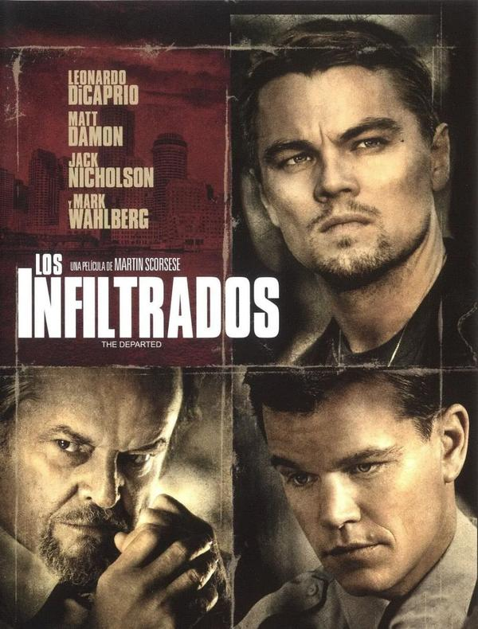

---

## 卫斯理之霸王卸甲

[2026-09-18 20:55] 来自：综合网盘资源频道

名称：卫斯理之霸王卸甲 衛斯理之霸王卸甲 (1991)

描述：研习堪舆学的阮姓(秦沛 饰)与卫姓(元奎 饰)师兄弟找到龙穴霸王卸甲，若死后埋葬于此，定可兴旺后人。阮欲归葬此地，但卫看出该穴虽佳，却可引起血光灾难，因此力劝师兄放弃。师兄弟言语不和，大打出手。阮得偿所愿，归葬权穴，重伤的卫归葬智穴，并助好友王占得财穴。

二十多年后，卫的儿子卫斯理(钱嘉乐 饰)辗转来到美国洛杉矶，凭借过人才智制造电脑病毒，引起巨大混乱。他的举动引起王的后人注意，王家凭借财穴荫护，开创电脑王国，但今年事业滑落。最终得知，龙穴风水二十四年后势必逆转，必须将先人坟茔挪往他所访的幸免。王氏后人助卫斯理解围，并邀其同赴龙穴所在地——加里南

夸克网盘：https://pan.quark.cn/s/49c368a43bd4

迅雷网盘：https://pan.xunlei.com/s/VP1o_H5ukR-y4MlenReODzrVA1?pwd=srgj

📁 大小：AA

🏷 标签：#动作 #奇幻 #卫斯理之霸王卸甲 #衛斯理之霸王卸甲 #quark #xunlei

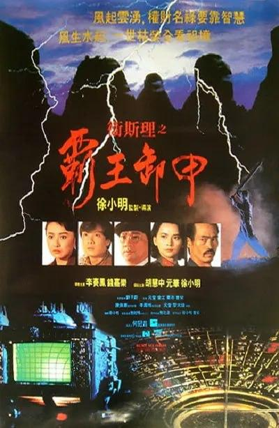

---

## 鬼打鬼之黄金道士

[2026-09-18 20:52] 来自：综合网盘资源频道

名称：鬼打鬼之黄金道士 (1992)

描述：道士英叔(林正英 饰)胸怀开宗立派之志，每日带领五名徒弟勤加修炼，他为人坦荡，清贫无一长物，不得不做看更来补贴日用。英叔受人委托，看守一座无人大宅，无处容身的师徒六人暂住大宅之中。这座宅第中有一对儿清朝鬼夫妻留驻，女鬼阿娟(罗慧娟 饰)饱受丈夫虐待殴打，英叔仗义出手，将男鬼驱逐，阿娟自此留在其身边，与五个徒弟相处融洽。不久男鬼带同伴寻仇，英叔师徒大展威力再次驱鬼，阿娟亦一改受气形象，在丈夫面前扬眉吐气，此后她日日配合众徒弟练习捉鬼之术。一伙外国黑社会分子得到情报，获悉在这座大宅内藏有大量黄金，他们乔装教堂人员入住，试图谋害英叔等人，夺取黄金…

夸克网盘：https://pan.quark.cn/s/caca7b31dd8b

📁 大小：AA

🏷 标签：#喜剧 #动作 #惊悚 #鬼打鬼之黄金道士 #quark

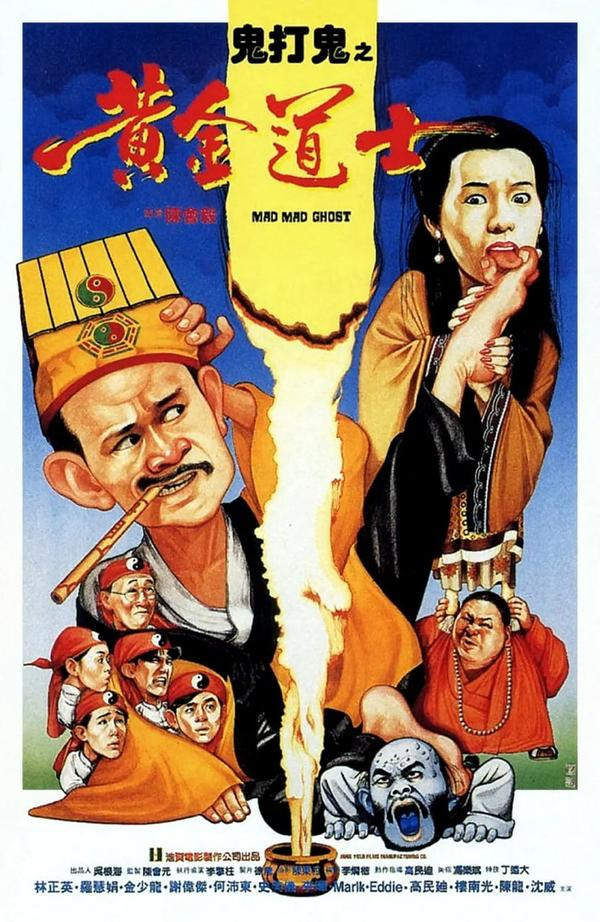

---

## 僵尸新战士

[2026-09-18 20:50] 来自：综合网盘资源频道

名称：僵尸新战士 殭屍新戰士 (2010)

描述：人头攒动的繁华都市，行走着一名貌不惊人的平凡女子，但是她却有着并不平凡的身份。这个名叫阿丫(蒋璐霞 饰)是一个僵尸猎人，纵横天下专门捕杀那些为害人类的邪恶僵尸，同时也在寻找多年前变成僵尸的姐姐阿素。与其他猎人不同，阿丫也有几名僵尸朋友，千年僵尸阿隆(钱小豪 饰)和儿子阿力、女儿阿斯(周秀娜 饰)，以及阿斯的朋友阿嘉和阿莲，他们拒食人血，僵尸的外表下有这一颗颗善良的心灵。

某日，一个邪恶的身影出现在这座城市中。他是僵尸中的魔道，靠吸食其他僵尸的灵气为生的阿盟(元华 饰)。无数同类惨死在他的手中，而阿盟也将魔爪伸向了阿丫和阿斯等人…

迅雷网盘：https://pan.xunlei.com/s/VP1oZIt8jUOJX2D_ehxWjyPTA1?pwd=g276

📁 大小：AA

🏷 标签：#恐怖 #僵尸新战士 #殭屍新戰士 #xunlei

---

## 红蝎子

[2026-09-18 20:49] 来自：综合网盘资源频道

名称：红蝎子 (2007)

描述：云南边境有一个被国务院、中央军委授予“缉毒先锋站”的云南公安边防总队江桥边防检查站，由于与境外的世界三大毒源之一的金三角相毗邻，使它成为了境外毒品流向我有国内地的过境通道。而近年来，女毒贩日趋增多，但是这里镇守着一批边防缉毒勇士，铸就了一道贩毒分子无法逾越的钢铁长城，也成为了一个个贩毒分子的鬼门关。那些妄图利用乔装后的特殊身份来牟取暴利的贩毒女也难以逃过边防官兵的“火眼金睛”。女毒贩形形色色，贩毒的方式也五花八门。但无论这一只只毒蝎子多么狡猾，伪装得多么巧妙，都将难逃法网。那些抱小孩的少妇，挺着大腹的“孕妇”，以及把毒品藏在身体内的贩毒分子，被边防官兵剥去了伪装，美梦被撕得粉碎。一个梦的产生和破灭就在这短短的一念之间。人们啊，谁不想过得好一些，满足一些，但那只能靠自己的智慧和汗水去获取。一切违法的非分之想都是徒劳无益的，这已经被无数枉然的生命和牢狱之灾所证明。

夸克网盘：https://pan.quark.cn/s/3ed039e3fc2c

📁 大小：AA

🏷 标签：#剧情 #犯罪 #红蝎子 #quark

---

## 铁拳男人

[2026-09-18 20:00] 来自：综合网盘资源频道

名称：铁拳男人 Cinderella Man (2005)

描述：布洛克(罗素·克劳 Russell Crowe 饰)除了是一名过气的拳击手，还是三个孩子的父亲。当他的拳击生涯走下坡路后，紧接着而来的是生活的拮据和入不敷出的家庭状况。幸好有贤惠美丽的妻子梅(芮妮·齐薇格 Renée Zellweger 饰)理解支持，她的从不埋怨和勤劳持家，令这个家庭不至于毫无生机。布洛克放下自尊去排队领取救济金，却挡不住严冬的即将来临，家里食物短缺，生存问题迫在眉睫。

布洛克终于决定重上拳击台，这是他可以挽救家人的唯一办法。他的复出引来了民众的关注，成为了人们心中的平民英雄。他在比赛中英勇挥拳，为了男人的尊严，为了家人的生存。

夸克网盘：https://pan.quark.cn/s/00e5b24c5677

📁 大小：AA

🏷 标签：#剧情 #家庭 #运动 #铁拳男人 #quark

---

## 我的

[2026-09-18 19:56] 来自：综合网盘资源频道

名称：我的 마인 (2021)

描述：《MINE》是一部悬疑痴情剧，讲述聚集在上流社会的野心勃勃的人们的现实和悲伤爱情故事。将聚焦于那些看起来华丽的人们的不幸生活以及那些被抢走的人们对不安不公平的世界的愤怒，是一部欲望宣泄题材的电视剧。

夸克网盘：https://pan.quark.cn/s/9fd9c27728f6

📁 大小：AA

🏷 标签：#悬疑 #我的 #quark

---

## 龙腾虎跃

[2026-09-18 19:54] 来自：综合网盘资源频道

名称：龙腾虎跃 龍騰虎躍 (1983)

描述：程家三兄弟为民除害，因此而惹恼了地煞(权永文 饰)和天煞(任世冠 饰)，遭到两人报复。老大惨死于屠刀之下，老二程振南(田俊 饰)和老三程振北(陈慧楼 饰)分别带着他们的儿子阿龙(成龙 饰)和阿栋(惠天赐 饰)踏上逃亡的旅程，一场混乱之中，阿龙和阿栋失散，从此踏上了两条截然不同的人生道路。

时光荏苒，阿龙成长为了乐观开朗的正直青年，一次无意中，他使出了失传已久的程家拳，被一直耿耿于怀的地煞和天煞发现了行踪，结果家中惨遭灭门，丐帮帮主的女儿小玲(林银珠 饰)帮助阿龙逃过一劫之后亦不幸命丧黄泉。此仇不报非君子，阿龙和久违的阿栋决定联手，替父亲等人报仇

夸克网盘：https://pan.quark.cn/s/3d2fa3bdb1d4

📁 大小：AA

🏷 标签：#剧情 #龙腾虎跃 #龍騰虎躍 #quark

---

## 铁血茶城

[2026-09-18 19:52] 来自：综合网盘资源频道

名称：铁血茶城 (2017)

描述：1950年初，广西刚刚解放二十几天，国民党不甘溃败，派遣特务钟毓麟进入桂北战略重地茶城。钟毓麟在茶城联络国民党残部、大茶山中的悍匪，以及潜伏在共产党内部的特务，准备攻打茶城，妄想以茶城为根据地，指挥广西的反共势力重新夺回广西，全面反攻大陆。钟毓麟一伙匪徒在茶城一带抢掠、暗杀、残害无辜百姓，成了一伙地地道道的政治土匪。中国人民解放军第四野战军四三四团八连随军军医沐剑晨阴差阳错成为钟毓麟阴谋中一个替罪羊。作为一个坚定的共产主义革命战士，沐剑晨没有屈服，为了茶城百姓的安危、为了保卫新生人民政权的胜利果实，他不顾个人安危，与钟毓麟匪帮展开了不屈不挠的战斗。最终，沐剑晨在茶城县委的指挥下，配合解放军飞行队将钟毓麟这一伙政治土匪一举歼灭。

迅雷网盘：https://pan.xunlei.com/s/VP1oLw6TYSao7khmZuKMp3LFA1?pwd=np4f

📁 大小：AA

🏷 标签：#剧情 #动作 #悬疑 #战争 #铁血茶城 #xunlei

---

## 雷恩菲尔德

[2026-09-18 19:51] 来自：综合网盘资源频道

名称：雷恩菲尔德 Renfield (2023)

描述：本片根据布拉姆·斯托克小说《德古拉》中的角色改编，这部喜剧恐怖片为标志性吸血鬼形象注入了全新演绎。尼古拉斯·凯奇化身吸血鬼德古拉，与尼古拉斯·霍尔特饰演的仆人雷恩菲尔德，共同演绎了一段充满病态依存关系的黑暗主仆情谊。在经历长达数个世纪的奴役后，雷恩菲尔德决心重启人生、寻求自我救赎。当他邂逅雷厉风行的交通警察丽贝卡·昆西(奥卡菲娜 饰)后，开始重新审视人生方向，对继续效忠德古拉的使命产生了动摇。

夸克网盘：https://pan.quark.cn/s/bbab87c2a57c

📁 大小：AA

🏷 标签：#喜剧 #恐怖 #奇幻 #雷恩菲尔德 #quark

---

## 嗜人之夜

[2026-09-18 19:47] 来自：综合网盘资源频道

名称：嗜人之夜 The Night Comes for Us (2018)

描述：《嗜人之夜》围绕伊托(乔·塔斯利姆饰演)展开，他曾经是一名三合会打手，他的神秘消失在雅加达引发了一场激战。而现在他要保护一位少女，还要逃离前帮派的追杀。

夸克网盘：https://pan.quark.cn/s/fbc57ccf146e

📁 大小：AA

🏷 标签：#动作 #惊悚 #犯罪 #嗜人之夜 #quark

---

## 夜生活女王之霞姐传奇

[2026-09-18 19:41] 来自：综合网盘资源频道

名称：夜生活女王之霞姐传奇 夜生活女王霞姐傳奇 (1991)

描述：王霞(叶子楣 饰)本是懵懂无知的茶楼点心女郎，在偶然之中邂逅了黑社会小混混阿伦(单立文 饰)，王霞坠入了情网。在阿伦的软磨硬泡之下，王霞半推半就的成为了应召女郎，出卖肉体为阿伦赚钱，之后，王霞意外怀孕，阿伦非但不愿承担父亲的职责，还毒打王霞，强迫她进行了堕胎手术。

悲伤 绝望的王霞结识了名为阿光(柯受良 饰)的男子，两人慢慢走到了一起，王霞改行做了妈妈桑，并且一手培养了当红头牌宝珊，哪知道宝珊竟然和阿光有了私情，愤怒的王霞向阿光讨说法，不仅自己被打，就连两岁的女儿亦受到牵连。悲愤之中，王霞用剪刀刺伤阿光，面临严酷的指控。

迅雷网盘：https://pan.xunlei.com/s/VP1oJVwQ5ejBzPUkFl63bvkWA1?pwd=psnu

📁 大小：AA

🏷 标签：#惊悚 #犯罪 #夜生活女王之霞姐传奇 #夜生活女王霞姐傳奇 #xunlei

---

## 狃花女

[2026-09-18 19:40] 来自：综合网盘资源频道

名称：狃花女 (2015)

描述：娶不起堂客的偏远山村，为了延续香火，传宗接代，千百年来这里的男人就从山外“借母生子”，久而久之，便将“借母生子”这一奇特风俗称为“狃花”。碗儿18岁那年，因丈夫得痨病被从山外狃来替芦家借腹生子，但临进芦家时才知道是兄弟两同时狃她。碗儿在与两兄弟的接触中，对芦大生出好感，想方设法回避芦二，欲与芦大成事，尽快怀子拿钱回家，为此兄弟两反目成仇。芦大为缓和兄弟关系，打算放排离家，他说我们从小都不知道娘是谁，不能再让我们的孩子没有了娘，总有一天我们都能堂堂正正娶上媳妇。那年，红军来到山里，这里的一切发生了变化------

迅雷网盘：https://pan.xunlei.com/s/VP1oIpVazkvzF76ojEdi_-69A1?pwd=43hz

📁 大小：AA

🏷 标签：#剧情 #爱情 #狃花女 #xunlei名称

---

## 感恩节

[2026-09-18 19:35] 来自：综合网盘资源频道

名称：感恩节 Thanksgiving (2023)

描述：马萨诸塞州普利茅斯，某年感恩节大促销活动，一场悲剧即将上演。搞促销活动的超市门口，贪婪饥渴的男女躁动不安，跃跃欲试。而让大众备受刺激的是，超市老板的女儿杰西卡(内尔·维拉克 Nell Verlaque 饰)居然带着好友们提前入场选购，甚至中间有人还隔着玻璃挑逗门外的顾客。于是，躁动的人群愤怒了，他们冲过工作人员的阻拦，宛如末日一般的哄抢拉开帷幕，而在这一过程中接连有人死于意外。惨剧之后的一年，超市老板接连做善事试图消弭影响，可是等到新的感恩节到来前夕，一个面具男所主导的屠戮接二连三出现。

面具男的目的只有一个，那就是杀掉所有引发去年感恩节惨剧的相关人员

夸克网盘：https://pan.quark.cn/s/9e30f6c05318

📁 大小：AA

🏷 标签：#剧情 #感恩节 #quark

---

## 砵兰街大少

[2026-09-18 19:33] 来自：综合网盘资源频道

名称：砵兰街大少 砵蘭街大少 (1993)

描述：亚豹与大兜在钵兰街过着吵兄弟的生活。豹原在别墅任马夫，人称钵兰街大少，惜在一次打斗中后脑受伤，自始变成傻豹。另外，为人讲义气的瑶琼贪厚而与江湖大佬打睹，最后全军覆没，好友曲奇助瑶逃走，幸遇大兜而避过基哥的追逐，惜好景不常，瑶终被绑走，豹拾身救瑶而受伤。大兜为豹报仇，将基一只耳朵咬下而入狱，豹在瑶悉心照顾下回复正常，在迎接大兜出狱时，赌多他义字金牌，并封他为钵兰街二少，基心有不甘，锐意报复。

夸克网盘：https://pan.quark.cn/s/6862c4bc02be

📁 大小：AA

🏷 标签：#犯罪 #砵兰街大少 #砵蘭街大少 #quark

---

## 斗罗大陆绝世唐门

[2026-09-18 19:11] 来自：百度网盘综合频道

名称：斗罗大陆：绝世唐门（2023）4K S01E01 - E171 ｜附第一季+剧场版

描述：这里没有魔法，没有斗气，没有武术，却有武魂。唐门创立万年之后的斗罗大陆上，唐门式微。一代天骄横空出世，新一代史莱克七怪能否重振唐门，谱写一曲绝世唐门之歌？ 百万年魂兽，手握日月摘星辰的死灵圣法神，导致唐门衰落的全新魂导器体系。一切的神奇都将一一展现。 唐门暗器能否重振雄风，唐门能否重现辉煌？

百度网盘：https://pan.baidu.com/s/1kj0Ym9L56piCfrWdd7tNvg?pwd=zX6D

夸克网盘：https://pan.quark.cn/s/ef4696457e95 来自：夸克云盘影视资源频道 [2026-09-18 19:10] 名称：斗罗大陆：绝世唐门（2023）4K S01E01 - E171 ｜附第一季+剧场版

📁 大小：354GB

🏷 标签：#Jack #剧情 #斗罗大陆

---

## 角头大桥头

[2026-09-18 18:52] 来自：肯德基の4K影视综合电影云盘站

名称：角头：大桥头 GATAO: Like Father Like Son (2024) 【4K.HDR】【内封简繁】【动作/犯罪】

描述：大桥头第二代接班人麦可企图重整帮派秩序，带着兄弟四处扩张地盘，触动了北馆等势力的利益。野心、血缘与兄弟情义彼此纠缠，一场争夺地盘的冲突就此升级。

链接：

迅雷网盘：https://pan.xunlei.com/s/VP1nWtVUvi6Qx54kDmoUglmXA1?pwd=mvkg

夸克网盘：https://pan.quark.cn/s/41608d3c047e

百度网盘：https://pan.baidu.com/s/1LcMohD3XBzB3egUBhkQezw?pwd=yakg

📁 大小：X

🏷 标签：#角头大桥头 #剧情 #动作 #犯罪 #中国台湾 #姚宏易 #姜瑞智 #王阳明 #张怀秋 #施名帅 #xunlei #quark #baidu

---

## 家族之苦2

[2026-09-18 17:49] 来自：综合网盘资源频道

名称：家族之苦2 家族はつらいよ2 (2017)

描述：在平田周造(桥爪功 饰)与妻子富子(吉行和子 饰)闹离婚后的数年，长男幸之助夫妇担心高龄者的危险驾驶，计划让老爸周造还掉自己的驾照，然而顽固的周造偏不还，让平田家族里再次蒙上不安的氛围。某日，周造与居酒屋女老板和开车回到故乡广岛的同级生丸田吟平偶遇，丸田已经变成落寞的孤 寡老人，周造组织了场同学聚会设法让丸田过得快乐，丸田在感动之余倾诉了他这些年的遭遇，当晚在睡梦中离世。……

夸克网盘：https://pan.quark.cn/s/dcc5b6d73ff0

📁 大小：AA

🏷 标签：#喜剧 #家庭 #家族之苦2 #家族はつらいよ2 #quark

---

## 四大家族之龙虎兄弟

[2026-09-18 17:43] 来自：综合网盘资源频道

名称：四大家族之龙虎兄弟 四大家族之龍虎兄弟 (1991)

描述：1949年，大量内地居民涌入香港，一对儿小兄弟也在这乱世中赴港谋生，他们在码头受尽地痞欺侮，幸而两人拜入潮州帮大佬“王老吉”门下得到庇护，并被后者收为养子，得名马少霖(郑则仕 饰)、马世豪(吕良伟 饰)，马氏兄弟从此帮助王老吉经营“字花摊”。数年后，二人已经成年，世豪不甘养父的生意不振，与兄长联络外人将字花摊生意揽入手中，并依靠报纸的传播力量打开了局面，同时马少霖投资报业名利双收，成为报业董事会主席。1968年，兄弟俩涉足毒品，与香港大毒枭金牙驹陷入混战，导致养父和众多兄弟殒命，马氏兄弟依靠议员的力量横扫黑帮，一家独大。他们的黑帮事业蒸蒸日上之时，廉政公署宣告成立，形势急转直下

夸克网盘：https://pan.quark.cn/s/f71245cd604f

📁 大小：AA

🏷 标签：#剧情 #四大家族之龙虎兄弟 #四大家族之龍虎兄弟 #quark

---

## 角头大桥头

[2026-09-18 16:06] 来自：综合网盘资源频道

名称：角头：大桥头 GATAO: Like Father Like Son (2024) 【4K.HDR】【内封简繁】【动作/犯罪】

描述：大桥头第二代接班人麦可企图重整帮派秩序，带着兄弟四处扩张地盘，触动了北馆等势力的利益。野心、血缘与兄弟情义彼此纠缠，一场争夺地盘的冲突就此升级。

链接：

迅雷网盘：https://pan.xunlei.com/s/VP1nWtVUvi6Qx54kDmoUglmXA1?pwd=mvkg

夸克网盘：https://pan.quark.cn/s/41608d3c047e

百度网盘：https://pan.baidu.com/s/1LcMohD3XBzB3egUBhkQezw?pwd=yakg

📁 大小：X

🏷 标签：#角头大桥头 #剧情 #动作 #犯罪 #中国台湾 #姚宏易 #姜瑞智 #王阳明 #张怀秋 #施名帅 #xunlei #quark #baidu #4K #HDR #内封简繁

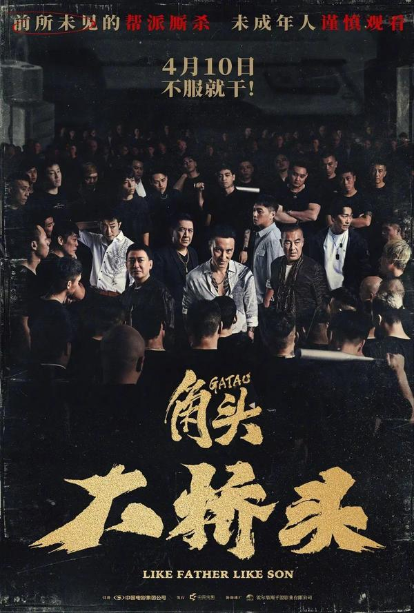

---

## 光荣时代

[2026-09-18 15:30] 来自：综合网盘资源频道

名称：光荣时代 (2019) 4K WEB-DL H265 DDP 2.0

描述：1948年北平解放前夕，地下党员郑朝阳潜伏在警察局，与多方势力展开较量；他的哥哥郑朝山表面是医生，暗中却藏着另一重身份。兄弟二人在时代洪流中走向不同道路，共同见证北平的和平解放。

链接：

夸克网盘：https://pan.quark.cn/s/d7ffa6a6d38f

迅雷网盘：https://pan.xunlei.com/s/VP1nNPp2NMEUzR6TalRcIQJtA1?pwd=ve82

📁 大小：X

🏷 标签：#光荣时代 #剧情 #悬疑 #中国大陆 #刘海波 #张译 #张隽溢 #潘之琳 #4K #WEBDL #quark #xunlei

---

## 徐福

[2026-09-18 15:29] 来自：综合网盘资源频道

名称：徐福 서복 (2021) 1080p 原盘REMUX 中文字幕 AVC TrueHD 5.1

描述：前情报局特工闵基宪被派去护送人类首个克隆人徐福，却在途中卷入多方势力的追捕。一个饱受病痛折磨，一个拥有近乎永恒的生命，两人在逃亡中逐渐建立起特殊的信任。

链接：

夸克网盘：https://pan.quark.cn/s/22eec61344d8

迅雷网盘：https://pan.xunlei.com/s/VP1nMD1JTvhzSWP_oyG_InLEA1?pwd=ypx2

📁 大小：X

🏷 标签：#徐福 #剧情 #动作 #科幻 #韩国 #李勇周 #孔刘 #朴宝剑 #1080p #原盘REMUX #中文字幕 #TrueHD #quark #xunlei

---

## 无极

[2026-09-18 15:29] 来自：综合网盘资源频道

名称：无极 The Promise (2005) 1080p 原盘REMUX 中文字幕 AVC DTS-HD MA 7.1

描述：满神预言拥有真爱的倾城将永远得不到真爱。她在命运的捉弄下，先后与奴隶昆仑、将军光明和北公爵无欢相遇，一场围绕爱情、权力与宿命的争夺由此展开。

链接：

夸克网盘：https://pan.quark.cn/s/8bb5745dd5f0

迅雷网盘：https://pan.xunlei.com/s/VP1nLjIxD8N10WrZQdSwO0JTA1?pwd=nhas

📁 大小：X

🏷 标签：#无极 #剧情 #爱情 #奇幻 #中国大陆 #陈凯歌 #张东健 #张柏芝 #谢霆锋 #真田广之 #1080p #原盘REMUX #中文字幕 #DTSHD #quark #xunlei

---

## 五毒天罗

[2026-09-18 15:26] 来自：综合网盘资源频道

名称：五毒天罗 五毒天羅 (1976)

描述：“五毒天罗”乃五毒教镇教之宝，万毒之王，但因其威力太大，一旦为别有用心之人所据，必将为害巨大。为此，第七代教主将其埋在地下，以绝后患，转眼便过去百年。某年，武林中人约定中秋齐聚五台山，希望通过比武决出武林盟主。而就在此关头，五毒天罗惊现世间的传闻不胫而走。为了一探究竟，武当派派出了门下弟子飞英雄(岳华 饰)和飞英杰(王钟 饰)前往福建。英雄途中偶然搭手救助一名小乞丐，岂料对方正是五毒教教主(王侠 饰)之女素素(井莉 饰)。素素得知五毒天罗的传闻，连忙赶回五毒教询问父亲，谁知却将五毒天罗真正的藏匿之处泄露出去。

一时间武林大乱，江湖上风云再起…

夸克网盘：https://pan.quark.cn/s/879ef4ed6928

📁 大小：AA

🏷 标签：#剧情 #五毒天罗 #五毒天羅 #quark

---

## 古镜幽魂

[2026-09-18 15:21] 来自：综合网盘资源频道

名称：古镜幽魂 古鏡幽魂 (1974)

描述：书生陈仲躬(石隽 饰)的母亲身患重病卧床不起，为使母亲康复，仲躬向上天许下宏愿，母亲因此而恢复了健康。之后，为了还愿，仲躬来到终南山向高僧讨取残经，在一处荒废的庭院之中潜心抄写。

入夜，庭院里传来袅袅琴声，一位名为素素(林青霞 饰)女鬼出现在了仲躬的面前。原来，素素死后遭到了恶鬼胁迫，被迫替恶鬼卖命，而仲躬正是她此次的“猎物”，可是仲躬生性平和善良，素素几次尝试都不忍心下手。之后，仲躬在古井之中找到一面古镜，这正是素素生前所有。素素自知自己和仲躬人鬼殊途注定无法在一起，与此同时，厉鬼亦对仲躬产生了兴趣，要将他害死

夸克网盘：https://pan.quark.cn/s/6dd4e5f47138

📁 大小：AA

🏷 标签：#剧情 #爱情 #悬疑 #古镜幽魂 #古鏡幽魂 #quark

---

## 新天龙八部之天山童姥

[2026-09-18 15:14] 来自：综合网盘资源频道

名称：新天龙八部之天山童姥 新天龍八部之天山童姥 (1994)

描述：天山派李秋水(林青霞 饰)爱上掌门师兄逍遥子，却不知逍遥子所爱的其实是李秋水的孪生妹妹李沧海(林青霞 饰)。而天山童姥巫行云(巩俐 饰)对李沧海亦有超越性别之爱。逍遥子被同门叛徒丁春秋(徐少强 饰)下毒中伤，被迫归隐到飘渺峰，设下“玲珑棋局”等来本性善良、佛性极深的有缘人虚竹 (林文龙 饰)，将百年功力悉数相传，以期代他清理门户。 为夺少林宝物，丁春秋率阿紫(张敏 饰)、诱动连手的李秋水等人欲血洗少林，得到了逍遥子毕生功力的虚竹在巫行云的帮助下临危受命，与丁春秋展开了回合大战。

夸克网盘：https://pan.quark.cn/s/1d3ae4408d20

📁 大小：AA

🏷 标签：#奇幻 #古装 #武侠 #新天龙之天山童姥 #新天龍之天山童姥 #quark

---

## 魔界转生

[2026-09-18 15:11] 来自：综合网盘资源频道

名称：魔界转生 魔界転生 (1981)

描述：宽永十五年，德川幕府打压天主教徒，导致爆发血腥残酷的岛原之乱。在这起事件中，约有两万名天主教徒惨遭杀害。及至深夜，满怀巨大仇恨的教众首领天草四郎时贞(沢田研二 饰)复活，他捐弃信仰，转生魔界，发誓报复幕府统治者。在此之后，他接连将细川夫人(佳那晃子 饰)的怨灵、濒临寿终却心存遗憾的宫本武藏(緒形拳 饰)以及宝藏院胤舜(室田日出男 饰)、遭遇灭族的伊贺忍者雾丸(真田広之 饰)拉入魔界，邪魔的力量陡然倍增。细川化身阿玉迷惑四代将军家纲(松橋登 饰)，柳生但马守宗矩(若山富三郎 饰)有心除魔，无奈天不假年，更在弥留之际堕入魔道。柳生十兵卫(千葉真一 饰)成为铲除邪魔外道的最后希望……

本片根据山田风太郎的传奇小说改编

夸克网盘：https://pan.quark.cn/s/fab2af343940

📁 大小：AA

🏷 标签：#动作 #奇幻 #魔界转生 #魔界転生 #quark

---

## 食人狂魔

[2026-09-18 15:05] 来自：综合网盘资源频道

名称：食人狂魔 ซีอุย (2004)

描述：黄利辉(段奕宏 饰)曾经是一名怯于在战场上同日军搏杀的抗日战士，战争过去，中国大地又陷入了新的纷争。1946年，在家乡难以生存的利辉听从母亲的安排，带着她赠送的小刀，远赴泰国投奔亲戚。然而语言不通，又有哮喘病的利辉在雇主家没做多久，便因为老板娘的无礼愤而出走，利辉拖着虚弱的身体，在泰国工人的嘲笑戏弄中，做苦力谋生，异国女童的微小善意此时也成了他唯一的心灵慰藉，可昔日战场上的恐怖记忆萦绕在他心头，令他在睡梦中铸下大错……流落泰国乡间的利辉整日被几个孩子骚扰，终于，他心中的魔恣意爆发，令一切不可挽回

夸克网盘：https://pan.quark.cn/s/16b7dea2c45f

📁 大小：AA

🏷 标签：#剧情 #食人狂魔 #quark

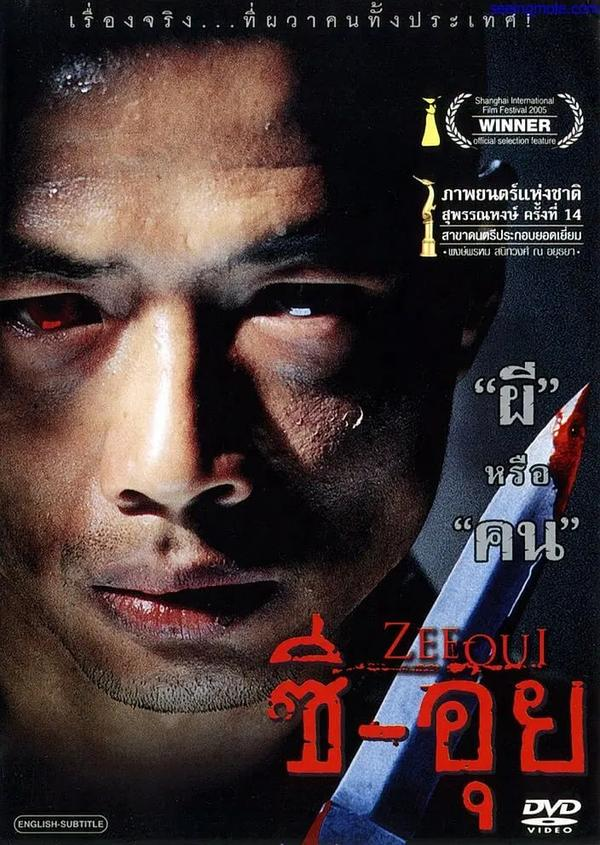

---

## 侦探开端

[2026-09-18 14:24] 来自：综合网盘资源频道

名称：侦探：开端 탐정 : 더 비기닝 (2015)

描述：《侦探》讲述的是具有天才侦查第六感的主人公大万(权相佑饰)与老手刑警(成东日饰)一起解决神秘杀人案件的故事。权相佑饰演的主人公大万是一家之长，开了一个漫画书店维持生计，而他私下实际上是天才侦探，运营着国内未解决案件和犯罪分析的同好会和博客。这也是权相佑自2011年《痛症》之后再度回归韩国大银幕。

徐英姬在片中饰演生活能力非常强的妻子。权相佑和徐英姬的合作也让影迷非常期待。

夸克网盘：https://pan.quark.cn/s/81160e392b40

📁 大小：AA

🏷 标签：#剧情 #侦探 #开端 #quark

---

## 龙兄虎弟

[2026-09-18 14:23] 来自：综合网盘资源频道

名称：龙兄虎弟 龍兄虎弟 (1986)

描述：伯爵矢志要将失散八百年的圣经所记载的用来对抗魔鬼的五件“上帝的武装”一一寻回，经过一番努力，他寻得包括亚洲飞鹰Jackie(成龙)在非洲土人手中夺得的“圣灵宝剑”等三件，而另外两件在一伙恐怖分子手中。

Jackie的朋友Alan(谭咏麟)的女友Laura(关之琳)在时装表演中遭僧侣打扮的恐怖分子绑架，对方期望用她换得所缺的“上帝的武装”。 Alan求助Jackie，Jackie以会从恐怖分子手中抢过来伯爵所缺的那两件“上帝的武装”作担保，从伯爵手中借出他所拥有的三件。Jackie、Alan以及伯爵的女儿西行欧洲，展开救人夺宝的行动

夸克网盘：https://pan.quark.cn/s/d15d0420b62a

📁 大小：AA

🏷 标签：#剧情 #喜剧 #龙兄虎弟 #龍兄虎弟 #quark

---

## 两公婆八条心

[2026-09-18 14:20] 来自：综合网盘资源频道

名称：两公婆八条心 兩公婆八條心 (1986)

描述：(一) 本來面目 陳武是著名的科學復顏專家, 但這次交來的頭骨很不完整, 在束手無策間, 來子一位冒充警務人員的Winne, 原來死者丈夫興Winne設下的一個殺妻騙保險金的陷阱....

(二)龍的種 若干年後, 生兒育女是由電腦決定, 淑嫻(曾志偉), 龍剛(余安安)渴求哲嗣以繼香燈, 但社會規定生育必須用科學家,工程師等精英之精子, 以確保新一代體魄強健,聰明伶俐. 最後, 淑在百般懇求下, 終獲醫生同情, 試植胚胎於自己體內, 結果懷胎十月, 誕下麟兒.

(三)雙生傷生 僮內柔外剛, 不能接受丈夫提出分手, 暗地在熱茶放下迷葯, 在殺夫前, 丈夫道出原來僮有孿生姐妹藍, 僮於夢中鵠一男, 正是藍之男友, 僮不能自拔, 追尋來港, 殺藍並冒興該男成婚, 在此時其夫又道出原來他亦是孿生兄弟頂色.....

夸克网盘：https://pan.quark.cn/s/605377c297dc

📁 大小：AA

🏷 标签：#剧情 #爱情 #两公婆八条心 #兩公婆八條心 #quark

---

## 猎字99号

[2026-09-18 14:18] 来自：综合网盘资源频道

名称：猎字99号 (1978)

描述：夜深人静，万籁俱寂。一个全身包裹十分严实的神秘身影出现在八一七厂的厂区内，他一步一步走上办公楼，进入图纸室打开保险柜，拿出了海军装备的“猎字99号心脏分机”图纸进行拍照。原来他是受敌对势力指派的一名间谍，其盗取了重要的军事机密将为我国国防事业建设造成巨大的损失。工厂女工无意间瞥见间谍逃脱的身影，侦察科长赵群(陈惠良 饰)和年轻的女侦员陈敏(张力维 饰)接到报警后以最快的速度赶到八一七厂。经过缜密调查，赵群确定这与八年前曾经意图作乱的间谍AC大有干系，因此必须在AC将图纸送出国之前抓到这条老狐狸。与此同时，特务机构命令小特务(陈佩斯 饰)伪装成海外华侨杨其昌与AC接头。

时间在一分一秒地流逝，正邪之间的较量到了最后关头

夸克网盘：https://pan.quark.cn/s/b5b9a29822be

📁 大小：AA

🏷 标签：#剧情 #猎字99号 #quark

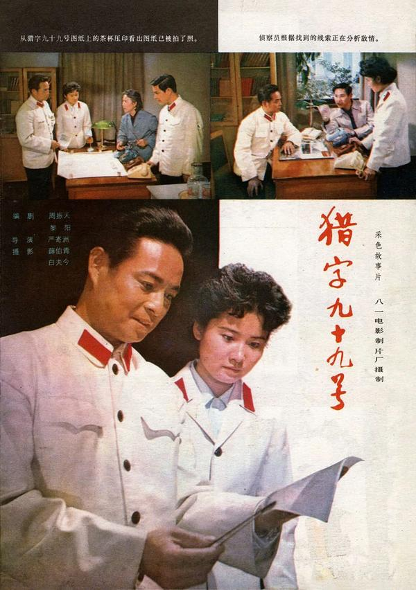

---

## 聊斋奇女子

[2026-09-18 12:22] 来自：夸克云盘影视资源频道

名称：聊斋奇女子 (2007) 1080P 全36集

描述：本剧集分为《连城》、《侠女》、《辛十四娘》、《宦娘》四个篇章组成，通过几位奇女子富有传奇色彩的命运，讲述了四段凄美动人的奇幻故事。《连城》讲述书香世家之后连城（范文芳饰）与穷书生乔生（吴奇隆饰）之间的凄美爱情故事；《侠女》讲述侠女（林家宇饰）与顾相如（陈晓东饰）间的爱恨 情仇；《辛十四娘》则讲述了一段狐仙辛十四娘（刘诗诗饰）与凡人冯生（TAE饰）间感天动地的人狐之恋；《宦娘》讲述千金小姐赵宦娘（孙莉饰）与当红小生温如春（潘粤明饰）因父母不同意而决定双双殉情的悲情故事。38集古装爱情电视剧《聊斋奇女子》取材于古典名著《聊斋志异》，由吴奇隆、范文芳、瞿颖、潘粤明、孙莉、陈晓东、刘诗诗、TAE、李倩等倾情演绎。

夸克网盘：https://pan.quark.cn/s/5191d66755ae

百度网盘：https://pan.baidu.com/s/1MukiM-hF78_G3k99k9iRrw?pwd=ks1n 来自：阿里、夸克、百度网盘4K影视资源 [2026-09-18 12:22] 名称：聊斋奇女子 (2007) 1080P 全36集

📁 大小：28.6GB

🏷 标签：#聊斋奇女子 #奇幻 #爱情 #恐怖 #国剧

---

## 平凡的世界

[2026-09-18 12:21] 来自：夸克云盘影视资源频道

名称：平凡的世界 (2015) 1080P 全56集

描述：上世纪70年代，自尊好强的农家子弟孙少平在原西县高中读书，与地主出身的郝红梅相互爱怜，后郝红梅与家境优越的班长顾养民谈恋爱。同村同班的好友田润生为此抱不平狠揍顾养民一顿。倔强的少平不肯承认自己失恋，但开始与自己过于自尊的自卑斗争，积极参加赴地区会演的排练。好读课外书的少平敏感、自尊，吸引着县领导的女儿田晓霞。少平高考落榜回乡劳动，在经历了大旱、抢水、死人的事件后，断然拒绝侯玉英以进城为诱的追求，远离故土，漂泊揽工。哥哥孙少安初中毕业就在家里劳动与村支书田福堂的女儿田润叶青梅竹马，遭到田的剧烈反对。最终少安娶了勤劳善良的山西姑娘贺秀莲，转型开办了烧砖窑，走上了致富路。

夸克网盘：https://pan.quark.cn/s/beb9e51548de

百度网盘：https://pan.baidu.com/s/1WZsP_8x4m4ZTonaxHN8rug?pwd=j6k9 来自：阿里、夸克、百度网盘4K影视资源 [2026-09-18 12:21] 名称：平凡的世界 (2015) 1080P 全56集

📁 大小：23.9GB

🏷 标签：#平凡的世界 #剧情 #爱情 #国剧

---

## 努尔哈赤秘史

[2026-09-18 12:17] 来自：夸克云盘影视资源频道

名称：努尔哈赤秘史 / 太祖秘史 (2005) 1080P 全46集

描述：《太祖秘史》是一部描绘努尔哈赤（马景涛 饰）生平和他与女人们之间复杂情感的历史小说或传记作品。努尔哈赤是清朝建立者之一，他的生平充满传奇和戏剧性，尤其是在他与明朝的战争和统一女真各部的过程中。在电视剧中，努尔哈赤被描绘为一位天骄英雄，他面对家族仇恨、个人挫折和政治挑战，最终成功统一女真各部，成为一代霸主。与此同时，努尔哈赤的感情生活也是故事的重要组成部分。他与东哥、佟佳氏、阿巴亥、孟古和那齐娅等五位绝世美女有着复杂的情感纠葛，这些女性以各自独特的方式影响了他的命运和政治决策。红颜薄命的悲剧元素贯穿整个故事，这些女性不仅展现了柔美的一面，也在一定程度上引发了努尔哈赤心中的遗憾和痛苦。尽管他在战场上如鹰般威猛，但在情感上却是如此脆弱和执着，这使得他的人物形象更加丰富和深刻。

夸克网盘：https://pan.quark.cn/s/4ae2a5621f60

百度网盘：https://pan.baidu.com/s/1hzZVs2b0vL1HDvcyK4zNFw?pwd=7dh4 来自：阿里、夸克、百度网盘4K影视资源 [2026-09-18 12:17] 名称：努尔哈赤秘史 / 太祖秘史 (2005) 1080P 全46集

📁 大小：34.4GB

🏷 标签：#努尔哈赤秘史 #剧情 #古装 #国剧

---

## 多大点事儿

[2026-09-18 12:10] 来自：影视动漫分享|SeedHub|夸克|网盘|🧲

名称：多大点事儿 (2024)

#电视剧 #喜剧 #剧情 #百度

主演: 何冰 于谦 朱媛媛 

豆瓣: [0](https://movie.douban.com/subject/35479397/)

“胯骨轴胡同”的小巷管家杜满堂（何冰饰）安分守己，是胡同里的老好人，而对门的张泽中（于谦饰）油嘴滑舌，爱占小便宜，俩人虽是发小，却因为性格截然相反素来不对付。一次真..

百度网盘：https://pan.baidu.com/s/1FkfKQj4hnxMrzmS_Jwt0Pw?pwd=6666

---

## 妖怪合租屋

[2026-09-18 12:10] 来自：影视动漫分享|SeedHub|夸克|网盘|🧲

名称：妖怪合租屋 (2020)

#电视剧 #喜剧 #奇幻 #夸克

主演: 小芝风花 松本真理香 每熊克哉 Katsuya Maiguma 

豆瓣: [8.0](https://movie.douban.com/subject/35131353/)

以传说中的妖怪们生活的sharehouse为舞台，描绘了被最坏的前男友夺去一切、伤痕累累的主人公·目黑澪（小芝风花）坚强成长的恐怖喜剧。小澪所面临的麻烦和麻烦的对手..

夸克网盘：https://pan.quark.cn/s/015b2a6ba9af

---

## 热血长安

[2026-09-18 12:10] 来自：影视动漫分享|SeedHub|夸克|网盘|🧲

名称：热血长安 (2017)

#电视剧 #古装 #悬疑 #夸克

主演: 徐海乔 鞠婧祎 程小蒙 

豆瓣: [6.5](https://movie.douban.com/subject/26776531/)

公元626年，大唐都城长安内突然异象丛生，疑案四起，人心惶惶。大理寺成立调查组，调查这些看似怪力乱神的事件，成员囊括通晓伽罗术的萨摩多罗，超强分析能力的卿李郅，熟练..

夸克网盘：https://pan.quark.cn/s/6a7640619c70

---

## 真爱未了情

[2026-09-18 12:10] 来自：影视动漫分享|SeedHub|夸克|网盘|🧲

名称：真爱未了情 (1995)

#电影 #剧情 #夸克

主演: 艾曼纽·贝阿 米歇尔·塞罗尔 让-雨果·安格拉德 

豆瓣: [7.6](https://movie.douban.com/subject/1301691/)

奈莉（艾曼纽·贝阿EmmanuelleBéart饰）和男友相恋多年，死心塌地的想要和这个男人携手步入婚姻的殿堂。然而男友实为好吃懒做之人，为了维持生计，奈莉不得不奔..

夸克网盘：https://pan.quark.cn/s/4105a8247981

---

## 北京青年

[2026-09-18 12:10] 来自：影视动漫分享|SeedHub|夸克|网盘|🧲

名称：北京青年 (2012)

#电视剧 #剧情 #夸克 #迅雷 #百度

主演: 杜淳 贺刚 任重 

豆瓣: [6.5](https://movie.douban.com/subject/6989755/)

何东（李晨饰）、何西（任重饰）、何南（贺刚饰）和何北（杜淳饰）是四个自幼生活在老北京城的堂兄弟，生活各不相同的四兄弟，在成年之后各自经历着人生最重要的转折期。老大何..

夸克网盘：https://pan.quark.cn/s/bcbea038cb12

迅雷网盘：https://pan.xunlei.com/s/VOdNVU1NXyp00tm4rgFKbyHWA1?pwd=75zi

百度网盘：https://pan.baidu.com/s/1_TPZ7tXstV7kLtfbiKT6eg?pwd=6666

---

## 红猪

[2026-09-18 11:01] 来自：综合网盘资源频道

名称：红猪 (1992) 4K WEB-DL 国日双语 H265 DDP 5.1

描述：豆瓣8.6高分

20世纪20年代末的亚得里亚海，一战时期的王牌飞行员波鲁克不知何故变成了猪的模样。战争结束后，他驾驶着红色水上飞机成为赏金猎人，专门追捕在海上作恶的空中劫匪，也因此被人称为“红猪”。不甘心屡屡受挫的劫匪们请来美国飞行员卡地士对付波鲁克，一场空中交锋让他的飞机严重受损。波鲁克只得前往老朋友保可洛的工厂修理飞机，并在那里结识了年轻的飞机设计师菲儿。在菲儿的帮助下，红色水上飞机重新获得新生，而波鲁克与卡地士之间的较量也远未结束……

夸克网盘：https://pan.quark.cn/s/e7f35bd37d14

百度网盘：https://pan.baidu.com/s/13Ll_hnOww30VE6kmJYOM8w?pwd=Yu88

迅雷网盘：https://pan.xunlei.com/s/VP1mRenwVc9pAVDJJg0PvU4DA1?pwd=q5qe

📁 大小：11.6GB

🏷 标签：#奇幻 #冒险 #红猪 #4K #WEBDL #国日双语 #quark #baidu #xunlei

---

## 大主宰

[2026-09-18 11:01] 来自：肯德基の4K影视综合电影云盘站

名称：大主宰(2023)4K HDR 更新至S01E91 杜比音效

描述：大千世界，位面交汇，万族林立，群英荟萃，一位位来自下位面的天之至尊，在这无尽世界，演绎者令人向往的传奇，追求着主宰之路。

夸克网盘：https://pan.quark.cn/s/975f1aab0955

📁 大小：107GB

🏷 标签：#剧情 #大主宰

---

## 收件人不详

[2026-09-18 10:53] 来自：综合网盘资源频道

名称：收件人不详 (2001) 1080p 原盘REMUX 中文字幕 AVC DTS-HD MA 5.1

描述：豆瓣8.2高分

韩战初结束时期，某个美军驻韩基地附近的村镇里，多数居民的生活被战后的虚无、迷茫和绝望笼罩，出路难寻。皮肤黝黑的尚武(杨东根)因是母亲(方银珍)在战争期间与美国黑人士兵所生，自小受尽歧视，养成暴戾的性格，无处发泄时就会对母亲拳打脚踢；其母亲不甘接受命运的摆布，屡屡写信去美国，期望她的黑人丈夫能把她们母子接到美国，但每每只收回“收件人不详”的退信；而他靠画画谋生的好友恩吴(金英民)，因体质纤弱，经常被混混欺负，心爱的女孩被人凌辱、委身美国大兵时，他也只能眼睁睁看着暗自抓狂。

迅雷网盘：https://pan.xunlei.com/s/VP1mQ1WsFmPAkss-sfDIo7opA1?pwd=btes

📁 大小：22.4GB

🏷 标签：#战争 #收件人不详 #1080p #原盘REMUX #中文字幕 #DTSHD #xunlei

---

## 齐木楠雄的灾难

[2026-09-18 10:46] 来自：综合网盘资源频道

名称：齐木楠雄的灾难 (2016) 1080p WEB-DL 中文字幕 H264 DDP 2.0

描述：高中生·齐木楠雄是超能力者。心灵感应、念动力、透视、预知、瞬间移动、千里眼等，不论任何事情都自由自在。但这任谁都羡慕不已的最强能力，实际上对于本人而言是引来灾难的不幸元凶。因此，他在别人面前封印了超能力，以不起眼、不和他人有所牵扯为信条，默默无闻地过日子。但不知为何，他的身边总是聚集着不可思议的人类(生物)，风暴般的灾难接连不断地降临！

夸克网盘：https://pan.quark.cn/s/ee8e4992edcb

百度网盘：https://pan.baidu.com/s/1lMiudbVxEe58ZbRHOeAjvg?pwd=Yu88

📁 大小：

🏷 标签：#喜剧 #科幻 #奇幻 #齐木楠雄的灾难 #1080p #WEBDL #中文字幕 #quark #baidu

---

## 宋慈韶华录

[2026-09-17 22:26] 来自：综合网盘资源频道

名称：宋慈韶华录 (2023)

描述：讲述法医鼻祖宋慈的成长传奇。

夸克网盘：https://pan.quark.cn/s/0629ddfad4db

📁 大小：AAA

🏷 标签：#剧情 #宋慈韶华录 #quark

---

## 独臂刀

[2026-09-17 22:18] 来自：综合网盘资源频道

名称：独臂刀 獨臂刀 (1967)

描述：大侠齐如丰将为救他而身亡的仆人方诚的儿子方刚(王羽)抚养成人后，欲立其为掌门人，此举引来方刚师兄的嫉妒。追求方刚不成的齐如丰的女儿齐佩联合师兄与方刚比武，却失手砍断方刚右臂，方刚负伤逃离齐家。

夸克网盘：https://pan.quark.cn/s/3c765c6f3923

📁 大小：NG

🏷 标签：#剧情 #动作 #武侠 #古装 #独臂刀 #獨臂刀 #quark #ali

---

## 大块头有大智慧

[2026-09-17 22:18] 来自：4K影视屋(分屋）-蓝光无损电影

名称：大块头有大智慧（2003）

大隻佬（刘德华 饰）在跳艳舞时与前来扫黄的警花李凤仪（张柏芝 饰）相遇，同时，重案组亦在附近调查一起印度人杀人案。大隻佬逃跑时与逃走的印度逃犯不期而遇，最后逃犯逃走了，大隻佬被当成了嫌犯抓回了警局。其实大隻佬以前是大陆一名武僧，因好友小翠惨死，悲伤过度在树下不慎打死小鸟，对着小鸟坐禅7天7夜因而获得能看到因果的能力——看到结果时，便能看到因由。他看到了小翠的死是因果，他打死小鸟是因果，因无法平静接受这一切，他还俗了。 这次，他看到了李凤仪，看到了日军在杀人，便知她罪业太重，会遭遇横祸。为了帮助这位心地善良的警花，他开始暗中帮助她，帮她屡破奇案，救她于危难，希望能帮她洗刷罪业……

夸克网盘：https://pan.quark.cn/s/ee0f395d17a9

迅雷网盘：https://pan.xunlei.com/s/VP1eM9weZLUOh66lJmSFAy56A1?pwd=a4bp

百度网盘：https://pan.baidu.com/s/1gJZ9fI-43oCtI77u0gqmHA?pwd=merz

标签: #剧情 #动作 #惊悚

---

## 目露凶光

[2026-09-17 22:09] 来自：综合网盘资源频道

名称：目露凶光 (1999)

描述：1967年，山景酒店发生灭门惨案，欧炳同因怀疑妻子有外遇，将其杀死后又与三岁儿子吞老鼠药自杀，三人的死状极其恐怖，房间的墙壁上写有“愿此刻永留”五个血字，留声机里正在重复播放“愿此刻永留”一曲。

1999年，印刷业电脑专家马文信(刘青云)下班后被神秘匪徒绑架，但家人及其女友傅骞人(郭蔼明)均没收到任何勒索电话。两天后警察阿 Pit(梁家辉)在马文信座驾中发现神秘血渍，跟踪发现马文信被倒吊在山景酒店发生灭门惨案的那间房里，且浑身布满伤痕。自此，马文信像被欧炳同的鬼魂附体一般，不光终日对傅骞人疑神疑鬼，还时常对其目露凶光。

夸克网盘：https://pan.quark.cn/s/43e28562837f

📁 大小：AAA

🏷 标签：#剧情 #惊悚 #目露凶光 #quark

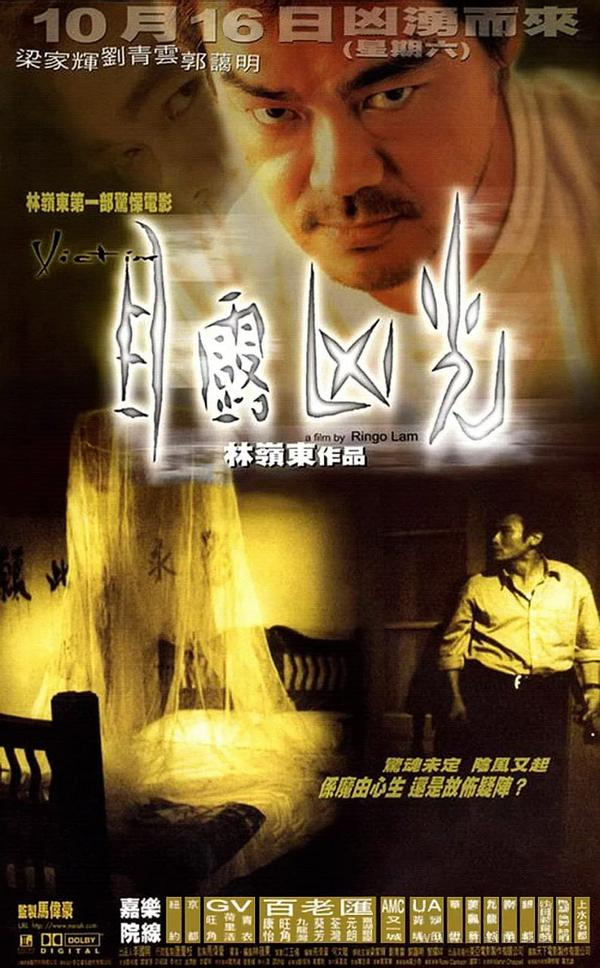

---

## 足球英杰

[2026-09-17 21:54] 来自：综合网盘资源频道

名称：足球英杰 The English Game (2020)

描述：19世纪70年代，两名来自不同阶级的足球运动员努力应对职业和个人双重困境——他们不仅改写了足球史，也永远改变了英格兰。

夸克网盘：https://pan.quark.cn/s/529465719fa0

📁 大小：NG

🏷 标签：#剧情 #运动 #足球英杰 #quark #ali

---

## 圣女贞德蒙难记

[2026-09-17 21:41] 来自：电影资源频道(4K、REMUXE/原盘)

名称：【原盘】圣女贞德蒙难记 (1928) 1080P REMUX 内封简/繁英双语特效字幕

描述：影片聚焦法国民族女英雄圣女贞德（玛利亚·法奥康涅蒂 Maria Falconetti饰）生命的最后时刻，再现了她被出卖落入勃艮第叛军手中后，在英格兰监狱和法庭上，从受审到处死的全过程。被英格兰当局严密控制的天主教会，指控贞德为异端和女巫。法庭上，法官更伪造证据，以信仰问题不断对她施以精神上和肉体上的折磨。面对惨无人道的酷刑与子虚乌有的诬陷，贞德正气凛然、坚贞不屈。最后，贞德被押赴鲁昂市广场，被绑在火刑柱上活活烧死。

夸克网盘：https://pan.quark.cn/s/6a2fe4bde3dc

📁 大小：17.7GB

🏷 标签：#圣女贞德蒙难记 #剧情 #历史 #传记

---

## 最佳拍档2大显神通

[2026-09-17 21:35] 来自：综合网盘资源频道

名称：最佳拍档2：大显神通 最佳拍檔2：大顯神通 (1983)

描述：金刚(许冠杰 饰)成功降服白手袜之后，白手袜之兄黑手袜受黑手党指派继续交易钻石并向金刚复仇，金刚与黑手袜的高级机器人大战数合终于侥幸胜利，却马上又落入了牛牛、悠悠兄妹犯罪团伙的骗局，卷入银行抢劫案成为嫌犯，金刚逃亡路上将拍档光头神探(麦嘉 饰)与何东诗(张艾嘉 饰)的婚礼搅得一塌糊涂。

夸克网盘：https://pan.quark.cn/s/fcf1b56df003

📁 大小：NG

🏷 标签：#喜剧 #动作 #最佳拍档2 #大显神通 #最佳拍檔2 #大顯神通 #quark #ali

---

## 一级机密

[2026-09-17 21:30] 来自：综合网盘资源频道

名称：一级机密 1급기밀 (2017)

描述：影片基于真实事件改编拍摄。讲述了苦心于围绕一级军事机密在军队内部发生的贪腐事件的将军(金相庆 饰)得到电视台女记者(金玉彬 饰)的帮助追查事件真相的故事。

夸克网盘：https://pan.quark.cn/s/3884a42b64cf

📁 大小：AA

🏷 标签：#剧情 #一级机密 #quark

---

## 漫画威龙

[2026-09-17 21:21] 来自：综合网盘资源频道

名称：漫画威龙 漫畫威龍 (1992)

描述：本片是《新精武门》的续集。牛皮(陈百祥 饰)为刘晶(周星驰 饰)在擂台上的英姿折服，自此苦缠拜师，却引起小敏(张敏 饰)对刘晶误会。刘晶获得的巨额奖金被师父们全部输光，更卷入了潇洒(钟镇涛 饰)与一女孩的纠葛，小敏对他的误会也日益加深，刘晶运气一时衰到了极点。

阿威之大哥横刀(元华 饰)为替弟报仇，将刘晶的神力右手打残，幸有牛皮之姑牛牡丹(萧芳芳 饰)危急关头蒙面救走刘晶。于是刘晶在牛家休养，邂逅和小敏相貌一样的牛皮表妹——婉君(张敏 饰)，不久横刀找上门来，将牛皮与婉君掳走，牛牡丹为保住牛家血脉，只得将牛家祖传的“电角神拳”传授于刘晶

夸克网盘：https://pan.quark.cn/s/289e43123a79

📁 大小：AA

🏷 标签：#喜剧 #动作 #漫画威龙 #漫畫威龍 #quark

---

## 死神少女

[2026-09-17 21:18] 来自：综合网盘资源频道

名称：死神少女 (2010)

描述：公视偶像剧《死神少女》由电影《刺青》、《漂浪青春》导演周美玲所执导，取材于真实社会案例，贯穿了12个青少年的故事，反映现在社会中青少年面临的各种问题，如：同性恋、校园暴力、家庭暴力等。

石雨高中流传着一个传说，以灵魂为代价向死神少女许愿，她就会帮实现愿望！这也为这所高中带来死亡的阴影。死神少女——渡(房思瑜 饰)，永远的19岁，奈何桥的守护者，非生非死，无善无恶。她是一个能聆听世人召唤的死神，当凡人因为困扰而向她发出祈愿时，她就会现身，满足凡人亲自许下的愿望。而具有灵异体质的——沈奇(炎亚纶 饰)，是唯一一个可以看见死神少女的人。起先，沈奇认定渡就是一切不幸的罪魁祸首，可透过了解一则则的故事的真相，他终于明白渡非刽子手，只是帮助迷失的人重新找回自己，沈奇自己也渐渐爱上渡。最终他们的命运将何去何从？

夸克网盘：https://pan.quark.cn/s/005a3cd21d56

📁 大小：AA

🏷 标签：#剧情 #死神少女 #quark

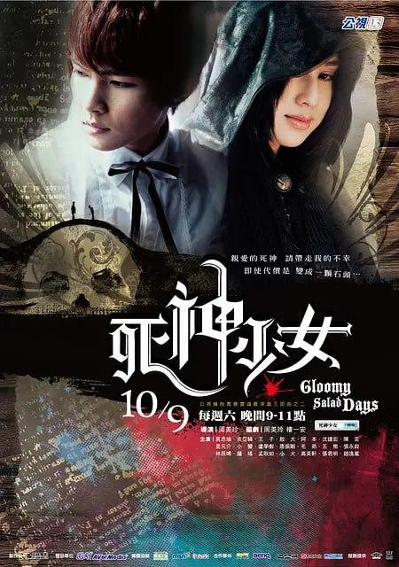

---

## 南北狮王

[2026-09-17 21:02] 来自：综合网盘资源频道

名称：南北狮王 南北獅王 (1981)

描述：以“反清复明”为口号的天地会被朝廷追捕，天地会恐被清廷一网打尽，遂将会员名册送往机密地点。天地会中人红娘子遇上刚直的捕快阿云，暗中利用他送出名册，期间遇上聪敏的阿寸，两人为生计不惜去踢馆，还参加舞狮比赛。及后红娘子被杀，阿云和阿寸从中觉醒，代红娘子执行任务，但两人却身负重伤，生命危在旦夕……

夸克网盘：https://pan.quark.cn/s/906df8320643

📁 大小：AA

🏷 标签：#动作 #古装 #南北狮王 #南北獅王 #quark

---

## 大话大话西游

[2026-09-17 20:48] 来自：综合网盘资源频道

名称：大话大话西游 (2024)

描述：身前是灿灿铠甲，身后是广袤天地。

人生百年我们再次上路！

夸克网盘：https://pan.quark.cn/s/191340fd6aaf

📁 大小：AA

🏷 标签：#喜剧 #奇幻 #大话大话西游 #quark

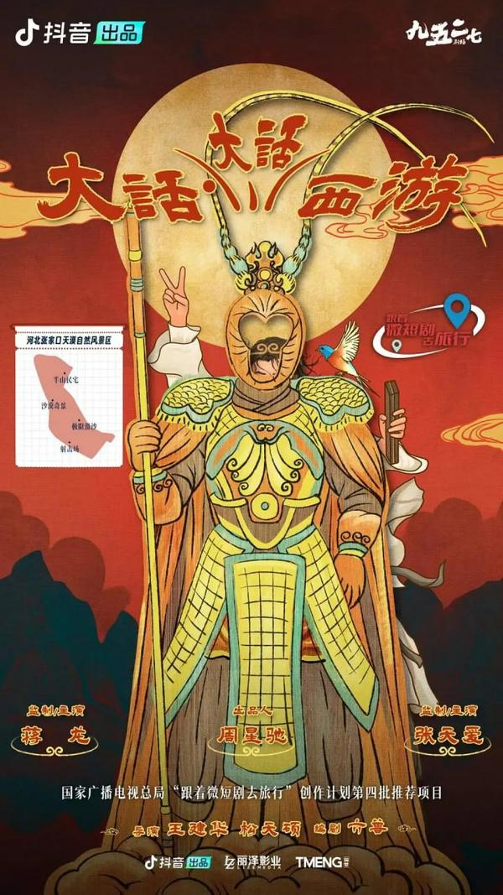

---

## 新上海滩

[2026-09-17 20:44] 来自：综合网盘资源频道

名称：新上海滩 新上海灘 (1996)

描述：年轻军官许文强(张国荣)逃往路上被日本特务伏击堕海，漂浮到外滩岸上时身体不支晕倒，丁力(刘德华)路过欲将其救却遭其下意识的武力，两人一番打斗后结为好友。丁力偶然救下上海大亨冯敬尧(吴兴国)的千金冯程程(宁静)后，许下心愿要娶其为妻，但襄王有梦神女却心另有所属，冯程程只把他当好朋友，爱的恰是某次旅途中在火车上结识的他的好兄弟许文强，而许文强也因她的勇敢善良机智对她产生了好感。

夸克网盘：https://pan.quark.cn/s/f710774ae879

📁 大小：NG

🏷 标签：#动作 #惊悚 #犯罪 #新上海滩 #新上海灘 #quark #ali

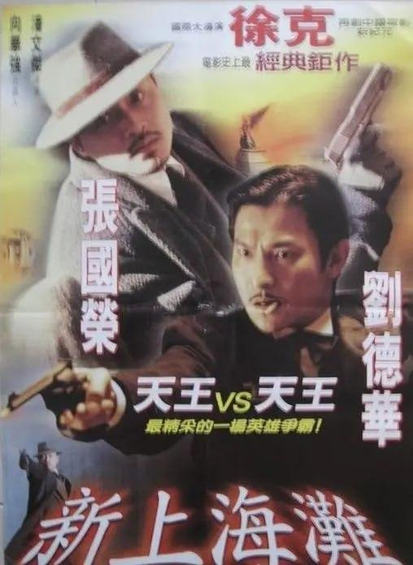

---

## 大唐狄公案

[2026-09-17 20:38] 来自：综合网盘资源频道

名称：大唐狄公案 (2024)

描述：大唐初年，象征皇后权力的凤印丢失，并引发矫诏杀害当朝官员的事件， “凤印案”引起朝中异动，守旧派面上无恙，暗地加紧了串联密谋。而赶考科举的狄仁杰(周一围 饰)，正逢此时无意中卷入一桩离奇的杀人案。

本剧由狄仁杰查案发现杀人案与凤印丢失事件暗合开始，通过讲述狄仁杰履职各地屡破奇案，惩治贪官、护海防、肃黑恶、申律法、助民安，同时得以勘破自己身世之谜的故事讲述，展现了狄仁杰知行合一的人生信条。

夸克网盘：https://pan.quark.cn/s/cb09990206b9

📁 大小：AA

🏷 标签：#悬疑 #古装 #大唐狄公案 #quark

---

## 遗愿清单

[2026-09-17 20:35] 来自：电影资源频道(4K、REMUXE/原盘)

名称：【原盘】遗愿清单 (2007) 1080P REMUX 国英多音轨 外挂简英双语字幕

描述：老富翁爱德华•科尔（杰克•尼克尔森 Jack Nicholson 饰）近年来在公立医院的私有化改造事业中获利颇丰，他为节省成本，规定病房“一房两床”的做法颇受非议，但性格强势的科尔不以为意，岂料他不久被检查出罹患癌症，本欲入住单人病房的科尔在舆论压力下只得与另一位病人——老卡特（摩根•弗里曼 Morgan Freeman 饰）同处一室。汽车修理技师老卡特博闻强识，将三个子女培养成才，但代价是牺牲了年轻时要做历史教授的梦想。曾经结婚多次如今却孤身一人的科尔逐渐对卡特产生了兴趣，两位老人在病房中结下了友谊。科尔偶然发现了卡特的“遗愿清单”，他决定运用自己的力量，让那些纸面上的疯狂构想一一实现，去发现人生的真正意义……

夸克网盘：https://pan.quark.cn/s/d9a8dd2f2990

📁 大小：16.7GB

🏷 标签：#遗愿清单 #剧情 #喜剧 #冒险

---

## 梦

[2026-09-17 20:28] 来自：电影资源频道(4K、REMUXE/原盘)

名称：梦 (1990) 4K HDR 外挂简中字幕

描述：本片是日本电影天皇黑泽明对梦的勾画，全片共有八个梦境，分别是：太阳雨、桃园、风雪、隧道、乌鸦、红色富士山、垂泪的魔鬼和水车之村。这八个梦几乎贯穿了人类生活的所有主题，战争与和平、社会与人生。在不同的梦境里有着不同的场景，配合不同的色彩，把人类所面对的所有主题一一呈现。

夸克网盘：https://pan.quark.cn/s/2d90105f6ddf

📁 大小：27.2GB

🏷 标签：#梦 #剧情 #奇幻

---

## 巴比龙

[2026-09-17 20:21] 来自：电影资源频道(4K、REMUXE/原盘)

名称：【原盘】巴比龙 (1973) 4K REMUX SDR 外挂简中字幕

描述：绰号巴比龙的亨利·查理尔（史蒂夫·麦奎因 Steve McQueen饰）正要被流放到圭亚那一个名为“魔鬼岛”的苦役营终身服刑。查理尔因被控杀害一名皮条客而被捕入狱，可他始终认为自己是冤枉的。在押运船上，身强力壮的查理尔保护了一个带着眼镜狡猾的知识分子路易斯·德加（达斯汀·霍夫曼 Dustin Hoffman饰）。为了洗刷自己的罪名，查理尔从他踏上“魔鬼岛”的第一天起，就开始在德加的帮助下策划越狱逃跑。然而“魔鬼岛”地处荒蛮之地，四面环水，并且到处流行着可怕的疾病。查理尔一次又一次地逃狱，又一次再一次地被捉回。十多年来，他仍孤注一掷地抱着一袋椰壳跳下大海逃生。

夸克网盘：https://pan.quark.cn/s/2650ee10571f

📁 大小：46.3GB

🏷 标签：#巴比龙 #剧情 #传记 #犯罪

---

## 使命

[2026-09-17 20:15] 来自：夸克云盘影视资源频道

名称：使命 (2005) 720P 全21集

描述：鉴于清水市越来越乱的社会治安，林荫（张嘉译 饰）临危受命，担任了清水市新一届公安局长。赴任途中，他亲手抓获了三个行凶的壮汉，但其中一人却让派出所长赵铁军（李梦男 饰）放跑，加之副局长牛明（赵小锐 饰）不冷不热的态度，让林荫很不是滋味。某夜，市委万书记（徐敏 饰）办公室被盗，林荫立下限期破案的军令状。从此，林荫依靠秦志剑（刘均 饰）、高翔（于俭 饰）等刚正不阿的干警，在市委陈副书记、洪市长支持下，与郑光军（谢钢 饰）和公安内部的腐败势力展开了殊死斗争。神通广大的郑光军游说上层领导，暗示要在清水开赌场，林荫将计就计，制定了行动方案“雷雨行动”，他决定彻查黑势力之后的保护伞……

夸克网盘：https://pan.quark.cn/s/6e63c6e590db

百度网盘：https://pan.baidu.com/s/1zlDZmv-n-Eow8LNzDHLRQQ?pwd=3q74 来自：阿里、夸克、百度网盘4K影视资源 [2026-09-17 20:15] 名称：使命 (2005) 720P 全21集

📁 大小：17.9GB

🏷 标签：#使命 #剧情 #犯罪 #国剧

---

## 滴血玫瑰

[2026-09-17 20:14] 来自：夸克云盘影视资源频道

名称：滴血玫瑰 (2005) 1080P 全20集

描述：“他把他的刀剑当做他的上帝，当他的刀剑胜利时，他自己却失败了。”日军侵华淞沪战役的最高长官白川大将隐隐地感到了这样的一种危机。再过一个多月，在上海的虹口公园将隆重举行庆祝日本天皇诞辰的“天长会”庆祝大会，届时侵华日军第九师团将进行阅兵式。然而随着庆祝会日期的逼近，日本特务机关“影机关”组长三岛平八却得到情报，抗日志士将要突袭会场，为死去的抗日英灵报仇。在上海，所有的日本特务蜂拥而出，防止这次破坏的行动，保证“天长会”的顺利召开。

夸克网盘：https://pan.quark.cn/s/410396568381

百度网盘：https://pan.baidu.com/s/1NaWp41fCaxgZW1BT05HN4A?pwd=nk87 来自：阿里、夸克、百度网盘4K影视资源 [2026-09-17 20:14] 名称：滴血玫瑰 (2005) 1080P 全20集

📁 大小：22.7GB

🏷 标签：#滴血玫瑰 #剧情 #国剧

---

## 志愿军雄兵出击

[2026-09-17 20:13] 来自：夸克云盘影视资源频道

名称：【原盘】志愿军：雄兵出击 (2023) 1080P REMUX 内封简/繁英双语特效字幕

描述：1950年，朝鲜南北两个政权发生内战，未过多久，美国宣布参战，并且趁机对我国东北部展开轰炸，还派出舰队封锁台湾海峡，以阻挠中华民族统一大业的完成。危急存亡之时，我方高层展开连番慎重的讨论和推演，并派出周总理前往莫斯科请求斯大林的支援。然而斯大林模棱两可，我方又处于建国之初，百废待兴的艰苦阶段。但是为了保家卫国，御敌于国门之外，毛主席毅然决然派出由彭德怀同志率领的人民志愿军入朝作战。冰天雪地，战火纷飞。志愿军战士们面临的是与自己无论从国力还是装备都有着天壤之别的敌人，可是为了心中的理想，为了子孙后辈的安居乐业，他们甘愿抛头颅洒热血，朝着胜利勇敢前进…

夸克网盘：https://pan.quark.cn/s/eb84a99186ff

百度网盘：https://pan.baidu.com/s/1mI2UwdJ8bZjbw4Y7xcaXxw?pwd=5t52 来自：阿里、夸克、百度网盘4K影视资源 [2026-09-17 20:13] 名称：【原盘】志愿军：雄兵出击 (2023) 1080P REMUX 内封简/繁英双语特效字幕

📁 大小：21GB

🏷 标签：#志愿军：雄兵出击 #剧情 #历史 #战争

---

## 欲望的火焰

[2026-09-17 19:20] 来自：综合网盘资源频道

名称：欲望的火焰 (1988)

描述：时装店经理宋波的妻子杨小莉突然死亡，刑警队长陈庭带着两名助手赶到现场。经化验茶几上一只有残酒的杯子和酒瓶，发现杨小莉是喝了含有氰化物的葡萄酒中毒身亡。他决定从李环这里入手，但当他们找到李环时，她已经死了。案情越来越复杂，此时，香港警暑转来一批有关黄金走私集团和材料，材料表明这个集团在国内有一个支队。眼前的案子与这个集团有没有关系呢？陈庭经过反复推理和细致工作，终于揭开此案的真相。宋波，这个某大学的高材生，在物质金钱欲望的支配下，终于堕落成黄金走私集团中的杀人犯，他受着集团头目叶苒的控制。最后他在熊熊烈火中丧命。

夸克网盘：https://pan.quark.cn/s/97bd0f73bdab

📁 大小：AA

🏷 标签：#犯罪 #欲望的火焰 #quark

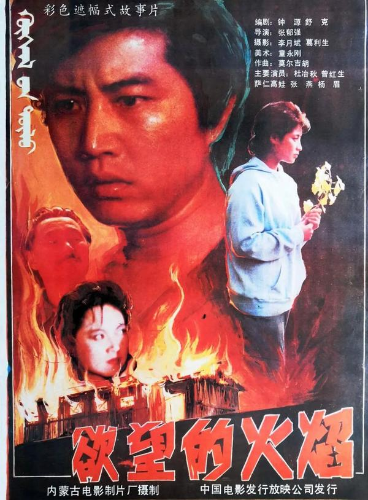

---

## 把我关起来

[2026-09-17 19:17] 来自：综合网盘资源频道

名称：把我关起来 私をくいとめて (2020)

描述：改编自绵矢莉莎的同名小说，讲述一位长期单身的31岁女子黑田光子脑内有咨询角色“A”，在对人际关系和行为举止感到迷茫的时候，另一个自己“A”总是能给她正确的答案。有一天，光子爱上了比自己年龄小的营业员多田，相信多田君和自己是两情相悦的，已经习惯了一个人的生活的光子，像20多岁的时候一样不能勇敢起来，一边困惑着自己，一边向前迈出了一步。本片是能年玲奈和林遣都初次合作演出，2020年冬季上映。

夸克网盘：https://pan.quark.cn/s/17d288aec14e

📁 大小：AA

🏷 标签：#剧情 #爱情 #把我关起来 #私をくいとめて #quark

---

## 小男人周记之吾家有喜

[2026-09-17 19:10] 来自：综合网盘资源频道

名称：小男人周记之吾家有喜 小男人週記3之吾家有喜 (2017)

描述：52岁的梁宽，自觉他前半生的人生经历了三个巨浪：一，当阿Ann令他由男仔变成男人的那天；二，几年后他娶了阿Ann，自此变成一个老婆奴的那天；三，阿Ann认为他没出息，带走8岁女儿，母女从此人间蒸发的那天。经历过人生的三个巨浪，梁宽化悲伤为力量，由一个我见犹怜的小男人，蜕 变成为一个人见人怕的大男人。今天，他已经是上市公司主席……身边的大红人，他学哓用无所不用其极的手段去赚钱，他拥有的财产，已足以让他一生无忧，而梁宽的最大遗憾是…阿Ann看不到他的「长进」。可是自从梁宽发达之后，他很怕照镜，没有原因地，他害怕面对镜中的自己。喜喜回归，对梁宽来说是人生另一个巨浪，他不懂怎样做一个21岁、卜卜脆，兼拥有33D上围的女儿的爸爸，毕竟在梁宽的记忆之中，喜喜只得八岁，而喜喜的回归，亦悄悄改变著梁宽，他终于能再次面对镜中的自己，因喜喜令他有勇气去再年轻，再任性一次。

夸克网盘：https://pan.quark.cn/s/9591d0f66a96

📁 大小：AA

🏷 标签：#喜剧 #小男人周记之吾家有喜 #小男人週記3之吾家有喜 #quark

---

## 贞观之治

[2026-09-17 17:20] 来自：夸克云盘影视资源频道

名称：贞观之治 (2006) 4K 全50集

描述：公元620年，唐武德三年七月，唐朝开国皇帝李渊的次子——秦王李世民奉父之命东征洛阳。洛阳是前朝隋的东都，在政治、军事、经济各方面都有着举足轻重的意义。洛阳之战也就成了唐朝统一中原的最重要一仗。经过李世民军队长达数月的围困，洛阳城内经没有了和唐军对抗的力量，洛阳的首领王世充只好把希望寄托在救兵上。河北的窦建德带领几十万大军浩浩荡荡向洛阳进发，要解洛阳之围。李世民命弟弟齐王李元吉留守大本营，自己亲自带兵迎击窦建德的大军。李世民充分利用地形的优势，用几千人击败了窦建德的大军，并将窦建德本人擒获。王世充见大势已去，只得开城投降。

夸克网盘：https://pan.quark.cn/s/d0058186599b

百度网盘：https://pan.baidu.com/s/1mVe8maQBDGKsF239wKkcsQ?pwd=24nm 来自：阿里、夸克、百度网盘4K影视资源 [2026-09-17 17:20] 名称：贞观之治 (2006) 4K 全50集

📁 大小：69GB

🏷 标签：#贞观之治 #剧情 #历史 #古装 #国剧

---

## 爱上查美乐

[2026-09-17 17:12] 来自：综合网盘资源频道

名称：爱上查美乐 美樂。加油 (2011)

描述：查美乐(王心凌饰)是一个坚强善良的平凡女孩，为实现男友韩以风(施易男饰)的梦想，她放弃自己的事业开了一家面包店。阴差阳错间查美乐与韩以风的弟弟韩以烈(贺军翔饰)相遇。韩以烈是风靡全亚洲的音乐才子，但性格古怪，作风霸道。查美乐的热情真诚如阳光般照进了以烈冷漠的内心，以烈陪美乐度过了人生最灰暗的时刻。然而这使得一直暗恋以烈的经纪人楚少茵(柳岩饰)醋意大发。餐饮连锁店创办人何言劭(张伦硕饰)本打算收购美乐的面包店，也慢慢爱上了坚强努力的美乐。面对以风的回心转意、言劭的强烈追求和少茵的从中破坏，以烈与美乐到底该何去何从。

由八大电视、行政院客家委员会、浙江金溪影视与多曼尼制作共同制作的台湾偶像剧《爱上查美乐》，改编自单飞雪的小说《王的恋歌》。本剧集联合两岸三地新生代偶像贺军翔、王心凌、张伦硕、柳岩等联袂演出

夸克网盘：https://pan.quark.cn/s/9011b310ee2f

迅雷网盘：https://pan.xunlei.com/s/VP1iccfK3MtQ4TY7Xe18tDWzA1?pwd=5mn5

📁 大小：AA

🏷 标签：#爱情 #爱上查美乐 #美樂 #加油 #quark #xunlei

---

## 孝心呀

[2026-09-17 17:07] 来自：综合网盘资源频道

名称：孝心呀 各自营生 효심이네 각자도생 (2023)

描述：KBS周末剧《孝心的家，各自谋生》讲述的是内心温暖、为了家人牺牲自己生活的【李孝心】(金宥真 饰)开始珍惜自己，想要摆脱折磨自己的“吸血虫”似的家人，独立找寻属于自己的人生的故事。

夸克网盘：https://pan.quark.cn/s/af9c1500cc91

📁 大小：AA

🏷 标签：#剧情 #孝心呀 #各自营生 #quark

---

## 花落花开

[2026-09-17 17:03] 来自：综合网盘资源频道

名称：花落花开 Séraphine (2008)

描述：一战前，法国巴黎附近的小镇桑利斯，样貌平凡、独来独往的中年妇女赛哈芬妮·路易(友兰达·莫霍 Yolande Moreau 饰)在杜佛夫人(Geneviève Mnich 饰)家帮佣，靠打扫和洗衣维生。赛哈芬妮收入微薄，却将所赚的钱都花在画材上，下工后抓紧一切时间画画。致力提倡“素朴艺术”的德国收藏家威威廉·伍德(乌尔里克·土库尔 Ulrich Tukur 饰)搬入了杜佛夫人的出租公寓，在一次聚会上惊见赛哈芬妮的画作，立刻买下她所有的作品，并且鼓励她继续创作。不久一战爆发，威廉·伍德和妹妹连夜逃离，赛哈芬妮独留小镇，战火中继续作画，生活越发贫困艰难，直到 1927年，威廉·伍重返法国……

本片荣获2009年法国恺撒电影节最佳影片、最佳女主角、最佳原著剧本、最佳电影配乐、最佳摄影、最佳布景、最佳服装共七项大奖，并获最佳导演及最佳声音奖提名

夸克网盘：https://pan.quark.cn/s/b0b6e31dcb0f

📁 大小：AA

🏷 标签：#剧情 #传记 #花落花开 #quark

---

## 头号外交官

[2026-09-17 13:08] 来自：综合网盘资源频道

名称：头号外交官 (2023) 全3季 1080P 内封简繁字幕

描述：在一场国际危机期间，这名职业外交官既要应对身为英国大使的重责，又要处理她与政坛明星的动荡婚姻。

夸克网盘：https://pan.quark.cn/s/99ba3f4f0d11

百度网盘：https://pan.baidu.com/s/1FfEKqj11La6sLbvHmt5bbQ?pwd=1314

📁 大小：46.95 GB

🏷 标签：#头号外交官 #剧情 #战争政治 #1080P #内封简繁字幕 #quark #baidu

---

## 春夏秋冬又一春

[2026-09-17 12:54] 来自：综合网盘资源频道

名称：春夏秋冬又一春 (2003) 1080p 原盘REMUX 中文字幕 AVC DTS-HD MA 5.1

描述：豆瓣8.6高分

影片完全取景于一个树影环绕的湖泊，湖面漂浮着一座小小的佛寺木筏，置身于令人屏息的自然景观中。全片分为五个篇章，每个季节象征人生中的一个阶段。[索尼影业经典]

百度网盘：https://pan.baidu.com/s/1rdwFjconRAUXUj6_DIK7jQ?pwd=Yu88

📁 大小：20.5GB

🏷 标签：#剧情 #文艺 #春夏秋冬又一春 #1080p #原盘REMUX #中文字幕 #DTSHD #baidu

---

## 美味毒妇

[2026-09-17 12:22] 来自：综合网盘资源频道

名称：美味毒妇 Paulette (2013)

描述：一个穷途末路的老太太走上了贩毒道路，穿梭于一群年轻男人之间，斗智斗勇、轻松诙谐地化解了重重险境。这部另类犯罪片从头至尾充满了令人捧腹的法式幽默。女主角伯纳蒂特·拉方特自1950年代出道，是特吕弗和夏布罗尔两大法国电影新浪潮干将的处女作女主角，从影五十五年来已参演180多部影视剧，曾两度荣获法国电影凯撒奖，与之配戏的是西班牙国宝级女演员、阿莫多瓦御用明星卡门·毛拉，两位女星擦出笑果无数。

迅雷网盘：https://pan.xunlei.com/s/VP1haPuFYPzHB8MrVqfy1A0nA1?pwd=vf68

📁 大小：AA

🏷 标签：#喜剧 #犯罪 #美味毒妇 #xunlei

---

## 爱的接力棒

[2026-09-17 12:10] 来自：影视动漫分享|SeedHub|夸克|网盘|🧲

名称：爱的接力棒 (2021)

#电影 #家庭 #爱情 #剧情 #夸克

主演: 永野芽郁 田中圭 石原里美 

豆瓣: [6.7](https://movie.douban.com/subject/35235523/)

本片改编自日本当代著名作家濑尾麻衣子的同名小说，该小说于2019年荣获“本屋大赏”，横扫日本各大书店，成为平成最后一抹温柔的关照。

改编影片将由石原里美饰演小..

夸克网盘：https://pan.quark.cn/s/dc186ca9325c

---

## 兰陵王

[2026-09-17 12:10] 来自：影视动漫分享|SeedHub|夸克|网盘|🧲

名称：兰陵王 (2013)

#电视剧 #爱情 #古装 #剧情 #夸克 #迅雷 #百度

主演: 冯绍峰 林依晨 陈晓东 

豆瓣: [7.1](https://movie.douban.com/subject/10566582/)

魏晋南北朝时期，中国陷入了前所未有的混乱时代。刀剑交锋，战马轰鸣，英雄和勇士纷纷陨落。北齐王朝走向灭亡，而北周在宇文邕（陈晓冬饰）的领导下迅速崛起，朝着统一大地迈进..

夸克网盘：https://pan.quark.cn/s/69b544ea824b

迅雷网盘：https://pan.xunlei.com/s/VORgmk-9ZWTq_ckaU_2hmM99A1?pwd=4qj2

百度网盘：https://pan.baidu.com/s/13tMlyURkrPpI4vFn6K72OA?pwd=9q7h

---

## 夜空中最闪亮的星

[2026-09-17 12:10] 来自：影视动漫分享|SeedHub|夸克|网盘|🧲

名称：夜空中最闪亮的星 (2019)

#电视剧 #爱情 #剧情 #夸克 #迅雷

主演: 黄子韬 吴倩 牛骏峰 

豆瓣: [6.4](https://movie.douban.com/subject/27006213/)

“星空娱乐”是中国顶尖的娱乐公司。老板陈天浩与杜婉晴曾经是恩爱夫妻，现在却因为对公司经营理念的不同，陷入婚姻危机。热爱音乐的杨真真（吴倩饰）进入“星空娱乐”工作，成..

夸克网盘：https://pan.quark.cn/s/0ddc95a1019c

迅雷网盘：https://pan.xunlei.com/s/VOxzSDLUXfhCU9TS16ErewC3A1?pwd=723e

---

## 蚯蚓

[2026-09-17 12:10] 来自：影视动漫分享|SeedHub|夸克|网盘|🧲

名称：蚯蚓 (2017)

#电影 #犯罪 #剧情 #夸克

主演: 金正均 吴艺雪 

豆瓣: [7.3](https://movie.douban.com/subject/27038968/)

得了脑瘫的父亲李元术（金正均饰）和女儿李子若（吴艺雪饰）相依为命，住在江华岛。李元书为女儿考上首尔的贵族艺术高中兴奋不已，和女儿开心搬家到首尔。不料噩梦也就此开始。..

夸克网盘：https://pan.quark.cn/s/982d55718140

---

## 无悔追踪

[2026-09-17 11:58] 来自：综合网盘资源频道

名称：无悔追踪 (1996)

描述：一九四九年秋，开国大典的礼炮声中，北京城里一片欢腾，清查特务的工作也在紧张地进行。土刀唐胡同里，刚刚接管了旧警察局的年轻派出所所长肖大力正忙着维持群众游行的秩序，偶遇一个熟知兵器的教书匠冯静波，这引起了他的怀疑。为了查清冯静波的身份，肖大力搬进了土刀胡同十五号院，与冯静波做了街坊。冯的真实身份确实是国民党的潜伏特务，代号"5182"。恶霸四阎王为他发了委任状，接受"白眼镜"的命令。深夜，"白眼镜"前来交待任务，冯的特务生涯从此拉开了序幕。"白眼镜"为冯送电台时被肖大力等人击成重伤，临死前只说出5182几个字。肖大力认为冯有重大嫌疑，让他注意四阎王的行踪，借此对冯旁敲侧击。曾在妓院做使唤丫头的大眉子参加了夜校扫盲班，她爱慕冯老师的才华，常主动为他做家务。冯为了掩护自己的身份，请大力保媒娶大眉子为妻。大力找大眉子谈心，拐弯抹角说冯是特务，可大眉子自觉出身下贱，婚事全凭大力做主。

夸克网盘：https://pan.quark.cn/s/8c6f5c08a595

📁 大小：AA

🏷 标签：#剧情 #悬疑 #无悔追踪 #quark

---

## 春夏秋冬又一春

[2026-09-17 11:12] 来自：综合网盘资源频道

名称：春夏秋冬又一春 (2003) 1080p 原盘REMUX 中文字幕 AVC DTS-HD MA 5.1

描述：豆瓣8.6高分

影片完全取景于一个树影环绕的湖泊，湖面漂浮着一座小小的佛寺木筏，置身于令人屏息的自然景观中。全片分为五个篇章，每个季节象征人生中的一个阶段。[索尼影业经典]

夸克网盘：https://pan.quark.cn/s/3978d1a4ca75

📁 大小：20.5GB

🏷 标签：#剧情 #文艺 #春夏秋冬又一春 #1080p #原盘REMUX #中文字幕 #DTSHD #quark

---

## 收件人不详

[2026-09-17 09:43] 来自：综合网盘资源频道

名称：收件人不详 (2001) 1080p 原盘REMUX 中文字幕 AVC DTS-HD MA 5.1

描述：豆瓣8.2高分

韩战初结束时期，某个美军驻韩基地附近的村镇里，多数居民的生活被战后的虚无、迷茫和绝望笼罩，出路难寻。皮肤黝黑的尚武(杨东根)因是母亲(方银珍)在战争期间与美国黑人士兵所生，自小受尽歧视，养成暴戾的性格，无处发泄时就会对母亲拳打脚踢；其母亲不甘接受命运的摆布，屡屡写信去美国，期望她的黑人丈夫能把她们母子接到美国，但每每只收回“收件人不详”的退信；而他靠画画谋生的好友恩吴(金英民)，因体质纤弱，经常被混混欺负，心爱的女孩被人凌辱、委身美国大兵时，他也只能眼睁睁看着暗自抓狂。

夸克网盘：https://pan.quark.cn/s/21295858278e

百度网盘：https://pan.baidu.com/s/1PQgTKZCEnHczYzn7G8nxgQ?pwd=Yu88

📁 大小：22.4GB

🏷 标签：#战争 #收件人不详 #1080p #原盘REMUX #中文字幕 #DTSHD #quark #baidu

---

## 最食人间烟火色

[2026-09-16 22:52] 来自：综合网盘资源频道

名称：最食人间烟火色 Falling Before Fireworks (2023) 【23集全】【4K.SDR】【内嵌简中】【卢洋洋/陈鑫海】【剧情/爱情】

描述：

独立能干的银行职员司清一心追求稳定的生活，在催收贷款时结识了隐居乡间、潜心钻研传统手艺的景琛。生活方式截然不同的两人因一次意外约定迅速结婚，从针锋相对到逐渐理解彼此。司清在质朴宁静的乡村生活中感受到久违的温暖，景琛也在她的陪伴下慢慢敞开心扉。

百度网盘：https://pan.baidu.com/s/1Ra10K41Js-kzt2lUCmFNQw?pwd=r3oh

迅雷网盘：https://pan.xunlei.com/s/VP1egFvJZLUOh66lJmSFUeCHA1?pwd=v67g

📁 大小：X

🏷 标签：#最食人间烟火色 #FallingBeforeFireworks #4K #WEB_DL #H265 #AAC2_0 #国产剧 #剧情 #爱情 #治愈 #田园 #中国大陆 #卢洋洋 #陈鑫海 #南笙 #赵振廷 #WEBDL #quark #baidu #SDR #内嵌 #xunlei

---

## 魔鬼司令

[2026-09-16 22:49] 来自：综合网盘资源频道

名称：魔鬼司令 Commando (1985)

描述：平静的城市中突然发生了一系列暗杀事件，受害者皆为退役特种部队上校约翰(Arnold Schwarzenegger 饰)的昔日部下，老上司克比为此拜访了约翰的山间小屋向其提出警告，退隐多时的约翰只想同尚年幼的女儿詹妮享受生活，不愿再次卷入仇杀，岂料这次的敌人尾随克比寻至约翰住处，他们掳走了詹妮，强迫约翰刺杀奥维地共和国总统，以便为幕后策划者阿里乌斯登上该国总统之位铺平道路。

约翰当然不会就范，他摆脱了随行的监视人员，从飞机一跃而下，暂时脱离了阿里乌斯的控制之后，他只有十一小时救出詹妮。约翰在机场请求素不相识的黑人姑娘西迪(Rae Dawn Chong 饰)相助，两人一同经历了连串的火爆战斗，西迪对这位陌生魁梧男子的态度由戒备转向全力协助，并最终登上了阿里乌斯藏匿的岛屿

夸克网盘：https://pan.quark.cn/s/411cc287e218

📁 大小：AA

🏷 标签：#动作 #惊悚 #冒险 #魔鬼司令 #quark

---

## 泰山与宝藏

[2026-09-16 21:57] 来自：综合网盘资源频道

名称：泰山与宝藏 泰山與寶藏 (1965)

描述：日据时代，范志平与郑天成同被日军所征调，光复前夕，日军将大批美金、珠宝埋入山洞中，令二人守卫，光复之后，日军彻回日本，二人于是绘制藏宝图，各执其半，约定日后共同掘宝。范志平返回澳门后，却突然病故，郑天成于是将一半的藏宝图交其弟郑天生保管，也将其女小红委其照顾，自己带着年仅十岁的儿子，凭借记忆前往马来亚寻宝，但是二人却从此失了踪影。

夸克网盘：https://pan.quark.cn/s/3546371f5d5a

📁 大小：NG

🏷 标签：#剧情 #泰山与宝藏 #泰山與寶藏 #quark #ali

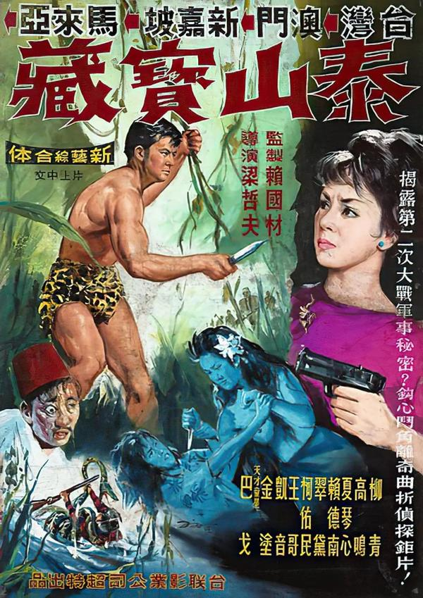

---

## 19492025中国历年阅兵式合集中华民族伟大复兴势不可挡

[2026-09-16 21:18] 来自：综合网盘资源频道

名称：1949-2025中国历年阅兵式合集，中华民族伟大复兴势不可挡

描述：从1949到2025，兵跨越76年。每一秒都封神， 一边是黑白影像中的历史起点，一边是新时代的威武方阵。变化的是时代、装备与国家面貌，不变的是整齐

夸克网盘：https://pan.quark.cn/s/72921b15768f

📁 大小：98.5GB

🏷 标签：#素材 #历年阅兵式合集 #阅兵 #合集 #quark #中华民族伟大复兴势不可挡

---

## 朱丽叶与魔鬼

[2026-09-16 21:09] 来自：综合网盘资源频道

名称：朱丽叶与魔鬼 Giulietta degli spiriti (1965)

描述：费里尼拍摄了另一部自传性很强的电影《朱丽叶与魔鬼》，在这部电影里，费里尼过分追求求神秘主义的梦境空间，在影片里极尽详能的描述描写一个资产阶级的女人遭到丈夫的欺骗，精神迷惘，陷于离奇古怪的幻觉，最后终于清醒的故事。虽然费里尼和茱莉埃妲两人携手共度一生，而且费里尼也从来没有传出与其他女人的诽闻，但是我想所有对费里尼非常熟悉的影迷都不相信费里尼从没有出轨的行为。

夸克网盘：https://pan.quark.cn/s/7f1f1a7f8476

📁 大小：NG

🏷 标签：#剧情 #喜剧 #奇幻 #朱丽叶与魔鬼 #quark #ali

---

## 在黑暗中讲述的恐怖故事

[2026-09-16 20:40] 来自：综合网盘资源频道

名称：在黑暗中讲述的恐怖故事 Scary Stories to Tell in the Dark (2019)

描述：1968年，在宾夕法尼亚州一个叫造纸谷的小镇上，颇有抱负的小作家丝黛拉(佐伊·玛格丽特·科莱蒂饰)，以及她的两位少年朋友奥吉(加布里埃尔·拉什饰)和查克(奥斯汀·扎祖尔饰)，他们在万圣节的晚上用大便、垃圾等物做成的“炸弹”，扔在学校里的恶霸汤米(奥斯汀·艾布拉姆斯饰)的车上，当愤怒的汤米想要报复并在后面追赶时，幸好雷蒙(迈克尔·加尔扎饰)，在关键时刻帮了丝黛拉他们。为了寻求刺激，丝黛拉、查克和奥吉带着新朋友雷蒙来到了一座鬼屋，这座房子在很多年前属于贝洛斯家族，他们是小镇的创始家族，在这里经营着造纸工厂，小镇因此而得名。贝洛斯家族别墅里曾住了一名神秘女孩莎拉(凯瑟琳·波拉德饰)，她受尽家人的折磨，并被独自关在一间黑暗的小房间里，禁止外出。孤独的莎拉于是隔着墙壁给一些孩子们讲恐怖故事，然而听过她讲故事的一些孩子们突然死去，这引起了小镇居民的恐慌和愤怒，莎拉最终在被暴民抓住前用自己的头发上吊自尽了。丝黛拉意外发现了莎拉的故事书，并把它带回了家中，然而她却不知道这本故事书会为她带来怎样的噩梦……

夸克网盘：https://pan.quark.cn/s/70defc82e425

📁 大小：AA

🏷 标签：#剧情 #恐怖 #在黑暗中讲述的恐怖故事 #quark

---

## 卿卿我心

[2026-09-16 20:34] 来自：综合网盘资源频道

名称：卿卿我心 (2021)

描述：废柴小姐路卿卿遇上纨绔傲娇王爷南宫一昕，废柴女主PK大神男主，毫无灵力的菜鸟与至高无上的皇族打破屏障相恋。一个机灵且活泼，一个傲娇却暖心，两个截然不同的频道产生交集，最终凭真爱逆袭的新古风励志甜宠故事。

夸克网盘：https://pan.quark.cn/s/34bb3c34542b

迅雷网盘：https://pan.xunlei.com/s/VP1eCHD654ZACwiIdDD-QvN0A1?pwd=56zd

📁 大小：AA

🏷 标签：#剧情 #爱情 #古装 #卿卿我心 #quark #xunlei

---

## 夺命金字塔

[2026-09-16 20:26] 来自：综合网盘资源频道

名称：夺命金字塔 The Pyramid (2014)

描述：2013年，一支由梅尔·霍尔顿博士(丹尼斯·欧哈拉 Denis O'Hare 饰)及其女儿诺拉(阿什丽·欣肖 Ashley Hinshaw 饰)率领的美国考古队在开罗南部发现一座被掩埋在黄沙之下的神秘金字塔。虽然埃及正处于暴动混乱之中，但是苏妮(克莉丝塔·尼古拉 Christa Nicola 饰)担任主持人的纪录片摄制组仍然冒险来到当地，只为记录下具有划时代意义的重要时刻。根据现场的情况，该金字塔甚至比已发现的所有金字塔年代都要久远。照例围绕着金字塔，各种恐怖诅咒的阴影盘桓其上，而且开启金字塔的时候还有当地人因毒气而受伤。由于所携带的设备遭到不明原因损伤，诺拉和相关工作人员决定铤而走险进入这座未知金字塔。

等待他们的将是永生难忘的可怕记忆…

夸克网盘：https://pan.quark.cn/s/22c9ecaf7eed

📁 大小：AA

🏷 标签：#恐怖 #夺命金字塔 #quark

---

## 侦察英雄

[2026-09-16 20:22] 来自：综合网盘资源频道

名称：侦察英雄 (2024)

描述：志愿军某师侦察科长梁辰(罗晋 饰)带领师侦察连完成了多次看似不可能完成的任务，他们营救了被敌人渗透分队抓走的文工队员，深入敌后捕俘侦察敌情，为我军指挥员提供了重要准确的情报，为作战胜利打下了坚实基础。在一次重大的战役中，梁辰带领侦察连一排特别是一班几个艺高胆大的侦察兵，穿插敌后配合前方的进攻部队，袭击了敌军指挥部，并最终战胜了一直与梁辰斗智斗勇的韩军情报队队长白昌镐，用智慧和勇气，鲜血和生命铸就了传奇般的功勋。

夸克网盘：https://pan.quark.cn/s/75e43d218d4d

📁 大小：AA

🏷 标签：#剧情 #历史 #侦察英雄 #quark

---

## 龙虎戏凤

[2026-09-16 20:18] 来自：综合网盘资源频道

名称：龙虎戏凤 表姐，妳玩嘢！ (1991)

描述：阿兰(郑裕玲 饰)生长在广州，脑筋灵活机敏过人，个性大大咧咧充满了男孩子气，又有着非凡的武艺傍身，走南闯北不在话下。这样的她孤身一人来到了香港，找在那里居住生活的表弟阿宝(郭富城 饰)，哪知道初来乍到就因为误会和阿宝的室友(万梓良 饰)闹了个不痛快。

阿宝暗恋着毒王傅汉生(吴孟达 饰)的女儿(黎姿 饰)，然而傅汉生并非等闲之辈，这段感情注定凶多吉少。傅汉华(任达华 饰)是傅汉生的弟弟，和哥哥不同，傅汉华为人正直老实，温柔体贴。一次偶然中，傅汉华发现了阿兰身上所潜藏的赌博天赋，于是向她抛出橄榄枝，聘用她成为自己赌场内的荷官，一段情缘就此展开。

夸克网盘：https://pan.quark.cn/s/dafadf4bb867

📁 大小：AA

🏷 标签：#喜剧 #龙虎戏凤 #表姐 #妳玩嘢 #quark

---

## 大秦帝国之纵横

[2026-09-16 20:14] 来自：综合网盘资源频道

名称：大秦帝国之纵横 (2013)

描述：东周列国，百年征伐，兼并挞伐，此消彼长。时至战国中期，七国并霸。曾经险遭灭国的秦国在商鞅变法之下迅速崛起，成为西北旷原最不可忽视的力量。在保守势力的逼迫下，年轻的秦惠文王嬴驷(富大龙 饰)被迫车裂商鞅，却也以消极的态度抑制保守一派。齐魏相王，雄心勃勃的秦惠文王在极其凶险的局势下登上国际舞台，同时铲除国内以甘龙为首的反对势力，为雄霸天下铺平了道路。国力衰退的魏惠王(李立群 饰)为遏制强邻的东进态势，任用苏秦的六国合纵之说以陷秦国于孤立。而秦国在不断蚕食周边之际，也启用张仪(喻恩泰 饰)提出连横的对策。豪杰贤士竞相登场，战国历史进入了最颠荡起伏的时代……

本片根据孙皓晖的同名历史小说的第二部改编

夸克网盘：https://pan.quark.cn/s/de80ed81e6b8

📁 大小：AA

🏷 标签：#剧情 #历史 #古装 #大秦帝国之纵横 #quark

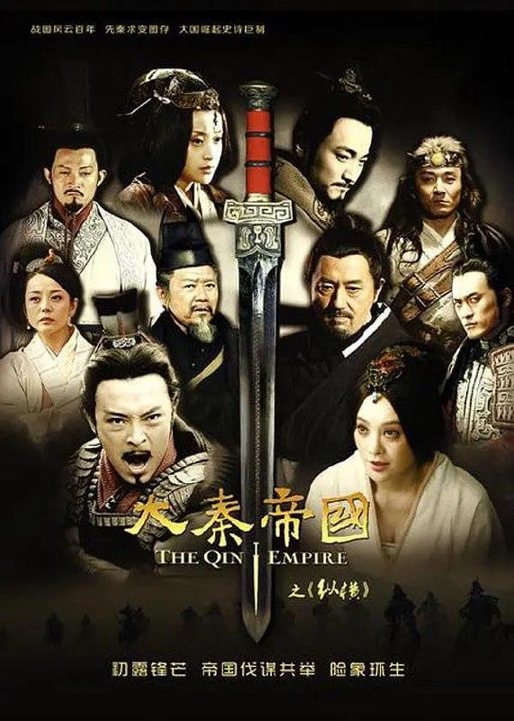

---

## 当家主母

[2026-09-16 20:09] 来自：综合网盘资源频道

名称：当家主母 (2021)

描述：苏州府任家世袭苏州织造行领织职务，拥有祖传的缂丝秘技。家主任雪堂从不插手家族生意，只爱研究诗书字画。任夫人沈翠喜不但刺绣了得，更善于经营管理，是任家真正的当家主母。任、沈二人成婚多年，任雪堂却始终难忘昔日恋人曾宝琴，欲将其接回任家，却不料因追捕水匪而发生意外，下落不明，让任家陷入重重危机。沈翠喜默默担负着挽救任家的重任，幸有曾宝琴相助，在经历了千万坎坷挫折后，终于洗清冤屈，回归往日的平静。

夸克网盘：https://pan.quark.cn/s/4ab0cea799fa

📁 大小：AA

🏷 标签：#剧情 #爱情 #当家主母 #quark

---

## 濑户内海

[2026-09-16 19:53] 来自：综合网盘资源频道

名称：濑户内海 セトウツミ (2017)  【更新09集】【1080p】【日语中字】【日剧】

描述：本剧描写的是关西的两名高中男生濑户(叶山奖之)与内海(高杉真宙)，放学后在河边唠嗑的故事。沉默寡言的内海与善于交往的濑户，两人的性格完全相反，却因为“打发时间”这一点而达成共识。当下午放学后，他们便相约来到河边坐下，海阔天空地闲聊起来。电影中未出现的角色初美、田中君、马场君以及大猩猩老师等原作中的人气角色也将在电视剧中大放异彩。

夸克网盘：https://pan.quark.cn/s/1c694378be2b

📁 大小：NA

🏷 标签：#剧情 #喜剧 #濑户内海 #1080p #日语中字 #日剧 #quark

---

## 天天有喜之人间有爱

[2026-09-16 18:13] 来自：综合网盘资源频道

名称：天天有喜之人间有爱 (2016)

描述：作为《天天有喜》系列剧，《天 天有喜2》刚刚开拍就受到广泛关注。 拉风娱乐基本沿用原班人马，立志延 续以往影视剧中的经典，而且力求“场 场有笑点、段段有惊喜”演绎《天天有 喜2》，值得一提的是，穆婷婷和陈浩 民“再续前缘”亦成为该剧一大亮点。

夸克网盘：https://pan.quark.cn/s/7f33e02cbd09

📁 大小：AA

🏷 标签：#喜剧 #奇幻 #古装 #天天有喜之人间有爱 #quark

---

## 猎杀星期一

[2026-09-16 17:57] 来自：综合网盘资源频道

名称：猎杀星期一 What Happened to Monday? (2017)

描述：故事设定在近未来，由于人口过剩和饥荒，政府不得不实行“独生子女”政策。正因为这个严格的计划生育议程，姐妹们必须轮流使用一个人的身份Karen Settman(拉佩斯饰)。她们的祖父(达福饰)给其命名为周一、周二、周三、周四、周五、周六和周日。每个人都可以每周外出一次。姐妹们只有在自己的公寓里才可以自在生活。直到有一天，“星期一”没回家......

夸克网盘：https://pan.quark.cn/s/7733a211b859

迅雷网盘：https://pan.xunlei.com/s/VP1dd4WH-omgkJkAf5P1MSF7A1?pwd=2dj5

📁 大小：AA

🏷 标签：#科幻 #惊悚 #猎杀星期一 #quark #xunlei

---

## 云襄传

[2026-09-16 17:06] 来自：综合网盘资源频道

名称：云襄传 (2023)

描述：云台弟子云襄苦修十年步入江湖。在闯荡江湖的过程中，云襄结识了几位好友，逐渐体会到了友谊的温暖。舒亚男这位古怪精灵、聪慧机警的女子，更是让云襄产生了朦胧的情愫。意气风发的云襄和朋友们度过了一段快意恩仇的时光。可是好景不长，随着对昔日灭族惨案的深入调查，云襄挖出了更多骇人听闻的秘密，事态开始急转直下。他先后经历了欺骗、背叛与生死离别，又意识到曾以造福苍生为己任的云台早已堕落，云襄决定挺身而出,捍卫心中的正义，哪怕是牺牲自己也在所不惜。

夸克网盘：https://pan.quark.cn/s/8859fd82c935

📁 大小：AA

🏷 标签：#剧情 #武侠 #古装 #云襄传 #quark

---

## 风雨双流星

[2026-09-16 17:00] 来自：综合网盘资源频道

名称：风雨双流星 風雨雙流星 (1976)

描述：江湖奇侠梅星河(王羽 饰)武功高强，其绝招夺命流星神乎其神，人所共惧。某日，剑侠柳青衣邀请梅星河，前去拜访名震江湖的另一高手——天魔星花无病(成龙 饰)。花无病(成龙 饰)武功绝伦，其妻花雨夫人颇喜男色。为防止丈夫阻挠，她在花无病体内下毒，毒发之时，痛苦难忍。每年花无病须向妻子乞求解药，因此他言听计从，好不愤懑。

为摆脱痛苦，花无病请来梅星河，希望他能杀掉花雨夫人，得到解药。然花雨夫人功夫了得，身边又有满天星、鬼道士等高手护卫，一场恶战在所难免。另一方面，梅星河实为朝廷的刑部密捕，多年前皇宫曾遗失如意七宝，花无病与此有很大嫌疑。梅星河在风七爷的授意下，将计就计答应了花无病的请求。

江湖纷乱，诡计丛生，这起行动也随之掀起皇宫宝贝失窃案件下所隐藏的秘密

夸克网盘：https://pan.quark.cn/s/42e90c61222b

📁 大小：AA

🏷 标签：#剧情 #风雨双流星 #風雨雙流星 #quark

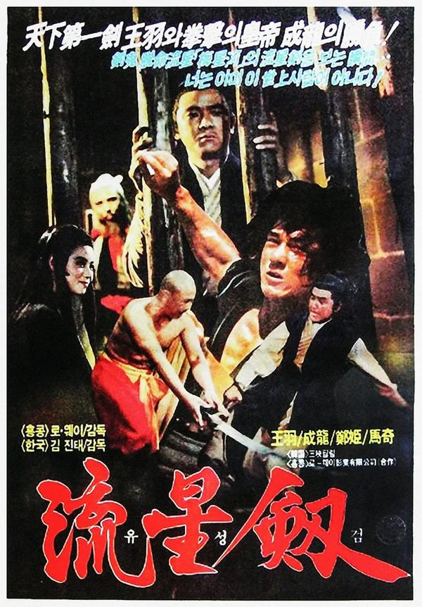

---

## 侠探杰克

[2026-09-16 16:58] 来自：4K影视屋(分屋）-蓝光无损电影

名称：侠探杰克  (2022)  第四季 全8集完结 4K DV&HDR 内封简繁英字幕[附前三季]

描述：杰克·雷彻在费城地铁上偶遇一名情绪崩溃的陌生人，因而卷入一桩致命谜案。

链接：

夸克网盘：https://pan.quark.cn/s/79e7b1f555a7

百度网盘：https://pan.baidu.com/s/1ahJhh86ylm9323TgqLNVCw?pwd=1314

📁 大小：159.65 GB

🏷 标签：#侠探杰克 #动作冒险 #犯罪

---

## 蜈蚣咒

[2026-09-16 16:55] 来自：综合网盘资源频道

名称：蜈蚣咒 (1982)

描述：亚伟(苗侨伟)及妹妹自小被母亲告诫：不得去南洋！两人虽不知因由，却也老实听命。母亲外出期间，妹妹欲与朋友结伴去南洋旅行，亚伟经不住她的几番央求，准她违抗母命，但叮咛一定要戴祖传灵牌，不想她在南洋时嫌灵牌太丑丢于行李箱，结果被蜈蚣群袭，死相惨不忍睹。

亚伟赶到南洋为妹妹办理丧事，大学同学亚芝(李殿朗)相陪，过程中他被高人相告已被降王盯上，小心行事之时向母亲追问南洋是一家人禁地的原因。原来亚伟爷爷年轻时曾在南洋犯错，降王誓要报仇，是谓“祖先作孽、后人受灾”。亚伟无恙是因时刻将祖传灵牌戴于脖间。降王屡攻不下，决定下降亚芝。

夸克网盘：https://pan.quark.cn/s/ad91eb10b912

📁 大小：AA

🏷 标签：#剧情 #蜈蚣咒 #quark

---

## 今夜星光灿烂

[2026-09-16 16:36] 来自：综合网盘资源频道

名称：今夜星光灿烂 (1980)

描述：1948年冬，淮海战场。电话员小于(黄小雷 饰)在执行任务中救下了准备上吊的农村姑娘玉香(李秀明 饰)，玉香无以为报，愿以身相许，并诉说自已无家可归的苦难遭遇。战土们非常同情这个孤苦伶仃的姑娘，便把她留在炊事班帮忙。战斗中，玉香不顾个人安危，冒着敌人的炮火往前沿阵地为战士们送水送饭。通信员小郭(刘继忠 饰)在战斗中牺牲，小于前赴后继冲上前去，用身体接通电话线，保障了我军首长对敌师指挥所强大的政治攻势，最后与敌人同归于尽。小于的牺牲另玉香悲痛万分，而战争的残酷也使她变的更加坚强，卫生员小孙(宝珣 饰)牺牲后，玉香勇敢地接过医药箱，奔向滚滚战争洪流

夸克网盘：https://pan.quark.cn/s/e98d2c0f7d30

📁 大小：AA

🏷 标签：#剧情 #今夜星光灿烂 #quark

---

## 你逃我也逃

[2026-09-16 16:03] 来自：综合网盘资源频道

名称：你逃我也逃(1942)【1080p 原盘REMUX】【国英双语】【内封简英双语特效字幕】

描述：豆瓣9.3高分

这部恩斯特·刘别谦的神经喜剧杰作，在令人捧腹的同时亦充满大胆锐气。杰克·本尼与卡洛·朗白(后者息影前最后作品)饰演纳粹占领区华沙的一对演员夫妇，二人意外卷入一场危险的间谍阴谋。本片是一部极具黑色幽默胆魄的好莱坞电影，于美国加入二战前夕投入制作。刘别谦以无人能及的喜剧高空走钢丝技艺，巧妙平衡了政治讽刺、浪漫爱情、滑稽闹剧与战时悬疑。

迅雷网盘：https://pan.xunlei.com/s/VP-z95bJkCLczGywvrmiGREvA1?pwd=f5hk

📁 大小：22.3GB

🏷 标签：#喜剧 #战争 #你逃我也逃 #1080p #原盘REMUX #国英双语 #内封简英双语特效字幕 #xunlei

---

## 浪漫满屋

[2026-09-16 15:58] 来自：综合网盘资源频道

名称：浪漫满屋(2004)【16集全】【WEB-DL.1080p】【外挂简中】【宋慧乔/郑智薰】

描述：韩智恩在父母逝世后视父母留下了“Full House”为自己的家，自己的珍宝。热爱写作的她在网上写作，没有固定职业的她只能在Full House里过着节衣缩食的生活。没想到的是单纯的智恩被幼时的好朋友虎成及女友陷害，卖掉了Full House并且拿走了她所有钱。而这间屋子正好卖给了大明星李英宰。李英宰本想买下这栋房子便向女友惠媛求婚，惠媛却宣布要跟英宰的哥哥结婚。英宰强忍痛苦，闻风而至的记者使英宰不得不向记者表示韩智恩就是自己的未婚妻。这样一来令韩智恩措手不及，对于英宰经理人提出的要求，智恩决定与英宰假结婚，并立下合同希望能借此拿回自己的Full House。两人继而成为了一对欢喜冤家，性格各异的两人生活习惯上有了鲜明的对比，生活在一起的他们没有一天不吵架的。由于李英宰是明星的关系，他们的生活受到了很多的打扰，可能因为一起经过了很多，两人之间不知不觉爱上了对方。

迅雷网盘：https://pan.xunlei.com/s/VP-z7W7oVmeP81c7ako_t2CmA1?pwd=d46x

📁 大小：70.9GB

🏷 标签：#喜剧 #爱情 #浪漫满屋 #WEBDL #1080p #外挂简中 #宋慧乔 #xunlei

---

## 黎明之前

[2026-09-16 15:55] 来自：综合网盘资源频道

名称：黎明之前(2010)【30集全】【4K.SDR】【内嵌简中】【历史/悬疑】【吴秀波/林永健】

描述：豆瓣9.2高分

1948年的上海，国民党第八情报局局长谭忠恕奉命追查代号“水手”的中共地下党员。潜伏多年的中共情报人员刘新杰身处情报局核心，在身份随时可能暴露的险境中传递重要情报，并设法保护同志。昔日同窗刘新杰与谭忠恕由此展开一场充满试探、布局和反转的暗战。

迅雷网盘：https://pan.xunlei.com/s/VP-z3YYk6WQ5PAJ27kV4hdKUA1?pwd=jx9r

📁 大小：30GB

🏷 标签：#黎明之前 #历史 #4K #SDR #内嵌简中 #悬疑 #吴秀波 #xunlei

---

## 三悦有了新工作

[2026-09-16 15:21] 来自：综合网盘资源频道

名称：三悦有了新工作(2023) 4K 豆瓣8.4高分 剧情

描述：每一集结尾都卡在最要命的地方，存心不让人睡。剧集从95后年轻人的视角出发，讲述了阴差阳错来到殡仪馆担任化妆师的赵三悦，从新入行时对这份职业怀抱着未知，到感悟生死用心学习遗体化妆的故事。同时，该剧以赵三悦为原点，通过赵三悦的成长视角，刻画了她所见证下往生者的生前身后，折射众生群像。(李漠 执导，周依然、杨新鸣 主演，13 集)豆瓣 8.4 分。

夸克网盘：https://pan.quark.cn/s/1b28858f6615

📁 大小：G

🏷 标签：#剧情 #高分 #周依然 #李漠 #三悦有了新工作 #4K #4高分 #quark

---

## 八佰

[2026-09-16 15:18] 来自：夸克云盘影视资源频道

名称：【原盘】八佰 (2020) 1080P REMUX 内封简繁字幕

描述：故事原型为一九三七年发生于上海的四行仓库保卫战，此战为淞沪会战最后一役，故事围绕“八百孤军血战四行仓库”展开。1937年淞沪会战末期，中日双方激战已持续三个月，上海濒临沦陷。第88师262旅524团团附谢晋元（杜淳饰）率420余人，孤军坚守最后的防线，留守上海四行仓库。与租界一河之隔，造就了罕见的被围观的战争。为壮声势，实际人数四百人而对外号称八百人 。“八百壮士”奉命留守上海闸北，在苏州河畔的四行仓库鏖战四天，直至10月30日才获令撤往英租界。

夸克网盘：https://pan.quark.cn/s/90e4fb5ab6bc

百度网盘：https://pan.baidu.com/s/11MhTMM_V8qe1KCCuZ5XchA?pwd=yu40 来自：阿里、夸克、百度网盘4K影视资源 [2026-09-16 15:18] 名称：【原盘】八佰 (2020) 1080P REMUX 内封简繁字幕

📁 大小：36.6GB

🏷 标签：#八佰 #战争 #历史 #剧情 #动作

---

## 水上钟楼

[2026-09-16 14:39] 来自：综合网盘资源频道

名称：水上钟楼 Curon (2020) 1080P内嵌中字全7

描述： 一位母亲和她十几岁的孩子们回到了她在意大利北部的神秘村庄，却发现了她过去的真相。

百度网盘：https://pan.baidu.com/s/1DDv73v7hnpZwj3VUYy8lXA?pwd=ghnv

夸克网盘：https://pan.quark.cn/s/b49e52a3cb14

迅雷网盘：https://pan.xunlei.com/s/VP1cw2Ii-tKT-c9SlA4Kz98nA1?pwd=9apk

📁 大小：2G＼集

🏷 标签：#意大利剧 #水上钟楼 #1080P内嵌中字全7 #baidu #quark #xunlei

---

## 名剑

[2026-09-16 12:22] 来自：夸克云盘影视资源频道

名称：【原盘】名剑 (1980) 1080P REMUX 高码英版 官方画质修复 国粤多音轨 内封简繁字幕

描述：齐物”和“寒星”是两把绝世名剑，江湖人士都想占为己有。“寒星”归剑术名家花千树所有另一把名剑则在剑士李蓦然的手上。李蓦然学成出山，想找花千树比试，但是花千树为躲避络绎不绝的挑战者，行踪隐秘。李蓦然在追寻途中遇到了花千树的女儿盈盈，在与盈盈互生情愫之时，又恰遇自己的昔日 情人陈琪琪，此时的陈琪琪一家为人妇，但是心中对李蓦然却仍是无比牵挂。琪琪之夫婿家贪图名剑，又暗恨李蓦然在妻子心中的地位自己永远都无法取代，所以爱极生恨，派手下暗杀李蓦然，李默然受重伤，幸得玄姬相救。盈盈也遇到了危险，李蓦然奋不顾身救了她，花千树遂答应与李蓦然决斗。

夸克网盘：https://pan.quark.cn/s/4094eec1aca7

百度网盘：https://pan.baidu.com/s/1Li6EUzLJ2A8k6gleK1jshQ?pwd=62u7 来自：阿里、夸克、百度网盘4K影视资源 [2026-09-16 12:22] 名称：【原盘】名剑 (1980) 1080P REMUX 高码英版 官方画质修复 国粤多音轨 内封简繁字幕

📁 大小：26.6GB

🏷 标签：#名剑 #动作 #爱情 #武侠 #画质控

---

## 假面骑士空我

[2026-09-16 12:21] 来自：电视剧资源频道

名称：假面骑士空我 (2000) 1080P 全49集 内嵌简中字幕

描述：公元2000年。在长野山中的九郎岳，正在进行某座神秘遗迹的挖掘工作。当调查团将遗迹中的一具棺木开启时，突然遭到奇异生物的袭击而全数死亡。而在为了查出调查团被杀案件的线索，正在遗迹现场调查中的长野县刑警一条薰面前，有一名青年突然擅自闯入。这名被一条拦下的青年，他自称为冒险家五代雄介。 终于复活的异形生命体在长野近郊出现，并开始对人们恣意袭击，甚至一路冲进警局。假面骑士空我

夸克网盘：https://pan.quark.cn/s/d8aebf5d9fb7

📁 大小：14.1GB

🏷 标签：#假面骑士 #假面骑士空我 #剧情 #科幻 #日剧

---

## 只有芸知道

[2026-09-16 12:13] 来自：电影资源频道(4K、REMUXE/原盘)

名称：只有芸知道 (2019) 4K 高码

描述：改编自冯小刚挚友的真实爱情故事。一个居住在加拿大温哥华的北京男人隋东风(黄轩 饰)，漂泊半生，中年猝失妻子罗芸(杨采钰 饰)，陷入悲伤和孤独之中，因此决定替妻子完成未竟的心愿。

夸克网盘：https://pan.quark.cn/s/4ad1f1b9e10d

📁 大小：15.7GB

🏷 标签：#只有芸知道 #剧情 #爱情

---

## 22年后的自白

[2026-09-16 12:10] 来自：影视动漫分享|SeedHub|夸克|网盘|🧲

名称：22年后的自白 (2019)

#电影 #犯罪 #剧情 #悬疑 #夸克

主演: 藤原龙也 伊藤英明 夏帆 

豆瓣: [7.1](https://movie.douban.com/subject/26835911/)

1995年，东京发生了连环绞杀案，五人被害，凶手无影无踪，该案成为悬案。2017年，就在该案早已过了诉讼有效期之时，一位名叫曾根崎雅人（藤原龙也饰）的男子出版了一本..

夸克网盘：https://pan.quark.cn/s/05e391e5c9e3

---

## 航拍海岸线

[2026-09-16 12:10] 来自：影视动漫分享|SeedHub|夸克|网盘|🧲

名称：航拍海岸线 第一季 (2024)

#电影  #夸克 #百度

主演: 

豆瓣: [0](https://movie.douban.com/subject/37070697/)

《海岸线航拍 第一季》共六集，每集聚焦一座沿海城市。该系列以中国海岸线的地理划分为主题，从文化历史、自然环境、经济发展、城市建设、民俗节庆、海洋科技等多个方面全面展..

夸克网盘：https://pan.quark.cn/s/e32c1b094bf6

百度网盘：https://pan.baidu.com/s/1C2cN99sa2wr4V5p-ehclWw?pwd=a7xB

---

## 神机妙算刘伯温

[2026-09-16 12:10] 来自：影视动漫分享|SeedHub|夸克|网盘|🧲

名称：神机妙算刘伯温 (2015)

#电视剧 #剧情 #夸克 #迅雷

主演: 何冰 姜寒 于震 

豆瓣: [7.4](https://movie.douban.com/subject/25912269/)

该剧讲述了刘伯温辅佐朱元璋完成帝业、开创明朝的故事。故事基于刘伯温的传说加工创作，包括《太祖还乡》《烧饼歌》等十个故事单元。..

夸克网盘：https://pan.quark.cn/s/a749a316ad1a

迅雷网盘：https://pan.xunlei.com/s/VOzZRYzgT7ln3992zChahTcgA1?pwd=4kvw

---

## 梦起云上

[2026-09-16 12:10] 来自：影视动漫分享|SeedHub|夸克|网盘|🧲

名称：梦起云上 (2024)

#电影  #百度

主演: 刘承林 李宝安 潘悦 

豆瓣: [0](https://movie.douban.com/subject/37039116/)

八百里关中平原，一起商贩和果农的收购冲突事件，促使两个在外打拼的年轻人走在了一起，是素未蒙面的陌生人也是创业合作的欢喜冤家。在互联网电商直播的浪潮下，他们和心怀希望..

百度网盘：https://pan.baidu.com/s/1ebsj956MzEB46ziAFTaf1Q?pwd=hjsc

---

## 原生之罪

[2026-09-16 12:10] 来自：影视动漫分享|SeedHub|夸克|网盘|🧲

名称：原生之罪 第一季 (2018)

#电视剧 #犯罪 #悬疑 #夸克 #迅雷 #百度

主演: 翟天临 尹正 白冰 

豆瓣: [6.3](https://movie.douban.com/subject/30139731/)

讲述了一位因刑入狱的律师出狱后在生意场上风生水起，一位警校荣誉生，入职警局后屡破大案，却因家世背负沉重道德负担，两人被一只看不到的手编织到一起，从彼此对立到互为手足..

夸克网盘：https://pan.quark.cn/s/5b9c98cc2290

迅雷网盘：https://pan.xunlei.com/s/VOT7S8S-uW_kCLGsyS6bekXnA1?pwd=553u

百度网盘：https://pan.baidu.com/s/1ycrHR6OYCjej9usZ_tl3zg?pwd=6666

---

## OK老板娘

[2026-09-16 12:10] 来自：影视动漫分享|SeedHub|夸克|网盘|🧲

名称：OK老板娘 (2020)

#电影 #喜剧 #夸克

主演: 严正化 朴成雄 李相仑 

豆瓣: [6.6](https://movie.douban.com/subject/35127317/)

该片讲述了一对夫妇在生平第一次海外旅行中，意外的卷入了劫持飞机的事件，他们收起平凡的过去，通过一直隐藏的内功展开营救作战的故事。..

夸克网盘：https://pan.quark.cn/s/745ebda6714c

---

## 墨家机关术

[2026-09-16 12:10] 来自：影视动漫分享|SeedHub|夸克|网盘|🧲

名称：墨家机关术 (2021)

#电影 #古装 #夸克

主演: 刘林城 刘静怡 栩慈 

豆瓣: [4.0](https://movie.douban.com/subject/35073164/)

讲述了墨家机关术传人沈拓（刘林城饰）为解救被囚禁在机关城的未婚妻姜刃（刘静怡饰）接受无极监狱典狱长（杜玉明饰）的赌局，进入机关城最底部，与六名队友共同寻找神秘的墨家..

夸克网盘：https://pan.quark.cn/s/ccd62f2e443f

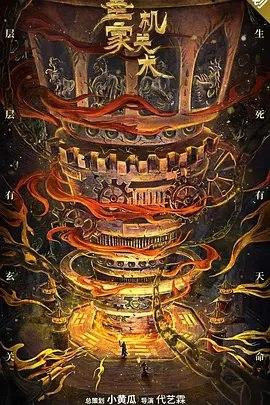

---

## 愿者安息

[2026-09-16 12:10] 来自：影视动漫分享|SeedHub|夸克|网盘|🧲

名称：愿者安息 (2023)

#电影 #恐怖 #夸克

主演: 里法特·桑贾尔 Emrah Altintoprak Cansu Türedi 

豆瓣: [4.5](https://movie.douban.com/subject/36593744/)

40岁的Cemal是一个孤独的灵车司机。他被赋予了一项秘密任务：一个名叫Zeynep的年轻女孩被残忍杀害，尸体应该被送到她在东部的家人手中。他上路了。晚上，他打开货..

夸克网盘：https://pan.quark.cn/s/0dd3a4d9ccba

---

## 极盗行动

[2026-09-16 12:10] 来自：影视动漫分享|SeedHub|夸克|网盘|🧲

名称：极盗行动 (2021)

#电影 #犯罪 #喜剧 #夸克 #百度

主演: 古勒莫·法兰塞拉 迭戈·佩雷蒂 路易斯·卢克 

豆瓣: [7.0](https://movie.douban.com/subject/34966343/)

本片改编自一个真实的银行抢劫案。2006年，一群盗贼抢劫了位于阿卡苏索的里约热内卢银行，这被认为是历史上最著名、最聪明的银行抢劫案之一。他们抢劫银行所采用的方式和在..

夸克网盘：https://pan.quark.cn/s/c9dd082f4538

百度网盘：https://pan.baidu.com/s/11L1RAaHebD0sOxzZ5Uqnaw?pwd=35oq

---

## 无悔追踪

[2026-09-16 11:30] 来自：肯德基の4K影视综合电影云盘站

名称：无悔追踪(1996)【20集全】【WEB-4K】【内嵌简中】【悬疑/家庭】

描述：豆瓣9.4高分

一九四九年，天安门广场上开国大典的礼炮声中，老北京的百姓生活翻开了新的一页。土刀唐胡同也换了新颜，刚刚接管了旧警察局的派出所所长肖大力偶遇一个熟知兵器的教书匠冯静波，这引起了他的怀疑。为了查清冯静波的身份，肖大力也搬进了土刀唐胡同，和冯静波做了街坊。冯静波的真实身份确实是国民党的潜伏特务，但面对改天换地的新中国，面对肖大力的不懈监视，冯静波不得不小心谨慎，好事做在前头，工作中更是一个好老师。这一切竟招来了曾在妓院使唤丫头的大眉子的爱慕，冯静波为了掩护自己的身份，娶了大眉子

夸克网盘：https://pan.quark.cn/s/555e9cb0c5c1

百度网盘：https://pan.baidu.com/s/1y2jN2qaQSPcSJ2edeAc4UQ?pwd=Yu66

迅雷网盘：https://pan.xunlei.com/s/VOviPJ8811Ln5nbWq8aw0gXeA1?pwd=aax9

📁 大小：58GB

🏷 标签：#悬疑 #家庭 #无悔追踪 #4K #内嵌简中

---

## 续命之徒绝命毒师电影

[2026-09-16 08:38] 来自：综合网盘资源频道

名称：续命之徒：绝命毒师电影 (2019) 4K 中文字幕 H264 DDP 5.1 Atmos

描述：Netflix 电视内容《续命之徒：绝命毒师电影》回归，主角杰西·平克曼(艾美奖得主亚伦·保尔饰演)再次与粉丝见面。杰西戏剧性地逃出囚禁后，他必须接受自己的过去，才有可能创造未来。这部扣人心弦的惊悚片由《绝命毒师》的创剧人文斯·吉里根编写和执导。该电影由马克·约翰逊、梅利莎·伯恩斯坦、查尔斯·纽沃斯、黛安娜·默瑟和亚伦·保尔以及 Sony Pictures Television 联合制作。

百度网盘：https://pan.baidu.com/s/1FD5WhujplCoIOD5ItcNt0A?pwd=Yu88

迅雷网盘：https://pan.xunlei.com/s/VP1bdFxSz5MN9yaJEV1CU-BtA1?pwd=ungb

📁 大小：33.4GB

🏷 标签：#惊悚 #犯罪 #续命之徒 #绝命毒师电影 #4K #中文字幕 #Atmos #baidu #xunlei

---

## 三傻大闹宝莱坞

[2026-09-16 07:42] 来自：综合网盘资源频道

名称：三傻大闹宝莱坞(2009)【1080p 原盘REMUX】【国印双语】【内封简繁英双语特效字幕】

描述：豆瓣9.2高分

十年前，法兰、拉杜与兰乔在印度顶尖的皇家工程学院相识并成为好友。面对竞争激烈、崇尚成绩与服从的教育环境，特立独行的兰乔始终坚持真正的学习来自兴趣与理解，并一次次挑战校长“病毒”的教育理念。他的想法也逐渐影响着背负家庭期待的法兰和拉杜，鼓励两人重新思考自己真正想要的人生。与此同时，兰乔与信奉死记硬背的模范生“消音器”针锋相对，两人甚至立下十年后再论成败的约定。十年过去，当法兰和拉杜再次踏上寻找这位昔日好友的旅程，那段关于友情、梦想与选择的大学往事也随之重新浮现……

迅雷网盘：https://pan.xunlei.com/s/VP1bRhereJ-wYB-_VVfpC5e3A1?pwd=rayq

📁 大小：38.4GB

🏷 标签：#喜剧 #爱情 #三傻大闹宝莱坞 #1080p #原盘REMUX #国印双语 #内封简繁英双语特效字幕 #xunlei

---

## 熔炉

[2026-09-16 01:10] 来自：肯德基の4K影视综合电影云盘站

名称：熔炉(2011)【1080p 原盘REMUX】【国韩双语】【内封简繁特效字幕】【孔刘/郑裕美】

描述：豆瓣9.3高分

来自首尔的哑语美术老师仁浩(孔宥 饰)来到雾津，应聘慈爱聋哑人学校。天降大雾，他意外撞车，维修时邂逅了人权组织成员柔珍(郑有美 饰)。仁浩妻子早亡，8岁女儿天生哮喘由祖母照看，所以他不辞辛苦谋职养家。然而，双胞胎的校长与教导主任竟逼仁浩索贿5千万韩元。同时，仁浩逐渐发现学校笼罩着一种紧张压抑的气氛，令人窒息。

夸克网盘：https://pan.quark.cn/s/f8096ef99915

百度网盘：https://pan.baidu.com/s/1ee7GWP_CSMywxiwvClptMQ?pwd=Yu66

迅雷网盘：https://pan.xunlei.com/s/VP0MyC8QM7giHEnl6wTBNfuXA1?pwd=cmcp

📁 大小：27.7GB

🏷 标签：#犯罪 #人性 #熔炉 #1080p #原盘REMUX #国韩双语 #特效字幕

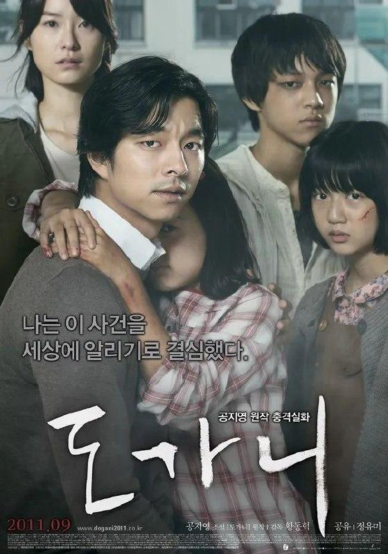

---

## 触及真心

[2026-09-16 00:38] 来自：综合网盘资源频道

名称：触及真心(2019)【16集全】【WEB-DL.1080p】【高码率】【内封简繁英】【李栋旭/刘寅娜】

描述：吴允书(刘仁娜 饰)在考上了法学院之后没多久就转行成为了女明星，然而，原本憧憬的星路却走得并不顺利，无戏可接的吴允书只得以体验生活的名义来到了韩国最顶级的律师事务所“Always”里实习。虽然吴允舒对打印复印办公软件一类的东西一窍不通，但她却因为曾经法学院学习的经历而意外的非常擅长使用案件检索系统，因此而吸引了全韩国最挑剔、最毒舌，但也是最厉害的律师权正禄(李栋旭 饰)的注意。 就这样，吴允书成为了权正禄的私人秘书，刚开始，这个傲慢而又冷漠的男人经常让吴允书感到非常的火大，但随着时间的推移，一种科学无法解释了磁力在两人之间产生了。

夸克网盘：https://pan.quark.cn/s/c1d79db1b7ab

📁 大小：69.1GB

🏷 标签：#喜剧 #爱情 #触及真心 #WEBDL #1080p #高码率 #内封简繁英 #quark

---

## 我的女孩

[2026-09-15 22:49] 来自：电视剧资源频道

名称：我的女孩 (2005) 1080P 全16集 内封简中字幕

描述：本剧是讲述四个男女的青春爱情喜剧。美丽女生裕玲(李多海 饰)是旅游公司的导游，她热情大方、“诡计多端”；功灿(李东旭 饰)是一个富家子弟，英俊潇洒，典型的钻石王老五；世娴(朴诗妍 饰)是韩国著名的美女网球手，也是功灿对前女友，两年前和男友不辞而别出国参赛后，战绩斐然，如今即将回国；正宇(李准基 饰)是一个游戏人间的花花公子，生性不羁。本来素不相识的裕玲、正宇和功灿分别相遇了，一场爱情闹剧也由此展开。

夸克网盘：https://pan.quark.cn/s/9883e82ec987

📁 大小：30.6GB

🏷 标签：#喜剧 #爱情 #我的女孩 #韩剧

---

## 与君歌

[2026-09-15 22:34] 来自：综合网盘资源频道

名称：与君歌 (2021)

描述：故事讲述了唐末文宗年间宰相旺涯满门抄斩，两个死里逃生的姐妹多年后以不同身份相遇，并且帮助新帝李炎重振大唐的故事。

本剧根据飞花中篇小说《剑器行》改编。

夸克网盘：https://pan.quark.cn/s/69ac3b08c7c5

📁 大小：AA

🏷 标签：#爱情 #悬疑 #古装 #与君歌 #quark

---

## 日出

[2026-09-15 22:29] 来自：电影资源频道(4K、REMUXE/原盘)

名称：【原盘】日出 (1927) 1080P REMUX 内封简繁字幕

描述：盛夏的度假时节，一位城市女人来到乡下滞留，这期间，城市女人诱惑了当地的农夫并教唆他杀死自己的妻子（Janet Gaynor 饰）以便贩卖掉农庄后私奔。被迷惑了心窍的男人早已忘记了那些同妻子共处的纯美时光，他将妻子带到河面蓄谋加害，却在要下毒手时幡然悔悟，伤心的妻子踏上了进城的列车，男人穷追不舍一同抵达城市。城市里真正是一片花花世界呵，这对夫妻在街上游走玩乐，在那些小小的玩笑中，甜蜜的冒险中，他们又找回了爱情的美妙共鸣……和好如初的两人返回乡村，不料却在归途遇上了肆虐的风浪……

夸克网盘：https://pan.quark.cn/s/6054ee10aa64

📁 大小：20.5GB

🏷 标签：#日出 #剧情 #爱情

---

## 恐怖直播

[2026-09-15 22:22] 来自：电影资源频道(4K、REMUXE/原盘)

名称：【原盘】恐怖直播 (2013) 1080P REMUX 内封简繁特效字幕字幕

描述：韩国首尔某个平凡的早上，广播电台Daily Topic节目的主持人尹英华（河正宇 饰）正就税率改革与听众进行连线，这时一个自称住在首尔昌信洞的普通工人朴鲁圭打入电话，大肆抱怨超高的电费和相关部门对他的威胁。尹英华颇不耐烦，以偏离主题为由强行切断电话。谁知连线无法单方面由电台方面中断，愤怒的朴鲁圭继续抱怨，并扬言炸掉汉江大桥。尹英华不以为然，进而怂恿对方想做就做，谁知话音刚落，窗外的麻浦大桥便炸作废墟。大惊失色的尹英华很快冷静下来，他决定利用这次难得的机会打一次事业的翻身仗。在他的主持下，针对恐怖分子的连线直播就此展开，无关良知的节目拉开帷幕……

夸克网盘：https://pan.quark.cn/s/e7b6eec386b6

📁 大小：19.8GB

🏷 标签：#动作 #犯罪 #剧情  #恐怖直播

---

## 伊豆的舞女

[2026-09-15 22:18] 来自：综合网盘资源频道

名称：伊豆的舞女 伊豆の踊子 (1974)

描述：即将就读东京某高等学校的川岛(三浦友和)趁开学前的暑假前往伊豆旅行，在乍晴乍雨的山道上，他遇到一群巡回卖艺的歌舞伎艺人，因被其中一个梳着古代发髻、背着大鼓的娇小玲珑舞娘吸引，他决定与他们一起上路，路上，他得知该舞娘叫熏(山口百惠)。

夸克网盘：https://pan.quark.cn/s/185b62c79b08

📁 大小：NG

🏷 标签：#剧情 #伊豆的舞女 #伊豆の踊子 #quark #ali

---

## 摇啊摇摇到外婆桥

[2026-09-15 22:14] 来自：综合网盘资源频道

名称：摇啊摇，摇到外婆桥 (1995)

描述：1930年代，乡村少年唐水生来到上海投靠六叔(李雪健)，在他的引荐下，做了歌舞皇后小金宝(巩俐)的贴身佣人。小金宝是上海滩一霸唐老爷(李保田)的女人，但与其手下宋二爷有染，而宋二爷已经觊觎唐老爷的位子良久。

夸克网盘：https://pan.quark.cn/s/56e2cedabbd7

📁 大小：NG

🏷 标签：#剧情 #犯罪 #摇啊摇 #摇到外婆桥 #quark #ali

---

## 三傻大闹宝莱坞

[2026-09-15 22:13] 来自：综合网盘资源频道

名称：三傻大闹宝莱坞(2009)【1080p 原盘REMUX】【国印双语】【内封简繁英双语特效字幕】

描述：豆瓣9.2高分

十年前，法兰、拉杜与兰乔在印度顶尖的皇家工程学院相识并成为好友。面对竞争激烈、崇尚成绩与服从的教育环境，特立独行的兰乔始终坚持真正的学习来自兴趣与理解，并一次次挑战校长“病毒”的教育理念。他的想法也逐渐影响着背负家庭期待的法兰和拉杜，鼓励两人重新思考自己真正想要的人生。与此同时，兰乔与信奉死记硬背的模范生“消音器”针锋相对，两人甚至立下十年后再论成败的约定。十年过去，当法兰和拉杜再次踏上寻找这位昔日好友的旅程，那段关于友情、梦想与选择的大学往事也随之重新浮现……

百度网盘：https://pan.baidu.com/s/1edBekXSSdB5jTeiB2qYMwg?pwd=Yu88

夸克网盘：https://pan.quark.cn/s/58c6e19554b9 来自：综合网盘资源频道 [2026-09-15 17:46] 名称：三傻大闹宝莱坞(2009)【1080p 原盘REMUX】【国印双语】【内封简繁英双语特效字幕】

📁 大小：38.4GB

🏷 标签：#喜剧 #爱情 #三傻大闹宝莱坞 #1080p #原盘REMUX #国印双语 #内封简繁英双语特效字幕 #baidu

---

## 千门八将

[2026-09-15 22:11] 来自：综合网盘资源频道

名称：千门八将 千門八將 (1981)

描述：尽窥赌术内幕的影片《千门八将》讲述，正将(张瑛饰)是道上叱咤风云的“赌王”，其精湛的赌术使得他成为赌界的王中王。一次，他在与“赌魔”(罗烈饰)的赌局中，被其暗算而隐恨退出江湖。二十年后，赌魔以计迫使正将重出赌坛，与其再赌一次，以证明自己在赌界的地位。正将被赌魔以千术击败，含怨吐血而亡。

正将之子(刘永饰)为报父仇，不惜走出险招，利用自身英俊不凡的处表施展美男计，引诱财魔的继室(楚湘云饰)中其圈套。与此同时，他邀其请昔日与其父亲出生入死的拍档“千门八将”(陈观泰、王晶等饰)与赌魔展开连场赌博，最终得以报仇雪恨。

讲开『赌』片，令人印象最深刻是1989年由周润发主演的《赌神》，片中赌神大嚼朱古力挫败对手的一幕堪称经典，同时也掀起了90年代的赌片风潮，一时间赌圣、赌侠都横空出世，事实上，《千门八将》可说是80年代初的《赌神》。

夸克网盘：https://pan.quark.cn/s/a73ed61e9a5d

📁 大小：AA

🏷 标签：#剧情 #千门八将 #千門八將 #quark

---

## 活佛济公

[2026-09-15 21:50] 来自：综合网盘资源频道

名称：活佛济公 (2010)

描述：《活佛济公》是再次对经典题材“济公”的翻拍，陈浩民饰演史上最帅的济公，和杨雪出演对手戏。杨雪曾多次参与香港电视剧的拍摄，此次再度和香港演员合作自然是轻车熟路。近年来杨雪一直在主题严肃的电视剧中塑造坚强勇敢的女人形象，此番再次触电轻喜剧电视的拍摄，是她继《聊斋》之后的又一力作。从时尚偶像到美丽女军人再到经典喜剧，杨雪的戏路是越来越广。

据制片人王世伟介绍，《活佛济公》计划拍摄120集，这次拍济公是从济公年轻时拍起，“他是一个人间佛，普渡众生，但也有自己的烦恼，比如他在新婚之夜悟道出家，对妻子一直有愧疚。第一部40集里讲述了《血珍珠》、《挖心》、《怀孕郎》、《天雷报》、《古井运木》、《胭脂泪》等8个故事，目前已经敲定明年8月暑期档播出。”

夸克网盘：https://pan.quark.cn/s/a235523deb56

📁 大小：AA

🏷 标签：#喜剧 #古装 #活佛济公 #quark

---

## 低压槽欲望之城

[2026-09-15 21:49] 来自：综合网盘资源频道

名称：低压槽：欲望之城 低壓槽 (2018)

描述：孤城，一座浮华却堕落的罪恶之城，这里充斥着金钱与利益的争夺。然而，在这个亡命之徒的乐园里，仍有少数人坚持着自己心中的正义……

警方卧底于秋在上司阿占的运筹帷幄下，多次成功打入当地帮派，斡旋于多方黑色势力之中。于秋在黑帮生活中却好像渐渐迷失自我，他开始怀疑，是否只有“非常”的手段才能主持公正，这让阿占也开始质疑。一次卧底行动中，于秋冒着行动失败的风险和帮派老大激战，结果全体命丧当场。在道德和江湖道义的双重质疑下，于秋选择了自我放逐，他逃离了孤城。

然而，于秋内心对惩治罪恶的欲望从未消减，他重整旗鼓回到孤城，而这一次，阿占给他的任务竟然是调查罪恶之城背后最邪恶也最神秘的黑手、人人闻之色变的首脑——“老板”。

从一宗离奇的小童绑架案开始，于秋和阿占查出老板的身份和他背后的犯罪网络。神秘的老板控制了商界和黑道，只有毁灭老板才能拯救这座堕落之城。事实上，于秋在追查过程中已经踏入了老板设下的重重圈套。虽然阿占拼死守着法律的底线，老板的势力却渗透了警方权力的高层，于秋渐渐失去了支持，原本要保护的小童也受到生命威胁。在接踵而至的迷局里，坚持正义的于秋好像被推向更深的绝望里……

夸克网盘：https://pan.quark.cn/s/724a0834cfad

📁 大小：AA

🏷 标签：#剧情 #动作 #低压槽 #欲望之城 #低壓槽 #quark

---

## 最后的里程

[2026-09-15 21:48] 来自：综合网盘资源频道

名称：最后的里程 ラストマイル (2024)

描述：11月，即将到来的全球最大购物活动之一“黑色星期五”前夜发生了一起世界知名电商网站的快递箱爆炸事件。很快，这起事件演变成了让整个日本陷入恐慌的连续爆破事件。巨大物流仓库的新任主管·舟渡艾蕾娜(满岛光 饰)和团队经理·梨本孔(冈田将生 饰)一同应对这场前所未有的危机。

夸克网盘：https://pan.quark.cn/s/5ca483c18378

📁 大小：NG

🏷 标签：#剧情 #悬疑 #最后的里程 #quark #ali

---

## 月升王国

[2026-09-15 21:46] 来自：综合网盘资源频道

名称：月升王国 Moonrise Kingdom (2012)

描述：1965年，在一个叫新彭赞斯的小岛上，有一队童子军驻扎在艾凡赫营地里。童子军教官华德(爱德华·诺顿 Edward Norton 饰)在一个早上发现学童山姆(杰瑞德·吉尔曼 Jared Gilman 饰)留信出走，于是华德和一众童子军开始寻找山姆，小岛警察夏普(布鲁斯·威利斯 Bruce Willis 饰)也展开了环岛搜寻。

夸克网盘：https://pan.quark.cn/s/1b7cd63dc8ea

📁 大小：NG

🏷 标签：#剧情 #儿童 #月升王国 #quark #ali

---

## 古惑仔情义篇之洪兴十三妹

[2026-09-15 21:45] 来自：综合网盘资源频道

名称：古惑仔情义篇之洪兴十三妹 古惑仔情義篇之洪興十三妹 (1998)

描述：钵兰街的大姐大洪兴十三妹(吴君如饰)从东星混混花弗(敖志君饰)手中救回女友SASA(植敬雯饰)。不料SASA早暗地里与花弗串通陷害十三妹，十三妹一怒之下对其家法处置。属下韩宾(尹阳明)一直对十三妹忠心耿耿，更把爱意放在心底。一次韩宾陪同十三妹拜祭亡父阿达(吴孟达饰)，遂让十三妹回忆起昔年往事。

十三妹原名崔小小，其父是洪兴一名小混混，她与好友张美润(杨恭如)整日混迹于玻澜街，一起为东星打手卓可乐(方中信)神魂颠倒。岂料恶霸咸湿(程东)杀死了吹水达，十三妹决定为父报仇…

夸克网盘：https://pan.quark.cn/s/9833d7fab315

📁 大小：AA

🏷 标签：#剧情 #古惑仔情义篇之洪兴十三妹 #古惑仔情義篇之洪興十三妹 #quark

---

## 如来神掌

[2026-09-15 21:44] 来自：综合网盘资源频道

名称：如来神掌 如來神掌 (1982)

描述：江湖从来就是非横生。自从如来天尊(曹达华 饰)自创了威力无穷的如来神掌后，武林中的各门各派都虎视眈眈，天尊不胜烦扰，将如来神掌和火云战衣传与了徒弟古汉魂(万梓良 饰)后，圆寂过世。从此古汉魂自称火云邪神，在武林上大开杀戒，引发了一场武林浩劫。一晃眼二十年过去了，古汉魂早已退隐多年，一日他从悬崖底救起了因和师傅女儿(余安安 饰)相恋而被师傅击下山崖的青年龙剑飞(尔冬升 饰)。古汉魂将他毕生所学都传与龙剑飞，让他穿上火云战衣，代表火云邪神重出江湖。从此江湖又将不得安宁！

夸克网盘：https://pan.quark.cn/s/69098ba76098

📁 大小：NG

🏷 标签：#动作 #武侠 #古装 #如来神掌 #如來神掌 #quark #ali

---

## 续命之徒绝命毒师电影

[2026-09-15 21:35] 来自：综合网盘资源频道

名称：续命之徒：绝命毒师电影 (2019) 4K 中文字幕 H264 DDP 5.1 Atmos

描述：Netflix 电视内容《续命之徒：绝命毒师电影》回归，主角杰西·平克曼(艾美奖得主亚伦·保尔饰演)再次与粉丝见面。杰西戏剧性地逃出囚禁后，他必须接受自己的过去，才有可能创造未来。这部扣人心弦的惊悚片由《绝命毒师》的创剧人文斯·吉里根编写和执导。该电影由马克·约翰逊、梅利莎·伯恩斯坦、查尔斯·纽沃斯、黛安娜·默瑟和亚伦·保尔以及 Sony Pictures Television 联合制作。

夸克网盘：https://pan.quark.cn/s/fa0427b0dfd4

📁 大小：33.4GB

🏷 标签：#惊悚 #犯罪 #续命之徒 #绝命毒师电影 #4K #中文字幕 #Atmos #quark

---

## 巾帼枭雄之义海豪情

[2026-09-15 21:32] 来自：综合网盘资源频道

名称：巾帼枭雄之义海豪情 巾幗梟雄之義海豪情 (2010)

描述：《巾帼枭雄之义海豪情》是《巾帼枭雄》是姐妹篇。

该剧为TVB四十三周年台庆剧，也是2010年节目巡礼剧集之一。

故事以三十年代的广州为背景。郑九妹(邓萃雯 饰)是广州最大黑道势力的郑朗军(岳华 饰)的大女儿，打理家族鸦片生意。局势动荡，日军大举侵华，大佐向山铁也(金刚 饰)利用鸦片生意赚取大量军费及蚕食中国人身心，与九妹继续开设鸦片烟馆，九妹被视为汉奸，而她所做的一切背后另有目的……

九妹父异母三弟郑少杰(张松枝 饰)想来与之不和，打理家族白鸽标公司。警察局的刑侦队长刘醒(黎耀祥 饰)嗜赌白鸽标，一日让新下属唐吉(敖嘉年 饰)买白鸽标，但钱被扒走，唐吉改动过期白鸽标希望瞒天过海；但假白鸽标竟中奖，刘醒领奖金不果，与少杰大吵起来，九妹指明刘醒作假。刘醒对九妹留下更深印象，从此两人变结下不解之缘……

夸克网盘：https://pan.quark.cn/s/f27f72fca11f

📁 大小：AA

🏷 标签：#剧情 #历史 #巾帼枭雄之义海豪情 #巾幗梟雄之義海豪情 #quark

---

## 阳光先生

[2026-09-15 20:55] 来自：综合网盘资源频道

名称：阳光先生 미스터 션샤인 (2018)

描述：该剧的时代背景为1900年到1905年，讲述义兵的故事。虽然一直以来有很多以日据时期(1910~1945年)为背景的韩剧，但很少有以日据时期之前为背景的故事。该剧将讲述辛未洋扰(1871年)时期，乘坐军舰来到美国的一位少年以美军身份回到抛弃他的祖国朝鲜，驻扎在当地后所发生的故事。这位少年也将在朝鲜邂逅朝鲜的精神支柱：两班家的“小姐”并坠入爱河。

夸克网盘：https://pan.quark.cn/s/f42327f8853e

📁 大小：AA

🏷 标签：#剧情 #爱情 #阳光先生 #quark

---

## 大风歌

[2026-09-15 20:51] 来自：综合网盘资源频道

名称：大风歌 (2011)

描述：公元前201年，布衣天子刘邦(吕良伟 饰)击败西楚霸王项羽，建立了大汉王朝。然而异姓并王，离心离德，高祖甲胄未退，接连剿灭臧荼、韩信(张光北 饰)、英布、彭越等开国功臣的势力，并一定程度上阻断了匈奴的南进势头。高祖崩，善良而懦弱的汉惠帝刘盈(张迪 饰)早逝，随后心狠手辣的吕后(王姬 饰)开启了吕氏专权的大幕。危机时刻，周勃(李庆祥 饰)、曹参(徐敏 饰)等名将力挽狂澜，屠尽诸吕，迎代王刘恒(刘牧 饰)为帝，才有了后来的文景之治。在此之后，汉景帝经历了吴王发起的七国之乱，汉武帝则带着王朝进入穷兵黩武的动荡时期。

晁错、主父偃、李广利、卫青、霍去病、霍去病、公孙贺、公孙弘 等名臣将相相继登场，共同唱响了恢弘豪迈的大风歌…

夸克网盘：https://pan.quark.cn/s/8184b25b3b25

📁 大小：AA

🏷 标签：#剧情 #历史 #大风歌 #quark

---

## 吕不韦传奇

[2026-09-15 20:48] 来自：综合网盘资源频道

名称：吕不韦传奇 (2001)

描述：乱世出英雄，出奇人，而吕不韦正是这乱世中诞生的一位奇人。战国末年，诸侯割据，年轻商人吕不韦(张铁林 饰)游历诸国，来到了民风开放的赵国邯郸城。在这里正在举行一场惊世骇俗的拍卖会，由于当时商人的身份十分低下，哪怕自己坐拥百万，也不能得到民众的真正认可。吕不韦在此，先是买下了孤女芸姜，然后花天价拍下了号称周天子镇国之宝的夜明珠，可这其实是吕不韦精心安排的骗局。因此闻名的吕不韦得到邯郸城的舞姬夏莲(宁静 饰)的另眼相看，而夏莲则捕获了吕不韦的心。费劲一番力气，吕不韦最后得到了夏莲，把其改名为赵姬。

野性颇大的吕不韦不甘于只做一个商人，他的目标是一个国家，巧妙的布局就此拉开，吕不韦的传奇故事才刚刚开始…

夸克网盘：https://pan.quark.cn/s/6aa8b49f32e4

📁 大小：AA

🏷 标签：#剧情 #爱情 #奇幻 #武侠 #古装 #吕不韦传奇 #quark

---

## 八两金

[2026-09-15 20:33] 来自：夸克云盘影视资源频道

名称：【原盘】八两金 (1989) 1080P REMUX 国粤多音轨 内封简繁特效字幕

描述：猴子（洪金宝）文革期间一声不吭离别家乡汕头台山偷渡赴美，立誓再也不回中国。16年来，他凭着中国人特有的小聪明和吃苦耐劳兢兢业业地做着的士司机，可是攒下的积蓄却是有限，不过身体倒是发福不少。熬不住思乡之苦下决心回乡时，他向伙伴借下八两金（金手表、金项链），又买大大小小物件若干好“衣锦还乡”。归家途中遭遇小波折，他借录“遗声”表达对父母、小妹的愧疚。到家猴子发现父母陪小妹去了乡下偷生政策不许的第二胎，在今成妹夫的儿时玩伴的陪同下，他见到童年时的拌嘴表妹乌嘴婆（张艾嘉），后者像其时的许多广东人一样想去香港或美国，不过比他们幸运的是，她已拿到赴美的“签证”——未来的husband在纽约唐人街开有一家餐馆，来年春天会接她赴美，不久猴子与携弟弟的乌嘴婆一起回到乡下。

夸克网盘：https://pan.quark.cn/s/b8228bfb51c1

百度网盘：https://pan.baidu.com/s/16uXTTQlINHim7Aade3cN7w?pwd=rg6t 来自：阿里、夸克、百度网盘4K影视资源 [2026-09-15 20:33] 名称：【原盘】八两金 (1989) 1080P REMUX 国粤多音轨 内封简繁特效字幕

📁 大小：20.6GB

🏷 标签：#八两金 #剧情 #喜剧 #爱情

---

## 金氏漂流记

[2026-09-15 20:12] 来自：综合网盘资源频道

名称：金氏漂流记 김씨 표류기 (2009)

描述：金盛瑾(郑在泳 饰)因公司重组而失去了工作，同时债台高筑，妻子也离他而去，对人生彻底失望的金盛瑾爬上了汉江的大桥，纵身一跃…… 然而金盛瑾醒转过来之后，发现自己漂流到了汉江的江心小岛上，短暂的脱身努力失败后，金盛瑾在城市的边缘陷入了鲁宾孙一般的境地，回想起现代生活的局促忙碌，金盛瑾放弃了自杀的念头，开始依靠小岛上的各种废品过起了化外人生。与此同时，在城市高楼中，一位有自闭症的金小姐(郑丽媛 饰)恰巧用相机目睹了金盛瑾自杀的情形，这个一年中只在演习时窥探大街的女孩生活中自此闯入了一个外星人般的都市鲁宾孙。金小姐在夜晚时分进入对她来说危机四伏的街道，以便给金先生送出自己的信号，而金盛瑾则用沙滩上的大字来回应，这对儿奇妙的笔友慢慢维系着这份情谊，但是在纷乱的都市中，这段关系会走向何方呢

夸克网盘：https://pan.quark.cn/s/29102bffa0a3

📁 大小：AA

🏷 标签：#剧情 #爱情 #金氏漂流记 #quark

---

## 1公升的泪

[2026-09-15 20:08] 来自：综合网盘资源频道

名称：1公升的泪 1リットルの涙 (2005)

描述：14岁的池内亚也(泽尻英龙华 饰)生活在一个平凡的6口之家，成绩优异的她是家中弟妹的榜样。升上高中后她的身体似乎出现了些毛病，她开始失去平衡力甚至常常摔倒在地。妈妈带她到医院检查，才发现她患上了一个名叫脊髓小脑变性症的不治之症。她的生活就此发现了惊天动地的变化。她必须退出学校的篮球队，因为她的手脚开始不能协调活动，写字也会出现障碍，最后连也失去言语的能力。她放弃了很多东西，放弃了自己的爱情，放弃了自己的兴趣，却换来了部分人的歧视与不解，她不明白为何病魔一样要选择她，可是她在家人的理解与鼓励，知己麻生遥斗(锦户亮 饰)的支持下，对生活仍然充满了希望。

夸克网盘：https://pan.quark.cn/s/e872d67348bc

📁 大小：AA

🏷 标签：#剧情 #爱情 #1公升的泪 #1リットルの涙 #quark

---

## 黑旋风与副警长马提斯

[2026-09-15 19:06] 来自：综合网盘资源频道

名称：黑旋风与副警长马提斯 Black Knuckle and Deputy Maltese (2018)

描述：In the western town of Coal Ridge, a deputy keeps his love a secret until the outlaw who stole his heart is taken hostage.

夸克网盘：https://pan.quark.cn/s/262b0cf2a39d

📁 大小：AA

🏷 标签：#剧情 #喜剧 #动作 #西部 #冒险 #黑旋风与副警长马提斯 #quark

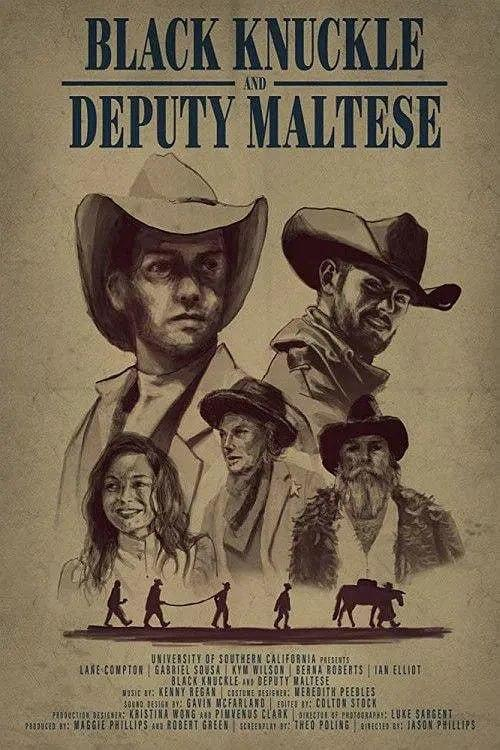

---

## 死神最后一张王牌

[2026-09-15 18:59] 来自：综合网盘资源频道

名称：死神，最后一张王牌 (1989)

描述：总统特使威尔逊决定秘密访华，和中国领导人进行会谈，会谈的结果将影响整个世界的格局。受国外政治势力支持的宇文得知了这一消息，决定暗杀威尔逊，破坏会谈，损害中国在世界上的形象。

宇文雇佣了杀手鲁山，因为鲁山的长相和被派来保护威尔逊的徐博文警官十分相像。鲁山绑架了徐博文，假扮成他，潜伏在威尔逊的身边，随时准备动手。为了得到有关于威尔逊的机密资料，鲁山设了一个连环计，可是计谋被拆穿，鲁山恼羞成怒准备大开杀戒。之后，鲁山将攻击目标放到了威尔逊乘坐的游艇上，就在他准备炸毁游艇的这个节骨眼上，逃脱的徐博文及时赶到，将鲁山的阴谋扼杀在了摇篮之中。

夸克网盘：https://pan.quark.cn/s/ca3e11f610c9

📁 大小：AA

🏷 标签：#剧情 #死神 #最后一张王牌 #quark

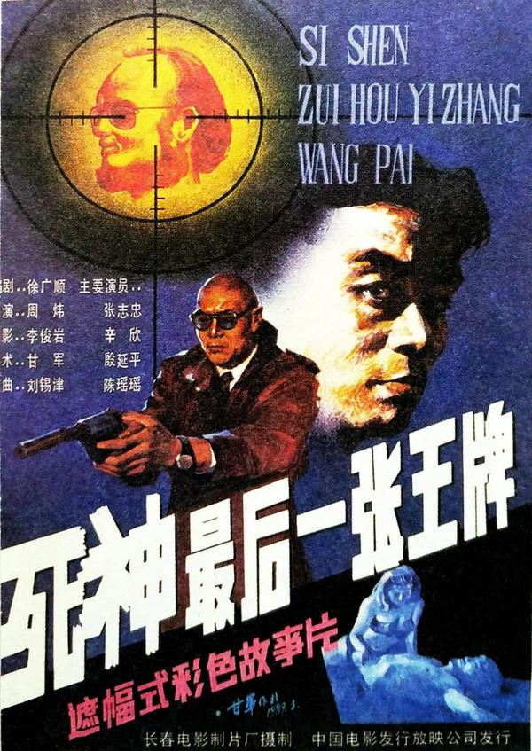

---

## 妖魔道

[2026-09-15 18:55] 来自：综合网盘资源频道

名称：妖魔道 (1991)

描述：五百年前，邪姬(邱月清 饰)被高僧藏生大师的心脏所镇压，无法作恶，如今期限已过，重出江湖的邪姬决心夺走魔君的女儿彩衣(周慧敏 饰)以助长自己的魔力，替自己报仇雪恨。微波派掌门白眉师太早就料到邪姬此举，在很多年前便将彩衣收入门下，并且对其隐瞒了她的真实身份。

白眉师太相中了阳年阳月阳日出生的极阳之人廖震(倪震 饰)，希望他能够镇压彩衣身上不断出现的魔性，然而成婚之日在即，廖震居然离家出走，拜在传真派门下学道，与此同时，传真派弟子丘处南(冯淬帆 饰)和邓天光(楼南光 饰)亦在追求白眉师太手下的敏儿(张敏 饰)和阿燕(司马燕 饰)。廖震和彩衣在不知彼此身份的情况下相遇，一来二去之中，竟然生出了真正的情谊

夸克网盘：https://pan.quark.cn/s/59216152f98c

📁 大小：AA

🏷 标签：#动作 #爱情 #奇幻 #妖魔道 #quark

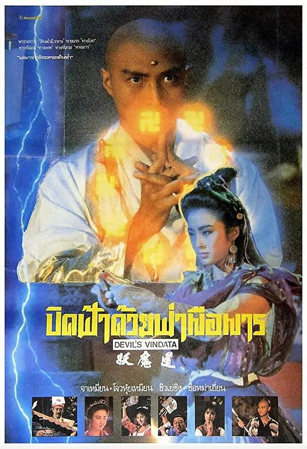

---

## 亲爱的恩东啊

[2026-09-15 18:44] 来自：综合网盘资源频道

名称：亲爱的恩东啊 사랑하는 은동아 (2015)

描述：1995年，未成年的朴贤秀买了一部摩托车，意外撞上池恩东送进医院，也进了警局，因为无照驾驶加上自己骑的竟然是一部赃车，造成在警局留下案底，法官判他去少管所看管六个月，但恩东替贤秀求情，也令贤秀突然对恩东有好感。两人短暂认识，恩东透露将来想成为演员，这样就可以上电视找亲生母亲，后来贤秀与恩东不巧失去联系。恩东后来没有成为演员，反倒是贤秀成为大韩民国的一线男星，但他始终都惦记着当初17岁时遇到的恩东，想尽办法想再次与她相遇，于是，他在记者会上公开宣布想要找到这位未婚妻。恩东已经成为人妻，因为一场事故意外，丈夫下半身麻痹，自己也丧失以前的记忆，若恩东再次见到贤秀，她能否记起这段甜蜜的初恋情人。

夸克网盘：https://pan.quark.cn/s/16f39e9e3ce3

📁 大小：AA

🏷 标签：#剧情 #爱情 #亲爱的恩东啊 #quark

---

## 栋笃神探

[2026-09-15 17:54] 来自：4K影视屋(分屋）-蓝光无损电影

名称：栋笃神探(2004)【25集全】【WEB-DL.1080p】【内封简繁】【喜剧/犯罪】

描述：豆瓣8.7高分

李慧慧(蔡少芬 饰)是某保险公司的高级经理，以现代女性自居的慧慧每天都要争取保单业绩一创高峰，总跟公司里的死对头罗密欧(魏俊杰 饰)明争暗斗。上司梁仲文对慧慧事业上有很多的帮助，同事都认为仲文喜欢慧慧，虽然慧慧极口否认，但心中还是无端欢喜起来。仲文果然对慧慧有意思，但仲文飞禽大咬的行为吓怕了慧慧，使慧慧落荒而逃。 此时，探员莫作栋(黄子华 饰)却找上了慧慧，原来仲文当天死于酒店内，慧慧是仲文最后见过的人，也是他的下属在公司关系也密切，所以慧慧成了最大的嫌疑人。

夸克网盘：https://pan.quark.cn/s/ca19ba698bc2

百度网盘：https://pan.baidu.com/s/1a6vavrUk4ENBBG6DxoiuMA?pwd=Yu88

迅雷网盘：https://pan.xunlei.com/s/VP0XXRnTHd-vrG-jiHA3oMqYA1?pwd=tuxj

磁链：magnet:?xt=urn:btih:3557894F135CF4C434E9EDC710500AE8AE5F5C1E

📁 大小：30.9GB

🏷 标签：#喜剧 #犯罪 #栋笃神探 #1080p #内封简繁

---

## 长月烬明

[2026-09-15 17:52] 来自：综合网盘资源频道

名称：长月烬明 (2023)

描述：为了解救被魔神澹台烬(罗云熙 饰)统治折磨的世界，衡阳宗掌门之女黎苏苏(白鹿 饰)孤注一掷，回到五百年前，化身叶家小女儿叶夕雾，阻止彼时尚未被邪念彻底侵蚀的景国质子澹台烬成为魔神。未料澹台烬竟是叶夕雾的丈夫，二人逐渐生出情愫，最终，黎苏苏以身证道，改变了澹台烬和世界的命运。痛失所爱后，澹台烬在幽冥川畔寻找黎苏苏的元神五百年，濒临死亡时被仙门救起，从此成为了一名仙门弟子，他改过从善，更与魂牵梦萦的黎苏苏再次相逢。就在二人破镜重圆之际，澹台烬的魔胎之躯还是惹来了非议和觊觎，三界再次陷入危险。面对残酷的命运，相爱的二人在重重误会下，终是心意相通，一人成神，一人成魔，共同扭转乾坤，阻止了灭世的危机。

该剧改编自藤萝为枝的小说《黑月光拿稳BE剧本》。

迅雷网盘：https://pan.xunlei.com/s/VP1ZTYrhZU-Y1V7GBqZVwMtnA1?pwd=q7up

📁 大小：AA

🏷 标签：#剧情 #爱情 #奇幻 #古装 #长月烬明 #xunlei

---

## 网络杀机

[2026-09-15 17:23] 来自：综合网盘资源频道

名称：网络杀机 Untraceable (2008)

描述：单身妈妈珍妮弗·马什(迪安·雷恩 Diane Lane 饰)是供职于FBI网络犯罪科的探员，她日常的工作就是对网络进行监视，查找任何一个盗取信用卡及其他可能造成危害的犯罪分子。在一次围剿信用卡盗贼的行动中，珍妮弗偶然进入一个名为KillwithMe的网站，网站通过视频直播一只小猫受虐死去的全过程。珍妮弗直觉该网站背后必有黑幕，她试图追踪IP和服务器，最终一无所获，似乎她所面对的对手具有颇为复杂的背景。

不久，该网站更新内容。画面中一个男子被捆绑起来，网站宣称浏览者越多，那名男子死得越快。珍妮弗等人眼睁睁看着男人死去，她决定不惜一切代价救出幕后黑手，却让自己也卷入这个死亡漩涡之中

夸克网盘：https://pan.quark.cn/s/2b2d5bdd6dcb

📁 大小：AA

🏷 标签：#悬疑 #惊悚 #犯罪 #网络杀机 #quark

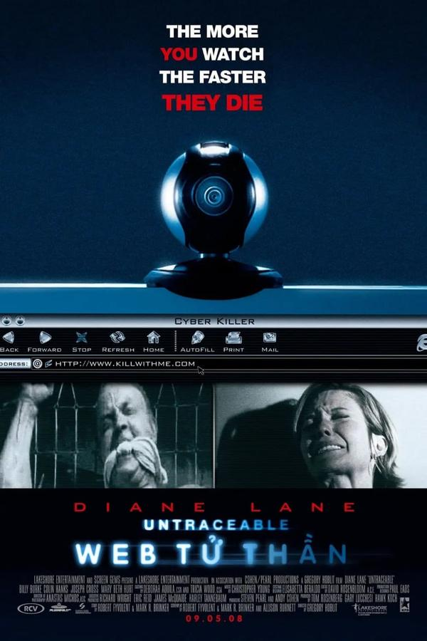

---

## 归来的黄金福

[2026-09-15 17:17] 来自：综合网盘资源频道

名称：归来的黄金福 돌아온 황금복 (2015)

描述：SBS日日剧 casting

夸克网盘：https://pan.quark.cn/s/cf3298d9d602

📁 大小：AA

🏷 标签：#剧情 #归来的黄金福 #quark

---

## 少林叛徒

[2026-09-15 17:04] 来自：综合网盘资源频道

名称：少林叛徒 (1977)

描述：在清朝雍正年间，少林寺内接连发生了一系列离奇的命案，数名弟子神秘死亡，少林寺的三十六代和三十七代掌门也接连遇害。康熙皇帝御赐的墨玉香炉也在此时被盗，所有的疑点都指向了俗家弟子雷鹏飞(黄家达 饰)。雍正帝(江南 饰)看似借机施压，命令玉格格(龙君儿 饰)前往少林寺，以逼迫少林寺交出盗宝者。现任掌门圆慧(鲁平 饰)在巨大的压力下被迫承诺，如果在限定时间内不能查出真正的凶手，就将焚毁少林寺并自尽。

雷鹏飞面临着巨大的压力，但在师祖田智(张翼 饰)和女俗家弟子柳芝兰(上官灵凤 饰)的帮助下，经过艰苦的调查，最终揭示了真正的凶手竟然是现任掌门圆慧。然而，事情远没有那么简单，随着调查的深入，雷鹏飞发现圆慧背后似乎还有一个更大的阴谋。这一发现让案件变得更加扑朔迷离，揭露了潜藏在少林寺深处的复杂黑幕，也让雷鹏飞和他的盟友们必须面临更加严峻的挑战，以揭开背后的真相。

夸克网盘：https://pan.quark.cn/s/3ea56ce25373

📁 大小：AA

🏷 标签：#动作 #悬疑 #少林叛徒 #quark

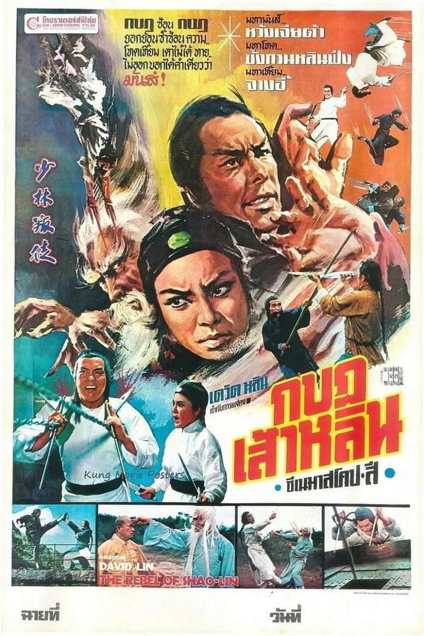

---

## 吉祥赌坊

[2026-09-15 16:50] 来自：综合网盘资源频道

名称：吉祥赌坊 吉祥賭坊 (1972)

描述：吉祥赌坊掌管人何莉莉下嫁与岳华，婚后岳说出赌博之害，及“以赌制赌”之意愿。何受岳所劝，宣布停业，谁料却惹祸上身……

军阀混战的年代，地方恶霸豪强地主勾结官府开设赌坊，专门诱使一些有着侥幸心理和做发财梦的赌徒沉迷其中，结果弄得家破人亡，悔不当初。一对青梅竹马的情侣，他们两人的家庭都是以经营赌坊谋生的。吉祥赌坊掌管人何莉莉下嫁与岳华，男子在江湖上飘泊过一段时间，幡然醒悟，认识到赌博对人的毒害作用，他发奋练就一手精湛的赌术。岳华告诉何莉莉，他决心以赌制赌，请所有骗人的人自食其果。何莉莉接受岳华所劝，宣布停业。这男子与女人面对的赌坊郎中都是一帮有权有势的恶势力，两个人毫不妥协，经过不屈不挠的斗争，终于在一场浴血战斗中，慷慨捐躯。两人的鲜血使众多赌徒猛醒。

夸克网盘：https://pan.quark.cn/s/3b40d9ebca89

📁 大小：AAA

🏷 标签：#动作 #吉祥赌坊 #吉祥賭坊 #quark

---

## 人吓鬼

[2026-09-15 16:42] 来自：综合网盘资源频道

名称：人吓鬼 人嚇鬼 (1984)

描述：这是一个发生在上个世纪80年代香港戏班里的故事。戏班里顽皮捣蛋的武生阿贵(董玮 饰)经常扮鬼吓人，连戏班的台柱新少佳都经常被他捉弄，大家对他既气愤，亦无可奈何。

这次，当阿贵又扮鬼吓人时，岂料碰上了真鬼——潮州鬼。阿贵吓得屁滚尿流，幸好戏班里的老衣箱声叔(林正英 饰)这方面经验丰富，他得知潮州鬼生前被人分尸，死后才冤魂不散。为了让潮州鬼安息，声叔和阿贵决定找全潮州鬼的尸骸。不料却错挖了另一个恶鬼的尸骸，一时间，戏班被恶鬼弄得乌烟瘴气，声叔决定和阿贵一起扮天师吓走恶鬼。

夸克网盘：https://pan.quark.cn/s/945f95587284

📁 大小：AA

🏷 标签：#喜剧 #奇幻 #人吓鬼 #人嚇鬼 #quark

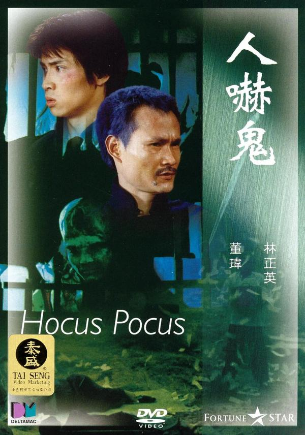

---

## 等到烟暖雨收

[2026-09-15 16:38] 来自：综合网盘资源频道

名称：等到烟暖雨收 (2019)

描述：大婚之夜初澈妖狼剧毒发作奄奄一息，易落用自己的血为初澈解毒。初澈获救后两人携手远走天涯，行侠仗义。哪料朝廷发来官员想方设法邀请初澈为国效力，而一路惹祸不断的易落又暴露俩人行踪。两人在躲避追踪的过程中竟再次遇见了与初澈同生共死的红颜知己碧霄，未曾想这碧霄竟然是妖狼的化身......

迅雷网盘：https://pan.xunlei.com/s/VP1ZCf_r-SDx-LMgKD43I_WMA1?pwd=m59p

📁 大小：AA

🏷 标签：#爱情 #奇幻 #古装 #等到烟暖雨收 #xunlei

---

## 1996简繁英字幕1080P蓝光87G

[2026-09-15 16:20] 来自：综合网盘资源频道

名称：[非常公寓][1996][简繁英字幕][1080P蓝光][8.7G]  莫妮卡·贝鲁奇主演

描述：

麦克斯(文森特·卡索 饰)即将与未婚妻步入婚姻殿堂，却在赴东京出差前夕，于餐厅电话亭旁偶然听到了失踪两年的前女友丽萨(莫妮卡·贝鲁奇 饰)的声音，还捡到了她遗落的饭店钥匙。难忘旧爱的麦克斯当即放弃了航班，留在巴黎疯狂寻找丽萨。他循着线索潜入丽萨曾住过的公寓，等待他的却是一个自称也叫做“丽萨”的陌生女人爱丽丝(罗曼娜·波琳热 饰)。原来，爱丽丝是丽萨的邻居兼好友，她暗恋麦克斯已久，当年正是她截留了麦克斯写给丽萨的信，一手促成了两人的分手。如今她住进丽萨的旧公寓，设下重重圈套，让麦克斯与真正的丽萨一次次擦肩而过。在这场交错着谎言与执念的爱情游戏中，每个人都渐渐偏离了最初的轨道。

夸克网盘：https://pan.quark.cn/s/480350634dc9

迅雷网盘：https://pan.xunlei.com/s/VP1Z5fiJbBNtlT5H1zQKAqDbA1?pwd=9xde

📁 大小：8.7G

🏷 标签：#剧情 #爱情 #悬疑 #法国电影 #非常公寓 #简繁英字幕 #1080P蓝光 #莫妮卡·贝鲁奇主演 #quark #xunlei

---

## IT狂人

[2026-09-15 15:55] 来自：综合网盘资源频道

名称：IT狂人 (2006) 1080p 中文字幕 H265 DDP 2.0

描述：去大公司面试成功的Jen 以为自己中了头彩，结果却被分配到了地下层的IT部门。部门里只有2个人，Moss 和Roy，2个电脑方面的专家，生活常识类的怪人。对电脑一窍不通的Jen强装出一副精通的样子，惹出了不少笑话。Jen和IT怪人二人组意外的很合拍，总会把一些本来很平常的事情，弄得一发不可收拾，让人哭笑不得。而公司的老板 也会时不时的出现，和他们一起上演让人捧腹大笑的故事。别具一番风味的英式幽默故事在IT部门上演。

迅雷网盘：https://pan.xunlei.com/s/VP1Z-ViYeJ-wYB-_VVfmi6ABA1?pwd=j7yg

📁 大小：X

🏷 标签：#喜剧 #IT狂人 #1080p #中文字幕 #xunlei

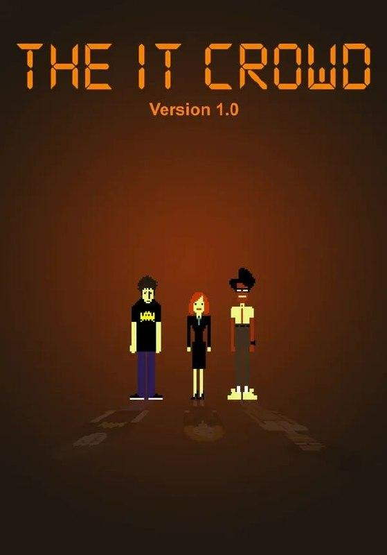

---

## 欢乐颂

[2026-09-15 15:54] 来自：综合网盘资源频道

名称：欢乐颂 (2016) 4K WEB-DL H265 DDP 2.0

描述：国际大都会上海，霓虹闪烁，人头攒动。多少年轻人从四面八方云集十里洋场，追寻着似乎触手可及的事业、爱情和梦想。在一个名为“欢乐颂”的小区，居住着五个年龄相仿的女孩子，分别是合租一套房的供职外企的“胡同公主”樊胜美(蒋欣饰 )、家境良好的乖乖女关雎尔(乔欣 饰)、来自小城市的普通上班族邱莹莹(杨紫 饰)，另外还有集美貌、智商事业于一身的海归女安迪(刘涛 饰)和古灵精怪的富二代曲筱绡(王子文 饰)。俗话说“三个女人一台戏”，更何况是五个有着不同性格、背景和人生经历的青春女孩。她们相互碰撞，彼此依偎，共同讲述了繁华城市中女孩子们的奋斗物语。

迅雷网盘：https://pan.xunlei.com/s/VP1Z-ydwZU-Y1V7GBqZV_c0EA1?pwd=ph2p

📁 大小：NG

🏷 标签：#爱情 #欢乐颂 #4K #WEBDL #xunlei

---

## 隧道

[2026-09-15 15:31] 来自：综合网盘资源频道

名称：隧道 (2016) 1080p 原盘REMUX 中文字幕 AVC DTS-HD MA 5.1

描述：汽车销售员李正洙(河正宇饰)结束工作赶赴女儿生日派对时，行经刚开通的河图隧道，突然一阵天摇地动，让他经历此生最孤立无援的三十五天，而此刻的他唯一能做的就是拨打119求救。这则隧道崩塌消息引发各界关注，除了搜救大队，还吸引了大批抢新闻的嗜血媒体，以及逢场作秀只为增添政绩的官员。搜救队长金大庆(吴达洙饰)不仅要研拟救援计划，还需控制现场跟风记者、向作秀官员汇报，恶劣天气的搅局使得救援行动雪上加霜。好不容易终于进行开挖，准备救出受难者时，竟发现隧道是个豆腐渣工程。一连串的重击使得希望一一幻灭，更糟的是搜救行动中救难队组长意外身亡、国库的大量花费，促使舆论审判，迫使李正洙无助的老婆世贤(裴斗娜饰)签下放弃救援同意书。那一天崩塌的不只是隧道，更引爆现代社会形象丑闻。

迅雷网盘：https://pan.xunlei.com/s/VP1YtIEBjiIwyOo_vBk6tnJRA1?pwd=bncf

📁 大小：29.8GB

🏷 标签：#剧情 #灾难 #隧道 #1080p #原盘REMUX #中文字幕 #DTSHD #xunlei

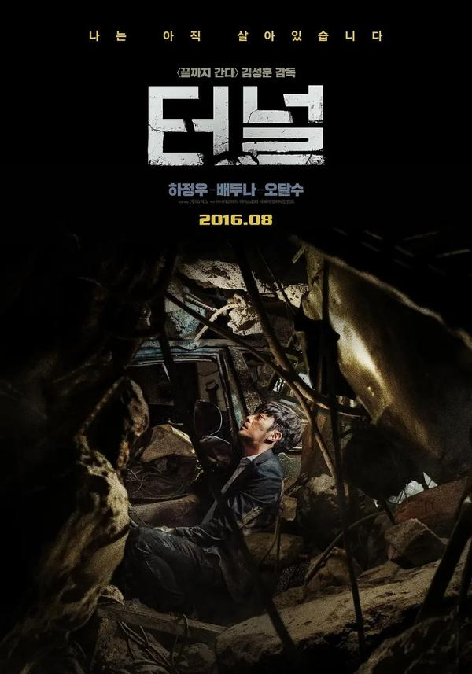

---

## 薄荷糖

[2026-09-15 15:26] 来自：综合网盘资源频道

名称：薄荷糖 (2000) 1080p 原盘REMUX 中文字幕 AVC DTS-HD MA 5.1

描述：1999年春天，对生活绝望的中年男子金永浩(薛景求饰)，落魄地参与了同学会，他神经质般哭叫，并在高架桥上面对迎面而来的火车嘶喊：我要回去！ 火车带着记忆倒走，三天前的金永浩已然崩溃，欲寻了断，但是被神秘人物叫去见一个人；再之后是1994年，他生活放荡，对妻子(金丽珍饰)冷若冰霜又出手大打；1987年身为警察的他，手段凶悍；1984年、1980年一直到1978年，直到第7个片段通过初恋情人(文素利饰)以及“薄荷糖”这一点题信物，影片才给出是什么碾压过主人公的生命，粉碎其美好的答案。

迅雷网盘：https://pan.xunlei.com/s/VP1YtDapGt8JP3j9kYtJoS4sA1?pwd=9qty

📁 大小：27.2GB

🏷 标签：#文艺 #爱情 #薄荷糖 #1080p #原盘REMUX #中文字幕 #DTSHD #xunlei

---

## 百万美元宝贝

[2026-09-15 15:26] 来自：综合网盘资源频道

名称：百万美元宝贝 (2004) 1080p 原盘REMUX 中文字幕 DTS-HD

描述：两名退休拳击手在洛杉矶经营一家拳馆，当一位怀揣拳击梦想的女性突然出现、渴望登上拳台时，他们的平静生活就此被打破。

迅雷网盘：https://pan.xunlei.com/s/VP1Yt5cMJbT1Lu5Xqs17q2r7A1?pwd=u5bh

📁 大小：30.4GB

🏷 标签：#运动 #百万美元宝贝 #1080p #原盘REMUX #中文字幕 #DTSHD #xunlei

---

## 孤注一掷

[2026-09-15 15:24] 来自：综合网盘资源频道

名称：孤注一掷 (2023) 4K WEB-DL H265 DDP 5.1

描述：电影取材自上万起真实诈骗案例，境外网络诈骗全产业链骇人内幕将在大银幕上首度被揭秘。南亚某国诈骗团伙头目陆经理张狂傲慢，用诡计和暴力统治着这个血泪王国。程序员潘生离开之前的公司，根据高薪招聘启示走入了陆经理设下的圈套，成为一名利用网络诈骗的“狗推”。因为羡慕闺蜜的生活，模特梁安娜也飞到异国他乡寻找机会，结果护照被没收，成为陆经理手下利用美色诈骗的工具。为了离开，潘生与安娜两人准备向赌徒顾天之和其女友宋雨下手，从他们身上套现、完成业绩…

迅雷网盘：https://pan.xunlei.com/s/VP1YuUky-66Xase2DGaQrh8_A1?pwd=936f

📁 大小：26.1GB

🏷 标签：#犯罪 #孤注一掷 #4K #WEBDL #xunlei

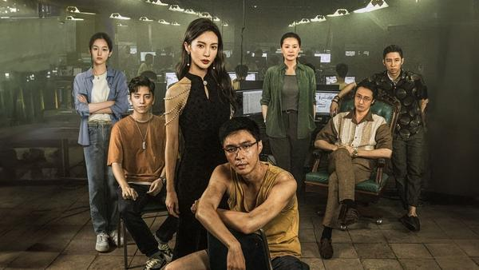

---

## 恶女

[2026-09-15 15:24] 来自：综合网盘资源频道

名称：恶女 (2023) 4K WEB-DL 中文字幕 H265 DDP 5.1

描述：《恶女》是一部惊悚片，剧情是讲邵雨薇扮演的强势女主播，发现自己单身很久的父亲(李天柱饰)，和一个会做饭又会做保健的神秘中年女子(林美秀饰)以结婚为前提交往。她再往下追踪，竟然发现这位女子之前有好多位未婚夫都自杀身亡，在死前都把财产留给了她。而女主播在调查这件事的时候，也和律师(凤小岳饰)和情人(曾少宗饰)

迅雷网盘：https://pan.xunlei.com/s/VP1Yu_bmAnHw1AxGQoxwh52-A1?pwd=j2ii

📁 大小：

🏷 标签：#惊悚 #恶女 #4K #WEBDL #中文字幕 #xunlei

---

## 秋日骤雨

[2026-09-15 14:41] 来自：综合网盘资源频道

名称：秋日骤雨 가을소나기 (2005)

描述：崔允才(吴智昊 饰)在和新婚妻子李桂恩(金素妍 饰)蜜月旅行的时候不幸遭遇了意外，李桂恩陷入了昏迷之中，而崔允才一直不离不弃的照顾着她，从来都没有过放弃的念头。一晃眼多年过去，李桂恩完全没有苏醒的迹象，而崔允才的心智在漫长的岁月之中被折磨的伤痕累累，与此同时，李桂恩的好友朴妍西(郑丽媛 饰)在这些年间给予了崔允才很多的帮助，最终，两人走到了一起，他们想要抛下一切，远走高飞。

可就在这个节骨眼上，李桂恩竟然奇迹般的苏醒了，可等待着她的，却是丈夫和好友的双重背叛。一边是持续了多年的友情，一边是令她心动的爱情，在道德和伦理的折磨之下，朴妍西又会做出怎样的选择呢？

夸克网盘：https://pan.quark.cn/s/c8ae449e51ca

📁 大小：AA

🏷 标签：#剧情 #秋日骤雨 #quark

---

## 恋恋风尘

[2026-09-15 14:22] 来自：电影资源频道(4K、REMUXE/原盘)

名称：【原盘】恋恋风尘 (1986) 1080P REMUX 内封简繁字幕

描述：初中毕业后，因家境不许，15岁的农村少年阿远（王晶文）放弃学业来台北做事，初尝人生的辛苦，却仍为自己的理想努力着。一年后，阿远青梅竹马的恋人阿云（辛树芬）也来到台北，了解到现实的台北同阿远信里所描述的，是两个世界。可是困顿的环境并没减少他们的快乐，因为他们拥有彼此。阿远服兵役时，因为有每日抵达的书信，孤身在台北的阿云起初并没感到有多孤独。然而日子久了，遥远恋人的纸上诉情总比不过现实生活中鲜活男孩的低声耳语，加上对未来怀有的恐慌，阿云在阿远退伍前选择了嫁作他人妇。伤心虽有，阿远也只能选择抑压。

夸克网盘：https://pan.quark.cn/s/a2b13f38ab9a

📁 大小：16.7GB

🏷 标签：#恋恋风尘 #剧情 #爱情

---

## 新龙门客栈

[2026-09-15 13:15] 来自：电影资源频道(4K、REMUXE/原盘)

名称：【原盘】新龙门客栈 (1992) 1080P REMUX 国粤多音轨 内封简繁字幕

描述：宦官专权的明朝中叶，东厂曹少钦（甄子丹）假造圣旨杀害了忠良杨宇轩，并想斩草除根杀死其后代。侠女邱莫言（林青霞）、江湖义士贺虎等人冒死救出忠良后代后，逃至边关沙漠里的龙门客栈，与杨宇轩部下周淮安（梁家辉）会合。龙门客栈实则黑店，老板娘金镶玉（张曼玉）利用乱世，以美貌和风骚 作诱饵杀人越货聚敛钱财，但她却为英俊潇洒的周淮安动了真心。为了摸清潜藏于龙门客栈中的出关暗道，周淮安将计就计，答应与金镶玉成亲。洞房花烛夜，楼上的周淮安与金镶玉各怀心事暗中较劲，楼下的邱莫言、贺虎等人也与东厂一众“走狗”展开了明争暗斗，战事一触即发。

夸克网盘：https://pan.quark.cn/s/45ce3d69ec83

📁 大小：36GB

🏷 标签：#动作 #爱情 #武侠 #新龙门客栈

---

## 英雄郑成功

[2026-09-15 12:11] 来自：影视动漫分享|SeedHub|夸克|网盘|🧲

名称：英雄郑成功 (2001)

#电影 #战争 #动作 #剧情 #夸克

主演: 赵文卓 蒋勤勤 岛田阳子 

豆瓣: [7.1](https://movie.douban.com/subject/1299864/)

公元1645年，清军已经占领明朝半壁江山，南明隆武帝退守福建。当时的台湾被荷兰人占领，国家有难之机，皇帝（徐敏饰）招见郑森（赵文卓饰），赐名“成功”，任御营中军都督..

夸克网盘：https://pan.quark.cn/s/feb3fb3b18ee

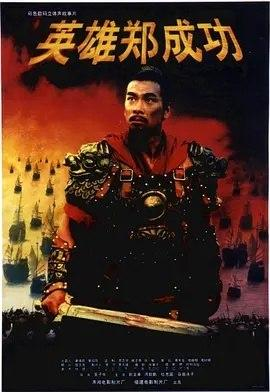

---

## 冬天的故事

[2026-09-15 12:10] 来自：影视动漫分享|SeedHub|夸克|网盘|🧲

名称：冬天的故事 (1992)

#电影 #爱情 #剧情 #夸克

主演: 夏洛特·韦里 弗里德里克·范登德里舍 米歇尔·瓦莱蒂 

豆瓣: [8.5](https://movie.douban.com/subject/1293388/)

侯麦著名系列之一《四季的故事》。菲丽丝（夏洛特·维瑞饰）和查理（弗雷德里克·范登德里舍饰）在海边浪漫相爱后，不小心留下了错误的地址，导致两人从此再也没有找到对方。菲..

夸克网盘：https://pan.quark.cn/s/81318f20a41e

---

## 鬼马双星

[2026-09-15 12:10] 来自：影视动漫分享|SeedHub|夸克|网盘|🧲

名称：鬼马双星 (1974)

#电影 #喜剧 #夸克 #百度

主演: 许冠文 许冠杰 许冠英 

豆瓣: [7.4](https://movie.douban.com/subject/1301997/)

这是香港70年代的典型武打搞笑片。老千邓国文（许冠文饰）经常出入于监狱，狱中无聊时，他经常会表演一些自己的千术以资同仓的犯人解闷。犯人刘俊杰（许冠杰饰）对国文的千术..

夸克网盘：https://pan.quark.cn/s/e07c4e3e9834

百度网盘：https://pan.baidu.com/s/1jyfQBypSz3fQWyf-RRUmCg?pwd=ub2r

---

## 黄色的眼泪

[2026-09-15 12:10] 来自：影视动漫分享|SeedHub|夸克|网盘|🧲

名称：黄色的眼泪 (2007)

#电影 #剧情 #夸克

主演: 二宫和也 相叶雅纪 樱井翔 

豆瓣: [8.2](https://movie.douban.com/subject/1908036/)

1963年早春，成功申办奥运会的日本东京到处是热火朝天的建设场面，日本经济高度增长。然而就在这样的大发展时代大潮中，仍有一小群笨拙地坚守着梦想的人。青年村冈荣介（二..

夸克网盘：https://pan.quark.cn/s/c28f9b76c356

---

## 胖子行动队

[2026-09-15 12:10] 来自：影视动漫分享|SeedHub|夸克|网盘|🧲

名称：胖子行动队 (2018)

#电影 #动作 #喜剧 #夸克

主演: 文章 包贝尔 郭京飞 

豆瓣: [4.2](https://movie.douban.com/subject/27149818/)

特工“J”（文章饰）在执行一项关键的A级任务时意外中枪，导致他的颅内下丘脑严重受损。伤愈期间，J的体型急剧膨胀，体重飙升至三百斤，并且患上了严重的嗜睡症，然而他依然..

夸克网盘：https://pan.quark.cn/s/9034cdc4479c

---

## 神鬼八阵图

[2026-09-15 12:10] 来自：影视动漫分享|SeedHub|夸克|网盘|🧲

名称：神鬼八阵图 (2006)

#电视剧 #爱情 #古装 #剧情 #奇幻 #夸克 #百度

主演: 于波 蔡少芬 杨俊毅 

豆瓣: [7.5](https://movie.douban.com/subject/2890804/)

他的功绩超越三国，他的名声因八卦阵而起；江河奔流，石块不动，未竟吴国之憾。——杜甫，唐代

公元200年左右，英雄崛起，魏、蜀、吴三国分天下。诸葛亮毕生心血之作《八..

夸克网盘：https://pan.quark.cn/s/f311b5da937e

百度网盘：https://pan.baidu.com/s/1HrTF-5OCaWMevJMz1saLFg?pwd=e6mE

---

## 后备甜心

[2026-09-15 12:10] 来自：影视动漫分享|SeedHub|夸克|网盘|🧲

名称：后备甜心 (2005)

#电影 #爱情 #夸克

主演: 林嘉欣 郑伊健 胡兵 

豆瓣: [6.4](https://movie.douban.com/subject/1418613/)

餐厅经理Jill（林嘉欣饰）一直是志安（胡兵饰）的后备情人，Jill为了爱情，只好默默守在志安的身边。Jill的合伙人Jason（曾志伟饰）快要退休，找来了厨师Ja..

夸克网盘：https://pan.quark.cn/s/693e23113bc2

---

## 间谍

[2026-09-15 12:10] 来自：影视动漫分享|SeedHub|夸克|网盘|🧲

名称：间谍 (2013)

#电影 #动作 #喜剧 #夸克

主演: 薛景求 文素利 高昌锡 

豆瓣: [6.3](https://movie.douban.com/subject/24855035/)

外表平平的金哲秀（薛景求饰）是大韩民国的一名身怀绝技、勇武干练的特工，但在日常生活中他伪装身份，连妻子英熙（文素丽饰）也对其真身一无所知。在老婆面前，他是唯唯诺诺，..

夸克网盘：https://pan.quark.cn/s/b8fd759c51ea

---

## 你好陌生人

[2026-09-15 12:10] 来自：影视动漫分享|SeedHub|夸克|网盘|🧲

名称：你好，陌生人 (2010)

#电影 #爱情 #喜剧 #夸克 #百度

主演: 辰塔维·塔纳西维 能提妲·索彭 瓦拉塔雅·宁枯哈 

豆瓣: [7.7](https://movie.douban.com/subject/4903613/)

泰国男生Dak（辰塔维·塔纳西维ChantawitThanasewee饰）因拒绝与女友结婚而被抛弃。喝得烂醉后隔天独自踏上原先和女友预订的韩国旅程。宿醉语言又不通的..

夸克网盘：https://pan.quark.cn/s/0d21257f0632

百度网盘：https://pan.baidu.com/s/1FO2iPsXlm-ulYjDMjspzJQ?pwd=1qpn

---

## 秀才遇着兵

[2026-09-15 12:10] 来自：影视动漫分享|SeedHub|夸克|网盘|🧲

名称：秀才遇着兵 (2005)

#电视剧 #古装 #夸克 #迅雷 #百度

主演: 陈豪 周励淇 米雪 

豆瓣: [7.1](https://movie.douban.com/subject/2287749/)

明朝时期，有一位名叫飞影（严谨文饰）的女盗，她劫富济贫。名将陆展（元华饰）被她的美貌所倾倒，两人结为夫妻，育有一女，名为陆诗仪（周丽淇饰）。飞影从此销声匿迹。诗仪长..

夸克网盘：https://pan.quark.cn/s/5725bbb0e4e3

迅雷网盘：https://pan.xunlei.com/s/VOsoRqXLDOQ0b-d61XUH27P0A1?pwd=s8th

百度网盘：https://pan.baidu.com/s/1xJMyIuvcjNiB0M98HCxe_g?pwd=6ncd

---

## 中央车站

[2026-09-15 12:09] 来自：电影资源频道(4K、REMUXE/原盘)

名称：【原盘】中央车站 (1998) 4K REMUX SDR 国葡多音轨 外挂简中字幕

描述：里约热内卢的中央车站，朵拉（费尔南达·蒙特内格罗Fernanda Montenegro饰）在这里帮人写信。但她会把看不顺眼的信统统撕掉不寄，甚至公开读信里的内容取乐。朵拉生活拮据，年纪不小却还未嫁，或许在她内心，人与人之间的真情根本就不值得信赖。小男孩约书亚（文尼西斯·狄·奥利维拉Vinícius de Oliveira 饰）的出现令她开始了一段重新认识人生的旅程——约书亚很想见到远方素未谋面的父亲，不断写信给他。男孩母亲意外的车祸让朵拉决定陪伴约书亚前往东北部寻找父亲。在约书亚眼中，即使父亲很陌生，却总是骄傲地谈起父亲。而朵拉，也同样有着一段和父亲的痛苦往事。在约书亚寻父的过程中，朵拉因为往事而冰冻的内心慢慢回暖。

夸克网盘：https://pan.quark.cn/s/783ee39e2b5a

📁 大小：66.7GB

🏷 标签：#剧情 #中央车站

---

## 大红灯笼高高挂

[2026-09-15 12:01] 来自：夸克云盘影视资源频道

名称：【原盘】大红灯笼高高挂 (1991) 1080P REMUX 内封简/繁英双语特效字幕

描述：大学刚读半年的颂莲（巩俐）被贪钱的母亲逼迫着嫁进陈家大院，成了老爷的第四房姨太。陈府有老规矩，姨太太们傍晚时分要站在自已的屋子前，等待下人送来的意味被老爷“临幸”的大红灯笼。 起初因为“新人”身份，颂莲得到老爷最多宠幸，但也因此被其它三位姨太太尤其笑里藏刀的二姨太（曹翠芬）挤兑得叫苦不迭。因为涉世不深，生性反叛好强的颂莲急欲争一口气，使计又成老爷身边红人，不想计被看穿，终败于二姨太手下酿成悲剧。而三姨太（何赛飞）的经历虽与颂莲迥异，却也殊途同归逃不出宿命。

夸克网盘：https://pan.quark.cn/s/dfb06155a08d

百度网盘：https://pan.baidu.com/s/1Ic9sU7OYYOsWJb0BQjNkGg?pwd=fu31 来自：阿里、夸克、百度网盘4K影视资源 [2026-09-15 12:01] 名称：【原盘】大红灯笼高高挂 (1991) 1080P REMUX 内封简/繁英双语特效字幕

📁 大小：22.1GB

🏷 标签：#剧情 #大红灯笼高高挂

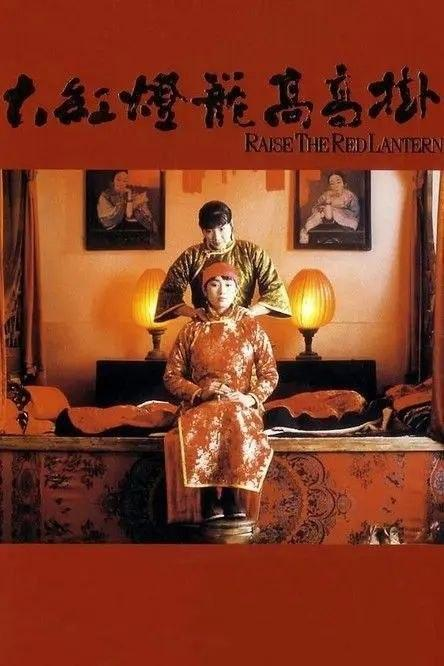

---

## 南方车站的聚会

[2026-09-15 11:58] 来自：夸克云盘影视资源频道

名称：【原盘】南方车站的聚会 (2019) 1080P REMUX 内封简中特效字幕

描述：南方某城市，重案队长刘队（廖凡 饰）重金悬赏在逃罪犯周泽农（胡歌 饰）。陪泳女刘爱爱（桂纶镁 饰） 、周泽农曾经的好友华华（奇道 饰）、五年未见的妻子杨淑俊（万茜 饰），各色人等各怀心事，相继被卷入这场罪与罚的追击旋涡。冒险与爱情，人性与救赎，这场特别的“聚会”该如何收场？善恶有道一念之间。

夸克网盘：https://pan.quark.cn/s/dc423f8038ad

百度网盘：https://pan.baidu.com/s/1d8syOhqYkuiV1ZCvWgv9hg?pwd=bxtp 来自：阿里、夸克、百度网盘4K影视资源 [2026-09-15 11:58] 名称：【原盘】南方车站的聚会 (2019) 1080P REMUX 内封简中特效字幕

📁 大小：30.5GB

🏷 标签：#南方车站的聚会 #剧情 #惊悚 #犯罪

---

## 哦我的鬼神大人

[2026-09-15 11:45] 来自：肯德基の4K影视综合电影云盘站

名称：哦我的鬼神大人(2015)【16集全】【4K.高码率】【外挂简中】【朴宝英/曹政奭】

描述：豆瓣8.2高分

拥有见鬼体质的胆小厨师助手罗奉仙(朴宝英饰)被处女鬼申顺爱(金瑟祺饰)附身，意外过世快三年的顺爱，因为生前完全没有谈过恋爱就枉死的怨念，造成她迟迟无法升天，她得找到阳气男，并且与他上床，才能一解怨气、离开人间。默默暗恋主厨姜善宇(曹政奭饰)的奉仙，原本内向地连主厨的眼睛都不敢直视，被顺爱附身后变得活泼机灵，善宇常被她主动的攻势逗得啼笑皆非，虽然一直拒绝亲密接触，但奉仙在善宇心中比重却愈来愈重。一次，因为被算命师追击，顺爱逃出奉仙身体，奉仙本来拒绝再被附身，但面对善宇好友李素馨(朴贞雅饰)的主动示爱，喜欢善宇的奉仙决定和顺爱联手，因为顺爱的感染使得奉仙愈来愈开朗、爱笑，并让不信鬼神的自恋狂明星主厨——阳气男善宇不知不觉地爱上她，发展出甜蜜爆笑的爱情故事。

夸克网盘：https://pan.quark.cn/s/82f34c3f3fd3

百度网盘：https://pan.baidu.com/s/1C2uCMDviYwZTx1lUDH9_6Q?pwd=Yu66

迅雷网盘：https://pan.xunlei.com/s/VP0My_xzhvaue3Z3Wrz5I4-sA1?pwd=rsdm

📁 大小：107GB

🏷 标签：#喜剧 #奇幻 #哦我的鬼神大人 #4K #高码率 #中文字幕

---

## 脱轨

[2026-09-15 10:58] 来自：肯德基の4K影视综合电影云盘站

名称：脱轨(2023)【30集全】【4K.SDR】【内嵌简中】【爱情/奇幻】【刘浩存/林一】

描述：傲娇少女江晓媛(刘浩存 饰)意外回到七年前，变成了一无所有的打工妹，在她绝望之际自称是“江晓媛”的青梅竹马祁连(林一 饰)出现，并一直默默帮助她；随着两人的心渐渐靠近，她们发现各自的秘密竟有着千丝万缕的关系……随着真相的不断揭露，她渐渐放下“回家”的执念，也找到了奋斗的意义，决心要好好生活证明自己，同时与祁连的感情也迎来了峰回路转……

夸克网盘：https://pan.quark.cn/s/4cd579cb9bc3

百度网盘：https://pan.baidu.com/s/1X8yRllpFsDN6NV3HfhFLtA?pwd=3atW

📁 大小：36.3GB

🏷 标签：#爱情 #奇幻 #脱轨 #4K #SDR #刘浩存

---

## 百万美元宝贝

[2026-09-15 07:10] 来自：综合网盘资源频道

名称：百万美元宝贝 (2004) 1080p 原盘REMUX 中文字幕 DTS-HD

描述：两名退休拳击手在洛杉矶经营一家拳馆，当一位怀揣拳击梦想的女性突然出现、渴望登上拳台时，他们的平静生活就此被打破。

夸克网盘：https://pan.quark.cn/s/1ecc756d4cef

百度网盘：https://pan.baidu.com/s/1SibjCZaDkTjcfqX6S-PlmA?pwd=ZKTR

📁 大小：30.4GB

🏷 标签：#运动 #百万美元宝贝 #1080p #原盘REMUX #中文字幕 #DTSHD #quark #baidu

---

## 隧道

[2026-09-15 07:07] 来自：综合网盘资源频道

名称：隧道 (2016) 1080p 原盘REMUX 中文字幕 AVC DTS-HD MA 5.1

描述：汽车销售员李正洙(河正宇饰)结束工作赶赴女儿生日派对时，行经刚开通的河图隧道，突然一阵天摇地动，让他经历此生最孤立无援的三十五天，而此刻的他唯一能做的就是拨打119求救。这则隧道崩塌消息引发各界关注，除了搜救大队，还吸引了大批抢新闻的嗜血媒体，以及逢场作秀只为增添政绩的官员。搜救队长金大庆(吴达洙饰)不仅要研拟救援计划，还需控制现场跟风记者、向作秀官员汇报，恶劣天气的搅局使得救援行动雪上加霜。好不容易终于进行开挖，准备救出受难者时，竟发现隧道是个豆腐渣工程。一连串的重击使得希望一一幻灭，更糟的是搜救行动中救难队组长意外身亡、国库的大量花费，促使舆论审判，迫使李正洙无助的老婆世贤(裴斗娜饰)签下放弃救援同意书。那一天崩塌的不只是隧道，更引爆现代社会形象丑闻。

百度网盘：https://pan.baidu.com/s/1R3gSmOhOHF6HDZYBB8DLfA?pwd=3W1w

📁 大小：29.8GB

🏷 标签：#剧情 #灾难 #隧道 #1080p #原盘REMUX #中文字幕 #DTSHD #baidu

---

## 欢乐颂

[2026-09-15 07:05] 来自：综合网盘资源频道

名称：欢乐颂 (2016) 4K WEB-DL H265 DDP 2.0

描述：国际大都会上海，霓虹闪烁，人头攒动。多少年轻人从四面八方云集十里洋场，追寻着似乎触手可及的事业、爱情和梦想。在一个名为“欢乐颂”的小区，居住着五个年龄相仿的女孩子，分别是合租一套房的供职外企的“胡同公主”樊胜美(蒋欣饰 )、家境良好的乖乖女关雎尔(乔欣 饰)、来自小城市的普通上班族邱莹莹(杨紫 饰)，另外还有集美貌、智商事业于一身的海归女安迪(刘涛 饰)和古灵精怪的富二代曲筱绡(王子文 饰)。俗话说“三个女人一台戏”，更何况是五个有着不同性格、背景和人生经历的青春女孩。她们相互碰撞，彼此依偎，共同讲述了繁华城市中女孩子们的奋斗物语。

百度网盘：https://pan.baidu.com/s/1lh1ebkJaD58J46_6RUwwIA?pwd=klfQ

📁 大小：NG

🏷 标签：#爱情 #欢乐颂 #4K #WEBDL #baidu

---

## 孤注一掷

[2026-09-15 07:02] 来自：综合网盘资源频道

名称：孤注一掷 (2023) 4K WEB-DL H265 DDP 5.1

描述：电影取材自上万起真实诈骗案例，境外网络诈骗全产业链骇人内幕将在大银幕上首度被揭秘。南亚某国诈骗团伙头目陆经理张狂傲慢，用诡计和暴力统治着这个血泪王国。程序员潘生离开之前的公司，根据高薪招聘启示走入了陆经理设下的圈套，成为一名利用网络诈骗的“狗推”。因为羡慕闺蜜的生活，模特梁安娜也飞到异国他乡寻找机会，结果护照被没收，成为陆经理手下利用美色诈骗的工具。为了离开，潘生与安娜两人准备向赌徒顾天之和其女友宋雨下手，从他们身上套现、完成业绩…

百度网盘：https://pan.baidu.com/s/15nQAF2J2KHvvX9DFT5biyg?pwd=wqHr

📁 大小：26.1GB

🏷 标签：#犯罪 #孤注一掷 #4K #WEBDL #baidu

---

## 欢乐颂

[2026-09-15 00:44] 来自：综合网盘资源频道

名称：欢乐颂 (2016) 4K WEB-DL H265 DDP 2.0

描述：国际大都会上海，霓虹闪烁，人头攒动。多少年轻人从四面八方云集十里洋场，追寻着似乎触手可及的事业、爱情和梦想。在一个名为“欢乐颂”的小区，居住着五个年龄相仿的女孩子，分别是合租一套房的供职外企的“胡同公主”樊胜美(蒋欣饰 )、家境良好的乖乖女关雎尔(乔欣 饰)、来自小城市的普通上班族邱莹莹(杨紫 饰)，另外还有集美貌、智商事业于一身的海归女安迪(刘涛 饰)和古灵精怪的富二代曲筱绡(王子文 饰)。俗话说“三个女人一台戏”，更何况是五个有着不同性格、背景和人生经历的青春女孩。她们相互碰撞，彼此依偎，共同讲述了繁华城市中女孩子们的奋斗物语。

夸克网盘：https://pan.quark.cn/s/106119ea2d46

📁 大小：NG

🏷 标签：#爱情 #欢乐颂 #4K #WEBDL #quark

---

## 孤注一掷

[2026-09-15 00:00] 来自：综合网盘资源频道

名称：孤注一掷 (2023) 4K WEB-DL H265 DDP 5.1

描述：电影取材自上万起真实诈骗案例，境外网络诈骗全产业链骇人内幕将在大银幕上首度被揭秘。南亚某国诈骗团伙头目陆经理张狂傲慢，用诡计和暴力统治着这个血泪王国。程序员潘生离开之前的公司，根据高薪招聘启示走入了陆经理设下的圈套，成为一名利用网络诈骗的“狗推”。因为羡慕闺蜜的生活，模特梁安娜也飞到异国他乡寻找机会，结果护照被没收，成为陆经理手下利用美色诈骗的工具。为了离开，潘生与安娜两人准备向赌徒顾天之和其女友宋雨下手，从他们身上套现、完成业绩…

夸克网盘：https://pan.quark.cn/s/5125c4669346

📁 大小：26.1GB

🏷 标签：#犯罪 #孤注一掷 #4K #WEBDL #quark

---

## 隧道

[2026-09-14 23:38] 来自：综合网盘资源频道

名称：隧道 (2016) 1080p 原盘REMUX 中文字幕 AVC DTS-HD MA 5.1

描述：汽车销售员李正洙(河正宇饰)结束工作赶赴女儿生日派对时，行经刚开通的河图隧道，突然一阵天摇地动，让他经历此生最孤立无援的三十五天，而此刻的他唯一能做的就是拨打119求救。这则隧道崩塌消息引发各界关注，除了搜救大队，还吸引了大批抢新闻的嗜血媒体，以及逢场作秀只为增添政绩的官员。搜救队长金大庆(吴达洙饰)不仅要研拟救援计划，还需控制现场跟风记者、向作秀官员汇报，恶劣天气的搅局使得救援行动雪上加霜。好不容易终于进行开挖，准备救出受难者时，竟发现隧道是个豆腐渣工程。一连串的重击使得希望一一幻灭，更糟的是搜救行动中救难队组长意外身亡、国库的大量花费，促使舆论审判，迫使李正洙无助的老婆世贤(裴斗娜饰)签下放弃救援同意书。那一天崩塌的不只是隧道，更引爆现代社会形象丑闻。

📁 大小：29.8GB

🏷 标签：#剧情 #灾难 #隧道 #1080p #原盘REMUX #中文字幕 #DTSHD #quark

---

## 北京人在纽约

[2026-09-14 23:33] 来自：综合网盘资源频道

名称：北京人在纽约 (1993) 1080p AVC DDP 5.1

描述：美国对大多数中国人来讲是一个遥远陌生的国度，来自大洋彼岸的消息也不相同，有人说那里是天堂，有人说那里是地狱。大提琴家王起明和妻子郭燕从肯尼迪机场下机伊始就陷入了一种可怕的幻灭感中，为了谋生，王起明进餐馆打工，郭燕去工厂干活。在严酷的现实面前，他们放弃了同甘共苦的初衷，走上了一条充满竞争，心酸，冷漠的人生之路。 王起明暴发有了钱，郭燕找到新的家，但都没有因此获得幸福安宁，在新的生活波折中，王起明大起大落一贫如洗，郭燕被逐出家门流落街头，他们的女儿也要离家出走。 自由女神依然冷傲注视着来自世界各地的人们涌入纽约淘金寻梦，又有一批中国人走出肯尼迪机场，望着他们兴奋的面孔，王起明百感交集……

百度网盘：https://pan.baidu.com/s/17g-g7RftKt4adlA8xU_J-Q?pwd=TBb5 来自：综合网盘资源频道 [2026-09-14 23:06] 名称：北京人在纽约 (1993) 1080p AVC DDP 5.1

📁 大小：NG

🏷 标签：#爱情 #姜文 #北京人在纽约 #1080p #quark

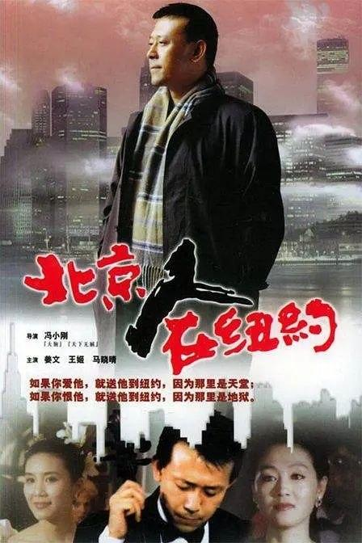

---

## 恶女

[2026-09-14 22:35] 来自：综合网盘资源频道

名称：恶女 (2023) 4K WEB-DL 中文字幕 H265 DDP 5.1

描述：《恶女》是一部惊悚片，剧情是讲邵雨薇扮演的强势女主播，发现自己单身很久的父亲(李天柱饰)，和一个会做饭又会做保健的神秘中年女子(林美秀饰)以结婚为前提交往。她再往下追踪，竟然发现这位女子之前有好多位未婚夫都自杀身亡，在死前都把财产留给了她。而女主播在调查这件事的时候，也和律师(凤小岳饰)和情人(曾少宗饰)纠缠不清……

百度网盘：https://pan.baidu.com/s/1FH0CtsHNRBnhLjMat-exsw?pwd=ZV3T

📁 大小：

🏷 标签：#惊悚 #恶女 #4K #WEBDL #中文字幕 #quark #baidu

---

## 大丈夫日记

[2026-09-14 22:33] 来自：综合网盘资源频道

名称：大丈夫日记 大丈夫日記 (1988)

描述：任职于金融机构的周定发(周润发 饰)。他分别认识了做空姐的Sally(叶倩文 饰)跟开时装店的祖儿(王祖贤 饰)。周定发面对两位天姿国色都无法下决定，难舍其一，于是分别在英国及法国跟两女子结婚。婚后他们回到香港，周定发在好友志雄(李子雄 饰)的帮助下努力周旋与两个老婆之间，笑料百出。可是事情到了后来都是让两个老婆知道了真相，Sally与祖儿气愤不已，打算联合起来报复周定发。

📁 大小：AA

🏷 标签：#剧情 #大丈夫日记 #大丈夫日記 #quark

---

## 不能说的秘密

[2026-09-14 22:30] 来自：4K影视屋(分屋）-蓝光无损电影

名称：不能说的秘密(2007)【1080p 原盘REMUX】【内封简繁英双语字幕】【周杰伦/桂纶镁】

描述：豆瓣8.2高分

高中生叶湘伦(周杰伦饰)出身单亲家庭，并且在父亲(黄秋生饰)任教的学校就读。而在父亲的耳濡目染下，他热爱音乐并且琴艺过人。某日，班上来了一位同样喜爱弹琴的新同学路小雨(桂纶镁饰)，投缘的两人形影不离，情感也日渐加温，然而小雨总是相当神祕，还常弹奏一首未曾问世，但优美动听的曲子。而每当小伦想多了解小雨一些，她常欲言又止，只都推说是秘密。但有一天，在一场误会发生后，小雨再也没来上过课，思念小雨又一头雾水的小伦决心要找出这个不能说的秘密。

百度网盘：https://pan.baidu.com/s/1CoUjuMo87RfEP32Oa_otIA?pwd=hEEG

磁链：magnet:?xt=urn:btih:A1D62D8ABB7968DC855C713E4EF4CA6C87FF9B2B

📁 大小：19.5GB

🏷 标签：#不能说的秘密 #1080p #蓝光原盘 #周杰伦 #爱情

---

## 我和她的传奇情仇

[2026-09-14 22:26] 来自：综合网盘资源频道

名称：我和她的传奇情仇 (2016)

描述：1936年，日寇紧逼华北。十年前因枪杀青岛兴安帮主薛安泰成名的九龙商会少爷韩志杰，因母亲被日舰炸死而对日仇视；他出其不意夺回被日商藤泽强占的码头，本想借码头贩毒走私的藤泽视韩志杰为眼中钉。薛安泰遗女萧岚忍辱接近韩志杰想报父仇，机缘巧合却与韩志杰相恋；九龙商会大佬曾念安因利要杀韩志杰；韩志杰的好兄弟厉晨星因萧岚也与其反目。韩志杰陷入重重杀局，九死一生，萧岚舍生忘死帮他化险为夷。不料在韩志杰和萧岚新婚之时，韩家却遭藤泽灭门，并嫁祸萧岚，有情人反目成仇。七七事变爆发，韩志杰和萧岚在中共的引导下，放下恩怨，投身抗日洪流。

📁 大小：AA

🏷 标签：#剧情 #战争 #我和她的传奇情仇 #quark

---

## 神社恶鬼的低语

[2026-09-14 22:22] 来自：综合网盘资源频道

名称：神社：恶鬼的低语 신사: 악귀의 속삭임 (2024)

描述：三名韩国大学生前往日本神户的废弃神社做文化考察，却在神社范围内离奇失踪，活不见人死不见尸。事件引起了韩国男巫明镇的注意，他拥有通灵能力，受失踪者家属委托前往日本调查。在学妹柔美陪同下，明镇深入废弃神社周边，逐渐揭开当地流传百年的 "神隐" 传说真相。随着调查深入，盘踞在神社中的古老邪灵开始缠上二人，他们不仅要对抗强大的恶灵，还要面对三名失踪学生被邪灵侵蚀后的恐怖形态，在异国他乡的阴森神社中展开一场生死较量。

📁 大小：AA

🏷 标签：#恐怖 #神社 #恶鬼的低语 #quark

---

## 探长欧光慈

[2026-09-14 22:16] 来自：综合网盘资源频道

名称：探长欧光慈 (2002)

描述：与国内目前常见的公安题材影视剧不同的是，《探长欧光慈》是眼下非常少见的悬疑、推理侦探剧。全剧通过《红樱桃之谜》、《电梯谋杀案》、《新娘之死》等10个独立成章的侦破案组成，通过起伏跌宕、疑云重重的情节设置，表现了探长欧光慈和他的伙伴利用独到而严谨的逻辑分析，从细节入手，抽丝剥茧揭开谜团的过程，塑造了睿智而又细心的全新公安人员形象。随着剧情的深入，观众会不知不觉被编导带入一个精心设计的迷宫，而剧中所写案件都是发生在我们生活的中间，观众可以运用自己的经验和推理判断能力与剧中人来一番智力的大比拼，犹如进行一次惊险刺激而又妙趣横生的智力旅行。

📁 大小：AA

🏷 标签：#剧情 #探长欧光慈 #quark

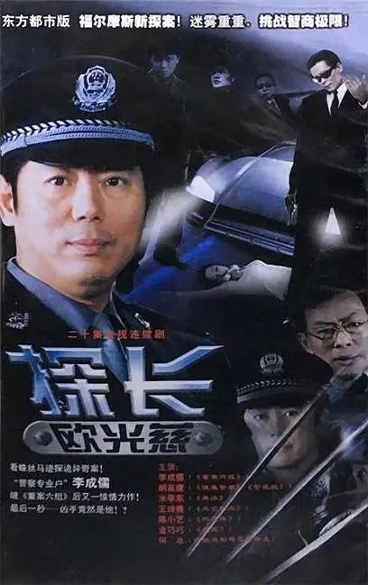

---

## 书剑恩仇录

[2026-09-14 22:15] 来自：综合网盘资源频道

名称：书剑恩仇录 (2009)

描述：故事发生在清朝乾隆年间，陈家洛(乔振宇 饰)接替了义父于万亭(刘德凯 饰)之位，成为了红花会总舵主，并意外得知了当今圣上乾隆(郑少秋 饰)的真实身世。那边厢，红花会四当家文泰来(刘乃艺 饰)和妻子骆冰(齐芳 饰)遭遇劲敌鹰爪，被困客栈，所幸得到陆菲青的帮助，陆菲青将两人藏至周仲英的家中。

然而，周仲英的儿子却在无意之中暴露了文泰来夫妇的藏身之处，导致文泰来被朝廷逮捕，红花会众人误以为周仲英出卖了文泰来，两方人马大打出手伤亡惨重。此时陈家洛风尘仆仆的赶来，一番波折总算弄清了事情的原委，洗清了周仲英的冤屈。与此同时，和亲王打起了谋权篡位的主意，使得乾隆为了保住秘密想要杀了文泰来灭口

📁 大小：AA

🏷 标签：#剧情 #古装 #书剑恩仇录 #quark

---

## 胭脂扣

[2026-09-14 22:11] 来自：综合网盘资源频道

名称：胭脂扣 (1987)

描述：报社记者袁永定(万梓良 饰)遇到了一位前来登寻人广告的女子如花(梅艳芳 饰)，无意中才发现了该名冷艳的女子原是鬼魂，早在50年前，她是一名红牌妓女，结识了一名纨绔子弟十二少陈振邦(张国荣 饰)。如花深深爱上了这名多情的公子，两人已到了谈婚论嫁的地步，由于身份悬殊，遭到了十二少家人的极力反对。无奈之下，他们以胭脂扣定情，一起吞鸦片殉情。如花未能在地府看到自己的爱人，便到阳间寻找。

📁 大小：NG

🏷 标签：#剧情 #爱情 #奇幻 #胭脂扣 #quark #ali

---

## 我仍在此

[2026-09-14 22:10] 来自：综合网盘资源频道

名称：我仍在此 I'm Still Here (2024)

描述：尤妮斯·派瓦(费尔南达·托里斯 饰)原本拥有一个温馨的家庭，不料丈夫鲁本斯因政治立场被秘密逮捕。尤妮斯在寻找丈夫的过程中，遭遇监禁与酷刑，却始终拒绝屈服。她以柔弱的肩膀扛起养育子女的重担，甚至自学法律，只为揭开丈夫遇害的真相。自此开启长达半个世纪的抗争，从绝望主妇蜕变为人权律师。当丈夫迟到的死亡证明终于交到她手中时，她含泪的微笑既是对历史的控诉，也是对生命的释然！

📁 大小：NG

🏷 标签：#剧情 #传记 #历史 #我仍在此 #quark #ali

---

## 五女拜寿

[2026-09-14 22:10] 来自：综合网盘资源频道

名称：五女拜寿 (1984)

描述：明朝嘉靖年间，户部侍郎杨继康(董柯娣 饰)因不满朝内奸臣严嵩专权，借口年事已高，欲告老还乡。在他六十寿辰之际，众女儿及夫婿前来拜寿，并争相提出养老送终。三女杨三春(何英 饰)携夫婿邹应龙(方雪雯 饰)前来拜寿，因礼薄遭娘家人冷遇。二姐(吴海丽 饰)持宠欺凌妹妹和妹夫，并唆使杨夫人(徐爱武 饰)将三春和应龙逐出杨府。因受族弟诛连，杨继康全家被逐出京城。二姐见家父落魄，拒绝抚养，昔日同窗摄奸臣淫威，也不敢收留杨继康夫妇，致二老和婢女翠云(何赛飞 饰)流落街头。绝境中，三女杨三春念人伦，将二老接回家奉养。三女婿邹应龙设计斗倒严嵩，杨家冤案昭雪....

📁 大小：AA

🏷 标签：#戏曲 #五女拜寿 #quark

---

## 薄荷糖

[2026-09-14 22:05] 来自：综合网盘资源频道

名称：薄荷糖 (2000) 1080p 原盘REMUX 中文字幕 AVC DTS-HD MA 5.1

描述：1999年春天，对生活绝望的中年男子金永浩(薛景求饰)，落魄地参与了同学会，他神经质般哭叫，并在高架桥上面对迎面而来的火车嘶喊：我要回去！ 火车带着记忆倒走，三天前的金永浩已然崩溃，欲寻了断，但是被神秘人物叫去见一个人；再之后是1994年，他生活放荡，对妻子(金丽珍饰)冷若冰霜又出手大打；1987年身为警察的他，手段凶悍；1984年、1980年一直到1978年，直到第7个片段通过初恋情人(文素利饰)以及“薄荷糖”这一点题信物，影片才给出是什么碾压过主人公的生命，粉碎其美好的答案。

百度网盘：https://pan.baidu.com/s/1g27v5YcIk5GreXdTbtHrAA?pwd=tMvh 来自：综合网盘资源频道 [2026-09-14 21:26] 名称：薄荷糖 (2000) 1080p 原盘REMUX 中文字幕 AVC DTS-HD MA 5.1

📁 大小：27.2GB

🏷 标签：#文艺 #爱情 #薄荷糖 #1080p #原盘REMUX #中文字幕 #DTSHD #quark

---

## 南极大冒险

[2026-09-14 22:04] 来自：电影资源频道(4K、REMUXE/原盘)

名称：【原盘】南极大冒险 (2006) 1080P REMUX 外挂简英双语字幕

描述：动物与人之间互救互助，不舍不弃的感人故事，冰天雪地的南极迎来了三个科考队员，他们要前来搜寻一块陨石，随行的还有八条雪橇狗。南极风景优美，三人惊叹不已，然而危险却也随着美景到来。几天之后，一场暴风雪让他们尝到了苦头，其中一名队员掉进了薄冰下的冰水里面，危在旦夕，幸得雪橇狗奋身相救，队员才脱险——这似乎只是一个小小的序曲，更严峻的考验还在后头。狂暴的风雪在肆虐着南极大地，科考队员进退两难，在恶劣的天气和环境下挣扎求生。而此时，他们只能决定放弃那八条忠实的雪橇狗。当三人安全返回的时候，他们怎样也放不下那些还陷于危难的狗。为了挽救它们，三人沿途折回，回到了那片南极大地。

📁 大小：19.9GB

🏷 标签：#南极大冒险 #剧情 #冒险

---

## 小偷家族

[2026-09-14 21:57] 来自：电影资源频道(4K、REMUXE/原盘)

名称：【原盘】小偷家族 (2018) 1080P REMUX 国日多音轨 内封简繁特效字幕

描述：东京的都市丛林中央，残存着一栋古旧寒酸的老房子，这里局促地生活着柴田一家五口人。在工地当临时工的男人阿治（Lily Franky 饰）经常带着儿子祥太（城桧吏 饰）到超市盗窃生活用品，这一天，他们回家路上遇到了独自待在户外的四岁女孩由里（佐佐木美结 饰）。妻子信代（安藤樱 饰）起初极力主张将女孩送回父母身边，但当看到女孩原生家庭的状况时又心生恻隐。原本柴田家就靠着老奶奶初枝（树木希林 饰）的养老金度日，而今多了一口人，自然更艰辛了几分。包括信代的妹妹亚纪（松冈茉优 饰）在内，虽然一家人游走在贫困和违法的边缘，但笃深的羁绊将他们紧紧联系在一起，使他们的心不会随着冰冷的都市而寒冷下去……

📁 大小：32.9GB

🏷 标签：#犯罪 #剧情 #惊悚 #家庭 #小偷家族

---

## 少年派的奇幻漂流

[2026-09-14 21:51] 来自：综合网盘资源频道

名称：少年派的奇幻漂流 Life of Pi (2012)

描述：故事开始于蒙特娄，也结束于蒙特娄。一名在找寻灵感的作家(拉菲·斯波 Rafe Spall 饰)无意间得知派·帕帖尔(伊尔凡·可汗 Irrfan Khan 饰)的传奇故事。派的父亲(阿迪勒·侯赛因 Adil Hussain 饰)开了一家动物园。因这样特殊的生活环境，少年派(苏拉·沙玛 Suraj Sharma 饰 )对信仰与人的本性自有一套看法。

📁 大小：NG

🏷 标签：#剧情 #奇幻 #冒险 #少年派的奇幻漂流 #quark #ali

---

## 蓝色大门

[2026-09-14 21:45] 来自：综合网盘资源频道

名称：蓝色大门(2002)【BluRay.1080p】【内封简繁】【爱情/同性】【陈柏霖/桂纶镁】

描述：豆瓣8.4高分

高中生孟克柔(桂纶镁 饰)与林月珍(梁淑慧 饰)是无话不谈的好友，月珍告诉克柔，说自己喜欢上了一个叫张士豪(陈柏霖 饰)的男生，便常常要求克柔帮她接近张士豪，帮忙认识他、帮忙传递情书。没想到张士豪以为喜欢自己的是孟克柔，所以也常常借故接近她，跟她在一起。传递情书的事，被张贴出来，原来林月珍是以孟克柔的名义给张士豪写信，孟克柔非常生气而从而跟林月珍的关系疏远了。另一边厢孟克柔极不愿意承认她与张士豪之间是恋人的关系，可是张士豪已深深喜欢上她。孟克柔想跟男生接吻，因为她想清楚一件事，原来她心里，喜欢的是另外一个人。

百度网盘：https://pan.baidu.com/s/1rm_EfcZEH_Vv9bEMcVl0iw?pwd=WVmh

📁 大小：7.6GB

🏷 标签：#爱情 #蓝色大门 #1080p #内封简繁 #同性 #陈柏霖 #quark #baidu #xunlei

---

## 一个小忙

[2026-09-14 21:41] 来自：综合网盘资源频道

名称：一个小忙 A Simple Favor (2018)

描述：斯蒂芬妮(安娜·肯德里克 Anna Kendrick 饰)是一位开朗而又乐观的单身母亲，同时也经营着自己的直播频道，她常常在网络上分享一些自己领悟到的人生道理，她独创的菜谱深受粉丝们的喜爱。

📁 大小：NG

🏷 标签：#喜剧 #悬疑 #惊悚 #犯罪 #一个小忙 #quark #ali

---

## 星月童话

[2026-09-14 21:35] 来自：综合网盘资源频道

名称：星月童话 星月童話 (1999)

描述：未婚夫达也(张国荣)在香港死于一场交通意外后，瞳(常盘贵子)以为自此失去幸福，生活质量开始大幅滑坡。为了兑现曾与达也在香港许下的承诺，她勉强收拾心情只身来到伤心城。同瞳一样，香港警察家宝(张国荣)也有一段伤心往事，他曾因工作狂热导致女友无法忍受冷落自杀身亡。女友死后，家宝选择做了卧底，想以更加狂热刺激的工作来麻醉和折磨自己。

📁 大小：NG

🏷 标签：#剧情 #爱情 #惊悚 #星月童话 #星月童話 #quark #ali

---

## 文雀

[2026-09-14 21:33] 来自：综合网盘资源频道

名称：文雀 (2008)

描述：祺(任达华 饰)是一名职业扒手，这天出门前，家里飞来一只文雀，放生也不肯走，逗留昏暗屋内。祺与伙伴们午餐时问起自来雀的象征意义，伙伴说这是惹祸上身的前兆。当然，这是玩笑话。

📁 大小：NG

🏷 标签：#剧情 #爱情 #文雀 #quark #ali

---

## 死亡之夜

[2026-09-14 21:18] 来自：综合网盘资源频道

名称：死亡之夜 Dead of Night (1945)

描述：本片以一个鬼怪故事为骨架，叙述了五个鬼故事。建筑师沃尔特·格兰杰到郊外一个农庄去洽谈业务。他感到农庄像旧地重游，原来他做过一个可怕的怪梦，屋里所有的人都在梦里出现过的。当他向客人谈及这怪事时，范医生发表自然怀疑论的看法，从而引出每个客人叙述了—段自己亲身经历的鬼故事。

📁 大小：NG

🏷 标签：#悬疑 #惊悚 #恐怖 #死亡之夜 #quark #ali

---

## IT狂人

[2026-09-14 21:17] 来自：综合网盘资源频道

名称：IT狂人 (2006) 1080p 中文字幕 H265 DDP 2.0

描述：去大公司面试成功的Jen 以为自己中了头彩，结果却被分配到了地下层的IT部门。部门里只有2个人，Moss 和Roy，2个电脑方面的专家，生活常识类的怪人。对电脑一窍不通的Jen强装出一副精通的样子，惹出了不少笑话。Jen和IT怪人二人组意外的很合拍，总会把一些本来很平常的事情，弄得一发不可收拾，让人哭笑不得。而公司的老板 也会时不时的出现，和他们一起上演让人捧腹大笑的故事。别具一番风味的英式幽默故事在IT部门上演。

百度网盘：https://pan.baidu.com/s/1hh923wkPK1N8NgsqSUXxew?pwd=FP8g

📁 大小：X

🏷 标签：#喜剧 #IT狂人 #1080p #中文字幕 #quark #baidu

---

## 死亡乐章

[2026-09-14 21:16] 来自：综合网盘资源频道

名称：死亡乐章 Sterben (2024)

描述：方生方死，方死方生。人届中年的指挥家汤姆，在两端之间进退维谷。即将举行的演奏会诸事不顺，忙得不可开交之际，老父失智症恶化，老母癌病缠身，恐不久于人世。前度女友临盆，他亲自迎接新生命到临，更充当代理父亲。妹妹爱上同样酗酒的有妇之夫，生活一塌胡涂，更把他的音乐会弄垮。

📁 大小：NG

🏷 标签：#剧情 #家庭 #死亡乐章 #quark #ali

---

## 方世玉与洪熙官

[2026-09-14 21:11] 来自：综合网盘资源频道

名称：方世玉与洪熙官 方世玉與洪熙官 (1974)

描述：清兵火烧少林，寺中人员伤亡惨重，洪熙官(陈观泰 饰)虽然幸免于难但是身受重伤，他决定暂时偃旗息鼓待到他日能够东山再起，哪知道逃亡的一路上屡屡遭到官兵的追杀。某日，洪熙官正在和追捕他的官兵周旋，陷入鏖战之中，巧得方世玉(傅声 饰)路过，方世玉误以为洪熙官是作奸犯科之徒，于是帮助官兵将他五花大绑交至官府。

📁 大小：NG

🏷 标签：#剧情 #动作 #方世玉与洪熙官 #方世玉與洪熙官 #quark #ali

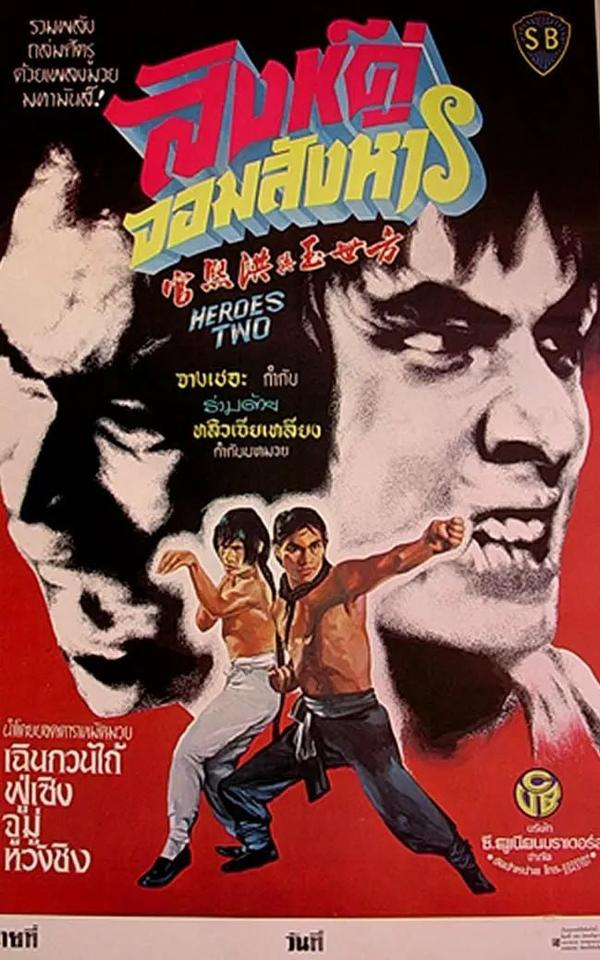

---

## 梦醒血未停

[2026-09-14 21:09] 来自：综合网盘资源频道

名称：梦醒血未停 夢醒血未停 (1991)

描述：银狐、黑猫都是冷酷无情、杀人无数的杀手，她们自幼被杀手组织头目收养，并且身手敏捷，她们每次执行任务都战无不胜。 但是今次夺取杀手组织首领霍先生的犯罪证据的行动中，她们却遭到情报人员顽强的回击、银狐受重伤跌下海去失踪了，黑猫独个儿回报霍先生。后来银狐幸Rockey仔所救，两人渐生好感，在此银狐也与西兰花结为好友，西兰花慧是特种部队成员，因被仇家所害，被迫逃亡。霍先生得知银狐下落后。便派黑猫和蝎子去捉回银狐，银狐见黑猫后更恢复记忆，但她不愿重蹈覆辙，并请黑猫取那犯罪证据回去交差，但绝情的蝎子已先后把Rockey仔和黑猫杀死，幸好，西兰花及时赶到救走银狐，并夺回罪证。因此，霍先生便亲身与银狐、西兰花二人展开一场生死战。

📁 大小：AA

🏷 标签：#剧情 #梦醒血未停 #夢醒血未停 #quark

---

## 巴啦啦小魔仙

[2026-09-14 20:49] 来自：4K影视屋(分屋）-蓝光无损电影

名称：巴啦啦小魔仙(2008)【52集全】【4K.SDR】【内嵌简中】【儿童/奇幻】

描述：故事发生在一个名为魔仙堡的魔法世界之中，黑魔仙小月(周娇 饰)偷偷修炼黑魔法，还想要盗走魔仙彩石。守护魔仙小蓝(廖景萱 饰)为了追寻魔仙彩石的下落来到了人间，藏身于音乐盒中，偶遇了善良的姐妹凌美淇(孙圳 饰)和凌美雪(黄安仪 饰)。 小蓝住进了姐妹俩的家中，化身成为他们 的保姆，三人共同度过了一段充满了幸福和快乐的生活，彼此之间结下了深厚的友谊。魔仙女王(王慧 饰)特别准许小蓝教授两姐妹魔法，美淇和美雪成为了小魔仙，与此同时，小月亦在人间结识了名为严莉莉(刘美含 饰)的女孩，将她变成了小黑魔仙。在人间，一场正义和邪恶之间的战争即将拉开序幕。

百度网盘：https://pan.baidu.com/s/1sB8wbLpeGBpcHDXZt88H5g?pwd=BnLj

📁 大小：24.9GB

🏷 标签：#儿童 #奇幻 #巴啦啦小魔仙 #4K #SDR

---

## 僵尸至尊

[2026-09-14 20:49] 来自：4K影视屋(分屋）-蓝光无损电影

名称：僵尸至尊(1991)【AI修复4K超高清】【国粤双语】【中文字幕】【林正英/钱小豪】

描述：七月十五，鬼门大开，孤魂野鬼游荡人间。茅山道长九叔(林正英 饰)精心准备鬼月所需祭品，而顽皮的二徒弟文才却跑去看鬼戏。文才懵懂，不只身旁已聚满群鬼，更有貌美如画的女鬼小丽(吴家丽 饰)将其相中。九叔命大徒弟秋生(钱小豪 饰)前去营救，秋生则为小丽美色所惑。最终师徒惊动群鬼，使得它们逃脱鬼差管制，徘徊人世。 为避免群鬼危害世人，九叔请来师兄弟共同商议对策。大师兄提出先天八卦阵，而由文才和秋生两个惹祸头负责将群鬼吸引出来……

百度网盘：https://pan.baidu.com/s/14dD-3JyVfQanGGNljNGDLg?pwd=qhYX

📁 大小：7.7GB

🏷 标签：#奇幻 #4K #僵尸至尊 #修复版 #国粤双语 #中文字幕 #林正英

---

## 岁月神偷

[2026-09-14 20:25] 来自：电影资源频道(4K、REMUXE/原盘)

名称：【原盘】岁月神偷 (2010) 1080P REMUX 国粤多音轨 内嵌简英双语特效字幕

描述：60年代的香港，风云变幻。一面要忍受港英政府的压制，一面又受到内地运动的波及，更要面对不时登陆的台风暴雨。老字号的永利街就处在这样一个风暴的旋涡中心。鞋匠罗一家四口，在街尾以做鞋为生。罗先生（任达华 饰）做得一手好鞋，在那个混乱的年代仅能养家糊口；罗太太（吴君如 饰）为人辛辣直率，人称“侠盗罗嫂”。大儿子罗进一（李治廷 饰）16岁，品学兼优，是运动会的冠军，全家人的希望，也是永利街的骄傲；小儿子罗进二（钟绍图 饰）8岁，在父母溺爱之下，天性顽劣，出了名的顽皮整蛊……一家人艰难度日，也算其乐融融。 然而大儿子与富家小姐芳菲（蔡颖恩 饰）之间一段纯美的初恋、一场扫荡整个香港的飓风暴雨、更有一场潜伏已久的噩梦，让这个普通家庭的平安幸福在一夜之间陡生变故、支离破碎……面对岁月这个最大的“神偷”，顽强不屈的人该如何去抵抗？ 

📁 大小：30.9GB

🏷 标签：#剧情 #家庭 #岁月神偷

---

## 咸鱼翻生

[2026-09-14 20:19] 来自：综合网盘资源频道

名称：咸鱼翻生 鹹魚番生 (1980)

描述：侠盗“一枝花”专劫富济贫故为人钦佩，却因正义感得罪了一名蛇蝎美人，该女子名叫“仇女”虽嫁与一土豪“孤寒财主”为妾但始终不忘被“一枝花”所辱，誓必要将“一枝花”置于死地。“一枝花”浪迹江湖，但“仇女”并未因而放过他，反而更诬造许多盗窃案令官方大举追缉之。其时江湖上出现两个小人物，一肥一瘦，肥名“胀爆”为人憨直，因仰慕“一枝花”而喜扮大侠，瘦名“扭纹柴”常自作聪明经常撞板，喜占小便宜，为了官方之花红到处找寻“一枝花”，而偶遇上“胀爆”后来反成莫逆之交，两人更结伴一同寻找“一枝花”……

📁 大小：AA

🏷 标签：#喜剧 #动作 #咸鱼翻生 #鹹魚番生 #quark

---

## 不能说的游戏

[2026-09-14 20:17] 来自：综合网盘资源频道

名称：不能说的游戏 Les chatouilles (2018)

描述：Odette是个八岁的小女孩，喜欢跳舞和画画。她非常讨厌父母亲的一个朋友，因为他总是想和她玩“挠痒痒”的游戏。成年后，Odette终于能够畅所欲言，回顾她的舞蹈演员生涯以及生活中的漩涡……

📁 大小：AA

🏷 标签：#剧情 #不能说的游戏 #quark

---

## 魔胎

[2026-09-14 20:10] 来自：综合网盘资源频道

名称：魔胎 (1983)

描述：十一年前，香港的富家郑家老太太和她的二媳妇在七月盂兰节的卖物会上高价投得了一块晶莹古玉。岂料自此二嫂性情大变，一日，郑家二爷提前回家，撞见了二嫂与古玉变得怪物在偷情，一怒之下，二爷摔碎了古玉。不料此后二爷浑身腐烂痛极跳楼而死，二嫂不久亦坠楼身亡。

郑老太请来法师超度亡魂，法师用黄符封了二爷的房间，讲二嫂的尸骨亦封于房间，告诫老太太二嫂已经有了怪物的魔胎，现用符封住了她的神位，12年内不可移动，否则魔胎诞生、恶魔降世。一晃十一年过去了，这天郑老太大寿孙子权(刘丹 饰)带着女儿安安(吕绣菱 饰)回来祝寿。安安见了二爷的房间封满黄符，好奇之下闯了进去，不小心移动了二嫂神位上符纸…

📁 大小：AA

🏷 标签：#剧情 #魔胎 #quark

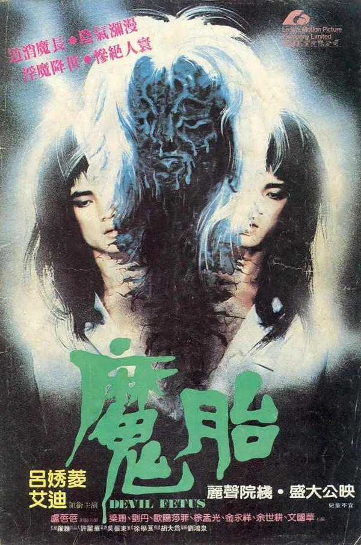

---

## 闪烁的西瓜

[2026-09-14 20:04] 来自：电视剧资源频道

名称：闪烁的西瓜 / 闪亮的西瓜(2023) 4K 高码 全16集 内封简繁字幕

描述：该剧讲述具有音乐天赋的少年通过一家可疑的乐器店，迫降在陌生的空间，在那里遇到可疑的年轻人们一起组成了乐队"Water Melon Sugar"，而展开的幻想青春剧。

📁 大小：109.2GB

🏷 标签：#闪烁的西瓜 #闪亮的西瓜 #剧情 #喜剧 #爱情 #韩剧

---

## 费城故事

[2026-09-14 19:58] 来自：电影资源频道(4K、REMUXE/原盘)

名称：【原盘】费城故事 (1993) 4K REMUX 外挂简中字幕

描述：安德鲁（汤姆•汉克斯 Tom Hanks 饰）和米勒（丹泽尔•华盛顿 Denzel Washington 饰）认识于法庭上，两人都是年轻有为的律师，各为其主。然而，年轻的安德鲁不久后因为同性恋和身染艾滋病被老板发现，以莫须有理由解雇了。遭解雇后的安德鲁四处寻找律师为他讨回公道。当安德鲁找到米勒时，米勒一开始拒绝了他。因为米勒像普通人一样憎恨同性恋和惧怕艾滋病，但当他看到安德鲁在图书馆搜索“艾滋病歧视”时遭到管理员的白眼，听着妻子缓慢而平静地说出他们的姨妈、朋友有很多也是同性恋时，他决定受理安德鲁的案件。在最后的法庭上，病危的安德鲁毅然出庭……

📁 大小：49.9GB

🏷 标签：#费城故事 #剧情 #同性

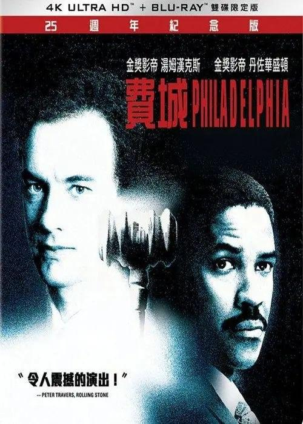

---

## 只是朋友

[2026-09-14 19:54] 来自：综合网盘资源频道

名称：只是朋友 เพื่อนต้องห้าม (2023)

描述：Mew has been focusing on his studies, setting aside no time for sex and relationships. Upon learning of his friend's innocence, Boston introduces Mew to Top. What Boston intended to be a one-night affair turns into something more and he isn't happy with the turn of events. Economics student Saen wants an exclusive relationship with Ray, but Ray has feelings for Mew and he's not interested in settling. IT guy Nick finds a sex tape in B

📁 大小：AA

🏷 标签：#剧情 #爱情 #只是朋友 #quark

---

## 吞噬星空

[2026-09-14 19:54] 来自：百度网盘综合频道

名称：吞噬星空（2020）4K 臻彩 S01E01 - E241

描述：暂无描述

百度网盘：https://pan.baidu.com/s/1pAznaPsy9HfIOe0prFzESQ?pwd=WBMQ

📁 大小：213GB

🏷 标签：#Jack #剧情 #吞噬星空

---

## 最佳福星

[2026-09-14 19:49] 来自：综合网盘资源频道

名称：最佳福星 (1986)

描述：一宗跨国要案难住香港警方，在一次高层秘密会议上，曹探长(曹德发 饰)接受下属建议，决定派非警方人员盗走日本黑帮犯罪分子的名贵钻石。他照例找到五福星老搭档，但最终只有鹧鸪菜(洪金宝 饰)同意接手。经过一番筛选，他们从警局内部又找到4个不着调的警员，分别是：狗王伦(谭咏麟 饰)、肥豹(郑则士 饰)、Rambo(刘德华 饰)、Band友(陈友 饰)和力保健(楼南光 饰)。这几个人的搞笑和脱线本领比起五福星来有强不差，闹出更多的笑话。为了在短期内将他们训练有素，曹探长还专门派出性感迷人且身怀绝技的女警察一品香担任教练，只是这群色迷迷、只想着占便宜的家伙最终能否成功完成任务呢

📁 大小：AA

🏷 标签：#剧情 #喜剧 #最佳福星 #quark

---

## 洪福齐天

[2026-09-14 18:13] 来自：综合网盘资源频道

名称：洪福齐天 洪福齊天 (1991)

描述：肥宝(洪金宝 饰)整日坑蒙拐骗，不顾父亲(洪金宝 饰)的责罚与朋友小海(孟海 饰)搭档出千骗人，代客泊车的二人见识了女骗子莉莉(利智 饰)的高超手段，欲从中分一杯羹却被莉莉的仇家盯上。小海被对方捉走当做人质，肥宝要搭救小海，怎奈事事不顺，遂迁怒于自己去世的“赌王”爷爷洪九(洪金宝 饰)。洪九不甘被孙子侮辱，加之为了向仇人及其后代寻仇，其怨灵重返人家，帮助肥宝在赌场上大杀四方，并成功救回了小海。得到好处的肥宝想摆脱洪九，但终因亲情而作罢。肥宝依计乔装成大陆领导接近仇家为祖父报仇，将父亲和莉莉也牵涉其中

📁 大小：AA

🏷 标签：#喜剧 #动作 #奇幻 #洪福齐天 #洪福齊天 #quark

---

## 神断狄仁杰

[2026-09-14 17:29] 来自：肯德基の4K影视综合电影云盘站

名称：神断狄仁杰(2010)【44集全】【4K.SDR】【内嵌简中】【悬疑/古装】

描述：豆瓣8.3高分

《神断狄仁杰》又称《神探狄仁杰4》，分为《金银奇案》和《杀人陷阱》两个扑朔迷离、案情愈演愈烈的故事组成。《金银奇案》讲述突厥吉利可汗的寿辰将至，武则天(吕中饰)派遣狄仁杰(梁冠华饰)的左膀右臂李元芳(张子健饰)及曾泰(须乾饰)组成一支使团赴突厥祝寿，然而却牵扯出一宗举朝震惊的黄金失窃案。《杀人陷阱》则讲述月氏国人与吐火罗人之间的生死较量。

百度网盘：https://pan.baidu.com/s/1fGy_L1Gc3NBGnGSXTtsGXw?pwd=O6yq

📁 大小：53GB

🏷 标签：#悬疑 #古装 #神断狄仁杰 #4K #SDR #内嵌简中

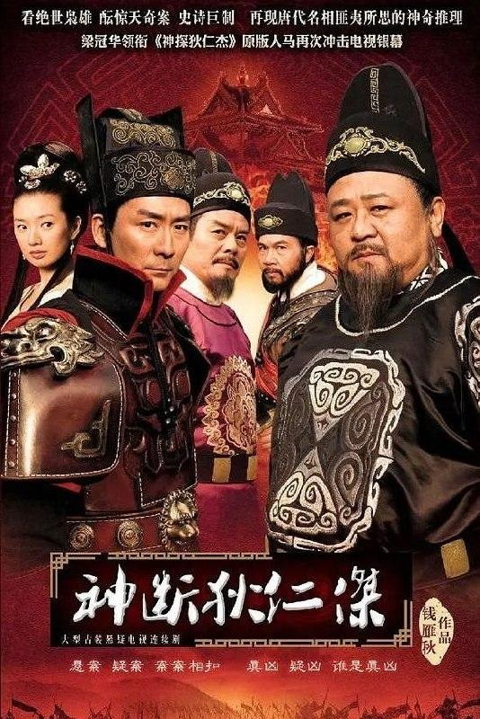

---

## 不能说的秘密

[2026-09-14 17:29] 来自：肯德基の4K影视综合电影云盘站

名称：不能说的秘密(2007)【1080p 原盘REMUX】【内封简繁英双语字幕】【周杰伦/桂纶镁】

描述：豆瓣8.2高分

高中生叶湘伦(周杰伦饰)出身单亲家庭，并且在父亲(黄秋生饰)任教的学校就读。而在父亲的耳濡目染下，他热爱音乐并且琴艺过人。某日，班上来了一位同样喜爱弹琴的新同学路小雨(桂纶镁饰)，投缘的两人形影不离，情感也日渐加温，然而小雨总是相当神祕，还常弹奏一首未曾问世，但优美动听的曲子。而每当小伦想多了解小雨一些，她常欲言又止，只都推说是秘密。但有一天，在一场误会发生后，小雨再也没来上过课，思念小雨又一头雾水的小伦决心要找出这个不能说的秘密。

百度网盘：https://pan.baidu.com/s/1CoUjuMo87RfEP32Oa_otIA?pwd=hEEG

📁 大小：19.5GB

🏷 标签：#不能说的秘密 #1080p #蓝光原盘 #周杰伦 #爱情

---

## 栋笃神探

[2026-09-14 16:48] 来自：肯德基の4K影视综合电影云盘站

名称：栋笃神探(2004)【25集全】【WEB-DL.1080p】【内封简繁】【喜剧/犯罪】

描述：豆瓣8.7高分

李慧慧(蔡少芬 饰)是某保险公司的高级经理，以现代女性自居的慧慧每天都要争取保单业绩一创高峰，总跟公司里的死对头罗密欧(魏俊杰 饰)明争暗斗。上司梁仲文对慧慧事业上有很多的帮助，同事都认为仲文喜欢慧慧，虽然慧慧极口否认，但心中还是无端欢喜起来。仲文果然对慧慧有意思，但仲文飞禽大咬的行为吓怕了慧慧，使慧慧落荒而逃。 此时，探员莫作栋(黄子华 饰)却找上了慧慧，原来仲文当天死于酒店内，慧慧是仲文最后见过的人，也是他的下属在公司关系也密切，所以慧慧成了最大的嫌疑人。

百度网盘：https://pan.baidu.com/s/1oW3AZ-Q6D_EorgtKHTTMCQ?pwd=WEuW

📁 大小：30.9GB

🏷 标签：#喜剧 #犯罪 #栋笃神探 #1080p #内封简繁

---

## 追随

[2026-09-14 16:07] 来自：综合网盘资源频道

名称：追随 Following (1998)[1998][内封双语字幕][1080P蓝光][8.8G]

描述： 比尔(杰里米·西奥伯德 饰)是个游手好闲的作家，借跟踪陌生人打发时间，以此体验形形色色的人生，寻求刺激。有一次，他盯上了一个西装革履的家伙克布(亚历克斯·霍 饰)，尾随到餐厅后却被对方识破，只得摊牌。克布是个贩卖盗版光碟的商贩，此外还做拧门撬锁的勾当。他带着比尔潜入陌生人家中，但比尔发现克布根本不取财物，而是寻找主人蓄意掩盖的隐私。后来，比尔认识了一个神秘的金发女人(露西·拉塞尔 饰)，在酒吧主动与她调情，却不知她其实是黑社会大佬的女人，不可遏制的激情让比尔失去了理智，从而堕入了万劫不复的深渊。本片是克里斯托弗·诺兰的长片处女作，以极低成本拍摄，采用非线性叙事，豆瓣评分高达8.9分。

📁 大小： 8.8G

🏷 标签：#悬疑 #惊悚 #犯罪 #诺兰 #经典 #追随 #内封双语字幕 #1080P蓝光 #quark

---

## 洛城机密

[2026-09-14 15:52] 来自：综合网盘资源频道

名称：洛城机密 L.A. Confidential (1997) BluRay REMUX 1080p 19G

描述：二十世纪50年代的洛杉矶，警界腐败、犯罪纵横，黑白两道相互勾结牟利已是常态。警局里有三个截然不同的警察：野心勃勃、精于算计的年轻警校毕业生埃德蒙·艾斯利(盖·皮尔斯 饰)，他进入警局只为查出当年害死父亲的内奸；世故圆滑的缉毒组警探杰克·文森(凯文·史贝西 饰)，靠向八卦小报出卖情报赚外快，是警局见报率最高的“明星”；以及铁面无私却冲动易怒的警员巴德·怀特(罗素·克劳 饰)。一桩发生在“夜猫子咖啡厅”的集体谋杀案，将这三个原本互不往来的警察的命运纠缠在了一起。他们在各自调查中逐渐发现，案件背后隐藏着一个涉及色情、毒品、谋杀与高层腐败的巨大阴谋——而幕后黑手，竟是他们最信任的警察局长达德利。在情与法、正义与邪恶的复杂较量中，三人不得不放下芥蒂，联手对抗这个掌控着整座城市黑暗秩序的真正敌人。

📁 大小：19G

🏷 标签：#洛城机密 #剧情 #悬疑 #惊悚 #犯罪 #经典 #黑色电影 #REMUX #1080p #quark #xunlei

---

## 巴啦啦小魔仙

[2026-09-14 15:20] 来自：肯德基の4K影视综合电影云盘站

名称：巴啦啦小魔仙(2008)【52集全】【4K.SDR】【内嵌简中】【儿童/奇幻】

描述：故事发生在一个名为魔仙堡的魔法世界之中，黑魔仙小月(周娇 饰)偷偷修炼黑魔法，还想要盗走魔仙彩石。守护魔仙小蓝(廖景萱 饰)为了追寻魔仙彩石的下落来到了人间，藏身于音乐盒中，偶遇了善良的姐妹凌美淇(孙圳 饰)和凌美雪(黄安仪 饰)。 小蓝住进了姐妹俩的家中，化身成为他们 的保姆，三人共同度过了一段充满了幸福和快乐的生活，彼此之间结下了深厚的友谊。魔仙女王(王慧 饰)特别准许小蓝教授两姐妹魔法，美淇和美雪成为了小魔仙，与此同时，小月亦在人间结识了名为严莉莉(刘美含 饰)的女孩，将她变成了小黑魔仙。在人间，一场正义和邪恶之间的战争即将拉开序幕。

百度网盘：https://pan.baidu.com/s/1sB8wbLpeGBpcHDXZt88H5g?pwd=BnLj

】

📁 大小：24.9GB

🏷 标签：#儿童 #奇幻 #巴啦啦小魔仙 #4K #SDR

---

## 宸汐缘

[2026-09-14 15:16] 来自：肯德基の4K影视综合电影云盘站

名称：宸汐缘(2019)【60集全】【4K.HDR】【内嵌简中】【爱情/奇幻】【张震/倪妮】

描述：豆瓣8.3高分

沉睡五万年的战神九宸，被地仙灵汐唤醒，牵出当年神魔大战的众多秘密。九宸因怀疑灵汐身份将其留在身边随侍，两人在相处中渐生情愫。灵汐被发现身怀魔气，可以解开魔君封印，两人感情从此命运多舛。九宸不愿枉杀，顶住压力拯救灵汐。灵汐在九宸的帮助下，历尽磨难，终获新生，并发现自己竟是山灵族公主。正当两人终将收获爱情之时，山灵界内的幽冥之门开启，魔族入侵，生灵涂炭。危难之时，九宸纵身跳入缚灵渊中以身镇魔……

百度网盘：https://pan.baidu.com/s/1QMkdCzVoKoHer4jE3fIC6w?pwd=oFBH

📁 大小：61.9GB

🏷 标签：#爱情 #奇幻 #宸汐缘 #4K #HDR #内嵌简中 #张震

---

## 装腔启示录

[2026-09-14 15:01] 来自：肯德基の4K影视综合电影云盘站

名称：装腔启示录(2023)【14集全】【4K.高码率】【内嵌简中】【蔡文静/韩东君】

描述：豆瓣8.2高分

本剧改编自豆瓣阅读连载小说《装腔启示录》，作者柳翠虎。 繁华都市，流光浮华的红男绿女，平行的唐影(蔡文静 饰)和许子诠(韩东君 饰)在飞机上偶遇，于是展开了一段暧昧博弈，互相撩拨的情爱故事。倔强勇敢当仁不让的律师唐影、自信温柔成熟魅惑的投行VP许子诠，两性吸引之下，这对戴着都市假面的成年男女经历了从相爱到敢爱的求索之旅。

📁 大小：48GB

🏷 标签：#剧情 #喜剧 #装腔启示录 #4K #高码率 #内嵌简中 #蔡文静

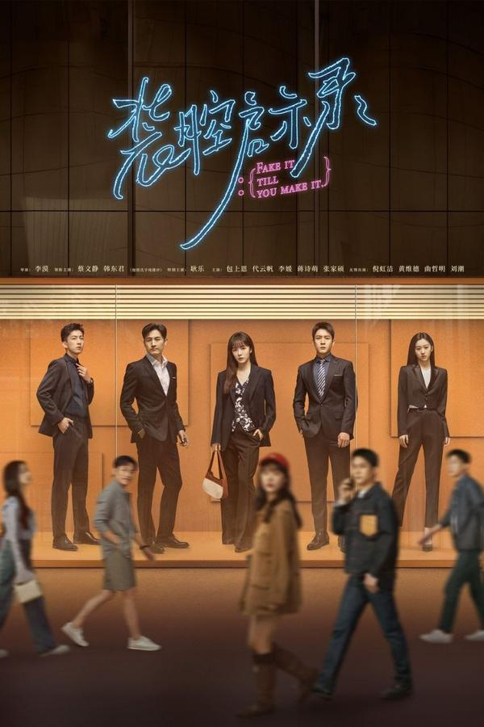

---

## 猎鹰1949

[2026-09-14 14:49] 来自：综合网盘资源频道

名称：猎鹰1949(2009)【39集全】【4K.SDR】【内嵌简中】【动作/悬疑】

描述：1949年10月1日，黎明的曙光照向久被阴霾笼罩的中华大地，而当华北欢庆新中国成立之际，我国西南边陲正进行着一场惊心动魄的生死之战。人民解放军挥师南下，攻克重镇贵阳，并直指川南。国民党方面不甘心退出历史舞台，于是派出特务潜入大西南，由代号“老板”的特务头子严森(梁冠华 饰)发起了名为“猎鹰计划”的秘密行动。中共特纵特务营营长燕双鹰(张子健 饰)在执行任务时偶然得知“猎鹰计划”，为了保住革命的胜利果实，他化装为军同少将。经过连番严酷的考验，燕逐渐取得严森的信任，但是身份偶然败露又将他推向死亡的边缘。 惊心动魄的角力接连展开，这是属于燕双鹰一个人的战斗……

夸克网盘：https://pan.quark.cn/s/614f399679e5

📁 大小：35.1GB

🏷 标签：#动作 #冒险 #4K #SDR #内嵌简中 #悬疑 #quark #xunlei

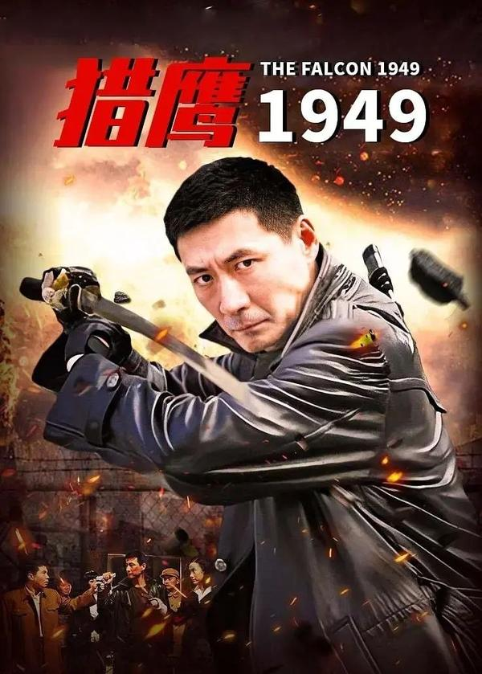

---

## 硫磺岛的来信

[2026-09-14 13:29] 来自：综合网盘资源频道

名称：硫磺岛的来信 Letters from Iwo Jima (2006)

描述：中途岛战役失利直接宣布了日军在太平洋战场上的失败，负隅顽抗的日军依然坚守日本最南端的小岛—硫磺岛。这个看似不起眼的小岛，却上演了二战太平洋上最惨烈的战争。

栗林忠道中将(渡边谦 饰)是日军在硫磺岛的指挥官，负责这道日军最后的防线。栗林中将大力改革日军内部的陋习和不足，并设计出一整套对付美军、以拖延为主的作战方案。虽然他和日军的二万名官兵都上下齐心，但面对占尽空中优势的四万名美军士兵，栗林知道这将是一场没有归路的战争。

在最后的战争之前，栗林写下了他最后的家书…

📁 大小：51.8GB

🏷 标签：#硫磺岛的来信 #xunlei

---

## 鲸鱼马戏团

[2026-09-14 12:13] 来自：综合网盘资源频道

名称：鲸鱼马戏团(2000)【4K.REMUX UHD原盘】【内封简繁英双语字幕】【剧情/悬疑】

描述：豆瓣8.5高分

这部令人入迷的社会崩塌寓言，以其超验的视觉、哲学与神秘回响构筑成一道深邃的谜题。改编自拉斯洛·卡撒兹纳霍凯的小说，本片在一处不知名的村庄里，于某个未明的时代中徐徐展开：某日，一个载着巨大鲸鱼标本与幽暗煽动家“王子”的神秘马戏团悄然抵达，仿佛唤醒了居民们某种逐渐滑向暴力深渊的集体疯狂。在导演贝拉·塔尔与联合执导/剪辑阿格涅丝·赫拉尼茨基的镜头下，三十九个以幽灵般的黑白影像铭刻的催眠长镜头，交织出一幅交织着梦魇般恐惧与无尽诗意的末世图景。[标准收藏]

📁 大小：86.3GB

🏷 标签：#文艺 #悬疑 #鲸鱼马戏团 #4K #REMUX #UHD原盘 #内封简繁英双语字幕 #quark

---

## 3

[2026-09-14 12:10] 来自：影视动漫分享|SeedHub|夸克|网盘|🧲

名称：3% 第二季 (2018)

#电视剧 #惊悚 #动作 #剧情 #科幻 #夸克

主演: 比安卡·孔帕拉托 Samuel de Assis Bruno Fagundes 

豆瓣: [7.4](https://movie.douban.com/subject/27601330/)

故事描述人们一生只有一次机会获得更好的生活和地位，但每个人都必须经历残酷（而且并不公平）的选拔过程——只有百分之三的候选人最终能获得成功。这些幸运儿在社会阶层中高人..

---

## 朝我心脏开枪

[2026-09-14 12:10] 来自：影视动漫分享|SeedHub|夸克|网盘|🧲

名称：朝我心脏开枪 (2015)

#电影 #剧情 #夸克

主演: 吕珍九 李民基 刘五性 

豆瓣: [7.7](https://movie.douban.com/subject/25856577/)

本片讲述两名青年男子企图飞越疯人院的“奋斗历程”。

男主角李秀明（吕珍九Jin-guYeo饰）因对母亲的自杀怀有内疚心理而患上精神分裂症，后被亲生父亲送入精神..

---

## 江湖最后一个大佬

[2026-09-14 12:10] 来自：影视动漫分享|SeedHub|夸克|网盘|🧲

名称：江湖最后一个大佬 (1990)

#电影 #犯罪 #动作 #剧情 #夸克

主演: 周星驰 吴孟达 柯俊雄 

豆瓣: [6.7](https://movie.douban.com/subject/1306573/)

黑道大哥方叔（柯俊雄饰）为人刚正耿直，忠勇仁义，为道上的兄弟所敬仰。当年他为保护兄弟，一个人顶下所有罪名，从此在监狱中度过了几十年岁月。出狱后，周围一切早已变了模样..

---

## 今夜星光灿烂

[2026-09-14 12:10] 来自：影视动漫分享|SeedHub|夸克|网盘|🧲

名称：今夜星光灿烂 (1980)

#电影 #剧情 #夸克

主演: 李秀明 唐国强 赵福余 

豆瓣: [7.6](https://movie.douban.com/subject/1498710/)

1948年冬，淮海战场。电话员小于（黄小雷饰）在执行任务中救下了准备上吊的农村姑娘玉香（李秀明饰），玉香无以为报，愿以身相许，并诉说自已无家可归的苦难遭遇。战土们非..

---

## 人世间

[2026-09-14 11:24] 来自：肯德基の4K影视综合电影云盘站

名称：人世间 全58集 [2022][豆瓣8.4]

描述：《人世间》改编自梁晓声茅盾文学奖获奖同名作品，该作品以北方城市中一个平民社区“光字片”为背景，讲述周家三兄妹周秉义（辛柏青 饰）、周蓉（宋佳 饰）、周秉昆（雷佳音 饰）等十几位平民子弟在近五十年时间内所经历的跌宕起伏，全面展示了中国社会的巨大变迁和平民百姓面对生活困境，始终坚韧拼搏、积极奋斗、永葆乐观精神的美好品质。

夸克网盘：https://pan.quark.cn/s/e7c146821916

百度网盘：https://pan.baidu.com/s/113wQ7HyGTAtNupzt5XfKOA?pwd=KCtu

📁 大小：N

🏷 标签： #人世间 #雷佳音 #辛柏青 #宋佳 #殷桃 #陈道明

---

## 僵尸至尊

[2026-09-14 10:46] 来自：肯德基の4K影视综合电影云盘站

名称：僵尸至尊(1991)【AI修复4K超高清】【国粤双语】【中文字幕】【林正英/钱小豪】

描述：七月十五，鬼门大开，孤魂野鬼游荡人间。茅山道长九叔(林正英 饰)精心准备鬼月所需祭品，而顽皮的二徒弟文才却跑去看鬼戏。文才懵懂，不只身旁已聚满群鬼，更有貌美如画的女鬼小丽(吴家丽 饰)将其相中。九叔命大徒弟秋生(钱小豪 饰)前去营救，秋生则为小丽美色所惑。最终师徒惊动群鬼，使得它们逃脱鬼差管制，徘徊人世。 为避免群鬼危害世人，九叔请来师兄弟共同商议对策。大师兄提出先天八卦阵，而由文才和秋生两个惹祸头负责将群鬼吸引出来……

百度网盘：https://pan.baidu.com/s/14dD-3JyVfQanGGNljNGDLg?pwd=qhYX

📁 大小：7.7GB

🏷 标签：#奇幻 #4K #僵尸至尊 #修复版 #国粤双语 #中文字幕 #林正英

---

## 致命感应

[2026-09-14 10:28] 来自：综合网盘资源频道

名称：致命感应 (2021) 4K 超高清 原盘REMUX 中文字幕 HDR10 H265 DTS-HD MA 5.1

描述：麦迪森在梦中不断看到恐怖谋杀案现场的幻象，而这些幻象实际上是真实发生过的凶案，她决定挖掘真相和自己的过去，却发现这一切与一位名叫“盖博瑞”的魔鬼有关。

📁 大小：49.9GB

🏷 标签：#惊悚 #恐怖 #致命感应 #4K #超高清 #原盘REMUX #中文字幕 #xunlei

---

## 德鲁纳酒店

[2026-09-14 10:27] 来自：综合网盘资源频道

名称：德鲁纳酒店 (2019) 1080p 原盘REMUX 中文字幕 AVC

描述：因为前世杀戮过多，罪孽深重的张满月(李知恩 饰)被惩罚束缚在亡者安息处的酒店，整日在酒店里打发着无聊琐碎的时光。外表高傲美丽、性格却异常孤僻、贪心善变又会耍心机。她的生命如同花园里的那棵树，不生不死，只是这样存在着。时光流转，年岁更迭，因果轮回，从满月客栈到德鲁纳酒店，从掌柜到社长，张满月终于迎来了她的救赎。精英酒店经理人具灿星(吕珍九 饰)是个性格中有着强迫症、洁癖以及偏执的完美主义者。虽然表面看似理智又冷静，但其实内心也有着脆弱的一面。他对自己要求严苛，打造了自己完美的工作履历，坐上了跨国酒店集团最年轻的二掌门的位置，却因意想不到的原因来到了德鲁纳酒店，接待鬼客。

百度网盘：https://pan.baidu.com/s/110ryqWHAg7sFEabdBkf4tA?pwd=Ttxs 来自：综合网盘资源频道 [2026-09-14 07:33] 名称：德鲁纳酒店 (2019) 1080p 原盘REMUX 中文字幕 AVC

📁 大小：269GB

🏷 标签：#奇幻 #爱情 #德鲁纳酒店 #1080p #原盘REMUX #中文字幕 #xunlei

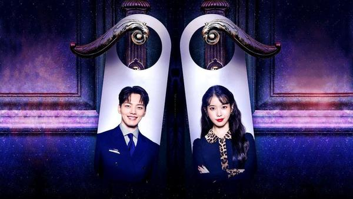

---

## 海贼王

[2026-09-14 09:56] 来自：夸克云盘影视资源频道

名称：海贼王(1999)4K高码更新1178集

描述：传奇海盗哥尔•D•罗杰在临死前曾留下关于其毕生的财富“One Piece”的消息，由此引得群雄并起，众海盗们为了这笔传说中的巨额财富展开争夺，各种势力、政权不断交替，整个世界进入了动荡混乱的“大海贼时代”。

生长在东海某小村庄的路飞受到海贼香克斯的精神指引，决定成为一名出色的海盗。为了达成这个目标，并找到万众瞩目的One Piece，路飞踏上艰苦的旅程。一路上他遇到了无数磨难，也结识了索隆、娜美、乌索普、香吉、罗宾等一众性格各异的好友。他们携手一同展开充满传奇色彩的大冒险……

百度网盘：https://pan.baidu.com/s/1X4J-TPu8W8d7mNNPSp0HPg?pwd=uqDX 来自：综合网盘资源频道 [2026-09-14 09:55] 名称：海贼王(1999)4K高码更新1178集

📁 大小：单集2G

🏷 标签：#海贼王 #喜剧 #奇幻 #冒险 #航海王 #4K高码

---

## 原生之罪

[2026-09-14 07:45] 来自：综合网盘资源频道

名称：原生之罪 (2018) 4K WEB-DL HDR10 H265 AAC 2.0

描述：讲述了一位因刑入狱的律师出狱后在生意场上风生水起，一位警校荣誉生，入职警局后屡破大案，却因家世背负沉重道德负担，两人被一只看不到的手编织到一起，从彼此对立到互为手足，最后生死同往……

📁 大小：131GB

🏷 标签：#犯罪 #原生之罪 #4K #WEBDL #AAC #quark

---

## 美人鱼

[2026-09-14 07:42] 来自：综合网盘资源频道

名称：美人鱼 (2016) 4K WEB-DL H265 DDP 2.0

描述：白手起家的富豪刘轩拍下一块沿海地皮，并与李若兰合作推进填海开发，使用的声纳技术却严重威胁着附近海域的生态环境，也迫使隐藏其中的人鱼一族逃到废弃沉船中艰难生存。为了阻止填海计划，人鱼一族派出珊珊接近并刺杀刘轩。没想到在一次次阴差阳错的行动中，珊珊与刘轩逐渐产生感情，而这段意外的相遇，也开始改变两人与人鱼一族的命运……

📁 大小：

🏷 标签：#奇幻 #喜剧 #美人鱼 #4K #WEBDL #xunlei

---

## 花田喜事

[2026-09-14 07:41] 来自：综合网盘资源频道

名称：花田喜事 (1993) 1080p 原盘REMUX 中文字幕 AVC TrueHD 5.1

描述：北宋年间，富家子弟周通武艺高强却仗势欺人，妹妹周吉同样任性刁蛮。周吉新婚之夜，丈夫林嘉声不堪忍受逃离周家，让疼爱子女的太君忧心不已。为了替母亲冲喜，周通决定大办寿宴，并请著名魔术师高柏飞前来助兴。与此同时，乔装外出的白雪仙在花田灯会上与高柏飞偶然相遇，两人一见倾心。白父得知女儿心有所属后准备为她提亲，却阴差阳错将周通误认成了高柏飞，而见到白雪仙的周通也一心想要娶她为妻。一场由误会开始的婚事，逐渐将几家人卷入连串错位与闹剧之中……

百度网盘：https://pan.baidu.com/s/1gbIdh8jBE9Q6A1RHH-Ohow?pwd=HamX

📁 大小：19.7GB

🏷 标签：#张国荣 #关之琳 #花田喜事 #1080p #原盘REMUX #中文字幕 #TrueHD #baidu #xunlei

---

## 杀生

[2026-09-14 07:36] 来自：综合网盘资源频道

名称：杀生 (2012) 4K WEB-DL H265 AAC 2.0

描述：中国西南、与世隔绝、群山环抱中有个寨子，是个人皆长寿、规矩自成之地，清时皇帝赐名“长寿镇”。某日突爆传染病，地方官派医生(任达华 饰)前往诊治，他在镇子外发现奄奄一息的牛结实(黄渤 饰)。进寨后，往日温厚的村民一反常态，不仅对牛结实拒施援手、避若瘟疫，更迁怒于医生多管闲事，老镇长(马精武 饰)亲自带着长寿镇医生(苏有朋 饰)和接生婆(梁静 饰)、油漆匠，老族长等人千万百计的阻挠医生对牛结实的救援，牛结实最终没能被救活，医生也找不到此人暴毙的原因。镇民们对医生的不欢迎不合作态度，令医生很沮丧，正当他准备离开的时候，无意中发现了一个被全镇民众一起隐藏在山崖上的一个秘密，带着重重疑惑医生决定暗中走访长寿镇，直到他偶遇一个男孩，长寿镇迷案的真相才一步步揭开……该片改编自陈铁军的中篇小说《设计死亡》。

百度网盘：https://pan.baidu.com/s/17RCfP_cWVkYkoCOg5eFddQ?pwd=cbmp

📁 大小：15.1GB

🏷 标签：#悬疑 #杀生 #4K #WEBDL #AAC #quark #baidu #xunlei

---

## 羔羊医生

[2026-09-14 00:09] 来自：综合网盘资源频道

名称：羔羊医生(1992)【1080p 原盘REMUX】【国粤双语】【内封简繁英】【惊悚/恐怖】

描述：林过雨(任达华 饰)从小和父亲以及继母还有同父异母的弟妹生活在一起，喧闹拥挤、又时常受责骂的成长环境在他心里埋下了异样的种子……因一家洗印店数次收到赤裸女子的照片，警方介入调查，发现这些女子可能是连环杀人者“雨夜屠夫”的受害人，警方沿线索调查，将来取照片的林过雨抓获。经 过连番高压审问，林过雨交代了自己的罪行，原来他以替天行道为名义，借助自己出租车司机的职业便利，多次在雨夜杀害那些他眼中的“坏女人”，其作案手法凶残，惊世骇俗。凶手落网，但生命已无法挽回……

📁 大小：10.1GB

🏷 标签：#惊悚 #恐怖 #羔羊医生 #1080p #原盘REMUX #国粤双语 #内封简繁英 #quark

---

## 极恶非道3

[2026-09-13 23:31] 来自：综合网盘资源频道

名称：极恶非道3 (2017) 1080p 原盘REMUX 中文字幕 AVC DTS-HD MA 5.1

描述：枪杀刑警片冈后，大友(北野武 饰)在韩国代理人张会长(金田时男 饰)的庇护下亡命济州岛。这个远离日本江湖的极道，却因某起事件和花菱会少壮派花田(皮埃尔泷 饰)起了冲突。此时花菱会由前任会长的女婿野村(大杉涟 饰)统领，作为若头的元老西野(西田敏行 饰)则根本不买这个外行老大的账。故而，怀恨在心的野村密谋借此次“济州岛事件”除去西野，并嫁祸张会长，谁知却很快演变成互相追杀彼此首脑的大战争。战争期间，没落的山王会图谋再起，而为给小弟报仇的大友也带着市川(大森南朋 饰)等人来到东京。秉承着仁义之心的大友，将为这个利欲熏心的黑道修罗场带来一场血腥风暴… 本片为北野武“极恶非道”系列三部曲的最终章。

📁 大小：X

🏷 标签：#犯罪 #极恶非道3 #1080p #原盘REMUX #中文字幕 #DTSHD #xunlei

---

## 极恶非道

[2026-09-13 23:29] 来自：综合网盘资源频道

名称：极恶非道 (2010) 1080p 原盘REMUX 中文字幕 AVC DTS-HD MA 5.1

描述：隶属于关东头号黑帮组织山王会的池元组头目(国村隼 饰)曾在监狱与小组织村濑组头目(石桥莲司 饰)结为兄弟。山王会野心勃勃，时刻觊觎村濑的地盘和毒品生意。在山王会若头加藤(三浦友和 饰)的授意下，池元命令麾下的大友组向村濑组发起挑战。大友(北野武 饰)的猛烈攻击和山王会老大(北村总一郎 饰)的毒辣计谋令村濑节节败退，被迫退休，组内的生意也易作他主。 大友组人才辈出，若头水野(椎名桔平 饰)和干部石原(加濑亮 饰)亲自主持在某非洲国家使馆开辟赌场，一时间财源滚滚。然而风云变幻，在早已抛弃了传统仁义道德的黑帮社会，各种阴谋纷纷浮现，大友组风雨飘摇…

📁 大小：28.3GB

🏷 标签：#动作 #犯罪 #极恶非道 #1080p #原盘REMUX #中文字幕 #DTSHD #xunlei

---

## 花田喜事

[2026-09-13 23:27] 来自：综合网盘资源频道

名称：花田喜事 (1993) 1080p 原盘REMUX 中文字幕 AVC TrueHD 5.1

描述：北宋年间，富家子弟周通武艺高强却仗势欺人，妹妹周吉同样任性刁蛮。周吉新婚之夜，丈夫林嘉声不堪忍受逃离周家，让疼爱子女的太君忧心不已。为了替母亲冲喜，周通决定大办寿宴，并请著名魔术师高柏飞前来助兴。与此同时，乔装外出的白雪仙在花田灯会上与高柏飞偶然相遇，两人一见倾心。白父得知女儿心有所属后准备为她提亲，却阴差阳错将周通误认成了高柏飞，而见到白雪仙的周通也一心想要娶她为妻。一场由误会开始的婚事，逐渐将几家人卷入连串错位与闹剧之中……

📁 大小：19.7GB

🏷 标签：#张国荣 #关之琳 #花田喜事 #1080p #原盘REMUX #中文字幕 #TrueHD #quark

---

## 美人鱼

[2026-09-13 23:25] 来自：综合网盘资源频道

名称：美人鱼 (2016) 4K WEB-DL H265 DDP 2.0

描述：白手起家的富豪刘轩拍下一块沿海地皮，并与李若兰合作推进填海开发，使用的声纳技术却严重威胁着附近海域的生态环境，也迫使隐藏其中的人鱼一族逃到废弃沉船中艰难生存。为了阻止填海计划，人鱼一族派出珊珊接近并刺杀刘轩。没想到在一次次阴差阳错的行动中，珊珊与刘轩逐渐产生感情，而这段意外的相遇，也开始改变两人与人鱼一族的命运……

📁 大小：

🏷 标签：#奇幻 #喜剧 #美人鱼 #4K #WEBDL #quark #baidu

---

## 精装追女仔

[2026-09-13 23:23] 来自：综合网盘资源频道

名称：精装追女仔 精裝追女仔 (1987)

描述：同在一个修车店工作的烂口发(周润发 饰)、交通灯(陈百祥 饰)还有吴准少(曾志伟 饰)是同事也是好友，他们都不屑老板刘定坚(冯淬帆 饰)的吝啬刻薄。

烂口发因不堪女友(张敏 饰)的势利眼母亲而忍痛与女友分开了。刘定坚建议伙计们一起跟廉价旅行团到槟城游玩，但到达才知道这个旅行团是货不对版的。但在槟城，烂口发等人认识了在当地拍广告的董董(张曼玉 饰)与其好友蚊滋。烂口发想进一步接近董董，便假装自己是富家公子，董董也同样以富家女的身份欺骗对方。

两人出席一个舞会的时候得罪了真正的富家子赵完先，赵完先还看上了董董。赵为了要报复烂口发，他向董董揭发了烂口发的真实身份，董董面对欺骗非常伤心。董董准备参加赵完先的舞会，但她与好友都不知道卑鄙的赵完先另有企图，烂口发等人前往营救

📁 大小：AA

🏷 标签：#喜剧 #爱情 #精装追女仔 #精裝追女仔 #quark

---

## 十大奇冤

[2026-09-13 23:21] 来自：综合网盘资源频道

名称：十大奇冤 (2008)

描述：故事发生在明朝中叶。锦衣卫杨傲(彭敬慈 饰)与御医李鹤龄(黄志忠 饰)本是同门师兄弟，因杨傲爱上师兄鹤龄未婚妻霓裳(吕一 饰)，便嫁祸师兄奸杀慧妃，为救李鹤龄，霓裳被迫嫁给杨傲。李鹤龄无奈远走他乡，逃至山西原仓县开了家医馆谋生。多年后，因一桩离奇案件，他与原仓县令刘福星(张卫健 饰)相识相交，联手破获许多疑案。在一桩杀人案中，查获杨傲手下范泰(房振华 饰)的情妇，从其口中得知当年杨傲陷害自已的真相。鹤龄上京求皇帝(宗峰岩 饰)为自己平反，得到了旧爱霓裳的鼎力相助，杨傲一怒之下杀死霓裳。鹤龄联手福星除掉杨傲这颗灾星，谢绝御医首席的美差，和福星重返江湖...

📁 大小：AA

🏷 标签：#剧情 #武侠 #古装 #十大奇冤 #quark

---

## 大秧歌

[2026-09-13 23:19] 来自：综合网盘资源频道

名称：大秧歌 (2015)

描述：故事发生在抗日战争前夕，以算命和乞讨为生的青年海猫有着极其凄惨的身世。他的父母是虎头湾吴、赵两大家族的人，然而两家因“斗秧歌”世代结仇，互不通婚，敢有私通者所生子女定沉大海。当年父母为了救他而牺牲自己，海猫则因缘际会活了下来。在闯荡江湖途中，他再度现身虎头湾，引发了沉寂已久的混乱，同时又与吴若云和赵香月两个女孩结下深深的因缘。在时代浪潮的推动下，海猫经共产党员王天凯介绍加入革命队伍。这个站在时代前沿的男人，最终感化赵吴两家，并与海盗黑鲨义结金兰，共同对抗日本侵略者。

这是一个不屈民族的抗争传奇

📁 大小：AA

🏷 标签：#剧情 #战争 #大秧歌 #quark #xunlei

---

## 金玉良缘

[2026-09-13 23:09] 来自：综合网盘资源频道

名称：金玉良缘 (2014)

描述：故事发生在明朝永乐年间。江阁老爱女江晓萱(贡米 饰)违太后旨意，不愿与金府公子金元宝(霍建华 饰)成婚，在大婚之际出逃，侠女玉麒麟(唐嫣 饰)为调查金元宝真实身份而来，却阴差阳错代江晓萱嫁入金府。由于自幼生长在山野，脾气秉性与贵族家庭格格不入，玉麒麟闹出了不少笑话，但是她的真性情也同时虏获了假夫君金元宝的心。金夫人(邬君梅 饰)的侄儿柳文昭(王阳 饰)欣赏玉麒麟的正直率真，但慑于这桩亲事乃太后赐婚，他只能暗中使绊。逃婚的江晓萱被金府的大夫顾长风(黄明)无意间从歹人手中救出，化名雪儿阴差阳错住进了金府，并跟长风日久生情。

代嫁的秘密让玉麒麟和江晓萱在金府如履薄冰，金元宝的身世之谜也呼之欲出，这究竟是天定的良缘还是命运的恶意玩笑？

📁 大小：AA

🏷 标签：#喜剧 #爱情 #金玉良缘 #quark

---

## 小宝与康熙

[2026-09-13 23:05] 来自：综合网盘资源频道

名称：小宝与康熙 小寶與康熙 (2000)

描述：不学无术却聪明伶俐的韦小宝(张卫健 饰)，自小和母亲在扬州丽春院卖艺来维持生计，与心爱的小金鱼(舒淇 饰)青梅竹马。原本平凡的人生因为一次意外而彻底改变。不仅为天地会的陈近南(郑伊健 饰)收为徒弟，还被康熙帝派下江南的心腹太监海大富强行带回了皇宫来完成自己的打算。进入皇宫的韦小宝在海大富的指引下认识了刁蛮任性的建宁公主(林心如 饰)和阴险恶毒的太后(陈法蓉 饰)，还误打误撞的和少年康熙(谭耀文 饰)成了好朋友。一方面韦小宝为反清复明的天地会出谋划策，一方面帮助小玄子扫清他皇帝路上的政治障碍。多次化险为夷死里逃生的小宝却在眼见修成正果前途一片光明的时刻，忠与义的抉择让他陷入了两难的境地，而他选择了放弃了大好的前程，带着自己的七个老婆离开…

📁 大小：AA

🏷 标签：#剧情 #喜剧 #奇幻 #古装 #小宝与康熙 #小寶與康熙 #quark

---

## 仙剑云之凡

[2026-09-13 23:03] 来自：综合网盘资源频道

名称：仙剑云之凡 (2016)

描述：二十年前，净天派因受到邪派卢戎部落长老的挑拨，与武林为敌，受到武林四大家族和蜀山围攻，掌门江傲天送走已怀身孕的妻子欧阳倩，自己被蜀山镇压在禁洞中。二十年后，傲天之子江一凡偶遇身患怪病的唐若云、蜀山弟子小蛮及龙羽后，他是净天派首领江傲天的儿子的消息不胫而走，被视为江傲天孽子的他，成为各家追杀的对象。一凡胸怀赤子之心，坚守正道，忍受着世人异样的目光，通过重重考验拜入蜀山门下，发奋练习，进步神速。但他却因自己的身世不敢面对与唐若云的感情，烦恼之时发现若云竟身患绝症，生命危在旦夕。一凡历经千辛万苦，虽救出生父江傲天，但无力挽救若云。伤心之余他依然坚持心中正义，不受奸人挑拨，以高超的武功和强大的人格魅力赢得了武林各派的信任。最后父子联手，打败邪派长老，拆穿了他妄图颠覆武林的阴谋，维护了江湖的和平。

📁 大小：AA

🏷 标签：#爱情 #奇幻 #古装 #仙剑云之凡 #quark #xunlei

---

## 胡狼来了

[2026-09-13 22:34] 来自：综合网盘资源频道

名称：胡狼来了 자칼이 온다 (2012)

描述：奉敏贞(宋智孝 饰)是一名职业杀手，她专业而又冷酷，在行业内名声大噪。在这一行混久了，身心俱疲的奉敏贞想到了退休，然而就在这个节骨眼上，她接到了自己的最后一个任务，刺杀当红明星崔贤(金在中 饰)。

奉敏贞混入了酒店之中，三两下就绑票了崔贤，只要她了解了此人，便能过上梦想之中平静自由的生活。哪知道崔贤为了保命，不惜谎称自己其实是名为崔宪的山寨歌手。与此同时，乡村刑警马班长(吴达庶 饰)和FBI特搜员申队长(韩相镇 饰)亦潜伏在奉敏贞身边，对高昂的悬赏金额虎视眈眈。而财团副会长安吉拉(金成玲 饰)的不请自来，令局势的混乱更上了一层楼。

📁 大小：AA

🏷 标签：#剧情 #惊悚 #胡狼来了 #quark

---

## 方谬神探

[2026-09-13 22:33] 来自：综合网盘资源频道

名称：方谬神探 (2002)

描述：《方谬神探》是刘德华投资拍摄的第一部电视剧。

十三娘(潘洁 饰)本是女山贼，金盆洗手肩负起家族重担后，发挥了其精明的生意头脑，把家业打理得有声有色，可是，方家独子方天谬(张卫健 饰)却是十三娘的一生遗憾，年方二十八的天谬虽事母至孝，却天生鲁钝，智商不高，但又秉承了其父的性 格，天谬有一指腹为婚的未过门妻子——总巡捕游大胜的独生女游小情(袁咏仪 饰)。机灵刁钻的小情自小看不顺眼天谬的行事为人，故经常找寻办法要推翻婚事，更和天谬不停斗法，终于，小情开出盘口，假如天谬能当上一等巡捕，便答应下嫁，为报心头恨的天谬遂毅然投考巡捕。但是，奇奇怪怪的事情随即发生了，只要天谬发烧，就会变成了另一个聪明过人的天谬....

📁 大小：AA

🏷 标签：#剧情 #方谬神探 #quark

---

## 电车男

[2026-09-13 22:31] 来自：综合网盘资源频道

名称：电车男 電車男 (2005)

描述：网名“电车男”(山田孝之 饰)的他是一个热爱漫画和卡通的大男孩，他在一家公司做推销员，为人羞涩内向，业余时间或者流连于秋叶原的游戏店，或者在家登陆单身留言板和同好聊天。某天傍晚，在乘电车回家的路上，一个美丽的女孩(中谷美纪 饰)被醉酒的大叔(大杉涟 饰)骚扰，电车男出手相助。在此之后，女孩出于感激送给电车男一套名贵的爱马仕茶具。电车男虽然对女孩颇有好感，却没有任何恋爱经验。万般无奈之下，他求教留言板上的好友。网友们你言我语，出谋划策。在网友们的支持下，电车男向心仪的女孩展开笨拙的恋爱攻势……

本片根据真实事件改编，并先后改编成电视剧、电影、舞台剧

📁 大小：AA

🏷 标签：#剧情 #电车男 #電車男 #quark

---

## 深渊

[2026-09-13 21:40] 来自：综合网盘资源频道

名称：深渊 The Abyss (1989)

描述：美国核潜艇蒙坦娜号在深海追踪一个不明物体的时候不幸失踪，高压潜水钻台深海之心号工头巴德(艾德·哈里斯 Ed Harris 饰)接到命令负责配合科菲上尉(迈克尔·比恩 Michael Biehn 饰)前去营救。令人意想不想不到的是一同前往的还有跟巴德一直在闹别扭的妻子—— 石油公司工程师琳西(玛丽·伊丽莎白·马斯特兰托尼奥 Mary Elizabeth Mastrantonio)。

📁 大小：NG

🏷 标签：#剧情 #科幻 #悬疑 #惊悚 #冒险 #深渊 #quark #ali

---

## 我的女孩

[2026-09-13 21:34] 来自：综合网盘资源频道

名称：我的女孩 마이걸 (2005)

描述：本剧是讲述四个男女的青春爱情喜剧。美丽女生裕玲(李多海 饰)是旅游公司的导游，她热情大方、“诡计多端”；功灿(李东旭 饰)是一个富家子弟，英俊潇洒，典型的钻石王老五；世娴(朴诗妍 饰)是韩国著名的美女网球手，也是功灿对前女友，两年前和男友不辞而别出国参赛后，战绩斐然，如今即将回国；正宇(李准基 饰)是一个游戏人间的花花公子，生性不羁。

📁 大小：NG

🏷 标签：#喜剧 #爱情 #我的女孩 #quark #ali

---

## 乔家大院

[2026-09-13 21:34] 来自：综合网盘资源频道

名称：乔家大院 (2006)

描述：清咸丰年间，山西祁县大东家乔致广因生意惨败病重身亡，股东们纷纷上门讨债，家族内部暗流涌动，伺机瓜分家产。危机之下，大太太(娟子 饰)急传在外考取功名的二少爷乔致庸(陈建斌 饰)回家出任新的大东家，并让他斩断与其青梅竹马的江雪瑛(马伊俐 饰)任何联系，迎娶“山西第一抠”之女陆玉菡(蒋勤勤 饰)。乔致庸生性顽劣，根本不想接手生意，但面对族人的跪求，考虑到乔家未来的兴衰勉强就范。穷秀才孙茂才(倪大宏 饰)自觉满腹经纶，见乔家有难自荐上门帮忙，成了乔致庸的军师。上任伊始，乔致庸一行首先赶往包头乔家分号，大刀阔斧地进行了人事调整，他任人为贤的做法很快赢得了众商家的尊崇。从此，一代奇商乔致庸开始了他数十年的风雨历程.

📁 大小：AA

🏷 标签：#剧情 #传记 #乔家大院 #quark

---

## 大话西游之月光宝盒

[2026-09-13 21:32] 来自：综合网盘资源频道

名称：大话西游之月光宝盒 西遊記第壹佰零壹回之月光寶盒 (1995)

描述：孙悟空(周星驰)护送唐三藏(罗家英)去西天取经路上，与牛魔王合谋欲杀害唐三藏，并偷走了月光宝盒，此举使观音萌生将其铲除心思，经唐三藏请求，孙悟空被判五百年后重新投胎做人赎其罪孽。

📁 大小：NG

🏷 标签：#喜剧 #爱情 #奇幻 #古装 #大话西游之月光宝盒 #西遊記第壹佰零壹回之月光寶盒 #quark #ali

---

## 尘埃落定

[2026-09-13 21:22] 来自：综合网盘资源频道

名称：尘埃落定 (2003)

描述：故事发生在解放前的四川阿坝地区。土司老麦琪(刘威 饰)有国民党撑腰，是当地有名的恶霸，他靠种罂粟、制贩鸦片生存，并拥有自己的武装，周边的土司们不敢与之匹敌。他有两个儿子，长相英武的大少爷(仁青 饰)是他的继承人，天生愚钝的二少爷(李解 饰)早被他排除在接班人之外。由于连年大旱，无奈的饥民不得已投入麦琪麾下以求温饱，二少爷也乐得讨取女土司女儿塔娜(范冰冰 饰)的欢心。黄特派员借机规劝二少爷兴办商业，不久，大街上出现了钱庄，建立了税收体制，阿坝地区首次出现了商业集镇雏型。傻少爷的歪打正着令众乡民欢欣鼓舞，但大少爷此时眼中充满了杀机。此刻，解放的炮声已隐隐传来...

📁 大小：AA

🏷 标签：#剧情 #尘埃落定 #quark

---

## 送我上青云

[2026-09-13 21:21] 来自：综合网盘资源频道

名称：送我上青云 (2019)

描述：盛男(姚晨饰)，女，独立上进有追求，渴望真爱却仍孑然一身。一次意外发现自己患上了卵巢癌，需要进行手术，但父亲出轨，母亲幼稚，家庭给不了她可能的支持，她不得不接受一份自己不喜欢的工作去筹手术费。天生骄傲的盛男，在生死关头才发现成年人想生存的体面比想象中还艰难，在一次又一次的希望与绝望中，最终用自己的方式和世界和解。

📁 大小：AA

🏷 标签：#剧情 #送我上青云 #quark

---

## 血滴子

[2026-09-13 21:18] 来自：综合网盘资源频道

名称：血滴子 (2012)

描述：《血滴子》由陈可辛监制、刘伟强执导，取景地包括山西、北京、杭州等地。

雍正(刘伟强 饰)在位期间创立杀手组织——血滴子，专执行朝廷秘令，缉杀异己，其暗器专取人首级。在统帅龚额(王羽 饰)指挥下，队长冷(阮经天 饰)率领陈泰(蒲巴甲 饰)、胡图(高天 饰)、穆森(李宇春 饰)、十三(井柏然 饰)、布喀(周一围 饰)等人配合默契从未失手。边境处，天狼(黄晓明 饰)建立牧人帮多次密谋反清，声势日渐壮大深得民心，乾隆(文章 饰)授命血滴子将其擒杀。众人成功擒拿天狼，却在通往刑场的路上遭遇牧人帮埋伏。危急关头，穆森被天狼胁持，而血滴子也生擒了天狼的部下白兰(李梦 饰)。成功脱身的天狼正逃去根据地武关镇，龚额命众人必须取下天狼首级。而另一边，乾隆早希望以火枪、火炮等火器取代冷兵器，任命大内密探海都(余文乐 饰)一路随行，借机将血滴子赶尽杀绝。这一次，双方处境岌岌可危..

📁 大小：AA

🏷 标签：#剧情 #动作 #武侠 #古装 #血滴子 #quark

---

## 圣战骑士

[2026-09-13 21:17] 来自：综合网盘资源频道

名称：圣战骑士 A Knight's Tale (2001)

描述：小伙子威廉(希思•莱吉尔Heath Ledger 饰)虽然出身于法国的平民家庭，但从小就梦想当一名骑士，从儿时起就苦练剑术和马术。然而当时的社会只有贵族才有资格当骑士，于是威廉只当了一名贵族骑士的侍从。 在一次马上长枪比武中，威廉的主人在场间休息时突然意外死去。

📁 大小：NG

🏷 标签：#动作 #爱情 #冒险 #圣战骑士 #quark #ali

---

## 包青天之七侠五义

[2026-09-13 21:15] 来自：综合网盘资源频道

名称：包青天之七侠五义 (2009)

描述：传媒公司海报本剧以清代章回小说「七侠五义」为蓝本，传统戏曲与民间传说为参考，叙述北宋清官包拯脍炙人口流传千古的传奇故事。 仁宗皇帝在位期间包拯升任开封府府尹执掌京畿，包拯刚直耿介铁面无私明察秋毫断案如神，百姓爱戴敬仰之余尊称为“包青天”。 落第秀才公孙策才高八斗学富五车，为报包拯知遇之恩追随在侧为之出谋划策。江湖义士南侠展昭有感于包拯为官清正爱民如子，舍却江湖生涯投效朝廷志在襄助包拯。得此一文一武两员大将包拯屡破奇案屡建奇功。 北侠欧阳春、小侠艾虎、丁氏三侠、黑妖狐智化与陷空岛五鼠本皆是令江湖宵小闻名丧胆的英雄豪杰，在展昭号召之下纷纷前来各效其力，当包拯揭贪去弊惩奸除恶之时，七侠五义的侠风义行也随之传颂于民间。

📁 大小：AA

🏷 标签：#剧情 #古装 #包青天之七侠五义 #quark

---

## 仙剑奇侠传

[2026-09-13 21:12] 来自：百度网盘综合频道

名称：仙剑奇侠传 (2005) 全34集 2026最新优酷4K超高清修复

描述：《仙剑奇侠传》改编自PC游戏史上最为经典的游戏作品。 一心习武梦想名震江湖的李逍遥(胡歌 饰)，为求灵丹妙药救助忽患怪病相依为命的李大婶上了仙岛，在机缘巧合下结识神秘少女赵灵儿(刘亦菲 饰)。两人情投意合当日就成婚，并许诺永不相忘。遥带着金丹离岛救婶婶，却被骗服下“忘忧散”，把与灵儿的一切全部忘记！已身怀有孕的灵儿深受打击，又发现自己是“大地之母”女娲后人的真相，有着拯救苍生的使命只好忍痛放下私人感情！逍遥在行走江湖的途中结识了刘晋元及其外刚内柔的表妹妹林月如(安以轩 饰)，并渐渐和这个欢喜冤家产生了情愫。李逍遥的感情到底何去何从？作为女娲后人的赵灵儿又背负着怎样的命运？一路上的诡异事件又预示着如何的结局？

链接：

📁 大小：170GB

🏷 标签：#剧情 #仙剑奇侠传 #2026最新优酷4K超高清修复

---

## 陆小凤之凤舞九天

[2026-09-13 21:11] 来自：综合网盘资源频道

名称：陆小凤之凤舞九天 陸小鳳之鳳舞九天 (1986)

描述：花满楼为陆小凤好友，出身于医学世家，自幼因病盲目，但有着高超的武功，和异常敏锐的听觉与嗅觉。

绣花大盗屡犯奇案，京城为之轰动。陆小凤被友所激追查此案，花满楼助之，二人终查出绣花大盗乃名捕金九龄，满楼与之打斗时檀香剑客杀出，刺死金九龄灭口。

西方圣教入侵中土武林，派卧底到中原各大门派，陆小凤、花满楼、西门吹雪察觉，并助各门派铲除奸细，三人更组织中原众高手一同深入楼兰。期间，小凤对薛冰的痴缠不胜其烦，却爱上风尘女子晶晶；满楼亦暗恋晶晶，但知其心仪小凤后黯然退出。晶晶本为圣教圣女，但她因恋小凤而不欲争教主之位。冰祖母薛夫人为救小凤而亡，使冰对凤心死。

中原另有一神秘隐形人组织与圣教暗中较劲，金九龄与檀香剑客均为其旗下杀手。隐形组织偷去圣教圣物罗剎令，使玉罗刹教主地位不保，并引起教中内斗。小凤等几经艰苦到神秘岛探查，得知隐形人组织首领为流云居士，其武功高深莫测，小凤与其契女牛肉汤施假婚之计才得以脱身。

📁 大小：AA

🏷 标签：#剧情 #陆小凤之凤舞九天 #陸小鳳之鳳舞九天 #quark

---

## 邻家女优

[2026-09-13 21:03] 来自：综合网盘资源频道

名称：邻家女优 The Girl Next Door (2004)

描述：马修(埃米尔•赫斯基 Emile Hirsch 饰)是一个迷恋政治的高中生，直到隔壁搬来了一个辣妹女生丹尼尔(伊丽莎•库斯伯特 Elisha Cuthbert 饰)，他的注意力才从政治转移到这个漂亮女孩身上。他打电话给朋友，告知他这个艳遇。这时候他竟透过窗户看到丹尼尔正在宽衣解带，身材火辣，让他血脉喷张。他彻底得到迷上这个美女。两人也很快打得火热。

丹尼尔的前男友不合时宜的出现了，并且马修的死党告诉他一个令他震惊的秘密——丹尼尔是一个AV女优！马修无法接受这个事实，他抉择该不该在乎丹尼尔的过去。但是，他慢慢意识到，爱一个人，就要接纳她的过去。随之他也得到了一个令他欢喜的答案，原来他的女友丹尼尔并没有想象的那样糟糕。

📁 大小：AA

🏷 标签：#剧情 #喜剧 #爱情 #邻家女优 #quark

---

## 龙虎风云

[2026-09-13 21:03] 来自：综合网盘资源频道

名称：龙虎风云 龍虎風雲 (1987)

描述：本片是周润发早期英雄片的代表作之一。一夜，一名警官在搜查红灯区时，却意外遭枪击身亡，警局高层意识到了这里潜藏着一班不寻常的匪徒。刘帮办联系上了警局一直部署在江湖的卧底，也是他的外甥――高秋(周润发 饰)，要他尽快打入这帮匪徒的内部，获知他们的犯罪计划。

📁 大小：NG

🏷 标签：#剧情 #动作 #惊悚 #犯罪 #龙虎风云 #龍虎風雲 #quark #ali

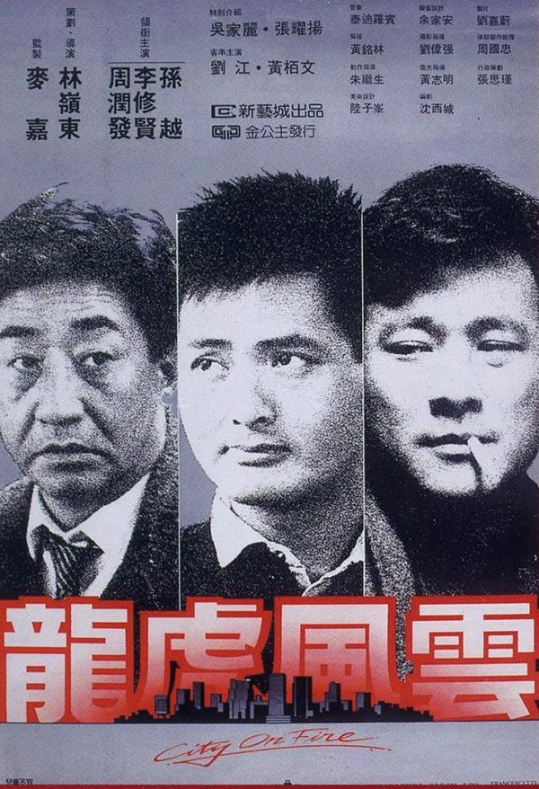

---

## 婉君

[2026-09-13 21:02] 来自：综合网盘资源频道

名称：婉君 (1990)

描述：琼瑶《六个梦》系列其中之一。

婉君(金铭 饰)7岁那年被卖到周家给大儿子伯健当冲喜新娘，由于彼时大家年岁尚小，并没有说穿，婉君与病弱的伯健、骄傲自负的仲康、以及最小最淘气的叔豪天天耳鬓厮磨，一起闹事被大人教训，童年嘻嘻哈哈的时光过去。转眼婉君(俞小凡 饰)已经十六岁，到了应该成亲圆房的时候。然而三个少年此时对婉君都怀着深深的爱情，三个人都前后来逼问她最爱的人是谁，婉君深怕伤害任何一个人，不愿作答。然而事情又走向另一个极端：伯健不愿强人所难，仲康又放不下自己的自尊，叔豪认为自己根本没资格争取。人人都陷入自己的挣扎中，周家的大人看着三个儿子备受煎熬，终于爆发。

📁 大小：AA

🏷 标签：#剧情 #喜剧 #爱情 #儿童 #婉君 #quark

---

## 死神来了2

[2026-09-13 20:58] 来自：综合网盘资源频道

名称：死神来了2 Final Destination 2 (2003)

描述：少女金伯莉(A.J. Cook 饰)与好友驱车去郊外游玩，途中她预见一场严重的连环交通事故，而自己和朋友也将命丧其中。猛然惊醒的金伯莉将车横在路中央，阻挡了后面的车辆。然而车祸仍然发生，金伯莉侥幸逃过一劫，另有六人从灾难中逃生。这奇异的经历让众人想起180号航班幸存者的故事。

📁 大小：NG

🏷 标签：#惊悚 #恐怖 #死神来了2 #quark #ali

---

## 富贵逼人来

[2026-09-13 20:57] 来自：综合网盘资源频道

名称：富贵逼人来 Being There (1979)

描述：畅斯(彼得·塞勒斯 Peter Sellers饰)，一位头脑简单的老园丁。他一直生活在华盛顿的一间老房子里，从未离开过。他全部的生活就是看电视，看电视成了他唯一与外界沟通的途径。在长期的累积之下，他的整个思想行为和世界观已完全电视化。然而他的雇主突然去世，畅斯一下子变得无处可去，孤苦无依。面对陌生而又新鲜的世界，他顿时乱了方寸。在一场突如其来的车祸后，畅斯居然成为富有的华盛顿商人伊芙(雪莉·麦克雷恩 Shirley MacLaine饰)和本(茂文·道格拉斯 Melvyn Douglas饰)的座上宾。他凭借在电视上学来的“广博”知识，技惊四座，甚至当上了政客们倚重的智囊。

📁 大小：AA

🏷 标签：#剧情 #喜剧 #富贵逼人来 #quark

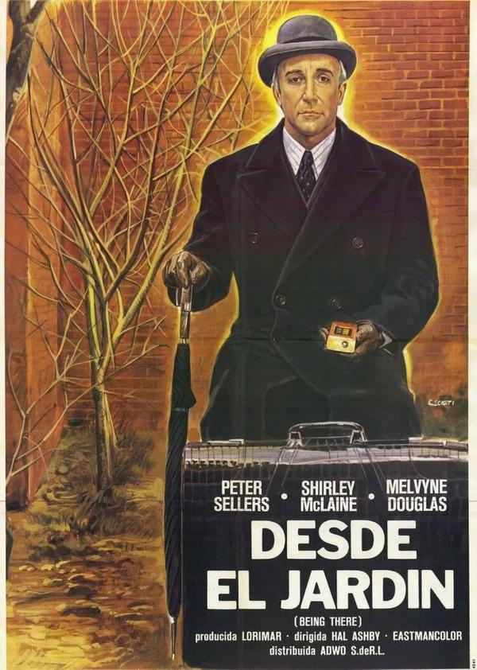

---

## 公仆

[2026-09-13 20:53] 来自：综合网盘资源频道

名称：公仆 公僕 (1984)

描述：阿B(李修贤 饰)是和母亲同住狭小老旧公寓的便衣刑警，他为人热血办案手法大胆，令新报道的同事阿杰(艾迪 饰)大开眼界。阿杰与阿B性格迥异，一心只想通过考试晋升警官。阿B压制分别住在山上村和山下村的两位大佬小黑与红番，并通过红番手下的毒虫小弟阿成(太保 饰)买得多个线报，阿B获悉犯罪信息立下功劳，令阿杰亦得到嘉奖，二人友谊日盛一日。不久，阿成因毒瘾反复发作，犯下大错，被小黑和红番连番毒打，终至丧命，阿B调查阿成死因，追查小黑，不料却引发意外，将自己逼上绝路，而小黑也只得选择铤而走险，警匪都再别无选择…

📁 大小：AA

🏷 标签：#剧情 #公仆 #公僕 #quark

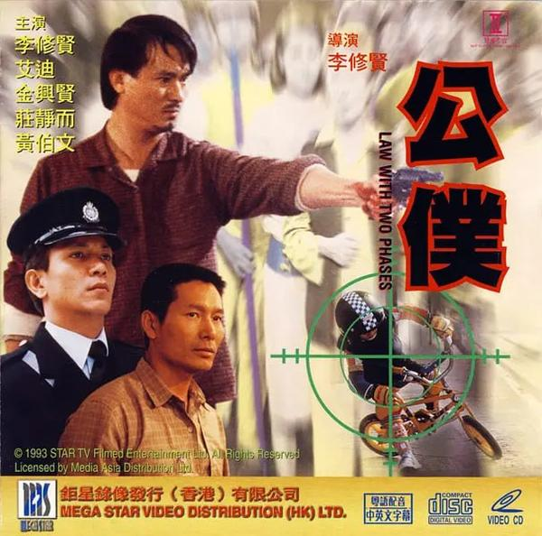

---

## 男朋友

[2026-09-13 20:50] 来自：肯德基の4K影视综合电影云盘站

名称：男朋友(2018)【16集全】【1080p.高码率】【国韩双语】【内嵌繁中】【宋慧乔/朴宝剑】

描述：一次也没能按照自己选择的人生而活的酒店代表车秀贤(宋慧乔饰) 与拥有自由明朗灵魂、将平凡生活过得幸福且珍惜的金振赫(朴宝剑饰) 在一次偶然的相遇之后开始的令人心动的浪漫爱情剧。

夸克网盘：https://pan.quark.cn/s/ec21357823ec

📁 大小：61.9GB

🏷 标签：#历史 #男朋友 #1080p #高码率 #国韩双语 #内嵌繁中

---

## 画魂

[2026-09-13 20:36] 来自：综合网盘资源频道

名称：画魂 (1994)

描述：民初女画家潘玉良的传奇一生。

潘玉良原是江南的妓女出身,对绘画独有天分，却无人赏识。

一次机缘让她认识了芜湖海关盐业总监潘赞化(尔东升饰)，随即被纳为妾。她随潘赞化到了上海,因为见她喜欢绘画，潘赞化介绍了专业老师让她学习，从此开始了学画的学生生活。

其后由于潘赞化的正室的介入让原本感情很好的二人渐渐产生了矛盾。她于是留学巴黎,渐渐成为国际著名的画家。上海美术学院校长刘海粟观念开明,请她回国任教,不料学风开放的欧洲与国内艺术界的情形大相径庭。一心为艺术的潘玉良被保守的知识分子们指责为“妓女艺术家”，抨击与阻碍她教授的人体画艺术..

📁 大小：AA

🏷 标签：#剧情 #爱情 #传记 #画魂 #quark

---

## 不要和陌生人说话

[2026-09-13 20:32] 来自：肯德基の4K影视综合电影云盘站

名称：不要和陌生人说话(2001)【23集全】【优酷最新4K超高清修复版】【内嵌简中】【剧情/家庭】

描述：豆瓣8.3高分

医院外科专家安嘉和(冯远征 饰)是众人眼中一等一的好男人，他的事业一帆风顺，然而他却是一个具有家庭暴力倾向的丈夫。梅湘南(梅婷 饰)是他的第二任妻子，由于她有一段不堪回首的往事难以启齿，不料丈夫却最终起了疑心。家庭暴力的阴影开始在二人之间滋长。恰巧一次家庭暴力行为被对面 楼的邻居叶斗拍了下来，为了不影响自己的前途，安嘉和向叶斗取回底片时，失手将其杀死。自此，安嘉和走上了不归路，不仅家庭暴力在迅速升级，为人也渐渐变得心狠手辣。

：

-

📁 大小：107GB

🏷 标签：#家庭 #不要和陌生人说话 #4K #修复版

---

## 山河故人

[2026-09-13 20:00] 来自：肯德基の4K影视综合电影云盘站

名称：山河故人(2015)【4K.高码率】【内嵌简英】【赵涛/张译】【剧情/家庭】

描述：豆瓣8.1高分

1999年，山西汾阳县城，开朗雀跃的女孩沈涛（赵涛 饰）徘徊在矿工梁子（梁景东 饰）和煤矿老板张晋生（张译 饰）两端。一女二男的三角恋，无法维持长久的平衡。梁子和晋生的友情破裂。涛儿结婚的时节，有人选择远方。 2014年，因长期在煤矿工作，梁子的健康已经到了不可挽回的地步。最后的时光，他带着妻儿回到故乡。此时沈涛和晋生已经离婚，晋生带着孩子到乐常住上海。人届中年，彼此都身不由己站在了生离死别的界限上。 2025年，只会说英文的到乐（董子健 饰）和父亲分外隔膜，但和中文老师米娅（张艾嘉 饰）成为忘年交。他渴望脱离父亲的控制，渴望得到甚至都不知道什么意思的“自由”。

📁 大小：22GB

🏷 标签：#山河故人 #4K #高码率

---

## 野兽家族

[2026-09-13 19:28] 来自：肯德基の4K影视综合电影云盘站

名称：野兽家族 Animal Kingdom (2016) 1080p 原盘REMUX 中文字幕 AVC DTS-HD MA 5.1

描述：该剧讲述少年乔舒亚在母亲去世后，搬去与疏离已久的外婆和几位舅舅共同生活。他很快发现，这个看似亲密的加州家庭实际上长期游走在犯罪边缘。随着乔舒亚逐渐被卷入家族的秘密、利益纠葛与危险行动，他必须在亲情、忠诚和自我救赎之间做出选择。

链接：

📁 大小：X

🏷 标签：#野兽家族 #犯罪 #剧情 #美国 #大卫 #米奇欧德 #艾伦 #巴金 #斯科特 #斯比德曼 #肖恩 #海托西 #芬恩 #科尔 #1080p #原盘REMUX #中文字幕 #DTSHD #xunlei #quark

---

## 新生

[2026-09-13 19:23] 来自：肯德基の4K影视综合电影云盘站

名称：新生 Regeneration (2024) 【10集全】【4K.SDR】【内嵌简中】【井柏然/周依然】【剧情/悬疑】

描述：女记者何珊受邀参加费可的追思会，与她一同到场的还有五位互不相识的陌生人。他们都曾与费可有过密切交集，却发现各自认识的“费可”截然不同。随着众人讲述往事，一个精心编织的骗局与隐藏多年的真相逐渐浮出水面。本剧由申奥执导，井柏然、周依然、王砚辉、黄觉、张艺凡主演。

链接：

📁 大小：N

🏷 标签：#新生 #剧情 #悬疑 #中国大陆 #申奥 #井柏然 #周依然 #王砚辉 #黄觉 #张艺凡 #4K #WEBDL #AAC #baidu #quark #xunlei

---

## 风流断剑小小刀

[2026-09-13 19:08] 来自：综合网盘资源频道

名称：风流断剑小小刀 風流斷劍小小刀 (1979)

描述：大侠段长青(狄龙 饰)在一小镇得遇名妓柳银絮(施思 饰)，柳恳求段杀死现以“神医”为名的黑道高手郭天胜(谷峰 饰)，为其被哥哥报仇。段联同镇内赌坊护卫高门(傅声 饰)杀入郭家， 正邪两派恶斗连场…

📁 大小：AA

🏷 标签：#剧情 #风流断剑小小刀 #風流斷劍小小刀 #quark

---

## 暗夜与黎明

[2026-09-13 18:36] 来自：综合网盘资源频道

名称：暗夜与黎明 (2024)

描述：讲述了1950年前后，在上海新中国第一代公安战士与蒋介石特务企图颠覆新中国而斗争的故事，故事围绕一位拥有高智商但在旧社会并不得志、在新中国得到自新并成长的旧时期小警察与一位经验丰富的中共老特工联手搭档展开。

📁 大小：AA

🏷 标签：#剧情 #悬疑 #暗夜与黎明 #quark

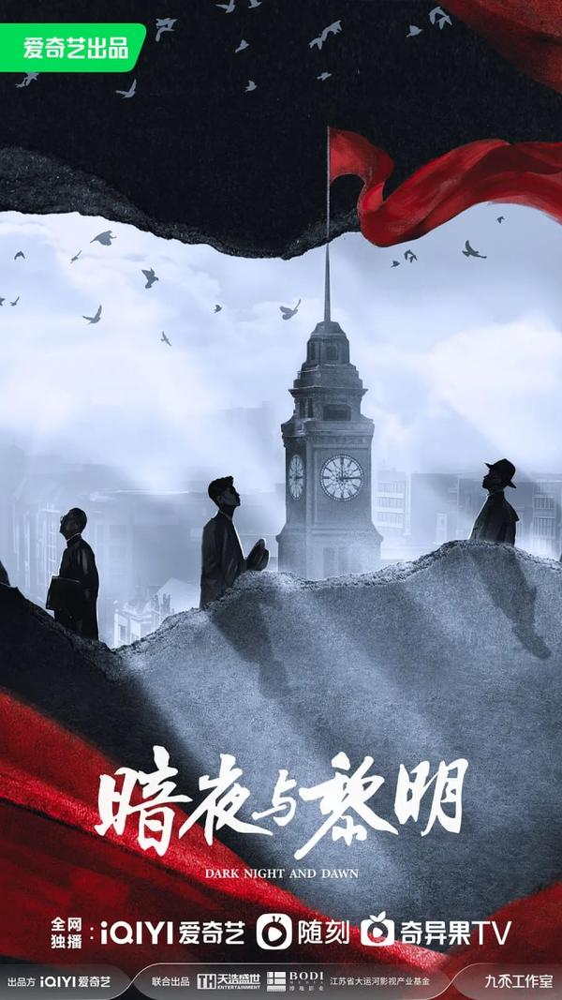

---

## 羔羊游戏

[2026-09-13 18:33] 来自：综合网盘资源频道

名称：羔羊游戏 (2023)

描述：故事发生在1996年之前的香港，女主雪莉在自己的婚礼现场遭遇劫匪挟持，并目睹丈夫死于匪徒枪下。无法走出阴霾的她现于一家射箭馆任职。台风之夜，她意外滞留楼内，目击同一帮匪徒在大厦内杀人，她也不慎暴露了自己的踪迹，在惊惶不安的逃亡过程中，她意外遇到了同为滞留者的盲眼老人南哥，两人一边抵抗匪徒的无情追杀，一边设法逃离这栋噩梦般的大厦。然而穷凶极恶的匪徒竟要杀人灭口，雪莉与南哥在信号中断、出口全部被封的大楼内，苦苦找寻着活下去的办法……

📁 大小：AA

🏷 标签：#剧情 #羔羊游戏 #quark

---

## 名不虚传

[2026-09-13 18:30] 来自：综合网盘资源频道

名称：名不虚传 명불허전 (2017)

描述：金南佶将在剧中饰演医术高明的朝鲜男人许林(音译)，个高、帅气，对任何事都悠悠哉哉很随性。金雅中将出演外表冷酷、内心带着伤痕和秘密的首尔女性崔延京(音译)，是某医院胸外科医生，外貌靓丽、妆容精致，有着像模特一样的身材，但说话豪放、表情冷酷。是在医学院就读期间连续6年拿第一的“行走的医学书”。

该片讲述公认的朝鲜第一针灸师许林因为出生贫贱而四处碰壁，因此失去初心。之后，他来到400年后的未来，即2017年的首尔，遇到了现代医学的信奉者、性格豪放的崔延京后发生的故事。这是一部融合了现代医学和传统韩医学，在魅力的历史长流中以实际存在的人物为主人公的首部男女主往返双穿越剧(男主穿去现代，女主穿去古代)

📁 大小：AA

🏷 标签：#剧情 #奇幻 #名不虚传 #quark

---

## 河豚

[2026-09-13 18:28] 来自：综合网盘资源频道

名称：河豚 (2021)

描述：南方某市法院开庭审理了一起毒杀案，被告人蒋漫枝(钟欣潼 饰)涉嫌用河豚毒素杀害其丈夫柳慕阳(张睿 饰)。辩护人栾珠(蒙亭宜 饰)坚称柳慕阳是自己误食了毒酸奶而非预谋杀害，此时另一条线索表明，八年前的一起强奸案，被害人就是如今的蒋漫枝，而强奸犯许一城竟然和被害者柳慕阳长得一模一样，千丝万缕的联系预示着这两起案件远没有那么简单。蒋漫枝为何会爱上曾性侵过自己的人，她又为何会再次痛下杀手？

📁 大小：AA

🏷 标签：#剧情 #河豚 #quark

---

## 外来妹

[2026-09-13 18:22] 来自：综合网盘资源频道

名称：外来妹 (1991)

描述：大陆改革开放初期，优先发展的广东一带是内陆许多省市年轻人眼中的天堂，北方某省名叫赵家坳的小山村就有赵小云(陈小艺)、志强等六名青年男女怀着梦想来到广东，他们希望通过打工改变自己的命运。其时纺织、玩具制造等产业是广东的发展支柱，心细手快的打工妹远比笨手拙脚的打工仔吃香，赵小云等几个姑娘很快进入某厂成为“外来妹”，志强等几个男孩则被拒之门外。

外面的世界很精彩，外面的世界很无奈。漫漫打工路令几个情如姐妹的姑娘做出不同的人生抉择：有的经不起金钱考验，走上不归路；有的与当地人结婚，留在了广东；有的感慨金窝银窝好不过自己的狗窝，又回赵家坳……其中故事最为精彩的，当属赵小云：事业上经过波折有很大成就令人感叹，她与香港老板(汤镇宗)的情感纠葛亦扣人心弦

📁 大小：AA

🏷 标签：#剧情 #外来妹 #quark

---

## 精灵变

[2026-09-13 18:18] 来自：综合网盘资源频道

名称：精灵变 精靈變 (1992)

描述：阿直(吴镇宇 饰)和阿车(倪星 饰)是一对好朋友。阿直的职业是殡仪馆的化妆师，因职业的关系从未结交过一个女朋友；阿车在叔叔陈师傅(林正英 饰)的跌打馆里帮忙，本身有点儿小道行，却是个不务正业、玩乐调皮的家伙。阿车欠下黑社会老大贵利雄(黃光亮 饰)一笔钱，为筹措资金绞尽脑汁。偶然机会两人与殡仪馆老板(吴耀汉 饰)打赌，在农历十五月圆之夜引出传说中的芭蕉精。为措资金，二人铤而走险。结果引出的芭蕉精化身为阿直所迷恋的模特Iris(傅丽人 饰)，但他必须在初一将其送回，否则一尸两命，芭蕉精化做青烟，Iris也会魂归黄泉…

📁 大小：AA

🏷 标签：#剧情 #恐怖 #精灵变 #精靈變 #quark

---

## 破墓

[2026-09-13 18:15] 来自：综合网盘资源频道

名称：破墓 파묘 (2024)

描述：在美国生活的某个富裕家庭身上持续发生奇怪的超自然现象，因此他们请来了在巫师之中著名的年轻巫师花林(金高银 饰)和奉吉(李到晛 饰)。

花林和奉吉到达那个地方后救助了刚刚出生的婴儿，明白了他们祖先黑暗的影子正在降临于那家人身上的事实。

花林和奉吉持续调查，为了驱除祖先向最棒的风水师尚德(崔岷植 饰)和入殓师荣根(柳海真 饰)请求帮助。惊讶的是那块墓地在韩国的某个偏僻村庄的阴凉之处被发现，最终进行破墓。但是破墓的同时，坟墓下方的不吉之气开始爆发……

📁 大小：AA

🏷 标签：#剧情 #破墓 #quark

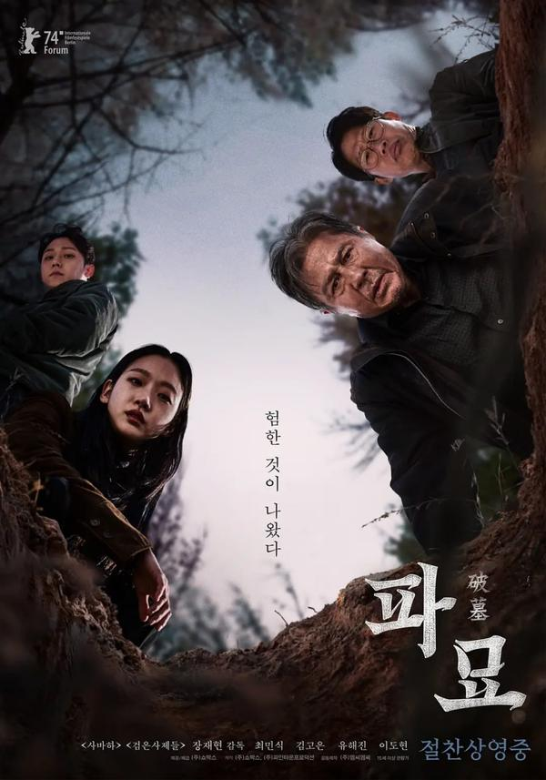

---

## 暗恋桃花源

[2026-09-13 18:10] 来自：综合网盘资源频道

名称：暗恋桃花源 暗戀桃花源 (1992)

描述：某剧场这晚迎来现代爱情悲剧《暗恋》和古装爱情喜剧《桃花源》两个不相干的剧组，因为都与之签定了当晚的彩排合约、又都是演出在即，双方发生争执只为独占唯一的舞台，结果谁都不愿相让只能间隔着排戏。

现代悲剧里，江滨柳(金士杰)和云之凡(林青霞)在上海战乱时生出爱情，无奈一别竟是杳无音信大半生，江滨柳几十年来不间断的寻找云之凡从来无果，耄耋之年身患重病的他拿看似美满的家庭事业比对永藏在心间的对云之凡的单纯爱恋，只觉空落。古装喜剧中，武陵渔夫老陶(李立群)被妻子春花(丁乃筝)戴绿帽，每日受尽她及其情人袁老板(顾宝明)的欺辱，某日借口外出打鱼实为想自杀之时，误入桃花仙境，而春花与袁老板结为夫妻后，过的却是比原来更不堪的日子。

📁 大小：AA

🏷 标签：#剧情 #喜剧 #爱情 #暗恋桃花源 #暗戀桃花源 #quark

---

## 恶魔法官

[2026-09-13 17:51] 来自：综合网盘资源频道

名称：恶魔法官 악마판사 (2021)

描述：《恶魔法官》以全民可通过APP参与是否判刑的近未来为背景，是将法庭打造成真实秀，凄惨地去惩罚恶魔的一位裁判长与好奇他正体的陪审法官执着的追踪剧。讲述互相追逐再追逐，为了发现其正体而选择去破坏，但是在意想不到的状况下互相为对方着迷的两个男人的故事。

《恶魔法官》是通过全民可参与的直播法庭秀投掷正义信息的电视剧，混乱时代下登场的恶魔法官姜耀汉是所有人的英雄？还是戴上法官假面的恶魔？将在2021年法庭电视剧中画上浓墨重彩的一笔，会带来痛快的体裁快感。

朴珍荣将在《恶魔法官》中饰演姜耀汉(池晟饰)的陪审法官金佳温(音)。小时候因为悲剧失去父母，度过了充满愤怒和失落感的青少年时期，在父亲的朋友"街头律师"闵珉镐的帮助下拼命学习并成为了初任法官的金佳温为了报答闵珉镐，开始窃听、调查姜耀汉的过去并接近他。但佳温越接近姜耀汉，越陷入了混乱。 两人将展现出逐渐被对方吸引的魅力，令人充满期待

📁 大小：AA

🏷 标签：#剧情 #犯罪 #恶魔法官 #quark

---

## 警界线

[2026-09-13 17:45] 来自：综合网盘资源频道

名称：警界线 警界線 (2014)

描述：《警界线》由廖启智、林嘉华、唐宁、周俊伟、蒋祖曼及廖安丽等人担纲演出，骆应钧、林利客串参与，全剧共21集，包括1集电视电影，率先于本月中旬正式开拍，电视剧集则留待至10月中旬开拍。今天城市电讯主席王维基先生、行政总裁杜惠冰女士联同创作总监朱镜褀、编审刘小群、总导演苏万聪 率领一众全新班底的演员进行开镜拜神仪式，为新剧《警界线》造势，王维基先生更用真枪为剧集开出第一炮，寓意新剧将一鸣惊人，让观众耳目一新。此剧于2013年6月14日晚上在网上播出第一集。

📁 大小：AA

🏷 标签：#剧情 #犯罪 #警界线 #警界線 #quark

---

## 东京电梯小姐

[2026-09-13 17:32] 来自：综合网盘资源频道

名称：东京电梯小姐 東京エレベーターガール (1992)

描述：泽木总莎(宫泽理惠 饰)、田野尚子(奥山佳惠 饰)和水木薰(中岛朋子 饰)在同一家百货公司工作，除了薰是服务员外，泽木与田野均是电梯小姐，三位个性迥异的职业女性将如何面对生命里波涛暗涌的情感漩涡呢？

个性独立坚强的泽木同时吸引了岛先生(岛大辅 饰)和吉本先生(赤井英和 饰)两位十分优秀的男士，而泽木亦徘徊在两人之间无法找到最终的归宿。田野则遇见了一个令她心动的男孩，巧合的是，这个男孩居然是泽木曾经的青梅竹马。薰则陷入了与前野课长(佐野史郎 饰)的不伦之恋中无法自拔，故事的最终，这三位单纯善良的女孩各自走上了不同的道路

📁 大小：AA

🏷 标签：#剧情 #喜剧 #爱情 #东京电梯小姐 #東京エレヘーターカール #quark

---

## 那山那人那狗

[2026-09-13 16:56] 来自：肯德基の4K影视综合电影云盘站

名称：那山那人那狗(1999)【1080p 原盘REMUX】【内封简中】【剧情/家庭】

描述：豆瓣8.8高分

儿子(刘烨)高考落榜不得已回到大山中的家后，做了大半辈子山村邮递员的父亲(滕汝骏)提前退休，安排儿子接下自己的工作。儿子上班第一天，父亲千叮咛万嘱咐之后仍不放心，带上长年在其左右的忠实老狗决定陪儿子再走一趟送信之旅。起初，父子两人因为长期隔膜只默默走路，渐渐地，通过与不同村民尤其一个漂亮女孩(陈好)的接触，两人渐渐打开话匣，对彼此有了深一层的认识和了解。秀美如画的风景中，儿子慢慢明白了父亲工作的辛苦和意义，父亲也渐渐体会到他二十几年来对家庭的亏欠。

夸克网盘：https://pan.quark.cn/s/ac751c4b1ba2

迅雷网盘：https://pan.xunlei.com/s/VP0pBO_8pYX9sh_PuIlC_ygDA1?pwd=8gne

📁 大小：25.6GB

🏷 标签：#剧情 #家庭 #那山那人那狗 #1080p #原盘REMUX #内封简中

---

## 重案六组

[2026-09-13 16:52] 来自：肯德基の4K影视综合电影云盘站

名称：重案六组(2001)【32集全】【4K.SDR】【内封简中】【剧情/犯罪】

描述：豆瓣8.9高分

重案Ⅵ组成员包括曾克强(李成儒 饰)、季洁(王茜 饰)、江汉(董勇 饰)、白羚(高榕 饰)和黄涛(张林 饰)，前三位在破案一线工作多年，后两位刚跨出警校大门。他们在局长(张潮)指示下，侦破了一起起凶杀、爆炸、投毒、绑架、抢劫、截肢……案件。

夸克网盘：https://pan.quark.cn/s/cc96298203ae

迅雷网盘：https://pan.xunlei.com/s/VP0pBKdBUYN3JcEBwEuM13t6A1?pwd=4dvf

📁 大小：64.1GB

🏷 标签：#剧情 #犯罪 #重案六组 #4K #中文字幕 #AAC

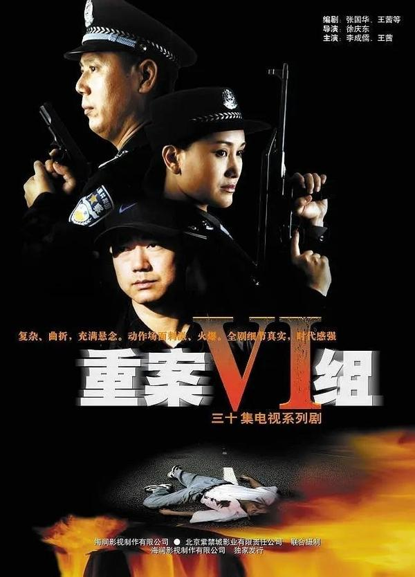

---

## 出入平安

[2026-09-13 16:50] 来自：电影资源频道(4K、REMUXE/原盘)

名称：出入平安 (2024) 4K 高码

描述：即将被处决的死刑犯郑立棍(肖央 饰)在押运途中突遇地震，看守所坍塌成废墟，死里逃生的郑立棍看似获得了突如其来的“自由”，但其实经陷入另一场炼狱之中……与此同时警察尉迟晓(阿云嘎 饰)决定临时组织一支“不一样的”救援队。在天灾面前，死囚选择逃生还是救人？负责看管他的警察又该如何抉择？所有人都站在了命运的岔路口上…… 影片根据真实事件改编。

📁 大小：15.4GB

🏷 标签：#出入平安 #剧情 #家庭 #灾难

---

## 疯子

[2026-09-13 16:43] 来自：电视剧资源频道

名称：疯子 (2018) 4K.HDR 全10集 内封简繁字幕

豆瓣：安妮（艾玛·斯通 Emma Stone 饰）是一名长期被抑郁困扰的女子，复杂而又破碎的家庭关系让她感到精疲力竭。欧文（乔纳·希尔 Jonah Hill 饰）出生于一个庞大的家庭企业之中，作为家里的第五个孩子，他被医生诊断患上了精神分裂症，每一天都处于濒临崩溃的边缘。 詹姆斯博士（贾斯汀·塞洛克斯 Justin Theroux 饰）发明出了一种新药，据说可以治疗人类心智上的一切疑难杂症，目前已经进入了人体实验阶段，这种新药吸引了包括安妮和欧文在内的十名“小白鼠”，他们一起加入了詹姆斯博士的计划之中。詹姆斯博士向受试者承诺，这种药不会带来任何的并发症和副作用，但事实真的如此吗？

📁 大小：51.9GB

🏷 标签：#疯子 #剧情 #喜剧 #科幻 #美剧

---

## 天下第一

[2026-09-13 15:54] 来自：综合网盘资源频道

名称：天下第一 (2005)

描述：段天涯(李亚鹏 饰)，归海一刀(霍建华 饰)，上官海棠(叶璇 饰)，成是非(郭晋安 饰)是护龙山庄的四大密探，各自有着江湖众人无法匹及的绝技，效命于神侯朱无视(刘松仁 饰)。此时因正德皇帝(邓超 饰)痴傻，政局混乱，东厂趁乱把持朝政，迫害忠良。权倾朝野的东厂太监总管曹正淳(李建义 饰)更是仗势欺人，处处与护龙山庄为敌。正在四人深陷于儿女情长和身世经历之时，当前形势急剧恶化，一件又一件命案直指护龙山庄，无形的阴谋笼罩着护龙山庄，神侯更是因为被奸人诬陷锒铛入狱。而神侯此时趁机设局假死，在四大密探联手合作下将曹正淳一伙连根除去。原本以为阴谋就此结束的四人此时却发现，原来皇帝的痴傻实为伪装，而身边最大的阴谋家正是养育他们长大，却窥探皇位二十多年的神侯！

📁 大小：AA

🏷 标签：#剧情 #爱情 #古装 #天下第一 #quark

---

## 警察荣誉

[2026-09-13 15:45] 来自：综合网盘资源频道

名称：警察荣誉 (2022)

描述：故事围绕李大为(张若昀 饰)、夏洁(白鹿 饰)、杨树(徐开骋 饰)、赵继伟(曹璐 饰)四个初出茅庐的见习警员展开，讲述了他们在“警情高发”的平陵市八里河派出所历经各类案件洗礼，并在老警察的言传身教下迅速成长，最终成为合格的人民警察的故事。

📁 大小：AA

🏷 标签：#剧情 #警察荣誉 #quark

---

## 死灵之书

[2026-09-13 15:30] 来自：综合网盘资源频道

名称：死灵之书 Necronomicon (1993)

描述：1，因驾驶失误，富商爱德华(Bruce Payne 饰)的妻子爱玛(Denice D. Lewis 饰)不幸死于车祸，极度伤心和内疚的爱德华通过《死亡之书》的帮助，使爱玛复活。然而事情的发展却出乎他的意料……

2，疯狂科学家迈登博士(David Warner 饰)躲在寒冷的实验室里，潜心进行他的长寿研究。百年的岁月流逝，他和女助手日久生情，然一场突如其来的火灾摧毁了一切……

3，夫妻警察在追捕罪犯时走失，莎拉(Signy Coleman 饰)为寻找丈夫保罗(Obba Babatundé 饰)走入一间布满残肢断体的恐怖房间，她的噩梦从此开始……

本片根据魔幻小说的创始人美国作家霍华德•菲利浦•勒夫卡夫特的作品《死亡之书》中的几则短篇故事改编，并荣获1994年意大利罗马奇幻电影节最佳特效奖、1994年葡萄牙奇幻电影节国际奇幻电影奖最佳特效奖。

📁 大小：AA

🏷 标签：#喜剧 #恐怖 #死灵之书 #quark

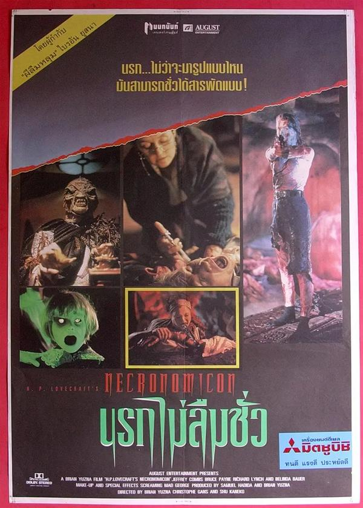

---

## 喘息

[2026-09-13 15:23] 来自：综合网盘资源频道

名称：喘息 阴影入侵 Breathe Into the Shadows (2020) 1080P内嵌中字全12完结

描述：  一个6岁的孩子被一个神秘的蒙面男子绑架，他要求一笔不寻常的赎金。为了救他的女儿，阿维纳什·萨布哈瓦尔博士必须杀人。与此同时，卡比尔·萨旺特的旅程继续在德里犯罪分支的敌对环境中进行。谎言，欺骗和心理游戏开始。

📁 大小：2G＼集

🏷 标签：#印度剧 #喘息 #阴影入侵 #1080P内嵌中字 #全12完结 #baidu #quark #xunlei

---

## 郎君不如意

[2026-09-13 15:09] 来自：综合网盘资源频道

名称：郎君不如意 (2023)

描述：齐葩公主(吴宣仪 饰演)一觉醒来，发现自己被掳到光怪陆离的奇幻世界化兽族，成为了化兽大王奎木狼(陈哲远 饰演)的待嫁王妃的故事。齐葩三番四次逃跑不成，还被一个名叫李雄的男子把生活搅得天翻地覆。奎木狼和李雄，白天和黑夜，齐葩不知自己已经撞破了化兽族的惊天秘密。鬼马精灵的齐葩逐渐走入霸道狼王的心，美女与“野兽”将如何相恋？一段充满爆笑和甜虐的浪漫之旅即将展开。

📁 大小：AA

🏷 标签：#剧情 #喜剧 #爱情 #奇幻 #古装 #郎君不如意 #quark

---

## 假面骑士空我

[2026-09-13 15:00] 来自：肯德基の4K影视综合电影云盘站

名称：假面骑士空我(2001)【49集全】【WEB-DL.1080p】【内嵌简中】【剧情/科幻】

描述：豆瓣9.6高分

公元2000年。在长野山中的九郎岳，正在进行某座神秘遗迹的挖掘工作。当调查团将遗迹中的一具棺木开启时，突然遭到奇异生物的袭击而全数死亡。而在为了查出调查团被杀案件的线索，正在遗迹现场调查中的长野县刑警一条薰面前，有一名青年突然擅自闯入。这名被一条拦下的青年，他自称为冒险家五代雄介。 终于复活的异形生命体在长野近郊出现，并开始对人们恣意袭击，甚至一路冲进警局。在场的雄介感应到从遗迹出土，目前正由警方保管的腰带状遗物所传来的战士形象，在冒险家的直觉下将之着装于腰部。雄介的身体也随之复上一层装甲，变身后的雄介与袭击警局的怪人经过一场苦战后终于将其击倒，从此雄介正式成为战士「空我」，并下定决心为了让周遭的人们免于恐惧，守护他们的笑容而战……

百度网盘：https://pan.baidu.com/s/1ksgkkt8W6cKSBEMlGJJ_7g?pwd=zM50

📁 大小：14.1GB

🏷 标签：#假面骑士 #假面骑士空我 #1080p #科幻

---

## 偷破天际线

[2026-09-13 14:55] 来自：综合网盘资源频道

名称：偷破天际线 Lift (2024)

描述：赛瑞斯·惠特克(凯文·哈特 饰)率领一帮来自世界各地的盗贼潜入一架客机，力图在12000米高空劫走价值5亿美元的黄金。

📁 大小：AA

🏷 标签：#剧情 #喜剧 #惊悚 #犯罪 #偷破天际线 #quark

---

## 我不是精英

[2026-09-13 14:53] 来自：综合网盘资源频道

名称：我不是精英 (2017)

描述：大米和味精，青梅竹马的发小儿，两人偷偷恋爱已经有一段时间了，之所以要瞒着双方父母，是因为身为外企白领的米妈妈一直看不上大专毕业、没个正经工作的韦晶。但随着恋情的曝光，两家的冲突也爆发了。

米妈妈逼着优秀帅气的米阳找一个“高学历、高智商、高情商”的“三高”女友。为了维护爱情，成为米妈妈眼中的精英人士，韦晶决定勇闯“外企”。阴错阳差，进入一家众人梦寐以求的知名外企，仿佛一下子成为人们艳羡的“白领精英”。本来身为优秀刑警的米阳，却因为一次工作失误，被调职到社区当片警。

丑小丫变女神，王子变青蛙！两个人的身份彻底对调，这种落差也让他们的爱情充满考验。两个年轻人一边调试心态，一边努力工作，面对生活中的磨难和工作上的烦恼，他们用爱情给予彼此勇气。面对生活的坎坷，谁都不敢自称“精英”，唯有坚强乐观，才能收获幸福。

📁 大小：AA

🏷 标签：#剧情 #喜剧 #爱情 #我不是精英 #xunlei

---

## 倚天屠龙记

[2026-09-13 14:49] 来自：肯德基の4K影视综合电影云盘站

名称：倚天屠龙记 The Heaven Sword and Dragon Saber (2009) 1080p WEB-DL H264 AAC 2.0

描述：元朝末年，江湖盛传“武林至尊，宝刀屠龙，号令天下，莫敢不从；倚天不出，谁与争锋”。张无忌因机缘练成绝世武功，卷入明教与各大门派的纷争，并与赵敏、周芷若、小昭等人产生错综复杂的情感纠葛。本剧改编自金庸同名小说，由于敏执导，邓超、安以轩、刘竞、张智尧主演。

链接：

📁 大小：N

🏷 标签：#倚天屠龙记 #剧情 #动作 #武侠 #古装 #中国大陆 #于敏 #邓超 #安以轩 #刘竞 #张智尧 #1080p #quark #baidu

---

## 高地战

[2026-09-13 14:47] 来自：肯德基の4K影视综合电影云盘站

名称：高地战(2011)【1080p 原盘REMUX】【内封简繁英】【剧情/战争】【申河均/高洙】

描述：豆瓣8.5高分

1952年，在板门店谈判中，L高地的归属直接影响到停火线的划定，南北双方为了获得更有利的战果，围绕L高地展开了新一轮血腥的争夺。此时，在前线的韩方鳄鱼中队队长被自己人的手枪击毙，同时北方人民军军人的家信在暗中通过韩方邮路寄送，韩方怀疑高地前线出现内奸，派调查部门的姜恩彪中尉（申河均 饰）陪同新任队长前往鳄鱼中队。此时鳄鱼中队实际掌控在姜恩彪昔日战友金秀赫中尉（高修 饰）以及申日荣上尉手中，姜恩彪惊异的发现曾经书生气十足的金秀赫如今已变成强悍的战士，而表面上军纪涣散的鳄鱼中队在实战中则有着惊人的战斗力。姜恩彪随鳄鱼中队一起经历了拉锯式的高地争夺战，而他终于无意中发现了鳄鱼中队“通敌”的线索……

夸克网盘：https://pan.quark.cn/s/581690fdcd54

百度网盘：https://pan.baidu.com/s/1RzGEauxqb90tzBE0IcMb3A?pwd=Hg9W

📁 大小：24.9GB

🏷 标签：#高地战 #1080p #蓝光原盘 #战争

---

## O记三合会档案

[2026-09-13 14:44] 来自：综合网盘资源频道

名称：O记三合会档案 O記三合會檔案 (1999)

描述：20世纪50年代末60年代初的香港，警匪勾结，乌烟瘴气。其中，九龙城寨更是一个龙蛇盘踞，令人闻风丧胆的混乱所在。

无所事事的小青年阿豪(刘青云 饰)和阿乐(吴镇宇 饰)偶然混迹于此，为这里的乱世气氛所感染，乐不思蜀。他们合伙赌马诈钱，惹来庄家追杀，幸得当时城寨大哥肥宝出 手方保住性命，二人的命运也自此发生转变。阿豪拜入肥宝门下，后与肥宝的小姨子大胆英(彭丹 饰)相恋，他果敢勇猛，风头无两；阿乐当上警察，与曾和阿豪有染的女孩菲菲(朱茵 饰)结婚。为了让虚荣的妻子过上幸福生活，他不惜选择贪污堕落。

两个分处黑白道的好兄弟，携手打拼出一个属于他们自己的天下…

📁 大小：AA

🏷 标签：#动作 #犯罪 #O记三合会档案 #O記三合會檔案 #quark

---

## 传奇大掌柜

[2026-09-13 14:37] 来自：综合网盘资源频道

名称：传奇大掌柜 (2015)

描述：故事发生在1919年，栾学堂(谷智鑫 饰)本是一个命如草芥的小乞丐，流落到北京之后在机缘巧合之下进入了济风楼成为堂倌，之后又因为无意之中得知了掌柜不可告人的秘密而遭到了驱逐。栾学堂命不该绝，在走投无路之际遇见了生命中的贵人，因此创办了丰泽园，开启了自己掌握自己命运的新时代。

丰泽园接收了许多来自济风楼的骨干和伙计，因此引来了济风楼掌柜汪德甫(王刚 饰)和厉秋辰(何冰 饰)的记恨，意图从中作梗。之后，栾学堂迎娶了名为关雅丽(原雨 饰)的女子，而关雅丽却是厉秋辰的心上人。姚珍珍(黄薇 饰)一直喜欢着青梅竹马的栾学堂，在得知他已经娶妻的消息后，心碎的姚珍珍投身到了轰轰烈烈的抗日事业之中。

📁 大小：AA

🏷 标签：#剧情 #传奇大掌柜 #xunlei #quark

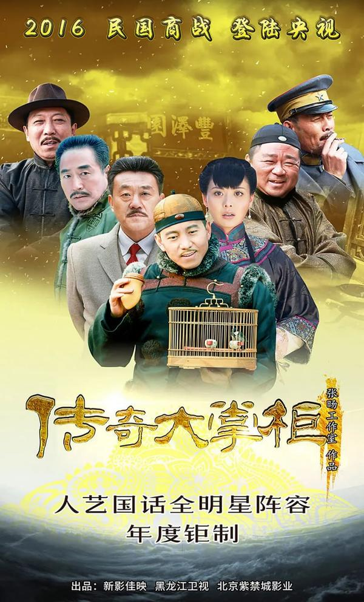

---

## 二号陪审员

[2026-09-13 14:31] 来自：综合网盘资源频道

名称：二号陪审员 Juror #2 (2024)

描述：克林特·伊斯特伍德最后一部导演作品《二号陪审员》，讲述一个谋杀案件陪审团的成员怀疑他自己跟受害者的死有一定关系，陷入了道德困境：是利用陪审员的身份来迷惑他人、保护自己，还是对他正在参与的法律系统自首？

📁 大小：AA

🏷 标签：#剧情 #悬疑 #犯罪 #二号陪审员 #quark

---

## 他来自江湖

[2026-09-13 14:22] 来自：肯德基の4K影视综合电影云盘站

名称：他来自江湖 The Justice of Life (1989) 1080p WEB-DL H264 AAC 2.0

描述：明天曾是叱咤江湖的黑道人物，退出帮派后决心过平凡生活，却因昔日恩怨再度卷入纷争。性格跳脱的何鑫淼闯入他的生活，两人与身边亲友共同经历了一连串阴差阳错、笑中带泪的故事。本剧由刘家豪监制，万梓良、周星驰、吴孟达、恬妞、毛舜筠主演。

链接：

📁 大小：N

🏷 标签：#他来自江湖 #剧情 #喜剧 #中国香港 #刘家豪 #万梓良 #周星驰 #吴孟达 #恬妞 #毛舜筠 #1080p #WEBDL #AAC #baidu #quark

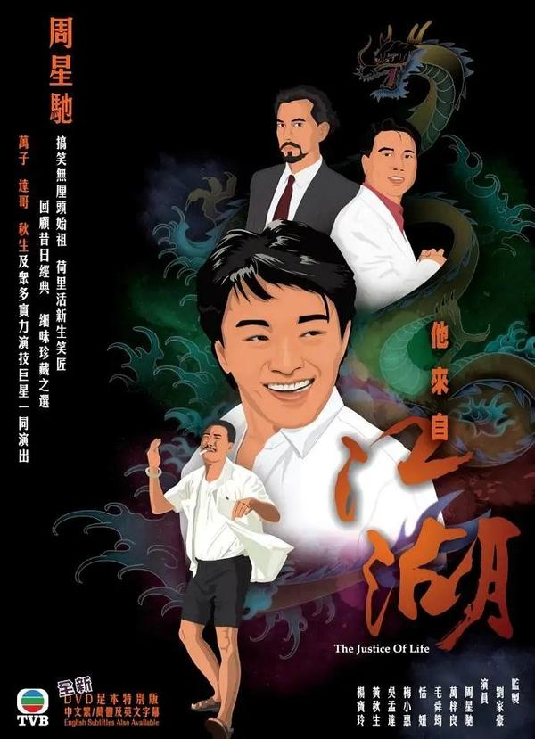

---

## 天空之城

[2026-09-13 14:21] 来自：肯德基の4K影视综合电影云盘站

名称：天空之城 SKY Castle (2018) 1080p WEB-DL 中文字幕 H264 AAC 2.0

描述：在韩国上流社会聚居的“天空之城”，几户精英家庭为了让子女进入顶尖大学，不惜展开激烈的教育竞争。随着神秘升学协调员的介入，隐藏在光鲜生活背后的欲望、秘密与家庭危机逐渐浮出水面。本剧由赵贤卓执导，廉晶雅、李泰兰、尹世雅、吴娜拉、金瑞亨主演。

链接：

📁 大小：N

🏷 标签：#天空之城 #剧情 #家庭 #韩国 #赵贤卓 #廉晶雅 #李泰兰 #尹世雅 #吴娜拉 #金瑞亨 #1080p #WEBDL #中文字幕 #AAC #baidu #quark

---

## 画壁

[2026-09-13 14:20] 来自：肯德基の4K影视综合电影云盘站

名称：画壁 Mural (2011) 1080p H264

描述：书生朱孝廉赴京赶考途中误入壁画中的仙境，邂逅美丽善良的仙女牡丹。这个看似梦幻的世界由冷酷的姑姑统治，严禁仙女与男人相恋。随着朱孝廉等人的到来，仙境中的秩序被打破，一段跨越人间与幻境的情缘由此展开。影片由陈嘉上执导，邓超、孙俪、闫妮、郑爽主演。

链接：

📁 大小：N

🏷 标签：#画壁 #剧情 #爱情 #奇幻 #古装 #中国大陆 #中国香港 #陈嘉上 #邓超 #孙俪 #闫妮 #郑爽 #1080p #baidu

---

## 十面埋伏

[2026-09-13 14:19] 来自：肯德基の4K影视综合电影云盘站

名称：十面埋伏 House of Flying Daggers (2004) 1080p 原盘REMUX 中文字幕 AVC TrueHD 5.1

描述：唐大中十三年，朝廷与反抗组织“飞刀门”的斗争日益激烈。捕快金城与刘捕头设局接近歌舞坊盲女小妹，企图借她找到飞刀门的秘密据点。三人在追捕与逃亡中陷入复杂的情感纠葛，身份与真相也逐渐浮出水面。影片由张艺谋执导，金城武、刘德华、章子怡领衔主演。

链接：

📁 大小：N

🏷 标签：#十面埋伏 #剧情 #武侠 #古装 #中国大陆 #中国香港 #张艺谋 #金城武 #刘德华 #章子怡 #1080p #原盘REMUX #中文字幕 #baidu

---

## 分手大师

[2026-09-13 14:18] 来自：综合网盘资源频道

名称：分手大师 The Breakup Guru (2014) 【4K.高码率】【内嵌简中】【杨幂/邓超】【喜剧/爱情】

描述：梅远贵是一名专门替客户解决情感难题的“分手大师”，凭借各种奇招成功拆散过无数情侣。一次任务中，他受托破坏叶小春的感情，却在斗智斗勇的过程中逐渐对她产生好感。影片由邓超、俞白眉执导，邓超、杨幂领衔主演。

链接：

📁 大小：N

🏷 标签：#分手大师 #喜剧 #爱情 #中国大陆 #邓超 #俞白眉 #杨幂 #4K #WEBDL #AAC #quark #baidu #高码率 #内嵌简中 #xunlei

---

## 共犯

[2026-09-13 12:10] 来自：影视动漫分享|SeedHub|夸克|网盘|🧲

名称：共犯 (2014)

#电影 #犯罪 #惊悚 #剧情 #夸克 #百度

主演: 巫建和 郑开元 邓育凯 

豆瓣: [6.0](https://movie.douban.com/subject/25886498/)

黄立淮（巫建和饰）是一个无论到哪里都独来独往的孤僻少年，叶一凯（郑开元饰）是令老师和家长头疼的问题学生，林永群（邓育凯饰）永远都是考试榜上的头号冠军，三个性格迥异，..

---

## 恶棍天使

[2026-09-13 12:05] 来自：肯德基の4K影视综合电影云盘站

名称：恶棍天使 Devil and Angel (2015) 【4K.高码率】【内嵌简中】【孙俪/邓超】【喜剧/爱情】

描述：查小刀因欠债被恶棍莫非里不断追讨，两人在一次意外中共同求助于专治心理疑难杂症的折耳根神医。性格迥异的二人被迫结伴，在一连串荒诞离奇的经历中逐渐改变彼此。影片由邓超、俞白眉执导，邓超、孙俪领衔主演。

链接：

📁 大小：N

🏷 标签：#恶棍天使 #喜剧 #爱情 #中国大陆 #邓超 #俞白眉 #孙俪 #4K #WEBDL #AAC #quark #baidu

---

## 心花路放

[2026-09-13 11:41] 来自：肯德基の4K影视综合电影云盘站

名称：心花路放(2014)【4K.高码率】【内嵌简英】【喜剧/爱情】【黄渤/徐峥】

描述：二手音响商耿浩（黄渤 饰）婚姻失败，他想用锤子爆小三（李晨 饰）的头，却迟迟没有勇气，幸亏在剧组做制片的兄弟郝义（徐峥 饰）及时发现自暴自弃的耿浩，他决定带着耿浩开启一段“治愈之旅”。于是一对好基友带着一只狗上路，邂逅三千公里的“桃花”。“阿凡达女郎”（陶慧 饰）、“杀马特”周丽娟（周冬雨 饰）、“白富美”（张俪 饰），各式各样的女人接连登场，耿浩一路艳遇一路疗伤。时光倒转，5年前的此时，大龄文艺女青年（袁泉 饰）因为听了一首流浪歌手耿浩的歌，毅然前往大理……在经历一连串奇葩遭遇之后，大家都放下了心里的“阴影”，找到了通向幸福的道路。

百度网盘：https://pan.baidu.com/s/14Uwb4H47hiE3Q_0QnBm0rw?pwd=QCG9

：

📁 大小：12.7GB

🏷 标签：#心花路放 #4K #高码率 #喜剧

---

## 撞车

[2026-09-13 11:23] 来自：肯德基の4K影视综合电影云盘站

名称：撞车(2005)【导演剪辑版】【1080p 原盘REMUX】【国法英音轨】【内封简繁英】

描述：一个黑人电视导演和他的妻子，莫名其妙地因为莫须有的违章驾驶受到了白人警察的侮辱；看似该受到谴责的警察却在最危急关头挽救了那名曾遭他侮辱的黑人妇女；老实巴交的波斯商店店主，却差点谋杀了有着刺青的墨西哥修锁匠；地区检察官和他的妻子被抢吉普车后只能把怨气发泄到无辜的修锁匠身上；黑人警察在承受着上司的威胁和焦急地寻找自己的弟弟。这一切看似无关的琐事，却在36小时内以一种出人意料的方式绞缠在一起，在这个以暴力，性，金钱闻名的多民族、多文化聚集的大城市—洛杉矶街头一幕幕上演。

夸克网盘：https://pan.quark.cn/s/33cc04095da0

百度网盘：https://pan.baidu.com/s/1SsX_YE6-I-it4jX3TLL9GQ?pwd=vkbr

迅雷网盘：https://pan.xunlei.com/s/VP0pAKY3eyQRKzxIZqRMzyVMA1?pwd=zfkp

📁 大小：26.7GB

🏷 标签：#剧情 #撞车 #1080p #原盘REMUX #国英双语

---

## 极恶非道2

[2026-09-13 10:24] 来自：综合网盘资源频道

名称：极恶非道2 (2012) 1080p 原盘REMUX 中文字幕 AVC DTS-HD MA 5.1

描述：自从五年前成功篡位以来，加藤(三浦友和 饰)在石原(加濑亮 饰)的辅佐下带领山王会蹿升为关东最大暴力团，他们以经济利益为主要导向并逐渐将触角伸向政界，一时间风光无限。另一方面，组织内老派干部受到排挤，心存不满；警方敏锐注意到山王会的动向，暗中部署有针对性的坏灭行动；狡猾的片冈刑警(小日向文世 饰)出于自身利益，谋划着以黑制黑的凶险棋局。片冈首先策动山王会干部富田(中尾彬 饰)结交关西头号黑帮组织花菱会，在这一步棋失败后，随即找来了曾被山王会覆灭的村濑组若头木村(中野英雄 饰)以及一度传闻惨死狱中的山王会大友组组长大友(北野武 饰)。两位曾经的仇家既往不咎，势要将布施(神山繁 饰)所统领的花菱会势力带入关东，上演一出两强相碰的黑帮大火并。 无仁义的战争，扑朔迷离…

📁 大小：32.3GB

🏷 标签：#动作 #犯罪 #极恶非道2 #1080p #原盘REMUX #中文字幕 #DTSHD #xunlei

---

## 极恶非道

[2026-09-13 10:23] 来自：综合网盘资源频道

名称：极恶非道 (2010) 1080p 原盘REMUX 中文字幕 AVC DTS-HD MA 5.1

描述：隶属于关东头号黑帮组织山王会的池元组头目(国村隼 饰)曾在监狱与小组织村濑组头目(石桥莲司 饰)结为兄弟。山王会野心勃勃，时刻觊觎村濑的地盘和毒品生意。在山王会若头加藤(三浦友和 饰)的授意下，池元命令麾下的大友组向村濑组发起挑战。大友(北野武 饰)的猛烈攻击和山王会老大(北村总一郎 饰)的毒辣计谋令村濑节节败退，被迫退休，组内的生意也易作他主。 大友组人才辈出，若头水野(椎名桔平 饰)和干部石原(加濑亮 饰)亲自主持在某非洲国家使馆开辟赌场，一时间财源滚滚。然而风云变幻，在早已抛弃了传统仁义道德的黑帮社会，各种阴谋纷纷浮现，大友组风雨飘摇…

📁 大小：28.3GB

🏷 标签：#动作 #犯罪 #极恶非道 #1080p #原盘REMUX #中文字幕 #DTSHD #quark

---

## 精武英雄

[2026-09-13 09:35] 来自：电影资源频道(4K、REMUXE/原盘)

名称：【原盘】精武英雄 (1994) 4K REMUX 杜比视界 国粤多音轨 内封简繁字幕

描述：20年代末，为完成师父的志愿，陈真（李连杰 饰）到东洋学先进技术，他喜欢着日本女孩山田光子（中山忍 饰）。因为师父霍元甲之死，陈真回到中国，协助师父之子霍廷恩（钱小豪 饰）主持精武门的业务，不料却引起了他的妒忌，师兄弟之间引发权力之争。另一方面，陈真追查师父死因，怀疑是日军 军官藤田刚（周比利 饰）暗中使用慢性毒药杀死霍元甲。陈真请医生验尸，证实师父确系中毒而死。藤田刚恐阴谋败露，杀人嫁祸，展开了连场恶斗。不久，藤田刚挑战精武门，他诱使日本黑龙会总教头船越文夫向精武馆挑战。比武之日，双方开展了一场惊心动魄的决战。

📁 大小：72.8GB

🏷 标签：#剧情 #动作 #精武英雄

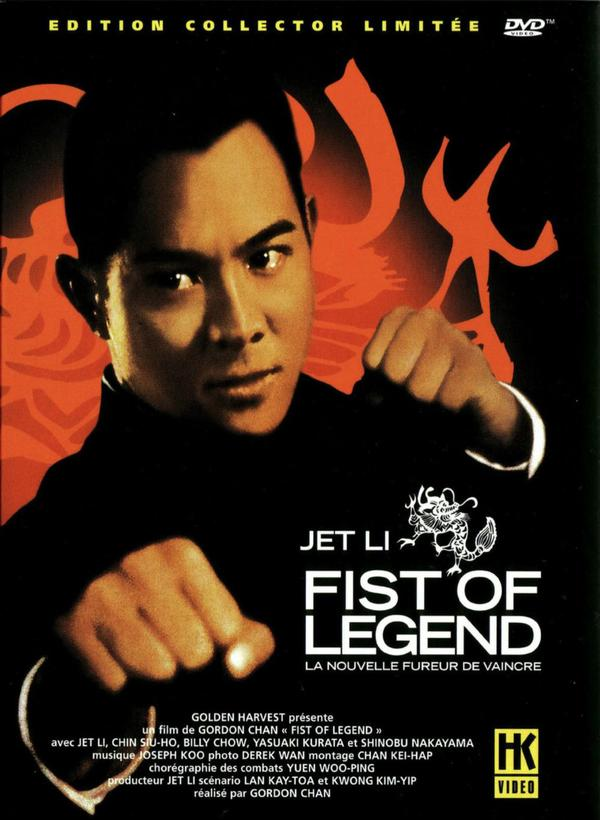

---

## 猎场

[2026-09-13 07:37] 来自：综合网盘资源频道

名称：猎场 (2017) 4K WEB-DL H265 AAC 2.0

描述：郑秋冬在事业受挫后重新起步，投身猎头行业。他在职场竞争、商业伦理与情感纠葛中不断成长，逐渐找回自己的理想与人生方向。

链接：

📁 大小：X

🏷 标签：#猎场 #剧情 #中国大陆 #姜伟 #胡歌 #菅纫姿 #陈龙 #万茜 #4K #WEBDL #AAC #baidu #quark #xunlei

---

## 苏里南

[2026-09-13 07:37] 来自：综合网盘资源频道

名称：苏里南 수리남 / Narco-Saints (2022) 4K WEB-DL 中文字幕 HDR10 H265 DDP 5.1 Atmos

描述：平凡商人姜仁久前往南美苏里南创业，却意外卷入毒枭全耀焕的犯罪网络。为洗清嫌疑并保护家人，他与韩国国情院合作，展开一场危险的卧底行动。

链接：

📁 大小：X

🏷 标签：#苏里南 #剧情 #惊悚 #犯罪 #韩国 #尹钟彬 #河正宇 #黄政民 #朴海秀 #赵祐镇 #4K #WEBDL #中文字幕 #quark #baidu #xunlei

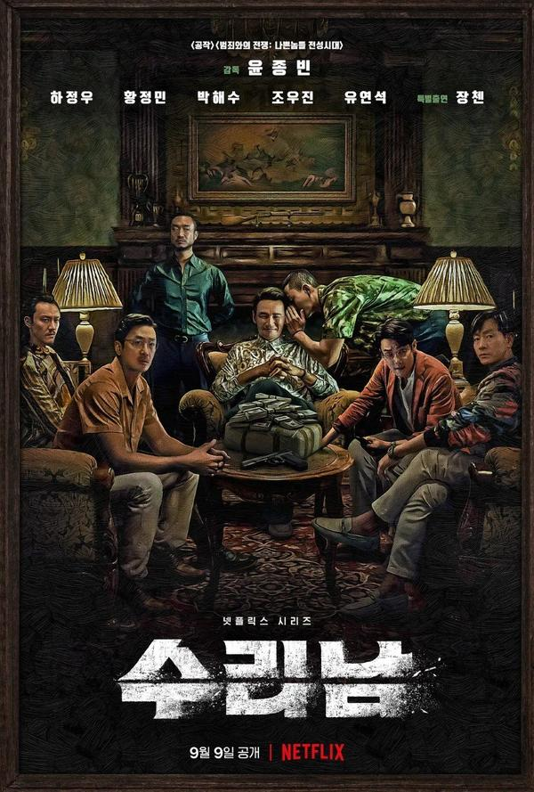

---

## 极恶非道3

[2026-09-13 07:30] 来自：综合网盘资源频道

名称：极恶非道3 アウトレイジ 最終章 (2017) 1080p 原盘REMUX 中文字幕 AVC DTS-HD MA 5.1

描述：花菱会与山王会的帮派纷争再起，隐居韩国的前黑帮大佬大友也被卷入其中。各方势力为利益与复仇不断角力，一场残酷的终局之战就此展开。

链接：

📁 大小：X

🏷 标签：#极恶非道3 #剧情 #动作 #犯罪 #日本 #北野武 #西田敏行 #大杉涟 #泷正则 #最終章 #1080p #原盘REMUX #中文字幕 #DTSHD #baidu #quark

---

## 成为约翰马尔科维奇

[2026-09-13 07:30] 来自：综合网盘资源频道

名称：成为约翰·马尔科维奇 Being John Malkovich (1999) 1080p 原盘REMUX 中文字幕 AVC DTS-HD MA 5.1

描述：失意木偶师克雷格在办公楼的夹层发现一扇神秘小门，进入后竟能短暂成为演员约翰·马尔科维奇。这个荒诞发现很快引发欲望、爱情与身份认同的连锁失控。

链接：

📁 大小：X

🏷 标签：#成为约翰 #马尔科维奇 #剧情 #喜剧 #奇幻 #美国 #斯派克 #琼斯 #约翰 #库萨克 #卡梅隆 #迪亚兹 #凯瑟琳 #基纳 #1080p #原盘REMUX #中文字幕 #quark #baidu #成为约翰·马尔科维奇

---

## 柏林的女人

[2026-09-13 07:30] 来自：综合网盘资源频道

名称：柏林的女人 Anonyma - Eine Frau in Berlin (2008) 1080p 原盘REMUX 中文字幕 AVC DTS-HD MA 5.1

描述：1945年柏林战败后，一名女记者与其他幸存者在废墟中艰难求生。面对战争带来的暴力、饥饿与尊严危机，她以日记记录下那段沉重而真实的经历。

链接：

📁 大小：X

🏷 标签：#柏林的女人 #剧情 #战争 #德国 #波兰 #马克斯 #法贝尔布克 #尼娜 #霍斯 #叶甫盖尼 #西迪欣 #伊尔姆 #赫尔曼 #1080p #原盘REMUX #quark #baidu

---

## 皮囊之下

[2026-09-13 07:30] 来自：综合网盘资源频道

名称：皮囊之下 Under the Skin (2014) 1080p 原盘REMUX 中文字幕 AVC DTS-HD MA 5.1

描述：一名神秘女子驾车穿行于苏格兰街头，以美貌引诱落单男子，将他们带往未知之地。随着与人类接触渐深，她开始对自身的身份与欲望产生动摇。

链接：

📁 大小：X

🏷 标签：#皮囊之下 #科幻 #惊悚 #剧情 #英国 #乔纳森 #格雷泽 #斯嘉丽 #约翰逊 #保罗 #布兰尼根 #杰里米 #麦克威廉斯 #1080p #原盘REMUX #中文字幕 #DTSHD #quark #baidu

---

## 叶问外传张天志

[2026-09-13 07:29] 来自：综合网盘资源频道

名称：叶问外传：张天志 Master Z: Ip Man Legacy (2018) 1080p 原盘REMUX 中文字幕 AVC TrueHD 7.1 Atmos

描述：咏春高手张天志在与叶问一战后选择淡出武林，与儿子相依为命。然而香港街头的黑恶势力再度将他卷入纷争；面对不公与挑衅，他重新站出来，以武止戈，守护心中的正义。

链接：

📁 大小：X

🏷 标签：#叶问外传 #张天志 #动作 #犯罪 #剧情 #中国大陆 #中国香港 #袁和平 #张晋 #戴夫 #巴蒂斯塔 #柳岩 #杨紫琼 #1080p #原盘REMUX #中文字 #quark #baidu

---

## 风中奇缘

[2026-09-13 07:29] 来自：综合网盘资源频道

名称：风中奇缘 (2014) 4K WEB-DL H265 AAC 2.0

描述：西汉初年，狼女莘月在大漠中长大，后随南朝将军卫无忌来到建安。她在陌生的中原历经爱恨与变故，并在卫无忌和儒雅公子莫循之间，展开一段纠葛深刻的情感故事。

链接：

📁 大小：X

🏷 标签：#风中奇缘 #剧情 #古装 #爱情 #中国大陆 #李国立 #刘诗诗 #胡歌 #彭于晏 #陈法拉 #4K #WEBDL #AAC #xunlei #quark #baidu

---

## 陌生的恋人

[2026-09-13 07:29] 来自：综合网盘资源频道

名称：陌生的恋人 (2021) 1080p WEB-DL H264 AAC 2.0

描述：小提琴家罗芊怡在雪崩事故后失去记忆，被霍佑泽救回。她逐渐发现，自己所处的生活与记忆中的一切似乎并不相同；随着真相慢慢浮现，一段关于身份、爱情与救赎的故事也随之展开。

链接：

📁 大小：X

🏷 标签：#陌生的恋人 #剧情 #爱情 #悬疑 #中国大陆 #黄天仁 #宋茜 #欧豪 #张赫 #何杜娟 #1080p #WEBDL #AAC #quark #baidu #xunlei

---

## 面纱

[2026-09-13 07:29] 来自：综合网盘资源频道

名称：面纱 The Painted Veil (2006) 1080p 原盘REMUX 中文字幕 AVC DTS-HD MA 5.1

描述：20世纪20年代，英国医生沃尔特·费恩与妻子基蒂来到中国霍乱肆虐的乡村。面对死亡、疾病与婚姻裂痕，两人在异乡逐渐重新认识彼此，也开始理解爱、责任与奉献的意义。

链接：

📁 大小：X

🏷 标签：#面纱 #剧情 #爱情 #美国 #约翰 #卡兰 #娜奥米 #沃茨 #爱德华 #诺顿 #列维 #施瑞博尔 #黄秋生 #夏雨 #1080p #原盘REMUX #中文字幕 #DTSHD #xunlei #quark

---

## 面纱

[2026-09-13 01:59] 来自：综合网盘资源频道

名称：面纱(2006)【1080p 原盘REMUX】【内封简繁英双语字幕】【剧情/爱情】

描述：豆瓣8.3高分

电影讲述了20年代一对年轻的英国夫妇来到中国乡村生活的故事，在这美丽却凶险的环境中，他们经历了在其英国家乡舒适生活中绝对无法想象和体验的情感波澜，并领悟到了爱与奉献的真谛。

📁 大小：19.5GB

🏷 标签：#爱情 #面纱 #1080p #原盘REMUX #内封简繁英双语字幕 #剧情 #baidu

---

## 寻她

[2026-09-13 01:22] 来自：综合网盘资源频道

名称：寻她(2023)|又名她【舒淇|白客|张本煜】

描述：1995年的岭南，两个即将临盆的孕妇相遇在乡村诊所里。一场猝不及防的暴风雨把两个女婴卷到了池塘里，只救起来了其中一个。陈凤娣(舒淇饰)的女儿就此失踪，拨弄着命运的甘蔗，联结的是血脉之情，一次追寻真相的旅程也拉开了一个女性自我觉醒的帷幕。

📁 大小：1.9GB

🏷 标签：#寻她 #她 #舒淇 #白客 #张本煜 #xunlei

---

## 出入平安

[2026-09-13 00:46] 来自：综合网盘资源频道

名称：出入平安(2024)【4K.HQ.高码率】【内嵌简英】【家庭/灾难】【肖阳/古力娜扎】

描述：即将被处决的死刑犯郑立棍(肖央 饰)在押运途中突遇地震，看守所坍塌成废墟，死里逃生的郑立棍看似获得了突如其来的“自由”，但其实已经陷入另一场炼狱之中……与此同时警察尉迟晓(阿云嘎 饰)决定临时组织一支“不一样的”救援队。在天灾面前，死囚选择逃生还是救人？负责看管他的警察又该如何抉择？所有人都站在了命运的岔路口上……

影片根据真实事件改编。

📁 大小：15.4GB

🏷 标签：#出入平安 #灾难片 #肖阳 #古力娜扎 #4K #高码率 #内嵌简英 #家庭 #xunlei

---

## 极恶非道2

[2026-09-12 23:53] 来自：综合网盘资源频道

名称：极恶非道2 (2012) 1080p 原盘REMUX 中文字幕 AVC DTS-HD MA 5.1

描述：自从五年前成功篡位以来，加藤(三浦友和 饰)在石原(加濑亮 饰)的辅佐下带领山王会蹿升为关东最大暴力团，他们以经济利益为主要导向并逐渐将触角伸向政界，一时间风光无限。另一方面，组织内老派干部受到排挤，心存不满；警方敏锐注意到山王会的动向，暗中部署有针对性的坏灭行动；狡猾的片冈刑警(小日向文世 饰)出于自身利益，谋划着以黑制黑的凶险棋局。片冈首先策动山王会干部富田(中尾彬 饰)结交关西头号黑帮组织花菱会，在这一步棋失败后，随即找来了曾被山王会覆灭的村濑组若头木村(中野英雄 饰)以及一度传闻惨死狱中的山王会大友组组长大友(北野武 饰)。两位曾经的仇家既往不咎，势要将布施(神山繁 饰)所统领的花菱会势力带入关东，上演一出两强相碰的黑帮大火并。 无仁义的战争，扑朔迷离…

📁 大小：32.3GB

🏷 标签：#动作 #犯罪 #极恶非道2 #1080p #原盘REMUX #中文字幕 #DTSHD #baidu

---

## 斗破苍穹

[2026-09-12 22:58] 来自：百度网盘综合频道

名称：斗破苍穹（2017）4K 臻彩 S01E01 - E210

描述：萧炎曾是家族里公认的斗气天才，年仅 11 岁便已经抵达了常人穷尽一生都无法修炼到的境界。可 12 岁那年，一场意外让萧炎的全部努力都化为了乌有，失去一切的他体会到了人情的冷暖和世态的炎凉，之后，萧炎和纳兰嫣然许下了决斗的三年之约，来到魔兽山脉，在身世神秘的药老手下修炼。三年间，萧炎的身影穿梭在塔戈尔大沙漠和加玛帝国黑岩城等地，结识了云芝、小医仙等志同道合的好友，并且最终获得了强大的力量。三年一晃眼就过去了，萧炎毫无悬念的战胜了纳兰嫣然，却没想到，他的故事和劫难才刚刚开始。 剧情发展观看顺序：特别篇 4（缘起篇）- 第一季 - 特别篇 1（邂逅云芝篇）- 第二季 - 特别篇 2（沙之澜歌）- 第三季 - 第四季 - 特别篇 3（三年之约）- 第五季（年番）

百度网盘：https://pan.baidu.com/s/1nvT7BsBpkWXTfiKlJvbqjg?pwd=EMkS

夸克网盘：https://pan.quark.cn/s/39e8cf7d3951 来自：肯德基の4K影视综合电影云盘站 [2026-09-12 22:57] 名称：斗破苍穹（2017）4K 臻彩 S01E01 - E210

📁 大小：117GB

🏷 标签：#Jack #剧情 #斗破苍穹

---

## 前男友狂

[2026-09-12 22:56] 来自：综合网盘资源频道

名称：前男友狂 モトカレマニア (2019)

描述：该剧改编自同名漫画。女主角难波ユリカ(新木优子)和男友分手五年仍对其念念不忘，每天早上都要先上网搜索男友的名字，还妄想与男友对话。转职到地产公司上班的她与前男友マコチ(高良健吾)重逢。成为同事的二人，会发生怎样的故事呢？

📁 大小：AA

🏷 标签：#剧情 #喜剧 #爱情 #前男友狂 #quark

---

## 张铁匠的罗曼史

[2026-09-12 22:30] 来自：综合网盘资源频道

名称：张铁匠的罗曼史 (1982)

描述：故事发生在位于北方山区的农村，打铁的张银锁(侯冠群 饰)和王腊月(王馥荔 饰)彼此相爱，携手步入婚姻的殿堂，并且很快就有了一个可爱的儿子，不仅如此，张银锁还被提拔成为了公社铁工组组长，可谓是双喜临门。然而树大招风，在铁工组“拔白旗”的运动中，张银锁被诬陷为白旗，怒火攻心的他出手打上了公社的副社长，最终被捕入狱。

张银锁被抓之后，王腊月在哥哥的逼迫之下和他离了婚，之后哥哥又强迫她嫁给夏谋。王腊月誓死不从，带着儿子离家出走，幸运的遇到了名叫刘忍的男子，才总算有了一个可以藏身的庇护所。而出狱之后，张银锁一直没有放弃过寻找自己的妻儿。

📁 大小：AA

🏷 标签：#剧情 #张铁匠的罗曼史 #quark

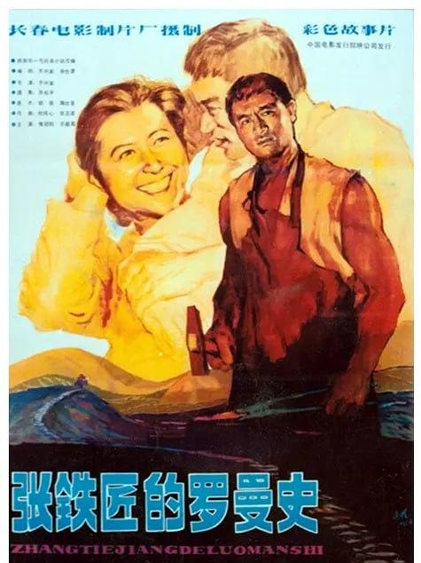

---

## 芝麻胡同

[2026-09-12 22:25] 来自：综合网盘资源频道

名称：芝麻胡同 (2019)

描述：1947年北京沁芳居酱菜铺老板严振声，因为哥哥帮自己去河北买大豆时路遇国军抢劫而死，为尽孝道从小过继给舅舅的严振声，要在妻子林翠卿之外，为亲生父亲俞老爷子再娶一房媳妇，为俞家传宗接代。俞老爷子看上了一心为父亲治病的牧春花，虽然是因为孝道娶妻，严振声和牧春花在接触中两人感情渐深。1950年新婚姻法颁布，严振声和牧春花离婚，在以后几十年的岁月里，严振声、牧春花、林翠卿一家仍然相互扶持，风雨共担

📁 大小：AA

🏷 标签：#剧情 #芝麻胡同 #quark

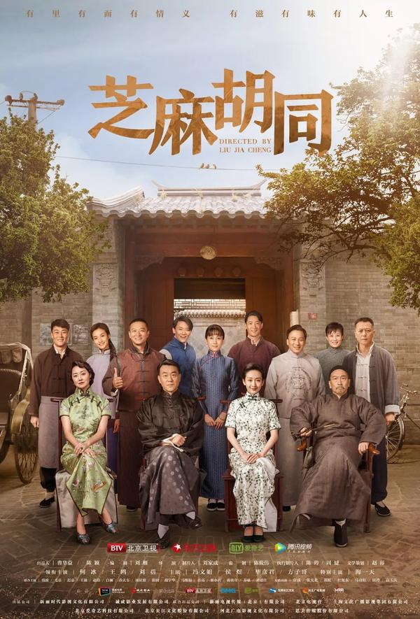

---

## 年会不能停

[2026-09-12 22:23] 来自：综合网盘资源频道

名称：年会不能停！ (2023)

描述：钳工胡建林 (大鹏 饰)在集团裁员之际阴差阳错被调入总部，裹挟在“错调”事件中的人事经理马杰 (白客 饰) 为保饭碗被迫为其隐瞒四处周旋。从“工厂”到“大厂”，从“蓝领”变“金领”，胡建林因与大厂环境格格不入而笑料百出，也像一面“职场照妖镜”照出职场众生相......胡建林为何能在裁员之际一路升职加薪制霸大厂？

📁 大小：NG

🏷 标签：#剧情 #喜剧 #年会不能停 #quark

---

## 撒旦定居点

[2026-09-12 22:23] 来自：综合网盘资源频道

名称：撒旦定居点 Pemukiman Setan (2023)

描述：Alin, seorang perempuan korban trauma kekerasan keluarga dan himpitan ekonomi mengikuti tiga temannya merampok sebuah rumah yang konon menyimpan banyak barang-barang antik yang berharga di perkampungan terpencil.

Tanpa mereka sadari, di rumah itu ada sebuah rahasia terkutuk yang akan mengancam keselamatan jiwa mereka semua.

PEMUKIMAN SETAN tayang Januari 2024.

📁 大小：AA

🏷 标签：#剧情 #动作 #撒旦定居点 #quark

---

## 时时刻刻

[2026-09-12 22:23] 来自：电影资源频道(4K、REMUXE/原盘)

名称：【原盘】时时刻刻 未删减版 (2002) 1080P REMUX 内封简英双语字幕

描述：跨越时空的三个女人，因为一个名字被联系起来----戴罗薇夫人。弗吉妮娅·伍尔芙(妮可·基德曼)，生活在上世纪20年代的伦敦郊区，正在完成她最后一部小说《戴罗薇夫人》。游走在虚构与现实生活边缘的她，承受着巨大的压力与被束缚感，内心甚至渴求着死亡。劳拉·布朗(朱丽安·摩尔)，生活在二战末期的洛杉矶家庭主妇。《戴罗薇夫人》引起她不断追问自己，什么才是更有意义的生活？日复一日的持家生活同样让她萌生自杀的愿望。克拉丽萨·沃甘(梅丽尔·斯特里普)，生活在90年代的纽约，正过着戴罗薇夫人式的生活。她深爱的朋友理查德，才华横溢却因艾滋病难以自理。好心的戴罗薇夫人担当起派对的主人，为每个人带来快乐，却难以化解内心的孤单与忧伤。

📁 大小：30.3GB

🏷 标签：#时时刻刻 未删减版 #剧情

---

## 哗鬼旅行团

[2026-09-12 22:17] 来自：综合网盘资源频道

名称：哗鬼旅行团 嘩鬼旅行團 (1992)

描述：潮州姑娘李嘉玲(吴君如 饰)拥有特异功能，她经常帮助邻里乡亲解决各种疑难问题，在乡村野里颇有名气。某天她被高官以游客的身份派往九龙执行一项秘密任务，她所乘坐的巴士因司机招惹了孤魂野鬼而遭到报复，车毁人亡。鬼魂纷纷钻入死者体内，唯嘉玲一息尚存幸免遇难。众鬼连同嘉玲乘车继续向九龙前进。

计划与嘉玲接头的一眉道长(林正英 饰)路遇众鬼所乘之车，情知不好，尾随跟踪，终与嘉玲接头。道长告诫她和其他旅客下榻的宾馆有鬼，嘉玲始终不信，直到…

📁 大小：AA

🏷 标签：#剧情 #哗鬼旅行团 #嘩鬼旅行團 #quark

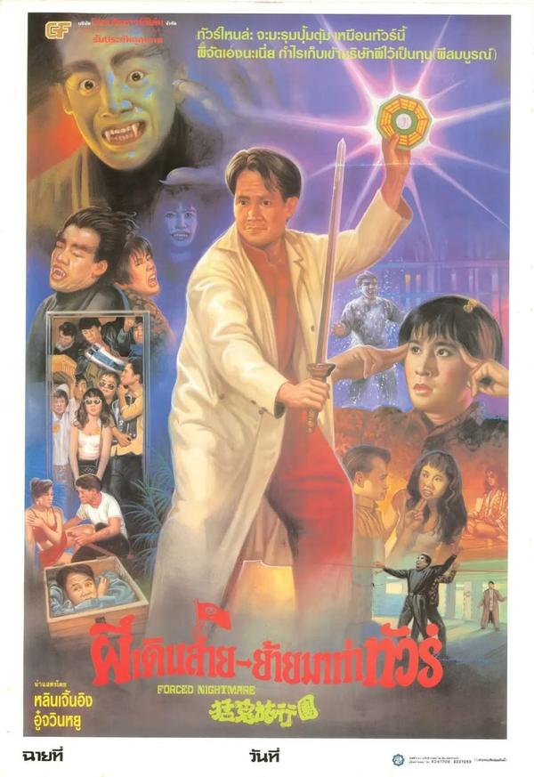

---

## 金融决战

[2026-09-12 22:12] 来自：综合网盘资源频道

名称：金融决战 마스터 (2016)

描述：《MASTER》由《绝密跟踪》导演曹义锡执导，围绕一起韩国建国以来最大规模的诈骗案件展开，讲述智能犯罪搜查队和高智商诈骗团伙之间一场侦查与反侦察的智勇博弈。

最近在《局内人》中展现绝佳演技的李秉宪将再演反派，在片中饰演领导完美作案计划并拥有出色口才的OneNetwork 公司陈会长一角，他是这起大规模网络诈骗案件的幕后操控者。而姜栋元饰演追查案件的智能犯罪搜查队队长金宰明，凭借高智商和无懈可击领导能力，与陈会长展开正面对垒。值得一提的是，这将是姜栋元出道以来首次扮演警察角色。此外，新生代人气男星金宇彬将在片中出演陈会长的头号智囊“朴将军”，是一个聪明绝顶，在警察和陈会长之间活动自如游刃有余的角色。

📁 大小：AA

🏷 标签：#剧情 #金融决战 #quark

---

## 火口的两人

[2026-09-12 22:05] 来自：综合网盘资源频道

名称：火口的两人 火口のふたり (2019)

描述：「当巨大的外在世界崩坏时，人们只能在自己的小世界中寻求生存之道。直子与贤治将自我封闭在两人专属的小世界里，伴随着男女之间自然而然的肉体关系，仿佛被抛入了无法说谎的宇宙之中，当中有着快感，也袒露出人们原本拥有的特质。似乎唯有潜入这个小小宇宙之中，人们才能发挥真正的坚强」─原著作家白石一文

十天后即将迎接婚礼的直子，与重回故乡秋田的往日恋人贤治，久别重逢。直子从为了迎接新生活而整理出来的物品当中，翻出了一本相簿，相簿里是她与贤治一丝不挂地交缠着的黑白照片；往昔顺从着欲望本能共度的青春时光就此苏醒。

「只要今晚就好，让我们回到过去好吗？」在直子未婚夫归来的五天内，在刻画于肉体的愉悦记忆及纠葛的尽头，两人将看到什么风景？结合了震灾背景，包覆在漠然日常之下的浓密性爱，仿佛即将喷发的火山，迸裂出扭曲却纯洁、毅然而绝美的生命岩浆。

📁 大小：AA

🏷 标签：#爱情 #火口的两人 #火口のふたり #xunlei

---

## 五魁

[2026-09-12 22:01] 来自：综合网盘资源频道

名称：五魁 (1994)

描述：一部纯粹表现大陆黄土高原风味的文学电影，由大陆导演黄建新执导，台湾演员张世担纲扮演男主角五魁。全片制作严谨，阐事手法亦颇有味道，可惜片中很多仪式性的场面安排却有着《大红灯笼高高挂》的浓厚影子，使本片的艺术价值打了不少折扣。

📁 大小：AA

🏷 标签：#剧情 #五魁 #quark

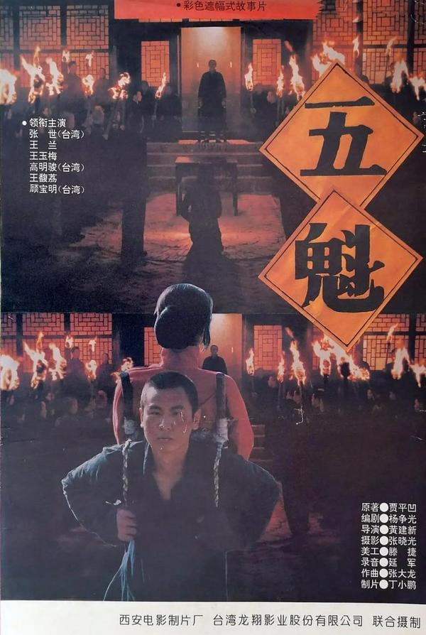

---

## 我与塞尚

[2026-09-12 22:00] 来自：综合网盘资源频道

名称：我与塞尚 Cézanne et moi (2016)

描述：本片刻画了法国文学巨匠埃米尔·左拉和印象派绘画大师塞尚之间著名的决裂。在普罗旺斯如诗如画的乡间，年轻的左拉和塞尚彼此欣赏和启发，共同探讨艺术的真谛，结下了深厚的友谊。随着二人在各自的艺术领域里不断接近自己的理想，现实主义的左拉和浪漫主义的塞尚最终无法继续彼此理解。他们的友谊也走到了尽头。

📁 大小：AA

🏷 标签：#剧情 #传记 #我与塞尚 #quark

---

## 黄金三镖客

[2026-09-12 21:59] 来自：综合网盘资源频道

名称：黄金三镖客 Il buono, il brutto, il cattivo (1966)

描述：故事发生在美国南北战争时期。图科(埃里•瓦拉赫 Eli Wallach 饰)是一个图财害命的江洋大盗，因此他被镇上悬赏通缉。布兰迪(克林特•伊斯特伍德 Clint Eastwood 饰)是一个除暴安良的牛仔，他无意中抓住了图科，但嫌赏金不够又掳走了他。在荒漠中，布兰迪惩罚图科让其自生自灭。但是诡诈的图科居然逃过了一劫，并纠集一些帮凶在客栈捉住了布兰迪。

📁 大小：NG

🏷 标签：#西部 #冒险 #黄金三镖客 #quark #ali

---

## 五郎八卦棍

[2026-09-12 21:58] 来自：综合网盘资源频道

名称：五郎八卦棍 (1984)

描述：北宋年间，杨家将出战金沙滩，佘太君求得“七子去六子还”的签语，心中忐忑。国丈潘美因杨七郎打死自己儿子，使计陷害杨家将，令杨家一门忠烈在金沙滩的对辽战事中几乎俱折，唯有杨五郎(刘家辉 饰)负伤逃脱、杨六郎(傅声 饰)发狂返回天波府。潘美为斩草树根，引辽兵入宋，暗中将天波府团团围住，以防杨家将面见皇帝伸冤。杨五郎得悉皇帝下诏斥自己为叛徒，心感走投无路，经一义士以命相劝，遂远上五台山清凉寺请求出家，方丈因其杀性未伏，不予接纳，杨五郎强驻寺中，并化杨家枪法为棍法，潜心修炼。不久，天波府因僧人报信，派出杨八妹(惠英红 饰)赴五台山接杨五郎，沿途潘美步步紧逼，令杨五郎下山救妹复仇

📁 大小：AA

🏷 标签：#剧情 #动作 #古装 #武侠 #五郎八卦棍 #quark

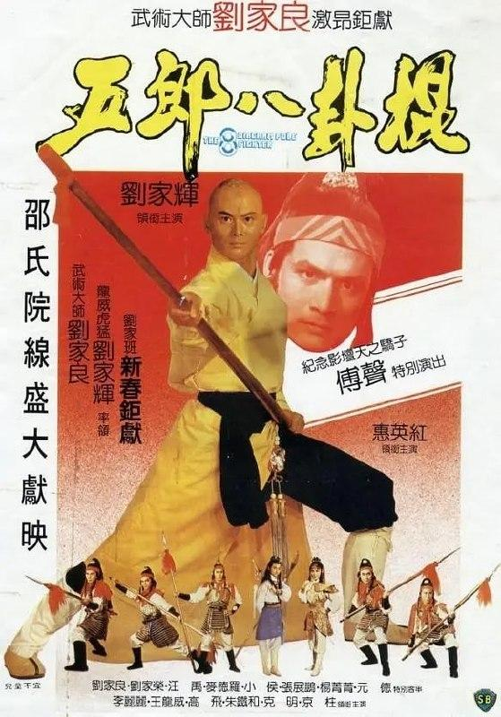

---

## 风流家族

[2026-09-12 21:55] 来自：综合网盘资源频道

名称：风流家族 風流家族 (1992)

描述：讲述老汤吃著碗裏的肉，看著锅裏的肉，最後碗裏的肉发现了锅裏的肉，一场荒唐的肉战即将上演......

📁 大小：AA

🏷 标签：#剧情 #动作 #风流家族 #風流家族 #xunlei

---

## 父与子

[2026-09-12 21:53] 来自：综合网盘资源频道

名称：父与子 Отец и сын (2003)

描述：本片讲述了一对父子之间朦胧迷离的感情。阿列克谢(阿里克谢·尼穆斯霍夫 Aleksei Nejmyshev 饰)的父亲(安德烈·薛提宁 Andrei Shchetinin 饰)是一个退伍军人，父子二人相依为命，父亲离不开儿子，儿子也非常依赖父亲。因为父亲的关系，阿列克 谢也进入了军校，他的父亲经常到军校探视他。某日，阿列克谢的女朋友来到军校向他提出分手，原因似乎就是她难以接受他们父子俩过于亲密的关系。阿列克谢常常做噩梦，醒来后他问母亲在哪里，父亲却无言以对。父亲表示，外地有一份更加高薪的工作等着他，但是父子二人谁也离不开谁。

他们是父子，有些时候他们像兄弟，有些时候他们像情人。但是他们心里都清楚，终有一天他们会分开，父子俩该何去何从

📁 大小：AA

🏷 标签：#剧情 #父与子 #quark

---

## 江湖女间谍

[2026-09-12 21:51] 来自：综合网盘资源频道

名称：江湖女间谍 Viva María! (1965)

描述：本片模仿美国西部片，任用当时法国影坛两大性感女星芭铎和莫罗。她们扮演两个江湖女侠，取代美国西部片的牛仔角色，专门在拉丁美洲行侠仗义，打抱不平。其中玛丽娅是在拉美进行无政府主义革命运动的爱尔兰政客的女儿，她在父亲被杀后，在马戏团偶遇另一个也叫玛丽娅的女郎。她们结下深厚友谊并目睹拉美人民的贫困和肆虐的暴力，决定利用自己的聪明天赋来协助革命运动。

📁 大小：AA

🏷 标签：#剧情 #爱情 #西部 #冒险 #江湖女间谍 #quark

---

## 全民公主

[2026-09-12 21:42] 来自：综合网盘资源频道

名称：全民公主 (2013)

描述：由于父母早逝，周晓瞳(安以轩 饰)是在爷爷周幸(巴戈 饰)精心呵护下成长起来的。长大后，她想找一个真心爱她而不贪图她家产的男人相守一生。因自小被长辈娇纵，晓瞳身上不自觉沾染了公主脾气，在爷爷公司里常常盛气凌人，内部员工很是不满。

📁 大小：NG

🏷 标签：#剧情 #爱情 #全民公主 #quark #ali

---

## 公司职员

[2026-09-12 21:40] 来自：综合网盘资源频道

名称：公司职员 회사원 (2012)

描述：看似平凡的五金制造公司其实是一所铜金属一样冰冷无情的杀人公司。池炯道(苏志燮 饰)虽然整日西服革履，却是该公司业绩卓人的职业杀手。他为公司供职十年，没有一次失手，早已磨练出冷血气质和杀人不眨眼的狠心。但遇到来公司“打工”的新人罗勋(金东俊 饰)时，他突然看到了自己当年的影子。在和罗勋一起执行任务时，炯道有了片刻的恍惚。通过和罗勋的家人交流，他越来越感到亲情的温暖，更在遇到心爱的女人刘美妍(李美妍 饰)时，他的职业敏感发生了变化。在执行一次任务时，因犹豫而导致任务失败，这也让炯道第一次萌生退意，但事情远没有他想象的那样简单。一天之内，他从公司最有前途的职员变为公司的敌人，遭到原同事们追杀的“目标”…

📁 大小：AA

🏷 标签：#剧情 #公司职员 #quark

---

## 奇迹创造者

[2026-09-12 21:28] 来自：综合网盘资源频道

名称：奇迹创造者 The Miracle Worker (1962)

描述：在很小的时候，一场可怕的疾病夺走了少女海伦凯勒(帕蒂·杜克 Patty Duke 饰)的视力、听力和声音，让她坠入了无边无尽的孤独和黑暗之中，看到女儿绝望痛苦的模样，海伦的父母无能为力。随着时间的推移，海伦渐渐长大，不幸的生活让她的性格变得乖张暴戾，犹如一匹无法驯服的野马。

📁 大小：NG

🏷 标签：#剧情 #传记 #奇迹创造者 #quark #ali

---

## 地雷区

[2026-09-12 21:15] 来自：电影资源频道(4K、REMUXE/原盘)

名称：【原盘】地雷区 (2015) 1080P REMUX 内封简中特效字幕

描述：电影改编自真实的历史事件。

故事发生在第二次世界大战结束之后，德国战败，大批被捕的德国士兵成为了俘虏。战争期间，德军曾在丹麦西海岸埋下了超过一百五十万枚地雷，而其中一些被俘虏的年轻德国士兵，则被迫成为了活体地雷探测器。

在丹麦军官卡尔（罗兰德·莫尔 Roland Møller 饰）的带领下，那些尚且只是孩子的俘虏们开始了排雷行动，他们用双手，用双脚，甚至用生命，一步一步的净化着长长的海岸线。然而，当任务结束之后，当幸存的孩子们满心欢喜的以为他们终于逃脱了死神的手掌可以回到故乡之时，等待着他们的，却是另一项同样残酷的任务。

📁 大小：19.6GB

🏷 标签：#地雷区 #剧情 #历史 #战争

---

## 欧洲特快车

[2026-09-12 21:10] 来自：肯德基の4K影视综合电影云盘站

名称：欧洲特快车 Europa / Zentropa (1991) 1080p 原盘REMUX 中文字幕 AVC LPCM 2.0

描述：第二次世界大战结束后，德裔美国青年利奥波德来到被盟军占领的德国，在叔叔的帮助下成为铁路公司的卧铺车厢乘务员。他原本希望以中立和善意面对战后的欧洲，却因爱上铁路公司老板的女儿凯瑟琳娜，被卷入纳粹残余势力、盟军审查与个人情感交织的阴谋。影片由拉斯·冯·提尔执导，让-马克·巴尔、芭芭拉·苏科瓦、乌多·基尔主演，是“欧洲三部曲”的终章。Criterion Collection

链接：

百度网盘：https://pan.baidu.com/s/1BlMr4nBcF80t9U1-DdrqSw?pwd=4hjt

夸克网盘：https://pan.quark.cn/s/fa337817c4e5

大小：X

#欧洲特快车 #Europa #Zentropa #1080p #原盘REMUX #中文字幕 #AVC #LPCM2.0 #百度 #夸克 #剧情 #战争 #惊悚 #丹麦电影 #1991 #拉斯冯提尔 #让马克巴尔 #芭芭拉苏科瓦 #乌多基尔

---

## 登陆之日

[2026-09-12 21:08] 来自：肯德基の4K影视综合电影云盘站

名称：登陆之日 My Way (2011) 1080p 原盘REMUX 中文字幕 AVC DTS-HD MA 5.1

描述：日本殖民朝鲜时期，朝鲜青年金俊植与日本将军之孙长谷川辰雄因马拉松结下宿命般的竞争。二战爆发后，两人被战争裹挟，先后辗转于诺门罕、苏德战场和诺曼底，在不同军队与残酷战火中挣扎求生。曾经势不两立的对手逐渐放下仇恨，在漫长征途中重新理解友情、尊严与梦想。影片由姜帝圭执导，张东健、小田切让、范冰冰主演。韩国电影振兴委员会

链接：

迅雷网盘：https://pan.xunlei.com/s/VP0pA4MN4cbqf3qM1Aexn83qA1?pwd=if34

百度网盘：https://pan.baidu.com/s/12XOJLuSsQXl7lg314OiN8Q?pwd=TWjK

夸克网盘：https://pan.quark.cn/s/a46ebcd2aea7

大小：X

#登陆之日 #MyWay #1080p #原盘REMUX #中文字幕 #AVC #DTSHDMA5.1 #迅雷 #百度 #夸克 #剧情 #战争 #历史 #韩国电影 #2011 #姜帝圭 #张东健 #小田切让 #范冰冰

---

## 创可贴

[2026-09-12 21:07] 来自：肯德基の4K影视综合电影云盘站

名称：创可贴 Love 911 (2012) 1080p 原盘REMUX 中文字幕 AVC DTS-HD MA 5.1

描述：失去妻子的消防员姜一始终无法走出伤痛，因一次救援事故与性格直率的医生美秀相识。美秀最初为了摆脱医疗纠纷而主动接近姜一，两人在一次次争执与共同经历的险境中逐渐理解彼此，也开始治愈各自隐藏的伤口。影片由郑基训执导，高洙、韩孝周主演，以消防救援与医疗工作为背景，讲述一段温暖又催泪的爱情故事。韩国电影振兴委员会

链接：

迅雷网盘：https://pan.xunlei.com/s/VP0p9y4R4wVtjhcVcKZXbQMnA1?pwd=gppd

百度网盘：https://pan.baidu.com/s/1UB7Y3ovc94Pw2_0n60PZUA?pwd=9gmA

夸克网盘：https://pan.quark.cn/s/6fcc397e67e7

📁 大小：X

🏷 标签：

#创可贴 #Love911 #1080p #原盘REMUX #中文字幕 #AVC #DTSHDMA5.1 #迅雷 #百度 #夸克 #爱情 #剧情 #喜剧 #韩国电影 #2012 #高洙 #韩孝周

---

## 谍影重重4

[2026-09-12 21:00] 来自：综合网盘资源频道

名称：谍影重重4 The Bourne Legacy (2012)

描述：杰森·伯恩事件引起连锁反应，踏脚石(Treadstone)计划以及CIA用药物控制强化特工的行径通过报纸公之于众，令其幕后人物坐立不安。为了阻止满盘皆输的局面出现，CIA高层决定中止该计划，并将相关特工人员以及科学家从行动中抹杀。

📁 大小：NG

🏷 标签：#动作 #悬疑 #惊悚 #谍影重重4 #quark #ali

---

## 禁忌之子

[2026-09-12 20:42] 来自：综合网盘资源频道

名称：禁忌之子 The Bastard Son & The Devil Himself (2022)

描述：16岁的内森的母亲是白女巫，父亲却是黑巫师，他自小被严格监管因为他必须抵御来自他父亲血统的破坏欲望，然而他必须在17岁之前做出自己的决定，否则他面临的将会是死亡……

📁 大小：NG

🏷 标签：#剧情 #动作 #奇幻 #冒险 #禁忌之子 #quark #ali

---

## 心花路放

[2026-09-12 20:30] 来自：肯德基の4K影视综合电影云盘站

名称：心花路放 (2014) 4K WEB-DL H265 AAC 2.0

描述：耿浩因婚姻失败陷入痛苦，好友郝义为了帮他走出阴影，拉着他踏上一段一路向南的疯狂旅程。两人在不断邂逅与错过中，上演了一连串荒诞又充满意外的故事。

链接：

夸克网盘：https://pan.quark.cn/s/3dffa7f5a01c

百度网盘：https://pan.baidu.com/s/14Uwb4H47hiE3Q_0QnBm0rw?pwd=QCG9

迅雷网盘：https://pan.xunlei.com/s/VP0pA82heyQRKzxIZqRMzolaA1?pwd=8gdf

📁 大小：X

🏷 标签：#心花路放 #宁浩 #黄渤 #徐峥 #袁泉 #周冬雨 #喜剧 #爱情 #中国大陆 #4K #WEB #DL #H265 #AAC2 #WEBDL #quark #baidu

---

## 女儿的女儿

[2026-09-12 20:29] 来自：综合网盘资源频道

名称：女儿的女儿 女兒的女兒 (2024)

描述：耳顺之年活得悠然自得的金艾霞(张艾嘉 饰)，突被通知在纽约做人工生殖的小女儿(刘奕儿 饰)车祸身亡。在处理后事、对成功胚胎的去留做出抉择的同时，她将面对当年出生即被送养的大女儿Emma(林嘉欣 饰)。做决定的时刻；她，抑或她们，会如何选择？

📁 大小：NG

🏷 标签：#剧情 #女儿的女儿 #女兒的女兒 #quark #ali

---

## 查无此人

[2026-09-12 20:29] 来自：肯德基の4K影视综合电影云盘站

名称：查无此人 No Such Person (2024) 1080p WEB-DL 中文字幕 H264 AAC 2.0

描述：

阳光少女Amber带着爱猫搬进一间劏房，结识了外表亲切的兽医房东Ray。看似普通的出租屋聚集着各怀秘密的租客，背后更隐藏着身份盗窃与非法交易。与此同时，警方在郊野公园发现一具身份无法确认的女尸。随着调查深入，Amber也被拖入一场精心设计的诈骗陷阱，她不愿面对的过去逐渐浮出水面。

链接：

迅雷网盘：https://pan.xunlei.com/s/VP0pA_75AsIHxv6Xuf5cKkKnA1?pwd=qm9p

夸克网盘：https://pan.quark.cn/s/c42342118a1c

百度网盘：https://pan.baidu.com/s/1rk5hEYrKEUH2ALMGlvTzdQ?pwd=xSUM

📁 大小：X

🏷 标签：#查无此人 #NoSuchPerson #1080p #WEB_DL #中文字幕 #H264 #AAC2_0 #电影 #剧情 #悬疑 #惊悚 #犯罪 #香港 #孙立基 #余凯祺 #邹文正 #黄定谦 #陈善渝 #张松枝 #WEBDL #xunlei #quark #baidu

---

## 极度深寒

[2026-09-12 20:28] 来自：综合网盘资源频道

名称：极度深寒 Deep Rising (1998)

描述：一艘豪华的邮轮“阿尔戈号”航行在茫茫的大海之上，船上搭载的除了身价万千的贵妇和富豪外，还有价值无可估量的珍贵货物，然而，在这纸醉金迷的海上生活背后，却隐藏了一个邪恶的阴谋，一群穷凶极恶之徒受到委托，要将这艘邮轮洗劫一空。但是，一种外表可怖的神秘海怪却提前一步袭击了邮轮，富丽堂皇的装潢在霎时间被鲜血淹没。

📁 大小：NG

🏷 标签：#动作 #科幻 #恐怖 #极度深寒 #quark #ali

---

## 极恶非道2

[2026-09-12 20:20] 来自：综合网盘资源频道

名称：极恶非道2 (2012) 1080p 原盘REMUX 中文字幕 AVC DTS-HD MA 5.1

描述：自从五年前成功篡位以来，加藤(三浦友和 饰)在石原(加濑亮 饰)的辅佐下带领山王会蹿升为关东最大暴力团，他们以经济利益为主要导向并逐渐将触角伸向政界，一时间风光无限。另一方面，组织内老派干部受到排挤，心存不满；警方敏锐注意到山王会的动向，暗中部署有针对性的坏灭行动；狡猾的片冈刑警(小日向文世 饰)出于自身利益，谋划着以黑制黑的凶险棋局。片冈首先策动山王会干部富田(中尾彬 饰)结交关西头号黑帮组织花菱会，在这一步棋失败后，随即找来了曾被山王会覆灭的村濑组若头木村(中野英雄 饰)以及一度传闻惨死狱中的山王会大友组组长大友(北野武 饰)。两位曾经的仇家既往不咎，势要将布施(神山繁 饰)所统领的花菱会势力带入关东，上演一出两强相碰的黑帮大火并。 无仁义的战争，扑朔迷离…

📁 大小：32.3GB

🏷 标签：#动作 #犯罪 #极恶非道2 #1080p #原盘REMUX #中文字幕 #DTSHD #quark

---

## 面纱

[2026-09-12 20:13] 来自：综合网盘资源频道

名称：面纱(2006)【1080p 原盘REMUX】【内封简繁英双语字幕】【剧情/爱情】

描述：豆瓣8.3高分

电影讲述了20年代一对年轻的英国夫妇来到中国乡村生活的故事，在这美丽却凶险的环境中，他们经历了在其英国家乡舒适生活中绝对无法想象和体验的情感波澜，并领悟到了爱与奉献的真谛。

📁 大小：19.5GB

🏷 标签：#爱情 #面纱 #1080p #原盘REMUX #内封简繁英双语字幕 #剧情 #quark

---

## 魂断威尼斯

[2026-09-12 19:58] 来自：肯德基の4K影视综合电影云盘站

名称：魂断威尼斯 Death in Venice (1971) 1080p 原盘REMUX 中文字幕 AVC

描述：

事业受挫、身心疲惫的作曲家古斯塔夫·冯·阿申巴赫来到威尼斯休养，在酒店里遇见容貌俊美的波兰少年塔齐奥，并逐渐陷入无法自拔的迷恋。与此同时，霍乱正在城中秘密蔓延，官方为维护旅游业刻意隐瞒疫情。阿申巴赫明知危险逼近，却仍不愿离开，在对青春、美与死亡的凝视中走向生命终点。

链接：

夸克网盘：https://pan.quark.cn/s/df2248dbf4d2

百度网盘：https://pan.baidu.com/s/1yNdLyKgT11gm1b1CQNsURQ?pwd=u95m

📁 大小：X

🏷 标签：#魂断威尼斯 #DeathInVenice #1080p #原盘REMUX #中文字幕 #AVC #电影 #剧情 #文艺 #同性 #文学改编 #意大利 #法国 #卢基诺维斯康蒂 #托马斯曼 #德克博加德 #伯恩安德森 #西尔瓦娜曼加诺 #quark #baidu

---

## 假面骑士空我

[2026-09-12 19:57] 来自：肯德基の4K影视综合电影云盘站

名称：假面骑士空我 Kamen Rider Kuuga (2000) 1080p WEB-DL H264 AAC 2.0

描述：

考古队在九郎岳遗迹中解除古老封印，使以杀人为游戏的怪人族群“古朗基”重新苏醒。热爱冒险、拥有两千种技能的青年五代雄介偶然获得神秘腰带，并变身为战士“空我”。为了守护人们的笑容，他与刑警一条薰并肩作战，在警方协助下不断开发新的战斗形态，对抗日益强大的古朗基。

链接：

迅雷网盘：https://pan.xunlei.com/s/VP0pB3uCSsH9XI9Ojgtwu7T4A1?pwd=pkeb

夸克网盘：https://pan.quark.cn/s/e05a5297ddb0

📁 大小：X

🏷 标签：#假面骑士空我 #KamenRiderKuuga #1080p #WEB_DL #H264 #AAC2_0 #日剧 #特摄 #动作 #科幻 #奇幻 #假面骑士 #日本 #小田切让 #葛山信吾 #村田和美 #千崎若菜 #七森美江 #WEBDL #xunlei #quark #baidu

---

## 绅士们

[2026-09-12 19:56] 来自：肯德基の4K影视综合电影云盘站

名称：绅士们 The Gentlemen (2024) 4K WEB-DL 中文字幕 HDR10 H265 DDP 5.1 Atmos

描述：

英国贵族之子埃迪在父亲去世后意外继承家族庄园，却发现地下隐藏着一个规模庞大的大麻种植基地，并与犯罪集团关系密切。为了摆脱这门危险生意，他不得不与冷静强势的苏茜·格拉斯合作，周旋于黑帮、毒贩和各怀鬼胎的竞争者之间。随着埃迪逐渐适应地下世界的规则，他也展现出出人意料的犯罪天赋。

链接：

夸克网盘：https://pan.quark.cn/s/b417efb8369a

📁 大小：X

🏷 标签：#绅士们 #TheGentlemen #4K #WEB_DL #中文字幕 #HDR10 #H265 #DDP5_1 #Atmos #英剧 #喜剧 #动作 #犯罪 #黑帮 #英国 #美国 #盖里奇 #西奥詹姆斯 #卡雅斯考达里奥 #丹尼尔英格斯 #乔莉理查德森 #维尼琼斯 #WEBDL #quark #baidu

---

## 做工的人

[2026-09-12 19:39] 来自：综合网盘资源频道

名称：做工的人(2020)【6集全】【4K.高码率】【中文字幕】【喜剧/家庭】

描述：豆瓣8.8高分

改编作家林立青同名畅销书，首部大型工地实景拍摄剧集！铁工兄弟阿祈、阿钦和板模工昌仔、怪手阿全，几个怀抱发财梦的好友，在工地里搬演一场又一场荒谬搞笑的发财戏码，这些古怪梦想述说着这群人面对的各种困境。他们发梦、梦破、满腔热血再来一个…..以噗咙共精神在尘土中不败向前。从这块地转那方围篱，帮人做工盖房，却只能望楼兴叹。有着各种人生难题的他们，努力用自己的方式活着，只是再怎么乐观，如果期待的一直事与愿违，还能怎么撑下去？

📁 大小：32.3GB

🏷 标签：#喜剧 #家庭 #做工的人 #4K #高码率 #中文字幕 #xunlei

---

## 恶魔人

[2026-09-12 19:37] 来自：综合网盘资源频道

名称：恶魔人 哭泣之子 (2018) 1080p 原盘REMUX 中文字幕 AVC

描述：随着恶魔觉醒，人类世界陷入混乱。性格温柔的男孩与恶魔合体，在神秘好友飞鸟了的指引下，卷入一场残酷、堕落的对抗邪恶之战。

📁 大小：67.7GB

🏷 标签：#恶魔人 #哭泣之子 #1080p #原盘REMUX #中文字幕 #xunlei

---

## 医是医二是二

[2026-09-12 19:10] 来自：肯德基の4K影视综合电影云盘站

名称：医是医二是二 The Accidental Physicians (2022) 1080p WEB-DL H264 AAC 2.0

描述：

关东门师父带着一群不学无术的徒弟从东北来到江南，本想开设武馆、闯荡江湖，却因一连串阴差阳错把武馆办成了医馆。爱面子又擅长忽悠的大师兄李逍陆带领众人，用半吊子的医术接待各路英雄和江湖怪客，竟屡屡歪打正着，在看病救人的过程中闹出一场场令人啼笑皆非的风波。

链接：

迅雷网盘：https://pan.xunlei.com/s/VP0pBW9Jf9em3klTWsar0PxxA1?pwd=r6wc

夸克网盘：https://pan.quark.cn/s/291e8a665122

📁 大小：X

🏷 标签：#医是医二是二 #TheAccidentalPhysicians #1080p #WEB_DL #H264 #AAC2_0 #国产剧 #喜剧 #古装 #武侠 #中国大陆 #王紫萱 #贾冰 #刘桦 #韩烨洲 #朱天福 #宋宁 #WEBDL #xunlei #quark #baidu

---

## 黑夏

[2026-09-12 17:56] 来自：肯德基の4K影视综合电影云盘站

名称：黑夏 Black Summer (2019) 4K WEB-DL 中文字幕 HDR10 H265 DDP 5.1 Atmos

描述：丧尸灾难突然席卷城市，社会秩序迅速崩溃。与女儿失散的罗丝被迫与一群陌生幸存者结伴，在充满感染者与人性威胁的世界中寻找避难之地。众人必须作出残酷抉择，才能在末日最黑暗的阶段争取一线生机。

链接：

夸克网盘：https://pan.quark.cn/s/56414ff93ca2

迅雷网盘：https://pan.xunlei.com/s/VP0fwwXkSsH9XI9Ojgtp_xh7A1?pwd=n8sg

📁 大小：X

🏷 标签：

#黑夏 #BlackSummer #4K #WEBDL #中文字幕 #HDR10 #H265 #DDP51 #Atmos #杰米金 #贾斯廷楚卡里 #克里斯汀李 #剧情 #动作 #惊悚 #恐怖 #加拿大 #美国 #2019

---

## 七金尸

[2026-09-12 16:43] 来自：综合网盘资源频道

名称：七金尸 The Legend of the 7 Golden Vampires (1974)

描述：邵氏公司和英国咸马公司合作拍摄的这部结合了西方的吸血鬼故事和中国的“湘西赶尸”传说的影片是香港的僵尸片之祖。

在中国湘西，七金尸古庙的大法师借由吸血鬼Dracula的力量使七金尸复活，以便再次控制湘西村落。想不到Dracula却杀了法师，附上他的尸体上回到中国，将七金尸复活。为了解救家乡，Hsi Ching(姜大卫)跟随他的老师星相学家Van Helsing教授及其子还有一位富有的女寡妇Buren太太一起回乡捉僵尸...

这部片子土洋结合，但由于片中揉杂的东西太多，当时的观众接受不了，导致票房惨败。香港电影界在其后的十年都不敢再碰僵尸题材。

📁 大小：AA

🏷 标签：#奇幻 #动作 #七金尸 #quark

---

## 秘密分享者

[2026-09-12 16:22] 来自：综合网盘资源频道

名称：秘密分享者 Secret Sharer (2014)

描述：改编自文学大师康拉德(Joseph Conrad)的经典名著《黑暗之心》，描述年轻船长康拉德，第一次领航就前往神秘的南中国海，但桀骜不驯的中国船员们，却怀疑他和贪心的老板想将船给弄沉骗取保险金，于是百般刁难。趁着停泊在一个不知名的海湾时，船员纷纷跑上岸，此时康拉德竟然在船边发现一个一丝不挂的东方美女，没想到将她救上船后，却发现她被指控为杀人凶手。

本片由奥斯卡最佳外语片得主彼得弗达考斯基导演，并由中外明星：国际女星朱珠，英国小生杰克拉斯基与台湾演员夏靖庭共同出演。

📁 大小：AA

🏷 标签：#爱情 #秘密分享者 #quark

---

## 阿瑜陀耶女王

[2026-09-12 16:17] 来自：综合网盘资源频道

名称：阿瑜陀耶女王 แม่หยัว (2024)

描述：该剧以来自历史上的一位充满野心且有理想抱负的女帝为视角，讲述东方王族的妃子(Mai饰)与西方王族、南方王族以及北方王族的妃子，四大王族的妃子为了阿瑜陀耶王权上演惊心动魄的篡权游戏。

📁 大小：AA

🏷 标签：#剧情 #阿瑜陀耶女王 #quark

---

## 人皮高跟鞋

[2026-09-12 16:10] 来自：综合网盘资源频道

名称：人皮高跟鞋 (1996)

描述：某夜养女秀玲与李氏鞋厂老板二人为钱争吵，无意间秀玲被推倒撞墙而昏，此时一名蒙面人进屋打昏李刚并加以分尸剥皮。隔日秀玲醒后就未见李老板踪迹，有一天李刚的儿子李天佐询问秀玲，为何未见其父的人影，心中一直闷闷不乐，直到有一天天佐至警局报案，说明父亲失踪一事，于是警方展开一连串调查失踪人口。某日大厝正忙著做鞋，毒犯阿南至鞋厂剥皮…

📁 大小：AA

🏷 标签：#恐怖 #人皮高跟鞋 #quark

---

## 甜小姐与冷先生

[2026-09-12 15:41] 来自：综合网盘资源频道

名称：甜小姐与冷先生 (2023)

描述：身兼数职的孟好恬(王子文 饰)在外人看来，是实力与美貌兼备的标准女强人，大家只看到了她从零开始，一路披荆斩棘的创业历程，却鲜少有人了解她惨痛的过往。然而，一场婚礼闹剧，让她与年少有为的灵智集团CTO冷斯明(金瀚 饰)意外结识。同样优秀的两人在经历了一系列意外后，从相互误会到心有灵犀，两颗心越走越近，但随之而来的问题也越发明显。最终两人能否打破年龄及身份差距带来的桎梏。困囿于过往的孟好恬能否重新找回“爱人”的能力。

📁 大小：AA

🏷 标签：#剧情 #爱情 #甜小姐与冷先生 #quark

---

## 凤伊金先达

[2026-09-12 15:31] 来自：综合网盘资源频道

名称：凤伊金先达 봉이 김선달 (2016)

描述：《金先达》是以巧卖大同江水的凤伊金先达的民间传说为内容改编的电影

📁 大小：AA

🏷 标签：#剧情 #凤伊金先达 #quark

---

## 鲸

[2026-09-12 14:52] 来自：肯德基の4K影视综合电影云盘站

名称：鲸 (2022)【4K.REMUX UHD原盘】【HDR10&杜比视界】【内封简繁英双语特效字幕】

描述：达伦·阿伦诺夫斯基将执导、编写新片《庞然大物》(The Whale)，布兰登·费舍(《森林泰山》《木乃伊》《地心历险记》)主演，A24出品。 基于Samuel D. Hunter创作的同名戏剧，讲述在爱达荷州乡村一个破旧的公寓里，重达六百磅的查理隐居避世，固执、坚决地要把自己吃死。随着查理越来越接近不可避免的命运，他的朋友丽兹(一个愤世嫉俗的无神论者护士)和埃尔德·托马斯(一个年轻而有前途的摩门教传教士)都试图在查理身上找到能被拯救的意志，无论是肉体上还是精神上。然而，只有与查理关系疏远的女儿艾莉才能让他看到目前绝望状态之外的未来，艾莉虽然尖酸刻薄、充满仇恨、浑身是刺，查理却能在她身上找到最后一次赎罪的机会，甚至可能是一丝希望。

夸克网盘：https://pan.quark.cn/s/f483a3ff0b83

百度网盘：https://pan.baidu.com/s/1goJHjYkz0bK1lO54RGrFHA?pwd=kgB8

📁 大小：52.3GB

🏷 标签：#同性 #4K #REMUX #UHD原盘 #杜比视界 #内封简繁英双语特效字幕

---

## 三个老枪手

[2026-09-12 14:47] 来自：肯德基の4K影视综合电影云盘站

名称：三个老枪手(2017)【1080p 原盘REMUX】【内封简繁英双语字幕】【喜剧/犯罪】

描述：故事讲述每天到银行确认有没有老人金进帐的3位老人，决定受够这一切，放手一搏、携手抢银行，但他们面临到一个关键问题，他们不太会用枪……

夸克网盘：https://pan.quark.cn/s/90eb1ebc847f

百度网盘：https://pan.baidu.com/s/1w-n7QDWgxWMr77V7R7_g4A?pwd=IqLX

📁 大小：24GB

🏷 标签：#喜剧 #犯罪 #三个老枪手 #1080p #原盘REMUX #内封简繁英双语字幕

---

## 扎职

[2026-09-12 14:44] 来自：肯德基の4K影视综合电影云盘站

名称：扎职 Triad (2012) 1080p 原盘REMUX 中文字幕 AVC DTS-HD MA 7.1

描述：阿霆与阿祥、阿栋自少年时代起便追随江湖大哥耀文，三人情同手足。阿霆凭借胆识在社团中迅速上位，却因此卷入帮派内部的权力争夺与血腥复仇。影片由陈翊恒执导，陈伟霆、卫诗雅、曾国祥、温碧霞、谭耀文主演，展现香港黑帮世界中的欲望、背叛与残酷生存法则。

链接：

夸克网盘：https://pan.quark.cn/s/4d4792e652e1

迅雷网盘：https://pan.xunlei.com/s/VP0fx1EtUJz60D-44J85eEKrA1?pwd=3yqt

📁 大小：X

🏷 标签：

#扎职 #Triad #1080p #原盘REMUX #中文字幕 #AVC #DTSHDMA71 #陈伟霆 #卫诗雅 #曾国祥 #温碧霞 #谭耀文 #动作 #犯罪 #中国香港 #2012

---

## 天衣无缝

[2026-09-12 14:44] 来自：肯德基の4K影视综合电影云盘站

名称：天衣无缝 Spy Hunter (2019) 1080p WEB-DL H264 AAC 2.0

描述：

1931年，革命形势风云激荡，代号“烟缸”的地下党员贵婉在执行任务时遇害。拥有复杂身世的资历平为查明真相来到上海，并与贵翼、资历群等人产生交集。随着调查深入，多重身份、家族恩怨和阵营较量逐渐浮出水面。面对敌人的严密封锁与内部叛徒的威胁，革命者在隐秘战线上展开一场险象环生的生死博弈。

链接：

迅雷网盘：https://pan.xunlei.com/s/VP0fxcVumiSKlMgKSlBIUyEvA1?pwd=p6uz

夸克网盘：https://pan.quark.cn/s/a081bc139ba7

📁 大小：X

🏷 标签：#天衣无缝 #SpyHunter #1080p #WEB_DL #H264 #AAC2_0 #国产剧 #剧情 #悬疑 #谍战 #年代 #中国大陆 #李路 #秦俊杰 #徐璐 #陆毅 #胡海锋 #张芷溪 #WEBDL #xunlei #quark #baidu

---

## 金发梦露

[2026-09-12 14:42] 来自：肯德基の4K影视综合电影云盘站

名称：金发梦露(2022)【4K.DV.HDR】【高码率】【内封简繁英】【杜比全景声】【剧情/传记】

描述：《金发梦露》改编自乔伊思·卡罗尔·奥特兹的畅销小说，大胆地再现了好莱坞最不朽的偶像之一玛丽莲·梦露的生活。从她作为诺玛·简的动荡童年，到她的明星地位和爱情纠葛，《金发梦露》模糊了事实和虚构的界限，探索了她的公众自我和私人自我之间日益扩大的割裂。该片由安德鲁·多米尼克担任编剧和导演，由安娜·德·阿玛斯领衔主演，其他演员阵容包括鲍比·坎纳瓦尔、艾德里安·布洛迪、朱丽安妮·尼科尔森、泽维尔·塞缪尔和埃文·威廉斯。

夸克网盘：https://pan.quark.cn/s/b337e89affba

📁 大小：23.5GB

🏷 标签：#金发梦露 #4K #DV #HDR #高码率 #传记

---

## 包三姑外传

[2026-09-12 13:57] 来自：综合网盘资源频道

名称：包三姑外传 (2010)

描述：朱元璋驾崩，传位其孙建文。燕王朱棣不服，决心整装待发逐鹿天下。但在这之前，他必须拿到一样东西。

包公后人包三姑是个推理迷、办案狂，她从退隐江湖的黑社会老大、爷爷包侵田那里，偷得《包公办案笔记》，私跑到“多一个”县城，开始自己的闯荡江湖生涯。与此同时，前来“多一个”县城上任新官县令的书生，无意中和包三姑拿错包袱，丢失官印。两人结伴前往衙门报案，发现包袱是被女盗贼杨八妹偷走，而杨八妹正女扮男装冒充新县令。原县令雷补头在夫人王六婆的指使下，不但不肯退位，反而横生事端。一时间，误会丛生是非不断。包三姑、杨八妹、王六婆三个女人斗智斗勇，各不相让，从此结下了梁子……

朱棣微服出巡，来到县城，此时各路人马也暗暗涌入。最终在三个女人的帮助下，朱棣拿到自己想要的物件，起兵夺位，坐上龙椅，封包三姑为御妹，书生也顺利当上县令。

📁 大小：AA

🏷 标签：#喜剧 #古装 #包三姑外传 #quark

---

## 山中传奇

[2026-09-12 13:54] 来自：肯德基の4K影视综合电影云盘站

名称：山中传奇 Legend of the Mountain (1979) 1080p 原盘REMUX 中文字幕 AVC

描述：

书生何云青受寺院委托，前往偏远山中古堡抄写能够超度亡魂的经书。途中，他遇见神秘女子乐娘，并在众人的撮合下与她成婚。然而古堡内怪事频发，何云青逐渐发现身边人物身份可疑，乐娘更与一股企图夺取经书的邪恶力量有关。随着幻境、鼓声与鬼魂交织，他被卷入一场正邪对抗的灵异迷局。

链接：

夸克网盘：https://pan.quark.cn/s/2ba624bf8322

迅雷网盘：https://pan.xunlei.com/s/VP0fxyhHUYN3JcEBwEuEe2QTA1?pwd=c9cx

📁 大小：X

🏷 标签：#山中传奇 #LegendOfTheMountain #1080p #原盘REMUX #中文字幕 #AVC #电影 #剧情 #奇幻 #恐怖 #古装 #香港 #胡金铨 #石隽 #徐枫 #张艾嘉 #田丰 #佟林 #quark #baidu

---

## 江湖情

[2026-09-12 13:53] 来自：综合网盘资源频道

名称：江湖情 (1987)

描述：香港早期，大量难民涌入，龙蛇混集。潮州人杨群带年幼的小凤和好友遗孤阿华(刘德华 饰)来港，不料投靠的朋友刚好去世，于是他独自抚养小凤、阿华和亲生儿子良仔。数年后，良仔(万梓良 饰)不学无术，沉迷赌博，结果欠下一笔巨款。阿华为救他被殴打致伤，并引来黑势力大佬的追杀，走投路的他向周(周润发 饰)求救。周因阿华的英勇和义气将他留在身边并委以重任，使阿华继而平步青云；良仔轻佻浮躁，不得周的垂青，却因此对阿华怀恨在心。良仔勾结黑帮大佬杀死了得到周庇护的泰国毒枭(李修贤 饰)，周要杀良仔报仇，后经阿华求情才获生路。但良仔不思悔改反要杀阿华，并策划在周结婚之日大开杀戒…

📁 大小：AA

🏷 标签：#剧情 #动作 #江湖情 #quark

---

## 迎春阁之风波

[2026-09-12 13:52] 来自：肯德基の4K影视综合电影云盘站

名称：迎春阁之风波 The Fate of Lee Khan (1973) 1080p 原盘REMUX 中文字幕 AVC DTS-HD MA 5.1

描述：

元朝末年，反元义士得知蒙古亲王李察罕携带重要军事布防图途经陕西，决定在迎春阁设局夺取情报。客栈老板娘万仁美召集多名身怀绝技的女子暗中接应，各路人马也陆续汇聚于此。面对元军密探的监视与内部奸细的破坏，众义士在真假难辨的身份较量中展开一场惊险激烈的夺图行动。

链接：

夸克网盘：https://pan.quark.cn/s/82e8a4b0db8f

迅雷网盘：https://pan.xunlei.com/s/VP0fxsaomukeBfEeCCnTtajcA1?pwd=cbzj

📁 大小：X

🏷 标签：#迎春阁之风波 #TheFateOfLeeKhan #1080p #原盘REMUX #中文字幕 #AVC #DTS_HDMA5_1 #电影 #剧情 #动作 #悬疑 #武侠 #古装 #香港 #胡金铨 #李丽华 #乔宏 #徐枫 #茅瑛 #田丰 #白鹰 #quark #baidu

---

## 山河故人

[2026-09-12 13:52] 来自：肯德基の4K影视综合电影云盘站

名称：山河故人 Mountains May Depart (2015) 4K WEB-DL H265 AAC 2.0

描述：

1999年的山西汾阳，沈涛在煤矿工人梁子与富商张晋生之间选择了后者，并生下取名“到乐”的儿子。多年后，婚姻破裂、故人远走，亲情也在时代与距离中逐渐疏离。到了2025年，移居澳大利亚的到乐已经不会说中文，对故乡和母亲的记忆日益模糊。影片跨越二十余年，描绘爱情、亲情与故土在时代浪潮中的变迁和失落。

链接：

夸克网盘：https://pan.quark.cn/s/ce76626da646

迅雷网盘：https://pan.xunlei.com/s/VP0fxnNH0GyMUUjZvTRNtd_PA1?pwd=9pgb

📁 大小：X

🏷 标签：#山河故人 #MountainsMayDepart #4K #WEB_DL #H265 #AAC2_0 #电影 #剧情 #家庭 #爱情 #社会 #中国大陆 #法国 #日本 #贾樟柯 #赵涛 #张译 #梁景东 #董子健 #张艾嘉 #WEBDL #quark #baidu

---

## 夜雨秋灯闻诡事

[2026-09-12 12:26] 来自：综合网盘资源频道

名称：夜雨秋灯闻诡事 (2024)

描述：讲述了经历过灾难性创伤来到偏僻东北小山村散心的胡楠，遇到了诡异的姥姥、奇怪的姑娘、摇摆的好友和一件接着一件的离奇故事。他亲眼看见封建迷信、包办婚姻等等的陈规陋俗是怎样害人，他深陷其中，难以抉择，痛苦不已。但当尘封的往事，开始抽丝剥茧一样展现在胡楠面前，跨度长达十几年众生相开始在胡楠的世界中纵横，原来，这是一场精心准备的心理之旅......

📁 大小：AA

🏷 标签：#悬疑 #惊悚 #夜雨秋灯闻诡事 #quark

---

## 百变神偷

[2026-09-12 12:19] 来自：综合网盘资源频道

名称：百变神偷 (1989)

描述：1930年代，上海。神偷包德(淳于珊珊 饰)大名鼎鼎，疾恶如仇，他收养了一批无家可归的孤儿。一日，包德用窃来的伪钞到赌场赚取大把美钞，朱督察(安瑞云 饰)发觉后命巡捕辑拿包德。法庭上，大律师夏炳运(周里京 饰)为包德作无罪辩护，包德得以当庭释放。后夏炳运出任赈灾委员会主席，妄图独吞赈灾款200万元，并栽赃包德，不明就里的法庭判处包德50年徒刑。夏的同伙李三(计春华 饰)趁机骗走包所收养的孤儿，训练他们做小偷。包德幸而被夏的女儿嘉惠(剧雪 饰)相帮逃出牢笼，他救出被骗的孤儿，同时也获取了夏炳运的罪证。夏炳运夫妇荒乱中将赃物扔进了粥锅，包德见状，心生一计.....

📁 大小：AA

🏷 标签：#剧情 #喜剧 #百变神偷 #quark

---

## 一妻两夫

[2026-09-12 12:10] 来自：影视动漫分享|SeedHub|夸克|网盘|🧲

名称：一妻两夫 (1988)

#电影 #喜剧 #夸克

主演: 钟镇涛 陈友 钟楚红 

豆瓣: [6.4](https://movie.douban.com/subject/1919846/)

一直以来，阿信（陈友饰）都希望能够成为一名话剧演员，甚至为了出演著名的古典戏剧《罗密欧与朱丽叶》而放弃了一切，倾家荡产。然而，天不遂人愿，阿信的努力和孤注一掷最终以..

---

## 急先锋

[2026-09-12 12:10] 来自：影视动漫分享|SeedHub|夸克|网盘|🧲

名称：急先锋 (2020)

#电影 #动作 #夸克 #百度

主演: 成龙 杨洋 艾伦 

豆瓣: [4.4](https://movie.douban.com/subject/27195078/)

中国商人秦国立在英国突然遭到雇佣兵组织“北极狼”的绑架，他的女儿弗里达（徐若晗饰）也被卷入其中，面临追杀的危险。危急时刻，急先锋国际安保团队成为唯一的希望。由总指挥..

---

## 九州天空城

[2026-09-12 12:10] 来自：影视动漫分享|SeedHub|夸克|网盘|🧲

名称：九州天空城 (2016)

#电视剧 #古装 #奇幻 #夸克 #迅雷

主演: 张若昀 关晓彤 刘畅 

豆瓣: [6.6](https://movie.douban.com/subject/26611039/)

这是一个人族和羽族共存的世界，两个迥异的种族在经历了漫长的战争之后终于迎来了短暂而又脆弱的和平时期，然而，羽族赖以为生的星流花粉日渐稀少，使得羽族势力日渐孱弱，与此..

---

## 桃花灿烂

[2026-09-12 12:10] 来自：影视动漫分享|SeedHub|夸克|网盘|🧲

名称：桃花灿烂 (2005)

#电影 #剧情 #爱情 #迅雷

主演: 郭晓东 周韵 陈思诚 

豆瓣: [7.1](https://movie.douban.com/subject/1466731/)

故事发生在20世纪70年代的长江两岸。高中生邢子（周韵饰）和在装卸站打工的陆曦（郭晓东饰）朝夕相处，彼此生情。高考复考之际，两人计划一起参加，但陆曦却在考前夜因故退..

---

## 特殊身份的警官

[2026-09-12 12:10] 来自：影视动漫分享|SeedHub|夸克|网盘|🧲

名称：特殊身份的警官 (1982)

#电影 #剧情 #夸克

主演: 赵尔康 杨德智 杨宝河 

豆瓣: [7.6](https://movie.douban.com/subject/3293688/)

1932年，江苏省金凤县。

某夜，被捕的共产党干部汪国池叛变，供出县委凌晨4点会在砖瓦窑开会的情报，听闻，伪警察局局长骆百千（杨德智）与部下王队长（李兰发）及..

---

## 月儿圆

[2026-09-12 12:10] 来自：影视动漫分享|SeedHub|夸克|网盘|🧲

名称：月儿圆 (2023)

#电影 #家庭 #夸克

主演: 周波 李桂莲 

豆瓣: [0](https://movie.douban.com/subject/35941383/)

《月儿圆》取材于热门话题“隔辈教育”，讲述矛盾重重的老青少三代人的冲突故事，表现当代非物质文化遗产“皮影”传承难的现状，现实主义色彩浓厚，反映淳朴本真的小家亲情和坚..

---

## 图兰朵魔咒缘起

[2026-09-12 12:10] 来自：影视动漫分享|SeedHub|夸克|网盘|🧲

名称：图兰朵：魔咒缘起 (2021)

#电影 #奇幻 #爱情 #夸克

主演: 关晓彤 迪伦·斯普罗斯 姜文 

豆瓣: [3.1](https://movie.douban.com/subject/26662331/)

大汗国派兵出征，军队意外带回小国王后（苏菲·玛索饰）祖传的三色镯，一个侵蚀帝国上下的魔咒由此开启。

骄傲的帝王（姜文饰）为解救被魔咒附身的女儿图兰朵（关晓彤饰..

---

## 迷失的心

[2026-09-12 12:10] 来自：影视动漫分享|SeedHub|夸克|网盘|🧲

名称：迷失的心 (2020)

#电影 #剧情 #夸克

主演: 徐僧 王琦 陈有旺 

豆瓣: [0](https://movie.douban.com/subject/33412016/)

上个世纪90年代初，孟树强因父亲患脑溢血暴死，孟树强弟兄仨和母亲相依为命。后来发生的一些变故是在父老乡亲的帮助下度过难关，这使孟树强意识到他已经不是单纯的自己，而是..

---

## 泄密者

[2026-09-12 12:01] 来自：综合网盘资源频道

名称：泄密者 洩密者們 (2018)

描述：马来西亚爆发神秘传染病，当地药业公司AMANAH研究的特效药MD5成为救助病患的神丹妙药。可是一直跟踪报道该疾病的记者宋丹文意外死亡，跟着AMANAH总裁张日善(郑则仕 饰)的儿子在办公室自杀身亡。经警方调查，张公子纯系他杀。与此同时，张公子的妻子彭珍美(周秀娜 饰)秘密跑到香港，她随身携带的机密引起多方势力的争抢。香港警察王大伟(吴镇宇 饰)与马来西亚皇家警察警长李永勤(张智霖 饰)接头，协助调查这一系列案件。不久后，王大伟收到一段视频，视频录制者自称“泄密者”指控AMANAH是绝命病毒的始作俑者，而张日善的二儿子更落到他们手中。

与死神争分夺秒，李永勤和王大伟展开夺命追查…

📁 大小：AA

🏷 标签：#剧情 #泄密者 #洩密者們 #quark

---

## 只有芸知道

[2026-09-12 11:50] 来自：肯德基の4K影视综合电影云盘站

名称：只有芸知道(2019)【4K.高码率】【内嵌简英】【剧情/爱情】【黄轩/杨采钰】

描述：改编自冯小刚挚友的真实爱情故事。一个居住在加拿大温哥华的北京男人隋东风(黄轩 饰)，漂泊半生，中年猝失妻子罗芸(杨采钰 饰)，陷入悲伤和孤独之中，因此决定替妻子完成未竟的心愿。

📁 大小：15.7GB

🏷 标签：#爱情 #只有芸知道 #4K #高码率 #黄轩

---

## 八面埋伏

[2026-09-12 10:56] 来自：肯德基の4K影视综合电影云盘站

名称：八面埋伏(2004)【1080p 原盘REMUX】【外挂简英双语字幕】【悬疑/惊悚】

描述：莎拉、妮可、卢卡斯等七名FBI成员在资深教官杰克·哈里斯的带领下，来到离加州不远的弗涅戈小岛，他们将在岛上的虚拟小镇中进行演练，通过推理来找出绰号为“酒吧眼泪”的连环杀手。这群探员业务精湛，自命不凡，与世隔绝的小岛之行对他们来说更像一个无聊难耐的假期。但是，他们的狂妄并未持续太久。原本看似平常的推理演习，竟然开始出现死者，所有的逃生之路被切断，众人完全孤立在小岛之上。演习随即演变成一场精心策划的杀戮游戏……

📁 大小：16.1GB

🏷 标签：#惊悚 #犯罪 #八面埋伏 #1080p #原盘REMUX #中文字幕

---

## 闪烁的西瓜

[2026-09-12 10:48] 来自：肯德基の4K影视综合电影云盘站

名称：闪烁的西瓜/闪亮的西瓜(2013)【16集全】【4K.高码率】【内封简繁英】【喜剧/爱情】

描述：豆瓣8.7高分

该剧讲述具有音乐天赋的少年通过一家可疑的乐器店，迫降在陌生的空间，在那里遇到可疑的年轻人们一起组成了乐队"Water Melon Sugar"，而展开的幻想青春剧。

📁 大小：109GB

🏷 标签：#闪烁的西瓜 #闪亮的西瓜 #4K #高码率 #喜剧 #爱情

---

## 猎鹰1949

[2026-09-12 10:38] 来自：肯德基の4K影视综合电影云盘站

名称：猎鹰1949 (2009) 4K WEB-DL H265 AAC 2.0

描述：

1949年新中国成立前后，国民党残余特务潜伏各地，企图实施破坏行动并颠覆新生政权。侦察英雄燕双鹰奉命深入敌营，凭借过人的身手、缜密的判断和坚定意志，与公安人员联手追查秘密组织。他在真假身份与重重陷阱中周旋，逐步瓦解敌人的阴谋，展开一场惊险激烈的反特较量。

链接：

夸克网盘：https://pan.quark.cn/s/2b946c4d6e2a

迅雷网盘：https://pan.xunlei.com/s/VP0fxQC8GQaDbkDXFrVdwTTCA1?pwd=rdqh

📁 大小：X

🏷 标签：#猎鹰1949 #4K #WEB_DL #H265 #AAC2_0 #国产剧 #剧情 #动作 #悬疑 #谍战 #反特 #中国大陆 #钱雁秋 #张子健 #梁冠华 #曲栅栅 #苑冉 #须乾 #WEBDL #quark #baidu

---

## 小奥德萨

[2026-09-12 10:38] 来自：肯德基の4K影视综合电影云盘站

名称：小奥德萨 Little Odessa (1994) 4K 超高清 原盘REMUX 中文字幕 杜比视界 HDR10 DoVi H265 DTS-HD MA 2.0

描述：

职业杀手约书亚奉命返回纽约布鲁克林的俄裔社区“小奥德萨”执行任务，却也因此重新面对多年疏远的家人。身患重病的母亲渴望见他，严厉的父亲拒绝原谅他的过去，而崇拜哥哥的弟弟鲁本则被他的危险生活深深吸引。当暗杀行动与家庭矛盾逐渐交织，约书亚试图弥补亲情，却将所有人拖入无法挽回的悲剧。

链接：

夸克网盘：https://pan.quark.cn/s/2526a02ceede

📁 大小：X

🏷 标签：#小奥德萨 #LittleOdessa #4K #超高清 #原盘REMUX #中文字幕 #杜比视界 #HDR10 #DoVi #H265 #DTS_HDMA2_0 #电影 #剧情 #犯罪 #家庭 #美国 #詹姆斯格雷 #蒂姆罗斯 #爱德华福隆 #莫伊拉凯利 #瓦妮莎雷德格雷夫 #马克西米连谢尔 #quark

---

## 关于我转生变成史莱姆这档事

[2026-09-12 10:29] 来自：综合网盘资源频道

名称：关于我转生变成史莱姆这档事 (2018) 1-4季 持续更新 4K WEB-DL H265 AAC 2.0 22集

描述：三上悟过着不起眼的人生，在随机杀人魔肆虐下结束了三十七年生涯，看似如此。当他苏醒时，不仅眼睛看不见，就连耳朵也听不到。面对一连串突发状况，他意识到自己投胎转世成“史莱姆”。尽管变成最弱魔物让他颇有怨言，三上悟还是决定要快乐地过史莱姆生活，没想到却碰上天灾级魔物“暴风龙维尔德拉”，命运就此出现巨大转折。维尔德拉将他命名为“利姆鲁”，正要展开史莱姆式的异世界新生活时，却被卷入哥布林对牙狼族的纷争之中，最后还莫名其妙当上魔物大王。能夺取对手能力的“捕食者”以及精通世界真理的“大贤者”，有这两项特殊技能当武器，最强的史莱姆传说正式展开。

迅雷网盘：https://pan.xunlei.com/s/VP0pAwXvVClfNV9Y7t5riFBOA1?pwd=245i

夸克网盘：https://pan.quark.cn/s/427640c2fbbf

📁 大小：x

🏷 标签：#关于我转生变成史莱姆这档事 #4季 #持续更新 #4K #WEBDL #AAC #baidu #xunlei #quark

---

## 森林谜案

[2026-09-12 09:47] 来自：综合网盘资源频道

名称：森林谜案 (2020) 1080P内嵌中字全6完结

描述：妹妹在参加夏令营的一个晚上走进一片树林，之后就再也不见踪影。

📁 大小：2.G＼集

🏷 标签：#波兰剧 #森林谜案 #1080P内嵌中字 #全6完结 #baidu #quark #xunlei

---

## 出入平安

[2026-09-12 09:29] 来自：肯德基の4K影视综合电影云盘站

名称：出入平安(2024)【4K.HQ.高码率】【内嵌简英】【家庭/灾难】【肖阳/古力娜扎】

描述：即将被处决的死刑犯郑立棍(肖央 饰)在押运途中突遇地震，看守所坍塌成废墟，死里逃生的郑立棍看似获得了突如其来的“自由”，但其实经陷入另一场炼狱之中……与此同时警察尉迟晓(阿云嘎 饰)决定临时组织一支“不一样的”救援队。在天灾面前，死囚选择逃生还是救人？负责看管他的警察又该如何抉择？所有人都站在了命运的岔路口上…… 影片根据真实事件改编。

📁 大小：15.4GB

🏷 标签：#出入平安 #4K #HQ #高码率 #古力娜扎

---

## 做工的人

[2026-09-12 08:31] 来自：综合网盘资源频道

名称：做工的人(2020)【6集全】【4K.高码率】【中文字幕】【喜剧/家庭】

描述：豆瓣8.8高分

改编作家林立青同名畅销书，首部大型工地实景拍摄剧集！铁工兄弟阿祈、阿钦和板模工昌仔、怪手阿全，几个怀抱发财梦的好友，在工地里搬演一场又一场荒谬搞笑的发财戏码，这些古怪梦想述说着这群人面对的各种困境。他们发梦、梦破、满腔热血再来一个…..以噗咙共精神在尘土中不败向前。从这块地转那方围篱，帮人做工盖房，却只能望楼兴叹。有着各种人生难题的他们，努力用自己的方式活着，只是再怎么乐观，如果期待的一直事与愿违，还能怎么撑下去？

📁 大小：32.3GB

🏷 标签：#喜剧 #家庭 #做工的人 #4K #高码率 #中文字幕 #quark

---

## 德维塔耶夫

[2026-09-12 07:22] 来自：综合网盘资源频道

名称：德维塔耶夫 (2021) 1080p 中文字幕 H264 DDP 5.1

描述：二战期间，苏联飞行员米哈伊尔·德维塔耶夫被俘后关押在德国控制的集中营。他与同伴策划夺取敌军飞机、逃离险境，在严密监控与残酷环境中争取重返祖国。

链接：

📁 大小：X

🏷 标签：#德维塔耶夫 #剧情 #战争 #俄罗斯 #提莫 #贝克曼贝托夫 #谢尔盖 #特罗菲莫夫 #帕维尔 #普里卢茨内 #1080p #中文字幕 #baidu #quark #xunlei

---

## 流星蝴蝶剑

[2026-09-12 07:22] 来自：综合网盘资源频道

名称：流星蝴蝶剑 The Legend of the Swordsman (2010) 1080p WEB-DL AVC AAC 2.0

描述：快活林的杀手孟星魂受命刺杀老伯孙玉伯，却在行动中结识了孙府的侍女小蝶。江湖势力围绕权力与复仇不断交锋，孟星魂也在任务、情感与道义之间陷入两难。随着阴谋层层揭开，各方人物的命运被卷入一场险恶的江湖风暴。

链接：

📁 大小：X

🏷 标签：#流星蝴蝶剑 #武侠 #古装 #剧情 #中国 #李惠民 #陈楚河 #陈意涵 #王艳 #刘德凯 #黄维德 #1080p #WEBDL #quark #xunlei

---

## 做工的人

[2026-09-12 01:55] 来自：综合网盘资源频道

名称：做工的人(2020)【6集全】【4K.高码率】【中文字幕】【喜剧/家庭】

描述：豆瓣8.8高分

改编作家林立青同名畅销书，首部大型工地实景拍摄剧集！铁工兄弟阿祈、阿钦和板模工昌仔、怪手阿全，几个怀抱发财梦的好友，在工地里搬演一场又一场荒谬搞笑的发财戏码，这些古怪梦想述说着这群人面对的各种困境。他们发梦、梦破、满腔热血再来一个…..以噗咙共精神在尘土中不败向前。从这块地转那方围篱，帮人做工盖房，却只能望楼兴叹。有着各种人生难题的他们，努力用自己的方式活着，只是再怎么乐观，如果期待的一直事与愿违，还能怎么撑下去？

📁 大小：32.3GB

🏷 标签：#喜剧 #家庭 #做工的人 #4K #高码率 #中文字幕 #baidu

---

## 好或坏的东载

[2026-09-12 00:00] 来自：综合网盘资源频道

名称：好或坏的东载 Dongjae, the Good or the Bastard (2024) 4K WEB-DL 中文字幕 H265 AAC 2.0

描述：检察官徐东载因过往争议而前途受阻，被调往清州地方检察厅。为了重新证明自己，他一边追查牵动舆论的案件，一边周旋于权力、利益与道德抉择之间。在真相与个人野心交错的困局中，东载究竟是好人，还是坏人，也变得愈发难以界定。

链接：

📁 大小：X

🏷 标签：#好或坏的东载 #剧情 #犯罪 #悬疑 #韩国 #朴建浩 #李浚赫 #朴成雄 #玄奉植 #4K #WEBDL #quark #baidu #xunlei

---

## 流星蝴蝶剑

[2026-09-12 00:00] 来自：综合网盘资源频道

名称：流星蝴蝶剑 The Legend of the Swordsman (2010) 1080p WEB-DL AVC AAC 2.0

描述：快活林的杀手孟星魂受命刺杀老伯孙玉伯，却在行动中结识了孙府的侍女小蝶。江湖势力围绕权力与复仇不断交锋，孟星魂也在任务、情感与道义之间陷入两难。随着阴谋层层揭开，各方人物的命运被卷入一场险恶的江湖风暴。

链接：

📁 大小：X

🏷 标签：#流星蝴蝶剑 #武侠 #古装 #剧情 #中国 #李惠民 #陈楚河 #陈意涵 #王艳 #刘德凯 #黄维德 #1080p #WEBDL #quark

---

## 超级学校霸王

[2026-09-12 00:00] 来自：综合网盘资源频道

名称：超级学校霸王 超級學校霸王 (1993)

描述：2043年7月1日，犯罪大王将军(卢惠光饰)被捕，一星期后由铁面无私的法官余铁雄(张卫健饰)主审。将军特派其黑社会爪牙健(郑伊健饰)返回50年前寻找铁雄，并将其洗脑使他无法进行审判。政府知情后特派飞龙特警铁面(刘德华饰)、扫帚头(张学友饰)及发达星(任达华饰)返回1993年去保护铁雄。

时大雄为93年一中学长期留班生，常遭同学余忌安(许志安饰)作弄毒打，只有女友采妮(杨采妮饰)对他真心。飞龙三特警混进学校，扫帚头当上老师，铁面做大雄同学，星则任大雄跟班，帮大雄打赢忌安，并向他套取铁雄下落，但大雄却表示校内并无铁雄此人。在这时健亦扮成老师混入学校，另一边大雄母亲要改嫁理查德余……最终飞龙特警能完成任务吗？

📁 大小：AA

🏷 标签：#喜剧 #动作 #奇幻 #超级学校霸王 #超級學校霸王 #xunlei #quark

---

## 宫锁珠帘

[2026-09-11 23:57] 来自：综合网盘资源频道

名称：宫锁珠帘 (2012)

描述：结束了匪夷所思的时空穿越，并且收获了亘古爱情的洛晴川(杨幂 饰)与心爱的八阿哥胤禩(冯绍峰 饰)回到现代，开始了幸福的生活，而晴川也凭借深厚的历史学识和亲身经历一约成为影视界内穿越剧炙手可热的名家。在她所撰写的一部穿越剧中，名叫怜儿(袁姗姗 饰)的女孩阴差阳错成为主角。

故 事发生在清朝雍正年间，为了帮助父亲的仕途，候补四品典仪凌柱之女怜儿几番周旋奔忙，由此结识了十七王爷，并在王府期间和王爷互生情愫。但是命运却将她引领进了凶险异常、斗争激烈的皇宫。经过一番运作，怜儿果然得到皇帝的垂青，可是福兮祸所倚，她的前方注定充满了无数的荆棘…

📁 大小：AA

🏷 标签：#剧情 #爱情 #古装 #宫锁珠帘 #quark

---

## 岁月风云之上海皇帝

[2026-09-11 23:56] 来自：综合网盘资源频道

名称：岁月风云之上海皇帝 歲月風雲之上海皇帝 (1993)

描述：小贩陆云生(吕良伟 饰)常为邻里抱不平，被租界总探氏黄金荣(郑则仕 饰)妻阿桂姐(斯琴高娃 饰)所赏识。未几，陆破获宋教仁被刺案真相，令黄名声大噪。黄对陆赏识，却招侯飞妒忌。陆、黄出面调息了军阀袁啸军劫取法国鸦片事件，发了财，变为大亨。由于黄误打了督军卢永祥之子，陆又去东北军军长毕树政处求情，还搭进了名妓老六(刘嘉玲饰)，无奈卢、毕进一步勒索，被陆寻机反击。1927年，陆目睹国共反目，他反对镇压工人武装与屠杀共产党人；为了不被国民党利用，他打入商界，以经济力量与国民党抗衡....

📁 大小：AA

🏷 标签：#剧情 #悬疑 #犯罪 #岁月风云之上海皇帝 #歲月風雲之上海皇帝 #quark

---

## 炮制女朋友

[2026-09-11 23:47] 来自：综合网盘资源频道

名称：炮制女朋友 (2003)

描述：归国在上海发展的富商张天找到失散多年的女儿张宁(赵薇)后，因看不惯她的举止行为，请来失业很久的香港设计师阿祖(郑伊健)替她改头换面，以期她能女承父业。

张宁与阿祖初接触时，别扭矛盾没少闹，但张宁终被炮制成其父心中的女性形象，两人在这一过程中，也慢慢互相倾心。张天的宴会上，张宁大方得体的表现吸引了某外交官的儿子的目光，后者对其展开追求。不等张宁做出选择，自卑的阿祖辞职返回香港。张宁随后也来到香港，试图劝阿祖振作。

📁 大小：AA

🏷 标签：#剧情 #爱情 #炮制女朋友 #quark

---

## 津门飞鹰

[2026-09-11 23:46] 来自：综合网盘资源频道

名称：津门飞鹰 (2017)

描述：1947年底，东北全境解放前夕，四野某部侦察营长燕双鹰奉命组织一支小分队，潜入天津市，设法搞到守卫天津的国民党军队作战方案，绘制军事布防图以及兵力部署，为大军解放天津铺平道路。燕双鹰从侦察营挑选了六名骨干，化装成溃逃的国民党散兵，混上由营口开往天津的轮船，然而轮船被劫，燕双鹰凭借机智勇敢，救出在押士兵，击毙劫匪，夺回客轮。到达天津后，燕双鹰率领小分队一边暗中绘制城防图，一边乔装改扮开起了汽车修理厂，与当地黑帮势力几番争斗，终于赢得了黑帮头子袁文才的信任，而掌握国民党军作战方案和兵力部署的作战厅长段文宏，正是袁文才的把兄弟。就在燕双鹰凭准备盗取机密文件时，他的身份竟然暴露了，最终燕双鹰凭借智慧，摆脱困境，消灭敌人，将机密资料送给了大部队。

📁 大小：AA

🏷 标签：#剧情 #动作 #津门飞鹰 #quark

---

## 立体奇兵

[2026-09-11 23:25] 来自：综合网盘资源频道

名称：立体奇兵 立體奇兵 (1989)

描述：安家小少爺"安安(安安 飾)"在一年一度的搶孤大會上輸給了死對頭"小黑(陳子強 飾)"&"蜻蜓(鄭同村 飾)"，事後雙方相約於鎮前十里坡釘孤支，卻遭一隻名為"宓宓"的小狐狸精搗亂而反被痛打一頓。安安的"管家(陳松勇 飾)"為幫少爺報仇，便趁著"金爺爺(金塗 飾)"的好友"長三"帶著一批趕屍隊前來投宿時，將一隻會使用隱身術、名叫"洪坤"的殭屍給偷走，意圖使負責看管的小黑和蜻蜓受處罰，豈料在搬動過程中洪坤額頭上之符紙遭人撕下，一頭會隱身術的將殭屍便因此在鎮上四處咬人，金爺爺也因此被"保安隊長(胖三 飾)"逮捕入獄，隱身殭屍洪坤則落入安安爸爸"安平(黃仲裕 飾)"的師父"何祖師爺"手中，為求長生不死，何祖師爺煞費苦心建了一座異次元紙屋，接著將抓來的洪坤放進紙屋中做他的打手，並將小狐狸精宓宓和"小殭屍(洪竟原 飾)"也一起抓進紙屋中，要它們做他永遠的僕人，小黑、蜻蜓、安安和金爺爺的孫女"娟娟(李宜娟 飾)"為將宓宓和小殭屍救出而闖進紙屋中，但他們卻不曉得一旦進入紙屋便永遠無法出去，除非...

📁 大小：AA

🏷 标签：#剧情 #儿童 #立体奇兵 #立體奇兵 #quark

---

## 神探亨特张

[2026-09-11 23:18] 来自：综合网盘资源频道

名称：神探亨特张 (2012)

描述：便衣民警老张(张立宪 饰)在酒桌上跟一帮兄弟们开怀畅饮，用歌声道出了北京的苦辣酸甜。他们潜伏在川流不息的人群中，伺机而动，抓捕违法犯罪人员：无论是用电子干扰汽车车锁盗取财物的，还是用残疾人作诱饵碰瓷的，无论是拉帮结派的梁上君子，还是招摇撞变的算命先生……全都逃不过老张的法眼。老张的事迹甚至还上了北京电视台的纪录片。然而，眼看犯罪分子一个个落网，老张的内心却陷入了迷惘。他也是上有老下有小的普通人。多年的打拼，令老张的身体也亮起了红灯，他有哮喘，有高血压，但是为了抓贼，他努力地克服着自己的困难。然而，他门口总有一个不离不弃的尾随者，很多光怪陆离的事件接连发生，令老张和他的弟兄们猝不及防……

📁 大小：AA

🏷 标签：#动作 #神探亨特张 #quark

---

## 最后的巫师猎人

[2026-09-11 23:17] 来自：综合网盘资源频道

名称：最后的巫师猎人 The Last Witch Hunter (2015)

描述：考尔德(范·迪塞尔 Vin Diesel 饰)是一名女巫猎人，在黒巫后的诅咒之下，他得到了不灭的灵魂和不朽的躯体。永生带来的痛苦远远大于欢愉，在孤独和绝望之中，考尔德度过了漫长的时光，然而，他却从未放弃过身为一名巫师猎人所应尽的职责，他知道，女巫并没有绝迹，一个巨大的阴谋正在阴影里缓慢酝酿。

果不其然，黒巫后得到了能够使自己复活的秘术，与此同时，各地的女巫们亦按耐不住，纷纷蠢蠢欲动，妄图实现消灭人类统治世界的野心。考尔德和助手多兰(伊利亚·伍德 Elijah Wood 饰)想要面对繁杂而又强大的对手，必须得到善良女巫克洛伊(萝斯·莱斯利 Rose Leslie 饰)的帮助。一场恶战即将拉开序幕

📁 大小：AA

🏷 标签：#奇幻 #动作 #冒险 #最后的巫师猎人 #quark

---

## 碧血书香梦

[2026-09-11 23:06] 来自：综合网盘资源频道

名称：碧血书香梦 (2015)

描述：辛亥革命胜利之后的民国初年，江南才女沈碧云为了实现进入中国最大的私人藏书楼博览群书、为所有学子争取读书的权利的理想，也为了探查杀父仇人，不惜以终生幸福为赌注，嫁入藏书楼之主的宣家，却由此陷入宣家内部的勾心斗角、争权夺利漩涡，遭遇重重危机，尝尽人情冷暖，几度出生入死，宣家也经历了一次次浩劫，直至家破人亡，碧云仍然矢志不渝，在宣家四少爷宣孝季和进步青年吴时的帮助下，凭着坚强的信念和过人的智慧拯救了宣家，成为宣家新当家人，并查清真凶，报得父仇。最终，沈碧云冲破封建祖制开放书楼，包括碧云在内的莘莘学子得以登楼读书。

📁 大小：AA

🏷 标签：#剧情 #家庭 #碧血书香梦 #quark

---

## 我的女孩

[2026-09-11 22:53] 来自：肯德基の4K影视综合电影云盘站

名称：我的女孩(2005)【16集全】【WEB-DL.1080p】【内封简中】【喜剧/爱情】

描述：豆瓣8.3高分

本剧是讲述四个男女的青春爱情喜剧。美丽女生裕玲(李多海 饰)是旅游公司的导游，她热情大方、“诡计多端”；功灿(李东旭 饰)是一个富家子弟，英俊潇洒，典型的钻石王老五；世娴(朴诗妍 饰)是韩国著名的美女网球手，也是功灿对前女友，两年前和男友不辞而别出国参赛后，战绩斐然，如今即将回国；正宇(李准基 饰)是一个游戏人间的花花公子，生性不羁。本来素不相识的裕玲、正宇和功灿分别相遇了，一场爱情闹剧也由此展开。

📁 大小：30.6GB

🏷 标签：#喜剧 #爱情 #我的女孩 #1080p  #中文字幕

---

## 疯子

[2026-09-11 22:46] 来自：肯德基の4K影视综合电影云盘站

名称：疯子(2018)【10集全】【4K.HDR】【高码率】【内封简繁英】【喜剧/科幻】

豆瓣8.2高分

安妮（艾玛·斯通 Emma Stone 饰）是一名长期被抑郁困扰的女子，复杂而又破碎的家庭关系让她感到精疲力竭。欧文（乔纳·希尔 Jonah Hill 饰）出生于一个庞大的家庭企业之中，作为家里的第五个孩子，他被医生诊断患上了精神分裂症，每一天都处于濒临崩溃的边缘。 詹姆斯博士（贾斯汀·塞洛克斯 Justin Theroux 饰）发明出了一种新药，据说可以治疗人类心智上的一切疑难杂症，目前已经进入了人体实验阶段，这种新药吸引了包括安妮和欧文在内的十名“小白鼠”，他们一起加入了詹姆斯博士的计划之中。詹姆斯博士向受试者承诺，这种药不会带来任何的并发症和副作用，但事实真的如此吗？

📁 大小：51.9GB

🏷 标签：#疯子 #4K #HDR #喜剧 #科幻

---

## 巴比伦柏林

[2026-09-11 22:39] 来自：肯德基の4K影视综合电影云盘站

名称：巴比伦柏林 第一季(2017)【1080p 原盘REMUX】【内封简德双语字幕】【惊悚/犯罪】

描述：豆瓣9.0高分

犯罪年代剧《巴比伦柏林》由汤姆·提克威自编自导，背景设置在上世纪二十年代的柏林，故事聚焦社会大环境下的生活百态。

📁 大小：69.5GB

🏷 标签：#巴比伦柏林 #1080p #蓝光原盘 #犯罪

---

## 回南天

[2026-09-11 22:37] 来自：综合网盘资源频道

名称：回南天 (2020)

描述：小东(黄宇聪 饰)和杜鹃(陈宣宇 饰)是一对年轻的情侣，他们住在城中村，生活有些磕磕碰碰。当地的游乐城倒闭，变成了饮食城。为了在饮食城重建一个小舞台，小东留下来当了一段时间的守湖保安。在守湖期间，他认识了一个前来放生的小女孩园园。她的到来让小东在单调的工作中感受到了些许温暖。杜鹃是个花艺师，在花店打工，她的生活有些单调。经常去客户龙老师家插花的她，被龙老师那种神秘而高雅的气质吸引。龙老师似乎总是隐藏着什么，带给了杜鹃一种独特的魅力。这让她在工作中多了几分期待与好奇。

随着小舞台重建失败，小东被辞退，只能回家帮助杜鹃经营起“小丑花店”。杜鹃为了吸引客户，让小东扮成小丑送花。小东在送花的过程中，会时不时去拜访园园。原来，园园以前是某剧团的舞蹈演员，但因感情问题离开了舞台。她似乎对舞台还有些留恋，这种孤独和遗憾引起了小东的共鸣。在这四个人的生活中，关系渐渐开始错位。杜鹃开始被龙老师的神秘所吸引，而小东在与园园的接触中感受到了一种特别的理解。每个人都有自己不为人知的一面，在这样的暧昧氛围中，他们的情感开始变得复杂而微妙。

📁 大小：AAA

🏷 标签：#剧情 #回南天 #quark

---

## 工作细胞

[2026-09-11 22:17] 来自：综合网盘资源频道

名称：工作细胞 はたらく細胞 (2024)

描述：电影史上 “最小 ”的主角--他的名字叫细胞！ 人体中有 37 万亿个细胞。 携带氧气的红细胞、抵抗细菌的白细胞和无数其他细胞日以继夜地保护着你的健康和生命。 2024 年 12 月，细胞们的 “人体史上最伟大的战役 ”即将打响！

📁 大小：NG

🏷 标签：#动作 #冒险 #喜剧 #奇幻 #工作细胞 #はたらく細胞 #quark #ali

---

## 十兄弟

[2026-09-11 22:06] 来自：综合网盘资源频道

名称：十兄弟(1995)【1080p HDTV】【国语音轨】【喜剧/奇幻】

描述：老爷百岁大寿时被小儿子大虾(钟镇涛 饰)气死，根据族规，家财由大哥全权管理，而大虾只分得瘦田一亩及老牛一条。十分奇怪的是，这片瘦田里种出的蔬菜瓜果都特别巨大。于是，大虾和大虾嫂(张敏 饰)刨开土一看，发现地里原来埋藏着十颗宝珠。可惜此事被无恶不作的大帅得知，于是带领兵马前来抢宝珠。情急之中，大虾与大虾嫂各吞宝珠五粒，分头逃走。大虾不幸被大帅捉去，大虾嫂则跌入一个墓穴逃过一劫。 当晚大帅府内，大虾生下五个天赋异品的孩子：大力三、橡皮四、飞天五、铜头六及高脚七。而这五个孩子却误以为大帅就是他们的父亲，而可怜大虾被关到了监狱。同一时间，大虾嫂亦生下五个兄妹：千里眼、顺风耳、遁地入、大口九及大喊十。大虾和大虾嫂最后能否打败邪恶的大帅，一家重逢？

📁 大小：3.98GB

🏷 标签：#喜剧 #奇幻 #十兄弟 #1080p #HDTV #国语音轨 #quark #baidu #xunlei

---

## 堕落的偶像

[2026-09-11 21:54] 来自：综合网盘资源频道

名称：堕落的偶像 The Fallen Idol(1948)

描述：故事发生在一所大使馆中，在小男孩菲利普(Bobby Henrey 饰)的眼中，管家班尼思(拉尔夫·理查德森 Ralph Richardson 饰)是如假包换的英雄。这其中的原委要追溯到菲利普经常外出的父母身上，父母不在，照顾和看管菲利普的责任自然就落到了班尼思的身上，在菲利普这样一个敏感又单纯的年纪，一个替他打点一切事宜的人就等同于无所不能的英雄。

📁 大小：NG

🏷 标签：#剧情 #悬疑 #惊悚 #堕落的偶像 #quark #ali

---

## 不快乐的假期

[2026-09-11 21:46] 来自：综合网盘资源频道

名称：不快乐的假期 Du côté d'Orouët (1971)

描述：三名年轻女子前往旺代省度假，期间她们办公室主任的出现，导致她们兴致全无，却变成折磨的痛苦。

📁 大小：NG

🏷 标签：#剧情 #喜剧 #不快乐的假期 #quark #ali

---

## 出入平安

[2026-09-11 21:28] 来自：综合网盘资源频道

名称：出入平安(2024)【4K.HQ.高码率】【内嵌简英】【家庭/灾难】【肖阳/古力娜扎】

描述：即将被处决的死刑犯郑立棍(肖央 饰)在押运途中突遇地震，看守所坍塌成废墟，死里逃生的郑立棍看似获得了突如其来的“自由”，但其实已经陷入另一场炼狱之中……与此同时警察尉迟晓(阿云嘎 饰)决定临时组织一支“不一样的”救援队。在天灾面前，死囚选择逃生还是救人？负责看管他的警察又该如何抉择？所有人都站在了命运的岔路口上…… 影片根据真实事件改编。

📁 大小：15.3GB

🏷 标签：#家庭 #出入平安 #4K #高码率 #内嵌简英 #灾难 #quark #baidu #xunlei

---

## 大话西游之大圣娶亲

[2026-09-11 21:26] 来自：综合网盘资源频道

名称：大话西游之大圣娶亲 西遊記大結局之仙履奇緣 (1995)

描述：紫霞与青霞(朱茵 饰)本是如来佛祖座前日月神灯的灯芯(白天是紫霞，晚上是青霞)，二人虽然同一肉身却仇恨颇深，因此紫霞立下誓言，谁能拔出她手中的紫青宝剑，谁就是她的意中人。紫青宝剑被至尊宝于不经意间拔出，紫霞决定以身相许，却遭一心记挂白晶晶(莫文蔚 饰)的至尊宝拒绝。后牛魔王救下迷失在沙漠中的紫霞，并逼紫霞与他成婚，关键时刻，至尊宝现身。

📁 大小：NG

🏷 标签：#喜剧 #爱情 #奇幻 #古装 #大话西游之大圣娶亲 #西遊記大結局之仙履奇緣 #quark #ali

---

## 大块头有大智慧

[2026-09-11 21:12] 来自：综合网盘资源频道

名称：大块头有大智慧 大隻佬 (2003)

描述：大隻佬(刘德华 饰)在跳艳舞时与前来扫黄的警花李凤仪(张柏芝 饰)相遇，同时，重案组亦在附近调查一起印度人杀人案。大隻佬逃跑时与逃走的印度逃犯不期而遇，最后逃犯逃走了，大隻佬被当成了嫌犯抓回了警局。

📁 大小：NG

🏷 标签：#剧情 #动作 #惊悚 #大块头有大智慧 #大隻佬 #quark #ali

---

## 爱尔兰起义情

[2026-09-11 21:07] 来自：综合网盘资源频道

名称：爱尔兰起义情 第一季 Rebellion Season 1 (2016)

描述：一部关于现代爱尔兰诞生的五集连续剧。故事是从一群经历 1916 年复活节起义政治事件的虚构人物的角度讲述的。

📁 大小：NG

🏷 标签：#剧情 #爱尔兰起义情 #quark #ali

---

## 魔法之旅

[2026-09-11 21:04] 来自：综合网盘资源频道

名称：魔法之旅 Конек-горбунок (2021)

描述：Foal and his friend John go on an unforgettable journey as they outsmart the tyrant King, catch the fire-bird and find John's true love upon the magic roads.

📁 大小：AA

🏷 标签：#奇幻 #冒险 #魔法之旅 #xunlei

---

## Mars零之革命

[2026-09-11 20:41] 来自：综合网盘资源频道

名称：Mars-零之革命- マルス-ゼロの革命- (2024)

描述：本剧是一部爽快的新感觉青春电视剧，讲述了“想要改变些什么”——抱有这样愿望的高中生们，在神秘而充满魅力的领导人的引导下，对成人社会举起了反旗。道枝饰演的是19岁的神秘转校生·美岛零，他煽动掉队的高中生说“和我一起破坏这个世界”。他擅长握人心，不知不觉间就能钻到人心的“缝隙 ”，具有言而有信的领导魅力。在零的煽动和引导下，高中生们结成了名为“Mars”的视频集团，试图打破大人建立的社会，再重新构建。

📁 大小：AA

🏷 标签：#剧情 #悬疑 #零之革命 #セロの革命 #quark

---

## 亲爱的格洛莉亚

[2026-09-11 20:39] 来自：综合网盘资源频道

名称：亲爱的格洛莉亚 Àma Gloria (2023)

描述：克莱奥只有六岁，她疯狂地喜欢上了一直抚养自己的保姆格洛丽亚。但格洛丽亚必须紧急返回佛得角，到她的孩子们身边。在她离开之前，克莱奥要求她遵守一个承诺：尽快再见到她。于是格洛丽亚邀请她到去自己的岛上，和自己的家人一起，度过最后一个夏天。

📁 大小：AA

🏷 标签：#剧情 #亲爱的格洛莉亚 #quark

---

## 杀死丽塔

[2026-09-11 20:31] 来自：综合网盘资源频道

名称：杀死丽塔 Убить Риту (2023)

描述：Хрупкая с виду учительница химии Рита остается без работы за связи с учеником. Но благодаря своим навыкам ей удается заработать лёгкие деньги уборкой коттеджа. Правда этот коттедж оказывается местом преступления, а сама Рита оказывается в эпицентре криминальных разборок местных бандитов. Однако Рита не так проста — все это время она жила под прикрытием по чужому паспорту. Несколько лет назад ей уже пришлось бежать из родного Петербурга в приморский городок, чтобы спасти свою жизнь. Ведь Рита — единственный живой носитель формулы, которая очень нужна ее преследователям.

📁 大小：AA

🏷 标签：#剧情 #喜剧 #犯罪 #杀死丽塔 #quark

---

## 此情可待成追忆

[2026-09-11 20:12] 来自：综合网盘资源频道

名称：此情可待成追忆 Кто-нибудь видел мою девчонку? (2020)

描述：1990年代初期，谢尔盖(Sergei)和基拉(Kira)被认为是圣彼得堡电影爱好者中最美丽的波西米亚风格夫妇。他们奇妙的恋爱关系随着基拉(Kira)离开小镇，逃离新生活，新关系而结束。谢尔盖不久后就去世了。几年后，基拉才意识到她从未停止过爱谢尔盖。她注定要与死去的情人保持永无休止的对话。

📁 大小：AA

🏷 标签：#剧情 #爱情 #此情可待成追忆 #quark

---

## 奇怪的搭档

[2026-09-11 20:05] 来自：综合网盘资源频道

名称：奇怪的搭档 수상한 파트너 (2017)

描述：卢智旭(池昌旭 饰)为了替父亲实现梦想而成为检察官，外貌与才华并存的他后因故转行成为律师。殷奉熙(南志铉 饰)是一名跆拳道少年国家代表出身的司法研修生。因一场神秘事件，殷奉熙意外成为了犯罪嫌疑人。为了找出真凶，现为律师的卢智旭和身为实习检察官的她便组起了“奇怪的搭档”

📁 大小：AA

🏷 标签：#剧情 #喜剧 #爱情 #奇怪的搭档 #quark

---

## 四千金的情人

[2026-09-11 20:02] 来自：综合网盘资源频道

名称：四千金的情人 Belle Époque (1992)

描述：1931年，西班牙的君主制被共和政制替代。马德里军队的逃兵费尔南多(乔格•桑兹Jorge Sanz 饰)在逃难中被两名护卫兵盘问。其中，老兵决定放行，但小兵觉得不合军令。两人开始争执，从中费尔南多得知二者为翁婿。后来，女婿错手将岳父打死，后悔不已饮弹自尽。目睹此情此景，受了惊吓的费尔南多仓皇逃走。他借宿时邂逅了流浪艺术家曼诺罗(费尔南多•费尔南•戈麦斯 Fernando Fernán Gómez 饰)。临行前，曼诺罗决定送他一程，顺便在车站接自己的女儿。当费尔南多看到他四个美艳动人的女儿之后，决定找借口留下。他先后跟这四个女人发生了情感纠葛，由此引出了一场令人忍俊不禁的闹剧……

本片获得第66届奥斯卡最佳外语片奖，战胜了中国影片《霸王别姬》。

📁 大小：AA

🏷 标签：#剧情 #爱情 #四千金的情人 #quark #xunlei

---

## 我和我的家乡

[2026-09-11 19:57] 来自：夸克云盘影视资源频道

名称：【原盘】我和我的家乡 (2020) 1080P REMUX 内封简/繁英特效字幕

描述：电影《我和我的家乡》定档2020年国庆，延续《我和我的祖国》集体创作的方式，由张艺谋担当总监制，宁浩担任总导演，张一白担任总策划，宁浩、徐峥、陈思诚、闫非&彭大魔、邓超&俞白眉分别执导五个故事。

📁 大小：37.7GB

🏷 标签：#我和我的家乡 #剧情 #喜剧

---

## 中国霸王花

[2026-09-11 19:50] 来自：综合网盘资源频道

名称：中国霸王花 (1990)

描述：一群来自五湖四海的年轻姑娘们，怀惴报国理想来到军营。她们分别是欧霞(邹倚天 饰)、文丽(张敬 饰)、田娥(闵朝晖 饰)、谢蓉蓉(黄莉 饰)等，每个人家庭出身不同，脾气性格迥异，但理想一致。经过严格的训练和无数次摸爬滚打，她们很快成长为威震军营的女子特警队员。重大抢劫案发生后，领导一声令下，姑娘们奔赴案发现场，面对猖狂劫匪，她们机智勇敢地全部擒获。随着军营生涯的流逝，她们都成长为自觉的革命军人，个别队员克服了自身的娇气和散漫习惯，处处以大局为重，成为令人称奇的军中霸王花...

📁 大小：AA

🏷 标签：#动作 #犯罪 #中国霸王花 #quark

---

## 班淑传奇

[2026-09-11 19:42] 来自：综合网盘资源频道

名称：班淑传奇 (2015)

描述：东汉时期，班超之女班淑(景甜 饰)为寻找身世证明，潜入女子内学堂担任女傅。班淑不拘一格整肃风纪，使用创新的教学方法，收获了学生的爱戴，使得男傅卫英(张哲瀚 饰)和邓太后(李晟 饰)之兄邓骘(邓骘 饰)都倾心于她，也因此被原来掌管内学堂的寇兰芝(李心艾 饰)所嫉恨。在与寇兰芝屡次斗法之后，班淑获得邓太后的信任，成为了宫中男子学堂的女傅，更成功地解决了一系列问题和困难。在经历了卫英的旧情人刘萱(张馨予 饰)回国的波折以及楼兰公主(迪丽热巴 饰)、王子与宫学比试等一系列危机之后，卫英和班淑终成眷属。

📁 大小：AA

🏷 标签：#剧情 #喜剧 #班淑传奇 #xunlei #quark

---

## 花之乱

[2026-09-11 19:33] 来自：综合网盘资源频道

名称：花之乱 花の乱 (1994)

描述：室町時代中期、将軍・足利義政夫人で悪女とも評される日野富子の生涯と、応仁の乱およびその前後の状況を描く。1993年から翌年にかけては、中世の東北地方を舞台とした前作『炎立つ』、琉球王国を舞台とした前々作『琉球の風』など、それまで扱ってこなかった時代や地域をテーマとした作品が3作続けて製作され、3作目の本作では平安建都(遷都)1200年を記念して映像作品が皆無に近い狭義の室町時代を取り上げた大河ドラマとなった。近時代には1991年の『太平記』後半が室町幕府創設期となるが、南北朝時代や戦国時代との重複期間を除いた純然たる室町期を正面から舞台とした作品は、これが初の試みとなった。ちなみに、織豊政権時代よりも前の時代を扱った作品が2作連続で放送されたのは、2011年現在本作が唯一である(ただし、上記の通り『炎立つ』と同時代を描いているわけではない)。

📁 大小：AA

🏷 标签：#剧情 #花之乱 #花の乱 #quark

---

## 醒木

[2026-09-11 19:32] 来自：综合网盘资源频道

名称：醒木 Wake Wood (2009)

描述：爱女艾丽丝被疯狗咬死，兽医帕特里克·戴利(Aidan Gillen 饰)和妻子露易丝(Eva Birthistle 饰)和妻子搬到地处偏远的醒木镇居住，渴望找到继续人生之路的勇气。他们的生活看似平淡无奇，但是痛失爱女的悲伤与绝望从未远去，时时搅扰着戴利夫妇的神经。醒目镇平静安详，但在这份表象之下似乎又隐藏着不为人知的秘密。偶然机会，露易丝得知这个秘密，通过神秘的仪式可以让死去未满一年的人短暂复活3天，条件是请求者将永远与醒目镇联系在一起。为了见到朝思暮想的女儿，戴利夫妇答应了这个条件。

仪式过后，艾丽丝重返人间，但是意想不到的情况接连发生。斯人已逝，强求不得…

📁 大小：AA

🏷 标签：#剧情 #惊悚 #恐怖 #醒木 #quark

---

## 恶魔的破坏

[2026-09-11 19:21] 来自：动漫/动画资源频道

名称：恶魔的破坏 (2024) 1080P 全18集 简中特效硬字幕

描述：3年前的8月31日，巨大的宇宙飞船“母舰”突然袭击东京，世界似乎即将结束。之后，绝望的状况逐渐融入日常生活，母舰漂浮在上空的异样景象成为理所当然的。在那之中，女高中生小山门出和“小丹”中川凰兰和班主任老师渡良濑和亲密的朋友们一起过着不经意的学生生活……

📁 大小：5.3GB

🏷 标签：#恶魔的破坏 #剧情 #喜剧 #科幻

---

## 南拳北腿

[2026-09-11 19:03] 来自：综合网盘资源频道

名称：南拳北腿 (1995)

描述：黄麒英(樊少皇 饰)自幼跟随南拳王陆阿彩习武，当河北会馆馆主严巴山企图对南拳拳馆进行迫害时，师徒两人联手反抗，在武斗界掀起了一场腥风血雨。红莲教教主圣姑和满洲国奸臣莽古格尔先后对威胁到他们势力的黄麒英进行迫害，深受其害的黄麒英痛定思痛，创立了“虎鹤双形拳”和“佛山无影脚”，最终将两名劲敌击败，在江湖中树立了不可撼动的威望。

北腿王苗峰的女徒弟慧男(李赛凤 饰)和黄麒英因为种种误会相识，几经生死磨难之后两人之间建立了深厚的感情，与此同时，洋货店老板的女儿宋绮文(梁小冰 饰)也对黄麒英动了真情，两人之间，黄麒英不知该做出怎样的选择

📁 大小：AA

🏷 标签：#剧情 #南拳北腿 #quark

---

## 斗罗大陆绝世唐门

[2026-09-11 18:51] 来自：百度网盘综合频道

名称：斗罗大陆：绝世唐门（2023）4K S01E01 - E170 ｜附第一季+剧场版

描述：这里没有魔法，没有斗气，没有武术，却有武魂。唐门创立万年之后的斗罗大陆上，唐门式微。一代天骄横空出世，新一代史莱克七怪能否重振唐门，谱写一曲绝世唐门之歌？ 百万年魂兽，手握日月摘星辰的死灵圣法神，导致唐门衰落的全新魂导器体系。一切的神奇都将一一展现。 唐门暗器能否重振雄风，唐门能否重现辉煌？

夸克网盘：https://pan.quark.cn/s/cafa85a86f6e 来自：夸克云盘影视资源频道 [2026-09-11 18:49] 名称：斗罗大陆：绝世唐门（2023）4K S01E01 - E170 ｜附第一季+剧场版

📁 大小：354GB

🏷 标签：#Jack #剧情 #斗罗大陆

---

## 小妇人

[2026-09-11 18:33] 来自：4K影视屋(分屋）-蓝光无损电影

名称：小妇人(2019)【4K.REMUX UHD原盘】【DV&HDR10】【国英双语】【内封简繁英双语字幕】

描述：豆瓣8.0高分

马奇夫人（劳拉·邓恩 Laura Dern 饰）有着四个如花似玉的女儿，大女儿梅格（艾玛·沃森 Emma Watson 饰）拥有着美丽的外表，和对于爱情的天真憧憬。二女儿乔（西尔莎·罗南 Saoirse Ronan 饰）满脑子塞着古灵精怪的念头，整天拿着蘸水笔东写西写，她的故事在全家上下都受到了热烈的欢迎。三女儿贝斯（伊莱扎·斯坎伦 Eliza Scanlen 饰）虽然个性比起姐姐们要内向得多，却拥有杰出的音乐天赋。 最小的女儿艾米（佛罗伦斯·珀 Florence Pugh 饰）渴望成为一名画家。

📁 大小：83.6GB

🏷 标签：#小妇人 #4K #蓝光原盘 #HDR10 #DV #历史

---

## 与狼共舞

[2026-09-11 17:34] 来自：综合网盘资源频道

名称：与狼共舞 Dances with Wolves (1990)

描述：邓巴中尉(凯文•科斯特纳 Kevin Costner 饰)在南北战争中立了大功，政府为了褒奖他，给了他任意选择驻地的特权。邓巴渴望着一种全新的生活，于是选择了遥远偏僻的西部哨所塞克威克。这里住着大量的印第安苏族人。

一开始苏族人把他的到来有着抗拒，当邓巴主动接近和了解他们的生活，并搭救了一个从小在苏族长大的白人少女后，族人和他之间的关系开始回暖。他得到了一个印第安名字：与狼共舞。邓巴的骑术让族人惊叹，他的善良被大家称赞，和白人少女也日久生情。一次对抗外族入侵的战争中，邓巴更是被封为了苏族人的民族英雄。

然而马背文化的没落已成必然，白人士兵来到这片土地，驱赶苏族人，捕捉“叛徒”邓巴，这片朴实的土地慢慢改变了容颜…

📁 大小：AA

🏷 标签：#剧情 #西部 #冒险 #与狼共舞 #quark

---

## 迷途新娘

[2026-09-11 17:29] 来自：综合网盘资源频道

名称：迷途新娘 Laapataa Ladies (2023)

描述：故事发生在2001年，在印度农村的某个地方，两位年轻的新娘在火车上意外地交换了身份。在接下来的混乱中，她们各自遇到了许多性格各异的人，结果出现了意想不到的事情。

📁 大小：AA

🏷 标签：#剧情 #迷途新娘 #quark

---

## 千码凝视

[2026-09-11 17:16] 来自：综合网盘资源频道

名称：千码凝视 Thousand Yard Stare (2018)

描述：第二次世界大战期间，一名患有创伤后应激障碍的士兵在非洲作战后返回家园，当他重温凯瑟琳山口的战役时，发现重新融入家庭生活越来越困难。

📁 大小：AA

🏷 标签：#剧情 #千码凝视 #quark

---

## 阿凡提的故事之偷东西的驴

[2026-09-11 17:02] 来自：综合网盘资源频道

名称：阿凡提的故事之偷东西的驴 (1985)

描述：本美术片是系列木偶剧《阿凡提的故事》的第五集。

阿凡提和一帮靠骆驼代步的商人在沙漠里饮过酒后就地休息，深夜他们熟睡后，贼人悄悄偷走了商人的骆驼和阿凡提的毛驴。第二天早上，商人们见骆驼被偷都很着急，阿凡提却不慌不忙地就他的毛驴被偷一事开起玩笑来，原来他看到了贼人遗落在地上的斧头，而斧头上有该人的名字。众人看过斧头，议论说贼人是之前路过的县城的县官。阿凡提听到，觉得有意思，决定去会会这位既是贼又是官的人物。——可想，这位贼官被聪明的阿凡提找上后，会吃多少苦头

📁 大小：AA

🏷 标签：#剧情 #动作 #阿凡提的故事之偷东西的驴 #quark

---

## 鬼马天师

[2026-09-11 17:00] 来自：综合网盘资源频道

名称：鬼马天师 鬼馬天師 (1984)

描述：龙虎山 道观醉道人一次因清理道堂，撞坏天师像，被罚下山寻觅庚辰年八月十五亥时出生的童子，为新天师像开光。凑巧碰上适合的童子吴顺超，即死缠不放，被卷入一场大追杀风波中。在十多年前，“科学门”人之中，一名星宿老魔凶残暴戾，屡犯门规，更图盗取掌门令牌，被判以剥手皮刑，再逐出师门。老魔怀恨在心，秘密练成邪功，如今重出江湖，立誓减来“科学门”人，并要夺取演唱掌门令牌。吴顺超的婆婆——问米婆正是当年剥手皮刑的执法者之一……

📁 大小：AA

🏷 标签：#剧情 #鬼马天师 #鬼馬天師 #quark

---

## 孩子王

[2026-09-11 16:58] 来自：综合网盘资源频道

名称：孩子王 (1987)

描述：文化大革命期间，插队七年的知青老杆(谢园饰)被抽到云贵山区的某简陋小学担任老师，知青伙伴高兴地称他为“孩子王”。但那里师资奇缺，教材稀少，学校分配他教初三，令他吃惊不小。老杆苦恼于学校的政治学习材料多如牛毛，批判文章学了一篇又一篇，但孩子们连小学课本上的生字都不认得，老杆感慨万端，只得从头教起。

几个月过去老杆和学生们相处得很好，家境贫寒的学生王福很想得到他手中的字典。在一次布置作文时，他以字典做赌注，今天就能写出记叙明天劳动的作文。结果王福输了，字典得不到了，他决心把字典全部抄下来。

然而老杆最终还是被退回队里。临走，他把唯一的一本字典留给王福…

📁 大小：AA

🏷 标签：#剧情 #孩子王 #quark

---

## 捉鬼合家欢

[2026-09-11 16:37] 来自：综合网盘资源频道

名称：捉鬼合家欢 捉鬼合家歡 (1990)

描述：诸葛孔平(郑则仕 饰)乃诸葛亮第十八代子孙，他精通天文地理，平时还爱搞些发明创造，不断钻研捉鬼新法。而孔平之妻王慧(王小凤 饰)亦精通名理，功力了得，却又是一善妒之人，经常怀疑丈夫与他的师妹(利智 饰)旧情未了，醋意大发。

灵幻界败类天下第一茅(楼南光 饰)嫉恨诸葛孔平的才能，以“西双版纳铜甲尸”为诱饵设下圈套，以图破坏孔平功力。孔平虽尽力对阵，却因老婆和师妹争风吃醋难有所成。而铜甲尸更破坏诸葛家的封鬼库，惹得群鬼出笼

📁 大小：AA

🏷 标签：#喜剧 #恐怖 #捉鬼合家欢 #捉鬼合家歡 #xunlei #quark

