## 国王的演讲

[2026-10-10 01:27] 来自：电影资源频道(4K、REMUXE/原盘)

名称：【原盘】国王的演讲 (2010) 1080P REMUX 内封简中特效字幕

描述：约克郡公爵（柯林·菲尔斯 Colin Firth 饰）因患口吃，无法在公众面前发表演讲，这令他接连在大型仪式上丢丑。贤惠妻子伊丽莎白（海伦娜·邦汉·卡特 Helena Bonham Carter 饰）为了帮助丈夫，到处寻访名医，但是传统的方法总不奏效。一次偶然的机会，她慕名来到了语言治疗师莱纳尔罗格（杰弗里·拉什 Geoffrey Rush 饰）的宅邸，传说他的方式与众不同。虽然公爵对罗格稀奇古怪的招法并不感兴趣，首次诊疗也不欢而散。但是，公爵发现在聆听音乐时自己朗读莎翁竟然十分流利。这让他开始信任罗格，配合治疗，慢慢克服着心理的障碍。乔治五世驾崩，爱德华八世继承王位，却为了迎娶寡妇辛普森夫人不惜退位。艾伯特临危受命，成为了乔治六世。他面临的最大挑战就是如何在二战前发表鼓舞人心的演讲…

夸克网盘：https://pan.quark.cn/s/e304a8d961ee

📁 大小：21.1GB

🏷 标签：#国王的演讲 #剧情 #历史 #传记

---

## 秋天的童话

[2026-10-10 01:20] 来自：电影资源频道(4K、REMUXE/原盘)

名称：【原盘】秋天的童话 (1987) 4K REMUX HDR 杜比视界 国粤多音轨 内封简繁字幕

描述：留学生李琪（钟楚红 饰）独自一人从香港到纽约读书，满心以为接机的会是自己的男友（陈百强 饰），来到却是一位远方亲戚和一位在唐人街打工的船头尺（周润发 饰）。原来自己的男友已经移情别恋了，令李琪伤心不已，把自己关在房内。船头尺不放心前往询问，闻到煤气味便以为李琪自杀，原来只是煤气泄漏。船头尺鼓励李琪就算一个人也要好好生活读书，李琪得到了他的鼓励及帮助，便开始专心读书和工作。当中船头尺也屡遭不顺，两人互相帮助之余，船头尺也爱上了李琪……

夸克网盘：https://pan.quark.cn/s/398ba41109fd

📁 大小：69.2GB

🏷 标签：#秋天的童话 #剧情 #爱情

---

## 真爱至上

[2026-10-10 01:14] 来自：电影资源频道(4K、REMUXE/原盘)

名称：【原盘】真爱至上 (2003) 4K REMUX HDR 国英多音轨 外挂简英双语字幕

描述：这是一出 10 个爱情故事窜成的喜剧杂烩：失去母亲的小男孩终日郁郁寡欢，继父不知该如何安慰。当他得知继子喜欢上学校里最美的女孩，便热烈地鼓励儿子去追。小男孩为了赢得小女孩的关注，废寝忘食地练习架子鼓，只为了在圣诞节的晚会上能与她同台演出。勇敢的他，甚至为了最后的一记道别潇洒地突破机场的安检区。两个孩子的母亲面对了婚姻危机。丈夫感情出轨，把项链送给了别的女人，给她的，则仅是一张她热爱的女歌手的 CD。她找了借口仓皇躲入卧室，在歌声中隐忍啜泣。转个身，又夸张地大笑着，迎向娇女爱子欢喜的面容。 丈夫最终幡然醒悟……如此的小故事共有十出，温暖你我的心。

夸克网盘：https://pan.quark.cn/s/61982d15d7d6

📁 大小：41.5GB

🏷 标签：#喜剧 #剧情 #爱情 #真爱至上

---

## 阿甘正传

[2026-10-09 22:58] 来自：综合网盘资源频道

名称：阿甘正传 Forrest Gump (1994)

描述：阿甘(汤姆·汉克斯 饰)于二战结束后不久出生在美国南方阿拉巴马州一个闭塞的小镇，他先天弱智，智商只有75，然而他的妈妈是一个性格坚强的女性，她常常鼓励阿甘“傻人有傻福”，要他自强不息。

夸克网盘：https://pan.quark.cn/s/418ae5098299

📁 大小：NG

🏷 标签：#剧情 #爱情 #阿甘正传 #quark #ali

---

## 德州巴黎

[2026-10-09 22:57] 来自：综合网盘资源频道

名称：德州巴黎 Paris, Texas (1984)

描述：查韦斯(哈利·戴恩·斯坦通 Harry Dean Stanton 饰)迷失在德州荒无人烟的沙漠中，因为身体虚弱而昏迷。医院联系了他的弟弟沃特(迪恩·斯托克维尔 Dean Stockwell 饰)来接他。出院的查韦斯一直沉默，直到看见“巴黎，德州”的牌子，才终于开口。

夸克网盘：https://pan.quark.cn/s/9a239d4c6cb6

📁 大小：NG

🏷 标签：#剧情 #德州巴黎 #quark #ali

---

## 并非尽头

[2026-10-09 22:40] 来自：综合网盘资源频道

名称：并非尽头 Sin fin (2018)

描述：获得西班牙哥雅奖最佳新导演提名的兄弟档导演凯萨埃斯特万阿伦达(César Esteban Alenda)、何塞埃斯特万阿伦达(José Esteban Alenda)，两人联手改编自己2014年大获好评的科幻爱情短片，讲述一名长期专注研究而忽略妻子的科学家，当他发现妻子鬱鬱寡欢时却为时已晚，为了拯救妻子，他踏上时间机器，希望藉由两人当年的相恋之旅来扭转妻子的命运。影片将过去与未来的旅程交叠拼贴，也映照出那时此刻的悸动与失落。

夸克网盘：https://pan.quark.cn/s/b350a53bd193

📁 大小：NG

🏷 标签：#剧情 #爱情 #科幻 #并非尽头 #quark #ali

---

## 阿飞正传

[2026-10-09 22:31] 来自：综合网盘资源频道

名称：【原盘】阿飞正传 (1990) 4K REMUX 粤语 外挂简中字幕

描述：1960年代的香港，因生母在阿飞旭仔(张国荣)长大成人过程中的缺失，他把自己优雅地比喻为“无根鸟”，对生命中遇到的每一个女人都表现得放荡不羁，售票员苏丽珍(张曼玉)和舞女咪咪(刘嘉玲)先后令他感受过温暖，可是她们也只能当当小情人。为摆脱沉重和无力感，旭仔抛下一切去南洋找寻生母。暗恋过苏丽珍且目睹过她与旭仔情感一路变化的，曾是小巡警今在跑船的超仔(刘德华)在菲律宾又遇到旭仔，是缘分也是宿命，他参与、见证了阿飞命运被改写的过程。

夸克网盘：https://pan.quark.cn/s/3ba2d9b8e4ea

百度网盘：https://pan.baidu.com/s/1l-sv4tBQ26O7gyZuknqZYg?pwd=se7l

📁 大小：50.6GB

🏷 标签：#剧情 #爱情 #犯罪 #阿飞正传 #原盘 #4K #REMUX #粤语 #外挂简中字幕 #ali #quark #baidu

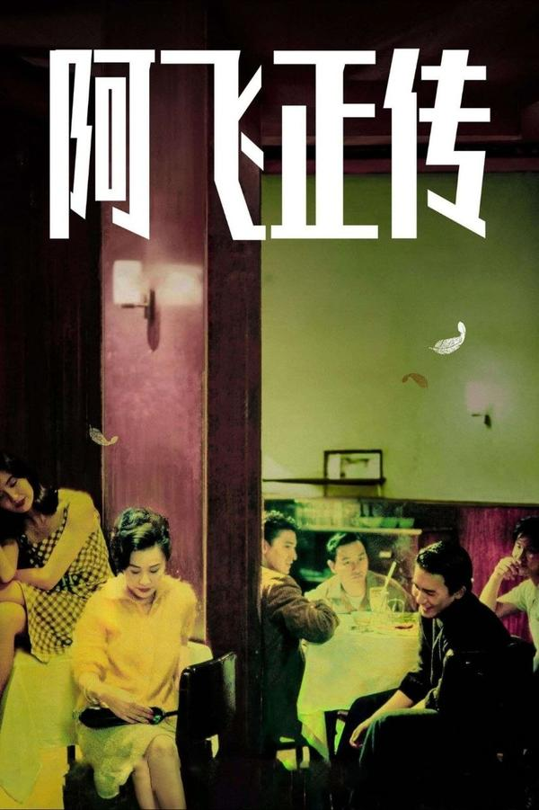

---

## 长城

[2026-10-09 22:26] 来自：综合网盘资源频道

名称：【原盘】长城 (2016) 4K REMUX 外挂简中字幕

描述：电影《长城》讲述了在古代，一支中国精英部队为保卫人类，在举世闻名的长城上与怪兽饕餮进行生死决战的故事。欧洲雇佣军威廉(马特·达蒙 Matt Damon 饰)与同伴佩罗·托瓦尔(佩德罗·帕斯卡 Pedro Pascal 饰)不远万里来到中国盗取火药配方，意外发现了长城是为抵御60年降临人间一次的饕餮所建。长城内部机关重重，宛如“陆上航母”，由无影禁军世代镇守。在这里，威廉见识了饕餮的凶残，也见证了无影禁军的精锐和勇敢，并被这群战士之间的信任和牺牲所感动，义无反顾地加入到了共同守护人类的战斗当中。

夸克网盘：https://pan.quark.cn/s/06ef3a6147cd

百度网盘：https://pan.baidu.com/s/198h1b-y53m7RVMLtBSE8KQ?pwd=78q3

📁 大小：55.3GB

🏷 标签：#剧情 #奇幻 #冒险 #长城 #原盘 #4K #REMUX #外挂简中字幕 #ali #quark #baidu

---

## 难破MG5

[2026-10-09 22:19] 来自：综合网盘资源频道

名称：难破MG5 ナンバMG5 (2022)

描述：强硬的不良一家——难破家的次子刚(间宫祥太朗饰)想放弃当不良少年，成为普通的高中生。他瞒着家人考入健全的高中，在家人面前是穿着特攻服的不良少年，在学校里是穿着制服的认真高中生，过着双重生活。虽然作为优等生加入了美术部，但是不能放任朋友被欺负，无意间换上特攻服帮助了朋友，以此为契机，刚成为了身份不明的最强不良少年。

夸克网盘：https://pan.quark.cn/s/051518dcb0df

📁 大小：AA

🏷 标签：#剧情 #喜剧 #动作 #难破MG5 #quark

---

## 楚留香之蝙蝠传奇

[2026-10-09 22:16] 来自：综合网盘资源频道

名称：楚留香之蝙蝠传奇 楚留香之蝙蝠傳奇 (1984)

描述：修心养性的楚留香(苗侨伟)，与三位红粉知己避居世外。但楚留香静极思动，又刚值好友左轻侯生辰，遂藉此再度重出俗世，与三美到左家祝贺.到左家后，发生怪事连篇，原来左家独女恋上世仇薛家之子薛斌，两人竟诈死以调解两家的宿怨。此事被楚留香查悉，为成其好事，就暗中给多他们帮助。可惜此事恰巧给桑小靖(翁美玲)知悉，并无意间泄露给左轻侯知道，惹得左轻侯错手误杀女儿，薛斌殉情自尽。而楚留香亦因插手此事，涉嫌盗取薛家宝剑，及被江湖中人误会他杀死武林名人，几遭杀身之祸。

及后，楚留香再遇好友中原一点红(惠天赐)，几悉一点红的妻子被一个以蝙蝠公子为首的神秘组织所杀，以期中原一点重出江湖为之效命。楚留香有见及此，为己为人，决定追查真相。其实蝙蝠公子乃原随云(任达华)的化身。他本有一段耐人寻味的身世，他之所以组织蝙蝠宫，亦有原委。最后，当楚留香洞悉一切后，与原随云唯有作一场生死决斗。

夸克网盘：https://pan.quark.cn/s/e2273bb74d8d

📁 大小：AA

🏷 标签：#剧情 #楚留香之蝙蝠传奇 #楚留香之蝙蝠傳奇 #quark

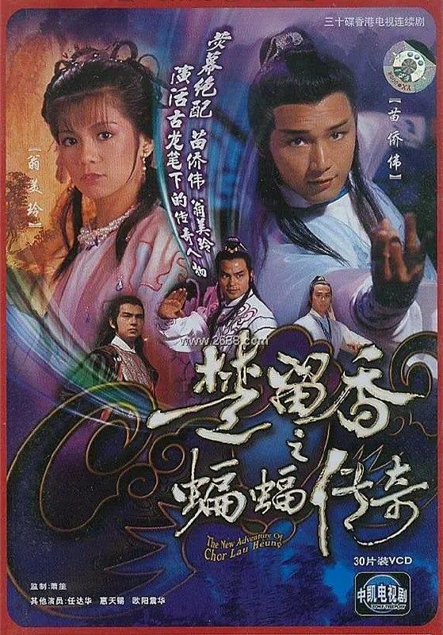

---

## 毕业的我们

[2026-10-09 22:03] 来自：综合网盘资源频道

名称：毕业的我们 (2019)

描述：冷一诺的葬礼让十二年没有重聚的五个人以不同身份再次相聚。高中时代亲密无间的五个人从相互依靠到即将分离，在短暂又美好的暑假里充满了欢笑和对未知的期待，没有伤痛、没有对生活的失望。十二年后，每个人物的命运均和自己当初设定的梦想相距甚远。

夸克网盘：https://pan.quark.cn/s/11ef9ea4d977

📁 大小：NG

🏷 标签：#剧情 #毕业的我们 #quark #ali

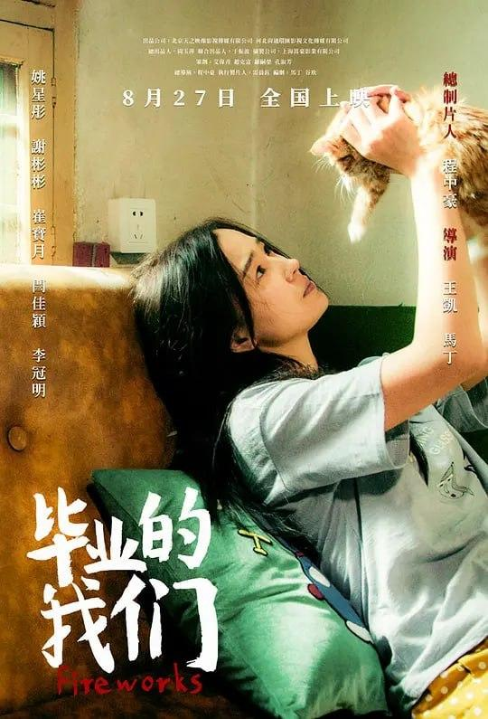

---

## 庵堂认母

[2026-10-09 21:56] 来自：综合网盘资源频道

名称：庵堂认母 (1956)

描述：法华庵尼姑王志贞，16年前与秀才申贵升相爱，指望脱离空门，与他结为夫妻。不幸，申秀才得病天亡。志贞生下一个孩子，因尼姑庵不许养儿育女，她只得写下血书，忍痛把孩子丢在路旁

夸克网盘：https://pan.quark.cn/s/c46b13f5e7a8

📁 大小：NG

🏷 标签：#戏曲 #庵堂认母 #quark #ali

---

## 刑警本色

[2026-10-09 21:55] 来自：综合网盘资源频道

名称：刑警本色 (1999)

描述：本剧改编自小说《天府之国魔与道》。本剧以90年代初，经济改革进入关键时期为背景，以公安刑警和犯罪集团的斗争为主线，展现了改革开放背景下公安队伍的发展变化，讴歌了公安刑警为维护社会治安的奉献和牺牲精神。

萧文、张平、常闯分到刑警队，队长潘荣亲自当他们的师傅。潘荣带他们处理的第一案子是绑架案，被绑架的是江洲宾馆公关部的女经理梅莉。萧文一枪解决绑架者。潘荣对萧文擅自开枪不满意，可圆满的结果还是令他对徒弟们刮目相看……

萧文该提升队长了，可主管的潘荣不同意，萧文去了行政科。行政工作萧文干得不错，可他总觉得不如刑警来劲，一气之下请求辞职。在冯局长和张平的支持下，萧文总算重回刑警队伍，可他已无任何官职，而且是去北海从事外围侦察工作，工作上心气不顺，弄得萧文和梅莉之间也出现了矛盾……

本居是一部风格朴实、生动、自然、流畅，追求现实主义风格和纪实手法相结合、制作精良的优秀作品，折射出社会变革在人们思想、心态、感情和事业上的深刻影响。

夸克网盘：https://pan.quark.cn/s/60ed31676b45

📁 大小：AA

🏷 标签：#剧情 #犯罪 #刑警本色 #quark

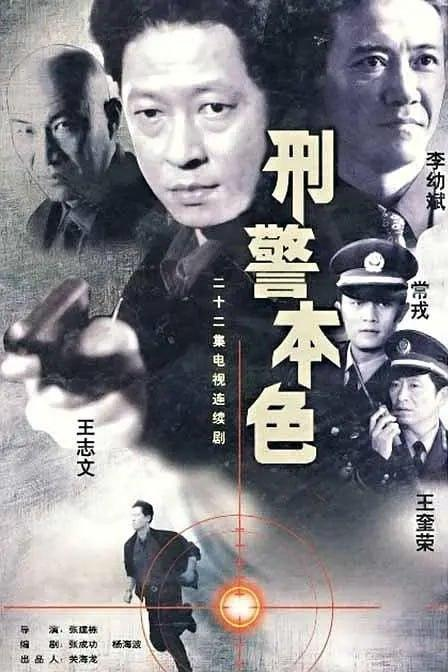

---

## 别惹白鸽之她的秘密

[2026-10-09 21:46] 来自：综合网盘资源频道

名称：别惹白鸽之她的秘密 (2022)

描述：情感小组主理人白鸽(王玥兮 饰)得知，小组成员舒然(周楚濋 饰)遭遇了婚姻危机，其丈夫刘洋(董畅 饰)竟在舒然提出离婚后，亲手将外遇对象溺死在自家浴缸中……

夸克网盘：https://pan.quark.cn/s/9b307958a5fc

📁 大小：NG

🏷 标签：#剧情 #别惹白鸽之她的秘密 #quark #ali

---

## 半个喜剧

[2026-10-09 21:42] 来自：综合网盘资源频道

名称：半个喜剧 (2019)

描述：三个自由浪漫的年轻人，过着各怀心思的人生：有人急着摆脱单身，有人想在结婚前放荡一番，有人想在 大城市站稳脚跟。因为一次情感出轨，三人扭结成了一团“嬉笑怒骂”的乱麻。当各种价值观碰撞在一起， 当一个人需要平衡亲情友情与爱情......他们慌乱的生活，就像是半个喜剧。

夸克网盘：https://pan.quark.cn/s/d9da3160f797

📁 大小：AA

🏷 标签：#剧情 #半个喜剧 #quark

---

## 庭院里的女人

[2026-10-09 21:40] 来自：综合网盘资源频道

名称：庭院里的女人 (2001)

描述：1938年，日军的铁蹄蹂躏中华大地，而江南水乡的吴府却宛如立身桃花之源，过着与世隔绝的安逸生活。

吴府女主人吴太太(罗燕 饰)40岁寿宴那天，其好友康太太难产，命悬一线。吴太太匆匆赶往好友处，在此偶遇孤儿院的洋人医生安德鲁(Willem Dafoe 威廉•达福 饰)。安 德鲁不顾中国传统观念的偏见，用西洋艺术将康太太从死神手中夺回。

不久吴府请安德鲁为少爷吴凤慕(赵耀翰 饰)传授西学。凤慕同情爱慕父亲的小妾秋明(丁艺 饰)，但父亲已经为其定下康家的小姐为妻。凤慕每天闷闷不乐，而吴太太却和安德鲁在授课中逐渐为对方所吸引。这两对人的恋情将何去何从

夸克网盘：https://pan.quark.cn/s/9988692f65bc

📁 大小：AA

🏷 标签：#剧情 #爱情 #庭院里的女人 #quark

---

## 先洗未来钱

[2026-10-09 21:30] 来自：综合网盘资源频道

名称：先洗未来钱 先洗未來錢 (1994)

描述：张家界和侄子无忌专门盗取别人资料，送到非法工厂去伪造信用卡。某天银行职员SISI到张的黑店购货，无忌乘机北朝鲜她的资料传真给工厂，复制使用。不久SISI收到月结单，到张的店里理论，但证据不足。SISI拒绝付账，追账公司派员工上门追讨欠款，SISI求助好友武哥及阿嫦，嫦先去张店用信用卡买东西，然后引无忌回家，让他发现更多人的资料，把他介绍给武，未几，张决定请大陆人到外国冒签信用卡减低风险，于是武派人假扮大陆人与张接洽，然后报警，将无忌等人全部擒获。

夸克网盘：https://pan.quark.cn/s/e63279c1ca72

📁 大小：NG

🏷 标签：#喜剧 #先洗未来钱 #先洗未來錢 #quark #ali

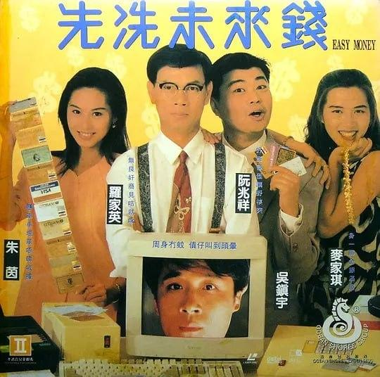

---

## 速度与激情

[2026-10-09 21:25] 来自：综合网盘资源频道

名称：速度与激情 The Fast and the Furious (2001)

描述：洛杉矶的年轻人都热衷于街头赛车，在这里，只要你拥有速度，你就拥有一切。新晋警官布莱恩(保罗·沃克 Paul Walker 饰)为了破获最近屡屡发生的飞车党劫车案而充当卧底，打入这里活跃的飞车党帮派中，搜集证据以期将罪犯乘之于法。布莱恩凭借高超的车技很快赢得了飞车党老大多米尼克(范·迪塞尔 Vin Diesel 饰)的欣赏和信任，并且很快和多米尼克的妹妹米娅(乔丹娜·布鲁斯特 Jordana Brewster 饰)堕入爱河。

夸克网盘：https://pan.quark.cn/s/2e05b34c77b5

📁 大小：NG

🏷 标签：#动作 #犯罪 #速度与激情 #quark #ali

---

## 伴我同行

[2026-10-09 21:10] 来自：综合网盘资源频道

名称：伴我同行 Stand by Me (1986)

描述：这是一部关于成长的电影。著名作家戈迪(理查德•德莱福斯 Richard Dreyfuss 饰)回忆起他12岁时的一次冒险活动：当时，年少的戈迪(威尔•惠顿 Wil Wheaton 饰)与他的三个小伙伴克里斯(瑞凡•菲尼克斯 River Phoenix 饰)、泰迪(科里•费尔德曼 Corey Feldman 饰)和维恩为了当一回“英雄”去河的对岸的森林里寻找一具12岁男孩的尸体。

夸克网盘：https://pan.quark.cn/s/927490f1ed17

📁 大小：NG

🏷 标签：#剧情 #儿童 #冒险 #伴我同行 #quark #ali

---

## 一夫四妻奇婚记

[2026-10-09 20:43] 来自：综合网盘资源频道

名称：一夫四妻奇婚记 Kis Kisko Pyaar Karu (2015)

描述：年轻商人库玛·希夫拉姆·克什阴差阳错被结婚三次(死前遗命、损友出卖、黑帮逼迫)，娶了三个老婆。为了不穿帮，他把三个不知情的老婆弄到了一栋楼房的四层、六层和八层，把名字拆成了希夫、拉姆和克什来应付她们。更不要命的是，他还有个最爱的女友(女友叫他库玛，幸好名字够长)，不娶此女则心有不甘。正在他按计划周旋之际，已经离异多年的父母突然来访要看儿媳妇，这该如何应对？！

夸克网盘：https://pan.quark.cn/s/831da51e1d47

迅雷网盘：https://pan.xunlei.com/s/VP3VfweBZOwcinCjk6hMOCGfA1?pwd=fgx5

📁 大小：AA

🏷 标签：#喜剧 #一夫四妻奇婚记 #quark #xunlei

---

## 苹果

[2026-10-09 20:16] 来自：夸克云盘影视资源频道

名称：苹果（2007）4K SDR 高码率

描述：刘苹果（范冰冰饰）在北京一家洗脚城里做按摩妹，丈夫安坤（佟大为饰）是负责清洗高楼落地窗的工人，二人生活贫困，却相亲相爱。

洗脚城老板林东（梁家辉饰）是个好色的港商，时常找不同小姐满足生理需要。老婆王梅（金燕玲饰）不能生育，经营一家美容院，两人感情冷淡。

一日刘苹果的好友小妹因为得罪客人而被开除，二人喝得酩酊大醉。神志混乱的苹果误打误撞走到一间足浴客房，正好是林东的休息室，二人发生关系，却被正在刷窗的安坤看到。

安坤欲借此敲诈林东，并前去找王梅谈判，愤怒的王梅要林东也尝尝“戴绿帽”的滋味，于是与安坤发生关系。

而在这时，一个更大的变故产生。苹果怀孕了，而到底谁才是这个孩子的父亲成了林东与安坤赌博的筹码，四人签订协议，如果是林东的骨肉，他将给二人十二万元的补偿费，而如果是安坤的，则双方互不相欠......

夸克网盘：https://pan.quark.cn/s/cb873427b1f6

📁 大小：16GB

🏷 标签：#剧情 #苹果

---

## 斗罗大陆绝世唐门

[2026-10-09 19:46] 来自：百度网盘综合频道

名称：斗罗大陆：绝世唐门（2023）4K S01E01 - E174｜附第一季+剧场版

描述：这里没有魔法，没有斗气，没有武术，却有武魂。唐门创立万年之后的斗罗大陆上，唐门式微。一代天骄横空出世，新一代史莱克七怪能否重振唐门，谱写一曲绝世唐门之歌？ 百万年魂兽，手握日月摘星辰的死灵圣法神，导致唐门衰落的全新魂导器体系。一切的神奇都将一一展现。 唐门暗器能否重振雄风，唐门能否重现辉煌？

百度网盘：https://pan.baidu.com/s/1HSy6RITY-LM35-BREH49TQ?pwd=5928

夸克网盘：https://pan.quark.cn/s/67f59d97fc63 来自：肯德基の4K影视综合电影云盘站 [2026-10-09 19:45] 名称：斗罗大陆：绝世唐门（2023）4K S01E01 - E174｜附第一季+剧场版

📁 大小：354GB

🏷 标签：#Jack #剧情 #斗罗大陆

---

## 荒野狂兽

[2026-10-09 18:37] 来自：综合网盘资源频道

名称：荒野狂兽 Beast (2022)

描述：奈特博士(伊德里斯·艾尔巴 饰)刚刚经历丧妻之痛，他决定带着他的两个女儿重返他和妻子第一次相遇的南非，并前往由他的世交好友和野生动物生物学家马丁·拜托斯(沙尔托·科普雷 饰)管理的野生动物保护区，展开一场计划已久的旅行。但是这场疗伤之旅却变成一场惊惧可怕的求生之旅， 因为他们被一头逃出贪婪残暴的盗猎者毒手之后，将所有人类都视为敌人的巨狮盯上并猎捕。

夸克网盘：https://pan.quark.cn/s/3eac2af0e338

📁 大小：AA

🏷 标签：#惊悚 #恐怖 #荒野狂兽 #quark

---

## 这个男人来自地球

[2026-10-09 18:33] 来自：综合网盘资源频道

名称：这个男人来自地球 The Man from Earth (2007)

描述：一个普通男人的秘密在他的辞职事件中开始显示出端倪。历史教授约翰奥德曼(David Lee Smith饰)说自己身上有一个让大家都匪夷所思的秘密，而为了保守这个秘密他不能在一个地方超过十年。他的朋友们试图去发掘他的故事中的秘密，这一举动让约翰非常生气，而他的朋友却发现约翰的故事是无法被否定也无法查证的，究竟约翰身上有着怎样的秘密？一幕幕碎片联系起来，带给我们一个意料之外的故事高潮。

夸克网盘：https://pan.quark.cn/s/926fd4605d1e

📁 大小：AA

🏷 标签：#科幻 #剧情 #这个男人来自地球 #quark

---

## 十七岁不哭

[2026-10-09 18:23] 来自：综合网盘资源频道

名称：十七岁不哭 (1997)

描述：这是一群十七岁男生女生的故事。班长简宁(李晨 饰)成绩优秀，勤奋自勉；杨宇凌(郝蕾 饰)伶俐能干，敢怒敢言；雷蒙(张超 饰)问题多多，桀骜不驯；晓丹(牛萌萌 饰)文静内向；乐心(王卓 饰)林林(陈嫣嫣 饰)一个活泼一个娇气……这群性格各异的同学在新学校开始了他们的新生活。如同所有的高中生一样，他们经历军训、突击的模拟考、初次的集体生活，有学习上的困扰，对未来既憧憬又迷茫；他们朝气蓬勃，追求新鲜事物，有说不完的话讲不完的故事；他们走在花季雨季，经历陌生的感情，触碰青涩的梦。十七岁的他们一边受伤一边学会坚强，翩翩少年开花要结果，他们日渐成长。

本剧根据当年十七岁的女中学生李芳芳的同名小说改编。

夸克网盘：https://pan.quark.cn/s/5be9be3f2f2c

📁 大小：AA

🏷 标签：#剧情 #十七岁不哭 #quark

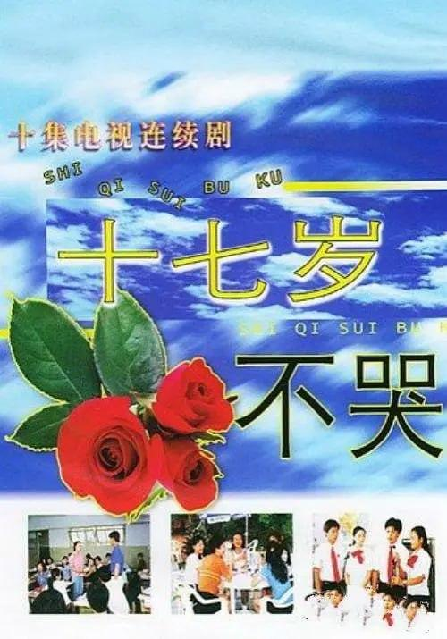

---

## 皓镧传

[2026-10-09 18:17] 来自：综合网盘资源频道

名称：皓镧传 (2019)

描述：故事发生在战国末期，此时秦国不断强大，大有吞并天下的气势。饱受秦国碾压的赵国，生活着一个家破人亡的可怜女子李皓镧(吴谨言 饰)。在颠沛流离、无依无靠之际，她被大商人吕不韦(聂远 饰)买下，尽心调教，遂出落得亭亭玉立，光艳迷人。此后不久，吕不韦将皓镧献给了在赵国当人质的秦王孙嬴异人(茅子俊 饰)。赵国公主雅(海铃 饰)爱慕异人，因此对吕不韦和皓镧百般陷害。长平之战后，吕不韦出谋划策为异人铺路，帮其重返秦国，成为了秦王的继承人。一入宫门深似海，况且在全国大一统的前夕，连秦国上空都漂浮这令人不安的气息。

皓镧这样的女子，注定要用生命见证着一段流传千古的传奇…

夸克网盘：https://pan.quark.cn/s/5a4f30059d7d

📁 大小：AA

🏷 标签：#剧情 #古装 #皓镧传 #quark

---

## 虹色病历簿

[2026-10-09 17:46] 来自：综合网盘资源频道

名称：虹色病历簿 にじいろカルテ (2021)

(电视剧+番外)

描述：故事的主人公是在急诊科工作的医生——红野真空。真空曾在东京的一家大医院的急诊科工作，她怀抱着梦想和自豪感积极乐观地工作。但偶然有一天却发现自己患上了疑难杂症，没有钱治病又不愿放弃工作的她在机缘巧合之下，得知了位于深山里的一个小村庄——虹之村。碰巧虹之村诊所正在招聘内科医生，于是她便隐藏了病情前往小村庄的诊所工作。她乘坐奇怪的巴士，穿过郁郁葱葱的森林，好不容易到达了虹之村，等待着她的竟然是同样来自东京的怪咖外科男医生和认真勤劳的男护士，真空与他们生活在同一屋檐下。此外，真空也在这个村子里认识了一群宛如妖怪般个性鲜明的村民，她在与他们一同欢笑、哭泣、吵架拌嘴的同时，以积极热情的姿态面对病痛，面对生命的成长，在虹之村诊所开启了全新的生活。

夸克网盘：https://pan.quark.cn/s/3cd76e2a175a

📁 大小：AA

🏷 标签：#剧情 #虹色病历簿 #quark

---

## 神勇武工队传奇

[2026-10-09 17:42] 来自：综合网盘资源频道

名称：神勇武工队传奇 (2017)

描述：敌后抗日武工队是华北抗日战场上最闪亮的传奇，高风亮领导的定西县抗日武工队坚持敌后抗战，随时出击神出鬼没，如同一把尖刀插在鬼子心里，让鬼子时时心如刀绞，痛不欲生。抗战后期，鬼子进入最后的疯狂，为剿灭武工队，定西鬼子特战队队长冲田新八，多次设下圈套，敌方汉奸队、鬼子特务大队，甚至我军情报站，都成为了冲田新八的诱饵。高风亮在鬼子陷阱面前率领战士们一次次虎口脱险的同时，完成了护送首长、定点锄奸、爆破军火库等任务，给鬼子以迎头痛击，上演了一幕幕鲜活真实的、可歌可泣的敌后抗战故事，展示了中华民族不可侮的精神面貌。

夸克网盘：https://pan.quark.cn/s/571a4580f736

📁 大小：AA

🏷 标签：#剧情 #战争 #神勇武工队传奇 #quark

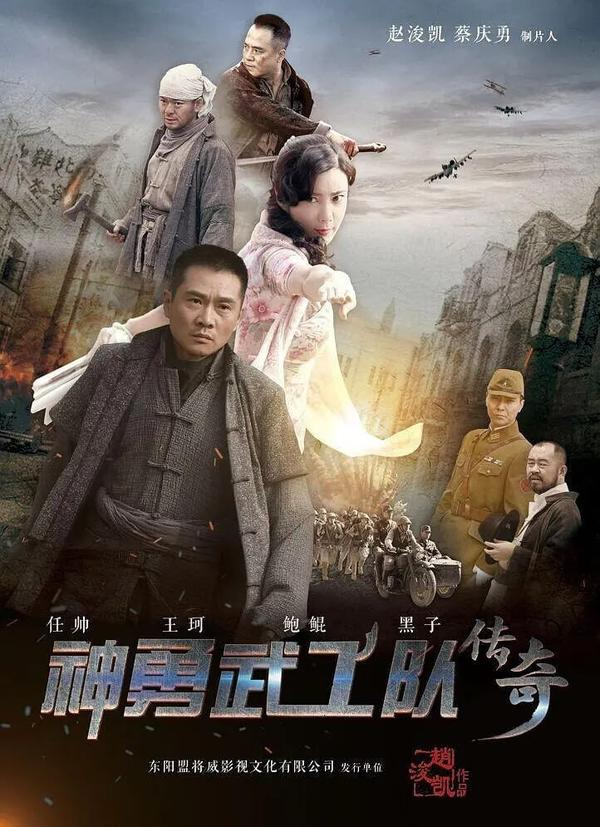

---

## 千娇百媚

[2026-10-09 17:33] 来自：综合网盘资源频道

名称：千娇百媚 千嬌百媚 (1961)

描述：被誉为香港电影史上出色爱情歌舞片，阴差阳错的布局加上载歌载舞，令人赏心悦目。林黛饰演一随歌舞团远赴日本的年轻歌舞艺员，人在异乡，排遣寂寞，在征友广告中认识一年青男子，虽素未谋面，但书信早已互生情愫。谁知对方正是舞蹈团团主！此角由当年首席喜剧小生陈厚扮演，欢喜冤家与扑朔迷离的爱情故事，是《网上情缘》的怀旧版，林黛更凭此赢得第八届亚洲电影展最佳女主角。而本片布景及摄影非常华丽，首用伊斯曼七彩阔银幕，水平直逼当年好莱坞歌舞片大制作，同年，另获同届亚洲影展最佳美术指导、最佳音乐、最佳剪辑及最佳录音等五项大奖；令此片在第一届金马奖获得最佳导演及最佳音乐两项大奖项，电影歌曲悦耳，由姚敏作曲，静婷主唱，风行半个世纪。

夸克网盘：https://pan.quark.cn/s/d7325f552fff

📁 大小：AA

🏷 标签：#歌舞 #千娇百媚 #千嬌百媚 #quark

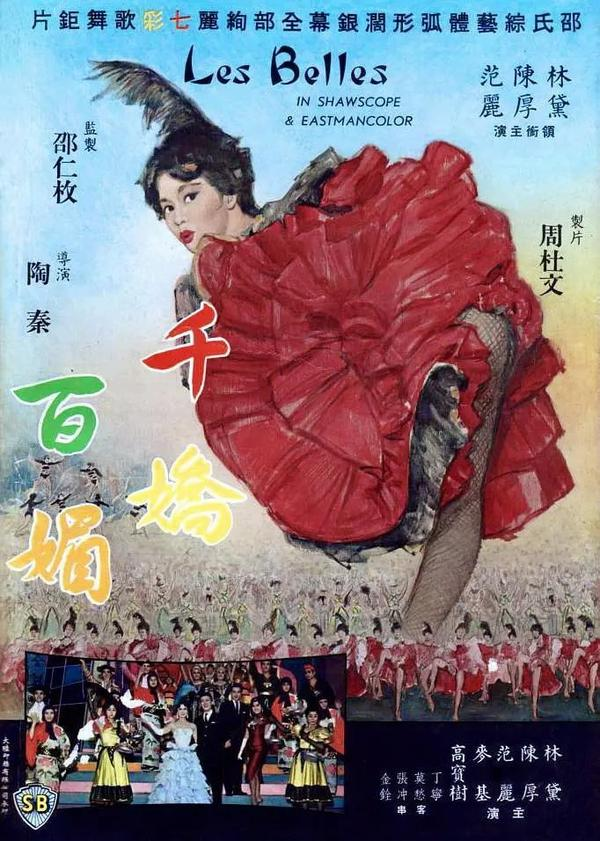

---

## 女优摔吧

[2026-10-09 17:30] 来自：综合网盘资源频道

名称：女优，摔吧！ 女優，摔吧！ (2022)

描述：前往日本当AV女优的丽丝爱爱(夏于乔 饰)与小红莓(吴映洁 饰)，因为不幸遇到“AV界的寒冬”，没钱赚的两人只好认命回台湾，阴错阳差之下加入摔角俱乐部，与摔角高手(黄心娣 饰)不打不相识，在经历重重考验后三人组成“莓人爱”摔角团体，开启三人的摔角之路。

夸克网盘：https://pan.quark.cn/s/988fd20e9ab1

📁 大小：AA

🏷 标签：#剧情 #喜剧 #动作 #女优 #摔吧 #女優 #quark

---

## 毒吻

[2026-10-09 15:52] 来自：综合网盘资源频道

名称：毒吻 (1992)

描述：狂风暴雨之夜，一个小家庭迎来了新生命。当这对父母尚未品尝到幸福的果实时，悲剧不期而至。母亲在亲吻新生儿之后突然暴毙，父亲在舔过婴儿用过的奶瓶后也莫名死亡。美丽的护士林囡(阎青 饰)可怜这个小男孩，于是将其带回家抚养。她很快发现，父亲(高明 饰)饲养的小宠物也都相继猝死。 通过对男孩三三(吴博 饰)的研究得知，由于他的父母常年在化工厂工作，他们的体内郁结了大量的有毒物质，最终导致三三从降生起变成了体含剧毒的毒娃。每逢暴雨之日，三三体内的毒性就会增强，他的身体也会随之成长。他的毒性越来越强，开始有无辜之人因此丧命。三三痛苦不堪，他的人生注定是一场悲剧…

夸克网盘：https://pan.quark.cn/s/13e0b2ef6652

📁 大小：AA

🏷 标签：#剧情 #毒吻 #quark

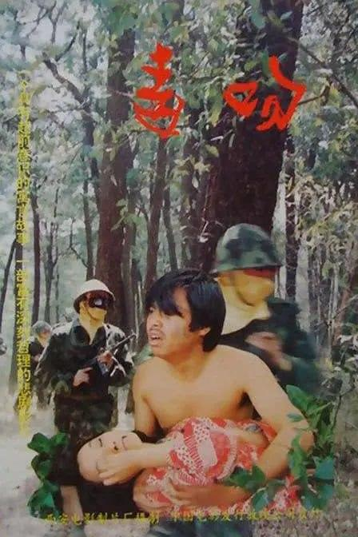

---

## 终极一家

[2026-10-09 15:22] 来自：综合网盘资源频道

名称：终极一家 (2007)

描述：在这个浩瀚无垠的空间之内，不是只有凡人所认知，只存在著当下的世界而已，而是有著十二个时空跟一个诡谲邪恶的魔界共生著，这个故事就由其中之一的“金时空”开始展开……

可以自由穿越各个时空的异能行者修，他在金时空当中，结交了汪大东、丁小雨、王亚瑟这几名KO榜上战力指数高强的好手，但却在对抗邪恶势力的同时，受伤而导致功力全失，因此金时空代表的善良一方也暂时落败，被黑暗所控制，修现在职责就是到另外一个时空，找出汪大东的分身，和本尊互相传功，才可以避免十二十空权都沦陷在黑暗势力底下，并且挽救现在金时空的颓废。

修抱持著这份艰苦的任务，来到了同一个象限中的铁时空，因缘际会发现了隐藏著极高异能指数的夏天，他就是汪大东在这个时空当中的分身， 而他也极有可能成为铁时空唯一的强者－终极铁克人，一旦这个身份确立，夏天就拥有可以拯救十二时空的能力了。但是不明究理，而且对成为终极铁克人兴趣缺缺的夏天，究竟能否成为终极铁克人？而夏天的异能冒险之旅又会发生那些危机呢？

夸克网盘：https://pan.quark.cn/s/abc83abf2d82

📁 大小：AA

🏷 标签：#喜剧 #家庭 #剧情 #奇幻 #终极一家 #quark

---

## 素媛

[2026-10-09 15:19] 来自：综合网盘资源频道

名称：素媛 (2013)【WEB-DL.1080p】【内封简繁英】【剧情/人性】【薛景求/严志媛】

描述：豆瓣9.3高分

素媛是一个生活在普通家庭里的小女孩，每天在父母的疼爱中平静成长。一个下着雨的早晨，她独自上学途中遭到陌生男子性侵，原本无忧无虑的生活从此被彻底改变。严重的身体伤害和心理创伤让素媛变得恐惧而敏感，甚至一度无法接受父亲的靠近，而突如其来的打击也让整个家庭陷入痛苦。面对女儿难以言说的伤痕，父母和身边的人小心翼翼地陪伴着她，用各自的方式重新给予她安全与温暖。在漫长的伤痛之后，这个家庭也开始努力寻找重新生活下去的希望……

迅雷网盘：https://pan.xunlei.com/s/VP3UWrprvIik_lAYSe4NgIWsA1?pwd=p2pg

📁 大小：5.3GB

🏷 标签：#剧情 #犯罪 #人性 #素媛 #WEBDL #1080p #内封简繁英 #薛景求 #xunlei

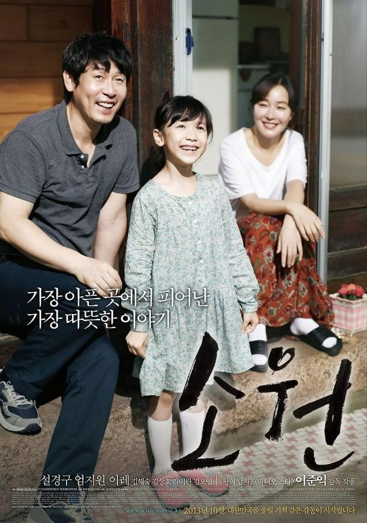

---

## 笑窗之屋

[2026-10-09 15:14] 来自：综合网盘资源频道

名称：笑窗之屋 La casa dalle finestre che ridono (1976)

描述：斯特凡诺(里诺·卡波里奇诺 Lino Capolicchio 饰)是一位文物修复师，一天，在好友安东尼奥(Giulio Pizzirani 饰)的推荐之下，市长索尔米(Bob Tonelli 饰)找到了斯特凡诺，希望他能够前往他所在的一个小村庄，去那里修复一副油画。该油画的作者名叫布诺(Tonino Corazzari 饰)，是一位患有精神疾病的艺术家，在很多年前，布诺就已经被人们认为死亡了，可是直到今天，依然没有人能够找到他的尸体。

就在斯特凡诺在村子里修复油画的同时，安东尼奥也在调查着布诺的下落，某日，安东尼奥告诉斯特凡诺自己发现了布诺和这个村子有关的秘密，可是，安东尼奥还没来得及将这个秘密告诉斯特凡诺，他就被发现死在了自己家中，死因是自杀

夸克网盘：https://pan.quark.cn/s/2f7135fe7759

📁 大小：AA

🏷 标签：#剧情 #悬疑 #恐怖 #笑窗之屋 #quark

---

## 乔治和曼迪的头婚生活

[2026-10-09 14:52] 来自：综合网盘资源频道

名称：乔治和曼迪的头婚生活 (2024) S03E01 1080P 内封中英双语字幕[附前两季4K SDR 外挂中英双语字幕]

描述：《小谢尔顿》的续集，讲述了乔治和曼迪在德克萨斯州抚养他们的年轻家庭，同时应对成年、育儿和婚姻的挑战。

夸克网盘：https://pan.quark.cn/s/8b1305a923e8

百度网盘：https://pan.baidu.com/s/1x4_h6_KPcw4e0NDUeCzaEA?pwd=1314

📁 大小：90.58 GB

🏷 标签：#乔治和曼迪的头婚生活 #喜剧 #1080P #内封中英双语字幕 #SDR #外挂中英双语 #quark #baidu

---

## 生死谍变

[2026-10-09 14:28] 来自：综合网盘资源频道

名称：生死谍变 쉬리 (1999)

描述：金明姬是朝鲜第八特别部队的特工，自1993年潜入韩国之后，暗杀了多名政要。她的行动引起了韩国特工机构的注意，并派特工崔相焕(韩石奎 饰)和李正希(宋康浩 饰)调查她的下落，可是她却销声匿迹了。

1998年，金明姬又出现了，她让黑市军火商人林光超帮忙找新武器液体炸弹CTX，林贿赂国防部研究院的研究员金宗叔帮他偷，没有得手。事情暴露后，二人先后被金明姬杀害。

因为金明姬的失败，朝鲜派出了以卜万坤(崔岷植 饰)为首的特工队伍，在韩国军队运送CTX参加军火展览途中将炸弹劫走，准备破坏即将举办的两国友谊足球比赛。

这一切，让崔相焕、李正希和他们的上司高部长十分苦恼，他们发现，金明姬总能先他们一步找到目标，破坏他们的行动，金明姬就在他们身边，或许正是最亲近，最不设防的那个人

夸克网盘：https://pan.quark.cn/s/592479d8d062

📁 大小：AA

🏷 标签：#剧情 #悬疑 #惊悚 #动作 #生死谍变 #quark

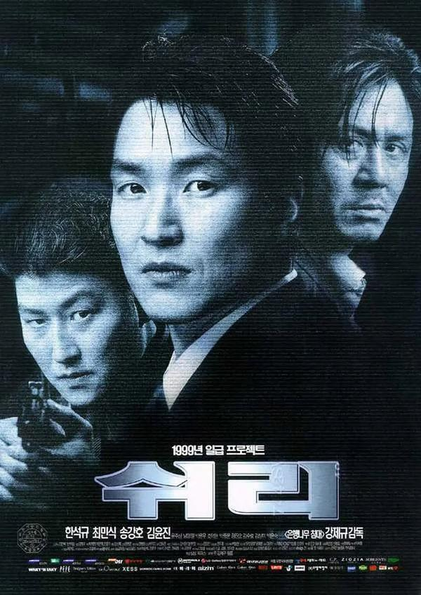

---

## 天盛长歌

[2026-10-09 14:25] 来自：综合网盘资源频道

名称：天盛长歌 (2018)

描述：故事发生在架空的历史时期，前朝公侯宁世征(倪大红 饰)手掣大旗，历经数年推翻羸困的旧王朝，建立起自己的天盛王朝。转眼将近二十年过去，六皇子楚王宁弈(陈坤 饰)风流倜傥，却城府极深，虽然其他皇子将他视为废柴，但是他怀着莫大的抱负。身处皇宫权力中心，皇亲国戚、荣位权臣，宁弈静待稍纵即逝的宝贵时机。与此同时，一名青年才俊步入皇宫泥沼。他名叫魏知，年纪轻轻便赢得众人侧目。而实际上，魏知是一名女子，本名凤知微(倪妮 饰)，其真实身份是前朝的遗孤。楚王在与魏知相交的过程中，彼此相互试探，步步为营，不知不觉将彼此的命运搅在了一起……

本片根据天下归元的小说《凰权》改编。

夸克网盘：https://pan.quark.cn/s/0130712d5a1d

📁 大小：AA

🏷 标签：#剧情 #爱情 #古装 #天盛长歌 #quark

---

## 没有完成的喜剧

[2026-10-09 14:15] 来自：综合网盘资源频道

名称：没有完成的喜剧 (1957)

描述：在上海电影公司成名，一胖一瘦长相十分讨喜的著名喜剧演员殷秀岑和韩兰根来到长春电影制片厂观摩学习。阳光明媚的时节，电影厂内鸟语花香，穿着不同民族和朝代戏服的演员们热情迎接上来，而这两个可爱演员插科打诨，闹出了不少的笑话。他们见到了老相识李导演(陈衷 饰)，还遇到了闻名全国的影评人“一棒子”同志。一棒子满嘴高深理论，上纲上线，令在场人听得一头雾水。当谈到讽刺喜剧的时候，李导演邀请一棒子月底来观摩电影厂正在排演的三个喜剧小品。

排演当天，爱铺张浪费的朱经理、爱吹牛夸大事实的人以及不孝顺父母的兄弟三出喜剧接连上演，结果却引来一棒子苛刻偏颇的指摘……

夸克网盘：https://pan.quark.cn/s/4c2195d428ba

📁 大小：AA

🏷 标签：#剧情 #喜剧 #没有完成的喜剧 #quark

---

## 卑劣之人

[2026-10-09 14:11] 来自：综合网盘资源频道

名称：卑劣之人 Lowlifes (2024)

描述：The survival instincts of a road-tripping family are put to the test when they have no other choice but to stay the night at a remote homestead.

夸克网盘：https://pan.quark.cn/s/d1dd4a47e3f3

📁 大小：AA

🏷 标签：#恐怖 #卑劣之人 #quark

---

## 天使行动2火凤狂龙

[2026-10-09 14:10] 来自：综合网盘资源频道

名称：天使行动2：火凤狂龙 天使行動II火鳳狂龍 (1988)

描述：方中信、李赛凤、吕少玲是天使组织的成员，在一次圆满任务完成后，在马来西亚之旅中巧遇好友陈庭威，却没想到陈庭威阴谋反动、自组军队，而天使组织此次任务即是陈庭威，然而面对一个生死之交，李赛凤等人下得了手吗?

夸克网盘：https://pan.quark.cn/s/e67ee51c1fc4

📁 大小：AA

🏷 标签：#剧情 #动作 #惊悚 #天使行动2 #火凤狂龙 #天使行動II火鳳狂龍 #quark

---

## 血色玫瑰

[2026-10-09 14:00] 来自：综合网盘资源频道

名称：血色玫瑰 Rose Red (2002)

描述：秘密、谋杀和鬼魂交织而成的惊悚故事虽然片名如此美丽，但「血色玫瑰」却不是浪漫爱情电影，事实上它是一幢废倾已久豪宅的名称，在她美丽的外表下，隐藏著骇人的残酷血腥。「血色玫瑰」诞生于世纪初，由富豪林鲍夫妇动工兴建，但自建屋起就灾厄不断，不仅多名建筑工人惨死，落成后又有多人接连失踪，前后已有26名人士神秘消逝于「血色玫瑰」的荒烟漫草内。传说这幢房子遭受诅咒，它会自行增建……心理学教授乔伊丝，为了解开这栋位于西捇图的神秘鬼屋之谜，积极地游说六位各具灵媒特质的人士，共同进行一场超心灵实验。他们计划在「血色玫瑰」待上72小时，以揭开这栋传说会吃人房子的神秘面纱。目前成蛰伏状态的「血色玫瑰」，是否会欢迎这批访客？

夸克网盘：https://pan.quark.cn/s/b1750f8558a7

📁 大小：AA

🏷 标签：#悬疑 #惊悚 #血色玫瑰 #quark

