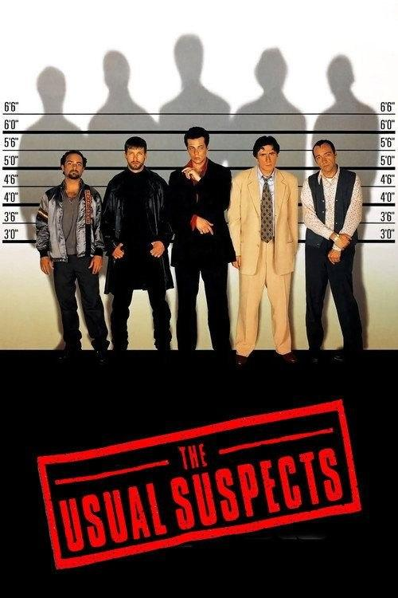
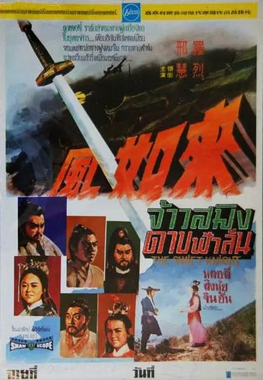
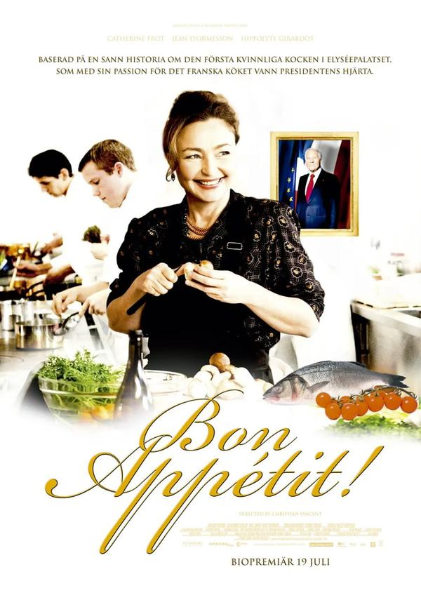
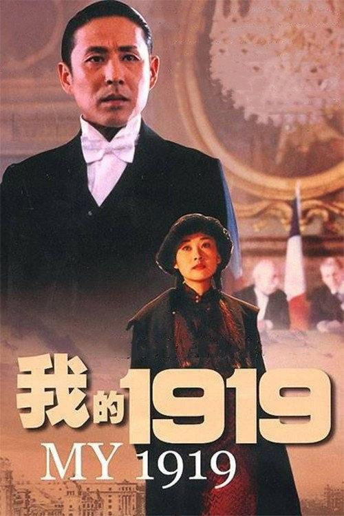
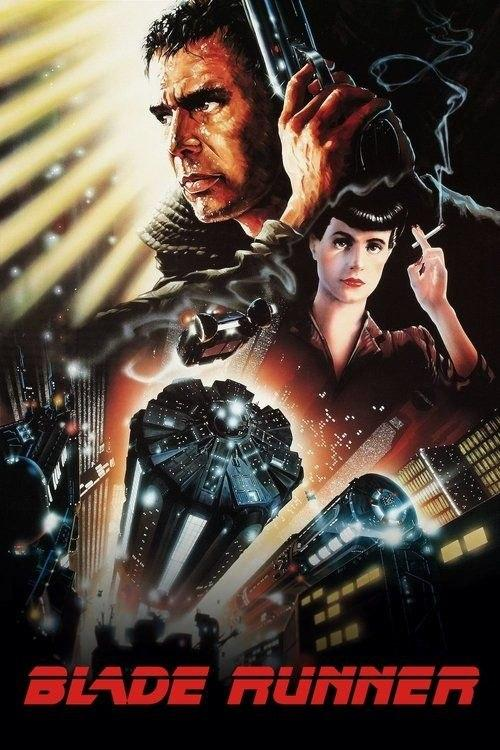
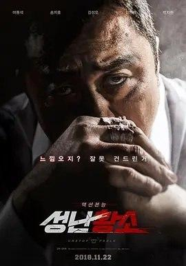
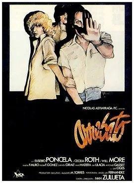
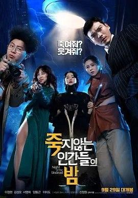
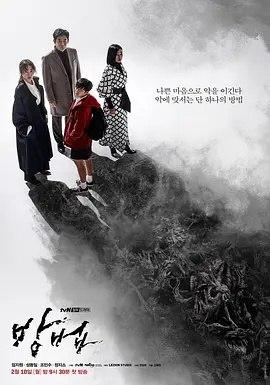
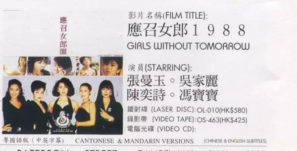

## 港囧

[2026-10-05 23:52] 来自：综合网盘资源频道

名称：港囧(2015)【1080p 原盘REMUX】【内封简繁】【喜剧/冒险】【徐峥/宝贝儿】

描述：徐来大学时期梦想成为一名油画家，也曾与同学杨伊有过一段难忘的初恋。多年后，他早已放弃画家梦想，与一直陪伴自己的蔡波结婚，并在岳父经营的内衣公司工作。一次同学聚会后，徐来得知已经成为画家的杨伊将在香港举办个展，埋藏多年的遗憾再次被唤醒。恰逢蔡波一家计划前往香港旅行，徐来便打算借机与杨伊偷偷见面，却被正在拍摄家庭纪录片的小舅子蔡拉拉一路缠住。两人在香港四处奔波的过程中，又意外卷入一宗坠楼命案，原本计划好的重逢之旅也彻底偏离了方向……

夸克网盘：https://pan.quark.cn/s/90708ce67844

百度网盘：https://pan.baidu.com/s/1Lc4TO3iZWVcSddO8ocBl4w?pwd=Yu88

📁 大小：17.6GB

🏷 标签：#喜剧 #港囧 #1080p #原盘REMUX #内封简繁 #冒险 #quark #baidu

---

## 非常嫌疑犯

[2026-10-05 23:41] 来自：电影资源频道(4K、REMUXE/原盘)

名称：【原盘】非常嫌疑犯 (1995) 4K REMUX 杜比视界 外挂简英双语字幕

描述：美国加州的圣佩雷罗港一艘货轮爆炸，死亡27人，9000万美元失踪。事故发生以后，联邦调查局探员白基奇在医院等待昏迷不醒的幸存者；海关特派员大卫（查兹•帕明特里 饰）则对另外一名拿到特赦令的幸存者金特（凯文•史派西 饰）进行了审问。金特供认，在事故中丧生的基顿（加布里埃尔•伯恩 饰）、法特（本尼西奥•德托罗 饰）、麦曼诺（斯蒂芬•鲍尔文 饰）和杜学尼（凯文•波拉克 饰），以及他本人，六个月前被警察局作为卡车抢劫案的疑犯带到警局过了一夜，五人因此结成了一个犯罪团伙，狼狈为奸，狠捞了好几笔。好景不长，某天，律师小林（皮特•波斯尔思韦特 饰）找到他们，让他们替神秘头目凯撒•苏尔烧掉货轮上的毒品。法特第一个退出，随即遭到杀害，剩下四人不得不接受了这个任务。在货轮上，麦曼诺、法特、基顿都没有找到毒品，也因此相继被凯撒杀害，船也被炸毁，金特因为留在岸上接应而侥幸生还。

夸克网盘：https://pan.quark.cn/s/f987e4869b6b

📁 大小：67.1GB

🏷 标签：#非常嫌疑犯 #惊悚 #悬疑 #犯罪

---

## 勇闯夺命岛

[2026-10-05 23:28] 来自：电影资源频道(4K、REMUXE/原盘)

名称：【原盘】勇闯夺命岛 (1996) 1080P REMUX 国英多音轨 内封简英双语字幕

描述：美国海军陆战队法兰（艾德•哈里斯 Ed Harris 饰）将军因不满政府对退伍、战死军人及其家属的补偿和福利不满，率领部下将美军最新研制的生化武器――VX毒气弹――偷运到罗克岛，劫持了81名正在该岛观光的游客，控制了该岛。要挟美国政府48小时内支付1亿元赎金否则将杀死人质并用毒气弹袭击旧金山。罗克岛之前曾是美国防卫最严密的监狱，易守难攻。美国政府偶然从档案中发现前英国特工梅森（肖恩•康纳利 Sean Connery 饰）曾顺利从该监狱出逃，于是他们请来了梅森，要求他30小时之内带领特种部队攻占这座“魔鬼岛”……

夸克网盘：https://pan.quark.cn/s/9639fb9c64e2

📁 大小：31.1GB

🏷 标签：#动作 #冒险 #勇闯夺命岛

---

## 金福南杀人事件始末

[2026-10-05 23:18] 来自：电影资源频道(4K、REMUXE/原盘)

名称：【原盘】金福南杀人事件始末 (2010) 1080P REMUX 外挂简中字幕

描述：在首尔金融业独自打拼的单身女子郑海媛（池成媛 饰）自然承受来自方方面面的巨大压力，她的情绪越来越紧张，最终不得不被迫休假。利用假期，海媛回到阔别已久的家乡无岛。这里风景秀美，民风粗犷甚至有些野蛮，男尊女卑的现象依然十分严重。海媛重逢了童年的玩伴金福南（徐英姬 饰），这是一个温和开朗、任劳任怨的女人，但是她的丈夫和家人都视其为猪狗，任意欺负和凌辱。福南希望女儿小燕拥有更好的人生，只是在这个蛮荒所在，人的尊严被肆意践踏。巨大的压力下，逆来顺受的福南化身为悲剧的复仇女王…… 本片为韩国名导金基德的导演助理张哲秀的长片处女作。

夸克网盘：https://pan.quark.cn/s/082c7b411236

📁 大小：23.1GB

🏷 标签：#剧情 #惊悚 #犯罪 #金福南杀人事件始末

---

## 香港奇案之字母小姐

[2026-10-05 22:55] 来自：综合网盘资源频道

名称：香港奇案之字母小姐 (1992)

描述：字母小姐为在香港轰动一时的桃色行骗案，钱志明于1980年代至1990年代利用不同化名，扮演扯皮条、电影编导及富家公子等多种身份，以优厚片约、房车及金钱等利诱女艺人发生性行为，多名女艺人被偷拍裸照及遭到勒索，有受害人不甘受骗，于1990年8月13日报警，事件揭发后震惊全香港。

案件于1991年开审时，法庭为了保护受害人身份，颁令传媒不得披露受害人资料，香港传媒于是以A、B、C、D、E、X小姐称呼6名女证人，此案件因而得名。最终钱志明被控告11项罪名，包括偷窃、勒索、诈骗、恐吓及诱使他人发生性行为，被判处入狱47个月。宣判前，他自称曾经与50至70名女艺人发生性行为，当中约一半为选美参赛者。

夸克网盘：https://pan.quark.cn/s/c43e76d2abcc

📁 大小：AA

🏷 标签：#剧情 #香港奇案之字母小姐 #quark

---

## 园艺杀手

[2026-10-05 22:39] 来自：综合网盘资源频道

名称：园艺杀手 Landscapers (2021)

描述：本剧由Sky和HBO联合制作，Olivia Colman和David Thewlis主演。Colman老公Ed Sinclair负责剧本，福田知盛担任导演。

改编自真实故事，讲述了Susan及Christopher Edwards二人独特的爱情故事。两人表面上是一对温文尔雅的普通英国夫妇，但当两具尸体在诺丁汉一所房子的后花园被发现时，他们成为了一项特别调查的焦点。

真实事件中，两人联手杀害了Susan的父母并埋在自家后院中，并一直冒领父母的退休金，超过10年才被揭发。

夸克网盘：https://pan.quark.cn/s/9d2ade21b4a1

📁 大小：AA

🏷 标签：#剧情 #喜剧 #园艺杀手 #quark

---

## 阴阳路5一见发财

[2026-10-05 22:32] 来自：综合网盘资源频道

名称：阴阳路5：一见发财 (1999)

描述：香港出租车夜晚拉客常常遇鬼，比如夜车司机林中发(古天乐饰)就差点载一女鬼(罗兰饰)前往荃湾，而同事“快车长”(雷宇杨饰)却遇见某女扮鬼诈骗，随后又载真女鬼前往和合石火葬场。嗜赌成性的林中发收工后被追债上门，为躲赌债不得已携妻子(李蕙敏饰)和儿子安仔搬入阴阳路上某廉价大屋，却发现房中闹鬼，吓得安仔夜夜哭泣不停。林中发向屋中鬼魂(吴毅将饰)赌咒发誓，若帮他畅通财路，便愿将自己所有一切分半同享。第二日，林中发发现屋中出现一组神秘数字，从此他所向披靡，逢赌必胜；但林中发没想到的是，屋中鬼魂要分的不仅是他的财富，还有他的妻子和儿子……

夸克网盘：https://pan.quark.cn/s/8b6672c3612d

📁 大小：AA

🏷 标签：#恐怖 #阴阳路5 #一见发财 #quark

---

## 江湖奇侠传

[2026-10-05 22:28] 来自：综合网盘资源频道

名称：江湖奇侠传 江湖奇俠傳 (1997)

描述：康熙五十七年，皇族秋猎，于木兰围场遇暴客行刺，戌卫精兵溃伤，哈达亲王殒命，康熙怒遣皇四子雍亲王(郑少秋饰)南下缉凶。雍亲王爱新觉罗胤禛遂化名傅示真，微服简从南下查案，于石门结识江南名儒之女吕丝丝(梁琤饰)，二人协力，铲桐山贼，保振远镖，几番出死入生，患难与共，情愫渐长，相知益深。

原木兰山左翼长刘勇，因行刺案遭牵连，身系囹圄，妻小流散。二子改从母姓，曰李卫，李才。卫辗转投至皇十四子大将军王麾下，于西疆屡建战功。才往石门奔东海书院，习文印诗，一心潜学。东海书院山长吕留良，即丝丝父，为士林巨擘，倡兴汉学，拒不仕清，又与反清组织江南八侠素有往来，深为朝廷所忌。

胤禛欲以康熙南巡发赈为饵，巧计拿敌。不意双方对峙少林之际，意外发现江南八侠之一虞慧儿，竟是十多年前落水失踪的十七格格，康熙望女得归，大喜，封为佛抱。

夸克网盘：https://pan.quark.cn/s/14d85ecc1627

📁 大小：AA

🏷 标签：#剧情 #奇幻 #古装 #江湖奇侠传 #江湖奇俠傳 #quark

---

## 康熙来了

[2026-10-05 22:22] 来自：综合网盘资源频道

名称：康熙来了 康熙來了 (2004)

描述：搞怪天后徐熙娣與才子頑童蔡康永聯手主持的『康熙來了』，自2004年推出以來，已製播超過一千集，節目收視率與人氣度年年成為台灣最受觀眾喜愛與最受媒體矚目的綜藝焦點。中天电视台

迅雷网盘：https://pan.xunlei.com/s/VP3BRQiyxj-uuFrQErreAbWRA1?pwd=angq

📁 大小：AA

🏷 标签：#脱口秀 #康熙来了 #康熙來了 #xunlei

---

## 来如风

[2026-10-05 22:16] 来自：综合网盘资源频道

名称：来如风 來如風 (1971)

描述：本武侠片拍于1971年，由郑昌和自编自导。故事描述，明皇身染恶疾，驾崩在即，却无子可继帝位；皇姪世子杰本可继位，惜不成器，难当大任。皇弟徽王想起明皇曾与东宫宫女生有子女各一，现时藏匿于东阳县，遂命锦衣卫刘玄平(金汉 饰)寻找公主与王子的下落。刘玄平路上屡遭世子杰爪牙追杀， 幸得侠士来如风(罗烈 饰)相助

夸克网盘：https://pan.quark.cn/s/cfffe97868e7

📁 大小：AA

🏷 标签：#动作 #来如风 #來如風 #quark

---

## 天乩之白蛇传说

[2026-10-05 21:24] 来自：综合网盘资源频道

名称：天乩之白蛇传说 (2018)

描述：小白蛇白夭夭初化人身，对世间的一切都感到懵懂无知，在九奚山修仙的紫宣不懂情却偏偏爱上了小白。历经了生死离别，紫宣转世成药师宫宫上许宣，在桃花节和白夭夭邂逅，历经波折两人终成眷属。但白夭夭为救许宣盗取仙草，触犯天条，病愈的许宣忆起前尘往事，只身救回夭夭。师妹冷凝嫉妒白夭夭，引得蛟龙出世，为祸人间。白夭夭为了自我救赎，被齐霄镇压于雷峰塔下，许宣悲痛欲绝...

迅雷网盘：https://pan.xunlei.com/s/VP3BDzgAlLNA_4rKqfDpYoBCA1?pwd=hhni

夸克网盘：https://pan.quark.cn/s/9b1f3b9a4931

📁 大小：AA

🏷 标签：#剧情 #爱情 #古装 #天乩之白蛇传说 #xunlei #quark

---

## 思美人

[2026-10-05 21:09] 来自：综合网盘资源频道

名称：思美人 (2017)

描述：春秋战国时期，周天子威望不在，是时诸侯并起，此消彼长，各领风骚。原本处于中原之外的蛮夷之国楚国历经数百年经营不断做大，终于在楚威王之时成为长江流域最为强大的国家。楚国不满偏于一隅，时时北上，问鼎中原。楚国人杰地灵，英贤辈出，其中最负盛名的便是绝代骚人屈原(马可 饰)。屈原少年得志，胸怀国家，一心要将楚国带向盛世顶峰。然而庙堂之上勾心斗角，波谲云诡，他不可避免被卷入权力斗争的漩涡中心。自比圣洁兰草，不屑于与群小为伍，自然而然他也遭到小人们的攻讦和构陷。在此期间，只有年轻时结识的民间女奴莫愁女(张馨予 饰)给予他最大的慰藉。

小人当朝，楚国国运江河日下，而屈原也逐渐走向命运的尽头

迅雷网盘：https://pan.xunlei.com/s/VP3BAR2PaOrYcXB3y5iVYYNKA1?pwd=8er2

📁 大小：AA

🏷 标签：#爱情 #古装 #思美人 #xunlei

---

## 深谷尸变

[2026-10-05 21:02] 来自：综合网盘资源频道

名称：深谷尸变 (1985)

描述：在我国的滇南地区，深山密林中间隐藏着多少不为人知的秘密。彝族老中医、县医院副院长普颇和担任医生的未婚女婿方文行走在莽林山间，寻找老看林人家祖传的医治跌打枪伤秘方。可是途中发生意外，普颇不慎跌落山谷，后来发现了一具装着普颇身份证却面目全非的尸体。这一事件令老人的女儿春艳悲痛万分。在一个万籁俱寂的夜晚，女儿独自坐在家中，望着父亲的遗照发呆。而就在此时，院子里传来了渗人脚步声，而来者竟然是本该死去的普颇，春艳被吓得几乎破了胆，她在夜色中夺路狂逃。死而复生的老人服毒自尽，这一离奇事件轰动了全城。

县公安局刑侦队长杜维斌奉命调查，在此过程中发现了人性最丑恶的一面

夸克网盘：https://pan.quark.cn/s/4b67778d8077

📁 大小：AA

🏷 标签：#悬疑 #深谷尸变 #quark

---

## 一代剑王

[2026-10-05 21:00] 来自：综合网盘资源频道

名称：一代剑王 一代劍王 (1968)

描述：郭南宏涉足武侠片领域是在《龙门客栈》在台湾掀起武侠片热潮之后。郭南宏虽然十年来都是执导文艺片，却应时改变风格，导演了武侠片《一代剑王》，影片由台湾首席武侠明星田鹏和上官灵凤主演，结果一鸣惊人。这部票房大卖的武侠片使郭南宏成为继张彻、胡金诠之后，香港电影市场上第三位“百万导演”。影片也成为台湾国语武侠电影的代表作之一。

《一代剑王》是部没有明确时代背景的古装刀剑武侠片，在这部片里，他起用了当时的影坛新人田鹏担任第一男主角。影片讲述武林各派之间的恩怨，故事比较俗套，但是由于武打设计是按照《大醉侠》等新派武侠的路子来走，将北派动作和日本武士片的武打动作相结合，观众倒也看着新鲜有趣。

夸克网盘：https://pan.quark.cn/s/fcba5625c86f

📁 大小：AA

🏷 标签：#剧情 #一代剑王 #一代劍王 #quark

---

## 匪帮传奇

[2026-10-05 20:54] 来自：综合网盘资源频道

名称：匪帮传奇 Gangster Squad (2013)

描述：20世纪40年代，前拳击冠军Mickey Cohen(西恩·潘 Sean Penn 饰)是洛杉矶最有势力的黑帮老大，他一边经营着卖淫、赌博等活动，一边贿赂洛杉矶警方和法官，在洛杉矶为非作歹，为霸一方。洛杉矶警官John O'Mara(乔什·布洛林 Josh Brolin 饰)嫉恶如仇，从来没有畏惧过Micky，刚刚破坏了他的一个卖淫窝点。这一次，洛杉矶警长Bill Parker决定对Micky展开决战，他让John组织一个秘密小组，以铲除Micky为目标。John在妻子的建议下，找到了他在警局的朋友Jerry(瑞恩·高斯林 Ryan Gosling 饰)，同时也是Micky的情人Grace(艾玛·斯通 Emma Stone 饰)的男朋友；神枪手Max Kennard；同样嫉恶如仇的黑人警察Coleman Harris；前情报机关人员Conwell Keeler；Max的徒弟，墨西哥人Navidad Ramirez，组成了Gangster Squad。他们在Micky家中安装了窃听装置，多次破坏Micky的行动，捣毁了他的多个赌博窝点。他们本以为胜券在握，不料真正的战斗才刚刚开始...

夸克网盘：https://pan.quark.cn/s/6c45eab27bbf

📁 大小：AA

🏷 标签：#剧情 #动作 #冒险 #匪帮传奇 #quark

---

## 神医喜来乐传奇

[2026-10-05 20:49] 来自：综合网盘资源频道

名称：神医喜来乐传奇 (2013)

描述：本剧是继2001年开拍的电视剧《神医喜来乐》(2003年播出)成就经典的十年之后，原班主创再续前缘的姊妹篇，由周振天担纲编剧、李保田领衔主演、柏杉升任导演。全剧延续前部故事和风格，情节更加跌宕起伏、角色形象更加丰满鲜活，并有全新人物登场。作品讲述了庚子年间，因得罪权贵被发配东北的神医喜来乐一家又被卷入时代的漩涡：喜来乐的死对头向洋人举荐其当军医；国难当头，宫廷内斗却依旧未曾停息……

夸克网盘：https://pan.quark.cn/s/d8df1e792437

📁 大小：AA

🏷 标签：#剧情 #古装 #神医喜来乐传奇 #quark

---

## 俘虏国度

[2026-10-05 20:46] 来自：综合网盘资源频道

名称：俘虏国度 Captive State (2019)

描述：影片讲述在地球已被外星人占领了10年之后的芝加哥市区，一股反抗势力异军突起，与服从派的政府势力产生了不可调和的矛盾，一场战斗由此而生。《俘虏国度》由焦点影业出品，将于3月29日在北美上映。

夸克网盘：https://pan.quark.cn/s/68df258cae0c

📁 大小：AA

🏷 标签：#科幻 #惊悚 #俘虏国度 #quark

---

## 神鬼八阵图

[2026-10-05 20:39] 来自：综合网盘资源频道

名称：神鬼八阵图 (2006)

描述：功盖三分国，名成八阵图，江流石不转，遗恨失吞吴。——唐 杜甫

公元两百年间，群雄并起，魏、蜀、吴三分天下，诸葛孔明穷毕生精力完成的“八阵图”，因为他的骤然辞世而不知所踪，但后人坚信，这部变化莫测的阵法兵书，会如诸葛武侯预言的，在六百年后再度出世，而且，“得八阵图者，得天下”。

转眼六百年将至，时当唐玄宗晚年。峻峭高耸的定军山中，世代守护着八阵图的“玄武门”门主马云风，不愿战乱再起，联合门中长老封印蠢蠢欲动的八阵图，谁知女魔头罂素闯入，打破封印，八道光冲天而起，刹时间地动天摇，山谷四壁上八将现形，各持兵器，分别为天灵针、闻悲琴、孔明扇、夜磷刀、龙腾鞭、紫薇剑、黄金戟、和后羿弓。

奄奄一息的马门主，交代门中最不成材的徒儿荀日照，尽快找到八位将军的后人和八种兵器，以免八阵图复出后落入奸人之手为祸苍生。

夸克网盘：https://pan.quark.cn/s/75a9bf47d791

📁 大小：AA

🏷 标签：#剧情 #动作 #古装 #神鬼八阵图 #quark

---

## 爱丽舍宫的女大厨

[2026-10-05 20:35] 来自：综合网盘资源频道

名称：爱丽舍宫的女大厨 Les saveurs du Palais (2012)

描述：女厨师霍腾瑟(凯瑟琳·弗洛 Catherine Frot 饰)在法国乡村里经营着一家小餐馆，因为使用的食材考究、制作精良，极具人格魅力的霍腾瑟在当地有着不小的名气。令霍腾瑟万万没有想到的是，自己的名气竟然吸引了法国总统的注意，就这样，她被共和国主席任命成为了总统的私人厨师。

从闲散的乡村小镇来到了充满着紧张气氛的爱丽舍宫，面对着一帮对她冷嘲热讽的尖刻同行们，霍腾瑟的压力可想而知，可即便如此，她还是很快凭借着自己的高超技术和良苦用心获得了同事们的尊重和总统的信任。之后，在后厨逐渐站稳脚跟的霍腾瑟亦和总统之间擦出了只可意会不可言传的暧昧火花。

夸克网盘：https://pan.quark.cn/s/ba11df57076f

📁 大小：AA

🏷 标签：#喜剧 #传记 #爱丽舍宫的女大厨 #quark

---

## 绝对男友

[2026-10-05 20:29] 来自：综合网盘资源频道

名称：绝对男友 絶対彼氏〜完全無欠の恋人ロボット〜 (2008)

描述：性格直率又天真，给对方造成压力而不自知，始终处于“失恋”状态的职场OL梨衣子(相武紗季饰)，某日意外地拥有了一个“理想男友”：奈特(速水もこみち饰)，奈特是一款“恋爱型”机器人，不单在外形和性格上完全符合女性的择偶标准，还会全心全意付出，且永远不变心。

可机器人毕竟是机器人，梨衣子无论如何都无法接受按程序机械地说话、做事的奈特，倒是在和表面吊儿郎当、实则具有雄韬伟略的室长创志(水嶋ヒロ饰)共同制作泡芙的过程中对创志暗生好感。

奈特和室长，究竟谁才是梨衣子的理想男友？到底，爱的本质是什么呢？

夸克网盘：https://pan.quark.cn/s/5803eef55fe3

📁 大小：AA

🏷 标签：#剧情 #喜剧 #绝对男友 #絶対彼氏 #完全無欠の恋人ロホット #quark

---

## 三进山城

[2026-10-05 20:27] 来自：综合网盘资源频道

名称：三进山城 (1965)

描述：抗日战争时期，胶东某地。日寇纠集数千人向我牙山根据地进行疯狂扫荡，城内兵力空虚。八路军某部郑团长(李干 饰)指示刘连长(梁音 饰)深入敌后，炸毁敌弹药库，切断敌人军火供应，减轻根据地压力。接任务后，他和张排长(仉长波 饰)、小马(张继强 饰)化装进城，潜入敌警备队大院，摸清了弹药储备和运输情况。鬼子队长小野(方化 饰)得知八路进城，命令侦缉队长刁德胜(王洁人 饰)加紧城内搜查和弹药库的警戒。并突然改变了弹药运输计划。刘连长再次进城，他们抓获了王翻译(孙傲 饰)，从其身上发现一份特务名单，用名单逼迫他交出小野的运输计划。刁德胜闻言赶来，不料刘连长己离开，这时敌弹药库被我炸毁

夸克网盘：https://pan.quark.cn/s/64fa8964f1c7

📁 大小：AA

🏷 标签：#战争 #三进山城 #quark

---

## 银河护卫队2

[2026-10-05 18:52] 来自：百度网盘综合频道

名称：【原盘】银河护卫队2 (2017) 4K REMUX 国英多音轨 外挂简英双语字幕

描述：火箭浣熊（布莱德利·库珀 Bradley Cooper 配音）偷走了大祭司阿耶莎（伊丽莎白·德比齐 Elizabeth Debicki 饰）的能量电池，包括星爵（克里斯·帕拉特 Chris Pratt 饰）、卡魔拉（佐伊·索尔达娜 Zoe Saldana 饰）、德拉克斯（戴夫·巴蒂斯塔 Dave Bautista 饰）在内的一行人遭到了后者派出的舰队的袭击。一个神秘人物乘坐着飞船救下了银河护卫队的众人，而驾驶着飞船的不是别人，竟然正是星爵的亲生父亲伊戈（库尔特·拉塞尔 Kurt Russell 饰）。在伊戈的带领下，星爵、卡魔拉和德拉克斯来到了由伊戈一手制造的星球上，而剩下的成员们则着手修复损坏的飞船。那边厢，阿耶莎委托勇度（迈克尔·鲁克 Michael Rooker 饰）抓住星爵替自己报仇，而卡魔拉亦渐渐发现了伊戈和善面目下隐藏的巨大阴谋。

百度网盘：https://pan.baidu.com/s/1QgvrUk_LR6ecFBsHbqtJHg?pwd=98ca

📁 大小：55.8GB

🏷 标签：#动作 #科幻 #冒险 #银河护卫队2

---

## 吞噬星空

[2026-10-05 18:51] 来自：夸克云盘影视资源频道

名称：吞噬星空（2020）4K 臻彩 S01E01 - E244

描述：暂无描述

夸克网盘：https://pan.quark.cn/s/6dd6973f36f8

百度网盘：https://pan.baidu.com/s/1ZRed-anCuHPnT0eahv9xGg?pwd=158e 来自：百度网盘综合频道 [2026-10-05 18:50] 名称：吞噬星空（2020）4K 臻彩 S01E01 - E244

📁 大小：213GB

🏷 标签：#Jack #剧情 #吞噬星空

---

## 从前有座灵剑山

[2026-10-05 18:27] 来自：综合网盘资源频道

名称：从前有座灵剑山 (2016) 1080p WEB-DL H264 AAC 2.0

描述：现代青年王陆意外进入灵剑山，拜入仙门后历经修行与冒险，逐渐成长为强者。

百度网盘：https://pan.baidu.com/s/1uuuVQchcFSsKIFBbrVKhEw?pwd=3gny

夸克网盘：https://pan.quark.cn/s/9b386d888bc4

📁 大小：X

🏷 标签：#从前有座灵剑山 #中国 #古装 #奇幻 #武侠 #喜剧 #1080p #WEBDL #AAC #baidu #quark

---

## 我和僵尸有个约会3永恒国度

[2026-10-05 18:23] 来自：综合网盘资源频道

名称：我和僵尸有个约会3：永恒国度 (2004) 1080p 中文字幕 H264 DDP 2.0

描述：二零零一年将臣大战时，况天佑和马小玲一方伤亡惨重，他俩也身负重伤，却幸运地被盘古族人所救。这对饱经劫难的爱侣被他们带到没有眼泪、没有仇恨的盘古族圣地中生活，可是一直被盘古族监禁的瑶池圣母，为与曾经离弃她的人王伏羲再续前缘，不惜将整个盘古族毁灭，还抢去了《天书》上卷逃到人间，欲将人界毁去，与人王共创永恒国度。原来，《天书》共分上、中、下三卷，只要三卷合一，便可拥有控制三界十方六道众生的力量，威力足以毁天灭地。为免人间浩劫再现，盘古长老使用了仅余的力量，将况天佑和马小玲送回现世，阻止瑶池圣母夺取天书的阴谋，况天佑和马小玲因此再次肩负起救世的重任，与命运对抗。

夸克网盘：https://pan.quark.cn/s/32c41abb2785

百度网盘：https://pan.baidu.com/s/1SFu0zkft1YAvlffUtZnYZQ?pwd=Yu88

迅雷网盘：https://pan.xunlei.com/s/VP3A_TCWT4yPToifBdetcerfA1?pwd=bts8

📁 大小：NG

🏷 标签：#剧情 #我和僵尸有个约会3 #永恒国度 #1080p #中文字幕 #quark #baidu #xunlei

---

## 赎罪

[2026-10-05 18:14] 来自：电影资源频道(4K、REMUXE/原盘)

名称：【原盘】赎罪 (2007) 1080P REMUX 内封简英双语字幕

描述：1935年夏天，来自一个宽裕的英国小康家庭的13岁的少女布里奥妮（斯奥里兹•罗南 饰）刚刚开始尝试写作,想象力丰富。一天，她暗中发现仆人的儿子——罗比•特纳（詹姆斯•迈克沃伊 饰）和她姐姐塞西利亚（凯特•奈特莉 饰）之间有暧昧关系，而且发现他给她写了一封充满情色意味的情书。布里奥妮丰富的想象力虚构着各种可怕的事情，浮想联翩。当她的表姐罗拉被强奸后，布里奥妮相当肯定她看到是罗比做的，这次指证使罗比蒙冤入狱，留下伤心欲绝的塞西利亚。第二次世界大战爆发了，出狱后的罗比和塞西利亚都投入了保卫祖国的战斗，布利奥妮放弃到剑桥升学成为一名军队医务人员。没有人能理解她的做法，只有她知道她怀揣着巨大的秘密和自责。她鼓起勇气，想把这秘密解开，能真正赎罪和得到宽恕。然而，世事幻变，出乎布利奥妮的意料。

夸克网盘：https://pan.quark.cn/s/fbaf38bf5f4e

📁 大小：26.7GB

🏷 标签：#赎罪 #剧情 #爱情 #悬疑

---

## 莫娣

[2026-10-05 18:13] 来自：综合网盘资源频道

名称：莫娣 (2016) 1080p 原盘REMUX 中文字幕 AVC DTS-HD MA 5.1

描述：位于加拿大东南部的新斯科舍省的某个偏远小镇上，生活着命运多舛的女人莫娣，她童年患上了小儿麻痹，痊愈后落下了关节炎的毛病，导致只能蹒跚而行，备受歧视。父母去世后，她寄居姨妈家里，却感受不到亲人的温暖。偶然机会，她看到一则招聘女佣的启示，虽然每月只有稀薄的1美元，但是她依然希望借此走出令人窒息的姨妈家。雇佣她的男人名叫埃弗里特·路易斯，他性格古怪内敛，脾气阴晴不定。莫娣最初饱受苛责甚至打骂，但她似乎认定了这个栖身之所，不仅努力打扫房间，还利用闲暇在墙壁上画出美丽的图案。而终于有一天，莫娣的天赋被人们所发现了……

百度网盘：https://pan.baidu.com/s/1cSg-wpd1ZOPZ0ZO6tocZ-g?pwd=Yu88

迅雷网盘：https://pan.xunlei.com/s/VP3AYOb_y2FyufyNx7jnW2FJA1?pwd=vvfu

📁 大小：27.2GB

🏷 标签：#历史 #爱情 #莫娣 #1080p #原盘REMUX #中文字幕 #DTSHD #baidu #xunlei

---

## 薄荷糖

[2026-10-05 18:09] 来自：电影资源频道(4K、REMUXE/原盘)

名称：【原盘】薄荷糖 (1999) 1080P REMUX 内封简中特效字幕

描述：1999年春天，对生活绝望的中年男子金永浩（薛景求饰），落魄地参与了同学会，他神经质般哭叫，并在高架桥上面对迎面而来的火车嘶喊：我要回去！火车带着记忆倒走，三天前的金永浩已然崩溃，欲寻了断，但是被神秘人物叫去见一个人；再之后是1994年，他生活放荡，对妻子（金丽珍饰）冷若冰霜又出手大打；1987年身为警察的他，手段凶悍；1984年、1980年一直到1978年，直到第7个片段通过初恋情人（文素利饰）以及“薄荷糖”这一点题信物，影片才给出是什么碾压过主人公的生命，粉碎其美好的答案。

夸克网盘：https://pan.quark.cn/s/da9d104c84b0

📁 大小：24.9GB

🏷 标签：#薄荷糖 #剧情

---

## 我的1919

[2026-10-05 18:04] 来自：电影资源频道(4K、REMUXE/原盘)

名称：我的1919 (1999) 4K 杜比视界

描述：1919年，随着第一次世界大战结束，被战火蹂躏的欧洲尚未恢复元气，旨在解决战争遗留问题和奠定和平基础的巴黎和会准备召开，中国作为战胜国之一，派出了时任驻美公使、全权代表顾维钧（陈道明 饰）等五人组成的代表团参加和会。然而在欧美各国以及日本等列强意欲重新划分势力范围的大环境下，中国代表团人数遭到削减、德国在山东的利益眼看也要落入日本之手。顾维钧在会议上慷慨陈词，驳斥日方无理要求，然而公理在利益面前显得多么脆弱。顾维钧好友肖克俭（何政军 饰）之妻梅（许晴 饰）专程赶赴巴黎，寻找投身爱国工人运动的克俭。克俭在法国的活动、以及国内浩大的群众呼声令和会中的顾维钧等感受到责任重大。

夸克网盘：https://pan.quark.cn/s/f8e42694b362

📁 大小：12.2GB

🏷 标签：#我的1919 #剧情 #历史 #传记

---

## 银翼杀手

[2026-10-05 18:00] 来自：电影资源频道(4K、REMUXE/原盘)

名称：【原盘】银翼杀手 (1982) 4K REMUX 杜比视界 内封简英双语字幕

描述：2019年11月的洛杉矶，大企业通过基因设计生产被称为“人造人”的有机机器人，用于地外殖民地的危险工作。前“银翼杀手”瑞克·戴克（哈里森·福特 饰）奉命复出，负责追捕并“退役”四名非法偷渡回地球的“连锁六型”人造人。在调查泰瑞公司期间，戴克对先进型号的人造人试验品瑞秋（肖恩·杨 饰）进行了测试，使其自以为人类的植入记忆被识破。与此同时，以罗伊·贝提（鲁特格尔·哈尔 饰）为首的人造人正试图接触创造者以延长仅剩四年的寿命。随着左拉等人在街头被捕杀，冲突不断升级，而戴克在与瑞秋产生情感联结的同时，也陷入了对人与人造人本质区别的深深质疑。

夸克网盘：https://pan.quark.cn/s/f6779c4a6a38

📁 大小：45.1GB

🏷 标签：#银翼杀手 #科幻 #惊悚

---

## 百灵潭

[2026-10-05 17:12] 来自：综合网盘资源频道

名称：百灵潭 (2021)

描述：讲述故事从两个好玩的男女主被绑在一起，去收集物灵的宿书开始，讲述了他们经历的各个物灵的故事。深挖每段情、每个物的内心世界，用爱情线和任务线共同营造出一个和观众“共情”的奇幻世界，而两个带任务的男女主经历了各个物的爱恨贪嗔痴，最后回归自己的情感世界

迅雷网盘：https://pan.xunlei.com/s/VP3AK4VD5q9Db88hOf7tX7hcA1?pwd=eihv

📁 大小：AA

🏷 标签：#剧情 #爱情 #古装 #百灵潭 #xunlei

---

## 不要和陌生人说话

[2026-10-05 16:51] 来自：综合网盘资源频道

名称：不要和陌生人说话 (2001)

描述：医院外科专家安嘉和(冯远征 饰)是众人眼中一等一的好男人，他的事业一帆风顺，然而他却是一个具有家庭暴力倾向的丈夫。梅湘南(梅婷 饰)是他的第二任妻子，由于她有一段不堪回首的往事难以启齿，不料丈夫却最终起了疑心。家庭暴力的阴影开始在二人之间滋长。恰巧一次家庭暴力行为被对面 楼的邻居叶斗拍了下来，为了不影响自己的前途，安嘉和向叶斗取回底片时，失手将其杀死。自此，安嘉和走上了不归路，不仅家庭暴力在迅速升级，为人也渐渐变得心狠手辣。

梅湘南屡次想逃出安嘉和的魔爪，却令她在噩梦中越陷越深。安嘉和的弟弟安嘉睦(王学兵 饰)是一名人民警察，在与大哥和嫂子的相处中渐渐察觉出这个家庭不为人知的一面。而记者郑同(曹卫宇 饰)也奋力相助湘南，在交往中，他亦渐渐喜欢上了这个坚强的女子

夸克网盘：https://pan.quark.cn/s/e38eef59457a

📁 大小：AA

🏷 标签：#剧情 #不要和陌生人说话 #quark

---

## 夜孔雀

[2026-10-05 15:11] 来自：影视动漫分享|SeedHub|夸克|网盘|🧲

名称：夜孔雀 (2016)

#电影 #爱情 #剧情 #夸克

主演: 刘亦菲 刘烨 余少群 

豆瓣: [5.0](https://movie.douban.com/subject/24743728/)

法国女留学生埃尔莎（刘亦菲饰）在成都爱上了丝绸研究员、尺八高手马荣（黎明饰），后又在巴黎与马荣的兄弟、纹身师建民（刘烨饰）之间产生情感。前者找到了一种符合他理想的蚕..

夸克网盘：https://pan.quark.cn/s/fd4a0d714080

---

## 愤怒的黄牛

[2026-10-05 15:11] 来自：影视动漫分享|SeedHub|夸克|网盘|🧲

名称：愤怒的黄牛 (2018)

#电影 #犯罪 #动作 #夸克 #迅雷 #百度

主演: 马东锡 宋智孝 金成伍 

豆瓣: [6.3](https://movie.douban.com/subject/30181789/)

过去曾是黑帮成员的东哲，努力洗清黑暗的过去，和天使般善良的妻子智秀过着平凡的生活。某天妻子智秀遭到绑架。不久，一通陌生来电表示要付东哲一笔钱，要求东哲将妻子卖给他…..

夸克网盘：https://pan.quark.cn/s/8983e4ff24ae

迅雷网盘：https://pan.xunlei.com/s/VOz5T2weg0d1y3SqQ4ePzgs4A1?pwd=nr2f

百度网盘：https://pan.baidu.com/s/11gvQx-e-4Wo_hJciWG7VrA?pwd=4xew

---

## 狂喜

[2026-10-05 15:11] 来自：影视动漫分享|SeedHub|夸克|网盘|🧲

名称：狂喜 (1979)

#电影 #恐怖 #剧情 #夸克 #百度

主演: 欧塞维奥·庞塞拉 塞西莉亚·罗特 威尔·摩尔 

豆瓣: [7.6](https://movie.douban.com/subject/2278780/)

陷入创作困境的恐怖片导演何塞在前女友折返而来的当日收到了一卷胶片，拍摄者是他的一位旧识、一个彼得·潘式的大男孩（角色的名字佩德罗·P也暗示了这一关联），后者久居于乡..

夸克网盘：https://pan.quark.cn/s/27cfad10a730

百度网盘：https://pan.baidu.com/s/1odTmjl4CnrQdBWKWKGvW_Q?pwd=vu46

---

## 他人即地狱

[2026-10-05 15:11] 来自：影视动漫分享|SeedHub|夸克|网盘|🧲

名称：他人即地狱 (2024)

#电影 #悬疑 #夸克 #迅雷 #百度

主演: 八村伦太郎 柳俊太郎 冈田结实 

豆瓣: [5.3](https://movie.douban.com/subject/37028636/)

「他人は地獄だ」は、地方から上京してきたユウが、不気味な入居者が暮らすシェアハウス「方舟」への入居をきっかけに、不可解な出来事が発生するサスペンスホラーだ。ヨンキ氏..

夸克网盘：https://pan.quark.cn/s/4629e6d13e52

迅雷网盘：https://pan.xunlei.com/s/VP2r8rIVoFBWxhmNfU8DIhgMA1?pwd=rcdm

百度网盘：https://pan.baidu.com/s/1lKuxbj_OgMlCnJQjumowlQ?pwd=n2w7

---

## 野山

[2026-10-05 15:11] 来自：影视动漫分享|SeedHub|夸克|网盘|🧲

名称：野山 (1986)

#电影 #剧情 #夸克

主演: 岳红 杜源 徐守莉 

豆瓣: [7.9](https://movie.douban.com/subject/1986919/)

西北地区秦岭深处，禾禾（杜源饰）是个见过世面的复员军人，他想通过辛勤的劳动改变自己和家人的生活状况，但倒霉的他烧窑窑塌、养鱼鱼死。媳妇秋绒（徐守莉饰）不满意他的折腾..

夸克网盘：https://pan.quark.cn/s/5e652675f71b

---

## 龙三和他的七人党

[2026-10-05 15:11] 来自：影视动漫分享|SeedHub|夸克|网盘|🧲

名称：龙三和他的七人党 (2015)

#电影 #动作 #喜剧 #夸克

主演: 藤龙也 樋浦勉 伊藤幸純 

豆瓣: [7.7](https://movie.douban.com/subject/26252157/)

年过七十的高桥龙三（藤龙也饰）曾是名噪一时的黑帮头目，而今他风光不再，委身寄居在儿子龙平（胜村政信饰）的家中，还得忍受孩子们各种指摘与批评。许是对曾经热血岁月的回忆..

夸克网盘：https://pan.quark.cn/s/1fda8af54f9d

---

## 招摇

[2026-10-05 15:11] 来自：影视动漫分享|SeedHub|夸克|网盘|🧲

名称：招摇 (2019)

#电视剧 #爱情 #古装 #奇幻 #百度

主演: 白鹿 许凯 代旭 

豆瓣: [5.9](https://movie.douban.com/subject/27075195/)

路招摇（白鹿饰）在出山后救下了墨青（许凯饰），却在争夺万钧剑时被墨青抢先一步。万钧剑出世的巨大冲击让路招摇身受重伤，经过五年的隐忍和治疗，她才得以痊愈。当她重返自己..

百度网盘：https://pan.baidu.com/s/1W77IuMMLvOjUxynw0vgkNg?pwd=em4h

---

## 夜疯狂

[2026-10-05 15:10] 来自：影视动漫分享|SeedHub|夸克|网盘|🧲

名称：夜疯狂 (1989)

#电影 #犯罪 #喜剧 #剧情 #夸克

主演: 郑裕玲 李美凤 陈奕诗 

豆瓣: [6.8](https://movie.douban.com/subject/1932573/)

幼稚园教师汪小云在一个晚上出外看戏消遗,看完戏后碰上打劫银行携着四千万赃款逃走的重伤劫匪阿B,她被挟持到夜店,在一间夜店中她和售货员玲玲等和阿B发生纠缠,阿B后来伤..

夸克网盘：https://pan.quark.cn/s/8473e1ffd06e

---

## 越狱协议

[2026-10-05 15:10] 来自：影视动漫分享|SeedHub|夸克|网盘|🧲

名称：越狱协议 (2020)

#电影 #动作 #惊悚 #剧情 #夸克

主演: 本杰明·维库纳 安帕罗·诺格拉 尤西比奥·阿瑞纳斯 

豆瓣: [7.0](https://movie.douban.com/subject/35130525/)

1990年1月29日晚上，智利民主过渡时期开始前不久，数十名政治犯从圣地亚哥的监狱中逃脱，24名激进分子花了18个月的时间挖一个隧道。他们用勺子，叉子和一把螺丝刀，..

夸克网盘：https://pan.quark.cn/s/f09c8b404bd4

---

## 瑟堡的雨伞

[2026-10-05 15:10] 来自：影视动漫分享|SeedHub|夸克|网盘|🧲

名称：瑟堡的雨伞 (1964)

#电影 #爱情 #歌舞 #剧情 #夸克 #百度

主演: 凯瑟琳·德纳芙 尼诺·卡斯泰尔诺沃 安妮·维尔侬 

豆瓣: [7.7](https://movie.douban.com/subject/1301646/)

17岁的少女Geneviève（凯瑟琳·德纳芙CatherineDeneuve饰）是法国瑟堡一家雨伞店老板娘的女儿；20岁的少年Guy（尼诺·卡斯泰尔诺沃NinoC..

夸克网盘：https://pan.quark.cn/s/b005a58a0850

百度网盘：https://pan.baidu.com/s/18oVIiPlSu7cb1JWdAov9Lw?pwd=1qpn

---

## 生死交锋

[2026-10-05 13:29] 来自：综合网盘资源频道

名称：生死交锋 (2007) 1080P 高码率 内封中英双语字幕

描述：本应在监狱中度过终生的蒂姆，通过与FBI达成协议：如果完成FBI的任务，便可以免除牢狱之灾。他必须伪装成一个传说中的毒品贩子Bobby Z去和墨西哥的一个毒品大佬进行人质交换。在交换时发生了枪战，假Bobby Z偷偷趁乱带着真Bobby Z6岁的儿子逃跑了……

夸克网盘：https://pan.quark.cn/s/3611b264b2a4

百度网盘：https://pan.baidu.com/s/10HBdbGtH1rW8CHd0E2BNdA?pwd=1314

📁 大小：16.30 GB

🏷 标签：#生死交锋 #剧情 #动作 #惊悚 #犯罪 #1080P #高码率 #内封中英双语字幕 #quark #baidu

---

## 大学生轶事

[2026-10-05 12:15] 来自：综合网盘资源频道

名称：大学生轶事 (1987)

描述：中央某报女记者在华夏市采访时碰到了一堆稀奇事：在这里，大学毕业生卖冰棍的有之，在法院门口代写状子的有之，卖生煎的有之。经过了解，女记者得知，这些学生所在的大学培养出这么多大学生，却因用人单位没有指标，没计划不能录用。女记者受毕业生的委托，开始奔波于市府各权力机关反映情况，但还是解决不了问题。女记者在京如实写了篇报道，并上了“内参”。国务院领导接见了学生代表，肯定了华夏大学的办学方针。

夸克网盘：https://pan.quark.cn/s/919cae2230d6

📁 大小：NG

🏷 标签：#剧情 #大学生轶事 #quark #ali

---

## 永生守卫

[2026-10-05 12:11] 来自：综合网盘资源频道

名称：永生守卫 The Old Guard (2020)

描述：一个名叫安迪(查理兹·塞隆饰)的战士领导了一个关系紧密的秘密雇佣兵团体，他们具有神秘的不死之身，为了保护凡人世界而战斗了几个世纪。但团队在受雇执行紧急任务时突然暴露了他们不寻常的能力，他们要依靠安迪和新加入的士兵奈尔(琪琪·莱恩饰)，帮助团队消除那些不择手段要复制他们的能力并从中获利的人所带来的威胁。

夸克网盘：https://pan.quark.cn/s/255955d6c486

📁 大小：NG

🏷 标签：#动作 #奇幻 #永生守卫 #quark #ali

---

## 我的青春谁做主

[2026-10-05 12:10] 来自：影视动漫分享|SeedHub|夸克|网盘|🧲

名称：我的青春谁做主 (2009)

#电视剧 #爱情 #剧情 #夸克 #迅雷

主演: 陆毅 赵子琪 王珞丹 

豆瓣: [7.6](https://movie.douban.com/subject/3873960/)

来自老北京的杨家三姐妹，因时代变迁，早年便分散各地。她们在不同的地方安家落户，结婚生子，新一代在不同的环境中成长，经历了人生的种种悲欢离合。渴望见识世界的钱小阳（王..

夸克网盘：https://pan.quark.cn/s/afb5479635d6

迅雷网盘：https://pan.xunlei.com/s/VOxzSDHe24WRi_4nhyR-9DTCA1?pwd=9h72

---

## 金燕子

[2026-10-05 12:10] 来自：影视动漫分享|SeedHub|夸克|网盘|🧲

名称：金燕子 (1968)

#电影 #古装 #动作 #爱情 #冒险 #武侠 #夸克 #百度

主演: 郑佩佩 王羽 罗烈 

豆瓣: [6.6](https://movie.douban.com/subject/1307957/)

白衣侠客尹鹏（王羽饰）自幼遭人仇视，虽有侠义之心，却心狠手辣，对女性总是自负冷漠，包括对他一心一意爱着的名妓梅娘。他唯独对师姐金燕子（郑佩佩饰）念念不忘，为了见到她..

夸克网盘：https://pan.quark.cn/s/498fea589d71

百度网盘：https://pan.baidu.com/s/17bnmUIv6Svus55cO5imdGg?pwd=7963

---

## 我不是精英

[2026-10-05 12:10] 来自：影视动漫分享|SeedHub|夸克|网盘|🧲

名称：我不是精英 (2017)

#电视剧 #爱情 #喜剧 #剧情 #迅雷

主演: 雷佳音 邓家佳 莫小奇 

豆瓣: [6.0](https://movie.douban.com/subject/26839485/)

饭和味阳，这对青梅竹马，一直秘密交往。他们瞒着父母，因为饭的母亲是外企白领，一直瞧不起没有稳定工作的魏静。然而，随着恋情曝光，两家矛盾激化。

饭的母亲逼迫英俊成功..

迅雷网盘：https://pan.xunlei.com/s/VP1OXF_vGoKU9I525VwNM7ogA1?pwd=autg

---

## 活死人之夜

[2026-10-05 12:10] 来自：影视动漫分享|SeedHub|夸克|网盘|🧲

名称：活死人之夜 (2020)

#电影 #惊悚 #科幻 #喜剧 #夸克

主演: 李贞贤 金成伍 杨东根 

豆瓣: [5.4](https://movie.douban.com/subject/33383780/)

颠覆三观科幻喜剧新品种💥想抓小三却意外抓到外星人老公⁉

【#老公不是人】10/30夫妻的弑界

👽脑洞大开！刷新三观！有够可笑！韩国科幻喜剧新品种..

夸克网盘：https://pan.quark.cn/s/48342424b99d

---

## 谤法

[2026-10-05 12:10] 来自：影视动漫分享|SeedHub|夸克|网盘|🧲

名称：谤法 (2020)

#电视剧 #惊悚 #悬疑 #奇幻 #夸克

主演: 严志媛 郑知晓 成东日 

豆瓣: [7.1](https://movie.douban.com/subject/34786921/)

这部剧讲述了一个邪神潜伏在全国最大的IT公司里的故事。唯一知道真相的是一位年轻女孩和一位记者。故事围绕着拥有强大能力的女孩和充满正义感的记者展开，她们携手阻止邪神的..

夸克网盘：https://pan.quark.cn/s/46fa4fd99365

---

## 百分之十

[2026-10-05 12:10] 来自：影视动漫分享|SeedHub|夸克|网盘|🧲

名称：百分之十 第四季 (2020)

#电视剧 #喜剧 #夸克

主演: 卡米尔·科坦 蒂博·德·蒙塔朗贝尔 格雷戈里·蒙泰尔 

豆瓣: [8.5](https://movie.douban.com/subject/30465556/)

本季客串明星包括：夏洛特·甘斯布，何塞·加西亚，西格妮·韦弗，桑德琳娜·基贝兰，弗朗克·迪博斯克..

夸克网盘：https://pan.quark.cn/s/092439892275

---

## 昼行闪耀的流星

[2026-10-05 12:10] 来自：影视动漫分享|SeedHub|夸克|网盘|🧲

名称：昼行闪耀的流星 (2017)

#电影 #爱情 #夸克

主演: 永野芽郁 三浦翔平 白滨亚岚 

豆瓣: [6.4](https://movie.douban.com/subject/26873577/)

与谢野雀（永野芽郁饰）自幼无拘无束的生长在乡间，性格天真而又开朗。雀考上了位于东京的高中，这也就意味着，她要离开父母，前往这座繁华而又时尚的城市，独自开始新的生活。..

夸克网盘：https://pan.quark.cn/s/87b77a6db0c6

---

## 低一点的天空

[2026-10-05 12:10] 来自：影视动漫分享|SeedHub|夸克|网盘|🧲

名称：低一点的天空 (2003)

#电影 #喜剧 #剧情 #夸克 #百度

主演: 钟欣桐 郑则士 黎耀祥 

豆瓣: [7.3](https://movie.douban.com/subject/1306691/)

肥猫（郑则士饰）虽然因为后天患病而中度弱智，可是他对生命充满了希望。细路祥（黎耀祥饰）是一个身患痉挛的年轻人，因为从小便常被取笑嘲弄，所以性格十分孤僻暴躁。白雪仙（..

夸克网盘：https://pan.quark.cn/s/18b07b7ac59e

百度网盘：https://pan.baidu.com/s/1upYu6M7MDyULNNJ1FUDHfw?pwd=z7c4

---

## 傲娇少女爱作战

[2026-10-05 12:10] 来自：影视动漫分享|SeedHub|夸克|网盘|🧲

名称：傲娇少女爱作战 (2017)

#电影 #爱情 #剧情 #迅雷

主演: 春原爱良 大下浩人 峯尾麻衣子 

豆瓣: [6.5](https://movie.douban.com/subject/30122606/)

一位初尝爱情滋味的高中女生，在教室里偶遇了一位足球明星在更衣室里的暧昧邂逅。你或许会以为一段纯情的爱情故事即将展开？别急！虽然女主角像广濑铃一样天真可爱，但千万别以..

迅雷网盘：https://pan.xunlei.com/s/VP-hotxbqq0yhI3IxjHbo3fzA1?pwd=knzy

---

## 夜枭

[2026-10-05 12:10] 来自：影视动漫分享|SeedHub|夸克|网盘|🧲

名称：夜枭 (2022)

#电影 #古装 #惊悚 #夸克

主演: 柳俊烈 柳海真 崔武成 

豆瓣: [7.1](https://movie.douban.com/subject/35587790/)

朝鲜王朝时期，千景洙（柳俊烈饰）是一位奇特的盲人。他白天生活在完全黑暗的环境中，夜晚却能重见光明。作为一名医生，他隐藏着这个秘密，每晚潜心钻研医术，最终成为仁宗（柳..

夸克网盘：https://pan.quark.cn/s/cc154143de79

---

## 请点赞

[2026-10-05 12:10] 来自：影视动漫分享|SeedHub|夸克|网盘|🧲

名称：请点赞 (2016)

#电影 #爱情 #喜剧 #夸克

主演: 刘亚仁 崔智友 李絮 

豆瓣: [6.5](https://movie.douban.com/subject/26340302/)

《请点赞》围绕三对男女讲述了发生在社交网络和现实生活中的爱情故事。韩文中的“点赞”同时有“喜欢”之意。而片中的三段爱情故事都是由“点赞”这样一个简单的动作发展而来的..

夸克网盘：https://pan.quark.cn/s/8e6b38a9de56

---

## 应召女郎1988

[2026-10-05 12:03] 来自：夸克云盘影视资源频道

名称：应召女郎1988 (1988)

描述：明星林珍妮（张曼玉 饰）在香港家喻户晓，但同时，她暗中做面向外地富商的应召女郎多年，在结束了一次远在泰国的应召之后，林在机场结识了爽朗的富家子弟史提芬（齐秦 饰），并与其渐渐坠入情网；主妇美凤（冯宝宝 饰）为了应付丈夫（冯淬帆 饰）高额的治疗费用，只得选择瞒着丈夫儿子做应召女郎，这分裂的生活给她的家庭带来了意外的巨变

夸克网盘：https://pan.quark.cn/s/64cb00f069fd

📁 大小：NG

🏷 标签：#剧情

---

## 莫娣

[2026-10-05 04:01] 来自：综合网盘资源频道

名称：莫娣 (2016) 1080p 原盘REMUX 中文字幕 AVC DTS-HD MA 5.1

描述：位于加拿大东南部的新斯科舍省的某个偏远小镇上，生活着命运多舛的女人莫娣，她童年患上了小儿麻痹，痊愈后落下了关节炎的毛病，导致只能蹒跚而行，备受歧视。父母去世后，她寄居姨妈家里，却感受不到亲人的温暖。偶然机会，她看到一则招聘女佣的启示，虽然每月只有稀薄的1美元，但是她依然希望借此走出令人窒息的姨妈家。雇佣她的男人名叫埃弗里特·路易斯，他性格古怪内敛，脾气阴晴不定。莫娣最初饱受苛责甚至打骂，但她似乎认定了这个栖身之所，不仅努力打扫房间，还利用闲暇在墙壁上画出美丽的图案。而终于有一天，莫娣的天赋被人们所发现了……

夸克网盘：https://pan.quark.cn/s/ae2bd3064882

📁 大小：27.2GB

🏷 标签：#历史 #爱情 #莫娣 #1080p #原盘REMUX #中文字幕 #DTSHD #quark

---

## 黑玫瑰公寓

[2026-10-05 02:36] 来自：综合网盘资源频道

名称：【原盘】黑玫瑰公寓 (1969) 1080P REMUX 内封简繁特效字幕

描述：荒凉的海边，迎来了一位不速之客。她名叫凉子(丸山明宏 饰)，真实姓名以及过往经历完全不详，在一家名为“黑蔷薇公馆”的私人俱乐部的老板邀请下，凉子来此驻唱。她每晚8点准时出现，充满魔性的歌声牵引着所有男人的心弦。然而，无论学者、政客还是富豪，没有一人能令凉子动心。它永远拿着一枝人造的黑色蔷薇，并且声称只有真正的爱情降临时，这支蔷薇才会变成红色。为过多久，接连有陌生男人来到公馆，他们似乎都与凉子有过一段难以忘怀的过去，而他们口中的凉子似乎又有着截然不同的性格。这些人中，有的为她命丧黄泉，他们的鲜血染红了凉子手中的黑蔷薇……

本片片头题字和画作由横尾忠则完成。

夸克网盘：https://pan.quark.cn/s/68a9a35d226b

百度网盘：https://pan.baidu.com/s/16DD7Z6-8n-VW5X82B33uhg?pwd=802a

📁 大小：19.8GB

🏷 标签：#黑玫瑰公寓 #剧情 #爱情 #原盘 #1080P #REMUX #内封简繁特效字幕 #ali #quark #baidu

---

## 虫图腾

[2026-10-05 02:17] 来自：综合网盘资源频道

名称：虫图腾 (2023) 4K 全30集

描述：民国时期，虫草堂名医潘俊与同为虫族五大家族后人相遇，得知祖上关于虫族宝藏的线索，从此踏上寻找族人遗留宝物的旅程。他们结伴而行，一起寻找能开启宝藏的五族秘宝，期间游历各地，探索祖上秘闻，一路上抗击瘟疫、打抱不平，眼看着离宝藏越来越近，却遭遇了盗宝者势力的打击，由此揭开了二十年前争夺宝藏的真相。他们也从最初对财富的渴望，渐渐背负起守护国家宝藏的使命，与盗宝者展开重重较量，最终粉碎了对方的贪婪之心，使传说中的虫族宝藏重见天日。在此过程中，他们学会了团队协作，结下了深厚的友情,以及发展了纯粹的爱情，从懵懂无知的少年成长为有责任感的英雄。

夸克网盘：https://pan.quark.cn/s/e5beb5fe053c

百度网盘：https://pan.baidu.com/s/1QPmHmLeeW6DMH6fLY1C0CA?pwd=51k1

📁 大小：36.2GB

🏷 标签：#虫图腾 #剧情 #悬疑 #冒险 #国剧 #4K #ali #quark #baidu

---

## 人间中毒

[2026-10-04 23:25] 来自：综合网盘资源频道

名称：人间中毒 (2014) 1080p 原盘REMUX 中文字幕 AVC DTS-HD MA 5.1

描述：越战英雄军官金镇平(宋承宪 饰)新接收了一个部下荆宇真大卫(温朱万 饰)，荆大卫的妻子钟佳欣(林智妍 饰)也随丈夫一同住进了军队官邸。镇平为佳欣的魅力所吸引无法自拔，以致发展出一段军中不伦之恋。该影片由执导过《方子传》、《淫乱书生》等影片的导演金大宇导演执导。一直以偶像形象示人的宋承宪首度挑战大尺度裸露戏份。

迅雷网盘：https://pan.xunlei.com/s/VP36Vpfqcwjg7BHs0cMPQFSSA1?pwd=49w6

📁 大小：31.9GB

🏷 标签：#爱情 #人间中毒 #1080p #原盘REMUX #中文字幕 #DTSHD #xunlei

---

## 风车

[2026-10-04 22:22] 来自：综合网盘资源频道

名称：风车 바람개비 (2023)

描述：《风车(暂译), 바람개비》由李尚勋导演执导，徐智厚、车善玗、刘智爱主演。讲述了回忆和伤痛交织在一起的年轻人的不明朗的生活和爱情故事。

夸克网盘：https://pan.quark.cn/s/71d3ff31ffc2

📁 大小：AA

🏷 标签：#动作 #风车 #quark

---

## 活火熔城

[2026-10-04 22:20] 来自：综合网盘资源频道

名称：活火熔城 Volcano (1997)

描述：一次大地震令洛杉矶地底深处的火山喷发，向着住宅区流去，维修地下管道的工人被烧死。地质学家艾美和朋友下去隧道勘测时亲身经历了朋友被岩浆喷发带走了生命。一时之间，城市一隅充满了地底爆发的岩浆。危机处理中心总指挥麦克(Tommy Lee Jones 饰)采取了艾美博士的建议开始疏散人群，他们先利用数百万吨空中降水来使来势汹汹的岩浆变成障碍物，阻挡了岩浆的流动。正当大家以为松一口气时，艾美博士认为岩浆并没有真正被阻挡，只是改变了流向，而且正在往充满伤员的医院奔涌。他们只剩下30分钟的时间去处理这个问题，他们能成功吗

夸克网盘：https://pan.quark.cn/s/8efdecfeacca

📁 大小：AA

🏷 标签：#剧情 #动作 #活火熔城 #quark

---

## 德拉克的回归

[2026-10-04 22:09] 来自：综合网盘资源频道

名称：德拉克的回归 Drak sa vracia (1968)

描述：与Stefan Uher和Elo Havatta一样，Eduard Grecner也是60年代斯洛伐克新浪潮电影的缔造者之一。他的三部影片《一周七天》(1964)《尼绒月亮》(1965)和这部《徳拉克的回归》都是斯洛伐克新浪潮电影的代表作。这部叙事方法独特带有明显意识流风格的黑白影片甚至间接影响到了后来法国导演格里耶在捷克拍摄的两部影片《说谎的人》和《Eden and After》。

夸克网盘：https://pan.quark.cn/s/fce49b7b9867

📁 大小：NG

🏷 标签：#剧情 #德拉克的回归 #quark #ali

---

## 无主之地

[2026-10-04 22:03] 来自：综合网盘资源频道

名称：无主之地 Borderlands (2024)

描述：莉莉丝(凯特·布兰切特 Cate Blanchett 饰)是一个有着神秘过去的赏金猎人，她被迫回到家乡——银河系中最混乱的潘多拉星球，任务是找到阿特拉斯(埃德加·拉米雷兹 Édgar Ramírez 饰)失踪的女儿。

夸克网盘：https://pan.quark.cn/s/4027a9d9967b

📁 大小：NG

🏷 标签：#喜剧 #动作 #科幻 #惊悚 #冒险 #无主之地 #quark #ali

---

## 最佳男朋友

[2026-10-04 21:46] 来自：综合网盘资源频道

名称：最佳男朋友 (1989)

描述：家琪是乐氏玩具公司的董事长，一场意外让她和执行董事彼得之间产生了误会，两人互相视彼此为眼中钉肉中刺。一束送错了人的鲜花让家琪渐渐改变了对待彼得的态度，而彼得亦发现了家琪的温柔可人之处，两人渐渐走到了一起。这让一直暗恋家琪的下属大卫感到十分嫉妒。

为了破坏家琪和彼得的感情，大卫找到了彼得的前妻，两人设下了一出假孕大计，果然让家琪以为彼得和前妻旧情复燃，两人因此爆发了激烈的争吵。与此同时，彼得的事业也遭遇了滑铁卢，心灰意冷的彼得决定辞职前往加拿大。知道这是家琪才发现原来自己一直错怪了彼得，她决定行动起来，挽回这段真挚的感情。

夸克网盘：https://pan.quark.cn/s/0cc443b66e37

📁 大小：AA

🏷 标签：#喜剧 #爱情 #最佳男朋友 #quark

---

## 捕蝇纸

[2026-10-04 21:45] 来自：综合网盘资源频道

名称：捕蝇纸 Flypaper (2011)

描述：男主人公特里普(帕特里克·德姆西 Patrick Dempsey饰)来到银行换钱，刚跟女柜员凯琳(艾什莉·贾德 Ashley Judd饰)搭上话，却悲催的碰到银行被打劫。银行保安系统开启，所有人都成了笼中之鸟。而更巧合的是居然有两伙抢劫犯。由此一段阴差阳错中展开的猫鼠大战拉开序幕。无辜的人质跟笨拙的劫匪间处处周旋，波澜中高潮不断。

夸克网盘：https://pan.quark.cn/s/bdc61c94da58

📁 大小：NG

🏷 标签：#喜剧 #悬疑 #犯罪 #捕蝇纸 #quark #ali

---

## Office有鬼

[2026-10-04 21:33] 来自：综合网盘资源频道

名称：Office有鬼 (2002)

描述：这是一部关于办公室鬼故事的电影。

新人阿Pat(莫文蔚 饰)刚来这栋大楼的一间公司上班，遇到了前男友阿Ken(冯德伦 饰)。两人聊了一会儿，随后阿Pat乘电梯回公司。电梯内一名只有白衣女子，她蹲在地上不停说“对不起”，阿Pat觉得十分诡异。同事说可能是鬼节将至造成…

阿Pat在厕所发现隔壁公司的秘书Connie在不停和最后一格的人说话，当时没有留意。之后女厕内突然传来一声尖叫，当众人赶到时，Connie已经在厕所上吊自杀身亡，她的脸上还挂着一个奇怪的笑容。

Ken在大堂也看到了白衣女子，身边还有一个红衣女子。红衣女子对他说，白衣女子是鬼，正在逼她跳楼

夸克网盘：https://pan.quark.cn/s/445edd5ef7d0

📁 大小：AA

🏷 标签：#剧情 #悬疑 #惊悚 #Office有鬼 #quark

---

## 处刑人

[2026-10-04 21:31] 来自：综合网盘资源频道

名称：处刑人 The Boondock Saints (1999)

描述：一对热血虔诚的爱尔兰裔兄弟，因自卫杀人而得罪黑帮，警署以正当防卫之名无罪释放。从此之后，二人决定以己之力对抗社会渣滓，购买武器以暴制暴，在朋友洛克(大卫·德拉·洛克David Della Rocco 饰)的帮助下清除犯罪分子。联邦警探保罗·斯迈克(威廉·达福 Willem Dafoe 饰)负责侦破案件，本来毫无头绪；但 在黑帮头子“老爸乔”(卡洛·罗塔 Carlo Rota 饰)雇佣了传奇枪手“公爵”(比利·康诺利 Billy Connolly 饰)对抗麦克马纳斯兄弟之后，情况却发生了意想不到的变化

夸克网盘：https://pan.quark.cn/s/046190e91eb5

📁 大小：AA

🏷 标签：#剧情 #动作 #冒险 #处刑人 #quark

---

## 斗鸡

[2026-10-04 21:23] 来自：综合网盘资源频道

名称：斗鸡 (1990)

描述：青年农民田来福(梁天 饰)与同村的姑娘孙春喜(傅艺伟 饰)相爱，却因贫穷受到春喜母女的轻视。春喜之母孙大婶(丁一 饰)以一万块钱的代价承诺将女儿嫁给二憨子(赵亮 饰)，惹得两个男人为了老婆大打出手。

某天，来福偶然在地里得到一只骁勇善战的斗鸡，在春喜母女的怂恿下，他战战兢兢走进斗鸡场，却没想到连连得胜，很快就凑够了结婚的钱。在二人的婚礼之上，誓不罢休的二憨子携一万块钱前来挑战，已身陷赌博泥潭的来福鬼迷心窍，竟用自己的新婚媳妇作了赌注……

本片于1991年获第十四届电影百花奖最佳男配角奖(陈裕德)，广播电影电视部1989—1990年优秀影片奖

夸克网盘：https://pan.quark.cn/s/c2a287259a5d

📁 大小：AA

🏷 标签：#剧情 #斗鸡 #quark

---

## 鹰神传奇

[2026-10-04 21:21] 来自：综合网盘资源频道

名称：鹰神传奇 Eagle (2024)

描述：A journalist uncovers the story of a ruthless assassin when she investigates a government cover up

夸克网盘：https://pan.quark.cn/s/2fbacf8fd2c7

📁 大小：AA

🏷 标签：#动作 #惊悚 #鹰神传奇 #quark

---

## 雪光之灾

[2026-10-04 21:18] 来自：综合网盘资源频道

名称：雪光之灾 Braven (2018)

描述：影片讲述了“海王”饰演的乔·布拉文与父亲(史蒂芬·朗)共渡狩猎假期，没想到竟踏入毒贩藏匿海洛因的窝点，面对疯狂的毒贩，父子二人只能与他们展开殊死搏斗。

夸克网盘：https://pan.quark.cn/s/438b06c676ff

📁 大小：AA

🏷 标签：#剧情 #动作 #雪光之灾 #quark

---

## 异教徒

[2026-10-04 21:17] 来自：综合网盘资源频道

名称：异教徒 Heretic (2024)

描述：两名女传教士被引诱到一个古怪危险的男人家里，试图改变他的信仰，开启了一场猫捉老鼠的游戏。

夸克网盘：https://pan.quark.cn/s/94378a0f0900

📁 大小：NG

🏷 标签：#惊悚 #恐怖 #异教徒 #quark #ali

---

## 一个好人

[2026-10-04 21:17] 来自：综合网盘资源频道

名称：一个好人 一個好人 (1997)

描述：澳大利亚墨尔本，华裔厨师积奇(成龙 饰)是当地小有名气的人物，定期在电视上主持烹饪节目。

毒枭金·卡洛(Richard Norton 饰)集团颇有势力，金·卡洛本人残暴冷酷，清除了敌对帮派的卧底之后率众和对方在仓库大打出手，而枪战全过程被记者戴安娜(Gabrielle Fitzpatrick 饰)用摄影机记录。在躲避贩毒集团追逐的路上，戴安娜巧遇积奇，后者仗义出手为她引开歹徒，孰料两人分手时戴安娜错将积奇的节目录像带当做证据带走。戴安娜的住处很快被贩毒集团找到，遍搜不获的歹徒们开始将目标转向积奇。积奇女友美琪(李婷宜 饰)远道来访，特意参加了积奇的节目录制，贩毒集团在录制现场围捕积奇，经过一番街头苦战，积奇终于脱险。黄雀在后的金·卡洛敌对帮派带走了美琪，要挟积奇用录像带换人，一时间，围绕着录像带，积奇、警方、以及两个犯罪集团陷入了混乱的争夺战。

夸克网盘：https://pan.quark.cn/s/16fff7602f24

📁 大小：AA

🏷 标签：#喜剧 #动作 #犯罪 #一个好人 #一個好人 #quark

---

## 灵幻至尊

[2026-10-04 21:13] 来自：综合网盘资源频道

名称：灵幻至尊 靈幻至尊 (1991)

描述：茅山弟子傲天龙(林正英 饰)与大黄(郑则士 饰)同时爱上了师傅的掌上明珠梦梦，师傅临终前设局考验二人谁更真心，大黄用计赢得了师傅的信任。虽然梦梦倾心天龙，无奈父命难为，天龙于是愤然出走。一晃十八年过去了，大黄和梦梦的儿子连高(金少龙 饰)已经长成英俊少年，而天龙的女儿凝红(黎姿 饰)也成年。天龙父女俩这天回家乡探亲，半途上遇到红袍火鬼为祸人间。天龙费尽九牛二虎之力将其收伏，关在鬼笼内。

回到家乡，大黄和天龙两师兄弟心里还是有隔阂，互相敌视。连高无意中放出了火鬼，此时的火鬼法力大增，天龙和大黄都已无法独力应付。为了对付火鬼，二人终于抛开成见，再次合作。

夸克网盘：https://pan.quark.cn/s/b9cc22c8829d

📁 大小：AA

🏷 标签：#剧情 #喜剧 #灵幻至尊 #靈幻至尊 #quark

---

## 如珠如宝的人生

[2026-10-04 21:08] 来自：综合网盘资源频道

名称：如珠如宝的人生 如珠如寶 (2019)

描述：30年前一宗金猪失窃未破案，本来是华探长中最好打的肥蟹(洪金寳饰)因太肥胖被革职，兼患上轻度脑退化，被从战场上回流的无分国界医生阮祥昌(院长)(林敏驄饰)连同其它捡回来的老人(吴耀汉、梁小龙、泰迪罗宾、恬妞)一起收留安置在祖传的安憩老人院中，并由院长昔日看护助手清清(王菀之饰)悉心照顾，安享晚年。院长小学同学，雨云集团创办人洪雨云(林雪饰)现今已是成功商人，因小时曾被院长欺负怀恨在心，誓要夺取院长的老人院，令院长一无所有，派出小职员阿俊(张继聪饰)、阿乐(林盛斌饰)前往混入捣乱。

夸克网盘：https://pan.quark.cn/s/56e3ea8d46af

📁 大小：NG

🏷 标签：#剧情 #喜剧 #动作 #如珠如宝的人生 #如珠如寶 #quark #ali

---

## 用甜酒漱口

[2026-10-04 21:05] 来自：综合网盘资源频道

名称：用甜酒漱口 甘いお酒でうがい (2020)

描述：本作以虚构的40多岁单身女性川嶋佳子所写日记著成的小说为蓝本，描绘了在某家公司作为派遣员工工作的佳子(松雪泰子)悲喜交加的日常生活。

夸克网盘：https://pan.quark.cn/s/fe9dbb91148b

📁 大小：NG

🏷 标签：#剧情 #用甜酒漱口 #甘いお酒てうかい #quark #ali

---

## 拂晓的爆炸

[2026-10-04 21:03] 来自：综合网盘资源频道

名称：拂晓的爆炸 (1984)

描述：《拂晓的爆炸》系列作为极具影响力的一电影，一直拥有极好的口碑，影片集合了徐元奇、庞敏、刘润成等众多领衔的人气阵容，配合更加精彩和跌宕起伏的故事情节，造就了《拂晓的爆炸》不容错过的收视传奇。

夸克网盘：https://pan.quark.cn/s/ee0d924c1cde

📁 大小：AA

🏷 标签：#剧情 #拂晓的爆炸 #quark

---

## 少年嘻哈梦

[2026-10-04 20:40] 来自：综合网盘资源频道

名称：少年嘻哈梦 The Get Down (2016) 全11集 1080P 高码率 内封中英双语字幕

描述：威尔·史密斯之子贾登·史密斯加盟音乐剧集《The Get Down》。剧情讲述一群生活在纽约市南布朗克斯郡青少年，关于街舞和街头文化的故事，小史密斯将饰演马库斯·吉卜林，一名才华横溢的涂鸦画家。

夸克网盘：https://pan.quark.cn/s/540c7d6d00c2

百度网盘：https://pan.baidu.com/s/1sb_X9j4Cqg70Png5AdvYdg?pwd=1314

📁 大小：61.92 GB

🏷 标签：#少年嘻哈梦 #布朗克斯街头少年音乐梦 #剧情 #1080P #高码率 #内封中英双语字幕 #quark #baidu

---

## 我的女儿素英

[2026-10-04 20:36] 来自：综合网盘资源频道

名称：我的女儿素英 내 딸 서영이 (2012)

描述：从小就很懂事的李素英(李宝英 饰)，志愿是和弟弟尚宇(朴海镇 饰)一起成为一名医生。但中途自己的父亲李项材(千浩振 饰)失业了。失业的父亲也不努力寻找工作，总是幻想着一夜暴富。赌博，借高利贷，拖累了素英一家人，尤其拖累的自己的妻子，妻子不久就抱病离世。妈妈的离去对素英是巨大的打击，她不得不放弃攻读医学院的机会，而是把尚宇送去了大学，对于父亲则是与日俱增的仇视。经过努力成为律师的素英结识了Winners社长姜禹才(李相允 饰)，得到了许久未得到的关爱。

而自己的弟弟尚宇则一直是父亲和姐姐中的纽带，希望可以缓解姐姐和父亲间的紧张情绪。一场父女之间亲情的，爱与恨的故事拉开序幕。

夸克网盘：https://pan.quark.cn/s/cf4d43b5ef10

迅雷网盘：https://pan.xunlei.com/s/VP35uUH6T4yPToifBdepwg9JA1?pwd=pbkz

📁 大小：AA

🏷 标签：#剧情 #家庭 #我的女儿素英 #quark #xunlei

---

## 吉屋藏娇

[2026-10-04 20:24] 来自：综合网盘资源频道

名称：吉屋藏娇 吉屋藏嬌 (1988)

描述：郑裕玲和尔冬升是一对准备结婚之同居男女，但由于某种原因，其原有之新居未能入住，因此便租住其好友郑丹瑞祖父之古老大屋内。利智及唐丽球本是郑丹瑞祖父卢海鹏之黑市夫人及侍婢，当二人死后其鬼魂仍留在大屋内等待卢之回来。人，鬼住在一起，便发生连串笑话...

夸克网盘：https://pan.quark.cn/s/c0d4859e2894

📁 大小：AA

🏷 标签：#喜剧 #爱情 #家庭 #吉屋藏娇 #吉屋藏嬌 #quark

---

## 狗牙

[2026-10-04 20:19] 来自：综合网盘资源频道

名称：狗牙 Κυνόδοντας (2009)

描述：本片讲述了一个与世隔绝的奇怪家庭。家庭成员由一对父母和大儿子、两个女儿组成，一家五口终日生活在一座隐秘的大宅子里。三个孩子自小被父亲隔离于此，他们不能接触除父母外的人，对高墙之外的世界几乎一无所知。父亲上班后，他们就与母亲在屋子里学习、玩耍。他们所有的知识都由父母教导，父亲告诉他们，外面的世界极其危险，而孩子们如果想要出去，必须等到“狗牙”脱落。

父亲是唯一可以驾车到外面去的人，他有一份正常的工作，会为孩子们带回生活必需品以及奖赏，他有时也会带回公司里一个女员工——克里斯蒂安，她是受雇来满足大儿子的性需求的。而她的几次到来，正在悄悄地改变这个家庭

夸克网盘：https://pan.quark.cn/s/f0baa57fe53a

📁 大小：AA

🏷 标签：#剧情 #狗牙 #quark

---

## 赤道

[2026-10-04 18:32] 来自：综合网盘资源频道

名称：【原盘】赤道 (2015) 4K REMUX 外挂简中字幕

描述：“赤盗”是南韩头号通缉犯，与头号副手(文咏珊饰)成功在生产浓缩铀原料的工厂夺走一批铀原料球。情报显示，他们会把铀原料球变成超级武器，并在香港与恐怖组织交易。来自中国内地的宋鞍(王学圻饰)跟助手袁晓文(冯文娟饰)，联同香港警察李彦明(张家辉饰)、范家明(余文乐饰)及香港大学物理系客座教授肇志仁(张学友饰)，加上南韩武器专家崔民浩(池珍熙饰)、朴宇哲(崔始源饰)等人，一同追缉赤盗，拯救亚洲史上最威慑武器危机事件。

夸克网盘：https://pan.quark.cn/s/5373536b0c6e

百度网盘：https://pan.baidu.com/s/1pC_SCFozmh7k4dST-Hdi6A?pwd=s132

📁 大小：43.5GB

🏷 标签：#悬疑 #动作 #犯罪 #赤道 #原盘 #4K #REMUX #外挂简中字幕 #ali #quark #baidu

---

## 当幸福来敲门

[2026-10-04 17:58] 来自：综合网盘资源频道

名称：【原盘】当幸福来敲门 (2006) 1080P REMUX 国英多音轨 内封简/繁英双语特效字幕

描述：克里斯•加纳(威尔·史密斯 Will Smith 饰)用尽全部积蓄买下了高科技治疗仪，到处向医院推销，可是价格高昂，接受的人不多。就算他多努力都无法提供一个良好的生活环境给妻儿，妻子(桑迪·牛顿 Thandie Newton 饰)最终选择离开家。从此他带着儿子克里斯托夫(贾登·史密斯 Jaden Smith 饰)相依为命。克里斯好不容易争取回来一个股票投资公司实习的机会，就算没有报酬，成功机会只有百分之五，他仍努力奋斗，儿子是他的力量。他看尽白眼，与儿子躲在地铁站里的公共厕所里，住在教堂的收容所里…… 他坚信，幸福明天就会来临。

夸克网盘：https://pan.quark.cn/s/a10976888f60

百度网盘：https://pan.baidu.com/s/1jk-x50onsWQ6dC_8HiJX8w?pwd=z98x

📁 大小：27.1GB

🏷 标签：#剧情 #家庭 #传记 #当幸福来敲门 #原盘 #1080P #REMUX #国英多音轨 #内封简 #ali #quark #baidu

---

## 桃乐丝罗奇的恐惧

[2026-10-04 17:39] 来自：综合网盘资源频道

名称：桃乐丝·罗奇的恐惧 The Horror of Dolores Roach (2023)

描述：The Horror of Dolores Roach is a grotesque Sweeney Todd-inspired tale of Eat or Be Eaten; a macabre urban legend of love, betrayal, weed, gentrification, cannibalism, and survival of the fittest. It follows the indomitable Dolores Roach, who returns to a New York City neighborhood that has changed drastically during the sixteen years she has been in prison.

When the promise of her newfound stability is quickly threatened,  Dolores and Luis become dangerously symbiotic, and Luis must unleash his own particular predilections.

夸克网盘：https://pan.quark.cn/s/2a1d1bcd530f

📁 大小：AA

🏷 标签：#悬疑 #剧情 #桃乐丝·罗奇的恐惧 #quark

---

## 九龙冰室

[2026-10-04 17:19] 来自：综合网盘资源频道

名称：九龙冰室 九龍冰室 (2001)

描述：九纹龙(郑伊健 饰)曾经叱咤江湖，这号风云人物却被人出卖，在泰国被拘捕。多年后他回到香港，在“九龙冰室”当侍应，打算就此在江湖销声匿迹。怎料一名6岁的男孩直呼自己爸爸，原来这个叫兆龙的男孩是当年他远赴泰国后女友Helen(莫文蔚 饰)生下的儿子。当年纹龙为了女友的安全 ，狠心不辞而别。兆龙的出现使纹龙的生活再次泛起波澜，他的气质吸引的儿子的班主任阿蒙(李彩桦 饰)。纹龙的身份还是被江湖之人发现了，并希望他能重振雄风。Helen再次见到的纹龙已经风光不再，她积极为纹龙的复出铺路，纹龙却不想再过问江湖事…

夸克网盘：https://pan.quark.cn/s/95b501da5f51

📁 大小：AA

🏷 标签：#剧情 #动作 #九龙冰室 #九龍冰室 #quark

---

## 太子传说

[2026-10-04 17:01] 来自：综合网盘资源频道

名称：太子传说 太子傳說 (1993)

描述：太子(张学友饰)自小被白虎抚养成人，爱护有加之余还把他训练成一具最有效用的杀人机器。 为更好的控制太子，白虎在太子十六岁生日那年，送了一名美貌异常的少女玉凤(刘嘉玲饰)给他作礼物，从此太子便纵情于情欲与杀人的生活里，但在太子的脑海经常出现一幅幻象，如梦的与一少女在草地上闲对着。一次，当太子授命杀人时，竟偶然碰上歌星翠儿(关之琳饰)，她的样貌一如太子的梦中情人。邂逅翠儿后，太子在性情上有了很大的转变，并对杀人这本视为理应的事感到厌倦。 白虎有见及此，伪装若无其事，并着太子干完最后一件任务后便可洗手不干。他安排太子往杀他们的头号敌人青龙，而就在最紧要的关头时，他告诉太子青龙就是他的亲生父亲。太了如何面对这个突然而来的血肉关系？而究竟玉凤与翠儿谁能获得太子真正的爱？

夸克网盘：https://pan.quark.cn/s/828e71efab90

📁 大小：AA

🏷 标签：#剧情 #太子传说 #太子傳說 #quark

---

## 我爱罗兰度

[2026-10-04 16:58] 来自：综合网盘资源频道

名称：我爱罗兰度 我愛羅蘭度 (1984)

描述：罗兰度(陈百祥 饰)是个开修车店的普通青年，但自命风流，一次偷用顾客的跑车出去泡妞，不想客人是个恶少，把他暴打了一顿。被送进医院的罗兰度偶然闯进富商之女阿蚊(夏文汐 饰)的病房，发现她是个心智只有几岁的低智姑娘，罗兰度陪她玩了起来，很快博得她的好感，并且被她父亲廖镖(董骠 饰)聘为保姆，专门逗阿蚊开心。相处之下，罗兰度和阿蚊变得难舍难分，但阿蚊已经被安排接受手术纠正智能，成功恢复的阿蚊变成了一个成熟优雅的少女，罗兰度知道，那个在自己面前开怀大笑的小姑娘已经不在了，他也遭到廖镖解雇，美好的回忆更加映衬现实的不可能…

夸克网盘：https://pan.quark.cn/s/58e8a7662c06

📁 大小：AA

🏷 标签：#剧情 #喜剧 #爱情 #我爱罗兰度 #我愛羅蘭度 #quark

---

## 追男仔

[2026-10-04 16:42] 来自：综合网盘资源频道

名称：追男仔 (1993)

描述：吴汉中(吴耀汉 饰)早年丧妻，独立抚养4个孩子：小东(林青霞 饰)、小南(张曼玉 饰)、小西(邱淑贞 饰)还有小北(林志颖 饰)。汉中的好友突然因病死亡，他感到生命的无偿，因此他想在有生之年可以看到孩子们成家立室，于是假扮绝症让女儿们带着男朋友回家。还是独身的女儿们只好找人假扮男友。小东找到一名男妓谢晒(梁家辉 饰)，小南找到了一个黑社会的小混混(张学友 饰)，小西找到的则是一个清纯男(郑伊健 饰)。这时汉中以前的女友(吴君如 饰)得知汉中的身家斐然又罹患癌症便想成为他的妻子，众儿女都看到她的面目，只是顾及父亲的时日不多。而她们也对各自的假男友，产生了真感情。

夸克网盘：https://pan.quark.cn/s/09096c01b61e

📁 大小：AA

🏷 标签：#剧情 #追男仔 #quark

---

## 会计刺客

[2026-10-04 16:39] 来自：综合网盘资源频道

名称：会计刺客 The Accountant (2016)

描述：沉默而神秘的数学天才克里斯蒂安·沃尔夫(本·阿弗莱克 饰)，从事的则是默默无闻的会计行业，专门为世界各大犯罪机构做账。随着财政部官员雷·金(J·K·西蒙斯 饰)对于金融犯罪的关注，克里斯蒂安找来一家合法人工智能公司客户作为掩护，而该公司的会计(安娜·肯德里克 饰)似乎发现了上百万美元的财务差额。克里斯蒂安接下来要面对的不仅是当局的调查，还有更严重的人身危险。

夸克网盘：https://pan.quark.cn/s/464a7a1ca594

📁 大小：AA

🏷 标签：#动作 #惊悚 #会计刺客 #quark

---

## 东京爱情故事2020

[2026-10-04 16:34] 来自：综合网盘资源频道

名称：东京爱情故事2020 東京ラブストーリー (2020)

描述：永尾完治(伊藤健太郎 饰)从位于家乡爱媛的分公司被被调到了东京的总公司上班，在这里，他遇见了同事赤名莉香(石桥静河 饰)。刚见面，赤名莉香大大咧咧敢怒敢爱的个性就带给了完治非常深刻的印象。

三上健一(清原翔 饰)是完治的高中同学，如今也在东京工作生活，两人相约下班后一起去喝酒，让完治没有想到的是，在酒局上，他竟然和学生时代暗恋过的女孩关口里美(石井杏奈 饰)重逢了。里美的出现重新点燃了完治内心里悸动的火焰。完治发现自己的钱包落在了公司里，于是还在公司的莉香将钱包带来店里给完治，三上似乎对莉香有着非常浓厚的兴趣，四人之间纠葛的感情就此拉开了序幕。

夸克网盘：https://pan.quark.cn/s/fc9daa67a4a5

📁 大小：AA

🏷 标签：#爱情 #東京ラフストーリー #quark

---

## 法老与众神

[2026-10-04 16:32] 来自：综合网盘资源频道

名称：法老与众神 Exodus: Gods and Kings (2014)

描述：摩西(克里斯蒂安·贝尔 Christian Bale 饰)和法老拉美西斯二世(乔尔·埃哲顿 Joel Edgerton 饰)是情同手足的好兄弟，彼此之间感情十分要好。摩西得到了神的旨意，决心将成千上万的犹太人民从水深火热的生活之中解救出来，他向拉美西斯寻求帮助，然而，这位好友却十分坚决地拒绝了他。不仅如此，拉美西斯还对犹太人进行了惨无人道的屠杀。

为了惩罚拉美西斯的暴行，神在埃及降下了“十灾”，一时间，埃及陷入了混乱与死亡的阴影之中，然而，拉美西斯并没有因此而有所醒悟，最终，他和摩西成为了宿敌。摩西知道何为自己的使命，他带领着四十万希伯来人踏上了漫漫旅途，寻找一片属于他们的家园。

夸克网盘：https://pan.quark.cn/s/c17bb8e2f4df

📁 大小：AA

🏷 标签：#动作 #冒险 #剧情 #法老与众神 #quark

---

## 百年好合

[2026-10-04 16:18] 来自：综合网盘资源频道

名称：百年好合 (2003)

描述：富豪洪飞虎(古天乐 饰)因怪病找到峨嵋派掌门王凤(郑秀文 饰)，她对飞虎的生性傲慢毫无好感，于是用尽各种奇怪的方法治疗飞虎。王凤的师姐李莫愁(李冰冰 饰)突然出现，并扬言要铲除峨嵋派。未免伤及无辜，王凤尽快医好了飞虎。知道了王凤的恶作剧之后，飞虎愤然离开了。

为了与师姐决战，王凤急需练好“伤心断肠剑”，但从未经历伤心之苦的她 无法领悟“百年好合”这一招式的要领，王凤在众人的劝说下决定求助与飞虎。飞虎不计前嫌，用尽办法让王凤伤心，练好招式。王凤又能否成功？

夸克网盘：https://pan.quark.cn/s/b3d4ca54fb4d

📁 大小：AA

🏷 标签：#剧情 #动作 #喜剧 #爱情 #百年好合 #quark

---

## 犬神家族

[2026-10-04 15:23] 来自：影视动漫分享|SeedHub|夸克|网盘|🧲

名称：犬神家族 (1976)

#电影 #恐怖 #剧情 #悬疑 #夸克

主演: 石坂浩二 岛田阳子 青井辉彦 

豆瓣: [7.7](https://movie.douban.com/subject/1729037/)

犬神制药创始人犬神佐兵卫（三国连太郎饰）一生不曾娶妻，却有三个女儿松子（高峰三枝子饰）、竹子（三条美纪饰）、梅子（草笛光子饰），另收养恩人野野宫大式孙女珠世（岛田阳..

夸克网盘：https://pan.quark.cn/s/ce98775b0167

---

## 博斯传承

[2026-10-04 12:44] 来自：综合网盘资源频道

名称：博斯：传承 (2022) 全3季 4K SDR高码率 内封简繁英多国字幕

描述：退休后的凶杀案警探哈里·博斯当起了私家侦探，在欠缺前一份工作所赋予他的权力的情况下，努力破案。“财迷”哈妮·钱德勒律师在遭遇了一次谋杀未遂后，努力保持对司法系统的信心。麦迪·博斯发现了在洛杉矶街头当一名新秀巡警的可能性和挑战。

夸克网盘：https://pan.quark.cn/s/20dc6204e6a7

百度网盘：https://pan.baidu.com/s/1hy63cHIkqe-JyXNXkrwvjw?pwd=1314

📁 大小：127.32 GB

🏷 标签：#博斯传承 #犯罪 #剧情 #4K #SDR高码率 #内封简繁英多国字幕 #quark #baidu #guangyapan

---

## 狼烟

[2026-10-04 12:11] 来自：影视动漫分享|SeedHub|夸克|网盘|🧲

名称：狼烟 (2013)

#电视剧 #战争 #剧情 #夸克

主演: 连奕名 杨若兮 王珂 

豆瓣: [5.5](https://movie.douban.com/subject/11625223/)

《狼烟姐妹》取材于上世纪二三十年代的湘西，把当地苗、侗、土家等独具特色的民族文化进行全景式展现。由国内优秀青年导演孙小光执导，知名演员连奕名、杨若兮、王珂等领衔主演..

夸克网盘：https://pan.quark.cn/s/0c8b86c6adee

---

## 斗龙战士之龙印之战

[2026-10-04 12:10] 来自：影视动漫分享|SeedHub|夸克|网盘|🧲

名称：斗龙战士之龙印之战 (2015)

#电视剧 #冒险 #夸克

主演: 吴凡 陈智斌 张洋 

豆瓣: [7.0](https://movie.douban.com/subject/26608204/)

故事讲述在22世纪的人类世界，一只身份来历不明的火恐龙横空降落在洛小熠等六名斗龙战士的生活城市，相继吸引了阿迪和六大守护龙前来人类世界，为了追踪火恐龙真相，阿迪与斗..

夸克网盘：https://pan.quark.cn/s/7f234b2bf50a

---

## 大汉十三将之血战疏勒城

[2026-10-04 12:10] 来自：影视动漫分享|SeedHub|夸克|网盘|🧲

名称：大汉十三将之血战疏勒城 (2019)

#电影 #历史 #夸克 #百度

主演: 谢苗 陈梦希 热依娜 

豆瓣: [5.7](https://movie.douban.com/subject/30353507/)

《大汉十三将之血战疏勒城》是由浙江美视众乐文化传播有限公司于2019年推出的一部历史、战争、古装、爱情类型影片，该片由回宇执导，谢苗、陈梦希、热依娜主演。讲述了公元..

夸克网盘：https://pan.quark.cn/s/60ebb7437d32

百度网盘：https://pan.baidu.com/s/1yRetT7TRIzfqjbNKHrRseA?pwd=s024

---

## 母仪天下

[2026-10-04 12:10] 来自：影视动漫分享|SeedHub|夸克|网盘|🧲

名称：母仪天下 (2008)

#电视剧 #历史 #古装 #迅雷

主演: 袁立 黄维德 桑叶红 

豆瓣: [7.5](https://movie.douban.com/subject/3155474/)

西汉宣帝时期，王氏和春雨都是宫廷御医。后来，她们受人陷害，最终一人自尽，一人被处死。春雨的女儿春雨瑶（桑烨红饰）亲眼目睹了母亲和姐姐的惨死，从此对王氏的女儿王正君（..

迅雷网盘：https://pan.xunlei.com/s/VOz1ceKo67UJiRWNK0xRm_H6A1

---

## 僵

[2026-10-04 12:10] 来自：影视动漫分享|SeedHub|夸克|网盘|🧲

名称：僵 (2016)

#电视剧 #爱情 #科幻 #迅雷 #百度

主演: 郑嘉颖 谢安琪 陈凯琳 

豆瓣: [6.1](https://movie.douban.com/subject/26331094/)

活著（郑嘉颖饰）是拥有不死之身的僵尸猎人，他隐藏了真实的身份，希望有朝一日能够捕获和自己有着百年怨仇的僵尸凌风（陈山聪饰）。何年（黄又南饰）、何月（陈嘉宝饰）和简霆..

迅雷网盘：https://pan.xunlei.com/s/VP2m_xFA20v7sV6eEHi1OOV1A1?pwd=fr3c

百度网盘：https://pan.baidu.com/s/1pnKm5q8ZeD5Fuo4Ppukvhg?pwd=zr3m

---

## 灵与肉

[2026-10-04 12:10] 来自：影视动漫分享|SeedHub|夸克|网盘|🧲

名称：灵与肉 (2018)

#电视剧 #历史 #剧情 #迅雷 #百度

主演: 于谨维 孙茜 黄小蕾 

豆瓣: [7.7](https://movie.douban.com/subject/25923576/)

新中国诞生前夕，身为资本家的父亲抛弃了11岁的许灵均前往美国。60年代初因父亲是资本家而被错划成右派的许灵均（于小伟饰）下放贺兰山农场七队劳动改造，并与美丽善良的李..

迅雷网盘：https://pan.xunlei.com/s/VP1EA3RzSUMFlMLaMgbWG7sjA1?pwd=sdd3

百度网盘：https://pan.baidu.com/s/1oFn66vNjDcqNkcTgWcUByg?pwd=5e2u

---

## 博斯

[2026-10-04 11:03] 来自：综合网盘资源频道

名称：博斯 (2015) 全7季 4K SDR高码率 内封简繁英多国字幕

描述：在第一季中，洛杉矶警察局凶杀案警探哈里-博什(Harry Bosch)因枪杀一名连环谋杀案嫌疑人而受审，同时，一个涉及失踪男孩遗体的悬案迫使Bosch面对自己的过去。勇敢的新人Julia Brasher吸引了他的注意，部门政治也在升温，Bosch将不惜一切代价追求正义。

夸克网盘：https://pan.quark.cn/s/0bf87946b0d7

百度网盘：https://pan.baidu.com/s/15vEITm3Ow5JAP3iYoyLERw?pwd=1314

📁 大小：334.00 GB

🏷 标签：#博斯 #悬疑 #剧情 #犯罪 #4K #SDR高码率 #内封简繁英多国字幕 #quark #baidu #guangyapan

---

## 招摇

[2026-10-04 10:50] 来自：综合网盘资源频道

名称：招摇 (2019)4K WEB-DL H265 DDP 2.0

描述：万戮门门主路招摇与厉尘澜历经波折，在相爱相杀中携手走过江湖风云，最终走到一起。

链接：

夸克网盘：https://pan.quark.cn/s/0a50a3f6d037

百度网盘：https://pan.baidu.com/s/1W77IuMMLvOjUxynw0vgkNg?pwd=em4h 来自：综合网盘资源频道 [2026-10-04 08:19] 名称：招摇 (2019)4K WEB-DL H265 DDP 2.0

📁 大小：X

🏷 标签：#招摇 #古装 #爱情 #玄幻 #武侠 #中国大陆 #郑伟文 #白鹿 #许凯 #代旭 #肖燕 #4K #WEBDL #baidu #quark

---

## 济公

[2026-10-04 09:18] 来自：综合网盘资源频道

名称：济公 (1985) 4K 游本昌 全12集

描述：南宋时期，杭州灵隐寺住这一位疯癫和尚，人称济公，传说为罗汉转世。他本姓李，祖上乃宋太宗驸马。济公二十七岁出家，不戒酒肉，破衣拉撒，不知情者皆道其疯癫，却不知其实为得到高僧。济公济困扶危，惩治强梁，经常用一些诙谐的小法术教训那些欺压百姓、鱼肉乡民的奸佞恶霸。恶人提起他又恨又怕，百姓们则对济公师父爱戴有佳。1988年，电视连续剧《济公》红遍大江南北，主题歌“鞋儿破、帽儿破，身上的袈裟破……”更被广为传唱。1998年由北京本昌文化艺术传播中心、格力电器股份公司、浙江有线电视台、北京国安广告总公司联合制作的２０集电视连续剧《济公游记》摄制完成，与观众阔别10年的济公师父再次归来

夸克网盘：https://pan.quark.cn/s/fa3c9b259c5a

百度网盘：https://pan.baidu.com/s/1l-MzQFjfJt4bb4PcM7yMFQ?pwd=6125

📁 大小：21.9GB

🏷 标签：#济公 #喜剧 #奇幻 #古装 #国剧 #4K #游本昌 #ali #quark #baidu

---

## 天行者

[2026-10-04 08:19] 来自：综合网盘资源频道

名称：天行者 (2006) 1080p H264

描述：叶秋出狱后决定洗心革面，成立企业重新开始，却卷入警方特别小组针对新旧黑帮势力的调查与角力。

百度网盘：https://pan.baidu.com/s/1wFjSGLykcX42Jeo5C14hNQ?pwd=rvgq

迅雷网盘：https://pan.xunlei.com/s/VP33Dm0eDtMve2zKCWG01YdOA1?pwd=fs63

夸克网盘：https://pan.quark.cn/s/8634ade91ffe

📁 大小：X

🏷 标签：#天行者 #动作 #犯罪 #中国香港 #阮世生 #郑伊健 #冯德伦 #方中信 #张智霖 #周丽淇 #1080p #baidu #xunlei #quark

---

## 东离剑游纪

[2026-10-04 08:19] 来自：综合网盘资源频道

名称：东离剑游纪 (2016) 1080p WEB-DL H264 AAC 2.0

描述：为夺回被夺走的天刑剑，丹翡、凛雪鸦与殇不患结伴踏上旅途，闯入七罪塔，与各路高手展开惊险对决。

夸克网盘：https://pan.quark.cn/s/586be0b77f54

📁 大小：X

🏷 标签：#东离剑游纪 #奇幻 #武侠 #布袋戏 #台日合作 #黄强华 #王嘉祥 #鸟海浩辅 #诹访部顺一 #中原麻衣 #铃村健一 #1080p #WEBDL #AAC #quark

---

## 人间中毒

[2026-10-04 08:19] 来自：综合网盘资源频道

名称：人间中毒 (2014) 1080p 原盘REMUX 中文字幕 AVC DTS-HD MA 5.1

描述：越战归来的军官金镇平与下属的妻子钟佳欣相遇后陷入禁忌恋情，在压抑的环境中逐渐越陷越深。

夸克网盘：https://pan.quark.cn/s/661a360380c6

📁 大小：X

🏷 标签：#人间中毒 #剧情 #爱情 #情色 #韩国 #金大佑 #宋承宪 #林智妍 #赵汝贞 #温朱万 #1080p #原盘REMUX #中文字幕 #DTSHD #baidu #quark

---

## 人间中毒

[2026-10-04 03:33] 来自：综合网盘资源频道

名称：人间中毒 (2014) 1080p 原盘REMUX 中文字幕 AVC DTS-HD MA 5.1

描述：越战英雄军官金镇平(宋承宪 饰)新接收了一个部下荆宇真大卫(温朱万 饰)，荆大卫的妻子钟佳欣(林智妍 饰)也随丈夫一同住进了军队官邸。镇平为佳欣的魅力所吸引无法自拔，以致发展出一段军中不伦之恋。该影片由执导过《方子传》、《淫乱书生》等影片的导演金大宇导演执导。一直以偶像形象示人的宋承宪首度挑战大尺度裸露戏份。

百度网盘：https://pan.baidu.com/s/1UzofEt8_h8P6-K49AAvOvg?pwd=Yu88

📁 大小：31.9GB

🏷 标签：#爱情 #人间中毒 #1080p #原盘REMUX #中文字幕 #DTSHD #baidu

---

## 油炸绿番茄

[2026-10-04 01:36] 来自：综合网盘资源频道

名称：油炸绿番茄 (1991) 1080p 原盘REMUX 中文字幕 AVC DTS 5.1

描述：豆瓣8.8高分

一次偶然中，失意的艾弗林(凯西·贝茨 Kathy Bates 饰)在养老院里结识了老人妮妮(杰西卡·坦迪 Jessica Tandy 饰)，为了开导艾弗林，妮妮为她讲了一个关于女孩爱姬(玛丽·斯图尔特·马斯特森 Mary Stuart Masterson 饰)的故事。爱姬从小生活在歧视和排挤的环境中，只有哥哥巴迪(克里斯·奥唐纳 Chris O'Donnell 饰)能给她带来短暂的快乐。可是，巴迪在一场车祸中失去了生命，这一巨大的打击让爱姬彻底陷入了自闭之中。这时，善良的露丝(玛丽·露易斯·帕克 Mary-Louise Parker 饰)出现在了爱姬的身边，她的陪伴和爱护让爱姬逐渐走出了阴影，但不久之后，露丝自己却在病痛中去世了。露丝的死让爱姬感触良多，她开始明白坦然接受生命里的发生的一切，努力帮助他人才是获得幸福的最佳途径。

夸克网盘：https://pan.quark.cn/s/2d65e5a7bc47

百度网盘：https://pan.baidu.com/s/1Mm9Haop5Yi6mt8hF44fbCA?pwd=Yu88

📁 大小：21.5GB

🏷 标签：#喜剧 #油炸绿番茄 #1080p #原盘REMUX #中文字幕 #DTS #quark #baidu

---

## 大三元

[2026-10-04 00:42] 来自：综合网盘资源频道

名称：【原盘】大三元 法版 (1996) 1080P REMUX 国粤多音轨 内封简繁字幕

描述：国强(张国荣饰)是名教堂的神父，某日妓女白雪花(袁咏仪饰)逃债至告解室，白雪花在底层挣扎的悲惨命运打动了神父，他决定开始挽救这群迷途羔羊的肉体和灵魂。同时，和白雪花的夜总会挂钩的黑帮老大“恐龙”成为警方的目标，警察大哥(刘青云饰)和手下(陈锦鸿饰)打算将白雪花设为突破点，开始了对其一行人长时期的盯梢。白雪花等人在神父的悉心引导下渐渐回归正途，她们找了新工作，还开始组乐团唱歌……欣慰的神父悄悄地重返教堂，却不知随后白雪花又被迫回到“娱乐界”。神父再次出山，联手警方开展了一场营救行动！

夸克网盘：https://pan.quark.cn/s/19b1015b227d

百度网盘：https://pan.baidu.com/s/1x0j1WJDNctZW81n_kI4wlw?pwd=55x4

📁 大小：25.5GB

🏷 标签：#大三元 #喜剧 #原盘 #法版 #1080P #REMUX #国粤多音轨 #ali #quark #baidu

---

## 杖与剑的魔剑谭

[2026-10-04 00:40] 来自：夸克网盘动漫资源

名称：杖与剑的魔剑谭 (2024)

简介： 改编自大森藤野原作、青井圣作画的同名漫画，由Actas与BN Pictures联合制作，吉原达矢执导，2024年7月播出全12集。在魔法至上的世界里，少年威尔·赛尔佛特怀揣成为魔导士的梦想进入魔法学院，却有一个致命弱点——他完全无法使用魔法。面对同学与老师的冷眼，他凭借苦练而成的剑术，在歧视与挫折中奋力前行，只为守护与最重要之人立下的约定。第2季已宣布制作。

标签： #奇幻 #战斗 #成长 #冒险 #杖与剑的魔剑谭

夸克网盘：https://pan.quark.cn/s/306c375921e7

---

## 信使

[2026-10-03 22:23] 来自：综合网盘资源频道

名称：信使 The Courier (2020)

描述：《信使》描述葛雷维尔(本尼迪克特·康伯巴奇 饰)在冷战期间与苏联线人欧列格潘科夫斯基(Oleg Penkovsky)，暗中协助中情局渗透苏联的核子计划，并提供了成功阻止古巴导弹危机的重要情报。

夸克网盘：https://pan.quark.cn/s/ea90668fd8e3

📁 大小：NG

🏷 标签：#剧情 #惊悚 #信使 #quark #ali

---

## 夜孔雀

[2026-10-03 22:18] 来自：综合网盘资源频道

名称：夜孔雀 (2016)

描述：法国女留学生埃尔莎(刘亦菲 饰)在成都爱上了丝绸研究员、尺八高手马荣(黎明 饰)，后又在巴黎与马荣的兄弟、纹身师建民(刘烨 饰)之间产生情感。前者找到了一种符合他理想的蚕——夜孔雀，后者把蝶化的夜孔雀永远铭刻在艾尔莎的肌肤上。

夸克网盘：https://pan.quark.cn/s/fd4a0d714080

📁 大小：NG

🏷 标签：#剧情 #爱情 #夜孔雀 #quark #ali

---

## 铁血战士2

[2026-10-03 22:09] 来自：综合网盘资源频道

名称：铁血战士2 Predator 2 (1990)

描述：洛杉矶最近黑帮的团伙成员一个个被人残忍杀害，警局认为黑帮火拼又开始了。于是派出探员麦克(丹尼•格洛弗 Danny Glover 饰)去调查这次事件，并将凶徒乘之于法。不料麦克出师不利，反遭这些凶徒袭击，差点丧命。凶徒能杀人于无形，具有隐身的能力。

夸克网盘：https://pan.quark.cn/s/a34f24ab1301

📁 大小：NG

🏷 标签：#动作 #科幻 #恐怖 #铁血战士2 #quark #ali

---

## 野草蔓生

[2026-10-03 21:48] 来自：综合网盘资源频道

名称：野草蔓生 River of Grass (1994)

描述：《草之河》拥有传统公路电影的所有元素：一辆车、一把枪、犯罪计划，以及一对年轻的恋人，他们正在逃离愤怒的父亲，而父亲恰好也是一名被停职的警察。但编剧兼导演凯利·赖克哈特却采用了这些熟悉的元素，塑造了一部反公路电影，一部面无表情的电影，更像是存在主义喜剧，而不是犯罪片。

夸克网盘：https://pan.quark.cn/s/96f4b35fa5db

📁 大小：NG

🏷 标签：#剧情 #野草蔓生 #quark #ali

---

## 大汉十三将2烽火边城

[2026-10-03 21:36] 来自：综合网盘资源频道

名称：大汉十三将2：烽火边城 (2020) 4K 60帧

描述：边境风云诡谲隐祸端，异心守将蠢蠢欲动阴谋分裂反叛！经疏勒城一役，耿恭(谢苗 饰)受命携十三将巡边西域，途径蒙城附近遭匪寇劫杀，多名兄弟惨死。蒙城主将江城伍(籍翀 饰)生叛心暗通外藩，视耿恭为眼中钉，耿恭等人陷入瓮中之鳖困境，更有与永远之爱人范柔神似的江城伍之妹江月(陈梦希 饰)以美人计搅其心神，耿恭能否抵住诱惑？一句“分裂国土者，有多少、灭多少”明其忠勇之志，但又能否凭六人之力阻止蒙城之乱，斩杀叛逆之贼？

夸克网盘：https://pan.quark.cn/s/bc4f77280301

百度网盘：https://pan.baidu.com/s/1YD-_NxpCorxw-EIRCG8zJg?pwd=hq44

📁 大小：12GB

🏷 标签：#大汉十三将2 #烽火边城 #动作 #战争 #古装 #4K #60帧 #ali #quark #baidu

---

## 神奇阿呦之最强流星人

[2026-10-03 21:28] 来自：综合网盘资源频道

名称：神奇阿呦之最强流星人 (2016) 4K 全52集

描述：神奇阿呦第二部全集故事讲述的是在神奇阿呦第一季最后一集中阿呦为了给小米去掉颜料，前往别的星球，机器流星人利用阿呦的善心逃脱，却引来了一个真正的流星人阿巴。阿呦把流星人阿巴带回小米家，但小米嫌它吵，阿巴就跑出去了。阿巴觉得实现别人的愿望很难，很伤心，想要回宇宙。

夸克网盘：https://pan.quark.cn/s/ddd37bc29566

百度网盘：https://pan.baidu.com/s/174MEbChP9Tu5pOPE4F7ZCQ?pwd=y880

📁 大小：15.1GB

🏷 标签：#神奇阿呦之最强流星人 #喜剧 #科幻 #4K #ali #quark #baidu

---

## 荒岛余生

[2026-10-03 20:08] 来自：电影资源频道(4K、REMUXE/原盘)

名称：【原盘】荒岛余生 (2000) 1080P REMUX 内封简英双语字幕

描述：查克（汤姆•汉克斯 Tom Hanks饰）任职于美国联邦快递，他系统工程师的职业决定了他的生活忙碌、自律、充满时间紧迫感。而查克总能把一切工作都井井有序的安排在每天的日程里，时间就在他的控制之下。他无暇顾及的只是女朋友凯莉（海伦•亨特 Helen Hunt 饰）。一场飞机失事改变了这一切。所有人都以为查克丧生于这场灾难中，然而事实上他活了下来，被困在一个荒无人烟的小岛上。荒岛上的生活就连吃喝都成问题，查克成为了现代鲁滨逊。但另一方面，他在这里却因为与大自然依存，与险境搏斗，与孤独作伴，与饥饿抗争，得到了以前从来没有领悟到的感受。当他回到现代社会时，人生有了新的开始。

夸克网盘：https://pan.quark.cn/s/afef19385688

📁 大小：35.2GB

🏷 标签：#荒岛余生 #剧情 #冒险

---

## 黑水

[2026-10-03 20:02] 来自：电影资源频道(4K、REMUXE/原盘)

名称：【原盘】黑水 (2019) 1080P REMUX 内封简繁特效字幕

描述：基于Nathaniel Rich在《纽约时报》上发表的文章《The Lawyer Who Became DuPont’s Worst Nightmare》，围绕罗伯特·比洛特展开，他担任辩护律师长达8年之久，他对化工巨头杜邦公司提起了环境诉讼，这场官司揭露了几十年来杜邦公司化学污染的历史。

夸克网盘：https://pan.quark.cn/s/471278a15560

📁 大小：34.9GB

🏷 标签：#黑水 #剧情

---

## 阳光普照

[2026-10-03 19:56] 来自：电影资源频道(4K、REMUXE/原盘)

名称：阳光普照 (2019) 4K 内封简繁字幕

描述：平凡的一家人阿文（陈以文 饰）和琴姐（柯淑勤 饰）育有两个儿子，叛逆的小儿子阿和（巫建和 饰）与好友菜头（刘冠廷 饰）砍伤人进了少年辅育院，但阿和的女友小玉（吴岱凌 饰）却带着身孕来家里…琴姐不顾阿文反对，将小玉留下来照顾。此时，被砍伤者家属也来找阿文求取巨额赔偿，阿文受不了总是带来麻烦的小儿子，将所有希望都寄托在资优生大儿子阿豪（许光汉 饰）身上，却不知道温暖善良的阿豪心中也藏着不为人知的秘密…

夸克网盘：https://pan.quark.cn/s/8ec5db3ca4f5

📁 大小：18GB

🏷 标签：#阳光普照 #剧情 #家庭 #犯罪 #NF

---

## 斗破苍穹

[2026-10-03 18:24] 来自：百度网盘综合频道

名称：斗破苍穹（2017）4K 臻彩 S01E01 - E213

描述：萧炎曾是家族里公认的斗气天才，年仅 11 岁便已经抵达了常人穷尽一生都无法修炼到的境界。可 12 岁那年，一场意外让萧炎的全部努力都化为了乌有，失去一切的他体会到了人情的冷暖和世态的炎凉，之后，萧炎和纳兰嫣然许下了决斗的三年之约，来到魔兽山脉，在身世神秘的药老手下修炼。三年间，萧炎的身影穿梭在塔戈尔大沙漠和加玛帝国黑岩城等地，结识了云芝、小医仙等志同道合的好友，并且最终获得了强大的力量。三年一晃眼就过去了，萧炎毫无悬念的战胜了纳兰嫣然，却没想到，他的故事和劫难才刚刚开始。 剧情发展观看顺序：特别篇 4（缘起篇）- 第一季 - 特别篇 1（邂逅云芝篇）- 第二季 - 特别篇 2（沙之澜歌）- 第三季 - 第四季 - 特别篇 3（三年之约）- 第五季（年番）

百度网盘：https://pan.baidu.com/s/1tIiMV9Ay-0uweaN94ovhqw?pwd=3R4e

夸克网盘：https://pan.quark.cn/s/e66e2e8398ff 来自：肯德基の4K影视综合电影云盘站 [2026-10-03 18:24] 名称：斗破苍穹（2017）4K 臻彩 S01E01 - E213

📁 大小：117GB

🏷 标签：#Jack #剧情 #斗破苍穹

---

## 下一站别离

[2026-10-03 16:17] 来自：综合网盘资源频道

名称：下一站，别离 (2018) 4K WEB-DL H265 AAC 2.0

描述：大龄未婚的男科女博士盛夏因遗传病发急于结婚生子，两度离异的公司高管秋阳遭遇事业危机被亲友逼婚；阴差阳错成为邻居的两人以契约开始一段有名无实的婚姻，在摩擦中敞开心扉，最终收获真挚爱情。全40集。

夸克网盘：https://pan.quark.cn/s/d96ffd03bfe1

百度网盘：https://pan.baidu.com/s/1nQZBSUM7U46kJcE8-wRgig?pwd=eaym

📁 大小：X

🏷 标签：#下一站别离 #都市 #情感 #中国大陆 #潘越 #于和伟 #李小冉 #邬君梅 #姚奕辰 #4K #WEBDL #H265 #AAC2 #quark #baidu

---

## 三十极夜

[2026-10-03 13:27] 来自：综合网盘资源频道

名称：三十极夜 30 Days of Night (2007)

描述：在美国阿拉斯加最北边的极地圈内，偏僻的小镇巴罗每年有三十天的极夜，在这三十天里。小镇居民将忍受漫长的黑夜才能重见光明。又一个极夜来临时，陌生流浪汉(本·福斯特 饰) 的到来，打破了小镇宁静的生活。

小镇治安官伊本(乔什·哈奈特 饰)得知，以强悍狡猾的马洛(丹尼•哈斯顿 饰)为首的二十名吸血鬼，将偷袭本镇，没有迁徙到南方的居民们即将大祸临头。身为一镇之主的伊本临危受命，不得不带领镇上的剩下的老弱病残和凶残暴戾的吸血鬼们周璇；而且他自己和妻子斯泰拉(梅丽莎•乔治 饰)的关系也一直貌合神离，夫妻感情濒临破裂。种种问题堆积在一起，伊本能够完成这个几乎不可能的任务吗？

夸克网盘：https://pan.quark.cn/s/9171497c6c39

📁 大小：AA

🏷 标签：#惊悚 #恐怖 #三十极夜 #quark

---

## 夜班惊魂

[2026-10-03 13:07] 来自：综合网盘资源频道

名称：夜班惊魂 Night Shift (2024)

描述：年轻女子Gwen Taylor开始在一家偏僻的汽车旅馆值里夜班，随着夜幕降临她慢慢察觉到那个曾经纠缠过他的危险人物正在悄悄接近她，而同时在黑夜中的旅馆却同时发生了诡异可怕的事情，这让Gwen意识到她正遭受着双重的危险，而每一个危险都是致命的。

夸克网盘：https://pan.quark.cn/s/22e70a65008b

📁 大小：AA

🏷 标签：#剧情 #惊悚 #夜班惊魂 #quark

---

## 男儿本色

[2026-10-03 13:05] 来自：综合网盘资源频道

名称：男儿本色 男兒本色 (2007)

描述：繁盛的中环街道上，突然一声爆炸巨响，押款车一亿美元新钞被天养生(吴京饰)等一帮劫匪于路上公然劫走。多名无辜人员死伤，其中一人为警员陈晋(谢霆锋饰)的未婚妻子。陈晋自此立誓追捕天养生以报仇雪恨，可天养生与一亿美元却不见踪迹。

半年后，见习督察方奕威(余文乐饰)带领警员截查车辆时遇袭，队员全体重伤，原来天养生一伙重新出现。高级警司章文耀(林嘉华饰)和罗沛权(郑浩南饰)共同策划连锁行动，誓要将一伙匪徒逮捕。巡警卫景灏(房祖名饰)的哥哥是名打入天养生团伙内部的卧底，碍于身份，他被暂时停职，并想着还哥哥一个清白。三人的追捕中几次不敌天养生，但发现警方有内奸……

夸克网盘：https://pan.quark.cn/s/542377429468

📁 大小：AA

🏷 标签：#动作 #犯罪 #男儿本色 #男兒本色 #quark

---

## 刺客伍六七

[2026-10-03 12:57] 来自：夸克云盘影视资源频道

名称：刺客伍六七 第一季 (2018) 4K 60帧 全13集

描述：在某个小岛上，有一个可以伪装成任何东西的廉价刺客，名叫伍六七。伍六七平时看上去是个理发师，其实背地里却做着刺客生意。他热爱理发事业，喜欢给人剪头发，善用剪刀——剪刀也是他的刺杀武器。由于初入刺客行当，行情十分廉价，因此接到的都是些奇葩的刺杀任务。在完成刺杀任务的过程中，他常与刺杀对象发生一系列有趣的意外事件，每次任务都被搞得乱七八糟。伍六七其实是他的经纪人鸡大保从海边“捡”回来的，当时他重伤昏迷失去了记忆，没有人知道他的过去。鸡大保根据理发店门牌号给他取了个名字——伍六七，同时作为他的经纪人，以理发店为据点，替伍六七承接各种奇葩的刺杀任务。伍六七从来没有成功完成过刺杀任务，但却每次都能意外的化解雇主的仇恨。然而，由于从来没有成功刺杀过一个人，他的行情低落，只能混迹于刺客行业的底层，生活穷困潦倒。

夸克网盘：https://pan.quark.cn/s/82f99557c04f

百度网盘：https://pan.baidu.com/s/18aRCWPnZSense879DevqXw?pwd=e7y3 来自：阿里、夸克、百度网盘4K影视资源 [2026-10-03 12:57] 名称：刺客伍六七 第一季 (2018) 4K 60帧 全13集

📁 大小：22.9GB

🏷 标签：#刺客伍六七 #剧情 #喜剧 #动作

---

## 血旅怪谭

[2026-10-03 12:22] 来自：综合网盘资源频道

名称：血旅怪谭 Blodtur (2020) 4K内嵌中字全6完结

描述：  一场通往未知的旅程，参与者不知道他们旅程的终点会是何方。每一集都是一个独立的故事，有自己的人物角色和不可预知的宇宙。唯一的共同点是，在序幕中，一辆神秘的巴士驶过一片荒凉之地。下车的乘客就是进入各自剧集的各个主要角色。

百度网盘：https://pan.baidu.com/s/1Jz3rNgpKxsk1qyP1IHMV_g?pwd=vdvs

夸克网盘：https://pan.quark.cn/s/d864374a2d15

迅雷网盘：https://pan.xunlei.com/s/VP2zybvQZ78B9YqiuOPhfHYuA1?pwd=5bz3

📁 大小：2G＼集

🏷 标签：#挪威剧 #血旅怪谭 #4K内嵌中字 #全6完结 #baidu #quark #xunlei

---

## 母亲的城堡

[2026-10-03 12:11] 来自：影视动漫分享|SeedHub|夸克|网盘|🧲

名称：母亲的城堡 (1990)

#电影 #剧情 #冒险 #喜剧 #传记 #爱情 #夸克 #百度

主演: 菲利普·科贝尔 娜莎丽·罗赛 迪迪埃·潘 

豆瓣: [8.6](https://movie.douban.com/subject/1298250/)

马赛尔童年的时候，在暑假和家人来普罗旺斯的小山度假。在这个风景秀丽的地方，马塞尔和他的小伙伴李力度过了一段难忘的时光。然而回到日常生活中，马塞尔却要为了代表学校参加..

夸克网盘：https://pan.quark.cn/s/5912bd13a5f5

百度网盘：https://pan.baidu.com/s/1T-3xTWH3x-fUmp-0VZlysA?pwd=1qpn

---

## 全民公主

[2026-10-03 12:11] 来自：影视动漫分享|SeedHub|夸克|网盘|🧲

名称：全民公主 (2013)

#电视剧 #爱情 #剧情 #夸克

主演: 安以轩 孙艺洲 李承铉 

豆瓣: [5.0](https://movie.douban.com/subject/10877439/)

由于父母早逝，周晓瞳（安以轩饰）是在爷爷周幸（巴戈饰）精心呵护下成长起来的。长大后，她想找一个真心爱她而不贪图她家产的男人相守一生。因自小被长辈娇纵，晓瞳身上不自觉..

夸克网盘：https://pan.quark.cn/s/c29b970a81e3

---

## 梦回

[2026-10-03 12:10] 来自：影视动漫分享|SeedHub|夸克|网盘|🧲

名称：梦回 (2019)

#电视剧 #古装 #剧情 #迅雷

主演: 李兰迪 王安宇 辛云来 

豆瓣: [3.7](https://movie.douban.com/subject/26811780/)

一个生活在21世纪的女孩子，故宫里的一次迷路，竟穿越时空回到了清朝，并身不由己地进入危机四伏的皇宫内院。热情如火的十三阿哥、深沉内敛的四阿哥、命运多舛的小姐妹、威严..

迅雷网盘：https://pan.xunlei.com/s/VOw7qcb7KAQqgbjUod1I6r-dA1?pwd=z8xe

---

## 剧场版

[2026-10-03 12:10] 来自：影视动漫分享|SeedHub|夸克|网盘|🧲

名称：剧场版 假面骑士零一 真实×时间 (2020)

#电影 #动作 #剧情 #科幻 #夸克

主演: 高桥文哉 冈田龙太郎 鹤岛乃爱 

豆瓣: [8.8](https://movie.douban.com/subject/35014075/)

“如果上帝用六天创造了世界，我将在六十分钟内毁灭一切，创造天堂。”

神秘男子伊甸/假面骑士伊甸突然出现，并率领一亿追随者，在世界各地引发了无数恐怖事件。人们纷纷倒..

夸克网盘：https://pan.quark.cn/s/58025d213d6a

---

## 你的目光所及之处

[2026-10-03 12:10] 来自：影视动漫分享|SeedHub|夸克|网盘|🧲

名称：你的目光所及之处 (2020)

#电视剧 #爱情 #同性 #剧情 #夸克 #迅雷

主演: 韩基灿 张义秀 崔呈媛 

豆瓣: [8.3](https://movie.douban.com/subject/35047667/)

讲述了18岁的少年泰柱和国义的兄弟罗曼史。在剧中，韩基燦将饰演财阀家族的独一无二的继承人，公认的皇室家庭拥有魔性魅力的泰柱一角。张义秀则将饰演拥有健壮体格，无论何时..

夸克网盘：https://pan.quark.cn/s/05d68e542419

迅雷网盘：https://pan.xunlei.com/s/VOtJjVKCaltVWSNZO_7RIL9RA1?pwd=kre9

---

## 勇敢风暴

[2026-10-03 12:10] 来自：影视动漫分享|SeedHub|夸克|网盘|🧲

名称：勇敢风暴 (2017)

#电影 #动作 #科幻 #夸克

主演: 大东骏介 渡部秀 山本千寻 

豆瓣: [5.0](https://movie.douban.com/subject/27080343/)

1970年代的特攝英雄節目《銀假面》及《超級機器人紅巴隆》TV放送後經過40年以上，2017年今年秋季真人電影化《BRAVESTORMブレイブストーム》上映決定！

..

夸克网盘：https://pan.quark.cn/s/c03c281dfb66

---

## 骨语

[2026-10-03 12:10] 来自：影视动漫分享|SeedHub|夸克|网盘|🧲

名称：骨语 (2018)

#电视剧 #犯罪 #剧情 #夸克 #迅雷 #百度

主演: 张龄心 高一仁 蔡宜达 

豆瓣: [5.9](https://movie.douban.com/subject/27119570/)

该剧以知名法医王雪梅的工作经历为蓝本进行改编，讲述了一个由挑剔组长尚桀、专注专业的女法医夏萤、万金油痕迹鉴定员李学凯，天然呆信息分析员宋咪，以及富二代心理侧写师英鸣..

夸克网盘：https://pan.quark.cn/s/f84b00426b4d

迅雷网盘：https://pan.xunlei.com/s/VP-qxdreTWHkFhUJ8-S7NNabA1?pwd=xwq7

百度网盘：https://pan.baidu.com/s/1-381FVpZQpdEzftls_5rfw?pwd=dyi4

---

## 我的老婆是大佬3

[2026-10-03 12:10] 来自：影视动漫分享|SeedHub|夸克|网盘|🧲

名称：我的老婆是大佬3 (2006)

#电影 #动作 #剧情 #喜剧 #夸克

主演: 舒淇 李凡秀 崔民秀 

豆瓣: [6.0](https://movie.douban.com/subject/1870118/)

香港最大黑帮组织“花百联”的首领林会长（狄龙饰）因黑帮内部错综复杂的权力斗争，将女儿阿玲（舒淇饰）送往韩国避难。他委托好友、韩国黑帮老大杨负责阿玲的保护。为了保护阿..

夸克网盘：https://pan.quark.cn/s/2a4dcf40232f

