## 奸细

[2026-10-02 22:24] 来自：综合网盘资源频道

名称：奸细 (1980)

描述：1931年冬，“九一八”事变后，丁浩章(唐汤民 饰)奉党委派赴北满组建抗联响水河支队。日军为扭转败局，派特务潘大可(邱英三 饰)潜入响水河支队，潘大可利用支队内部宗派矛盾制造混乱，企图瓦解、分裂支队。他的不端行为引起支队政委甘泉(杜雨露 饰)注意，决定亲自去哈尔滨，找省委了解潘的底细。潘大可在甘泉走后，加紧了分裂支队的活动，他逼死军医，挑动内斗，分队长卢凤仙(周丽娜 饰)忍无可忍，带走部分起义战士，支队面临崩溃危险。在哈尔滨的甘泉通过多种渠道了解，终于查清了潘大可真实身份，他将计就计，让潘大可给日寇传递假情报

夸克网盘：https://pan.quark.cn/s/71bc966f4b3b

📁 大小：AA

🏷 标签：#战争 #奸细 #quark

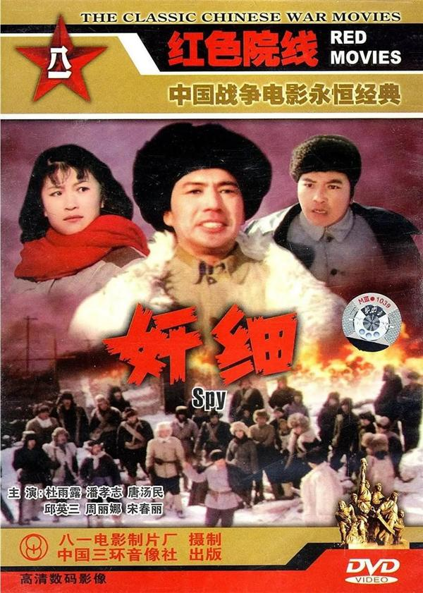

---

## 大汉天子

[2026-10-02 22:04] 来自：综合网盘资源频道

名称：大汉天子 (2002)

描述：汉武帝刘彻(黄晓明 饰)初为太子时空有抱负但没有实权，他结交了张汤(张明健 饰)、灌夫(贾宏伟 饰)、李陵(刘冠翔 饰)、郭舍人(刘潇潇 饰)等有志青年，自称为“太子党”。窦太后(陈莎莉 饰)为维护窦氏家族利益企图废太子立梁王，刘彻孤立无援，宫内只有姐姐平阳公主(陈紫函 饰)真心待他。起初刘彻玩世不恭屡遭陷阱，直到遇到了秋蝉(刘怡君 饰)、料事如神的东方朔(陈道明 饰)，以及令他魂牵梦萦的名妓念奴娇(贾静雯 饰)，他的帝王之旅才正式开始。在“太子党”众多朋友和东方朔的帮助下，刘彻终于成为了汉武帝。

本剧是历史传奇剧，为了避免观众混淆历史，在北京版播出之前做了改动，东方朔改名为东方慧，张汤改为张固，灌夫改为关夫，李陵改为为李勇，郭舍人改为郭得仁。张骞更名为张远。所以剧中人名有两个版本。

夸克网盘：https://pan.quark.cn/s/3beee74ad778

📁 大小：AA

🏷 标签：#剧情 #古装 #大汉天子 #quark

---

## 潘金莲之前世今生

[2026-10-02 21:46] 来自：综合网盘资源频道

名称：潘金莲之前世今生 潘金蓮之前世今生 (1989)

描述：千古第一淫妇潘金莲(王祖贤饰)身首异处，魂赴阴曹，却念念不忘报仇雪恨。过奈何桥之际推翻孟婆汤，纵身跳入轮回的未知。今世正值文革动乱，芭蕾舞团的翘楚单玉莲(王祖贤饰)惨遭团长强暴，下放农村造鞋厂。一心只求宁静生活，却一再被宿命折磨的可怜女子注定了一生的颠沛流离。由内陆辗转香江，生命中先后出现的3个男人武龙(林俊贤饰)、武汝大(曾志伟饰)、Simon(单立文饰)似乎都只是前世的梦影。凄苦命运是否仍要重演，身处现代的飘零女子是否仍将走上千年前的老路？所谓的报仇雪恨是否真能如愿？爱恨交织的不了情又将何去何从？

1989年上映，改编自香江名笔李碧华的同名小说的《潘金莲之前世今》在小心延续了该作妖艳诡异又不乏深邃犀利风格的同时，不可避免加入了港片诸多商业元素。但在注重娱乐性的同时，也将焦点放在了对人性以及女性细腻心理的探索上。镜头语言丰富，画面亦幻亦真，两个不同时空的影像交织，使信息的传达更富感性色彩。值得一看

夸克网盘：https://pan.quark.cn/s/ea7af3be9509

📁 大小：AA

🏷 标签：#剧情 #悬疑 #奇幻 #潘金莲之前世今生 #潘金蓮之前世今生 #quark

---

## 纸醉金迷

[2026-10-02 21:40] 来自：综合网盘资源频道

名称：纸醉金迷 (2008)

描述：1937年，日本侵华战争爆发，万里山河，生灵涂炭。在日寇铁蹄蹂躏之下，当时的首都南京亦难逃沦陷命运。

南京政府小公务员魏端本(邵峰 饰)被迫抛下结发妻王玉兰，随逃难人潮撤往陪都重庆。路上魏偶遇小他六岁的美丽少女田佩芝(陈好 饰)，同为天涯沦落人，两个孤独之人惺惺相惜，最终结为夫妻。

时光一晃，六七年岁月转瞬即逝。魏氏夫妇已育有一双子女。魏端本供职于某政府机关，他老实诚恳，迂腐木讷，以稀薄的工资支撑着这个小家；田佩芝虽为人母，却始终保持着天真活泼的性格，难耐贫苦无聊生活且虚荣浮华的她迷上赌博，从最初的小打小闹到后来的大出大进，导致家中的生活愈加捉襟见肘，夫妻间的口角也成家常便饭。

田深陷赌局，难以自拔，为了筹得赌资，不惜结交黑心商人和放贷者。随着范宝华(于和伟 饰)、洪五爷(袁苑 饰)和朱四奶奶(何赛飞 饰)等人的出现，魏家从此在黑暗泥潭中越陷越深……

夸克网盘：https://pan.quark.cn/s/e19238d183d8

📁 大小：AA

🏷 标签：#剧情 #爱情 #纸醉金迷 #quark

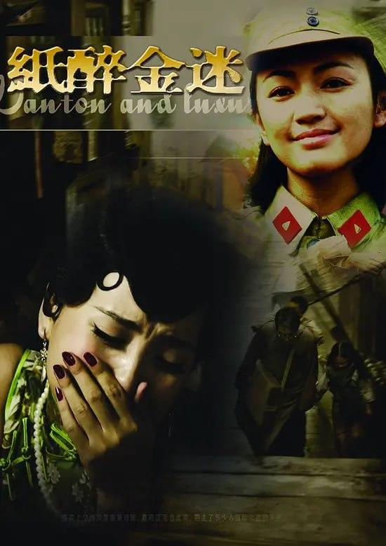

---

## 天剑群侠

[2026-10-02 21:36] 来自：综合网盘资源频道

名称：天剑群侠 (2005)

描述：江湖上盛传，秦始皇一统天下之后，为了建立权威，特别密谕五位当代绝顶铸剑师共同打造一把举世无双的秦王剑，名之为「天剑」，只可惜「天剑铸成日，始皇梦薨时」，一语成谶，当天剑诞生之日，却传来秦始皇驾崩于南巡途中，天剑也随即宣告失踪，从此江湖为了寻得一统天下的天剑，几无宁日，各门各派惶惶终日-----。

夸克网盘：https://pan.quark.cn/s/e253364960e6

📁 大小：AA

🏷 标签：#剧情 #武侠 #天剑群侠 #quark

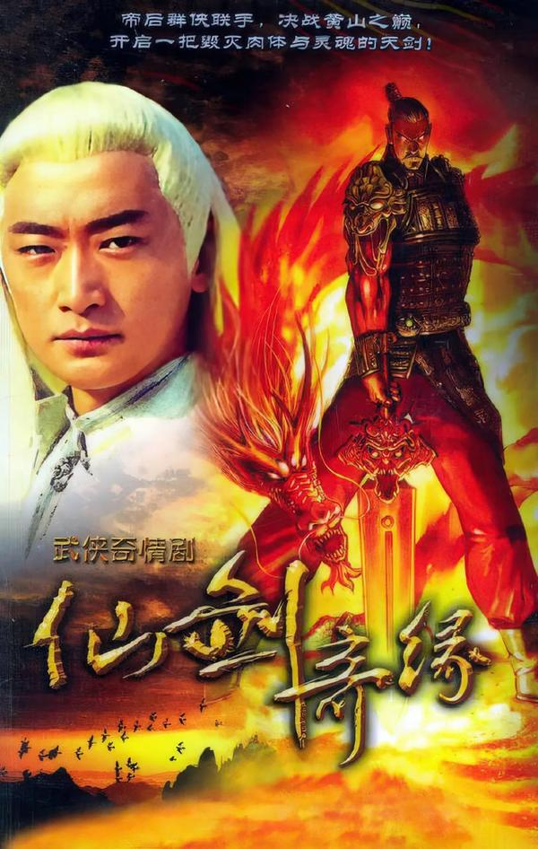

---

## 爱上谎言的女人

[2026-10-02 21:34] 来自：综合网盘资源频道

名称：爱上谎言的女人 嘘を愛する女 (2018)

描述：某大型饮料公司的OL川原由加利(长泽雅美 饰)和男友小出桔平(高桥一生 饰)是一见钟情。原本生活平静，简单幸福，但是这一切都被突如其来的事件所打乱。某天，桔平因蛛网膜下出血突然昏倒，可是随后被医护人员发现，他所持有的驾照、医师执照居然全是伪造的。得知消息的由加利十分震惊，对于这个相处五年之久的男友，竟然自己完全感到陌生。在此之后，由加利请来私家侦探调查桔平，更从男友一份未完成的小说手稿中找到了蛛丝马迹。他是谁？他又为何甘心让自己和爱人活在谎言之中？

夸克网盘：https://pan.quark.cn/s/dc174eb2dbaf

📁 大小：AA

🏷 标签：#剧情 #悬疑 #爱上谎言的女人 #嘘を愛する女 #quark

---

## 凤飞飞

[2026-10-02 21:30] 来自：综合网盘资源频道

名称：凤飞飞 鳳飛飛 (1971)

描述：倪匡捕捉觀眾明辨是非的心理，編寫成這部江湖恩怨片。鳳飛飛(何莉莉 飾)為報姊仇，發現兇手竟為未來夫婿金連白(南宮勳 飾)，不知所措。而殺姊夫之兇手蕭豹(翟諾 飾)與梁霸(王俠 飾)為除後患，與金夫人(林靜 飾)聯手對付飛飛，欲滅絕鳳家。飛飛怒不可遏，合父母之力將惡賊擊斃。片中武打明星陣容鼎盛，配合「十二金釵」何莉莉，倍添色彩。

夸克网盘：https://pan.quark.cn/s/5568affe6f07

📁 大小：AA

🏷 标签：#动作 #武侠 #凤飞飞 #鳳飛飛 #quark

---

## 秋决

[2026-10-02 21:18] 来自：综合网盘资源频道

名称：秋决 (1972)

描述：裴刚(欧威 饰)自幼受到奶奶(付碧辉 饰)的溺爱，性格飞扬跋扈，桀骜不驯。在一次口角之中，裴刚受人陷害被迫杀死三人，被捕入狱，判处死刑，秋后问斩。尽管奶奶和刑曹(周少卿 饰)想方设法想要挽救裴刚，但裴刚拒不配合，对自己的罪行供认不讳。

裴刚为家中三代单传，为了裴家不断子绝孙，奶奶将名为莲儿(唐宝云 饰)的女子送入牢中，让裴刚传宗接代。当夜，奶奶冻死在路边，裴刚得知此事良心发现痛不欲生，他和莲儿之间亦产生了真挚的感情结为夫妻。随着时间的推移，裴刚处刑的日子越来越近，此时莲儿的腹中已经怀上了裴刚的骨肉。牢头(葛香婷 饰)被裴刚和莲儿的经历所打动，想要偷偷放跑裴刚，却遭到了后者的严词拒绝

夸克网盘：https://pan.quark.cn/s/eeedfd58dcdf

📁 大小：AA

🏷 标签：#剧情 #秋决 #quark

---

## 永远的蝙蝠侠

[2026-10-02 21:13] 来自：综合网盘资源频道

名称：永远的蝙蝠侠 Batman Forever (1995

描述：高谭市的黑暗势力又开始蠢蠢欲动了，这次是毁了半边脸的“双面人”(汤米•李•琼斯 Tommy Lee Jones 饰)。一次，“双面人”袭击了马戏团，演员迪克(克里斯•奥唐纳 Chris O'Donnell 饰)阻止了“双面人”的阴谋，家人却因此惨遭杀害。

布鲁斯(瓦尔•基尔默 Val Kilmer 饰)收留了迪克，并说服了满腔仇恨的迪克留了下来。因研究计划被拒绝而仇视韦布斯的公司职员爱德华(金•凯瑞 Jim Carrey 饰)成功研究出脑波吸收装置，化身成为“谜语侠”。

“双面人”和“谜语侠”联手破坏高谭市，并通过脑电波吸收装置大量吸收市民的脑电波。蝙蝠侠这次的对手强大得可怕，蝙蝠侠最终能否战胜罪恶？

夸克网盘：https://pan.quark.cn/s/eb5707d1722c

📁 大小：AA

🏷 标签：#动作 #冒险 #永远的蝙蝠侠 #quark

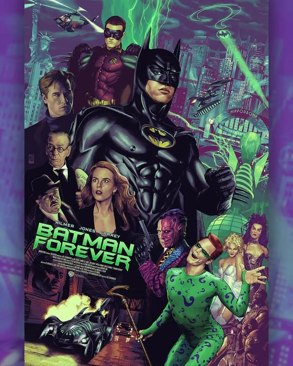

---

## 即使这样也不是我做的

[2026-10-02 20:44] 来自：综合网盘资源频道

名称：即使这样也不是我做的 それでもボクはやってない (2006)

描述：青年金子彻平(加濑亮饰)在高峰期乘上了地铁，赶往学长介绍的公司面试。不料，他在岸川站下车时，被一个女中学生拉住并被指认为是“痴汉”，彻平因此遭到了逮捕。在警察的严厉质问下，彻平坚称自己没有犯罪。而律师告诉彻平，如果否认犯罪将遭到拘留，一旦被起诉，后果将更加严重。这飞来横祸令彻平茫然失措，与此同时，彻平的母亲丰子(罇真佐子饰)和朋友齐藤达雄(山本耕史饰)为了还彻平清白， 四处奔走寻求帮助。当过法官的资深律师荒川正义(役所广司饰)和年轻的女律师须藤莉子(濑户朝香饰)向他们伸出了援手，一场决定命运的法庭辩论随即展开

夸克网盘：https://pan.quark.cn/s/ae47cfc426db

📁 大小：AA

🏷 标签：#剧情 #即使这样也不是我做的 #quark

---

## 奏鸣曲

[2026-10-02 20:39] 来自：综合网盘资源频道

名称：奏鸣曲 ソナチネ (1993)

描述：北岛组干部村川(北野武 饰)因与大老板(逗子とんぼ 饰)关系不佳，而被派去冲绳协助兄弟帮派对抗阿南组。村川等人的到来似乎激化了原有的矛盾，双方对抗不断升级。在一次酒吧枪战中，村川的手下中弹身亡，随后他与手下片桐(大杉涟 饰)、肯(寺道进 饰)等人躲到海边小屋中暂避风头。

在金黄的沙滩上，这群经历了血雨腥风的大男人们玩起了充满童真的游戏。然而他们的逍遥快活无法持续太久，北岛组和阿南组秘密联合，意欲将村川等人彻底铲除……

夸克网盘：https://pan.quark.cn/s/4029091e49c4

📁 大小：AA

🏷 标签：#剧情 #犯罪 #奏鸣曲 #quark

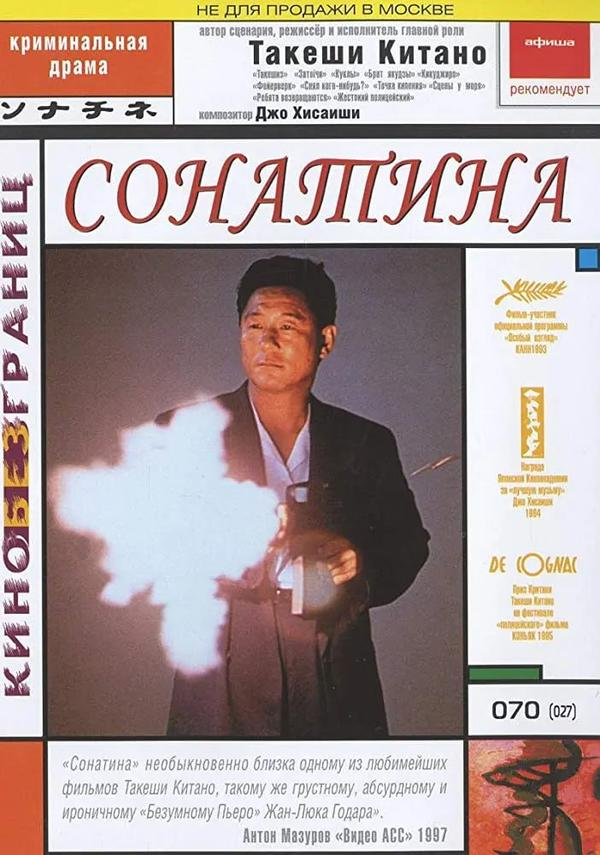

---

## 26个特殊劫匪

[2026-10-02 20:30] 来自：综合网盘资源频道

名称：26个特殊劫匪 Special Chabbis (2013)

描述：26个特殊劫匪故事以1987年3月18日中央调查局的一场面试为开端。接着剧情回转。阿杰(Akshay Kumar饰演)与当地警局进行一场中央调查局的突击查抄，地点是当地部长家。阿杰与同行3人以敏锐的洞察力迅速查抄出部长所有的赃款，并迅速带离。剧情发展到此，如果认为这是一部严谨的政治剧，那你就错了。阿杰与同行3人并非真正的中央调查局探员，4人以此行骗数次，四处搜刮赃款。此次行骗后被真正的中央调查局探员瓦萨姆盯住。在最后一场行骗中，阿杰和同伙与探员瓦萨姆周旋，最终逍遥法外。

本片系真实事件改编

夸克网盘：https://pan.quark.cn/s/c9b041454e55

📁 大小：AA

🏷 标签：#剧情 #惊悚 #犯罪 #26个特殊劫匪 #quark

---

## 女杀手

[2026-10-02 20:18] 来自：综合网盘资源频道

名称：女杀手 女殺手 (1971)

描述：何莉莉飾演身手敏捷的「女殺手」，在一次殺人事件中遭人(張佩山)悉破之後，要脅她作為殺人工具，在她完成任務後反墮入組織設下的滅口陷阱；她決心反攻，找出幕後主謀…

夸克网盘：https://pan.quark.cn/s/6c0d307ddce7

📁 大小：AA

🏷 标签：#动作 #惊悚 #冒险 #女杀手 #女殺手 #quark

---

## 墨雨云间

[2026-10-02 20:14] 来自：综合网盘资源频道

名称：墨雨云间 (2024)

描述：家庭优渥、生活幸福的县令之女薛芳菲在遭逢巨变之后失去一切，受救命恩人、中书令之女姜梨之托，以姜梨的身份回到京城，并在肃国公萧蘅等人的帮助下，克服重重艰险，不断努力对抗不公，最终救出意外入狱的父亲，并帮助萧蘅匡扶正义，守护黎民百姓。

剧集改编自千山茶客的小说《嫡嫁千金》。

夸克网盘：https://pan.quark.cn/s/de83c8e2d3b9

迅雷网盘：https://pan.xunlei.com/s/VP2wXHuuwwYmoUm-Lx-EQH5pA1?pwd=v5dx

📁 大小：AA

🏷 标签：#剧情 #墨雨云间 #quark #xunlei

---

## 爱的发声练习

[2026-10-02 19:56] 来自：综合网盘资源频道

名称：爱的发声练习 愛的發聲練習 (2008)

描述：小猫(大S 徐熙媛 饰)从小父亲早亡，母亲随后另嫁他人。不过，她和聋哑妹妹对这个继父极为不满，因为后者经常偷窥她们洗澡，极为猥琐。在家庭得不到温暖的小猫，却在学校收获了一份纯爱。那个送吉他的男孩阿良(彭于晏 饰)身上拥有她极为珍视的品质，两人彼此相爱。但当小猫鼓足勇气准 备为他献身时，男人却婉拒了她。他坦言，要珍惜她的人，而不是贪图性。后来，阿良去服兵役，苦闷寂寞的小猫因为生活拮据，开始在网上援交。期间，她邂逅了一个有妇之夫小古(张孝全 饰)，两个人深陷灵与肉的纠缠之中无法自拔……

十年之后，小猫在一次同事聚餐中认识了sunshine(东明相 饰)，这个跟妹妹一样聋哑的长发男孩，用他特有的方式温暖了她的心

夸克网盘：https://pan.quark.cn/s/cdb1d3b3e9da

📁 大小：AA

🏷 标签：#剧情 #爱情 #爱的发声练习 #愛的發聲練習 #quark

---

## 夜夜伴肥娇

[2026-10-02 19:51] 来自：综合网盘资源频道

名称：夜夜伴肥娇 夜夜伴肥嬌 (1992)

描述：友为人憨直，虽服务警队十年，有劳但无功。结婚七年，其妻在商界春风得意，与友生活习惯及思想行为距离愈来愈远，其妻卒不辞而别。友在查案中得知消息，大失常态，险些累及女警吴君如身陷险境，二人自此积怨…

夸克网盘：https://pan.quark.cn/s/86d81d073261

📁 大小：AA

🏷 标签：#剧情 #喜剧 #犯罪 #夜夜伴肥娇 #夜夜伴肥嬌 #quark

---

## 勇闯16街区

[2026-10-02 19:48] 来自：综合网盘资源频道

名称：勇闯16街区 16 Blocks (2006)

描述：纽约平淡的一天，临近退休的老警探杰克•莫斯利(布鲁斯•威利斯 Bruce Willis 饰)却接到了一个吃力不讨好的任务：穿行16片街区，护送一名犯人上法庭作证。

这本该是件极其轻松的事，从警局到法庭的车程只有15分钟，唯一的麻烦看上去也只是罪犯艾迪(茅斯•达夫 Mos Def 饰)滔滔不绝的废话而已。然而事实却远不止于此，一次针对艾迪的暗杀行动让杰克发现了幕后的真相：所谓的上庭作证不过是个幌子，真实的情况是以警局同僚、老朋友弗兰克(大卫•摩斯 David Morse饰)为首的一批腐败警察，借杰克护送艾迪的机会铲除污点证人。经历内心的挣扎后，杰克为了寻求心中的正义保护了艾迪，却成了纽约警局的众矢之的。16片街区的距离，从来也不曾如此漫长过…

夸克网盘：https://pan.quark.cn/s/cdc9bdfa9897

📁 大小：AA

🏷 标签：#剧情 #动作 #惊悚 #勇闯16街区 #quark

---

## 第五共和国

[2026-10-02 19:46] 来自：综合网盘资源频道

名称：第五共和国 (2005) 1080p WEB-DL 中文字幕 H264 AAC 2.0

描述：豆瓣9.5高分

1979年10月，韩国总统朴正熙被韩国中央情报组首领金载圭枪杀事件，触发了全国的军事政变，及後发展为南韩最动盪的时期「光州事件」。MBC电视剧大作《第五共和国》就是有关当年朴总统被行刺，以及将军全斗焕发动军事政变而令第十届总统崔圭夏下台的因由，剧中还涉及民主党与军人政府的权力竞争。以《第五共和国》为题，内容更讲述第11届总统全斗焕成立新宪法民主政府，至1988年汉城奥运会的开幕，至後来由直接选举选出的第13届总统卢泰愚解为人知的幕後一面。 在筹备的期间，编剧除了在史实与剧情之间取得平衡之外，剧组工作人员更在韩国政府的干预下，千辛万苦才完成拍摄，官方甚至威胁剧组必须修改剧本，否则控告电视台。剧中由《女人天下》的李德华扮演全斗焕，亦成为一时佳话。

迅雷网盘：https://pan.xunlei.com/s/VP2wQh5bXoC-KIE_MpqMc19qA1?pwd=y4e9

📁 大小：71.7GB

🏷 标签：#历史 #传记 #第五共和国 #1080p #WEBDL #中文字幕 #AAC #xunlei

---

## 斗罗大陆绝世唐门

[2026-10-02 18:46] 来自：百度网盘综合频道

名称：斗罗大陆：绝世唐门（2023）4K S01E01 - E173｜附第一季+剧场版

描述：这里没有魔法，没有斗气，没有武术，却有武魂。唐门创立万年之后的斗罗大陆上，唐门式微。一代天骄横空出世，新一代史莱克七怪能否重振唐门，谱写一曲绝世唐门之歌？ 百万年魂兽，手握日月摘星辰的死灵圣法神，导致唐门衰落的全新魂导器体系。一切的神奇都将一一展现。 唐门暗器能否重振雄风，唐门能否重现辉煌？

百度网盘：https://pan.baidu.com/s/1HSy6RITY-LM35-BREH49TQ?pwd=5928

夸克网盘：https://pan.quark.cn/s/67f59d97fc63 来自：夸克云盘影视资源频道 [2026-10-02 18:45] 名称：斗罗大陆：绝世唐门（2023）4K S01E01 - E173 ｜附第一季+剧场版

📁 大小：354GB

🏷 标签：#Jack #剧情 #斗罗大陆

---

## 记住

[2026-10-02 17:38] 来自：综合网盘资源频道

名称：记住 (2015) 1080p 原盘REMUX 中文字幕 AVC DTS-HD MA 5.1

描述：Zev(克里斯托弗·普卢默 饰)有一个任务：为家人报仇。他们70年前被一名纳粹守卫杀害，如今这名守卫在美国以假身份生活着。

迅雷网盘：https://pan.xunlei.com/s/VP2vyRtKJ1CSBStRhcRGQWajA1?pwd=3295

📁 大小：24.4GB

🏷 标签：#悬疑 #惊悚 #记住 #1080p #原盘REMUX #中文字幕 #DTSHD #xunlei

---

## 狄仁杰之四大天王

[2026-10-02 17:38] 来自：综合网盘资源频道

名称：狄仁杰之四大天王 (2018) 4K WEB-DL H265 AAC 2.0

描述：狄仁杰大破神都龙王案后，高宗御赐神器亢龙锏，遭天后武则天嫉妒，天后为盗取亢龙锏陷害狄仁杰，召集了一帮会方术的“异人组”图谋不轨，并命令尉迟真金带队。狄仁杰在医官沙陀忠的帮助下成功摆脱“异人组”迫害，并和尉迟真金商议和解，与此同时“异人组”刺客水月却发现都城出现不明势力，在狄仁杰周旋于武则天的埋伏时，大唐陷入更深的危机，“封魔族”携异术登场，一场“屠魔”大战即将爆发。

迅雷网盘：https://pan.xunlei.com/s/VP2vyNh5J1CSBStRhcRGQU-zA1?pwd=yv6q

📁 大小：23.2GB

🏷 标签：#奇幻 #冒险 #狄仁杰之四大天王 #4K #WEBDL #AAC #xunlei

---

## 狄仁杰之神都龙王

[2026-10-02 17:33] 来自：综合网盘资源频道

名称：狄仁杰之神都龙王 (2013) 4K WEB-DL H265 AAC 2.0

描述：唐朝麟德年间，唐高宗与武则天强硬派出大军远征，谁知舰队在大海中遇袭，遭到重挫。该事件震惊洛阳，都城百姓狂热祭拜龙王，缭乱众生的“花魁”银睿姬更惹来各方势力觊觎。狄仁杰奉武后之命调查龙王一案，偏巧卷入绑架银睿姬的案件之中。在与劫匪搏杀过程中，狄仁杰遭遇亦敌亦友的大理寺卿尉迟真金，遂被对方投入大牢。银睿姬一案内龙王身影再现，使洛阳上空更添一道疑云。狱中狄仁杰凭借缜密推理博取回纥医工沙陀忠的信任，逃出大牢同查龙王真相。两起案件错综复杂，相互纠缠，引向全然未知的方向。

夸克网盘：https://pan.quark.cn/s/be65e0bdabe0

百度网盘：https://pan.baidu.com/s/1EmUuOF4KAe9-53hbe5v9UQ?pwd=Yu88

📁 大小：14.6GB

🏷 标签：#悬疑 #古装 #狄仁杰之神都龙王 #4K #WEBDL #AAC #quark #baidu

---

## 韩国小姐

[2026-10-02 17:17] 来自：综合网盘资源频道

名称：韩国小姐 미스코리아 (2013)

描述：讲述的是一个在普通小区生活的平凡女性在周边人们的帮助下，出战韩国小姐大赛的故事。此剧预计接档《医学团队》于12月初放。

夸克网盘：https://pan.quark.cn/s/f63f1aeb26f4

📁 大小：AA

🏷 标签：#剧情 #爱情 #韩国小姐 #quark

---

## 阳炎座

[2026-10-02 17:12] 来自：综合网盘资源频道

名称：阳炎座 陽炎座 (1981)

描述：铃木清顺大正(浪漫)三部曲：《流浪者之歌》、《阳炎座》和《夢二》中的第二部作品。

夸克网盘：https://pan.quark.cn/s/39249cb00bfb

📁 大小：AA

🏷 标签：#爱情 #奇幻 #惊悚 #阳炎座 #陽炎座 #quark

---

## 花束般的恋爱

[2026-10-02 14:43] 来自：电影资源频道(4K、REMUXE/原盘)

名称：【原盘】花束般的恋爱 (2021) 1080P REMUX 内封简繁特效字幕

描述：深夜的地铁站，因错过末班车让山音麦（菅田将晖 饰）和八谷绢（有村架纯 饰）两个年轻人不期而遇。他们相约前往附近的咖啡店，并且畅聊文学、电影和各自的爱好。令他们感到惊喜的是，两个人无论是习惯、爱好还是理念居然极其相似，仿佛就是另一个自己，因此他们对对方渐渐产生好感。在此之后，他们相约再次见面，顺理成章成为了情侣。大学毕业，步入社会，小麦和小绢痴心相守。只不过现实生活磨砺着年轻人的意志和爱情。小麦被迫暂时放弃自己绘画的梦想，成为一名上班族，日渐拮据的生活也让他们减弱了对理想生活的要求。不知不觉，曾经如此合拍的两个人渐行渐远，变成了最熟悉的陌生人……

夸克网盘：https://pan.quark.cn/s/13416235ae09

📁 大小：34GB

🏷 标签：#剧情 #爱情 #花束般的恋爱

---

## 万物生灵

[2026-10-02 14:39] 来自：综合网盘资源频道

名称：万物生灵 (2020) S07E01-E03 4K 高码率 内封中英双语字幕[附前六季]

描述：《万物生灵》第七季将观众带回1946年美丽的约克郡谷地。战争终于结束，斯凯德尔庄园再次热闹非凡，我们心爱的角色们重聚在同一屋檐下，满怀希望地展望新篇章。詹姆斯对兽医医学的新发展兴奋不已，但该地区新来的兽医却挑战了现状。外部世界或许在变化，但在约克郡这片土地上，谷地永远提供着同样的完美逃避现实之地。本季充满温暖、幽默和社区精神，带来更多关于人与动物的暖心故事。

夸克网盘：https://pan.quark.cn/s/f4f0a463fe7b

百度网盘：https://pan.baidu.com/s/1P1q7Y_KNvzpkSNdFSy3YDg?pwd=1314

提取码：1314

📁 大小：395 GB

🏷 标签：#万物生灵 #剧情 #喜剧 #4K #高码率 #内封中英双语字幕 #quark #baidu

---

## 八部半

[2026-10-02 14:17] 来自：电影资源频道(4K、REMUXE/原盘)

名称：八部半 (1963) 4K UHD 外挂简英双语字幕

描述：电影导演圭多（马塞洛·马斯楚安尼 Marcello Mastroianni 饰）在完成了一部影片之后感到筋疲力尽，他来到一处疗养地休息，同时开始构思下一部电影。他受到恶梦的困扰，精神不振，灵感也陷入停滞。他让情妇卡拉（桑德拉·米洛 Sandra Milo 饰）也来到疗养地和他作伴，但卡拉的到来反而增添了他的烦恼。此时，充满朝气的年轻女郎克劳迪娅（克劳迪娅·卡汀娜 Claudia Cardinale 饰）的出现，令圭多压抑的世界乍现出一抹亮色。然而随着圭多妻子路易莎（阿努克·艾梅 Anouk Aimée 饰）以及许多电影圈人士纷纷来到疗养地，圭多不堪忍受个人感情生活的混乱与电影拍摄的双重压力，他的精神危机愈演愈烈，梦境与幻觉不断侵入他的现实生活…… 本片荣获1964年奥斯卡最佳外语片和最佳服装设计（黑白片）两项大奖。

夸克网盘：https://pan.quark.cn/s/843dd7838123

📁 大小：28.4GB

🏷 标签：#八部半 #剧情

---

## 杀死一只知更鸟

[2026-10-02 14:14] 来自：电影资源频道(4K、REMUXE/原盘)

名称：杀死一只知更鸟 (1962) 4K HDR 国英多音轨 内封简繁特效字幕

描述：美国南部的梅岗镇上住着父亲芬奇(格利高里·派克 Gregory Peck 饰)和他的一对儿女。尽管妻子已经亡故，一家人仍过得乐也融融，芬奇对儿女亦既严格又疼爱有加。父亲平时还对他们说过，不要杀死为人类唱歌的知更鸟，因为她们善良而从不伤害人。芬奇除了是一个慈父，还是当地一名勇于伸张正义的律师。这天他接到一宗强奸案，被告是黑人罗宾逊（布洛克·皮特Brock Peters 饰），而受害者是一名白人女子。这样一个案件，在那个种族歧视相当严重的年代，罗宾逊的境况堪忧。即使芬奇找到了他没有犯罪的证据，也不足以让人们抛开种族成见。芬奇在法庭上奋力维护事实和法律的公正，然而却没能阻止人们根深蒂固的偏见。更糟糕的是，怀有种族偏见的白人已经把芬奇当作公敌，而罗宾逊也无法洗清罪名，更可悲的命运在等待着他。

夸克网盘：https://pan.quark.cn/s/86650cd46062

📁 大小：35.4GB

🏷 标签：#杀死一只知更鸟 #剧情 #犯罪

---

## 怪物

[2026-10-02 14:03] 来自：电影资源频道(4K、REMUXE/原盘)

名称：【原盘】怪物 (2023) 1080P REMUX 内封简/繁日双语特效字幕

描述：一栋普普通通的公寓，住着失去了丈夫的女子早织（安藤樱 饰）及其就读小学的儿子麦野湊（黑川想矢 饰）。凑寡言少语，少年老成，似乎藏着无限的心事无法道出。而近一段时间凑种种反常举动，让早织心有不安。从儿子口中，她得知凑遭到了保利老师（永山瑛太 饰）的霸凌，于是鼓足勇气前往学校讨要说法。校方的态度暧昧应付，甚至对她单亲母亲的身份有着偏颇的认知。当双方变得愈加胶着之际，早织似乎慢慢发现学校里的儿子有着她所不熟知的一面。在这一过程中，另一个男孩星川依里（柊木阳太 饰）也被卷入漩涡中心……

夸克网盘：https://pan.quark.cn/s/9c816c44f6b3

📁 大小：35.2GB

🏷 标签：#怪物 #剧情

---

## 亚瑟王斗兽争霸

[2026-10-02 12:37] 来自：综合网盘资源频道

名称：亚瑟王：斗兽争霸 King Arthur Legend of the Sword (2017)

描述：故事发生在遥远的1500年前，沃提根(裘德·洛 Jude Law 饰)背叛了自己的哥哥尤瑟王(艾瑞克·巴纳 Eric Bana 饰)，导致了人类和巫师之间维系了百年的平衡被打破。幸运的是，尤瑟王唯一的后裔逃过了一劫，这令他的血脉并不至于就此断绝。

夸克网盘：https://pan.quark.cn/s/30001eb07050

📁 大小：NG

🏷 标签：#动作 #奇幻 #冒险 #亚瑟王 #斗兽争霸 #quark #ali

---

## 夜疯狂

[2026-10-02 12:19] 来自：综合网盘资源频道

名称：夜疯狂 夜瘋狂 (1989)

描述：幼稚园教师汪小云在一个晚上出外看戏消遗,看完戏后碰上打劫银行携着四千万赃款逃走的重伤劫匪阿B,她被挟持到夜店,在一间夜店中她和售货员玲玲等和阿B发生纠缠,阿B后来伤重死去。 小云，玲玲和师姐，在玲玲表姊小倩的指挥下，企图毁尸灭迹，平分赃款。岂料劫匪同当党追踪而至，贼首大哥等对她们企图先奸后杀，幸得警察把他们及时救出。 在围捕中，几经艰险才把全部匪徒逮住，四千万赃款则在围捕中被炸药炸毁了。

夸克网盘：https://pan.quark.cn/s/8473e1ffd06e

📁 大小：NG

🏷 标签：#剧情 #喜剧 #犯罪 #夜疯狂 #夜瘋狂 #quark #ali

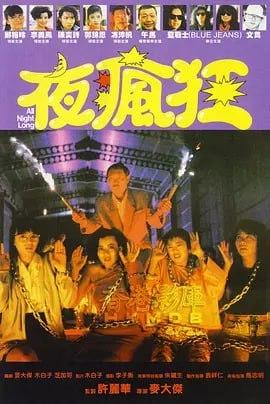

---

## 无疯也起浪

[2026-10-02 12:11] 来自：影视动漫分享|SeedHub|夸克|网盘|🧲

名称：无疯也起浪 (2020)

#电影 #喜剧 #夸克

主演: 王成思 陶亮 冯秦川 

豆瓣: [2.7](https://movie.douban.com/subject/34840497/)

由开心麻花功勋艺人王成思、陶亮、冯秦川首次搭档主演的喜剧电影《无疯也起浪》目前正式定档2020年8月28日全国院线上映，成为疫情之后唯一一部喜剧电影。喜欢开心麻花电..

夸克网盘：https://pan.quark.cn/s/96cf5889fa7f

---

## 简单西蒙

[2026-10-02 12:10] 来自：影视动漫分享|SeedHub|夸克|网盘|🧲

名称：简单西蒙 (2010)

#电影 #爱情 #剧情 #喜剧 #夸克

主演: 比尔·斯卡斯加德 马丁·沃斯特罗姆 塞西莉亚·福斯 

豆瓣: [8.1](https://movie.douban.com/subject/5279979/)

西蒙（比尔·斯卡斯加德BillSkarsgård饰）是一个患有亚斯伯格症的男孩，他是个物理天才，但不能忍受和人发生肢体接触；他有严重的强迫症，一切都要依计划执行；他..

夸克网盘：https://pan.quark.cn/s/5c86e88266a1

---

## 莫斯科行动

[2026-10-02 12:10] 来自：影视动漫分享|SeedHub|夸克|网盘|🧲

名称：莫斯科行动 (2018)

#电视剧 #犯罪 #剧情 #迅雷

主演: 夏雨 吴优 张志坚 

豆瓣: [7.4](https://movie.douban.com/subject/26860788/)

1993年，大批中国商人涌入俄罗斯淘金，其中，有几张与众不同的面孔，他们在倒爷中间探听消息，在黑白两道寻求支援。他们是中国警方派出的一个秘密小组，他们此行的目标是暗..

迅雷网盘：https://pan.xunlei.com/s/VOxzSDRbG_bFijcAHrIANlE9A1?pwd=2s25

---

## 壮志凌云

[2026-10-02 12:10] 来自：影视动漫分享|SeedHub|夸克|网盘|🧲

名称：壮志凌云 (1999)

#电视剧 #剧情 #迅雷 #百度

主演: 吴京安 肖雄 金莉莉 

豆瓣: [7.7](https://movie.douban.com/subject/2156746/)

1947年冬，从陆军选调的飞行员贺怀德、李保旗等人，赶到东北牡丹江时，战争形势发生了变化，航校已向北满转移。贺怀德等人冒着风雪赶上航校一大队，推小火车爬坡时，认识了..

迅雷网盘：https://pan.xunlei.com/s/VP0Kl0YmwCt57O7bnoKeQJmYA1?pwd=xhc4

百度网盘：https://pan.baidu.com/s/1KN6TNeFsqC7HOMGgOCaHyg?pwd=beyg

---

## 魔窟中的幻想

[2026-10-02 12:10] 来自：影视动漫分享|SeedHub|夸克|网盘|🧲

名称：魔窟中的幻想 (1986)

#电影 #恐怖 #儿童 #惊悚 #百度

主演: 夏竟 王春子 孙淳 

豆瓣: [7.8](https://movie.douban.com/subject/3174543/)

童年可以说是人生中最美好也是最无忧无虑的阶段，回首往事我们忘记了童年的许多片段，却从不否认她那令人难以忘怀的温暖气息。然而对于置身战火和压迫中的孩子来说，他们的童年..

百度网盘：https://pan.baidu.com/s/1Sfgoza60xPCJJwcWLiBYCA?pwd=6zui

---

## 天仙配

[2026-10-02 12:10] 来自：影视动漫分享|SeedHub|夸克|网盘|🧲

名称：天仙配 (2007)

#电视剧 #古装 #爱情 #奇幻 #夸克 #迅雷 #百度

主演: 黄圣依 杨子 李博 

豆瓣: [5.8](https://movie.douban.com/subject/2342574/)

这是一个家喻户晓的美丽传说。玉帝（吴兰辉饰）的七位公主厌倦了天宫的寂寞，拔开云雾偷看人间，当听到寒门孝子董永（杨子饰）悽惨遭遇时，善良的七妹（黄圣依饰）与王母娘娘的..

夸克网盘：https://pan.quark.cn/s/ead50c532b4d

迅雷网盘：https://pan.xunlei.com/s/VOTBQtFoZ8lJ8dUFwaOpx5MAA1?pwd=vpgg

百度网盘：https://pan.baidu.com/s/10TVuWaawmV261neKLgb3hQ?pwd=12fo

---

## 苍穹之昴

[2026-10-02 12:10] 来自：影视动漫分享|SeedHub|夸克|网盘|🧲

名称：苍穹之昴 (2010)

#电视剧 #古装 #剧情 #百度

主演: 田中裕子 殷桃 周一围 

豆瓣: [8.8](https://movie.douban.com/subject/4226460/)

概述

电视剧《昴星团》改编自日本作家浅田次郎的同名小说，由中日合拍。原著小说风格独特，浅田次郎以全新的视角描绘了中国历史，并在日本畅销书排行榜上连续十年名列前茅。..

百度网盘：https://pan.baidu.com/s/1HxV9mJH-LbORUtGWe7duQg?pwd=6666

---

## 波兰家族

[2026-10-02 12:10] 来自：影视动漫分享|SeedHub|夸克|网盘|🧲

名称：波兰家族 第一季 (2023)

#电视剧 #喜剧 #历史 #夸克 #迅雷 #百度

主演: 巴特罗米耶·托帕 卡翠娜·赫尔曼 玛蒂娜·比茨科斯卡 

豆瓣: [7.9](https://movie.douban.com/subject/36669208/)

在这部讽刺喜剧中，一个滑稽的男人努力成为波兰最著名的人，在此过程中处理家庭纠纷和与农民的冲突。..

夸克网盘：https://pan.quark.cn/s/30a84ccc1bba

迅雷网盘：https://pan.xunlei.com/s/VOzYVBNl2XmuMfzbbVjET-QwA1?pwd=jw26

百度网盘：https://pan.baidu.com/s/1CYDo36YyX9EORvVzk61-2A?pwd=8x3q

---

## 仙剑奇侠传三

[2026-10-02 12:01] 来自：综合网盘资源频道

名称：仙剑奇侠传三 (2009)

描述：渝州城永安当的小伙计景天是个怀有大大梦想的乐天派，一日在集市闲逛时他遇到了堂堂唐门大小姐雪见。受到两人随身玉佩的彼此吸引，他们二人“热闹而又尴尬”的相识了，成了一对欢喜冤家。其实雪见和景天正是彼此的有缘人，而他们都来历不凡，身藏几世的秘密。随着雪见家族的剧变，二人阴差阳错的步入了江湖的血雨腥风之中，并结识了紫萱、龙葵和长卿等。虽然朋友相伴的日子非常快乐，但等待他们的却是更加惊险的前程和重大的责任。

夸克网盘：https://pan.quark.cn/s/645f1229f4f6

📁 大小：NG

🏷 标签：#爱情 #奇幻 #武侠 #古装 #仙剑奇侠传三 #quark #ali

---

## 血观音

[2026-10-02 10:50] 来自：夸克云盘影视资源频道

名称：【原盘】血观音 (2017) 1080P REMUX 内封简/繁英双语特效字幕

描述：棠家一脉花开，将军身故，棠夫人站在家族宗法宝塔上，也就立足弥陀乡政治的顶端。黑白两道，茶盏交错之间，玲珑心，剔透眼，柔软身段，霹雳手段，女人天下。大女儿棠宁玲珑八面，却怀一股心思幽微，小女儿棠真乖巧听话，学着继承泡茶待客之道，随棠夫人帘后织手暗操线，青春初丰满的羽翼，能如何担起腥风血雨？棠家牵线的土地开发计划出现变数，好友议员一家遭灭门惨案，以血掀变，弥陀乡势力重新洗牌，暗潮涌动，台北二十年，大家深宅三代女人，千手染血的观音，骨与血，治与乱，情欲与权力层层密谋穿织。

夸克网盘：https://pan.quark.cn/s/ba590f63e6b5

百度网盘：https://pan.baidu.com/s/1BhxESN9KaIJPSbKj_gBOXg?pwd=5w3z 来自：阿里、夸克、百度网盘4K影视资源 [2026-10-02 10:50] 名称：【原盘】血观音 (2017) 1080P REMUX 内封简/繁英双语特效字幕

📁 大小：26GB

🏷 标签：#血观音 #剧情 #悬疑

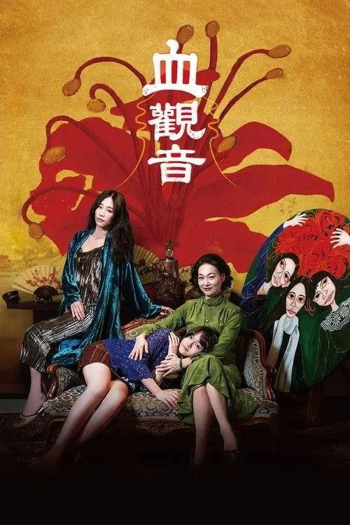

---

## 世界之战

[2026-10-02 10:42] 来自：百度网盘综合频道

名称：【原盘】世界之战 (2005) 4K REMUX HDR 杜比视界 国英多音轨 外挂简英双语字幕

描述：雷·费瑞尔（汤姆·克鲁斯饰）和妻子离婚了，一儿一女都跟母亲生活——因为他的的贪玩懒散，疏忽责任，这个家庭才如此支离破碎。一场外星人入侵的灾难却让他们重新建立起亲密的的关系。这天妻子繁忙，只好把儿女交给雷照顾。电闪雷鸣天色灰暗，一切好像有些异样。果然，马路上赫然一个庞大的三脚飞行器掘地而起，邪恶的火星人关顾了这个本来平静的小镇。人们四处逃亡，雷也带着女儿奔走逃命，开始了生死历险。当局想尽办法对付外星人，却屡屡失败，整个世界都陷入了恐慌当中。有了父爱的本能，平日吊儿郎当的父亲变得英勇顽强，保护儿女成了他支撑他的动力和信念。

百度网盘：https://pan.baidu.com/s/13USbufen2sYZGw44qHXPuA?pwd=f19e

📁 大小：52.4GB

🏷 标签：#世界之战 #科幻 #惊悚 #冒险

---

## 摩登时代

[2026-10-02 10:37] 来自：百度网盘综合频道

名称：【原盘】摩登时代 (1936) 1080P REMUX 内封简繁英字幕

描述：二十年代的美国处于经济萧条时期，失业率居高不下，工人受尽压榨，成为了大机器生产中的一颗螺丝钉。查理（查理·卓别林 Charles Chaplin 饰）就是一个底层市民，他在一个机器隆隆的厂房里日以继夜地工作，以赚取微薄的收入。重复繁重的工作压得他喘不过气，他把人们的鼻子当成螺丝钉来拧，卷入流水线机器的皮带里，令人苦笑不得。查理尽管贫穷，但却很善良。他在路上搭救了流浪女，和她一起生活，家里破烂却又温馨。每次身无分文的查理为了找到吃的，都会故意犯事，以便进入监牢。光景一时间有了好转，流浪女成了歌舞红星，然而好景太短暂了。

百度网盘：https://pan.baidu.com/s/10Y1RKEOGGhAFsxCFZh-YrQ?pwd=Btgh

📁 大小：18.2GB

🏷 标签：#剧情 #喜剧 #爱情 #摩登时代

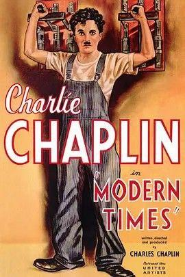

---

## 马戏团

[2026-10-02 10:34] 来自：百度网盘综合频道

名称：【原盘】马戏团 (1928) 1080P REMUX 内封简繁字幕

描述：在默片时代的收官之作中，查理·卓别林沉醉于马戏艺术，向启发其精湛滑稽表演的杂技艺人和默剧演员致敬。片中，卓别林饰演的流浪汉被误认为扒手，逃入一个巡回马戏团的表演场，很快成为剧团明星，并爱上了剧团的无鞍骑手。尽管拍摄过程众所周知的坎坷，这部笑料密集的喜剧仍位列卓别林最佳作品之一，归功于其职业生涯中一些最大胆的场面设计——包括与狮子的惊险接触，以及满载猴子走钢丝的高潮段落。本片于1969年经卓别林重新配乐后再次上映，这场喧闹的高空钢丝表演，展现了默片时代最受欢迎的喜剧大师在其幽默力量的巅峰状态。

百度网盘：https://pan.baidu.com/s/1Br31FXYXuFVr0tT95QV5Pg?pwd=79b6

📁 大小：18.2GB

🏷 标签：#马戏团 #喜剧 #爱情

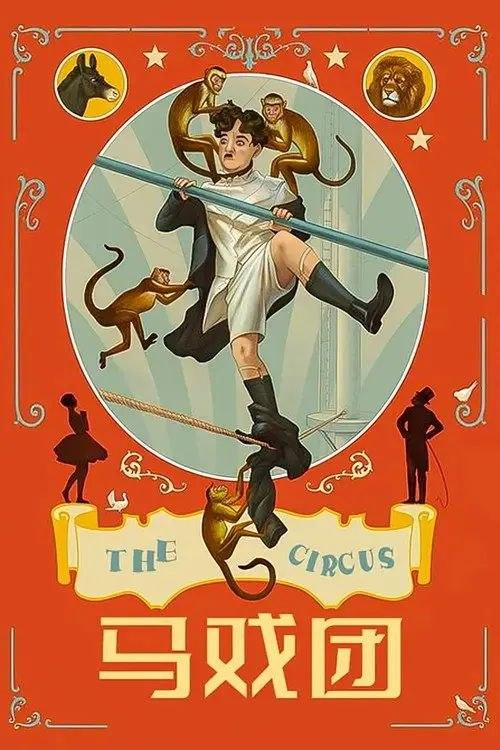

---

## 大主宰

[2026-10-02 10:04] 来自：肯德基の4K影视综合电影云盘站

名称：大主宰(2023)4K HDR 更新至S01E93 杜比音效

描述：大千世界，位面交汇，万族林立，群英荟萃，一位位来自下位面的天之至尊，在这无尽世界，演绎者令人向往的传奇，追求着主宰之路。

夸克网盘：https://pan.quark.cn/s/4e8cea7c16ee

📁 大小：107GB

🏷 标签：#剧情 #大主宰

---

## 狄仁杰之四大天王

[2026-10-02 04:33] 来自：综合网盘资源频道

名称：狄仁杰之四大天王 (2018) 4K WEB-DL H265 AAC 2.0

描述：狄仁杰大破神都龙王案后，高宗御赐神器亢龙锏，遭天后武则天嫉妒，天后为盗取亢龙锏陷害狄仁杰，召集了一帮会方术的“异人组”图谋不轨，并命令尉迟真金带队。狄仁杰在医官沙陀忠的帮助下成功摆脱“异人组”迫害，并和尉迟真金商议和解，与此同时“异人组”刺客水月却发现都城出现不明势力，在狄仁杰周旋于武则天的埋伏时，大唐陷入更深的危机，“封魔族”携异术登场，一场“屠魔”大战即将爆发。

夸克网盘：https://pan.quark.cn/s/75160e06eea4

百度网盘：https://pan.baidu.com/s/1ekg192h6QnZK6GSyTep2rw?pwd=Yu88

📁 大小：23.2GB

🏷 标签：#奇幻 #冒险 #狄仁杰之四大天王 #4K #WEBDL #AAC #quark #baidu

---

## 记住

[2026-10-02 04:30] 来自：综合网盘资源频道

名称：记住 (2015) 1080p 原盘REMUX 中文字幕 AVC DTS-HD MA 5.1

描述：Zev(克里斯托弗·普卢默 饰)有一个任务：为家人报仇。他们70年前被一名纳粹守卫杀害，如今这名守卫在美国以假身份生活着。

夸克网盘：https://pan.quark.cn/s/205714495c11

📁 大小：24.4GB

🏷 标签：#悬疑 #惊悚 #记住 #1080p #原盘REMUX #中文字幕 #DTSHD #quark

---

## 第五共和国

[2026-10-02 04:25] 来自：综合网盘资源频道

名称：第五共和国 (2005) 1080p WEB-DL 中文字幕 H264 AAC 2.0

描述：豆瓣9.5高分

1979年10月，韩国总统朴正熙被韩国中央情报组首领金载圭枪杀事件，触发了全国的军事政变，及後发展为南韩最动盪的时期「光州事件」。MBC电视剧大作《第五共和国》就是有关当年朴总统被行刺，以及将军全斗焕发动军事政变而令第十届总统崔圭夏下台的因由，剧中还涉及民主党与军人政府的权力竞争。以《第五共和国》为题，内容更讲述第11届总统全斗焕成立新宪法民主政府，至1988年汉城奥运会的开幕，至後来由直接选举选出的第13届总统卢泰愚解为人知的幕後一面。 在筹备的期间，编剧除了在史实与剧情之间取得平衡之外，剧组工作人员更在韩国政府的干预下，千辛万苦才完成拍摄，官方甚至威胁剧组必须修改剧本，否则控告电视台。剧中由《女人天下》的李德华扮演全斗焕，亦成为一时佳话。

夸克网盘：https://pan.quark.cn/s/abfa57cdbfbd

百度网盘：https://pan.baidu.com/s/1H6xAiccQznieEwruGUmjgg?pwd=Yu88 来自：综合网盘资源频道 [2026-10-02 01:32] 名称：第五共和国 (2005) 1080p WEB-DL 中文字幕 H264 AAC 2.0

📁 大小：71.7GB

🏷 标签：#历史 #传记 #第五共和国 #1080p #WEBDL #中文字幕 #AAC #quark

---

## 画中仙

[2026-10-01 23:21] 来自：夸克云盘影视资源频道

名称：【原盘】画中仙 (1988) 1080P REMUX 英版 国粤英多音轨 内封简繁英特效字幕

描述：拾儿（元彪 饰）是老道士（午马 饰）在河边一个木盆里发现的孤儿，起名拾儿将其抚养成人。拾儿自小跟着老道士捉鬼降妖，与俗世沾染不多，只得崔书生（吴启华 饰）这一个朋友。鬼王（李美凤 饰）向来作恶多端，常将无辜少女劫走，带入阴间。莫愁就是鬼王带走的一个年轻女孩，在出嫁路上被劫走，做了孤魂野鬼，受制于鬼王。崔书生偶遇可附于画中的莫愁，对其曼妙可爱的身姿恋恋不忘，鬼王却始终不肯放过莫愁。 崔书生决心解救莫愁，反被鬼王所抓，拾儿一心想救出朋友，老道士却不通人情不愿帮忙。拾儿是否能够救出崔书生？好心收养孤儿的道士真是如此绝情？

夸克网盘：https://pan.quark.cn/s/a749832add31

百度网盘：https://pan.baidu.com/s/1ph8IFIamhVSFGVnZ0OC-Ew?pwd=11sd 来自：阿里、夸克、百度网盘4K影视资源 [2026-10-01 23:21] 名称：【原盘】画中仙 (1988) 1080P REMUX 英版 国粤英多音轨 内封简繁英特效字幕

📁 大小：25.1GB

🏷 标签：#画中仙 #恐怖 #动作 #奇幻

---

## My盛Lady

[2026-10-01 20:31] 来自：综合网盘资源频道

名称：My盛Lady (2013) 1080p WEB-DL 中文字幕 H264 AAC 2.0

描述：广告公司创作总监香广男被誉为“盛女救星”，专门帮助单身女性寻找姻缘；新同事盛花蕾却对他的处事方式十分反感，两人在工作与感情纠葛中逐渐改变彼此。

链接：

迅雷网盘：https://pan.xunlei.com/s/VP2rRCbiNN-84tAemkjZTYoUA1?pwd=gs4u.

📁 大小：X

🏷 标签：#My盛Lady #喜剧 #爱情 #中国香港 #文伟鸿 #黄子华 #徐子珊 #阮兆祥 #陈敏之 #许绍雄 #江美仪 #1080p #WEBDL #中文字幕 #AAC #quark #baidu #xunlei

---

## 盛夏和她的未婚夫

[2026-10-01 20:17] 来自：综合网盘资源频道

名称：盛夏和她的未婚夫 (1985)

描述：故事发生在八十年代的北京。几年前，在农村插队的盛夏(肖雄 饰)返城回京，当了一名卖肉的售货员，她把希望寄托在男友柯平(梁同裕 饰)身上，指望他能评上职称，同时她也想通过自学改变未来的前途。她以同寝室好友秦园(徐晓星 饰)为追赶目标，利用一切业余时间补习英语和其它文化课，力争参加高考。临近高考，盛夏发现自己怀孕了，柯平趁机提出结婚要求，而盛夏不想失去高考机会做了流产，俩人为此产生隔膜。因受情绪影响，盛夏高考失败，柯平也离开了她。面对双重精神打击，盛夏咬牙坚持着走向自学成才之路，秦园高考的成功也时刻激励着她，她相信光明就在前头.

夸克网盘：https://pan.quark.cn/s/514120ed44bc

📁 大小：AA

🏷 标签：#剧情 #盛夏和她的未婚夫 #quark

---

## 别扭合租房

[2026-10-01 20:15] 来自：综合网盘资源频道

名称：别扭合租房 カカフカカ－こじらせ大人のシェアハウス－ (2019)

描述：求职受到挫折，现在自由职业者的寺田亚希(24岁)被同居的男朋友甩了，在朋友合租的房子里生活。在那里再会了的，是初中的同学，初次男朋友兼第一次「做了」对方·本行智也。近两年一直“不拍”的他，偶然与亚希接触后，不知为何反应很奇怪！！亚希答应绝对不...

夸克网盘：https://pan.quark.cn/s/482fdb6556bc

📁 大小：AA

🏷 标签：#剧情 #别扭合租房 #こしらせ大人のシェアハウス #quark

---

## 五号机要员

[2026-10-01 20:12] 来自：综合网盘资源频道

名称：五号机要员 (1984)

描述：1930年代初，上海。我党派5号机要员及助手冯自强(林强 饰)送密件去苏区，敌别动队长王文轩(王宝华 饰)获此情报，侦辑处长潘国梁(马群 饰)也派人辑拿5号机要员。冯自强通过戒备森严的临海码头，与女交通员陈兰(牛娜 饰)接上头，后陈兰为掩护冯自强牺牲。冯自强孤军作战，分别与殷飞(郝一平 饰)、朱秋(狄剑青 饰)接上头，约定在镇海塔见面。潘国梁接到情报，指示王文轩将共党一网打尽，冯自强来到海神庙，发现前来会面的是卖烟女(石荣 饰)，殷飞开枪打死了她，王文轩带别动队包围了汽车。孙副官(郭勇 饰)认定殷飞就是“铁马”。信以为真的王文轩刚要上车，突然响起的哨声使他感到自己上当了

夸克网盘：https://pan.quark.cn/s/b23a4f187b1b

📁 大小：AA

🏷 标签：#剧情 #五号机要员 #quark

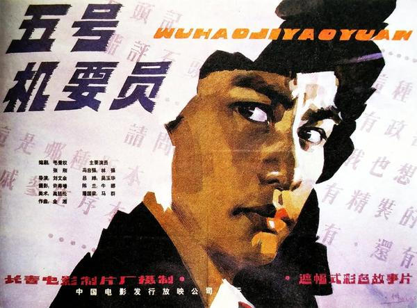

---

## 摇啊摇摇到外婆桥

[2026-10-01 20:12] 来自：夸克云盘影视资源频道

名称：【原盘】摇啊摇，摇到外婆桥 (1995) 1080P REMUX 内封简/繁英双语特效字幕

描述：1930年代，乡村少年唐水生来到上海投靠六叔（李雪健），在他的引荐下，做了歌舞皇后小金宝（巩俐）的贴身佣人。小金宝是上海滩一霸唐老爷（李保田）的女人，但与其手下宋二爷有染，而宋二爷已经觊觎唐老爷的位子良久。竞争对手余胖子的突然袭击使唐老爷心生警觉，带着小金宝、水生等人来到一个只有寡妇翠花和她女儿所在的小岛避难，并下令对上岛的生熟面孔格杀无论。小金宝在同翠花的相处中对生活有了另一番理解，渐渐对唐老爷的残忍非常不满，然而她的命运亦掌控在唐老爷手中。

夸克网盘：https://pan.quark.cn/s/438b45b26ff0

百度网盘：https://pan.baidu.com/s/1RJa0lWPPvCg5Em_Pf1lshw?pwd=2424 来自：阿里、夸克、百度网盘4K影视资源 [2026-10-01 20:12] 名称：【原盘】摇啊摇，摇到外婆桥 (1995) 1080P REMUX 内封简/繁英双语特效字幕

📁 大小：26.6GB

🏷 标签：#摇啊摇，摇到外婆桥 #剧情 #犯罪

---

## 一九四二

[2026-10-01 20:09] 来自：夸克云盘影视资源频道

名称：【原盘】一九四二 (2012) 1080P REMUX 内封简繁特效字幕

描述：1942年，抗日战争与第二次世界大战正处于白热化阶段。燎原之火，生灵涂炭，天灾人祸，哀鸿遍野。当军事家和政治家的目光聚焦在一城一郭的征伐劫掠之时，几乎鲜少有人注意到古老的中原河南正爆发一场惨绝人寰的大旱灾。影片的主角老东家（张国立 饰），狡猾、市侩，典型的封建地主，可即便如此也无法对抗这史无前例的灾难，他被迫逃荒，亲眼见证着儿子、儿媳、老伴等亲人的种种死状。他的遭遇是三百万灾民的缩影，面对这群人的苦难，无论是高高在上的蒋委员长（陈道明 饰），还是深入民间报道灾难真相的美国记者白修德（阿德里安•布劳迪 Adrien Brody 饰），以及海内外的每一个人，如何能从这眼前的人间炼狱之景侧目。绝望无止的逃生坎途，中华民族多舛命运的苦难一斑……

夸克网盘：https://pan.quark.cn/s/723fe87f2c5e

百度网盘：https://pan.baidu.com/s/1lnQlTmND8yGl0fffqV7mzw?pwd=6k09 来自：阿里、夸克、百度网盘4K影视资源 [2026-10-01 20:09] 名称：【原盘】一九四二 (2012) 1080P REMUX 内封简繁特效字幕

📁 大小：35.5GB

🏷 标签：#一九四二 #剧情 #战争

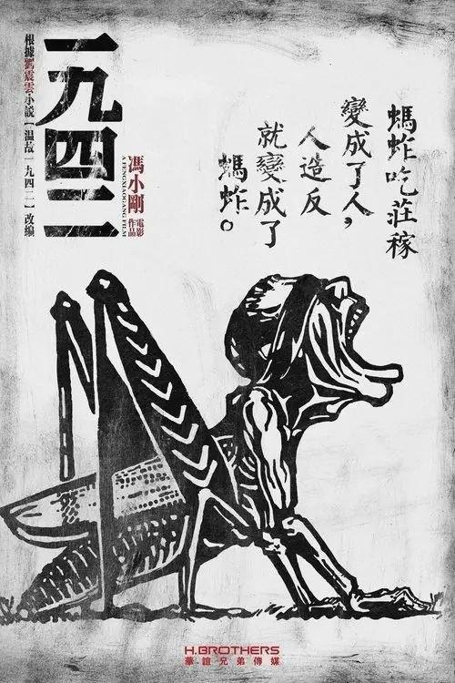

---

## 火凤凰

[2026-10-01 20:04] 来自：综合网盘资源频道

名称：火凤凰 火鳳凰 (1978)

描述：叙述日本人潜伏中国武馆，化装红衣蒙面人，屡次暗杀立志北伐的爱国志士，后来被揭穿的悬疑武打故事。

这片子真可以当成侦破片来看，武馆的人一个一个被杀，凶手究竟是谁...

夸克网盘：https://pan.quark.cn/s/3a98cfd8ced0

📁 大小：AA

🏷 标签：#动作 #火凤凰 #火鳳凰 #quark

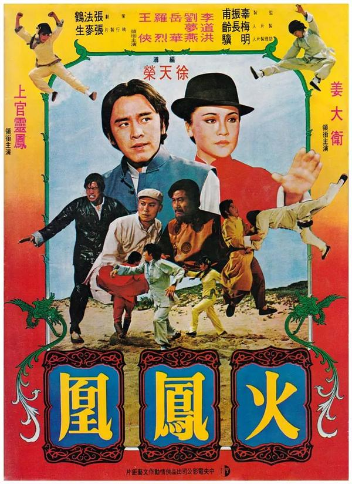

---

## 木星上行

[2026-10-01 20:00] 来自：综合网盘资源频道

名称：木星上行 Jupiter Ascending (2015)

描述：故事发生在遥远的未来，相貌平平的女孩朱庇特·琼斯(米拉·库尼斯 Mila Kunis 饰)自幼丧父，如今她以厕所清洁工的身份在茫茫人海中奋力求生。谁知毫无征兆的一天，朱庇特的命运彻底改变，来自外太空的“半兽人”赏金猎人凯恩(查宁·塔图姆 Channing Tatum 饰)将其劫持，而这一切都与朱庇特与生俱来的神秘基因有关。话说在浩瀚宇宙的最深处，存在着一个屹立数千亿年的埃布拉赛克斯王朝，在前代女王去世后，顺位第一继承人的巴勒姆(埃迪·雷德梅尼 Eddie Redmayne 饰)践祚，野心勃勃地开始了他的邪恶计划。但是朱庇特拥有和前代女王最为接近的血缘，从而对巴勒姆的王位构成了威胁。

夸克网盘：https://pan.quark.cn/s/408c42d2a49e

📁 大小：AA

🏷 标签：#科幻 #冒险 #木星上行 #quark

---

## 打雀英雄传

[2026-10-01 19:52] 来自：综合网盘资源频道

名称：打雀英雄传 打雀英雄傳 (1981)

描述：八十年代初期的邵氏电影，在赌片上下的工夫显然是比较大。比如这部投资不大、效益却不小的《打雀英雄传》，就是其中的一个代表作。刚刚在电视银屏上塑造完赌王形象的谢四哥，再度重操旧业，扮演起了足智多谋的麻雀英雄，角色尚算是有情有义。故事围绕着年青电脑专家钱小豪展开，四哥为了帮他，避免其麻雀馆落入麻雀千王败类岳华手上，不惜重新出山与其鏖战，双方斗智，最终胜出一筹。

夸克网盘：https://pan.quark.cn/s/bf9893341799

📁 大小：AA

🏷 标签：#剧情 #打雀英雄传 #打雀英雄傳 #quark

---

## 不洁

[2026-10-01 19:49] 来自：综合网盘资源频道

名称：不洁 The Unholy (2021)

描述：本片讲述一位听障女孩爱丽丝在圣母玛利亚的一次探视之后莫名其妙地恢复了视听功能，甚至还能给人治病。这一消息立刻传开，人们纷涌而至，感受奇迹，一位失了名声的记者(Jeffrey扮演)想要一探究竟并借此找回名声。随着可怕的事情一件件发生，他开始质疑这些现象是圣母玛利亚的“杰作”，还是更邪恶的存在？

夸克网盘：https://pan.quark.cn/s/3c94252e05e8

📁 大小：AA

🏷 标签：#恐怖 #不洁 #quark

---

## 家族荣耀之继承者

[2026-10-01 19:47] 来自：综合网盘资源频道

名称：家族荣耀之继承者 (2024)

描述：豪门丘氏素来以重男轻女闻名，众所周知丘家产业会由第三代唯一的男孙丘智斌(罗子溢 饰)继承。丘老太爷因中风昏迷，一纸由其亲笔签署的委托书震惊众人：他竟然委托长孙女丘皓儿(佘诗曼 饰)代他执行集团主席一职。但这份委托书并没有把丘皓儿送往权力的高峰，而是推入了风暴的中心。

夸克网盘：https://pan.quark.cn/s/8f8c2bb90740

📁 大小：AA

🏷 标签：#剧情 #家族荣耀之继承者 #quark

---

## 黎明之前

[2026-10-01 19:41] 来自：综合网盘资源频道

名称：黎明之前 (2010)

描述：1948年，国共两党的抗争已达到白热化阶段，天下大势虽初现端倪，却也恰恰处在极为凶险，丝毫容不得有任何闪失的关键时刻。九月的一天，一名中共地下党员在沪落网并叛变，为求自保其意欲向时任上海国民政府中央情报第八局的局长谭忠恕(林永健 饰)供出一名重要卧底，此举无疑关系着我党革命的成败。谭此前和我党传奇特工水手有过多次交手经历，此番他胜券在握，而一连串的变故令其意识到敌我双方泥潭之凶险。与此同时，谭为了阻止药品大亨庄文清手中的药品落入解放军之手，透过儿子的校长段海平(陆剑民 饰)实施摩西计划；极富野心的第八局行动处长李伯涵在疯狂追查共党卧底的过程中，则将矛头指向谭最信任的总务处处长刘新杰(吴秀波 饰)。

你来我往，明枪暗箭，黎明前最凶险的棋局悄悄布开…

夸克网盘：https://pan.quark.cn/s/7a19593ced26

📁 大小：AA

🏷 标签：#剧情 #黎明之前 #quark

---

## 大卫戈尔的一生

[2026-10-01 19:31] 来自：电影资源频道(4K、REMUXE/原盘)

名称：【原盘】大卫戈尔的一生 (2003) 1080P REMUX 外挂简英双语特效字幕

描述：贝茜•布鲁姆（凯特温斯莱 Kate Winslet饰）是纽约某新闻杂志的知名记者，她接到了一个任务是去采访一名死刑犯大卫•戈尔（凯文•斯帕西 Kevin Spacey 饰）。戈尔的罪名是强奸并谋杀了康丝坦斯•哈拉维，并将于周五下午6点被处以死刑，那么布鲁姆将要采访并记录的就是戈尔人生最后的三天，而此前戈尔拒绝了一切采访。布鲁姆起初对这个任务很不以为然，但在和戈尔的接触过程中，她发现一切并非表面呈现的那么简单，于是布鲁姆决定用仅剩的三天开始寻找真相……

电影《大卫戈尔的一生》的导演艾伦•帕克凭借该片提名2003年柏林国际电影节金熊奖。

夸克网盘：https://pan.quark.cn/s/976a1fc4259b

📁 大小：29.1GB

🏷 标签：#大卫戈尔的一生 #剧情 #悬疑 #犯罪

---

## 朗读者

[2026-10-01 19:10] 来自：电影资源频道(4K、REMUXE/原盘)

名称：【原盘】朗读者 (2008) 1080P REMUX 内封简英双语字幕

描述：15岁的少年米夏·伯格（大卫·克劳斯 David Kross 饰）偶遇36岁的中年神秘女列车售票员汉娜（凯特·温丝莱特 Kate Winslet 饰），后来两个发展出一段秘密的情人关系。汉娜最喜欢躺在米夏怀里听米夏为他读书，她总是沉浸在那朗朗的读书声中。年轻的米夏沉溺于这种关系不能自拔的同时，却发现他自己根本不了解汉娜。忽然有一天，这个神秘女人不告而别，米夏在短暂的迷惑和悲伤之后，开始了新的生活。二战虽然结束了，但德国对于纳粹战犯的审判还在继续。成为法律学校的实习生的米夏，在一次旁听对纳粹战犯的审判过程中，竟然发现一个熟悉的身影。虽然已经事隔8年，但米夏还是一眼便认出那就是消失8年的汉娜。而这一次，她坐上了纳粹战犯审判法庭的被告席，这个神秘女人的往事在案件的审理过程中逐渐清晰。然而，米夏却发现了一个汉娜宁愿搭上性命也要隐藏秘密。

夸克网盘：https://pan.quark.cn/s/40563c1d48d2

📁 大小：29.8GB

🏷 标签：#朗读者 #剧情 #爱情

---

## 秘密采访

[2026-10-01 17:25] 来自：综合网盘资源频道

名称：秘密采访 (1989)

描述：1949年的一天夜里，原国民党中将王约翰在香港的寓所中被人杀害。凶手是谁？《民报》的美籍华人记者麦克锋(王志文饰)不顾个人安危，进行了秘密采访。他的女友唐丽媛(卓雷饰)在报社的资料室工作，帮麦克锋找到一些线索，麦克锋发现这件谋杀案背景复杂……

夸克网盘：https://pan.quark.cn/s/0e227665f368

📁 大小：AA

🏷 标签：#剧情 #秘密采访 #quark

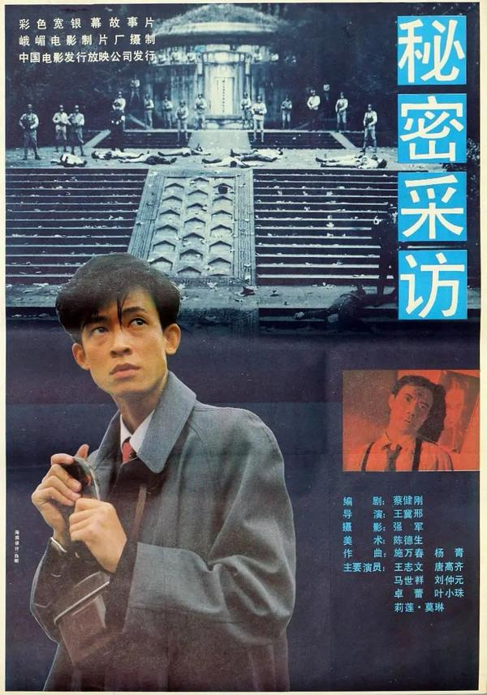

---

## 李卫当官

[2026-10-01 17:23] 来自：综合网盘资源频道

名称：李卫当官 (2001)

描述：故事发生在清朝康熙年间。逃难途中，出身卑微的李卫(徐峥 饰)邂逅岳思盈(陈好 饰)姐弟，他们结伴来到江南。李卫在客栈偷拿微服私访的十三阿哥胤祥(王辉 饰)的宝剑，赶赴县令冯月清(孙宝光 饰)所设法场，救下一群因哄抢粮食即遭处决的灾民，这一切被尾随其后的胤祥和胤禛(唐国强 饰)看在眼中，对他大加赏识，并派他出任苏阳县令。目不识丁的李卫当官伊始闹出不少笑话，但他凭借机智与歪才，惩治了横行一方的恶霸，苏阳百姓对他称赞有加。李卫的功绩传到胤禛耳中，此时正逢西北战乱国库空虚，李卫又被任命为扬州知府，负责查处当地盐商偷税漏税一并惩处贪官。扬州赴任，与盐商的初次交锋让李卫知道了什么叫人外有人天外有天..

夸克网盘：https://pan.quark.cn/s/e06050a2bad2

📁 大小：AA

🏷 标签：#剧情 #喜剧 #李卫当官 #quark

---

## 盗梦空间

[2026-10-01 14:42] 来自：肯德基の4K影视综合电影云盘站

名称：【原盘】盗梦空间 (2010) 4K REMUX HDR 杜比视界 外挂简英双语字幕

描述：道姆·柯布（莱昂纳多·迪卡普里奥 Leonardo DiCaprio 饰）与同事阿瑟（约瑟夫·戈登-莱维特 Joseph Gordon-Levitt 饰）和纳什（卢卡斯·哈斯 Lukas Haas 饰）在一次针对日本能源大亨齐藤（渡边谦 饰）的盗梦行动中失败，反被齐藤利用。齐藤威逼利诱因遭通缉而流亡海外的柯布帮他拆分他竞争对手的公司，采取极端措施在其唯一继承人罗伯特·费希尔（基里安·墨菲 Cillian Murphy 饰）的深层潜意识中种下放弃家族公司、自立门户的想法。为了重返美国，柯布偷偷求助于岳父迈尔斯（迈克尔·凯恩 Michael Caine 饰），吸收了年轻的梦境设计师艾里阿德妮（艾利奥特·佩吉 Elliot Page 饰）、梦境演员艾姆斯（汤姆·哈迪 Tom Hardy 饰）和药剂师约瑟夫（迪利普·劳 Dileep Rao 饰）加入行动。在一层层递进的梦境中，柯布不仅要对付费希尔潜意识的本能反抗，还必须直面已逝妻子梅尔（玛丽昂·歌迪亚 Marion Cotillard 饰）的处处破坏，实际情况远比预想危险得多……

夸克网盘：https://pan.quark.cn/s/69db7557a12f

百度网盘：https://pan.baidu.com/s/1J56F7oV39otfc5Es2paykQ?pwd=u4ic

📁 大小：66GB 

🏷 标签：#动作 #科幻 #冒险 #盗梦空间

---

## 上帝之城

[2026-10-01 14:41] 来自：肯德基の4K影视综合电影云盘站

名称：【原盘】上帝之城 (2002) 1080P REMUX 外挂简英双语字幕

描述：巴西里约热内卢的贫民窟，这里是“上帝之城”，更是魔鬼也会叹息着转身的地方。阿炮（Alexandre Rodrigues 饰）带着我们到了这里，他见证了这里二十多年来被残暴、贪婪、复仇、野心、背叛、掠夺所裹挟的混乱生活以及最终导致的一场灾难性的黑帮争斗。虽然从小就要 辗转于匪徒间求生存，但胆小怕事的性格与自我保护的本能却使他一直能平安度日。60年代初，阿毛、阿夹和阿呆是这里的“少年三侠”，在抢劫完旅馆之后，他们三人分道扬镳，阿夹重回上帝的怀抱，而阿呆和阿毛纷纷付出了生命的代价。

夸克网盘：https://pan.quark.cn/s/e1c4301c8596

百度网盘：https://pan.baidu.com/s/10ld9Q8eClUr1h-xQvLqr_A?pwd=9n64

📁 大小：39.3GB

🏷 标签：#上帝之城 #剧情 #犯罪

---

## 潜入兄妹

[2026-10-01 14:24] 来自：综合网盘资源频道

名称：潜入兄妹 特殊诈欺特命搜查官 潜入兄妹 特殊詐欺特命捜査官 (2024) 【更新至10集】【1080p】【中日双语】【日剧】前传篇+后传篇

描述：本剧讲述了兄妹俩的父亲贵司作为警察在工作中被人杀害，不久后，他们得知犯人是日本最大级别的特殊诈骗组织“幻兽”的干部后，两人决定为父报仇。哥哥渡良濑贵一曾是警察，充满正义感和行动力，妹妹渡良濑优贵是国立大学的工程师，也是优秀的白帽黑客。两人利用各自的特长潜入组织，与巨恶对峙。

夸克网盘：https://pan.quark.cn/s/7fcaada87a50

📁 大小：NG

🏷 标签：#剧情 #潜入兄妹 #特殊诈欺特命搜查官 #特殊詐欺特命捜査官 #1080p #中日双语 #quark

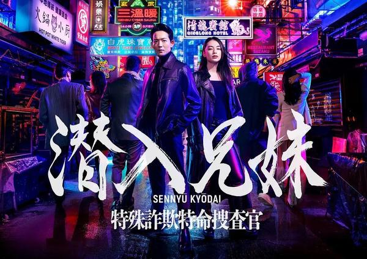

---

## 布达佩斯之恋

[2026-10-01 14:24] 来自：电影资源频道(4K、REMUXE/原盘)

名称：【原盘】布达佩斯之恋 (1999) 1080P REMUX 国德多音轨 内封简中特效字幕

描述：人们总是难以抗拒《忧郁星期天》的悲伤情调，原来这首歌与一段复杂凄美的爱情故事有关。上世纪30年代的匈牙利首都布达佩斯的一个餐馆里，美丽的伊洛娜（艾丽卡·莫露珊 Erika Marozsán 饰）同时被两个男人深爱着。一个是餐厅老板，另一个是钢琴师。三个人都并不愿意改变现况，打破平衡，伊洛娜同时拥有两个男人的爱而深感平静幸福。钢琴师为她创作出《忧郁星期天》，他和餐厅也因此一举成名。然而，汉斯的出现彻底毁灭了这一切。他曾经是一个无名小子，深深迷上《忧郁星期天》 的同时，更是成为伊洛娜的裙下之臣。汉斯向伊洛娜求婚，却被拒绝，满腔恨意的他如今成了军官，风光无限，正带着他蓄谋已久的复仇计划来到伊洛娜身边，给他们的生活以致命一击。爱、复仇与战争的故事，在布达佩斯纠结上演。

夸克网盘：https://pan.quark.cn/s/dd52c5a06a3a

📁 大小：31.5GB

🏷 标签：#布达佩斯之恋 #剧情 #爱情

---

## 在我死前一周

[2026-10-01 12:11] 来自：影视动漫分享|SeedHub|夸克|网盘|🧲

名称：在我死前一周 (2024)

#电视剧 #爱情 #奇幻 #夸克 #迅雷 #百度

主演: 孔明 金敏荷 郑干柱 

豆瓣: [8.3](https://movie.douban.com/subject/36638312/)

改编自同名小说，讲述了在对生活没有欲望，像傀儡一样生活的24岁郑熙完（金敏荷饰）在去世前一周，见到小时候的朋友兼初恋金蓝宇（孔明饰）作为阴间使者出现后回到高中时期，..

夸克网盘：https://pan.quark.cn/s/035c559e07fd

迅雷网盘：https://pan.xunlei.com/s/VOO_jdRFcUGtiXMWe4czztXrA1?pwd=n6ja

百度网盘：https://pan.baidu.com/s/1POxfZ1oZJBaJd8fzeaRc8w?pwd=8888

---

## 杀人者

[2026-10-01 12:11] 来自：影视动漫分享|SeedHub|夸克|网盘|🧲

名称：杀人者 (2014)

#电影 #惊悚 #百度

主演: 马东锡 安道奎 金贤秀 

豆瓣: [5.9](https://movie.douban.com/subject/25806460/)

在一个远离都市喧嚣的乡村小镇，懦弱无言的少年任龙浩日常饱受同学的欺负。某天，有着破碎家庭的女孩韩智秀随母亲转学来到这里，许是相同的境遇和心情，让少男少女从最初的排斥..

百度网盘：https://pan.baidu.com/s/1uf39TpP6J3_zKU3fEVKt4g?pwd=cmp6

---

## 学警出更

[2026-10-01 12:10] 来自：影视动漫分享|SeedHub|夸克|网盘|🧲

名称：学警出更 (2007)

#电视剧 #犯罪 #剧情 #夸克 #迅雷

主演: 陶大宇 郭羡妮 容祖儿 

豆瓣: [7.3](https://movie.douban.com/subject/2228604/)

李柏翘（陈键锋饰），钟立文（吴卓羲饰）在PTS警校毕业后，被分配到油麻地分区巡逻。柏翘照章办事，立文则热心冲动。立文经过反思，决定支持阿花（杨怡饰）去日本读设计。柏..

夸克网盘：https://pan.quark.cn/s/7bf18ea05f1d

迅雷网盘：https://pan.xunlei.com/s/VOODdO-ZFNL_XA9VJ6lACjp-A1?pwd=7c6z

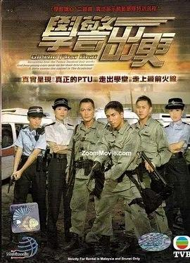

---

## 消失吧群青

[2026-10-01 12:10] 来自：影视动漫分享|SeedHub|夸克|网盘|🧲

名称：消失吧，群青 (2019)

#电影 #爱情 #剧情 #夸克

主演: 横滨流星 饭丰万理江 矢作穗香 

豆瓣: [6.4](https://movie.douban.com/subject/33377652/)

高中生七草与其他2000人发现自己被丢弃在一个叫“阶梯岛”的小岛上，而且大家都失去了抵达小岛之前的所有记忆。阶梯岛上有一条长长的阶梯贯穿小岛一直延伸到高山上，而统治..

夸克网盘：https://pan.quark.cn/s/2b6e7bb1a55c

---

## 陪审员

[2026-10-01 12:10] 来自：影视动漫分享|SeedHub|夸克|网盘|🧲

名称：陪审员 (2019)

#电影 #剧情 #夸克

主演: 文素利 朴炯植 白秀章 

豆瓣: [7.6](https://movie.douban.com/subject/27115758/)

影片讲述围绕一起意外事件，国民陪审团的成员们探寻什么是正义的故事。..

夸克网盘：https://pan.quark.cn/s/f44386ecede1

---

## 不明影像绝对点击禁止

[2026-10-01 12:10] 来自：影视动漫分享|SeedHub|夸克|网盘|🧲

名称：不明影像：绝对点击禁止 (2012)

#电影 #恐怖 #夸克

主演: 朴宝英 周元 江星 

豆瓣: [6.1](https://movie.douban.com/subject/6311983/)

在网络监查科兼职的大学生俊赫，为了和生气的女友世熙（朴宝英饰）重归于好，转而求助于女友的妹妹——高中女孩静美。静美是一个沉迷以来网络的时尚女孩，她答应帮助俊赫，条件..

夸克网盘：https://pan.quark.cn/s/437fa27717f5

---

## 欢天喜地七仙女

[2026-10-01 12:10] 来自：影视动漫分享|SeedHub|夸克|网盘|🧲

名称：欢天喜地七仙女 (2005)

#电视剧 #喜剧 #古装 #剧情 #夸克

主演: 霍思燕 郑国霖 蒋欣 

豆瓣: [7.9](https://movie.douban.com/subject/2997317/)

王母（潘虹饰）最小的女儿七仙女紫儿（霍思燕饰）私下凡尘，与凡人董永（郑国霖饰）相爱并成亲。但她的行为触犯了天条戒律，为了维护天庭法度，王母派仙下凡捉回七仙女。伤心欲..

夸克网盘：https://pan.quark.cn/s/c08b8de555cc

---

## 夜之女王

[2026-10-01 12:10] 来自：影视动漫分享|SeedHub|夸克|网盘|🧲

名称：夜之女王 (2013)

#电影 #喜剧 #爱情 #夸克

主演: 千正明 金敏贞 

豆瓣: [6.0](https://movie.douban.com/subject/20427090/)

映秀（千正明饰）是个心眼像针尖一样小，特别喜欢斤斤计较的男人，可以为了一丁点小的蝇头之利毫不顾忌颜面，因此完全没有魅力可言，更是百分之百的恋爱绝缘体。当然，对于映秀..

夸克网盘：https://pan.quark.cn/s/21ed05762764

---

## 人鬼情未了

[2026-10-01 12:10] 来自：影视动漫分享|SeedHub|夸克|网盘|🧲

名称：人鬼情未了 (2010)

#电影 #悬疑 #奇幻 #惊悚 #爱情 #剧情 #夸克

主演: 松岛菜菜子 宋承宪 树木希林 

豆瓣: [6.3](https://movie.douban.com/subject/4853478/)

缠绵悱恻的爱情故事不分国界，人鬼情未了的故事这次发生在了女强人，公司大老板星野七海（松岛菜菜子饰）身上。七海和命定之人——来自韩国的陶艺家金举诺（宋承宪饰）在日本相..

夸克网盘：https://pan.quark.cn/s/ab85b5c20acf

---

## My盛Lady

[2026-10-01 09:33] 来自：综合网盘资源频道

名称：My盛Lady (2013) 1080p WEB-DL 中文字幕 H264 AAC 2.0

描述：广告公司创作总监香广男被誉为“盛女救星”，专门帮助单身女性寻找姻缘；新同事盛花蕾却对他的处事方式十分反感，两人在工作与感情纠葛中逐渐改变彼此。

夸克网盘：https://pan.quark.cn/s/665677dd952c

百度网盘：https://pan.baidu.com/s/1XeuqC2QXCvh36tzi4dSA5w

📁 大小：X

🏷 标签：#My盛Lady #喜剧 #爱情 #中国香港 #文伟鸿 #黄子华 #徐子珊 #阮兆祥 #陈敏之 #许绍雄 #江美仪 #1080p #WEBDL #中文字幕 #AAC #quark #baidu

---

## 大汉十三将之血战疏勒城

[2026-10-01 09:06] 来自：综合网盘资源频道

名称：大汉十三将之血战疏勒城 (2019) 4K 60帧

描述：《大汉十三将之血战疏勒城》是由浙江美视众乐文化传播有限公司于2019年推出的一部历史、战争、古装、爱情类型影片，该片由回宇执导，谢苗、陈梦希、热依娜主演。讲述了公元七十四年，汉朝重新设立西域都护，外番大肆入侵汉朝边境。疏勒城守将耿恭凭其智慧、胆略，救下被围困的百姓与将士 ，众人在疏勒城历经重重磨难中，展现出人性光辉和至情至性的一面。最终等来大汉援军，粉碎了外番侵略图谋，而归返入关将士仅余十三人。故事彰显了大汉朝“犯我大汉者，虽远必诛”与“凡我大汉子民，虽远必救”的精神。

夸克网盘：https://pan.quark.cn/s/60ebb7437d32

百度网盘：https://pan.baidu.com/s/1yRetT7TRIzfqjbNKHrRseA?pwd=s024

📁 大小：12.5GB

🏷 标签：#大汉十三将之血战疏勒城 #古装 #历史 #4K #60帧 #ali #quark #baidu

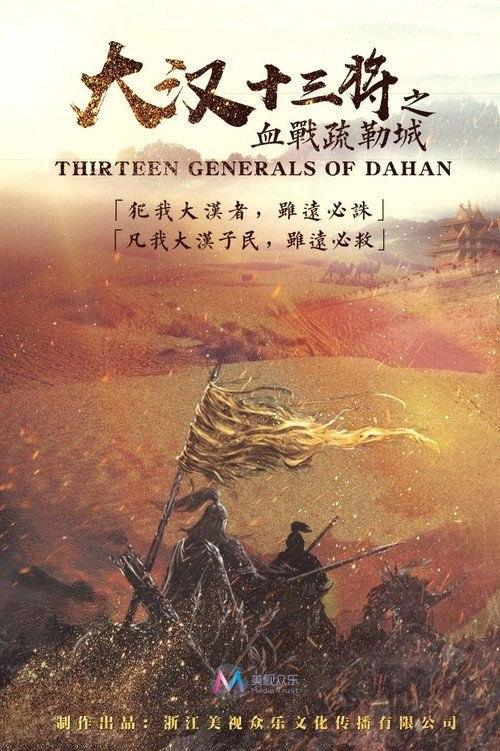

---

## 绝密跟踪

[2026-09-30 23:52] 来自：综合网盘资源频道

名称：绝密跟踪 (2013)1080p 原盘REMUX 中文字幕 AVC DTS-HD MA 7.1

描述：在韩国警察系统中存在着一个特殊的部门——监视班，该班有一群貌不惊人但拥有高超分析能力和跟踪技巧的探员组成。在班长黄尚钟(薛景求 饰)的指挥下，监视班一次次抓获狡猾罪犯，将他们绳之于法。某日，一腔热血的警员河允珠(韩孝珠 饰)以优异的成绩通过黄班长极为苛刻的测试，成为监视班的一员，代号“花猪”。虽然初出茅庐略显青涩，但花猪很快凭借其缜密的分析能力赢得班长的信任。与此同时，以詹姆士(郑雨盛 饰)为首的一组犯罪分子正策划对证券交易所的秘密行动。虽然已经获得罪犯的蛛丝马迹，但詹姆士极其狡猾，拥有超高的反侦查能力。 一系列高端的猫鼠游戏在闹市中央相继展开……

夸克网盘：https://pan.quark.cn/s/5ccc069f2045

📁 大小：

🏷 标签：#剧情 #绝密跟踪 #1080p #原盘REMUX #中文字幕 #DTSHD #quark

---

## 带你去见我妈

[2026-09-30 23:51] 来自：综合网盘资源频道

名称：带你去见我妈 (2022) 4K WEB-DL H265 AAC 2.0

描述：郑泽凯和卢静珊在深圳相恋两年，两人在异乡一起打拼，相伴相依。远在汕头老家的母亲却一直不知道儿子已经有了女朋友，不仅频频催婚，甚至安排相亲对象来到深圳。泽凯迟迟没有向家人介绍静珊，因为她曾有过一段婚姻，他担心传统的母亲难以接受。面对越来越紧迫的催婚和两人的未来，泽凯终于决定不再逃避，带着静珊回到汕头老家，正式去见自己的妈妈……

迅雷网盘：https://pan.xunlei.com/s/VP2n-4GN2WCOyElGV6h7iKHpA1?pwd=smqj

夸克网盘：https://pan.quark.cn/s/2d37022894b9

📁 大小：17.8GB

🏷 标签：#喜剧 #爱情 #带你去见我妈 #4K #WEBDL #AAC #xunlei #quark

---

## 天地玄门

[2026-09-30 23:51] 来自：综合网盘资源频道

名称：天地玄门 (1991) 1080p 原盘REMUX AVC DTS-HD MA 2.0

描述：明代孝宗年间，施家镇出现扶桑鬼王(左颂升 饰)危害人间，并霸占美女施施(王祖贤 饰)为爱姬。鬼王伤害性命无数，惹得天怒人怨，皇上任命正直武官马尚峰(成奎安 饰)捉拿鬼王。正当愁眉不展之际，师爷向马举荐身怀绝技的草芦居士(林正英 饰)帮忙，却得知为除鬼王需牺牲自己的性命。马愤愤返回，草芦居士设计令马尚峰假死，使其化为金甲武士与徒弟(黄一山 饰)担任自己的左右护卫。师徒三人与鬼王展开艰苦鏖战，却由此导致天地玄门大开，正邪双方穿越时空，来至现代。在这里，师徒三人各自遭遇不同的蹊跷趣事。偶然机会，草芦居士发现酷似施施的女医生Gigi。绵延数百年的正邪大战将再次展开……

夸克网盘：https://pan.quark.cn/s/dfac0ac8ebc6

📁 大小：26GB

🏷 标签：#奇幻 #天地玄门 #1080p #原盘REMUX #DTSHD #quark

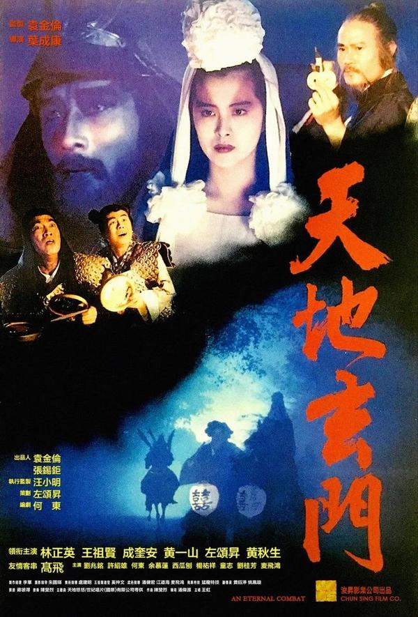

---

## 奇怪的夜晚

[2026-09-30 22:35] 来自：综合网盘资源频道

名称：奇怪的夜晚 Night of Something Strange (2016)

描述：一群青少年打算趁著周末前往海边度假，却意外来到了一间偏僻的旅馆。迷路不打紧，更可怕的还在后头！一种神祕的性病迅速扩散，感染者全都成了欲火高涨的性爱狂魔四处找人爱爱！面对见人就上的感染者们，这群年轻人能否安然逃过被狂抽猛送的下场，度过这“屄”死人的夜晚？

夸克网盘：https://pan.quark.cn/s/61a44fac4e4e

📁 大小：AA

🏷 标签：#剧情 #奇怪的夜晚 #quark

---

## 运财智多星

[2026-09-30 22:22] 来自：综合网盘资源频道

名称：运财智多星 運財智叻星 (1996)

描述：这是香港九十年代的搞笑片。天庭上的九天玄女(钟丽缇 饰)因为私自和外国的天使约会被发现，而遭玉帝贬到了凡间，一直暗恋她的另一位天神横财神阿力(陈百祥 饰)为了爱情也一起下凡追寻九天玄女。

阿力来到凡间，遇到了按摩女美丽(袁咏仪 饰)。美丽十分贪财，但之前赌运都不佳。阿力运用自己的法力令美丽逢赌必赢，令美丽十分高兴。这时，阿力得知九天玄女已经转世为美国赌场的公关经理，现在来了美国主持赌王大赛。兴奋不已的阿力决定参赛赢取美人芳心

夸克网盘：https://pan.quark.cn/s/1449684f264d

📁 大小：AA

🏷 标签：#剧情 #运财智多星 #運財智叻星 #quark

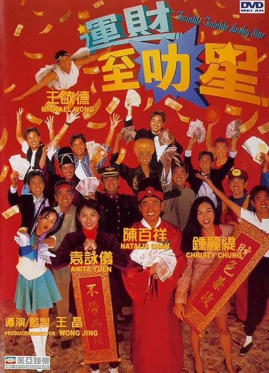

---

## 完美的世界

[2026-09-30 22:02] 来自：综合网盘资源频道

名称：【原盘】完美的世界 (1993) 1080P REMUX 外挂简/繁英双语字幕

描述：单亲孩子菲利普·佩里(T·J·劳瑟 T.J. Lowther 饰)的母亲对他管教甚严，8岁的小菲利普甚至从未参加过一次鬼节讨糖果的游戏。附近州监狱的两名罪犯越狱成功，劫持了菲利普作为人质，向德州边界逃窜。途中，罪犯之一的布奇(凯文·科斯特纳 Kevin Costner 饰)干掉了鲁莽愚蠢的同伙，却对小菲利普照顾有加。与此同时，德州警探瑞德(克林特·伊斯特伍德 Clint Eastwood 饰)带着手下和州长特派的犯罪专家萨利(劳拉·邓恩 Laura Dern 饰)一同火速追捕布奇。双方在德克萨斯州境内展开了一场公路赛大竞技；而小菲利普也经历了很多从未想过过的刺激与快乐，并与布奇产生了一种近似父子的不寻常感情……

夸克网盘：https://pan.quark.cn/s/140e16148f3d

百度网盘：https://pan.baidu.com/s/1ewPJJHjOHEvgzcMPmHcpCA?pwd=32jr

📁 大小：32.2GB

🏷 标签：#剧情 #犯罪 #完美的世界 #原盘 #1080P #REMUX #外挂简 #繁英双语字幕 #ali #quark #baidu

---

## 带你去见我妈

[2026-09-30 21:56] 来自：综合网盘资源频道

名称：带你去见我妈 (2022) 4K WEB-DL H265 AAC 2.0

描述：郑泽凯和卢静珊在深圳相恋两年，两人在异乡一起打拼，相伴相依。远在汕头老家的母亲却一直不知道儿子已经有了女朋友，不仅频频催婚，甚至安排相亲对象来到深圳。泽凯迟迟没有向家人介绍静珊，因为她曾有过一段婚姻，他担心传统的母亲难以接受。面对越来越紧迫的催婚和两人的未来，泽凯终于决定不再逃避，带着静珊回到汕头老家，正式去见自己的妈妈……

百度网盘：https://pan.baidu.com/s/15z8E8_dDNhdMXQF4Q0jBpg?pwd=Yu88

📁 大小：17.8GB

🏷 标签：#喜剧 #爱情 #带你去见我妈 #4K #WEBDL #AAC #baidu

---

## 出租车司机

[2026-09-30 21:55] 来自：电影资源频道(4K、REMUXE/原盘)

名称：【原盘】出租车司机 (1976) 4K REMUX HDR 杜比视界 外挂简英双语字幕

描述：特拉维斯（罗伯特·德尼罗 Robert De Niro 饰）从越战中退伍回来后一直在纽约以开出租车为生。战争后的他多少有些失落，加上开出租车目睹了纽约夜幕下的种种罪恶，令他变得愤世嫉俗、痛恨社会。在追求总统候选人帕兰坦竞选办公室的秘书贝西失败后，特拉维斯决定去刺杀帕兰坦 以证明自己。在准备刺杀行动的过程中，特拉维斯遇上了被逼卖淫的雏妓艾瑞斯。在企图救艾瑞斯出火坑未果后，特拉维斯手持武器闯进淫窝，将里面的一干人等通通干掉了！本以为即将收到法律的惩罚，然而媒体却将特拉维斯描述成了一个拯救少女的英雄……

夸克网盘：https://pan.quark.cn/s/a5230aa4b3d7

📁 大小：54.5GB

🏷 标签：#出租车司机 #剧情 #犯罪

---

## 双城计中计

[2026-09-30 21:54] 来自：综合网盘资源频道

名称：双城计中计 (2012)

描述：民国初年，军阀混战，战祸四起，民不聊生。乱世之中，却为一群以骗术为生的老千们，提供了展露身手的舞台。

黑帮老大林啸天(刘承俊饰)从一名老千处得知日本人将给军阀王大帅(九孔饰)十二箱金子作为军阀与北伐军抵抗的资金。为了得到这批金子，林啸天开始招兵买马，其中江湖中有千面人之称的老千“鬼脸”(任贤齐饰)和“不动石佛”大老千(腾格尔饰)成了林啸天首先拉拢的目标。

谁知“鬼脸”与“石佛”竟然是不能见面的仇家，两人为了置对方于死地，展开了一场骗术的大较量，不料两人在这场较量中势均力敌。期间“鬼脸”遇见了假扮修女行窃的 “饺子”(熊乃瑾饰)，善于开锁的“饺子”也被搅进了林啸天的阴谋之中。

一行人浩浩荡荡的赶往黄金的交易地点“风口镇”。风口镇是一个人迹罕至的小镇，总共只有百十户人家，却有着当地令人闻风丧胆的土匪团伙，领头的金三娘(翁虹饰)在一场混战中却看上了“石佛”，执意要抢石佛做她的“压寨先生”。

为了神不知鬼不觉的拿到黄金，“石佛”提出了一个惊天的偷梁换柱计划——双城计，把另一座已经废弃的小镇——“落水镇”变成“风口镇”，为此一场关于黄金矿藏的计划紧锣密鼓的展开。

夸克网盘：https://pan.quark.cn/s/d1e33bbfd18e

📁 大小：AA

🏷 标签：#剧情 #双城计中计 #quark

---

## 僵

[2026-09-30 21:54] 来自：综合网盘资源频道

名称：僵 (2016) 1080p WEB-DL 中文字幕 H265 AAC 2.0

描述：五百年前的锦衣卫刑活着因意外变成僵尸，五百年后仍在人间寻找当年的真相。一次偶然机会，他与驱魔师蓝梦南相遇，二人联手对抗僵尸与邪恶势力，在爱恨纠葛中揭开一段尘封往事。

迅雷网盘：https://pan.xunlei.com/s/VP2m_xFA20v7sV6eEHi1OOV1A1?pwd=fr3c

百度网盘：https://pan.baidu.com/s/1pnKm5q8ZeD5Fuo4Ppukvhg?pwd=zr3m 来自：综合网盘资源频道 [2026-09-30 12:50] 名称：僵 (2016) 1080p WEB-DL 中文字幕 H265 AAC 2.0

📁 大小：X

🏷 标签：#僵 #剧情 #爱情 #动作 #奇幻 #中国香港 #陈维冠 #郑嘉颖 #谢安琪 #陈凯琳 #1080p #WEBDL #中文字幕 #AAC #baidu #xunlei

---

## 冬眠

[2026-09-30 21:54] 来自：综合网盘资源频道

名称：冬眠 (2014)1080p 原盘REMUX 中文字幕 AVC DTS-HD MA 5.1

描述：前演员艾登与年轻妻子尼哈尔在安纳托利亚中部经营一家小旅馆，两人关系紧张；同住的还有因近期离婚而痛苦的姐姐内吉拉。当冬季白雪开始覆盖大地，旅馆化作避世之所，却也成为无法逃离、激化彼此矛盾的牢笼。

夸克网盘：https://pan.quark.cn/s/322e2dadc670

迅雷网盘：https://pan.xunlei.com/s/VP2m_uaiPo7VbqEMui7HkiY-A1?pwd=hbq6

百度网盘：https://pan.baidu.com/s/1qukVaZYaJPuAEc82M3K3Ww?pwd=Yu88 来自：综合网盘资源频道 [2026-09-30 12:53] 名称：冬眠 (2014)1080p 原盘REMUX 中文字幕 AVC DTS-HD MA 5.1

📁 大小：39.6GB

🏷 标签：#剧情 #冬眠 #1080p #原盘REMUX #中文字幕 #DTSHD #quark #xunlei

---

## 无主之作

[2026-09-30 21:54] 来自：电影资源频道(4K、REMUXE/原盘)

名称：【原盘】无主之作 (2018) 1080P REMUX 内封简中特效字幕

描述：库尔特（汤姆·希林 Tom Schilling 饰）的姨母曾经被关进过集中营，最终在纳粹医生卡尔（塞巴斯蒂安·科赫 Sebastian Koch 饰）的折磨下不幸死去。虽然库尔特幸运的在柏林墙建成之前逃往了西德，但他的整个童年时代都生活在纳粹的阴影之下，这给他的人格带来了极大的创伤。之后，库尔特进入了杜塞道夫美术学院就读，无法走出过去阴影的他将内心的绝望和伤痛都挥洒在了画布之上。一次偶然中，库尔特邂逅了名为艾利（葆拉·贝尔 Paula Beer 饰）的女孩，美丽活泼的艾利渐渐的治愈了库尔特内心的伤痕，当两人鼓起勇气想要将关系再推进一步时，却遭到了艾利父亲的强烈反对。

夸克网盘：https://pan.quark.cn/s/362d6cf01fd2

📁 大小：36.7GB

🏷 标签：#无主之作 #剧情

---

## 绝密跟踪

[2026-09-30 21:52] 来自：综合网盘资源频道

名称：绝密跟踪 (2013)1080p 原盘REMUX 中文字幕 AVC DTS-HD MA 7.1

描述：在韩国警察系统中存在着一个特殊的部门——监视班，该班有一群貌不惊人但拥有高超分析能力和跟踪技巧的探员组成。在班长黄尚钟(薛景求 饰)的指挥下，监视班一次次抓获狡猾罪犯，将他们绳之于法。某日，一腔热血的警员河允珠(韩孝珠 饰)以优异的成绩通过黄班长极为苛刻的测试，成为监视班的一员，代号“花猪”。虽然初出茅庐略显青涩，但花猪很快凭借其缜密的分析能力赢得班长的信任。与此同时，以詹姆士(郑雨盛 饰)为首的一组犯罪分子正策划对证券交易所的秘密行动。虽然已经获得罪犯的蛛丝马迹，但詹姆士极其狡猾，拥有超高的反侦查能力。 一系列高端的猫鼠游戏在闹市中央相继展开……

百度网盘：https://pan.baidu.com/s/1GAk0zUdogFOSfqtkjVCcbw?pwd=Yu88

迅雷网盘：https://pan.xunlei.com/s/VP2m_Q8RKEoP8WmihQnTkEReA1?pwd=bbyj

📁 大小：

🏷 标签：#剧情 #绝密跟踪 #1080p #原盘REMUX #中文字幕 #DTSHD #baidu #xunlei

---

## 镇魂街

[2026-09-30 21:50] 来自：综合网盘资源频道

名称：镇魂街 (2017) 4K WEB-DL H265 AAC 2.0

描述：普通女孩夏铃在求职时误入罗刹街，意外结识镇魂将曹焱兵。两人在共同对抗恶灵与各方势力的过程中，逐渐揭开镇魂街背后的秘密。

链接：

迅雷网盘：https://pan.xunlei.com/s/VP2mYTBCZrdK1caahlpGAoyNA1?pwd=mcve

百度网盘：https://pan.baidu.com/s/1FsJUUHsMn3j-OSP-FNI9cQ?pwd=9axw 来自：综合网盘资源频道 [2026-09-30 12:42] 名称：镇魂街 (2017) 4K WEB-DL H265 AAC 2.0

📁 大小：X

🏷 标签：#镇魂街 #剧情 #动作 #奇幻 #中国大陆 #十一月 #汪东城 #安悦溪 #侯明昊 #4K #WEBDL #AAC #quark #xunlei

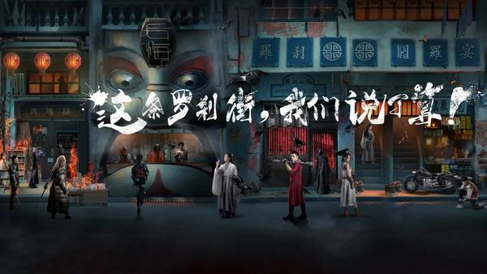

---

## 碧海蓝天

[2026-09-30 21:49] 来自：电影资源频道(4K、REMUXE/原盘)

名称：【原盘】碧海蓝天 导演剪辑版 (1988) 4K REMUX HDR 杜比视界 外挂简中字幕

描述：杰克在希腊海边长大，虽然小时候眼看着爸爸死于一次潜水事故，却没有削减杰克对大海的热爱。当杰克的朋友恩佐找到他，劝说他参加潜水冠军大赛时，杰克答应了，在比赛中成绩突出勇夺冠军，并且得到了乔安娜的爱。两人打得火热，杰克却意识到他放不下、离不开大海。意外发生了。好友恩佐在潜水中不幸丧生，杰克把恩佐的尸首放入大海当中，杰克的心中非常迷乱，他觉得自己不再属于人类社会，只想潜进深海，像海豚一样陪伴大海一生。尽管传来了乔安娜怀孕的消息，杰克深情的看了看爱人，转身投入了大海的怀抱。

夸克网盘：https://pan.quark.cn/s/014ad864cee4

📁 大小：79.9GB

🏷 标签：#碧海蓝天 #爱情 #剧情 #冒险

---

## 天地玄门

[2026-09-30 21:48] 来自：综合网盘资源频道

名称：天地玄门 (1991) 1080p 原盘REMUX AVC DTS-HD MA 2.0

描述：明代孝宗年间，施家镇出现扶桑鬼王(左颂升 饰)危害人间，并霸占美女施施(王祖贤 饰)为爱姬。鬼王伤害性命无数，惹得天怒人怨，皇上任命正直武官马尚峰(成奎安 饰)捉拿鬼王。正当愁眉不展之际，师爷向马举荐身怀绝技的草芦居士(林正英 饰)帮忙，却得知为除鬼王需牺牲自己的性命。马愤愤返回，草芦居士设计令马尚峰假死，使其化为金甲武士与徒弟(黄一山 饰)担任自己的左右护卫。师徒三人与鬼王展开艰苦鏖战，却由此导致天地玄门大开，正邪双方穿越时空，来至现代。在这里，师徒三人各自遭遇不同的蹊跷趣事。偶然机会，草芦居士发现酷似施施的女医生Gigi。绵延数百年的正邪大战将再次展开……

百度网盘：https://pan.baidu.com/s/1s6PcZ5w6RlAdcFVbvPYdHA?pwd=Yu88

迅雷网盘：https://pan.xunlei.com/s/VP2m2RW6j7QU7cAsrJXm72QOA1?pwd=n27a

📁 大小：26GB

🏷 标签：#奇幻 #天地玄门 #1080p #原盘REMUX #DTSHD #baidu #xunlei

---

## 摩洛克

[2026-09-30 21:39] 来自：综合网盘资源频道

名称：摩洛克 Moloch (2022)

描述：《曼蒂》《恐懼虛空》製作團隊打造最新駭人懼作

《最後生還者》幕後團隊打造駭人場面

溫子仁欽點「厲陰宅宇宙」新銳導演尼可范德布林克執導

家族的詛咒，將永遠糾纏著你…

喪偶的貝翠克(莎莉哈姆森 飾)帶著女兒回到位於荷蘭某沼澤地邊緣的老家，與關係疏遠的父母同住。與此同時，沼澤地裡出土一批詭異的木乃伊，丹麥考古學家喬納斯(亞歷山大維爾奧姆 飾)來到此地進行調查，並與貝翠克結識。兩人在發掘木乃伊背後祕密的過程中，周遭開始出現各種怪事，而這可能跟貝翠克的家族有關……。

夸克网盘：https://pan.quark.cn/s/6ca7fc100eb3

📁 大小：AA

🏷 标签：#恐怖 #惊悚 #摩洛克 #quark

---

## 黄色的眼泪

[2026-09-30 21:23] 来自：综合网盘资源频道

名称：黄色的眼泪 黄色い涙 (2007)

描述：1963年早春，成功申办奥运会的日本东京到处是热火朝天的建设场面，日本经济高度增长。然而就在这样的大发展时代大潮中，仍有一小群笨拙地坚守着梦想的人。青年村冈荣介(二宫和也 饰)的母亲身患癌症却坚持不肯就诊，荣介只好花钱临时找来歌手井上章一(相叶雅纪 饰)、作家向井龙三(樱井翔 饰)和画家下川圭(大野智 饰)演了一出戏，才把母亲哄骗进医院。荣介请他们在小饭店荣屋吃了顿饭后，各奔东西。几天后，四人在机缘巧合下重聚在一起。一直努力想当一名儿童漫画家的荣介，收留了同样正在为梦想而努力的三人。

夸克网盘：https://pan.quark.cn/s/0b6b4bd6f20d

📁 大小：AA

🏷 标签：#剧情 #黄色的眼泪 #黄色い涙 #quark

---

## 三千年的思念

[2026-09-30 20:52] 来自：综合网盘资源频道

名称：三千年的思念 Three Thousand Years of Longing (2022)

描述：Alithea Binnie虽然对生活还算满意，但对世界却抱着怀疑的态度。

在伊斯坦布尔，她遇到了一个精灵，后者向她提议用自由换取实现三个愿望。

但Alithea学识非常渊博，她知道与许愿有关的故事都没有好结局。精灵于是向她解释了这么做的原因，并讲述了自己辉煌的过往。

她被精灵讲述的故事所吸引，最终许下一个最令人惊讶的愿望。

夸克网盘：https://pan.quark.cn/s/d31c32fa2176

📁 大小：AA

🏷 标签：#剧情 #三千年的思念 #quark

---

## 钢琴课

[2026-09-30 20:46] 来自：综合网盘资源频道

名称：钢琴课 The Piano (1993)

描述：苏格兰单身母亲艾达·麦格拉斯(霍利·亨特 饰)自六岁起就放弃了讲话，只通过钢琴倾诉满腔情感。1852年，麦格拉斯远嫁新西兰的斯图尔特(山姆·尼尔 饰)，将钢琴也一并带了去。可是斯图尔特人手不够，只得将笨重的钢琴遗弃海滩。斯图尔特之友乔治·贝恩斯(哈维·凯特尔 饰)爱上了麦格拉斯，用八十英亩土地与斯图尔特交易。斯图尔特转让了钢琴，并命麦格拉斯教贝恩斯奏琴。钢琴课上，贝恩斯提议，如果麦格拉斯在教琴的时候允许某些出格的事情发生，一次课便可换回一个琴键

夸克网盘：https://pan.quark.cn/s/9de6fe7cf5e4

📁 大小：AA

🏷 标签：#剧情 #钢琴课 #quark

---

## 外交风云

[2026-09-30 20:36] 来自：综合网盘资源频道

名称：外交风云 (2019)

描述：重大革命历史题材电视剧《外交风云》是一部宏伟壮观的史诗巨片，以宏大的历史视野，真实地再现新中国成立以来中国外交进程和在中国大地上发生的翻天覆地的巨变。主要记述毛泽东、周恩来、邓小平、陈毅等老一辈无产阶级革命家在新中国外交事业上的杰出贡献，全方位展现了日内瓦会议、亚非会议、周恩来访非、恢复联合国席位等一系列波澜壮阔的外交史实，塑造了睿智沉着、敬业奉献的新中国外交家形象，展现了新中国外交的艰难曲折。

迅雷网盘：https://pan.xunlei.com/s/VP2mJDVMgIoPqXsgDEYIEUvnA1?pwd=usdb

📁 大小：AA

🏷 标签：#剧情 #历史 #外交风云 #xunlei

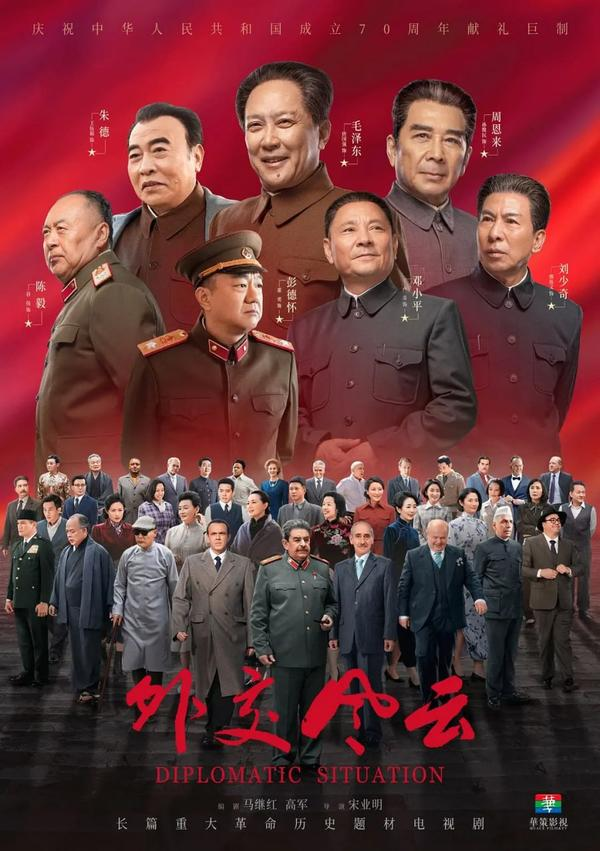

---

## 省港狂龙

[2026-09-30 20:11] 来自：综合网盘资源频道

名称：省港狂龙 (1989)

描述：四十年代，广州社会动乱，龙蛇混杂，大圈黑势力猖獗，无恶不作。正义青年洪伟华，大学毕业，抵穗谋生，意外卷人大圈邦走私毒品事件。大圈枭雄捞家七，责令追回丢失毒品。七手下悍将白金龙，查获线索，前往伟华好友梁展鹏家搜掠，惨杀梁父。展鹏决心复仇，以毒品为饵，枪杀歹徒。白金龙预先埋伏，重伤展鹏。鹏走投无路，跳下珠江捞家七怒斥白金龙。七之姘妇五姑娘，暗恋金龙，乘机挑拨，加深裂痕。商界巨子孔寿年，富甲羊城。捞家七为扩张势力，一再与孔家明争暗斗。孔家千金丽珊为救情人洪伟华，枪伤龙之手下。捞家七大兴问罪之师，向孔家强索“彩金”。与此同时，七又派手下地痞，前往孔家之码头捣乱。码头苦力为生存而战。货运受阻，劳资对立。洪伟华揭发捞家七之诡计，令孔家与码头苦力化敌为友，共同对付黑势力。大圈内部，因争权夺利，导致分裂。白金龙借绑架孔丽珊之机，背叛捞家七。废墟大决战，捞家七倾巢出动，必欲铲锄白金龙而后快。双方人马浴血厮杀，尸横遍野。龙七火并，凶狠奸诈，奇招层出，变幻莫测。洪伟华率码头苦力，加入战圈。白金龙作困兽斗伟华不敌。展鹏突然杀出，破窗救友，与龙恶斗。丽珊脱险，伟华折回废墟，欲助展鹏制服强寇。鹏嘱托好友照顾妹妹秀霞，毅然引爆军火，与杀父仇人，同归於尽！

夸克网盘：https://pan.quark.cn/s/5acdf5130272

📁 大小：AA

🏷 标签：#恐怖 #省港狂龙 #quark

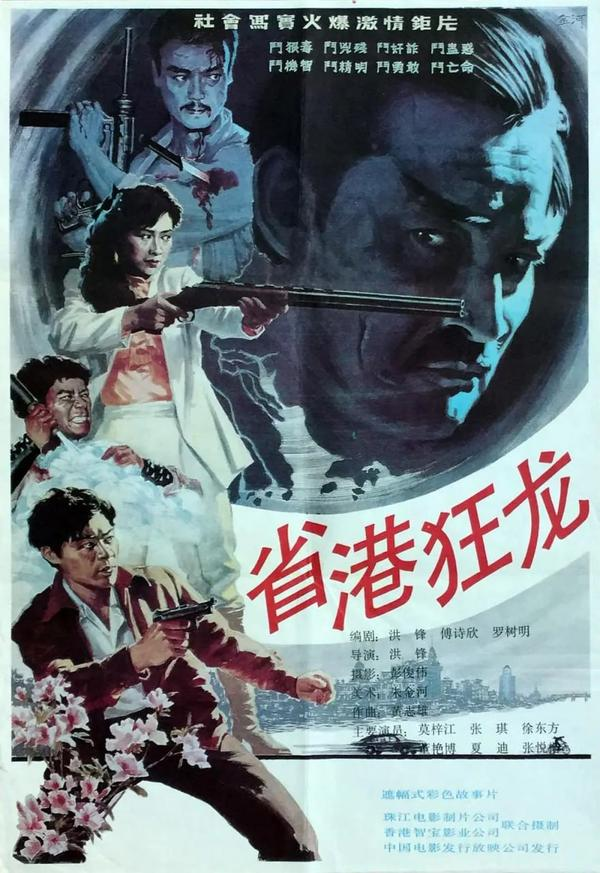

---

## 夜闯寡妇村

[2026-09-30 19:41] 来自：综合网盘资源频道

名称：夜闯寡妇村 【2017】

描述：京城某医学院即将毕业的叶小妍、陈亦凡等六名大学生准备去某风景区旅行。

山路崎岖，天黑雾大，车竟然闯进了山中禁地。突如其来的撞击、车前掉落的破旧稻草人，让众人陷入一片惊慌。大山一片寂静，这片黝黑之地仿佛在酝酿着什么。发动机失灵，几人只得徒步前进，殊不知等待他们的将是一场让他们终生难忘的浩劫。

村中雾气缭绕，瘴气弥漫。叶小妍一行人惊奇的发现这里只有女人而无男人，而村民们躲躲闪闪的语气和冷漠的拒绝更是令人匪夷所思。同伴失踪、好友背叛、落跑男孩……盛夏酷暑，众人却感觉如坠冰窟。

妖艳女人王春花的一句话点醒了他们，所有阴谋都似乎指向后山。是不顾生死拯救同伴，还是就此逃脱远离是非？困境危及中，他们毅然决然奔向后山。

这个远近闻名的“寡妇村”到底隐藏着什么秘密，旅游者是重见天日还是永久的掩埋于村中，谁才是幕后真正的凶手呢？

夸克网盘：https://pan.quark.cn/s/68815155dad3

📁 大小：

🏷 标签：#剧情 #悬疑 #惊悚 #夜闯寡妇村 #quark

---

## 大军阀

[2026-09-30 19:36] 来自：综合网盘资源频道

名称：大军阀 大軍閥 (1972)

描述：日俄战争期间，土匪头子庞大虎(许冠文 饰)假扮成俄国人烧杀抢掠，他打退了懦弱的清兵，也击败了日本人。庞因此受到俄国人的嘉奖，一跃成为统治北方的军阀头子。这个大字不识一个的老粗虽然身居高位，却也闹出不少笑话：

上任之初，一支求雨队伍挡住庞大虎的去路，庞闻听大怒，下车将龙王臭骂一通，并扬言炮轰龙王庙。无巧不成书，大雨随即而至，庞因此被马匹精和懵懂百姓捧上天；寡妇高白氏(胡锦 饰)勾搭家中长工纪伯常，偏巧为求学归来的小叔子撞破，淫妇于是诬告小叔子意图强奸。庞大虎奇人出奇招，巧断这起强奸案；妻妾成群的庞贪婪无度，意欲强娶女伶兰芳，兰芳之父愤而阻拦，反遭其杀害。多行不义必自毙，作恶多端且颟顸的庞大虎终于迎来了自己的末日

夸克网盘：https://pan.quark.cn/s/22e0f7d6ba05

📁 大小：AA

🏷 标签：#喜剧 #大军阀 #大軍閥 #quark

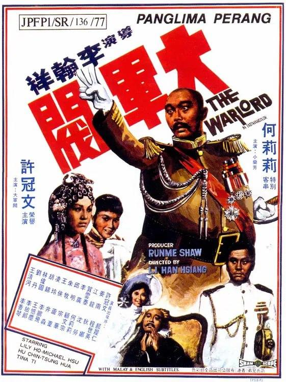

---

## 东京家族

[2026-09-30 17:09] 来自：综合网盘资源频道

名称：东京家族 東京家族 (2013)

描述：2012年的一天，年届七旬的平山周吉(桥爪功 饰)和老伴富子(吉行和子 饰)结伴来到东京。这片繁华匆忙的土地上，生活着他们三个子女，在郊外开办诊所的长子幸一(西村雅彦 饰)，与丈夫库造(林家正藏 饰)共同经营美发店的女儿滋子(中岛朋子 饰)以及担任歌舞伎美工的次子昌次(妻夫木聪 饰)。一家人久未团聚，自然心间充满喜悦。只是子女长大成人，荷担家业，从早到晚为了生计奔波劳碌，根本无暇带着父母游览东京。老两口先后在孩子们的家中小住，深深感受到他们的艰辛，而昌次对未来的茫然似乎也让平山夫妇多了一份担心。也许一切都会好起来，总要有放开手的时刻。

短短几日盘桓，为人父母的心中涌起万千情感，却来不及一一道出…

夸克网盘：https://pan.quark.cn/s/54c27d4cbd35

📁 大小：AA

🏷 标签：#剧情 #家庭 #东京家族 #東京家族 #quark

---

## 迷途英雄

[2026-09-30 17:05] 来自：综合网盘资源频道

名称：迷途英雄 (1992)

描述：九一八事变后，东北沦陷，天津某剧社演员陈彼得(陈佩斯 饰)不甘当亡国奴，立誓要做民族英雄。一日，正当剧院上演爱国题材话剧时，男一号罢演，救场如救火，导演(赵雍 饰)只好让陈彼得顶替，结果大获成功，台下看演出的宋将军(侯永生 饰)对陈的表演大加赞赏。当时宋将军来天津是为抗日部队采购军火，不料遭日谍龙太郎(陈佩斯 饰)刺杀，宋将军巧妙躲过一劫。龙太郎诱骗陈彼得再次行刺，结果阴差阳错，反而杀了龙太郎的人，宋将军大难不死，与彼得结下友谊。龙太郎闻讯恼羞成怒，四处追捕陈彼得，走投无路的彼得躲进一家整形医院，被医生按在手术室的床上，不由分说在脸上动了手术，手术后的彼得活脱脱变成了龙太郎。得知此情，龙太郎吩咐手下照自已的长相上街抓人，结果笑料百出…

夸克网盘：https://pan.quark.cn/s/d245c6c1fdd2

📁 大小：AA

🏷 标签：#剧情 #喜剧 #迷途英雄 #quark

---

## 淫乱的青酱不能学习

[2026-09-30 16:42] 来自：夸克网盘动漫资源

名称：淫乱的青酱不能学习 (2019)

简介： 改编自カワハラ恋创作的同名漫画，由SILVER LINK.制作，于2019年4月播出全12集。女主角堀江青是个成绩优异、立志考上外地国立大学以摆脱父亲的高中生，但她有一个难以启齿的烦恼——父亲是知名的官能小说家，甚至以“青奸”（野外性交）的谐音为她命名，让她从小就厌恶自己的名字，并将所有男性视为“性欲的集合体”。某天，班上的人气王木嶋拓海突然向她告白，这个在她眼中“现充”到极致的男生，彻底打乱了她拼命维持的平静学习生活。木嶋的一举一动都让青酱不由自主地产生色色的妄想，明明只想好好学习，脑子里却全是“○○”的事情。该作以大胆直白的标题和大量擦边球笑料为包装，内核却是一个关于两个毫无恋爱经验的纯情少男少女笨拙靠近的恋爱喜剧，片长仅13分钟，节奏轻快，笑点密集。

标签： #喜剧 #校园 #恋爱 #擦边球 #淫乱的青酱不能学习

夸克网盘：https://pan.quark.cn/s/6d08f96cf791

---

## 小森林

[2026-09-30 15:14] 来自：综合网盘资源频道

名称：【原盘】小森林 冬春篇 (2015) 1080P REMUX 内封简繁字幕

描述：于无法融入喧嚣吵闹的大城市，平凡女孩市子(桥本爱 饰)选择回到自幼生长的老家——位于日本东北地区的小森村。这里没有过多时尚文明的色彩，当地人过着日出而作日落而息的传统生活，他们靠天吃饭，靠着双手经营人生。生活虽不富裕，心中则是满满的充实和欢喜。受妈妈(桐島かれん 饰) 影响，市子似乎对亲手制作各种美味而廉价的料理有着格外浓厚的兴趣。妈妈失踪已经很久，对料理的回忆与再现成为母女间别具特色的交流方式。更何况还有取自大自然的各种食材，又怎能暴殄天物浪费了大好的韶光？在好友纪子(松冈茉优 饰)和裕太(三浦贵大 饰)的陪伴下，市子静静地走过了春夏秋冬……

夸克网盘：https://pan.quark.cn/s/2f82e643ef0f

百度网盘：https://pan.baidu.com/s/19KN3khdIOsK55FB03AeETg?pwd=31m9

📁 大小：33.7GB

🏷 标签：#剧情 #小森林 #冬春篇 #原盘 #1080P #REMUX #内封简繁字幕 #ali #quark #baidu

---

## 暖春

[2026-09-30 15:00] 来自：综合网盘资源频道

名称：暖春 (2008) 4K 全26集

描述：1980年代末，北方偏僻山村。女娃小花(齐如意 饰)先后失去父母、奶奶，成为孤儿，随后她虽被村长及某户人家收养，过得却是终日以泪洗面的屈辱日子，无奈，她逃离出生地上河村。来到芍药村附近时，小花不堪疲劳及饥饿昏倒在地，得路遇的村民相救。众村民虽可怜她这个野娃，却因怕加重原本 就沉重的生活担子，不愿将她领养。年迈的宝柱爹(田成仁 饰)是位善心老人，他怕本已奄奄一息的小花再有好歹，不顾宝柱(于伟杰 饰)及儿媳香草(郝洋 饰)反对，默默将她背回了家中，没有血缘关系的祖孙俩开始了相依为命的日子。香草因为不能生育，将小花视作眼中钉，但任她铁石心肠，也难不被一个异常懂事、善良的女娃的温情与眼泪渐渐融化

夸克网盘：https://pan.quark.cn/s/84e7c2730900

百度网盘：https://pan.baidu.com/s/1u2OPjbOcVwo3deuheS8W8g?pwd=lmc9

📁 大小：15.9GB

🏷 标签：#暖春 #剧情 #家庭 #国剧 #4K #ali #quark #baidu

---

## 走向共和

[2026-09-30 15:00] 来自：综合网盘资源频道

名称：走向共和 (2003) 4K 全59集

描述：19世纪末到20世纪初，这当中的二三十年说短不短说长也不长。对于中国，则是风云变化的几十年。在这当中，中国自二次鸦片战争后，又经历了洋务运动、甲午战争、戊戌变法、辛亥革命、二次革命等。其中，中国结束了清朝的统治，走向了民国；新思潮开始传来，旧制度渐渐走向衰退。千疮百孔的中国也正向着更光明的明天前进着。在这二三十年的历史河流中，留下了许多亦正亦邪的人物，慈禧太后(吕中 饰)、李鸿章(王冰 饰)、袁世凯(孙淳 饰)、孙中山(马少骅 饰)等他们被记载在历史课本里，和中国的历史相挂钩。借由这部剧，让我们再回顾一下那个时代，那个风起云涌变化万千的时代。前路虽然艰辛，但我们也正一步步向前迈进。

夸克网盘：https://pan.quark.cn/s/0763f3d72182

百度网盘：https://pan.baidu.com/s/1C345NVVQ67tiz5XxSUPJpQ?pwd=5pwu

📁 大小：79.1GB

🏷 标签：#走向共和 #剧情 #历史 #国剧 #4K #ali #quark #baidu

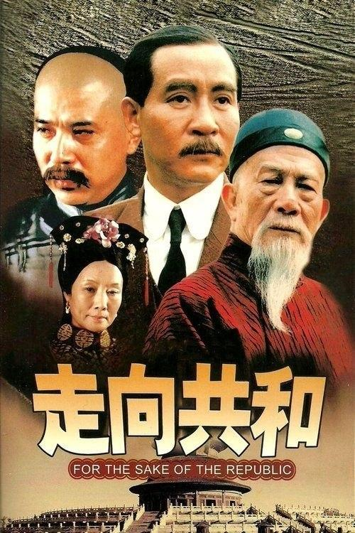

---

## 赢钱专家

[2026-09-30 14:17] 来自：综合网盘资源频道

名称：赢钱专家 (1991) 1080p H264 DDP 2.0

描述：祥天赋异品，和他的二叔、三叔都是茅山赌术弟子，祥和三叔丈着有点小聪明开了一间赌博公司，赌徒有什么疑难问题都可以上来请教。香港女赌神高少少被泰国赌王乃猜与其手下女巫合谋害死，化成冤魂。高少少的冤魂不堪枉死，前来找祥替她报仇，祥抵不住她的缠绕，答应替她报仇。高少少的妹妹高豆豆也因心想为姐姐报仇而结识了祥，两人心生倾慕。 二叔可怜高少少惨死，也出山和祥、三叔一起挑战泰国赌王乃猜，茅山赌术和泰国巫术之战打响了。

迅雷网盘：https://pan.xunlei.com/s/VP2kxAQotavlFHnfLMJtf-RYA1?pwd=d6dw

📁 大小：8.3GB

🏷 标签：#喜剧 #赢钱专家 #1080p #xunlei

---

## 灵幻至尊

[2026-09-30 14:15] 来自：综合网盘资源频道

名称：灵幻至尊 (1991) 4K WEB-DL H265 AAC 2.0

描述：茅山弟子傲天龙(林正英 饰)与大黄(郑则士 饰)同时爱上了师傅的掌上明珠梦梦，师傅临终前设局考验二人谁更真心，大黄用计赢得了师傅的信任。虽然梦梦倾心天龙，无奈父命难为，天龙于是愤然出走。一晃十八年过去了，大黄和梦梦的儿子连高(金少龙 饰)已经长成英俊少年，而天龙的女儿凝红(黎姿 饰)也成年。天龙父女俩这天回家乡探亲，半途上遇到红袍火鬼为祸人间。天龙费尽九牛二虎之力将其收伏，关在鬼笼内。 回到家乡，大黄和天龙两师兄弟心里还是有隔阂，互相敌视。连高无意中放出了火鬼，此时的火鬼法力大增，天龙和大黄都已无法独力应付。为了对付火鬼，二人终于抛开成见，再次合作。

迅雷网盘：https://pan.xunlei.com/s/VP2kwVS2T4yPToifBdeZkpImA1?pwd=ksxt

📁 大小：4.3GB

🏷 标签：#奇幻 #灵幻至尊 #4K #WEBDL #AAC #xunlei

---

## 琅琊榜之风起长林

[2026-09-30 12:43] 来自：综合网盘资源频道

名称：琅琊榜之风起长林 (2017) 4K WEB-DL H265 DDP 5.1 Atmos

描述：大梁边境烽烟再起，长林王府世子萧平章与弟弟萧平旌先后卷入北燕、大渝等势力策动的阴谋。兄弟二人在守护国土与家国信念的同时，也面临朝堂风云和长林王府的命运考验。

夸克网盘：https://pan.quark.cn/s/5ca225c60b5e

📁 大小：X

🏷 标签：#琅琊榜之风起长林 #剧情 #古装 #中国大陆 #孔笙 #李雪 #黄晓明 #刘昊然 #佟丽娅 #张慧雯 #4K #WEBDL #Atmos #baidu #quark

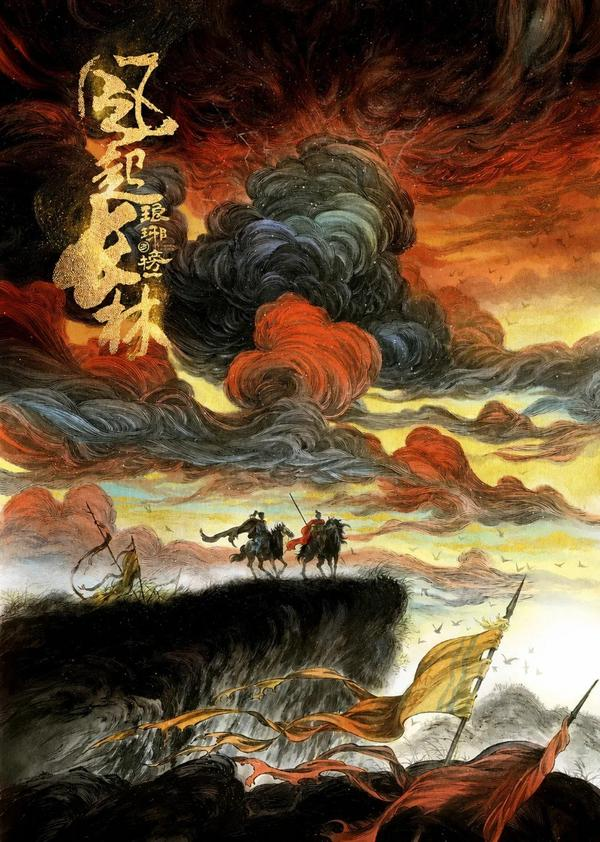

---

## 幽灵医院

[2026-09-30 12:11] 来自：影视动漫分享|SeedHub|夸克|网盘|🧲

名称：幽灵医院 (2016)

#电影 #恐怖 #百度

主演: 白歆惠 李昌熙 罗家英 

豆瓣: [2.5](https://movie.douban.com/subject/26818349/)

晴朗明媚的一天，住在山间别墅的单身妈妈安可带着女儿萱萱还有受伤的男友关天前往医院，为关天受伤的腿拆除石膏。谁知这一天从开始就充满了不祥的气息。行驶在山路之时，安可现..

百度网盘：https://pan.baidu.com/s/1lohAhK0R9xTcopvNX2IFDQ?pwd=whme

---

## 马向阳下乡记

[2026-09-30 12:10] 来自：影视动漫分享|SeedHub|夸克|网盘|🧲

名称：马向阳下乡记 (2014)

#电视剧 #剧情 #夸克 #迅雷

主演: 吴秀波 王雅捷 李洪涛 

豆瓣: [8.0](https://movie.douban.com/subject/24839516/)

在官场摸爬滚打多年的马向阳（吴秀波饰），虽然只是商务局市场科的一个小科长，却早已熟稔官场避实就虚、虚与委蛇的生存法则和太极推手。谁知突如其来的一纸调令，却将他从优哉..

夸克网盘：https://pan.quark.cn/s/52bedc041e12

迅雷网盘：https://pan.xunlei.com/s/VOxzSD6Ne5UoPXB3DLxoh6MtA1?pwd=q2ji

---

## 南特的雅克德米

[2026-09-30 12:10] 来自：影视动漫分享|SeedHub|夸克|网盘|🧲

名称：南特的雅克·德米 (1991)

#电影 #传记 #剧情 #夸克 #百度

主演: Philippe Maron Edouard Joubeaud Laurent Monnier 

豆瓣: [8.8](https://movie.douban.com/subject/1394410/)

这部1991年上映的法国纪录片由阿涅斯·瓦达（代表作《拾穗者》）执导，她常被誉为“法国新浪潮之母”。影片记录了她丈夫——著名法国导演雅克·德米（代表作《秋水中的女人..

夸克网盘：https://pan.quark.cn/s/f841929eda62

百度网盘：https://pan.baidu.com/s/1Y_xOLlTW7xQe0ix-TJ534A?pwd=1qpn

---

## 天使爱过界

[2026-09-30 12:10] 来自：影视动漫分享|SeedHub|夸克|网盘|🧲

名称：天使爱过界 (2002)

#电影 #爱情 #惊悚 #夸克 #迅雷

主演: 奥黛丽·塔图 塞缪尔·勒·比汉 伊莎贝尔·卡雷 

豆瓣: [7.7](https://movie.douban.com/subject/1300919/)

艺术系女生安琪（AudreyTautou饰）爱上了心脏科医生路易（SamuelLeBihan饰），可对方已是有妇之夫，也对安琪表现得若即若离，但安琪始终默默守护在路..

夸克网盘：https://pan.quark.cn/s/b26d69bd84b5

迅雷网盘：https://pan.xunlei.com/s/VOzBRemINksW0WYLTLRn91ZUA1?pwd=94jd

---

## 坏家伙们2

[2026-09-30 12:10] 来自：影视动漫分享|SeedHub|夸克|网盘|🧲

名称：坏家伙们2 (2017)

#电视剧 #动作 #犯罪 #悬疑 #夸克 #百度

主演: 朴重勋 朱镇模 梁益准 

豆瓣: [7.4](https://movie.douban.com/subject/26915539/)

此剧是韩剧《坏家伙们》第二季，将在保留第一季世界观的格局下，打造一个全新的故事。以编剧韩正勋前作《坏家伙们》、《38师机动队》中的城市为背景，讲述严惩邪恶势力的坏家..

夸克网盘：https://pan.quark.cn/s/d2cee6de0035

百度网盘：https://pan.baidu.com/s/16Ya0xmFfWX1JsW_rakNvmw?pwd=3d7f

---

## 精武门

[2026-09-30 11:37] 来自：综合网盘资源频道

名称：精武门 (1995) 1080p WEB-DL H264 AAC 2.0

描述：日军入侵中国后，民不聊生，乡下青年陈真带着妹妹小燕一起来到了繁华的上海讨生活。来到上海后，陈真当了一名黄包车夫，而小燕则进入了一间医院当护士。陈真每天都会拉和小燕在同一间医院当护士的日本姑娘武田由美上下班，两人渐渐坠入了爱河。陈真爱好武术，闲时经常自己照着书上的招式练习，一次偶然机会他的身手被青帮老大蔡六斤发现，于是被招进了青帮当打手。陈真很快成为了青帮第一打手，而妹妹小燕则一直十分担心哥哥，她始终认为哥哥混黑道不会有好下场的。随后小燕不幸遭到了马贼杀害，悲痛万分的陈真终于醒悟，从此金盆洗手退出了青帮。当时抗日组织精武门的掌门霍元甲发现陈真是一块练武的材料，于是加以指点，得到指点后的陈真武功进步神速，并最终为小燕报了仇。陈真感恩于霍元甲，加入了精武门。这时由美的日本未婚夫来到了上海，当他得知由美和陈真之间的事情后，决心向陈真挑战，胜者就可以抱得美人归。陈真虽然不愿意，但最终接受了挑战。

迅雷网盘：https://pan.xunlei.com/s/VP2kNOd00yCevYHQyFrl4EuCA1?pwd=q3k7

百度网盘：https://pan.baidu.com/s/1BPzsg_zOXYU6oX2lUAy2Wg?pwd=rvce 来自：综合网盘资源频道 [2026-09-30 08:56] 名称：精武门 (1995) 1080p WEB-DL H264 AAC 2.0

夸克网盘：https://pan.quark.cn/s/4f214d3a6abb 来自：综合网盘资源频道 [2026-09-30 08:56] 名称：精武门 (1995) 1080p WEB-DL H264 AAC 2.0

📁 大小：X

🏷 标签：#武侠 #古装 #精武门 #1080p #WEBDL #AAC #xunlei

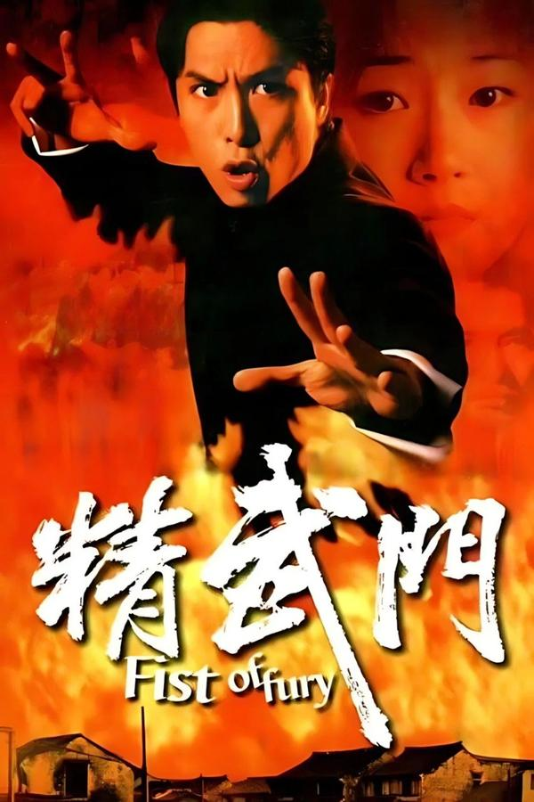

---

## 吉星拱照

[2026-09-30 11:21] 来自：综合网盘资源频道

名称：吉星拱照 (1990)

描述：林宝生(周润发 饰)是香港富豪，与表妹玉仙(利智 饰)早已订婚。但宝生并不喜欢未婚妻的庸俗，决定逃婚，并要证明自己能独立生活。出走的第一天，他阴差阳错来到了一个慈善晚会，认识了晚会赞助商东东快餐店的老板(夏雨 饰)与其妹妹(张艾嘉 饰)，还成为了快餐店的员工之一。宝生与一群善良的同事度过了一段难忘的时光，他也看到了自己价值的存在，与老板的妹妹也产生了感情，但他与表妹的婚期将至，他的真实身份也将浮出水面，而他与老板妹妹的感情又会如何呢？

夸克网盘：https://pan.quark.cn/s/ebf56029dc5c

📁 大小：AA

🏷 标签：#剧情 #喜剧 #吉星拱照 #quark

---

## 九霄寒夜暖

[2026-09-30 10:51] 来自：综合网盘资源频道

名称：九霄寒夜暖 (2023)

描述：讲述了乾国“畏寒”女捕快苏玖儿(李一桐 饰)与祺族“内热”少主寒狰(毕雯珺 饰)因关乎两族关系的离奇凶案相遇，机缘下组成“温差搭档”，携手穿破阴谋迷雾，寻找案件背后真相的同时化解家国危机的故事。

迅雷网盘：https://pan.xunlei.com/s/VP2kDB1jNN-84tAemkjTna6KA1?pwd=j34y

📁 大小：AA

🏷 标签：#剧情 #古装 #奇幻 #九霄寒夜暖 #xunlei

---

## 赢钱专家

[2026-09-30 08:56] 来自：综合网盘资源频道

名称：赢钱专家 (1991) 1080p H264 DDP 2.0

描述：几位赌术高手因缘际会组成团队，凭借各自的绝技与默契配合，对抗赌场中的老千势力。在一场场斗智斗勇的赌局中，他们展开了一段紧张又充满笑料的较量。

链接：

夸克网盘：https://pan.quark.cn/s/92d8f58e1046

百度网盘：https://pan.baidu.com/s/1ej5RRGoBjIZOS7IoT60QNA?pwd=evit

📁 大小：X

🏷 标签：#赢钱专家 #喜剧 #动作 #中国香港 #王晶 #1080p #quark #baidu

---

## 灵幻至尊

[2026-09-30 08:56] 来自：综合网盘资源频道

名称：灵幻至尊 (1991)

描述：道士英叔与好友在调查一连串灵异事件时，卷入女鬼与邪术师之间的恩怨。面对凶猛恶灵和诡异邪术，众人联手驱鬼降魔，并帮助冤魂了结未竟心愿。

链接：

夸克网盘：https://pan.quark.cn/s/932b33dff5c4

百度网盘：https://pan.baidu.com/s/1DpxzPq3SS1HEv-r-5-vDQA?pwd=y3pw

📁 大小：X

🏷 标签：#灵幻至尊 #恐怖 #喜剧 #中国香港 #吴勉勤 #林正英 #郑则仕 #王小凤 #黎姿 #quark #baidu

---

## 琅琊榜之风起长林

[2026-09-30 08:56] 来自：综合网盘资源频道

名称：琅琊榜之风起长林 (2017) 4K WEB-DL H265 DDP 5.1 Atmos

描述：大梁边境烽烟再起，长林王府世子萧平章与弟弟萧平旌先后卷入北燕、大渝等势力策动的阴谋。兄弟二人在守护国土与家国信念的同时，也面临朝堂风云和长林王府的命运考验。

百度网盘：https://pan.baidu.com/s/1vo9fkkdgOp4PHP-5YNhmaA?pwd=8wb3

📁 大小：X

🏷 标签：#琅琊榜之风起长林 #剧情 #古装 #中国大陆 #孔笙 #李雪 #黄晓明 #刘昊然 #佟丽娅 #张慧雯 #4K #WEBDL #Atmos #baidu

---

## 镇魂街

[2026-09-30 08:55] 来自：综合网盘资源频道

名称：镇魂街 (2017) 4K WEB-DL H265 AAC 2.0

描述：普通女孩夏铃在求职时误入罗刹街，意外结识镇魂将曹焱兵。两人在共同对抗恶灵与各方势力的过程中，逐渐揭开镇魂街背后的秘密。

夸克网盘：https://pan.quark.cn/s/d625facc2af9

📁 大小：X

🏷 标签：#镇魂街 #剧情 #动作 #奇幻 #中国大陆 #十一月 #汪东城 #安悦溪 #侯明昊 #4K #WEBDL #AAC #quark

---

## 焦土之城

[2026-09-30 01:33] 来自：电影资源频道(4K、REMUXE/原盘)

名称：【原盘】焦土之城 (2010) 4K REMUX HDR 杜比视界 外挂简中字幕

描述：双胞胎姐弟珍妮（梅丽莎·德索蒙斯-波林 Mélissa Désormeaux-Poulin饰）跟西蒙（马克西姆·高德特 Maxim Gaudette饰）收到过世的母亲娜瓦尔（卢布娜·阿扎宝 Lubna Azabal饰）的遗嘱，可当宣读完内容之后，两姐弟却一时难以接受这样的遗嘱：一份是写给他们从未蒙面的父亲；一份是写给她的第三个孩子——他们更是不知道这个哥哥的存在。影片巧妙的游走在两个不同的时空：母亲终其一生苦苦寻觅自己的长子；姐弟遵循母亲的遗嘱前往中东寻找他们的父亲与兄长。可越是穷其究竟，他们面对的越是理不清的头绪跟令人震惊的真相。

夸克网盘：https://pan.quark.cn/s/14fb7b85b809

📁 大小：71.8GB

🏷 标签：#焦土之城 #剧情 #悬疑 #战争

---

## 82年生的金智英

[2026-09-30 01:27] 来自：电影资源频道(4K、REMUXE/原盘)

名称：【原盘】82年生的金智英 (2019) 1080P REMUX 外挂简中字幕

描述：表面看来，金智英（郑有美 饰）是一个生活在幸福之中的家庭主妇，有一个收入不菲又温柔体贴的丈夫郑大贤（孔侑 饰）和一个非常可爱的女儿，在波澜不惊的日子里享受着每一天的平淡和安稳。实际上，金智英的内心早就如同地震一般的产生了天崩地裂的动摇，在她的身上背负着无比沉重的枷锁。婆婆面前，她要扮演逆来顺受的好儿媳。丈夫面前，她又是无条件支持他的贤妻。面对女儿，金智英必须隐藏起脆弱，做她无坚不摧的母亲。那么，真正的金智英究竟在哪儿呢？长久的压抑和挣扎中，金智英患上了心理疾病，郑大贤决定和妻子一起接受心理咨询，共同面对命运设置给他们的难题。

夸克网盘：https://pan.quark.cn/s/b433c8ec3867

📁 大小：28.7GB

🏷 标签：#82年生的金智英 #剧情

---

## 濑户内海

[2026-09-29 23:57] 来自：综合网盘资源频道

名称：濑户内海 セトウツミ (2017)  【更新11集】【1080p】【日语中字】【日剧】

描述：本剧描写的是关西的两名高中男生濑户(叶山奖之)与内海(高杉真宙)，放学后在河边唠嗑的故事。沉默寡言的内海与善于交往的濑户，两人的性格完全相反，却因为“打发时间”这一点而达成共识。当下午放学后，他们便相约来到河边坐下，海阔天空地闲聊起来。电影中未出现的角色初美、田中君、马场君以及大猩猩老师等原作中的人气角色也将在电视剧中大放异彩。

夸克网盘：https://pan.quark.cn/s/1c694378be2b

📁 大小：NA

🏷 标签：#剧情 #喜剧 #濑户内海 #1080p #日语中字 #日剧 #quark

---

## 心动

[2026-09-29 22:02] 来自：综合网盘资源频道

名称：心动 心動 (1986)

描述：凌祖儿(王祖贤 饰)个性温柔可人，善良而又开朗，是广告公司的高级文案。赵国俊(江显扬 饰)出国深造，学成归来，准备投奔自己的哥哥，巧合的是，赵国俊的哥哥正是凌祖儿的上司。就这样，凌祖儿和赵国俊相遇了，青春烂漫的一对男女彼此之间很快就产生了真挚的感情，两人顺利成章地走到了一起。

夸克网盘：https://pan.quark.cn/s/7e497aeda4ba

📁 大小：NG

🏷 标签：#剧情 #爱情 #心动 #心動 #quark #ali

---

## 温蒂和露西

[2026-09-29 22:00] 来自：综合网盘资源频道

名称：温蒂和露西 Wendy and Lucy (2008)

描述：在女孩温蒂(米歇尔·威廉姆斯 Michelle Williams 饰)平凡的人生中，狗狗露西是她最好以及最信任的朋友，那些无法和家长倾诉的苦恼的困惑，温蒂能够很轻易的向露西倾诉。为了赚钱，温蒂决定利用暑假前往阿拉斯加州的一个工厂打工，带着露西，驾驶着一辆破旧的二手车，温蒂上路了。

夸克网盘：https://pan.quark.cn/s/defe462d41ee

📁 大小：NG

🏷 标签：#剧情 #温蒂和露西 #quark #ali

---

## 少林门

[2026-09-29 21:33] 来自：综合网盘资源频道

名称：少林门 少林門 (1976)

描述：少林寺数百年来弘扬大业，发展武功，曾为太平盛世立下不朽功勋。清廷为打压异己，控制人民，借助少林叛徒石少锋(田俊 饰)等人围攻少林，致使少林弟子流落各地。少林大智禅师得意弟子云飞(谭道良 饰)功夫学成，奉师命下山保护反清义士并清理少林门户。云飞于路得谭小弟(成龙 饰)帮助混入石少锋所在白石镇。恰逢众义士搭救一少林子弟，不幸石少锋一伙早有准备，石之左膀右臂杜清(洪金宝 饰)将众义士杀伤无数。

夸克网盘：https://pan.quark.cn/s/103a6b562a86

📁 大小：NG

🏷 标签：#动作 #少林门 #少林門 #quark #ali

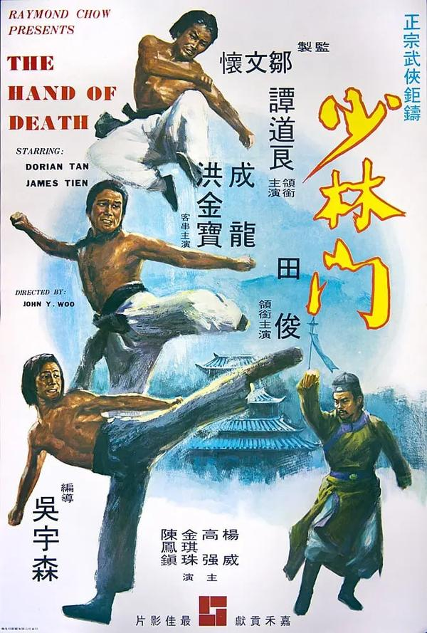

---

## 日以作夜

[2026-09-29 21:28] 来自：综合网盘资源频道

名称：日以作夜 La nuit américaine (1973)

描述：日以作夜是一个电影技术术语，意思是指在白天拍摄夜景，本片讲的就是一个电影拍摄过程中的故事。电影《Meet Pamela》正在如火如荼的拍摄中，导演Ferrand(弗朗索瓦•特吕弗 François Truffaut饰)不仅要处理电影拍摄的事情，还要忙于照顾演员们的情绪。

夸克网盘：https://pan.quark.cn/s/1ace8bc84a4e

📁 大小：NG

🏷 标签：#剧情 #喜剧 #爱情 #日以作夜 #quark #ali

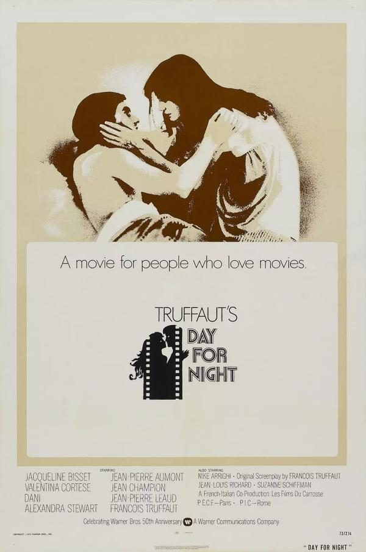

---

## 他的三个女儿

[2026-09-29 21:18] 来自：综合网盘资源频道

名称：他的三个女儿 His Three Daughters (2023)

描述：编剧兼导演阿扎泽·雅各布斯(《法式出口》、《那些爱人》)执导了这部苦乐参半且趣味横生的故事，讲述了一位年迈的家长和三个成年女儿在他生命的最后几天陪伴在他身边的故事。凯蒂(凯莉·库恩饰)是一位控制欲极强的布鲁克林母亲，每日忙于应对处于青春期的叛逆女儿；自由奔放的克里斯蒂娜(伊丽莎白·奥尔森饰)是一位与众不同的母亲，这是她首次与孩子分开

夸克网盘：https://pan.quark.cn/s/74363a16019a

📁 大小：NG

🏷 标签：#剧情 #他的三个女儿 #quark #ali

---

## 乘风破浪

[2026-09-29 20:47] 来自：综合网盘资源频道

名称：乘风破浪 (2017) 1080p 原盘REMUX 中文字幕 AVC TrueHD 5.1

描述：赛车手阿浪一直对父亲反对自己的赛车事业耿耿于怀，在向父亲证明自己的过程中，阿浪却意外的卷入了一场奇妙的冒险。他在这段经历中结识了一群兄弟好友，一同闯过许多奇幻的经历，也对自己的身世有了更多的了解。

迅雷网盘：https://pan.xunlei.com/s/VP2hBvpf3QVQM2D8CqJeDtA2A1?pwd=88yw

📁 大小：20.6GB

🏷 标签：#喜剧 #乘风破浪 #1080p #原盘REMUX #中文字幕 #TrueHD #xunlei

---

## 时光倒流七十年

[2026-09-29 20:30] 来自：综合网盘资源频道

名称：时光倒流七十年 Somewhere in Time (1980)

描述：大学生理查德(克里斯托弗·里夫 饰)在毕业典礼上遇到了一个老妇人，老妇人送给他一只金表，并表示等他回来。虽然他感到非常奇怪，但事情也不了了之了。8年后他成为一个著名的剧本作家，他为了寻找灵感来到了一家酒店度假，酒店历史悠久，在历史陈列室内他被一张女明星Elise(简·西 摩尔 饰)的照片深深吸引住了，并认得她就是送金表的老妇人。原来老妇人在送于他金表的晚上已经离世了。而他通过梦境，回到时光倒流的70年前，发现自己竟与这名女明星拥有一段美丽的爱情故事。

夸克网盘：https://pan.quark.cn/s/169a9d069a15

📁 大小：NG

🏷 标签：#剧情 #爱情 #奇幻 #时光倒流七十年 #quark #ali

---

## 猜火车

[2026-09-29 17:37] 来自：电影资源频道(4K、REMUXE/原盘)

名称：【原盘】猜火车 (1996) 4K REMUX HDR 杜比视界 内封简英双语字幕

描述：苏格兰爱丁堡，雷登（伊万·麦克格雷格 Ewan McGregor 饰）、土豆（艾文·布莱纳 Ewen Bremner 饰）和病仔（约翰尼·李·米勒 Jonny Lee Miller 饰）三个青年过着混沌糜烂的生活，他们吸毒、滥交、诈骗无所不作，而在如此肆无忌惮挥霍青春的过程中，毒品成为一切万恶之源。雷登对之亦爱亦恨，试图戒毒却最终重蹈覆辙。在一次纵情狂欢后，他们三个不知谁和少女爱丽森（Susan Vidler 饰）所生的婴儿死去。以此为开端，噩梦真正降临。土豆抢劫时锒铛入狱，雷登吸食毒品过量被送往医院抢救，后被强制戒毒。恐怖的幻觉和心底生气的恐惧迫使他不得不和毒品一刀两断。看似美好的新生活，但往日狐朋狗友贝格比（罗伯特·卡莱尔 Robert Carlyle 饰）等找上门来，再度给他带来无限的烦恼……

夸克网盘：https://pan.quark.cn/s/7529b3f70919

📁 大小：65.8GB

🏷 标签：#猜火车 #剧情 #犯罪

---

## 全知

[2026-09-29 13:28] 来自：综合网盘资源频道

名称：全知 Onisciente (2020) 1080P内嵌中字全6完结

描述：在一座全天候监控市民的城市里，一名科技公司女员工必须智胜自己的监控无人机，才能调查一起谋杀案。

百度网盘：https://pan.baidu.com/s/1u9jDGHa906U8sWHprvu1wg?pwd=km3i

夸克网盘：https://pan.quark.cn/s/13470f9a930f

迅雷网盘：https://pan.xunlei.com/s/VP2fcVHHGTrAlEVfHLVRGsVTA1?pwd=y8nv

📁 大小：2.G＼集

🏷 标签：#巴西剧 #全知 #1080P内嵌中字 #全6完结 #baidu #quark #xunlei

---

## 南征北战

[2026-09-29 12:10] 来自：影视动漫分享|SeedHub|夸克|网盘|🧲

名称：南征北战 (1952)

#电影 #战争 #剧情 #夸克

主演: 陈戈 冯喆 汤化达 

豆瓣: [7.6](https://movie.douban.com/subject/1463390/)

1947年初，解放军华东部队在苏北七战七捷后，进行战略性转移，一营高营长（冯喆饰）率领部队北撤，在山东桃村集结待命。不少战士和老乡都想不通，高营长和女村长赵玉敏（张..

夸克网盘：https://pan.quark.cn/s/5816a5b59a7a

---

## 大有前途

[2026-09-29 12:10] 来自：影视动漫分享|SeedHub|夸克|网盘|🧲

名称：大有前途 (2009)

#电影  #夸克

主演: 方中信 王宝强 刘桦 

豆瓣: [4.5](https://movie.douban.com/subject/4078680/)

大有村村长李彪（李彧饰）逆水行舟时遭台湾小老板蔡竹强（戎祥饰）釜底抽薪，情急之下派阿昆（王宝强饰）到城里寻靠山，不料事与愿违，竟牵连了财团CEO方向阳（方中信饰）。..

夸克网盘：https://pan.quark.cn/s/fac9498de424

---

## 我叫刘传说

[2026-09-29 12:10] 来自：影视动漫分享|SeedHub|夸克|网盘|🧲

名称：我叫刘传说 (2015)

#电视剧 #战争 #剧情 #迅雷

主演: 钱泳辰 斓曦 张一鸾 

豆瓣: [3.1](https://movie.douban.com/subject/26274917/)

1939年夏，日军集结重兵进攻我山西八路军太行山岳太根据地，占领岳太县城。岳太中心县委通讯员刘传说接连拆穿鬼子的阴谋，使得中心县委摆脱日寇的追击，成功脱离险境，刘传..

迅雷网盘：https://pan.xunlei.com/s/VP1-zH1p8vEMT2ieqyQpuSlLA1?pwd=bkvf

---

## 复仇者联盟

[2026-09-29 11:56] 来自：百度网盘综合频道

名称：【原盘】复仇者联盟 (2012) 4K REMUX HDR10 国英多音轨 外挂简英双语字幕

描述：突如其来的强大邪恶势力对地球造成致命威胁，没有任何一个超级英雄能够单独抵挡。长期致力于保护全球安危的神盾局（SHIELD）感到措手不及，其指挥官“独眼侠”尼克－法瑞（塞缪尔·杰克逊饰）意识到他必须创建一个“史上最强”的联盟组织，云集各方超级英雄一起发威，才能拯救世界于水深火热，抵御黑暗势力的侵袭。于是由六大超级英雄－“钢铁侠”、“雷神”、“美国队长”、“绿巨人”、“黑寡妇”和“鹰眼”组成的“复仇者联盟”应运而生。他们各显神通，团结一心，终于战胜了邪恶势力，保证了地球的安全。

百度网盘：https://pan.baidu.com/s/13JAQf5pWw8J4iLxq09lavA?pwd=1930

夸克网盘：https://pan.quark.cn/s/4783d5158422 来自：电影资源频道(4K、REMUXE/原盘) [2026-09-29 11:55] 名称：【原盘】复仇者联盟 (2012) 4K REMUX HDR10 国英多音轨 外挂简英双语字幕

📁 大小：56.8GB

🏷 标签：#动作 #科幻 #惊悚 #复仇者联盟 #漫威

---

## 乘风破浪

[2026-09-29 10:53] 来自：综合网盘资源频道

名称：乘风破浪 (2017) 1080p 原盘REMUX 中文字幕 AVC TrueHD 5.1

描述：赛车手阿浪一直对父亲反对自己的赛车事业耿耿于怀，在向父亲证明自己的过程中，阿浪却意外的卷入了一场奇妙的冒险。他在这段经历中结识了一群兄弟好友，一同闯过许多奇幻的经历，也对自己的身世有了更多的了解。

夸克网盘：https://pan.quark.cn/s/0053021d8958

📁 大小：20.6GB

🏷 标签：#喜剧 #乘风破浪 #1080p #原盘REMUX #中文字幕 #TrueHD #quark

