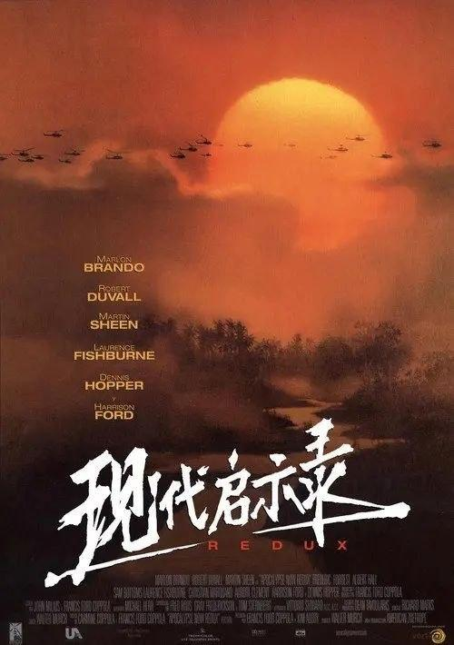
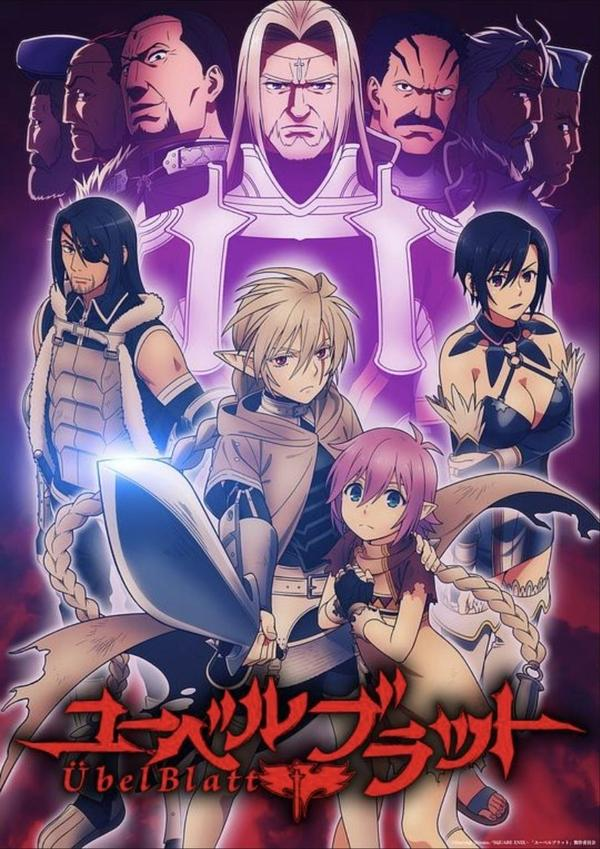

## 即兴卧底

[2026-09-11 22:29] 来自：海外影视资源频道(夸克、阿里、百度)

名称：即兴卧底 Deep Cover (2025)

描述：《深度掩护》以伦敦为背景，讲述了三名被警方雇佣的即兴演员。他们在不破坏角色的情况下“总是说好的”的本能使他们深入到首都的犯罪黑社会。

夸克网盘：https://pan.quark.cn/s/21b515c839db

📁 大小：NG

🏷 标签：#喜剧 #犯罪

---

## 工作细胞

[2026-09-11 22:17] 来自：海外影视资源频道(夸克、阿里、百度)

名称：工作细胞 はたらく細胞 (2024)

描述：电影史上 “最小 ”的主角--他的名字叫细胞！ 人体中有 37 万亿个细胞。 携带氧气的红细胞、抵抗细菌的白细胞和无数其他细胞日以继夜地保护着你的健康和生命。 2024 年 12 月，细胞们的 “人体史上最伟大的战役 ”即将打响！

夸克网盘：https://pan.quark.cn/s/dc37f57baa19

📁 大小：NG

🏷 标签：#动作 #冒险 #喜剧 #奇幻

---

## 堕落的偶像

[2026-09-11 21:54] 来自：海外影视资源频道(夸克、阿里、百度)

名称：堕落的偶像 The Fallen Idol(1948)

描述：故事发生在一所大使馆中，在小男孩菲利普（Bobby Henrey 饰）的眼中，管家班尼思（拉尔夫·理查德森 Ralph Richardson 饰）是如假包换的英雄。这其中的原委要追溯到菲利普经常外出的父母身上，父母不在，照顾和看管菲利普的责任自然就落到了班尼思的身上，在菲利普这样一个敏感又单纯的年纪，一个替他打点一切事宜的人就等同于无所不能的英雄。

夸克网盘：https://pan.quark.cn/s/e447ecc6cbe2

📁 大小：NG

🏷 标签：#剧情 #悬疑 #惊悚

---

## 不快乐的假期

[2026-09-11 21:46] 来自：海外影视资源频道(夸克、阿里、百度)

名称：不快乐的假期 Du côté d'Orouët (1971)

描述：三名年轻女子前往旺代省度假，期间她们办公室主任的出现，导致她们兴致全无，却变成折磨的痛苦。

夸克网盘：https://pan.quark.cn/s/829443d919e8

📁 大小：NG

🏷 标签：#剧情 #喜剧

---

## 爱尔兰起义情

[2026-09-11 21:07] 来自：海外影视资源频道(夸克、阿里、百度)

名称：爱尔兰起义情 第一季 Rebellion Season 1 (2016)

描述：一部关于现代爱尔兰诞生的五集连续剧。故事是从一群经历 1916 年复活节起义政治事件的虚构人物的角度讲述的。

夸克网盘：https://pan.quark.cn/s/13566ca8f60e

📁 大小：NG

🏷 标签：#剧情

---

## 现代启示录

[2026-09-11 20:00] 来自：海外影视资源频道(夸克、阿里、百度)

名称：【原盘】现代启示录 (1979) 4K REMUX HDR 杜比视界 外挂简英双语字幕

描述：越战后期，美军上尉威拉德（马丁•辛 Martin Sheen 饰）奉命沿湄公河而上，搜寻脱离美军在柬埔寨建立了自己的王国的科茨（马龙•白兰度 Marlon Brando 饰）上校，将他带回或杀死。科茨上尉曾经是美军在越战中的英雄，战功赫赫。然而，忽然有一天，他失踪了。随 后，情报指出他在柬埔扎建立了自己的王国，自己的军队，专门反对美军。威拉德与几名士兵一路沿河而上，途中他们目睹了种种暴行、杀戮，目睹了无论美军士兵还是当地人在长期的战争中精神扭曲，做出的种种非正常的行为，威拉德感到了极大的震撼。威拉德最后在柬埔寨科茨的王国中被当地人捉住，见到了科茨。然而，科茨竟欲求一死，叫威拉德将这里炸为平地……

夸克网盘：https://pan.quark.cn/s/9cb4bc3b18cf

百度网盘：https://pan.baidu.com/s/1cM3V7TCGpcpTReYcLIfUVQ?pwd=J6F5

📁 大小：85.8GB

🏷 标签：#现代启示录 #剧情 #战争

---

## 魔域英雄传说

[2026-09-11 19:58] 来自：海外影视资源频道(夸克、阿里、百度)

名称：魔域英雄传说 (2025) 1080P 全12集 内封简繁字幕

描述：被称为“最凶恶的黑暗幻想作品”，描写主角凯因谢尔的壮大复仇剧。故事发生在七英雄封印黑暗异邦，为帝国带来和平的 20 年后。边境王领地附近的国境，正在展开新的骚乱。此时，突然出现一名边境英雄剑士凯因谢尔，以巨大的黑色之剑惩奸除恶。他的真实身分是 20 年前被冠上背叛者污名而被暗杀的“圣枪叛徒”其中一人“亚谢里德”。他的目的只有一个：向笑着杀死伙伴，夺走封印黑暗异邦功劳的真正背叛者“七英雄”复仇。随着时代变迁，帝国靠著七英雄的荣光和治理恢复成安定的世界。为了暗杀他们，或许会让帝国再次陷入不安的危机当中。尽管如此，凯因谢尔依旧持续他的暗杀旅程。

夸克网盘：https://pan.quark.cn/s/0ba31bc98261

百度网盘：https://pan.baidu.com/s/1aZ-BlgzuFg0Au-nih7LEzA?pwd=2knx

📁 大小：14.8GB

🏷 标签：#魔域英雄传说 #奇幻 #冒险 #日漫

---

## 带你探索地球

[2026-09-11 19:55] 来自：海外影视资源频道(夸克、阿里、百度)

名称：带你探索地球 (2021) 4K HDR 全集 内封简繁英字幕

描述：威尔·史密斯将在精英探险家的带领下踏上令人惊叹的旅程，近距离接触地球上一些最激动人心的奇观——从无声咆哮的火山到超越我们感知的沙漠，再到拥有自己思想的动物群。火山，深海，草原，海岛，沙漠，冰川河流，史密斯带领大家以观众的视角从活火山到深海探险地球的最末端，领略地球最美的风景。这部大片系列将令人惊叹的摄影与威尔无限的好奇心和热情相结合，是一次穿越地球的激动人心的多感官之旅。

夸克网盘：https://pan.quark.cn/s/a507471e52f4

百度网盘：https://pan.baidu.com/s/1OHITFjgfPItHCndG-cY1PA?pwd=kKH6

📁 大小：26.3GB

🏷 标签：#带你探索地球 #纪录片 #迪士尼

---

## 铁拳教育

[2026-09-11 19:54] 来自：海外影视资源频道(夸克、阿里、百度)

名称：铁拳教育 (2026) 4K HDR10 全10集 内封简繁英字幕

描述：为了守护因越界学生、教师及家长而崩坏的大韩民国教权与教育现场，教权保护局应运而生，讲述他们展开痛快淋漓、大快人心的“真实教育”故事。

夸克网盘：https://pan.quark.cn/s/dabd25d300e6

百度网盘：https://pan.baidu.com/s/1ZCZ5c-JZooc3YHPUz-Ck6g?pwd=6256

📁 大小：64GB

🏷 标签：#铁拳教育 #剧情 #喜剧 #韩剧 #NF

