## 寻找小糖人

[2026-10-09 12:34] 来自：海外影视资源频道(夸克、阿里、百度)

名称：【原盘】寻找小糖人 (2012) 1080P REMUX 内封简繁特效字幕

描述：罗德里格斯在上世纪70年代发行过两张专辑《Cold Fact》与《Coming From Reality》，在南非有超过50万的销量且知名度可与滚石乐队相提并论。但与其他知名的美国歌手不同，南非的歌迷得不到任何一点关于罗德里格斯的信息，除了专辑歌曲之外唯一能了解的只有专 辑封面上一张并不清晰的相片。两张专辑后，他好像也就此销声匿迹。对于在南非的辉煌成绩，罗德里格斯其实并不知情，他在美国过着截然不同的生活，没有知名度，专辑销量不佳，被唱片公司抛弃，曾经一度做着装修屋顶的体力活。南非开普敦一家唱片店老板斯蒂芬与音乐记者克雷格听到罗德里格斯在舞台上奇特自杀的传闻后展开调查，寻找小糖人之路就此开始，一段神秘的传奇故事就此展开。

夸克网盘：https://pan.quark.cn/s/d19d87461545

百度网盘：https://pan.baidu.com/s/1xnAg8UMvKfqhsvLBCm_RiQ?pwd=kg2y

📁 大小：18.9GB

🏷 标签：#寻找小糖人 #纪录片 #音乐 #传记

---

## 隔空投送

[2026-10-09 12:16] 来自：海外影视资源频道(夸克、阿里、百度)

名称：隔空投送 Drop (2025)

描述：维奥莱特（梅格翰·法伊 Meghann Fahy 饰）是一名多年来第一次约会的寡妇和单亲妈妈，她来到约会地点的一家高级餐厅之后，就因为她的约会对象亨利（布兰登·斯克莱纳 Brandon Sklenar 饰）比她预期中更有魅力和更帅气感到非常高兴。但是随着一连串的匿名讯息开始陆续传送到她的手机，维奥莱特就从一开始的烦躁逐渐陷入恐惧，而这两人之间原本擦出的火花也开始冷却下来。

夸克网盘：https://pan.quark.cn/s/93ee5ec20777

📁 大小：NG

🏷 标签：#剧情 #悬疑 #惊悚

---

## 无尽的战壕

[2026-10-09 12:11] 来自：海外影视资源频道(夸克、阿里、百度)

名称：无尽的战壕 La trinchera infinita (2019)

描述：伊尼奥和罗莎是一对新婚夫妇，没想到他们结婚才几个月，西班牙内战爆发。伊尼奥作为亲共分子被弗朗哥独裁政府抓捕，在被押解的路上，伊尼奥想办法逃回了家中。为躲避再一次被捕，伊尼奥在罗莎的帮助下，藏身于自家的地洞里长达30年。

夸克网盘：https://pan.quark.cn/s/0ba299a346c6

📁 大小：NG

🏷 标签：#剧情

---

## 我的牛津岁月

[2026-10-09 11:40] 来自：海外影视资源频道(夸克、阿里、百度)

名称：我的牛津岁月 My Oxford Year (2025)

描述：当安娜——一位雄心勃勃的美国年轻女子，为了实现儿时的梦想踏上牛津大学的求学之路时，她的人生一切都在按计划进行，直到她遇到了一位迷人又聪明的当地人，这次相遇深刻地改变了他们两人的人生轨迹。

夸克网盘：https://pan.quark.cn/s/5bea72332a94

📁 大小：NG

🏷 标签：#剧情 #喜剧 #爱情

---

## 布里奇顿

[2026-10-09 11:25] 来自：海外影视资源频道(夸克、阿里、百度)

名称：布里奇顿 第二季 Bridgerton Season 2 (2022)

描述：在这一全新的社交季，布里奇顿家族的花边新闻依旧满天飞。这一季聚焦于大哥安东尼（乔纳森·贝利 饰）的情感生活，安东尼开始追求新来的埃德温娜·夏尔马小姐（查瑞莎·钱德兰 饰），但他发现自己必须得先过了她姐姐凯特·夏尔马（西蒙尼·阿什利 饰）这一关。然而，安东尼和凯特却越走越近，变得越来越亲密，安东尼发现自己陷入了三角恋。

夸克网盘：https://pan.quark.cn/s/dca43905b1a9

📁 大小：NG

🏷 标签：#剧情 #爱情

---

## 极速风流

[2026-10-09 11:06] 来自：海外影视资源频道(夸克、阿里、百度)

名称：极速风流 Rush (2013)

描述：一直以来，尼基（丹尼尔·布鲁赫 Daniel Brühl 饰）和詹姆斯（克里斯·海姆斯沃斯 Chris Hemsworth 饰）都是针锋相对的死对头。尼基认真严肃，对赛车的职业十分尊重，詹姆斯喜欢铤而走险，将赛车作为自己寻花问柳的筹码，虽然两人有着截然不同的个性，但他们之间的较量却从未停止过。

夸克网盘：https://pan.quark.cn/s/d398ced0e7bc

📁 大小：NG

🏷 标签：#剧情 #传记 #运动

---

## 驱魔人

[2026-10-09 10:53] 来自：海外影视资源频道(夸克、阿里、百度)

名称：驱魔人 The Exorcist (1973)

描述：愁云惨淡的华盛顿市，一幢普通公寓内，单身妈妈克莉丝（艾伦·鲍斯汀 Ellen Burstyn 饰）和女儿芮根生活于此。然而近一段时间，克莉丝却被女儿种种怪异的举止折磨得烦躁不堪。芮根的行为举止怪异，迥异常人。克莉丝带她求医问卜，终无所获，甚至精神科医生也束手无策。万般无 奈之下，几近绝望的母亲求助于莫林神父（马克斯·冯·西多 Max von Sydow 饰），一个有着丰富驱魔经验的老者。恐怖的夜晚，神父与藏身少女体内的恶魔展开连番较量。这是一个注定让无数人永生难忘的恶魔之夜……

夸克网盘：https://pan.quark.cn/s/a658fce5eb39

📁 大小：NG

🏷 标签：#恐怖

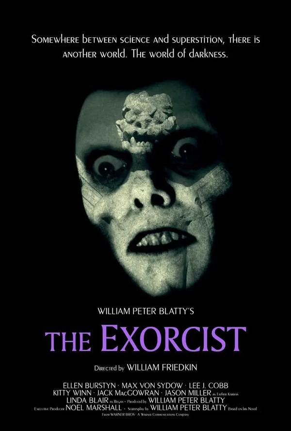

---

## 海边的曼彻斯特

[2026-10-09 09:11] 来自：海外影视资源频道(夸克、阿里、百度)

名称：【原盘】海边的曼彻斯特 (2016) 1080P REMUX 国英多音轨 内封简英双语特效字幕

描述：李（卡西·阿弗莱克 Casey Affleck 饰）是一名颓废压抑的修理工，在得知哥哥乔伊（凯尔·钱德勒 Kyle Chandler 饰）去世的消息后，李回到了故乡——海边的曼彻斯特处理乔伊的后事。根据乔伊的遗嘱，李将会成为乔伊的儿子帕特里克（卢卡斯·赫奇斯 Lucas Hedg es 饰）的监护人，李打算将帕特里克带回波士顿，但很显然帕特里克并不愿意离开家乡和朋友们，但李亦不愿在这片伤心地久留。原来，曼彻斯特埋藏着李的一段绝望的回忆，他的过失使得三个孩子葬身火海，妻子兰迪（米歇尔·威廉姆斯 Michelle Williams 饰）亦因此而离开了他。此次重回故乡，李再度见到了已经再婚并且即将做妈妈的兰迪，与此同时，帕特里克那失踪已久的母亲艾丽斯（格瑞辰·摩尔 Gretchen Mol 饰）亦联系上了帕特里克，希望他能够成为她的新家庭中的一员。

夸克网盘：https://pan.quark.cn/s/a6d436efa4ed

百度网盘：https://pan.baidu.com/s/1HItYXWJxVI01iNccfnxmiQ?pwd=7mu8

📁 大小：36.5GB

🏷 标签：#剧情 #家庭 #海边的曼彻斯特

---

## 海洋奇缘启航

[2026-10-08 23:04] 来自：海外影视资源频道(夸克、阿里、百度)

名称：【原盘】海洋奇缘：启航 (2026) 4K REMUX HDR 杜比视界 国英多音轨 内封简/繁英双语特效字幕

描述：莫阿娜（凯瑟琳·拉加艾亚 饰）受到大海的召唤，与传奇半神毛伊（道恩·强森 饰）一同启航，首次跨越莫图鲁尼岛的礁石，驶向远方未知的海域。为了恢复部落往日的繁荣，他们踏上了一场壮阔而难忘的征程。

夸克网盘：https://pan.quark.cn/s/aeedd94a24f0

百度网盘：https://pan.baidu.com/s/1uSFXSlsCWlsq-AHF8K4nMQ?pwd=x23z

📁 大小：43GB

🏷 标签：#海洋奇缘 奇幻 #冒险 #迪士尼

---

## 戴高乐之战淬炼时代

[2026-10-08 22:44] 来自：海外影视资源频道(夸克、阿里、百度)

名称：戴高乐之战：淬炼时代 (2026) 4K 外挂简中字幕

描述：1940年6月。法国溃败，签署了停战协定。在这片混乱之中，有一个人拒绝放弃。孤身一人、逆境而行，这位名不见经传的将军逃往伦敦，试图挽救残存的自由。他没有军队，没有后援，也没有希望。但他怀揣着一种近乎疯狂的信念——法国，他的法国，并未放下武器。他孤注一掷，试图让世界相信，法国的战役既未结束，也未落败。然而，现实是无情的，似乎决心要证明他是错的。然而，一点一点地，抵抗战士、反抗的学生和坚定的士兵在英国、法国和非洲纷纷起义，加入这场事业。他们的信念、胆识和对自由的渴望，挑战了历史似乎早已写好的结局。

夸克网盘：https://pan.quark.cn/s/4926acda29af

百度网盘：https://pan.baidu.com/s/1O9ea7pMHK9L7P56MOry-TQ?pwd=p886

📁 大小：7GB

🏷 标签：#戴高乐之战：淬炼时代 #剧情 #历史 #传记

---

## 你逃我也逃

[2026-10-08 22:35] 来自：海外影视资源频道(夸克、阿里、百度)

名称：你逃我也逃 To Be or Not to Be (1942)

描述：波兰华沙有一个剧团，其中有一名演员Bronski（Tom Dugan 饰）极其擅长模仿德国纳粹领袖希特勒。Maria Tura（卡洛·朗白 Carole Lombard 饰）和Joseph Tura（杰克·本尼 Jack Benny 饰）是剧团里的一对夫妻，剧团最近正在上演《哈姆雷特》。演出间隙，Maria收到了一束鲜花，来自一个年轻的飞行员Stanislav Sobinski（罗伯特·斯塔克 Robert Stack 饰），趁着Joseph在舞台上念著名台词“to be or not to be”的时候，她安排Sobinski进了后台，两人情愫暗生。

夸克网盘：https://pan.quark.cn/s/855298d345fc

📁 大小：NG

🏷 标签：#喜剧 #爱情 #战争

---

## 魔女嘉莉

[2026-10-08 22:26] 来自：海外影视资源频道(夸克、阿里、百度)

名称：魔女嘉莉 (2026) 4K HDR10+ 全8集 内封简繁字幕

描述：父亲的突然离世迫使嘉莉进入到了残酷的公立高中，她不得不面对席卷社区的校园霸凌丑闻、社交媒体时代无情的压力和冷酷无情，以及伴随青春期而觉醒的神秘心灵感应能力。

夸克网盘：https://pan.quark.cn/s/129cd0ca6484

百度网盘：https://pan.baidu.com/s/1SulTZrf_qz5EGNa7Z5DatQ?pwd=zjje

📁 大小：54.6GB

🏷 标签：#魔女嘉莉 #剧情 #悬疑 #美剧 #加拿大剧 #AMZN

---

## 盗墓王

[2026-10-08 22:21] 来自：海外影视资源频道(夸克、阿里、百度)

名称：盗墓王 (2026) 1080P SDR 全12集 内封简繁字幕

描述：2025年，世界各处惊现古墓，获得墓中“宝物”之人便能获得先人的异能，全世界为获得宝物而疯狂。无往不利盗墓者徐浩钧，在一次任务中落入陷阱，不幸丧命。然而他带着前世的记忆，回到了一切开始的地方。虽然失去了宝物，却获得了“系统”。这是重启的新生，还是命运的捉弄。在系统加持下，这一世徐浩钧能否告别蝼蚁的人生，登上王之宝座？

夸克网盘：https://pan.quark.cn/s/64cfff5df54a

百度网盘：https://pan.baidu.com/s/1yq9xdpqXQJ8HITwGL-v5Qg?pwd=9dxn

📁 大小：19.2GB

🏷 标签：#盗墓王 #动作 #奇幻 #冒险 #韩漫

---

## 金色豪门

[2026-10-08 22:15] 来自：海外影视资源频道(夸克、阿里、百度)

名称：金色豪门 The House of the Spirits (1993)

描述：为了心爱的姑娘罗莎，青年埃斯特万（Jeremy Irons饰）离开首都，只身前往荒蛮之地开采金矿。两年后他成功地掘到“第一桶金”，此时却传来爱人罗莎误饮毒酒身亡的噩耗。埃斯特万悲痛万分，心灰意冷之下回老家接手父亲留下的农庄，在埃斯特万井井有条的管理下，农庄日益兴旺发达，他也成为闻名遐迩的农庄主。

夸克网盘：https://pan.quark.cn/s/79d06bf063c2

📁 大小：NG

🏷 标签：#剧情 #爱情

---

## 国家元首

[2026-10-08 22:11] 来自：海外影视资源频道(夸克、阿里、百度)

名称：国家元首 Heads of State (2025)

描述：英国首相（伊德里斯·艾尔巴 Idris Elba 饰）和美国总统（约翰·塞纳 John Cena 饰）的公开争执让两国联盟岌岌可危。然而，当他们成为某个强大势力的袭击目标后，这对冤家不得不放下分歧，展开一场横跨多国的疯狂行动。在军情六处精英特工诺埃尔（佩丽冉卡·曹帕拉 Priyanka Chopra 饰）的协助下，他们必须想方设法挫败那个威胁整个自由世界的惊天阴谋。

夸克网盘：https://pan.quark.cn/s/d1267b8ac319

📁 大小：NG

🏷 标签：#喜剧 #动作 #惊悚

---

## 哆啦A梦新大雄的海底鬼岩城

[2026-10-08 22:11] 来自：海外影视资源频道(夸克、阿里、百度)

名称：【原盘】哆啦A梦：新·大雄的海底鬼岩城 (2026) 1080P REMUX 国日多音轨 内封简/繁日双语字幕

描述：大雄他们打算在暑假一起露营，不过各人心目中的地点都不一样，最后哆啦A梦竟然建议到海底露营？大家靠着哆啦A梦的法宝“水底旅行车”和“万应灯”，愉快地在海洋深处冒险。他们更发现原来海底有个庞大的国家“姆联邦”，并遇见“海底人”的少年希路。与此同时，海底人最惧怕的“鬼岩城”正蠢蠢欲动，更有可能令地球灭亡？

本片是1983年《大雄的海底鬼岩城》的重制版。

夸克网盘：https://pan.quark.cn/s/392cb35b7774

百度网盘：https://pan.baidu.com/s/1lvOS1wpcyTBWPRgS_tJzWQ?pwd=c29m

📁 大小：28.9GB

🏷 标签：#哆啦A梦：新·大雄的海底鬼岩城 #喜剧 #科幻 #动画

---

## 怒火青春

[2026-10-08 22:04] 来自：海外影视资源频道(夸克、阿里、百度)

名称：怒火青春 La Haine (1995)

描述：影片以1993年在巴黎18区发生的一起警察暴力的真实事件为背景：一名警察在巡逻期间枪杀了一名17岁的扎伊尔少年Makomé M'Bowolé。而在影片当中，巴黎街头，一群反政府青年。纠纷由其中一人被警察殴打重伤而起，众人怀恨在心。文兹（文森特·卡塞尔 Vincent Cassel饰）弄到一把真枪，决心还以颜色。他们的仇恨与愤怒随处可见，这场与警察之间的大规模冲突，一触即发。

夸克网盘：https://pan.quark.cn/s/9533e6462384

📁 大小：NG

🏷 标签：#剧情 #犯罪

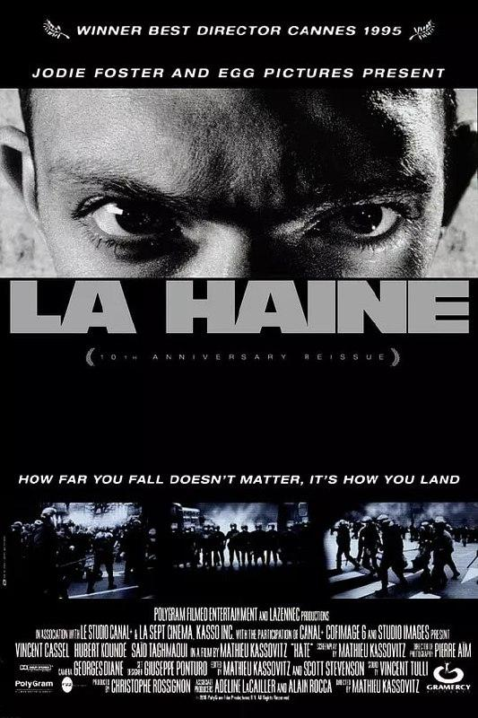

---

## 黑色党徒

[2026-10-08 21:35] 来自：海外影视资源频道(夸克、阿里、百度)

名称：黑色党徒 BlacKkKlansman (2018)

描述：《黑色党徒》根据2014年罗恩·斯塔尔沃斯所著的自传改编，讲述了一名科罗拉多州的黑人警察，成功潜入当地的3K党组织做卧底的故事。

夸克网盘：https://pan.quark.cn/s/7cd58b138cf5

📁 大小：NG

🏷 标签：#喜剧 #传记 #犯罪

---

## 流人

[2026-10-08 21:01] 来自：海外影视资源频道(夸克、阿里、百度)

名称：流人 第六季 (2026) AppleTV+ 4K 高码率 [DV&HDR] [杜比全景声] [内封中字] [更新04集]

描述：第六季改编自米克·赫隆所著小说系列的第六本《Joe Country》和第七本《Slough House》。

Diana Taverner（克里斯汀·斯科特·托马斯 饰）将“流人”们卷入了一场充满复仇的致命高风险游戏中，这群间谍因此踏上了逃亡之路。

夸克网盘：https://pan.quark.cn/s/fd67d96ddf30

百度网盘：https://pan.baidu.com/s/1xiLQVwVOKAsjcmP6vIJlxw?pwd=6666

📁 大小：单集8.5GB左右

🏷 标签：#流人 #剧情 #惊悚 #苹果

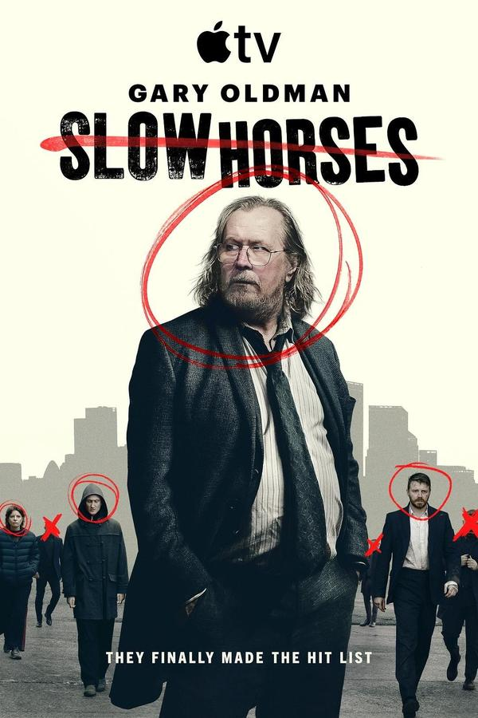

---

## 猛攻

[2026-10-08 17:23] 来自：海外影视资源频道(夸克、阿里、百度)

名称：猛攻 (2026) 4K HDR & Dv 外挂简英双语字幕

描述：军事基地逃出了一个神秘的危险存在，被佣军追捕，威胁到了一名此前曾是军人、如今因为某些原因住在拖车里的母亲。为保护所爱之人，她不得不使出特殊技能。

夸克网盘：https://pan.quark.cn/s/ba06e45f72ab

百度网盘：https://pan.baidu.com/s/1oy-PnoodBemHD-Pp6gnYOg?pwd=gkm2

📁 大小：16.4GB

🏷 标签：#猛攻 #动作 #惊悚 #苹果

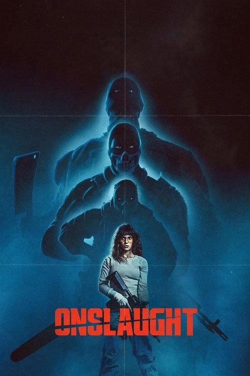

---

## 无间兄弟情

[2026-10-08 15:57] 来自：海外影视资源频道(夸克、阿里、百度)

名称：无间兄弟情 (2026) AppleTV+ 4K 高码率 [DV&HDR] [杜比全景声] [内封中字] [更新04集]

描述：伍迪·哈里森和马修·麦康纳两位相识多年的好友意外得知可能是亲兄弟，在追查身世真相的同时，也卷入家庭纷争与竞选州长的混乱之中。

夸克网盘：https://pan.quark.cn/s/34002f5f1b6b

百度网盘：https://pan.baidu.com/s/1FiPStQRFT0sV8NAamUOm1g?pwd=6666

📁 大小：单集5GB左右

🏷 标签：#无间兄弟情 #喜剧 #苹果

---

## 绑架游戏

[2026-10-08 15:53] 来自：海外影视资源频道(夸克、阿里、百度)

名称：绑架游戏 (2026) HamiVideo 4K 高码率 [内嵌中字] [更新01集]

描述：亚洲七个城市，同时发生七宗轰天绑架案。当全球媒体陷入疯狂，一封令人不寒而栗的电邮，悄然送抵被掳者家属收件箱：“为救所爱，你可以牺牲多少？最终生还，只得一人。”

七位毫无关联的陌生人，来自不同国籍、背景与信仰，命运纠缠在一起，各自肩负截然不同的任务指令。在这场极限游戏中，最残忍的敌人是时间。幕后黑手究竟是谁？注定六死一生的杀戮，最终目的是什么？

夸克网盘：https://pan.quark.cn/s/676b365ca152

百度网盘：https://pan.baidu.com/s/1y8HBN1eunQwJRqCp03Q-sA?pwd=6666

📁 大小：单集9GB左右

🏷 标签：#绑架游戏 #剧情 #悬疑

---

## 梅根20

[2026-10-08 12:22] 来自：海外影视资源频道(夸克、阿里、百度)

名称：【原盘】梅根2.0 (2025) 4K REMUX HDR 杜比视界 内封简/繁英双语特效字幕

描述：第二部仍以女孩卡迪（维奥莱特·麦格劳 Violet McGraw 饰）和她的姨妈珍玛（艾莉森·威廉姆斯 Allison Williams 饰）为主线，她们遭到了下一代机器人“阿米莉亚”（伊万娜·萨赫诺 Ivanna Sakhno 饰）的疯狂攻击，而本已沦为智能语音助手的梅根（珍娜·戴维斯 Jenna Davis 配音），似乎是帮助她们对抗阿米莉亚的绝佳选择。

夸克网盘：https://pan.quark.cn/s/2d9a5070f033

百度网盘：https://pan.baidu.com/s/1iTQ_01Vpndq9foT3hBZFXA?pwd=337f

📁 大小：63.4GB

🏷 标签：#梅根2.0 #科幻 #惊悚 #恐怖

---

## 猎鹿人

[2026-10-08 11:50] 来自：海外影视资源频道(夸克、阿里、百度)

名称：猎鹿人 The Deer Hunter (1978)

描述：越战期间，美国克莱顿镇5个经常一起打猎野鹿的好朋友中的三人尼克（克里斯托弗•沃肯 Christopher Walken 饰）、史蒂芬（约翰•萨维奇 John Savage 饰）和迈克尔（罗伯特•德尼罗 Robert De Niro 饰）即将奔赴前线。离开前夕，史蒂芬和另一个好友兼女友安吉拉结了婚，婚礼就是他们的告别会。

夸克网盘：https://pan.quark.cn/s/39a2e36bca21

📁 大小：NG

🏷 标签：#剧情 #战争

---

## 回到未来

[2026-10-08 11:27] 来自：海外影视资源频道(夸克、阿里、百度)

名称：回到未来 Back to the Future (1985)

描述：布朗博士（克里斯托弗•洛伊德 Christopher Lloyd 饰）总是有些稀奇古怪的发明。在一次试验他发明的时光机器时，他找来了忘年交高中生马丁（迈克尔•J•福克斯 Michael J. Fox 饰）。岂料实验过程中博士被歹徒杀害了，马丁慌乱中架着时光机逃跑，回到了30年前。

夸克网盘：https://pan.quark.cn/s/21a57355718a

📁 大小：NG

🏷 标签：#喜剧 #科幻 #冒险

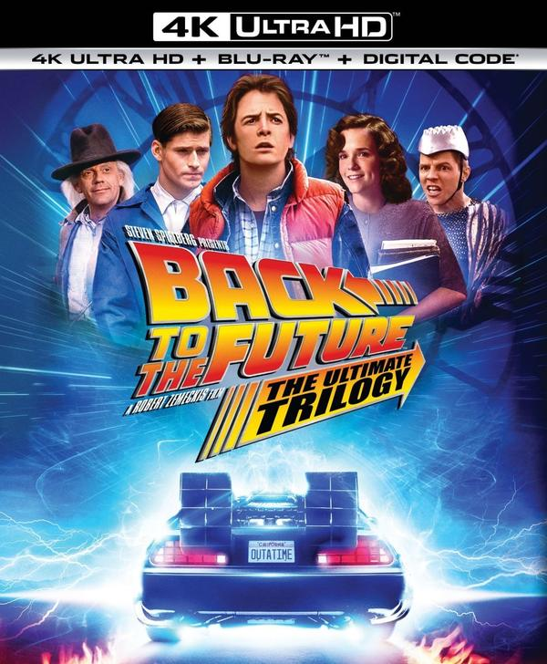

---

## 牧师妻之死

[2026-10-08 10:50] 来自：海外影视资源频道(夸克、阿里、百度)

名称：牧师妻之死 (2026) 4K HDR10 全3集 内封简繁字幕

描述：这部三集真实犯罪纪录剧集聚焦米卡・米勒的人生与离奇离世。米卡是南卡罗来纳州默特尔比奇教会牧师约翰‑保罗・米勒的妻子。剧集采用从未公开的影像素材，以及亲友首次公开发声的一手证词，围绕有关控制与精神操控的多项指控，回溯米卡猝然离世前后的重重事件，记录家属至今仍在不懈追寻真相的抗争过程。

夸克网盘：https://pan.quark.cn/s/8d11645e7c7b

百度网盘：https://pan.baidu.com/s/1f3-RJtoTu-gLyPNaINuKCQ?pwd=3etu

📁 大小：14.1GB

🏷 标签：#牧师妻之死 #纪录片 #犯罪 #NF

---

## 野草莓

[2026-10-08 10:35] 来自：海外影视资源频道(夸克、阿里、百度)

名称：野草莓 Smultronstället (1957)

描述：伊萨克（维克多·斯约斯特洛姆 Victor Sjöström饰）从医50年，现年已是将近八十岁的高龄，正准备在儿媳的陪伴下返回母校接受荣誉学位颁发。路上伊萨克顺道重游旧地，追忆往事。

夸克网盘：https://pan.quark.cn/s/b0132e700661

📁 大小：NG

🏷 标签：#剧情 #爱情 #家庭

---

## 黄金时代

[2026-10-08 10:10] 来自：海外影视资源频道(夸克、阿里、百度)

名称：黄金时代 The Best Years of Our Lives (1946)

描述：故事发生在1945年，弗雷德（达纳·安德鲁斯 Dana Andrews 饰），艾尔（弗雷德里克·马奇 Fredric March 饰）和霍莫（哈罗德·拉塞尔 Harold Russell 饰）是三名刚刚走下战场的军人，即将回到久违的家乡，即将见到久别的亲人，虽然三人的境遇各不相同，但内心中的激动和忐忑却别无二致，分别在即，他么许下了再相聚的约定。

夸克网盘：https://pan.quark.cn/s/d5fdd900b5ec

📁 大小：NG

🏷 标签：#剧情 #爱情 #战争

---

## 极寒之城

[2026-10-08 09:51] 来自：海外影视资源频道(夸克、阿里、百度)

名称：极寒之城 Atomic Blonde (2017)

描述：影片根据安东尼·约翰斯顿（Antony Johnston）的同名小说改编，讲述了“冷战”结束前的间谍行动：1989年，民主德国局势发生急剧变化，“柏林墙”面临拆除的命运，但此时也是最黑暗的时刻，各种暗杀行动时有发生。一位英国军情六处的地下官员在柏林遇刺，他掌握了从民主德国带回来的一份间谍名单，但杀手在他身上并未找到。一位名叫洛林·布劳顿（塞隆 饰）的特工，肩负起找回这份间谍名单的任务。

夸克网盘：https://pan.quark.cn/s/65434a5dd9b1

📁 大小：NG

🏷 标签：#动作 #惊悚

---

## 读书

[2026-10-08 09:24] 来自：海外影视资源频道(夸克、阿里、百度)

名称：读书 & 喝酒 Books & Drinks (2024)

描述：大卫旅行到多米尼加共和国出售从他不认识的父亲那里继承的房子。在那里，他将遇到玛丽亚，她将彻底颠覆他的生活。

夸克网盘：https://pan.quark.cn/s/0f46d773820f

📁 大小：NG

🏷 标签：#喜剧 #爱情

---

## 第七封印

[2026-10-08 09:21] 来自：海外影视资源频道(夸克、阿里、百度)

名称：第七封印 Det sjunde inseglet (1957)

描述：海滩边，巨浪滔天，英武的骑士布洛克（马克斯•冯•西多 Max von Sydow 饰）与黑衣死神（本特•埃切罗特 Bengt Ekerot 饰）摆下了一盘生死棋局。在下棋的过程中，骑士在回顾自己的人生，所见所闻暗合圣经的图景。十四世纪十字军东征后期，欧洲大陆瘟疫蔓延，民不聊生。布洛克曾遇到过马戏团的一对夫妻，丈夫笃信神明，无比虔诚，妻子则更加现实，唯命是从。他们的相濡以沫让幸福唾手可得。

夸克网盘：https://pan.quark.cn/s/ef3883833999

📁 大小：NG

🏷 标签：#剧情 #奇幻

---

## 星球大战曼达洛人与古古

[2026-10-08 01:18] 来自：海外影视资源频道(夸克、阿里、百度)

名称：【原盘】星球大战：曼达洛人与古古  (2026) 4K REMUX HDR 杜比视界 国英多音轨 内封简繁特效字幕

描述：“曼达洛人”丁·贾伦和“尤达宝宝”古古的星际冒险全面升级，“此乃正道”的誓言响彻宇宙，原力将继续与你同在。

夸克网盘：https://pan.quark.cn/s/b2331b29d770

百度网盘：https://pan.baidu.com/s/1p-ZfGV3IGr864Ydg_gCO2A?pwd=225f

📁 大小：74.1GB

🏷 标签：#星球大战：曼达洛人与古古 #动作 #冒险 #科幻 #苹果

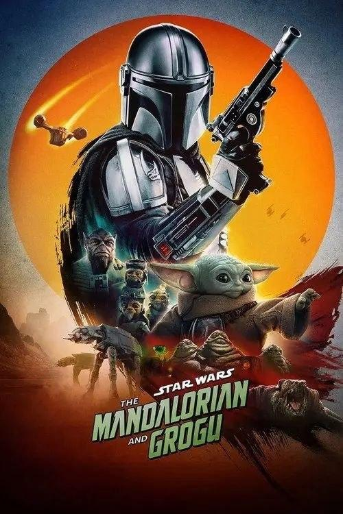

---

## 魔女嘉莉

[2026-10-08 00:56] 来自：海外影视资源频道(夸克、阿里、百度)

名称：魔女嘉莉 (2026) AMZN 4K 高码率 [DV&HDR] [杜比全景声] [内封中字] [8集全]

描述：父亲的突然离世迫使嘉莉进入到了残酷的公立高中，她不得不面对席卷社区的校园霸凌丑闻、社交媒体时代令人窒息的压力与残忍，以及伴随青春期而觉醒的神秘心灵感应能力。

夸克网盘：https://pan.quark.cn/s/f999b2987729

百度网盘：https://pan.baidu.com/s/1ZOQ_hXVGJsVeiu6k_0qE3A?pwd=6666

📁 大小：单集5GB左右

🏷 标签：#魔女嘉莉 #悬疑 #剧情

---

## 小先知

[2026-10-08 00:33] 来自：海外影视资源频道(夸克、阿里、百度)

名称：小先知 (2026) AppleTV+ 4K 高码率 [DV&HDR] [杜比全景声] [内封中字] [更新02集]

描述：七年前，自从女友失踪后，迈克尔·斯利普的人生便仿佛停滞不前。一本旧日记里神秘的配方，却承诺要为他追寻已久的谜团带来答案。

夸克网盘：https://pan.quark.cn/s/19e73407c488

百度网盘：https://pan.baidu.com/s/1CT9nsq4R6LeqGb8NeSF5FQ?pwd=6666

📁 大小：单集5.5GB左右

🏷 标签：#小先知 #喜剧 #剧情 #悬疑 #苹果

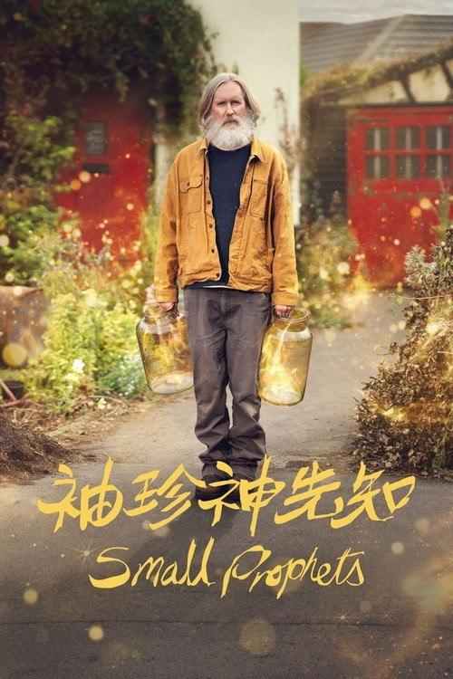

---

## 健听女孩

[2026-10-07 22:36] 来自：海外影视资源频道(夸克、阿里、百度)

名称：【原盘】健听女孩 (2021) 4K REMUX HDR 外挂简中字幕

描述：美丽的高中女孩露比·罗西（艾米莉亚·琼斯 Emilia Jones 饰）出生于一个极不寻常的渔民家庭，她的父母和哥哥天生聋哑，只能通过手语交流。而健康无恙的露比既是幸运的，却也是不幸的。她担任了家人和外界交流沟通的桥梁，为此承受了诸多的歧视和嘲笑。这期间，只有好闺蜜戈蒂（艾米·福赛思 Amy Forsyth 饰）是她最坚定的支撑。因为喜欢男孩迈尔斯（福迪亚·瓦尔什-匹罗 Ferdia Walsh-Peelo 饰），露比报名参加校合唱团，而天资颖悟的很快得到了负责老师的赏识。在此之后，露比频繁奔波于合唱团和家族之间，她渴望前往伯克利追求音乐梦想，而这势必要和对她无比依赖的原生家庭分隔两地。露比为此深深焦虑……

夸克网盘：https://pan.quark.cn/s/a9f694f2f7bd

百度网盘：https://pan.baidu.com/s/1-OJ7Use5sJFS9UnKjKISdg?pwd=7757

📁 大小：69.2GB

🏷 标签：#剧情 #爱情 #音乐 #健听女孩

---

## 俄宫秘史

[2026-10-07 21:18] 来自：海外影视资源频道(夸克、阿里、百度)

名称：俄宫秘史 Nicholas and Alexandra (1971)

描述：詹姆斯．高曼编剧的本片描述俄国最后一位沙皇尼古拉斯二世晚年的生平故事，从1904年开始描述至1918年俄国革命后他们全家被处决的经过。是一部气氛沉重的史诗式宫闱影片，故事有点单调沉闷。导演富兰克林．J．沙夫纳的手法比较庄重，出色的美术及服装设计使当年的俄宫景色得以在银幕上重现，迈克尔．杰斯顿等演员亦普遍出色，本片曾获最佳艺术指导、最佳服装设计两项金像奖。

夸克网盘：https://pan.quark.cn/s/5a81b589f6d2

📁 大小：NG

🏷 标签：#剧情 #传记 #历史 #战争

---

## 地狱男爵血皇后崛起

[2026-10-07 21:03] 来自：海外影视资源频道(夸克、阿里、百度)

名称：地狱男爵：血皇后崛起 Hellboy (2019)

描述：地狱男爵（大卫·哈伯 David Harbour 饰）本是作为生物武器被纳粹召唤出来的怪物，却幸运得到了布鲁姆教授（伊恩·麦柯肖恩 Ian McShane 饰）的营救和帮助，在教授的教导和训练之下，地狱男爵渐渐长大，之后加入了超自然调查防御局，成为了局里的王牌战将。

夸克网盘：https://pan.quark.cn/s/691bbb9751f1

📁 大小：NG

🏷 标签：#动作 #奇幻 #冒险

---

## 人生复本

[2026-10-07 21:03] 来自：海外影视资源频道(夸克、阿里、百度)

名称：人生复本 第二季 (2026) AppleTV+ 4K 高码率 [DV&HDR] [杜比全景声] [内封中字] [更新06集]

描述：在第二季中，Dessen一家终于在一个看似安全的世界里安顿了下来，过着平静的生活，直到难以想象的变故迫使他们再次逃亡。随着Jason对“盒子”的痴迷日益加深，Daniela心中日渐增长的偏执将她逼至崩溃边缘，一切都威胁着他们本就脆弱的安定。与此同时，Amanda和Ryan联手，竭力寻找回家的办法。面对势必要阻止自己的Blair，Leighton执着地追逐着创造完美世界的宏伟愿景。

夸克网盘：https://pan.quark.cn/s/34a0661b8ade

百度网盘：https://pan.baidu.com/s/1jjGRTqeM1s-W8azCul8geQ?pwd=6666

📁 大小：单集10GB左右

🏷 标签：#人生复本 #科幻 #苹果

---

## 荒野生存

[2026-10-07 20:51] 来自：海外影视资源频道(夸克、阿里、百度)

名称：荒野生存 Into the Wild (2007)

描述：克里斯托弗（埃米尔•赫斯基 饰）家境优渥，是亚特兰大私立名校艾莫里的优等生，前程似锦。但是，他从学校毕业后，选择了截然不同的人生，放弃令人羡慕的工作，把存款捐给慈善机构，去阿拉斯加寻找自我。在家人的劝阻声中，他踏上了回归自然的慢慢长路，成为名副其实的流浪者。

夸克网盘：https://pan.quark.cn/s/05c714698452

📁 大小：NG

🏷 标签：#剧情 #传记 #冒险

---

## 电视台风云

[2026-10-07 20:45] 来自：海外影视资源频道(夸克、阿里、百度)

名称：电视台风云 Network (1976)

描述：妻子的死给电视台王牌主播霍华德（彼得·芬奇 Peter Finch 饰）带来了沉重的打击，使他陷入痛苦和悲伤中无法自拔。电视台决定解雇已经无心工作的霍华德，霍华德的老朋友麦克斯（威廉·霍尔登 William Holden 饰）成为了传达这一噩耗的不二人选。得知自己即将被 解雇，为电视台做牛做马多年的霍华德十分愤怒，在第二天的节目上，他竟然向观众们预告，自己即将进行自杀直播。

夸克网盘：https://pan.quark.cn/s/d380e775ac4d

📁 大小：NG

🏷 标签：#剧情

---

## 墙外之音

[2026-10-07 20:35] 来自：海外影视资源频道(夸克、阿里、百度)

名称：墙外之音 84제곱미터 (2025)

描述：宇成（姜河那 饰）是一名年轻的上班族，他通过不懈努力终于购得自己的房子，但搬入后却被楼上的不明噪音所困扰，逐渐卷入一场惊悚的冒险中。面对高利贷款的压力和日益加剧的邻居冲突，宇成的生活变得越来越失控。

夸克网盘：https://pan.quark.cn/s/3147ab1fc94a

📁 大小：NG

🏷 标签：#剧情 #惊悚

---

## 愤怒的葡萄

[2026-10-07 20:33] 来自：海外影视资源频道(夸克、阿里、百度)

名称：愤怒的葡萄 The Grapes of Wrath (1940)

描述：刚从监狱释放出来的Tom Joad （亨利·方达 Henry Fonda饰）回到俄克拉荷马的家的时候却发现原来的家里已经空无一人，打听之下才从农民Jim Casy（约翰·卡拉丁 John Carradine饰）口中得知，随着工业的发展，当地的农民们都被迫离开该地。Tom和Jim在Tom的叔父家里找到了Tom的家人，一家人决定到加利福尼亚去寻找新的工作。一家人把所有的行李都放在一辆卡车上便出发了。

夸克网盘：https://pan.quark.cn/s/9fd9741d0761

📁 大小：NG

🏷 标签：#剧情 #历史

---

## 坠落2死点

[2026-10-07 16:10] 来自：海外影视资源频道(夸克、阿里、百度)

名称：坠落2：死点 (2026) 4K HDR ＆ Dv 内封简英双语特效字幕

描述：泰国封闭30多年的关山山脉，海拔超900米的高空魔鬼栈道，此前已发生多起高空坠落事件，是当地公认的“死亡禁区”。贾克斯（哈里特·斯莱特 饰）为了完成姐姐希洛（维吉尼亚·加德纳 饰）作为极限爱好者的遗愿，与她生前好友卢斯（阿塞玛·托马斯 饰）结伴来此挑战。上一秒两人还欢呼打卡于绝美壮丽的高空景色，却不料下一秒突如其来的地震滑坡便将她们逼入绝境。暴雨、失温、零信号、零补给……脚下的木板随时会断，头顶的碎石不停掉落，两人只能抓住残破的栈道边缘攀爬，在暴雨中寻找每一个可以落脚的支点，靠撕裂衣物做绳、用碎石敲击岩壁传讯。绝壁之上，前无去路，后有塌方，她们究竟能否成功生还？

夸克网盘：https://pan.quark.cn/s/ba2774a3ee93

百度网盘：https://pan.baidu.com/s/1_KxduF2vROQiP6R16d8Knw?pwd=2t36

📁 大小：17GB

🏷 标签：#坠落2：死点 #惊悚 #冒险

---

## 蜘蛛侠崭新之日

[2026-10-07 15:55] 来自：海外影视资源频道(夸克、阿里、百度)

名称：蜘蛛侠：崭新之日 (2026) 4K HDR & Dv 内封简繁字幕

描述：彼得·帕克（汤姆·霍兰德 饰）自愿让全世界遗忘自己，转眼已是四年。失去挚友、挚爱与亲人的陪伴，他独自重返街头，以全职蜘蛛侠的身份坚守使命，守护整座城市。然而，日益沉重的责任与无尽压力，意外引发了一场骇人的身体异变，直接威胁到蜘蛛侠的生命，迫使他向“绿巨人”班纳博士寻求帮助。与此同时，多方邪恶势力趁虚而入，纽约再度陷入危机。面对前所未有的强敌，蜘蛛侠能否绝境破局，完成破茧重生？

夸克网盘：https://pan.quark.cn/s/7807dead04bb

百度网盘：https://pan.baidu.com/s/1uxIvR6_GaHdwPedQtQ8KHQ?pwd=91nd

📁 大小：25.3GB

🏷 标签：#蜘蛛侠 #崭新之日 #漫威 #科幻 #动作 #冒险 #苹果

---

## 第二十二条军规

[2026-10-07 15:44] 来自：海外影视资源频道(夸克、阿里、百度)

名称：第二十二条军规 Catch-22 (2019)

描述：该限定剧由Luke Davies及David Michôd执笔，讲述主角Yossarian（Christopher Abbott饰）在二战时的意大利，因为Cathcart上校（Kyle Chandler饰，原本由George Clooney饰演）的个人问题，他迫使下属飞行大队不停进行危险的飞行任务。

夸克网盘：https://pan.quark.cn/s/60f1464dd7cc

📁 大小：NG

🏷 标签：#剧情 #喜剧 #战争

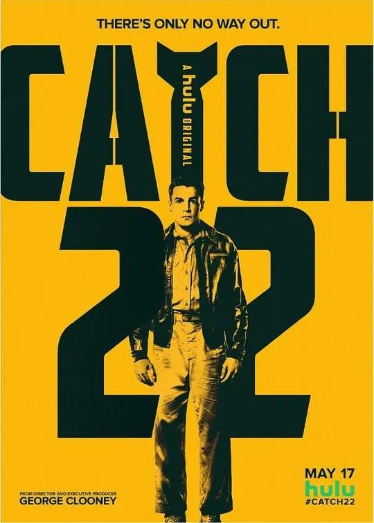

---

## 生日快乐

[2026-10-07 15:24] 来自：海外影视资源频道(夸克、阿里、百度)

名称：生日快乐 Happy Birthday (2018)

描述：Tonmai18岁生日那天，收到了人生中第一份生日礼物，是死去姐姐Thannam的旧卧室。Tonmai在卧室见到了Thannam，他发现，只有他可以看到Thannam，可以和Thannam说话。而Thannam不记得自己是怎么自杀的，Tonmai决心查出当年发生的事情。

夸克网盘：https://pan.quark.cn/s/f2a3978c37de

📁 大小：NG

🏷 标签：#家庭

---

## 第19份病历簿

[2026-10-07 15:10] 来自：海外影视资源频道(夸克、阿里、百度)

名称：第19份病历簿 19番目のカルテ (2025)

描述：本剧改编自同名漫画。“病理”、“产科”、“放射线科”，医院里有18个专家门诊活跃着，其中诞生了第19个新领域，“接诊患者”的专科医生，也就是全科医生。故事中，憧憬着“什么都能治”的医生，已经工作3年的女医生滝野，在细分的专业领域中，在追求各自专业的医生系统中，为理想与现实的差距而烦恼。这时，对患者这种“人类本身”进行诊察、治疗的综合诊疗医生德重晃（松本润 饰）出现在滝野面前…

夸克网盘：https://pan.quark.cn/s/fd234a3f1a5f

📁 大小：NG

🏷 标签：#剧情

---

## 天外歌姬

[2026-10-07 15:06] 来自：海外影视资源频道(夸克、阿里、百度)

名称：天外歌姬 Superestar (2025)

描述：本剧集以 21 世纪初的乱象为背景,，用前所未有的方式重现了流行偶像塔玛拉的生平及其蜕变为尤蕾娜的过程。

夸克网盘：https://pan.quark.cn/s/ef62f70e6d98

📁 大小：NG

🏷 标签：#剧情 #喜剧 #音乐 #传记

---

## 维京传奇

[2026-10-07 14:43] 来自：海外影视资源频道(夸克、阿里、百度)

名称：维京传奇 第二季 Vikings Season 2 (2014)

描述：历史频道宣布续订《维京传奇》（Vikings）第二季10集，2014年同期播出。第一季季终集定于4月28日播出。新闻稿称该剧是今年有线网上排名第一的新剧（指常规剧集，不包括特别节目和短剧），平均每集620万观众，18-49收视率超过了同档期的广播网剧集。

夸克网盘：https://pan.quark.cn/s/76610266f936

📁 大小：NG

🏷 标签：#剧情 #动作 #爱情 #历史 #战争 #冒险

---

## 一兆游戏

[2026-10-07 14:33] 来自：海外影视资源频道(夸克、阿里、百度)

名称：一兆游戏 トリリオンゲーム (2023)

描述：该剧改编自同名人气漫画，讲述我行我素的男人和笨拙的工程师这两个性格截然相反的青年白手起家，以赚1兆美元为目标而得到整个世界的故事。目黑饰演的沟通能力出众的主人公Haru，他是受所有人欢迎，却也是一个会使用恶劣手段达成目标的野心家。佐野勇斗饰演与Haru搭档的Gaku。

夸克网盘：https://pan.quark.cn/s/e5ea5fe98f23

📁 大小：NG

🏷 标签：#剧情

---

## 银河护卫队3

[2026-10-07 13:49] 来自：海外影视资源频道(夸克、阿里、百度)

名称：【原盘】银河护卫队3 (2023) 4K REMUX HDR 杜比视界 国英多音轨 内封简英双语字幕

描述：由漫威影业出品的《银河护卫队3》中，深受喜爱的银河护卫队成员们已经在不毛之地(knowhere)上安顿了下来。然而，由于火箭浣熊的动荡往事的侵扰，他们的生活很快被打破。彼得·奎尔依然迷失在失去卡魔拉的痛苦中，但是他必须团结起他的团队，前往执行一项危险的任务，只为营救火箭浣熊。如果这项任务失败，那么为人熟知的银河护卫队有可能就此走向终结。

夸克网盘：https://pan.quark.cn/s/f4f5dcab67f5

百度网盘：https://pan.baidu.com/s/1ChrVHb9QvuU0Gr-LSdBeVQ?pwd=788q

📁 大小：55.6GB

🏷 标签：#动作 #科幻 #冒险 #银河护卫队 #银河护卫队3 #漫威

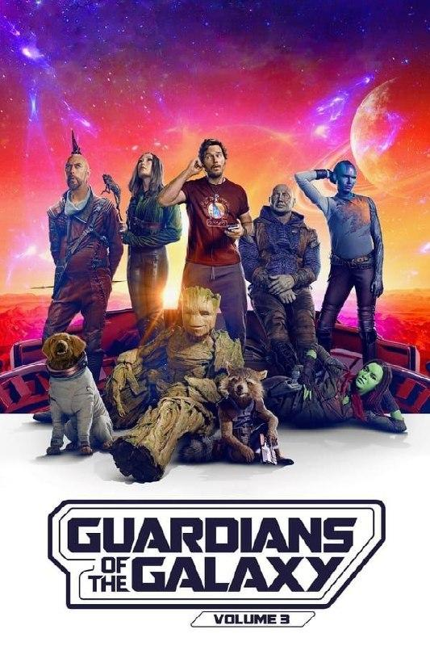

---

## 战栗杀机

[2026-10-07 13:46] 来自：海外影视资源频道(夸克、阿里、百度)

名称：战栗杀机 (2018) 1080P 全24集 内封简繁日字幕

描述：纽约。有着非凡的姿容，和卓越战斗力的少年·亚修。统领街头暴力团的他听到了，被手下所杀的男人在临死之际说出的“BANANA FISH”的神秘话语。与此同时，他与作为摄影师的助手来取材的日本少年·奥村英二相遇。两人决定一同追寻“BANANA FISH”之谜——

夸克网盘：https://pan.quark.cn/s/617f7ff2245e

百度网盘：https://pan.baidu.com/s/1teNZovs-ebOKXujljjwDbA?pwd=kno2

📁 大小：6.2GB

🏷 标签：#战栗杀机 #动作 #冒险 #日漫

---

## 最近的侦探真没用

[2026-10-07 13:43] 来自：海外影视资源频道(夸克、阿里、百度)

名称：最近的侦探真没用 (2025) 4K CR 超分 全12集 内封简/繁日双语字幕

描述：曾经，有位名侦探名云桂一郎，他战绩辉煌，声名显赫。任何案件瞬间侦破！没有他解不开的谜题！人称高中生名侦探！但那已是十多年前的往事了。如今的他，饱受腰痛、老花眼、牙齿敏感困扰。网络热词？JK？完全不懂。昔日耀眼的高中生名探，如今成了被时代抛弃的大叔。“并非才能枯竭——只是青春不再罢了。”某天，充满青春活力的女高中生真白，突然闯入名云侦探事务所，非要当他的助手。原来，她立志成为一名侦探……！？于是，大叔侦探与自称

夸克网盘：https://pan.quark.cn/s/0f8fe797368a

百度网盘：https://pan.baidu.com/s/1tQRCamy1V4wzrTU122W2ZA?pwd=y368

📁 大小：19.1GB

🏷 标签：#最近的侦探真没用 #喜剧 #悬疑 #日漫 #柊舞缇娜

---

## 脸庞村庄

[2026-10-07 13:40] 来自：海外影视资源频道(夸克、阿里、百度)

名称：脸庞，村庄 (2017) 1080P 外挂简中字幕

描述：作为阿涅斯·瓦尔达提名奥斯卡的晚年力作，这部充满手工温度的人文主义杰作，记录下八旬导演与三十余岁的街头摄影师JR的跨界合作。二人驾驶可即时输出巨幅肖像的摄影车，穿梭于法国乡间，将沿途相遇的农民、退役矿工、码头工人等普通人的肖像张贴于当地墙垣。这些故事拼贴出一幅传统在现代化浪潮中绵延的国度图景。这部布满岔路的公路电影、迷人的跨代际伙伴电影，以及献给各行匠人的颂歌，在瓦尔达追溯往昔与编织新忆的过程中，最终凝结成对艺术、人际关系与生命本身转瞬即逝的深刻沉思。

夸克网盘：https://pan.quark.cn/s/66576c4b2188

百度网盘：https://pan.baidu.com/s/13Wey5D9gxYbNVz2YrAWtuw?pwd=1ans

📁 大小：10.4GB

🏷 标签：#脸庞，村庄 #纪录片

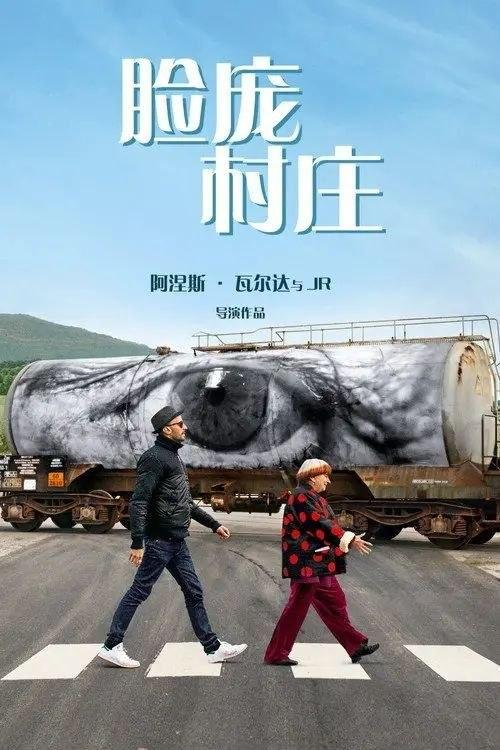

---

## 我悲伤的逝者们

[2026-10-07 11:36] 来自：海外影视资源频道(夸克、阿里、百度)

名称：我悲伤的逝者们 (2026) 4K 杜比视界 全4集 内封简繁字幕

描述：根据玛丽安娜·恩里克斯的原著改编，帕布罗·拉雷恩执导，《我悲伤的逝者们》讲述了艾玛的故事。她能够看见并听见死者。母亲去世后，艾玛的侄女朱莉不期而至，这个女孩继承了她同样令人不安的天赋。随着朱莉的归来，家庭的秘密与从未真正愈合的伤口将重新撕裂——但一种奇异的现象也会随之而来，它将波及所有人，无人能安然抽身。整个街区的邻居都将感受到异样的存在，并听到只属于他们各自死者的独特声响。

夸克网盘：https://pan.quark.cn/s/75ebc256ebf9

百度网盘：https://pan.baidu.com/s/1LZa3WPBVcQxLlncSPaIALA?pwd=ajbu

📁 大小：28.5GB

🏷 标签：#我悲伤的逝者们 #剧情 #恐怖 #奇幻 #智利剧 #阿根廷剧

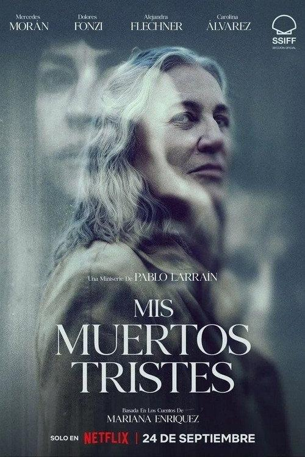

---

## 狗奴小姐豪门大小姐的烦恼逍遥俏房东千金的出逃与沉沦

[2026-10-07 00:04] 来自：海外影视资源频道(夸克、阿里、百度)

名称：狗奴小姐&豪门大小姐的烦恼&逍遥俏房东&千金的出逃与沉沦（完整版） 王正洁&于宙童/擦边短剧

描述：喜欢速存 没有就是和谐

每日更新 | 2026年10月6日抖音快手红果新剧已送达！

每天同步更新全网最新短剧，频友第一时间看新剧！

夸克网盘：https://pan.quark.cn/s/aff2606542a8

百度网盘：https://pan.baidu.com/s/1BugJwCLJw-tLa0XjdwxodQ?pwd=24e4

📁 大小：N

🏷 标签：#擦边短剧 #午夜短剧 #成人短剧

---

## 绿灯军团

[2026-10-06 23:41] 来自：海外影视资源频道(夸克、阿里、百度)

名称：绿灯军团 (2026) 4K HDR & Dv 全8集 内封简繁字幕

描述：星际和平守护者绿灯侠所戴的戒指赋予他们非凡的力量。传奇绿灯侠哈尔·乔丹（凯尔·钱德勒 饰）和新人绿灯侠约翰·斯图尔特（亚伦·皮埃尔 饰）调查内布拉斯加州一桩谋杀案时，被卷入一个以地球为中心的黑暗谜团之中。

夸克网盘：https://pan.quark.cn/s/f1ecc02ddfb2

百度网盘：https://pan.baidu.com/s/1Q8DW8vp2eY2ZqfFeAnU8dg?pwd=82r8

📁 大小：11.5GB

🏷 标签：#绿灯军团 #剧情 #动作 #科幻 #美剧

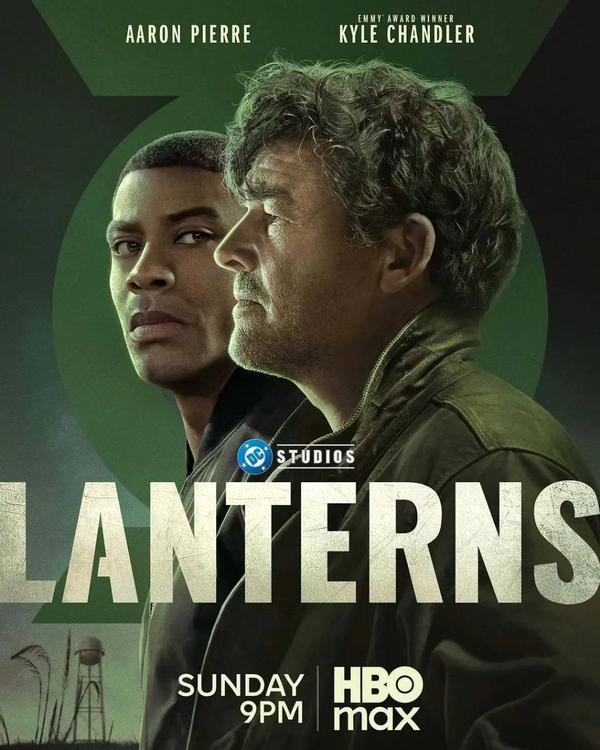

---

## 电影蜘蛛侠崭新之日

[2026-10-06 23:23] 来自：海外影视资源频道(夸克、阿里、百度)

名称：电影：蜘蛛侠：崭新之日 Spider-Man: Brand New Day (2026)

描述：彼得·帕克（汤姆·霍兰德 饰）自愿让全世界遗忘自己，转眼已是四年。失去挚友、挚爱与亲人的陪伴，他独自重返街头，以全职蜘蛛侠的身份坚守使命，守护整座城市。

夸克网盘：https://pan.quark.cn/s/b8871ed89180

百度网盘：https://pan.baidu.com/s/1VaGBVm6u20kT8dzqVekZGg?pwd=x89q

📁 大小：N

🏷 标签：#电影 #蜘蛛侠：崭新之日

---

## 大卫戈尔的一生

[2026-10-06 16:28] 来自：海外影视资源频道(夸克、阿里、百度)

名称：大卫·戈尔的一生 The Life of David Gale (2003)

描述：贝茜•布鲁姆（凯特温斯莱 Kate Winslet饰）是纽约某新闻杂志的知名记者，她接到了一个任务是去采访一名死刑犯大卫•戈尔（凯文•斯帕西 Kevin Spacey 饰）。戈尔的罪名是强奸并谋杀了康丝坦斯•哈拉维，并将于周五下午6点被处以死刑，那么布鲁姆将要采访并记录的就是戈尔人生最后的三天，而此前戈尔拒绝了一切采访。

夸克网盘：https://pan.quark.cn/s/b9d0359654c1

📁 大小：NG

🏷 标签：#剧情 #悬疑 #犯罪

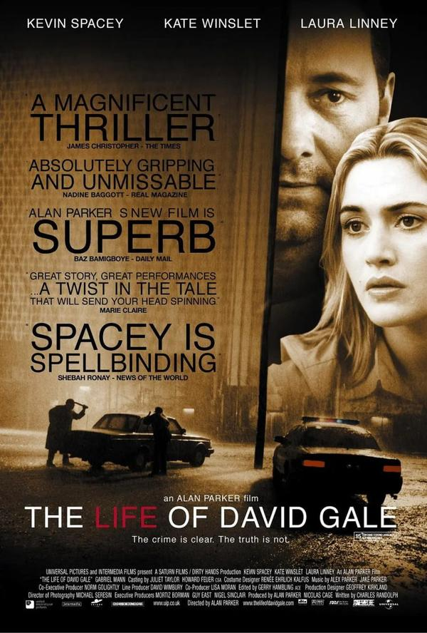

---

## RAILWAYS

[2026-10-06 16:08] 来自：海外影视资源频道(夸克、阿里、百度)

名称：RAILWAYS 给不能传达爱的大人们 RAILWAYS 愛を伝えられない大人たちへ (2011)

描述：平凡小镇富山，年近60的泷岛彻（三浦友和 饰）是一名有着42年驾驶经验的资深电车司机。他保持着35年无故障的记录，一心扑在工作的同时则忽略了与家人的交流。再过一个月泷岛将迎来退休的时刻，他一面计划着退休后和妻子佐和子（余贵美子 饰）的悠闲度假生活，一面又百感交集，恋恋不舍这个奉献毕生的岗位。然而佐和子却向他提出希望重返护士岗位的要求，本就心存芥蒂的二人为此大吵，佐和子更是愤而出走。

夸克网盘：https://pan.quark.cn/s/37cd6e63456f

📁 大小：NG

🏷 标签：#剧情 #家庭

---

## 超级少女

[2026-10-06 12:14] 来自：海外影视资源频道(夸克、阿里、百度)

名称：【原盘】超级少女 (2026) 4K REMUX HDR 杜比视界 内封简繁字幕

描述：当一位冷酷无情、突如其来的劲敌突袭家园，卡拉·佐-艾尔（米莉·阿尔柯克 饰）——也就是“超级少女”——不得不与一位意想不到的同伴结盟，横跨星际，踏上一段交织复仇与正义的壮阔征途。

影片改编自DC漫画《超级少女：明日之女》。

夸克网盘：https://pan.quark.cn/s/6d9b7ec716ff

百度网盘：https://pan.baidu.com/s/1AveR12hK319B8fmKZjTC0g?pwd=76ou

📁 大小：57.6GB

🏷 标签：#超级少女 #动作 #科幻 #奇幻

---

## 蜘蛛侠崭新之日

[2026-10-06 00:48] 来自：海外影视资源频道(夸克、阿里、百度)

名称：蜘蛛侠：崭新之日 (2026) 4K HDR & Dv 内封简繁字幕

描述：彼得·帕克（汤姆·霍兰德 饰）自愿让全世界遗忘自己，转眼已是四年。失去挚友、挚爱与亲人的陪伴，他独自重返街头，以全职蜘蛛侠的身份坚守使命，守护整座城市。然而，日益沉重的责任与无尽压力，意外引发了一场骇人的身体异变，直接威胁到蜘蛛侠的生命，迫使他向“绿巨人”班纳博士寻求帮助。与此同时，多方邪恶势力趁虚而入，纽约再度陷入危机。面对前所未有的强敌，蜘蛛侠能否绝境破局，完成破茧重生？

夸克网盘：https://pan.quark.cn/s/963cce7978ef

百度网盘：https://pan.baidu.com/s/1uxIvR6_GaHdwPedQtQ8KHQ?pwd=91nd

📁 大小：25.3GB

🏷 标签：#蜘蛛侠 #崭新之日 #漫威 #科幻 #动作 #冒险 #苹果

---

## 杀人者的购物中心

[2026-10-05 23:58] 来自：海外影视资源频道(夸克、阿里、百度)

名称：杀人者的购物中心 第二季 (2026) 4K HDR10 全8集完结 内封简繁字幕

描述：购物中心即将重新开张！

郑进湾（李栋旭 饰）和郑智安（金慧峻 饰）叔侄档再度联手，制作规模、动作场面全部疯狂升级。玄理、冈田将生强势加盟，化身空降雇佣兵组织“巴比伦”的新成员，誓要彻底剿灭叔侄二人！前有宿敌贝尔，后有“巴比伦”步步进逼，两叔侄会点样杀出一条血路？一切未解之谜，即将震撼揭晓。杀人者的购物中心2

夸克网盘：https://pan.quark.cn/s/394019e772b5

百度网盘：https://pan.baidu.com/s/1vlFiRRY7x83F7-iCXzUb-Q?pwd=6t26

📁 大小：40.9GB

🏷 标签：#剧情 #悬疑 #动作 #迪士尼 #杀人者的购物中心2 #韩剧

---

## 现在不是出轨的问题

[2026-10-05 23:58] 来自：海外影视资源频道(夸克、阿里、百度)

名称：现在不是出轨的问题 (2026) 1080P 全8集 内封简繁字幕

描述：这是一部黑色喜剧，讲述了一对因出卖家庭而走红的网红夫妇，以及一对正在经历混乱离婚诉讼的邻居医生夫妇，随着他们卷入一个无法控制的秘密，一系列冲突不断升级，甚至连婚外情都显得微不足道。

夸克网盘：https://pan.quark.cn/s/eba7a6d01641

百度网盘：https://pan.baidu.com/s/1mrlmYe11ik9uH6ribBC5Sg?pwd=BE89

📁 大小：25.3GB

🏷 标签：#现在不是出轨的问题 #剧情 #惊悚 #韩剧

---

## 求救信号

[2026-10-05 23:57] 来自：海外影视资源频道(夸克、阿里、百度)

名称：求救信号 (2026) 4K HDR & Dv 内封简中字幕

描述：在冷战高峰期，自视甚高的美国海军飞行员Troy 'Assassin' Kelly上尉飞到苏联去执行秘密任务，然而任务崩了，他一个人被困在敌后方，被性情暴躁、喜好美国文化的前克格勃特工Nikolai Ustinov发现。Troy以为自己完了，但是他们之间出人意料的结盟，是否会让Troy获救，以及发展出一段双方都没想到的情谊？

夸克网盘：https://pan.quark.cn/s/32dea49da411

百度网盘：https://pan.baidu.com/s/12r1W3Uk0GERs74l35oGjRw?pwd=fzA7

📁 大小：19.5GB

🏷 标签：#求救信号 #动作 #冒险 #苹果

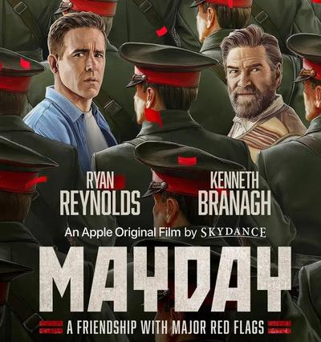

---

## 百年孤独

[2026-10-05 23:57] 来自：海外影视资源频道(夸克、阿里、百度)

名称：百年孤独 第二季 (2026) 4K HDR10 全8集  内封简繁字幕

描述：马孔多迎来了艰难的时刻，乌苏拉·伊瓜兰的诅咒成真，和平越来越难维持……

该剧改编自诺贝尔文学奖得主加西亚·马尔克斯的同名小说。

夸克网盘：https://pan.quark.cn/s/ec7130202597

百度网盘：https://pan.baidu.com/s/1ue9bkQdMggieshTyiHV0ZQ?pwd=U246

📁 大小：64.4GB

🏷 标签：#剧情 #历史 #奇幻 #百年孤独 #哥伦比亚剧 #NF

---

## 玩具总动员5

[2026-10-05 23:55] 来自：海外影视资源频道(夸克、阿里、百度)

名称：【原盘】玩具总动员5 (2026) 1080P REMUX 外挂简中字幕

描述：本部续作中，胡迪、巴斯光年、翠斯等“元老级”玩具将跟随小主人邦妮的成长脚步，共同迎接数字时代下的全新挑战。随着无所不能的科技产品逐渐走进童年世界，一批充满科技感的崭新角色也随之重磅亮相：青蛙造型的智能平板小荷、憨态可掬的导航玩具小不丢、活力十足的抓拍好手小拍侠，以及自带笑点的臭屁小机灵。

夸克网盘：https://pan.quark.cn/s/972e741da22b

百度网盘：https://pan.baidu.com/s/1Co6pRXIhuxntXCH_b8Zcmw?pwd=62PQ

📁 大小：30.6GB

🏷 标签：#玩具总动员 #剧情 #喜剧 #苹果

---

## 银河护卫队2

[2026-10-05 18:53] 来自：海外影视资源频道(夸克、阿里、百度)

名称：【原盘】银河护卫队2 (2017) 4K REMUX 国英多音轨 外挂简英双语字幕

描述：火箭浣熊（布莱德利·库珀 Bradley Cooper 配音）偷走了大祭司阿耶莎（伊丽莎白·德比齐 Elizabeth Debicki 饰）的能量电池，包括星爵（克里斯·帕拉特 Chris Pratt 饰）、卡魔拉（佐伊·索尔达娜 Zoe Saldana 饰）、德拉克斯（戴夫·巴蒂斯塔 Dave Bautista 饰）在内的一行人遭到了后者派出的舰队的袭击。一个神秘人物乘坐着飞船救下了银河护卫队的众人，而驾驶着飞船的不是别人，竟然正是星爵的亲生父亲伊戈（库尔特·拉塞尔 Kurt Russell 饰）。在伊戈的带领下，星爵、卡魔拉和德拉克斯来到了由伊戈一手制造的星球上，而剩下的成员们则着手修复损坏的飞船。那边厢，阿耶莎委托勇度（迈克尔·鲁克 Michael Rooker 饰）抓住星爵替自己报仇，而卡魔拉亦渐渐发现了伊戈和善面目下隐藏的巨大阴谋。

夸克网盘：https://pan.quark.cn/s/0ca2ab050e9f

百度网盘：https://pan.baidu.com/s/1QgvrUk_LR6ecFBsHbqtJHg?pwd=98ca

📁 大小：55.8GB

🏷 标签：#动作 #科幻 #冒险 #银河护卫队2

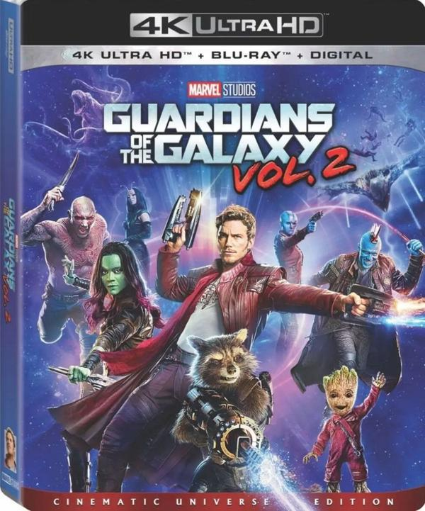

---

## 欢欢仙子

[2026-10-05 18:50] 来自：海外影视资源频道(夸克、阿里、百度)

名称：欢欢仙子 (1990) 1080P 全47集 内封简繁字幕

描述：欢欢（笠原弘子 配音）是出生在仙子之国的小公主，在她满十二周岁那一年，全国上下举办了盛大的宴会为欢欢庆祝生日，而根据仙子之国的规定，欢欢必须离开自己的家乡前往人间修行。修行的内容很简单，就是在人间散播幸福的种子，彩虹谷的鲜花能够计算幸福的计量，当计量到达顶峰时，花朵变回转变成为美丽的彩虹色，欢欢才算通过了试炼。就这样，欢欢来到了人间，结识了温柔善良贤惠文静的小玉（玉川纱己子 配音）、拥有恐高症但是在危急时刻总能够做出正确的选择的小左（佐佐木望 配音）等人，他们和哈普姑妈（丸山裕子 配音）一起经营着幸福商店。

夸克网盘：https://pan.quark.cn/s/947533bbd19d

百度网盘：https://pan.baidu.com/s/1Bf51-LQLgabF-gOlVmvTEA?pwd=m47w

📁 大小：72.8GB

🏷 标签：#欢欢仙子 #喜剧 #家庭 #日漫

---

## 可塑性记忆

[2026-10-05 18:48] 来自：海外影视资源频道(夸克、阿里、百度)

名称：可塑性记忆 (2015) 1080P 全13集 外挂简繁字幕

描述：故事发生在科技飞速发展的未来世界，彼时，人工智能机器人早已经不是罕见之物，正慢慢地融入人类的生活之中。高考落榜之后，18岁的青年水柿司（内匠靖明 配音）在父母的帮助下来到了SAI社工作，SAI社的主要产品即是名为“GIFTIA”的人形智能机器人。水柿司被安排到了终端部门工作，来到办公室后水柿司才发现，这个部门的主要职责竟然是回收即将报废的机器人。在这里，水柿司结识了名为艾拉（雨宫天 配音）的少女，她其实正是一名机器人，艾拉外表冷漠不善言其，却有着意外可爱的一面。就这样，水柿司和艾拉成为了工作中的搭档，两人之间渐渐产生了真挚的友谊。

夸克网盘：https://pan.quark.cn/s/01d4f9235dc8

百度网盘：https://pan.baidu.com/s/1uwK7N6Gb5UK-Azfc9zYMMg?pwd=h7e8

📁 大小：9.5GB

🏷 标签：#可塑性记忆 #剧情 #爱情 #日漫

---

## 黑色诡计操控审判的辩护人

[2026-10-05 18:37] 来自：海外影视资源频道(夸克、阿里、百度)

名称：黑色诡计～操控审判的辩护人 (2026) 1080P 全11集 内封简繁字幕

描述：本作是一部完全原创的律政娱乐作品，讲述了“捏造天才”且能力卓越的律师·浦真鷲直人，为对抗巨大权力为了逃避罪行而捏造的“谎言”，自己也以巧妙的“谎言”为武器揭露真相的故事。描绘了一位不择手段拯救委托人的黑暗英雄形象。

夸克网盘：https://pan.quark.cn/s/73769952cbb6

百度网盘：https://pan.baidu.com/s/18Ps7DlsZuC9CtuiLX9I7kA?pwd=3u5n

📁 大小：8GB

🏷 标签：#黑色诡计～操控审判的辩护人 #剧情 #悬疑 #日漫

---

## 永生守卫

[2026-10-05 12:11] 来自：海外影视资源频道(夸克、阿里、百度)

名称：永生守卫 The Old Guard (2020)

描述：一个名叫安迪（查理兹·塞隆饰）的战士领导了一个关系紧密的秘密雇佣兵团体，他们具有神秘的不死之身，为了保护凡人世界而战斗了几个世纪。但团队在受雇执行紧急任务时突然暴露了他们不寻常的能力，他们要依靠安迪和新加入的士兵奈尔（琪琪·莱恩饰），帮助团队消除那些不择手段要复制他们的能力并从中获利的人所带来的威胁。

夸克网盘：https://pan.quark.cn/s/255955d6c486

📁 大小：NG

🏷 标签：#动作 #奇幻

---

## 黑玫瑰公寓

[2026-10-05 02:36] 来自：海外影视资源频道(夸克、阿里、百度)

名称：【原盘】黑玫瑰公寓 (1969) 1080P REMUX 内封简繁特效字幕

描述：荒凉的海边，迎来了一位不速之客。她名叫凉子（丸山明宏 饰），真实姓名以及过往经历完全不详，在一家名为“黑蔷薇公馆”的私人俱乐部的老板邀请下，凉子来此驻唱。她每晚8点准时出现，充满魔性的歌声牵引着所有男人的心弦。然而，无论学者、政客还是富豪，没有一人能令凉子动心。它永远拿着一枝人造的黑色蔷薇，并且声称只有真正的爱情降临时，这支蔷薇才会变成红色。为过多久，接连有陌生男人来到公馆，他们似乎都与凉子有过一段难以忘怀的过去，而他们口中的凉子似乎又有着截然不同的性格。这些人中，有的为她命丧黄泉，他们的鲜血染红了凉子手中的黑蔷薇……

本片片头题字和画作由横尾忠则完成。

夸克网盘：https://pan.quark.cn/s/68a9a35d226b

百度网盘：https://pan.baidu.com/s/16DD7Z6-8n-VW5X82B33uhg?pwd=802a

📁 大小：19.8GB

🏷 标签：#黑玫瑰公寓 #剧情 #爱情

---

## 钢铁巨人

[2026-10-05 02:11] 来自：海外影视资源频道(夸克、阿里、百度)

名称：【原盘】钢铁巨人 (1999) 1080P REMUX 内封简/繁英双语特效字幕

描述：往日平静的洛克威小镇，近来怪事不断，先是农家被毁、车子损坏等。一天晚上，发电厂也遭到了破坏，导致全镇停电，引起了全镇居民的恐慌。小男孩霍加斯（艾力·马伦斯奥 Eli Marienthal 配音）觉得迹象很可疑，于是沿着电缆线走到了建在森林中的发电厂，发现了凶手——钢铁巨人（范·迪塞尔 Vin Diesel 配音）。开始霍加斯被钢铁巨人巨大的身躯吓坏了，但发现他被高压电缆线缠住，无法脱身。霍加斯没有打算将此事向大人们报告，而是打算救他出来，在多日的交往过程中，霍加斯发现他其实有颗善良的心，两人成了好朋友。钢铁巨人以铁为食，每天要消耗大量的铁，供不应求，霍加斯只好带他去狄恩（小哈里·康尼克 Harry Connick Jr.）旧车厂。 另一方面，政府派来了肯特（克里斯托弗·麦克唐纳 Christopher McDonald 配音），追查铁巨人的下落，并到处散播谣言。最后巨人被肯特发现，派出大量的军队来摧毁他，完全不顾小镇居民的安危，错误的将原子弹的发射了出去，钢铁巨人在危机关头将会如何解决危机……

夸克网盘：https://pan.quark.cn/s/73e035935d1f

百度网盘：https://pan.baidu.com/s/1wmDcfERd1RhgyD3uO2ZkPg?pwd=23ob

📁 大小：21.1GB

🏷 标签：#钢铁巨人 #喜剧 #动作 #奇幻 #动画

---

## 不虐待我的继母与继姐

[2026-10-05 02:03] 来自：海外影视资源频道(夸克、阿里、百度)

名称：不虐待我的继母与继姐 (2026) 1080P 全12集 内封简繁字幕

描述：中村美冶是某个名家的庶女，她与母亲两人过着贫困却幸福的日子。然而某一天，她最爱的母亲过世，她也因此被接回了本家鸿藏家。而在那里等待着美冶的，是继母昭瑠，以及继姐茉里香与爱里沙。“继母和继姐们肯定很厌恶妾室的孩子……不管会被怎么对待都放马过来吧！”虽然美冶已经做好了心理准备，但本该令人畏惧的继母和继姐们……居然“完全不虐待我”！？既温柔又温暖，与新家人共度的日子将治愈你的心。温馨的反差喜剧现在开幕！

夸克网盘：https://pan.quark.cn/s/ee130a5aa379

百度网盘：https://pan.baidu.com/s/1en0mtw2w41X4xTXHeUW5fQ?pwd=9343

📁 大小：8GB

🏷 标签：#不虐待我的继母与继姐 #剧情 #喜剧 #日漫

---

## 德拉克的回归

[2026-10-04 22:09] 来自：海外影视资源频道(夸克、阿里、百度)

名称：德拉克的回归 Drak sa vracia (1968)

描述：与Stefan Uher和Elo Havatta一样，Eduard Grecner也是60年代斯洛伐克新浪潮电影的缔造者之一。他的三部影片《一周七天》（1964）《尼绒月亮》（1965）和这部《徳拉克的回归》都是斯洛伐克新浪潮电影的代表作。这部叙事方法独特带有明显意识流风格的黑白影片甚至间接影响到了后来法国导演格里耶在捷克拍摄的两部影片《说谎的人》和《Eden and After》。

夸克网盘：https://pan.quark.cn/s/fce49b7b9867

📁 大小：NG

🏷 标签：#剧情

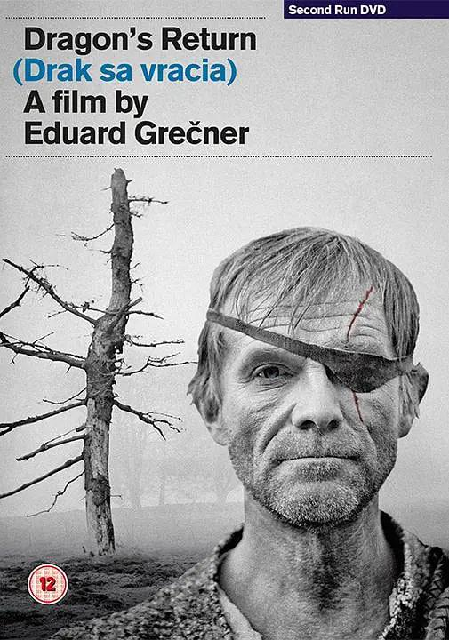

---

## 无主之地

[2026-10-04 22:03] 来自：海外影视资源频道(夸克、阿里、百度)

名称：无主之地 Borderlands (2024)

描述：莉莉丝（凯特·布兰切特 Cate Blanchett 饰）是一个有着神秘过去的赏金猎人，她被迫回到家乡——银河系中最混乱的潘多拉星球，任务是找到阿特拉斯（埃德加·拉米雷兹 Édgar Ramírez 饰）失踪的女儿。

夸克网盘：https://pan.quark.cn/s/4027a9d9967b

📁 大小：NG

🏷 标签：#喜剧 #动作 #科幻 #惊悚 #冒险

---

## 捕蝇纸

[2026-10-04 21:45] 来自：海外影视资源频道(夸克、阿里、百度)

名称：捕蝇纸 Flypaper (2011)

描述：男主人公特里普（帕特里克·德姆西 Patrick Dempsey饰）来到银行换钱，刚跟女柜员凯琳（艾什莉·贾德 Ashley Judd饰）搭上话，却悲催的碰到银行被打劫。银行保安系统开启，所有人都成了笼中之鸟。而更巧合的是居然有两伙抢劫犯。由此一段阴差阳错中展开的猫鼠大战拉开序幕。无辜的人质跟笨拙的劫匪间处处周旋，波澜中高潮不断。

夸克网盘：https://pan.quark.cn/s/bdc61c94da58

📁 大小：NG

🏷 标签：#喜剧 #悬疑 #犯罪

---

## 异教徒

[2026-10-04 21:17] 来自：海外影视资源频道(夸克、阿里、百度)

名称：异教徒 Heretic (2024)

描述：两名女传教士被引诱到一个古怪危险的男人家里，试图改变他的信仰，开启了一场猫捉老鼠的游戏。

夸克网盘：https://pan.quark.cn/s/94378a0f0900

📁 大小：NG

🏷 标签：#惊悚 #恐怖

---

## 用甜酒漱口

[2026-10-04 21:05] 来自：海外影视资源频道(夸克、阿里、百度)

名称：用甜酒漱口 甘いお酒でうがい (2020)

描述：本作以虚构的40多岁单身女性川嶋佳子所写日记著成的小说为蓝本，描绘了在某家公司作为派遣员工工作的佳子（松雪泰子）悲喜交加的日常生活。

夸克网盘：https://pan.quark.cn/s/fe9dbb91148b

📁 大小：NG

🏷 标签：#剧情

---

## 凭你也想讨伐魔王被勇者小队逐出队伍只好在王都自在过活

[2026-10-04 19:49] 来自：海外影视资源频道(夸克、阿里、百度)

名称：「凭你也想讨伐魔王？」被勇者小队逐出队伍，只好在王都自在过活 (2026) 1080P 全12集 繁中特效硬字幕

描述：「……我，能活下去的」 尽管能力为零，仍被选入勇者队伍的芙拉姆。 唯一拥有的是名为“反转”的难以理解的能力。 果然，在战斗中没什么卵用，但她仍不畏惧。 作为天才的有名贤者吉恩很是讨厌并总是欺负为了保持队伍的活力而工作的她，最后她被强行卖给了奴隶商人。 那个奴隶商会也继续虐待着芙拉姆，最终，出于余兴，她被丢给凶恶的怪物当作盘中餐。 但是，在得到装备并将身体变得黏糊融化的“诅咒之大剑”的瞬间，她的人生“反转”了。

夸克网盘：https://pan.quark.cn/s/c343e3c6cbe3

百度网盘：https://pan.baidu.com/s/1tLLrR8luxwTnpiY0i4rGsA?pwd=my26

📁 大小：8.1GB

🏷 标签：#凭你也想讨伐魔王 #奇幻 #冒险 日漫

---

## 当幸福来敲门

[2026-10-04 17:57] 来自：海外影视资源频道(夸克、阿里、百度)

名称：【原盘】当幸福来敲门 (2006) 1080P REMUX 国英多音轨 内封简/繁英双语特效字幕

描述：克里斯•加纳（威尔·史密斯 Will Smith 饰）用尽全部积蓄买下了高科技治疗仪，到处向医院推销，可是价格高昂，接受的人不多。就算他多努力都无法提供一个良好的生活环境给妻儿，妻子（桑迪·牛顿 Thandie Newton 饰）最终选择离开家。从此他带着儿子克里斯托夫（贾登·史密斯 Jaden Smith 饰）相依为命。克里斯好不容易争取回来一个股票投资公司实习的机会，就算没有报酬，成功机会只有百分之五，他仍努力奋斗，儿子是他的力量。他看尽白眼，与儿子躲在地铁站里的公共厕所里，住在教堂的收容所里…… 他坚信，幸福明天就会来临。

夸克网盘：https://pan.quark.cn/s/a10976888f60

百度网盘：https://pan.baidu.com/s/1jk-x50onsWQ6dC_8HiJX8w?pwd=z98x

📁 大小：27.1GB

🏷 标签：#剧情 #家庭 #传记 #当幸福来敲门

---

## 伊甸园之东

[2026-10-04 01:12] 来自：海外影视资源频道(夸克、阿里、百度)

名称：伊甸园之东 (2026) 4K SDR 全7集 内封简中字幕

描述：讲述特拉斯克家族跨越几代的故事，这次更将焦点放在令人难忘的反英雄人物凯西（弗洛伦丝·皮尤 饰）身上。该剧改编自约翰·斯坦贝克的同名经典小说。这部剧集对史坦贝克的经典之作进行了全新诠释，讲述特拉斯克家族跨越数代的传奇故事，特别聚焦于那个难以磨灭的反英雄人物——凯茜·埃姆斯。

夸克网盘：https://pan.quark.cn/s/f7543c13341f

百度网盘：https://pan.baidu.com/s/1_o53VjGItPPqB30aUR9OjQ?pwd=d809

📁 大小：46.2GB

🏷 标签：#伊甸园之东 #剧情 #美剧 #NF

---

## 痴迷

[2026-10-04 00:56] 来自：海外影视资源频道(夸克、阿里、百度)

名称：【原盘】痴迷 (2026) 4K REMUX HDR 杜比视界 内封简/繁英双语特效字幕

描述：在折断神秘的“心愿柳”以赢得暗恋对象的心之后，一个对爱情充满幻想的人如愿以偿地得到了自己想要的一切，但很快他发现，有些欲望需要付出黑暗而可怕的代价。

夸克网盘：https://pan.quark.cn/s/b9a2db06a557

百度网盘：https://pan.baidu.com/s/1sdb9wmBIvkExh0hN0ja88w?pwd=t7wl

📁 大小：51.6GB

🏷 标签：#痴迷 #恐怖 #悬疑 #AMZN

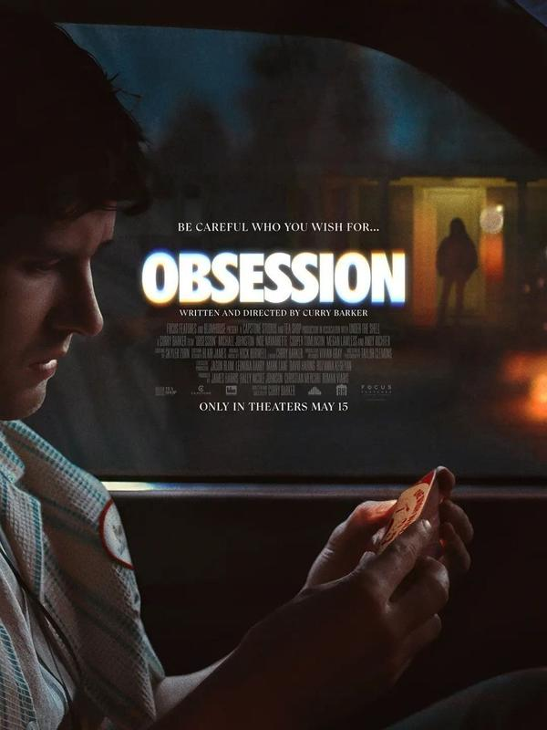

---

## 穿普拉达的女王2

[2026-10-04 00:53] 来自：海外影视资源频道(夸克、阿里、百度)

名称：【原盘】穿普拉达的女王2 (2026) 4K REMUX HDR 杜比视界 内封简英双语特效字幕

描述：随着传统出版业的式微，时尚女王米兰达在职业生涯中迎来新挑战。她不得不与手握广告预算的曾经的助理，如今已是奢侈品牌集团高管的艾米莉正面交锋。两人在行业变局中展开了一场关乎权力与生存的较量。时尚女魔头

夸克网盘：https://pan.quark.cn/s/877b94439d7f

百度网盘：https://pan.baidu.com/s/1k-B6PNA7fC49j5uE6utdfg?pwd=5a19

📁 大小：46.7GB

🏷 标签：#穿普拉达的女王 #剧情 #喜剧 #苹果

---

## 河狸变身计划

[2026-10-04 00:50] 来自：海外影视资源频道(夸克、阿里、百度)

名称：【原盘】河狸变身计划 (2026) 4K REMUX DV HDR 内封简英双语特效字幕

描述：梅宝是一位对动物世界充满好奇的年轻女孩，她利用先进的意识上传技术，将自己的思维注入一只机械河狸体内。以这种独特的形态，梅宝结识了河狸王国的乔治国王等动物伙伴。然而，一个由房地产开发计划带来的威胁，正试图破坏动物们的栖息地。梅宝与她的新朋友们联手，利用机械河狸的能力和人类的智慧，共同对抗这个危机，守护动物们的家园。

夸克网盘：https://pan.quark.cn/s/75030c2870e9

百度网盘：https://pan.baidu.com/s/1G5U32EtVa8IqTeb2gcIS9g?pwd=b5p9

📁 大小：48.1GB

🏷 标签：#河狸变身计划 #喜剧 #科幻 #动画 #迪士尼

---

## 信使

[2026-10-03 22:23] 来自：海外影视资源频道(夸克、阿里、百度)

名称：信使 The Courier (2020)

描述：《信使》描述葛雷维尔（本尼迪克特·康伯巴奇 饰）在冷战期间与苏联线人欧列格潘科夫斯基(Oleg Penkovsky)，暗中协助中情局渗透苏联的核子计划，并提供了成功阻止古巴导弹危机的重要情报。

夸克网盘：https://pan.quark.cn/s/ea90668fd8e3

📁 大小：NG

🏷 标签：#剧情 #惊悚

---

## 铁血战士2

[2026-10-03 22:09] 来自：海外影视资源频道(夸克、阿里、百度)

名称：铁血战士2 Predator 2 (1990)

描述：洛杉矶最近黑帮的团伙成员一个个被人残忍杀害，警局认为黑帮火拼又开始了。于是派出探员麦克（丹尼•格洛弗 Danny Glover 饰）去调查这次事件，并将凶徒乘之于法。不料麦克出师不利，反遭这些凶徒袭击，差点丧命。凶徒能杀人于无形，具有隐身的能力。

夸克网盘：https://pan.quark.cn/s/a34f24ab1301

📁 大小：NG

🏷 标签：#动作 #科幻 #恐怖

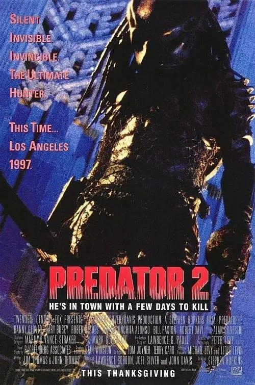

---

## 野草蔓生

[2026-10-03 21:48] 来自：海外影视资源频道(夸克、阿里、百度)

名称：野草蔓生 River of Grass (1994)

描述：《草之河》拥有传统公路电影的所有元素：一辆车、一把枪、犯罪计划，以及一对年轻的恋人，他们正在逃离愤怒的父亲，而父亲恰好也是一名被停职的警察。但编剧兼导演凯利·赖克哈特却采用了这些熟悉的元素，塑造了一部反公路电影，一部面无表情的电影，更像是存在主义喜剧，而不是犯罪片。

夸克网盘：https://pan.quark.cn/s/96f4b35fa5db

📁 大小：NG

🏷 标签：#剧情

---

## 告白第25年的秘密

[2026-10-03 12:34] 来自：海外影视资源频道(夸克、阿里、百度)

名称：告白：第25年的秘密 (2026) 4K 全10集 内封简繁字幕

描述：雪村爽太(松村北斗 饰)自幼因一次相遇，对一名女性怀有长达25年的感情。他始终不曾表白，而是在暗中守望，甚至刻意制造“偶然”接近对方。随着两人再次产生交集，他平静的日常开始变得危险而失控。这份情感究竟是纯爱还是执念逐渐失衡？与此同时，一起25年前的惨烈事件与隐藏的秘密逐渐浮出水面，将两人的命运紧紧相连。在爱与疯狂交织之中，一场跨越岁月的真相缓缓揭开。

夸克网盘：https://pan.quark.cn/s/914820caf7c1

百度网盘：https://pan.baidu.com/s/17W2YvZiBBrfXYU0hP-R9Og?pwd=ejwb

📁 大小：17.9GB

🏷 标签：#告白：第25年的秘密 #剧情 #爱情 #日剧

